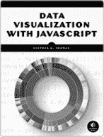
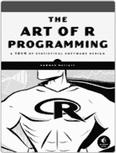
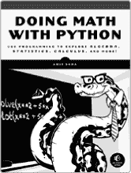

## 索引

### 符号和数字

`&`（逐元素与运算符），65，319

`&&`（单一比较与运算符），65

`<-`（箭头）符号，用于赋值，22，28

`<`（小于）运算符，61，386

`<=`（小于或等于）运算符，61

`>`（大于）运算符，61，386

`>=`（大于或等于）运算符，61

`*`（星号）

作为交叉因子符号，517，520，524

作为乘法运算符，17，49

`\`（反斜杠），74，76

`\\` 转义序列，用于反斜杠，76

`\"` 转义序列，用于双引号，76

`\b` 转义序列，用于退格，76

`\n` 转义序列，用于换行，76

`\t` 转义序列，用于制表符，76

`{ }`（花括号），666

`^`（指数运算符），17

`:`（冒号）

用于创建数字序列，24

用于分组变量，446，516，524

`::`（双冒号），用于指定函数版本，253

`:=` 运算符，624–625

`$`（美元符号）运算符，92，256，461

`.~.` 符号，534，535，539

`"`（双引号），7，73

`=`（等号），21–22

`==`（等于）运算符，61

!（阶乘运算符），333

`!`（非运算符），65，107

`!=`（不等于）运算符，61

`/`（正斜杠）

用于除法，17

用于文件路径，7

`#`（井号）

用于注释，6

用于十六进制颜色代码，632

∞（无穷大），104–106

`-`（减法运算符），17，49

·（矩阵乘法），488

≠（不等于符号），386，459

`()`（圆括号），17，19，601

`%>%`（管道）运算符，624

`%*%`（矩阵乘法运算符），50

`|`（逐元素或运算符），65，452

`||`（单一比较或运算符），65

`+`（加法运算符），17

`??` 命令, 10

`;`（分号）, 666

`[]`（方括号）。*参见* 方括号（`[]`）

`~`（波浪号）, 299, 445, 490

2D 圆形, 721–723

3D 锥体, 725

3D 圆柱体, 723–725

3D 图表。*参见* 3D 散点图；交互式 3D 图表

3D 散点图, 649–653

基本语法, 649–650

可视化增强, 650–653

### A

*α*（显著性水平）, 387

`abline` 函数, 134, 137, 456, 525

`add1` 函数, 533, 571

`add_axis` 函数, 626, 628, 629, 630

加法, 17, 18

矩阵的, 49–50

加法效应, 468

`add_legend` 函数, 626, 628, 629, 630

`add.smooth` 参数, 552

`adjust` 参数, 628

`adjustcolor` 命令, 612–613, 643–645, 665

调整后的度量, 460

`Adjusted R-squared`（决定系数）, 460, 548

高级图表自定义。*参见* 自定义图表；绘图

美学映射，配合几何图形, 143–146

`aggregate` 函数, 444, 446–447, 450

AIC（赤池信息量准则）, 541–548

`AIC` 函数, 542

`airquality` 数据框, 614, 615, 617, 653, 676, 698

赤池信息量准则（AIC）, 541–548

算法, 模型选择, 529–548

向后选择, 537–541

向前选择, 533–537

嵌套比较, 529–532

步进式 AIC 选择, 541–548

`all` 函数, 63, 64

alpha（显著性水平）, 426

`alpha` 参数, 643, 644, 701, 714

`alpha.f` 参数, 613, 643

`alternative` 参数, 391, 405

替代假设, 386

美国信息交换标准代码（ASCII），160

方差分析。*另见* ANOVA

AND 运算符，65

Anderson-Darling 检验，438

`angle` 参数，370

匿名函数，236

`anorexia` 数据集，401

ANOVA（方差分析），435–450

Kruskal-Wallis 检验，447–450

单向，435–442

ANOVA 表格构建，439–440

使用 `aov` 函数构建 ANOVA 表，440–442

与之等价，481–483

假设和诊断检查，436–439

双向，443–447

主效应和交互作用，444–447

假设集，443–444

`anova` 函数，531，571

`any` 值，63，64

`aov` 函数，440–442，481

设置几何对象的外观常量，141–143

`apply` 函数，204–209，236，723

`args.legend` 参数，292

参数，8，222–232

默认值，设置，225–227

省略号和，176–177，228–233

懒惰求值，222–225

匹配，172–177

省略号和，176–177

精确，172–173

混合，175–176

部分，173–174

定位，174–175

缺失值检查，227–228

帮助文件中的参数部分，10

算术，18–19。*另见* 数学

算术运算符，在图表中显示，601

`array` 函数，53，58

数组，多维的，52–58

`arr.ind` 参数，71

`arrows` 函数，134，138，353，585

ASCII（美国信息交换标准代码），160

点函数，121，248

`as.matrix` 函数，124

`as.numeric` 函数，278，438，462，469，638

`asp` 参数，705

`aspect` 参数，695，705

双变量曲面上的宽高比，704–708

分配对象，21–22

`as.vector` 函数, 123–124

非对称分布, 326

`attach` 函数, 256–257

属性, 114–116

`attributes` 函数, 114–115, 117

自动绘图类型, 129–130

平均平方距离, 277

坐标轴, 577

自定义, 594–596

标签, 130–131, 299

间距, 595

刻度标记, 606

`axis` 函数, 594–595, 604

### B

`\b`（退格）转义序列, 76

*β*（类型 II 错误）, 424, 426

*β*[0]（截距）, 454

*β*[1]（斜率）, 454

反斜杠（`\`）符号, 74, 76

向后选择, 537–541

`barplot` 函数, 290–291, 316

条形图, 289–293

`base` 分布, 739

基本包, 253, 739

基本 R 图形, 139

基线假设, 386, 421

对数的底数, 19

贝叶斯信息准则（BIC）, 548

贝叶斯概率, 310

伯努利分布, 332–334

组间变异性, 440

`bg3d` 函数, 693

`bgplot3` 函数, 696, 706

偏差, 377

BIC（贝叶斯信息准则）, 548

双峰分布, 326

二元变量, 332, 468–472

线性回归模型, 470–471

来自的预测, 471–472

绑定, 矩阵, 41–42

二项分布, 333–337

`dbinom` 函数, 335–336

`pbinom` 函数, 336

`qbinom` 函数, 337

`rbinom` 函数, 337–338

二项分布随机变量, 339

二元表面, 699–708

添加点, 701

添加表面, 701–703

基本视角表面, 700

按 *z* 值着色, 703–704

处理纵横比, 704–708

函数的主体代码, 216

Bonferroni 校正, 423

`boot` 包，500，523，687，740

`border` 参数，682

`Boston` 数据框，733

`box` 函数，583

箱线图。*参见* boxplots

自定义盒子，593–594

`boxplot` 函数，298–299，606

箱线图，298–300，469–470

并排，299–300，437，448–449

独立的，298–299

花括号区域，函数的，216

花括号，用于包含命令，666

`breaks` 参数，85，295

`bty` 参数，593

内置数据集，148–149

内置调色板，635–636

`byrow` 参数，40

### C

`c` 函数，58，83

计算，控制顺序，17

调用函数，165–177

参数匹配，172–177

省略号和，176–177

精确，172–173

混合，175–176

部分，173–174

位置，174–175

范围，165–171

环境，166–168

保留和保护的名称，170–172

搜索路径，168–170

`car` 包，254，628，646，741

`Cars93` 数据框，450

大小写敏感性，7

`cat` 命令，74–75，219，244

类别预测变量，468–483

二元变量，468–472

改变参考水平，477–478

与单因素方差分析的等价性，481–483

交互

两者之间，519–521

与连续预测变量一起，515–519

高阶，523–526

多级变量，472–477

虚拟编码，472–474

线性回归模型，474–476

将类别变量作为数值处理，478–480

类别变量，262–263，490，515

映射到的方面，619–623

测试，410–420

单一类别变量，410–415

两个类别变量，415–420

类别

穷举的，410

互斥的，410

分类，通过颜色调色板进行连续体索引, 637–639

`cbind` 函数, 41–42, 98

中心极限定理（CLT）, 369, 401

中心性, 267–270

`cex`（字符扩展）参数, 129, 693, 707

`cex.lab` 参数, 599

`char` 参数, 250

字符, 72–79

字符串的连接, 74–76

转义序列, 76–77

扩展, 129

匹配, 77–79

字符串的, 73–74

子字符串和匹配, 77–79

*χ* (卡伊) 符号, 410

`ChickWeight` 数据集, 148

`chickwts` 数据框, 263, 269, 279

`chisq.test` 函数, 414–415, 419

卡方检验

分布的, 411–414

独立性, 416–419

`chorley` 数据集, 678

圆形，二维, 721–723

CIs. *参见* 置信区间 (CIs)

`citation` 命令, 748

引用 R 包, 748–749

`class` 函数, 117, 118, 119

类. *参见* 对象类

经典概率, 310

`clmfires` 数据集, 707

`close` 函数, 249–250

CLT（中心极限定理）, 369, 401

`cm.colors` 函数, 635

`coef` 参数, 518

`coef` 函数, 457

决定系数, 458, 460

`coefficients` 组件, 457

强制转换, 120–126

`col`（颜色）参数, 129, 605, 682, 693

`col2rgb` 函数, 632–634

集体方式, 477

共线性, 549, 569–572

相关预测变量，举例, 569–572

潜在的警告信号, 569

颜色, 631–648. *参见* 颜色调色板

给面板上色, 682–686

控制等值面中多个级别, 714–715

包括颜色图例, 641–643

不透明度, 643–645

在图形上, 131–132

RGB 替代方案, 645–648

RGB 十六进制颜色代码, 632–635

`color` 参数，715

颜色调色板

内置调色板，635–636

自定义调色板，636–637

用于索引连续体，637–641

通过分类，637–639

通过归一化，639–641

`colorlegend` 函数，641–643，644，647，648，651，669，675，690

`color.palette` 参数，663

`colorRamp` 函数，639，640，646，690

`colorRampPalette` 函数，636–637，639，645–646，664

`colors` 函数，131，632

`cols` 参数，633

`colSums` 函数，417

列

将矩阵绑定在一起，41–42

从矩阵中提取，43–44

组合图，333，563

命令

内置，7

滚动浏览，5

代码中的逗号，13

逗号分隔值（*.csv*），150

注释，6

`compiler` 包，739

事件的补集，312–313

完成时间，250–252

复杂度与拟合优度，527–528

一般指南，528–529

节俭原则，528

综合 R 档案网络。*参见* CRAN（综合 R 档案网络）

`compute.cont` 参数，717

字符的连接，74–76

条件概率，311

条件。*参见* `if` 语句

锥体，三维，725

置信带，507

置信区间（CIs），378–384，461–462

的解释，382–384

对于均值，378–381

对于比例，381–382

`confint` 函数，460，495

`conf.level` 参数，405，410

混杂，486

控制台面板，5–6

连续预测变量，493，515–519，521–523

连续随机变量，318–326

的累计概率分布，323–324

的均值和方差，326–329

连续体，使用颜色调色板索引，637–641

通过分类, 637–639

通过标准化, 639–641

`contour` 函数, 657–658, 661–663

等高线图, 657–668

填充颜色的等高线, 663–668

绘制等高线, 657–663

非参数双变量密度估计示例, 660–663

参数响应面, 659–660

地形图示例, 657–658

`contour3d` 函数, 713, 719

提供的数据集, 149–150

控制流机制, 209–214. *另请参见* 循环

声明 `break` 或 `next`, 209–211

`repeat` 语句, 211–214

`cook.levels` 参数, 565

Cook 距离

与残差和杠杆作用图形结合, 563–568

概述, 559–563

`cooks.distance` 函数, 561

`coord_flip` 函数, 292–293

`cor` 函数, 281–285, 453

`correct` 参数, 405

相关性, 280–285

`cos` 函数, 722

余弦函数, 720

计数, 271–273

`cov` 函数, 281–284

协方差, 280–285

协方差矩阵, 732

CRAN（综合 R 存档网络）

在上面查找包, 742

镜像链接, 737

从这里获取和安装 R, 3

切换 CRAN 镜像, 747–748

交叉因子符号 (`*`), 517, 520, 524

*.csv*（逗号分隔值）, 150

`cumsum` 函数, 316

自定义颜色调色板, 636–637

自定义绘图, 575–608

轴, 594–596

方框, 593–594

默认样式，抑制, 592–593

字体, 597–598

图形设备，处理, 576–582

关闭, 578

手动打开新的, 576–608

一个图中的多个绘图, 578–582

之间切换, 577–578

希腊符号, 598–599

数学表达式，显示, 599–601

点选坐标交互, 586–591

特设注释, 588–591

静默获取坐标, 586–587

可视化选定坐标, 587–588

区域和边距, 582–586

剪裁, 584–586

自定义间距, 583–584

默认间距, 582–583

完全注解的散点图, 601–608

`cut` 函数, 638, 705

圆柱体, 3D, 723–725

### D

*.dat* 文件格式, 155

数据框, 95–102

添加数据列, 98–100

组合, 98–100

创建, 96–98

逻辑记录子集, 100–102

`data` 函数, 147

数据集, 147–150, 156–157

内建, 148–149

贡献, 149–150

数据可视化, 289–308

条形图, 289–293

箱线图, 298–300

并排箱型图, 299–300

独立箱型图, 298–299

直方图, 294–298

饼图, 293–294

散点图, 300–308

绘图矩阵, 303–308

单一图形, 301–302

`data.frame` 类, 120

`data.frame` 函数, 96, 97

`datasets` 包, 148, 263, 739

`dbeta` 函数, 363

`dbinom` 函数, 334, 335–336

`dchisq` 函数, 362, 412

调试, 244

小数位数 (d.p.), 13

`decreasing` 参数, 26, 27, 59, 60

自由度

对于卡方分布, 362

对于 *F* 分布, 363

对于 *t* 分布, 357–358

删除

从矩阵中提取元素, 44–46

从向量中提取元素, 29

分隔符，在表格格式文件中, 150

`demo(plotmath)` 演示, 601

`density` 命令, 614

密度函数, 342–363

指数分布, 359–362

`dexp` 函数, 359–360

`pexp` 函数, 360–361

`qexp` 函数, 361–362

正态分布, 348–357

`dnorm` 函数, 350

示例, 356–357

`pnorm` 函数, 350–353

`qnorm` 函数, 353–354

`rnorm` 函数, 355–356

学生 *t* 分布, 357–359

均匀分布, 343–347

`dunif` 函数，344–346

`punif` 函数，346

`qunif` 函数，346–347

`runif` 函数，347

`dependencies` 参数，743

帮助文件中的描述部分，10

`detach` 函数，255，257，740

帮助文件中的详细信息部分，10

`dev.new` 函数，576，579–580

`dev.off` 函数，157，578

`dev.set` 函数，577，578

`dexp` 函数，359–360

`df` 参数，362，412

`df` 函数，363

`df1` 参数，363

`df2` 参数，363

`d`-函数，342，344

`dgamma` 函数，363

`dgeom` 函数，342

`dget` 命令，160，161

`dhyper` 函数，342

`diabetes` 数据框，516，531，620–621，652

`diag` 命令，46，48

诊断检查，438，550

对角元素提取，558

二分变量，332

`digit` 参数，643

`digits` 参数，272

`dim` 函数，42，49，97，114，115，657

矩阵的维度，42

`dimnames` 参数，115–116，413

直接访问函数，457

离散随机变量，315–318

累积分布函数，315–317

均值和方差，317–318

离散数值变量，262

一次性函数，236

卡方分布的检验，411–414。*另见* 概率分布；抽样分布

除法，17，18

`dmultinom` 函数，342

`dmvnorm` 函数，711，713

`dnbinom` 函数，342

`dnorm` 函数，350，648，711

dodged barplot，290

美元符号（`$`）操作符，92，256，461

双冒号 (`::`), 用于指定函数版本, 253

双引号 (`"`), 7, 73

转义序列 (`\"`), 76

从源下载提示, 744

下载 R, 737–739

小数位数 (d.p.), 13

`dpois` 函数, 340–341

`dput` 命令, 160, 161

`drop1` 函数, 537, 571

`dt` 函数, 357

虚拟函数, 220

`Duncan` 数据集, 420

邓迪温度示例, 369–373

`dunif` 函数, 344–346

### E

*e*（欧拉数）, 19

`each` 参数, 25–26, 417

地震数据示例, 660–663

编辑器, 在 RStudio 中, 752–753

编辑器窗格, 5–6

元素级检查, 184–186

省略号, 参数和, 176–177, 228–233

`else` 语句, 183–184

空括号, 216

空像素, 671–679

`end` 参数, 635, 672

指数表示法, 20–21

环境, 166–168

全局, 166

局部, 167–168

包环境和命名空间, 166–167

等号 (`=`), 21–22

错误。 *参见* 异常处理

概览, 420–421

I 型错误, 421–423

本费罗尼校正, 423

模拟, 421–423

II 型错误, 424–428

错误率的其他影响因素, 426–428

模拟, 425–426

转义序列, 76–77

欧几里得空间, 720

欧拉数 (*e*), 19

评估网格, 构造, 654–655

事件, 概率和, 310

事件的补集, 312–313

两个事件的交集, 311–312

两个事件的并集, 312

精确参数匹配, 172–173

示例部分, 帮助文件, 10

Excel 文件格式, 153

异常处理, 241–248

错误和警告, 242–244

`try` 语句, 244–248

抑制警告信息, 246–248

在函数体内使用, 245–246

`exp` 函数, 19

`expand` 参数, 682, 688, 705

`expand.grid` 函数, 654–655, 659, 675, 678, 706, 709, 724

解释变量, 451, 453, 485, 490, 528, 589

显式属性, 114, 115

指数分布, 359–362

`dexp` 函数, 359–360

与指数函数对比, 361

`pexp` 函数, 360–361

`qexp` 函数, 361–362

指数函数, 19–20

指数, 17

`expression` 函数, 598–599

外部定义的辅助函数, 234–235

`extractAIC` 函数, 542

提取

向量中的元素

使用索引, 28–32

使用逻辑值, 68–72

从矩阵中, 43–44

多余的变量, 486

外推, 466

### F

`F`（`FALSE` 的缩写）, 60

*F*（累积分布函数）, 323

`facet_grid` 命令, 619–620

面板

上色, 682–686

使用多个图形, 616–623

映射到分类变量的面板, 619–623

独立图形, 616–618

`facet_wrap` 命令, 619–620

`factor` 函数, 80

因子变量, 435

因子, 79–87

组合与切割, 83–86

定义和排序水平, 82–83

识别类别, 79–81

`faithful` 数据框, 667

`FALSE` 值, 27, 60

`family` 参数, 597

`faraway` 包, 513, 516, 526, 531, 620–621, 652, 741

*F* 分布, 363

斐波那契数列, 216–218

图形边距, 582

`figure margins too large` 错误, 584

图形区域, 在绘图中, 582

图形的文件格式, 157

文件路径, 7

`file.choose` 命令, 152, 156

`filled.contour` 函数，663，666，690

`fitted` 函数，457，560

拟合模型，518，529

拟合值，458，462，551

`fitted.values` 组件，457

拟合线性模型，454

五数概括，274–275

标志向量，逻辑，68

浮动点数，117

向下取整操作，394

`font` 参数，597

字体，597–598

`for` 循环，193–200

通过索引或值进行循环，194–197

嵌套，197–200

预测，498

`foreign` 包，156，740

`formula` 参数，535

向前选择，533–537

正斜杠（`/`），7

`frac` 运算符，601

频率派概率，310

`from` 参数，24

*F*-检验，部分，529–532

`FUN` 参数，270，272，444

`function` 命令，215–222，236

创建函数，218–219

`return` 语句，220–222

函数的文档，8–10。*参见* 调用函数；编写函数

### G

`geom` 参数，296

`geom_bar` 函数，292–293

`geom_density` 函数，614–615

几何分布，342

几何平均，238

`geom_histogram` 函数，297，611

`geom_hline` 函数，145

`geom_line` 函数，142，145

`geom_point` 函数，142，145

几何形状（几何修饰符）

使用美学映射，143–146

设置外观常量，141–143

`geom_segment` 函数，145

`geom_smooth` 函数，612，613，621，630

`geom_vline` 函数，297，610

`getOption` 函数，747

`getwd` 函数，7

`GGally` 包，304，741

`ggpairs` 函数，304–306

`ggplot` 函数，609–611

`ggplot2` 包

使用 geoms 进行美学映射, 143–146

多个图形和变量映射的面板, 616–623

映射到分类变量的面板, 619–623

独立图形, 616–618

`qplot` 函数与 `ggplot` 函数, 609–611

使用 geoms 设置外观常量, 141–143

平滑和阴影, 611–615

添加 LOESS 趋势, 611–614

构建平滑密度估计，使用 KDE, 614–615

`ggsave` 函数, 159

`ggtitle` 函数, 610, 615

`ggvis` 包, 623–630, 741

全局环境, 166

`.GlobalEnv`, 253

拟合优度与复杂性, 527–528

一般指南, 528–529

简约原则, 528

图形语法, 139

图形参数, 129–134

图形用户界面。*参见* GUI (图形用户界面)

图形设备, 576–582

关闭, 578

手动打开新, 576–608

一个图形中的多个图形, 578–582

定义特定布局, 580–582

设置 `mfrow` 参数, 579–580

切换, 577–578

图形文件, 157–159

`graphics` 包, 739

图形。*参见* 绘图

`gray` 调色板, 635, 639, 677

`gray.colors` 调色板, 635, 636, 677, 690

`grDevices` 包, 739

大于运算符 (`>`), 61, 386

大于或等于运算符 (`>=`), 61

大于语句, 386

希腊字母符号, 598–599

`grep` 命令, 78

`grid` 函数, 605

`grid` 包, 739

`grid3d` 函数, 694–696

`grid.arrange` 函数, 616–618

`gridExtra` 包, 616, 617, 741

`gridsize` 参数, 717

`group_by` 函数, 628

`gsub` 函数, 78

图形用户界面 (GUI)

安装包, 744–745

概述, 4–6

### H

`HairEyeColor` 数据集, 419

井号 (`#`)

用于注释, 6

十六进制颜色代码, 632

`hatvalues` 函数，558，561，571

HCL（色调-色度-亮度），645

`hcl` 函数，645

表格格式文件中的标题，150

`heat.colors` 调色板，635，638，678，689，708

`height` 参数，579，603

帮助文件，8–10

辅助函数，233–236

外部定义，234–235

内部定义，235–236

异方差性，550，551

十六进制颜色代码，632

高维概率密度，710–711

高阶交互，523–526

高级编程语言，作为 R，3

`hist` 函数，294–297

直方图，294–298，577

同方差性，550

HSV（色调-饱和度-值），645

`hsv` 函数，645

色调-色度-亮度（HCL），645

色调-饱和度-值（HSV），645

超几何分布，342

假设检验，385–433

分类变量，410–420

单一分类变量，410–415

两个分类变量，415–420

组成部分，385–388

假设，386

*p*-值，387

显著性水平，387–388

检验统计量，387

对其的批评，388

错误，420–421

类型 I 错误，421–423

类型 II 错误，424–428

均值，388–402

单一均值，389–392

两个均值，392–402

比例，402–410

单一比例，402–405

两个比例，405–410

统计功效，428–433

功效曲线，431–433

模拟功效，429–431

### I

`I` 函数，505

`ice.river` 数据集，148

单位矩阵，48

IDE（集成开发环境），751

`id.n` 参数，552

`if` 语句，179–193

`else` 语句和，183–184

嵌套和堆叠，186–189

独立使用，180–183

`switch` 函数和，189–193

`ifelse` 函数，用于逐元素检查, 184–186

`image` 函数, 668, 672, 673, 682–683

隐式属性, 114

隐式循环, 使用 `apply` 函数, 204–209

`include.lowest` 参数, 85

独立性，卡方检验, 416–419

`INDEX` 参数, 270, 444

索引

列表的, 90–91

通过循环, 194–197

向量元素, 28–32

向量的, 30

`Inf` 函数, 104, 107

无穷大 (∞), 104–106

影响, 555–557

继承, 116

`input_` 函数, 624, 627

`input_checkbox` 函数, 626

`input_numeric` 函数, 626

`input_radiobuttons` 函数, 626

`input_select` 函数, 626

`input_slider` 函数, 624–625, 627

`InsectSprays` 数据集, 273, 306

`inside.owin` 函数, 674, 675, 678, 690

安装 R, 737–750

从 CRAN, 3

下载, 737–739

包, 739–746

基础包, 739

贡献的包, 740–746

在 CRAN 上查找, 742

提示下安装, 742–744

从 GUI 安装, 744–745

使用本地文件安装, 745–755

推荐的包, 740

更新, 746–747

使用其他镜像和仓库, 747–748

其他包仓库, 748

切换 CRAN 镜像, 747–748

`install.packages` 命令, 8, 742, 756

整数, 117–118

集成开发环境 (IDEs), 751

强度 (RGB 颜色的), 632

`interaction.plot` 函数, 446

与图坐标的交互, 点选, 586–591

临时注释, 588–591

静默获取坐标, 586–587

可视化选定坐标, 587–588

交互式 3D 图, 691–735

双变量曲面, 699–708

添加点, 701

添加曲面，701–703

基本透视曲面，700

按 *z* 值上色，703–704

处理纵横比，704–708

参数方程，720–735

数学抽象，725–735

简单轨迹，720–725

点云，691–699

添加更多 3D 组件，694–699

基本 3D 云，692–693

视觉增强和图例，693–694

三元曲面，709–719

3D 中的评估坐标，709–710

等值面，710–715

非参数三元密度示例，715–720

交互效应，443，514–515

类别和连续预测变量之间，515–519

两个类别变量之间，519–521

两个连续预测变量之间，521–523

高阶，523–526

`interactive.arrow` 函数，590，608

截距参数，估计，454–455

截距模型，542

内部定义的辅助函数，235–236

插值，480，498

四分位距（IQR），277，287

两个事件的交集，311–312

`interval` 参数，463

矩阵的反转，51–52

反函数，603

向内的刻度线，596

IQR（四分位距），277，287

`IQR` 函数，278–279

`iris` 数据框，649–650，692

is-dot 函数，119–120

`is.factor(survey$Smoke)` 函数，474

`is.finite` 函数，105

`is.infinite` 函数，105

`is.integer` 函数，125

`is.matrix` 函数，223

`is.na` 函数，109

`is.nan` 函数，107

`is.null` 函数，111

`is.numeric` 函数，125

等值面，710–715

基本一层等值面，712–714

通过颜色和不透明度控制多个层级，714–715

高维概率密度，710–711

`italic` 函数，600–601

斜体字母变量，601

迭代循环，237

### J

`jitter` 函数，276

抖动, 276

*.jpeg* 文件, 157–158

### K

*k* 类别, 410, 637

KDE（核密度估计）, 614, 660

`kde` 函数, 717, 719

`kde2d` 函数, 660, 671, 674, 678, 690

核密度估计（KDE）, 614, 660

`KernSmooth` 包, 740

按键快捷键, 6

`key.title` 参数, 664

knitr 包, 757–758

`kruskal.test` 函数, 448

Kruskal-Wallis 检验, 447–450

`ks` 包, 741

### L

标签符号，专业化, 597–601

字体, 597–598

希腊符号, 598–599

数学表达式, 599–601

`labels` 参数, 85, 557

`labs` 函数, 297

`lambda` 参数, 341

`lapply` 函数, 238

`las` 参数, 595–596

`lattice` 包, 740

`layer_densities` 函数, 628

`layer_histograms` 函数, 624, 628, 630

`layer_points` 函数, 626

图层, 53, 139

`layer_smooths` 函数, 627, 628, 630

`layout` 函数, 580, 664

`layout.show` 函数, 581

懒惰求值, 222–225

最小二乘回归, 455, 456

`left` 参数, 645

`legend` 函数, 134, 138, 232, 605

`legend3d` 函数, 693

交互式 3D 图上的图例, 693–694

`legend.text` 参数, 292

`length` 函数, 27, 80

`length.out` 值, 24, 25

小于运算符 (`<`), 61, 386

小于或等于运算符 (`<=`), 61

小于语句, 386

`letters` 对象, 655

`levels` 函数, 80, 115, 661

杠杆值, 550

计算, 555–558

与残差和库克距离结合, 563–568

说明, 555–557

库。*见* 包

`library` 命令, 7–8, 148

最佳拟合线, 458, 487

线型 (`lty`) 参数, 129, 133, 605, 659

线宽 (`lwd`) 参数, 129, 133, 659

线性模型选择与诊断

拟合优度与复杂性, 527–528

一般指导原则, 528–529

简约原则, 528

模型选择算法, 529–548

向后选择法, 537–541

向前选择法, 533–537

嵌套比较, 529–532

步进 AIC 选择法, 541–548

残差诊断, 548–568

评估正态性, 554–555

计算杠杆作用, 555–558

库克距离, 559–563

图示残差、杠杆作用和库克距离的结合, 563–568

说明离群值、杠杆作用和影响, 555–557

检查和解释残差, 549–554

线性回归。*见* 多元线性回归；简单线性回归

线条

添加到图形, 134–139

等高线, 绘制, 657–663

非参数双变量密度估计示例, 660–663

参数化响应面, 659–660

地形图示例, 657–658

图形中的线, 133

`lines` 函数, 134

`lines3d` 函数, 694, 708

`list` 命令, 92, 230

列表切片, 91

`list.files` 函数, 151

对象列表, 89–95

定义和组件访问, 89–91

命名, 91–93

嵌套, 93–95

`lm` 命令, 用于拟合线性模型, 455–456

`load` 命令, 11

加载

包, 7–8

工作空间图像文件, 11–12

本地环境, 167–168

局部加权散点平滑（LOESS），611–614

`locator` 函数, 586–587, 608, 633–634

定位, 720–725

2D 圆, 721–723

3D 锥体, 725

3D 圆柱体, 723–725

LOESS（局部加权散点平滑），611–614

`loess` 函数，612

`log` 函数，20

对数刻度，509

对数，19–20，508–512

拟合对数变换，509–511

绘制对数变换拟合，511–512

逻辑标志向量，547

逻辑运算符，64–67

逻辑值，26–27，59–72

逻辑运算符，64–67

逻辑子集和提取，68–72

作为数字，67–68

关系运算符，60–64

`TRUE` 或 `FALSE`，60

对数似然，542

循环，193–209

`for` 循环，193–200

通过索引或值进行循环，194–197

嵌套，197–200

使用 `apply` 函数的隐式循环，204–209

使用旋转，686–690

`while` 循环，200–204

下四分位数，274

下尾概率，351

下尾检验，386，394

`ls` 命令，22

`lty`（线型）参数，129，133，605，659

`lty.hplot` 参数，650

潜在变量，486

`lwd`（线宽）参数，129，133，659

### M

`main`（图表标题）参数，129

Mann-Whitney U 检验，401

`mar` 参数，582，594

边距，绘图，582–586

剪切，584–586

自定义间距，583–584

默认间距，582–583

标记工具，601

屏蔽，252–258

数据框变量区分，255–258

函数与对象的区分，252–255

质量函数，332–342，344

伯努利分布，332–334

二项分布，333–337

`dbinom` 函数，335–336

`pbinom` 函数，336

`qbinom` 函数，337

`rbinom` 函数，337–338

泊松分布，338–342

`dpois` 函数，340–341

`ppois` 函数，340–341

`qpois` 函数，341

`rpois` 函数，341–342

`MASS` 包, 254–255, 401, 450, 474, 611, 622, 629, 637, 660, 686, 697, 740

字符串中的字符匹配, 77–79

数学, 17–21, 599–601. *另见* 矩阵; 向量

算术, 18–19

e-表示法, 20–21

指数, 19–20

对数, 19–20

数学抽象, 725–735

莫比乌斯环, 726–729

圆环, 729–735

矩阵, 303–308

加法, 49–50

代数和, 47–52

绑定在一起, 41–42

定义, 39–42

删除元素, 44–47

的维度, 42

提取元素, 43–44

填充方向, 40–41

单位矩阵, 48

求逆, 51–52

乘法, 50–51

删除和覆盖元素, 44–47

运算和代数, 47–52

的标量倍数, 49

从中子集元素, 42–47

减法, 49–50

转置, 47–48

`matrix` 命令, 40, 58

`max` 函数, 268–269

`maxColorValue` 参数, 633, 643

均值

连续随机变量的, 326–329

离散随机变量的, 317–318

`mean` 函数, 9, 268–270, 453

均方（MS）, 439, 440

均方误差（MSE）效应, 440

均方组（MSG）效应, 440

均值的假设检验, 388–402

单一均值, 389–392

两个均值, 392–402

配对/依赖样本, 398–402

合并方差, 396–398

非合并方差, 393–395

`median` 函数, 268–269

成员引用, 90

`mfrow` 参数, 579–580, 581, 616, 666, 688

`mgp` 参数, 595–596

Microsoft Office Excel 文件格式, 153

`min` 函数, 268

使用镜像安装包，747–748

`misc3d`包，713，718，741

`missing`函数，227

表格式文件中的缺失值，150

莫比乌斯带，726–729

模式，326

模型诊断，548

模型选择，492，525，528

基于模型的推理，458

MS（均方），439，440

MSE（均方误差）效应，440

MSG（均方组）效应，440

`mtcars`数据框，287，290，478，503，514，521，526，653，664，669，702

`mtext`函数，584

多重共线性。*参见* 共线性

多维数组，52–58

定义，53–55

子集、提取和替换，55–58

多级变量，472–477

虚拟编码，472–474

线性回归模型，474–476

来自 476–477 的预测

多项分布，342

多重线性回归，485–526

在 R 中实现并解释，490–501

额外的预测变量，490–493

查找置信区间，495

解释边际效应，493–494

全面*F*-检验，496–498

从多重线性模型进行预测，498–501

可视化多重线性模型，494–495

交互项，514–526

概念与动机，514–515

高阶交互作用，523–526

一个分类变量，一个连续变量，515–519

两个分类变量，519–521

两个连续变量，521–523

术语，486

理论，486–489

基本示例，488–489

以矩阵形式估计，487–488

将简单模型扩展到多个模型，487

转换数值变量，501–514

对数，508–512

多项式，502–508

使用面板的多个图，616–623

将各个面映射到分类变量，619–623

独立图，616–618

`Multiple R-squared`（决定系数）， 460

多重检验问题， 423

多因素方差分析，443

矩阵乘法， 50–51

多元数据， 264–265

多元模型， 494

`mvtnorm` 包， 710， 741

### N

`\n`（换行）转义序列， 76

`NA`（不可用）值， 108–110

`names` 函数， 93， 115

命名空间， 166–167

命名对象列表， 91–93

`NaN`（非数字）值， 106–108

`na.omit` 函数， 110， 638， 653， 676， 697

`na.rm` 参数， 270， 469， 640， 684

自然对数， 19

`ncol` 参数， 40， 168， 620

`ncol` 函数， 42， 97

负二项分布， 342

负系数

类别预测变量， 468–476

连续预测变量， 454， 522

负幂， 20

负偏度， 326

嵌套

`if` 语句， 186–189

对象列表， 93–95

`for` 循环， 197–200

`newdata` 参数， 463， 471， 511， 659

换行转义序列（`\n`）， 76

`news` 函数， 746

无变化假设， 386， 421

名义变量， 262。*另见* 类别变量

非数值类型。*参见* 字符；因子；逻辑值

非参数二元密度估计示例， 660–663

非参数平滑， 611

非参数三元密度示例， 715–720

计算 3D 估计， 717

等值面选择， 717–720

正态分布， 348–357

`dnorm` 函数， 350

示例， 356–357

`pnorm` 函数， 350–353

`qnorm` 函数， 353–354

`rnorm` 函数， 355–356

归一化，使用颜色调色板进行索引连续值， 639–641

`normalize` 函数, 640, 644, 646, 651, 677

非数值 (`NaN`) 值, 106–108

不可用值 (`NA`), 108–110

非运算符, 65

帮助文件的备注部分, 10

`nrow` 参数, 40, 620

`nrow` 函数, 97, 101, 271, 675, 723

`nuclear` 数据框, 500, 533, 546, 666, 687

干扰变量, 486

空设备, 576, 580

零假设, 386, 421

空值模型, 496, 542

`NULL` 值, 110–114

数字作为逻辑值, 67–68

数值变量, 262, 515

变换, 501–514

对数, 508–512

多项式, 502–508

数值仿真, 421

### O

对象类, 116–119

多类, 119

其他数据结构, 118–119

独立向量, 117–118

面向对象编程语言, R 作为, 116

对象赋值, 21–22

观察计数, 411, 416

`oma` 参数, 582

忽略元素

来自矩阵, 44–47

来自向量, 28–33, 68–72

全面 *F* 检验, 482, 496–498

单因子分析, 435

单边语句, 386

一对一变换, 514

单因素方差分析, 443

不透明度, 643–645, 714–715

或运算符, 65

运算顺序, 18

有序变量, 262. *参见* 分类变量

正交对比, 477

`outer` 函数, 724

图表的外部区域, 582

异常值, 285–288, 555–557

覆盖元素

来自矩阵, 44–47

来自向量, 28–33, 68–72

`owin` 类, 672

### P

包环境, 166–167

包, 7

引用, 748–749

在 CRAN 上查找，742

RStudio 中的安装程序和更新程序，755–756

安装，8

使用图形用户界面（GUI），744–745

在提示符下，742–744

使用本地文件，745–755

加载，7–8

遮罩，254–255

更新，8

编写，749–750

在图上填充空白，592

`pairs` 函数，303

`palette` 函数，632

调色板。*参见* 颜色调色板

RStudio 中的窗格，定制，753–754

`par` 函数，579–580，666，688

参数，265–266

参数方程，720–735

数学抽象，725–735

莫比乌斯环，726–729

圆环，729–735

简单轨迹，720–725

2D 圆形，721–723

3D 锥体，725

3D 圆柱，723–725

参数响应面，659–660

括号 (`()`)，17，19，601

简约性，528，548

部分参数匹配，173–174

部分 *F* 检验，529–531

`paste` 函数，74–75，601

模式匹配，77–79

`pbeta` 函数，363

`pbinom` 函数，334，336

`pch`（点字符）参数，129，133，647，651，707

`pchisq` 函数，362，414

`pcol` 函数，633，634

.*pdf* 文件，157–158

PEMDAS（运算顺序），18

百分比，271–273

百分位数，274–275

`persp` 函数，680，682–683，686

`persp3d` 函数，700–706，724–731

透视图，679–690

基本绘图和角度调整，679–682

上色面板，682–686

使用循环进行旋转，686–690

`persprot` 函数，686–687，690

`pexp` 函数，360–361

`pf` 函数，363

`p`-函数，331，337，342，346，361

`pgamma` 函数，363

`pgeom` 函数，342

`phyper` 函数，342

PI（预测区间），462

*π*（圆周率）符号，373，403

`pi` 对象，722

饼图，293–294

`pie` 函数，293

管道操作符（`%>%`），624

像素图像，668–679

一个网格点 = 一个像素，668–671

表面截断和空像素，671–679

`PlantGrowth` 数据集，401

`plot` 函数，128，129，134，230，469，551，571，610，642，662，672

`plot3d` 函数，692

`plot.axes` 参数，665

`plot.new` 函数，696

`plotrix` 包，643

绘图，127–146。*参见* 自定义绘图；交互式 3D 绘图；散点图

3D 散点图，649–653

基本语法，649–650

视觉增强，650–653

添加点、线和文本，134–139

自动绘图类型，129–130

条形图，289–293

箱型图，298–300，469–470

并排显示，299–300，437，448–449

独立的，298–299

颜色，131–132

等高线图，657–668

填充颜色的等高线，663–668

绘制等高线，657–663

图形参数，129–134

线条和点的外观，133

透视图，679–690

基本绘图和角度调整，679–682

着色面板，682–686

使用循环进行旋转，686–690

饼图，293–294

像素图像，668–679

一个网格点 = 一个像素，668–671

表面截断和空像素，671–679

准备表面，653–657

概念化*z*-矩阵，656–657

构建评估网格，654–655

构建*z*-矩阵，655–656

区域限制，133–134

标题和轴标签, 130–131

使用 `plot` 与坐标向量, 127–129

将图形写入文件, 157–159

`pnbinom` 函数, 342

*.png* 文件, 157, 159

`pnorm` 函数, 350–353, 376

点字符 (`pch`) 参数, 129, 133, 647, 651, 707

点云, 691–699

添加更多组件, 694–699

基本 3D 云图, 692–693

可视化增强和图例, 693–694

点选坐标交互, 586–591

临时注释, 588–591

静默检索坐标, 586–587

可视化选定坐标, 587–588

点

添加到二元曲面, 701

添加到图形, 134–139

图形上的, 133

`points` 函数, 134, 635, 661

`points3d` 函数, 694, 698, 701

泊松分布, 338–342, 360

`dpois` 函数, 340–341

`ppois` 函数, 340–341

`qpois` 函数, 341

`rpois` 函数, 341–342

`polygon` 函数, 322, 345, 352–353, 370

多项式, 502–508

拟合多项式变换, 503–506

陷阱, 508

绘制多项式拟合, 506–508

合并方差, 396–398

位置参数匹配, 174–175

正系数

分类预测变量, 468–476

连续预测变量, 454, 522

正偏态, 295, 326

功效. *参见* 统计功效

`ppois` 函数, 340–341

`ppp` 对象, 671

`predict` 函数, 463, 659, 706

预测, 461–468. *另见* 分类预测变量

置信区间或预测区间, 461–462

插值与外推, 466–468

解释区间, 462–464

平均高度的置信区间, 463

个别观测的预测区间, 463–464

绘制区间，464–466

预测区间 (PI)，462

`pretty` 函数，594

`print` 命令，244

`prob` 参数，274

概率，309–329。*另见* 概率分布

事件的补集，312–313

条件概率，311

事件与，310

两个事件的交集，311–312

概览，309–310

随机变量，313–329

连续随机变量，318–326

离散随机变量，315–318

实现，314

两个事件的并集，312

概率密度，高维，710–711

概率分布，331–363

密度函数，342–363

指数分布，359–362

正态分布，348–357

学生*t*-分布，357–359

均匀分布，343–347

质量函数，332–342

伯努利分布，332–334

二项分布，333–337

其他质量函数，342

泊松分布，338–342

`proc.time` 函数，251

进度条，249–250

提示

自定义，5

安装包，742–744

比例，271–273

测试，402–410

单一比例，402–405

两个比例，405–410

`prop.test` 函数，405，407–410

保护名称，170–172

`pt` 函数，357，380

`punif` 函数，346

*p*-值，386，387，390，412

### Q

`q` 函数，12

`qbeta` 函数，363

`qbinom` 函数，334，337

`qchisq` 函数，362

`qexp` 函数，361

`qf` 函数，363

`q`-函数，331，337，341，342，346，353

`qgamma` 函数，363

`qgeom` 函数，342

`qhyper` 函数，342

`qnbinom` 函数，342

`qnorm` 函数，353–354，425

`qplot` 函数，140–141，144，145，296，609–611

`qpois` 函数，341

QQ（分位数-分位数）图，353，438，554

`qqline` 命令，354，438

`qqnorm` 函数，354，438

`qt` 函数，357–359

二次方程，232

`quakes` 数据框，264，275，392，576，644，660

`quantile` 函数，274，278，347，718

分位数-分位数（QQ）图，353，438，554

分位数，274–275

Quartz 窗口系统，576

`qunif` 函数，346–347

### R

*.R* 扩展名，5

R markdown，758–759

R 编程语言。*另见* 安装 R

注释，6

控制台和编辑器窗格，5–6

帮助文件和函数文档，8–10

从 CRAN 获取和安装，3

项目网站，3

保存工作并退出，11–12

第三方编辑器，11

更新，746–747

工作目录，7

`R>` 提示符，5，13

弧度，720

`rainbow` 调色板，635，643，684，704

随机变量，313–329

连续的，318–326

的累积分布函数，323–324

的均值和方差，326–329

离散的，315–318

的累积分布函数，315–317

的均值和方差，317–318

实现，314

`range` 函数，268，673

原始数据，描述，261–266

类别变量，262–263

数值变量，262

参数，265–266

单变量和多变量数据，264–265

`rbenchmark` 包，251

`rbeta` 函数，363

`rbind` 函数，41–42，98，99，322

`rbinom` 函数，334，337

`rchisq` 函数, 362

`RColorBrewer` 包, 645

*.RData* 文件, 11, 12

`read.csv` 函数, 154

读取和写入文件, 147–162

读取外部数据文件, 150–156

R-ready 数据集, 147–150

写入数据文件和绘图, 156–159

`read.table` 函数, 151, 152, 154, 155

实数根, 233

数据框中的记录, 96

递归函数, 237–240

红绿蓝。 *参见* RGB（红绿蓝）

参考水平, 468, 473, 477–478

帮助文件中的参考部分, 10

区域绘图, 582–586

剪辑, 584–586

自定义间距, 583–584

默认间距, 582–583

极限或区域, 133–134

回归系数, 454

正则表达式, 72

关系运算符, 60–64

相对设备坐标, 642

`relevel` 函数, 477

`rep` 函数, 25–26

`repeat` 语句, 211–214, 218, 219

重复值, 25–26

`replacement` 参数, 78

`repos` 参数, 743

使用存储库安装包, 748

重新缩放变量, 348

保留字, 170–172

`resid` 函数, 457

残差诊断, 548–568

正态性评估, 554–555

计算杠杆值, 555–558

Cook's 距离, 559–563

图形化结合残差、杠杆值和 Cook's 距离, 563–568

可视化异常值、杠杆值和影响, 555–557

检查和解释残差, 549–554

残差标准误差, 481, 491

残差的可视化, 456–458

分辨率, 668

响应-预测数据, 563

`return` 语句, 216, 220–222, 223

`rev` 函数, 613

`rexp` 函数, 361

`rf` 函数, 363

`r`-函数, 342, 347

`rgamma` 函数, 363

RGB（红绿蓝）

替代方法, 645–648

十六进制颜色代码, 632–635

`rgb` 函数, 633, 634, 640, 643, 644, 709

`rgeom` 函数, 342

`rgl` 包, 691, 699, 718, 741

`rhyper` 函数, 342

右偏, 295, 326

环面, 729

`RJDBC` 包, 156

`rmarkdown` 包, 758

`rmultinom` 函数, 342

`rmvnorm` 函数, 710–711

`RMySQL` 包, 156

`rnbinom` 函数, 342

`rnorm` 函数, 355–356

*.Rnw* 扩展名, 757

`RODBC` 包, 156

循环旋转, 686–690

`round` 函数, 272, 335

`rownames` 函数, 702

行

将矩阵绑定为, 41–42

从矩阵中提取, 43–44

`rowSums` 函数, 417

`rpois` 函数, 341

*.Rproj* 文件, 754

`R-squared` 值, 476, 491

`rstandard` 函数, 571

RStudio, 11, 751–779

辅助工具, 754–759

标记语言、文档和图形工具, 756–759

包安装和更新器, 755–756

项目, 754–755

调试支持, 756

基本布局和使用, 752–754

自定义面板, 753–754

编辑器功能和外观选项, 752–753

`rt` 函数, 357

`runif` 函数, 347

### S

S3 类结构, 116

`Salaries` 数据框, 622–623, 628, 646

`sample` 函数, 730–731

抽样分布, 367–377

样本均值的分布, 368–373

邓迪温度示例, 369–373

标准差已知, 369

标准差未知, 369

样本比例的分布, 373–377

`sapply` 函数, 223

饱和度, 632

`save.image` 命令, 11

保存

脚本, 12

工作区图像文件, 11–12

标量倍数, 矩阵的, 49

`scale_fill_grey` 函数, 292–293

`scale_linetype_manual` 函数, 297

`scale_shape_manual` 函数, 304

`scale_x_discrete` 函数, 292–293

`scale_y_continuous` 函数, 292–293

`scatterplot3d` 函数, 649, 652

`scatterplot3d` 包, 741

散点图, 300–308

图形矩阵, 303–308

单一图形, 301–302

`scatter.smooth` 函数, 612

`scope` 参数, 533, 539, 542

范围, 165–171

环境, 166–168

全局环境, 166

本地环境, 167–168

包环境和命名空间, 166–167

保留和保护的名称, 170–172

搜索路径, 168–170

脚本

概述, 5

保存, 12

滚动浏览命令, 5

`sd`（标准差）, 277, 278

`search` 函数, 168–169, 252

搜索路径, 168–170

`segments` 函数, 134, 137, 345

`segments3d` 函数, 694–696, 702

分号, 666

`seq` 函数, 24–26, 169, 350, 638, 654

数值序列的创建, 24–26

`setTxtProgressBar` 函数, 249–250

`setwd` 函数, 7, 151

`shade` 参数, 682, 700

阴影。*参见* 平滑与阴影

`shape` 包, 644, 647, 648, 652, 653, 669, 705, 741

`shapiro.test` 函数, 554, 571

Shapiro-Wilk 检验, 438, 554

`shiny` 包, 759

简写逻辑运算符, 452

并排箱线图, 299–300

`sigma` 参数, 350, 422, 560

有效数字, 643

`silent` 参数, 244, 246

简单线性回归, 451–483

分类预测变量, 468–483

二元变量, 468–472

改变参考水平, 477–478

与单因素方差分析（ANOVA）的等价性, 481–483

多层次变量, 472–477

将分类变量当作数值变量处理, 478–480

线性关系示例, 451–453

一般概念, 453–458

模型定义, 453–454

估计截距和斜率参数, 454–455

使用 `lm` 拟合线性模型, 455–456

说明残差, 456–458

预测, 461–468

置信区间或预测区间, 461–462

插值与外推, 466–468

解释区间, 462–464

绘制区间, 464–466

统计推断, 458–461

决定系数, 460

其他摘要输出, 460–461

回归系数显著性检验, 459–460

总结拟合模型, 458–459

`sin` 函数, 722

正弦函数, 720

单一分类预测变量, 481–482

奇异矩阵, 51

`skip` 参数, 155–156

切片操作, 列表, 91

斜率参数估计, 454–455

平滑和阴影, 611–615

添加 LOESS 趋势, 611–614

构造平滑密度估计, 614–615

`solve` 函数, 247

`sort` 函数, 26–27, 59–60

排序, 向量, 26–27

`spatstat` 包, 254, 671, 674, 678, 689, 741

特殊值, 103–114

无穷大（`Inf`）, 104–106

非数值（`NaN`）, 106–108

不可用（`NA`）, 108–110

`NULL`, 110–114

专用函数, 233–240

一次性函数, 236

辅助函数, 233–236

外部定义, 234–235

内部定义, 235–236

递归函数, 237–240

`split.screen` 函数, 582

离散度, 275–280. *参见* 方差

电子表格工作簿读取, 153–154

`sqrt` 命令, 18, 278, 318

方括号 (`[]`)

double，用于引用列表成员， 90–91

用于包含区间中的值， 85

用于向量中的索引， 28–31， 42–43， 44

用于列表切片， 91

平方根， 18

SS（平方和）， 439， 440

堆叠， `if` 语句， 186–189

独立的箱形图， 298–299

独立的 `if` 语句， 180–183

标准差 (`sd`)， 277， 278

`state.abb` 对象， 306

统计功率， 428–433

功率曲线， 431–433

模拟功率， 429–431

统计， 261–288

描述原始数据， 261–266

分类变量， 262–263

数值变量， 262

参数， 265–266

单变量和多变量数据， 264–265

汇总统计， 267–288

中心性， 267–270

相关性， 280–285

计数， 271–273

协方差， 280–285

五数概括， 274–275

异常值， 285–288

百分比， 271–273

百分位数， 274–275

比例， 271–273

分位数， 274–275

离散度， 275–280

`step` 函数， 542–543

`stop` 函数， 242–243

停止条件， 237

字符串

字符， 73–74

格式， 72

`stringsAsFactors` 参数， 97

学生* t * 分布， 357–359

`style` 参数， 250

子类， 119

子集元素

来自矩阵， 42–47

在向量中

使用索引， 28–33

使用逻辑值， 68–72

`substr` 函数， 77

子字符串和字符匹配， 77–79

`sum` 函数， 253

`summary` 函数， 275， 279， 441， 458， 461， 497

平方和（SS）， 439， 440

上标， 601

`suppressWarnings` 函数， 247

表面截断， 671–679

`survey` 数据框, 448, 451, 497, 611, 697

`survival` 包, 740

Sweave 标记语言, 757

`switch` 函数, 189–193

`Sys.sleep` 函数, 249–250

`system.time` 函数, 251

`Sys.time` 函数, 250–251

### T

`T`（`TRUE` 的缩写）, 60

`\t`（制表符）转义序列, 76

`table` 函数, 268–269, 271, 436

表格, 方差分析

使用 `aov` 函数构建, 440–442

构造, 439–440

`tapply` 函数, 270, 272, 279, 436, 444

`tcl` 参数, 595–596, 603

*t*-分布, 369, 372

`terrain.colors` 函数, 635, 647, 688

测试。*参见* 假设检验

文本，添加到图表中, 134–139

字体, 597–598

希腊符号, 598–599

数学表达式, 599–601

`text` 函数, 134, 353, 585, 702

`text3d` 函数, 702

文本进度条, 249–250

`theme_bw` 函数, 292–293

第三方编辑器, 11

`ticktype` 参数, 681

`times` 参数, 25–26

timing, 250–252

`title` 函数, 598–599

标题标签，图表上的, 130–131

`to` 参数, 24

`topo.colors` 调色板, 635, 653, 665, 677, 699, 706

地形图示例, 657–658

圆环, 729–735

`trace.factor` 参数, 446

`trace.label` 参数, 446

传统 R 图形, 139

矩阵的转置, 47–48

`trees` 数据框, 516, 526

三模态分布, 326

三元组, 632

三变量函数, 709, 712

三变量曲面, 709–719

3D 中的评估坐标, 709–710

等值面, 710–715

基本的一阶等值面, 712–714

控制多个层次的颜色和不透明度，714–715

高维概率密度，710–711

非参数三维密度示例，715–720

计算 3D 估计，717

等值面级别选择，717–720

原始数据，716

`TRUE` 值，27，60

`try` 语句，244–248

抑制警告信息，246–248

在函数体内使用，245–246

`tryCatch` 函数，246

`"try-error"` 类，244

`tseries` 包，149，741

`t.test` 函数，391–392，397–398

*t*-检验

两样本，393

Welch’s，394

*.txt* 扩展名，150

`txtProgressBar` 函数，249，250，258

Type I 错误，421–423

Bonferroni 校正，423

模拟，421–423

Type II 错误，424–428

错误率的影响，426–428

模拟，425–426

`type` 图形参数，129

`typeof` 函数，119

### U

脐 torus，734–735

均匀分布，343–347

`dunif` 函数，344–346

`punif` 函数，346

`qunif` 函数，346–347

`runif` 函数，347

两个事件的并集，312

`units` 参数，157

单变量数据，264–265

非合并方差，393–395

`update` 函数，533，571

`update.packages` 函数，8，747，756

更新、R 和已安装的包，746–747

帮助文件中的使用部分，10

`USArrests`，306

`UScereal` 数据框，622–623，629

### V

值。*另见* 逻辑值

通过循环，194–197

非数字。*见* 字符；因子；逻辑值

`var` 函数，278

`var.equal` 参数，397，402

变量映射的面板和多个图，616–623

映射到分类变量的面板，619–623

独立绘图，616–618

方差，275–280

连续随机变量的，326–329

离散随机变量，317–318

R 的面向向量行为，33–37

向量，23–37

创建，23

提取元素

使用索引，28–33

使用逻辑值，68–72

索引，30

长度，27

重复值，25–26

序列，24–25

排序，26–27

独立运行，117–118

子集

使用索引，28–33

使用逻辑值，68–72

透视图的观察角度，679–682

数据可视化。*参见* 数据可视化

`volcano` 数据集，657，668

### W

`warning` 函数，242

警告信息

概述，242–244

抑制，246–248

帮助文件中的警告部分，10

`warpbreaks` 数据框，443，444，519

基于网络的文件，读取，154–155

Welch 的 *t* 检验，394

`which` 函数，69，70，71，80，431，551

`while` 循环，200–204

`width` 参数，579，603，625，628

Wilcoxon 秩和检验，401

`wilcox.test` 函数，401

Wilson 评分区间，405

网格框架，679

工作目录，7

工作区镜像文件，保存和加载，11–12

`write.csv` 函数，156

`write.table` 函数，156

写入文件。*参见* 读取和写入文件

编写函数，215–240

参数，222–232

默认设置，225–227

省略号，228–233

惰性求值，222–225

缺失，检查，227–228

`function` 命令，215–222

创建函数，218–219

`return` 语句，220–222

专门函数，233–240

一次性函数，236

辅助函数，233–236

递归函数，237–240

编写 R 包，749–750

### X

`xaxs` 参数，592

`xaxt` 参数，593

`x.factor` 参数，446–447

`xlab`（轴标签）参数，129，130

`XLConnect` 函数，153

`xlim`（绘图区域限制）参数，129，133，642，673

`xpd` 参数，584

### Y

`yaxs` 参数，592

`yaxt` 参数，593

`ylab`（轴标签）参数，129，130

`ylim`（绘图区域限制）参数，129，133，673

### Z

*z* 值，按此着色双变量表面，703–704

`zlim` 参数，641，647，648，688

*z*-矩阵，654，655

概念化，656–657

构建，655–656

`Z.test` 函数，409

*Z*-检验，402

`zval` 参数，641，642，648

## 关于作者

Tilman M. Davies 是新西兰奥塔哥大学的讲师，在该校各个学术层次教授统计学。他已经使用 R 编程语言 10 年，并在他的所有课程中教授 R 编程。他在空间点模式建模方面的研究获得了新西兰统计学会的 Worsley 奖，并且获得了新西兰皇家学会的 Marsden Fast-Start 资助，用于研究相关问题。他每年组织一次为期三天的 R 入门工作坊，这启发他写了本书作为初学者的指南。

## 关于技术审稿人

Debbie Leader 已是 R 用户多年。她热衷于教授大学生统计学基础，尤其喜欢指导学生掌握 R，使他们将 R 视为统计工具箱中一项宝贵的工具。Debbie 在完成奥克兰大学的统计学博士学位后，于 2010 年加入梅西大学，成为统计学高级导师。

*The Book of R* 使用了 New Baskerville、Futura、Dogma 和 TheSansMono Condensed 字体，采用了 Boris Veytsman 的 LAT[E]X 2[*ɛ*] 包 `nostarch`。本书由 Sheridan Books, Inc. 在密歇根州切尔西市印刷并装订。使用的纸张是 60# Finch Offset 和 60# Sappi Matte，且获得了森林管理委员会（FSC）认证。

本书采用平开装订方式，页面用冷固化、柔性胶粘合，最终的书页首尾部分与封面连接。封面实际上并未粘合到书脊上，书籍打开时能够平躺且书脊不会破裂。

**资源**

访问 *[`www.nostarch.com/bookofr/`](https://www.nostarch.com/bookofr/)* 获取资源、勘误和更多信息。

*更多实用书籍来自*  **NO STARCH PRESS**

**JavaScript 数据可视化**

*作者*：STEPHEN A. THOMAS

2015 年 3 月，384 页，$39.95

ISBN 978-1-59327-605-8

*全彩印刷*

**R 编程艺术**

**统计软件设计之旅**

*作者*：NORMAN MATLOFF

2011 年 10 月，400 页，$39.95

ISBN 978-1-59327-384-2

**统计学的错误应用**

**全面的指南**

*作者*：ALEX REINHART

2015 年 3 月，176 页，$24.95

ISBN 978-1-59327-620-1

**漫画版回归分析指南**

*作者*：SHIN TAKAHASHI，IROHA INOUE，*以及* TREND-PRO CO., LTD.

2016 年 5 月，232 页，$24.95

ISBN 978-1-59327-728-4

**漫画版统计学指南**

*作者*：SHIN TAKAHASHI *和* TREND-PRO CO., LTD.

2008 年 11 月，232 页，$19.95

ISBN 978-1-59327-189-3

**用 Python 做数学**

**使用编程探索代数、统计学、微积分等内容！**

*作者*：AMIT SAHA

2015 年 8 月，264 页，$29.95

ISBN 978-1-59327-640-9

**电话：**

800.420.7240 或

415.863.9900

**电子邮件：**

SALES@NOSTARCH.COM

**网站：**

WWW.NOSTARCH.COM

## R 语言和数据分析完全入门

*《R 语言编程指南》* 是一本全面的、适合初学者的 R 语言入门指南，R 是全球最流行的统计分析编程语言。即使你没有编程经验，只有数学基础，你也能找到一切所需，开始高效地使用 R 进行统计分析。

你将从基础开始，学习如何处理数据和编写简单程序，然后逐步深入，学习如何生成数据的统计总结，执行统计检验和建模。你还将学习如何使用 R 的基础图形工具和贡献包（如 ggplot2 和 ggvis）创建令人印象深刻的数据可视化，甚至使用 rgl 包创建交互式 3D 可视化。

数十个动手练习（附有可下载的解决方案）将理论与实践结合，帮助你学习：

• R 编程的基础知识，包括如何编写数据框、创建函数，以及使用变量、语句和循环

• 统计学概念，如探索性数据分析、概率、假设检验和回归建模，以及如何在 R 中实现它们

• 如何访问 R 语言的数千个函数、库和数据集

• 如何从数据中得出有效且有用的结论

• 如何创建高质量的出版图形

本书通过详细的解释、现实世界的例子和练习，帮助你深入理解统计学以及 R 语言的功能深度。将*《R 语言宝典》*作为你进入数据分析不断发展的世界的门户。

### 关于作者

提尔曼·M·戴维斯是新西兰奥塔哥大学的讲师，他在该校各个层次教授统计学和 R 语言课程。他已经使用 R 语言编程 10 年，并在所有课程中都使用它。

***极客娱乐中的精华***^™

[www.nostarch.com](http://www.nostarch.com)

***“我躺平。”***

*本书采用耐用的装订方式，不会轻易合上。*
