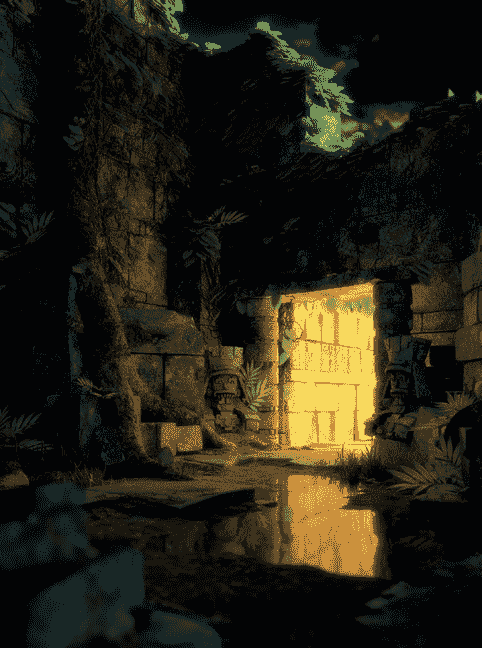

## 介绍

欢迎！本书旨在教你如何使用两款软件创建 3D 模型和环境：Blender，用于 3D 设计和动画，和 GIMP，用于 2D 图像编辑。在每一章中，我都会带你完成创建三个完整 3D 场景的部分过程。你将学会如何进行阻塞、创建模型、雕刻和细化模型、纹理与材质创建、使用光照，并渲染最终图像。在书中，我会讨论 Blender 和 GIMP 提供的各种工具以及如何在实际项目中使用它们。

我的目标是教你如何使用 Blender 完成自己的项目，通过三个我自己的项目提供叙述和任务示例。到本书结束时，你应该能够根据三个示例项目中展示的原理，从头开始创建自己的项目。

## 涉及的主题

以下是本书每一章的简要总结。

**第一章**和**第二章**介绍了 Blender 和 GIMP。你将了解它们是什么，在哪里可以获得它们，以及你能用它们做什么。我还会向你介绍它们的用户界面以及基本的操作方法。第一章重点介绍 Blender。我们将学习如何添加和操作对象、保存和加载项目，以及在项目中工作的最佳实践。在第二章中，我们将研究如何使用 GIMP 的各种画笔和滤镜创建图像，以及如何使用图层和选择工具。

**第三章**介绍了收集参考资料、创建概念艺术，并在 Blender 中使用这些资料，使你的想法更容易在 3D 中实现。我将讨论如何使用正射投影参考、创建参考图纸，以及如何将参考图像导入 Blender 的 3D 视图中以供建模时使用。

在**第四章**和**第五章**中，我们开始使用简单的几何形状对场景中最重要的部分进行阻塞，然后用更详细的模型来丰富这些基本形状。我们深入研究 Blender 的 3D 建模工具以及如何使用简单、高效的几何形状创建模型。

**第六章**介绍了 Blender 的雕刻工具，以及如何将它们与 Blender 的多分辨率修改器结合使用，制作出可以像粘土一样雕刻的模型——非常适合制作细致的、有机的模型。

**第七章**介绍了如何修改第六章中的高分辨率雕刻几何体，创建更简洁的几何体。我们将探讨 Blender 提供的几种不同的重新拓扑方法，以及如何将它们应用于将雕刻网格转换为最终模型。

**第八章**探讨了 Blender 的 UV 展开工具，允许你将 2D 图像映射到模型的表面。这使得你可以在模型上绘制，给它们添加颜色和纹理。

**第九章**介绍了使用 Blender 的粒子工具创建条状粒子系统。这些粒子系统可以用来生成头发和毛发，并且 Blender 的粒子模式刷子允许你为这些头发或毛发修整和剪裁成各种形状和风格。我们将了解粒子系统的各种设置，以及如何使用 Blender 的子粒子来从较少的父粒子生成大量粒子，以便以最少的输入创建复杂而浓密的头发和毛发。

**第十章**探讨了纹理烘焙的过程，这一过程根据网格的几何形状自动生成纹理，而**第十一章**介绍了纹理绘制，它结合了第十章中的烘焙纹理和使用 Blender 的纹理绘制工具以及 GIMP 绘制的手工细节和照片。

**第十二章** 和 **第十三章** 涵盖了 Blender 的材质和照明选项。我们将了解 Blender Internal 渲染器和 Cycles 渲染引擎，以及它们如何影响我们设置光照和材质的方式。在第十二章中，我们学习如何使用在第十章和第十一章中创建的纹理来创建渲染时能产生逼真效果的材质。第十三章介绍了如何创建光源并设置它们，以便在 Blender Internal 和 Cycles 引擎中获得既美观又快速渲染的光照和阴影。

在**第十四章**中，我们将汇集前几章中创建的所有组件，包括模型、光照、材质和纹理，来渲染最终图像。我们讨论了 Blender Internal 和 Cycles 引擎最重要的渲染设置，并研究了如何快速获得最佳效果。我们还研究了 Blender 的基于节点的合成器，以及如何使用它进一步后处理最终渲染结果。最后，我们使用 GIMP 进行一些额外的修饰，并为图像绘制背景。

在**第十五章**中，我们最后一次回顾所涵盖的项目，并思考如何进一步提升。我们将在项目中添加一些装饰，并从不同角度审视它们，之后研究如何利用 Blender 的绑定和动画工具使我们的静态图像动起来。

## 未涵盖内容

Blender 是一个功能强大的 3D 设计与动画软件包。它提供了建模、贴图、材质创建和粒子系统的工具，以及绑定和动画、合成、脚本编写的工具；一个功能全面的游戏引擎；一个非线性视频编辑器；以及一些高级流体、布料和刚体仿真工具。本书尝试仅涉及 Blender 中创建、贴图和渲染模型为静态图像所需的部分。它不涉及 Blender 的绑定与动画工具、仿真工具或游戏引擎。对于这些话题，有很多其他资源可供参考。如果你有兴趣寻找它们，可以访问*[`www.blender.org/education-help/`](http://www.blender.org/education-help/)*。

## 要求

为了充分利用本书，你需要一台相对较新的计算机，运行最新版本的 Microsoft Windows、Mac OS X 或 Linux 操作系统。特别是在本书的雕刻部分，额外的内存（8GB 较好）和一张相对较快的显卡将非常有用。在你进行贴图和雕刻部分时，一块压力感应的绘图板（例如 Wacom Bamboo 或 Intuos）将非常有帮助，但它不是绝对必要的。

## 项目

为了在本书中提供一条贯穿始终的线索，我选择将讨论集中在三个项目上。每个项目的选择旨在提供不同的挑战，从而为你提供广泛、实用的 Blender 和 GIMP 工具与选项的知识。

### 蝙蝠生物

蝙蝠生物项目专注于有机建模，旨在创造一个类人但又怪异的生物（见图 1）。在这个项目中，我们首先创建一个简单的基础网格，然后使用 Blender 的雕刻工具雕刻出更复杂的、有机的身体形态。我们通过 Blender 的粒子系统创建毛发来进行补充。接着我们对生物进行展开和贴图，随后为皮肤和毛发创建逼真的材质，其中包括次表面散射和逼真的毛发效果。我们使用 Blender 的内部渲染引擎进行渲染，以利用其高度可定制的材质和快速、高效的毛发与毛皮渲染。最后，在第十三章中，我们创建一些戏剧性的光照效果，学习如何从 Blender 的灯光中获得最佳效果，以及如何在处理毛发时实现逼真的阴影。

### 蜘蛛机器人

与蝙蝠生物项目的有机形态不同，蜘蛛机器人项目将展示如何创建一个机械感十足的硬表面机器人蜘蛛模型（图 2）。与蝙蝠生物项目相比，这个任务在项目的每个阶段都需要不同的处理方法。我们首先使用简单几何形状进行基础造型，但通过复制来创建模型的重复部分，比如腿部。在雕刻时，我们使用 Blender 的硬表面画笔，力求得到更光滑、较少有机感的最终效果。接着，我们利用 Blender 的重拓扑工具将模型精细化，使其更加平滑和流线型。最后，我们使用 Cycles 渲染引擎渲染该项目，因为它能够真实渲染光亮材质和复杂的光照。

图 1. 蝙蝠生物

### 丛林神庙

图 2. 蜘蛛机器人

丛林神庙项目的重点是环境而非角色：一个位于丛林深处的废墟神庙（图 3）。我们将探讨如何阻挡场景并保持其构图符合镜头需求。我们使用复制、粒子系统和 Blender 插件来创造多样的植被。在纹理制作方面，我们重点在使用 GIMP 创建多个无缝纹理，这些纹理可以在多个物体上拼贴和重复，从而只用少数几个独特的纹理就能创造出多种材质。我们将在第十四章中使用 Cycles 引擎渲染此场景（该引擎可以快速创建真实的光照效果），然后使用 Blender 的合成器进行后期处理。最后，我们使用 GIMP 为场景绘制背景。

图 3. 丛林神庙

### 如何跟随项目进行

虽然这些项目构成了本书的主要叙事，但我并没有涵盖创建每个项目的每一个步骤。相反，我专注于在每个项目开发的各个阶段中，创建每个项目时最重要或最困难的方面，其余的部分留给你作为练习，如果你希望制作类似的结果。我希望这种方法能展示如何使用 Blender 创建各种 3D 图像，并让你了解其中的思考过程和挑战。为了帮助实现这一目标，本书的大多数章节还包含了补充信息和技巧，提供更一般性的指导，你应该能在各种项目中找到有用的建议。

## 本书配套资源

本书随附的 DVD 包含了所有项目的文件，包括每个项目的单独*.blend*文件（对应书中的每一章）和每个项目在每章结束时的最终状态文件（如果相关）。这些资源应该能让你深入了解每个项目的工作原理，并检查每个项目是如何逐步成型的。创建 3D 艺术是一项复杂的过程，最终产品通常是某种程度上的实验结果。这些项目文件并不是项目进展过程中的真实快照；相反，它们是每个项目在特定阶段的理想化、整理过的版本。

还包括了每个项目使用的纹理、*.blend*文件（包含一些用于雕刻的有用画笔和 MatCap 材质，详见第六章了解更多雕刻和 MatCap 材质），以及在第十一章中创建的 GIMP 画笔，你可以在自己的项目中使用。

你可以以任何方式使用这些文件。所有文件均采用创作共用非商业性署名（CC-BY-NC）许可，纹理文件除外，纹理文件是由 CGTextures 的友好许可提供的 (*[`www.cgtextures.com/`](http://www.cgtextures.com/)*)，这是一个很棒的在线纹理资源网站。这些纹理文件未经 CGTextures 许可不得未修改分发。

## 开始吧

这个介绍希望让你了解本书的内容以及你可以在书中的哪些部分找到所需的信息。我已经概述了我们将要进行的项目以及你可以期待从中学到的内容。现在，在进入项目之前，我们可以开始熟悉 Blender 和 GIMP。如果你已经对 Blender 和 GIMP 的基础操作感到熟悉，可以跳到第三章。否则，接下来的两章应该会为你提供关于我们将在本书中使用的软件的基本介绍。
