## 第一章 介绍 Blender

在本章中，我们将探讨使用 Blender 的基础知识，为后续章节的工作打下基础。我们将探索其用户界面，如何导航 3D 视口，以及如何添加和与对象交互。在本章中，我将指向本书的后续部分，其中将更详细地涵盖各种主题。如果您已经熟悉 Blender，请随时跳到第二章，关于 GIMP，或第三章，关于准备您的项目。

## 关于 Blender

Blender 是一款免费开源的 3D 设计和动画软件，适用于 Windows、Linux 和 Mac OS X。最初作为荷兰动画工作室 NeoGeo 的内部动画软件而创建，后来在其开发者 NotANumber 破产时，由 Blender 社区筹集了 10 万欧元支付债权人以发布 Blender 源代码，并在 GNU 通用公共许可证下发布。

从那时起，Blender 一直由 Blender 社区持续开发，由 Blender 基金会（由 Blender 的原始开发者之一 Ton Roosendaal 领导）监督。当前版本（本书出版时的 Blender 2.6*x*）拥有与许多商业 3D 应用程序竞争的广泛功能，并拥有一支忠诚和热情的社区，用它来创作艺术和动画。

今天，许多动画工作室、游戏开发者、艺术家和爱好者都在使用 Blender。它被用来制作长篇电影、短片和游戏。特别值得一提的是 Blender 基金会的开放电影项目——由社区资助的短片项目，通过在制作环境中使用 Blender 来推动 Blender 的发展。迄今为止，已完成了四部短片和一款游戏，每一部都带来了 Blender 库中的重大改进和新功能。第一部短片*Elephants Dream*于 2006 年首映。这是一个超现实的故事，讲述了两个角色穿越一个奇怪的机械世界。它引入了基于粒子的头发和毛发渲染，以及 Blender 渲染引擎的新动画工具和改进。2008 年，*Big Buck Bunny*引入了毛发渲染、粒子和渲染管线的改进，以及更高级的绑定和动画约束。2010 年，*Sintel*，一个关于一个女孩和她的龙的故事，带来了先进的雕刻工具、新的模拟工具以及着色和渲染的改进。

最新的开放电影*Tears of Steel*专注于为 Blender 添加先进的视觉效果工具。它为新的 Cycles 渲染引擎带来了重大改进，并引入了摄像机跟踪工具、Blender 合成器的新功能、改进的模拟工具和更好的颜色管理。

当前，Windows、Linux 和 Mac OS X 的稳定 Blender 版本可以从*[`www.blender.org/`](http://www.blender.org/)*下载。此外，你还可以从*[`www.graphicall.org/`](http://www.graphicall.org/)*找到包含最新更新的开发版。这些开发版主要面向更高级的用户或那些希望尝试新功能的用户；它们可能不稳定，因此在进行重要工作时，建议使用官方版本。

## Blender 用户界面

Blender 的用户界面（UI）因其难以掌握而声名远扬。在早期版本中，这种评价在一定程度上是有道理的，但自 Blender 2.5 版本以来，界面经历了重大更新，现在更加可预测，也更容易学习。而且，随着搜索功能的加入，如果你在寻找某个操作符时遇到困难，可以通过按空格键打开搜索对话框，并通过名称搜索操作符。

一旦你掌握了 UI，你会发现 Blender 非常快速且高度可定制。大多数功能都可以通过键盘命令快速访问，且界面是非阻塞的，这意味着窗口和对话框不会互相覆盖，遮挡你的视野。

### 布局和 UI 术语

当你首次启动 Blender 时，默认布局应该类似于图 1-1。Blender 窗口被划分为名为*编辑器*的区域。这些编辑器包括 3D 视图、属性编辑器、大纲、信息编辑器和时间轴，如图 1-1 所示。

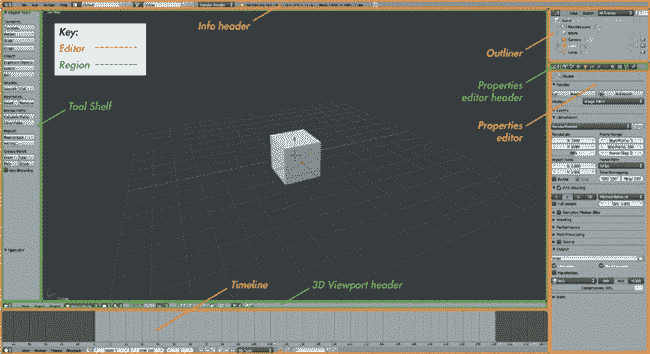图 1-1. Blender 默认的 UI 布局。窗口被分为不同的编辑器（橙色），这些编辑器进一步被划分为区域（绿色）。

编辑器进一步被划分为*区域*。以图 1-1 中的 3D 视图窗口为例，这些区域包括主区域（即 3D 视图）、编辑器底部的头部区域和左侧的工具架区域。

包含按钮和属性的区域——例如属性编辑器或 3D 视口中的工具架——进一步划分为 *面板*。一个面板可能包含任意数量和组合的操作按钮、信息和属性。面板的名称显示在面板顶部（参见 图 1-2），并指示该面板包含什么类型的属性和信息。

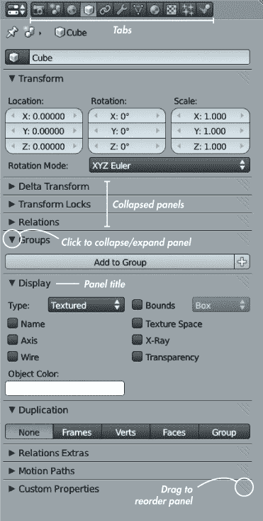图 1-2. 属性编辑器中的面板

### 切换编辑器和自定义 UI

Blender 的 UI 布局高度可配置。你可以通过在 Header 区域最左侧的下拉菜单中选择一个新的编辑器类型，将当前布局中的任何编辑器切换为不同的编辑器类型（参见 图 1-3）。

你还可以通过分割或合并现有的编辑器来调整现有编辑器的大小，或添加或删除编辑器。要调整编辑器（或区域）的大小，请点击并拖动其边框。要分割或合并编辑器，右键点击编辑器的边框并选择“分割区域”或“合并区域”。（在后面的章节中，我们将使用这种技巧来调整 Blender 的布局，以更好地适应每个项目的不同阶段。）

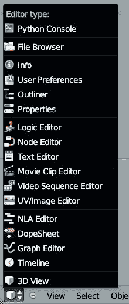图 1-3. Blender 的不同编辑器类型

### 多个布局

由于不同的 UI 布局适用于不同的任务，Blender 允许你存储多个 UI 布局，以便在工作时可以在它们之间切换。要切换布局，请点击 Info 编辑器头部的屏幕布局下拉菜单（参见 图 1-4）。

默认情况下，Blender 包含名为 *动画*、*合成*、*默认*、*游戏逻辑*、*脚本编写*、*UV 编辑*、*3D 视图全屏*、*运动追踪* 和 *视频编辑* 的布局，每个布局都非常适合其所命名的任务。（默认是启动 Blender 时的默认布局，适合建模。）要添加你自己的布局，点击下拉菜单右侧的 + 图标以复制当前布局并修改它，或者点击 **X** 图标删除当前布局。布局会随着 *.blend* 文件一起保存，当你保存工作时，下次打开文件时可以返回到这些布局。

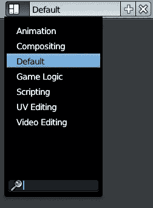图 1-4. 使用屏幕布局下拉菜单切换布局

你可以通过将布局保存为默认的*.blend*文件来使其在启动 Blender 时自动加载。为此，加载默认的*.blend*文件（CTRL-N），然后使用上述方法创建你想要的布局。使用 CTRL-U 将当前文件保存为新的默认启动文件。（若要恢复原始的默认*.blend*文件，选择“文件”菜单中的**加载工厂设置**，然后再次保存默认的*.blend*文件。）

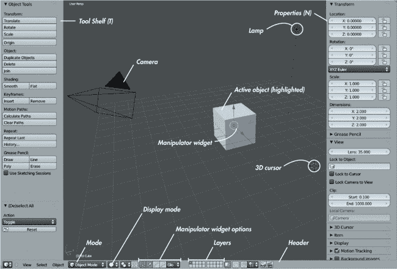图 1-5. Blender 的 3D 视口细节

## 编辑器类型

Blender 的每个编辑器都有不同的功能。并不是所有的编辑器在本书的项目中都会用到，因此我只会讨论与我们要处理的项目相关的编辑器。

### 3D 视口

这是 Blender 最重要的编辑器类型。3D 视口（参见图 1-5）是你可以查看场景和对象，并对其进行移动、操作和组织的地方。

3D 视口有四个区域：主要的 3D 视图；Header，位于编辑器的顶部或底部（通常在底部）；工具架；以及属性区域，后两个区域可以在鼠标悬停在 3D 视口编辑器上时通过快捷键**T**和**N**隐藏。

#### 导航 3D 视口

学习如何导航 3D 视口非常重要，且有多种方法可以做到这一点。最简单的方法是使用鼠标。滚动鼠标滚轮可以放大和缩小视图，按住中键鼠标按钮旋转视图，按住 SHIFT 并点击中键鼠标按钮可以平移视图。要将视图集中在当前选中的对象上，按下数字键盘上的点键（NUMPAD.）。要将视图重置为集中在场景的原点上，按下 SHIFT-C。

### 注意

*Blender 处理数字键盘上的键和键盘上相应的键是不同的。例如，数字键盘（numpad）上的数字用于导航 3D 视图，而字符键上的数字则用于切换不同场景层的可见性。*

你还可以使用数字键盘将视角切换到特定的角度。NUMPAD 7 切换到俯视图，NUMPAD 1 切换到正视图，NUMPAD 3 切换到侧视图。NUMPAD 5 在透视图和正交图之间切换，透视图中远处的物体看起来较小（就像现实中一样），而正交图中物体在所有距离上看起来大小相同。与俯视图、侧视图和正视图结合使用时，正交图最适合精确对齐物体。

3D 视口有多个显示模式，可以从 3D 视口头部选择（见 图 1-5）。这些查看模式包括默认的实心视图；线框视图；边界框视图，它将物体表示为简单的框而不是显示其几何形状；以及纹理视图，能够显示阴影和纹理。在后续章节中，我们将探讨如何为不同目的定制 3D 视口，包括使用不同的纹理阴影模式，以及与图层的工作和隐藏物体。

#### 3D 坐标和网格地面

如果你以前没有接触过 3D 图形，可能没有想过如何定义空间中的一个点。当然，3D 模型本质上是通过连接空间中的点来创建的。幸运的是，法国哲学家和数学家 René Descartes 在我们发明计算机和 3D 图形之前几个世纪就为我们解决了这个问题。

要定义 3D 空间中的一个点，我们需要了解该点在每个空间维度上的位置，相对于一个 *参考点*。在 Blender 中，这些信息以该点的 *x*、*y* 和 *z* 坐标的形式出现，表示该点在三个互相垂直的轴上位置。这些被称为 Blender 的 *全局坐标*。我们使用的参考点叫做场景的 *原点*——该点在每个坐标轴上的坐标为零。

按照惯例，我们通常认为 *x* 轴是“左右”轴，*y* 轴是“前后”轴，*z* 轴是“上下”轴。（上述键盘快捷键提供的不同视角符合这一惯例——自上而下的视角沿 *z* 轴向下看，依此类推。）

在 Blender 的 3D 视口中，你可以看到 *x* 轴和 *y* 轴分别是红色和绿色的线。从这些线延伸出的浅灰色是 *网格地面*，我们通常将其作为场景中放置物体时的地面高度。网格的每个划分默认相隔 1 Blender 单位，为你提供一个放置物体和判断其大小的参考。*x* 轴和 *y* 轴以及网格地面在你在 Blender 的 3D 视口中定位时也很有用。

### 属性编辑器

属性编辑器是你可以定义场景或所选对象设置和属性的地方。属性编辑器分为头部和主体区域，主体区域又分为多个标签页（如 图 1-2 所示）。每个标签页包含一组与当前场景或活动对象相关的不同属性。按照出现顺序，标签页如下：

****渲染****。渲染标签包含渲染场景的设置，包括渲染尺寸、阴影选项和输出格式。（我们将在第十四章中详细讨论此内容。）

****场景****。场景标签让您设置场景的属性，例如活动摄像机、某些声音设置和场景的单位（任意 Blender 单位、英制或公制）。

****世界****。世界标签让您定义场景的背景，以及世界照明选项，例如环境光照和环境遮蔽。（我们将在第十三章中详细讨论此内容。）

****对象****。对象标签（参见图 1-2）让您通过使用数值而非在 3D 视图中移动对象来手动设置对象的变换。您可以管理对象的组成员身份以及它的显示方式。（我们将在第九章中使用组来通过粒子系统复制多个对象。）

****对象约束****。对象约束标签包含对象的约束堆栈。这对于动画非常有用，但不是我们将要讨论的话题。（有关约束的更多信息，请参阅 Blender 维基上的* [`wiki.blender.org/`](http://wiki.blender.org/)*。）

****对象修改器****。此标签包含对象的修改器堆栈，允许您添加新的修改器。修改器是用于操作和生成网格几何形状的程序化、无损方法。当您向对象添加新修改器时，它们会按在堆栈中的顺序（从上到下）应用。（我们将在第四章和第五章中详细讨论修改器。）

****对象数据****。对象数据标签让您设置活动对象使用的数据库块，并展示分配给该数据库块的不同数据集（参见数据块）。该标签的内容根据对象的类型而变化。例如，在网格对象的情况下，该标签会显示网格的顶点组、形状键和 UV 坐标集，而在灯光对象的情况下，它将包含灯光的颜色、能量和阴影设置。此标签的图标也会根据活动对象的类型变化：对于网格对象，图标是一个立方体；对于灯光，图标是一个光源；等等。本书将在多个章节中出现对象数据标签。

****材质****。材质标签显示对象的材质槽和分配给它们的材质。在这里，您可以编辑创建的材质的基本属性，开启或关闭不同的阴影选项，并调整对象材质的属性。

****纹理****。纹理选项卡是材质面板的补充。它允许你为材质分配纹理，定义纹理如何影响材质的属性，并确定它们如何映射到对象表面。（我们将在第十二章中更详细地讨论此选项卡。）你还可以使用纹理选项卡为世界背景或粒子系统分配纹理。

****粒子****。粒子选项卡允许你为对象分配粒子系统并定义其属性。Blender 有两种粒子系统：动态发射粒子和毛发粒子。在第九章中，我们将讨论如何使用毛发粒子创建毛发、皮毛和植被，并且我们将更详细地回顾毛发粒子的设置。

****物理****。物理选项卡包含用于模拟的工具，允许你模拟烟雾、流体、布料以及刚体和软体物理。（在 Blender Wiki 中了解更多关于这些选项的信息。）

### 信息编辑器

信息编辑器（见图 1-6）看起来像一个常规的菜单栏，但实际上它是一个编辑器，就像 3D 视图和属性编辑器一样。它通常保持缩小，仅显示头部，这是最重要的部分。头部包含多个菜单，包括文件菜单、帮助菜单，以及添加对象和渲染的菜单。

这些菜单右侧的下拉菜单选择器允许你更改窗口布局（上文讨论）和当前场景（在场景中讨论）。在这些选择器旁边，一个下拉菜单允许你选择要使用的渲染引擎。（有关 Blender 两个本地渲染引擎的讨论，请参见第十二章、第十三章和第十四章。）

在渲染引擎下拉菜单之后，你会看到几项信息，包括你使用的 Blender 版本以及一些场景信息。从左到右，场景信息包括顶点数（Verts）；面数（Faces）；场景中的对象数量（Objects）；灯光数量（Lamps）；场景的内存使用情况；以及当前选中对象的名称。

如果你拖动信息编辑器的边框，你将看到 Blender 使用剩余的编辑器区域提供你的操作日志，作为 Python 命令。此信息提供了 Blender Python API（应用程序编程接口）背后工作原理的一瞥，并且在创建 Python 脚本时非常有帮助。然而，由于本书中的任何项目都不需要 Blender 的脚本功能，因此它大多数时候可以保持隐藏。

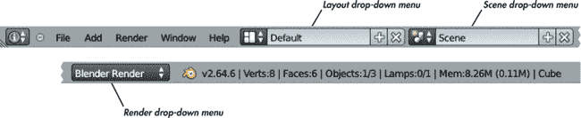图 1-6. 信息编辑器头部

### 节点编辑器

节点编辑器是一个多功能编辑器，用于任何可以用节点构建的内容。这包括默认使用节点的合成器，以及可能基于节点或不基于节点的节点材质和纹理。你可以通过点击节点编辑器头部的图标来切换 Blender 中的各种节点设置（参见 图 1-7）。头部的主要区域以网格形式显示当前的节点设置，允许你添加、删除或移动节点，并查看和编辑它们的连接。

我们将在 第十二章 中更详细地查看节点编辑器，届时我们将为 Cycles 渲染引擎创建基于节点的材质，并在 第十四章 中创建合成节点树。

### UV 图像编辑器

UV 图像编辑器是 3D 视口的 2D 对应版本。在这里，你可以查看图像（从头部菜单选择“图像 ▸ 打开图像”或从图像选择器下拉菜单中选择已加载的图像），并编辑展开网格的 UV 坐标。在渲染过程中，Blender 会在 UV 图像编辑器中显示当前的渲染图像。使用下拉菜单查看最近的渲染结果或查看合成节点树的查看输出。我们将在 第三章、第八章、第十章、第十一章 和 第十四章 中更详细地讨论 UV 图像编辑器。

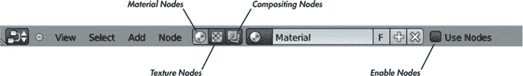图 1-7. 节点编辑器头部

### 其他编辑器

Blender 还有几种其他类型的编辑器。本书将介绍其中的一些，但会省略如图形编辑器（专门用于动画）和逻辑编辑器（专门用于 Blender 游戏引擎）等编辑器。有关这些编辑器的更多信息，请参见 Blender wiki (*[`wiki.blender.org/`](http://wiki.blender.org/)*)。

## 使用 Blender

现在我们已经了解了 Blender 的用户界面，我们可以学习如何实际使用 Blender。我们将首先查看默认的 *.blend* 文件，然后探索如何在 3D 视口和属性编辑器中操作物体。我们还将研究 Blender 文件的构造方式，这将帮助我们在实际项目中工作。

### 场景

*.blend* 文件具有层级结构（参见 数据块），其顶部是一个 *场景*。一个 *.blend* 文件可以包含一个或多个场景。每个场景是一个独立的 3D 空间，你可以在其中创建物体并构建你的项目，每个场景都有自己的设置，用于定义如何渲染它。

当前场景显示在 Blender 窗口顶部的信息头部，位于当前布局旁边（见图 1-8）。要在*.blend*文件中创建一个新场景，点击当前场景名称右侧的+图标。Blender 会询问你是否要创建一个空的场景或从当前场景复制数据。尽管在处理更复杂的项目时创建额外的场景可能很有用，但在本书的每个项目中，我们将为每个*.blend*文件使用一个场景。

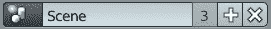图 1-8. 当前场景显示在信息头部

### 默认的 .blend 文件

当你首次打开 Blender 时，你会看到一个简单的场景（如图 1-1 所示）。默认情况下，这个场景包含三个对象：一个立方体、一个灯光和一个相机。这些对象足以进行一个简单的渲染，展示出比空白背景更多的内容。相机告诉 Blender 应渲染哪个视角，立方体为相机提供了可视的物体，而灯光则照亮了立方体，使其呈现出比单纯的黑色剪影更多的细节。

然而，一个灰色的立方体和灰色的背景并不是最有趣的渲染效果。为了创建更有趣的内容，我们需要创建自己的对象来替代这些单调的对象。

### 添加对象

要向场景中添加一个对象，将光标放置在 3D 视图窗口上，然后按下 SHIFT-A 调出添加菜单。在这里，你可以添加 Blender 支持的任何对象类型，包括网格、曲线、空对象、灯光、相机等。（我们将在书中的后续部分讨论这些对象类型。）

### 3D 光标

新对象将被添加到 3D 光标的位置，3D 光标是 Blender 快速定义空间中一个点的易于配置的方式。3D 光标（如图 1-9 所示）是默认情况下新对象添加的位置。你还可以设置变换操作符（如旋转和缩放），以使用 3D 光标作为操作的枢轴点或原点。

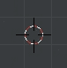图 1-9. 3D 光标

通过在 3D 视图窗口中点击，你可以将 3D 光标移动到你点击的位置（光标与视点的距离将保持不变）。你还可以通过在 3D 视图窗口的属性区域的 3D 光标面板中更改其位置值来移动 3D 光标。（如果你丢失了 3D 光标或只是想将其重置到场景的原点，按下 SHIFT-C 重置 3D 视图窗口的视图，并将 3D 光标放置在场景的原点位置。）

### 选择对象

要选择一个对象，右键点击它。要选择多个对象，按住 SHIFT 键并右键点击它们。默认情况下，选中的对象会用橙色轮廓显示。最近选中的对象称为*活动对象*，它的橙色轮廓比其他选中的对象更亮。活动对象的属性会出现在属性编辑器中。大多数操作符使用或作用于活动对象，但有些操作符会作用于整个选择。

### 操作对象

在 3D 视口中操作对象有几种方法。最简单的方法可能是使用键盘快捷键：**G** 移动，**R** 旋转，**S** 缩放。你也可以使用操控器小部件（参见图 1-10），通过点击并拖动其三个控件之一来操作一个轴，或通过点击并拖动中间的白色圆圈来在任意轴上操作对象。

默认情况下，操控器以三种颜色的箭头呈现。点击并拖动箭头，可以在箭头指示的方向上移动选中的对象（默认沿着全局的*x*、*y*和*z*轴）。使用 3D 视口头部的图标，可以让操控器小部件让你旋转或缩放对象，而不是移动它们（参见图 1-10）。

默认情况下，在对象模式下，Blender 使用对象的本地坐标原点（参见图 1-11) 作为操控器小部件的位置。要更改操作符的支点中心，使用 3D 视口头部的支点中心选项。你可以在使用选中对象原点的中位点（默认）、活动对象的原点、选中对象中每个对象的独立原点、3D 光标和一个假设的围绕所有选中对象绘制的包围盒中心之间切换。这不仅会移动操控器小部件，还会在你使用键盘快捷键或鼠标执行任何变换或操作时，使用选中的支点中心。

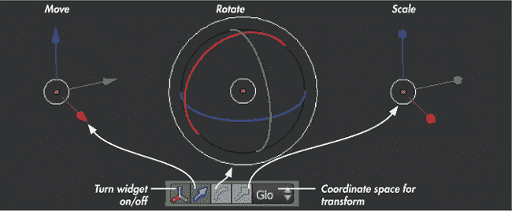图 1-10. 操控器小部件的三种功能：平移、旋转和缩放

在第四章和第五章中，我们将更详细地探讨操作对象、网格和曲线。

### 其他坐标系统

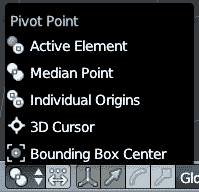图 1-11. 选择不同的枢轴点用于 3D 操作小部件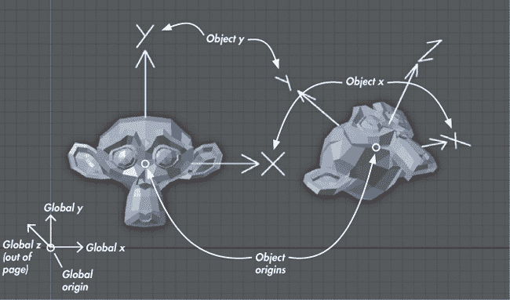图 1-12. 全局和局部坐标

在《3D 坐标与网格地面》中描述的坐标系统是相对于场景原点定义的，其坐标被称为*全局坐标*。这些坐标对整个场景都是通用的。然而，物体也有自己的坐标系统和原点（当你选择物体时，后者通过一个小橙色圆圈表示）。这些坐标被称为物体的*局部坐标*，它们可能与场景的全局坐标相匹配，也可能不匹配（见图 1-12）。例如，当你在对象模式下移动物体时，你会连同物体一起移动其局部坐标原点，当你对其进行缩放或旋转时，你也会缩放或旋转其局部坐标轴。这可能听起来有些混乱，但它有着重要的作用。网格的顶点位置（你可以在编辑模式下编辑）是相对于物体的局部坐标定义的。这意味着无论你在对象模式下如何移动、缩放或旋转物体，网格的顶点在局部坐标上保持不变。我们稍后会利用这一点，在创建多个物体副本时，这些副本将共享相同的网格数据和局部坐标，但也能够在 Blender 的全局坐标中独立缩放和旋转。

在图 1-12 中，创建了两个相同的猴头网格。第一个已经在对象模式下被移动，因此它的原点不再位于全局原点，但它的坐标轴仍然指向与全局坐标轴相同的方向。第二个则被移动并旋转，因此它的原点和局部坐标轴的方向都与全局坐标不匹配。然而，就物体的网格而言，局部坐标仍然指向相同的方向——*y*轴指向猴头的顶部，*x*轴指向它的左耳。

你可以通过进入属性编辑器的对象标签页，并在显示面板中启用轴设置，来查看对象的局部坐标。

### 操作符

平移、旋转和缩放是与对象交互的最简单方式之一。其他简单方式包括删除对象（**X**）、隐藏对象（**H**）或复制对象（SHIFT-D）。这些和类似的操作都属于*操作符*。我们将在第四章中讨论更多操作符，当我们开始建模时，会涵盖更广泛的操作符，并且在整个书中，我们将继续扩展这个操作符的范围。

### 数据块

Blender 中的一切都是由*数据块*构建的，数据块只是数据的块状单元。Blender 的所有对象、网格、材质、纹理和图像都是不同类型的数据块。甚至场景本身也是一个数据块，它指向构成场景内容的其他数据块。

数据块是层次化排列的。例如，场景数据块包含对象数据块，而对象数据块引用网格数据块。网格数据块又引用材质纹理块，依此类推。这一结构在图 1-13 中展示。

属性编辑器的对象数据标签页顶部显示的是活动对象使用的数据块。点击数据块名称左侧的图标以更改使用的数据块（见图 1-14）。

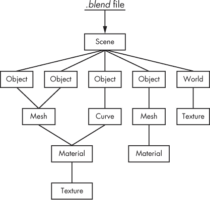图 1-13。Blender 的数据块结构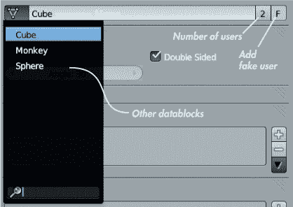图 1-14。查看对象数据。在这里，一个立方体对象使用名为“Cube”的网格数据块。可以选择其他数据块来更改对象使用的网格。数据块的用户数量显示在其名称的右侧。

将对象定义为数据块，可以让你轻松地在 Blender 中复制和复制对象。例如，你可以通过按 SHIFT-D 来创建一个常规副本，这样会创建一个包含原始数据块副本的新对象。（你可以编辑这个副本而不影响原始对象。）你也可以使用 ALT-D 创建一个链接副本。链接副本使用与原始对象*相同*的数据块，这意味着当你编辑一个副本时，另一个副本会同步更新。（我们将在后面的章节中使用这种技巧，在处理多个相同对象的副本时节省时间。）

其他类型的数据库块也是如此。例如，在材料和纹理的情况下，你可以将相同的材料分配给多个物体，或者将相同的纹理分配给多个材料，以节省时间并避免为每个物体创建独特的材料和纹理。当然，这个功能也意味着我们需要跟踪每个物体使用了哪些数据库块以及每个数据库块有多少个用户。要查看一个数据库块有多少个用户，查看它在下拉菜单中被选中的位置旁边。具有多个用户的数据库块会在名称的右侧显示它们的用户数量（见图 1-14）。(点击这个数字可以创建该数据库块的一个新的、独特的副本。)

没有用户的数据库块在退出 Blender 时会被删除。为了保留一个没有用户的数据库块，比如你可能想要重用的材质，或是网格数据库块的早期版本，可以通过点击数据库块名称旁边的**F**图标来保护它（见图 1-14）。这会创建一个“虚拟”用户，以便数据库块能随文件一起保存。

### 数据库块命名

要重命名一个数据库块，点击它的名称。在命名数据库块时，最好使用描述性的名称，以便更容易从列表中选择特定的数据库块。使用如*木材*、*红色油漆*、*皮肤*等描述性词汇来重命名你的数据库块，可以让你在以后更容易地浏览和理解场景。

### 模式

Blender 为编辑物体数据的不同方面提供了不同的模式。默认模式是对象模式，允许你添加和删除物体，同时进行移动、缩放和旋转。其他模式允许你编辑网格数据和粒子系统、在网格上雕刻、绘制纹理以及调整顶点组权重。

Blender 最重要的两种模式是对象模式和编辑模式。要在它们之间切换，使用快捷键 TAB。要访问其他模式，请点击 3D 视图窗口头部的模式下拉菜单（见图 1-5），然后选择你想要的模式。

在第四章和第五章中，我们将广泛使用编辑模式进行建模，而在第六章中，我们将使用雕刻模式。然后，在第八章中，我们将使用粒子模式和权重绘制模式来创建和整理粒子头发，并绘制顶点组以控制毛发。接着，在第十一章中，我们将使用纹理绘制模式为我们的模型绘制纹理。

### 保存与加载

在 Blender 中，保存和加载的方式与任何应用程序类似。使用 **文件**▸**保存** (CTRL-S) 来保存，使用 **文件**▸**打开** (CTRL-O) 来打开文件。

Blender 将文件保存为独特的 *.blend* 格式。默认情况下，外部文件（如加载到 Blender 中的图像）不会与 *.blend* 文件一起保存，而是相对于文件进行引用。因此，要在另一台计算机上打开 *.blend* 文件，你需要将 *.blend* 文件及其引用的所有其他文件一起复制，并在打开 *.blend* 文件之前重新创建相同的目录结构。或者，你可以“打包”你的 *.blend* 文件，这样会将图像等外部数据保存在 *.blend* 文件内，之后你就可以在任何机器上打开 *.blend* 文件并获得所有需要的数据。

### 附加与链接

Blender 缺少你可能从使用更传统应用程序中期待的标准对象复制和粘贴功能。要复制一个对象，你可以选择将其复制或通过现有对象引用相同的数据块。但如果你想从外部 *.blend* 文件中导入内容呢？

这时，附加和链接功能就派上用场了。附加和链接让你可以将一个 *.blend* 文件中的数据块引入到另一个文件中。附加（文件▸附加）将数据块完整地引入当前的 *.blend* 文件，作为原始文件的独立副本。链接（文件▸链接）则是*引用*另一个文件中的原始数据块。链接的数据块不能在它们被链接到的 *.blend* 文件中编辑；相反，它们必须在原始文件中进行编辑。

附加适用于快速将现有资源引入到你的 *.blend* 文件中，以便使用和编辑。链接适用于在更大的项目中组合多个元素，例如当不同的人独立编辑不同部分时。通过将项目的所有元素链接到一个场景中，人们可以在独立的 *.blend* 文件中独立工作，同时保持多个链接对象的最终合并最新。（如果你链接了一个数据块并希望在本地编辑它，可以使用“设为本地数据块”操作符 (**L**) 将其变为本地数据块。）

## 总结

本章提供了 Blender 的基本介绍。你已经学会了如何使用 Blender 的用户界面和基本工具。我们回顾了它的 UI 术语和不同的编辑器类型，探索了添加和操作物体的基础知识，并讨论了物体和数据块在 Blender 中的工作原理。我们还了解了如何保存和加载文件，并将元素从一个*.blend*文件导入到另一个文件中。

在下一章中，我们将开始学习一些关于 GIMP 的内容，它是一个免费的开源图像编辑程序，在你进行项目时，它是 Blender 的理想伴侣。
