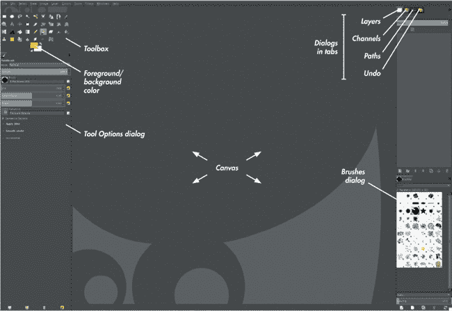
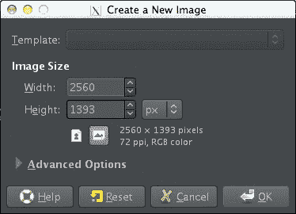
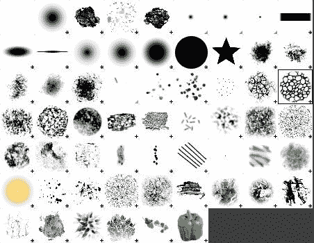
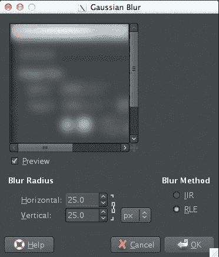
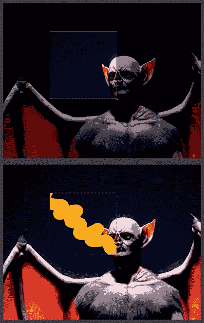
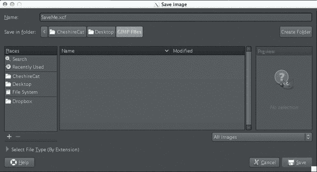

## 第二章。GIMP 简介

在本章中，我们将了解使用 GIMP 的基础知识：GIMP 是什么，如何获取它，以及如何浏览其用户界面。接下来，我将介绍实际使用 GIMP 创建和编辑图像的基础知识，以及如何使用 GIMP 提供的各种画笔和滤镜，这样我们就能为后续章节中学习更高级的 GIMP 功能做好准备。

## 关于 GIMP

GIMP 是一款强大的、免费的开源图像编辑软件，提供了丰富的图形处理和绘画工具。GIMP 最早出现在 1996 年，由加利福尼亚大学伯克利分校的学生 Spencer Kimball 和 Peter Matthis 发起。最初，GIMP 的缩写代表 *通用图像处理程序*（General Image Manipulation Program）。后来，在 1997 年，当 GIMP 成为 GNU 项目的一部分时，缩写被重新定义为 *GNU 图像处理程序*（GNU Image Manipulation Program）。从那时起，GIMP 经历了显著的（尽管不定期的）开发，它目前的功能集已经与商业图像编辑软件，如 Adobe Photoshop，媲美。GIMP 提供了绘画工具；颜色处理工具；以及与选区、图层、路径和通道的操作工具。它还提供了多种滤镜和插件，支持多种图像格式。

GIMP 可用于 Linux、Mac 和 Windows 系统。Linux 和 Mac OS X 的官方版本可以在 *[`www.gimp.org/`](http://www.gimp.org/)* 找到。Windows 版本可以在 *[`gimp-win.sourceforge.net/`](http://gimp-win.sourceforge.net/)* 下载，非官方的 Mac OS X 版本（包含一些有用的额外插件和滤镜）可以在 *[`gimp.lisanet.de/`](http://gimp.lisanet.de/)* 获取。

## 为什么选择 GIMP？

你可能会想，为什么我在这本主要讲述使用 Blender 创建 3D 艺术的书中，还要介绍 GIMP。原因是，虽然 Blender 是一款强大的 3D 图形应用程序，但在本书中我们会需要进行一些 2D 图像编辑。例如，我们需要准备参考图像、为模型创建纹理和雕刻笔刷的 alpha 图像，并对最终渲染结果进行一些最后的调整。尽管 Blender 确实在 UV 图像编辑器中提供了 2D 绘画工具，但我们实际上需要更强大的工具，更适合编辑图像。

GIMP 就是这样一个工具，它是创建 3D 数字艺术时，与 Blender 配合使用的优秀伴侣应用程序。在第三章中，我们将在 GIMP 中准备（甚至绘制）参考图像，使用参考线对齐正投影图像，并利用图层将多张图像合成一个拼贴，以便快速参考。在第十一章中，我们将在 GIMP 中进行一些纹理绘制，利用图层将烘焙图像与其他元素（如照片）结合，并使用 GIMP 的绘画工具来细化并添加我们在 Blender 中绘制的纹理。最后，在第十四章中，我们将在 GIMP 中对最终渲染结果进行一些修整。

## GIMP 用户界面

与 Blender 类似，GIMP 的用户界面以其有些不寻常而闻名。主要原因在于其默认的多窗口布局，其中画布、工具箱和其他对话框被分割到不同的窗口中。虽然这种布局足够容易适应，但为了更整洁的布局，你可以通过在“窗口”菜单中启用“单窗口模式”来切换到非阻塞的单窗口布局（见图 2-1）。本书中的大多数截图都使用这种布局，并根据需要添加额外的对话框。

图 2-1。GIMP 的单窗口模式将 GIMP 的所有工具和对话框排列在一个窗口中。GIMP 的默认单窗口布局应该看起来像这样。

### 工具箱

GIMP 的主要工具位于工具箱中（见图 2-1）。“工具箱”中每个工具类型的图标，点击即可切换到该工具，从而可以在当前画布上的图层上使用它。GIMP 提供了以下工具（从左到右、从上到下排列在工具箱中）。

****选区****。这些工具允许你创建选区，以便限制当前图层中可以绘制、应用滤镜或进行复制粘贴的区域（见选区）。*矩形*和*椭圆选择*工具让你通过特定形状创建选区。*套索选择*允许你手绘选区。*魔术选择*会自动选择与你在画布上点击的区域相似的区域，*按颜色选择*则选择相似的颜色。*剪刀选择*允许你通过点击一系列点来绘制一个粗略的选区轮廓，然后 GIMP 通过检测图像中的边缘来生成最佳选区。*前景选择*让你通过在前景区域绘画来定义一个粗略的前景区域，随后它会尝试使用涂画区域作为指导来生成选区。

****路径****。这使你能够使用贝塞尔曲线绘制路径。你创建的路径可以从“路径”对话框中管理，并且可以用来生成选区或通过“描边”来创建精确的笔触和不同的效果。

****颜色选择器****。此工具允许你通过点击画布上的颜色来选择颜色。

****缩放****。使用此工具来缩放画布。

****移动****。此工具让你移动图层。默认情况下，它移动光标下方的最上层可见图层，但你可以通过工具选项对话框设置它为移动当前图层（不论你点击的位置）。

****对齐****。此功能提供了多个用于对齐图层和选区的工具。

****裁剪****。使用此工具裁剪图像。你也可以通过“图像”菜单中的选区裁剪图像。

****变换****。这些工具（包括*旋转*、*缩放*、*剪切*、*透视*和*翻转*）可以变换当前的图层或选区。

****文本****。在画布上创建一个新层的文本。文本层在没有应用画笔或滤镜之前，保持可编辑状态（也就是说，你可以使用文本工具编辑现有的文本层），一旦在其上绘制或应用滤镜，它们会被转换为像素。

****油漆桶和渐变****。使用这些工具填充画布上的纯色或渐变。

****铅笔、画笔、橡皮擦、气刷和墨水****。这些标准绘画工具的行为类似于它们的现实世界对应物。铅笔会在画布上留下锋利的像素化痕迹，而画笔则留下更平滑的笔触。橡皮擦用来擦除，气刷在按住鼠标时逐渐添加颜色，而墨水工具则绘制出流畅的书法线条。

****克隆、修复和透视克隆****。这些工具允许你从画布的一部分（克隆源）克隆图像数据到另一个区域（你所绘制的地方），因此它们对创建纹理和填充空白区域非常有用。修复工具特别实用，因为它会自动将新克隆像素的边界与原始周围区域融合在一起。按住 CTRL 并点击画布设置克隆源，然后你可以正常绘制，将像素从源区域克隆到画布上的其他区域。

****模糊和涂抹****。这些工具可以模糊或涂抹像素。

****减淡/加深****。这个工具让你有选择地亮化（*减淡*）或加深（*加深*）图像的某些区域，这对于调整图像中的阴影和高光非常有用。使用这些效果时要小心，因为过度使用这个工具很容易让图像看起来不自然。

****笼形变换****。此功能让你可以在图像的一部分周围画一个笼子，然后通过调整笼子的形状自由地变换该部分。

工具箱底部的两个颜色样本（见图 2-1）表示当前的前景色和背景色。默认情况下，大多数画笔使用前景色，而背景色作为备用颜色，你可以通过按**X**快速切换它们。（某些工具，如渐变工具，同时使用前景色和背景色。）位于颜色样本右上角和左下角的两个小图标允许你在两者之间切换并将其重置为黑白色。

### 画布

画布是 GIMP 显示当前打开图像的地方。你可以通过点击画布进行绘画、选择区域，并使用 GIMP 的其他所有工具。画布左侧和顶部的标尺通过小箭头显示光标的位置，随着你移动光标而更新。点击并从这些标尺拖动可以创建垂直和水平的参考线，默认情况下，光标和选区会对齐到这些参考线。这种对齐功能在将图像对齐作为参考（如在第三章中所学）时非常有用。画布底部有一些选项，用于控制标尺的度量单位和画布的缩放级别。

### 对话框

有关当前工具和已打开图像的大部分信息都可以通过 GIMP 的对话框查看。部分对话框在启动 GIMP 时默认可见，其他对话框可以在“窗口 ▸ 可停靠对话框”中找到。

GIMP 最重要的两个对话框是工具选项和图层对话框。你可以在图 2-1 中看到这两个对话框，工具选项位于工具箱下方的左侧，图层对话框位于右上角，与通道、路径和撤销对话框一同显示。工具选项对话框包含当前选中工具的设置选项，定义了工具的工作方式。例如，在使用画笔工具时，工具选项对话框允许你调整画笔的不透明度、形状、大小和纵横比，并可以选择 GIMP 的画笔动态选项。图层对话框显示当前图像的各个图层，并允许你切换图层的可见性、锁定图层以防止进一步编辑，或者编辑图层的混合模式，以改变它们与其他图层的组合方式。图层对话框底部的图标可以让你添加、删除和复制图层，还可以创建组来组织图层。（我们将在后面讨论第十一章时，详细讲解如何处理和组织图层。）

GIMP 允许你根据需要重新排列和组织对话框。当处于单窗口模式时，默认的对话框已经按标签和列的形式组织，显示在主画布的两侧。要重新排列标签，只需点击并拖动对话框顶部的图标，将其拖动到另一个标签组中，或拖到界面两部分之间的边框，从而将标签放置在自己的行或列中。

## 使用 GIMP

现在我们将探索如何使用 GIMP 创建、绘画和编辑图像。在后面的章节中，我们会更详细地讨论这些内容；现在，我们先看一些基础内容。在过程中，我会指出后续章节，讲解每个功能的更多细节。

### 创建图像

与 Blender 不同，GIMP 启动时不会打开任何默认文件。当您首次启动程序时，可以选择打开现有图像（文件▸打开）或创建新图像（文件▸新建）。打开图像时，GIMP 通常会将每个图像作为新文件打开，但您也可以选择使用文件▸作为图层打开，将图像作为新图层添加到当前文件中。

当您创建一个新文件时（参见图 2-2），GIMP 会询问您希望它的尺寸是多少像素，然后创建一个具有白色背景的单层图像，您可以开始在其上绘画。

图 2-2. 在 GIMP 中创建新图像

### 绘画和绘图

在 GIMP 中，绘画和绘图只需通过点击并拖动画布上的笔触来完成，使用可用的绘图工具之一。您的笔触将使用当前前景颜色和在工具选项对话框或画笔对话框中选择的画笔形状绘制。

### 画笔和画笔动态

GIMP 拥有一个复杂的画笔引擎，利用各种输入来决定您的笔触外观。除了您在工具选项对话框中应用的任何设置（如不透明度或大小），您还可以在画笔对话框中选择多种画笔形状（参见图 2-3）。您的笔触将使用您选择的形状绘制。

GIMP 还可以使用诸如您绘制笔触的速度或来自图形平板的压力输入等信息来影响笔触的外观。这些选项在 GIMP 中称为绘画动态。您可以从工具选项对话框中选择不同的动态，或者在绘画动态编辑器对话框中创建并编辑自己的动态。（当我们在第十一章中创建自己的画笔时，我们将更详细地研究此功能。）

### 滤镜

GIMP 的滤镜通过将算法应用于当前图层的像素，作为修改图像的过程方式，创造出新的效果。有几种滤镜，包括模糊和锐化图像、去除或生成噪声、以及扭曲和变形图像。您还会找到一些滤镜，能应用艺术效果，或者允许您从头开始创建全新的图像和图案。

图 2-3. GIMP 的一些画笔形状

从“滤镜”菜单中选择一个滤镜，通常会弹出一个对话框，里面包含一些选项，用于调整滤镜的工作方式。例如，如果你选择高斯模糊滤镜，对话框中应该包含模糊半径、使用的模糊方法选项，以及一个小预览图（参见图 2-4）。在这个对话框中点击“确定”会将滤镜应用到整个图像上。（在第十一章中我们将使用一些这些滤镜进行纹理绘制。）

图 2-4：使用滤镜。这里展示了高斯模糊滤镜。

### 图层

作为一个基于图层的图像编辑器，GIMP 允许你通过将多个图层组合在一起，创建一个由不同元素构成的图像。图层对话框展示了图像中的所有图层，并允许你编辑它们的顺序以及它们的组合方式。默认情况下，每个图层都会替换其下方的图层，任何透明部分都会让下方的图层显示出来。然而，你也可以从“图层模式”下拉菜单中选择其他几种图层混合方式。

当你在画布上绘画（或使用其他任何工具或滤镜）时，你的笔触会被绘制到当前活动的图层上（在图层对话框中高亮显示）。我们将在第十一章中更详细地讲解图层。

### 选择

限制你绘画的像素区域的一种方法是使用 GIMP 的选择工具。通过这些工具，你可以在当前图层内绘制一个你希望编辑的选区。然后，画笔、滤镜和其他工具将只影响选中的像素（参见图 2-5）。当你想要在图像的某个孤立部分进行编辑时，选择非常有用。它们还可以让你复制（CTRL-C）和粘贴（CTRL-V）图像的部分内容，或者将图像的一部分拆分到新的图层中。我们将在第十一章中更详细地讲解这些工具。

要取消选择，可以使用选择工具点击选择区域外的区域。你也可以反转选择（CTRL-I），交换已选区域和未选区域。你可以通过在拖动选择框时按住 SHIFT 或 CTRL 键，来增加或减少当前的选择。在后面的章节中，我们将探讨使用 GIMP 的快速蒙版等工具处理选择的其他方法。

### 保存与导出

GIMP 可以打开几乎任何图像格式，但一旦你打开了图像，它会区分保存图像（CTRL-S），这只会以其原生 *.xcf* 格式保存，以及将图像导出（CTRL-E）为更常见的图像格式，如 JPEG 或 Targa。你可以通过为文件名添加正确的后缀（例如，*.jpg* 表示 JPEG，*.tga* 表示 Targa）来选择导出到的图像格式，或者通过从“保存”对话框底部的列表中手动选择它（见图 2-6）。

在为本书中的项目制作纹理和其他图像时，我会同时保存和导出我的纹理。保存 *.xcf* 文件意味着我将纹理保存在一个可以稍后编辑的图层格式中，而将其导出为常见的图像格式（如 *.png* 或 *.tga*）则给我提供了一个可以在 Blender 中打开并使用的图像。

## 回顾

本章提供了 GIMP 的基础介绍。我们简要了解了 GIMP 的历史、它的功能以及可以从哪里获取它。我们还看了 GIMP 用户界面的布局及其可用工具，并介绍了如何在 GIMP 中处理图像的基础知识。我们探讨了如何使用工具、滤镜、图层和选区的基本操作，并讨论了保存、加载和导出的基本方法。

在第三章中，我们将准备开始本书中的不同项目工作，然后才能正式使用 GIMP 和 Blender。

图 2-5. 创建选区（在顶部图像中突出显示）可以让你将 GIMP 的工具限制在图像的特定区域。图 2-6. 在 GIMP 中保存图像
