## 第三章 准备工作

在本章中，你将学习如何为在 Blender 中创建项目打好基础。这包括收集和创建参考资料，设计角色，规划最终图像的构图，以及设置 Blender，使你在工作时能够访问已收集的资源。章节结束时，我们将准备好开始建模项目，并且对我们想要创建的内容以及如何实现这一目标有了更加清晰的理解。

## 概念艺术与参考资料

每个项目都需要研究和准备。在创建本书中的项目之前，我花了一些时间思考我真正想要做的事情，收集参考图像，并制作基本的概念艺术来保持我在正确的轨道上。

在准备处理特定项目时，先尝试不同的粗略想法和设计，丢弃或修改那些不太合适的设计，然后再花费大量时间在某个设计上。例如，图 3-1 展示了我在选择本书中使用的蝙蝠生物设计之前为角色绘制的各种草图。

### 创建、寻找和使用参考资料

概念艺术有两个目的：首先，它是一个快速实验想法的方法，其次，它在创建项目时作为参考指南。这意味着你不需要一直将所有的想法都记在脑海中，而是可以为项目的不同部分提前进行规划，从而节省时间和精力。每次开始项目的一部分时，可以使用你的草图来提醒自己目标。你可以直接在 Blender 或 GIMP 中使用参考图像或概念艺术，帮助建模和纹理处理，无论是将它们作为背景图像，还是作为纹理投影和烘焙的起点。

在构思你的项目时，考虑是否有现实世界中的参考资料可以使用。当然，互联网是一个很好的资源，书籍、周围的物品以及你自己的照片也可以作为参考。例如，在开发本书中的丛林废墟项目时，我首先通过在 Flickr 和 Google 图像中搜索“丛林废墟”和“玛雅神庙”等关键词，然后收集我喜欢的图像。（显然，你应该确保自己没有直接抄袭他人的作品；收集灵感是可以的，但侵犯版权是不允许的！）

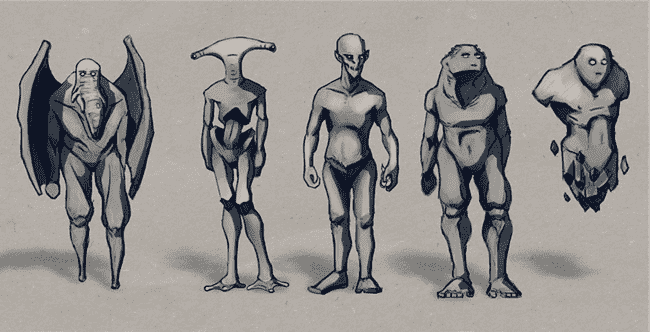图 3-1：处理不同的角色设计想法

即使你想要创造一个完全虚构的设计，比如一只龙或一艘科幻飞船，检查与设计相关的真实世界物体也能帮助你更好地想象你的创作。例如，在设计一只龙时，你可能会搜索恐龙、蜥蜴、大型鸟类、蝙蝠，甚至是像狮子或狼这样的哺乳类捕食性动物的图像。每种动物可能有一些特征可以用在你的龙上，比如蜥蜴身上的鳞片纹理，或者鸟类或蝙蝠的翅膀结构。在设计飞船时，你可以研究现有的飞行器，比如航天飞机、飞机、工业车辆，甚至是汽车。借鉴现有事物的某些特征能帮助你的作品更加真实和具有说服力。

一旦你收集了一些参考资料，你可以直接开始建模，或者你可能会先草绘一些项目的方面。图 3-2 展示了我在《丛林遗迹》项目中研究玛雅建筑的一些例子。

如果你不太擅长传统草图绘制，可以考虑在 Blender 中用简单的基础网格雕刻出项目的粗略概念（见第六章），或者使用简单的几何形状在 Blender 中粗略构建出场景的概念。记住，项目的每一个方面，无论是构图、光照、纹理还是模型，都将影响你的概念艺术，所以在认真开始你的项目之前，考虑并尝试每个方面。

### 参考资料中应该注意什么

在收集参考资料时，有一些事情需要牢记。

****主题****。尽量收集或创建尽可能多的与主题相关的图像；谁知道什么时候它们会派上用场呢。你手头有的参考资料越多，越好！

****视角****。尽量收集或创建从多个不同角度展示你主题的参考资料，既包括细节部分，也包括整体，以确保在创建角色背面或场景中小物体时不会卡住。

****光照****。强光和均匀光照的参考资料都很有用。在纹理制作时，没有强烈光照或镜面高光的参考资料会非常方便，但在建模时，你会希望这些高光和对比强烈的光照能展现出你主题的形状。两种类型的参考资料都不要放过。

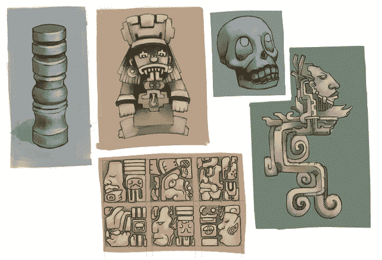图 3-2。玛雅建筑不同元素的草图

****镜头****。使用摄影时，尽量收集使用长焦镜头拍摄的图像，尤其是如果你计划将参考图像直接用作 Blender 视口中的正交参考进行建模。镜头越短，图像的畸变程度越大，如果你盲目地将这种畸变融入到模型中，必然会得到一些奇怪的效果。如果你无法获得长焦镜头拍摄的照片，至少要尝试确定拍摄该图像时使用了什么镜头，并在建模时牢记这一点。

****版权/授权****。虽然你可以自由使用任何图像作为灵感或起点，但如果你计划使用他人创作的照片或艺术作品，你必须遵守他们对作品的意图。如果图像受版权保护，你必须获得版权持有人的许可，或者联系第三方授权机构，如 3d.sk 或 iStockPhoto。如果图像是以较少限制的许可证发布的，如创用 CC 协议，请务必遵守该许可证的具体条款。如果不确定，请假设图像受版权保护，并且不要直接在你的作品中使用。

最重要的是，要记住所有的摄影参考都有其局限性。除了镜头畸变的表现外，图像可能很小、拍摄角度尴尬、光线不足、模糊或不完整。这并不意味着不完美的图像没有用，但不要做参考的奴隶。最终重要的是*看起来正确*，如果看起来不对，不要让你的参考图像欺骗你做出糟糕的艺术决策。如果某些东西看起来不对，就改变它。

## 构图

在创作任何艺术作品时，无论是动画还是静态的，考虑构图都非常重要，提前进行构图思考会让你更容易将场景的最终元素拼接起来。这一点在《丛林遗迹》项目中尤为重要，目标是从一个固定视角创建最终图像。记住，你希望最终结果不仅看起来令人信服且细节丰富，而且在最终渲染的环境中也要赏心悦目。

构图是一个非常丰富的主题，超出了本书的范围，无法详细讨论，但这里有一些基本原则。

### 三分法则

三分法原则认为，图像中的兴趣点应该大致与覆盖在图像上的虚拟网格对齐。这个虚拟网格将图像沿其长度和宽度分成三等份。其目的是将图像划分成不对称的区域，从而产生视觉上更加令人愉悦的效果，而不是将图像分割成完全对称的两部分。图 3-3 展示了我如何将图像分为九个部分，采用三行三列的布局。

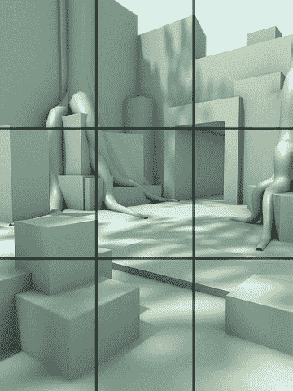图 3-3. 《丛林遗址》项目在初步构图阶段，覆盖了三分法网格

作为三分法应用的另一个例子，想象一个展示天空和地平线与一些建筑物的场景。应用三分法时，我们会将地平线放置在图像的一个水平分割线上（大约从底部上升或从顶部下降的三分之一处），天空占据地平线以上的区域。如果图像的主要兴趣点位于地平线之上，例如高楼或夜空中的明月，我们可能会将地平线放置在下三分之一的位置，让建筑物和月亮占据更多空间。另一方面，如果图像的主要兴趣点位于地平线以下，比如湖面上的船只，将地平线放在上三分之一的位置将允许我们为船只提供更多空间，同时创造一个平衡的构图。

然而，三分法并不总是适用于包含单一人物的图像。例如，如果你的图像是人物的肖像或全身照，将人物放在画面中央可能更为合理。但即便在这些情况下，你仍然可以将三分法应用到图像的其他方面，比如人物的视线方向或他手中所持的重物。

值得指出的是，三分法并不是唯一由不对称与失衡之美驱动的理论。其他规则，如黄金比例，它通过黄金比（大约 1.618:1）来安排网格线，也有类似效果，并且目标都是避免将图像分割成明显对称的两半。

### 轮廓与负空间

为了让你的图像易于理解，它必须有一个强烈的*轮廓*。轮廓是你主体的外形，如图 3-4 所示。如果你从图像的轮廓中依然能够看出图像的内容，那说明你有一个强烈的设计。如果轮廓看起来只是形状的杂乱拼凑，观众可能会难以处理图像，甚至是在最终状态下。为了更好地了解模型的轮廓，尝试给它添加一个黑色材质，不带高光（参见第十二章），并单独渲染它，将其作为一个黑色的形状显示在简洁的背景上（图 3-4）。

同样地，*负空间*在你的主体与其他物体之间的布局，也会影响作品的整体构图。例如，当你将地平线放在三分法线上，如前面章节所讨论的那样，我们可能会在天空中创造出一个令人愉悦的负空间。

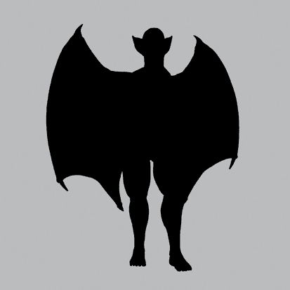图 3-4. 蝙蝠生物的轮廓

### 简洁性与焦点

在创作任何图像时，你应该努力控制观众的视线。如果你的图像内容繁杂，信息过多，观众可能会感到不知所措，不知道该关注什么。为了避免可能的困惑，图像应有一些“休息”区域——那些简单、不需要注意的部分，确保其他更重要的部分不被忽视。例如，如果你建模并渲染了一幅出色的人物肖像，你可能会避免在肖像背后的负空间中添加一个复杂、凌乱的背景，因为这个背景可能会分散观众的注意力。在这个例子中，负空间是休息区域，但休息区域也可以是图像主体部分中较为简单和不那么复杂的部分。

这个理念适用于设计的各个方面：保持简单并控制观众的视线焦点。如果你在任何物体上加上过多复杂的细节，结果可能会是一个难以解读、充满竞争焦点的混杂体。而如果你将细节集中在特定区域，同时保持其他部分的简洁，观众就能更容易理解你的设计。例如，在图 3-5 中展示的蜘蛛机器人项目中，设计的一些方面，如腿部和身体各节之间关节的机械细节，都是相当复杂的，而其他区域，如身体表面，则保持简单。

定义关注区域和简洁性可以通过多种方式实现，其中最明显的一种方式是通过布置：简单地在场景中的复杂区域之间留出空间。但也有其他方法。例如，你可以使用光照将不太重要的区域置于黑暗中，或者过度曝光这些区域，使它们变成几乎完全白色，或者你可以使用景深将图像的前景和背景区域模糊处理。（我们将在不同章节中涉及这些技巧，特别是在第十三章和第十四章。）

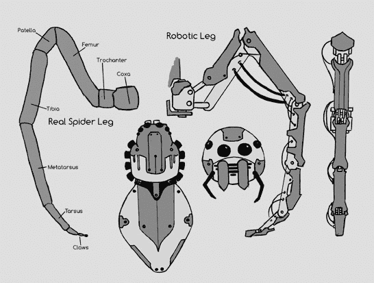图 3-5。蜘蛛概念艺术。由于腿部非常复杂，身体的设计保持简洁，以便观众更容易理解整体图像。

### 视觉路径

大多数图像包含多个元素。在处理这类图像时，你应该创建一条路径，引导观众依次关注每个元素，直到他们移开视线。通过规划这条路径，你可以使图像讲述一个故事，并展示更多场景内容。

你可以使用三分法则来创建图像的视觉路径，因为观众自然会首先注意到三分法线的交点。你还可以使用透视法，使图像中的汇聚线引导观众关注构图的各个焦点。或者，你可以用负空间来框定感兴趣的点。在包含人物的图像中，你可以让人物看向焦点，这样观众会跟随他们的视线，或者你甚至可以让人物指向焦点！

## 在 Blender 中测试构图

在完全投入创作之前，Blender 可以在为场景设定构图时派上用场。例如，在“丛林遗址”场景的制作过程中，我通过使用立方体快速阻挡场景构图，并添加简单的光照，尝试了多种构图方式，以查看不同选项对构图的影响。

Blender 还提供了一些方便的工具，帮助你在构图选择中做出决策。选择相机后，你可以从属性编辑器的对象数据标签中访问这些工具，如图 3-6 所示。例如，为了更好地看到图像的框架，你可以提高 Passepartout 设置的 Alpha 值，以隐藏相机视野外的区域。你还会发现几个构图指南，你可以切换这些指南，帮助你根据三分法则、黄金比例或中心线对齐你的构图，如图 3-6 所示。

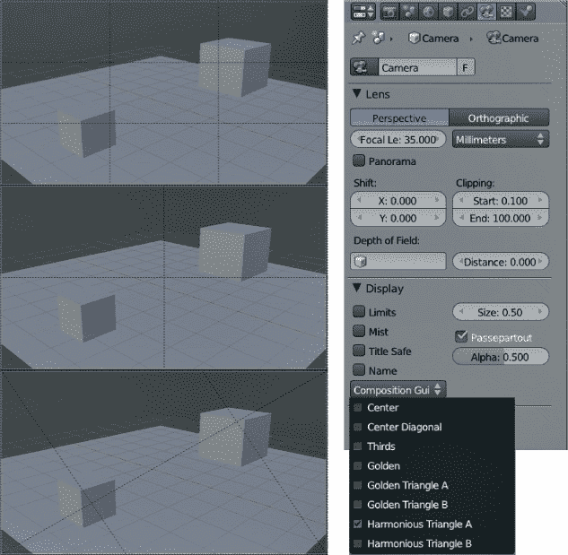图 3-6. Blender 中的构图指南

## 在 GIMP 中准备参考图像

无论是从照片收集项目参考，还是自己绘制参考，通常在 GIMP 中投入一些时间确保您的参考图像在导入 Blender 后能够尽可能地有用是值得的。例如，您可以使用 GIMP 将图像合并为参考图像，或修正图像中的畸变，以获得最佳参考。

### 创建参考图像

在进行项目时，通常需要准备多个图像，以便在工作时快速参考。为此，将多个图像合并成一个参考图像并在 Blender 中作为单个图像加载是非常有帮助的。

要创建参考图像，请在 GIMP 中选择**文件**▸**作为图层打开**，然后选择您要导入的图像。接下来，使用**图像**▸**画布大小**增大画布的大小，以便您可以使用移动工具（**M**）将图像分布并排列到一个画布上，如图 3-7 所示。使用缩放工具（SHIFT-T）将任何明显大于其他图像的图像缩小。最后，添加一个黑色背景层，填充为黑色，并将其移到图层堆叠的底部。将参考图像保存为*.jpg*文件。

### 对齐正投影视参考

*正投影视参考*，或称为*正视图参考*，是从特定视角（正面、侧面、背面或顶部）拍摄或绘制的参考图像，尽量减少透视效果。在绘图时，减少透视很容易；对于照片，可以尽量将拍摄位置远离拍摄对象，使用长焦镜头来减少透视。

如果您将在项目中使用正投影照片参考或绘图，请考虑在 GIMP 中将它们对齐为单一图像，如图 3-8 所示，然后在 Blender 中打开它们，这样每个图像中的每个部件的特征就能够对齐。通过对齐图像，您可以在建模时从多个视角跟踪每个特征。

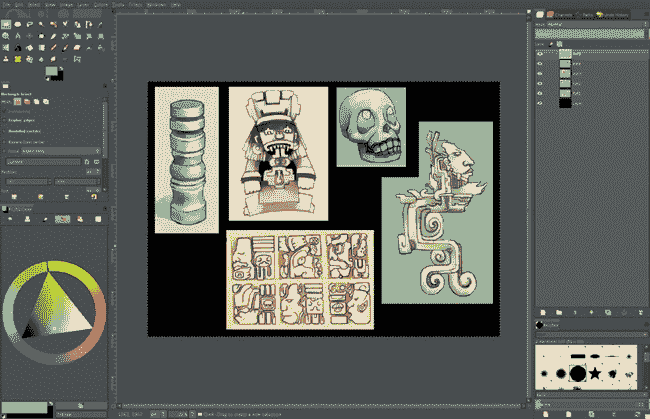图 3-7. 在 GIMP 中创建参考图表。你可以将多个图像作为图层打开，使用移动工具排列它们，然后将结果保存为单个图像，之后可以在 Blender 中打开。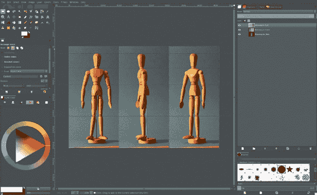图 3-8. 在 GIMP 中对齐正交参考。这里，来自艺术家模特的正面、侧面和三分之一视角的照片正在使用水平参考线进行对齐。每张照片都作为单独的图层导入，并使用移动工具进行对齐。

如果你的参考图像是使用长焦镜头拍摄的，或者是按照正交透视绘制的，你应该能够轻松对齐它。按照创建参考图表中描述的方式，将图像作为图层打开，然后选择一个图层来对齐所有其他图层。使用参考线（点击并拖动图像窗口旁边的标尺）标记关键特征的垂直位置，然后使用 GIMP 的旋转、缩放和移动工具来调整下一个图层，使特征对齐。通过对所有正交视图重复这些步骤，你将基本上创建一个项目蓝图，然后可以用来进行建模（参见图 3-9）。

请注意，在将图像与照片参考对齐时，由于镜头畸变和透视问题，一些特征在每个视图中可能无法完美对齐，特别是如果它们与相机的距离不同。虽然你可以使用 GIMP 的镜头畸变滤镜（滤镜▸扭曲▸镜头畸变）在一定程度上修正镜头畸变，但结果仍然不是完美的正交参考，因为你仍然无法修正透视问题。更简单的做法是尽可能对齐关键特征，并记住在建模时你并不是完全依赖于参考图像；你可以根据自己的判断修正任何你知道会出现的错误。

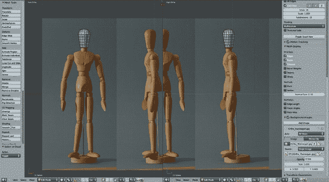图 3-9. 使用正交参考进行工作。从多个角度查看特征可以更容易地准确建模它们。

## 在 Blender 中使用概念图和参考图像

一旦你准备好了概念艺术和参考图像，就有几种方法可以将它们作为参考在 Blender 中使用。当然，你可以直接在标准图像查看器中打开图像，并将其放在屏幕的一侧，但你也可以使用 Blender 的 UV 图像编辑器、背景图像或空对象的图像显示选项。

### UV 图像编辑器

要在 Blender 的 UV 图像编辑器中打开图像，选择 **图像**▸**打开图像**，在文件浏览器中找到你的参考图像或概念艺术，点击 **打开**。Blender 应该会在 UV 图像编辑器中打开图像。如果你之后打开另一张图像，你可以从顶部菜单的下拉菜单中访问之前打开的任何图像，以及任何由纹理数据块使用的图像。

在创建合成时，如果需要使用多个参考图像，我喜欢将它们都合并成一张大参考图，在 GIMP 中制作。然后，我将该参考图保存为 *.jpg* 文件，并在 Blender 的 UV 图像编辑器中打开，如 图 3-10 所示。这个参考图允许我在图像上平移，缩放进出，仔细查看特定的参考图像，而不需要将每一张图像单独加载到 Blender 中，并不断切换它们。

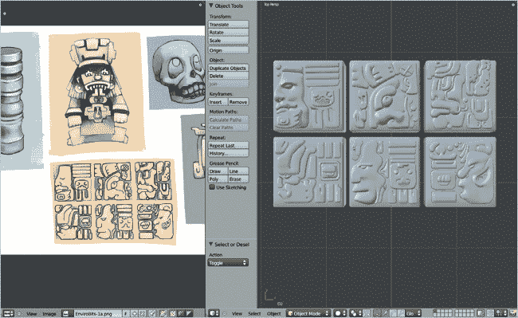图 3-10. 在 Blender 中 UV 图像编辑器中的参考拼贴

### 背景图像

如果你想在 Blender 的 3D 视口中显示图像，最简单的方法是使用背景图像。将光标置于 3D 视口上时，按 **N** 键调出属性区域，在该区域中有背景图像面板（见 图 3-11）。在这里，你可以将图像添加到 3D 视口中，改变它们的大小和位置，并使用轴向设置定义它们显示的视角。

### 图像空对象

背景图像在从正交参考图像进行建模时非常有用，因为你可以设置它们仅在正确的视角下显示，或者在从相机视角查看时显示。

如果使用背景图像有一个缺点，那就是当你在 3D 视口启用透视时，它们是不可见的。幸运的是，Blender 2.6 允许你将图像添加为任何空对象的绘制类型，之后你可以随意定位它们。这使得图像空对象非常适合在场景中任意放置参考图像，这样你可以根据需要移动它们，也适合设置正交参考图像，可以从任何角度查看。

要使用图像空物体，在场景中使用 SHIFT-A▸**空物体**创建一个空物体。然后，在属性编辑器的对象数据选项卡下，你可以将空物体的显示类型设置为**图像**，并选择要显示的图像（参见图 3-12）。空物体现在将在一个平面上显示此图像，你可以像操作任何物体一样移动、缩放和旋转它，将图像放置在场景中，但此物体不会干扰渲染，因为它仅在 3D 视口中可见。

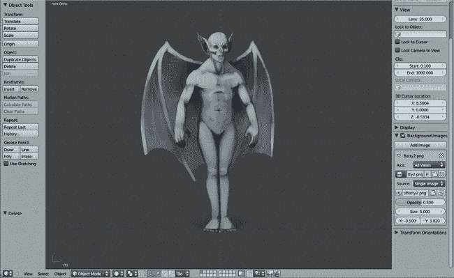图 3-11. 在 Blender 中使用背景图像。你可以使用“添加图像”按钮添加更多图像，这样可以同时查看多个参考图像。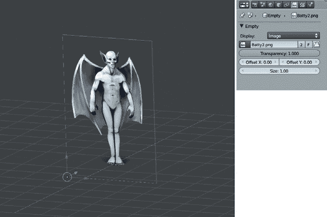图 3-12. 使用图像作为空物体的同一图像现在可以从任何角度查看。如果图像具有 Alpha（透明）通道，它也将作为透明图像显示在 3D 视口中。

## 总结

在本章中，我们回顾了在 Blender 中进行项目时需要考虑的准备步骤，包括规划你想要制作的内容、收集参考和概念艺术以及为最终合成生成创意。然后，我们讨论了在工作时如何将这些信息带入 Blender。下一章，我们将开始建模我们的项目。通过勾画出项目的关键元素，我们将为建立更复杂的模型奠定基础。
