## 第四章：封闭建模

准备工作完成，概念艺术和参考资料已准备好后，我们可以开始建模了。*建模*是创建由单独的点组成的 3D 对象的过程，这些点通过连接形成面，面进一步构成更复杂的形状。Blender 中有许多创建模型的方法，从修改原始形状，如简单的立方体或球体，到逐面构建网格表面，或者绘制 Blender 可以转换为由顶点和面组成的对象的平滑曲线。

建模可能是一个漫长的过程，为了节省时间，了解特定建模任务的目标是很有帮助的。不过，您不可能一次性完成一个对象的建模；您必须从某个地方开始，这就是封闭建模的作用。*封闭建模*是为您想要创建的对象添加简单占位符的过程，这样您可以更好地规划它们如何组合在一起，考虑它们的单独构造，并在问题成为重大问题之前发现它们。一旦一个场景的基本结构完成，您就可以继续精细化、替换或添加每个部分，以创建最终模型。例如，在丛林神庙场景中，像立方体这样的简单元素被用作关键元素的占位符；对于其他项目，我们创建简单的基础网格进行雕刻，这些网格为雕刻模型的最终形态提供了基础。

## 基本建模术语

在我们深入了解之前，以下是本章中将使用的 Blender 基本建模概念的定义。表 4-1 按层次顺序列出了它们：顶点构成边，边构成面，以此类推。

## 编辑模式

编辑模式（如图 4-1 所示）是建模魔法发生的地方。在选中一个网格对象后，您可以通过按 TAB 键或点击 3D 视口顶部的模式下拉菜单并选择编辑模式进入编辑模式。一旦进入编辑模式，您所选的对象就可以编辑（如果它本身可编辑——例如，空对象和灯光是不可编辑的）。当对象可编辑时，您可以选择和操作其中的部分，并创建新部分。

表 4-1. Blender 编辑模式中的重要术语

| 术语 | 描述 |
| --- | --- |
| 顶点（复数 *vertices*）；也称为 *vert* | 3D 空间中的一个点，具有特定的位置。顶点通过连接构成 *网格*。 |
| 边 | 连接两个顶点的线。 |
| 面（或多边形） | 由三个或更多的顶点通过边连接，并填充一个平面表面。由三个顶点构成的多边形称为 *三角形*（*triangle* 的简写）。由四个顶点构成的多边形称为 *四边形*（*quadrangle* 的简写）。具有四个以上顶点的多边形称为 *n-边形*（*n-gons*）。 |
| 法线 | 一个面或顶点指向的方向。可以想象一个旗杆从物体表面垂直指向外部，它指向的方向就是*面法线*。当顶点和边是表面的一部分时，也可以具有法线。 |
| 网格 | 由顶点、面和边组成的集合，所有这些都属于同一个物体。 |
| 拓扑 | 一个术语，指的是网格面在其表面上的“流动”方式。（有关拓扑的更多内容，请参见第五章和第七章）。 |
| 操作符 | 对网格的一部分进行的任何操作，如平移、缩放、复制等。操作符通常接收用户输入（如你想要移动的距离和方向），然后根据这些输入对所选对象执行操作。 |

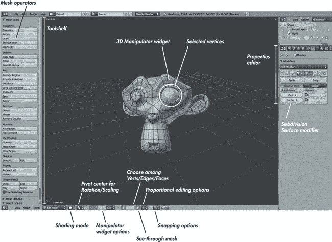图 4-1. Blender 的 3D 编辑模式视图表 4-2. 编辑模式下常用操作符

| 操作符 | 热键 | 描述 |
| --- | --- | --- |
| 删除 | X | 删除所选的顶点、边或面。 |
| 复制 | SHIFT-D | 复制你的选择并允许你移动它。 |
| 拉伸 | E 或 CTRL-点击 | 通过从当前选择中“拉出”新的顶点、边和面来创建新的几何体。拉伸的结果取决于你所选的内容（见图 4-2）。在编辑模式下，若没有选中任何内容，CTRL-点击将会在点击的地方创建一个新的顶点。多次这样操作会创建一串相连的顶点。 |
| 填充 | F | 如果选择了两个顶点，填充将创建一个连接它们的边。如果选择了三个、四个或更多顶点，它将从这些顶点创建一个三角形、四边形或*n*边形。 |
| 旋转 | R | 旋转你所选的顶点、边或面。（你也可以在旋转模式下使用 3D 操作小工具。） |
| 缩放 | S | 缩放你选择的顶点、边或面，允许你调整网格的部分或全部大小。（你也可以在缩放模式下使用 3D 操作小工具来执行此操作。） |
| 收缩/膨胀 | ALT-S | 沿顶点法线的方向移动选中的顶点，以膨胀网格，几乎像气球一样，或将其收缩，使其变薄。 |
| 平滑 | W▸平滑 | 平滑边和面之间的锐角，使得结果网格更加平滑。 |
| 划分 | W▸划分 | 将所有选中的边分割成两段，将面分割成四个，从而创建更密集的几何体。 |
| 平移（也叫抓取或移动） | G | 抓取你选择的顶点、边或面，并允许你移动它们。（你也可以在平移模式下使用 3D 操作器小部件来执行此操作。） |
| 溶解 | X | 删除选中的边或顶点，但用 *n*-边形填充留下的空洞，是删除操作的替代方法。 |
| 连接 | J | 连接两个属于同一面的顶点，并在此过程中将该面分割成两个部分。 |
| 切割 | K | 提供一个刀具工具，允许你沿绘制的线条切割选中的几何体。按住 CTRL 键可对齐到顶点和边的中点。 |

### 注意

Blender 几乎总是提供两种执行操作的方式：通过 UI 和使用快捷键及/或搜索。在许多情况下，学习这两种方式都很有价值，因为学会快速执行操作和在模式之间切换会大大提高工作效率。

进入编辑模式后，你可以通过右键点击选择对象。按住 SHIFT 并右键点击可以扩展选择。要选择或取消选择当前网格中的所有内容，按 **A**。要在选择顶点、边和面的模式之间切换，请点击 3D 视口头部的顶点、边或面选择按钮（见 图 4-1）。

按 **L** 选择与光标下网格部分相连的所有网格部分。选中网格的部分后，你可以对选区执行各种操作，以编辑网格。

表 4-2 列出了在 Blender 建模时你最常使用的操作符。还有许多其他与网格交互的方式，我会在接下来的内容中详细讲解。

若要了解 Blender 中的操作符，请访问 *[`wiki.blender.org/`](http://wiki.blender.org/)* 搜索相关内容。你可以通过搜索菜单（空格键）或浏览 Blender 不同编辑器的头部菜单和面板，轻松发现更多操作符（或搜索已有操作符）。在 Blender 中，悬停在按钮上会显示工具提示，描述操作符的功能及其是否有快捷键。

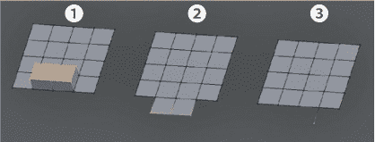图 4-2. 挤出面 1，挤出边 2，以及挤出单个顶点 3。不同选择上的挤出操作将产生不同的结果。挤出顶点将创建边，而挤出边或面将创建面。挤出整个封闭网格（未显示）将复制该网格。

在编辑模式下，**W**键会弹出一个包含许多建模工具的菜单。你在编辑模式下使用的所有操作符都可以在 3D 视图中找到。从 Blender 2.5 开始，当你使用大多数操作符时，工具选项面板会出现在工具架的底部，让你能够事后更改刚才使用的操作符的参数。例如，在应用细分操作符后，你可以使用工具选项面板来改变细分的数量以及是否对其进行平滑处理。

## 其他建模方式：曲线

你可以使用 Blender 以多种方式创建模型，包括使用各种曲线、*元球*（其行为有点像靠近时会粘在一起的黏土团块）、*NURBS 曲面*（由曲线定义的横截面构成的曲面）、文本对象以及贝塞尔曲线。每种方法在建模中都有其特定用途，但最重要的（仅次于网格）是贝塞尔曲线，我们将在本书的建模部分中频繁使用。

*贝塞尔曲线*定义了一个 3D 空间中的路径，并通过控制点和手柄构造。它们可以用来创建沿曲线路径延伸的线状或带状物体（使用闭合或开放曲线），以及通过轮廓定义的平面表面（使用闭合的二维曲线）。每个控制点都有两个手柄，用来定义路径在该顶点的流动方式，从而使你能够创建各种平滑或锐利的路径。

使用曲线建模的方式与使用网格非常相似；你可以抓取、旋转、缩放、复制以及拉伸控制点或其手柄。（不过，你不能从曲线创建面；你只能将曲线中的每个顶点与另外两个顶点连接起来。）

在使用曲线时，请记住以下几点：

****由曲线生成的几何体是*程序化的*。**** 这意味着你定义的曲线将根据你在对象数据选项卡中应用于曲线的设置来生成网格（图 4-3）。你可以更改一些参数，比如每个曲线段的划分数目，以及对曲线应用的倒角和拉伸。

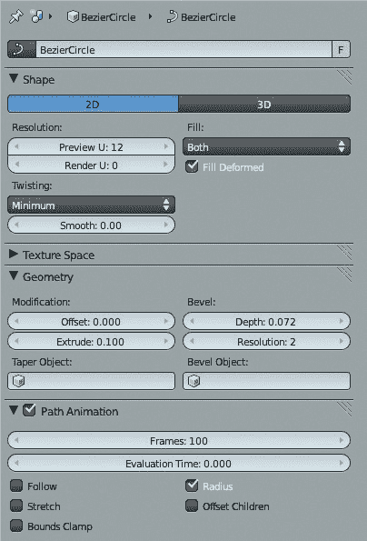图 4-3。对象数据选项卡允许你在 2D 和 3D 曲线之间切换，设置从曲线创建的网格密度（分辨率），并定义如何对曲线进行倒角和拉伸以创建 3D 物体（几何）。

****曲线可以是开放的或封闭的。**** 要关闭曲线，选择其两个端点并按 **F** 将它们连接起来。你可以通过选择两个或更多连接的点，然后选择 **X**▸**段** 来删除封闭曲线的一段，从而使其重新变为开放曲线。

****曲线可以是二维或三维的。**** 二维曲线上的点不能沿曲线对象的 *z* 轴移动，这使得你可以通过定义曲线的轮廓来创建一个平面对象。Blender 然后根据填充设置（见图 4-3）填充该形状。然后，你可以使用对象数据选项卡中的几何设置将封闭曲线的轮廓挤出以创建实心形状。你还可以添加细节，如倒角边缘，并在这里更改曲线的分辨率。

****3D 曲线有一个“倾斜角度”，决定了曲线的挤出方向，如图 4-4 所示。**** 你可以通过显示在 3D 曲线长度上的法线（箭头）看到倾斜的方向。你可以通过 CTRL-T 编辑这个倾斜角度，从而创建一个沿其长度扭曲的曲线。

****曲线可以用来变形网格。**** 可以通过将曲线修改器应用到网格对象上，使网格沿着曲线的路径进行拉伸。

****曲线控制柄可以以多种方式工作，如图 4-5 所示。**** 默认通常是自动或对齐，具体取决于你添加的曲线对象类型。自动控制柄会简单地在一个控制点和下一个控制点之间创建一条平滑的路径，且控制柄指向相反的方向。如果你抓住一个控制柄并移动它，控制点将切换为使用对齐控制柄，这些控制柄指向相反的方向，但可以旋转和缩放，使你能够创建更灵活的曲线。你可以使用快捷键**V**（或通过顶部的曲线菜单）切换到其他控制柄类型。矢量控制柄在点之间创建具有锐角的直线。自由控制柄也会创建锐角，但你还可以像对齐控制柄一样抓住它们并移动，使你能够在控制点之间创建弯曲的线段。

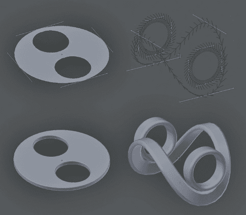图 4-4。不同类型的曲线。左侧：将 2D 曲线挤出并倒角，形成平面切割形状。右侧：将 3D 曲线挤出形成丝带。（曲线的倾斜决定了曲线的扭转方式。）

## 修饰符

修饰符允许你以程序化和非破坏性的方式对模型进行操作。它们是创建 Blender 中几乎任何内容的基础。一些修饰符会生成新的几何体，替换或添加到你的网格中，而其他修饰符则会根据特定规则变形现有的几何体，或提供将仿真和其他更复杂的实体插入到场景中的方法。

我们主要关注那些生成并变形应用到网格上的修饰符，因为它们对于创建模型最为有用。在表 4-3 中列出了一些最重要的建模修饰符。特别是，镜像和子面修饰符几乎在所有有机建模中都会使用。最常用的生成修饰符的效果显示在图 4-6 中。

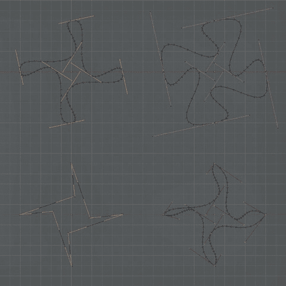图 4-5。具有不同控制柄类型的曲线（从左上角顺时针：自动、对齐、向量和自由）表 4-3。建模的有用修饰符

| 类型 | 修饰符 | 效果 |
| --- | --- | --- |
| **生成** | 镜像 | 沿指定的轴线、关于对象的原点或另一个对象，镜像网格的几何体。镜像修饰符对于创建对称对象非常有用。 |
|   | 数组 | 复制网格几何体，并使用相对于对象大小或其他某个对象的固定偏移量进行偏移。数组对于具有重复元素的模型非常有用。 |
|   | 子面（Subsurf） | 将网格的每个面分割为四个更小的面，并平滑它们，每次迭代都会创建更平滑的网格。子面修饰符适用于具有平滑表面的对象，特别是有机模型。 |
|   | 加固 | 沿法线挤出几何体，创建一个来自表面的实心外壳。 |
| **变形** | 格子 | 使用 3D 网格点来平滑地扭曲网格的形状。 |
|   | 收缩包裹 | 将网格投影到另一个对象的表面上。 |
|   | 曲线 | 沿着曲线路径变形网格。 |

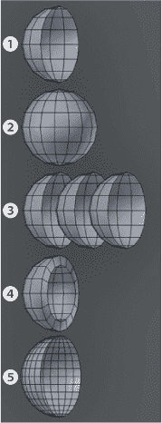图 4-6。不同的生成修改器及其效果。从上到下，我们看到半个球体 1，应用了镜像修改器 2、阵列修改器 3、加厚修改器 4 和细分表面修改器 5。修改器可以组合使用，创建各种形状，比手动建模更容易。

## 丛林神庙的初步搭建

让我们考虑丛林神庙的场景。对于这个项目，我最初的关注点是设计一个能够创造出良好构图的环境布局。我从场景中的主要元素开始：通往神庙内部的门和一些散落在废墟中的石块与树木。

为了制作门，我在物体模式下添加了一个立方体（SHIFT-A▸网格▸立方体），并缩放它（**S**）到我需要的大小。一旦激活了缩放操作符，你可以通过按**X**、**Y**或**Z**来限制只在一个轴上缩放物体。你也可以按住 SHIFT 并按**X**、**Y**或**Z**来在所有轴上缩放，除了一个轴。

切换到编辑模式（TAB），我通过在两侧外部面进行拉伸，并仅在*x*轴和*z*轴上缩放，添加了一个孔。接下来，我删除了中心的面（**X**），并通过选择两个开放的边，每次做一个面（**F**），在中心周围创建了新的面，如图 4-7 所示。

在物体模式下，我添加了一个平面（SHIFT-A▸网格▸平面）并将其放大，形成了场景的地面平面。然后，我添加了一个相机并将其移动到大致能够看到我想要的门的位置。快速的方法是，在 3D 视口中导航到你想要的视角，然后按下 CTRL-ALT-0 将相机对准当前视角。你也可以像操作其他物体一样，移动和旋转相机。注意，这样做可能会导致相机稍微倾斜。你可以通过手动设置相机的 Y 轴旋转为 0 来纠正这一点，方法是使用属性区域（**N**）中的旋转属性面板。

在这里，我通过添加、缩放、移动和拉伸立方体，简单地添加了一些墙壁，形成了场景的主要边界。接着，我开始添加更多的立方体，考虑它们将如何成为场景中最终的建筑元素，比如石墙、雕像和散落的石块。这一过程如图 4-8 所示。

在简单元素封装完成后，我开始为想要生长在废墟上的树木添加粗略的代理模型。为了创建这些代理，我添加了一个贝塞尔曲线对象，并将控制点设置为自动。然后，我使用 Blender 的对齐工具将曲线挤出，形成类似树根和树干的形状，覆盖在占位对象的表面上（图 4-9）。我通过开启对齐功能，将对齐目标设置为面，并启用“投影到表面”功能（图 4-10）。这会在你移动和拉伸曲线时将它们投影到场景中的其他物体上，让你能够在现有场景的基础上“绘制”出树木的形状。

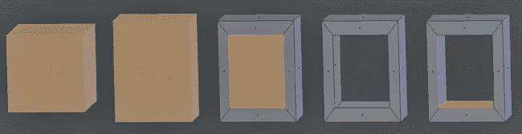图 4-7. 制作简单的门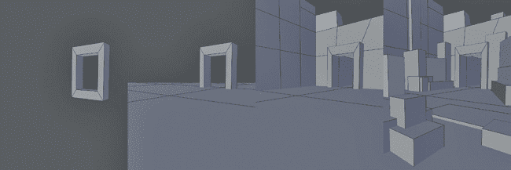图 4-8. 使用简单元素进行封装。我从门开始，然后添加了地面平面、墙壁和立方体来表示场景中的主要元素。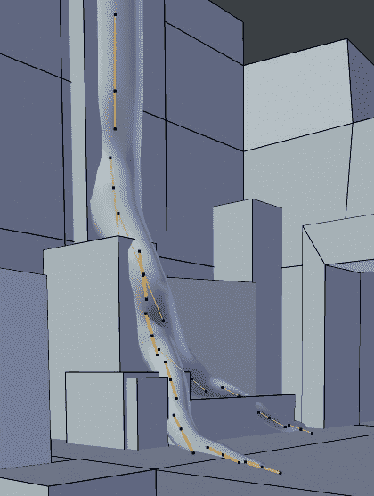图 4-9. 通过将树根对齐到周围环境，我们可以迅速封装覆盖废墟表面的树根。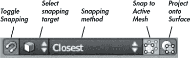图 4-10. 对齐图标

## 对齐

Blender 提供了用于将物体、顶点、面或边缘对齐到各种目标的工具。要启用对齐功能，请点击 3D 视口头部区域中的对齐图标（马蹄形磁铁）（见图 4-10）。然后，从对齐图标旁边的下拉菜单中选择在移动、缩放或旋转时，Blender 如何将你的选择对齐到以下选项之一：

****增量****。您的选择将对齐到最近的增量，从而使您可以构建具有精确对齐点的物体。这对于建模建筑物或机械物体等场景非常有用，在这些场景中，您需要完美对齐的墙壁和地板，没有任何突起或凹陷。（您也可以通过按下 SHIFT-S▸**选择对齐到网格**，将选择对齐到 Blender 的网格。）

****顶点/边缘/面/体积****。您的选择将对齐到任何物体的顶点、边缘、面或内部。您可以通过下拉菜单更改 Blender 选择对齐的对象。点击下拉菜单右侧的图标以旋转选择，使其与对齐的法线顶点匹配。

一个非常重要的对齐选项位于面对齐模式。启用面对齐时，投影到表面图标将会出现。投影到表面会使您创建的几何体在移动、缩放或旋转时对齐到现有物体的表面。这个选项允许您在现有物体的表面上创建新的拓扑结构。在第七章中，我们将在现有物体的表面上创建新的拓扑，以便在雕刻原始物体之后更好地捕捉它们的形状。

## 基础网格

为了创建蝙蝠生物，我需要一个可以雕刻的简单基础网格。基础网格是一个简单的模型，它捕捉到您想要雕刻的模型的基本形状。一旦创建了基础网格，您可以添加多分辨率修改器，并开始在雕刻模式中细分和雕刻细节（请参见第六章")。

您的基础网格应该捕捉到网格的整体比例，并设计为易于细分，从而提供一个均匀的网格供雕刻使用。我们可以稍后重新拓扑雕刻后的基础网格，创建最终模型，但现在使用非常简单的几何体将为雕刻时的实验提供更多自由。

基础网格可以具有任何复杂度，但尽量创建能够支持您知道需要创建的形状的拓扑结构，同时避免引入过多您不确定的细节。根据您对模型外观的确定程度，您可以包含眼睛、嘴巴和肌肉群等特征的拓扑，或者如果您只是在建模一个面部，可以保持基础网格简单，如球体或立方体。

对于蝙蝠生物，我的目标是创建一个基础网格，为整体的身体结构提供拓扑，但省略了细节部分，如头部。我通过将我的概念艺术设置为背景图像并将其作为指南，来开发基础网格。

## 构建蝙蝠生物的基础网格

我从生物的躯干开始建模，以为其余部件提供比例参考，并为它们提供一个附着点。首先，我使用了默认的.*blend*文件（Blender 启动时展示的场景），并删除了其中已有的任何物体。然后，我加载了蝙蝠生物的概念图（如图 4-11 所示）。(有关帮助，请参见在 Blender 中使用概念和参考图像。) 虽然我并不打算完全按照这个概念图建模，但它为我提供了一个有用的参考，用来判断在建模过程中比例的准确性。此时，我没有将翅膀包含在躯体的基础网格中，因为我打算稍后单独建模翅膀。

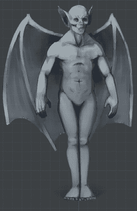图 4-11. 作为背景图加载的概念艺术

接下来，我添加了一个立方体，切换到编辑模式（TAB），并将其缩放到大致的人体比例。我首先通过将其缩放到正确的宽度（**S**）来进行整体调整。然后，我沿*Z*轴缩放（**S**▸**Z**），接着在*Y*轴上进行缩放（**S**▸**Y**），使其变得更高、更浅。通过在立方体的中部添加水平循环切割（在网格周围增加额外的边环，如下文所述）（CTRL-R）并稍微将它们向前移动，我为躯干添加了一些曲线，并开始精细化其形状。

到了这个阶段，由于模型变得更加复杂，使用镜像修改器来保持网格对称变得更容易了。为此，我在躯干的中部添加了一个垂直的循环切割，并删除了右侧的部分。然后，添加了一个镜像修改器，将身体左侧的几何形状镜像到右侧，形成一个对称的整体，只需要编辑一侧（参见图 4-12）。同时，启用裁剪功能，可以防止顶点偏离物体的*x*原点，避免因不小心将顶点稍微移开对称线而导致网格出现漏洞。

### 循环切割、面和边循环

*面环*是一个由四边形组成的字符串，端对端连接，形成连续的路径，使得*边环*（一系列连接的顶点）可以通过中间部分进行切割。例如，在图 4-13 中，围绕面环的两个边环将环绕圆柱体，形成一个新的面环，环绕中间部分。技术上来说，边环/面环应该是一个连续的环形路径，但这个术语通常用来表示任何合理长度的四边形/边缘链。

图 4-12. 为身体添加镜像修改器需要在中间添加一个边环，并先删除一半的躯干。默认情况下，镜像修改器沿*x*轴镜像物体，但你可以根据模型的需要，更改为沿任意组合的*x*、*y*、*z*轴镜像。

环切割工具（CTRL-R）非常重要，因为它沿着四边形路径切割你的网格，穿过每一个四边形，创建新的边缘，流经面环。如果你激活环切割工具并将鼠标悬停在一个边缘上，Blender 会用紫色高亮显示该路径。如果路径遇到三角形或网格的开放边缘，切割会停止。

环切割非常有用，因为它允许你在保持网格拓扑清晰的同时，给模型添加更多细节。你可以在按下 CTRL-R 后，通过滚动鼠标滚轮来创建多个环切割，然后选择一个边缘开始切割（参见图 4-13）。

Blender 还提供了其他操作器，用于与边环和面环进行交互，包括删除环（将两侧的面连接起来，以保持网格完整）和沿与之平行的边缘上下滑动环。你还可以一次选择整个边环进行操作。（如果它不是环形的，Blender 将简单地找到它能够找到的最长路径。）这些操作器的详细信息在表 4-4 中。

作为我的项目的下一步，我从臀部向下拉伸制作了腿部，并添加了循环切割以完善其形状，如图 4-14 所示。对于手臂，我通过从身体向外挤压然后从新挤压区域的底面向下挤压，在肩部添加了一个弯曲，如图 4-15 所示。这给肩部带来了比我直接从身体向下挤压更自然、更合适的转角。

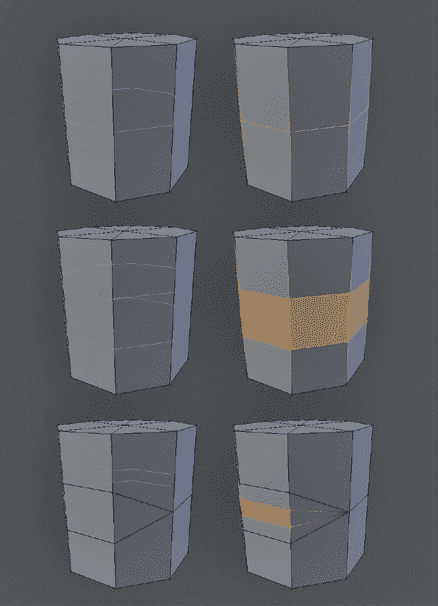图 4-13。你可以通过滚动鼠标滚轮或在按下 CTRL-R 后通过键盘输入一个数字来添加多个循环切割。循环切割在遇到三角形或网格的边缘时终止。表 4-4。边缘循环操作符

| 操作符 | 快捷键 | 功能 |
| --- | --- | --- |
| 删除边缘循环 | X▸边缘循环 | 删除选定的边缘循环部分，其他表面保持不变。 |
| 边缘滑动 | CTRL-E▸边缘滑动 | 允许你沿着与其垂直的边缘滑动整个或部分边缘循环。 |
| 循环切割 | CTRL-R | 在光标下的边缘创建一个新的边缘循环。 |
| 选择边缘/面循环 | ALT-右键单击 | 选择一个边缘/面循环（取决于选择模式）。 |

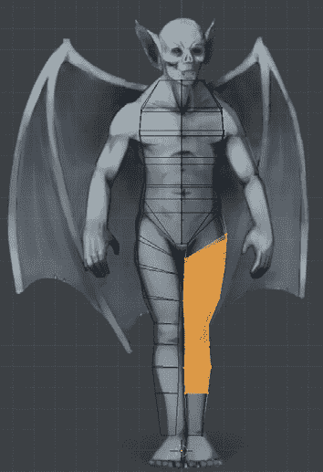图 4-14。向腿部添加循环切割为我提供了更多顶点来定义其形状。

### 角色建模的姿势

你建模角色或生物时的姿势对其最终外观非常重要，而你的策略将取决于你想用你的模型做什么。到目前为止，我已经将蝙蝠生物建模成一种放松的姿势，接近经典的 T 姿势：双臂伸直，双腿与肩同宽。T 姿势在*绑定*角色时很有用（即创建一个骨架，告诉网格如何像有骨骼和关节一样移动）。然而，T 姿势在建模时看起来相当紧张和不自然，这种效果可能会在将角色摆放到其他姿势时持续存在。因此，我希望角色在建模的早期阶段看起来尽可能放松和中立，这样我可以稍后从这个中立位置进展下去。通过将手臂放松并向角色的两侧放置，我消除了这种紧张感，使角色的默认姿势看起来更加自然。

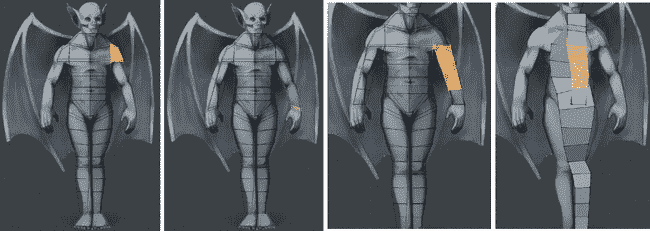图 4-15. 拉伸手臂。肩部创建一个拐角，使得手臂更自然形态。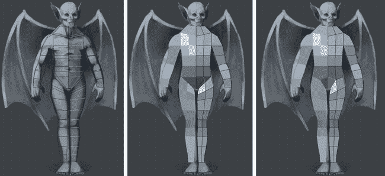图 4-16. 在躯干和腿部周围添加额外的边循环并合并几条边以清理网格

### 注意

*尽管我们不会详细讨论绑定（rigging），但请注意经典的 T 姿势是有原因的。在绑定过程中，角色双臂伸展可以简化骨骼链和约束的设置。然而，Blender 绑定工具的不断改进使得不再像以前那样必须采用 T 姿势。你总是可以在建模和雕刻完毕后，将模型重新摆放回 T 姿势。*

接下来，我选择了身体和腿部前后所有的边，并将它们细分（**W**），以便我能更好地雕刻躯干和腿部的形状。这样做在骨盆部位产生了一些尴尬的拓扑结构，我通过选择这两条新边并将它们合并来修复，如图 4-16 所示。我也对背部的边做了相同的操作。

我在角色的中部添加了一个边循环，如从侧面所见（图 4-17），并且在胸部和手臂下方也添加了边循环。接着，我进一步精细调整了身体形状，收紧了后部的腰部，并使腿部和手臂的形状更加圆润。此步骤将手臂和腿部的顶点数量增加到了八个，这在添加手和脚时会非常重要。

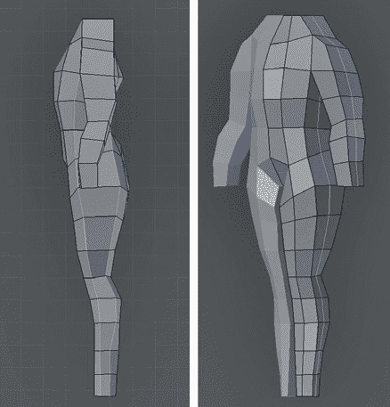图 4-17. 从侧面看，精细调整身体（左）并在中部添加一个边循环（右）

在此过程中，我尽量确保我的网格完全由四边形组成，并力求保持四边形的大小和形状大致均匀且方正。这在创建雕刻基础网格时非常重要，因为三角形、*n* 边形和长条形的面通常会在雕刻时产生伪影。

为了创建一个绕肩部的面片循环（图 4-18），我选择了手臂的面片，并将其从身体中分离出来（**Y**）。然后，我将手臂移出，并使用桥接操作符（W▸桥接两个边循环）在空隙周围桥接边缘。这样将两条顶点链或循环连接在一起，并通过面片从一个连接到另一个。两个循环的顶点数必须相同才能连接。

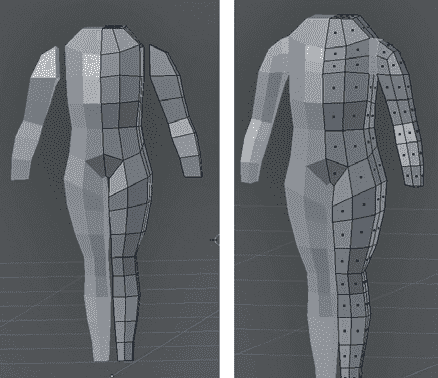图 4-18. 在肩部周围添加一个面片循环。这个循环使得在不变形胸部的情况下，可以轻松调整手臂在不同姿势中的位置。

接着，我在身体的各个部分添加了更多的循环切割，跨越不同的形态，以平整网格并提供大致均匀的方形四边形分布（图 4-19）。你可以使用边缘滑动操作符（CTRL-E▸边缘滑动）来调整现有边循环的位置，这个操作符可以让你上下滑动边循环。

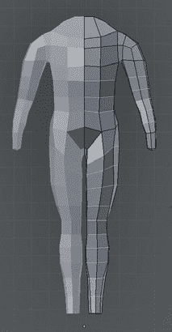图 4-19. 在腿部、手臂和躯干周围添加一些额外的边循环

### 手部和脚部建模

为了建模手部（如图 4-20 所示），我从一个立方体开始，通过沿其 *x-* 轴缩放来扁平它，形成手掌的基础 1。然后，我在中部添加了一些循环切割，并进行垂直切割 2。

到这一点，我本可以直接从手掌底部的每个面片上挤出手指。然而，这样做会在手指交接处产生一些糟糕的拓扑结构，这样的结构在雕刻或变形时表现不佳。相反，我进行了挤出操作，添加了运行在手指之间的面片循环 3。对于中间的手指，我只选择了手部的一半并进行了挤出操作。对于外侧的两个空隙，我在手掌底部的两侧中部 4 面上进行挤出，同时连接两侧的底部，共计 10 个面片。

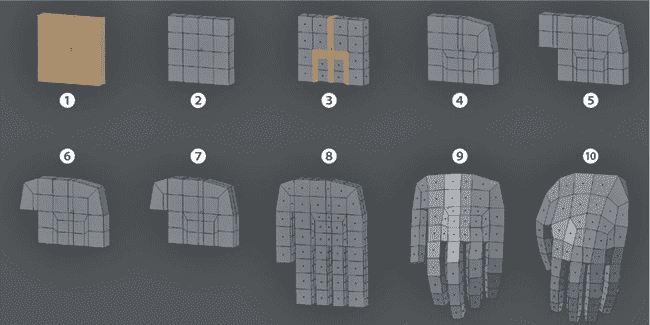图 4-20. 创建手部

为了减少手部顶部（最终与手臂连接处）面片的数量，我将手部顶部角落与拇指对面的两对边缘合并（图 4）。(记住，我的目标是让手部与手臂连接时有八个顶点，所以这一区域需要保持简单。)

对于拇指，我首先从手部正面的一些面上向外挤压了两次，然后将角落的顶点合并，形成了一个弯曲。接着，我添加了一个环形切割，环绕在手部的外侧，挤压了手指和拇指，并稍微平滑了它们（W▸平滑）。接下来，我通过选择整个手指进行旋转，然后选择后三分之二的部分，再旋转指尖，稍微让手指和拇指有些向内卷曲。我还通过从上视图选择手部的一部分，并开启比例编辑，旋转这些部分来调整整个手部的形状，使手掌和拇指呈现轻微的弯曲。

我稍微平滑了手部（W▸平滑），使手指和手掌看起来不那么方块。通过选择手掌表面，并开启比例编辑，我稍微膨胀了它（ALT-S），使手部更有立体感（10）。这完成了图 4-20 中展示的建模阶段。

为了将手部连接到手臂（图 4-21），我删除了手部顶部中间的四个面，将手部移动到合适位置，然后在物体模式下将手部与主身连接（CTRL-J）。接着在编辑模式下，我删除了手臂末端的相应面，并连接环形边缘，完成手部与手臂的连接。

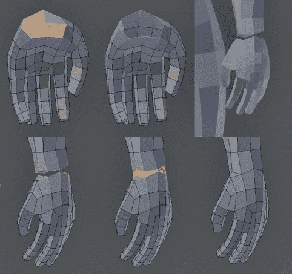图 4-21. 手部与手臂连接

由于我保持了手臂末端和手腕周围的顶点数量相同，手部与手臂的连接相对顺利，如图 4-21 所示。因为连接处现在有两个非常靠近的边环，我删除了其中一个（通过 ALT-右键选择，然后使用 X▸Edge Loop 删除），以使边环的分布更加均匀。

脚的建模与此相似，如图 4-22 所示。我从一个立方体开始，首先挤压出了脚的大致形状。我添加了面环以在脚趾之间产生间隙（2 到 4），挤压了脚趾（5），稍微平滑了脚部（6），然后合并了脚背角落的边缘，以改善边环在脚背部的流动方式，并减少整体多边形数目，正如我在手部建模时所做的那样（7）。我使用了膨胀和比例编辑功能，使大脚趾变得更大，并细化了脚的坡度，脚从小腿部分向下倾斜，从大脚趾侧到小脚趾侧也有下坡（8）。同样，由于小腿周围有八个顶点，我可以从脚的顶部删除四个面，并通过连接小腿的间隙（9 和 10）。然后，我通过滑动、删除或添加边环来整理小腿部的边环分布，以便使边环更加均匀分布（11 和 12）。

### 建模头部

头部最初只是一个拉出的立方体，先是拉出前部，然后再拉出底部形成下巴（图 4-23）。添加了一些环形切割后，我从底部拉出形成脖部，然后对形状进行了平滑和细化，以便使轮廓更好，并稍微缩小前部。我从头部两侧的面上拉出一些几何体来创建耳朵的形状。然后，就像处理身体一样，我删除了一半，并添加了一个镜像修改器。接着，我将头部与身体连接，删除了中间的面，并使用桥接操作符填补了空隙。

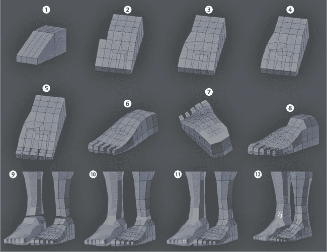图 4-22. 构建脚部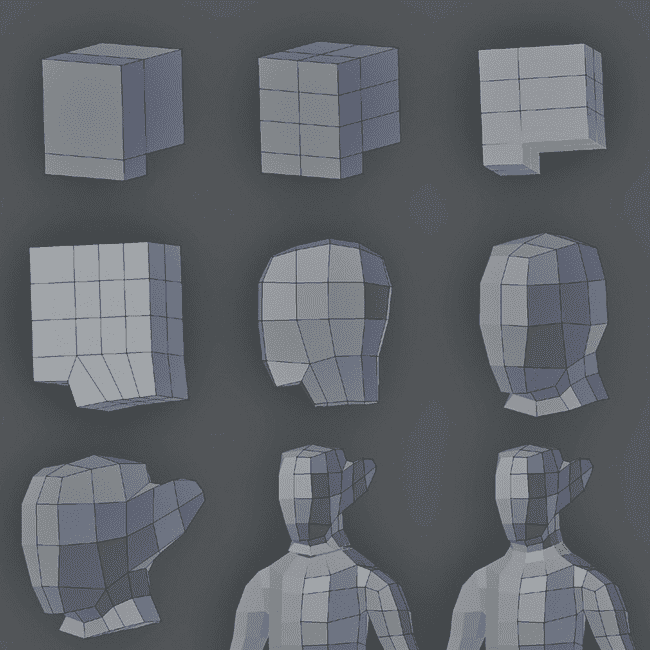图 4-23. 制作头部并将其连接到身体

### 注意

*在使用 CTRL-J 将头部与身体连接之前，确保头部原点的 x 位置与身体对齐。如果不对齐，身体上的镜像修改器和头部的中心不同，会导致头部分裂并迫使你重新连接面。*

### 使用比例编辑调整模型

如果你不喜欢模型某些部分的比例，完全不必单独调整每一个顶点。你可以使用 Blender 的比例编辑功能，选择、缩放或旋转一个顶点，并拖动附近的顶点，这样就可以按比例进行调整。

要启用比例编辑，请使用 3D 视图窗口顶部的圆形图标（如图 4-1 所示）或快捷键 O。一旦启用比例编辑，你可以调整附近未选择的顶点的拖动距离（与已选择顶点一起），以及效果的衰减曲线。要改变半径，可以在操作选择时滚动鼠标滚轮。通过点击比例编辑图标旁边的下拉菜单，你可以选择不同的衰减曲线。你也可以设置比例编辑仅影响连接的顶点（ALT-O），这将只拖动与所选顶点位于同一网格中的附近顶点，让你在移动手臂时不影响模型的腰部。

不同的衰减设置会显著影响网格部分变换的效果。例如，Sharp Falloff 选项会在你抓住并移动一个顶点时创建尖锐的峰值，而 Sphere Falloff 选项会形成膨胀的球形形状。Random Falloff 选项适用于粗化网格表面；通过抓住一个顶点并稍微移动它，设置较大的衰减半径，你可以在网格表面上添加轻微的随机变化。

比例编辑不仅仅适用于调整比例，它还有许多其他用途。例如，你可以用它通过抓取或旋转网格的部分来创建有趣的曲线或扭曲变形（见图 4-24），或者在不需要绑定骨骼的情况下为角色摆姿势。

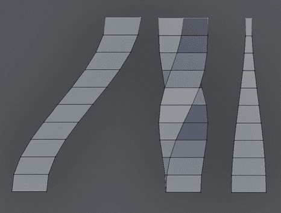图 4-24. 比例编辑有许多用途。这里使用比例编辑来变形一个细分的柱子，通过（从左到右）平移、旋转和缩放操作，并采用标准的“平滑”衰减。

我使用比例编辑对网格进行了一些微调，例如稍微拉回手臂和肩膀，并在腰部水平的地方稍微收窄背部。

### 创建翅膀

为了更方便地在身体和翅膀上雕刻，我将它们创建为独立的网格，之后在重新拓扑时可以将它们合并。为了创建翅膀，我首先使用参考图像大致搭建了骨架，先从一个小平面开始，并沿着骨骼的长度进行构建（见图 4-25）。为了更容易得到我想要的拓扑结构，这时候我保持网格为 2D 形式。

在基本骨架完成后，我开始在骨头之间填充翅膀。为了确保缝隙能够整齐地填补，我沿着骨骼分布了顶点，使它们大致对齐，并根据需要添加更多顶点或移动现有顶点。接着，我对边缘进行了拉伸和缩放，创造出翅膀与骨骼之间的清晰分界，并开始填补空隙。（拉伸/缩放操作虽然不会产生完美的结果，但你可以手动调整顶点位置，以获得更好的布局。）

填补缝隙后，我选择了整个模型并将其向后拉伸，给它增加了一些厚度，如图 4-26 1 所示。接下来，我只选择了翅膀膜区域，并使用缩小/加粗工具（ALT-S）将这些区域稍微缩小 2。此时，翅膀有了一些厚度，但看起来仍然很平。为了解决这个问题，我首先选择了翅膀的中心部分，并稍微将它们向后移动，给翅膀增加了一些凹形曲线 3。

### 注

*有时 Blender 会错误地计算网格的法线，这可能会导致像收缩/膨胀这样的操作符和像细分表面或倒角这样的修饰符行为异常。如果你将网格设置为平滑绘制，通常可以看到黑色边界出现在法线冲突的区域之间。解决这个问题的方法是，简单地在编辑模式下选择整个网格，并使用重新计算法线操作符（CTRL-N）强制 Blender 重新计算物体的法线。*

接下来，我使用了 Warp 操作符（SHIFT-W）给翼部添加了曲线 4。这个操作符使用 3D 光标的位置作为操作的中心，并将选定的顶点围绕该中心排列成一个圆形。你可以通过光标来定义顶点的扭曲程度；在使用操作符之前将 3D 光标设置得离网格更远，会使曲线的半径更宽。

通过这些处理，我能够通过切换到顶部视图并使用 Warp 工具为翼部添加一个漂亮的曲线。此外，通过旋转网格并再次使用 Warp，我也能够为翼部的轮廓添加一个类似的曲线 5。

Warp 操作符通常会稍微移动网格，因此我切换回物体模式（TAB），在应用变换之前将翼部移回到我想要的位置（CTRL-A▸应用位置，然后对旋转和缩放重复相同操作）。

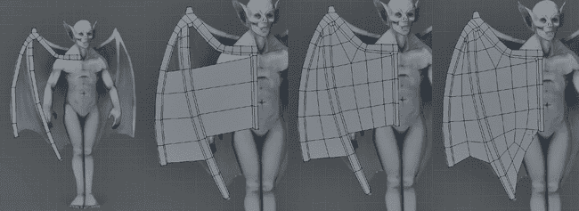图 4-25。翼部封装。在二维平面上开始翼部的布局可以保持简洁，并使得构建我们想要的结构变得更加容易。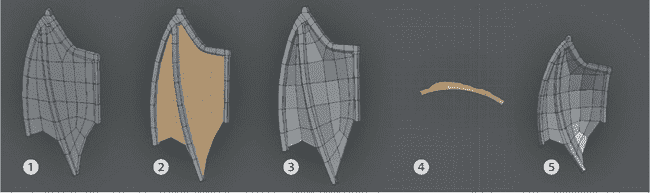图 4-26。翼部封装。翼部被拉伸，骨骼之间的膜变得更薄。然后，整个翼部使用 Warp 工具添加了一些曲率。

### 应用变换

像 Warp 这样的操作可以将你的物体移出原位，需要你旋转、缩放或平移网格才能将其恢复到正确的位置。通常，最简单的方法是在物体模式下一次性移动整个网格，尽管这样做会影响物体的局部坐标，在使用运算符和修改器时可能会导致奇怪的结果。例如，我接下来想要使用镜像修改器将蝙蝠生物的翅膀复制到基础网格的另一侧，但在使用 Warp 运算符并在编辑模式下移动和旋转翅膀之后，添加镜像修改器会导致错误的结果（参见图 4-27）。这是因为在物体模式下旋转物体时，我也旋转了它的局部坐标。因为镜像修改器使用这些坐标来镜像物体，所以结果并不是你期望的。

要查看物体的局部坐标，请在属性编辑器的物体标签中打开坐标轴设置（参见图 4-27）。要重置坐标轴以匹配全局坐标系统，请依次在物体模式下使用每个应用位置/旋转/缩放运算符（CTRL-A），这将把物体的原点放置在全局原点，并使其局部坐标的旋转和缩放与全局坐标匹配，而不影响物体的形状。这样，你就可以更可预测地进行建模、添加修改器和执行其他操作。

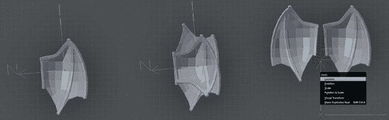图 4-27. 打开物体的坐标轴后，可以明显看出为什么镜像修改器没有产生预期效果。在应用修改器之前先对网格进行变换会产生更可预测的结果。

### 注意

*当然，除了上述方法，你也可以利用物体的局部坐标来发挥优势。例如，你可以使用镜像修改器创建一个对称的物体，然后将其移动和旋转到一个不符合全局坐标的场景位置。只要在此时不在物体模式下应用这些变换，修改器的结果应该会保持你想要的效果。*

最后，与身体部分一样，我添加了一个镜像修改器，然后使用比例编辑将翅膀与背部更好地对齐，并调整了形状。

到目前为止，我已经完成了蝙蝠身体的阻塞，如图 4-28 所示。我们将在雕刻完成后创建最终拓扑，如第五章和第七章中所讨论的那样。

## 阴影模式

请注意，到目前为止，在阻塞出这些项目时，我保持了我们正在创建的网格使用平面阴影——也就是说，面看起来是平面的，并且没有相互融合。这样做的原因是，它能使我们一眼就能看出网格面法线的方向，并且能够清楚地看到网格形状的进展。稍后，我将使用光滑阴影渲染一些模型，使它们看起来平滑（图 4-29），但目前来说这并不是必须的。要在两者之间切换，只需选择你的网格，然后在工具架中使用平面和光滑操作符来切换选定区域的阴影模式。你可以在对象模式中进行切换，这会影响每个选定对象的整体，或者在编辑模式中进行切换，这只会影响选定的面。

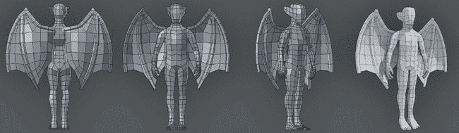图 4-28。完成的身体基础网格！平面和光滑阴影模式。光滑阴影模式通过在网格面法线之间进行混合，使其看起来平滑。你可以在对象模式或编辑模式中使用“光滑阴影”和“平面阴影”操作符在这两种模式之间切换。图 4-29。平面和光滑阴影模式。光滑阴影模式通过在网格面法线之间进行混合，使其看起来平滑。你可以在对象模式或编辑模式中使用“光滑阴影”和“平面阴影”操作符在这两种模式之间切换。

## 创建蜘蛛机器人

在制作蜘蛛机器人时，我只需要身体和腿部的基本部分。为了生成更多关于身体主要部件的细节，我使用了雕刻技术，然后进行了重拓扑，并通过传统建模添加了更多机械部件。

从两个立方体开始，一个用于腹部（背部段），另一个用于头胸部（头部和身体段），我大致调整它们的比例，如图 4-30 所示 1。通过添加一个 Subsurf 修饰符（CTRL-1），我能够获得更圆滑的形状，而无需添加并手动调整大量的边循环。只添加几个边循环就使我更接近所需的形状 2。

在对象模式下将两个立方体合并为一个对象（CTRL-J）后，我在细分级别 1 上应用了 Subsurf 修饰符，以增加更多几何形状来操作 3，但我首先复制了修饰符，以便进一步细分网格。当应用修饰符时，它对网格所做的更改会被应用到网格上，从而转换为可以编辑的几何形状。这使我能够从身体前部拉伸出一些新面，形成头部的隆起 4。在仍然选择着拉伸面时，我按 CTRL-+来扩展选择，使用 ALT-S 稍微加粗它，然后稍微平滑一下，完成了用于雕刻身体的基础网格。

对于腿部，我首先规划了腿部的主要部分，长条形、扁平、骨头状的部分用于腿的长节段，盾形的部分用于膝盖和脚部段落。我为前后两对腿和中间两对腿分别创建了两个略微不同的长节段 5。为了创建这些部分，我从一个平面开始，添加了一个镜像修饰符使腿部对称，然后挤出一个边并添加环形切割，以创建腿部的俯视图。接下来，我选中了整个物体（**A**），并通过首先挤出（**E**）而不移动新面来沿法线方向挤出它。然后，我沿法线方向移动新面（ALT-S），使腿部段具有均匀的厚度。目前，我只创建了每个部分的一个副本；在雕刻和重拓扑后，我会复制完成的部分并将它们定位以形成腿部。这完成了蜘蛛机器人的一些基础部件。

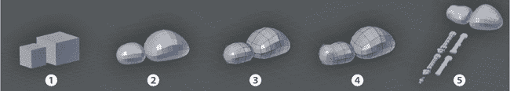图 4-30. 为蜘蛛机器人创建基础网格

## 回顾

本章为模型奠定了基础。对于蜘蛛机器人和蝙蝠生物，这意味着创建具有简单拓扑的基础网格，稍后我们将在这些网格上雕刻，完善角色设计。至于丛林神庙，我用简单的占位网格封锁了场景中最重要的元素。在下一章，我们将替换并扩展这些占位符网格，同时为另外两个项目建模一些额外的细节，并在过程中讨论一些更深入的建模概念。然后在第六章，我们将开始使用 Blender 的雕刻工具对本章中创建的基础网格进行雕刻。
