## 第五章. 细节建模

在第四章中，我们设置了项目的基本元素，创建了丛林神庙的阻塞模型，并为雕刻蝙蝠生物和蜘蛛机器人建模了基础网格。在本章中，您将学习如何完善这个框架，创建完成的模型。

为了创建最终模型，我们需要使用各种技术对简单几何体进行转换。这些技术包括使用修改器添加程序化细节，以及手动建模元素。我们的目标应该是最终得到干净、建模精良且细节丰富的网格，而不至于过度复杂化或引入无用的几何体，这些都会拖慢渲染速度或产生伪影。

建模细节非常有趣，但也可能相当重复，因此我不会详尽地讲解制作每个部分的过程。相反，我将重点介绍一些制作项目中特定元素的关键方面，这些方面既有趣又棘手，其余部分就留给你们发挥想象力吧。我们将从一些关于拓扑的讨论开始，讲解什么样的网格是“好”的网格，然后再进入实际的建模过程。

## 拓扑

*拓扑* 描述了网格的边缘和面是如何连接并在其表面上流动的。我们在为雕刻蝙蝠生物和蜘蛛机器人创建基础网格时已经讲解了拓扑的基础——即围绕手臂和腿部创建均匀的顶点环路，并避免使用三角形面。现在让我们谈谈为什么我们要这样做。

有许多方法可以创建具有相同基本形状但在构建过程中使用非常不同面配置的网格，如图 5-1 所示。

虽然图 5-1 中的形状大致相同，但中间的网格是最有用的，因为它的几何结构与面部的形态相吻合，围绕眼睛和嘴巴形成环路，并整齐地延伸到脖部和头部。此外，它与其他网格一样好地描述了头部的形态，甚至更好，同时使用的面数更少。

这个网格的流畅特性对动画也很重要，因为它使网格可以轻松且平滑地变形。例如，闭眼或张嘴时，不会使边缘不自然地拉伸，也不会导致网格的某些部分产生不愉快的交错。基于环路的拓扑结构在创建形状的进一步变化时也很有帮助，它使得放置 UV 接缝和展开 UV 时，网格的拉伸不会过于严重（有关展开的更多内容，请参见第八章）。

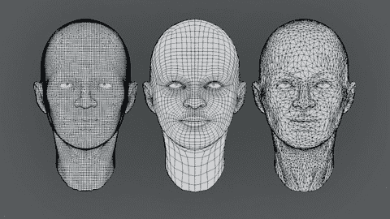图 5-1. 同样的头部形状与三种完全不同的网格

在图 5-1 中，位于中间的网格是更好的选择，原因是它的拓扑最适合与*细分表面（Subsurf）修饰符*配合使用。我们在第四章中讨论过的细分表面修饰符，用于细分和平滑网格。细分表面修饰符使用的算法，Catmull-Clark 细分，在像这个网格这样构建的网格上效果最佳。当细分表面修饰符用于含有大量三角形或长而不规则面片的网格时，可能会得到较差的结果，但当应用于结构良好、流畅的拓扑时，它能生成非常可预测的、平滑的形状。

### 什么是良好的拓扑？

良好的动画拓扑通常也适合细分，反之亦然。那么，什么是良好的拓扑呢？虽然没有绝对的规则，但有一些重要的原则。它是艺术和科学的结合。

****尽量避免三角形和*n*边形。**** 这是最重要的一点。虽然三角形在静态网格中没有问题，特别是当你不打算细分或在低多边形对象中使用时，如果你计划细分网格，尽量使用尽可能少的三角形，因为三角形在细分时不如四边形表现得好。同样，*n*边形在细分之前会被转换为三角形，导致同样的问题。

****避免有很多边的极点。**** *极点*是指三个、五个或更多边相交的顶点——也就是说，网格中一个偏离网格结构的点。像三角形一样，极点在细分网格时可能会产生伪影。拥有三个或五个边的极点并不算太糟——事实上，除非创建环形物体和网格，否则几乎不可能不创建一些极点——但拥有六个或更多边的极点在细分时表现较差。

****在重要形状周围创建环路。**** 这使得你可以轻松选择、变形和动画化你的网格，同时确保它们能干净地细分。例如，在图 5-1 中，使用围绕眼睛流动的边缘环路使得调整其形状变得更加容易。

****让边缘与形状对齐。**** 如果你的对象大致是圆柱形的，网格的边缘应该沿着其周长和长度流动。如果你的对象大致是立方体形状，应该从一个立方体开始，并添加环形切割。一般来说，尝试创建一种与所要创建的形状“纹理”一致的网格结构，如图 5-2 所示。

### 处理困难的拓扑

上述规则很简单，但你可能会遇到一些麻烦，尤其是在尝试从模型中消除三角形和极点时。以下是处理困难拓扑的一些技巧：

****提前规划。**** 大多数拓扑问题只需要提前规划就能避免。例如，在制作蝙蝠生物的基础网格时，我们确保了手臂和腿部的环路中有八个顶点：这样在连接手部时非常方便，因为在桥接空隙时没有多余的边需要连接。以 2 的幂（8、16 或 32）来思考往往是一个不错的方式，但无论如何，创建边环时尽量保持偶数。如果你是 3D 建模新手，提前在照片或概念图上草图化你的期望网格会很有帮助，可以使用 GIMP 或者纸上绘制，如图 5-3 所示。

****两个三角形组成一个四边形。**** 你可以将两个相邻的三角形连接成一个四边形，一举两得。要自动将多个三角形转换为四边形，选择你的网格并按下 ALT-J，将合适的三角形对转换为四边形。

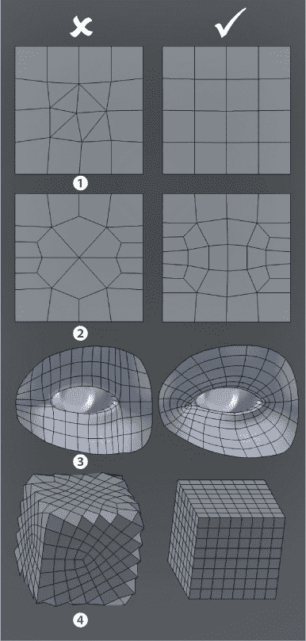图 5-2. 拓扑操作的注意事项：避免三角形 1，避免极点 2，围绕重要形状创建环路 3，并且让边与形状对齐，而不是与之相对 4。

****旋转边缘以移动三角形。**** 要旋转或“旋转”一条边，选择它并按 CTRL-E▸**旋转边缘顺时针/逆时针**（顺时针/逆时针）。这将重新排列该边周围的面，从而允许你移动三角形。你可以将这个技巧与上面提到的连接相邻三角形的技巧结合使用：通过旋转边缘将两个三角形组合在一起，你可以消除它们，如图 5-4 所示。

图 5-3. 提前草图化你的拓扑可以帮助你避免困难。

****添加边环。**** 添加一个结束于三角形的环切（CTRL-R）会将该三角形转换为四边形（或两个三角形，你可以将它们合并为一个四边形）。如果新的边环终止于开放边缘，你就消除了这个三角形。如果你的网格是封闭的，它可能只是将三角形移到边环的另一端，如果两端都有三角形，你可以一次去掉两个（三角形）（参见图 5-5）。

****将极点分成两部分。**** 一个具有六条边的极点可以通过在两半之间添加一个面环来轻松分裂为两个五边形极点。为获得更干净的拓扑，添加更多的面，如图 5-6 所示。

****切割、溶解和连接。**** 切割工具（**K**）允许你任意切割边缘和面，以获得你想要的拓扑。你可以将这个工具与溶解操作符（X▸溶解）结合使用，以去除顶点的边缘，而不删除它们所属的面。然后使用连接边缘操作符将已经是面一部分但没有连接边缘的两个顶点连接起来。这些工具非常适合任意重组复杂的拓扑。

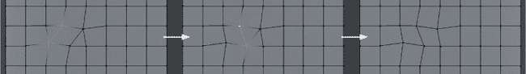图 5-4. 旋转边缘将两个三角形带到一起，可以消除它们。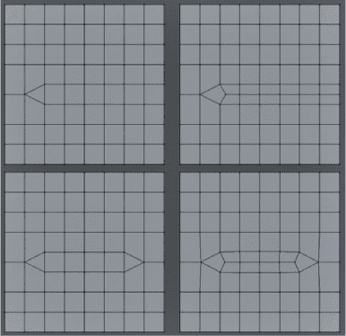图 5-5. 使用环切工具（CTRL-R）添加边环可以去除三角形。如果你在两个三角形之间添加一个，你可以一举去掉它们两个。或者，你也可以删除已经存在的一个边环，达到类似的效果。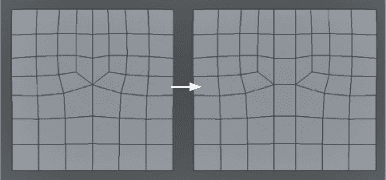图 5-6. 添加面以去除极点。将一个面环添加到六个极点之间，将其减少为两个五边形极点，这样细分效果会更加干净。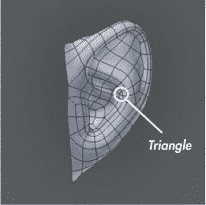图 5-7. 隐藏在耳朵角落的这个三角形不太可能引起太多问题。

****如果你无法去除它，就隐藏它。**** 如果你真的无法去除某个三角形，可以把它隐藏到不会引起麻烦或产生细分伪影的地方，比如耳朵或鼻孔内，或者某个不需要变形的非常平坦的地方，如图 5-7 所示。

****当不确定时，从头开始。**** 如果你曾经做成过某件事，通常你可以再次做到，并且做得更好。可能需要一些额外的时间，但通常是值得的。

## 丛林神庙的细节建模

丛林神庙的场景已经被初步搭建完成，接下来需要进行精细化处理，使其更加接近最终效果。这个过程需要我思考想要创建的形状，并使用这些形状来建模出更复杂的网格，最终渲染出想要的效果。

### 墙壁

对于丛林神庙的主墙，我首先布置了立方体来形成墙壁的石块（参见图 5-8）。从最底层开始，我手动添加每一块，并修改它们的长度以增加一些变化。接下来，我通过复制和缩放立方体，搭建了更高的层次。为了增加更多变化，我随机选择一些方块，将它们从墙体中移入或移出，并稍微旋转它们，使墙面的表面显得更加不平整。将初步搭建阶段的基础墙体留在新的方块后面，为方块之间的缝隙提供了填充物。

为了给方块添加斜边（参见图 5-8），我对其进行了几次细分（在编辑模式下选择所有[**A**]，然后按 W▸Subdivide），接着添加了 Bevel 修改器，并将“限制”方法设置为角度。限制将倒角仅应用于具有锐角的面之间的边缘，并且将角度设置为大约 45°可以得到一个圆滑的倒角，使方块的角部比边缘更重。边部保持不变。

### 注意

*应用 Bevel 修改器时，可能会出现将几何体转化为三角形并创建大量重复顶点的错误。为了解决这个问题，在完成建模后再应用修改器。然后，在编辑模式下，选择所有内容（A）并使用“移除重复顶点”（W▸Remove Doubles）操作来消除重复的顶点。接下来，使用“将三角形转换为四边形”（ALT-J）操作，将网格恢复到没有那么多三角形的更干净的状态。你也可以在编辑模式下对单独的边和顶点进行倒角，使用 Bevel 操作符（W▸Bevel）。*

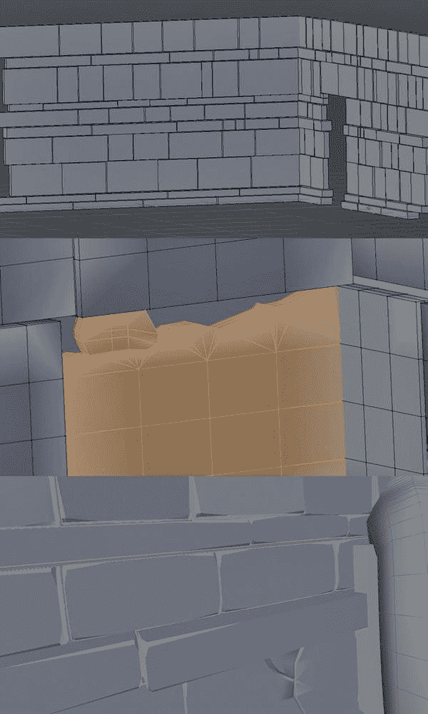图 5-8. 为墙壁创建石块。首先，我使用简单的立方体构建墙壁，通过缩放和移动来搭建墙体。接下来，我通过添加一些基本的细分并粗化一些边缘来稍微破坏墙壁。最后，我使用角度限制的 Bevel 修改器对方块的边缘进行了倒角处理。

对于这些方块的细节，我细分了一些方块，并添加了额外的特征，比如中间的裂缝、角落的缺口和分裂。我添加了环形切割或细分了特定的部分，并移动了顶点来创建裂缝、凹陷和缺口。因为网格不会被大幅度细分或变形，所以这里不需要避免三角形；它们不会造成问题。

为了防止方块看起来有棱角，我将它们的着色模式设置为平滑，然后添加了一个 Edge Split 修改器，在特定的边缘处拆分网格，以产生独立的表面（见图 5-9）。Edge Split 修改器将网格拆分成独立的部分，这样在平滑着色或应用进一步修改器时，部分之间的边缘会被保留下来。你可以设置 Edge Split 使网格沿着在编辑模式下标记为 Sharp 的边缘（CTRL-E▸Mark Sharp）或沿着面之间有足够尖锐角度的边缘进行拆分。仅使用 30° 的角度设置可以得到外观不错的方块。

我按照与墙壁相同的方法创建了其他附加的方块和铺路板，使用初始的立方体作为放置的指南，随后在新方块放置完毕后删除了旧的几何体。最终的方块如图 5-10 所示。

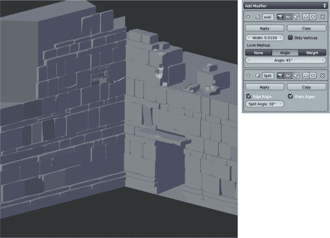图 5-9. 最终的墙壁，使用了倒角和边缘分割修改器，使其具有倒角边缘和平坦的侧面。

### 雕像

我用相当基础的构建块和概念艺术作为指南，在丛林神庙门口的角落建模了雕像。每一部分都从一个简单的原始体—通常是一个立方体或圆柱体—开始，通过变换、细分和挤压来创建所需的形状。

如图 5-11 所示，每个部分都相当简单。为了添加倒角边缘，我使用了与墙壁和地面块相同的方法。通过在一些部分的末端添加环形切割（例如，在“腿部”与“手臂”末端），可以使这些边缘在倒角时保持其方形形状和锐角，而不会过度细分。

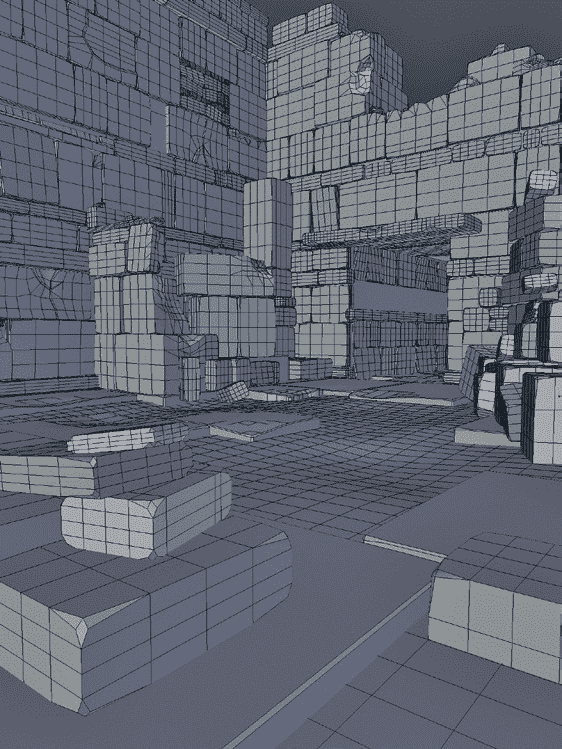图 5-10. 场景中的其他石块与墙壁采用相同的建模方式。

### 石雕

对于石刻符文，我使用概念艺术作为唯一的正投影视图，将其加载为背景图像，如第三章所讨论的那样。接着，从一个平面开始，我勾画出每个设计部分，尽可能保持主要使用四边形。然后，我将整个设计向下挤压，赋予其一定的厚度，并随后删除新面，仅保留设计的侧面和前面。通过在设计内部元素的形状上放置边缘，我能够将设计中的沟槽向下移动，创造出细节。

为了清理设计，我使用了折痕（见图 5-12）。通过添加 Subsurf 修改器并将边缘标记为折痕，您可以创建沿标记边缘处具有锋利折痕的光滑物体。折痕让我能够在不增加多余多边形的情况下，为模型添加紧凑的折痕。然后在 Subsurf 修改器后添加 Edge Split 修改器，生成了光滑的网格，并在折痕边缘处形成了清晰的过渡。

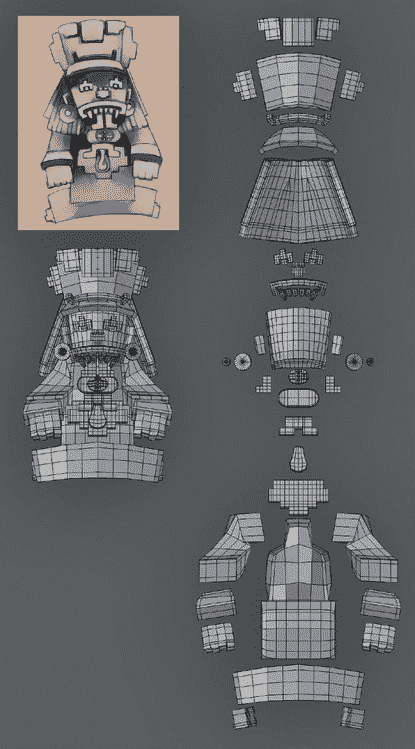图 5-11. 雕像模型被分解成其组成部分。大部分来自简单的立方体或圆柱体。

完成雕刻后，我开始将它们放入我的场景中，通过用雕刻符文的行替换墙壁上的一些石块行来实现。为此，我将所有六个符文排成一行，然后使用数组修改器将设计重复，填充整个墙壁的长度（参见图 5-13)。

#### 标记边缘

网格的边缘可以通过多种方式标记或标注，每种方法告诉不同的 Blender 操作符和修改器如何对网格进行操作。在编辑模式下，边缘操作符（包括标记）快捷键是 CTRL-E。边缘可以标记为锐利，这样像倒角和边缘分割这样的操作仅对这些边缘起作用。它们还可以被赋予*折痕*值，无论是在 CTRL-E 菜单中，还是使用 SHIFT-E，这告诉 Subsurf 修改器在进行细分时不平滑这些边缘，从而形成漂亮的锐利边缘。

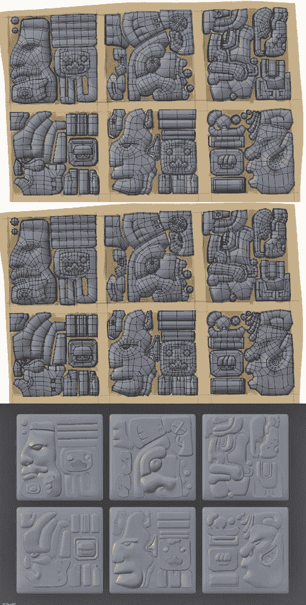图 5-12. 创建石雕。我首先在概念艺术上将雕刻分解成单独的部分，主要使用四边形。接着，我将一些边缘标记为折痕（紫色），以便在细分时形成锐利的边缘。最后，我添加了 Subsurf 和 Edge Split 修改器，使雕刻表面光滑，同时在标记的边缘处保持锐利的边缘。这样得到的效果比使用支撑环路生成锐利边缘要少使用多边形且拓扑更简单。

#### 锐利边缘与细分

增加折痕是获得锐利折痕的其中一种方法；另一种方法是使用*支撑环路*。支撑环路的原理是将两个或更多的边环路紧密地放置在形状的边缘处。当网格被细分时，由于额外的几何体限制了光滑度，新的几何形状无法像平常一样平滑，从而使角落更加锐利（参见图 5-14)。

这两种方法各有其适用场景。当你试图创建漂亮的倒角边缘并且需要精细控制物体外观时，支撑环是更好的选择。然而，如果你的目标是创建非常锋利的折痕，或者你正在处理简单的模型并且没有太多额外的拓扑结构，那么折痕方法更可取。你可以根据具体情况混合使用这两种方法。

支撑环在确保物体细分并呈现出你想要的形状时也很有用。例如，图 5-15 展示了一个应用了 Subsurf 修饰器并显示出线框的立方体。没有支撑环时，修饰器将其变成一个球体。当在面中部增加额外的支撑环时，物体更像一个立方体，将这些支撑环移向立方体的边缘，可以使角落更加锐利。这在建模各种表面时非常有用。

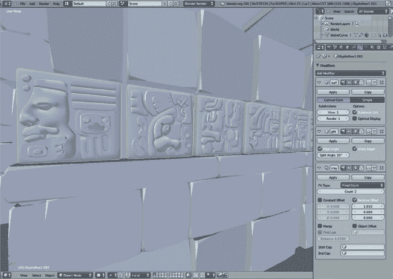图 5-13. 使用阵列修饰器重复石雕多次！在处理细分曲面时获得锐利边缘的两种方法。顶部：未修改的网格，带有轻微坡度并应用了细分曲面修饰器。中间：添加支撑环以获得锐利边缘。底部：折痕边缘以获得锐利边缘（没有额外的几何体）。图 5-14. 在处理细分曲面时获得锐利边缘的两种方法。顶部：未修改的网格，带有轻微坡度并应用了细分曲面修饰器。中间：添加支撑环以获得锐利边缘。底部：折痕边缘以获得锐利边缘（没有额外的几何体）。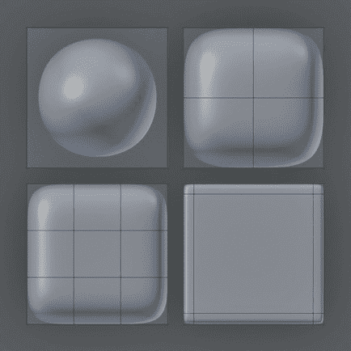图 5-15. 从左上角顺时针：一个没有支撑环、一个支撑环、两个间隔较远的支撑环，以及两个均匀间隔的支撑环，环绕在每一面中部。随着边缘环越来越靠近边缘，角落变得更加锐利。

### 植物

该场景中的植物很简单。为了创建它们，我首先从平面建模了几种不同类型的叶子；我将平面缩放并细分成叶状形状（见图 5-16）。接下来，我开始复制这些不同的叶子对象并将它们放置在场景中。通过使用 ALT-D 创建链接副本，你可以创建多个相同网格的副本，当你更改其中一个副本时，所有副本都会同步更新，这使得创建 UV 和纹理变得更加容易，因为你只需要为每种植物类型创建一次。通过在对象模式下缩放和旋转这些副本，并将它们放置在场景中，你可以在不创建大量不同网格的情况下，表现出多样性的效果（见图 5-17）。

在对象模式下有两种复制网格的方法。一种是创建一个简单的副本，它成为一个独立的对象（SHIFT-D）；另一种是复制一个链接副本（ALT-D），它保留与原始网格相同的数据和材质，并与之同步更新。你仍然可以在链接副本上应用不同的修饰符，并在对象模式下独立移动、缩放和旋转它，但它的网格数据和材质以及其他数据会与原始对象保持链接；如果你编辑其中一个，所有更改都会同时应用到两个对象。

这两种方法对于不同任务都非常有用。基本上，你应该在以下情况使用简单的复制：

+   你希望独立编辑新的对象。

    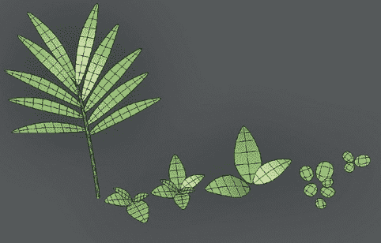图 5-16。这些植物都是用非常简单的网格制作的（显示应用了细分曲面修饰符）。

+   你计划将新的网格与场景中的其他元素重新组合。

+   你希望将旧网格保留为备份或备用选项。

如果以下情况适用，你应该使用链接副本：

+   你希望创建多个单一对象的副本，并且不想单独编辑它们。

+   你希望多个对象共享一组 UV 和材质。

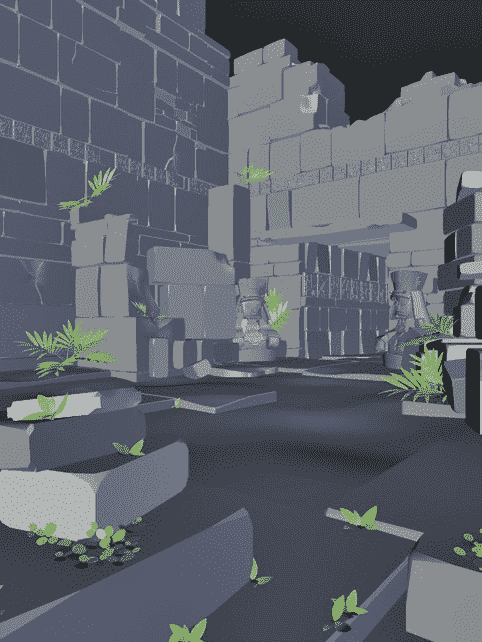图 5-17。复制不同的植物组件并将它们放置在场景中。通过改变副本的缩放和旋转，可以使它们具有明显的独特性。

当你选择一个链接的重复对象时，你可以通过检查其对象数据属性面板中的数据块信息，看到有多少用户（副本）在使用相同的数据块（参见图 5-18）。你还可以通过点击数据块名称旁边的数字图标来使对象变得唯一。将对象设为唯一会创建一个新的网格数据块，它现在独立于原始副本，你可以单独编辑对象的网格并更改其材质（就像它是一个简单的副本一样）。

### IvyGen

Blender 的 IvyGen 插件是一个程序生成器，允许你快速创建类似常春藤的藤蔓，爬满你的场景（参见图 5-19）。要使用它，首先从用户偏好设置编辑器中启用它（**文件**▸**用户偏好设置**），然后在插件选项卡下的“添加曲线”类别中找到它。启用插件后，你应该可以通过添加菜单（在对象模式下按 SHIFT-A▸**曲线**▸**添加常春藤到网格**）在选定对象上生成常春藤。

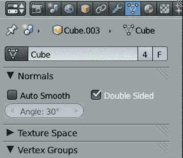图 5-18. 检查网格数据块的用户数量。点击数据块名称旁的数字（此处为 4）以创建一个新的副本，你可以独立编辑。F 图标将创建该数据块的“虚拟”用户，这将保存对象并防止它在保存 .blend 文件时被删除，即使场景中没有该网格的实例。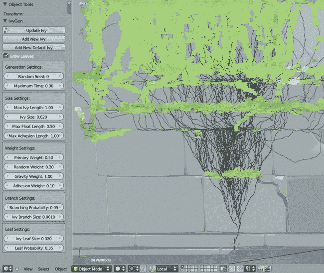图 5-19. 使用 IvyGen 生成程序化藤蔓。当使用 IvyGen 时，藤蔓的生长参数位于左侧的工具选项区域。为了清晰起见，我在这里为叶子添加了绿色材质，为藤蔓添加了棕色材质。

为了让 IvyGen 生成藤蔓，它需要一个单一的网格对象供藤蔓生长，因此我们需要创建一个新网格，包含我们希望藤蔓生长覆盖的所有几何体。为此，选择所有你希望藤蔓覆盖的对象，复制它们（SHIFT-D），应用任何修改器（在对象模式下使用**转换为网格**操作符——ALT-C），并将它们合并为一个对象（CTRL-J）。结果应该是一个对象。如果你的场景中有很高的多边形数量，你可能想跳过应用那些大幅增加多边形数量的修改器，以便为藤蔓生长提供一个低多边形的网格；不幸的是，这可能会牺牲一些藤蔓生长的精确度。

一旦你完成了藤蔓的生长，删除这个副本或将其移动到另一个层级，以免它妨碍你的操作（**M**）。

接下来，将 3D 光标放置在你希望藤蔓开始生长的位置，并通过添加曲线菜单（SHIFT-A▸**添加曲线**▸**将藤蔓添加到网格**）激活 IvyGen。IvyGen 允许你调整多个参数来决定藤蔓的外观，其中最重要的参数是最大藤蔓长度选项，它决定藤蔓扩展的距离，藤蔓大小和叶子大小选项，它们决定藤蔓的粗细和叶子的大小。叶子概率选项决定叶子的密度。其他选项，如浮动长度和附着长度，决定藤蔓从墙面延伸的距离以及它们如何受到重力的影响。

不断调整 IvyGen 的设置，并按下**更新藤蔓**按钮，直到你对藤蔓的外观满意为止。请记住，设置较高的最大藤蔓长度时，藤蔓生成的时间会更长。此外，如果你想覆盖较大的区域，最好反复运行 IvyGen，使用不同的起始位置来创建多个藤蔓网格。例如，在丛林神庙场景中，我将起始位置隐藏在场景的几个角落，然后让藤蔓从这些地方生长出来。你可以在图 5-21 中看到最终效果。

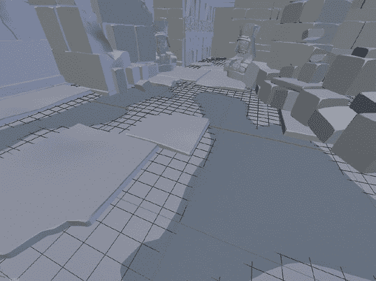图 5-20。通过先在主地面平面网格中创建凹陷，然后添加第二个平面与其相交，从而向场景中添加水坑！最终建模的丛林神庙场景图 5-21。最终建模的丛林神庙场景

IvyGen 还会为它生成的叶子和藤蔓自动创建 UV 坐标，并为它们分配材质槽。这项功能将大大加快后续在藤蔓上进行纹理和材质分配的速度。（有关 UV 展开和材质的更多信息，请参见第八章和第十二章。）

### 地面/土壤

为了让地面看起来更有趣，我将其细分了几次，并使用雕刻工具稍微弄得粗糙一些，具体内容我将在第六章中详细讨论。接着，我添加了一个新的平面（这次保持它没有细分并且完全平坦），并将其放置在地面平均高度下方，以便一些较深的区域能够穿透平面。这产生了地面上水坑的效果（见图 5-20）。

此外，我通过创建一个平面，将其细分几次，并使用比例编辑工具添加突起，简单地在场景的角落创建了土堆。通过将这一过程与一些雕刻结合起来，在块体和其他元素之间的裂缝与角落处堆积土壤，我能够为周围环境赋予一种古老的外观。最终的场景显示在图 5-21 中。

### 注意

*尽管以下内容延续了已经讨论过的建模技巧，我们所创建的部件将与我们在第六章和第七章中雕刻和重新拓扑的网格一起使用。你可以先跟随这一部分，或者跳到关于雕刻和重新拓扑的第六章和第七章，然后稍后再回来继续这一部分。*

## 建模蜘蛛机器人的细节

对于蜘蛛机器人，我需要创建其他机械部件，这些部件与我将在第六章和第七章中雕刻和重新拓扑的主体和腿部零件组合后，将完成整个模型。目标是创建一些可行的机械外观部件，例如关节、电线等，这些部件将完善蜘蛛机器人的外观。

### 关节

所有的关节都采用了相同的基本模板进行设计：中央部分使用圆柱体，使其能够自由移动，连接腿部的支撑杆从中伸出（见图 5-22）。为了制作支撑杆，我从一个曲线对象开始，制作出基本形状的二维曲线，使用拉伸（Extrude）设置赋予它厚度，然后将其转换为网格。Blender 默认的曲线填充拓扑充满了瘦长的三角形，这些三角形无法很好地细分，因此我删除了这些面，手动填补了前后表面，以得到更好的拓扑结构（见图 5-23）。

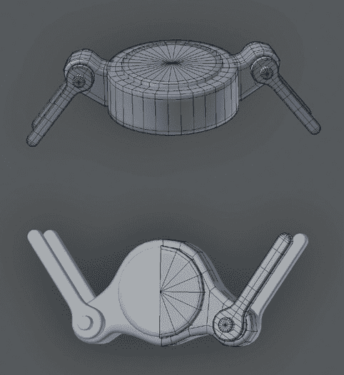图 5-22。腿部关节。两个关节都是通过将简单部分做成圆柱体、将较长部分做成曲线（转换为网格）来创建的。在圆柱体部分的边缘添加支持环，使得它们可以更好地细分。

### 电线

这些线条都是由围绕腿部和其他区域建模的 3D Bézier 曲线创建的，以增加趣味性并连接各个部分（参见图 5-24）。为了增加更多细节，我将一些线条转换为网格，以便添加一些循环切割和挤出（参见图 5-25）。

对于一些更复杂的线条，我结合了 Array 和 Curve 修改器，将单个网格沿曲线复制（参见图 5-26）。首先，我建模了一个单一单元（图 5-26 中的环形物体），然后添加了 Array 修改器和 Curve 修改器，将该单元复制并沿曲线变形成曲线的形状。

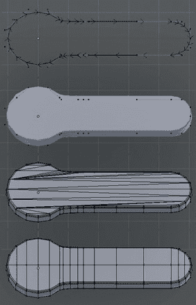图 5-23. 使用曲线创建腿部支撑元素，然后用更干净的拓扑填充生成网格的平面表面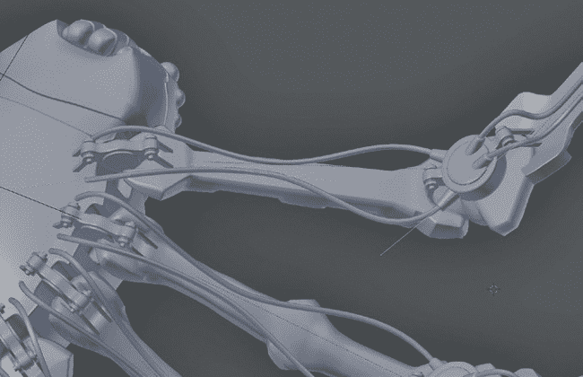图 5-24. 为腿部底部创建线条。这些是使用 3D 贝塞尔曲线制作的，并通过对象数据面板中的 Bevel 设置增加了厚度。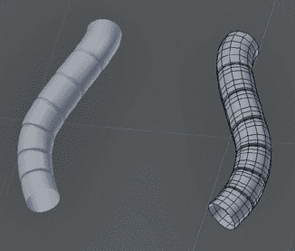图 5-25. 最初，我使用曲线建模这些管道。然后，我将曲线转换为网格，以便我可以添加一些环形切割并缩放它们，形成凹槽。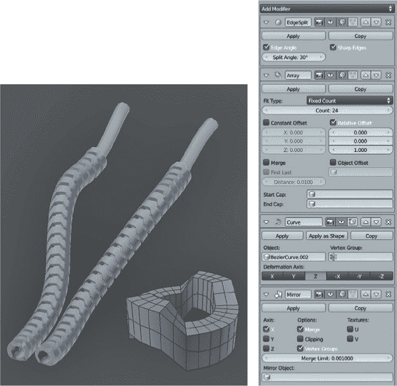图 5-26. 一个更复杂的曲面对象，通过结合数组修改器来复制基础单元（环形物体）和曲线修改器来沿曲线变形结果堆栈。我还使用了边缘分割修改器和镜像修改器，将结果镜像到模型的另一侧。

### 耦合

对于身体和腹部之间的耦合，我最初使用曲线创建了形状，然后将其复制并将副本转换为网格（ALT-C）。由于 Blender 默认的曲线填充会生成丑陋的长三角形，且变形效果不佳，我通过手动删除内部面并手动填充形状来修复拓扑（见图 5-27）。

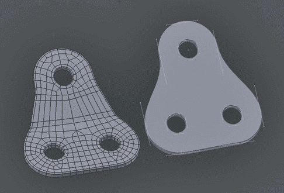图 5-27。创建联接。我将曲线对象（右）转换为网格，然后删除了一些边缘周围的边环，以均匀分布面片。我手动填充了内面的更好拓扑。接着，我使用比例编辑，在中间加入了一个弯曲。

### 其他部分

我使用 Blender 的吸附工具放置了蜘蛛机器人眼睛：我打开了面吸附，进入对象模式添加了球体，然后将它们吸附到头部表面。獠牙则简单地是立方体，经过拉伸并添加了环形切割，以在弯曲处形成收缩。我使用 Blender 的建模工具和重新拓扑技术进行了进一步的装饰。（参见第七章了解这些部分和完成的模型。）

## 模型化蝙蝠生物的细节

最终的蝙蝠生物模型只会包含一个用于身体的网格，我们将在第六章中讨论，但它还需要眼睛、牙齿和指甲。由于这些部分不会经过雕刻或重新拓扑，我直接制作了最终网格。

### 眼睛

模型化眼睛有许多方法，但通常情况下，先建模眼睛的一些内部结构有助于让渲染出的眼睛能够真实地反射光线和反射。我为眼睛制作的模型（见图 5-28）包括外层和内层，外层将具有透明材质，构成眼角膜和眼睛的反射表面，内层则稍后会贴上瞳孔、虹膜和眼白（巩膜）纹理。

内外层的制作方式相同，从 UV 球体开始（在对象模式下按 SHIFT-A▸Mesh▸UVSphere），然后使用比例编辑将球体的末端推入内层部分，或将其稍微推出去，形成角膜的凸起。对于内层部分，在使用比例编辑将表面推入后，我从中最中央的面挤出，创造了一个凹陷的瞳孔。对于角膜，我删除了 UV 球体末端的三角面，并用一个细分平面替换它们，以避免在添加细分曲面修改器时产生伪影（见图 5-27 的左侧）。使用 To Sphere 操作符（ALT-SHIFT-S）可以帮助你在调整拓扑后恢复眼睛的球形。

### 牙齿和指甲

牙齿和指甲都是从立方体派生出来的（见图 5-29）。为了制作牙齿，我从一个立方体开始，将其缩小，然后从底部挤出。通过反复缩小牙齿底部然后再次挤出，我将牙齿雕刻成尖点。接着，我调整并复制牙齿，使用镜像修改器填充嘴巴的另一侧。

对于指甲，我稍微压扁了立方体，在中间加了一条环切，并稍微将其移动出来，给指甲一些曲线。然后，我重复了制作牙齿时的相同过程，将它们雕刻成尖点，然后手动放置并复制所需的数量。

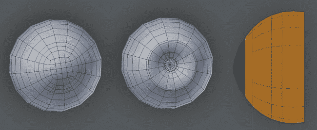图 5-28。建模眼睛。左：外层。注意角膜末端的网格拓扑。中：内层。右：两者合并后的线框视图，侧面展示。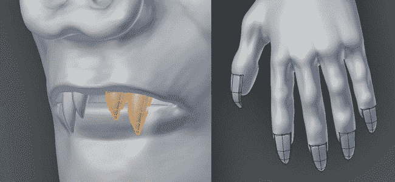图 5-29。建模牙齿和指甲

## 回顾

这完成了我们对丛林神庙场景建模的讨论，并为蜘蛛机器人和蝙蝠生物项目添加了一些额外的细节。你已经学会了如何使用 Blender 的多种建模工具，包括通过修改器修改现有网格，应用这些修改器的结果以便能够编辑结果，使用曲线建模并调整结果，以及从零开始使用基本体和挤压来建造复杂的形状。

在下一章中，我们将继续使用 Blender 中的多重分辨率修改器和雕刻工具来雕刻，创建详细的有机和硬表面形状。在第七章中，你将学习如何使用 Blender 的建模工具对这些形状进行重新拓扑，以便创建你的模型。
