## 第六章 雕刻

将雕刻工具加入 Blender 的工具库大大拓宽了我们创作的范围，并提升了我们能为作品添加的细节水平。此外，雕刻还允许我们在创建模型的过程中拥有更多自由；在其引入之前，我们必须辛苦地创建拓扑以支撑模型的每个元素。现在，通过雕刻，我们可以从一个更简单的网格开始，使用多分辨率细分来提供支撑我们所需形态的控制力，然后再担心拓扑问题。

在本章中，我们将介绍 Blender 的雕刻工具，并展示如何使用雕刻模式。我们将探讨如何自定义雕刻模式的外观，以及使用这些工具让你在雕刻时充分发挥 Blender 的潜力。接下来，我们将开始使用这些工具在第四章中创建的基础网格上进行雕刻，将它们从简单、低分辨率的基础网格转变为高度细致的雕刻模型。最后，我们将探讨一些雕刻的基本原则。

## 雕刻模式

为了在 Blender 中进行雕刻，你需要进入 3D 视口中的雕刻模式，如图 6-1 所示。一旦进入雕刻模式，确保你已打开工具架（**T**），因为这里包含了 Blender 所有雕刻模式的选项和工具。

视口左侧的熟悉工具架现在是雕刻笔刷选项的所在地，在这里我们可以选择不同的笔刷并调整其设置。笔刷选项包括笔刷类型；是否使用图形平板的压力输入（如果有图形平板，建议启用）；以及笔刷的大小、渐变和形状。图 6-1 还展示了如何设置 3D 视口以便更轻松地进行雕刻——你使用 Blender 的 GLSL 阴影并启用仅渲染来仅显示将被渲染的对象。这样可以让网格和场景中的任何多余对象（例如灯光和相机）在雕刻过程中不干扰你。我们将在自定义 3D 视口中更详细地讲解这些设置。

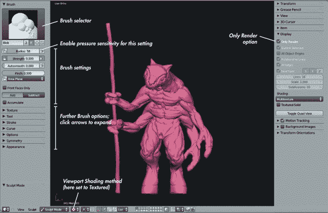图 6-1. 雕刻模式，视口显示模式设置为纹理化（使用 GLSL 着色）并启用仅渲染。工具架位于左侧，包含大多数 Blender 的雕刻工具和选项。

### 画笔选项

画笔选项显示在图 6-1 的左侧。点击选中的网格，在 3D 视口中开始雕刻。

按照顺序浏览图 6-1 中工具架的面板列表（一些面板已折叠，但其标题都是可见的），我们有以下内容：

****画笔****。在这里，您可以选择使用哪种画笔；画笔的属性，如半径、强度和平滑度；画笔是否应该增加或减少表面；以及一些特定于单个画笔的选项。您还可以通过点击+图标从画笔选择器创建新画笔。这样会复制当前画笔，创建一个可以单独修改的副本。

****纹理****。此面板允许您创建具有独特形状和纹理的笔触，或将图案拖拽到网格表面。画笔纹理利用纹理的亮度来决定刷笔的施加强度。尽管您可以使用彩色图像作为画笔，但通常更常见的是使用黑白纹理，这样更容易判断它们的效果。（为了区分画笔纹理和其他类型的纹理，我通常会将它们称为*alpha*纹理。）

****工具****。虽然画笔选择器中的画笔有像“粘土”和“平滑”这样的名称，您可以根据需要更改这些名称。任何画笔的实际行为由您在此面板中的下拉菜单选择决定，该菜单让您可以从 Blender 提供的所有基本工具类型中进行选择，然后进一步自定义它们。

****笔触****。该面板包含将鼠标或平板笔划转换为雕刻笔划的选项。大多数画笔的默认方法，*空间*，会创建均匀的画笔笔触。*锚定*允许你点击并在网格上拖动出一个大的笔触，该笔触围绕起始点并以你拖动的距离为半径。这个选项在拖出纹理以创建表面细节时非常有用。另一个选项，*平滑笔触*，会使你的笔触在光标后方滞后，从而产生干净、平滑的曲线。

****曲线****。该面板让你选择画笔的衰减曲线（参见图 6-2），并精细控制笔触深度如何从中心渐变。你可以通过拖动和点击添加点到曲线编辑器中手动定义曲线，也可以选择曲线编辑器下方图标中的预设之一。默认的*平滑*曲线适用于大多数画笔，但在拖动 alpha 时，*最大*曲线较为实用。对于细小褶皱，*锐利*曲线是最佳选择。

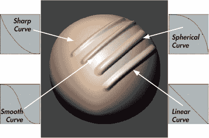图 6-2. 不同的衰减设置

****选项****。该面板包含主要是杂项选项。一项选项是是否限制雕刻到单独的轴上。另一项选项决定是保持画笔大小和强度统一，还是为每个画笔单独设置。（保持统一的画笔大小通常不会造成混乱，但通常更倾向于为每个画笔单独选择强度，因为你可能希望不同的工具有不同的强度。）

****对称****。就像你在正常网格中使用镜像修改器一样，你可以在雕刻时启用对称，以保持画笔笔触的对称性。这对很多雕刻操作非常有用，因为大多数有机生物通常是大体对称的。

****外观****。该面板包含一些美学选项，用于更改画笔光标的颜色或为画笔添加自定义图标。

### 画笔类型

默认的画笔类型可以在工具面板中找到（参见图 6-3），以下将讨论这些画笔。某些画笔有热键（括号内显示），允许你快速切换你创建的该类型画笔。几乎所有画笔（仅*抓取*、*推动*、*大拇指*和*蛇钩*除外）也有减法模式（ALT），通常执行与加法模式相反的操作。

****气泡****。这种画笔类型会在网格表面创建气泡般的膨胀块。这种选项是*绘制*和*膨胀*画笔之间的混合。加法模式会使其膨胀，而减法模式则会将其切割进去。

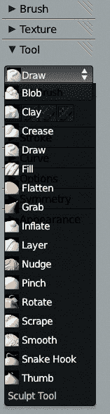图 6-3。工具面板让你在不同的基础刷子类型之间进行选择。

****黏土 (C)****。最重要的刷子类型之一，黏土刷均匀地构建网格表面，首先填补凹陷，然后从网格表面平滑地堆积。在整个雕刻过程中你都会发现这个刷子类型非常有用，但在添加细节时要小心，因为它会在细节上堆积（请改用绘制刷）。加法模式会向外堆积，而减法模式则会在网格上雕刻。

****褶皱 (SHIFT-C)****。此刷类型结合了绘制和捏合刷类型，先在网格上绘制一条笔触，然后捏合它使其变得更紧。它在减法模式下最为有用，非常适合在角色皮肤上创建皱纹和褶皱，但也可以在加法模式下使用，通过沿着形状的边缘描绘来创建锐利的边缘。

****绘制 (D)****。绘制刷类型从表面拉出一条笔触，移动表面而不改变下面的细节。如果在雕刻大规模形态时过早使用绘制刷，它可能会带来困难，因为它可能导致表面呈现较为突兀的外观（这也是为什么黏土刷更有用的原因）。然而，在后期添加细节时，绘制刷类型非常实用。

****填充****。此刷类型会填补网格表面上的凹陷区域，而不会接触到峰值。它对于平滑和填充网格中的凹面区域非常有用，而不会影响周围区域。在减法模式下，这个刷子会加深凹陷，而不是填充它们。

****平整****。平整刷结合了填充和刮除刷类型，填补凹陷并刮除峰值，从而创建更平滑的表面。与平滑刷类型不同，这个刷子除了平滑表面之外，还会将表面压平。在减法模式下，这个刷子类型会夸大凹陷和峰值，而不是将它们压平。

****抓取 (G)****。此刷类型会抓住刷子下方的区域并让你将其拖动。你会发现这是一个非常有用的刷子类型。

****膨胀 (I)****。膨胀刷类型以类似于编辑模式下收缩/膨胀操作符的方式膨胀网格。膨胀刷对于建立体积非常有用，有时也是绘制或黏土刷的良好替代品，但一定要保持刷子的力度较低，否则可能会造成一些损害。另外要注意，除了推动表面向外（或向内）之外，这个刷子通常会使面变大，减少修改区域能够承载的细节量。在减法模式下，此刷子会缩小网格，通常会导致网格自相交。使用时请小心。

****图层 (L)****。此刷类型从网格表面构建均匀的层，或者在减法模式下减去均匀的层。

****推拉****。像抓取刷子类型一样，这种刷子类型只会稍微推动网格，你可以继续移动光标到其他区域，以便对它们进行推拉。

****捏合（P）****。这种刷子类型将刷子下的面拉得更紧，形成捏合效果。这个刷子对于收紧褶皱和皱纹或在硬表面雕刻时锐化形状之间的边缘非常有用。在减法模式下，这个刷子会将面拉得更远。

****旋转****。这种刷子类型会围绕网格的原点旋转刷子下的区域。我发现这种刷子类型其实没什么用处。

****刮削****。刮削刷子类型会刮去网格的峰值，而不触及谷底。这个刷子类型非常适合用来建立平面、去除肿块和凸起，以及平滑重叠形态之间的过渡。在减法模式下，它会将峰值堆积起来，而不是将其刮去。

****蛇钩****。这种刷子类型允许你从网格中拉出类似触手的表面。由于下面的拓扑可能不太支持这种操作，因此需要谨慎使用这种刷子类型。这个选项适合用来拉出类似头发丝或角的峰值，特别是如果你计划在后续修正难看的拓扑时使用。

****拇指****。拇指刷子类型在网格表面下滑动，但仅限于表面朝向的平面。这类似于抓取刷子，不同之处在于它只允许你移动网格表面的内容，而不是将其推向或拉回内外。

Blender 刷子面板中的所有刷子（见图 6-4）都是上面列出的刷子类型的变体，通过各种调整使每个刷子产生略微不同的效果。例如，Polish（抛光）刷子是 Flatten（平坦）刷子的变体，开启了 Autosmooth 设置（它为任何刷痕添加了平滑效果）。

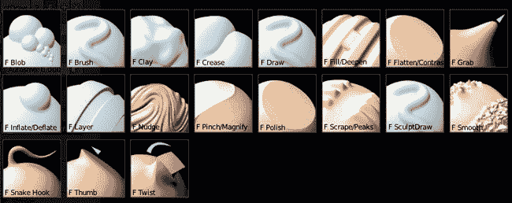图 6-4. Blender 默认的雕刻刷子

## 创建自定义刷子

现在我们已经看过了一些 Blender 内建的刷子，让我们来看看如何创建自定义刷子，以更好地满足我们的需求。如前所述，Blender 的雕刻刷子都是在初始刷子类型的基础上进行变种的；它们的区别在于设置的不同，这些设置影响了刷子的功能。你会频繁调整一些设置，比如刷子的半径和强度。如果你经常使用一组特定的刷子设置，最好为它们创建一个专属的刷子。

要创建一个新的雕刻画笔，选择一个现有的与您想要创建的画笔相似的画笔，然后按画笔选择器中其名称旁边的 + 图标，创建一个新的、独特的画笔。现在，您可以通过修改画笔的强度、分配纹理和笔画选项等来修改新画笔。

为了演示，我们创建几个自定义画笔，这些画笔在雕刻时会非常有用。

### 粘土管

粘土管画笔（参见图 6-5）非常适合早期的雕刻工作。它的工作方式类似于传统的粘土雕刻家，他们通过向雕塑表面添加粘土条来构建形状。为了在 Blender 中创建模拟这一技巧的画笔，按照以下步骤操作：

1.  复制默认的粘土画笔。

    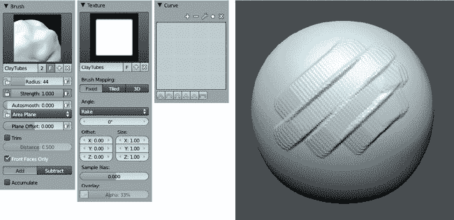图 6-5. 粘土管画笔

1.  在纹理面板中，通过点击纹理选择器中的 + 图标，添加一个新纹理作为画笔的 alpha。这会创建一个新的纹理并将其分配给画笔。给它起个有用的名字，比如*粘土管*。

1.  要编辑此纹理，请打开属性编辑器的**纹理选项卡**（参见图 6-6），确保已选择画笔图标来编辑画笔纹理。

1.  在类型下拉菜单中，选择**图像或视频**，然后通过从图像面板打开或添加图像来选择一个作为画笔纹理。对于这个画笔，我在 GIMP 中创建了一个非常简单的、略微模糊的白色方形，背景为黑色，随后将其作为画笔纹理加载。

1.  加载纹理后，返回到 3D 视图工具架，并在工具架的纹理面板中设置画笔角度（如图 6-5 所示），将其设置为**耙子**，使 alpha 旋转以匹配笔画的方向。现在，我们将获得漂亮的方形笔画，并带有轻微的纹理，非常适合构建肌肉和皱纹等形状，或者快速阻塞大体积形状。

1.  为了停止画笔的常规衰减，将衰减曲线设置为曲线面板中的平坦**最大**预设。

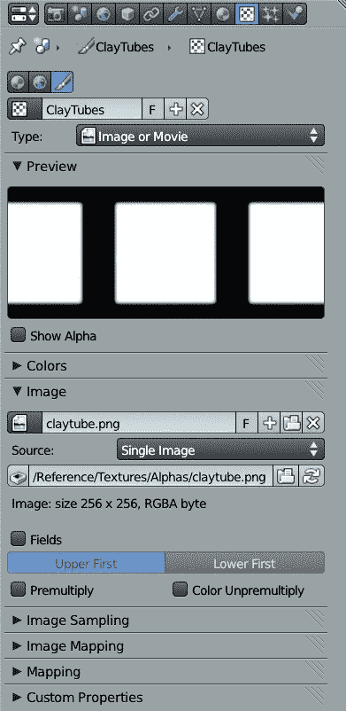图 6-6. 添加粘土管纹理

### 耙子

像粘土管画笔一样，耙子画笔（参见图 6-7）也基于传统雕刻。粘土雕刻家通常使用带齿的刮刀工具——*耙子*，刮去粘土表面以产生细腻的纹理和平滑的形状。在 Blender 中，耙子画笔在加法*和*减法模式下都非常有效。

和 Clay Tubes 画笔一样，梳理画笔从复制默认的 Clay 画笔开始，然后添加自定义的 alpha，不过这次我们使用的是一排模糊的点或方块，如图 6-7 所示。要创建梳理画笔，请按以下步骤操作：

1.  像上面对 Clay Tubes 画笔所做的那样，复制 Clay 画笔。

1.  为画笔添加纹理，方法与 Clay Tubes 画笔相同。有关所需纹理的示例，请参见图 6-7。

1.  将角度设置为（惊讶！）**梳理**，并在 3D 视口工具架的画笔面板中启用**自动平滑**，将其值设置为大约**0.25**。（这为画笔笔触添加了一些平滑效果，以避免纹理失控。）

1.  将画笔的衰减设置为平面（图 6-7）。

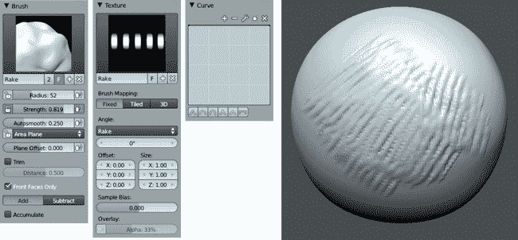图 6-7. 梳理画笔

### 刮平

刮平画笔（参见图 6-8）可以在网格中创建平整、带棱面的表面。它非常适合雕刻 jagged 岩石和硬质、技术表面，以及快速建立有机模型中的清晰平面，之后你可以对其进行平滑和细化。

创建此画笔，请按照以下步骤操作：

1.  复制刮平画笔。

1.  通过点击新画笔选项旁边的锁定图标来锁定**区域平面**（如图 6-8 所示）。现在，当你开始画笔操作时，画笔下表面的法线将延伸贯穿整个笔触，形成一个平整的表面。

    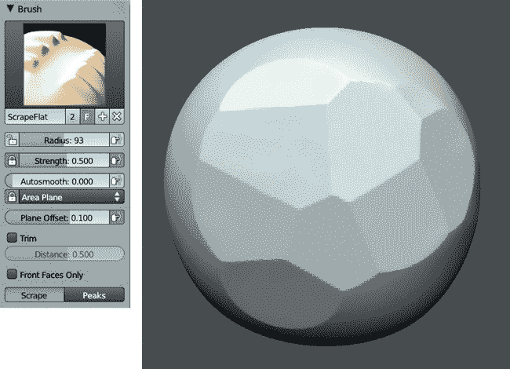图 6-8. 刮平画笔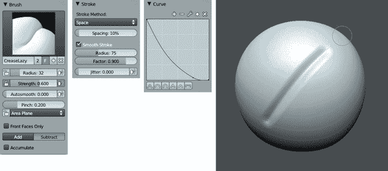图 6-9. 褶皱懒散画笔

1.  将画笔的平面偏移量设置为大约**0.1**（参见图 6-8），以使画笔更深入地切割表面。此设置决定了画笔在正值下对表面的影响深度，或在负值下将效果抬离表面。

尝试将该画笔的工具类型更改为 Flatten、Fill 或 Clay 工具，因为它们也适合这些设置。

### 褶皱懒散

这个画笔是标准褶皱画笔的一个变体。启用平滑笔触设置后，褶皱懒散画笔适用于创建长而平滑的褶皱。要创建褶皱懒散画笔，如图 6-9 所示，请按以下步骤操作：

1.  复制褶皱画笔并启用**平滑笔触**。

1.  对于这个画笔和常规的 Crease 画笔，我喜欢将画笔的强度调到 0.6 到最大强度之间，并将 pinch 值调到大约 0.1 或 0.2。（我觉得默认的 pinch 强度有点大。）

### 拖拽 Alpha

拖拽 Alpha 画笔使用了锚定笔触设置，可以在网格表面拖拽 alpha 纹理，但除此之外，它只是一个基础的绘制画笔。你可以通过以下步骤创建此画笔，见 图 6-10：

1.  复制 Draw 画笔并添加纹理。几乎任何纹理都可以使用；我选择了一个岩石的图像。

1.  由于你可以在此画笔上使用各种纹理，因此不同的衰减曲线非常有用。对于自然内建衰减的图像，如 Clay Tubes 和 Rake 纹理（图像四周为黑色），你可以将曲线设置为平坦。对于你从照片或其他图像创建的没有自然衰减的纹理（图案覆盖整个图像），则使用一个预设曲线。预设曲线创建了一个平滑的过渡，避免了在网格上绘制时 alpha 纹理产生明显的边缘。

    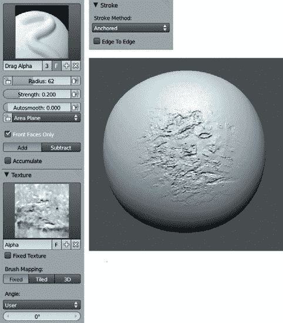图 6-10。拖拽 Alpha 画笔，图中使用了粗糙的混凝土 alpha 纹理

### 使画笔默认可用

为了默认加载你的自定义画笔，你需要将它们包含在默认的 .*blend* 文件中，这个文件会在每次启动 Blender 时自动加载。操作方法是，创建一个新的 .*blend* 文件，创建（或追加）你希望默认可用的画笔，然后保存修改后的文件（**文件** ▸ **保存用户设置**）。要追加到现有画笔中，请选择 **文件** ▸ **追加**（或 SHIFT-F1）；然后选择你创建画笔的 .*blend* 文件，选择 **画笔**，挑选你想要的画笔，点击 **追加**。现在，每次你进行雕刻时，你的自定义画笔都可以使用了。

## 改善你的雕刻体验

要在雕刻模式下获得最佳效果，你需要稍微调整 Blender 的设置。目标有两个：确保在雕刻时获得最佳性能，并配置 Blender 的 3D 视图和材质，以便更容易看到画笔笔触在模型上产生的效果。

### 优化雕刻性能

当然，提升雕刻性能的最佳方式是使用一台性能强大的计算机，并配备大量的内存。如果你打算处理数百万个多边形，至少需要 4GB 的内存，但更多的内存肯定不会有坏处。但是，如果硬件升级不可行，以下是如何最大化你现有硬件性能的方法。

****关闭其他程序。**** 如果你正在另一个 Blender 实例中进行渲染，或者同时在刻录 DVD，你的雕刻性能将会受到影响！

****启用 VBO（顶点缓冲对象）。**** 打开 Blender 的用户设置（**文件**▸**用户设置** 或 CTRL-ALT-U），进入系统标签，勾选**VBOs**复选框。如果你的显卡支持 VBOs，这将提升 3D 视口的性能。

****启用快速导航（Fast Navigate）。**** 你可以在 3D 视口工具架的选项下找到快速导航。启用快速导航后，当你移动或旋转 3D 视口时，模型会自动切换回较低的细分级别，从而加速雕刻时的导航速度。

****在添加多分辨率（Multires）修改器之前进行细分。**** 如果你正在使用像我们在第四章中创建的相对密集的基础网格，你就不需要进行这一步骤。然而，如果你打算从一个立方体开始，建议先添加并应用细分曲面（Subsurf）修改器，再添加多分辨率修改器，这样可以加速雕刻过程。

这一效果之所以能够实现，是因为 Blender 在后台会根据刷子笔划覆盖了多少基础网格的面来判断需要更新网格的部分。例如，如果你的基础网格只有六个面，大多数笔划会影响到大部分面（至少六分之一），这会让 Blender 更新形状变得较慢。通过先进行细分，每次笔划将只影响基础网格中的较小部分面，Blender 更新的内容较少，从而加快了雕刻体验。

### 自定义 3D 视口

在雕刻时，我们通常只希望看到自己正在工作的部分，而不想被灯光和网格地面等干扰。要关闭这些干扰，打开 3D 视口中的属性区域（**N**），在显示面板中勾选**仅渲染**，以便在渲染时只显示网格和其他物体。你还可以从该面板关闭网格地面和坐标轴指南，这样即使在关闭仅渲染时它们也不会显示。启用仅渲染后，3D 视图的背景颜色会切换为在属性编辑器的世界设置标签中设置的背景颜色。雕刻时将其设置为深灰色或黑色会比较合适，但你也可以根据自己的喜好进行设置。

### MatCap 材质

在雕刻时，你希望在 3D 视口中看到的网格效果能尽可能多地提供关于你正在雕刻的表面形状的信息。虽然 Blender 的 OpenGL 着色器已经做得相当不错（并且可以根据下面的说明对雕刻进行优化），但使用一种被称为*MatCap*（*材质捕捉*的简称）的 GLSL 材质，它根据网格的法线对网格进行着色，可以提供更好的视觉效果和更美观的模型展示。

MatCap 图像使用一个预渲染（或绘制/拍摄）过的球体图像来为你的整个物体上色，将球体图像的阴影与网格的法线进行匹配。本章节中许多图形使用的 MatCap 图像见图 6-11。我将在第十二章中讲解如何创建材质，但现在我将概述如何创建 MatCap 材质。

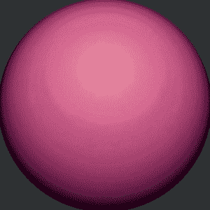图 6-11。MatCap 图像。Blender 使用你的物体法线将网格的阴影与球体的阴影匹配。

#### 创建 MatCap 材质

要创建一个 MatCap 材质，请按照以下步骤操作：

1.  选择你想应用材质的物体。

1.  在属性编辑器的材质标签页中，通过点击**+新建**按钮添加一个新材质。这将创建一个具有默认设置的新材质。

1.  你需要做的唯一修改是在阴影面板中启用**无光照**选项。这将停止在 GLSL 模式下使用灯光，而是仅使用材质纹理中的颜色信息。（相关设置见图 6-12。）

1.  在纹理标签页中，为该图像添加一个新纹理。将其类型设置为**图像或电影**，然后加载你的 MatCap 图像。默认情况下，这将用于影响材质的颜色，因此你只需要在映射标签页中将纹理的映射坐标更改为**法线**，这样就会将物体的法线作为纹理坐标。

1.  最后，将 3D 视口的视口阴影方法设置为**纹理**，并在 3D 视口的显示面板中，将阴影选项设置为**GLSL**。你的 MatCap 材质现在应该在网格上可见，如图 6-12 所示。

#### 查找 MatCap 图像

这本书附带的光盘中包含了多个 MatCap 图像，但你也可以在网上找到更多。许多图像可以从专门提供 ZBrush 材质的网页上找到，ZBrush 是一款强大的商业雕刻应用程序，它是最早实现这种雕刻阴影效果的应用之一。尽管许多 MatCap 图像以专有的*.zmt*格式分发，但你通常可以很容易地找到适用于 Blender 的 MatCap 材质图像作为纹理。你也可以通过谷歌搜索找到很多优质的 MatCap 纹理。

创建你自己的 MatCap 图像也是值得的。每当你有一个喜欢的材质时，尝试将其应用到一个球体上，并渲染出来作为 MatCap 材质使用。（只需记得将图像裁剪到球体轮廓内，以避免在网格边缘产生任何伪影。）你还可以使用具有多个纹理槽的材质混合 MatCap 纹理。（有关如何做的更多信息，请参见第十二章）。

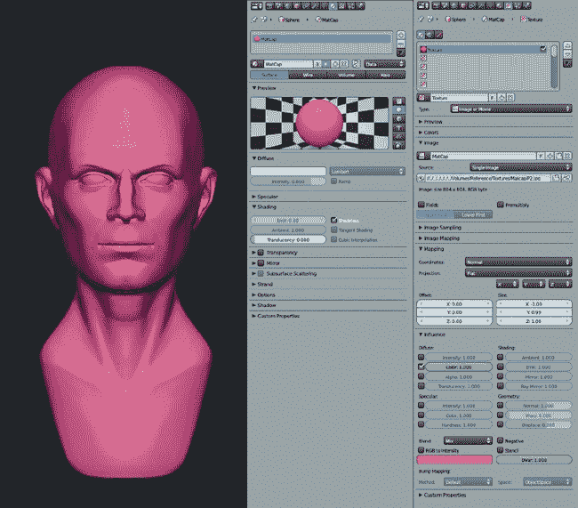 图 6-12。一个 MatCap 材质设置和 Blender 3D 视口中的结果。使用法线纹理坐标，球体的图像被映射到网格的法线，模拟相同的阴影效果。

### 调整 OpenGL 阴影

尽管使用 MatCap 材质进行雕刻很不错，但一旦你的雕刻模型达到数百万多边形时，Blender 的性能可能开始下降。切换回 Blender 的默认 OpenGL 阴影（即实体阴影）会更快，但这种阴影非常均匀，不太适合雕刻。幸运的是，你可以在用户偏好设置的系统选项卡中轻松调整这种阴影效果，使其更适合雕刻，并增加可以在保持合理性能的同时，挤压出更多细分的能力。

在图 6-13 中，我调整了 Blender 的标准 OpenGL 照明。要自行进行此操作，请打开用户偏好设置，在系统标签中找到 Solid OpenGL Lights 设置，如图 6-13 所示。这些设置为您提供了三个独立的“光源”，它们决定了在 Blender 的默认实心着色视图中，网格的着色方式。您可以使用灯泡图标打开和关闭这些光源，通过颜色选择器调整其漫反射和高光颜色，并使用右侧的球体改变它们照射网格的方向。

为了使照明更适合雕刻，我关闭了第二和第三个光源，并将第一个光源设置为直接照射网格，使其呈现出轻微的棕褐色。这导致了图 6-13 中的右侧着色效果，这种效果更具方向性，并且在雕刻时能更好地展示网格的形状。

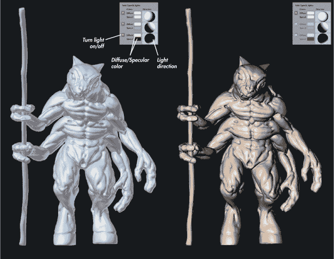图 6-13。Blender 的默认 OpenGL 着色非常多功能，并且比 GLSL MatCap 着色要快得多，尤其是在高多边形数量时。通过调整三个可用光源的位置和颜色，您可以创建更适合雕刻的照明设置，优于默认设置。

### Multires 修改器

尽管你可以在任何网格上进行雕刻，但我们需要使用 Multires 修改器来将雕刻提升到高细节级别，同时保持一个仍然易于编辑的基础网格（参见图 6-14）。Multires 修改器与 Subsurf 修改器类似，都通过 Catmull-Clark 或 Simple 子分割 1 来细分你的模型。然而，Multires 修改器不仅是纯粹的程序化操作，它还会在雕刻模式下存储对网格的进一步编辑，允许你先细分网格，再利用创建的额外几何体来雕刻更多细节。这让我们可以将一个相当简单的模型细分成数百万个多边形，并将它们雕刻成任何形状，并加入任何我们想要的细节。

Multires 修改器面板左侧的三个设置（预览、雕刻和渲染 2）决定了在不同模式下显示的子分割级别。预览设置的是对象模式下的显示级别，雕刻设置的是雕刻模式下的级别，而渲染则设置渲染网格时使用的子分割级别。每次点击 Subdivide 操作符 3 时，都会增加一个子分割级别，而 Delete Higher 操作符 4 会删除当前工作级别之上的所有子分割级别。

如果你将网格导出到其他程序，或是复制并单独编辑它，你可以使用 Reshape 操作符 5 将 Multires 网格重新塑形，使其与另一个选定对象的网格相同。不过，为此，两个网格的顶点顺序和拓扑必须完全相同，任何删除或添加顶点的操作都会破坏这一功能。如果你是导出到其他程序（如 ZBrush 或 MeshLab），请确保使用.*obj*格式，并确保在导入和导出时选中保持顶点顺序的选项。

Multires 修改器不会影响网格的原始形状；但是，你可以使用 Apply Base 操作符 6 将最低的子分割级别（你的原始网格）与子分割后的网格形状匹配。如果你做了大量的雕刻，并希望基础网格再次与雕刻后的网格形状更接近，这非常有用。

#### 顶点顺序

Blender（以及任何使用网格对象的应用程序）将网格存储为一个编号的顶点列表，并包含这些顶点之间构成边和面的连接。这就是对象的*顶点顺序*，它必须保持不变，以确保 Reshape 操作符能正常工作。简单的顶点操作——如移动、旋转或缩放——不会影响顶点的顺序，但添加或删除顶点则会。此外，在导入或导出时保存为其他格式可能会重新排序网格的顶点。

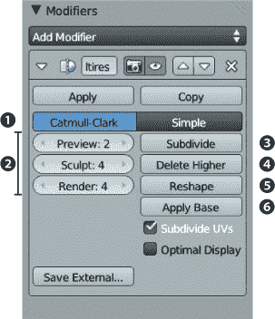图 6-14. Multires 修改器

#### 子分割与多边形计数

在使用 Multires 修改器时，你可以通过信息编辑器头部追踪场景的多边形数（见图 6-15). 请记住，每次细分都会使该对象的多边形数乘以 4，因此将一个网格细分五次会使你的多边形数增加 1024 倍！根据你拥有的内存，你可能能够安全地将多边形数细分到百万级别以上，但所需的细分层数将真正取决于基础网格中的多边形数量。

信息编辑器头部包含几个有用的数字。从左到右，它们分别是：你使用的 Blender 版本，当前活动图层的总顶点数（Ve:），当前活动图层的总面数（Fa:），选中的对象数量（Ob:）以及所有对象的总数量（*选中*-*总计*），当前活动图层，内存使用情况，以及当前活动对象的名称。

图 6-15. 使用 Multires 修改器时，注意多边形数（Fa:）。

## 雕刻概念

Blender 在雕刻方面设置好之后，我们就可以开始了。通常，我们将从粗到细进行雕刻，就像现实世界中的雕塑一样。通过从我们想要实现的最终产品的宽大结构开始，逐步朝向细节雕刻，我们减少了需要撤销的步骤，以纠正错误。

本节将介绍一些我在雕刻时思考的通用概念。

**体积和比例**。在开始雕刻时，首先设定出主题的大致形状；换句话说，为整体人物的每个组成部分创建一个粗略的体积。当雕刻角色时，你应该先绘制出腿部、手臂、躯干、头部、手和脚的体积。这部分是通过创建一个良好的基础网格来完成的。例如，我们已经在第四章中创建了 Bat Creature 角色的基本形状；然而，这在雕刻过程中仍然可以进行改进，以便更好地感知模型的大小和整体形状。

**姿势**。姿势描述了角色的站姿以及身体部位之间流动的形态。这个阶段更适用于有姿势的角色，但也是创造一个良好中立姿势的重要部分，甚至在雕刻无机形态时也适用。此阶段的关键是，身体的各个部分通过平滑流畅的曲线连接起来。通常你应该能够在角色的姿势中画出一条平滑的曲线，如图 6-16 所示。

****面****。这里所说的“面”是指将物体的形状分解和简化为平面——物体的区域形成广泛的平面表面，而不是多边形。雕塑中面的位置和方向决定了物体表面如何反射光线，产生的光影模式反过来在我们识别和解读形状时起着重要作用。

即使你最终会平滑这些面，它们仍然会影响你最终的作品。例如，人类或类人角色的面大多由物体的主要解剖标志定义，如颅骨、胸廓、锁骨和骨盆的骨性部分。在图 6-17 中，主要的大面由颅骨的形状定义；这些面包括头部两侧、下巴线和下巴沿线、以及鼻梁上的面。较小的次要面形成了耳朵、嘴唇和鼻孔的形状。（你实际上不需要过于严格地定义模型的面，因为它们最终会被平滑掉，但知道它们的位置并大致标记出来是很重要的。）

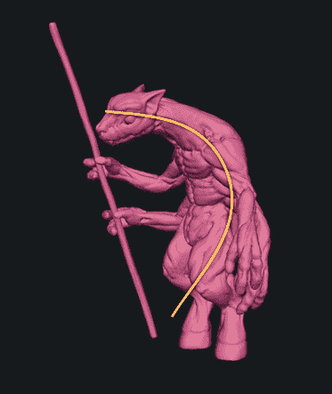图 6-16。尽量建立流畅的曲线，使其贯穿角色

****粗略细节和解剖学****。一旦你完成了雕塑的主要体积和面，通常会发现许多解剖细节实际上已经存在，尽管仍有许多解剖特征需要添加到最终的雕塑中。在雕塑中实现解剖学的真实感需要练习，这是通过收集和研究解剖学参考资料，然后将这些解剖学标志放置并完善在雕塑上的过程。

填充细节的一种方法是从主要的肌肉群和骨骼标志开始，然后逐渐加入更小的细节，如肌肉结构和小特征，如手指、耳朵、眼睛等。请参阅面，了解我如何为蝙蝠生物实现这一过程。

****精细细节和表面纹理****。最后，我们进入精细细节阶段，比如皮肤上的皱纹和毛孔，或硬表面模型中的技术细节（参见图 6-18）。这是一个有趣的阶段，可以为模型增加许多个性。需要注意的一点是，特别是对于那些没有强烈肌肉结构的有机角色，你可能添加的许多解剖学细节需要被淡化。你可以选择在雕刻过程的早期省略这些细节（但仍然要考虑它们在表面下的位置），或者在需要更细腻效果的区域将它们平滑掉。最后，你可以开始添加更小的细节，如皱纹、毛孔、疤痕等。我们可以开始平滑和抛光在早期雕刻过程中产生的任何伪影，然后添加更多有意识的精细细节。

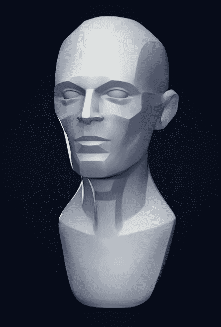图 6-17。头部的平面。你不需要将平面定义到这个程度，但要记住它们。

这些是雕刻过程中一般的阶段。它们从粗略的整体形状开始，到具有你试图创造的关键特征，然后让你重新创造更精细的细节。现在，让我们将这些阶段应用到雕刻蝙蝠生物和蜘蛛机器人上。

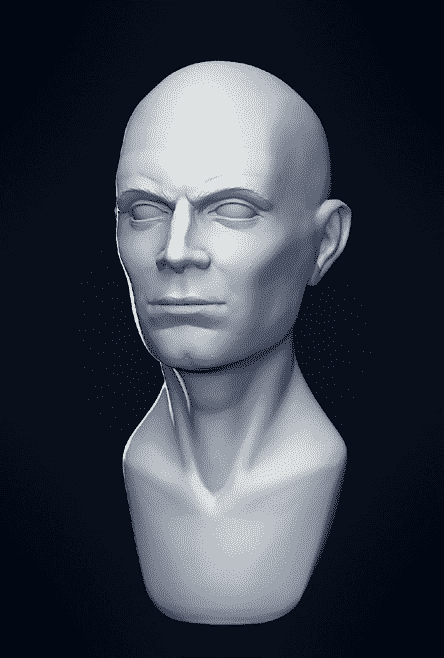图 6-18。精细细节可以在主要形态确定后处理。

## 雕刻蝙蝠生物

对于蝙蝠生物，我从几个简单的基础网格开始，这些网格的拓扑支持了我需要的大部分特征（虽然面部的部分没有拓扑支持）。然后，我可以开始将蝙蝠生物的形态发展成更有趣的样子，并添加进一步的细节，例如一些肌肉结构和面部特征。

首先，我取了基础网格，添加了一个 Multires 修改器和几个细分。最初的目标是增加足够的分辨率，以便我可以开始精炼体积，定义基本的平面和地标——但又不会增加过多分辨率，以至于过早进入细节雕刻。雕刻时，尽量在添加下一级细分之前充分利用每一级细分的效果。

### 体积

我首先使用膨胀工具为腿部和手臂添加体积（参见图 6-19）。膨胀工具在低细分级别下非常方便，可以扩大基本的质量并赋予它们圆润的形状。粘土工具也很适合在特定位置构建体积。（使用平滑工具或膨胀工具的减法模式，可以轻松地再次使形状变薄。）

在蝙蝠的躯干上，我开始将大部分肋骨或胸部与骨盆分开，并在背部增加一些肌肉量以表现肩部。蝙蝠生物是一个背部长有翅膀的角色，因此背部的大肌肉是预期的。

### 平面

接下来，我开始雕刻人物的基本平面。由于此时我正在增加更多细节，所以首先添加了几个细分级别，使得整体的多边形数量达到了几十万个多边形。这里的目标是首先找到身体的骨骼标志性位置，如肋骨的上下、骨盆的髂脊、膝盖和肘部，以及头骨（参见图 6-20, 标志性位置）。

作为第一步，你可以用粘土画笔轻轻标记这些点。接下来，可以使用这些标记作为指南，放置主要肌肉群的次要形态。为此，只需使用粘土画笔（图 6-20, 体积）添加和去除质量。然后，你可以开始使用平坦、刮削和填充画笔，将这些质量展平成身体的主要平面（图 6-20, 平面）。在此阶段使用折痕画笔，可以在减法模式下更好地创建平面之间的划分（这是该画笔的默认行为）；此画笔也可以在加法模式下使用，为面向外部的平面添加锐利的边缘。

规划和跟踪你想要创建的细节的一个好方法是使用 Blender 的油漆铅笔，设置为 Surface 绘制模式来勾画肌肉群（见图 6-21）的轮廓。在物体模式下，选择你的网格，添加一个新的油漆铅笔图层，将绘制模式设置为**Surface**，然后按住**D**键并点击进行绘制，便可以在网格表面上绘制笔画。现在，你可以在雕刻之前勾画出任何解剖学地标。例如，在图 6-21 中，我已经勾画出了主要的肌肉群。

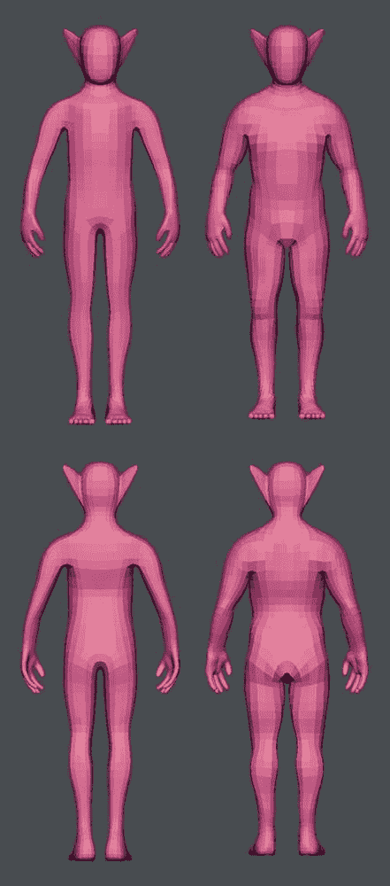图 6-19. 蝙蝠生物体积：在雕刻体积之前的细分基础网格（左）和使用 Grab 与 Inflate 刷子粗略添加的大体体积（右）。在这个阶段，我专注于通过充气与放气，或者在较低细分级别上平滑形状，来精炼角色的整体形状，使其具有正确的体积和比例。我也可以在基础网格中调整某些比例。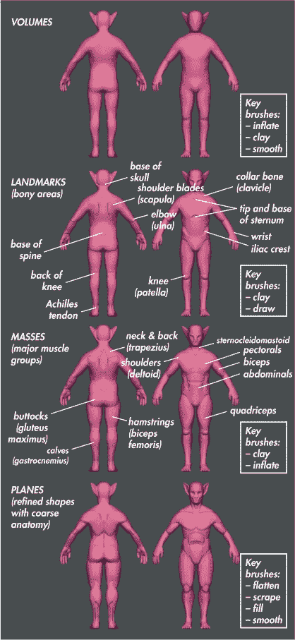图 6-20. 勾画身体主要平面阶段！左：使用油漆铅笔勾画肌肉群和地标。右：在属性区域中的油漆铅笔面板。图 6-21. 左：使用油漆铅笔勾画肌肉群和地标。右：在属性区域中的油漆铅笔面板。

### 粗略的解剖学

在勾画好我们的平面后，我们可以继续进一步定义解剖结构。在这一阶段，参考资料特别重要，因为我们使用像 Clay、Clay Tubes、Crease 和 Inflate 这样的刷子来进一步定义解剖细节，强调单独的肌肉、身体和面部的骨骼（见图 6-22）。

### 使用形状键雕刻难以触及的区域

一些区域，如腋下或腿部之间，使用雕刻刷子时可能比较难以触及。为了让操作更轻松，在编辑模式下为你的网格创建一个新的*形状键*，这样你就可以轻松到达你想要处理的区域。

形状键允许你存储网格顶点的不同位置，这样你就可以拥有一个手臂抬起的姿势，一个手臂放下的姿势，或者任何你想要的姿势。形状键完全兼容雕刻模式，这意味着你可以在雕刻时启用或禁用它们，以改变雕刻的姿势。例如，在这个雕刻中，我创建了手臂和腿部位置更远的形状键，这样就更容易到达腋下和内侧腿部区域。

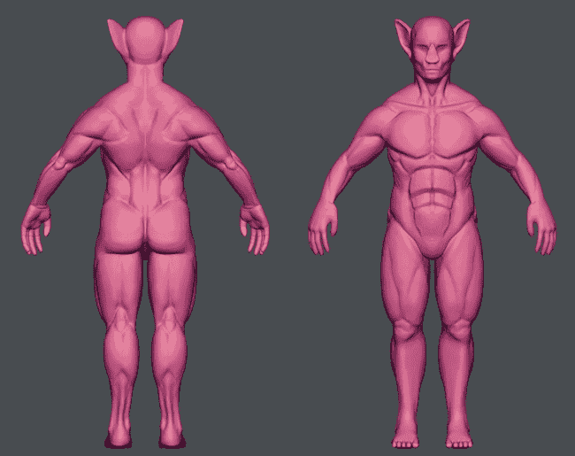图 6-22. 进一步定义解剖结构。此阶段参考资料很重要，但也有创作的空间。

为了创建形状键，我首先在对象模式下添加了一个新的形状键来保持新的姿势。（点击形状键面板右侧的+图标两次，将网格的原始形状设置为默认的“基础”形状；然后再次点击它，创建一个相对于基础形状存储顶点位置的新形状。）接下来，我在编辑模式下选择了手臂的顶点，并围绕肩膀旋转它们，稍微将手臂伸展出去。然后，我调整了周围的顶点，以精细化新的姿势（参见图 6-23）。返回到雕刻或对象模式后，我可以通过调整形状键的值（在形状键面板中使用滑块）来将身体移到更易于操作的位置。

### 隐藏网格的部分区域

另一种处理雕刻中难以触及区域的方法是使用快捷键 ALT-B 隐藏部分网格，这样你可以在屏幕上拖出一个框，限制网格可见的部分仅为框内的内容（参见图 6-24）。通过隐藏网格的一部分，你可以专注于模型的一小部分，同时查看一些更难触及或隐藏的区域。

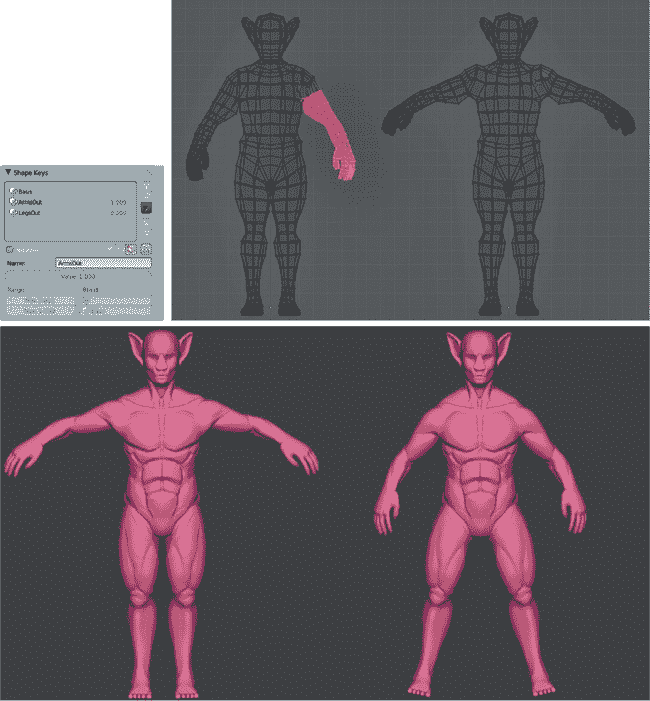图 6-23. 为不同的姿势添加形状键。左上：在属性编辑器的对象数据标签中找到形状键面板。右上：选择手臂并将其移到新位置，使之前隐藏的手臂和胸部区域更加可见。底部：在雕刻模式中应用的新姿势，以及为腿部制作的独立、类似的形状键。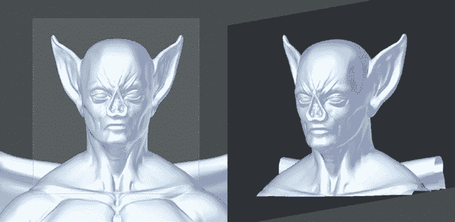图 6-24. 限制可见区域为一个小选择区域，使用快捷键 ALT-B 并拖动矩形框选你想要保持可见的区域。

### 雕刻翅膀

接下来我开始雕刻翅膀（参见图 6-25）。翅膀的工作量较少，因为它的基本形状已经接近我想要的最终效果。

我首先使用 Inflate 刷子为翅膀骨骼增加一些体积，然后添加了一些骨骼标志点。接着，我细化了骨骼的平面，并使用 Inflate、Crease、Flatten 和 Clay 刷子给它们设定了清晰的边界。我们之前制作的 Crease Lazy 刷子在处理骨骼轮廓和为翅膀结构添加脊线时非常有用。

### 基本细节

虽然我不打算在重拓扑之前完成蝙蝠身体上的精细细节，但我仍然需要添加头部的主要特征：眼睛、鼻孔、嘴巴和耳朵的细节。回到身体部分，我开始添加这些细节。Crease 刷子是勾画这些细节轮廓的绝佳工具——例如嘴唇之间的沟槽、眉毛的褶皱和鼻子周围的折痕——然后使用 Clay 刷子构建基本形状，再用 Flatten 和 Polish 刷子来精细调整它们（参见图 6-26）。稍后，这些部分会进行重拓扑并重新雕刻，所以我目前只是粗略地做了标记，足以显示出大致形状。

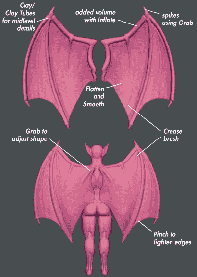图 6-25. 翅膀与身体的雕刻方式相同。由于初始的基础网格定义得更为清晰，这个过程比身体的雕刻简单。

### 雕刻眼睛周围的区域

眼睛的雕刻可能有些棘手，因为你需要遵循眼球的基本形状，同时添加眼睑等细节。为了简化这一过程，首先添加一个新的球体对象作为眼球的占位符（见图 6-26），然后围绕球体雕刻眼睑。可以使用镜像修饰符，通过将身体对象作为修饰符设置中的镜像对象来创建另一只眼睛。

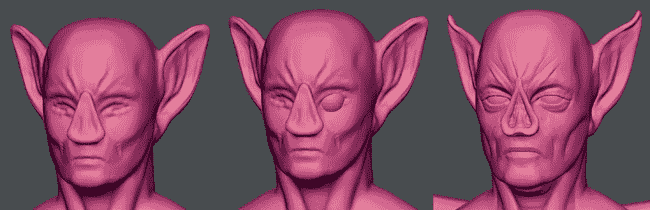图 6-26. 添加眼睛以便更容易雕刻周围区域，并使用 Crease 刷子标记面部的关键特征。记住，在调整眼睛至正确大小时，头骨大约有五个眼睛宽度，且两只眼睛之间应该有一个眼睛宽度的间距。

### 是时候进行重拓扑了

此时，我已经到了需要添加更多细分的阶段，但由于当前拓扑结构的问题，这个过程会变得缓慢且笨重（此时身体的多边形数已经超过了 500 万个面）。通过在此阶段进行重拓扑，可以创建一个更密集且更合适的网格，从而在面部和手部等重要区域提供更高的初始多边形密度，并且具有更好的拓扑结构来支持更粗的细节。这将使得在重拓扑之后，能够继续雕刻并向网格中添加更精细的细节，而不必继续以荒谬的速度增加多边形数。

### 注意

*如果你希望严格按照时间顺序继续操作，请跳到第七章。从这里开始，我将把现有的细节转移到新的重拓扑网格上，然后继续添加更精细的细节。*

### 将雕刻的细节转移到新的网格并使用位移贴图

在完成重拓扑雕刻后，我需要将原始网格上雕刻的细节转移到新网格上。对此有几种方法，每种方法都有其优缺点。一个方法是使用 Shrink Wrap 修改器：首先为新网格添加 Multires 修改器，然后进行几次细分，添加 Shrink Wrap 修改器，并将原始网格设置为目标。对于较简单的雕刻，这种方法可以较好地工作，但对于更复杂的物体，它可能会产生一些伪影和错误，需要花时间修正。因此，对于更复杂的雕刻，使用位移贴图是一个更好的方法。

#### 关于位移贴图

*位移贴图*是定义如何根据纹理的值来位移网格表面的图像纹理：白色区域使表面抬升，而黑色区域则被压入。通过对网格进行 UV 展开，并将位移贴图应用到新的网格上，你可以将旧雕刻的细节转移到新网格上。

要创建位移贴图，使用 Blender 的纹理烘焙工具来计算原始雕刻表面和新重拓扑网格表面之间的距离，并将它们烘焙到图像中。然后，通过使用 Displace 修改器（结合 Multires 修改器来细分网格），你可以应用这个位移，使新的重拓扑网格精确匹配旧的网格。（UV 映射在第八章中有更详细的介绍，纹理烘焙在第十章中有更深入的讨论，因此这里只介绍基础内容。）

我通过标记一些接缝（CTRL-E）来为我的重拓扑网格创建一个简单的 UV 展开，将其分割成易于展开的片段。然后我使用 Unwrap 操作符（U▸Unwrap）进行展开，并将 UV 岛屿打包到 UV 网格中。（你可以使用快捷键 CTRL-P 自动完成此操作。）

接下来，我通过选择对象，进入编辑模式，在 UV 图像编辑器中使用“图像▸新建图像”来为对象的 UV 坐标分配一个新的图像，创建一个空白的 4096×4096 图像用于烘焙位移。（创建此图像时，确保勾选**32 位浮点**选项，以获得最佳效果，因为位移贴图的位深度较低时，可能会产生难看的阶梯伪影。）

最后，我通过按照以下步骤将位移从我的原始雕刻烘焙到新的重拓扑网格（见图 6-27）：

1.  选择原始雕刻。

1.  使用 SHIFT▸**选择重新拓扑的网格**，并应用一个渲染级别为**3**的**细分表面**修改器。这样会在计算位移之前细分网格，以便稍后当我们使用多重细分（Multires）修改器细分网格时，能应用相同的位移。

1.  在属性编辑器的渲染标签下，打开**烘焙**面板。

1.  确保**选择到活动对象**已启用，并且烘焙模式设置为**位移**。

    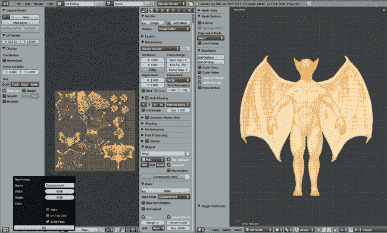图 6-27. 从旧的雕刻到新的重新拓扑网格的位移烘焙。这通常比使用收缩包裹（Shrinkwrap）修改器更容易调整，并且效果更好，尽管需要一些额外的努力。

1.  将“距离”参数保持为默认值**0**。

1.  点击**烘焙**以烘焙你的位移贴图。

1.  一旦烘焙完成，在 UV 图像编辑器中将位移贴图保存为*OpenEXR*文件，通过从头部菜单选择**图像**▸**另存为图像**（确保在保存时将文件类型设置为*EXR*）。

#### 将位移应用到雕刻

一旦位移贴图图像被烘焙完成，你需要创建一个使用该图像的纹理，并将其作为位移修改器的输入应用到新网格上。

### 注意

*下面列出的步骤有些不太优雅，因为要编辑纹理的属性，Blender 需要你将其分配到材质、世界或画笔上。为了绕过这个问题，你可以创建一个“虚拟”材质，将位移纹理分配给它，以便你可以编辑它，然后将其分配给位移修改器。（有关图像、纹理和材质的正常工作方式，请跳至第十章，第十一章，和第十二章。）*

要将位移贴图应用到你的新重新拓扑网格，请执行以下操作：

1.  选择你的重新拓扑网格，并在属性编辑器的材质标签下，通过点击**新建**按钮为其创建一个新材质。我们稍后不会使用这个材质来渲染网格，它只是用来暂时存放我们的纹理。你可以将这个材质重命名为*Displacement_Dummy*。你可能还想通过点击其名称旁的**F**图标为该材质创建一个假用户，以便在你将不同的材质分配给物体（留下虚拟材质未分配）时，虚拟材质不会被丢弃。

1.  切换到属性编辑器的**纹理标签**，并通过点击**新建**为材质添加一个新纹理。

1.  将材质类型设置为**图像或电影**，然后在下面的图像面板中点击**打开**，加载你刚刚创建的位移贴图。为它命名一个容易记住的名称。

1.  删除我们之前添加的细分曲面修改器，并将**Multires**修改器添加到重新拓扑的网格中。然后将其细分几次。暂时目标是大致达到与原始网格相同的面数。

1.  添加一个**位移**修改器。在纹理选择器中，选择你的位移材质，并将方向设置为**法线**，但将坐标设置为**UV**，以便使用物体的 UV 坐标来应用位移纹理。由于我们将纹理烘焙设置大部分保持为默认值，因此默认强度为 1 应该正好是我们需要的。这应该能使你的网格与原始雕刻的形状完全一致。

#### 使用顶点组控制位移

一些区域，如嘴巴内部，可能会在应用位移修改器时造成问题。由于嘴巴内部是全新的拓扑，它在位移贴图中不会包含任何有用的信息，因此最好将这些区域排除在位移修改器的影响之外。为了解决这些问题区域，你可以为位移修改器分配一个顶点组，限制位移只作用于网格的某些部分，保持问题区域不受影响。图 6-28 显示了位移修改器在权重绘制模式下的顶点组；嘴巴和眼睛内部以及翅膀上的爪尖不包含在组内。

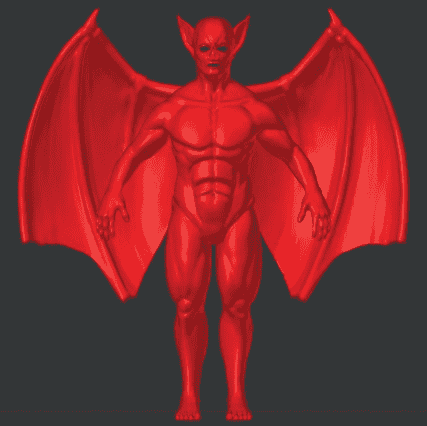图 6-28. 使用顶点组限制位移修改器的作用（此处显示为权重绘制模式）

要创建一个顶点组，请执行以下步骤：

1.  进入**编辑模式**，在属性编辑器的对象数据选项卡中，点击顶点组面板中的+图标来创建一个新的顶点组。

1.  选择你希望包括在组中的顶点（即，你希望应用位移修改器的网格部分），然后在顶点组面板中点击**分配**，将它们分配到该组中。

1.  切换回**对象模式**，并将该顶点组设置为限制位移修改器效果的顶点组（顶点组选项位于修改器设置中；参见图 6-29）。你现在应该已经应用的修改器如图 6-29 所示。

1.  通过点击**应用**来应用位移修改器。其效果将被 Multires 修改器保存，使你能够返回雕刻模式，继续雕刻并添加细节。

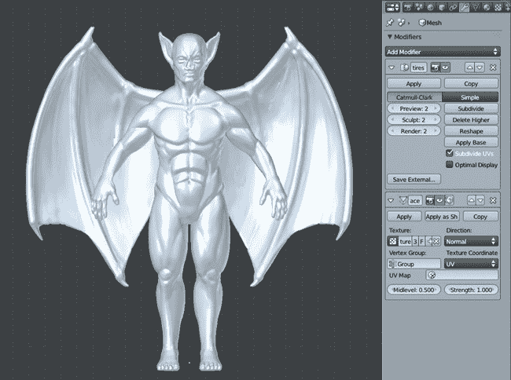图 6-29. 使用位移修改器应用位移贴图。在修改器堆栈中将位移修改器放置在 Multires 修改器下方将允许你应用位移，并将结果由 Multires 修改器捕捉，以便继续雕刻。

### 细节雕刻

在重新拓扑的网格已经准备好进行雕刻后，我开始使用各种刷子进行雕刻，并添加精细细节（参见图 6-30）。粘土刷和标准刷通常是定义重要形态的最佳选择，但 alpha 纹理可以更快地添加纹理。

从面部开始，我使用粘土刷和绘制刷添加了一些主要的皱纹。然后，我转向使用 alpha 纹理。使用本章前面讨论过的拖动 Alpha 刷，并结合一些皮肤纹理 alpha，我开始构建皮肤表面的纹理。

剩余的身体部分以相同的方式覆盖：使用混合的 alpha 刷和小型粘土刷和绘制刷构建纹理和细节。在肩部和翅膀周围的区域，我使用一混合的 alpha 刷、粘土刷和皱纹刷，添加了一些与翅膀扩展和收缩相匹配的褶皱，正如图 6-31 所示。

#### 程序化细节

尽管最好手工雕刻模型的关键细节，但能够为雕刻表面添加一些通用的粗糙度是很方便的。我们使用了位移修改器来通过烘焙的位移贴图传输细节，但我们也可以使用其他纹理作为位移修改器的输入，以生成表面上的一些微妙变化。Blender 提供了多种*程序化纹理*（通过各种算法生成的纹理，不需要图像作为输入），这些纹理非常适合此用途。

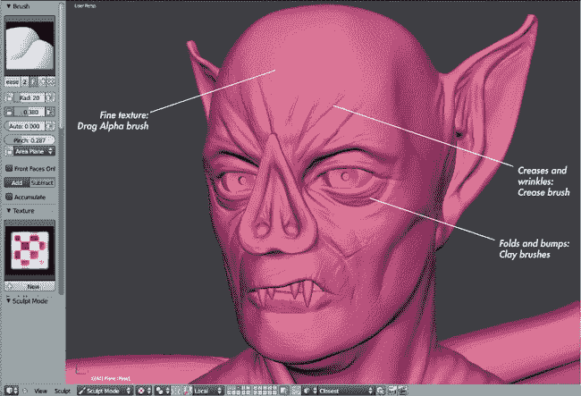图 6-30. 使用各种刷子和 Alpha 图层为面部添加细节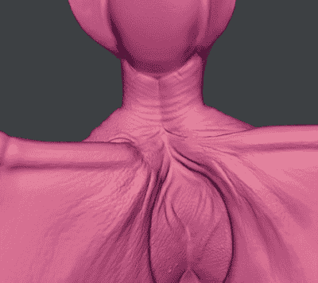图 6-31. 为翅膀和背部添加细节

要使用程序化云纹理和位移修改器为你的雕刻添加表面细节，请按照以下步骤操作，并查看图 6-32：

1.  创建一个新的纹理块（我们可以使用之前创建的虚拟材质来存放它），并将其类型设置为**云**。

1.  在对象模式下（位移修改器在雕刻模式下无法显示），为你的雕刻添加一个**位移**修改器（位于多分辨率修改器之后）。将你新的程序化纹理设置为修改器的纹理。

1.  将修改器的强度设置得非常低。然后切换回**纹理标签**（Texture tab），并调整现在选择了云纹理类型后出现的云纹理面板中的设置。尝试将云的缩放设置为非常小的值，并调整亮度、对比度和噪声基准，以产生不同的效果。

    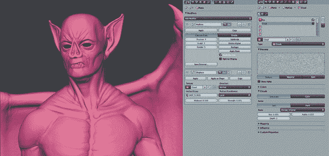图 6-32. 使用云纹理和位移修改器添加程序化细节

1.  正如我们在使用位移修改器传输细节时所做的那样，你可以使用顶点组来遮罩不希望受到影响的区域。

1.  当你对效果满意时，应用修改器将结果烘焙到多分辨率修改器中，这样你就可以继续雕刻。

#### 打破对称性

在这个阶段，如果你保持对称性开启，你的雕刻可能会变得有些*过于*对称。虽然大多数动物和角色的身体和面部在大体上是对称的，但像毛孔、皱纹、疤痕等细节却并非如此。

一旦你达到细节阶段，通常最好在工具选项中关闭对称性。对于更远的区域，如手臂和腿的末端，你可以保持对称性：因为这些部分彼此较远，对称性不太明显。然而，在角色中间的细节明显对称会看起来奇怪，所以特别为这些区域关闭对称性。

当然，你*可以*更早地打破对称性；大多数角色和面部都有一些微妙的不对称性。这种微妙的程度可以为你的雕塑增加很多可信度，所以考虑在早期禁用对称性。

### 姿势

为了为我的角色创造一个更有趣的姿势，我进入编辑模式（TAB），并在连接模式下（ALT-O）使用比例编辑，同时围绕 3D 光标旋转移动肢体（见图 6-33)。我为这个姿势创建了一个新的形状关键帧，然后开始调整身体。例如，为了移动一条腿，我选择了腿部所有的顶点，将 3D 光标放在髋关节位置，然后围绕该点旋转腿部，使用比例编辑创建平滑过渡。这是一种快速而简单的方式来为角色设定姿势，而不需要进行复杂的绑定工作，这是一项复杂的任务，对于静态渲染来说，付出的努力不值得。

我调整了其余的肢体和头部，使角色以更有趣的方式摆姿势。然后我回到雕刻模式，在低细分级别下使用抓取和粘土刷来修复姿势中的任何错误，并调整肌肉的外观。我用平滑工具放松了会被伸展的肌肉，并稍微减少了它们的体积，反之，膨胀并收紧了在新姿势中会收缩的肌肉。

### 表情

面部表情是任何角色的重要组成部分。我添加了一个新的形状关键帧来保持面部表情，并使用抓取和粘土刷在蝙蝠的脸上加入了一点咆哮的表情（在图 6-32 中可见），通过抓住鼻子的两侧并稍微向上移动，稍微提起上唇，收紧眼睛。在面部皱起的区域添加一些皱纹，并平滑拉伸的区域，以补充已经添加的细节。

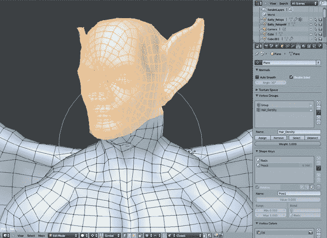图 6-33。调整角色的姿势。我选择了头部的顶点，然后将 3D 光标放置在脖部的基部，允许我通过围绕 3D 光标旋转选定部分来稍微转动头部，并启用了比例编辑。将这个新姿势作为形状键保存，可以让你以后改变主意并恢复到标准姿势。

## 雕刻蜘蛛机器人

蜘蛛机器人像蝙蝠生物一样进行了雕刻，首先使用黏土和抓取刷子封锁主要形态，然后精细调整平面并添加细节。然而，在蜘蛛的情况下，我还需要面对增加的复杂性，即尝试创建硬表面形态。虽然你可以直接建模这些形态（通常是一个很好的方法），但雕刻一些硬表面形态的部分让我在创建模型时可以更加实验性。

虽然 Blender 无法完美地抛光硬表面和锋利的边缘，但你可以借助 Flatten 和 Polish 刷子以及 Pinch 和 Crease 刷子完成很多工作。然后，你可以使用重新拓扑技术创建一个最终的模型，具备干净、平滑的形态。通过先专注于形态，再处理拓扑，可以减少在不确定形态时建模的麻烦，之后再让你的物体以干净的拓扑流畅地曲线化。

### 身体

从蜘蛛机器人的身体开始，我使用 Crease 工具粗略标记出硬表面边缘的位置。接着，我使用黏土刷（自定义的 Clay Tubes 刷子在这方面非常优秀）在这些线条周围构建体积，然后使用 Polish 和 Flatten 刷子进行精细调整（参见图 6-34）。

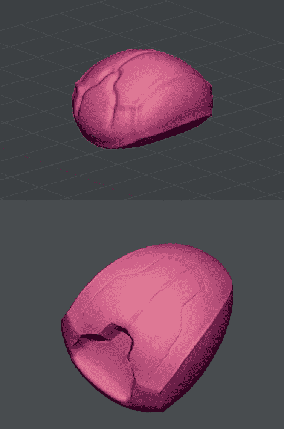图 6-34。首先，使用 Crease 刷子绘制粗略设计。接着，使用 Clay Tubes 刷子构建体积。最后，使用 Polish、Pinch 和 Flatten 刷子进行精细调整。

为了创造更加精细的边缘，可以将 Crease 画笔（我们制作的自定义 Crease Lazy 画笔适合长而平滑的曲线）与加法模式（按住 CTRL 键）结合使用，使角落和边缘更加锐利。然后，捏合这些边缘，使其形成真正尖锐的褶皱。通过避开边缘并在平面区域使用 Flatten 画笔，你可以获得相当精细的效果。（不要过于着迷；我们稍后会使用重新拓扑来创建一个具有更光滑形态的新网格。）

### 头部

头部的雕刻方法相同（见图 6-35），使用 Polish 画笔使形状更加平坦，使用 Crease 画笔标记边缘和凹槽。我还在腿部和獠牙与身体连接的地方雕刻了深深的凹陷。

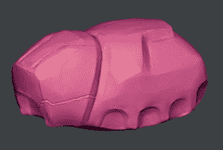图 6-35. 头部部分，雕刻方式与身体相同

### 腿部

雕刻腿部的过程与雕刻身体相似。我首先将各部件的整体形状抛光成更平坦且略微硬朗的边缘。然后，我使用 Clay 和 Crease 画笔在其上构建了更有趣的形状，首先勾画出设计图案，再填充形状。接下来，我再次进行抛光，使形状更加紧凑、光滑（见图 6-36）。

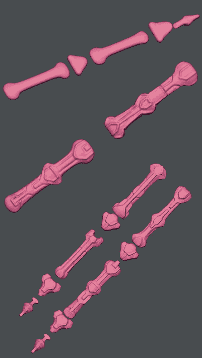图 6-36. 使用与身体相同的技术雕刻腿部。我保持了腿部件的雕刻相对松散，因为最终的腿部零件将通过对雕刻的腿部进行重新拓扑来创建干净、平滑的几何形状。

不过，依然无需追求完美光滑的表面，因为我们将在第七章中通过重新拓扑来修复这些表面。

### 注意

*Polish 和 Flatten 画笔在锐利的角落处可能会产生奇怪的效果，形成尴尬的凹痕。为了解决这个问题，可以撤销操作，或者使用 Inflate 和 Smooth 画笔去除这些凹痕，然后重新增加褶皱并抛光表面。*

为了了解我在这一阶段雕刻的外观，我复制了腿部的部件（作为链接副本，ALT-D），并在物体模式下将它们移动并旋转到合适的位置（见图 6-37）。这让我检查了模型的最终效果，尽管在这个阶段我没有将腿部部件镜像到身体的另一侧。

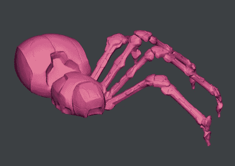图 6-37. 雕刻的身体部件，复制并大致移动到最终位置

## 丛林寺庙：创建附带细节

尽管废弃寺庙场景没有使用大量雕刻，但某些附带的细节更容易雕刻，比如泥土和粗糙地面的斑块（见图 6-38）。我主要通过使用没有多重细分修改器的粘土刷来创建这些区域，而是选择在编辑模式下将网格细分几次。我本可以使用 Alpha 模板在石墙上雕刻一些损坏的痕迹，但我觉得墙壁相对的平整与周围植物的混乱形成了很好的对比，所以我保留了光滑的墙面。

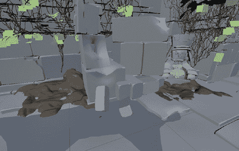图 6-38. 从寺庙场景中粗略雕刻的泥土斑块

## 雕刻自然面部的技巧

尽管蝙蝠怪物*有*一张脸，但它并不是你会称之为经典帅气的那种脸。这里有一些雕刻更自然面部的技巧。

+   在深入细节之前，首先要关注比例和大的体积。锁定总体体积后，再添加皱纹、毛孔和疤痕，这样当你的雕刻看起来不对时，就不需要重新做这些细节了（见图 6-39）。

    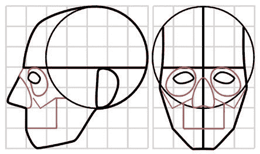图 6-39. 头部比例的划分。总体而言，你可以将头部视为围绕颅骨的球体构建，面部从中向前和向下延伸。在这里，头部的比例被划分在一个以眼睛宽度为单位的网格中。颅骨的一些重要特征，包括颧骨、眼窝和上颚，都用红色标出。

+   头部大约是五个眼睛宽度，垂直大约是七个眼睛宽度（参见图 6-39）。这是一项有用的测量方法。记住这个比例，并用它来判断面部特征的相对距离和大小。

+   嘴巴的雕刻较为困难。根据你是雕刻一个“张开”的嘴巴（内部拓扑是圆形的）还是一个“闭合”的嘴巴（仅仅是“画”在面部表面上的），你需要采用不同的策略。对于张开的嘴巴，使用充气和光滑刷可以调整嘴唇及其周围区域的形状。对于闭合的嘴巴，皱褶刷非常适合绘制上下嘴唇之间的褶皱，然后使用黏土和黏土管刷填充周围区域。记住，上唇通常比下唇更有轮廓，呈现出粗略的*M*形状。下唇则更圆润，且在大多数人身上稍微被上唇遮住（参见图 6-40）。

    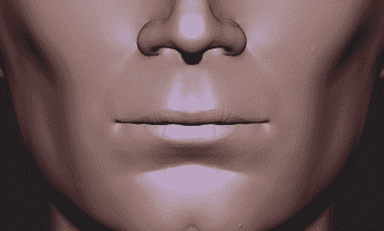图 6-40. 嘴唇

+   脸部的解剖结构和颅骨的标志性位置非常重要。尝试雕刻或塑造一个颅骨，雕刻面部肌肉，然后在其上添加皮肤，观察它们之间的相互影响（参见图 6-41））。

    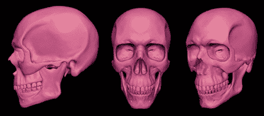图 6-41。头骨的解剖结构在决定一个人外貌时非常重要。特别是头骨的标志性部位——如颧骨、眉骨和下巴——对面部的整体外观有着重要影响。

+   除非你希望角色看起来非常老，否则不要添加过多的皱纹和褶皱。即使是一些微妙的皱纹，也能为面部增添许多个性。

+   很少有面部是完全对称的。虽然开启对称雕刻可以帮助你取得很大的进展，但在雕刻的后期阶段，关闭对称功能，可以让面部的两侧增添一些独特性。

## 复习

在本章中，我们探讨了 Blender 提供的各种雕刻工具，并学习了如何自定义它们，以充分发挥其功能。接着，我们开始雕刻蝙蝠生物的身体，并将我为其和蜘蛛机器人项目所创建的简单基础网格，转化为更详细、更精细的模型，这些模型现在已准备好进行重拓扑。最后，我们讨论了一些雕刻面部的基本原则。

在下一章中，我们将开始对雕刻进行重拓扑，完成项目的建模阶段。在之后的章节中，我们将再次使用高多边形雕刻模型，通过烘焙贴图和纹理为模型准备渲染，使用位移和法线贴图恢复我们在本章中创建的细节。
