## 第七章 重拓扑

有时候，使用一种方法来创建物体的基本形态会更容易——例如，通过雕刻或组合简单的原始形体——然后再用另一种方法来创建最终的拓扑结构以便纹理映射和最终渲染，使用这些基本形态作为指导。这就是重拓扑能够帮助我们做的事情。*重拓扑*是指在现有网格上创建新的几何体，同时保持物体的基本形状并重建其拓扑结构。重拓扑让我们可以将创建正确形状和创建有用拓扑的任务分开，从而更容易制作出我们想要的模型。

在本章中，你将学习如何使用 Blender 的捕捉工具和其他重拓扑技巧，在高多边形雕刻网格的表面上建模新几何体，就像我们在第六章中雕刻的那些网格一样。最终的结果将是一个捕捉雕刻细节的网格，使用更少的多边形，且拓扑结构能够良好细分，适合绑定和动画制作。

## 基础知识

有多种方式进行重拓扑，但最直接的方式是使用 Blender 的投影捕捉工具，直接在你想要重拓扑的网格表面创建几何体。（更多关于这些工具的信息，请参见捕捉）。

### 使用捕捉工具进行重拓扑

要开始进行网格重拓扑，按照以下步骤操作：

1.  在对象模式下添加一个新的平面对象。

1.  进入**编辑模式**并启用**捕捉**。

1.  将捕捉目标更改为**面**并启用**投影到表面**（参见图 4-10），这样 Blender 就可以通过从当前视角投影，将选定的顶点和边捕捉到其他物体的表面上。

1.  将平面缩小，直到它的大小与最终重拓扑网格中面部的大小一致。接下来，抓取并将平面放置到你想要开始重拓扑的网格区域上。

1.  调整现有顶点的位置。然后，选择面的一条边，并开始挤出以创建新面，沿着网格的轮廓进行操作。

1.  每当你挤出一个新面或抓取一个已有的面时，它会被投影到屏幕上任何其他网格的表面上（尽管在进入编辑模式之前你选择的其他物体将被忽略）。

使用上面描述的方法，你应该能够在短时间内覆盖即使是复杂网格的表面，创建出与原始物体相同形状的全新网格。

### 重拓扑的替代方法

还有其他几种快速重新拓扑的有用方法，值得讨论。第一种是使用 Shrinkwrap 修改器将简单的拓扑投影到网格的表面。使用这种方法，你首先在原始模型外部建模一个基本的笼子（如图 7-1)，挤出区域以创建你想要的拓扑。笼子只需大致匹配原始形状，因为下一步是向网格添加 Subsurf（或 Multires）修改器和 Shrinkwrap 修改器，并将原始模型设置为 Shrinkwrap 修改器的目标。然后，Shrinkwrap 修改器会自动将新网格调整到原始模型的表面。

Shrinkwrap 有几种方法可以实现这一点，最好进行实验，看看哪种方法最适合你的模型。我通常发现最有用的方法是 Nearest Surface Point 和 Project 模式。请注意，Project 模式有一些额外的选项，你需要在方向复选框中同时启用 Negative 和 Positive，这样你的网格才能在两个方向上投影并适应目标（除非新网格的表面始终位于目标表面之上或之下）。

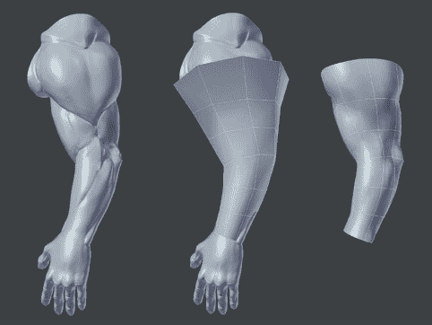图 7-1. 使用 Shrinkwrap 修改器进行快速重新拓扑。首先，在高多边形原始模型周围创建一个简单的网格。接着，添加一个 Shrinkwrap 修改器，将新网格投影到原始模型上。在这里，一个手臂通过沿长度挤出一个圆圈来进行重新拓扑，粗略地缩放和旋转它到位，然后添加 Subsurf 和 Shrinkwrap 修改器，使新网格适应雕刻。

当你想要快速重新拓扑一个需要更好基础网格的雕刻时，这种重新拓扑的方法效果很好——例如，如果你是从一个立方体开始做头部或甚至整个身体，然后希望有一个基础网格，拓扑能更好地支持基本形状。

Shrinkwrap 方法对于将由多个部分组成的模型合并成一个单一网格也非常有用。例如，要创建第六章中讨论的玛雅符号的一体化版本，你可以将一个简单的网格投影到这些符号上，如图 7-2 所示。请注意，我重复使用了 Shrinkwrap 和 Subsurf 修改器，以捕捉所有的细节。重复使用修改器是一个非常有用的小技巧，尤其是在你投影到一个有很多尖角或深凹折的网格时，因为第一个 Shrinkwrap 修改器会遗漏那些当你正面查看目标网格表面时看不见的细节。最终生成的网格可以轻松地雕刻、展开和纹理化，而无需处理多个部分的网格。

另一种进行重拓扑的方法是使用 Blender 的 Bsurfaces 插件，它提供了一些很棒的重拓扑工具，允许你使用油漆笔绘制线条，并自动将这些线条转换为网格，如图 7-3 所示。

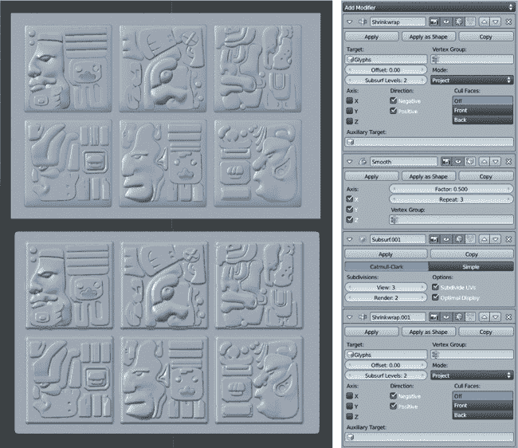图 7-2. 将网格投影到丛林神庙项目中的字形上，结果得到一个捕捉所有细节的单一网格。这个技术可以使 UV 展开和纹理处理变得非常简单，但会产生更高的多边形数量。顶部：原始字形。底部：投影到字形上的网格。右侧：修改器堆栈。Shrinkwrap 修改器重复使用，并在其间添加细分表面修改器和光滑修改器，以帮助第二个 Shrinkwrap 修改器进入所有紧密的角落。

## 对丛林神庙树木进行重拓扑

我在创建丛林神庙项目的大部分内容时使用了传统的建模方法，并没有进行大量的重拓扑。然而，在阻塞树木时，我通过将曲线对齐到背景物体的表面，得到了不错的占位符。这些占位符曲线可以通过重拓扑轻松转换为更完整的网格。要应用此技术，请执行以下步骤：

1.  创建树木占位符的副本（未链接，SHIFT-D）。然后，使用 ALT-C▸**从曲线/元件/文本创建网格**将其转换为网格。这将创建一个大致符合我们需求的网格，除了根部和树干是分开的网格。

    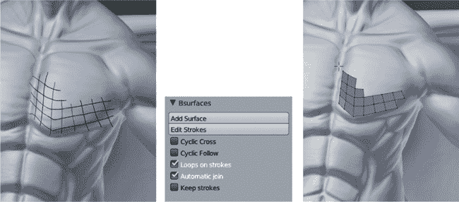图 7-3. 使用 Bsurfaces 通过绘制多边形与油画笔进行重拓扑。首先，用油画笔绘制你所需的网格，在你希望创建顶点的地方交叉笔划。然后，在编辑模式下使用添加表面按钮（Add Surface）从笔划中创建网格。使用油画笔笔划的表面选项将允许你直接在雕刻上绘制，创建一个跟随其形状的网格。

1.  通过删除根部和树干应连接区域的顶点，将根部与树干连接起来。然后，开始创建新的几何体来覆盖连接处并填补空隙（见图 7-4）。选择大致对齐的边对，并在它们之间创建面（**F**）。

1.  然后，您可以在这个面上添加一些环切（CTRL-R），将其分割成更均匀的四边形。

1.  获取新生成的顶点，并再次释放它们以将它们固定到表面。重复这一过程，继续填补空隙，将新的面连接起来，并尽量保持拓扑结构尽可能均匀和类似网格的形式。

    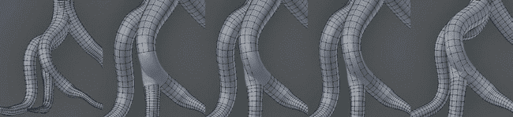图 7-4。使用 Blender 的吸附工具将基于曲线的树重新拓扑为单一网格。在我复制原始的基于曲线的树并将其转换为网格后，大部分工作已经完成，剩下的只是填补根部和树干之间的连接部分。

1.  对根部和树干之间所有连接处重复上述步骤。

1.  最后，关闭根部的开放端。在此阶段，调整根部和树干周围边环的密度也很有价值，删除一些过于密集的部分（**X**▸**Edge Loop**），并在较稀疏的区域添加新的边环（CTRL-R）。

## 重新拓扑蝙蝠生物

虽然原始蝙蝠生物的基础网格是一个很好的开始，但它缺乏支撑头部和更详细解剖特征所需的拓扑结构。此外，翅膀最初是作为单独的部分构建和雕刻的。现在，我需要创建一个最终的网格，具有更详细的拓扑结构，将这两部分结合起来。

### 简化多边形

在使用重新拓扑之前，我需要处理一个问题，那就是完整的雕刻模型已经有几百万个多边形，变得非常笨重。当然，这正是需要重新拓扑的原因，但在此之前，最好有一个能够捕捉细节的低多边形计数的替代网格，这样我就可以在其上绘制新的拓扑结构。解决办法就是简化多边形数量。

*简化*是一个过程，通过此过程，高多边形网格会自动简化，方法是通过合并小边缘和多边形来降低模型的复杂性，同时尽量减少细节丢失。Blender 有一个简化修改器，但它有点慢且并不总是有效，所以我通常使用另一个开源应用程序叫做 MeshLab (*[`www.meshlab.sourceforge.net/`](http://www.meshlab.sourceforge.net/)*)。要在 Blender 的雕刻上使用 MeshLab，请按照以下步骤操作：

1.  将你的对象导出为 Wavefront 对象 (*.obj*) 文件（**文件**▸**导出**），确保选中**仅选择**和**应用修改器**选项，这样可以确保应用所有修改器（包括多重解析）并保留雕刻的细节。这将创建一个相当大的 *.obj* 文件，包含你高多边形雕刻的网格。

1.  要将你的雕刻导入到 MeshLab，只需运行程序，然后使用**文件**▸**导入**将你的网格以 *.obj* 格式导入。

1.  MeshLab 提供了大量处理网格的选项，但为了我们的目的，我们将使用二次边缘折叠简化工具（**过滤器**▸**重网格化**▸**二次边缘折叠简化**）。这将打开一个菜单，允许你为网格指定目标多边形数量，以及其他选项（见图 7-5）。

1.  将目标多边形数设置为大约 150,000，并在选项中打开**平面简化**。然后运行过滤器。稍等片刻后，你应该会看到一个多边形数大大减少的雕刻版本，且仍保留了大量的细节。你可以通过 MeshLab 的文件菜单导出该模型，然后重新导入到 Blender 中。

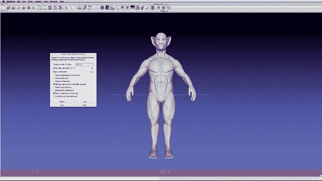图 7-5. 在 MeshLab 中简化雕刻。二次边缘折叠简化工具允许你设置目标多边形数量，然后 MeshLab 会通过合并接近的顶点来减少网格。

### 重拓扑身体

当雕刻被简化并重新导入到 Blender 后，我可以开始在其上放置新的拓扑结构。我首先在对象模式下添加了一个新的平面，并应用了镜像修改器。然后，我在捕捉工具按钮中打开了投影功能。接着，我在编辑模式下抓住平面，并将其缩放并定位到我想从那里开始重拓扑的位置（在这个案例中是躯干）。

### 注意

*在这一阶段，我仔细考虑了最终模型中所需的多边形密度。通过上下缩放第一个平面并朝着这一尺度进行操作，对重新拓扑网格的最终多边形数量产生了很大影响。我通常会尝试在与原始网格的大多数重要细节相似的尺度上进行工作。*

设置好起始点后，我开始沿着模型的轮廓从原始四边形的一个边缘进行挤出（**E**）（参见图 7-6），跟随肋骨和躯干肌肉的轮廓。这样创建了一个面循环，沿着模型中的一个重要形状延伸。通过填充周围区域并在其他形状上创建进一步的面循环，我们可以朝着完全重新拓扑雕刻的目标前进，使用支持我们雕刻形状的拓扑。这为捕捉精细细节创造了更高效的网格，当我们进行细分时能更好地呈现这些细节，并且如果需要以后解包和绑定，操作也会更加简便。

随着模型的推进，我在基础网格上使用的许多相同面循环的位置再次变得非常有用。虽然整体拓扑更加复杂，但在腋下、肩膀、手臂、腿部和脖部周围创建的面循环，导致了干净且易于修改的拓扑（参见图 7-7）。此外，由于网格仍然大致对称，我只需要对一半的身体进行重新拓扑，并使用镜像修饰符填充另一半。

对于某些区域，如面部，我开始缩小多边形，以便在区域较小且更细致的形状中填充更多内容。我创建了环绕眼睛、鼻子、嘴巴和耳朵外部的面循环（参见图 7-8）。这些面循环不仅支持了面部的形状，使得细分时它们不会丢失或过于柔化，还增加了这些区域的密度，以便在使用 Multires 修饰符时添加更多细节。（有关面部拓扑的具体技巧，参见头部拓扑。）

要创建一个嘴巴空腔，我从围绕嘴巴的边环挤出并填补了空洞（参见图 7-9）。当我们返回到重新拓扑后的网格进行雕刻时，我们需要重新雕刻这个区域，但嘴巴现在可以被张开并摆出不同的姿势。

对于像翅膀这样的物体，在难以看到狭小区域时，切换到透视视图（**5**）会非常方便，这样可以让相机在狭窄空间内自由移动。使用 ALT-B 限制视图也很有用。这样可以选择模型的一部分显示在 3D 视口中，让你只看到一个小区域，避免其他部位挡住视线，如图 7-10 所示。

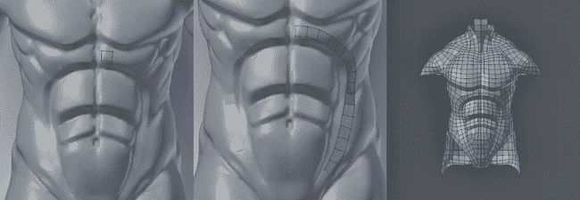图 7-6。 从创建一个重要的面环循环开始，一次一个四边形。然后，继续其他的面并填充中间的区域。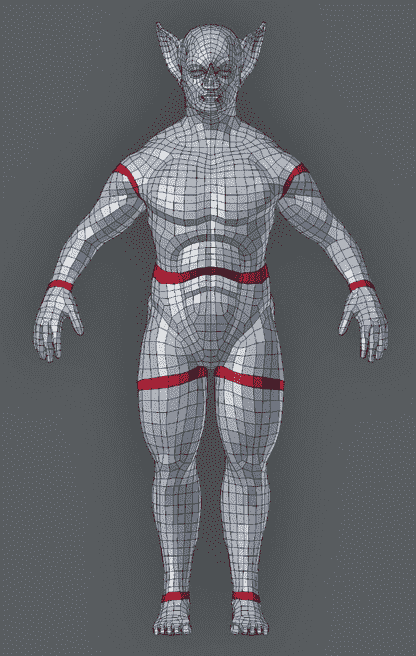图 7-7。 重要的面环循环。当进行重新拓扑时，一个好技巧是按/(斜杠)只查看你选择的物体。这样可以让你在按/返回全局视图并继续建模之前，看到你重新拓扑的网格进展。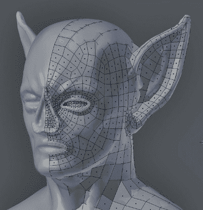图 7-8。 重新拓扑面部，创建一个跟随雕刻形状的新拓扑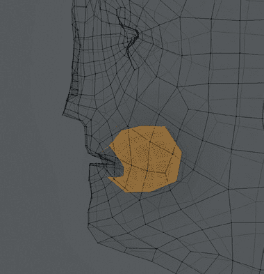图 7-9。 为嘴巴添加一个空腔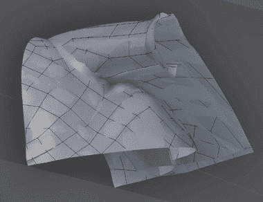图 7-10。 将 Blender 的视图限制为小范围（ALT-B）让你更容易处理狭小区域。再次按 ALT-B 可以恢复正常视图。

创建新的拓扑结构，将翅膀和身体的连接部位桥接起来，简单得多，只需继续在连接部位上进行重新拓扑（参见图 7-10），这展示了覆盖蝙蝠生物翅膀和肩膀的网格。这样做可以创建一个结合了翅膀和身体的单一网格（参见图 7-11）。

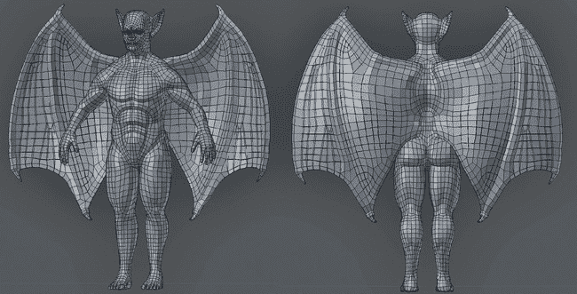图 7-11。重新拓扑后的身体网格，现在结合了翅膀和身体，并且有足够的细节来捕捉面部和肌肉的广泛特征。

## 重新拓扑蜘蛛机器人

我为蜘蛛机器人设定的目标是将粗糙的雕刻转变为光滑的硬表面模型。为了做到这一点，我需要用更密集的网格替换原始基础网格的简单拓扑，确保它与身体形状相匹配。此外，重新拓扑还让我可以在过程中进行装饰，将模型的部分区域变成空壳、添加孔洞或在重新拓扑的表面上增加附加细节。

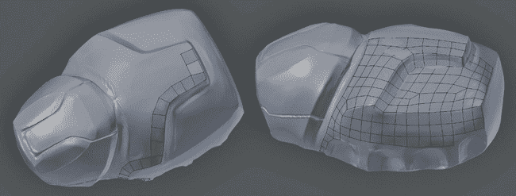图 7-12。重新拓扑身体。注意多边形如何沿着雕刻的边缘流动。稍后，我们将添加支撑环以精细化边缘，使其更加锐利和平滑。

从身体开始，我像之前一样添加了一个平面（SHIFT-A），并开启了吸附功能，将新几何体投影到雕刻表面上。接下来，我为平面添加了镜像修饰符，并开始沿着表面的大致线条进行操作（参见图 7-12）。最后一步是填充四边形，完成其余表面，同时尽量保持多边形的大小和分布均匀。为了平滑表面上的任何凹痕，你应该选择一个已经重新拓扑过的区域——避免选择边缘和角落——并使用平滑工具几次，均匀地分布几何体。

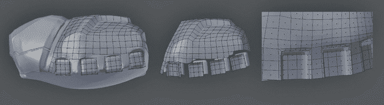图 7-13. 用新的、更干净的几何体替换雕刻的某些区域。在这里，立方体是手动放置的，并在与重拓扑几何体连接之前被细分了几次。

对于雕刻的某些部分，我希望用更精确的几何体替换自由手绘的粗糙形状。为此，我简单地添加了一个原始体，例如一个大致符合形状的立方体或圆柱体，并将其移到合适的位置。例如，在图 7-13 中，我添加了立方体来形成腿部的插槽，删除了它们的前面和底面，并通过细分它们来获得正确的形状，同时调整周围的几何体以使其适应。

为了进一步完善模型，我在其主要的硬边缘周围添加了支撑环（见图 7-14）。你可以使用诸如 Loop Cut（CTRL-R）、Subdivide（**W**▸**Subdivide**）和 Edge Slide（CTRL-E▸**Edge Slide**）等工具，或者使用**Inset Faces**操作符，它可以在所选面周围添加一个具有恒定厚度的边环。结合这些操作符，你可以在模型的关键硬边缘周围建立支撑环。

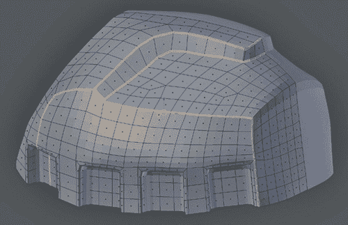图 7-14. 使用支撑环来收紧重拓扑雕刻的形状

你可以通过多种方式为重拓扑网格添加装饰。例如，图 7-15 中左侧的部分是通过在编辑模式下复制（SHIFT-D）重拓扑网格的一些面并将它们上移（关闭吸附）来创建一个新部分。接着，通过拉伸新部分增加厚度，并在边缘添加支撑环，我在模型表面创建了一个凸起区域。图 7-15 中头部的圆形元素是通过创建一个新的圆圈，使用 Blender 的吸附工具将圆圈投影到模型表面，然后关闭吸附并进行拉伸来创建一个凸起区域。为了将其顶部弄平，我通过将 3D 操作小部件的变换方向设置为法线，并使用 S▸Z▸Z▸0 按法线方向缩放中心部分，使其完美平整。

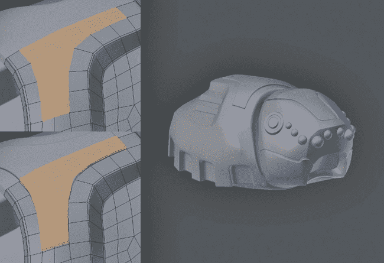图 7-15. 通过将重拓扑与常规建模技术结合来增加装饰

我对腹部（见图 7-16）和腿部（见图 7-17）也使用了相同的过程。在某些区域，我的雕刻存在一些突起或没有打磨光滑的地方，因此在完成重拓扑后，我需要稍微调整一些部分，以确保得到干净的边缘。

由于我只为不同的腿部件雕刻了几种变化，所以在重拓扑时非常容易。每个独特的部件只重拓扑了一次（如图 7-17）然后将其作为链接副本复制，创建需要的腿部副本。和身体一样，我也使用了镜像修改器将腿部件通过对称轴镜像。

### 复制物体组

因为在这个阶段我并不需要将腿部准确地复制到身体的另一侧，所以我将所有腿部件作为一个组添加到身体的左侧（在对象模式下按 CTRL-G），然后创建这个组的另一个实例（SHIFT-A▸添加▸组实例▸*组名*）。结果是一个不可编辑的、所有组内对象的重复实例。接着，我将这个组在*X*轴上缩放为-1，以将其翻转到身体的另一侧。稍后，我可以使用“将副本转换为真实”操作（CTRL-SHIFT-A）将该组转换为实际的几何体（仍然是原始对象的链接副本），但目前，这是一个方便的方式来预览整个模型，而不必创建不必要的对象（见图 7-18））。

## 重拓扑技巧

总结来说，以下是一些在重拓扑模型时需要遵循的通用技巧：

+   先建模重要的边缘循环，然后再填充其余部分。

+   使用支撑环或增加硬边来收紧边缘。

+   使用 Blender 的重拓扑工具为你的模型添加额外的装饰。

+   尝试保持均匀的多边形密度，除非你在某个特定区域需要添加更多细节。

+   注意你模型的轮廓。通常你会从正面看待你正在重拓扑的区域，所以一定要从不同角度查看，确保它是有效的。

+   尽可能使用更大的多边形。不要使用超过必要的数量！

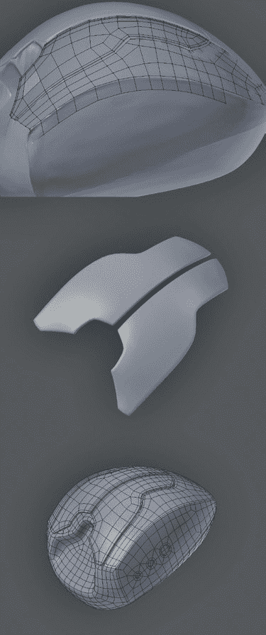图 7-16. 重拓扑腹部。中间的部分被从腹部的主要部分分离出来，以打破腹部的形状，使其看起来更有趣。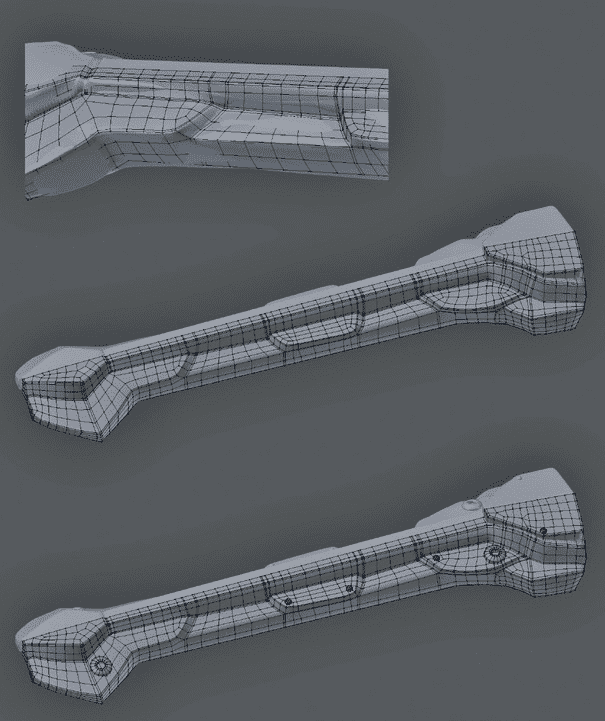图 7-17. 重拓扑腿部。对于一些区域，我不得不手动清理重拓扑后的网格，或者干脆从零开始建模新的区域，例如腿部的底部。我还手工放置了一些额外的装饰，如铆钉等。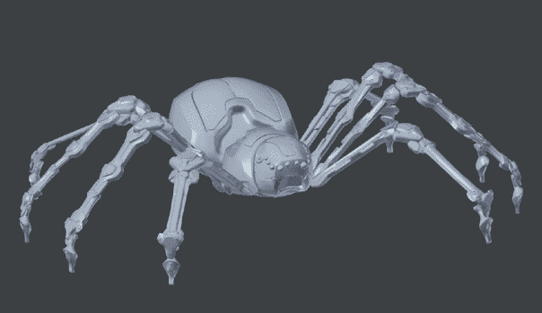图 7-18. 需要重拓扑的蜘蛛机器人组合元素，腿部已就位。腿部被镜像到身体的另一侧。

## 头部拓扑

头部是一个非常复杂的主题，因此值得在这里特别关注。虽然没有一种适用于所有头部的拓扑结构，但有一些重要的原则需要考虑。主要是，在进行头部重拓扑时，你应该集中精力围绕面部的关键特征，特别是嘴巴和眼睛，创建面部环，这样可以方便地将面部变形为熟悉的形状（参见图 7-19）。这些原则适用于你在重拓扑雕刻过的头部或从零开始建模的头部。

通过首先使用良好的拓扑构建面部的重要区域，接着再将头部的其他部分连接起来，会更容易。一般来说，我会从眼睛开始，然后从鼻子向下延伸到嘴巴。接着，我从脸颊、额头和耳朵开始向后工作。最后，我会处理头部的其余部分，直到脖部。通过首先从头部最重要和最复杂的部分向外构建，你将会在关键区域遇到更少的拓扑问题。

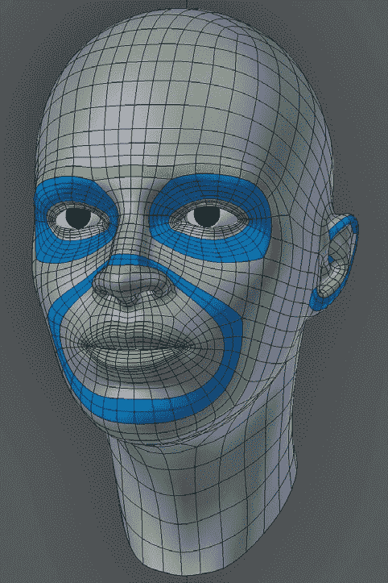图 7-19. 标注了主要面部环的头部

### 眼睛

在创建或重新拓扑一个头部时，几乎总是需要在眼睛周围有一圈干净的面部环形循环（参见图 7-20)。这些面部环形循环应从眼睑的轮廓向外延伸，涵盖眉毛、鼻梁的外部区域和颧骨的上表面。这一圈将使闭眼或抬眉或颧骨变得容易，它反映了面部的基本解剖结构：*眼轮匝肌*环绕眼睛的方式与这圈面部环形循环完全相同。

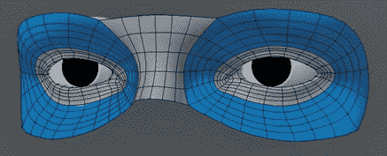图 7-20. 眼睛。为眼睛添加边缘循环使其更易于编辑、摆姿势和绑定。注意眼睛内角的泪管，那里上眼睑和下眼睑之间的间隙已被桥接。为了创建眼窝，围绕眼睑的最内层循环只是向后拉伸，然后可以选择填充闭合孔洞。

### 嘴巴

与眼睛类似，*口轮匝肌*环绕嘴巴，负责张开和闭合嘴巴（参见图 7-21)。为了便于产生嘴巴的常见动作，我们将以相同的方式在嘴巴周围创建一圈边缘循环。这一圈也将使定义嘴唇轮廓并轻松变形变得简单。

### 鼻部/鼻唇沟

鼻子的复杂特征包括鼻孔和鼻尖。通过在这些区域周围加入面部环形循环，其他部分的鼻子就变得相对容易定义。

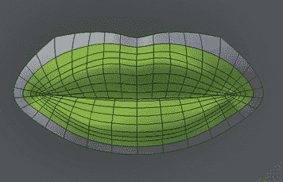图 7-21. 嘴部。注意嘴角处，唇部表面的边缘环线会聚集并沿着嘴内流动。尽量保持相同的边缘或面部环线围绕上下唇的轮廓流动。最简单的方法是从这个边缘环线开始，然后向内调整。

法令纹是鼻部的重要特征，在咆哮或年长的面部尤为明显。增加一条面部环线，沿鼻梁和嘴角两侧延伸，在下巴下方或下巴处连接，可以帮助我们定义这个区域（参见图 7-22，“图 7-22. 鼻部。这里，沿法令纹和鼻梁延伸的面部环线用蓝色突出显示，绕过鼻孔和鼻尖的面部环线用绿色突出显示。创建围绕鼻孔内部的面部环线也很有用。”）。鼻梁的形成方式是通过连接围绕两眼的环线来实现的。

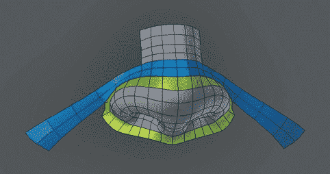图 7-22. 鼻部。这里，沿法令纹和鼻梁延伸的面部环线用蓝色突出显示，绕过鼻孔和鼻尖的面部环线用绿色突出显示。创建围绕鼻孔内部的面部环线也很有用。

### 耳朵

耳朵因人而异，但其整体结构相对恒定。由于耳朵主要由软骨组成，没有肌肉或关节，因此它是头部的一个相对静态特征，因此在需要时是隐藏尴尬三角形的好地方。通过用沿着耳垂延伸的边缘环定义耳廓和反耳廓（耳朵的外部和内部弯曲部分，在图 7-23 中分别用蓝色和绿色表示），我们可以轻松定义耳朵的整体结构。耳朵的另一个主要特征是耳道。此外，在构建耳朵时，有时尝试用单一的边缘环围绕耳朵，这样可以更容易地将耳朵连接到头部。实现这一点的一种方法是最初将耳朵构建为一个单独的网格，然后在外部创建一个环状边缘，在放置耳朵并将其与头部连接之前。

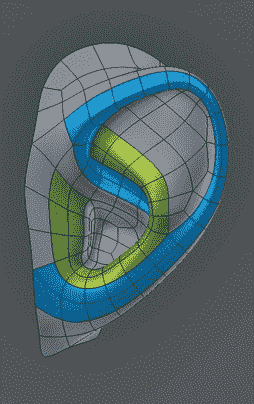图 7-23. 耳朵

## 回顾

本章中，你学会了如何重新拓扑具有任意拓扑的网格，无论是高多边形雕刻还是由多个独立原始体构成的集合，创建平滑、清洁且容易细分的拓扑。我们讨论了如何使用 Blender 的吸附工具重新拓扑网格，以及其他替代方法，如 Bsurfaces 插件和 Shrinkwrap 修饰符。然后我们使用这些工具对在早期章节中创建的网格进行重新拓扑，得到新的、更好的拓扑结构。

在第八章中，我们将展开这个新拓扑，为其提供纹理坐标，然后在第十章和第十一章中为我们的最终模型烘焙和绘制纹理。本章对模型所做的改进将使这个过程更容易，并且在我们进入第十四章时，也会提高渲染效率。
