## 第八章 UV 展开

在本章中，我们将对目前为止创建的模型进行 UV 展开（如果需要的话）。*UV 展开*描述了为模型的面创建一组二维坐标的过程，随后我们可以用它来为模型应用纹理。创建 UV 坐标类似于沿着称为*缝隙*的线条切开模型表面，并将其展开成平面（见 图 8-1）。如您所知，Blender 中的网格由连接在一起的顶点构成，这些顶点形成了边和面。模型中的每个顶点都有自己在三维视口中的空间坐标：*x*、*y* 和 *z*。这些坐标决定了顶点在三维空间中的位置。类似地，UV 坐标是为模型的点创建的另一组二维坐标，可以让您将二维图像映射到网格的表面上。

## 其他类型的纹理坐标

UV 坐标只是将图像映射到 Blender 中对象的一种方式。Blender 还拥有多种程序化坐标，您可以通过对网格应用某种投影来分配纹理。这些坐标的优点是自动生成，适用于广泛的应用，但它们缺乏 UV 展开所具有的精确度，后者可以让您精确指定网格上的哪些点与图像的哪些部分对应。

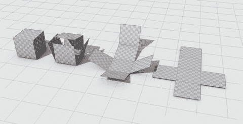图 8-1. UV 展开类似于将 3D 物体展开成 2D 平面。这样，您的网格就会拥有一组二维坐标，然后可以用来将二维图像映射到您的对象上。

## 编辑 UV 坐标

要编辑 UV 坐标，我们使用 Blender 的 UV 图像编辑器和 3D 视口。通常，在处理 UV 坐标时，切换到 Blender 的 UV 编辑布局会很有帮助，您可以通过在信息编辑器头部的下拉菜单中进行切换（见 图 8-2）。这样就会弹出左侧的 UV 图像编辑器和右侧的 3D 视口。

通过右键单击它们之间的边界并选择“拆分区域”，在 UV 图像编辑器和 3D 视图之间添加一个属性编辑器是很有帮助的。设置新的区域为属性编辑器后，您可以访问对象数据标签，用于在不同的 UV 坐标集之间切换，以及渲染标签，用于访问纹理烘焙控制。

### UV 网格

我们将在图像编辑器中使用 UV 网格来确定纹理或图像的哪部分应用到网格的某一部分。该网格的坐标范围从 0 到 1，原点位于左下角。默认情况下，这些坐标会乘以您选择的图像的大小，从而给出一个以像素为单位的数值。如果您没有选择图像，Blender 会假设网格的宽度为 256 像素，并提供基于此比例的坐标。您可以通过按 **N** 来调出 UV 图像编辑器的属性区域，并在显示面板中勾选 **标准化**，此时将返回 0 到 1 之间的 UV 坐标。UV 图像编辑器遵循与 3D 视图相同的规则：您可以使用与 3D 视图相同的快捷键移动、旋转和缩放任何选定的顶点，并且可以使用 **X** 和 **Y** 键将操作限制在 UV 网格的水平和垂直轴上。默认情况下，网格不会有任何 UV 坐标，因此在展开之前没有任何可以选择的内容。

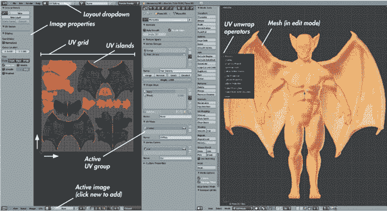图 8-2. 稍作修改的 UV 图像编辑器布局。您可以通过在新 .blend 文件中设置窗口布局并从文件菜单选择“保存用户设置”来将其保存为默认布局。

当你使用 UV 坐标将图像映射到网格时，图像会按比例缩放以填充 UV 网格，然后网格的每个点都会映射到图像中相应的点。超出 UV 网格边缘的图像会被重复或扩展，以便超出网格的 UV 坐标也能映射到图像的某部分。这允许你通过展开网格，使其比 UV 网格大得多，从而在网格表面重复一个*可平铺纹理*（可以无缝地横向和纵向重复的纹理）。反之，你也可以展开整个网格（甚至多个网格），使所有 UV 坐标都适合于 UV 网格内，然后使用一个单一的（非平铺）图像来唯一地为物体表面上的每一部分添加纹理。两种选项在图 8-3 中展示。

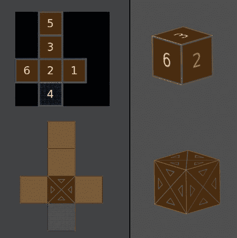图 8-3。UV 解包的两种选项。上图：将物体的所有面片打包到 UV 网格中，以独特地为每个部分创建纹理。下图：将图像平铺到物体的表面。

在创建具有较为重复或均匀纹理的物体时，比如砖墙或土壤，可拼接纹理能为你节省很多时间。另一方面，在创建角色和其他独特物体时，你需要将物体的 UV 坐标打包到单一网格中，以便为每个部分制作不同的纹理。

### 解包工具

要开始解包模型，你需要进入编辑模式（如果还未进入，按 TAB 键切换）。你可能还需要切换到 3D 视图窗口的边缘选择模式，因为标记 UV 接缝时，直接选择边缘最为便捷。要开始解包你的物体，按下 **U** 键，这将弹出若干解包操作选项，如 图 8-2 所示。这些操作选项如下：

****解包****。这可能是最实用的 UV 解包方法。Blender 会尝试通过将你的网格“拉伸”并将其展平，仿佛它是由可拉伸的布料制成的，同时尽量减少这种拉伸不可避免地带来的扭曲。（为了让此过程适用于封闭网格，你需要在网格上标记一些 UV 接缝。）

****智能 UV 投影****。该方法将首先从一个角度自动投影网格中尽可能大的部分，排除不可见的面或者背离该视角的面。然后它会依次投影更小、更复杂的部分，并将它们分割到不同的 UV 区域。这种效果对于简单网格通常效果不错，但对于更复杂的形状，常常会产生大量的小区域，操作起来比较困难。

****光照贴图包****。这一特殊的 UV 解包选项用于将光照烘焙到纹理上，将网格中的每个单独多边形投影到一个独立的矩形 UV 区域。光照贴图包选项非常高效地使用了 UV 坐标空间，这使得它在为游戏引擎烘焙光照纹理时非常有用，但对于实际的纹理制作并不是很实用。

****跟随活动四边形****。此选项会跟随活动四边形（即在面选择模式下选中多个面时高亮显示的四边形——通常是最后选中的那个），并均匀地展开从其辐射出去的面。此选项特别适用于具有网格状拓扑的网格（即没有极点的网格），例如管道、圆柱、平面（近似平面）网格等。它在你先将一个四边形展开为完美矩形（90 度角）时效果最佳：1）使用 **U**▸**展开**展开；2）在 UV 图像编辑器中选择展开后的每个边，并将其缩放至完全水平/垂直；3）使用 CTRL-L 选择连接到当前选择的其他网格部分，展开其余网格；4）使用 **跟随活动四边形** 展开操作符进行均匀展开。然而，此选项不适用于具有更复杂拓扑的网格。

****立方体投影****。此选项将网格的面投影到一个立方体的表面上。它适用于大致呈立方体形状的物体。

****圆柱投影****。此选项与立方体投影类似，但将网格视为圆柱形状。

****球形投影****。此选项也类似于立方体投影，但将网格视为球形。

****视图投影****。此选项将网格按照其在 3D 视口中的外观进行投影。它特别适用于在将网格固定后，先投影网格的一小部分平面，再使用展开操作符投影其余部分。

****视图投影（边界）****。此选项与视图投影类似，但在投影网格后，会拉伸 UV 坐标以填满整个 UV 坐标空间。

****重置****。此选项将每个面拉伸到整个 UV 坐标空间。

### 接缝

想象一下试图将一个沙滩球展平。即使你将它放气，你也无法将它展平，使得每个表面部分都平铺在地面上，除非至少做出一次切割，切割得越多，展平时所需的拉伸和变形就越少。当使用展开操作符展开网格时，也有类似的情况。为了使操作符能够工作，你需要标记网格分割的*接缝*。理想情况下，你应该尽量减少接缝的数量，这样在进行纹理绘制时就不需要跨越太多的接缝，但你也需要标记足够的接缝，以避免网格在 UV 展开时产生扭曲。在这种情况下，扭曲是由于 Blender 必须拉伸和变形几何体，以便将其展平成平面。当你使用这些扭曲的 UV 来将图像映射到 3D 物体时，纹理也会显得被拉伸。

要标记 UV 接缝，进入编辑模式并选择边缘，然后使用 CTRL-E▸**标记接缝**将边缘标记为 UV 接缝。要快速选择两条边之间的最短路径（这是选择长串边缘进行标记的好方法），选择一条边，然后按住 CTRL 并右键点击你想作为终点的边缘。你也可以按住 ALT 并右键点击一次性选择整个边环，这样就可以同时标记多个边缘。像这样的快捷键会使得一次性标记多个边缘变得更快捷。

一般来说，你应该尽量将 UV 接缝隐藏在那些不会造成问题的地方，并且能够最小化展开时的拉伸。网格中的山谷和褶皱是隐藏接缝的好地方，还有一些不会太引人注意的区域。尽量对称地标记接缝，这样有助于理解你的展开，并允许你在后期对纹理进行复制和粘贴（如果你的展开也是对称的）。最后，将你的网格拆分成合理的岛屿（由接缝围起来的面组）。例如，在蝙蝠生物的例子中，我将躯干、翅膀、头部、手臂和腿部、手和脚拆分成独立的部分，就像在图 8-4 中看到的那样。

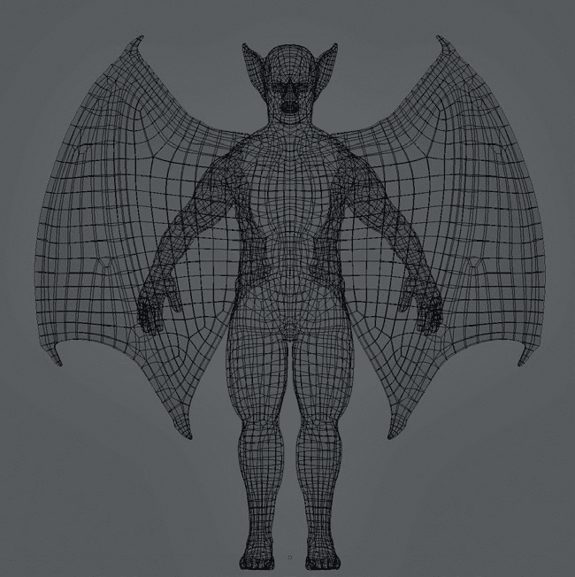图 8-4. 这里显示的是蝙蝠生物的 UV 接缝，采用线框视图展示。虽然一些接缝（不可避免地）出现在可见区域，比如翼外缘周围，大多数则隐藏在不太显眼的地方，比如腿部内侧、耳朵和脖部背面。像这样隐藏接缝可以让你在后期处理纹理接缝时更加轻松。

### 钉住顶点

使用展开操作符展开网格可能不会给你完全想要的展开结果；例如，某个区域可能会被压缩或比例不对。为了解决这个问题，你可以在 UV 图像编辑器中固定顶点，这样在重新展开网格时它们就不会移动（在 UV 编辑器中快捷键为 **E**，在 3D 视口中为 **U**）。通过选择一个或多个顶点并按 **P** 锁定它们。（固定的顶点会以红色突出显示。）现在当你重新展开时，Blender 会保持固定的顶点不动，并拉伸其余的展开部分来适应这个变化。要取消固定顶点，选择它们并按 ALT-P。

使用固定点的一个重要原因是为了建立对称的展开。为此，首先展开网格，然后选择一串沿网格中间的顶点，并在 UV 图像编辑器中将它们排列成一条直线（沿适当的方向）。一种简单的方法是将它们在 *x* 轴或 *y* 轴上缩放到零，然后按 **P** 锁定它们。现在，在 UV 编辑器中按 **E** 重新展开。这样可以得到更对称的展开，如图 8-5 所示。

固定点还可以用于修复大型网格上相互重叠的区域，特别是在处理长而管状的网格时，UV 展开可能会不必要地盘绕。要解决这个问题，可以在网格的两端各固定一个顶点，使这些顶点在 UV 空间中分得更远，然后重新展开网格。

最后，当你展开一个有很多不同部件的网格时，完成一个 UV 岛的展开后，可以将其固定，以便在展开其他部件时不打扰到已经完成的部分。Blender 默认情况下会重新展开你在 UV 图像编辑器中可见的所有内容，因此这是保持已经完成的展开部分安全的一种好方法。

### 打包

在展开角色和其他独特对象时，将所有 UV 岛打包到一个单一的网格中通常是很有帮助的。要自动执行此操作，可以使用打包操作符（CTRL-P），但通常通过像拼图一样移动、缩放和旋转 UV 岛，你可以做得更高效。为了加快选择整个岛屿的速度，可以通过顶部工具栏的按钮切换到 UV 图像编辑器中的岛屿选择模式。

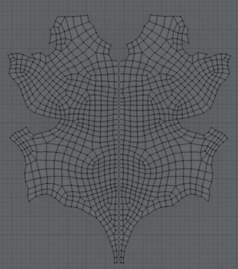图 8-5。为了让蝙蝠生物的躯干获得对称的展开，我进行了正常展开，然后将胸部中心的顶点固定成垂直线并再次展开。结果是一个对称的 UV 岛，后续更容易进行纹理绘制。

在打包 UV 岛时，确保保持岛屿的比例相似。要平均你所选的任何 UV 岛的比例，可以使用 CTRL-A 或手动调整岛屿的比例。不过，若你已经分配了 UV 测试网格，则更容易看到岛屿的比例是否正确（参见测试你的 UV 坐标）。

### 分配 UV 纹理

在模型上显示纹理有很多方法。首先，你可以使用 Blender GLSL 材质来创建具有纹理选项的高级材质，这些选项能够响应光照和透明度。不过，对于一些更简单的应用，比如预览如何将单张图片映射到展开的物体上，你可以在 UV 图像编辑器中将该图片分配给模型。为此，请按照以下步骤操作：

1.  选择对象并进入**编辑模式**。

1.  选择所有面并展开它们，如果你还没有这样做的话。

1.  从 UV 图像编辑器头部的图像下拉菜单中选择你要分配给网格的图像。或者，你可以通过**图像**▸**打开图像**来打开一张图像，或通过**图像**▸**新建图像**来创建一张图像。

1.  要在 3D 视口中查看你的图片，请转到属性区域的显示面板，并启用**纹理实心**。

### 测试你的 UV 坐标

为了确保你的 UV 展开效果良好，并且区域没有变形过度，应用一个 UV 测试网格，以查看展开对网格的影响（参见图 8-6）。为此，请按照以下步骤操作：

1.  在 UV 图像编辑器中，确保对象处于编辑模式，点击**图像**▸**新建图像**，将新图像应用到你的网格，并勾选**UV 测试网格**选项。这将生成一个测试网格图案并将其分配到你的网格的 UV 坐标上。

1.  在 3D 视口的属性区域的显示选项中启用**纹理实心**。你应该会看到棋盘格样式的纹理应用到你的网格上。

现在你应该能够轻松地看到展开中的问题区域，比如有拉伸不自然的地方或网格部分过大或过小的地方。你可以在 UV 图像编辑器中修复这些区域，并在 3D 视图窗口中实时看到变化。

## 展开蝙蝠生物

正如你在前面的讨论中看到的，我展开了蝙蝠生物并将其打包到一个单独的 UV 方块中，首先标记接缝，然后使用展开操作符展开（见图 8-7）。对于躯干，我通过选择一条位于躯干正面中间的顶点线，在 UV 图像编辑器中将其沿 *x* 轴缩放为零 (**S**▸**X**▸**0**)，然后固定这些顶点，再次进行展开 (**E**)，使得展开结果更加对称。接下来，我对所有岛屿的比例进行了平均，将它们打包到 UV 网格中，并稍微放大了头部，以相对于其他区域提供更多的纹理空间（因为头部是身体最容易引起注意的部分）。最后，我将指甲和牙齿展开到相同的布局中，将它们适当地填充到其他岛屿之间的空隙里。

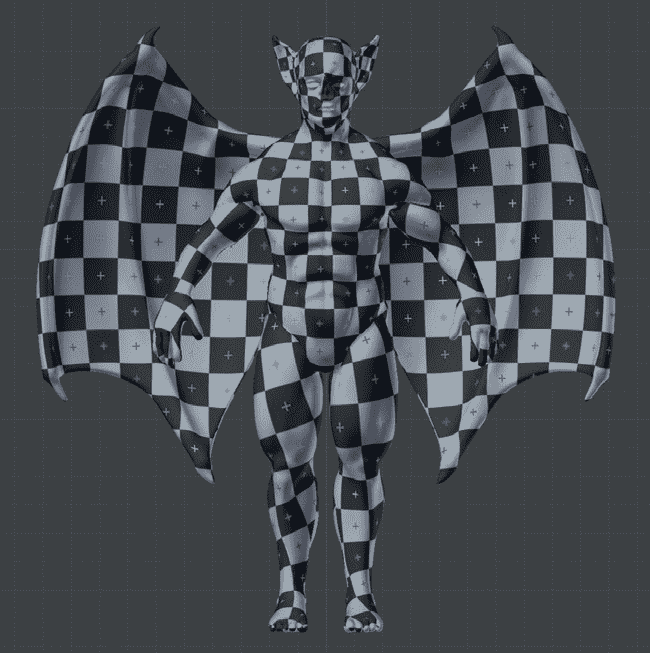图 8-6. 使用 UV 测试网格图像检查你的 UV 展开情况。这个网格将帮助你识别未展开良好的区域，以及那些与其他展开部分不成比例的区域。

对于眼睛，我只展开了内部网格，方法是将 3D 视图窗口对准眼睛正面，并使用“从视图投影（边界）”操作符。稍后，我会调整眼睛网格的 UV，以适应我将为其绘制的纹理。有关眼睛展开和纹理绘制的更多内容，请参见第十一章。

## 展开丛林神庙

丛林神庙有许多独立的元素，而不是逐一讲解所有部分，我将只讲解最困难的部分。（丛林神庙中没有在下面讨论的物体，简单地使用了之前讨论的技术进行展开。）

### 石块

在丛林神庙中有大量的石块，所以我不想为每个石块单独添加纹理。相反，我希望能够相对快速地展开它们，并为每个石块重用相同的纹理。我快速且粗糙的解决方案是在编辑模式下使用“选择尖锐边缘”操作符，选择石块的尖锐边缘（在 3D 视口头部选择▸尖锐边缘），然后将其标记为接缝（见图 8-8）接着，我使用展开操作符一次性展开所有石块。我手动去除了一些区域的接缝，比如破损的石块和一些块的边缘，在这些地方我希望纹理能环绕而不是留下明显的接缝。我只在场景前景中的块上手动放置接缝，并且手动展开这些块，确保它们展开得很好。

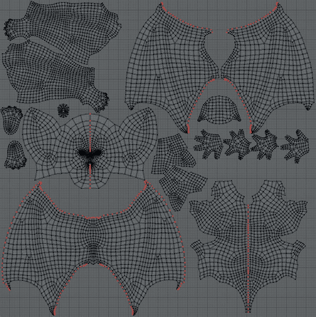图 8-7. 蝙蝠生物的最终 UV 布局

### 树木

对于树木，我在它们的背面（朝向相机的那一侧）和树干与根部的连接处添加了接缝。然后，我使用展开操作符展开了它们。接着，我在 UV 图像编辑器中选择了一串顶点，沿着根部或树干的中间位置排列，并将其固定。再次展开后，我得到了对齐良好的 UV 岛。

上述技术在展开类似树皮这样的纹理时非常有用，因为树皮纹理具有强烈的纹理方向性或颗粒感，因此所有部分都会与纹理的纹理方向对齐。我将两棵树都放入了同一个 UV 空间（见图 8-9），这样之后我就可以同时给它们纹理了。

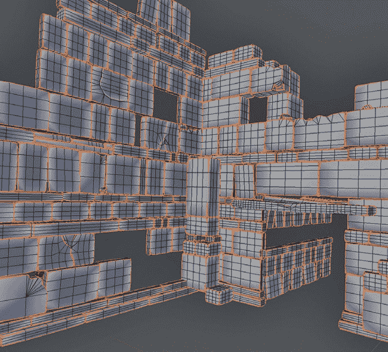图 8-8. 在丛林神庙场景中自动放置石块的接缝。我使用“选择锐边”选择了石块的边缘，然后将其标记为接缝并展开它们。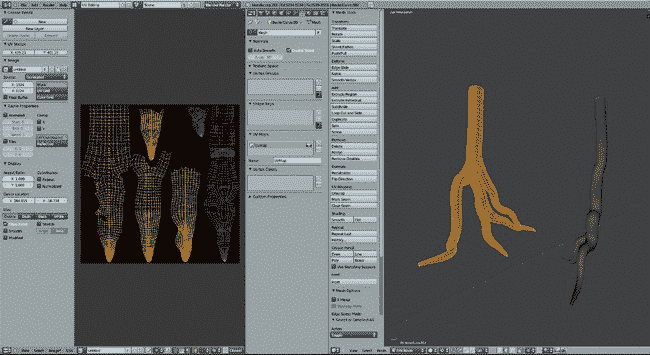图 8-9. 树木对象的 UV。活动对象显示为可编辑的 UV 岛，而其他选中的（但不是活动的）对象在 UV 图像编辑器中呈灰色。

### 多个 UV 映射

你可以为一个对象添加多个 UV 坐标集并独立编辑它们。这对于在复杂材质中使用多个纹理以及纹理绘制时非常有用。在纹理绘制时，你可以使用一个 UV 集合将 UV 岛整齐地打包以用于最终的纹理，并使用另一个 UV 集合为无缝纹理或照片指定克隆纹理信息。在后续章节中，我有时会提到为这些目的创建额外的 UV 集合。

对于树木，我创建了第二个 UV 坐标集，以配合可平铺的树皮纹理，同时将第一个 UV 集合保存用于烘焙环境光遮蔽和最终的纹理贴图。为了创建这个第二个 UV 集合，我打开了属性编辑器的对象数据选项卡，并点击 UV 映射面板中的 + 图标来创建一个新的 UV 集合。你可以从这个面板中选择现有的 UV 集合并编辑任何一个处于活动状态的集合。为了展开我的树木的第二个 UV 集合，我使用了“跟随活动四边形”操作符，这适用于具有大致圆柱形拓扑的树木部分，并将它们展开并打包，使它们填充 UV 网格的宽度（见图 8-10）。之后，这将允许我在树干和根部的长度上多次平铺纹理，而不会在纹理不匹配的地方创建太多接缝。

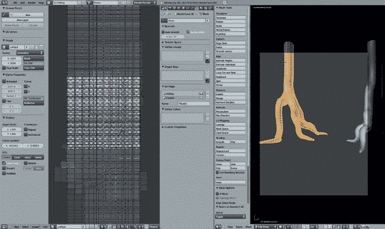图 8-10。在树木的第二组 UV 集中，我使用 Follow Active Quads 展开了 UV 岛屿，然后缩放以填充 UV 网格的宽度。稍后，这将用于沿树木及其根部的长度对齐可平铺纹理。

### 物体之间共享 UV 空间

就像你通常会希望将单个物体的所有 UV 岛屿合并到 UV 网格中一样，在展开多个物体以进行纹理绘制时，你可能希望它们都共享相同的 UV 空间，这样它们就可以使用相同的纹理。这样做将节省你在绘制纹理时的时间，并在渲染时节省内存。要同时查看多个物体在 UV 图像编辑器中的 UV 坐标，选择物体后进入你想编辑的物体的编辑模式。在 UV 图像编辑器中，打开**视图**▸**绘制其他物体**。现在，所选物体的 UV 坐标将以灰色显示（尽管只有当前物体可以编辑），这样你就可以将多个物体对齐到同一个 UV 网格中（参见图 8-11）。

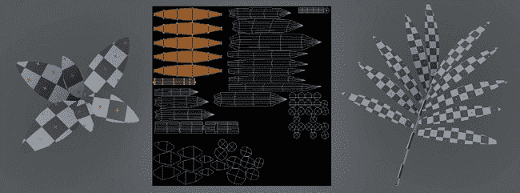图 8-11。各种叶片物体的 UV 坐标。大多数被展开以共享相同的 UV 坐标。

### 叶片与草

带有开放边缘的平面网格特别容易展开，因为你不需要标记任何缝隙。我简单地对场景中的所有叶片使用了 Unwrap，将它们都展开为共享相同的 UV 空间（参见图 8-11）。这不包括 IvyGen 叶片，它们已经通过 IvyGen 插件自动展开了。对于圆柱形元素，比如草的茎部，我根据需要标记缝隙，展开一个面（确保它展开为矩形），然后选择其余的网格（CTRL-L），并使用 Follow Active Quads 进行展开。

### 雕像

对于雕像网格，我手动标记了所有主要部分的缝隙，并使用 Unwrap 操作展开。图 8-12 展示了结果。你可以尝试使用智能展开，可能会得到适合这种网格的结果，但手动展开总是能提供更多的控制。

### 其他元素

丛林寺庙场景中的其他元素都很直接，采用了迄今为止使用的相同策略。一些元素，比如水体，不需要 UV 纹理，因为它们将完全使用程序材质。（第九章将讨论创建不需要纹理的程序材质，如水和玻璃。）

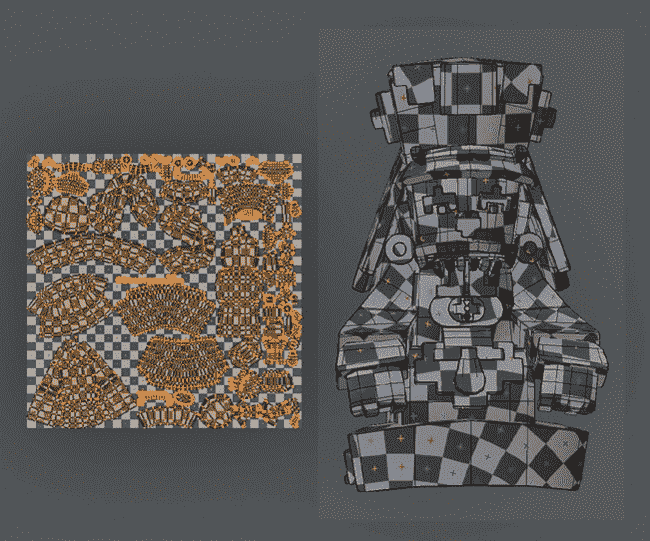图 8-12。雕像的 UV，展开并打包到 UV 网格中

## 展开蜘蛛机器人 UV

对于蜘蛛机器人，我尽力将整个模型的 UV 展开压缩到一个单一的纹理中（见图 8-13"))，排除了那些只使用程序材质的少数部分。由于模型中大部分使用了相似的材质，因此一次编辑整个纹理变得很容易。通过从较大的元素开始，比如身体和腿部，然后将较小的部分挤压到它们之间的空隙中，我能够产生一组非常高效打包的 UV，确保重要元素获得所需的纹理空间。你可以随时使用 UV 网格纹理检查不同部分是否以正确的比例展开且没有拉伸（见图 8-13"))。

### 应用修改器和副本

在之前的章节中，我使用修改器对蜘蛛机器人（Spider Bot）的身体和腿部进行建模和对称性重新拓扑。通过这样做，我减少了所需的工作量，并复制了一些腿部的部件。虽然我本可以保持腿部部件为副本，但在这个阶段应用一些修改器会更好，特别是镜像修改器，因为否则纹理会对称地映射到物体的两侧。这将导致物体中间出现明显的对称性；更糟糕的是，如果我在纹理中使用任何文字或图形，它们会反向出现在网格的镜像一侧！因此，我对蜘蛛机器人许多组成部分应用了镜像修改器。

不幸的是，Blender 不允许对共享网格数据的对象应用修改器。这使得在使用链接复制（如蜘蛛机器人中的腿部）将模型的一些部分复制时，应用修改器变得困难，因为这些部分现在有多个对象共享相同的网格数据。为了解决这个问题，可以使用曲线/元/表面/文本操作符（ALT-C），这将对对象应用修改器并将其转换为正确的几何体。因为你只需要应用镜像修改器，而不是细分曲面修改器，首先去除除了镜像修改器以外的所有修改器，然后使用该操作符。接下来，你需要去除其他重复体上的镜像修改器，因为它们现在会使用已经镜像过的网格数据。

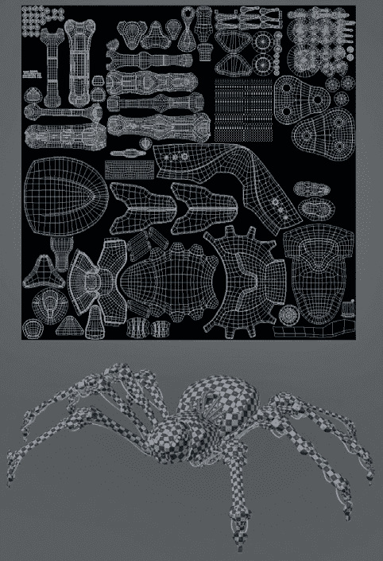图 8-13。在蜘蛛机器人 UV 的情况下，大部分的展开是使用 Unwrap 完成的。展开后，我将所有 UV 坐标打包，使模型占据相同的空间。（每个重复部分只需展开一次。例如，腿部的各个部分不需要分别展开，只要它们的重复部分使用相同的网格数据即可。）

### 高效共享 UV 空间

对于某些区域，我共享了类似部分的 UV 空间（见 图 8-14）。例如，对于腿部下方的机械元素，我将所有 UV 岛放置在 UV 网格的右上角区域。这样做会在烘焙纹理时出现错误，但通过在这些区域涂抹一个通用的纹理，我可以在不占用太多 UV 空间的情况下为多个模型部分添加纹理。（由于这些部分相对隐蔽，因此这些区域缺乏独特的纹理不会造成太大影响。）

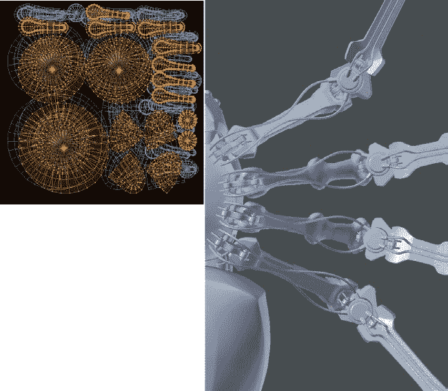图 8-14。蜘蛛机器人的一些机械元素被展开，分享了 UV 网格的同一部分。腿部下方的小型机械关节（右）被展开到 UV 网格的小角落（左）。

确保所有物体根据其大小分配大致相同的 UV 空间，对于多个物体来说，这更为困难，因为“平均岛屿缩放”操作符（CTRL-A）仅适用于网格内的 UV 岛屿。然而，通过使用 UV 网格纹理并在 3D 视口中启用“纹理实心”显示，你可以判断物体 UV 坐标的缩放，并相应地进行调整。

## 在回顾中

这部分内容结束了我在前几章中创建模型的展开操作。我们已经了解了如何标记接缝来展开网格，如何优化 Blender 展开结果。我们还学习了如何将网格的 UV 坐标打包在一起，这样就可以用一张图像为多个物体添加纹理。在第九章中，我们将继续为我们的项目添加粒子系统，以创建毛发和草地，然后在第十章和第十一章中进行纹理烘焙和绘制，并在第十二章中创建材质。在这些后续章节中，我们将把图像应用到我们在本章创建的 UV 坐标上，以便进行烘焙和绘制纹理，最终作为材质的输入。
