## 第九章. 头发与粒子系统

Blender 的粒子系统是一个强大的工具，可以用来创建静态和动态的头发及动画粒子效果。它们还可以用来在场景中填充实例化的物体，从而创建草地和其他植物。在本章中，我们将使用 Blender 的头发粒子为蝙蝠生物创建毛发，并为丛林神庙场景创建草地。

当你将粒子系统添加到物体上时，系统最初设置为动态粒子系统，它会生成点状粒子，并通过 Blender 的物理引擎进行模拟。不过，在本章中，我们主要使用粒子的“头发”类型来创建从网格表面发射的发丝（默认为此类型，参见图 9-1）。这些发丝将响应物理影响，并可以在模型表面上梳理，还可以通过程序化方法修改，呈现出头发、毛发、草或其他多种材质的效果。你将学会如何从图 9-1 中展示的默认系统开始，逐步创建真实的头发和毛发，接着在第十二章中为其添加材质，然后在第十四章中进行渲染。

## 头发粒子

为了让 Blender 的基本粒子系统呈现出毛发或头发效果，我们需要给它一些引导。首先，我们要确定毛发的生长位置和方式，然后我们可以梳理生成的头发，以更好地控制它的外观。但我们不会对模型上的成千上万根头发进行逐一梳理，而是先手动定义一些作为父粒子的头发，然后让 Blender 自动通过子粒子填充其余部分。这些步骤在图 9-2 中有所展示：首先，添加粒子系统 1；接着，使用顶点组限制头发生长的区域 2；然后，梳理头发 3；最后，添加子粒子 4。最终，你将得到一个基础渲染效果 5。

### 选择添加头发的物体

在为模型创建头发或毛发时，需要思考的一个问题是，你希望将粒子系统赋予哪个网格，因为这一点可以通过多种方式来处理。最简单的选择是将粒子系统直接添加到你已建模并打算后续纹理化和渲染的网格上。然而，这意味着你将无法再编辑网格（至少无法编辑顶点顺序），因为对模型顶点顺序的修改会破坏头发的效果。

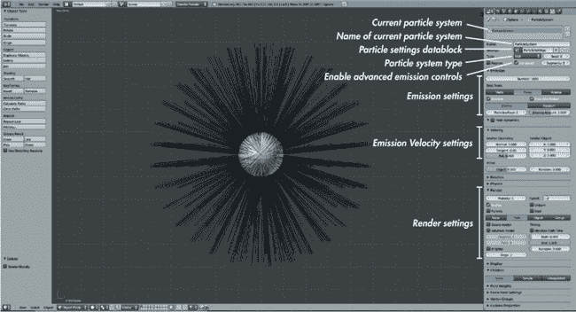图 9-1. Blender 中的标准粒子系统，粒子系统类型设置为头发！不同阶段的头发粒子系统图 9-2. 不同阶段的头发粒子系统

对于蝙蝠生物，最终渲染将使用通过对模型应用某些 Multires 细分而创建的网格，并将其余部分通过位移贴图重新创建。因为这需要创建一个新的网格，我可以选择在该阶段创建头发，或者使用不同的网格创建头发系统，并将其保存在.*blend*文件中以便最终渲染时使用。后者的选项让我可以在一个“安全”的网格上工作，然后继续为毛发进行工作——如果稍后对“皮肤”模型进行进一步修改（在合理范围内），这个网格不会改变。我将仅使用这个网格来容纳角色的头发，并且其表面不会被渲染。

#### 创建头皮

在为角色设计发型时，类似的策略也很有用。虽然我们可能希望对头部模型进行各种修改，但头骨的形状很可能保持相对静态。因此，为了保持头发与模型的分离，通常有用的方法是创建一个“头皮”对象，将头发添加到该对象上，这可以通过复制头部网格并删除不需要的部分来实现（参见图 9-3）。然后，头发的粒子系统可以添加到这个对象中。

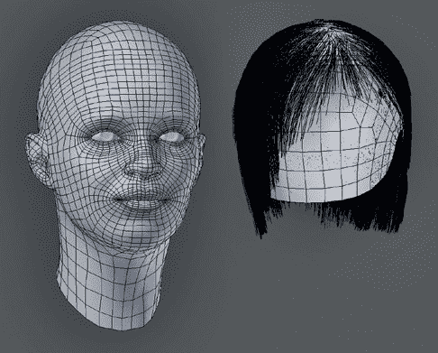图 9-3. 创建头皮以容纳角色头发的粒子系统。这使得你可以继续修改头部模型，而不会影响头发。在这里，二者并排显示，但通常它们会重叠在一起。

对于蝙蝠生物，我通过复制我的雕刻高分辨率网格并应用 Multires 修改器在 1 级上，创建了一个新的网格来容纳粒子系统。对于具有形状键的网格，可以使用“转换为网格”操作符（ALT-C▸**从曲线/元件/文本生成网格**）。这将所有修改器和形状键应用到网格上。

### 头发的顶点组

默认情况下，粒子系统从物体表面的各个地方发射粒子。为了将头发限制在模型的特定区域并控制头发的长度和行为，我们使用顶点组。*顶点组*是网格中顶点的子集，像角色的腿部或墙壁的特定部分。你可以在编辑模式或权重绘制模式下将顶点分配给这些组。

顶点也可以部分分配给一个组，且该组的权重（即它们属于该组的程度）可以设置为 0 到 1 之间的任何值。这允许在分配和未分配到组的顶点之间进行平滑渐变和混合。

一旦创建，顶点组可以用于控制修改器的效果，便于在编辑模式下快速选择顶点，并影响粒子系统。通过使用顶点组，我们可以在权重绘制模式下“绘制”头发的位置，然后将顶点组分配给粒子设置，告诉 Blender 只在我们想要的位置创建粒子。

### 权重绘制

Blender 提供了两种编辑顶点组的方法。第一种是在编辑模式下手动为一个组分配权重，使用属性编辑器中的对象数据标签的按钮和 3D 视图区域中的工具（按**N**可以调出）。这种方法适用于定义更精确的组，比如我们在第四章和第六章中使用的，用来限制位移修改器的效果。

但如果你的目标是生成更平滑、更不精确的组，并且有更多的变化和随机性，Blender 的权重绘制模式工具（如图 9-4 所示）会是更好的选择。进入权重绘制模式（CTRL-TAB，或者使用 3D 视图头部的模式下拉菜单）可以使用画笔绘制顶点权重。

权重绘制模式中的标准画笔工具如下：

****混合****。用画笔指定的权重替换当前的权重。这是绘制顶点组的标准画笔。

****模糊****。模糊相邻顶点之间的权重，适用于平滑过渡。

****添加****。增加顶点的权重。

****减法****。从顶点的权重中减去一个值。这个画笔作为橡皮擦非常有用。

****乘法****。将顶点当前的权重乘以一个特定的值。将权重设置为 0 可以作为橡皮擦使用；使用更高的值可以减少顶点的权重，而不完全从当前组中移除顶点。

****加亮****。如果新权重大于当前顶点的权重，则将顶点的当前权重替换为你指定的权重。

****加深****。如果新权重较小，它将用您指定的权重替换顶点当前的权重。

Blender 的默认画笔效果很好，因此您可能不需要自己制作画笔，尽管您可以按照第六章中描述的方法来制作。

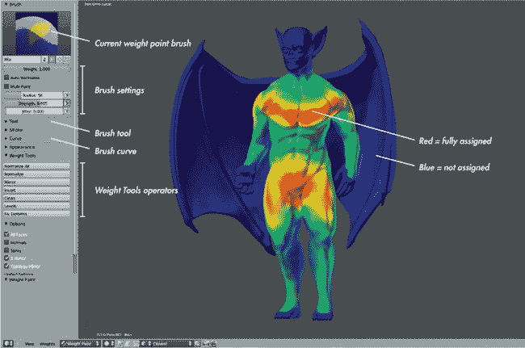 图 9-4。权重绘制模式。红色区域表示完全分配给当前组的顶点，蓝色区域表示未分配给当前组的顶点。

#### 毛发密度

为了控制蝙蝠生物毛发的生长位置，我需要绘制一个顶点组，定义我希望毛发生长的位置以及不希望毛发生长的位置。我首先添加了一个新的顶点组，命名为*毛发密度*。然后在权重绘制模式下（CTRL-TAB），我开始使用混合类型画笔为我希望有毛发的区域分配到该组。使用减去画笔可以去除一些区域，并且可以使用模糊画笔平滑毛发区域和无毛发区域之间的过渡。（因为我现在只编辑毛发密度，所以顶点组的边界仍然会有长毛发。为了让毛发区域渐变成较短的毛发，我稍后会创建一个第二个顶点组来控制毛发长度。）

图 9-4 显示了我的毛发密度组：上半身和大腿上部的区域完全分配给该组，像手臂和小腿这样的区域部分分配，而像翅膀和面部这些不希望有毛发的区域则没有分配。

要完全从顶点组中移除网格的一部分，您可以在权重绘制模式下使用减去画笔，但在编辑模式下做得更精确。为此，使用属性编辑器的对象数据选项卡来编辑顶点组，并通过在编辑模式中选择顶点，按“分配”或“移除”按钮来手动添加或删除顶点。例如，在蝙蝠生物的情况下，我手动选择了翅膀，并将其从密度（和长度）顶点组中移除，以确保翅膀不会长毛。

#### 毛发长度

头发长度顶点组（见图 9-5）通过定义我们粒子系统所创建的头发的生长长度，控制头发的长度，相对于我们在粒子系统设置中选择的最大长度。这个组类似于头发密度组，不同之处在于我给胸部和骨盆分配了比其他区域更多的权重，从而使它们拥有最长的头发，并且我在不同区域之间显著模糊了权重，产生了头发长度的平滑过渡。

在绘制长度组时，你可以在头发密度组的边界外进行绘制，而不用担心，因为头发不会在密度组之外生长。这允许你，例如，在密度组的边缘生长长发，如果你愿意的话。

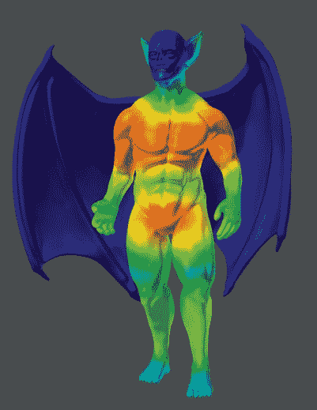图 9-5. 头发长度顶点组

## 添加粒子系统

在添加了基本的头发顶点组之后，我接下来创建了一个粒子系统来“生长”头发。为此，我进入了属性编辑器的粒子选项卡，通过右侧的+图标添加了一个新的粒子系统。（你可以在同一物体上添加多个粒子系统，并通过粒子选项卡顶部的选择器在它们之间切换。）

添加新的粒子系统会弹出一大堆面板，就像在图 9-1 中显示的那样。我开始修改其中的一些。首先，我将粒子系统类型从动态粒子发射器改为头发系统，通过将类型设置更改为“Hair”。这一更改最初导致网格看起来像个疯狂的毛球。为了将头发粒子系统变得有用，我使用了我为头发长度和密度创建的顶点组来限制头发的生长。然后，我为粒子分配了设置，梳理并修剪了头发，使其看起来符合我的要求。为了让这些阶段更容易理解，我将首先讨论在创建头发类型粒子系统时，粒子系统的主要面板。它们按顺序在“属性编辑器”的“粒子”选项卡中讨论。

### 粒子系统属性

在属性编辑器的粒子选项卡顶部，你会看到一个面板，显示分配给活动物体的现有粒子系统。下面是一些基本选项，用于定义你正在创建的粒子系统类型：

****类型（头发/发射器）****。将此设置为*Hair*以创建头发和毛发。发射器类型用于创建动态的点粒子。

****高级****。打开此选项以获得对粒子发射的更大控制。

****细分****。这决定了每根发丝使用多少个控制点，以便控制发型的形状。更多的控制点意味着你可以在项目中加入更多的扭曲和弯曲。对于短发和毛发，默认值 5 就足够了，但对于更长的发型，可以考虑将该值调高。

### 发射面板

此面板控制从你的网格中发射的粒子数量及其分布。

****数量****。决定粒子系统将生成的粒子数量。如果在设置中使用了子粒子，那么粒子的总数量将是此设置乘以子粒子的数量。在设置头发粒子系统时请记住这一点，因为对于相同的最终粒子数，你可以创建很多父粒子和较少的子粒子，或者较少的父粒子和更多的子粒子。一般来说，你希望尽量编辑较少的发丝，同时控制头发在网格表面上的外观。所以在给简单的头部添加头发时，Blender 的默认值 1,000 可能会稍高，但对于更大的区域（例如覆盖整个生物的毛发）时，你可能需要增加这个值。对于蝙蝠生物，我选择了 2,000 这个值。

****从（顶点/面/体积）发射****。决定头发粒子从何处发射，比如从网格的顶点发射、散布在其面上，或从封闭网格的体积内部发射。

****随机****。随机发射粒子，忽略你创建网格面的顺序。对于头发，将其保持为*随机*。

****均匀分布****。根据面部的面积，调整每个面发射的粒子数量。勾选此选项，否则较大的面在与较小面相比时，会显得头发分布稀疏。

****抖动/随机、每面粒子数和抖动量****。这些设置控制粒子发射位置的生成方式。默认值通常效果很好。

### 速度面板

速度面板中的设置基本上决定了头发的长度和方向。这里最重要的是随机值和法线值。*法线*值使头发从表面笔直地指向外面，而*随机*值则使头发朝随机方向指向。将这两者结合起来，可以使头发大致从头部指向外侧，使用法线值控制，同时保持一定的粗糙感，使用随机值。此面板中的其他设置可以在你希望头发指向特定方向时很有用（例如，使用*Z*值让头发直立）。

### 旋转

在使用发束粒子头发时，旋转面板并不是特别重要，但如果你将粒子系统的渲染类型设置为“对象”或“组”，你可以使用此处的设置为生成的对象添加随机旋转。此功能是防止使用对象渲染类型的粒子系统看起来过于重复的好方法，使得重复的对象更难被识别出来。

### 渲染

此面板包含了粒子在最终图像中如何渲染的设置。以下列出的设置将在第十二章中与应用于粒子的材质进行交互。

****材质****。此设置决定头发粒子将使用哪个材质槽（在属性编辑器的材质标签中）。例如，如果你为模型的第一个材质槽设置了皮肤材质，你可以将其设置为 2，并使用第二个槽来定义头发材质。

****发射器****。选中此设置时，头发及其发射网格都会被渲染；未选中时，仅渲染头发本身。如果你使用的发射器不是你的“皮肤”对象，或者你正在使用粒子系统生成对象并只想渲染这些实例化的对象时，此设置非常有用。

****父物体****。如果你使用子粒子，此设置将导致父粒子与子粒子一起渲染。

****无/路径/对象/组****。此设置决定粒子系统将使用哪种可渲染的几何体来生成粒子。默认的*路径*设置用于创建粒子头发，但粒子系统也可以用来创建其他类型的几何体。将其设置为*对象*会将每个头发粒子转化为所选对象的副本，而将其设置为*组*则会从一个组中选择对象并以相同的方式复制它们。这些选项适用于制作草地或在表面上增加细节，如石头或碎片。*无*选项将导致粒子不被渲染。

对于头发，选择“路径”选项，该选项会弹出以下附加设置，决定粒子头发如何渲染：

****发束渲染****。此方法使用 Blender 的自定义发束原语渲染头发和毛发，从而产生更快的渲染结果。此渲染方法的缺点是它与光线追踪阴影不兼容，因此你需要使用带有缓冲阴影的聚光灯来代替。

****自适应渲染器****。这个渲染头发的选项兼容光线追踪，并优化头发的几何形状，简化头发的弯曲部分，使得长的直发部分比复杂的弯曲部分使用更少的几何体积。这可以将头发所用的几何体积降到最小，从而加速渲染。

****度数****。发丝渲染器按直线段顺序渲染头发，这个值决定了基础曲线必须弯曲多少度才能生成一个新段。较小的值会生成更平滑的头发，但渲染时间较长，因为它们会生成更多的段。

****B 样条曲线****。这种方法使用类似 Bézier 曲线的方式来渲染发丝，能够生成更平滑的曲线，但在平滑处理过程中会丧失一些发型细节。

****步骤****。该方法决定了为头发曲线生成的总段数，表示为头发被细分的次数。例如，值为 3 会使头发比 2 时平滑两倍（即段数增加两倍），而值为 4 会使头发曲线再平滑两倍。

### 显示

这个面板的功能类似于渲染面板，但定义了粒子在 3D 视口中的显示方式。调低这些设置通常可以加快 3D 视口的响应速度，特别是在处理复杂粒子系统时，而调高这些设置可以让你更好地预览渲染后的粒子效果。

****无/渲染/路径****。这些选项允许你确定粒子在 3D 视口中的显示方式。将此设置为*渲染*将使用渲染时的显示类型。*无*会阻止粒子系统在 3D 视口中显示，*路径*则会将粒子作为路径显示，无论渲染类型如何。

****显示（百分比）****。这个选项设置在 3D 视口中可见的头发总数的比例。较低的设置可以减少在处理复杂发型系统时对计算机的压力。

****大小、速度、数量****。这些选项会在每个粒子旁边显示相应的数据（即粒子的大小、速度或 ID 号）。

****颜色（材质/速度/加速度/无）****。这个选项更适用于发射器粒子系统。对于头发粒子，保持设置为*材质*。

****步骤****。这个选项决定了在 3D 视口中绘制头发时使用多少细分（如同渲染选项中的细分）。如果你需要处理复杂的发型，请将此值设置得更高；如果你需要更灵敏的 3D 视口，请将此值设置得较低。

### 子粒子

在这里，我们进入粒子系统的最强大部分。子粒子通过将粒子系统创建的每个原始父粒子视为进一步创建粒子的指南来工作。这不仅让你可以定义相对较少的粒子并生成更多的粒子，还允许你为父粒子周围的头发增加新的特性，如团聚、扭曲甚至编织，使头发看起来更加多样化和有趣。

****无/简单/插值****。简单粒子是一种基本选项，在每个原始父母周围创建一束基本的子粒子，它们都遵循与父母相同的路径。简单子粒子没有附着在网格表面上，并且不使用顶点组输入来影响它们的生成方式。除非在基本头发系统中，简单子粒子通常不如插值子粒子看起来好。因为插值子粒子就像父母头发一样从网格表面生成，然后它们根据周围的不同父母粒子插值自己的路径。插值子粒子通常能提供更好的效果，因此在本章中我们假设使用插值子粒子。

****显示****。决定在 3D 视口中创建和显示多少子粒子。

****渲染****。确定在渲染时要创建多少子粒子。

****种子****。让你选择用于生成子粒子的随机种子。如果你不喜欢一些子粒子，可以尝试更改这个值。

****虚拟父母****。在生成子粒子之前创建额外的虚拟父母粒子，这为子粒子提供更多的目标，使其能够聚集或绕着父母粒子弯曲，从而使头发看起来更加多样化。

****簇集****。使子头发围绕父母粒子聚集在一起，造成头发看起来是打结或尖刺状的。负值会导致头发向末端膨胀。*形状*值决定了头发开始聚集的距离。

****长度****。决定子粒子的生长长度与父母粒子长度的比例。低于该设置的阈值允许一些粒子达到完整的长度，而其他粒子则被剪短到长度设置中指定的较短值。

****发缝控制****。这些选项只有在虚拟父母设置为 0 时才会出现。增加发缝（帽子）量会强制子粒子在插值不同方向的父母粒子之间时选择一边。正如你可能想象的那样，这对于分发头发非常有用（尽管我们稍后会看到还有其他方法）。*最小*和*最大*值决定了子粒子在父母头发之间分缝时的角度或距离范围。

****粗糙度****。你可以将三种粗糙度应用到子头发上。*均匀粗糙度*设置根据位置粗化头发，影响局部区域内的所有头发。*大小*值决定这些扰动的尺度。*末端粗糙度*设置会随机化头发的末端，将它们推得更远（类似于簇集设置的反向效果）。*随机粗糙度*设置独立地使头发变粗，*大小*值决定扰动的尺度，*阈值*值决定有多少比例的头发不受此粗糙化影响。（随机粗糙度适用于增加杂乱的头发或让头发看起来蓬乱。）

****扭曲（无扭曲/卷曲/放射状/波浪/编织）****。这些选项（如图 9-6 所示）为子毛发的行为添加了二级图案。*卷曲*使毛发形成卷曲，*放射状*使毛发周期性地靠近和远离，*波浪*为毛发添加波浪效果，*编织*则使它们形成三股辫子。以下的设置决定了这一二级图案的振幅和频率，以及它如何受到团簇影响并通过*形状*值沿毛发分布。*平整度*值使毛发在呈现这些二级形态时变得更加扁平。

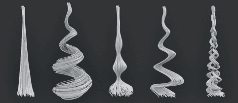图 9-6. 对单个父粒子的子粒子应用不同的扭曲设置。由左至右：无扭曲（但开启了团簇，因此发丝汇聚成一点）、卷曲、放射状、波浪和编织。

### 顶点组

在此面板中，您可以分配各种顶点组，以控制网格表面上的设置。这个面板是我们应用之前创建的顶点组的位置，用以控制我们初始父毛发的密度和长度，在梳理和剪裁之前（参见图 9-7））。

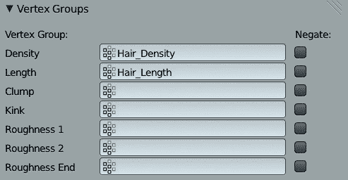图 9-7. 使用顶点组控制毛发的长度和密度。您可以稍后为其他属性添加顶点组，但现在只需要这些。

使用顶点组控制粒子系统会影响父粒子最初的生成和子粒子后续的分布。然而，一旦您开始在粒子模式下编辑父粒子，您就可以添加或移除粒子，并通过粒子模式刷子独立编辑它们，这些操作与顶点组定义的属性无关，具体内容将在下一节中讨论。

### 粒子模式

在设置好基本的毛发系统后，您可以在粒子模式下编辑它（参见图 9-8），使用多种工具来生长、梳理、剪裁和平滑您的毛发或皮毛，此外还可以添加或删除毛发。

你可以从 3D 视图头部的模式下拉菜单中切换到粒子模式。一旦进入粒子模式，当前选中的粒子系统中的毛发粒子就变得可编辑。（同时，你将无法再在属性编辑器中编辑粒子发射设置，除非你点击粒子设置标签顶部的 Free Edit 按钮，以废弃你编辑的粒子并重新开始。）与雕刻模式类似，粒子模式会在 3D 视图的左侧工具架上列出一组刷子，并提供一些选项来控制这些刷子如何影响你的粒子。

### 塑造你的毛发

在粒子模式下，我开始使用 Blender 的粒子刷为蝙蝠生物塑造和修饰毛发。我首先使用了梳理工具将毛发压平，并使其沿着身体的轮廓流动（见图 9-8），同时添加了一些峰值和凌乱的区域。默认情况下，当你在粒子模式下梳理毛发时，它会受到发射器网格的影响，从而使毛发容易沿网格的表面梳理。（如果需要，你可以通过工具架上的*Deflect Emitter*选项关闭这一功能。）如果某个区域的毛发变得过于平坦，可以使用 Puff 工具将其蓬松起来。（Puff 工具使毛发相互排斥，通常会使毛发分散开来。）

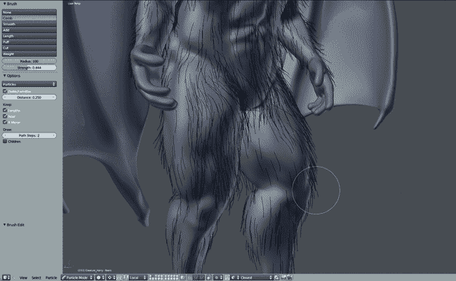图 9-8. 在粒子模式下梳理毛发

要控制毛发的长度，Length 和 Cut 工具是最有用的。Length 工具允许你拉长或缩短毛发以调整其长度，而 Cut 工具则能在你刷动时将毛发从刷子中剪掉。Cut 工具还可以完全剪掉毛发，直到根部，因此这是去除那些让子粒表现异常的尴尬毛发的一个有用技巧。（如果很难看到毛发的根部，可以尝试切换到线框视图并放大。）

你还可以使用 Add 刷子添加额外的毛发，它会在你刷动的地方生成新的毛发。打开*Interpolate*选项（通常建议使用）会让新毛发跟随周围已有毛发的方向，这在你为已经梳理过的区域添加额外毛发时特别有用。例如，在制作蝙蝠生物时，我在耳朵和脚趾、手指周围添加了一些额外的毛发，以更好地定义这些区域的毛发流向。

### 样式建议

在修饰毛发时，务必经常旋转模型，从不同的角度查看它。当你旋转时，要考虑你正在雕刻的轮廓以及毛发的方向，并使用 Cut 工具修剪那些破坏轮廓的杂毛。如果你剪得太短了，可以使用 Length 刷子重新拉长毛发。

你可以像在编辑模式中一样选择和操作单根或多根毛发，使用右键点击来选择，然后按**G**、**S**和**R**键来抓取、旋转和缩放发丝。你还可以在粒子模式中切换不同的选择方法，可以选择整根毛发，或选择沿着毛发的单个点，或者仅仅选择梳理和剪切整体路径。这类似于在编辑模式中可以选择顶点、边缘或面一样。选择毛发发丝对于处理棘手区域非常有用，因为刷子工具只会对选中的发丝进行操作，允许你选中出现问题的特定粒子毛发，并在单独的区域内梳理或剪切它们。

另一个有用的小技巧是按**L**来选择光标下的毛发。按住**L**并将鼠标移动到一个区域，可以随机选择几根毛发。然后，你可以独立地整理这些毛发。这对于打乱发型和增加发量效果非常有效。

### 子粒子

一旦基本的发型大致确定，启用**子粒子**选项，在粒子面板中查看它对发型外观的影响。将子粒子类型设置为**插值**，并将**显示**的粒子数量设置为大约**50**。（渲染数量可以设置得更高，但要记住，这会影响到总的毛发数量，从而影响渲染时间。）

对于蝙蝠生物，我将虚拟父母设置为 0.3，团簇设置为 0.5，并且添加了非常小的随机、端点和均匀粗糙度（每个大约为 0.001 到 0.01，因为这些是敏感设置）。增加虚拟父母可以让子粒子有更多的父发丝来团簇，从而防止毛发看起来过于零散。添加一些粗糙度可以让毛发看起来不那么整洁光滑。

我还通过将长度设置为 0.5 并将阈值设置为 0.15，增加了粒子长度的变化，从而产生不同长度的毛发，给毛发增添了更自然的外观（见图 9-9）。

### 注意

*返回粒子模式将默认隐藏子粒子，但你可以通过在 3D 视图工具架中的绘制选项勾选子粒子选项来开启它们。*

在处理头发系统时，偶尔进行渲染是很有用的，因为在 3D 视口中的头发阴影看起来可能很平坦且模糊不清。你可能想跳到第十二章，了解有关头发材质的讨论，然后创建一个快速渲染设置，以便在你处理头发时使用（参见图 9-10)。参见第十三章了解如何照亮场景，并参见第十四章了解更多关于渲染的内容。

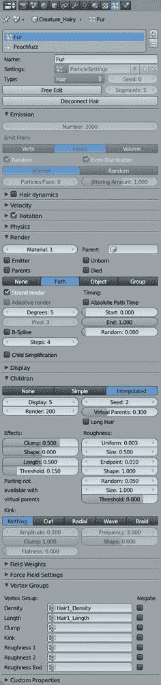图 9-9. 蝙蝠生物的粒子设置图 9-10. 蝙蝠生物的毛发。虽然 3D 视口能够较好地估计头发的表现，但渲染结果能真正显示出需要注意的区域。在这里，我将角色的皮肤设置为黑色，以便单独查看头发，并用简单的三点光源进行了渲染。（详见第十二章了解如何设置材质和第十三章了解照明。）

### 桃毛

我还决定为我的蝙蝠生物添加第二个粒子系统，以增加一些短发，覆盖更多的身体部位，例如头部、耳朵和一些翅膀。我是按照与第一个粒子系统完全相同的方式制作的。我从为与第一个粒子系统相同的物体添加另一个新的粒子系统开始，这次粒子的长度要短得多。然后，我创建了一个顶点组，将这些头发限制在身体、头部和翅膀的开始部分。这次我不需要长度顶点组，因为这些头发都非常短。接下来，我将头发梳理成跟随身体轮廓的样子，并添加了子粒子以增加头发的密度。最终的粒子系统可以在图 9-11 中看到。

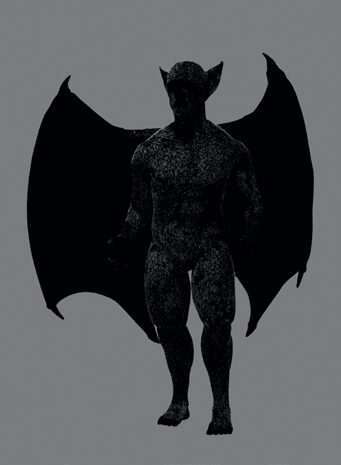图 9-11. 蝙蝠生物的“桃毛”粒子系统为其大部分身体覆盖上了细小的毛发。

## 复杂发型

蝙蝠生物的头发相对简单，所以我们来看一个发型更复杂的角色。图 9-12 中的角色使用了几种不同的粒子系统，每种系统覆盖了整体发型的不同区域。每个系统通过独立的顶点组限制在其自身的区域内，从而可以单独编辑。

以这种方式创建头发，可以更轻松地迭代不同的发型，并创造出更复杂的发型，因为你可以单独编辑各个方面，而不必担心它们对其他部分的影响。

图 9-13 展示了一个充分利用这一策略的角色，使用了多个粒子头发系统，每个系统都有不同的设置。例如，胡须中的辫子是使用“辫子扭曲”设置的单根父级发丝，而其他系统则使用不同的扭曲设置。这种技术在创建带有分发的发型时特别有用，因为将头发分成两个粒子系统可以使从分发两侧向外梳理变得更容易。

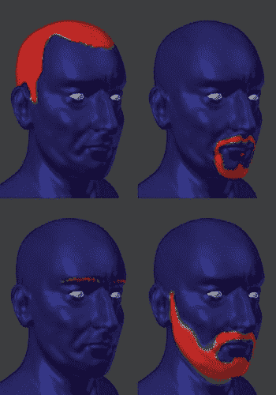图 9-12. 使用不同的粒子系统，并为每个系统设置独特的密度顶点组，可以更好地控制每个部分的外观。在这里，我为头发、山羊胡、眉毛和胡茬分别创建了独立的顶点组。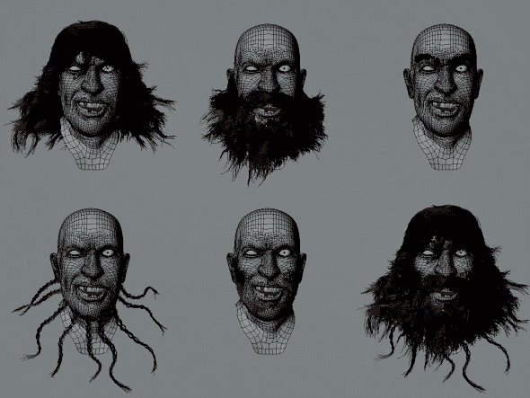图 9-13. 多个粒子头发系统结合在一起，创建出完整的效果。在这里，使用了五个不同的头发系统，最终的发型位于右下角。每个系统都可以单独梳理并调整设置，从而提供更多的控制。

## 使用纹理控制粒子

虽然到目前为止我们一直集中在使用顶点组控制粒子头发属性，Blender 也可以使用纹理输入来控制粒子系统的各个方面，方式与我们使用顶点相同。要以这种方式使用纹理，首先将粒子系统分配给网格，切换到属性编辑器的纹理标签，点击**粒子纹理**图标（见图 9-14）。现在，你可以添加纹理，并将其用于与顶点组相同的输入，包括头发粒子的密度和长度，以及毛发的团簇、扭曲和粗糙值。（诸如时间和速度等值用于动态点粒子系统。）默认情况下，白色将映射为 1.0，黑色映射为 0.0。

使用纹理控制粒子系统可以让你使用 Blender 的程序纹理，为头发或毛发系统的外观增加变化。例如，通过使用云纹理来影响蝙蝠生物毛发的粗糙值，我可以迅速为生物的毛发添加一些随机的粗糙度，而无需手动编辑顶点组。

### 注意

*纹理也可以通过 Blender 的材质影响粒子的外观，正如你将在第十二章中学习的那样。*

## 粒子系统的其他用途

除了建模头发和毛发，Blender 的粒子系统还可用于许多其他任务。例如，对于丛林神庙，我使用粒子系统在地面上创建了一些草地，使用 Group 渲染类型将几种不同的草地物体复制多次。

### 丛林神庙的草地

虽然我手动放置了大多数植物在丛林神庙场景中，但我使用了粒子系统来生成场景周围的一些草地。虽然单独的头发丝在适当的材质下看起来非常像草，但我选择为每根草叶创建模型。然后，我使用粒子系统将它们散布在场景中，如图 9-15 所示。

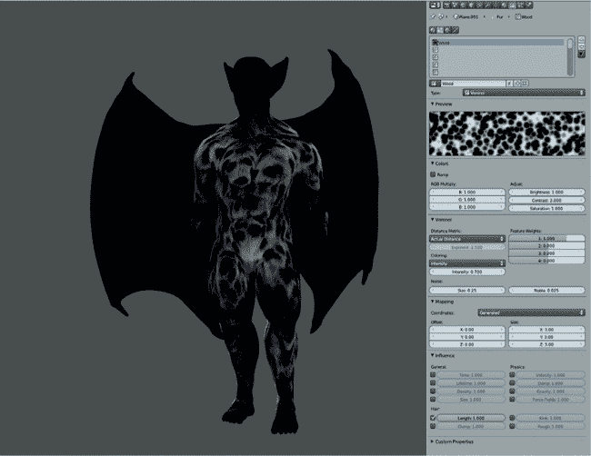图 9-14. 使用纹理控制毛发粒子。在这里，使用了一个程序化的 Voronoi 纹理来影响粒子的长度。你可以使用程序化纹理和图像纹理来影响粒子的属性。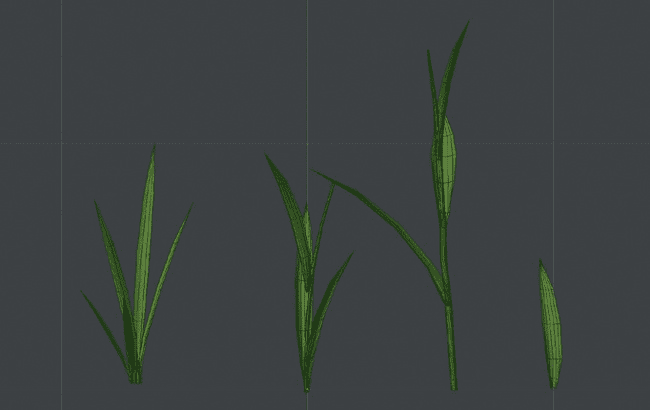图 9-15. 简单的草模型。这些只是一些被细分、拉伸，并通过比例编辑抓取的平面和圆柱体，形成草的茎和叶。每个模型都是一个独立的物体，原点位于植物的根部。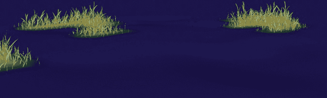图 9-16. 我草粒子系统的密度顶点组，这里显示的是在指定区域上生长的草

#### 创建草粒子系统

为了以这种方式创建草地，我需要一些不同草叶或草丛的模型，然后创建一个粒子系统（添加到我的地面网格中），该系统会在场景中复制并散布这些模型。首先，我创建了一些不同的草模型（参见图 9-15），并将它们都加入到一个组中（CTRL-G）。接着，我向丛林神庙中的地面网格添加了一个新的粒子系统，并为草的密度和长度创建了一个顶点组（就像我为头发做的那样），以便将草放置在几个关键区域（参见图 9-16）。然后，我将粒子系统的渲染类型设置为“组”，并选择了我的草地组作为要使用的组（即 Dupli Group 设置）。最后，我启用了“使用计数”选项，以决定如何复制组中的每个成员，这样较小的草模型会比较大的草模型更频繁地重复（参见图 9-17）。

为了让草地的副本具有一些随机旋转，我使用了旋转属性（参见图 9-17）。通过将旋转轴设置为法线，并将旋转轴的随机值设置为 0.15，旋转相位设置为 1.0，每个草元素都获得了一些随机旋转，使其看起来更加独特（参见图 9-18）。类似的变化可以通过粒子系统物理属性中的随机大小设置来实现（参见图 9-17）。

#### 对象旋转与粒子系统

需要注意的是，为了使草地粒子系统正常工作，草地网格需要被旋转，使草茎沿着 Blender 的*y*轴指向。这是因为，尽管 Blender 的全球坐标系中，*z*轴被视为“向上”方向，但对于粒子系统来说，物体的*y*轴沿着草茎的长度方向指向。

正确旋转草地物体的最简单方法是，在对象模式下选择它们（假设你最初是将它们模型化为指向场景中所有其他对象的上方），按**R**▸**X**旋转物体绕全球*X*轴，并输入**-90**度来指定旋转角度。这样应该能使草地指向场景的*y*轴。按 CTRL-A 并选择**旋转**，将这个旋转应用到物体的几何体上。

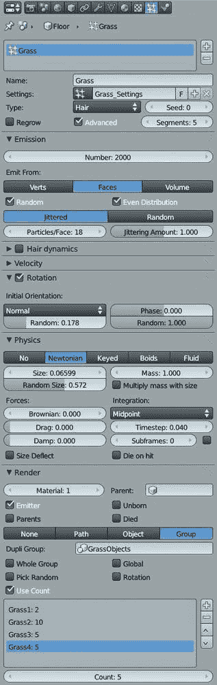 图 9-17. 草地系统的粒子设置。为了给重复的草叶提供不同的方向和大小，我使用了旋转设置以及大小和随机大小选项。我还使用了使用计数选项来使某些物体比其他物体更频繁地重复。 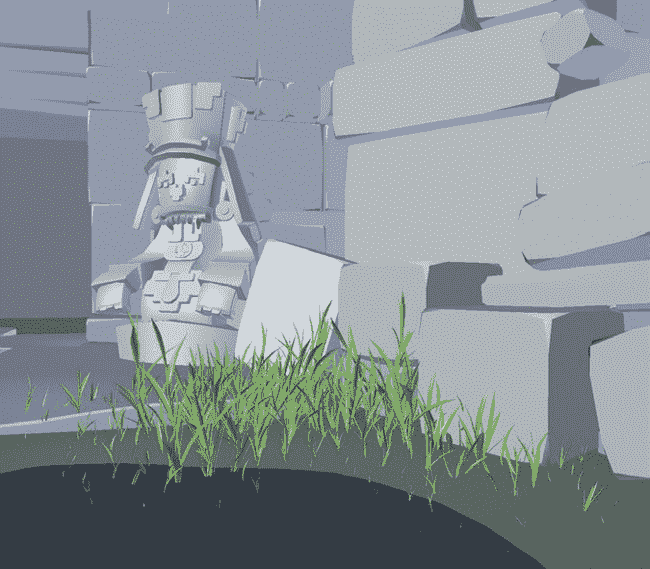 图 9-18. 最终丛林庙宇场景中的草地粒子系统

## 头发和毛发提示

这里有一些关于使用头发粒子系统的最终提示。

****将复杂任务拆分开来。**** 对于复杂的发型设计，将头发分成不同的部分，每个部分可以单独梳理和剪裁。使用不同的设置来获得所需的效果。

****注意粒子数量。**** 例如，人类头发的密度大约为每平方厘米几百根头发，但你不一定需要达到这个值。在渲染头发时，尝试调整子粒子的数量，看看哪个效果最好。

****实验。**** 头发效果很难做到完美。有时候，唯一的办法就是尝试不同的设置，看看哪个效果最好。快速渲染头发效果通常能提供有价值的反馈。

****材质很重要。**** 第十二章介绍了一些专门为粒子头发设计的材质。如果你为毛发效果苦恼不已，可能不是粒子系统的问题。确保在头发系统上使用一个好的材质，帮助它展现出最佳效果。

## 回顾

在本章中，我们探讨了如何创建粒子毛发和毛皮系统，并发现了 Blender 粒子毛发的其他用途，例如像我们为草地所做的那样进行程序化物体散布。在后续章节中，我们将再次讨论毛发和毛皮，介绍如何选择材料以创建漂亮的毛发（参见第十二章），如何为毛发粒子提供适当的光照（参见第十三章），以及如何在渲染毛发时通过将其作为单独的渲染层来获得最佳效果（参见第十四章）。
