## 第十章. 纹理烘焙

在对我们的模型进行建模、雕刻、重拓扑和 UV 展开后，我们现在准备为它们创建纹理和材质，然后继续进行灯光和渲染。在本章中，我们将重点讨论纹理烘焙——利用场景中的几何体、灯光和材质来创建程序化纹理。例如，我们将把高细分雕刻网格的法线烘焙成一个纹理贴图，或者将网格表面裂缝和凹槽中收到的阴影烘焙成一个纹理，以模拟污垢和灰尘。像这样的纹理随后可以用于辅助纹理绘制和材质创建。

在本章中，我们将讨论 Blender 能够烘焙的各种类型的程序化纹理贴图，它们的用途以及如何烘焙它们。在第十一章中，我们将继续将这些烘焙的纹理与手绘和 Blender 以及 GIMP 中的其他技术相结合，进行清理并与其他纹理源（如照片）合并。接着，在第十二章中，我们将讲解如何将这些不同类型的贴图与 Blender 的材质系统结合，以创建真实的材质用于渲染我们的模型。

## 图像和纹理

首先，一些术语：*图像*和*纹理*这两个术语经常互换使用。在大多数情况下，这没有问题，但我将在这里尽量避免混淆，并解释我的术语。对于我们的目的来说，*图像*是指一张图片，可能是一个图像文件，比如*.jpg*或*.tiff*文件，或者是通过 Blender 的 UV 图像编辑器生成的文件，但尚未分配特定的文件类型。

在 Blender 中，*纹理*可以是任何影响物体上材质外观的输入。纹理可以是图像，但也可以是程序生成的，或来自视频、点云数据，甚至是更为特殊的内容。但因为我们经常使用图像作为纹理的输入，所以通常方便将“用于影响材质漫反射颜色的图像”简称为*漫反射纹理*。

一般来说，当我提到烘焙纹理时，我指的是作为纹理使用的图像。因为这样写会变得冗长，所以我通常会更宽泛地使用*纹理*这个术语——尤其是在烘焙图像的过程中，它通常被称为*纹理烘焙*。

在纹理的上下文中使用的术语*贴图*（如*纹理贴图*、*漫反射贴图*和*位移贴图*）指的是用于 UV 展开物体的图像——其中物体上的每个点都可以映射到图像上的一个点。

在本书中，我经常提到*分配*图像或纹理给物体。将图像分配给物体与将纹理分配给物体是不同的。

### 分配图像

当我为一个对象分配图像时，我将该图像与对象的活动 UV 坐标集链接。这样，当在 3D 视口中使用*纹理实心*阴影选项时，图像将显示在对象上（该选项位于 3D 视口属性区域的显示下）。这也意味着在烘焙图像时，烘焙到的将是这个图像。

要为对象的 UV 坐标分配图像，首先在 3D 视口中选择该对象，然后按 TAB 进入编辑模式。按 **A** 选择所有内容，然后在 UV 图像编辑器中（假设该对象已经展开），使用编辑器头部的下拉菜单选择一个图像，并将其分配给活动的 UV 集。

若要创建一个新的图像并将其指定为烘焙目标，使用**图像**▸**新建图像**来创建一个新的图像并设置其大小和属性。

### 分配纹理

*纹理* 被分配给材质，然后这些材质被分配给对象或对象的某部分。纹理用于影响对象的渲染效果，也可以作为某些修改器的输入。要为对象分配材质，请进入属性编辑器中的材质标签，从标签顶部的下拉菜单中选择一个材质，或者使用**+新建**按钮创建一个新材质。然后，你可以在纹理标签中以相同的方式为该材质分配纹理。

## 纹理烘焙控制

要在 Blender 中烘焙一个纹理（技术上说是一个图像——从这里开始我会不那么严格地使用这两个术语），请使用属性编辑器中的渲染标签下的烘焙面板（如图 10-1 所示）。该面板包含了 Blender 所有的纹理烘焙设置和工具，包括以下内容：

****烘焙****。此按钮根据你定义的烘焙设置，为当前选定的对象烘焙图像。

****烘焙模式****。这些设置用于设置你正在烘焙的地图类型。

****清除****。此选项在烘焙之前清除纹理并将其替换为黑色。

****边距****。此选项通过你设置的像素数量，将烘焙纹理延伸到 UV 岛的边缘之外，以防止网格上出现接缝。

****从选定到活动****。此选项启用从一个网格到另一个网格的烘焙。

****距离和偏差****。这些设置决定了在从选定对象烘焙到活动对象时，Blender 会寻找另一个网格表面的距离。

要烘焙一个纹理，Blender 需要两个输入：

+   一个带有 UV 坐标的网格，你想要为其烘焙纹理。该网格必须被选为活动对象，且你想要烘焙到的 UV 坐标集必须是活动集。

+   一个用来烘焙纹理的图像，分配给对象的活动 UV 坐标集。

在设置好这些输入后，点击烘焙面板中的**烘焙**按钮，让 Blender 渲染纹理。Blender 应该根据烘焙模式设置渲染相应的地图类型（参见图 10-1），并在烘焙时考虑以下内容：

****选定对象****。Blender 会为任何选定的对象烘焙纹理，只要它们的 UV 坐标分配了图像。你可以一次性烘焙多个纹理，也可以烘焙多个对象。

****当前可见层上的其他对象****。未选择的对象将不会被烘焙，但在烘焙灯光或其他受选定对象周围环境影响的图像时，Blender 会考虑当前可见层上的其他对象（如网格、光源等）。要单独烘焙一个对象的灯光，请暂时将它放置在自己的层上，并且放置你希望影响它的光源。

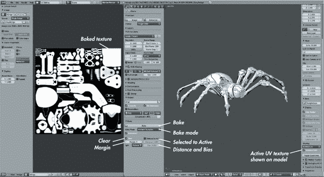图 10-1. 在我们创建的 第八章的 UV 编辑布局中工作时的纹理烘焙控制。UV 编辑布局很有用，因为它让我们通过属性编辑器访问烘焙控制，通过 UV 图像编辑器访问烘焙图像，并通过 3D 视口访问场景中的对象，所有这些都在一个布局中。

### 注意

*烘焙目前仅在使用 Blender Internal 渲染器时受支持。如果你没有看到任何烘焙选项，请确保在信息编辑器头部选择了 Blender Internal 作为渲染引擎（参见图 10-1）。*

## 纹理映射类型

你可以烘焙几种不同的地图类型，其中一些比其他的更重要。以下是 Blender 提供的选项：

****完整渲染****。这会进行完整的渲染，包括表面的纹理和光照。得到的纹理正是模型在最终渲染中呈现的效果，贴图到物体的 UV 坐标上。

****环境光遮蔽****。这会为物体渲染环境光遮蔽，考虑到当前活动层中的任何其他可见且可渲染的物体。环境光遮蔽是一种自阴影效果，在物体的角落和缝隙处创建暗区。它既有助于模拟更复杂的光照效果，也有助于创建脏污和灰尘可能积聚的区域的粗略地图。这种贴图在创建纹理和材质时非常有用（参见图 10-2）。

****阴影****。这会将场景中的光源阴影渲染到一个贴图中。

****法线****。这会获取物体表面每个点的法线向量，并将其记录为 RGB 值。这可以通过多种方式进行，具体取决于你选择的法线空间选项。不同的法线空间记录网格的法线相对于不同的坐标系统。例如，*相机*选项相对于相机记录法线；*世界*，根据世界空间记录；*物体*，根据物体的局部坐标记录；而*Tangent*，则根据被烘焙物体本身的表面法线记录。

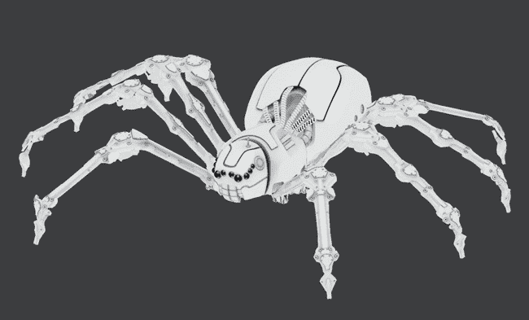图 10-2。一个环境光遮蔽贴图，已经烘焙并作为纹理应用到网格上（这里的眼睛被留空为黑色）

在这些选项中，Tangent 可能是最重要的；它通过启用“从选中到活动”设置、选择源网格（或多个网格）和目标网格，然后进行烘焙，允许你将一个网格的法线烘焙到另一个网格的表面。这会根据选定的目标网格渲染源网格的法线。然后可以使用这个贴图来扭曲网格表面的法线，给人一种表面细节丰富的印象（当该贴图作为物体材质的一部分应用时），尽管底层几何形状可能要简单得多。（参见图 10-3 了解这种效果的示例。）Tangent 空间法线贴图尤其有用，因为法线是相对于网格表面记录的，因此即使网格经过修改器或进一步编辑而发生形变，只要 UV 坐标保持不变，它们仍然有效。

****纹理****。这会烘焙应用到网格上的任何材质和颜色的漫反射颜色。这对于将程序生成的颜色和纹理烘焙到 UV 贴图中非常有用。

****位移****。这个功能将两个网格之间的距离转换为黑白图像。黑色表示负位移，中灰表示零位移，白色表示正位移。使用“选择到活动”选项，可以从源网格（或多个网格）烘焙到活动网格。

位移贴图通常作为法线贴图的替代方法，之后可以将该贴图用作位移修改器的输入或材质的位移设置，以将网格变形为源网格的形状（见图 10-3）。另外，烘焙的位移贴图可以用作材质的*凹凸贴图*。（凹凸贴图像法线贴图一样，通过改变表面的阴影来产生表面细节的印象，但它们仅需要黑白输入。）

法线贴图是一种非常高效的方式来给网格带来细节的印象，但它们不会影响网格的轮廓或阴影的投射，因为没有*真实*的几何体被位移。位移贴图通过变形网格来创建真实的细节，但它要求你细分网格，以提供足够的几何体来进行变形。在图 10-3 中，一组球体已经烘焙成法线贴图（8 位）和位移贴图（32 位）。这些贴图随后应用于一个平面和一个圆柱体。法线贴图的对象通过较低的多边形数捕捉了大量的阴影，但它们不会影响网格的实际形状或投射阴影。位移贴图的对象更加真实，但它们必须进行细分，以捕捉所有细节。

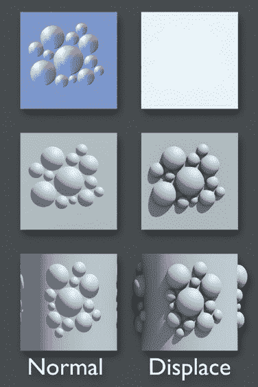图 10-3. 法线贴图与位移贴图

****透明度****。这个功能将网格的透明度（Alpha 通道）烘焙到纹理中。对将过程生成的值烘焙到图像纹理中非常有用。

****发射****。这个功能将材质的发射颜色和强度烘焙到纹理中。与纹理图一样，这在将过程生成的发射颜色烘焙到图像纹理中时非常有用。

****镜面反射颜色****。这个功能将光线追踪反射的颜色烘焙到材质的纹理中。它对于将过程生成的值烘焙到图像纹理中非常有用。

****镜面反射强度****。这个功能将材质的光线追踪反射强度烘焙到纹理中，对将过程生成的值烘焙到图像纹理中非常有用。

****镜面反射颜色****。这个功能将材质的镜面反射颜色烘焙到纹理中，并且对将过程生成的值烘焙到图像纹理中非常有用。

****镜面反射强度****。这个功能将材质的镜面反射强度烘焙到纹理中。对将过程生成的值烘焙到图像纹理中非常有用。

每种纹理贴图偶尔都会有其特定用途，但在本章中，我们将重点讨论环境光遮蔽、纹理、法线和位移贴图。对于纹理贴图来说，这些贴图最常用于与绘制的纹理配合使用，以及渲染详细的最终模型。

## 为蝙蝠生物烘焙纹理

对于蝙蝠生物，我的目标是为皮肤创建纹理，并烘焙一个位移贴图，用于通过位移修改器渲染最终模型，以捕捉我之前雕刻的所有细节。在这一部分，我将讨论如何烘焙环境光遮蔽（ambient occlusion）和位移贴图来帮助完成这一任务。我还会介绍烘焙法线贴图作为位移贴图的替代方案，虽然法线贴图渲染速度更快，但在细节表现上会牺牲一些准确性。

### 从雕刻到最终网格的位移烘焙

因为我在重新拓扑后的网格上继续雕刻，所以我可以直接渲染最终的网格。但这并不总是理想的，因为多重细分（Multires）修改器有时会损坏，而且在 3D 视口中显示其效果可能会变得缓慢且难以操作。一个更好的解决方案是，使用高多边形雕刻烘焙位移贴图，然后可以将其作为材质的一部分应用，或者使用细分曲面（Subdivision Surface）和位移（Displace）修改器，只有在渲染时才恢复网格的高多边形细节，从而使其在 3D 视口中保持简单且易于操作。

为了为蝙蝠生物烘焙位移，我首先选择了生物的身体（高多边形雕刻），将其复制，然后在级别 3 应用多重细分修改器。这就是我将用作最终身体网格进行渲染的网格。（我将在第九章中创建的毛发作为单独的物体添加到最终场景中。）这已经捕捉到了大部分细节，但我将使用位移贴图来捕捉最高分辨率的细节。

接下来，我需要添加一个细分曲面修改器，以匹配多重细分网格的最高级别与即将被位移的网格之间的细分级别。我添加了该修改器，并将细分数设置为 2。

然后，在编辑模式下，我选择了整个网格，并在 UV 图像编辑器中添加了一个新的图像，以便将位移贴图烘焙到这个图像中。这个图像需要是 32 位浮动图像，以便捕捉位移的所有细节，而不会产生伪影。我将其大小设置为 4096×4096 像素，足以捕捉雕刻的所有细节。我选择了原始的多分辨率网格和我的新最终网格。如图 10-4 所示，我确保启用了“从选中到激活”（Selected to Active）选项，且取消勾选了“归一化”（Normalize），同时将边距（Margin）设置为 4，以在 UV 岛屿周围留出 4 像素的边框，从而减少 UV 接缝周围出现伪影的机会。（其他设置保持默认）

到此为止，我准备好烘焙我的纹理了，所以我点击了烘焙面板中的“烘焙”按钮，开始让 Blender 工作，烘焙我的纹理。这一步将我高多边形雕刻和细分后的最终网格之间的位移信息烘焙到了一个位移贴图中，保存了高多边形雕刻的所有细节。烘焙完成后，我按 F3 在 UV 图像编辑器中保存了这个 32 位 OpenEXR 图像，以便保留位移贴图中的所有信息，并在文件浏览器编辑器的左下角将格式设置为 EXR（见图 10-5）。你可以选择使用 Float（Full）来使用 32 位值。将编解码器（Codec）设置为 ZIP 将使文件大小稍微变小。

### 位深度与纹理

我之前简要提到过位深度，现在我将进一步解释。*位深度*指的是用于存储图像中每个像素的红、绿、蓝和透明度（RGBA）值的位数（即二进制数的长度）。用于存储每个数字的位数越多，表示的等级就越多，图像中可以存储的颜色和亮度的范围和细微程度也就越大。

大多数图像格式（如*.jpg*和*.png*）使用 8 位颜色，这对于简单的屏幕显示图片或者存储简单的漫反射纹理来说是足够的。但如果你打算对图像进行更复杂的处理，比如用它们做位移贴图或修改颜色和曝光度，就会开始看到伪影的出现。

对于这样要求较高的使用场景，你可以使用更高位深度的图像（16 位或 32 位），这会提供更大的值范围供你使用。使用更高位深度可以防止渲染图像和位移网格中出现难看的伪影。OpenEXR（*.exr*）格式是保存高位深度图像的好选择。对于低位深度图像，我通常使用 Targa（*.tga*）格式。

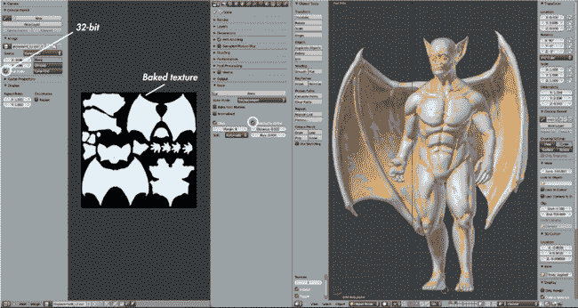图 10-4. 蝙蝠生物的位移贴图烘焙设置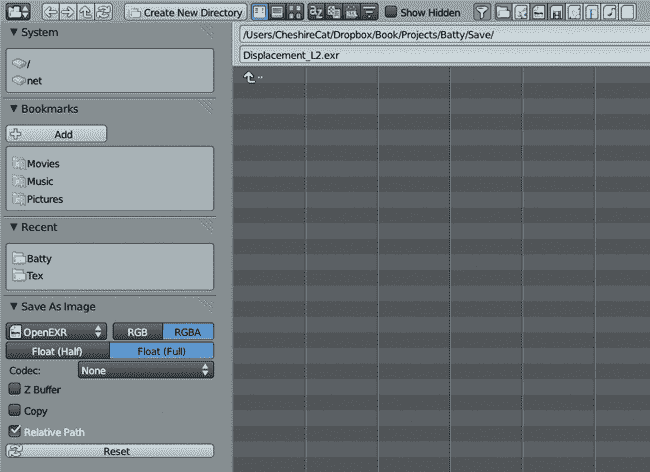图 10-5. 将位移贴图保存为 32 位 OpenEXR 图像

在贴图烘焙过程中，大多数类型的纹理可以保存为 8 位格式。不过，位移贴图几乎总是需要保存为 32 位图像，以避免在将其应用到模型时出现阶梯伪影。阶梯伪影可以在图 10-6 中看到；位移修饰符的输入已经在 Blender 中烘焙，并保存为 8 位*.tga*文件（通过位移修饰符应用，中间）和 32 位 OpenEXR 图像（右侧）。中间的图像显示了使用位移纹理时，由于位深度不足而导致的伪影。

图 10-6. 位移贴图通常需要保存为高位深图像格式，因为较低位深度无法存储足够的信息，可能导致阶梯伪影。（此处效果已被显著放大。）左：云纹理，作为位移贴图的原始来源。中：使用 8 位位移贴图，出现阶梯效果。右：使用 32 位位移贴图，无阶梯效果。

### 应用位移贴图

为了确保位移贴图正确应用（并将其应用到我们的模型中以供最终渲染使用），我们可以通过位移修饰符将其应用到我们复制的模型上。添加了细分曲面修饰符到复制的物体后，我们已经拥有了所需的几何体，因此可以简单地将位移修饰符添加到物体上。

为了指定位移贴图，我们使用我们烘焙的*图像*作为*纹理*的输入；然后可以将该纹理指定为位移修饰符的输入。（在这里，我使用的是本章开头讨论的更严格的定义。）

创建和修改纹理块的最简单方法是为模型添加一个材质（如果你还没有的话）（我们在第六章中创建了一个 MatCap 材质，现在不再需要它；我们可以使用这个材质或创建一个新的材质），然后通过属性编辑器的纹理标签页，点击选择空的纹理槽，点击**+新建**按钮，为这个材质添加一个新的纹理。在弹出的图像面板中，打开你的位移贴图，并给纹理取一个有用的名字，例如*Body_Displacement*，然后将这个纹理的类型设置为**图像**或**视频**。

现在返回到修改器标签页，在位移修改器中，使用纹理下拉菜单选择你刚刚创建的纹理。将方向设置为**法线**，并将纹理坐标设置为**UV**。设置强度为**1.0**应该能给出正确的位移量。调整细分曲面修改器中的视图细分级别设置，将让你看到更多或更少由位移贴图生成的细节。

### 烘焙法线贴图

虽然我们最终渲染时不会使用法线贴图，但法线贴图是一个有用的、渲染速度快的替代位移贴图的方法。它们在游戏引擎中经常使用，因为它们足够快，可以在实时应用程序中使用。它们也可以与 Blender Internal 渲染器一起使用，给人一种额外细节的感觉，而不需要如此密集的几何体。

烘焙法线贴图的过程与烘焙位移贴图非常相似。首先，为你的复制网格分配一个新的空白图像（它不需要是 32 位）。然后，先选择雕刻，再选择复制网格。这次我们不需要给复制网格应用细分曲面修改器，因为我们角色的轮廓大致合适，法线贴图不需要额外的几何体（它不会物理性地位移网格）。接下来，在属性编辑器的渲染标签页中，将烘焙模式设置为**法线**，法线空间设置为**切线**，启用**选择到活动**，然后点击**烘焙**（见图 10-7）。

最终得到的贴图将是一种带有蓝色调的纹理，其他颜色表示雕塑的不同方向面相对于未细分副本网格法线的朝向。此纹理可以稍后作为物体材质的一部分应用，以模拟雕塑网格的表面形态效果（见图 10-8）。请参阅添加法线贴图，学习如何将法线贴图作为材质的一部分应用。

### 烘焙环境光遮蔽

除了位移贴图，我们还希望将高多边形雕塑的环境光遮蔽贴图烘焙到最终网格上。这个过程比制作位移贴图要简单：

1.  选择雕塑对象，然后选择最终网格。将烘焙模式设置为**环境光遮蔽**。

1.  选择**归一化**，以确保环境光遮蔽贴图使用黑白之间的整个范围来存储遮蔽效果。

1.  为了获得最佳质量的环境光遮蔽贴图，调整 Blender 的世界光照设置，位于属性编辑器的世界选项卡中，里面包含了所有关于环境光遮蔽和环境光照的设置（见图 10-9）。(更多设置细节请参见第十三章。) 在环境光遮蔽面板中启用**环境光遮蔽**（设置为**乘法**）。

1.  在聚集面板中，将衰减距离调低至**0.2**，并启用**衰减**，设置为**1.0**。这将导致只有接近的几何体才会产生阴影，并加速渲染。

1.  将样本数设置为**24**，以减少结果中的噪声。

在外部保存了位移贴图后，你可以直接在位移贴图图像上进行烘焙，记得在烘焙完环境光遮蔽贴图后将其另存为不同的文件。点击**烘焙**并等待环境光遮蔽贴图渲染完成（见图 10-10）。

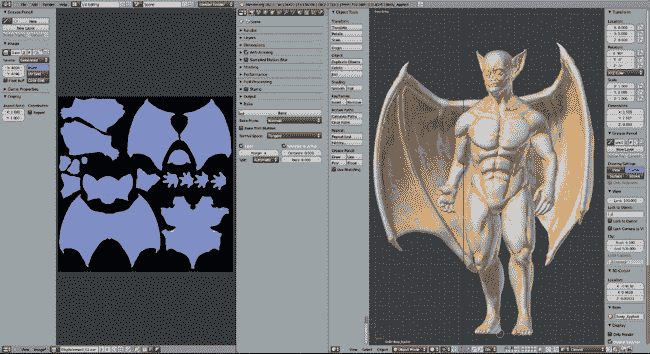图 10-7. 烘焙法线贴图。法线空间设置为切线，并将法线从雕刻网格烘焙到最终模型—这次没有细分。烘焙结果中有一些伪影，但可以在后续的 GIMP 中修正（见第十一章）。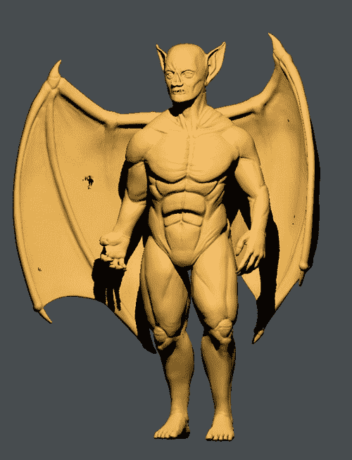图 10-8. 作为材质一部分应用的法线贴图，在 3D 视口中使用 GLSL 阴影预览。烘焙结果中的伪影可以在机翼上看到，表现为黑色区域，但这可以在后续的 GIMP 中通过涂抹去除。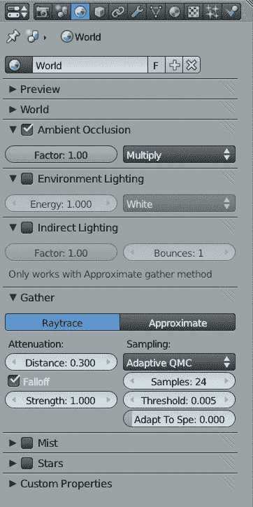图 10-9. 烘焙环境光遮蔽贴图的设置。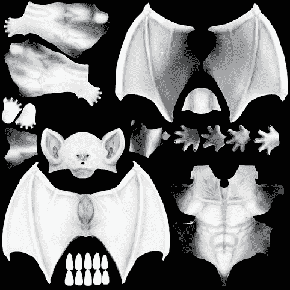图 10-10. 烘焙出的环境光遮蔽贴图。这个贴图包含一些烘焙伪影，稍后我们将手动去除。

为了确保环境光遮蔽贴图正确生成，请在 3D 视口的属性区域的显示面板中启用**Textured Solid**。这会显示模型网格上分配的纹理，帮助你查看环境光遮蔽贴图的效果。当你对烘焙结果满意时，将其保存为*.tga*图像。（这次不需要使用高位深度格式，因为环境光遮蔽贴图在 8 位颜色下也能正常工作。）可能会出现一两个伪影，但当你开始进行纹理绘制时，可以在 GIMP 中将其去除。

## 蜘蛛机器人纹理烘焙

对于蜘蛛机器人项目，我不需要烘焙位移或法线贴图；这次进行重拓扑的目的在于消除雕刻网格的粗糙度，最终得到现在这个平滑的重拓扑模型。尽管如此，模型仍然需要一个环境光遮蔽贴图，这将在纹理绘制过程中发挥作用。为了节省为纹理绘制颜色的时间，还可以为模型的各个部分分配一些不同颜色的基础材质，然后将这些颜色烘焙成图像，作为绘制纹理时的指南。

### 多物体烘焙贴图

在第八章中，我将大部分 Spider Bot 模型的 UV 坐标打包到一个单一的 UV 网格上，这样我以后就需要更少的纹理图像。接下来，我需要将所有物体的地图一起烘焙。为此，首先确保它们的 UV 坐标都分配了相同的图像。如果是这样，你只需选择所有具有相同 UV 坐标的 Spider Bot 物体，点击烘焙即可一次性烘焙所有选定物体。

但是，如果你希望在烘焙不同物体时选择性地控制模型的哪些部分可见呢？或者如果你希望能够修正某些部分而无需重新烘焙整个模型呢？默认情况下，每次点击烘焙时，Blender 会清除纹理，这会阻止你在选择不同物体时多次烘焙。为避免这种情况，请在烘焙面板中关闭“清除”设置，Blender 将仅替换分配给选定物体的图像部分。这样，你就可以一次烘焙一个物体、分组烘焙，或者一次性烘焙所有物体，在过程中不断添加到纹理图上。

这种选择性技术在处理像腿部这样的部件时非常有用。因为一些腿部组件略有重叠，如果它们一起烘焙，重叠区域会在烘焙环境光遮蔽图时变黑。如果后来我们重新摆姿势，这些黑色区域可能会显示出来。

为了避免烘焙重叠物体的阴影，这些物体可能并不总是在场，使用 Blender 的图层功能。Blender 只会在当前可见的图层上烘焙物体，因此我们可以每次将想要包含的部分单独放置在一个图层上，然后烘焙它们。操作步骤如下：

1.  选择你想要烘焙的物体，并按 **M** 打开一个菜单，允许你选择物体应在哪些图层上可见。

1.  选择一个新的空图层（检查 3D 视口头部的图层图标，查看哪些图层已被占用），然后按 ENTER 将物体放置到该图层。

1.  跳转到 3D 视口中的选定层，可以通过头部的选择器或使用键盘快捷键（键盘上的 1 至 0 对应层 1 至 10，ALT-1 至 ALT-0 对应层 11 至 20）。

    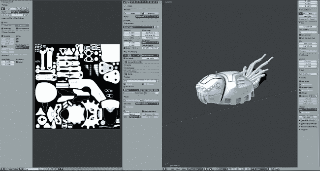 图 10-11. 为 Spider Bot 的头部和身体部分烘焙环境光遮蔽图。只有选定的物体被烘焙，且仅当前可见图层上的物体会被烘焙过程考虑。

1.  现在选择网格，并仅为该对象烘焙环境光遮蔽贴图，如图 10-11 所示。

这个选择性过程让你可以逐个对象地处理模型，按照需要烘焙环境光遮蔽贴图，不论是为单一组件还是小组分配。例如，对于蜘蛛机器人头部部分，我将天线和额外的头部部件与头部网格一起烘焙，并在烘焙过程中将头部/身体段后面的电线保持在同一图层上（尽管我单独烘焙了这些）。我将腿部作为单独的部分来烘焙，在烘焙之前将每种类型的腿部零件单独放置在不同的图层上。对整个模型进行处理后的最终烘焙结果显示在图 10-12 中。

对于蜘蛛机器人身体底部的关节区域，这些区域共享相同的 UV 空间，我无法烘焙出合适的 UV 贴图。相反，我在保存图像后，直接在 GIMP 中将该区域填充为白色。（请参见图 10-12 的右上角的环境光遮蔽贴图。）

图 10-12. 蜘蛛机器人最终烘焙的环境光遮蔽贴图

### 烘焙漫反射颜色和纹理

为了大致了解蜘蛛机器人所需的颜色，并将这些颜色烘焙成贴图，以作为纹理绘制过程的指南，我需要创建一些基础材质并将它们分配到模型的不同部件上。这些材质不需要复杂；实际上，我只需要调整漫反射颜色设置。（关于更复杂的材质内容，我将在第十二章中进行讨论。）

创建一些基础材质：

1.  转到属性编辑器的**材质**标签（选中一个对象），点击**+新建**按钮以创建一个新材质。

1.  点击*Material*名称，将其重命名为更有用的名称，如*Basic_Fill_01*，然后将漫反射颜色设置为中灰色。

1.  通过复制第一个材质来创建更多材质（点击材质名称旁的+图标），并将其设置为不同的颜色。

在使用新材质时，我从选择三种颜色开始：一种主要颜色用于大部分模型，第二种颜色作为辅助色，第三种颜色用于小细节的高光。我然后开始使用属性编辑器的材质标签将这些材质分配给构成蜘蛛机器人不同部件的物体，虽然使用一个名为 Material Utils 的插件可以更轻松地完成这项任务。

#### Material Utils 插件

Material Utils 插件是一个快速修改分配给模型材质的工具。它特别适用于处理那些使用大量材质的场景，或者有多个共享相同材质的物体的场景。

要启用该插件，打开 Blender 的用户偏好设置编辑器（可以通过点击**文件**▸**用户偏好设置**来打开），然后在插件列表下搜索并启用**Material Utils**。这会添加一个新的快捷键（**Q**），可以通过它在物体模式或编辑模式下打开一个菜单，用来为网格分配材质（见图 10-13）。在物体模式下，该插件允许你为整个物体（如果选中了多个物体，则为多个物体）分配材质，而在编辑模式下，它只会为你选择的网格部分分配材质。

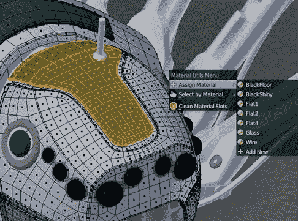图 10-13. 使用 Material Utils 插件（Q）为场景添加材质，特别是在有很多物体的场景中，显著加快材质添加速度。

对于蜘蛛机器人，我通过按**A**选择所有物体，然后使用材质工具（**Q**）将我创建的基础材质应用到所有物体上，迅速给模型中的每个物体应用了相同的材质。然后，我开始选择个别部件（并通过 TAB 键进入编辑模式，选择网格的部分，就像在图 10-13 中一样）并从我创建的三个材质中为它们分配其他材质。我的整体目标是为模型保持一个主色、一个次色和一个突出的小部件的高亮色。对于某些物体，比如电线和眼睛，我通过首先使该物体的现有材质数据块唯一（点击材质名称旁边的数字）来创建独特的材质，然后根据需要调整它。分配完材质后，我开始调整材质的漫反射颜色，寻找一个合适的组合，如图 10-14 所示。

#### 烘焙纹理贴图

在确定了我的配色方案之后，我能够将颜色烘焙到纹理贴图中。使用纹理来定义物体的颜色，而不是不同的材质，使我能够使用更少的材质来渲染模型，并简化了后续调整材质的过程。

为了烘焙纹理贴图，我回到属性编辑器中的渲染标签页的烘焙面板，将烘焙模式设置为纹理（Texture），然后点击烘焙（Bake）。这将我分配给不同材质的颜色烘焙成一个单一的纹理（参见图 10-15））。因为这次不需要考虑网格之间的相互作用（就像渲染环境光遮蔽时那样），我可以在烘焙之前选择所有网格，将它们一次性烘焙。

这里值得指出的是，你也可以烘焙更复杂的材质颜色和纹理。例如，你可以将图像纹理烘焙到物体的 UV 展开纹理中，或者将程序生成的材质烘焙到图像中。图 10-16 显示了在烘焙之前，将程序生成的木纹纹理添加到蜘蛛机器人一个平面材质中的结果，从而给它添加了斑马条纹图案。

## 给丛林神庙纹理化

在丛林神庙的案例中，我的大多数贴图都有一定程度的可平铺性，或者它们在多个位置的网格上重复出现。这意味着像环境光遮蔽这样的贴图会效果较差，因为为一个位置的网格烘焙的贴图，在其他位置重复时可能效果不太合适。最终，我只为雕像网格烘焙了贴图（见图 10-17），为该物体单独创建了一个环境光遮蔽贴图。我通过将雕像放在自己的图层上进行烘焙，就像我之前为蜘蛛机器人模型的部件所做的那样。

图 10-14。 在为蜘蛛机器人尝试不同颜色方案后，我最终决定使用白色、灰色和绿色的版本。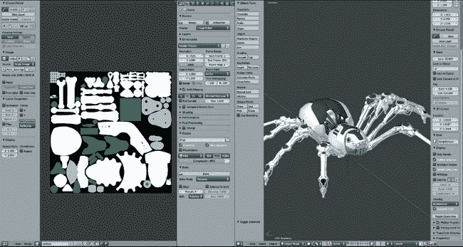图 10-15。将简单材质烘焙成贴图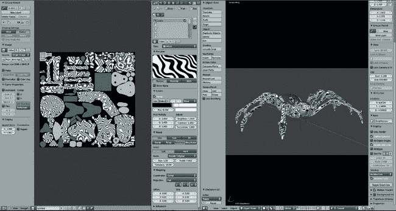图 10-16。将斑马条纹图案烘焙进蜘蛛机器人的贴图中，使用了程序化木纹贴图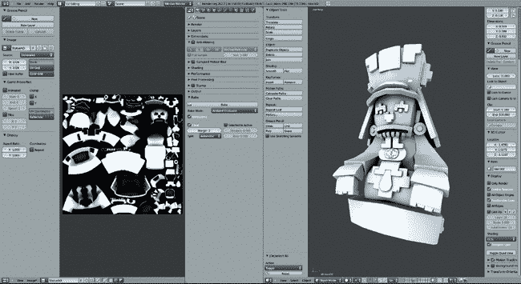图 10-17。烘焙丛林神庙场景中雕像的环境光遮蔽贴图

## 烘焙贴图的一般建议

烘焙较大的贴图可以让你捕捉到更多的细节，但也会花费更多时间。在决定烘焙多大尺寸的贴图时，考虑模型的细节程度以及在烘焙前需要保留的细节量，以便优化所使用贴图的分辨率。

一般来说，对于位移贴图的一个好经验法则是，贴图的像素大小不需要比网格的多边形数大太多。因此，如果你正在烘焙一个约 1M 多边形的雕刻模型，1024×1024 像素的贴图应该就足够了。对于其他类型的贴图，考虑物体在最终渲染中的大小。如果一个物体在最终渲染中只会显示几百像素高，那么它的贴图大小应该大致相同。另一方面，如果一个物体是近距离以高分辨率显示的，那么就需要更大的贴图。

对于特别简单的材质，比如我们为蜘蛛机器人烘焙的平面颜色，你可以在烘焙时将图像做得更小，之后在像 GIMP 这样的图像编辑程序中放大（确保增加边距设置，以防止接缝）。

在创建烘焙图像时，适当设置位深度。位移贴图需要 32 位图像，而其他类型的纹理通常只需要 8 位（或者如果你打算进行大量操作，使用 16 位）。Blender 可以烘焙 8 位或 32 位图像，但请记住，你最终得到的位深度也取决于你保存的文件格式。对于高位深图像，使用 OpenEXR，而对于 8 位图像，使用*.tga*或*.png*文件。另外，请记住，GIMP 目前只能编辑 8 位图像（现在是这样——未来的版本可能会支持高位深图像），因此如果你打算在 GIMP 中绘制纹理，额外的位深度并没有太大帮助。

在烘焙环境遮蔽或光照时，考虑将你要烘焙的部分隔离到一个单独的图层，以便更好地控制结果。最后，调整世界设置（或者如果你在烘焙光照，调整灯光设置）也有助于获得更高质量的烘焙纹理。（有关世界和光照设置的更多内容，请参见第十三章。）

## 总结

在本章中，我们讨论了如何使用 Blender 的烘焙工具将纹理烘焙到图像中，以及 Blender 允许你烘焙的各种贴图类型。我使用这些技巧为我的多个项目烘焙贴图：对于蝙蝠生物，我烘焙了位移贴图和环境遮蔽贴图；对于蜘蛛机器人，我烘焙了环境遮蔽贴图和一些块状颜色，以便稍后进行纹理处理。虽然我在丛林寺庙场景中并不需要进行大量的纹理烘焙，但我确实为雕像创建了一个环境遮蔽贴图。

在下一章，我们将结合我们烘焙的纹理与其他创建纹理的方法，从在 Blender 中直接绘制和克隆纹理，到在 GIMP 中绘制并结合照片纹理以合成新纹理。
