## 第十一章 纹理绘制

在上一章中，我们使用 Blender 自动生成纹理；而在本章中，我们将转向手工创建纹理。通过手绘、使用照片纹理以及利用我们在第十章中创建的纹理，我们将为场景中的物体添加颜色和纹理。我们还将介绍创建一些图像，如高光、硬度和透明度贴图，这些将在第十二章中用于影响我们制作的材质的其他方面，比如其光泽度、平滑度和透明度。我们将学习如何创建可重复使用的纹理，这些纹理可以应用于多个物体，同时也会创建特定 UV 映射到单个物体的独特纹理，结合 Blender 和 GIMP 来完成。

让我们从了解可用工具开始。

## 在 Blender 中进行纹理绘制

在 Blender 中，我们可以使用 UV 图像编辑器进行 2D 绘制，也可以使用 3D 视图中的纹理绘制模式直接在物体上进行绘制。这为我们提供了很大的灵活性来绘制我们的模型。画笔可以同时在 UV 图像编辑器和纹理绘制模式中使用，使得 Blender 的纹理绘制变得简便而一致。

一旦你选择了一个已经展开并在 UV 图像编辑器中分配了图像的网格，就可以在 3D 视图中切换到纹理绘制模式。（使用头部的模式下拉菜单，如图 11-1 所示。）默认情况下，你会看到网格上的纹理，并可以使用 Blender 的纹理画笔在其上进行绘制。

Blender 提供了几种画笔类型，供你在模型上绘制纹理：

****绘制、画笔和 Texdraw****。这些画笔提供相同的基本功能，允许你用颜色选择器指定的颜色直接在网格上进行绘制。

****克隆****。这个画笔允许你将模型一部分的纹理信息克隆到另一部分，或者将一个 UV 坐标集的纹理信息克隆到另一个 UV 坐标集。在项目绘画设置中关闭克隆选项（参见项目绘画），画笔将获取 3D 视图光标下方的纹理信息并将其复制到你所涂绘的地方，这样你就能在同一纹理中从模型的一部分克隆到另一部分。开启项目绘画设置中的克隆选项时，画笔将从*相同的网格部分*克隆纹理信息，但来自分配给*不同 UV 坐标集*的纹理（即在项目绘画设置中选择的纹理）。

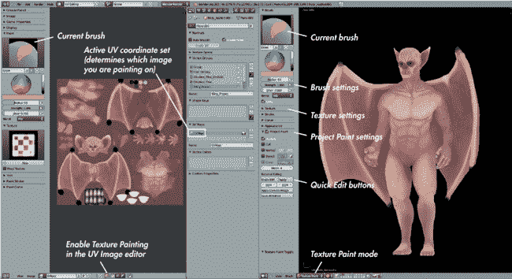图 11-1。Blender 中的纹理绘画模式。在这里，我使用了第八章中创建的修改后的 UV 展开布局。这个布局允许我在 3D 视口中（右侧）绘制纹理，在 UV 图像编辑器中查看和编辑生成的图像（左侧），并在属性编辑器中编辑材质和设置。

****涂抹****。这会在画笔笔触的方向上涂抹你的纹理。它可以用来混合颜色并抹去错误。

****柔化****。这会模糊笔触下方的纹理，减少噪点和细节。

这些画笔类型可以像 Blender 的雕刻画笔一样复制和修改，允许你创建适合自己需求的各种画笔。此外，和雕刻模式一样，你可以使用工具选项区域中的纹理面板为画笔应用纹理。你应用的纹理将在你绘画时与笔触相乘。

### 投影绘画

Blender 在纹理绘画模式中有两种绘制纹理的方法。较老的传统方法虽然有用，但有显著的局限性。新的投影绘画方法提供了一套更先进的工具，包括允许你使用其他 UV 坐标和图像来遮罩和克隆纹理，以及仅在从你的视点可见的表面上进行绘画。当启用时，投影绘画会提供图 11-2 中显示的选项。我将按照这些选项在投影绘画面板上出现的顺序进行讨论。

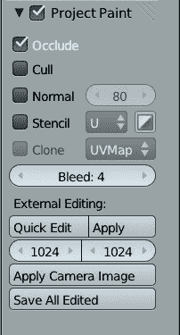图 11-2。投影绘画面板有多种选项来控制 Blender 的纹理画笔如何工作。

****遮挡****。这可以防止绘画时“穿过”网格，绘制到背后可见面的表面上。

****剔除****。这可以防止在背离你视角的面上进行绘画。

****法线****。这根据笔触是否朝向你，平滑过渡笔触的强度（类似于剔除，但具有平滑的渐变效果）。你可以使用复选框右侧的*角度*设置来控制渐变的限制。

### 注意

*默认情况下，上述选项是启用的，但关闭它们可以快速用单一笔触绘制模型的大部分区域。*

****模板****。这个选项允许你使用映射到对象 UV 坐标（这个坐标集可以不同于你正在绘制的那个坐标集）的图像来遮罩你的笔触效果。这个设置可以用于限制你正在处理的区域，或者简化向模型添加纹理的过程，正如本章后续部分所示。在模板复选框的右侧，你可以选择使用哪个 UV 坐标集（也即使用哪个图像）来进行遮罩，并且是否反转遮罩。

****克隆****。这允许你将一个 UV 映射上的纹理信息克隆到另一个 UV 映射上。（你的笔触将克隆到分配给当前 UV 集的图像，而这个图像是在选项框旁的下拉菜单中选择的那个。）这个设置让你能够例如将模型投影到使用一个 UV 坐标集的照片上，然后再将其克隆到另一个更整齐布局的 UV 映射上进行进一步的纹理绘制。（我们稍后会在“丛林神庙”中使用这个选项。）

****溢出****。这个选项决定了当你在 UV 接缝上绘画时，Blender 会将纹理从 UV 岛的边缘向外溢出多少。这样可以防止纹理中出现接缝，类似于纹理烘焙中的边距设置。

****快速编辑****。这个功能在纹理绘制时非常有用，特别是对于清理接缝和绘制那些可能需要额外工具来处理的难以纹理化区域，比如在 GIMP 等 2D 绘画程序中可用的工具。快速编辑会从当前视角拍摄模型的快照，并在你选择的图像编辑器中打开。（要选择图像编辑器，可以在 Blender 用户设置的“文件”标签中找到“图像编辑器”选项；然后，简单地设置 GIMP 或任何你希望使用的图像编辑器的路径。）你可以在图像编辑程序中绘制纹理并保存。点击 Blender 中的应用按钮会将该纹理从最初拍摄的视角投影到模型上。（你不需要担心移动相机；Blender 会记住这个设置。）在本章的后面部分，我们会讨论如何使用这个功能来修复接缝。

****应用相机图像****。类似于快速编辑，这会将图像从相机的当前视角投影出来。它会弹出一个下拉菜单，列出你在 Blender 中已经打开的所有图像，供你选择，随后它会将你选择的纹理投影到你的模型上。

****保存所有编辑****。这会保存你在纹理绘画模式下编辑过的任何纹理，但这些纹理必须已经手动保存过一次，否则 Blender 不知道保存位置。一般来说，最好还是记得手动保存，这样你能追踪到已经编辑过的纹理。

### 在 UV 图像编辑器中绘画

你也可以在 Blender 的 UV 图像编辑器中绘制纹理。为此，点击 UV 图像编辑器区域顶部的画笔图标。然后，你可以使用与 3D 视口中相同的画笔，在 UV 图像编辑器中的当前图像上进行绘制。通过将 3D 视口和 UV 图像编辑器并排使用（如 图 11-1），你可以在绘制纹理时获得更多控制。

### 注意

*稍后我们将在本书中的一些项目中使用 Blender 的 Cycles 渲染器进行渲染，但在进行纹理绘制时，最好将渲染器保持为 Blender Internal。这是因为 Cycles 在使用多个 UV 坐标集进行纹理绘制时，可能会导致 Blender 的行为有些异常。*

## 在 GIMP 中绘制纹理

虽然我们可以在 Blender 中进行 2D 绘画，但 GIMP 提供了更多的绘画工具，如选区、蒙版、图层和滤镜。这些工具的多样性使得 GIMP（或其他图像编辑器，如 Photoshop）在纹理制作中变得不可或缺。特别是，使用图层的功能使得创建纹理时尽可能非破坏性地工作变得更加容易，先建立一个图层，然后在新图层上添加细节。

使用图层的功能还允许你轻松地将烘焙纹理与手绘纹理结合。例如，你可以在另一个纹理图层上添加环境光遮蔽纹理，以增加阴影效果。GIMP 还拥有一个更为高级的画笔系统，使得绘制细节纹理变得更容易。（我在 第二章中介绍了 GIMP 绘画的基础，因此在本章中我们只会讨论 GIMP 中与纹理相关的更多内容。）

### 在 GIMP 中创建纹理画笔

GIMP 的画笔易于编辑，并且能够创建各种各样的效果。在纹理绘制时，创建自定义画笔常常很有用，这可以帮助快速构建纹理。特别是，当作为克隆画笔或油漆画笔使用时，带有斑点或脏污效果的画笔在不同颜色和纹理之间的融合中通常非常有用。

例如，让我们创建一个脏乱的画笔，这将在为丛林神庙添加纹理时派上用场。它的效果可以在图 11-5 的右侧看到。为了创建它，我们从 CGTextures（* [`cgtextures.com/`](http://cgtextures.com/) *）获取一个照片纹理，然后将其精炼成一个可以导出为默认 GIMP 画笔的画笔，可以在 GIMP 中反复使用进行纹理处理或绘画。

GIMP 画笔是图像文件，用于控制画笔的形状。RGB（彩色）图像按原样使用（更像是印章而非画笔），不会继承画笔颜色。黑白图像将黑色解释为画笔的形状，白色为透明，它们的颜色来自你在 GIMP 的颜色选择器中选定的颜色。要创建 GIMP 画笔，我们只需要创建一张黑白图像，并将其保存为 GIMP 的画笔格式（*.gbr* 或 *.gih*—*稍后我会讨论这两者之间的区别）。

1.  从 CGTextures 获取一张油漆飞溅的照片（参见图 11-3），然后选择**颜色**▸**去饱和**将图像转换为黑白，选择**亮度**选项以去饱和图像，从而增加亮度上的变化。

    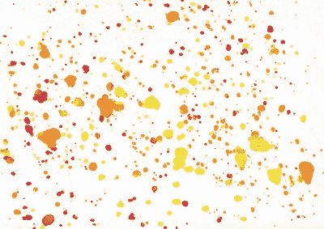图 11-3. 我们将作为画笔纹理使用的图像

1.  接下来，识别一个可能适合作为画笔的方形区域，并使用矩形选择工具（**R**；按住 SHIFT 并拖动可以选择正方形区域）选择该区域。复制此区域（CTRL-C），然后将其粘贴为新图像（CTRL-SHIFT-V），接下来你将把它保存为一个新的画笔。

1.  虽然你已经将图像去饱和，但它仍然是使用 RGB 颜色编码的，因此请切换到使用黑白值，通过**图像**▸**模式**▸**灰度**来进行转换。

1.  接下来，对新图像进行一些微调，涂去一些溅落在画布边缘的部分。纹理现在已经准备好保存，如图 11-4 所示。

    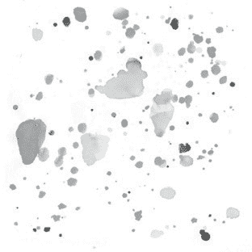图 11-4. 一部分照片，复制并粘贴到新图像中，稍微调整边缘

### 为画笔添加变化

你可以在这里停止，并将画笔导出为 *.gbr* 画笔文件，但作为画笔使用时，它只会重复这一个图像。如果想让画笔效果更有变化，可以重复上述步骤，添加更多图层到画笔图像中，然后将其保存为一个动画 *.gih* GIMP 画笔。这个画笔每次绘制一部分笔触时，将使用画笔图像中的不同图层，使得笔触看起来更加多样化。为此，按照以下步骤操作：

1.  选择原始图像的更多区域，并将它们复制粘贴为新的图层到画笔图像中（CTRL-V，然后在 GIMP 的图层对话框中点击**新建图层**）。经过几次操作后，你会得到五个不同的图层，上面有不同的飞溅效果。

1.  将此文件导出为 *.gih* 画笔文件，并保存到 GIMP 的画笔文件夹^([1])（选择**文件**▸**导出**，将文件类型设置为 *.gih*，然后点击**保存**）。

1.  GIMP 应该会弹出一个对话框，让你定义画笔的设置。如果你将画笔的每一“帧”放在不同的图层上，你可以保留默认设置；只需确保更改画笔的描述为有用的内容，并检查“单元格”设置是否与图像中的图层数量相同。如果需要，你可以调整画笔的默认偏移量或在绘制笔触时每个画笔标记之间的距离。对于重型的画笔效果，选择一个较小的值，但对于这种脏脏的画笔，较宽的间距更为合适——比如大约 40。

1.  设置完成后，点击**导出**。现在，如果你点击刷子对话框右下角的**刷新画笔**，你应该能够选择新的画笔并开始测试。此时，它的效果显示在左侧的图 11-5。

1.  你已经创建了一个包含几种不同形状的动画画笔，但注意到它们的重复频率较高（见图 11-5 左侧的图像）。为了解决这个问题，你可以调整 GIMP 的画笔动态，增加画笔在笔触长度上的变化。

    ### 注意

    *假设你有一个压力敏感的手写板（强烈推荐）用于绘画。如果没有，你仍然可以使用画笔动态设置，如速度、褪色和随机化，来为你的画笔笔触增加效果。但显然，鼠标点击不适用于压力感应。*

1.  要调整 GIMP 的画笔动态，请打开画笔动态对话框（**Windows**▸**Dockable Dialogs**▸**Paint Dynamics**，点击对话框左下角的第二个图标**New Dynamics**）。这将打开画笔动态编辑器（见图 11-6），在这里你可以使用映射矩阵（那张大网格勾选框）来设置画笔的行为。映射矩阵的顶部列出了所有可以驱动画笔行为的输入，而矩阵的左侧列出了这些输入可以影响的画笔设置。将压力（Pressure）设置为影响画笔的不透明度，将随机（Random）设置为影响每个画笔笔画的大小和旋转。设置好这些动态后，你现在可以得到一个不错的随机、脏乱的画笔笔触，可以用来绘制各种纹理（见图 11-5，右边的部分）。

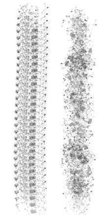图 11-5。左：我们使用 GIMP 默认画笔动态的新画笔。右：相同的画笔，GIMP 的画笔动态设置为随机化画笔的大小和旋转。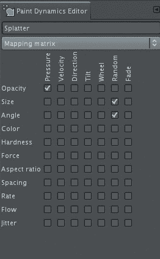图 11-6。画笔动态编辑器，这里显示的是我那种脏乱画笔的动态设置。勾选映射矩阵中的框，能够让对应列的变量影响对应行中的画笔属性。

## 为蝙蝠生物纹理绘制

我希望纹理能够让蝙蝠生物看起来像夜晚的生物：斑驳的紫色皮肤和变色的指甲，配上额外的皱纹、雀斑和静脉，以便在我雕刻的基础上添加更多细节。为了实现这一点，我将纹理分阶段构建，首先是基本颜色的填充，然后平滑并精炼这些颜色，最后添加细节。

我首先在 Blender 的纹理绘制模式下涂抹了一些平面颜色。然后，我保存了工作并将其打开在 GIMP 中进行更精细的纹理处理——例如，我将绘制的纹理贴图与我在第十章中烘焙的环境遮蔽图合并。然后，我使用 GIMP 来调整和补充漫反射纹理，以创建镜面反射和硬度纹理。

为了开始确定我的颜色，我进入了编辑模式，并为蝙蝠生物的网格分配了一个新的空白图像（这个网格用于第十章中的纹理烘焙，而不是高分辨率的雕刻网格）。新的纹理对话框允许我们选择填充新图像的颜色，所以我将其设置为一种柔和的粉紫色——一种适合夜间生物的、不健康的皮肤颜色。

接下来，我在 UV 图像编辑器中为我的纹理建立了一个整体的色彩调色板，选择了一个未映射到网格任何部分的空闲空间（参见图 11-7）。我为阴影区域选择了一种较深的紫色，比如眼睛下方的区域；为骨骼区域选择了一种较浅的黄色调；为静脉和血流丰富的区域选择了一种深而饱和的红色；以及为原始基色的阴影和高光区域选择了较深和较浅的版本。（我们并没有在纹理中绘制光照，我说的是不同区域的皮肤颜色深浅变化。）我还选择了一种浅的对比色来作为一些区域的高光。我在我的图像上涂抹了一点这些颜色，以便以后可以从中选取颜色，供在 UV 图像编辑器或在 3D 视图中绘画时使用。

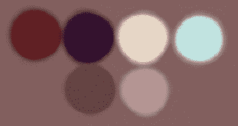图 11-7. 选择一些初始颜色来为蝙蝠生物的皮肤上色，可以使得返回到相同的颜色变得更加容易，并且保持一致的色彩调色板。

### 绘画的材料和用户界面设置

在纹理绘制模式下，Blender 默认会将你正在绘制的纹理应用到你的网格上，并在 3D 视图中显示，使用的是 Blender 默认的实心着色方式。然而，和雕刻一样，我们可以通过在场景中添加简单的灯光（更多灯光内容见第十三章）以及为网格添加简单的材质（更多材质内容见第十二章）来使用 Blender 的 GLSL 着色模式，以不同的方式显示纹理。

对于蝙蝠生物，我给蝙蝠物体添加了一个简单的材质，命名为*Body_TexturePaint*。在属性编辑器的纹理选项卡中，我为该材质添加了一个新的纹理，将其类型设置为图像，选择了我已经分配给物体 UV 的绘制图像，并将纹理的映射类型设置为 UV。

#### 添加光源

为了在 GLSL 阴影模式下使物体可见，我们需要添加光源，所以在对象模式下，我创建了一个新的 Hemi 灯来照亮我的物体。切换到纹理视口模式（确保在属性面板的显示区域中将阴影设置为 GLSL），我可以看到光源只从上方照亮了蝙蝠生物，因此我复制了这个灯并将其旋转了 180 度，从下方照亮物体。接下来，我将新复制灯光的强度减少到大约 0.3，在灯光的对象数据选项卡中进行设置，以便在物体上下的光照之间留有一点差异。我还关闭了灯光的镜面反射组件（见图 11-8），这样我的网格就不会显得过于光亮。

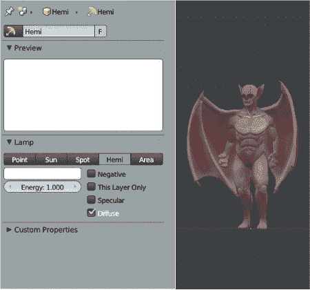 图 11-8. 添加简单的灯光和材质，使得在 GLSL 模式下进行纹理绘制更为容易。在这里，我添加了几个 Hemi 灯，并开启了 GLSL 阴影模式。

### 注意

*如果你发现 Blender 中的绘制变得迟缓，可以通过复制雕刻过的网格并在较低的级别应用 Multires 修改器来创建一个低分辨率的网格进行绘制。由于这个低分辨率的网格与高分辨率网格共享相同的 UV 坐标，你可以在其上绘制并稍后将纹理应用到高分辨率模型上。*

#### 在 Blender 中铺设基本纹理

现在，我可以开始在我的模型上铺设一些基本纹理了。在纹理绘制模式下使用标准画笔，我从 UV 图像编辑器中的调色板中取样，然后在 3D 视口中在模型上绘制。

我开始时利用解剖学特征作为颜色指导，将骨骼区域做得较亮并偏黄色；凹陷区域，如眼睛，做得较暗并偏紫色；背部则做得较暗。我将血流较多或皮肤较薄的区域，如翅膀和耳朵，涂上更红的颜色，并稍微用较亮的颜色突出了一些躯干和腿部的肌肉。我在 Project Paint 中开启了 Occlude 功能，但关闭了 Normal 和 Cull 功能，因为这些设置允许你即使在侧面角度下，也能平滑地绘制网格。在这个阶段，目标仅仅是大致确定你想要的颜色。

#### 切换到 GIMP

在我布置好基础色彩后，我需要更高级的绘画工具来开始混合颜色并添加细节。因此，是时候转向 GIMP 了。我将纹理保存在 Blender 中，作为一个 *.tga* 图像（在 UV 图像编辑器中按 F3 保存当前图像）。然后，我将保存的图像加载到 GIMP 中，开始清理并平滑我在 Blender 中绘制的颜色，修复伪影并填补不自然的区域。这个过程最好使用画笔工具，选择一个相对较大、柔软的画笔，通过简单地取色（按住 CTRL 并点击，无需切换到其他工具）来混合颜色和区域（见 图 11-9）。 （另一种混合颜色的方法是使用涂抹工具和一个看起来有些脏的画笔，比如我们在本章前面创建的那种，用来在两个区域之间来回涂抹，混合它们的颜色。）

为了给我的纹理添加细节，我使用了我在第十章中烘焙的环境光遮蔽图。通过文件▸以图层打开，我将烘焙的环境光遮蔽图作为新图层加载到我绘制的纹理上方。

我对这个图层进行了一些清理，就像我对粗略的漫反射颜色所做的那样。为了清理，我使用了 GIMP 的画笔和取色功能，使用画笔工具融合看起来不自然的区域，或者使用克隆工具在保留纹理的同时填补空白区域。

### 图层模式和不透明度

最初，我们的环境光遮蔽图作为普通图层导入，完全覆盖了纹理。为了解决这个问题，我们可以使用 GIMP 的图层混合模式，找到一种更合适的方式将两者融合。

GIMP 的图层对话框显示了图像中的每个图层（见图 11-10。"），其中选中了环境光遮蔽图层并将其混合模式设置为“正片叠底”）。在对话框的顶部，有一个下拉菜单允许你选择所选图层的混合模式。不同的混合模式有不同的效果：*正常*模式将一层叠加在另一层上，*正片叠底*将两层中每个像素的值相乘，*加法*将它们相加。叠加模式会根据图层的值使下方的图层变亮或变暗——深色值会使区域变暗，浅色值会使区域变亮，而中灰色则没有效果。在组合图像时，尝试各种图层模式，以找到最适合的模式。为了将环境光遮蔽图与我的绘制颜色合并，我将模式设置为“正片叠底”。

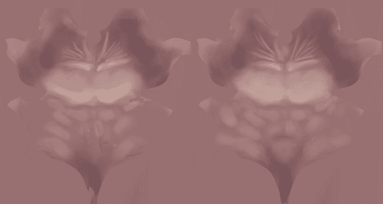图 11-9. 在 GIMP 中清理我们的纹理：在 Blender 中粗略绘制的纹理部分（左）；在 GIMP 中合并和绘制后的区域（右）图 11-10. GIMP 的图层对话框。顶部，模式和不透明度设置图层混合模式和不透明度。下方是锁定图层颜色和透明度的选项。每个图层都有切换其可见性和链接图层的选项（这样它们在移动、缩放或旋转时保持对齐）。

你可以通过图层的不透明度设置控制一个图层与另一个图层的混合程度（见图 11-10）。由于我的环境光遮蔽层使底层纹理变得非常暗，因此我将其不透明度降低到大约 40%。环境光遮蔽层在此不透明度下的效果，如图 11-11 中左上所示。

#### 调整颜色

GIMP 提供了多种工具来处理图像的颜色，既有丰富的滤镜，也有**颜色**菜单中的多种选项。例如，你可以调整图像的曝光度、色调和饱和度，使用曲线或滑块调整每个通道的亮度，还有许多其他选项可以使用。

目前，我们的蝙蝠生物纹理看起来相当灰，因为黑白的环境光遮蔽纹理叠加在其上。为了解决这个问题，我们可以调整环境光遮蔽层的曲线，加入更多的红色，使阴影更加饱和且偏红。为此，按照以下步骤操作：

1.  在选中环境光遮蔽层后，选择**颜色**▸**曲线**，此时会弹出曲线对话框。

    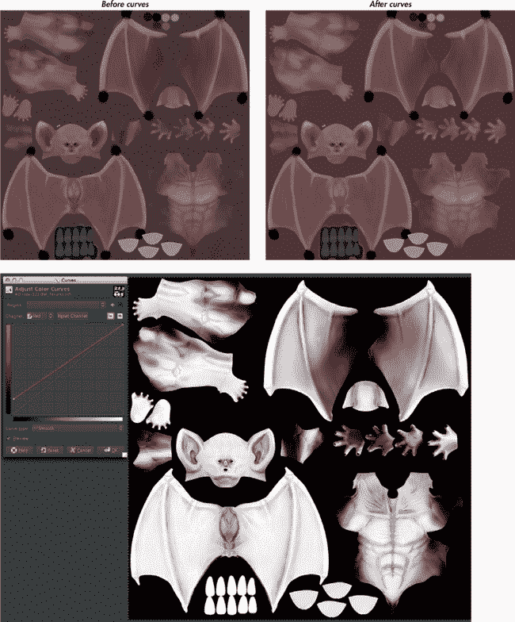图 11-11. 将环境光遮蔽图层融入我们的纹理中。左上：环境光遮蔽纹理以 40%不透明度叠加在粗糙的漫反射纹理上，未做任何修改。下方：使用曲线工具调整环境光遮蔽图层的颜色，使其更偏红。右上：将偏红的环境光遮蔽图层以 40%不透明度叠加在漫反射纹理上。

1.  这让你可以通过曲线函数修改图像中每个通道（红色、绿色、蓝色和透明度）的值。

1.  要在图像的暗部添加红色，选择通道下拉菜单中的红色通道，抓住曲线的左下角点并将其向上拖动（见图 11-11，下方）。

1.  点击**确定**以应用曲线，现在环境光遮蔽图像为皮肤提供了漂亮的饱和裂缝和阴影区域（见图 11-11，右上）。

#### 保存并导出回 Blender

纹理还没有完成，但重要的是要经常保存，做到这一点可以帮助我们查看当前在 Blender 中的工作进度纹理效果。GIMP 区分保存（CTRL-S）为其本地的 *.xcf* 格式，这会保留图层和其他信息，以及将图像导出为其他格式，如 .*jpg* 或 .*tga*（CTRL-E）。我们需要做两者，这样就可以保留包含所有图层的 GIMP 文件以便进一步编辑，同时又能得到一个可以在 Blender 中使用的图像。

首先，我将图像保存为 *.xcf* 文件，然后将其导出为 *.tga* 图像。为了在 Blender 中打开此图像，我选择了我的 Bat Creature 对象，切换到编辑模式，在 UV 图像编辑器中，使用“图像▸替换图像”将旧的、粗略绘制的纹理替换为新的纹理。（记得也要为材质做这一步——不过如果你对网格应用的纹理使用了相同的图像，它应该会自动更新。）接下来，你应该能看到更新后的纹理应用在网格上。你现在可以在 Blender 中继续绘制，但我选择暂时留在 GIMP 中。

#### 添加细节

回到 GIMP，随着我们的环境光遮蔽效果与手绘纹理搭配得很好，我们可以开始添加更多的细节。我使用了手绘和摄影纹理的混合方式。

首先，使用照片建立一些纹理是非常方便的，然后通过手绘调整和补充现有的纹理。为此，我从 CGTextures 上获取了一些大象皮肤的照片，照片中的褶皱和皮肤纹理与我的纹理非常契合。我将它们作为图层打开到我的纹理图像文件中，并将它们缩放到纹理中的褶皱比例大致与蝙蝠生物的褶皱相匹配。

我使用移动工具（Move tool）将纹理分布到我的图像上，知道它们的精确位置暂时并不重要。接着，我创建了一个新图层（SHIFT-CTRL-N 或者在图层菜单中选择 Layer▸New Layer），并将其混合模式设置为叠加（Overlay）。然后，我通过在图层对话框中上下拖动图层的图标，将它放置在原始的颜色纹理和环境遮挡（Ambient Occlusion）图层之间。

使用克隆工具（**C**），我首先设置克隆源（CTRL-点击）为其中一个皮肤纹理，确保它在图层对话框中已被选中。接着，我切换到我的新图层，开始在不同的区域克隆皮肤纹理（参见图 11-12）。我频繁切换不同的皮肤纹理，寻找适合生物皮肤不同部位的区域。我还使用翻转（SHIFT-F）和旋转（SHIFT-R）工具来翻转和旋转皮肤图像，以查看它们在不同方向下是否效果更好，然后再进行克隆。为了处理被皮肤图像遮挡的区域，我使用图层对话框中的眼睛图标切换它们的可见性，或者简单地用移动工具将它们移到一边。

在从照片图像建立了第一层细节后，我隐藏了照片纹理，并开始绘制一些手绘细节（参见图 11-13）。首先，我在一个新图层上使用画笔工具和柔边刷子给翅膀上添加了一些血管。接着（在另一个新图层上），我在肩膀、太阳穴和背部等区域添加了一些斑点，使用了深色和浅色的组合。我之前使用的脏刷（Grunge brush）非常适合这种效果，将刷子的间距（在画笔对话框中设置）调高一些就能达到很好的效果，另外一个简单的小硬边画笔也能很好地用来绘制特定的斑点。将不同种类的细节放在不同的图层上，使得它们可以以不同的方式混合和组合，而且在创建镜面和其他类型的贴图时也非常方便。

#### 指甲和牙齿

蝙蝠生物的指甲和牙齿与身体在同一个 UV 图中。对于指甲，我涂上了深紫色，并加入了一些较亮的黄色高光。对于牙齿，我使用了黄色，并在牙齿与牙龈接触的地方加了些许棕色，如图 11-14 所示。

 图 11-12. 使用克隆工具从照片中克隆纹理。我将照片添加为新图层；然后，在另一个新图层（设置为叠加模式）上，我从照片中克隆出一些皮肤细节以加入到我的纹理中。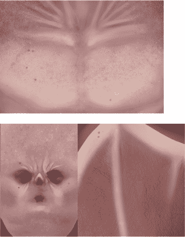 图 11-13. 一些手绘细节的特写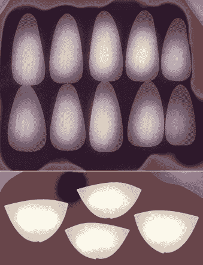 图 11-14. 指甲和牙齿

### 修复接缝

当我的皮肤纹理细节做得很到位时，我回到 Blender 中检查它的效果是否正常，然后开始修复纹理中的任何接缝。为此，我将我的皮肤纹理从 GIMP 导出，并用新导出的版本替换 Blender 中旧的皮肤纹理。

在 UV 接缝处，纹理中肯定会出现一些伪影，尤其是在我使用 GIMP 涂抹过 UV 岛的边缘时。要修复这些伪影，可以使用 Blender 的快速编辑功能：

1.  要修复模型某个部分的接缝，将 3D 视图调整到接缝清晰可见的角度。

1.  为了确保屏幕上没有可见的阴影，将视点显示模式设置为**GLSL**，并在属性编辑器的材质选项卡中将材质设置为**无阴影**。

1.  在纹理绘制模式下，将快速编辑分辨率设置为**1024**，然后从工具架中点击**快速编辑**（参见图 11-15 2)）。这会在 GIMP 中打开该视角的截图，我们可以开始在上面进行涂抹。

1.  为了获得最佳效果，在 GIMP 中放大截图，使用**图像**▸**图像大小**，将新大小设置为**2048**。然后，创建一个新的透明图层，我们将在上面修复接缝（原因稍后会解释）。

1.  使用**克隆**工具，从下方的图层开始克隆，覆盖接缝；使用脏乱刷的形状效果很好。（在工具选项中打开**合并取样**，可以在设置源时从所有图层进行取样，而不必先切换图层。）

1.  在接缝涂抹完成后，禁用原始图层，仅保留覆盖接缝的新增涂抹图层。使用 CTRL-E 导出图像，并覆盖从 Blender 导出的原始图像。

1.  回到 Blender，点击**应用**将涂抹后的图像应用到你的纹理上（参见图 11-15 4）。因为你只保存了覆盖接缝的区域，所以只有这些区域被替换。对于模型上的其他接缝，重复这个过程，然后将修复后的新纹理保存为新图像。

#### 合并修复接缝和分层图像

这个过程修复了我的接缝，但因为我在 Blender 中修复了纹理，结果只得到了一个单层图像。为了恢复到分层格式，我将修正后的图像作为新图层打开到我的纹理文件中，放在其他图层之上。我希望尽可能保留我的旧图层可见，因此需要给这个图层加上蒙版，只在修复接缝的区域显示。为了实现这一点，请执行以下操作：

1.  在图层对话框中，将新修复图层的混合模式设置为**差异**。这个混合模式的结果是该图层与下方像素的颜色差异，这意味着不同区域看起来很亮，而未改变的区域保持黑色。总体来说，结果可能看起来非常暗，因为差异很小，但你很快就能解决这个问题。你可以将此结果作为蒙版的基础，显示新图层中仅修复的部分。

1.  在图层对话框中右键点击顶部图层并选择**从可见图层创建新图层**。这将创建一个新的图层，它是下方所有图层的合成，合并为一个。在我们的案例中，这就是修复图层与原始图层之间的差异。使用“色阶”工具（**颜色**▸**色阶**），你可以增加这个图层的值，从而创建我们可以作为蒙版使用的东西。色阶工具将当前图层作为输入，并使用你提供的设置来调整图层的值。你只需要将所有不是 100%黑色的像素——即修复图像与原始图像不同的区域——变成白色。为此，将输入渐变的右端点拖动到接近左端（参见图 11-16），然后点击**确定**。

1.  结果可能看起来有些噪点并且颜色奇怪，但颜色并不重要，因为我们将仅使用该图层的亮度作为蒙版。为了平滑效果，可以使用高斯模糊滤镜（**滤镜**▸**模糊**▸**高斯模糊**）将图层模糊大约 10 像素。

1.  接下来，复制这个新的合并图层，并将其用作修复过的纹理的蒙版。按 CTRL-A 全选，然后按 CTRL-C 将图层复制到剪贴板。

    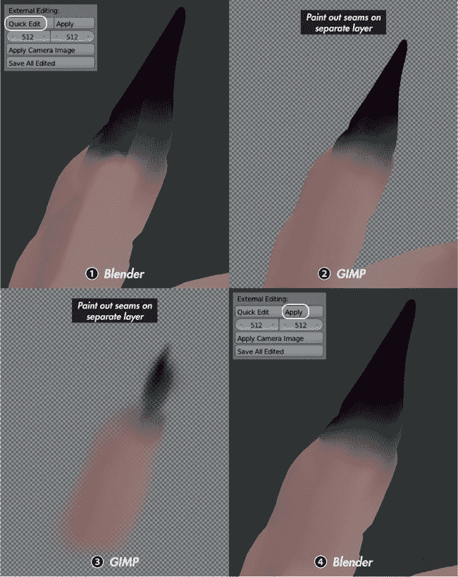图 11-15. 导出截图以便在 GIMP 中进行快速编辑：Blender 中的接缝区域 1；从 Blender 导出到 GIMP 进行快速编辑并在新图层上绘制 2；单独的新图层，将覆盖原始导出的图像 3；导出的图像应用于纹理，返回 Blender 使用应用操作符 4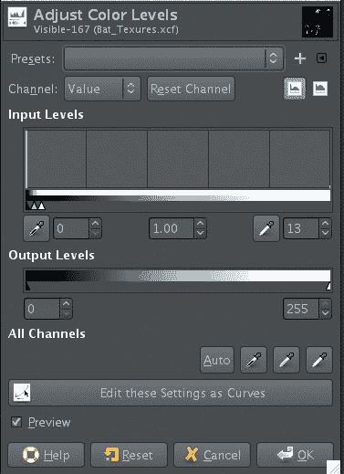图 11-16. 使用色阶工具调整图层的值。注意输入级别的滑块如何集中在图表的左侧，以便将除最暗值之外的所有亮度增加为白色。

1.  在图层对话框中禁用合并层的可见性，并将固定图层的混合模式恢复为**正常**。然后，为了向固定图层添加图层蒙版，右键点击它并选择**添加图层蒙版**。选择白色作为图层蒙版的颜色，然后点击**添加**来创建它。

1.  按 CTRL-V 将我们从合并层创建的蒙版粘贴为“浮动”层——你可以继续在其上工作并移动，直到固定它并将其应用到你粘贴它的图层上。由于我们不需要对其进行任何更改，按 CTRL-H 将其固定。

我们的固定图像现在已经被蒙版处理，这样只有与原始纹理不同的区域会显示在下面的层上。这基本上完成了我们漫反射纹理的创建（参见图 11-17），所以请将图像保存为*.xcf*文件，并导出一个新的*.tga*漫反射纹理图像。

### 图层蒙版

*图层蒙版*是一个黑白图像，用于确定 GIMP 中一个图层如何与下面的图层混合。如果图层的整体不透明度为 100％，则白色区域会完全显示（否则两者会相乘），黑色区域会被完全遮罩，介于两者之间的值会在两个极端之间混合。

当你给图层添加蒙版时（如上所示），它会出现在图层缩略图的右侧。在图层对话框中点击其缩略图，你可以像在正常图层上那样对其进行绘制（只不过它只能使用黑白值，因此不能使用处理 RGB 颜色的工具和滤镜）。

点击图层的缩略图以返回到正常绘画模式（活动图层或蒙版的缩略图会被白色轮廓框住）。你可以通过右键单击图层并选择**应用图层蒙版**来应用图层蒙版的效果。这将把蒙版应用到图层本身，使蒙版区域变为透明。

### 创建镜面反射和硬度纹理

在我们的漫反射纹理绘制完毕且接缝清理好之后，是时候创建我们的镜面反射和硬度纹理了。*镜面反射纹理*定义了我们生物镜面反射的颜色和强度：暗区看起来会是哑光的，亮区则会显得光滑。*硬度贴图*决定了高光的软硬程度：低值创建柔和、扩散的反射，而高值则创建更小、更强烈的高光。

为了创建这些纹理，我们可以复制并修改漫反射贴图的图层。我们将在同一个 GIMP*.xcf*文件中创建这些纹理，这样我们就能方便地访问已经创建的图层。

### 图层组

为了更方便地管理创建镜面反射和硬度纹理，我使用了*图层组*来组织我的图层。图层组允许你将图层分组，并在图层对话框中展开和折叠这些组，从而使得保持整洁变得更加简单。要创建图层组，右键点击图层对话框中的一个图层，然后选择**新建图层组**，或者点击对话框底部的文件夹图标。然后，你可以将其他图层拖动到该组图层上，将它们分配到该组。为了组织我的蝙蝠生物的纹理，我创建了三个图层组：一个用于漫反射纹理，一个用于镜面反射纹理，另一个用于硬度纹理（参见图 11-18）。

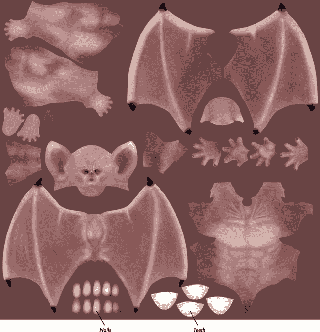图 11-17. 完成的漫反射纹理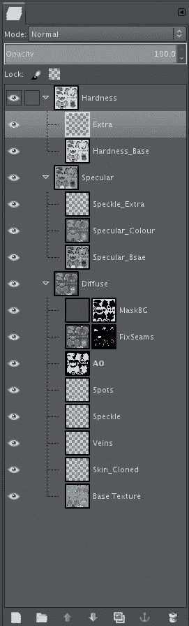图 11-18. 使用图层组组织图层

#### 镜面反射贴图

对于镜面反射贴图，我首先从可见图层创建了一个新图层（图层▸从可见图层新建），并将其放入镜面反射贴图的图层组中。我反转了纹理的颜色（颜色▸反转），然后调整了色阶（颜色▸色阶），使图层的对比度更强。接着，我使用颜色▸色相和饱和度更改了图层的颜色，并将色相滑块调整为蓝色调（参见图 11-19 中的第 3 步）。虽然这已经产生了一个相当不错的镜面反射纹理，但为了获得更多的变化，我复制了之前为漫反射贴图创建的、带有斑点和污渍的图层，并将它们放入镜面反射贴图的图层组中，适当调整了它们的颜色。

接下来，我开始调整一些区域，以获得正确的镜面反射度。例如，我希望嘴唇和眼睛周围的区域看起来湿润且闪亮，而希望躯干和手臂看起来更为哑光和干燥。我本可以开始使用基础画笔进行绘制，但那样会失去我已经制作好的许多纹理。相反，我使用了不同的画笔模式，从而能够保留一些纹理。画笔模式可以从工具选项对话框中设置。画笔模式具有与图层混合模式相同的选项（正常、正片叠底、加法等）。一种不失细节地调整图像值的好方法是使用画笔模式设置为“叠加”并使用黑色来加深区域，使用白色来提亮区域。

在某些区域，我希望保留一些纹理，同时去除非常暗或非常亮的值，这时“仅变亮”和“仅变暗”画笔模式非常有用。我使用了“仅变暗”模式，并选取了一个中间色值，以去除过于明亮的区域，同时保留纹理的较暗部分，反之亦然。图 11-20 展示了完成的高光纹理。

#### 硬度图

为了创建硬度纹理，我首先从漫反射纹理中创建了一个“从可见层”新建的图层。（你可以关闭高光纹理图层组的可见性，以便重新显示漫反射纹理。）接着，我反转了图层，调整了色阶，并开始像上面那样使用画笔工具手动微调。由于硬度纹理需要更多的变化，我创建了一个新图层，并在身体上画上更多的斑点（包括较亮和较暗的部分）。图 11-20 同样展示了完成的硬度纹理。

### 纹理绘制眼睛

完成大部分纹理绘制后，我开始绘制眼睛的纹理。为此，我创建了一张新的图像，并按照以下步骤手工绘制：

1.  创建一个 1024×1024 像素的新图像（**文件**▸**新建图像**）。接下来，为了获得眼睛的中间位置的参考线，创建两条通过图像中点的参考线，分别是水平和垂直的。操作方法是点击**图像**▸**参考线**▸**按百分比新建参考线**。为了为瞳孔放置创建参考线，重复这个操作一次，分别为垂直参考线和水平参考线，每条参考线的位置在图像高度或宽度的 50%。

1.  用黄色调填充第一层，然后为虹膜创建一个新图层。为了得到正确的形状，使用**椭圆选择工具**（**E**），从图像中心点击并拖动绘制一个圆形。按住 CTRL 键时，选择区域从中心开始扩展，按住 SHIFT 键时，选择区域会限制为正圆形。

    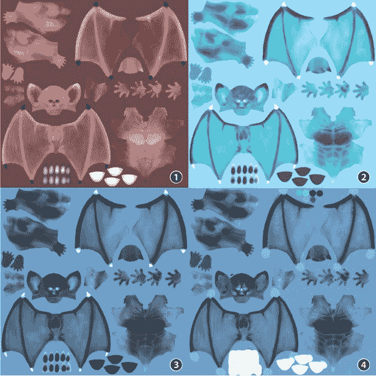图 11-19. 通过调整漫反射贴图来创建高光贴图：漫反射贴图 1；反转颜色 2；调整色阶、色调和饱和度 3；并画上额外细节 4。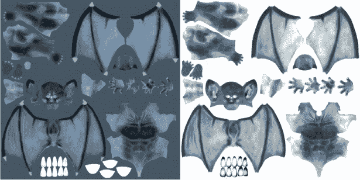图 11-20. 完成的高光纹理（左）和硬度纹理（右）

1.  画出虹膜外圈的圆形轮廓，然后从虹膜选择的中间减去瞳孔的形状（按住 CTRL 键后点击并拖动）。这次，我创建了一个椭圆形状，使眼睛看起来更具邪恶感。

1.  使用**羽化**（**选择**▸**羽化，20 像素**）选区，使虹膜与眼睛其他部分之间有更渐变的过渡。然后，通过右键点击图层面板中的图层，选择**添加图层蒙版**，并在**初始化图层为**中选择**选区**，将选区转换为图层蒙版。这会创建一个带有选区的图层蒙版，让你可以直接在图层上绘画（首先在图层面板中选择它），而不丢失虹膜的形状（请参见图 11-21）。

1.  使用**填充**工具将虹膜填充为黑色，然后使用**画笔**工具和一个大而柔软的画笔添加颜色。我从亮橙色开始，然后加入了红色、绿色和紫色的元素，以叠加不同的颜色（如果你使用的是平板，使用低压力，或者将画笔的不透明度设置为低）。我把虹膜的边缘保持为黑色。

1.  现在，在虹膜下方的图层上添加眼睛外部（*巩膜*）的颜色。我在这里涂上了较浅的黄色，并将其与较深的红棕色混合。我还在这个图层上将瞳孔填充为黑色。我的眼睛纹理现在看起来像图 11-21。我将此纹理保存为*.tga*文件。

### 注意

*因为我决定在纹理中稍微改变瞳孔的形状，所以我也通过选择瞳孔的顶点并在 Z 轴上放大它们，调整了模型中瞳孔的形状。我也稍微调整了 UV 映射（请参见图 11-22）。*

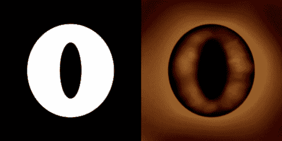图 11-21。使用椭圆选择工具（左）和眼睛纹理（右）创建的虹膜遮罩！调整瞳孔以适应纹理。左：调整后的 UV 坐标。右：应用纹理后的编辑模式下的眼睛。图 11-22。调整瞳孔以适应纹理。左：调整后的 UV 坐标。右：应用纹理后的编辑模式下的眼睛。

## 丛林神庙的纹理制作

丛林神庙场景的纹理需要一种不同的方法。这个项目有许多需要相似纹理的物体，因此单独为每个物体制作纹理既耗时又不必要。相反，我选择使用可平铺的无缝纹理来覆盖场景的大部分区域，并在关键位置增加一些细节。可平铺纹理允许同一纹理跨多个模型使用。

### 硬度与粗糙度

对于蝙蝠生物，我创建的纹理类型之一是硬度纹理，它将用于定义我的材质在哪些区域具有锐利、小的镜面反射，哪些区域则有模糊、更加扩散的镜面反射。为了定义这些区域，纹理被映射到材质镜面着色器的硬度值上。纹理的暗色区域产生柔和、模糊的镜面反射，亮色区域则产生锐利、硬的镜面反射。

然而，这仅在 Blender Internal 渲染时适用。在使用 Cycles 渲染时，材质的创建方式不同（正如我们在第十二章中将看到的）。而且，镜面着色器现在不再使用硬度值，而是使用所谓的*粗糙度*值。这与硬度值的作用相反，但大致定义的是相同的东西。对于粗糙度纹理，亮色区域表示柔和、模糊的反射，暗色区域则表示锐利的反射。创建纹理时，请记住这一点。

### 使用 GIMP 创建无缝纹理

为了创建一个无缝的纹理，图像的边缘必须对齐，并且图像的特征必须在边界处平滑地延续下去。确保纹理没有在拼接时重复得过于明显是很重要的（大的、独特的特征在频繁重复时容易被注意到）。我们还希望将图像做成正方形，这样在应用无缝纹理时就不需要缩放物体的 UV 坐标。

为了为墙壁和地板的石块创建一个无缝的岩石纹理，我从 CGTextures 开始使用了一张岩石纹理。首先，我使用“图像▸画布大小”将图像的大小增大，使其变成正方形。接着，我使用“图层▸添加 Alpha 通道”给图层添加透明背景，稍后我们会填充它，并使用“图层▸图层大小与图像大小匹配”将图层的大小调整为与图像一致。

现在我们需要填充图像的其余部分，并使其边缘相互对齐。为此，我使用了“偏移”工具和“重合成”滤镜。首先，我在* x *轴和* y *轴上将图像偏移了 50%（图层▸变换▸偏移），选择了 x/2 y/2 选项并点击了“偏移”。这将图像移动并重复，使得边缘对齐，如图 11-23 中所示。在偏移之前，图像的边缘就已经处于图像的*中间*位置，所以新的边缘已经对齐。

为了修复边缘交汇处的区域，我使用了 GIMP 的 Resynthesize 功能来无缝填充选定区域。为了创建选区，我使用了 GIMP 的快速遮罩功能（CTRL-Q）直接用 GIMP 的画笔工具绘制选区。涂成白色的区域是选中的，而涂成黑色的区域是未选中的。在快速遮罩模式下，图像会以红色突出显示，但选中的区域将保持正常显示。我按下 CTRL-Q 启用快速遮罩，然后粗略地在图像边缘交汇的缝隙处涂上一条白色的条纹，并填补中间留下的空隙。接着，我再次按下 CTRL-Q 将我的快速遮罩转换为选区。

接下来，我使用了“滤镜”▸“映射”▸“Resynthesize”来填充选定区域。我打开了“使水平可平铺”和“使垂直可平铺”选项，并将纹理源设置为当前层。运行滤镜后，我再次以不同的偏移量（每个方向三分之一）偏移图像，并重新合成任何剩余的问题区域。最终结果是右侧显示的纹理，如图 11-23 所示。这个纹理现在可以无缝平铺了。

#### 测试纹理

测试纹理时，在 GIMP 中创建图像的副本（CTRL-D），并将其缩小（例如，缩小到 512×512）。然后，使用 **滤镜**▸**映射**▸**平铺** 来创建纹理的平铺版本。如果有任何区域显示出明显的重复，返回到原始纹理并选择并重新合成任何问题区域。直到你对纹理的平铺效果满意为止，保存为 *.tga* 文件。

在 Blender 中测试你的纹理，选择一个物体，然后在 UV 纹理编辑器中将图像分配给它。切换到 **纹理视口** 着色模式，并在属性区域的显示面板中将着色类型设置为 **多纹理**，这样你就可以看到分配给物体的图像了。你可能需要调整 UV 坐标的比例，或者稍微调整纹理，以获得最佳效果。

#### 创建额外的纹理

我重复了制作无缝纹理的过程，创建了第二种岩石纹理、树木的树皮纹理和地面的泥土纹理，如你在图 11-24 中看到的那样。我还使用相同的技术制作了高光贴图，以修改和补充我为蝙蝠生物使用的漫反射贴图。对于树皮纹理，我没有制作正方形纹理，因为我需要将其包裹在树干上。相反，我选择了一个窄而高的纹理。这使得纹理空间的使用更加高效，因为该纹理将在树干的长度上重复多次，而在树干的周长上仅重复一次。

为了使不同的纹理——比如两种岩石纹理——更好地融合在一起，你可以使用 GIMP 的色相-饱和度和曲线工具。通过调整图像的色相和饱和度，你可以使其中一种纹理的整体颜色更接近另一种纹理，而通过使用曲线工具，你可以调亮或调暗图像，使两种纹理的值范围更为相似。例如，图 11-24 中的两种岩石纹理最初有很大的颜色和亮度差异，但我进行了调整，使它们看起来更相似。这样，在创建更多纹理和材料时，后续融合这两种纹理会变得更加容易。

### 地面和树木的纹理

为了为我的场景中的地面和树木创建纹理，我大量使用了 Blender 的投影绘制工具，将我在 GIMP 中创建的无缝纹理混合在一起。这种方法使我能够通过使用已经创建的通用平铺纹理作为起点，快速构建出更独特的纹理。

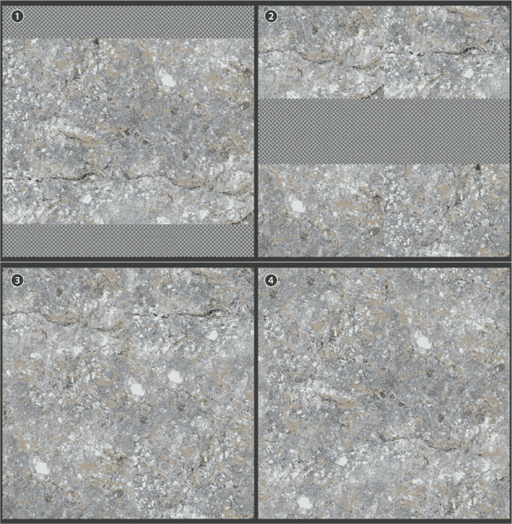 图 11-23. 制作无缝图像：增加画布大小使其变为正方形 1；偏移图像 2；使用重新合成滤镜填补空白并修复接缝 3；重新偏移检查纹理并重新合成任何问题区域 4。

#### 地面纹理

尽管我现在已经有了一个无缝的地面纹理，但它并不是特别独特或针对场景量身定制的。为了创造一个更有趣的地面纹理，我决定将现有的无缝纹理投射到一个独特的展开纹理上，并为其添加一些额外的细节。为了完成这一点，可以按以下步骤操作：

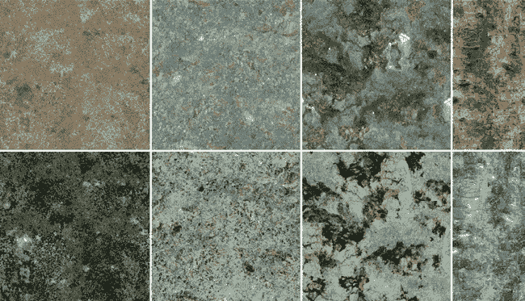图 11-24。丛林神庙场景的无缝纹理，从左到右：土壤、两种岩石纹理和一款树皮纹理。顶部纹理是漫反射图，底部纹理是高光图。

1.  创建第二组 UV 坐标，展开地面网格以尽可能填满新的 UV 空间。然后，向新 UV 集添加一个新的空白图像。

1.  使用**克隆**工具克隆无缝纹理。我将无缝土壤纹理设置为旧 UV 坐标的图像，然后选择了我的新 UV 集。

1.  在纹理绘制模式下，使用**克隆**刷将无缝纹理克隆到新的展开图上。（确保在项目绘制选项中也开启了克隆，并且将旧的 UV 贴图设置为克隆的来源。）

1.  要混合第二个纹理，将旧的 UV 坐标集图像替换为不同的土壤纹理，然后重复克隆过程，这次只添加一些小的斑块。

1.  最后，重复这个过程，使用苔藓岩石纹理为地面添加一些石块斑块。最终的纹理更加独特和多样，如图 11-25 所示。

#### 树木纹理

要修改树木的纹理，我从无缝的树皮纹理开始，然后加入了苔藓和泥土元素，使纹理更有趣（见图 11-26）。不过这一次，我在 Blender 中投射了第一个无缝纹理，然后保存图像，切换到 GIMP，添加了其他照片中的元素。这让我能够使用不同的画笔，将不同图像的部分拼接在一起，并在工作时将纹理分层。然后，我从漫反射图中创建了树木的高光和粗糙度贴图。

### 塑像纹理

对于丛林神庙场景中的雕像，我希望那些比较隐蔽的部分看起来像被苔藓覆盖并生长繁茂，而暴露的部分则是裸露的岩石。为了实现这一点，我本可以手动克隆苔藓区域，但我选择了使用我之前烘焙的环境光遮蔽图，它在缝隙处本来就更暗，作为遮罩。

在 Blender 中实现这个效果，我复制了雕像的 UV 坐标集，并将环境光遮蔽纹理分配给它。然后，我使用这个 UV 集作为遮罩层，克隆苔藓纹理到岩石纹理上，具体步骤如下：

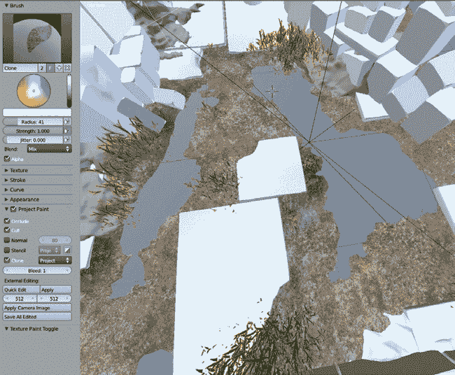 图 11-25. 将无缝纹理投影到独特的纹理图上，以便将它们结合并创造出独特的效果。这里，我正在使用克隆刷从无缝纹理克隆到我的独特 UV 图上。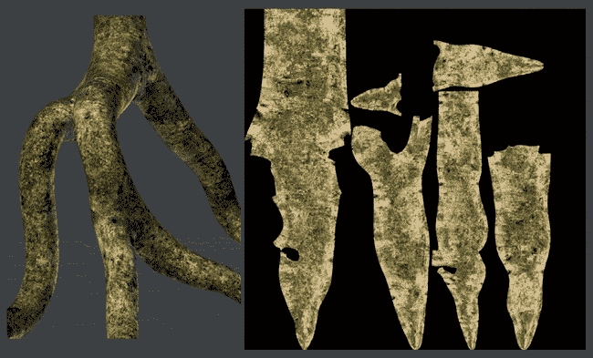 图 11-26. 给树木上纹理。我从一个无缝的树皮纹理开始，然后在 GIMP 中将其他纹理融合进来。

1.  在属性编辑器的 Object Data 选项卡中的 UV 坐标面板中，通过点击+图标将原始 UV 图重复两次。重命名每个集，以便你知道哪个是哪个。对于我的集，我选择了*Paint*作为最终的涂绘纹理，*Mask*作为我的遮罩图像，和*Cube*。我会使用 Cube UV 集来投影我的无缝纹理，所以我在编辑模式下使用**Cube Project**选项重新展开了雕像，以便为模型的各个部分提供一致的展开效果。

1.  将你的无缝岩石纹理分配到 Cube UV 集上，并调整比例以适应岩石的细节。然后，切换到你的 Paint UV 集，并使用**克隆**工具（确保在 Project Paint 面板中启用了克隆功能）将岩石纹理从 Cube 项目 UV 集克隆到涂绘纹理上。

1.  要混合第二个纹理，使用 Project Paint 的**模板**选项。切换到编辑模式并将环境光遮蔽图分配到 Mask UV 集，通过在属性编辑器的 Object Data 选项卡中选择**Mask UV**集。然后，将不同的岩石纹理分配到 Cube UV 集，但这次使用的是覆盖苔藓的岩石纹理。

1.  现在返回到在 Paint 图层上的纹理绘制（再次在属性编辑器中选择它作为活动的 UV 集）。在项目绘画面板中打开**模板**，从旁边的下拉菜单中选择你的遮罩 UV 集。然后，使用**克隆**刷，在原始纹理上绘制第二个岩石纹理。刷子的效果会根据环境光遮蔽图自动进行遮罩，允许你仅在暴露区域上轻松绘画，如图 11-27 所示。

在将结果图像保存为*.tga*文件后，我在 GIMP 中使用环境光遮蔽图，通过打开涂绘的纹理并将环境光遮蔽图覆盖在其上（使用“作为图层打开”）。将环境光遮蔽图的混合模式设置为“叠加”并减少其不透明度，微妙地提亮了雕像的暴露区域并加深了裂缝，如图 11-28 所示。

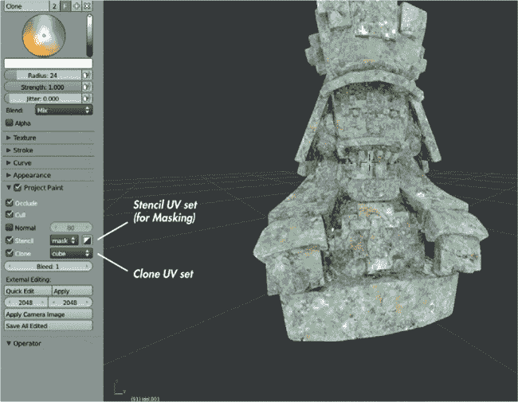图 11-27. 使用项目绘画遮罩设置来遮罩克隆刷的效果，使我能够根据环境光遮蔽图混合纹理。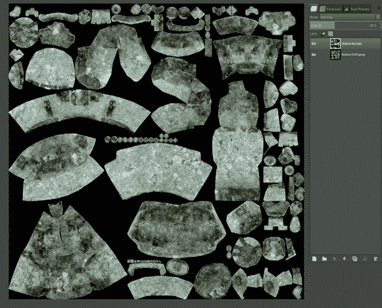图 11-28. 雕像纹理在 GIMP 中打开，环境光遮蔽图覆盖在上面

### 纹理映射到相机

当涉及到丛林神庙场景中前景的岩石和土壤时，可平铺的纹理并不能提供我所需的控制级别。对于场景的这一部分，我选择了按照相机视角绘制地面和岩石的纹理。为此，请按照以下步骤操作：

1.  将前景的岩石和土壤放置在同一图层上（使用**M**将物体移动到不同图层，并在编辑模式下使用**P**将选区从当前物体中分离出来，如果需要的话）。

1.  切换到**纹理化**视图（在属性区域将着色设置为**单一纹理**），并将你的无缝纹理分配给物体的 UV。

1.  使用**渲染活动视口**按钮（相机图标）在 3D 视口头部渲染当前视图为图像（参见图 11-29）。然后，将其保存为.*tga*图像。（为了能够将我的岩石纹理混合在一起，我将第二个岩石纹理分配给石头，并保存了第二次视口渲染。）

1.  在 GIMP 中将这些图像打开在同一文档中（先正常打开第一个，然后使用**作为图层打开**第二个）。接下来，通过在顶部图层上添加新的图层蒙版并用黑色绘制区域使下方图层显现出来，开始混合这两张图像。

1.  然后，为了柔化泥土和岩石之间的边界，创建一个新图层，并使用**克隆**工具和**磨损**画笔稍微将它们混合在一起（见图 11-30），将图像保存为*.tga*文件。

后续，这种材质将通过相机投影，并作为前景物体材质的一部分使用。

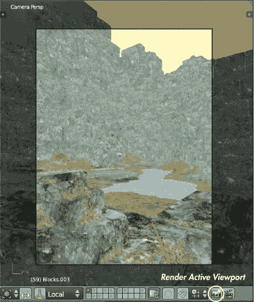 图 11-29。 将视图渲染为图像

### 给叶子贴图

对于丛林神庙场景中的叶子，我想创建三种纹理：一种用于叶子的颜色，一种用于高光贴图，另一种用于它们的透明度。我将使用透明度（alpha）贴图使网格中不是叶子部分的地方变为透明，从而为叶子提供细致的轮廓，而无需使用几何体。这对于我使用 IvyGen 生成的叶子尤为重要，因为这些叶子只是平面。

#### 收集叶子图像

我首先收集了形状大致符合我想要的叶子图像。然后，我将它们在 GIMP 中打开，并使用剪刀工具选择叶子的粗略轮廓，围绕叶子的边缘放置点以自动描绘其轮廓。接着，我可以使用快速遮罩和画笔工具（硬边刷）对其进行精细调整，使用黑色或白色绘制，去除或添加叶子选择的部分。我将叶子选择作为图层蒙版（图层▸蒙版▸添加图层蒙版并选择选择）来遮挡叶子图像的背景。

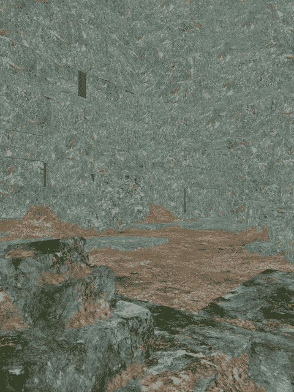 图 11-30。 从相机视图投影的纹理编辑。我填充了背景，以防止它在图像边界附近产生伪影，特别是在底部纹理环绕的地方。然后，我将前景物体上的纹理进行混合。

#### 透明度贴图

下一步是创建阿尔法、颜色和镜面反射图像。为了创建阿尔法纹理，我点击了图层蒙版，按 CTRL-A 全选，再按 CTRL-C 将蒙版复制到剪贴板。然后，我点击了新图层，并粘贴了蒙版，现在它作为普通图层可见。图 11-31 显示了完成的阿尔法图。

#### 漫反射图

对于漫反射图，我添加了一个均匀的颜色背景，并去除了照片中的镜面反射高光，使其更适合用作纹理。对于背景，我创建了一个新图层，并用绿色填充，颜色与叶片的颜色匹配，这样当材质过渡到透明时，边缘不会出现颜色变化。我复制了叶片图像图层，并将其放置在这个背景之上。

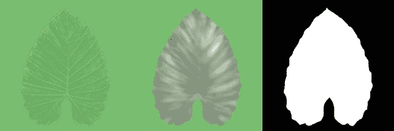图 11-31. 单片叶子的纹理，左到右分别是：漫反射、镜面反射和阿尔法。这些纹理被用于我的 IvyGen 网格。

为了去除高光，我使用了“加深/减淡”工具（SHIFT-D），设置为加深（按住 CTRL 或在画笔工具调色板中更改设置），并使用大号、柔软的画笔。我轻轻地在高光部分涂抹，来将其变暗（如果你使用压力感应平板，请使用轻柔的压力，或者如果使用鼠标，简单地将“加深/减淡”工具的曝光设置调低）。为了修复任何过度饱和的区域，我使用了画笔工具，选择了纹理中合适的颜色进行修补。然后，我将画笔的混合模式设置为“饱和度”，并涂抹过度饱和的区域，使它们与其他部分的纹理一致。图 11-31（左）显示了漫反射纹理。

#### 镜面反射图

对于镜面反射颜色，我复制了我的蒙版叶片图像，并使用色相/饱和度工具将其稍微去饱和。然后，我稍微将镜面反射颜色偏向黄色。我还在叶片的光滑区域上画了一些高光，并略微模糊了纹理。你可以在图 11-31（中间）中看到镜面反射纹理。

这完成了单个叶子所需的纹理，因此我将每个纹理保存为*.tga*格式的图片，然后保存包含我的图层的*.xcf*文件。我将这片单独的叶子作为 IvyGen 生成的叶子纹理。对于场景中的其余叶子，我希望将尽可能多的叶子合并成一张图片，这样我就不必管理太多的纹理。因此，我为需要的每一张叶子图像重复了剪裁过程，暂时跳过了镜面反射纹理。后来，我将所有这些叶子合并到一张地图上，以便之后更容易制作镜面反射贴图。

#### 将叶子合并到单一纹理上

对于我场景中的大部分植物，我将所有叶子打包到同一个 UV 贴图上。（在第十章中，我从叶子的材质颜色中烘焙了一张颜色贴图，用作指南。）为了更方便地将所有叶子合成一张纹理，我将之前创建的图层蒙版应用到每片叶子纹理的漫反射图层上。然后，我将每片叶子保存为图片，并将它们作为图层打开，叠加到我在第十章中烘焙的指南图像上。

接下来，我开始安排叶子以适应地图，使用了移动、缩放和旋转工具。在将叶子大致放置好后，我使用了 IWarp 工具（滤镜▸扭曲▸IWarp）来扭曲叶子，以便更准确地匹配我需要的形状（见图 11-32）。IWarp 允许你在选区内流畅地移动像素，以便重新塑形图像的区域。对于这些叶子，我使用了 IWarp 中的移动变形模式，使叶子的轮廓与我所需的形状相匹配。我重复了这一过程，复制了一些叶子来填补每个需要叶子纹理的区域。对于展开的茎，我从较大的叶子上克隆，填充整个区域，形成粗略的绿色纹理。所有叶子合并成单一纹理的漫反射纹理如图 11-33 所示。然后，我以与单个叶子相同的方式为我的组合叶子创建了镜面反射贴图。

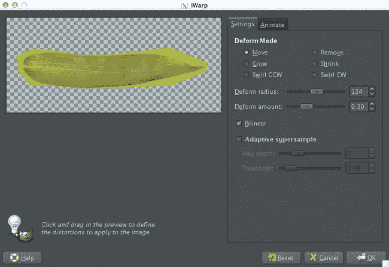图 11-32. 使用 IWarp 滤镜扭曲叶子形状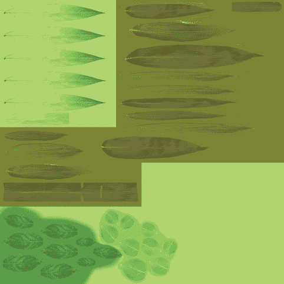图 11-33. 我将多个叶子的纹理合并到一张图片上，以减少场景中的纹理数量。

为了再次获得 Alpha 贴图，我简单地将叶子贴图合并为一个图层，然后在图层编辑器中右键点击该图层，选择“Alpha 到选区”。接着，我创建了一个新的黑色图层，并将选区填充为白色，以获得我的 Alpha 图像。最后，我将我的每个漫反射、镜面反射和 Alpha 通道导出为*.tga*图像，并保存了 GIMP 的*.xcf*文件。这些合并后的叶子贴图可以在图 11-31 中看到。这几乎完成了丛林神庙的所有贴图。我创建的其他贴图与上述的制作方式相似。

## 蜘蛛机器人的贴图

蜘蛛机器人的贴图制作比为其他两张图像做的贴图简单一些，因为这个项目主要依赖于程序化材料。我制作了一个覆盖整个身体的 UV 贴图，以便减少日后创建不同材料时的麻烦，并允许我为模型添加一些细节。

### 创建三种贴图

我从 GIMP 中烘焙的颜色贴图开始，并将其缩放至 4096×4096 像素。然后，我将烘焙的环境遮挡贴图作为一个图层打开，调整其大小以适应，并将其混合模式设置为“乘法”模式，透明度为 40%，以便为贴图添加一些微妙的阴影。

我需要制作三种贴图：漫反射、粗糙度和镜面反射。因为我希望身体的绿色区域有光泽，所以我将绿色区域在漫反射贴图中弄得更暗，在镜面反射贴图中弄得亮绿色。对于身体的白色区域，我则做了相反的处理：在镜面反射贴图中使用深灰色以减少光泽感，在漫反射贴图中则使用浅色。

对于粗糙度贴图，我将漫反射贴图中的绿色区域弄暗，以便呈现出锐利的光泽反射，而将白色区域弄亮，以呈现更柔和的高光效果。你可以在图 11-34 中看到这三种贴图。为了保持贴图的有序性，我为每个漫反射、镜面反射和粗糙度贴图创建了独立的图层组，就像我为蝙蝠生物做的那样。

### 添加 Decals

为了让事情变得更加有趣，我决定为蜘蛛机器人添加一些 Decals。为了制作 Decals，我在 Blender 中使用 2D 曲线绘制了一些简单的设计，并将它们以黑白形式渲染出来。然后，我将这些设计作为图层打开，叠加到我现有的贴图文件中，在 GIMP 中进行编辑。

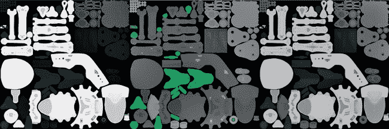图 11-34. 蜘蛛机器人纹理，从左到右：漫反射、镜面反射和粗糙度。我将一些 decal 融入纹理中，使它们更加有趣，并确保将它们添加到粗糙度和镜面反射贴图中。

为了使 decal 的背景变得透明，我使用了颜色▸颜色到 Alpha，并选择了背景颜色作为要移除的颜色。我选择了单独的 decal，并通过选择它们，然后缩放、移动和旋转它们来将其分布到模型上。（如果你将每个 decal 拆分到自己的图层中会更容易，方法是选择它并按 CTRL-SHIFT-L 将选择浮动，然后按 CTRL-SHIFT-N 将其转换为图层。然后，你可以独立缩放和旋转它，而不影响其他的 decals。将它们放置好后，你可以将细节合并回同一图层。）

为了更好地理解 decals 的摆放位置，你可以在 Blender 的纹理绘制模式中大致标出你想要的位置。然后，将图像保存为指南，用于 GIMP。一旦我把 decals 布置好，我将其在漫反射贴图中的透明度设置为 60%。

为了让 decals 更加突出，我也将它们加入了镜面反射和粗糙度贴图中。我复制了漫反射贴图中的 decal 图层，并将副本放入镜面反射和粗糙度贴图的图层组中。对于镜面反射贴图，我使用了颜色▸反转，将 decals 变为白色，这样它们在最终材质上会更光亮。对于粗糙度贴图，我再次将 decals 变为黑色，以便给它们带来清晰的反射（参见图 11-34）。

完成纹理后，我保存了一个包含所有图层组的 GIMP *.xcf* 文件，并导出了 *.tga* 格式的漫反射、镜面反射和粗糙度贴图。

## 审查

在本章中，我讲解了如何使用 Blender 和 GIMP 创建纹理，从我们的烘焙纹理作为基础开始，逐步增加细节和不同的图像。我们使用了 Blender 的纹理绘制模式，在 Blender 和 GIMP 中克隆纹理，并且使用了无缝纹理，无论是单独使用，还是作为创建更具特色纹理的基础。

对于蝙蝠生物，我主要通过手工构建纹理，在 Blender 中阻塞简单的颜色，然后在 GIMP 中细化这些颜色，绘制额外的细节，并用来自摄影纹理的元素进行补充，之后再回到 Blender 清理接缝。

对于丛林神庙，我创建了多种无缝纹理，这为创建独特物体的进一步纹理打下了基础。通过首先创建一系列可拼接、可重复使用的纹理，我实现了场景中多个元素之间的一致纹理，并加快了纹理制作过程。

对于蜘蛛机器人，我专注于创建相对简单的漫反射、镜面反射和粗糙度纹理，稍后将用这些纹理来制作一些相当复杂的材质。我使用了我在第十章生成的环境光遮蔽图和纯色图作为起点，然后创建并添加了贴花，以装饰蜘蛛机器人的设计，同时避免过多细节拥挤。

在第十二章中，我们将创建适用于 Blender 的内部渲染器和新的 Cycles 渲染器的材质，使用本章创建的纹理作为输入。我们将探讨在使用这两种渲染器时应用纹理的不同方式，以及考虑到这两种渲染引擎时创建材质的相似性与差异性。

* * *

^([1]) 你可以在 GIMP 的首选项中找到这个位置或添加新的画笔位置（文件▸首选项）在文件夹▸画笔下。
