## 第十二章 材质

在第十章和第十一章中，我创建了指定模型漫反射颜色的纹理，以及其他参数，如反射性、平滑度和高光颜色。现在我们将看如何将这些图像纹理与程序纹理和着色器结合，创建既有趣又令人信服的场景材质。

本章将讲解 Blender 的材质如何工作，以及如何将纹理融入这些材质中。不过，让我们首先了解 Blender 的两个默认渲染引擎——Cycles 和 Blender 内部渲染器——因为它们将显著影响我们如何设置材质。

## 渲染引擎：Blender 内部渲染引擎和 Cycles

*渲染引擎*是 Blender 如何利用场景中的所有信息——物体、材质、光源和设置——来创建最终图像的方式。Blender 有两个渲染引擎。较旧的一个是 Blender 内部渲染引擎，它是一个非常强大的（尽管稍显过时）渲染器，使用各种技巧和方法来生成最终渲染，放弃了绝对的物理精确性，追求速度和灵活性。然而，这种物理精确性的缺失并不意味着 Blender 内部引擎不能渲染出逼真的*外观*图像。它可以快速渲染包含多种复杂材质的场景，从高度真实的美学效果到非常非写实和风格化的效果，都能轻松实现。这使得 Blender 内部引擎成为一个高度灵活的渲染器，非常适合动画制作。

Cycles 是 Blender 的新渲染引擎，仍在积极开发中。与内部引擎不同，它专注于创建更逼真的光线模拟，并使用更符合物理的材质和光源模型。因此，它能够生成非常真实的图像，包括在 Blender 内部引擎中难以实现的效果，比如玻璃和其他透明物体的复杂折射、多次反射的光线在场景中传播，以及物体发出的物理正确的光线发射。其权衡之处在于（至少截至目前）Cycles 渲染场景的速度——即使是简单光照的场景——也比 Blender 内部引擎要慢。而且由于 Cycles 还在积极开发中，它缺少某些重要特性，如子表面散射（有关更多信息，请参见子表面散射）以及渲染头发和毛发的能力。

本书中我将使用两种渲染器。我为每个项目选择的渲染器对我定义材质的方式有很大影响，因为这两种渲染引擎的工作方式不同，需要以不同的方式设置材质。对于蝙蝠生物，我将使用 Blender Internal 渲染引擎渲染具有次表面散射效果的真实皮肤，以及毛发。对于蜘蛛机器人，虽然任意渲染器都可以使用，但我会选择 Cycles 渲染器来创建一些漂亮的光泽反射材质。对于丛林神庙项目，我将使用 Cycles 渲染器，它可以让我通过 Cycles 的交互式渲染预览（详见 Cycles 渲染预览）来实验照明并获得即时反馈。

在研究两种不同渲染引擎的材质创建差异之前，让我们简要回顾一些在讨论材质时会涉及的通用原则。这些原则主要集中在表面如何通过反射、折射或吸收光线与光线相互作用的各种方式。

## 反射

我们之所以能够看到物体，是因为我们的眼睛检测到从物体表面反射回来的光线。因此，表面的外观由它与光线相互作用的精确方式决定，而这种相互作用又由材质的结构和成分所决定。

在现实世界中，像岩石和橡胶这样的哑光表面在微观尺度上具有粗糙的结构。光线从这些表面反射时，会向各个方向散射，因此你从哪个方向看表面，反射出来的光线几乎是一样的。这就是所谓的*漫反射*。

相比之下，抛光表面即使在微观尺度上也相对光滑。这意味着，当你看着表面时，会看到一个完美的反射，而且随着视角的变化，反射的内容也会发生变化。这就是所谓的*镜面反射*，或*镜面*反射。漫反射和镜面反射的差异如图 12-1 所示。

然而，在 CG 的世界里，我们经常采取捷径来实现真实材质的效果。例如，考虑镜面反射：虽然可以渲染镜面反射，但渲染镜面反射的速度比渲染漫反射慢，因为有一些简单的算法可以近似漫反射的效果。所以，渲染漫反射非常快，但渲染镜面反射则需要高强度的光线追踪处理。为了绕过这个问题，我们有时只考虑表面能够反射的最明显的物体，例如明亮的光源。例如，如果你注视一个在强光下的金属表面，可能会忽略周围环境的镜面反射，因为光源本身的反射非常明亮。镜面反射在 Blender 的内部渲染器中是这样工作的：渲染器只生成来自光源的高光，而不是让表面反射周围的其他物体（见图 12-2）。这种捷径通常能够完成任务，当需要更准确的反射时，也可以打开它们（通过启用光线追踪的镜面反射），但会牺牲额外的渲染时间。

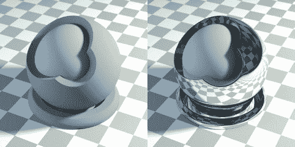图 12-1. 漫反射（左）与镜面反射（右）（Cycles 渲染器）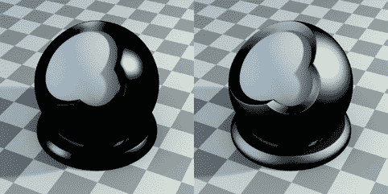图 12-2. Blender 内部渲染器的近似镜面反射（Blender Internal 渲染器）。这些通常被称为镜面反射，而更真实的（镜面）镜面反射被称为光泽反射。左：只有镜面反射且硬度为 15 的材质。右：硬度为 100。

## 透射与折射

除了反射光线，像水或玻璃这样的表面还会*透过*光线（允许光线穿透它们）。在现实世界中，部分*入射光*（照射到表面的光）通常会被反射，而其余的光线则会透过并稍微弯曲（*折射*）。光线弯曲是因为它进入了不同的介质，导致其速度发生变化。这种光的弯曲会导致当你透过透明物质观看时，看到一个失真的图像。失真的程度取决于物体的*折射率（IOR）*，它决定了光线在物体边界处的传播方向改变的程度（见图 12-8），以及物体的形状和厚度。对于某些物体，这种效应非常显著——例如，当你透过镜头或一杯水看时，你会注意到相当大的失真。其他时候，效应则较小——例如，当你透过窗户的薄玻璃看时，失真几乎没有。

### Z 透明度

我们可以使用 Blender 通过光线追踪透明度来模拟光的透过和折射。但我们也可以通过忽略折射并简单地渲染物体后面的内容来作弊。这叫做*Z 透明度*。这种技术在像窗户这样的物体上效果很好，因为折射非常小。图 12-3 比较了光线追踪和 Z 透明度。

Z 透明度也适用于渲染具有孔洞或复杂轮廓的薄表面，在这种情况下，网格可以保持简单，并且可以使用纹理来定义表面透明的区域——或者在此情况下，定义不存在的区域。这些区域随后可以完全渲染为透明（不可见），这将使表面看起来比单纯的几何形状更加复杂（见图 12-4）。

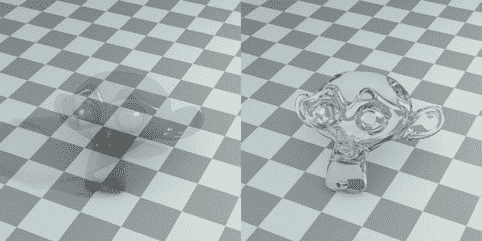图 12-3. 光线追踪与 Z 透明度（使用 Blender 内部渲染器）。左：使用 0.25 alpha 和镜面高光的 Z 透明度。镜面反射和轻微的漫反射可使该材质可见。右：具有 1.5 的 IOR 的光线追踪透明度。该图像更为真实，但渲染时间更长。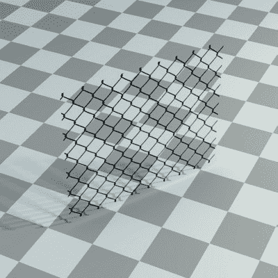图 12-4. 使用 Z 透明度为这段铁丝网材质赋予更复杂的外观，而无需额外的几何体（使用 Blender 内部渲染器）。该材质已应用于单一平面。（已为地面材质启用透明阴影选项，以创建准确的阴影。）

光线可以以更加复杂的方式与表面相互作用，例如在表面下散射、表现出半透明性或各向异性反射，这就是刷过金属表面产生的反射类型。在本章接下来的部分，我们将研究这些不同类型的相互作用。

## Blender 内部材质

Blender 内部是 Blender 的默认渲染引擎，您可以通过属性编辑器的材料和纹理标签为 Blender 内部创建材质。您可以在材质标签中找到材质的属性（以及它们可以影响的纹理和材质的各个方面），在纹理标签中也可以找到相应的内容。

Blender 内部的材质非常模块化，允许您通过从材质标签中的不同面板中启用相关选项，简单地添加和组合不同的材质属性——例如镜面反射、镜面反射率、透明度和次表面散射——而无需从头开始创建材质（见图 12-5）。注意图中，所有分配给活动对象的材质都位于标签顶部的面板中。下方是预览面板，显示活动材质的预览，接着是其他包含材质设置的面板。我将在这里讨论 Blender 内部材质标签中的相关面板。

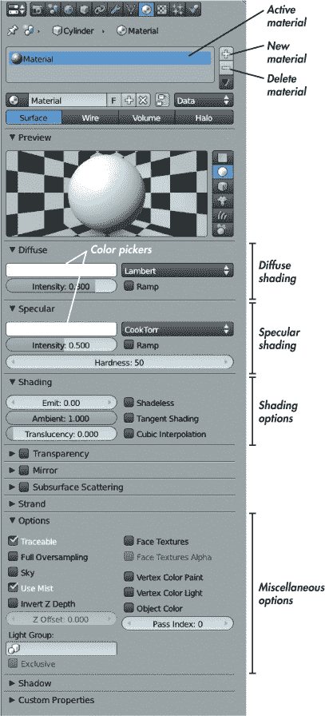图 12-5. 使用 Blender Internal 渲染器时的材质标签

****漫反射****。此面板包含材质的漫反射颜色和阴影设置。颜色选择器（见图 12-5）允许你设置材质的漫反射颜色，然后该颜色会乘以*强度*值。右侧的下拉菜单让你设置漫反射着色器模型，这会影响材质从光亮到暗的漫反射颜色的衰减，且在不同角度下有所不同。默认的 Lambert 着色器模型通常已足够，尽管 Oren Nayar 着色器模型可以用于模拟表面具有更粗糙的微观结构，如粘土或石材。这里的其他着色器模型较为特殊，使用的情况较少。

****高光****。高光面板中的设置类似于漫反射面板，只不过它们控制的是物体的*高光着色*（这是对高光反射的粗略近似，之前在反射一节中已讨论过）。*硬度*项决定了这些反射的广泛程度或紧密程度（见图 12-6）。硬度值高的材质具有尖锐、明亮的高光，而硬度值低的材质则具有更柔和、扩散的高光。

****着色****。以下选项影响材质的整体着色效果：

+   ****发光****。这会使物体即使在没有光照的情况下也显得明亮，甚至可以在与某些世界设置一起使用时，使物体能够照亮其他物体。

+   ****环境光****。这决定物体是否接收环境光照（使用世界设置标签中的环境颜色设置）。

+   ****半透明****。这会使物体的正面和背面都看起来被照亮，使其呈现出半透明的效果，就像薄纸或树叶一样。

+   ****无阴影****。这完全消除光照对物体的影响；物体的颜色和亮度完全来自其漫反射颜色和纹理。

+   ****切线着色****。这会改变表面的着色，使其更像抛光金属或其他具有“纹理”或微观结构方向性的材料。纹理的方向取自物体的 UV 坐标，因此纹理将与 UV 空间中的*v*轴对齐。换句话说，它将在 UV 图像编辑器中垂直对齐，因此在启用此选项时，请确保已正确展开物体。

+   ****立方插值****。这会改变表面在光与影之间的过渡方式，通常效果更为平滑，尽管结果往往稍微更暗一些。

****透明度****。启用透明度复选框以渲染带有透明效果的材质。该面板提供了三种方法来渲染透明物体，使用表面的 alpha 值。最简单的，*遮罩*，只会在颜色透明的地方将材质与背景混合。*Z 透明度*稍微复杂一些，它会渲染透明物体后面的内容。*光线追踪透明度*会计算正确的折射。选择光线追踪透明度后，会弹出一系列选项，允许你设置材质的折射率、光泽度和材质所进行的过滤量。

****镜面反射****。启用镜面反射以开启光线追踪反射。此面板中的设置允许你定义光线追踪反射的数量（*反射率*）和清晰度（*光泽度*）。

****次表面散射 (SSS)****。这个选项控制光在材料表面下散射的效果，通常应用于皮肤或蜡等材料。我将在次表面散射中详细讨论这个问题。

****选项****。此面板包含一些杂项选项。例如，*可追踪*设置控制在渲染光线追踪阴影和反射时是否考虑一个物体。我将在相关部分讨论这些内容，任何我未提及的，你可以在 Blender 的 Wiki 上查找（网址为 *[`wiki.blender.org/`](http://wiki.blender.org/)*）。

****阴影****。此面板控制物体如何接收和投射阴影。例如，*仅投射*选项使物体仅显示它投射的阴影，其他部分不可见。*仅阴影*将材质的阴影渲染为唯一的不透明部分。（这对于创建可以合成到其他图像中的阴影特别有用。）

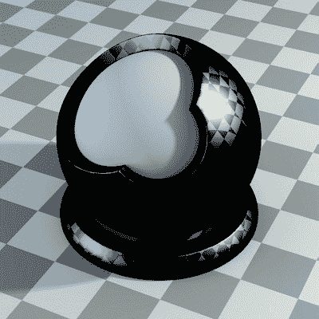图 12-6。不同硬度等级会影响镜面反射的效果。这个棋盘格纹理用于控制硬度。（你也可以使用纹理贴图来变化硬度。）

## Cycles 材质

与 Blender 内部渲染器不同，后者通过使用许多巧妙的技巧和近似方法来加快渲染速度，Cycles 渲染器使用更为物理真实的材质模型。它将现实主义与基于节点的方法结合起来，专注于通过简单的组件构建复杂的材质。你仍然可以使用属性编辑器中的材质选项卡来编辑 Cycles 材质，它提供了当前材质的概览，但使用 Blender 的节点编辑器更简单清晰，如图 12-7 所示。

要创建一个 Cycles 材质，你只需要一个着色器节点和材质输出节点。从那里开始，你可以组合其他着色器、输入和纹理，创建各种各样的材质。要添加节点，使用 SHIFT-A 并从出现的菜单中选择你想要的节点，就像在 3D 视口中添加对象一样。

BSDF（双向散射分布函数）着色器节点控制材质的工作方式。这些函数定义了光与表面的相互作用方式——例如，材质是以漫反射的方式反射光，像镜子一样反射，还是像玻璃一样透光。你可以在头部的“添加”菜单下找到 BSDF 着色器，还有其他一些选项。

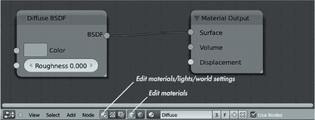图 12-7。在 Blender 的节点编辑器中编辑一个 Cycles 材质。右侧是材质输出节点；它的表面节点连接到漫反射着色器节点的 BSDF 输出插座。结果是如图 12-1 所示的漫反射材质。

Cycles 当前支持以下着色器：

****背景****。这影响的是世界背景，而不是材质。（有关世界光照设置的更多信息，请参见第十三章）。

****漫反射 BSDF****。它会将光散射到各个方向，产生漫反射效果。

****光滑 BSDF****。它像镜子一样反射光。增加*粗糙度*值会使反射变得越来越模糊。

****玻璃 BSDF****。玻璃 BSDF 功能像玻璃或任何其他透明介质一样传递光线。*折射率（IOR）*决定了光线穿透表面时的弯曲程度。折射率值越高，光线弯曲得越厉害。密度较大的材料具有更高的折射率。例如，玻璃的折射率约为 1.5，水的折射率约为 1.3。钻石作为一种更密集的材料，其折射率约为 2.4。折射率的不同可以在图 12-8 中看到。

****半透明 BSDF****。这会将光散射到物体的所有方向，产生一种半透明的外观，就像薄纸或叶片一样，光线透过材料传播。

****透明 BSDF****。这允许光线穿透材料而不发生折射，就像没有任何东西存在一样。与 alpha 图层结合使用时非常有用。（关于创建叶片材质的更多内容，请参见叶片。）

****天鹅绒 BSDF****。这反射光线的方式有些像漫反射着色器，但从斜角观察时反射更多。结果呈现出一种天鹅绒般的外观。

****发射****。这将一个物体变成一个发光的灯具，发出自己的光。

****遮罩****。这在图像中创建一个“洞”，该洞通过背景颜色并具有零透明度（alpha）。它在合成时非常有用。

****混合着色器****。这允许你混合两个着色器，混合的比例由因子输入决定。混合节点允许你以多种组合方式组合着色器，创造出各种各样的材质。例如，你可以通过将光泽 BSDF 和漫反射 BSDF 着色器结合，创建类似塑料的材质，如图 12-9 所示。

****添加着色器****。这将两个着色器相加。它不像混合节点那样灵活，因为你不能控制混合的程度，但它的工作方式与混合节点非常相似。

欲了解更多关于这些着色器和其他 Cycles 文档的内容，请访问*[`wiki.Blender.org/`](http://wiki.Blender.org/)*。

### Cycles 中的其他输入

Cycles 允许你使用各种各样的节点，这些节点提供不同的数据供材质使用。你会找到用于输入图像纹理和程序纹理的节点，以及提供几何信息的节点，如表面法线和表面在 3D 或 UV 空间中的位置（允许你将纹理映射到表面）。结合这些节点可以成为一个强大的工具，正如我们在本章中将看到的那样。

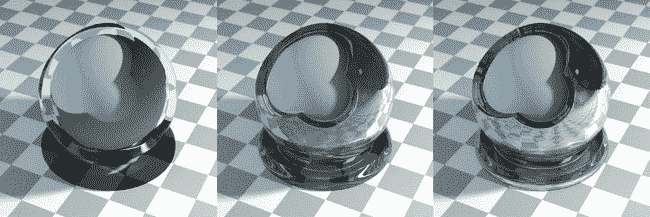图 12-8。不同的折射率。左到右：1.05，1.5 和 2.5。随着 IOR 的增加，折射光变得更加复杂。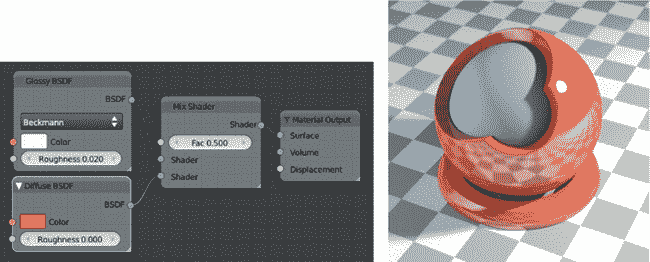图 12-9。通过 Mix 节点组合着色器。在这里，我通过将橙色的漫反射 BSDF 着色器与白色的光泽 BSDF 着色器结合，创建了一个塑料感的着色器。

### 纹理节点

纹理节点对于创建材质特别有用，它们可以提供多种程序化和基于图像的纹理，用于你的材质上。我将使用图像纹理节点来应用我在第十章和第十一章中创建的纹理。

其他节点用于创建程序化纹理。例如，噪声纹理生成多色的云彩，可用于为表面添加看起来随机的细节；波纹纹理生成可重复的条纹，可以扭曲成类似木纹的效果。棋盘格是测试材质设置的一个极好纹理；例如，通过将棋盘格节点连接到 Mix Shader 节点的 Fac 输入，你可以用它来比较两个着色器（参见图 12-10）。我们将在本章后面详细讨论如何在 Cycles 中使用纹理。

### Blender Internal 中的节点

虽然我不会详细介绍，但 Blender Internal 也支持节点材质。尽管原理相同，但它们与 Cycles 节点的工作方式略有不同。你可以使用其他材质作为输入，并将它们组合以制作新材质，而不是使用着色器。图 12-11 显示了将两个材质组合生成第三个材质的例子。

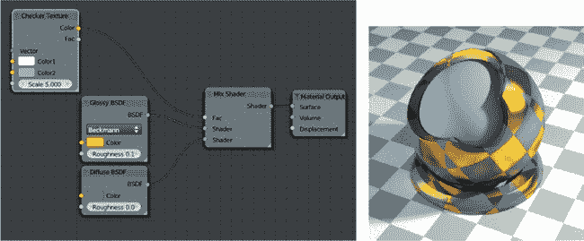图 12-10。使用纹理控制着色器的混合。在这里，使用棋盘纹理来控制光泽和漫反射着色器的混合。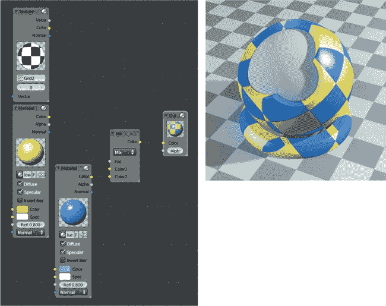图 12-11。Blender Internal 也支持节点材质，尽管它们的工作方式稍有不同。在这里，两个（非节点基础的）材质已经被混合（再次使用棋盘纹理来控制混合）以创建第三种材质。

## 蝙蝠生物的材质

让我们看看如何创建材质，从蝙蝠生物和 Blender Internal 开始。对于这个项目，我需要为皮肤、毛发、眼睛和牙齿创建材质。

### 皮肤

我从生物的皮肤开始。我为蝙蝠生物对象添加了一个新材质——也就是我们最终用于渲染的带有位移的材质。（记住，场景中有两个蝙蝠生物副本：一个副本用于渲染身体，另一个副本是在第九章中创建的，用于保存毛发。）为了为蝙蝠生物添加一个新材质，我进入了属性编辑器的材质选项卡，删除了任何现有的材质槽（通过点击选项卡顶部的 - 按钮）。然后，我从材质选择下拉菜单中点击 +New。接下来，我可以开始创建材质。材质的初步效果见于图 12-12。

到目前为止，这只是一个简单的材质；我只是调整了漫反射颜色和高光强度与硬度。我还将高光着色切换为 Blinn，这样可以产生更柔和的高光。接下来，我需要开始结合我的纹理并进一步优化材质。

为了加入漫反射纹理，我切换到属性编辑器的纹理选项卡，选择了第一个纹理槽，并点击 +New 来添加一个新纹理。然后，我将纹理类型设置为图像。这会在纹理选项卡中添加一个图像面板，在这里我可以打开我的漫反射纹理。

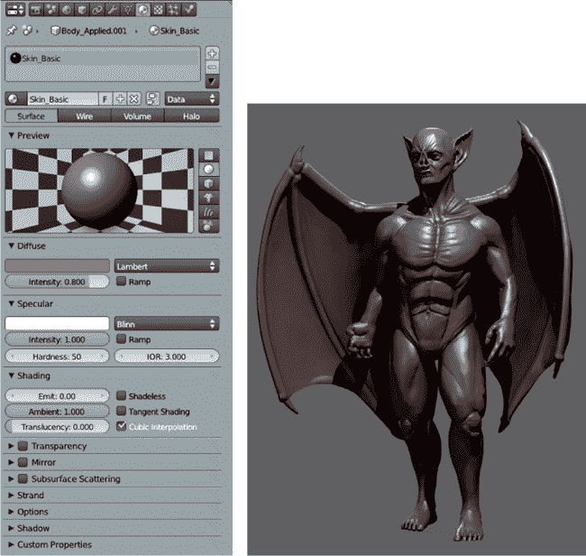 图 12-12. 蝙蝠生物材质，未添加任何纹理或次表面散射效果。右侧展示了渲染后的材质。（请参见第十三章和第十四章了解如何设置光照和渲染设置。）

#### 映射坐标

为了正确地将纹理应用到网格上，我需要告诉材质使用我在第八章中创建的 UV 坐标。

为此，我可以在映射面板中将“坐标”选项设置为 UV。不过，这里还有其他几个值得讨论的选项。例如，“生成”选项将使用下方的投影设置创建一个程序化投影，这对于应用无缝纹理而不需要展开物体非常有用。生成坐标将物体的表面投射到一个假想的形状——平面、立方体、球体或圆柱体——并利用该投影来应用纹理。结果如图 12-13 所示。

在本章后面，我们将使用一些其他选项，如*strand*坐标。我们已经在应用 MatCap 图像并使用 GLSL 着色时看到了法线坐标的实际应用。

#### 影响

材质选项卡中的“影响”面板是我们设置纹理将影响材质哪些属性的地方。面板列出了所有可以用纹理控制的材质属性，例如法线、硬度、透明度、漫反射、镜面反射以及镜面颜色和强度。对于我们的漫反射纹理，我们将使用漫反射属性下的默认选项“颜色”，该选项使用纹理的 RGB 值来设置表面的漫反射颜色（参见图 12-14）。我将此纹理的混合模式设置为“混合”，意味着它将替代材质设置中指定的默认漫反射颜色。

你还可以只使用纹理的黑白值并忽略其颜色信息，通过勾选“RGB 到亮度”选项。这让你可以在下面的颜色选择器中选择一个特定的颜色来与此值相乘，用于需要颜色的属性。负值选项在应用到模型之前会反转纹理。蒙版选项对于结合程序化纹理尤其有用，因为它让纹理作为下方纹理插槽的蒙版：纹理中的白色区域会允许后续纹理被应用，而黑色区域则只会显示纹理插槽堆栈中更高位置的纹理。

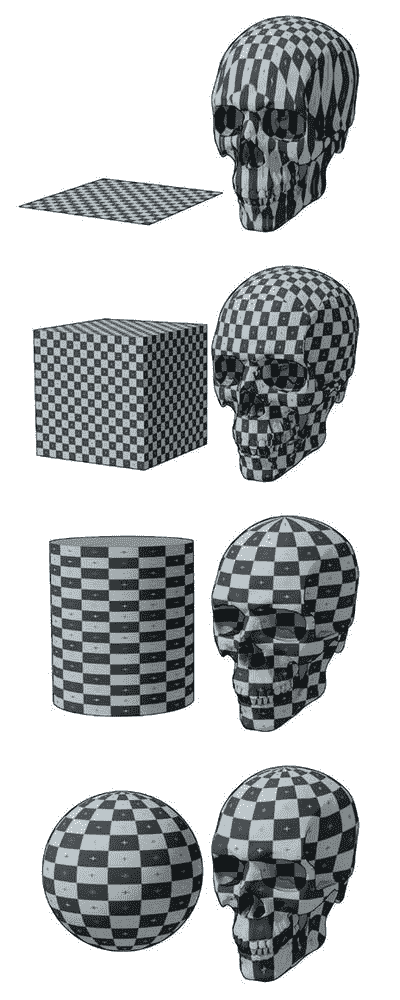图 12-13。Blender 生成的坐标将任意形状投影到物体上，为纹理创建映射。自上而下：平面、立方体、管道和球体投影。这里，立方体和球体效果较好，因为头骨的形状与这些形状非常相似。

#### 更多纹理

现在，我将继续为我的材质添加纹理。首先，我们来看一下我在第十一章中创建的高光和硬度纹理。为了将高光纹理添加到材质中，我从“纹理”标签顶部选择了下一个空的纹理插槽，并从纹理选择器下拉菜单中点击+新建，创建了一个新的纹理块。我将其类型设置为“图像”。然后，我像之前一样设置了映射方式为 UV，但这次在“影响”选项下，我设置了纹理影响材质的高光颜色。我将混合模式设置为“叠加”，这样纹理的数值就会与材质的整体高光颜色相乘。

对于硬度纹理，我设置了纹理影响材质的硬度，并启用了“RGB 到亮度”选项，确保 Blender 将纹理视为简单的亮度值，而不是三个颜色值。（当 RGB 纹理用于不需要颜色信息的输入时，可能会失败。）我将混合模式设置为“叠加”。

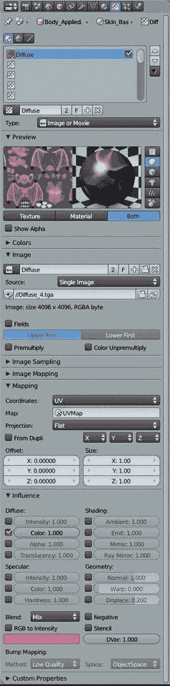图 12-14。将我的漫反射纹理添加到蝙蝠生物的皮肤材质中！蝙蝠生物的材质，添加了纹理图 12-15。蝙蝠生物的材质，添加了纹理

请注意，硬度值为 0 会导致奇怪的结果，因此要么确保硬度纹理中没有完全黑色的区域，要么将纹理的影响值设置为小于 1，以消除这个问题。

这就完成了材质的纹理添加。当前的结果显示在图 12-15 中。

#### 添加法线贴图

尽管我已经完成了材质的纹理添加，但你可能还记得，在第十一章中，我为蝙蝠生物烘焙了一个法线贴图，作为替代位移贴图的潜在方案。在这个阶段，我可以将法线贴图添加到另一个图像纹理槽中，并设置其影响材质的法线。在影响选项中，我还需要告诉 Blender 这是一个切线空间法线贴图（而不是凹凸贴图或物体空间法线贴图），所以在纹理标签的图像采样面板中，我启用了法线贴图选项，并确保下方的法线贴图空间选项设置为切线。最终的材质将在渲染时使用这些纹理来扭曲法线，即使关闭细分和位移贴图，也能使其看起来更加详细。

由于我*使用了*位移贴图，我根本不需要使用法线贴图，但如果你想保持渲染时间较短，或者你的计算机在场景的多边形数量上遇到困难，这也是一个不错的替代方案。

#### 次表面散射

*次表面散射（SSS）* 是光线在材料表面下反射的效果，这在皮肤、蜡和大理石等材料中很常见。它使阴影的边缘看起来有些模糊，因为光线从完全照亮的区域扩散到阴影部分。当光线散射时，部分光被吸收，剩余的光通常会呈现出下方物质的颜色。以皮肤为例，皮肤下的肌肉和血液会使散射光呈现橙红色。

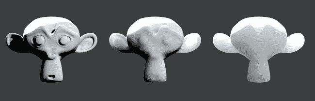图 12-16。不同尺度值对次表面散射的影响。由左至右：尺度值为 0.01、0.1 和 0.5。

为了在 Blender Internal 中复制这种效果，我们可以为一个材质启用次表面散射。这个效果通过预计算其表面的光照并模糊阴影，来近似物体内部光线的散射。它还使光线在模型的薄部分发生散射。当将光源从背后照射到物体时，这种效果尤为明显（正如我在第十三章中为蝙蝠生物打光时所做的那样）。

在属性编辑器的材质标签中启用次表面散射功能后，你将拥有很多可以调整的选项。次表面散射的设置如下：

****IOR****。这是材料的折射率。较高的 IOR 会导致光明与黑暗之间的边界稍微变得柔和。

****缩放****。这是最重要的设置，因为它决定了散射效果的缩放比例，即 Blender 单位在 3D 视图中的比例与实际世界尺度之间的关系。如果你已经将场景构建为 1 Blender 单位 = 1 米，那么 0.001 的值是“正确的”，不过你可以设置为任何能达到预期效果的值（参见图 12-16 图 12-17。不同颜色混合设置对次表面散射的影响。这里，所有三种材质使用相同的蓝色作为散射颜色，但使用了不同的颜色混合值。从左到右：颜色混合值为 0.0、0.5 和 1.0。

****RGB 半径****。在许多材质中，某些颜色的光散射得比其他颜色更远。例如，在浅色皮肤中，红光散射得最远，绿光大约散射到红光的一半距离，蓝光则约为红光的四分之一。这些设置让你可以定义红光、绿光和蓝光的相对散射距离。

****混合（颜色/纹理）****。 这些设置决定了散射颜色和漫反射纹理的扩散程度。我通常将这两个值设置得非常低，甚至为 0，因为这样效果更令人满意。较高的颜色混合值往往会导致散射颜色冲淡材料中的其他颜色（见图 12-17），而较高的纹理混合值则会使纹理看起来模糊。

****散射权重（前/后）****。 这调整了模型前后部分的散射相对量。增加后向散射权重会导致光线在模型的薄部分更明显地散射，这通常是理想的。将前向值设置为 0 会使材料从表面前端不散射任何光线，只对后向散射的光线有反应，如图 12-18 所示。（这在节点材质设置中有时非常有用。）

****误差****。 这个值决定了 SSS 效果的质量。较低的值会提供更精确的结果，但渲染时间会更长。默认值通常就很好。

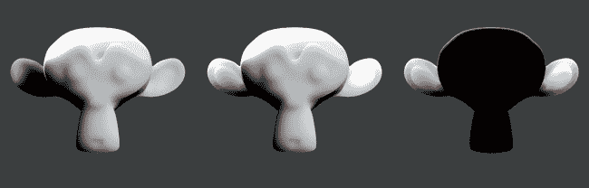图 12-18。前后散射。从左到右：仅前向散射、前后散射和仅后向散射。

对于蝙蝠生物，我设置的 SSS 设置如图 12-19 所示。我根据生物的大小设置了比例，假设 1 米等于 1 个 Blender 单位，并选择了蓝绿色作为散射颜色，结合将颜色混合设置为 0，得到了一个漂亮的橙色散射效果。我将后向散射权重设置得较高，以允许光线穿过翅膀散射。这完成了蝙蝠生物的皮肤材质。

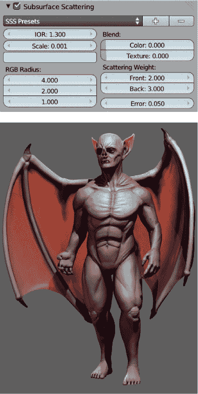图 12-19。蝙蝠生物皮肤的 SSS 设置。结合来自背后的光照，次表面散射使翅膀发光，光线从其中散射出来。

### 牙齿、指甲和眼睛

为了创建牙齿和指甲的材质，我首先复制了我为皮肤创建的材质，减少了 SSS 效果，并增加了整体的镜面反射，使这些区域看起来更光亮。

要复制一个材质，首先将其分配给一个物体。然后，在材质选择器的下拉菜单中，点击+图标，通过复制当前分配的材质来创建一个新材质。接下来，你可以修改这个副本，而不会改变原始材质。当你需要创建一个与已创建材质类似的新材质时，这非常有用。

对于眼睛，我创建了两种新材质。回想一下，在第五章中我建模眼睛时，将其分为两个独立的部分：角膜物体形成眼睛的外表面，内层则是最终成为眼球的部分。将内层展开并纹理化后，我设置了一个类似皮肤材质的材质，减少了些微的红色次表面散射。我还关闭了该材质的镜面反射（将镜面强度设置为 0），因为眼睛的镜面反射来自角膜物体。我将第十一章中我绘制的眼部纹理应用为该材质的漫反射纹理。

对于角膜，我需要一种既光亮又透明的材质，并且不会在内眼物体上投射阴影。为此，我创建了一个新材质并将其分配给该物体。然后，在材质设置中启用透明度，并设置为 Z 透明度，同时将材质的 alpha 值设置为 0。这些设置使材质变得透明，除非存在镜面和镜面反射。为了提高材质的光泽度，我将镜面反射和硬度都调高了不少，并且为了防止材质投射阴影，我在选项面板中禁用了可追踪性，并在阴影面板中禁用了投射缓冲阴影。眼睛的两种材质可以在图 12-20 中看到。

### 毛发

毛发材质比普通材质稍微复杂一些，需要一些关于光照和渲染的知识。我将在这里介绍材质的相关内容，并在第十三章中讲解一些光照方面的内容。

在 Blender Internal 中，毛发粒子可以像任何其他材质一样渲染，也可以使用 Blender 的毛发渲染选项。Blender 的毛发渲染选项提供了一种更快速的渲染毛发和毛皮的方式，但它与光线追踪阴影不兼容。它只能通过带有缓冲阴影的聚光灯来渲染阴影。

要启用发丝渲染，请使用属性编辑器中“粒子”标签的“渲染”面板（见图 12-21）。对于蝙蝠生物，我选择使用发丝渲染。在第十三章中，我们将讨论如何为这种设置创建适当的照明环境。

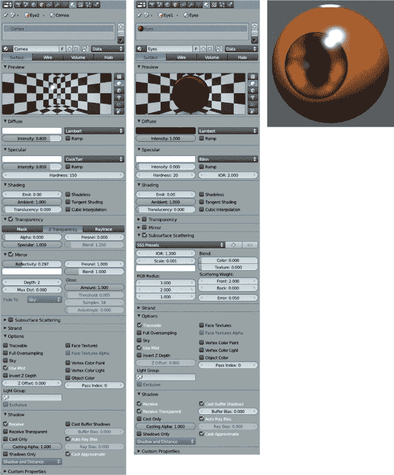图 12-20. 两种眼睛材质。高光来自应用于角膜网格的材质，其他则来自内眼网格。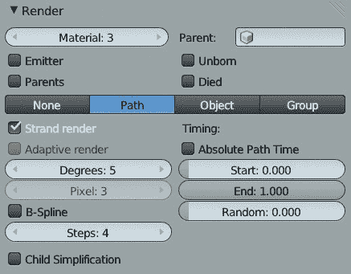图 12-21. 从属性编辑器的粒子标签启用发丝渲染

接下来，我为材质指定了发丝选项。在“材质”标签的“发丝”面板中，您可以指定发丝的粗细、形状等选项：

****大小（根部/尖端/最小）****。此项决定发丝根部和尖端的厚度。最小设置指定 Blender 渲染时发丝的最小宽度（以像素为单位）。

****Blender 单位****。默认情况下，您通过“大小”设置指定的厚度是以像素为单位的。如果您的粒子与相机之间的距离差异很大，这可能会导致渲染问题，因为它们会以相同的像素宽度进行渲染，使得远处的粒子看起来过于粗大。启用 Blender 单位后，您可以改为使用 Blender 单位来指定粒子的宽度。

****切线着色****。此选项使用发丝的切线方向而非法线方向进行着色，这通常会产生更好的效果。

****形状****。此项修改发丝根部与尖端之间宽度的过渡。默认值为 0，表示线性过渡。负值会导致尖锐的形状，而正值则使发丝的末端看起来更圆润。

****宽度渐变****。此设置使发丝在宽度方向上逐渐褪色，但仅当启用发丝渲染时有效。

****UV 映射****。此项允许您覆盖其中一个 UV 坐标集，为发丝提供一个 UV 映射。这样，您可以将图像 UV 映射到所有发丝上以进行纹理处理，但只有在禁用发丝渲染时才能使用。

****表面漫反射****。此设置使表面漫反射的着色与发丝着色在指定的距离内融合。

#### 发丝坐标

如上所述，我们可以通过使用 UV 映射覆盖来给毛发纹理。更简单的选择是使用毛发坐标进行纹理映射。当应用纹理时，虽然这仅提供了沿毛发长度的一维坐标，但对于细小的毛发来说，这通常已足够。

对于蝙蝠生物的毛发，我首先使用图 12-22 中显示的设置建立了一个简单的材质。注意，我启用了 Z 透明度并将透明度设置为大约 0.7。在毛发设置中，我启用了 Blender 单位，并将根部和发梢的大小分别设置为 0.00125 和 0.0001。（这些值较小，因为毛发需要非常细，而且它们的宽度现在是以 Blender 单位为单位。）我还启用了切线着色，并将宽度渐变设置为 1.0。

接下来，在纹理设置中，我使用了 Blender 的程序化混合纹理来为头发的透明度沿长度添加渐变，使其在发梢处变得透明。我在材质的第一个纹理槽中添加了一个新的纹理，并将其类型设置为混合。然后，我开始调整混合纹理的颜色，首先在颜色标签中启用渐变选项，然后调整程序化纹理使用的颜色。我点击“添加”以在渐变中创建更多的颜色停点，并将颜色设置为从透明的黑色渐变到不透明的白色，再返回（见图 12-23）。最后，在映射下，我将纹理的坐标设置为透明度，并在影响下设置纹理与材质的透明度以及高光强度相乘。

我对头发颜色做了类似的处理。我在下一个纹理槽中创建了一个新的混合纹理，这次我设置了从黑色到白色的渐变（透明度均为 1.0）。同样，我将纹理映射到毛发坐标，并将其与毛发的漫反射颜色按 0.8 的因子相乘，使得毛发根部稍微变暗，从而假装有一些阴影效果。

接下来，我添加了一个云纹理，将其设置为修改材质的颜色——这次通过 0.8 的因子影响漫反射颜色，混合模式设置为乘法，映射设置为 UV。我将云纹理的缩放值调到最低，基本上将纹理转化为黑白噪声，并给每根毛发一个稍微不同的亮度。这完成了头发材质，最终效果如图 12-24 所示。

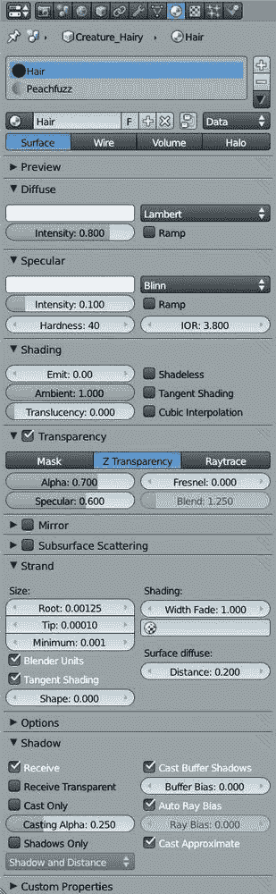图 12-22. 我的毛发材质的基本设置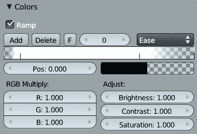图 12-23. 修改程序化混合纹理的颜色图 12-24. 头发材质

#### 桃毛

我为桃毛粒子系统设置了一个非常相似的材质。对于这个材质，我减少了发丝的大小设置，使它们变得更细，并降低了材质的整体 alpha 值，使头发看起来更加轻盈。最终的材质效果可以在图 12-25 中看到。它主要出现在身体的边缘，这正是我想要的效果。

这完成了我为蝙蝠生物制作的材质。

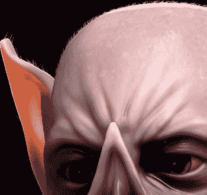图 12-25. 我的桃毛头发提供了一种更微妙的效果，它在模型的亮光部分周围增添了一圈毛茸茸的光晕。

## 蜘蛛机器人材质

对于蜘蛛机器人，我选择使用 Blender 的 Cycles 渲染器，因为它允许我创建一些漂亮的光泽材质来与模型相辅相成。我从创建一个单一材质开始，应用到蜘蛛机器人网格的所有（有纹理的）部件。你可以使用材质工具脚本快速完成此操作：只需在 Blender 的插件菜单中启用它（**用户设置**▸**插件**），并使用快捷键 **Q** 一次性为所有选中的对象分配材质。默认情况下，当你为一个物体创建新的 Cycles 材质时，Blender 会分配一个漫反射 BSDF 着色器，就像图 12-26 中所示的那样。默认材质将是纯白色的哑光材质。

### 编辑节点材质

要编辑 Cycles 材质，可以使用 Blender 的节点编辑器，将其与 3D 视图并排显示，并实时预览场景渲染（这也是 Blender 内部渲染的一个主要优势，我稍后会讨论）。为了给节点编辑器和预览留出空间，我通过右键点击 3D 视图底部边缘并选择“拆分区域”来将默认布局拆分一次。然后，我将左侧区域水平拆分成两部分。

一旦我拆分了工作区，我将其中一个新区域设置为节点编辑器，另一个设置为 3D 视口，并将其显示模式设置为渲染模式。在节点编辑器的标题栏中，我选择了左侧组中的材质图标和右侧组中的立方体图标（参见图 12-27），这样节点编辑器就会显示当前材质的节点树。这为我提供了一个可操作的布局，用于编辑 Cycles 材质。

#### Cycles 渲染预览

当 3D 视口的显示模式设置为渲染模式时，Blender 会持续渲染并更新该视口当前视图的 Cycles 渲染效果（如图 12-26 所示）。这种方法是即时查看场景中材质和光照效果的好方式。

### 注意

*虽然我们还没有讲解光照，但此时添加一些基础光源对场景有帮助，这样渲染预览会更贴近最终效果。有关光照的更多信息，请跳转到第十三章，或者简单地通过在 3D 视口中按 SHIFT-A，选择灯光▸点光源，添加一个点光源。通过在属性编辑器的对象数据选项卡中调整光源的强度设置，来调整光源的亮度。向场景中添加几个基础光源，以便于材质调整，或者创建一个更完整的光照设置。*

#### 添加纹理

接下来，我开始将更多的着色器组合到我的材质中。我首先添加了一个光泽 BSDF 着色器（SHIFT-A▸Shaders▸Glossy BSDF），并使用一个加法着色器节点将光泽着色器和漫反射着色器混合，通过将两个着色器节点的输出插座连接到加法节点，再将加法节点的输出插座连接到材质输出节点（参见图 12-27）。

接下来，我开始加入我的纹理，首先是漫反射贴图。我添加了一个图像纹理节点（SHIFT-A▸Textures▸Image Texture），并通过点击节点中的文件夹图标打开我的漫反射贴图。我将该节点的颜色输出连接到漫反射着色器节点的颜色输入。

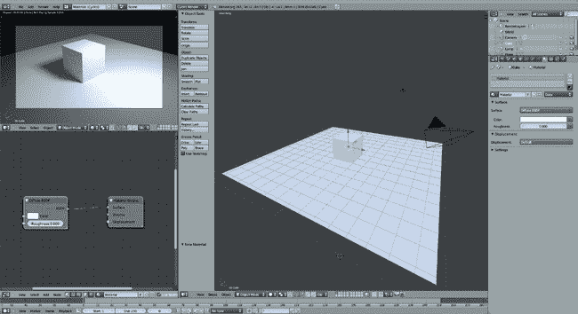图 12-26. 编辑 Cycles 材质时的屏幕布局

我对我的高光颜色贴图做了同样的操作，将其连接到高光颜色节点的颜色输入。默认情况下，这些纹理的映射使用的是活动的 UV 坐标集，所以你不需要严格手动定义它。但是，因为知道纹理使用了哪些坐标会有所帮助，我在场景中添加了一个纹理坐标节点，并将它的 UV 输出连接到我的图像纹理节点的向量（蓝色）输入。这样做会告诉这些节点使用活动的 UV 映射作为它们的纹理坐标来源。到目前为止的节点设置如图 12-27 所示。

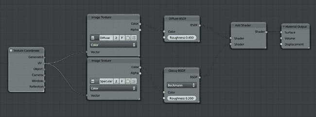图 12-27。蜘蛛机器人材质的节点设置演变过程

### 插槽类型

现在，我已经为材质设置了一个相对复杂的节点设置，让我们来谈谈节点插槽。节点插槽是表示节点输入和输出的小彩色圆圈，它们允许通过单击并拖动连接线，从一个节点的输出插槽连接到另一个节点的输入插槽。请注意，在图 12-27 中，我们用来连接节点的插槽都具有匹配的颜色——绿色对绿色，黄色对黄色。颜色必须匹配，因为不同的输出插槽传递不同类型的数据，而不同的输入插槽期望不同种类的数据。有些可能需要颜色信息，有些只需要单一的数值，其他的可能需要像纹理坐标或法线这样的向量信息。

节点插槽采用颜色编码，以便明确节点期望什么类型的输入以及它产生什么类型的输出：

+   蓝色插槽用于向量数据。它们可以携带多个值，例如 UV 坐标（二维）或位置数据（三维）。

+   绿色插槽用于着色器。它们传递所有决定材质如何与光交互的信息。

+   灰色插槽用于数值数据。它们携带单一的数值。

+   黄色插槽用于颜色数据。它们传递 RGBA 值（红色、绿色、蓝色和 alpha）。

某些类型的插槽可以混合使用。例如，数值插槽可以用作颜色插槽的输入，Blender 会将数值数据当作黑白图像处理。颜色插槽也可以连接到数值输入，Blender 会使用颜色的整体亮度作为数值输入。然而，着色器插槽更加复杂，只能连接到其他着色器插槽。

#### 粗糙度贴图

在第十一章中，我为蜘蛛机器人创建了一个粗糙度贴图。在 Cycles 中，我可以将此贴图连接到 Glossy BSDF 节点的粗糙度输入，来控制材质反射的模糊度或清晰度。较暗区域的反射会比较清晰，而较亮区域的反射会比较模糊（记住，这与硬度贴图正好相反）。

为了实现这一点，我添加了一个新的图像纹理节点，加载了粗糙度贴图，并将其输出连接到 Glossy 节点的粗糙度输入。因此，纹理的亮区域有了更模糊的高光，而暗区域则有了清晰的光滑高光。

我还将图像纹理的颜色空间从图像节点的下拉菜单中设置为 Non-Color Data，以指示该节点不是用作颜色图像，确保 Blender 不会对该节点进行伽玛校正。

#### 调整输入

为了最大限度地利用我的纹理而无需在 GIMP 中编辑它们，我使用 Blender 的节点进行了调整。例如，为了稍微加深漫反射颜色，并使光滑着色器的反射稍微更锐利，我添加了一个 Color Mix 节点，将其类型设置为 Multiply，因子设置为 0.5，并将第二个颜色输入设置为黑色。

当将此 Color Mix 节点拖动到图像纹理节点和着色器节点之间的连接时，Blender 会自动将其添加到链中。（连接将被高亮显示，当你松开它时，新的节点将被插入。）我对漫反射贴图和 Diffuse BSDF 着色器之间的连接做了这个操作，以稍微加深纹理。

对于 Glossy BSDF 着色器，为了使反射更锐利，我需要减少输入到粗糙度着色器的值。我通过在粗糙度图像纹理节点和光滑着色器的粗糙度输入之间添加一个 Math 节点来实现这一点。我将节点的操作设置为 Multiply，并将节点的第二个值设置为 0.5。这样，粗糙度图像的值在传递到 Glossy Shader 节点之前被减半，从而使着色器输入的整体粗糙度减半，产生更锐利、更光滑的反射。

对于网格的闪亮绿色区域，我根据表面与相机之间的角度，加入了一些颜色变化。这使得材质呈现出一种漂亮的虹彩效果。我通过添加一个几何输入节点（SHIFT-A▸输入▸几何）来提供表面法线作为输入，并使用法线节点与视角方向进行点积运算。我然后用这个点积输出通过色调饱和度值节点来修改反射色彩贴图的色相。通过使用法线节点的点积输出，我得到了一个随材质表面法线变化的值（而非向量）。当这个值用于影响色调饱和度值节点的色相输入时，材质的颜色会随着表面从相机方向倾斜而微妙地发生变化。你可以在图 12-28 中看到我使用的节点链。这是一个相对复杂的设置，但通过查看它并亲自测试，你应该能理解它的原理。

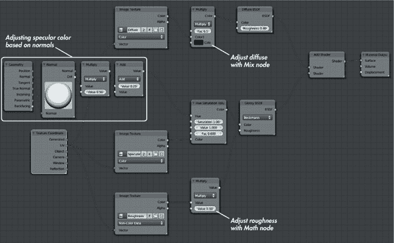图 12-28. 蜘蛛机器人材质，添加了一些节点来调整纹理效果

### 其他材质

我仍然需要为蜘蛛机器人制作几个材质：眼睛的闪亮材质（我使用了一个简单的光泽着色器，设置为深灰色，并且稍微具有 0.05 的粗糙度）和电线材质（我将一个光泽着色器和一个漫反射着色器与着色器混合节点结合使用）。你可以在图 12-29 和完成的蜘蛛机器人材质在图 12-30 中看到这些材质。

## 丛林寺庙的材质

我在丛林寺庙场景中同样使用了 Cycles 渲染器。这个场景需要多种材质：叶片材质用于植被，通用材质用于岩石和土壤，以及一些我单独贴图的物体的独特材质，比如前景的石块和雕像。

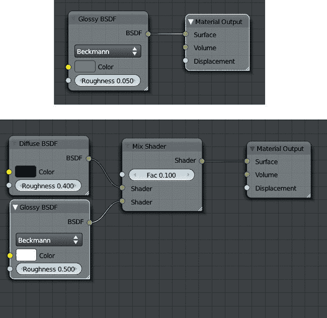图 12-29. 额外的蜘蛛机器人材质。上：眼睛，简单的光泽材质。下：电线，一个漫反射 BSDF 着色器与粗糙的光泽 BSDF 着色器混合。完成的蜘蛛机器人材质外观。有关照明和渲染的详细信息，请参见第十三章和第十四章。](httpatomoreillycomsourcenostarchimages1538788.png.jpg)图 12-30. 完成的蜘蛛机器人材质外观。有关照明和渲染的详细信息，请参见第十三章和第十四章。

### 地面

地面材质可能是最简单的创建过程。它只是将漫反射 BSDF 着色器和光泽 BSDF 着色器混合在一起，使用我绘制的纹理作为颜色输入。因为我觉得原始纹理使得材质显得有些偏浅，所以我使用 Gamma 节点稍微加深了它们的颜色，而不会丧失太多对比度（见图 12-31）。

### 石材材质

对于我的石材材质，我希望将我在第十一章中制作的两种不同的石材纹理结合起来，让每种纹理在不同的区域显示出来，以便在材质的外观上增加一些变化。为此，我首先创建了一个基础的着色器，通过使用 Shader Mix 节点将漫反射着色器和光泽着色器混合在一起。我通过 Layer Weight 节点控制混合的量，使用它的 blend 输出。Layer Weight 节点根据网格的法线从 0 到 1 进行混合：朝向相机的表面获得低值，而背离相机的表面获得高值（具体值取决于所使用的输出——朝向或菲涅尔）。使用该节点的 Facing 输出控制光泽和漫反射着色器之间的混合，产生了物体边缘的光亮高光，同时当从正面查看时，物体呈现出更漫反射的外观，如图 12-32 的第一部分所示。

为了为不同的石材纹理创建一个斑驳的分布，我结合了几个不同尺度的 Voronoi 纹理节点，然后用这些节点来控制岩石的不同纹理之间的混合，包括镜面和漫反射贴图，如图 12-32 所示。2 我还使用了一些 Map 节点来放大我的岩石纹理的贴图，使它们相互匹配并适应场景的尺度，你可以在图 12-32 3 中看到。

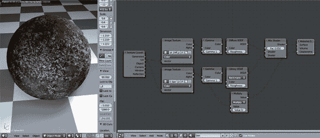图 12-31。丛林神庙场景的土壤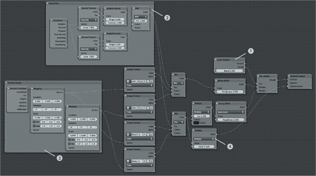图 12-32。我的岩石材质设置有点复杂。一个 Layer Weight 节点 1 用于混合镜面和漫反射着色器。两个 Voronoi 纹理加在一起 2 控制岩石纹理的混合（两个用于漫反射颜色，两个用于镜面反射）。纹理本身通过一些 Map 节点 3 进行缩放，镜面颜色也用于位移 4。

#### 位移

Cycles 目前支持使用黑白输入（或将 RGB 输入转换为单一值）来模拟材质表面小凸起的效果。这通常在其他渲染引擎中被称为*凹凸贴图*。Cycles 目前尚不支持法线贴图。

为了给我的岩石表面增加一些纹理效果，我将高光颜色（将两者混合）作为位移输入连接到材质输出节点，尽管我使用了乘法节点来缩小它们的值，以减少效果，如图 12-32 4 所示。最终的岩石材质如图 12-33 所示。

#### 雕像

雕像材质基本上只是通用石材材质的一个副本，不同之处在于它使用了我为雕像绘制的纹理。为了创建它，我将石材材质应用到雕像上，然后点击材质选择器下拉菜单中的+图标，使用当前材质创建一个新材质。接下来，我在节点编辑器中删除（**X**）了材质中的多余节点，并用我的雕像纹理替换它们（见图 12-34）。

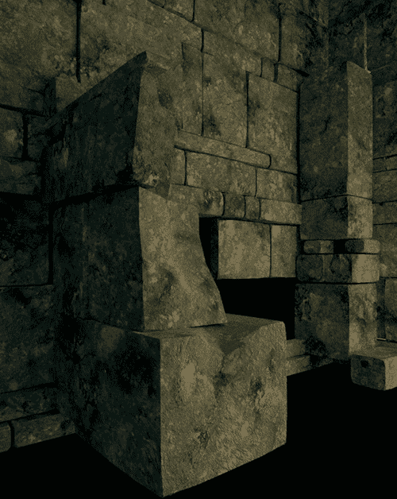图 12-33。岩石材质！雕像材质与岩石材质非常相似，不同之处在于它使用了自己的纹理。图 12-34。雕像材质与岩石材质非常相似，不同之处在于它使用了自己的纹理。

### 叶子

对于叶子，我想要一个半透明材质，这样当从未照亮的一侧看时，叶子也能呈现出明亮的效果。为实现这一点，我将半透明 BSDF 着色器与漫反射 BSDF 着色器混合，并在上面混入高光以使叶子发亮。叶片网格必须是透明的，以使网格中不是叶子的区域不可见。我通过将目前为止所有节点的结果与透明 BSDF 着色器混合来完成这一点，使用第十一章的 alpha 贴图来控制混合（见图 12-35）。

### 前景岩石和土壤

在 第十一章中，我为从相机角度看过去的前景物体创建了一个手绘纹理。为了使用这个纹理，我需要为这些物体创建一个独特的材质。我首先复制了为雕像创建的材质，然后将它的纹理输入替换成我为前景物体创建的纹理。

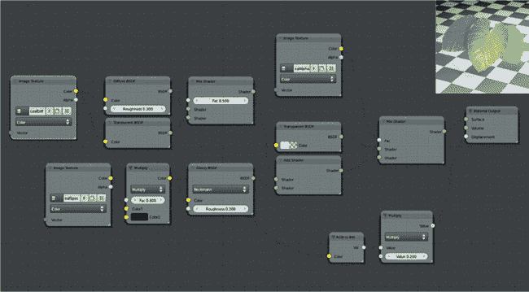 图 12-35. IvyGen 叶子的材质。其他叶子共享纹理和相同的材质，以相同的方式创建。

为了正确地将纹理映射到模型上，我将 3D 视口切换到相机视图（NUMPAD 0），并使用 Unwrap▸从视图投影操作对每个应用材质的前景物体进行 UV 展开。这样，物体的 UV 坐标就会投影到与相机视角匹配的位置，从而使我能够将 UV 坐标作为纹理坐标。该材质的节点可以在 图 12-36 中看到。

### 水坑

对于水坑，我需要一个水材质，能够让一些光线穿透表面并显示反射。单独使用玻璃材质就可以完成这项工作（使用折射率 1.33，与水相同），但为了更好地控制光线穿透表面的程度以及反射的强度，我将透明、玻璃和光泽 BSDF 着色器混合在一起。我使用了光泽着色器，通过将层权重节点连接到混合节点，以便在低视角下获得额外的反射效果。

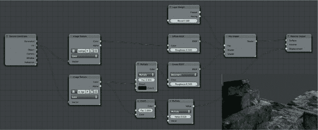 图 12-36. 前景岩石和土壤的材质

为了在水面上生成波纹，我创建了一个波纹纹理节点（SHIFT-A▸纹理▸波纹纹理），并将其连接到材质输出节点的位移插槽，以在水面上创建一些扭曲效果。默认情况下，波纹节点产生直线型、重复的波浪，但通过将波浪类型设置为圆环并增加扭曲值，可以得到一些漂亮的波纹效果（见 图 12-37）。

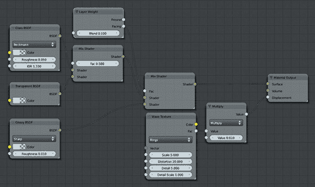 图 12-37. 水材质，通过混合透明、玻璃和光泽 BSDF 着色器，并使用波纹纹理提供一些位移

## 创建材质的一般技巧

在创建项目材质时，有一些一般性原则需要牢记。主要是要关注你尝试复制的材质在现实世界中的表现，并据此构建你的材质：

****保持反射量的合理性。**** 确保你的物体反射的总光量是合理的。在 Cycles 中使用 Add 节点组合着色器时，可能会通过添加过多的着色器，导致一个材质反射的光比它实际接收到的光更多。同样，在 Blender Internal 中，记得扩散和镜面反射量（加上物体吸收的光）应该大致加起来为 1——例如，扩散强度为 0.6，镜面强度为 0.3，剩下的则是吸收的光。否则，你的材质会显得不真实地明亮，与其他材质不协调。

****没有完美的材质。**** 没有材质能够反射所有光线的 100%，也没有材质能够完全吸收所有光线。尽量避免制作完全黑色或完全白色的材质（除非你有充分的理由这样做）。

****适度使用饱和度。**** 即使是像塑料这样颜色鲜艳的材质，它的颜色也很少会达到 100%饱和。大多数日常颜色的饱和度都低于 85%，因此，保持材质的颜色在合理范围内，使其看起来更可信。

****保持简单。**** 尽量避免制作复杂的材质，以确保较短的渲染时间。例如，在 Blender Internal 中，只有在确实需要时，才使用光线追踪反射。

****用程序纹理补充材质。**** Blender 内置的程序纹理是通过将它们用作凹凸贴图或融合其他纹理来补充材质的好方法。这样做可以为你的材质增加很多变化，同时避免你必须费力地手工绘制纹理。

## 审查中

本章开始时，我们先看了 Blender 在创建材质时的选项，包括 Blender Internal 渲染器和 Cycles 渲染器。由于这两种渲染引擎在创建材质时需要不同的方法，我们探讨了它们各自的选项和要求。然后，我们开始为三个项目创建材质。对于 Bat Creature，我为身体、毛发、眼睛、指甲和牙齿创建了兼容 Blender Internal 的材质。对于身体，我创建了一个带有次表面散射的材质，以模仿真实的皮肤；对于毛发，我介绍了毛发材质和渲染的不同选项。我使用了 Blender 的发丝着色器来渲染毛发，并探讨了如何将纹理应用于毛发。

对于 Spider Bot 和 Jungle Temple 场景，我为使用 Cycles 渲染的材质创建了材质，使用 Blender 的节点编辑器通过组合着色器节点并使用纹理来提供它们的输入，创建了多种不同的材质。

这些项目现在已经准备好进行照明和渲染。在第十三章，你将学习不同的照明设置以及如何在 Blender Internal 和 Cycles 中使用照明。
