## 第十三章. 照明

照明可能是影响我们如何感知图像的最重要因素。照明可以改变图像的基调，使人物和场景看起来既可以是阴暗和险恶的，也可以是温暖和诱人的。在本章中，我将使用各种技术为我到目前为止创建的项目添加照明，包括 Blender Internal 的一系列照明选项和 Cycles 更物理准确的光源创建方法。

## Blender Internal 与 Cycles 照明的比较

Blender Internal 和 Cycles 都拥有多种强大的照明工具。Blender Internal 支持多种不同表现方式的灯光，并提供两种渲染阴影的方法——使用阴影缓冲区或光线追踪——这两种方法稍后会讨论。

Cycles 仅使用光线追踪进行照明，它的效果比 Blender Internal 更真实。它还支持从网格中发光，允许你创建任何形状的光源。但是，虽然 Cycles 是更真实的照明渲染器，但 Cycles 和 Blender Internal 并不适合所有情况，两者各有优缺点。例如，Blender Internal 的灯光渲染速度快，使用广泛且风格多样，而 Cycles 提供了一种可靠且真实的光照方式，不需要大量调试就能获得好的效果。在本章中，我们将使用两种渲染器，在 Blender Internal 中为蝙蝠生物进行渲染，并在 Cycles 中为蜘蛛机器人和丛林神庙进行渲染。

## Blender Internal 中的照明

Blender Internal 使用 Blender 的灯光对象来照亮场景。要创建灯光，请在对象模式下按 SHIFT-A，然后在 Lamp 下选择以下之一：

****面积灯****。这会创建一个方形或矩形的灯光，从其整个区域发出光线。面积灯支持光线追踪阴影，适合创建柔和的阴影和工作室风格的照明，但由于它们需要更多的样本来生成无噪点的结果，因此可能会显著增加渲染时间。

****半球灯****。这种灯光以漫射的方式照亮整个场景，类似于天空中的户外光。由于它不支持阴影，因此渲染非常快速，但用途有限。

****点光源****。这会创建一个点光源，从灯光中心向各个方向发出光线。它支持光线追踪阴影，是一个良好的通用灯光。

****聚光灯****。聚光灯就像剧院中的聚光灯或手电筒。它们从原点以锥形发出光线，是照亮特定区域的好工具。它们支持光线追踪阴影和阴影缓冲区。阴影缓冲区在不进行光线追踪的情况下生成阴影，通常渲染速度比光线追踪快得多。这使得它们非常多功能，适用于需要高度控制照明的场景。

****太阳****。此光源从一个方向照亮整个场景，就像太阳一样。它支持光线追踪阴影。

每个灯光的设置可以从属性编辑器的对象数据选项卡中进行更改，当灯光被选为活动对象时，该选项卡会显示一个灯光图标。您可以调整灯光的亮度和*衰减*——即光线强度衰减的距离——以及阴影、颜色等设置。尽管不同的灯光——特别是聚光灯——有一些独特的功能，但它们通常共享相同的设置。点光源的设置如图 13-1 所示，并在下文中进行讨论。

****光源颜色****。该颜色选择器允许您选择光源的颜色。

****能量****。此选项确定光源的整体强度。

****衰减****。仅适用于点光源和聚光灯，此选项控制光线强度衰减的距离和曲线。下拉菜单允许您为衰减选择衰减曲线（选择反平方以获得逼真的衰减效果，并尝试其他选项）。*距离*让您指定衰减的总体距离——设置越高，光源的扩散越远。*球形*设置使光线强度在确定的距离内逐渐衰减至零，而不是无限期地减弱。

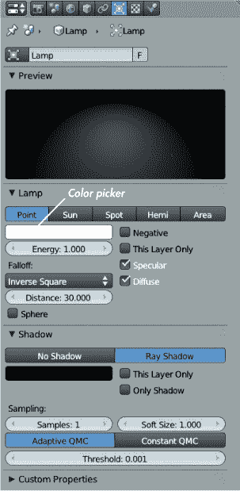图 13-1. 点光源的设置

****负值****。这将光源转变为*“反向”灯*，从场景中去除光线，而不是增加光线。此设置对于创建暗角或隐藏场景中的阴影区域非常有用。

****仅此层****。此选项使光源只照亮同一层上的物体。此设置对于单独照亮某些物体非常有用。

****镜面反射/漫反射****。这些设置让您控制光源是否对镜面反射和漫反射产生影响。关闭灯光的镜面反射可以将柔和的照明添加到一个区域，而不会产生高光。通过关闭漫反射，您可以将光源精确定位，确保高光的效果而不改变整体的漫反射照明。

## Blender 内部的阴影

Blender 提供两种渲染阴影的方式：光线追踪和阴影缓存。

### 光线追踪

第一种方法使用光线追踪来确定网格中处于阴影中的部分。光线追踪“发射”射线从相机出发，针对图像中的每个像素并将其绘制到像素面对的表面。进一步的射线会绘制到场景中的光源，以确定该点是处于光照中还是阴影中：如果射线可以直接到达光源而不与其他物体相交，则该点被照亮；否则，它处于阴影中。

当存在多个光源或软阴影时，每个像素必须投射多个光线，从而增加渲染时间。光线追踪反射和透明度也是如此，其中光线可能会被反射或折射多次。光线追踪能够生成清晰的像素完美阴影以及软阴影，它比阴影缓冲更准确，但通常渲染速度较慢。

### 阴影缓冲

另一种方法是使用阴影缓冲，这仅适用于聚光灯。阴影缓冲利用聚光灯的受限光照锥来创建一个贴图，显示灯光覆盖的角度范围内哪些区域处于阴影中。实质上，Blender 从灯光的视角生成场景的基础渲染：可以从灯光视角看到的区域被照亮，而看不见的区域则处于阴影中。

阴影缓冲阴影通常比光线追踪阴影渲染更快，而且与毛发的 strand 渲染器兼容。实际上，聚光灯的深度阴影缓冲选项非常适合渲染毛发投射的阴影。但要获得准确的缓冲阴影，通常需要通过提高阴影缓冲贴图的分辨率来实现，这会占用大量内存，且低分辨率的缓冲阴影边缘可能会显得锯齿状（参见图 13-2），因此一定要正确设置它们。

#### 常见的阴影选项

在灯光设置的阴影面板中，以下选项适用于光线追踪阴影和缓冲阴影。

****阴影颜色****。 该选项允许你为阴影设置颜色。当然，实际上阴影是没有颜色的，因此这实际上是一种技巧，旨在帮助改变照明的美学。将其设置为*黑色*即可获得正常（无色）阴影。

****仅此图层****。 这会使得只有与灯光在同一图层的物体才会投射阴影，尽管任何图层上的物体都可以被灯光照亮，只要在灯光面板中没有启用相应的选项。

****仅阴影****。 这会使灯光仅投射阴影，意味着你需要其他光源来照亮场景中的物体。此选项可用于在特定位置创建阴影，而不影响整体的光照效果。

#### 光线追踪阴影选项

启用灯光的光线阴影选项时，会出现以下选项：

****采样数****。 这决定了每个像素用于软阴影的采样数量，以确定阴影的强度。较高的采样数会产生更少噪声的结果。将采样数设置为 1 时，无论软阴影大小如何，阴影的边缘都会是硬的。

****软尺寸****。此设置旨在通过扩展光源的面积来生成柔和的阴影。软尺寸越大，阴影就越柔和，轮廓也越不清晰。较大的尺寸需要更高的样本数量才能产生无噪声的结果。

****自适应/常量 QMC****。此设置用于确定一个表面上的点是否处于阴影中。对于*常量 QMC*，采样的数量始终是由样本设置指定的数量。对于*自适应 QMC*，对于明显处于阴影中或不在阴影中的区域，可能会采取更少的样本。*阈值*值决定了确定需要多少样本的确定性要求：较高的阈值更宽容且速度更快，但可能产生更嘈杂的结果。

#### 阴影缓冲区选项

为聚光灯选择阴影缓冲区阴影时，会出现以下选项：

****缓冲区类型（经典/经典-半途/不规则/深度）****。这些类型的具体技术细节相当复杂（你可以通过一些谷歌搜索找到详细信息），但它们之间的区别其实非常简单明了。

+   ****经典****。这些缓冲区是最简单的，可能会受到偏差伪影的影响（请参见图 13-2）。

+   ****经典-半途****。这些缓冲区在经典阴影缓冲区的基础上进行了改进，减少了偏差伪影的出现。

+   ****不规则****。这些阴影缓冲区始终产生清晰、干净的阴影且没有锯齿，但不能用来生成柔和的阴影，而且它们创建的阴影不会出现在光线追踪反射中。

+   ****深度****。这些阴影缓冲区是最先进的，可以存储透明度信息，从而实现透明物体的部分阴影效果。它们非常适合渲染头发、毛发等材料的阴影，以及体积材质的阴影。

****滤镜类型****。用于混合阴影边缘的滤镜类型。*高斯*滤镜提供最平滑的效果。

****柔和****。此设置根据用于投射阴影的灯具的大小来调整阴影的柔和度。较大的数值会产生更柔和的阴影，但需要更多的样本。

****偏置****。此项调整阴影缓冲区的计算方式。它用于防止由于灯光与物体表面夹角较低而导致的阴影伪影（见图 13-2）。更高的值可以减少偏置伪影，但也可能导致网格的某些部分无法投射应有的阴影，因此在不引入伪影的情况下应尽量将此值设置为最低。

****采样缓冲区****。此项决定渲染的阴影缓冲区数量。较高的值能够提供更好的硬边阴影的抗锯齿效果，但更多的缓冲区会占用更多内存，因此使用时需要谨慎。

****大小****。此项设置阴影缓冲区贴图的分辨率（见图 13-3）。数值越高，贴图中能够捕捉到的细节越多，渲染所需的内存也越多。如果你想要柔和的阴影，实际上你不会在阴影中看到太多细节，因此高分辨率仅用于需要更硬阴影的场景。

****裁剪开始/结束****。这些设置定义了阴影缓冲区中对象投射阴影的距离范围。超出此范围的物体仍会被聚光灯照亮，但不会投射阴影。这个范围的大小在 3D 视口中以从灯光中心向外延伸的实线显示，介于裁剪开始和裁剪结束距离之间（见图 13-4)。

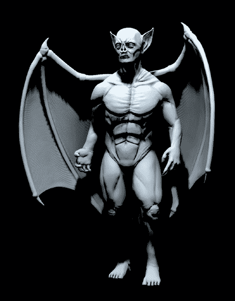图 13-2。这里展示了低阴影缓冲区大小下的阴影缓冲偏置伪影，以夸大效果。增加偏置值可以避免这些伪影，但过高的设置可能会导致一些应有阴影的丢失。

****自动裁剪开始/结束****。启用这些选项后，由 Blender 自动根据灯光视角下可见的顶点来设置裁剪开始和结束距离。

## Cycles 中的照明

在 Cycles 中，光照设置与 Blender Internal 非常相似，但选项较少。在 Cycles 中设置光照更为简便，因为你可以立即通过渲染预览获取反馈。Cycles 中的光源基于节点，并由着色器构成，和材质一样。事实上，Cycles 允许你将光的发射整合到材质*和*灯光物体中。我们将在此讨论这两者。

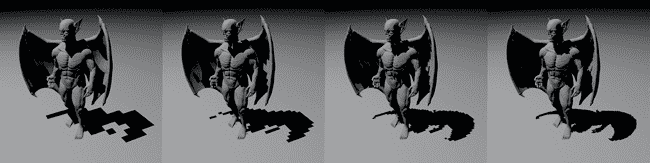图 13-3。阴影缓冲区大小设置会影响阴影的定义，并减少阴影边缘的锯齿。在这里，展示了在逐渐增加的分辨率下，部分过度拉伸的阴影缓冲区。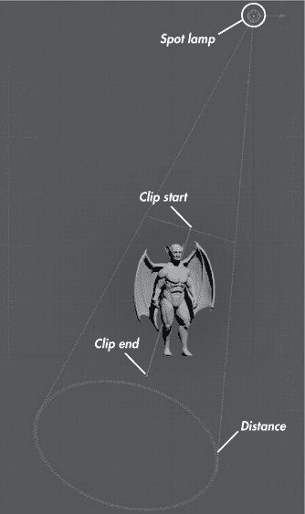图 13-4。3D 视图中的聚光灯，显示裁剪范围

### Cycles 中的灯光物体

Cycles 支持大多数与 Blender Internal 相同的灯光类型，除了 Hemi 灯光。在 Cycles 中添加新的灯光物体时，会自动为灯光的输出节点添加一个标准的发射着色器，如图 13-5 所示。这个着色器可用于调整光照的强度和颜色。要调整灯光生成的阴影的柔和度，请使用灯光的“大小”设置，该设置位于属性编辑器的对象数据标签中。

### 注意

*避免将灯光的大小设置为 0，因为这会导致“萤火虫”现象——一种由单个亮点像素组成的噪声。如果你需要锐利的阴影，只需将大小设置为非常小的值，但不要设置为 0。*

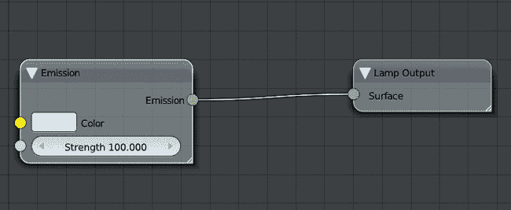图 13-5。发射着色器在 Cycles 中同时用于灯光物体和网格发射物体。

### Cycles 中的网格发射物体

Cycles 支持材质的光照发射，这意味着你可以通过应用包含发射着色器的材质，将任何网格变成光源。这个功能非常适合创建独特的光照设置以及在光泽反射中出现的光源。（我们将在为蜘蛛机器人设置光照时深入探讨这个功能。）对于网格发射器，你可以将发射着色器与其他着色器结合使用，通过 Add 和 Mix 节点（如第十二章所讨论）来实现。

## 世界设置和环境光与遮挡

在第十章中，我们为项目烘焙了环境光遮蔽贴图。环境光遮蔽贴图是一种模拟光线从物体周围各个方向照射并被物体本身遮挡的效果的纹理。这种效果类似于我们在阳光明媚的日子里看到的天空效果。主要光源是太阳，但光线也会在大气中散射，使其从各个方向照射，甚至照亮阴影。（这种效果在阴天尤为明显，因为缺乏直射阳光，物体的光照更均匀地来自各个方向。）

为了实现从场景周围环境中照射的光线效果，我们可以使用 Blender 的世界设置，这些设置可以通过属性编辑器的“世界”标签访问。此设置决定了场景背景的外观以及背景如何影响场景的照明效果。Blender Internal 和 Cycles 都支持世界光照，尽管方式略有不同。

### Blender Internal 中的世界设置

Blender Internal 的世界设置如图 13-6 所示。最重要的设置如下：

****地平线颜色/天顶颜色/环境光颜色****。默认情况下，场景中的天空将简单地是*地平线颜色*。当开启 Blend Sky 时，将使用*天顶颜色*，渲染出从地平线颜色到天顶颜色的渐变背景。*环境光颜色*是一个固定颜色，它被添加到场景中每个表面的照明中，亮化阴影，但这种效果非常不真实，因此最好将其设置为黑色。

****纸天/真实天****。*纸天*将应用于背景的任何纹理或混合模式应用到相机坐标上。当你有一张背景照片或图像想要保持原样不失真的时候，这会非常有用。*真实天*则在场景的全局坐标平面中创建一个带有真实地平线的背景，使得任何纹理在旋转相机时保持静止，天空中的任何混合效果都发生在“真实”的地平线以上（以及以下）。当使用全景或镜面球纹理作为背景时，真实天非常有用。

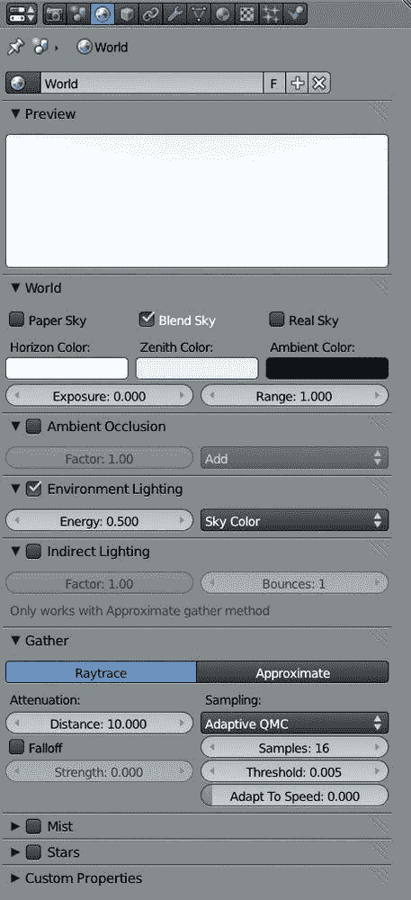图 13-6. Blender Internal 的世界设置

****环境光遮蔽****。我们在第十章中遇到过环境光遮蔽。环境光遮蔽通过周围的几何体为表面增加光照或阴影。被几何体阻挡光线的区域会变暗，而暴露在外的网格部分则保持明亮。环境光遮蔽选项可以设置为*加法*（Add）或*乘法*（Multiply），与场景中的其他光照相结合。加法型环境光遮蔽会增强现有光照，而乘法型则添加阴影。乘法型是更“真实”的选项，更适合大多数场景。（环境光照设置无论如何提供了更好的工具来为场景增加更多光照。）

****环境光照****。这会为场景添加光源，光线来自各个方向（但会被附近的几何体阻挡，就像环境光遮蔽一样）。环境光照设置可以用来模拟户外场景中来自天空的散射光，或近似光线在场景中反射并照亮的效果。环境光照的颜色可以设置为白色、天空颜色（如果你使用的是渐变天空，它会使用地平线颜色或地平线和天顶的颜色），或者如果你使用背景纹理，也可以设置为天空纹理。

****间接光照****。此设置允许 Blender 内部渲染模拟光线反复反射的效果，从而照亮更多场景，直到光线进入相机或眼睛。结果可能会出现色彩溢出现象，其中一种色彩鲜艳的漫反射材质的颜色会反射到附近的物体上（如图 13-7 所示）。该方法仅与近似采样方法（下面讨论）兼容。*因子*（Factor）设置影响该效果的强度，而*反弹次数*（Bounces）设置决定了光线从表面反弹多少次仍然会被渲染。

****收集（光线追踪和近似）****。这些设置允许你在 Blender 内部的两种世界光照渲染选项之间进行选择。与灯光类似，*光线追踪*通过每个像素多次光线追踪采样来确定世界光照的强度。这个过程提供了更准确的结果，通常会增加渲染时间和噪点（如果采样次数设置得太低）。*近似*设置不需要光线追踪，并且没有噪点，但可能会产生其他伪影，例如某些区域的过度遮挡。增加渲染次数并将误差值设置得更低可以得到更好的结果，但渲染时需要更多的预处理时间。或者，使用修正参数可以减小遮挡强度，以补偿伪影。当使用近似收集方法时，开启像素缓存通常会得到更快的结果。

****衰减****。衰减下的*衰减值*设置使得环境光照、环境照明和间接光照在一定距离内逐渐减弱，减少远距离几何体对表面影响的程度，并使表面变亮。衰减还加速了渲染，因为计算一个表面点的光照时，只需要考虑附近的几何体。*强度*设置决定了衰减的强度，而*距离*设置（仅适用于光线追踪收集方法）决定了衰减的范围。

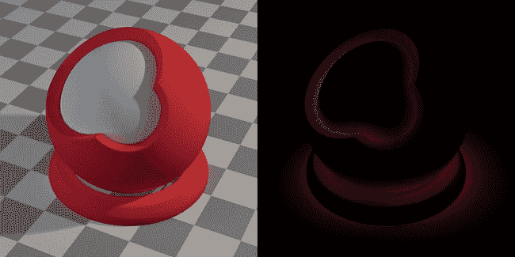图 13-7. 间接光照中的色彩溢出。这里，红色球体将红色光反射到周围环境中。这在灰色内球上最为明显。这是一个微妙的效果，因此右侧只显示了间接光照。周围环境也贡献了间接光照，如右侧图像中的灰色调显示。

### Cycles 中的世界设置

在 Cycles 中，世界设置是基于节点的，并使用与材质和灯光相同的着色器系统。世界设置仅使用背景着色器节点，它为场景提供光照，并设置背景颜色或纹理（取决于你提供的输入），以及背景光照的强度。标准的背景节点树如图 13-8 所示。

你可以像其他材质一样，通过使用纹理、图像和颜色来影响背景的颜色。特别有用的是天空纹理节点和环境纹理节点。天空纹理节点创建一个程序化的天空，使用你通过拖动节点的球体输入设置的方向，且大气散射程度由浑浊度设置决定。当与带有黄色橙色（日光）颜色的太阳灯结合时，这种效果尤其出色，能够获得一些基本的户外光照效果（见图 13-9)。

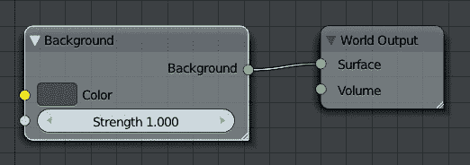图 13-8. Cycles 中的世界设置标准节点树！将背景的天空着色器与太阳灯结合，能够很好地模拟户外光照。左图：天空着色器。右图：天空光照与太阳灯结合的光照效果。图 13-9. 将背景的天空着色器与太阳灯结合，能够很好地模拟户外光照。左图：天空着色器。右图：天空光照与太阳灯结合的光照效果。

Cycles 还支持环境光遮蔽，可以用来为场景添加白色环境光，遮蔽效果基于面之间的距离。你可以通过使用属性编辑器中的环境光遮蔽选项卡，在世界选项卡中启用此效果。

在世界选项卡下的设置中，还有一个选项可以将背景作为灯光进行采样。当使用纹理背景时，特别是当使用 HDRI（高动态范围图像）贴图进行背景光照时，启用此选项可以显著加快渲染速度（见图 13-10)。

## 蝙蝠生物的光照

对于蝙蝠生物，我想要戏剧性的光照效果，使角色看起来既危险又令人不安。我需要一些深色的阴影和强烈的光照，这样就不会透露太多信息。为了创建这种效果，我使用了三点光照设置，这种设置通常用于人物和肖像的光照。此外，我还需要设置我的灯光，创建与生物毛发的良好阴影，并从生物背后进行照明，以便光线能够通过翅膀的皮肤散射出来（使用我们在第十二章中创建的次表面散射材质）。

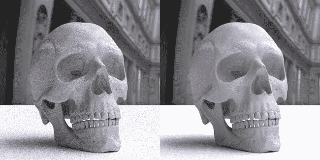图 13-10. 启用“背景纹理信息”作为灯光可以加速在渲染时减少噪声的过程。在此，使用了 HDRI 地图来照亮场景。左图：关闭“背景纹理信息”作为灯光（30 次通道）。右图：启用“背景纹理信息”作为灯光，且地图分辨率设置为 256（同样是在 30 次通道后）。

### 三点式照明

三点式照明被认为是许多肖像和电影摄影的“标准”照明布置，因为使用三盏灯光能够获得一种宜人、自然的外观，可以适应许多不同的环境并取得良好的效果。

#### 主光源

三盏光源中的第一盏——*主光源*——是场景中的主要光源，通常放置在稍微高于主体的一侧，以提供一些有趣的照明。

对于蝙蝠生物，我在角色的上方并略微偏左（从相机的角度看）添加了一个聚光灯，如图 13-11 所示。主光源将提供大部分照明，因此我将其强度设置得很高（大约为 12），并将距离设置得很低（大约为 3），使得光的强度能够相对快速地衰减。我给光源加上了蓝色的色调，如图所示。

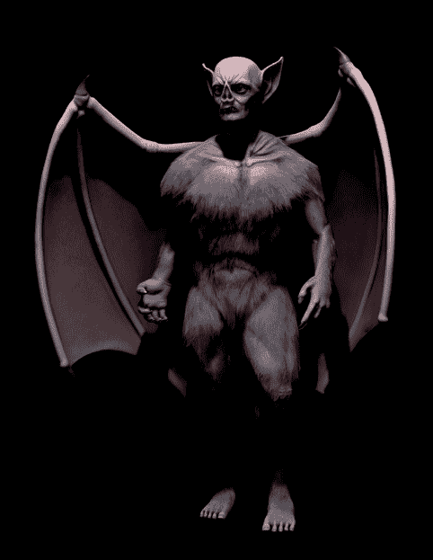图 13-11. 主光源的效果

#### 辅光

下一个光源——*辅光*——通常放置在主光源的对面，通常从另一侧照亮主体，通常为主光源投射的阴影添加一些微妙的光线。由于我希望蝙蝠生物的阴影非常深，我将辅光的强度设置为 0.5，距离设置为 6。我将其颜色设置为红色调，以与蓝色的主光源形成对比。辅光的效果如图 13-12 所示。

### 注意

*虽然辅光通常来自主体的对面，但我将辅光放置在角色的右侧（相机的左侧），因为蝙蝠生物的左翼（相机右侧）遮挡了身体。*

#### 背光

背光（有时也叫做*轮廓光*）是从背后照亮一个对象，通常会在对象的边缘添加微妙的高光。这种光源对蝙蝠生物尤其重要，因为它通过翅膀和耳朵散射光线。我将其强度设置为高（到 10），距离设置为 10，以便光线足够明亮，能够透过翅膀照射（见图 13-13）。总的来说，关键光、填充光和背光共同产生了最终的照明效果，如图 13-14 所示。

#### 灯光定位

定位三种光源时，需要考虑你希望照亮模型的哪些部分，以及你希望光线从哪里来，然后进行一些反复试验。为了帮助这一过程，并且能更快地获得关于灯光效果的反馈（而不需要每次都渲染），可以使用 Blender 的 GLSL 着色模式来实时查看灯光在 3D 视图中的效果（见图 13-15）。这对于聚光灯尤其有效，因为 GLSL 也支持缓冲阴影，这意味着 GLSL 预览的效果会接近最终渲染效果。通过进入 3D 视图窗口顶部设置并将着色模式设置为**纹理**，可以开启此着色模式。然后，在属性区域的显示选项中，将着色类型设置为**GLSL**（按**N**键显示 3D 视图中的属性区域）。之后，你可以自由移动光源，并实时查看其效果。

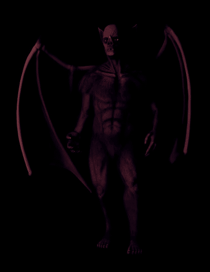图 13-12。填充光源为阴影增加了微妙的照明。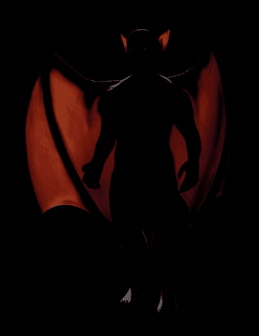图 13-13。背光源在角色的轮廓周围提供高光（即在肩膀和后脑勺）。在这种情况下，它还通过翅膀和耳朵散射光线。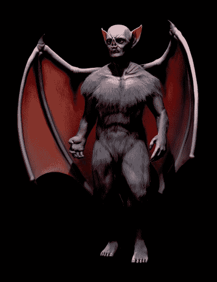图 13-14。三种光源共同作用，形成最终的照明效果。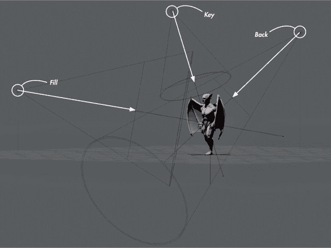图 13-15。使用 GLSL 着色模式进行灯光位置调整反馈

GLSL 着色支持除了面积光源外的所有光源，尽管它仅为带有缓存阴影的聚光灯渲染阴影。

### 黏土渲染和材质重载

另一种了解你的光照效果的方法是通过渲染场景并将相同的材质（通常是平面漫反射材质）应用于每个物体。通常称为*黏土渲染*，这可以让你看到光照在孤立情况下的表现，并且有助于检查你的渲染问题是由于光照还是材质造成的。

要快速设置黏土渲染，可以在属性编辑器的渲染选项卡中使用材质重载选项。创建一个新的平面灰色材质（只需使用默认材质并降低高光度），并将其分配给层面板中的材质重载选项，以便在不使用纹理和材质的情况下渲染场景，如图 13-16 所示。按 F12 进行渲染。（有关渲染的更多内容，请参阅第十四章）

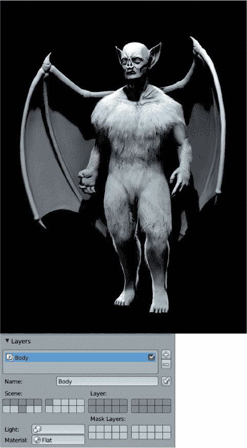图 13-16. 使用材质重载设置的蝙蝠生物黏土渲染图。在这里，我创建了一个名为 Flat 的材质，并将其分配给渲染层面板中的材质重载选项。这个技巧可以让你看到模型在孤立情况下的光照效果。

### 阴影和毛发

虽然光线追踪或缓存阴影对于大多数蝙蝠生物来说都很合适，但我们的毛发有更具体的光照要求。为了获得最佳效果，请在每个关键、填充和背景光源上使用深阴影缓存，并根据表 13-1 中所示的其他设置进行调整。

表 13-1. 蝙蝠生物场景中的阴影缓存聚光灯设置

|   | 关键 | 填充 | 背景 |
| --- | --- | --- | --- |
| 滤镜类型 | 高斯 | 高斯 | 高斯 |
| 软 | 12 | 30 | 10 |
| 偏差 | 0.2 | 0.2 | 0.2 |
| 样本缓存 | 1 | 1 | 1 |
| 大小 | 2048 | 2048 | 2048 |
| 样本数 | 16 | 16 | 16 |

### 眼睛的光照

眼睛是大多数角色的重要部分，确保它们被正确照明非常关键。有时，这意味着通过为眼睛添加单独的光源来“作弊”，从而获得你想要的效果。对于蝙蝠生物，我将两个眼睛对象放置到自己的图层上（按**M**将对象移动到其他图层），然后将一盏 Hemi 灯照向它们。我将灯的强度设置得较低（大约为 0.05），这样光源主要来自现有的聚光灯。接着，我关闭了灯的镜面反射选项，以防它对镜面反射产生影响。然后，我在灯的设置中开启了“仅此图层”，这样灯光只会照亮眼睛对象，增加了一些额外的光照，使眼睛更加突出。

### 地面阴影

虽然我没有为蝙蝠生物创建背景，但我知道在它的脚下加入一些阴影会改善最终渲染效果。为了单独生成阴影，我使用了材料的“仅阴影”选项。我向场景中添加了一个平面，并为其分配了一个新材料。然后，在材料设置中，我开启了透明度（设置为遮罩），并在阴影面板中开启了“仅阴影”选项。这个新材料（见图 13-17）只会渲染其他物体投射的阴影，其余的网格部分将完全透明。稍后，这将使我能够轻松地将这些阴影合成到最终渲染的背景中。我将平面缩放到足以接收蝙蝠生物的所有阴影，并使用 GLSL 着色模式作为参考。

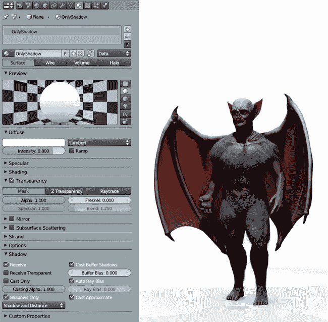图 13-17. 使用仅阴影材料在地面投射阴影，白色背景上显示

### 蝙蝠生物的世界设置

对于蝙蝠生物，我不需要做太多的世界设置，因为我稍后会合成一个简单的背景；我只需要开启环境光遮蔽。为此，我在属性面板的世界选项卡中启用了环境光遮蔽，并将其设置为乘法模式，因子为 1.0。对于采样方法，我选择了近似（Approximate）。我将通道数设置为 1，并开启了衰减（Falloff），强度为 1。这些设置与头发效果非常兼容，使用这些设置意味着在渲染时我不需要做光线追踪，因为我已经为其他光源使用了缓冲阴影。

这完成了蝙蝠生物的光照设置。我们将在第十四章中回到渲染部分。

## 点亮蜘蛛机器人

我们将使用 Cycles 渲染 Spider Bot。在这个项目中，我希望有明亮、动态的光照来展示角色的光滑表面。我通过混合网格灯光和灯光对象达到了这一效果。由于我不会使用世界光源，因此在属性编辑器的世界选项卡中，我将世界背景的颜色设置为黑色，并将其强度设置为 0，然后继续操作。

Spider Bot 的主要光源来自右侧的一个点光源对象，该光源具有橙色和高强度，如图 13-18 所示。这个光源由上方的一个网格灯光补充，网格灯光由多个带有发光材质的平面组成。为了创建这种光源，我添加了一个新的平面对象并将其移动到场景上方。接着，在编辑模式下，我多次复制了这个面，并使用 Blender 的捕捉工具（设置为增量）将平面对齐为网格。然后，我沿着*x*轴缩放整个平面阵列，使其呈现矩形。

为了让这些平面发光，我为它们分配了一个新的材质，并在节点编辑器中添加了一个发射着色器节点，并将其输出连接到材质输出节点（见图 13-18）。我为发射着色器设置了蓝色，并将强度设置为 10。由于这些光源是网格，而不仅仅是光源，它们不仅照亮了场景，还在 Spider Bot 光滑的绿色表面上产生了反射，特别是在背部，如图所示。

通过 Cycles 中的渲染预览着色模式，调整光源的强度和颜色变得非常简单。3D 视口的渲染预览可以在调整灯光时提供即时的反馈，帮助你查看灯光效果。（有关 3D 视口渲染预览的更多内容，请参见第十四章。）

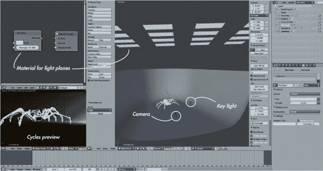 图 13-18. 为蜘蛛机器人场景添加光源。蜘蛛机器人的右侧是橙色点光源，点光源上方是网格灯光，它们的材质在左侧的节点编辑器中可见。Cycles 渲染预览是即时反馈照明效果的好方法。

## 照明丛林神庙

丛林神庙的照明设置需要更复杂的布局，但我们仍然可以利用 Cycles 渲染预览来即时查看照明效果。在这个场景中，我想要创造一种夜间气氛，让神庙入口处的光线呈现出明亮、火热的橙色。

### 世界背景

由于我将在没有世界光照的情况下照明丛林神庙场景，因此我将世界背景色设置为黑色，强度为 0。

### 神庙入口照明

我们从神庙入口处的光源开始，因为这是对场景影响最大的光源。我使用了几个光源来创建这个照明效果。第一个光源是隧道尽头的网格发射器（不在相机视野内）；我给它分配了红色和橙色的发射材质，提供贯穿隧道并稍微延伸出去的橙色光。我将这些发射材质的强度设置为大约 40。

为了将光源进一步扩展到周围环境，我在隧道口附近创建了一个黄色-橙色的点光源。我给它设置了较高的强度，以照亮更多的周围区域，并将点光源的大小设置为 1.5，以产生柔和的阴影。这些光源可以在 图 13-19 中看到。

### 填充照明

为了进一步增加光源，我在场景中央上方创建了一个较大的软点光源，以提供一些基础照明。我还在相机后方的侧面增加了一个较小的硬光源，以稍微照亮前景物体。我将这两个灯的颜色设置为偏蓝色，这让场景呈现出蓝色的月光效果，尤其是在没有隧道橙色光照的地方。（蓝色和橙色也相互对比得很好。）这些光源可以在 图 13-20 中看到。

### 背光

我还从右侧添加了一些照明，来自寺庙背后，目的是突出叶子并为寺庙墙上的岩石提供轻微的轮廓光。这个光源来自两盏灯：一盏长而浅的网格灯，主要照亮叶子的背面；以及一盏点光源，提供来自该方向的额外照明（见图 13-21）。整体效果如图 13-22 所示。

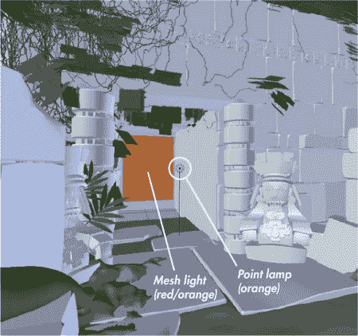图 13-19. 寺庙入口的照明

### 关于柔和阴影的说明

虽然柔和的阴影看起来很美，但它们确实会大大增加渲染时间。我最终在这个场景中使用了不少带有柔和阴影的灯光，结果渲染花费了相当长的时间。这对于静态图像来说不算什么问题，但如果你想渲染动画或需要快速结果，请记得这一点，并考虑使用投射较硬阴影的灯光，或者使用一些不投射光线追踪阴影的灯光。

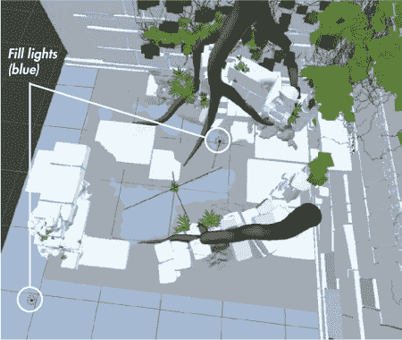图 13-20. 寺庙入口的照明结合了一些蓝色填充光照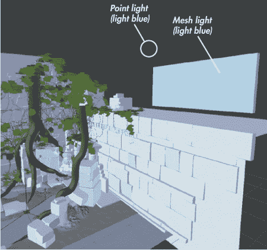图 13-21. 来自一个网格灯和点光源的背光

## 一般照明技巧

照明对图像的感觉影响很大，你可以通过照明做很多事情来改变主题的呈现方式。以下是一些技巧，可以帮助你提高照明渲染的效率，并使其在艺术表现上更为出色。

****进行实验。**** 我为所有项目尝试了许多不同的照明设置。对于丛林寺庙场景，我尝试了白天和夜间照明；而对于蝙蝠怪物和蜘蛛机器人，我实验了多种方向和颜色。创造出优秀的效果需要通过实验。

****使用测试渲染和预览。**** 使用 Blender 内部的 GLSL 着色和 Cycles 渲染预览来实时预览你的照明效果。进行测试渲染以确保你的照明效果正常。

****少即是多。**** 尽量减少使用灯光的数量，以简化调整照明的过程，并更容易看出哪些灯光对图像的影响最大。

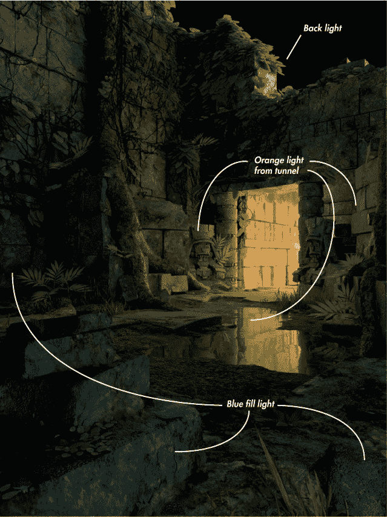图 13-22. 丛林寺庙场景的照明。这个效果将在第十四章通过合成进行微调。

****阴影设置。**** 尽管将所有灯光设置调到最大以获得最好的阴影效果是很有诱惑力的，但实际上往往不需要这么做。你可以通过实验，尽量减少那些显著增加渲染时间的设置，例如阴影样本和阴影缓冲区的大小。例如，柔和的阴影并不需要高分辨率的阴影缓冲区，而清晰且边缘锋利的阴影则不需要大量的样本。一旦你获得了喜欢的光照效果，可以尝试确定哪些设置可以调低，而不影响光照效果，从而加速渲染过程。

****充分利用阴影缓冲区。**** 阴影缓冲灯的分辨率是分布在灯光的锥形区域内的。为了最大限度地利用它，可以通过减小其角度来限制灯光，仅覆盖模型部分（在对象数据面板中的 Spot Shape 下调整 Size），确保不会将阴影缓冲区的分辨率浪费在不产生阴影的区域。

****使用对立色。**** 在照明时，运用色彩理论可以为你带来好处。通常，对立色（在色轮上相对的颜色组合，例如橙色和蓝色或绿色和紫色）作为主光和填充光的搭配效果很好（见图 13-23）。自然光往往遵循这一模式：阳光是橙色的，而大气中的散射光则是蓝色的。

****定向光照和人物。**** 你选择从哪个方向照亮一个人物，可以改变它的呈现方式。从上方照亮通常看起来威严而庄重，而从下方照亮则显得可怕且威胁。几个示例见于图 13-24。

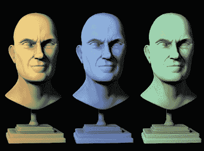图 13-23。对立的颜色通常能产生令人愉悦的光照效果。左到右：橙色主光源与蓝色填充光，蓝色主光源与橙色填充光，绿色主光源与紫色填充光。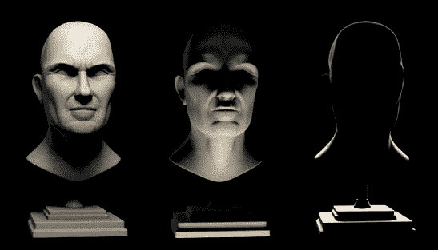图 13-24。光照方向会改变我们对角色的感知。左到右：从上方照射的光显得威严，从下方照射的光显得诡异，背后的轮廓光则营造出不祥的剪影。

## 总结

在这一章中，我们探讨了 Blender Internal 和 Cycles 中的光照设置，首先讨论了 Blender 提供的不同类型的灯具及其在 Blender Internal 和 Cycles 中的功能差异。我们研究了处理阴影的不同方法，包括光线追踪阴影和缓冲阴影，并探讨了它们的优缺点。我们还研究了 Blender 的世界设置及其对光照的影响。

对于蝙蝠生物，我们讨论了如何创建三点光照设置，以为模型增添戏剧性的效果，并研究了如何为有毛发的角色设置最佳阴影。在蜘蛛机器人和丛林神庙项目中，我使用了多种光源和网格发射物体的组合来点亮场景，创造出动态光照效果。当我在 Cycles 中使用灯光时，Cycles 渲染预览非常有用，可以实时反馈我们灯光的效果。即使在 Blender Internal 中，我也使用了 GLSL 着色来对场景中的光照和阴影进行初步反馈。

在下一章中，我们将渲染场景，并为我们的项目进行最终的颜色校正和合成。我将介绍 Cycles 和 Blender Internal 的渲染选项，并讲解如何在获取最佳渲染效果的同时优化渲染时间。我们还将探讨基于节点的合成，使用 Blender 的合成器，以及如何在 GIMP 中创建背景和进行最终调整。
