## 第十四章 渲染与合成  

在本章中，我们将进入项目的最后阶段，将每个场景转化为渲染图像，并调整它们使其看起来最佳。我们首先查看 Blender 的渲染设置，包括 Blender Internal 和 Cycles，以确定如何在最短的时间内获得最佳渲染效果。随后，我将介绍如何使用 Blender 的基于节点的合成器进一步优化、调整并调色，将这些渲染图像处理成最终图像。最后，我们将使用 GIMP 对渲染图像做些许调整。  

## 渲染选项卡  

我们在第十章中曾使用渲染选项卡来烘焙纹理。在本章中，我们将深入研究此选项卡中的其他设置。许多设置取决于使用的渲染器——Blender Internal 或 Cycles——因此我们将依次查看每种渲染器。

### 使用 Blender Internal 渲染  

Blender Internal 的渲染选项卡如图 14-1 所示。让我们来看看每个面板中的可用设置。  

#### 渲染面板  

这里包含了渲染动画和回放结果的按钮。  

****图像/动画****。这些按钮渲染当前帧（F12），或者渲染由“尺寸”面板中的“帧范围”设置指定的帧范围内的每一帧作为动画（CTRL-F12）。你可以通过播放按钮回放渲染后的动画。  

****显示****。显示设置让你设定渲染后的图像将显示的位置。如果可能，图像编辑器选项将渲染图像到一个可用的 UV 图像编辑器中，或者如果需要，渲染时临时切换其他编辑器为 UV 图像编辑器。其他选项允许你全屏渲染、在新窗口中渲染，或在后台渲染（保持 UI）。  

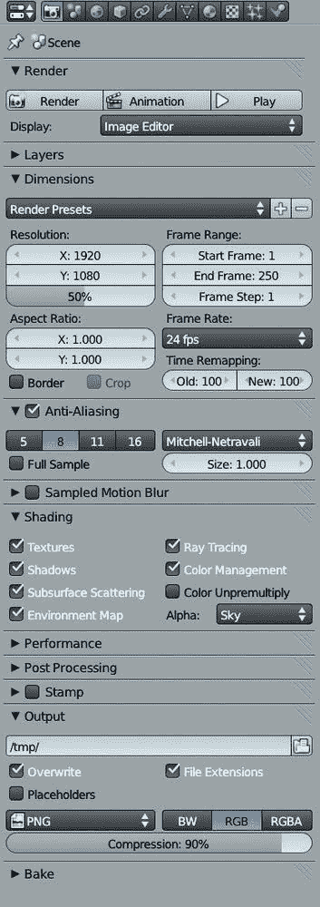 图 14-1. Blender Internal 中属性编辑器的渲染选项卡  

#### 层面板  

层面板包含了创建不同渲染层的工具和选项，以及选择哪些场景层会对最终渲染产生影响。面板顶部的层选择器让你选择要处理的渲染层。右侧的复选框用于启用或禁用渲染特定的层；右侧的 + 和 **–** 按钮用于添加或删除渲染层。  

****名称****。这个选项允许你为选中的层命名。  

****场景/图层/蒙版图层****。这三个复选框组让您选择在最终渲染中使用哪些场景图层，以及如何使用它们。在场景下启用某个图层会使该图层在 3D 视口中显示（就像在 3D 视口头部的图层复选框一样）。图层必须在场景下勾选，才能进行渲染。在图层下启用图层，使其在当前选定的渲染图层中渲染；您可以在场景下打开多个图层，但只有在图层下勾选的图层会被渲染。在蒙版下勾选的图层（但未在图层下勾选）会遮挡其他图层中的几何体，如图 14-2 所示。

****光源****。光源选项允许您指定一组光源，在渲染时将其作为场景中的唯一光源进行处理。

****材质****。如粘土渲染与材质覆盖中所讨论的，材质选项允许您在渲染时使用单一材质覆盖场景中的材质。在第十三章中，我们使用此选项对蝙蝠生物项目进行粘土渲染，以便测试光照效果。

****包含****。此选项提供多个复选框，详细描述了在渲染此图层时需要呈现的表面类型和效果。例如，您可以开启或关闭渲染*z*透明材料、毛发或固体材料。

****通道****。在一个图层内，Blender 可以渲染其他类型的信息，并将图像的各个方面分割成不同的通道，例如阴影、环境光照和*z*深度（从相机到物体的距离）。该通道只包含这些数据，可以用于合成最终图像。例如，您可以使用*z*深度通道作为 Defocus 节点的输入来创建景深效果，或者使用环境光遮蔽通道为图像添加额外的阴影。使用通道下的复选框来启用或禁用不同的通道。通过切换通道名称右侧的相机图标，某些通道可以从主渲染通道中排除。

#### 尺寸

此面板允许您设置渲染或动画的时间（帧）和空间（分辨率）维度。分辨率设置让您选择最终渲染的大小，而帧范围设置用于指定动画中的帧数。宽高比设置图像像素的宽高比（某些视频格式使用非方形像素，但对于静态图像，总是使用方形 1:1 像素）。

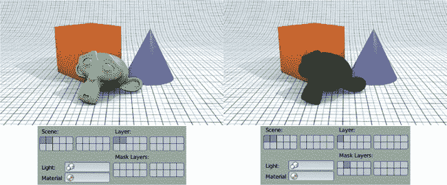图 14-2. 使用图层作为遮罩图层。这里猴子物体放置在图层 2 上，其他所有物体放置在图层 1 上。左侧，两个图层都在“图层”下勾选，一切按预期渲染。右侧，图层 2 被用作遮罩图层，因此你可以看到猴子头部遮挡其他物体的位置，形成透明空洞。

你可以使用边框和裁剪设置来渲染图像的一小部分，而不是整个图像。为此，切换到 3D 视口中的相机视图（NUMPAD 0）。然后按下 SHIFT-B 并拖动出一个矩形，覆盖你希望限制渲染区域的部分。这将自动启用边框设置。使用裁剪设置将图像的尺寸缩小到你的边框区域的大小；否则，剩余区域将被填充为黑色。

#### 抗锯齿和运动模糊

锯齿效应是像素图像中的一种伪影，因图像的有限分辨率导致锐利的边界看起来呈锯齿状（参见图 14-3）。锯齿效应通常最明显出现在物体的轮廓或阴影上，但它也可能出现在纹理或高光中。抗锯齿通过对每个像素进行多个子采样，偏移略有不同并将其混合，从而解决这个问题，生成更加平滑的边界，正如图中所示。

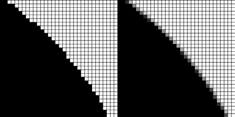图 14-3. 抗锯齿减少渲染中锯齿边缘的出现。左：无抗锯齿。右：开启抗锯齿并将子采样数量设置为 8。

使用抗锯齿面板左侧的数字来确定将进行多少个采样（更多的采样会导致渲染更加平滑，但渲染时间也会变长）。右侧的下拉菜单设置了用于混合样本的滤镜类型：默认的 Mitchell-Netravali 滤镜能够在不削弱图像清晰度的情况下提供良好的结果，但当处理高分辨率图像时，可以尝试使用高斯滤镜。使用“完整采样”选项可以让 Blender 在合成过程中保持每个样本的独立性，这有助于解决合成阶段的锯齿问题。

采样运动模糊类似于抗锯齿，不同的是它在不同的时间而不是不同的位置对每个像素进行多次采样。这样在样本合成后，会对快速移动的物体产生运动模糊效果。（本质上，图像被渲染多次，然后将结果混合。）采样的数量由运动采样设置决定，采样时间的帧数由快门设置决定。

#### Shading

Shading 面板让你开启或关闭不同的渲染选项，包括纹理、阴影、次表面散射、环境映射和光线追踪选项。为了加速渲染，可以关闭不需要的阴影选项。

Alpha 下拉菜单让你选择如何渲染图像的背景。Sky 渲染你在全局设置中设置的天空颜色和纹理。Straight Alpha 和 Premultiplied 选项将图像的背景渲染为透明。在 Premultiplied 的情况下，透明或部分透明像素的 RGB 值将在输出时与 alpha 值相乘。这种编码 alpha 值的方法也被称为*关联 alpha*，并且对于某些图像格式（如 TIFF 和 PNG）是必需的。它对于合成也很有用，因为以这种方式合成图像会产生更好的效果，尽管 Blender 的合成器有工具来处理预乘和非预乘 alpha。Straight Alpha 跳过这一步，而是渲染非关联 alpha 图像。

### 注意

*如果上面关于不同编码 alpha 值方法的讨论让你觉得复杂，那是因为它确实很复杂。我这里只做了非常简要的介绍，但它实际上是一个相当深奥的话题。欲了解更多信息，可以尝试搜索 [`www.blender.org/`](http://www.blender.org/) 和 Blender Wiki 的颜色管理内容。*

#### 性能

性能面板包含一些选项，这些选项会影响 Blender 渲染的速度，以及渲染对你计算机资源的影响。Blender 会将图像分割成多个瓦片，然后逐个瓦片进行渲染。最重要的设置是线程和瓦片。设置为固定时，这些设置允许你指定一次渲染多少瓦片（最多是处理器核心数量的两倍）。

Tiles 设置决定了要渲染的图像如何沿 *x* 和 *y* 轴被分割成瓦片。每个线程一次渲染一个瓦片，这意味着如果你有八个线程，你可以同时渲染八个瓦片。

调整 Tiles 设置可以显著影响你的渲染时间。使用过少的 Tiles 可能意味着一旦所有可用的 Tiles 被渲染完，处理器线程就会处于空闲状态，即使图像还有很多内容未渲染。使用过多的 Tiles 则会消耗更多的内存，而不会加速渲染。最佳的 Tiles 数量通常在 16（4×4）和 64（8×8）之间，更复杂的场景可以从更多的 Tiles 中受益。

该面板中的其他设置更加技术性，通常可以保留默认设置。如需了解更多有关这些设置的信息，可以参考*[`wiki.blender.org/`](http://wiki.blender.org/)*。

#### 后期处理

后期处理设置决定了应用于图像的后期处理效果。相关的选项是可以打开合成和序列器的复选框（合成应该被打开）。抖动效果会为像素的颜色添加微妙的变化，防止在具有平滑渐变的图像中出现颜色带状现象。边缘设置会在图像的几何体周围绘制卡通线条，线条效果的强度由阈值设置决定，线条的颜色由阈值设置下方的颜色选择器决定。

#### Stamp

Stamp 设置允许你在图像上印上有关渲染的数据，例如渲染时间、文件名、帧编号等。在渲染动画时，Stamp 非常有用，但对于我们的项目来说并不太有用。

#### 输出

输出设置决定了渲染结果保存的位置和格式。动画帧会自动保存，但单帧图像需要手动保存。默认的输出目录（在 Mac 和 Linux 系统上是*/tmp/*，在 Windows 上是 Temp 文件夹）决定了动画帧的保存位置，但你可以将其更改为你选择的目录。输出格式由下拉菜单决定，菜单中包括保存颜色信息的选项（黑白、RGB 或 RGB 和 Alpha）。

#### 烘焙

这些设置在第十一章中有详细讨论。

### 使用 Cycles 渲染

在 Cycles 中，许多渲染选项保持不变，所以我这里只会介绍重要的差异。

#### 采样

采样面板决定了图像中每个像素计算的样本数量，这是 Cycles 确定最终图像质量和噪点的主要方式。渲染和预览选项决定在结束渲染之前，每个像素渲染多少样本。（使用渲染进行正式渲染，使用预览进行 3D 视口中的 Cycles 预览。）更多的采样次数会减少噪点，但获得无噪点图像所需的次数会根据场景内容的不同而有所不同。种子设置了 Cycles 用于采样的随机值，不同的种子会产生不同的噪点模式。

你可以使用 Clamp 选项来防止*萤火虫*现象，即由强光源或镜面高光引起的噪点，导致过亮的像素。为此，将样本的最大亮度（*clamp* 值）设置为非零数值（大约 3 的值效果不错）。这可以防止过亮的样本过度影响像素的平均值，尽管这会牺牲一些渲染的准确性。（如果你保持默认值 0，这个功能将不会启用。）

#### Light Paths

Light Paths 面板补充了 Samples 面板中的选项，使你可以更深入地了解 Cycles 渲染场景的方式。具体来说，Light Paths 面板让你决定渲染哪些类型的光线，以及计算多少次反弹才会终止光线。更多的反弹能提供更准确（且稍微更亮）的渲染效果，但代价是更长的渲染时间。

Transparency、Light Paths 和 Bounce 设置定义了 Cycles 在每种光与物体互动时计算的最大光线反弹次数。Max 设置决定了反弹的最大总数，而其他设置则限制特定类型的光线反弹次数。Transparency 和 Overall Bounces 的 Min 设置可以提前终止折射光线，从而在牺牲一定准确度的情况下加速渲染。

"No Caustics and Shadows" 选项允许你开启或关闭焦散和光线追踪阴影，从而加速渲染。焦散是经过光滑表面反射或折射的光线，这些光线会对漫反射光照产生贡献。例如，游泳池中的阳光亮斑和放大镜聚焦的光线在表面上的效果。

#### 电影

你可以使用 Film 面板中的 Exposure 设置来调整渲染的曝光度，从而整体增加或减少场景的亮度。（然而，为了更精细的控制，最好调整灯光的设置。）Transparency 复选框决定是否以透明背景渲染，或使用全局设置。右侧的下拉菜单设置像素过滤器类型（下方是过滤器的宽度）。较小的宽度会产生更锋利的边缘，但可能会导致锯齿状效果。较大的宽度会带来更平滑的渲染效果，但会有少许模糊。

#### 层

在层方面，Cycles 的工作方式与 Blender Internal 类似，但提供了不同范围的通道。Cycles 会将每种类型的光线（漫反射、光泽和传输）分割为单独的通道，并可以将这些通道进一步细分为直接和间接通道。在合成时，这些功能可能非常有用。

## 渲染时间与质量的平衡

在渲染任何计算机图形场景时，目标是以最短的时间获得最佳的渲染效果。考虑到可以调整的变量众多，且它们都会影响渲染时间，这可能会有些棘手。不过，依然有一些通用的原则。

****从简单开始并保持有序。**** 将你的物体组织到图层中，这样更容易渲染场景的不同部分。同时，确保在渲染时没有任何不需要的物体出现在可见图层上。

****实验。**** 如果你的渲染速度很慢，尝试一次改变一个设置，看看哪个设置对渲染时间影响最大。例如，改变渲染设置或灯光的采样数，或者启用或禁用材质的某个方面，比如次表面散射或光线追踪反射。一次只改变一个设置能让你准确看到哪个设置最有影响，而改变多个设置则会让你猜测是哪个设置改变了渲染时间。如果你发现某个设置特别减慢了渲染速度，但对最终图像贡献不大，就把它去掉。

****最小化多余的几何体。**** 一旦你找到了想要的相机角度，就开始删除那些在渲染中不会被看到的物体，或者暂时将它们移到其他图层。这样可以减少 Blender 在渲染时需要追踪的几何体数量，从而加快渲染速度！在处理环境时，这个技巧尤其有用。

****简化光照设置。**** 尝试简化灯光的设置，看看是否可以去除一些灯光。特别是，查看阴影设置：较小的阴影缓冲区分辨率是否真的会有很大差异，还是光线追踪灯光并不需要那么多的采样？

随着你对 Blender 越来越熟悉，你将很快学会哪些设置会影响不同场景方面的渲染时间。与此同时，你花费的时间去实验和简化场景，几乎总是能加快渲染时间。

## 合成器

你已经按下了 F12 来渲染，并且图像完成了，对吧？其实不完全是。现在是时候使用 Blender 的合成器和 GIMP 对最终渲染结果进行后期处理了。Blender 的合成器基于节点，并使用节点编辑器（我们在编辑节点材质一节中探讨过）。在这一节中，我将向你展示如何使用合成器应用效果，比如景深、辉光和色彩分级，以及如何将不同的渲染层合成为一张最终图像（参见图 14-5）。我还将向你展示如何使用 GIMP 进行绘画和修饰。

## 渲染与合成蝙蝠生物

我想在暗色背景上展示最终的蝙蝠生物，并进行一些色彩分级。为了实现这个目标，我将渲染分成了两层：一层用于毛发，另一层用于身体的其余部分。我计划在合成器中创建一个简单的深色背景，并加上轻微的暗角效果来加深角落，保持注意力集中在蝙蝠身上。

### 渲染层

作为将蝙蝠生物分割成两个*渲染层*的第一步，我将场景分成了四个*场景层*。在（场景）层 1 上，我放置了身体（带有细分曲面和位移修饰符）以及牙齿和指甲。层 2 上，我放置了眼睛对象，以及我创建的仅照亮眼睛的 Hemi 光源（使用“仅此层”选项来设置灯光）。在层 3 上，我放置了用于创建头发的复制身体（在粒子面板的渲染选项卡中关闭了“发射器”，确保只渲染头发）。最后，在层 4 上，我放置了我的灯光、相机和地面平面。

接下来，我设置了两个渲染层。在第一个层上，我在“层”面板的“包含”设置中禁用了“Strand”选项。对于另一个层，我禁用了“Solid”选项，以便在渲染时不会渲染普通网格，而我的发丝会被渲染。我将第一个层命名为*body*，第二个层命名为*strand*。

对于“body”层，我在“层”面板的“通道”中启用了环境遮挡通道。渲染结果是两个独立的层，如图 14-4 所示。查看渲染结果（从图像选择器下拉菜单中选择**Render Result**），你可以在 UV 图像编辑器的标题栏的下拉菜单中切换这些层。

在“层”面板中，你选择的选项和设置仅适用于当前选定的渲染层。在渲染标签的其他面板中，选项适用于所有渲染层。我在“着色”面板中将 Alpha 选项设置为“Straight Alpha”，并关闭了光线追踪以加快渲染速度。（由于我使用的是缓冲阴影为聚光灯和近似环境遮挡，所以不需要使用光线追踪。）我在“尺寸”面板中将渲染尺寸设置为 2200×3000 像素，然后按下“渲染”（F12）开始渲染。

### 合成通道

渲染后，我使用 Blender 的合成器将各层合成在一起。我希望通过合成器实现某些效果，顺序如下：

1.  为身体渲染层添加一些额外的环境遮挡。

1.  将身体层和毛发层合成到一张具有纯背景的图像中。

1.  使用辉光效果软化图像中的光照。

1.  对图像进行一些基础的色彩分级。

1.  为图像添加晕影效果。

图 14-4. 蝙蝠生物的两个渲染通道

这些效果（就像合成器中的所有操作一样）需要按特定顺序应用。因为每个节点按照连接的顺序处理，所以改变你应用节点的顺序会对图像产生很大的影响。开始合成前，确保启用了“使用节点”，并且你正在编辑合成节点（而不是材质或纹理）。默认的合成节点树应该如图 14-5 所示。

初始的 Render 节点将使用你在 Layers 面板中创建的第一个渲染层，在我的例子中是主体层。我添加了第二个 Render Layer 节点（SHIFT-A▸Input▸Render Layer）来保存我的发束渲染层，并在 Render Layer 节点底部的下拉菜单中选择它。

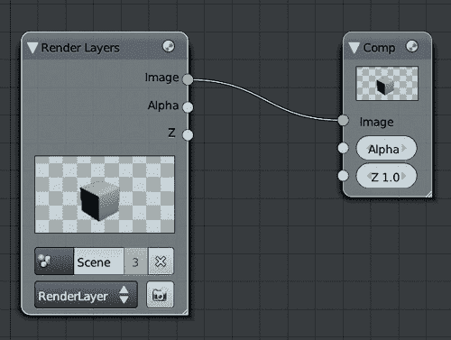 图 14-5。Blender 合成器的默认节点树相当简单。你连接到 Composite 节点插座的任何内容都会成为最终渲染输出。

#### 额外的环境光遮蔽

接下来，我使用了一个混合节点（SHIFT-A▸Color▸Mix）来增强主体渲染层上的环境光遮蔽效果。我将混合节点的混合模式设置为 Multiply，并使用主体渲染层的图像输出作为第一个输入。我使用了环境光遮蔽通道（来自标记为 AO 的插座）作为第二个输入。

为了增强效果，我用曲线节点将环境光遮蔽通道变暗，然后将其与图像相乘。为此，我添加了一个 RGB Curves 节点，并将其插入到渲染层节点的环境光遮蔽输出和 Multiply 节点之间。为了快速完成此操作，拖动节点到其他两个节点之间的连接上（你应该看到连接高亮显示），然后释放它将其插入到这两个节点之间。

最后，我将 RGB Curves 节点上的曲线变得更加陡峭（参见图 14-6）。

#### 结合主体和毛发

接下来，我添加了一个 Alpha Over 节点（SHIFT-A▸Color▸Alpha Over），将主体连接为第一个输入，毛发连接为第二个输入。为了在合成具有直通 Alpha 的层时获得正确的结果（这是我在选择渲染设置时选择的设置，参见渲染层），我启用了此节点的 Convert Premultiply 选项。这应该能产生预期的结果，不会出现任何暗边。

为了将蝙蝠生物放置在深灰色背景上，我使用了第二个 Alpha 节点，将第一个输入设置为 RGB 节点（设置为灰色），第二个输入设置为我新合并的身体和头发层，正如在图 14-6 中所示。

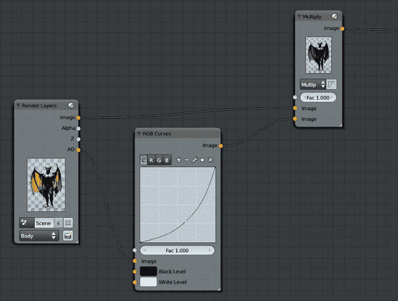 图 14-6：通过乘法节点为身体渲染层添加额外的环境光遮蔽。然后将头发合并在上面，最后使用 Alpha Over 节点将合成图放置在灰色背景上。

#### 辉光

接下来，我添加了一些辉光效果。*辉光*是现实和计算机图像中常见的效果，亮区的光线会渗透到暗区，实际上使图像中的暗区变亮。现实中的效果是由于镜头的缺陷产生的，但我可以通过模糊图像并将其叠加在原始图像上来模拟这一效果。

为了生成辉光效果，我创建了一个模糊节点（SHIFT-A▸Filter▸Blur），并将其类型设置为快速高斯模糊。我还启用了相对选项，这样我就可以根据图像的宽度指定模糊半径。如果你不知道最终渲染的分辨率，这个选项非常有用，因为无论你将渲染图像缩小还是放大，模糊的程度看起来都不会发生变化。（如果你用像素来定义半径，那就会有不同的效果。）

我将 *x* 和 *y* 半径设置为 2% 并选择了 **Y** 作为纵横比修正选项，以确保模糊效果具有正确的纵横比。（这仅适用于使用相对模糊时。）然后，我使用一个加法节点，因子设置为 0.2，将模糊图像的结果微妙地叠加到原始图像上。

最初的效果太亮了，因此在进行模糊之前，我使用了另一个 RGB 曲线节点来将图像中的暗区变暗，这样只有最亮的区域会贡献到辉光效果中。最终的节点树如图 14-7 所示。

#### 色彩修正

接着，我使用颜色平衡节点进行了一些基本的色彩校正。这个节点非常有用，可以在渲染中应用各种色彩分级效果。首先，我添加了颜色平衡节点。然后，我将正在合成的图像连接到它的图像输入，并将因子值调低到 0.6。 （颜色平衡节点可以产生强烈的效果，所以将因子值调低是一种轻松的方法，使其更加微妙，而无需对其他控制项进行非常小的调整。）

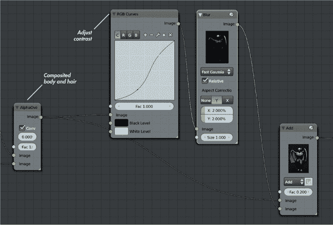图 14-7。我的辉光效果和负责的节点树。合成后的头发和身体首先通过一个 RGB 曲线节点增加对比度，然后模糊处理并覆盖在原始合成图像之上。

颜色平衡节点有三组控制，每组设置一个 RGB 颜色。你可以使用颜色轮来控制色调和饱和度，并使用垂直滑块来调整颜色。你选择的颜色将在颜色选择器下方显示。你还可以点击颜色选择器，使用 Blender 的默认颜色选择器，或者手动设置 RGB 或 HSV 值。

颜色平衡节点的输入分别命名为*lift*、*gamma*和*gain*，可以认为它们分别影响图像的阴影、中间调和高光。因此，为了使图像的高光不那么突出，你可以降低提升输入的亮度。为了让高光呈现饱和的红色，你可以将增益颜色设置为红色。一般来说，为提升和增益输入设置对立的颜色，通常会得到光暗之间有良好色调和谐的图像。

在许多好莱坞电影中，阴影通常是青色或蓝色，而中间调和高光则偏向橙色——这种配色方案与大多数较浅肤色的粉橙色调非常匹配。对于蝙蝠生物，我选择了略微偏蓝的提升色和略微偏黄的增益色。效果如图 14-8 所示。

#### 添加渐晕效果

接下来，我为图像添加了渐晕效果，稍微加深了角落部分的颜色，吸引观众的注意力集中在画面的中心。为了创造这种效果，我取了身体层的 alpha 通道，并通过一个镜头失真滤镜进行处理，失真值设置为 1。这将图像变形为一个圆形，中间保持清晰，角落部分变黑，这几乎就是我需要的效果。

然后，我使用了一个设置为快速高斯模糊（Fast Gaussian Blur）的模糊节点，模糊半径设为 50%。这个处理模糊了镜头失真节点的输出，给图像从中心向外的柔和渐变效果，随后我将其叠加到色彩校正后的渲染图像上。

最后，我在节点树的末尾添加了一个锐化节点，设置了非常低的因子（大约 0.05），并将输出连接到合成节点。最终的节点树如图 14-9 所示，结果如图 14-10 所示。

### 合成反馈与查看器节点

从你的渲染结果中创建最终合成可能是一个漫长的过程，且需要一些实验。为了帮助这一过程，Blender 在你更改节点树时会自动重新合成最终渲染结果。另一个感受节点设置工作方式的替代方法是使用“查看器节点”，这是一种辅助输出节点，允许你查看节点树中的任何阶段。

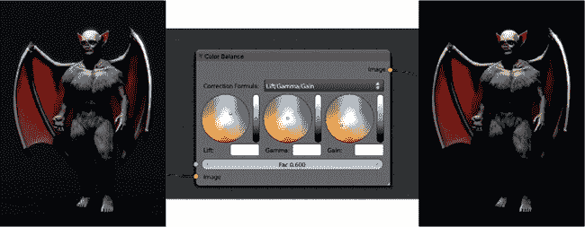图 14-8. 为蝙蝠生物的渲染添加色彩分级。左：分级前。中：色彩平衡节点。右：分级后。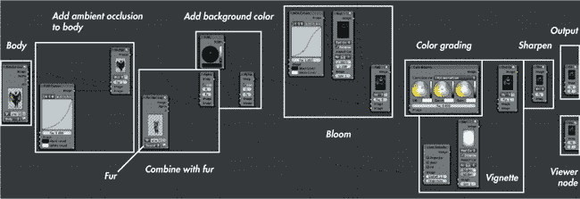图 14-9. 蝙蝠生物的合成节点树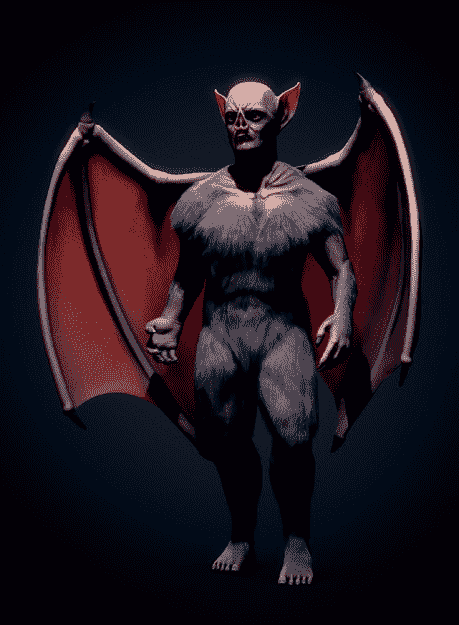图 14-10. 蝙蝠生物的合成输出

要创建查看器节点，请在节点编辑器中按 SHIFT-A▸**输出**▸**查看器**。此节点的输入连接的任何内容，将显示在 UV 图像编辑器中，如果你从下拉菜单中选择**查看器节点**或在节点编辑器头部的背景中勾选**背景**。

要快速更改查看器节点连接的节点，按住 SHIFT 并点击你设置中的任何节点。这使你可以轻松浏览节点树，逐个点击每个节点，查看它如何影响合成。（你也可以创建多个查看器节点，但这种方法保持了节点树的简洁。）

### 使用框架和节点组组织节点树

随着你添加越来越多的节点，合成用的节点设置可能变得相当复杂。如果不保持它们的组织结构，稍后回头查看节点树时可能会很困难。为了帮助解决这个问题，Blender 允许你将节点组织成框架节点和节点组。

### 框架节点

框架是大型的矩形节点，自己没有输入或输出；你可以将其他节点放置在它们上面，这些节点会“粘”到框架节点上，从而允许你将一组节点一起移动。你可以给框架节点加上标签，以标记节点设置的部分（参见图 14-11）通过在属性区域（**N**）编辑节点的名称。要将节点从框架上“解粘”，你可以使用快捷键 ALT-P，或者使用 ALT-F 将节点解粘并自动抓取它进行移动。

### 节点组

节点组与框架不同。要创建一个节点组，选择一个或多个节点并按 CTRL-G 将它们组合成一个节点。新的组节点应包含所有选定的节点及其所需的输入和输出作为插座。你可以通过按 TAB 展开组并查看其中的节点，修改它们并添加额外的输入和输出。

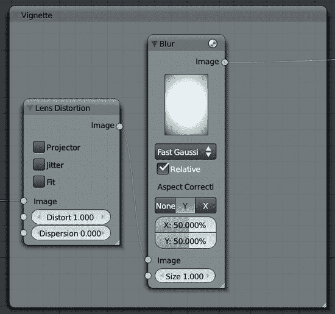图 14-11. 使用框架组织节点。一旦分配到框架，多个节点可以一起拖动，使它们更容易保持有序。

当你展开一个节点组时，其输入和输出会分别显示在组的左右两侧（参见图 14-12）。要添加输入或输出，将一个节点的连接拖动到此边框；要移除连接，点击旁边的**X**。使用每个输入或输出旁边的箭头可以重新排序它们并整理节点组。

和所有节点一样，节点组也可以复制和重复使用。一旦复制，它们就像是链接的重复对象：组内某个实例的更改会影响所有实例，从而使你可以将常重复的节点链条组合在一起，并一次性编辑它们。节点组也可以从其他*.blend*文件中链接或附加，从而使你可以重复使用现有合成设置中的部分内容。

### 在 GIMP 中修图

一旦你对你的合成作品满意，就可以将其定为最终版本并保存为图像。像 PNG、TIFF 和 Targa 这样的格式适合此用途，因为它们是无损格式（用于保存不失真的图像）。对于在网页上发布，你可能希望使用 JPEG 格式，它可以大大压缩图像，从而获得较小的文件，虽然会牺牲一些图像质量。至于蝙蝠怪物，我选择在 GIMP 中先修复一些细节，然后再定为最终版本。我想柔化一些指甲上的高光，并稍微提亮眼睛。我将其保存为 Targa（*.tga*）文件（在 UV 图像编辑器中按 F3），并在 GIMP 中打开它。

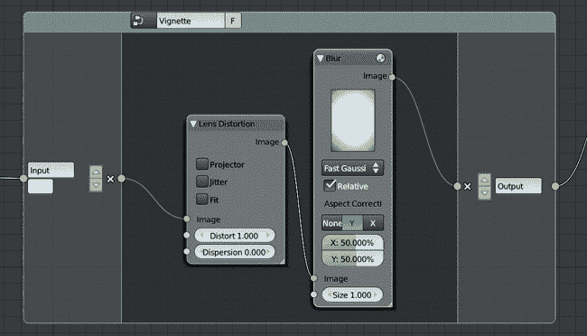图 14-12. 使用节点组

为了使眼睛变亮，我创建了一个新图层，并将其混合模式设置为叠加。然后，我在眼睛上涂抹了白色。我还添加了微妙的高光，在一个单独的图层上手动绘制了一些扭曲的反射（这次的混合模式设置为正常）。

在与反射同一层上，我还将一些指甲上的高光进行了加深，使用颜色拾取器从附近的区域取色，并在明亮的高光上涂抹。（确保在工具选项中打开**合并采样**，这样可以在不切换到当前层的情况下采样下面的图层。）最后，在原始渲染图层上，我使用模糊工具轻微模糊了一些脚部的毛发，以便将注意力从看起来有点粗糙的部分移开。

在图 14-13 中，你可以看到修饰后的眼睛。图 14-14 展示了完成的蝙蝠生物项目。

## 渲染和合成蜘蛛机器人

为了最终完成蜘蛛机器人，我想在灯光中添加颜色分级（参考第十三章），展示一些景深效果以传达机器人的小规模，并加入一些辉光效果。

景深是现实世界中通过镜头看到的图像所发生的现象，无论是相机还是人眼。镜头只能对某个特定距离的物体进行完美聚焦，这个距离被称为*焦距*。超出这个距离的物体会逐渐变得模糊。这个效果可以是微妙的（甚至不值得处理），也可以是显著的。一般来说，景深效果在观看小规模物体时最为明显。

图 14-13. 在 GIMP 中修饰合成图的部分区域。我用一层为眼睛增加了高光，并用第二层整体提亮了眼睛（将混合模式设置为叠加）。图 14-14. 修饰后的蝙蝠生物

### Cycles 中的景深

在使用 Cycles 渲染时，有两种方式可以创建景深。第一种是使用 Blender 合成器中的 Defocus 节点。这适用于 Blender Internal 和 Cycles，并将在本章稍后用于丛林神庙场景。另一种方式是使用 Cycles 的“真实”景深作为相机设置进行渲染。

要使用真实的景深，请按以下步骤操作：

1.  选择活动相机。

1.  在属性编辑器的对象数据标签中的景深面板上，设置从相机到*焦平面*（物体出现对焦的距离）的距离。

1.  设置光圈大小以确定模糊程度。光圈可以用半径或 F/Stop 数值来指定。较高的数值会导致更大的模糊效果（半径情况下），或者较少的模糊效果（F/Stop 情况下）。对于 Spider Bot，我使用了半径来设置景深为大约 0.3。

### 注意

*Cycles 还可以模拟像真实胶片或数码相机上的光圈形状。要实现这一点，设置 Blades 为光圈形状的边数，并设置 Rotation 来旋转形状。*

在设置景深的距离时，你可以通过 Depth 设置手动输入一个数值，或者使用 Focus 下的选择器来指定一个物体。这将使相机忽略手动设置的深度，而将焦点对准该物体的中心。通常最简单的方法是创建一个空物体，将其放置在你希望场景对焦的地方，然后将该空物体设置为相机设置中的景深目标。

为了更好地可视化景深距离，请在相机设置的显示面板中启用限制选项。此时，Blender 会从相机显示出一条指示线（描述裁剪距离），并在景深距离处显示一个黄色十字标记。

### Spider Bot 的渲染设置

在设置好景深后，我准备开始渲染。我将渲染分辨率设置为 2600×3600，并在渲染标签的集成面板中，将渲染样本数设置为 1000，Clamp 设置为 2，以减少场景中的火花噪点。

我希望光线在场景中反弹并照亮阴影，但场景几乎所有部分都在直射光下，因此我不需要过多依赖反射光。我将最大反射次数设置为 32（最小值为 4，以允许早期终止），并将三个光照路径设置为 32。我不需要任何渲染层或额外的通道，因此我没有更改 Layers 面板，并按下了渲染（F12）。

### 合成 Spider Bot

接下来，我为最终渲染添加了一些色彩分级和辉光效果。虽然 Cycles 提供了一些不同的渲染通道，但合成过程与使用 Blender Internal 时基本相同。我像处理 Bat Creature 时一样添加了辉光效果，使用模糊节点来模糊图像，再通过加法节点将结果添加回图像中。同样，我在模糊节点之前添加了一个 RGB 曲线节点，以增加对比度并略微加深图像的亮度，随后对其进行模糊。

对于颜色分级，我添加了一个颜色平衡节点：我为提亮色选择了紫色调，为增益色选择了绿色调。我将伽玛值设置为略微偏蓝，并通过将增益值设置为略高于 1.0，稍微提亮了图像的高光部分。（你可以通过点击颜色选择器来设置提亮、伽玛和增益的 RGB 或 HSV 数值。）然后，我将颜色平衡节点的输出连接到图像插槽复合输出节点。完成的节点树如图 14-15 所示，合成结果如图 14-16 所示。

## 渲染和合成丛林神庙

丛林神庙是一个复杂的场景，我的渲染设置对该项目的渲染时间影响更大。我将图像的渲染大小设置为 2880×3840；在采样设置中，渲染样本数设置为 5000；并将 Clamp 值设置为 3.0，以尝试更快地减少噪点。

### 注释

*虽然 5000 个样本很多，但我并不特别担心渲染花费的时间。主要是因为在场景中有很多软阴影，这个高样本数是必要的。为了用更少的样本获得良好的效果，你可以尝试降低场景中某些灯光的大小设置，这样阴影的边缘会更硬。*

对于反弹光线，我将最大值设置为 128，最小值设置为 8，以允许概率性光线终止。因为我希望将最终渲染合成到云朵和天空的背景图像上，所以我在电影选项下启用了透明选项。

我将其他渲染选项保持默认，并按下 F12 进行渲染。

### 背景要求

在合成丛林神庙时，我想添加辉光、景深和一些颜色分级。但首先，我需要将我的渲染合成到一个背景上，这意味着我要在 GIMP 中创建一个背景，然后通过图像纹理节点将其导入 Blender，进行进一步的合成。

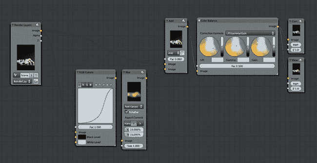图 14-15. 用于合成蜘蛛机器人的节点树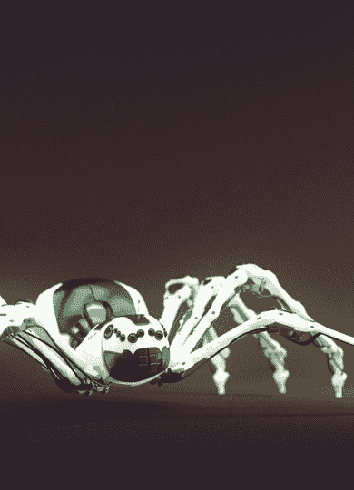图 14-16. 合成后的蜘蛛机器人

### 在 GIMP 中绘制天空

为了创建天空背景，我首先将 Blender 图像编辑器中未合成的渲染保存为带透明通道的*.png*图像（保存时，记得选择**RGBA**以便保存透明度）。然后，我在 GIMP 中打开了该图像。为了在右上角创建一个背景，我从 CGTextures 中打开了一个天空纹理作为一个层（见图 14-17），并将其放在渲染层下方。我然后调整了背景的大小和位置，将一些云朵放置在右上角（如图 14-17 中的第一张图片所示）。为了创建一个夜空背景，我使用了曲线工具将云层调得更暗，同时使用色相/饱和度和亮度工具（颜色▸色相/饱和度）稍微降低了层的饱和度，以防颜色显得过于饱和。

接下来，我使用加深/减淡工具（设置为减淡）对云层图像进行了一些装饰，并用软边刷在一些云的边缘添加了高光。我还创建了一个新的透明层，并将其混合模式设置为叠加。然后，我利用这个新层在云周围加入了一些额外的颜色：在神庙叶子边缘添加了一些浅蓝色，并在角落处加入了一些绿色和黄色。整个过程中，我的目标是最终得到一个色彩调色板与我的渲染图像相似的背景。

最后，我隐藏了渲染层，将背景单独保存为*.xcf*文件（CTRL-S），以便稍后编辑，并将其导出为*.tga*图像（CTRL-E）。背景图像及其各个阶段如图 14-17 所示。

### 合成神庙

在创建了背景后，我返回到 Blender 的合成器中。首先，我需要将背景添加到渲染图像的后面。为此，我使用了 Alpha Over 节点，将背景作为第一个输入，将我的渲染作为第二个输入（请参见图 14-18））。

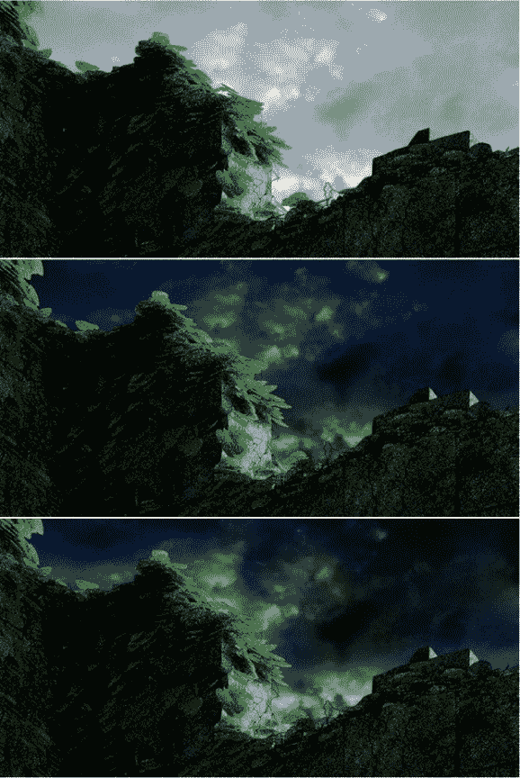图 14-17. 在 GIMP 中为丛林神庙创建背景，使用早期的噪点渲染作为参考。背景的尺寸与最终图像相同，但这里只显示了显示天空的角落部分。（其余的背景图像是黑色的。）渲染图像（位于单独的图层）在保存背景之前被隐藏。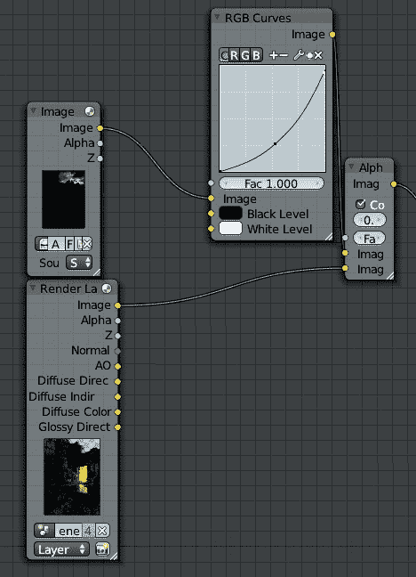图 14-18. 在 GIMP 中使用 Alpha Over 节点合成背景。我还添加了一个曲线节点，略微将其变暗。

#### 景深

接下来是景深效果。在为蜘蛛机器人添加景深时，我使用了物理正确的渲染景深效果。然而，对于丛林场景，我使用了合成器的 Defocus 节点。这种方法比渲染的景深效果稍微不准确一些，但它允许我们对哪些区域模糊、哪些区域不模糊进行更多的控制，并且在渲染完成后可以更改焦点，*这给了我们更多的灵活性*。

Defocus 节点需要两个输入：一个是要模糊的图像，另一个是黑白蒙版，用于确定模糊图像不同部分的程度。对于蒙版，你可以直接使用 *z* 缓冲区（勾选**使用 z 缓冲区输入**复选框），或者通过不勾选复选框，使用任何黑白图像作为简单蒙版。如果选择直接使用 *z* 缓冲区，Blender 会使用在属性编辑器的对象数据标签中找到的相机景深设置。距离景深位置较近或较远的区域将会被模糊。如果关闭此选项，Blender 将使用输入的值来决定模糊的程度，这样白色区域会模糊得最严重，黑色区域则最不模糊。

对于丛林寺庙场景，我选择直接使用*z*缓冲区，但在*z*缓冲区输出和 Defocus 节点的*z*输入之间加入了一个模糊节点（半径为 6 像素），以稍微模糊这些值。这种方法减少了前景物体上伪影的产生，即应该被模糊的物体看起来有了锐利的边缘。

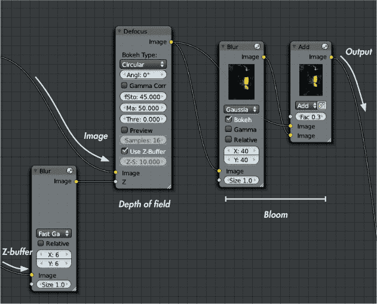图 14-19。为合成添加景深和辉光

#### 添加辉光和晕影

接下来，我添加了一些辉光。与其他项目一样，我模糊了图像并通过一个加法混合节点将其重新合成到图像上。我通过提取渲染的 alpha 通道，使用镜头畸变节点扭曲它，再用模糊节点对其进行模糊，然后将其叠加到图像上，应用了些许晕影效果。这些阶段的节点如图 14-19 所示。

#### 色彩分级

为了添加色彩分级，我使用了两个不同的节点。首先，我将图像通过了一个色相校正节点，这样我就能调整图像中特定颜色的饱和度（或色相或亮度）。因为我想在应用额外的分级之前，突出橙色和绿色，所以我通过点击曲线并拖动以添加新点，调整了色相校正节点的曲线，在橙色和绿色区域提高了曲线的轮廓，并在蓝色区域稍微降低了曲线。这增加了寺庙入口的橙色光线和树叶的绿色饱和度，使它们更加突出。我将结果通过了一个色彩平衡节点，用带有蓝色提升色调的阴影添加了一些蓝色，并在中间调和高光区域添加了一些黄色和橙色，使用了非常轻微的橙色伽马和增益色彩。

最后，我在节点树的末尾、合成输出节点之前添加了一个滤镜节点。我将其设置为锐化，锐化因子为 0.05，以对图像进行非常轻微的锐化。

这完成了丛林寺庙场景的合成工作。完整的节点设置如图 14-20 所示。

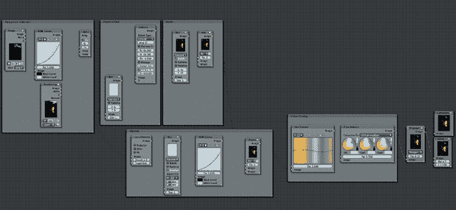图 14-20。丛林寺庙合成的节点树，按框架节点组织

作为最后的调整，我在 GIMP 中打开了合成图像，并使用模糊工具手动清理了剩余的一个或两个景深伪影。我还稍微裁剪了图像，以改善构图。结果如图 14-21 所示。

## 回顾

这基本上完成了我为本书创作的每个项目。在这一章中，我使用 Cycles 或 Blender Internal 作为渲染引擎，渲染了最终场景。然后，我将渲染输出的结果通过 GIMP 和 Blender 的合成器进行调整和优化，最终将其转化为我的最终图像。结果就是这些我现在可以称之为完成的项目渲染图。

当然，总是可以做出一些调整，在第十五章中，我们将探讨一些可以进一步完善这些项目的内容。

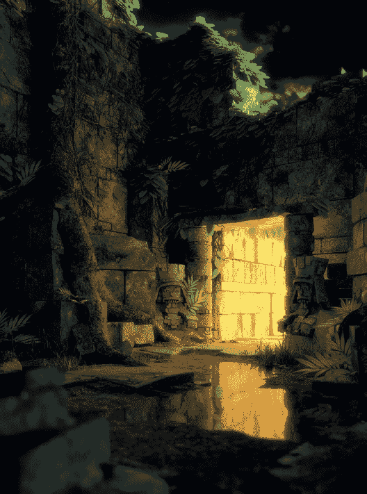图 14-21. 丛林神庙的最终效果
