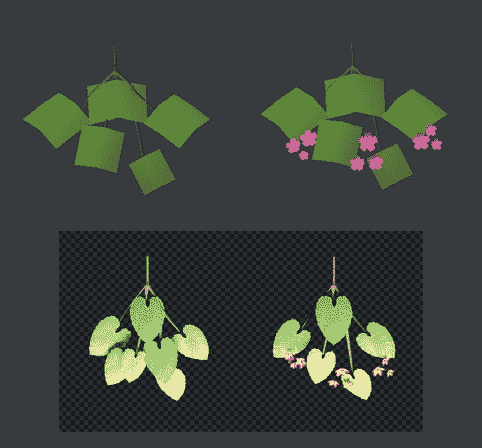
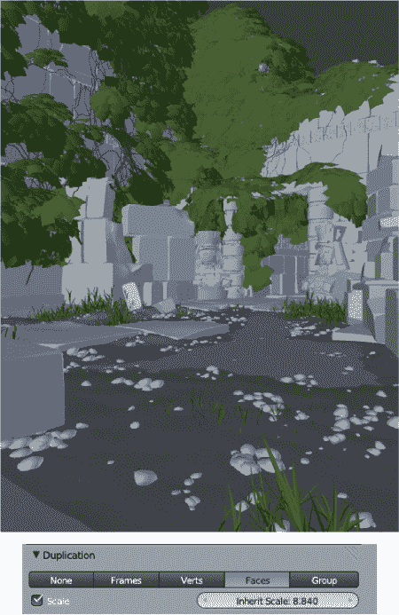
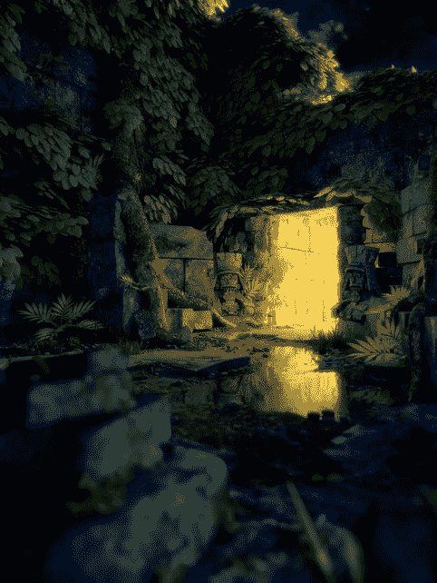
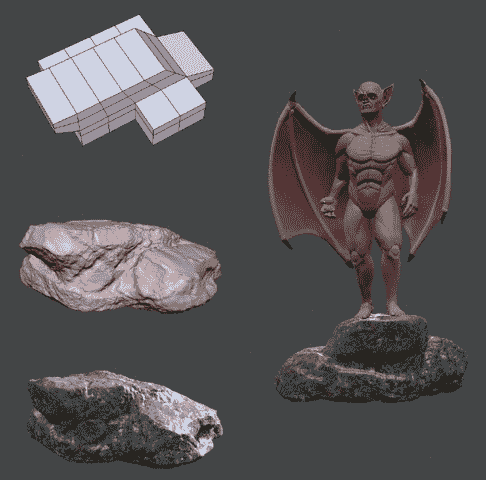
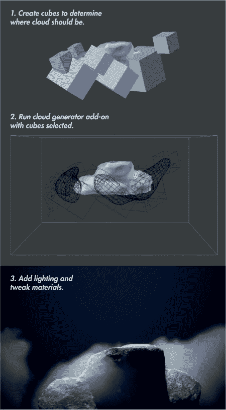
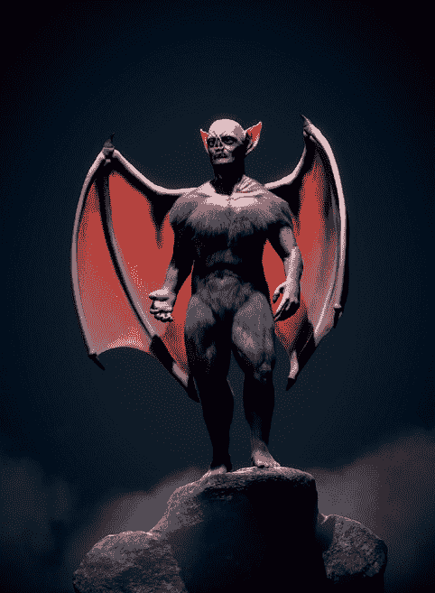
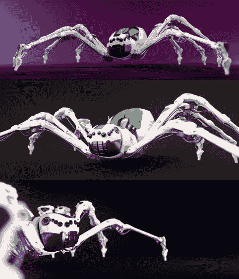
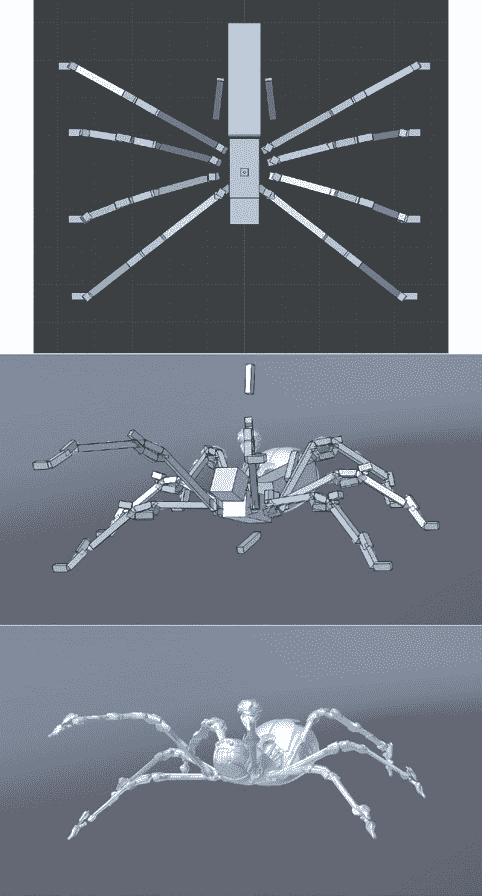

## 第十五章：进一步发展

在本章中，我们将探讨一些可能的添加项，如何进一步开发它们以及在哪里找到相关的操作信息。Blender 和 GIMP 有许多超出本书讨论范围的用途。作为一个完整的 3D 动画套件，Blender 拥有一些我们尚未有时间深入研究的功能，因此我将专注于如何利用 Blender 进一步完善我们的项目。

例如，我们可以使用 Blender 的一个功能来扩展项目，那就是骨架物体，它为模型提供了一种骨架，使其能够进行移动或摆姿势。为模型创建骨架并设置连接，使骨架控制网格的过程被称为*绑定*，而生成的骨架则称为*绑定骨架*。绑定可能会很复杂，全面讲解这个过程超出了本书的范围，但我会简要回顾如何为蜘蛛机器人进行绑定。一旦你为创作物体进行了绑定，你就可以使用 Blender 的动画工具来为它们制作动画。像绑定一样，动画是一个足以成书的主题，因此我将简单地提供一些想法，并推荐一些进一步阅读的资源。

但首先，让我们看一些简单的方法，来为项目添加额外的细节。

## 装饰

有时很难找到一个恰当的时机，决定项目已经完成。有时，一个项目就差点什么——某些细节或额外的物体，能够让你的创作更加出色。为此，以下是一些我们可以为项目添加的额外内容的想法。

### 为丛林神庙添加内容

丛林神庙场景已经有很多元素，但配色方案相对简单。提升场景的一个方法是创建一些开花植物，随意地点缀一些颜色。我使用了面复制（这是一种将一个物体复制到另一个物体的面上）为 IvyGen 网格添加了一些花朵，并增加了叶子的数量，使植物生命看起来更有趣。我创建了一个新的“树枝”物体，它由一些叶子和花朵组成，然后用这个物体的实例替换了原始叶子网格中的面。方便的是，这个树枝物体的渲染也很快速：Cycles 引擎识别到每个复制的树枝实例共享相同的网格数据，因此它只存储一次物体，保持渲染时的内存需求合理低。

#### 创建树枝物体

为了创建一个分支，我首先细分了一个平面并赋予它一个稍微弯曲的形状。这形成了我的叶子的基础，我复制了几次并将它们排列成一个拱形的五片叶子组合。我用一个五个顶点的圆形创建了一个花朵，接着填充并拉伸它以创建花瓣。然后，我展开了花朵和叶子的 UV。我为分支的叶子使用了之前相同的纹理和材质。对于花朵，我使用了来自 CGTextures 的花朵照片。我像之前做叶子时一样，创建了花朵的纹理和材质。我还通过创建一个立方体并从中挤出一些基本的枝条模型，为新叶子附着的枝条做了建模。最终，我创建了两个分支物体：一个带花，一个不带花，如图 15-1 所示。

图 15-1。 我用来增加丛林神庙中植被复杂度的分支物体。上图：3D 视图中的分支物体。下图：渲染出的分支物体。

#### 使用面复制进行复制

为了使用分支物体创建一些额外的植被，我在复制面板中启用了面复制功能，该面板可以在属性编辑器的物体标签中找到。为了复制一个分支，我将它设为父物体（选择分支，然后选择 IvyGen 网格，并按 CTRL-P）到 IvyGen 叶片网格。接着，我将复制类型设置为“面”，这样每个 IvyGen 网格的面都会创建一个分支物体的副本。

物体必须具有相同的原点，否则复制体将会从父网格偏移，因此我选择了我的分支物体，并将光标对准它（SHIFT-S▸光标对齐选择）。接下来，我选择了 IvyGen 叶片网格，点击 3D 视图工具架中的原点操作符，并选择“原点对准 3D 光标”，从而使这两个物体具有相同的原点。

面复制允许每个复制体继承其复制来源面的缩放。我利用这一点，通过在复制面板中启用缩放功能，然后为 IvyGen 面添加了一些随机的缩放变化。为了做到这一点，我在编辑模式下使用“选择▸随机”命令来随机选择网格中的面。接下来，我稍微缩小了它们，旋转中心设置为 3D 视图头部中的“单独面”选项（这样这些面会向它们的中心缩放）。这缩小了随机选择的面。然后，我重复了这个过程——这次选择了不同的面——并将它们稍微放大了一些。

为了创建两个分支对象之间的混合，我首先通过选择 IvyGen 网格，切换到编辑模式，并设置选择方式为“面”（在 3D 视口头部），将 IvyGen 网格分割开。然后，我使用了选择▸随机—再次选择网格中 20%的面（可以在工具选项面板中调整百分比）—并按**P**将它们从网格中分离出来，变成独立的对象。接下来，我将没有花的分支父级绑定到原始的 IvyGen 对象，将有花的分支绑定到新的对象，从而创建了部分有花的分支和部分没有花的分支。结果如图 15-2 所示。

#### 创建卵石

为了给场景中的地面增加一些变化，我使用了另一个粒子系统来将卵石散布到地面上。我创建了一组卵石对象，就像为草地创建的那样。然后，我在地面上添加了一个新的粒子系统，设置方式与草地系统类似。不过这次，我使用了简单子粒子将卵石分散成小簇，分布在场景中。图 15-3 展示了增加额外植物和卵石后的场景渲染效果。

图 15-2. 通过为每个原始面复制多个分支对象，增加 IvyGen 叶网格中的叶片数量

### 添加蝙蝠生物

我决定蝙蝠生物可能需要一个站立的平台，所以我创建了一个岩石基座来给它提供平台。我还尝试在它的脚下加上一些飘渺的云雾。

图 15-3. 带有附加特性的丛林神庙场景渲染图

#### 创建岩石

为了创建平台（一个岩石），我首先通过缩放和从立方体挤出建模了一个粗略的形状。接着，我使用了 Blender 的雕刻工具和一个多分辨率修改器，将这个粗略的形状雕刻成一个岩石的形状。第六章中的 Clay Tubes 和 Scrape Flat 画笔在这个过程中非常有用（请参见图 15-4）。我将第十一章中（为丛林神庙项目创建的）无缝岩石纹理作为位移贴图，应用于雕刻的细节之上。

我为岩石创建了一个材质，使用了我在第十一章中创建的相同岩石纹理，并在岩石后面添加了另一盏灯，以从相机的角度照亮它的顶部边缘。我将这个灯设置为“仅此图层”模式，这样它就只会照亮岩石，而岩石和灯具在同一图层上。接着，我稍微将相机向下移动并稍微调整了角度，以便从不同的视角展示蝙蝠生物，并调整了它的脚的位置，使它能够正确地站在岩石上。

图 15-4. 为蝙蝠生物创建站立的岩石

#### 添加云朵

为了配合图像的氛围，我在岩石周围添加了一些云朵。Blender 提供了很棒的工具来渲染体积材质，如云朵。要详细讨论这些内容将需要独立的章节，但幸运的是，对于我们的目的来说，简单地说，名为“云生成器”的优秀插件能够完成大部分工作。从用户偏好设置中启用该插件。

要使用云生成器脚本，我首先用立方体草拟了云朵的大致体积。然后，我使用工具架中的“生成云朵”按钮，自动生成与选定立方体物体大致形状相符的云朵对象，并设置合适的材质（见图 15-5）。

我几乎保持了生成的材料与插件生成的内容一致，唯一的不同是我在“材料”标签的“光照”面板中启用了外部阴影，并将属于材料的云纹理的比例略微调低，以便给云朵增加一些细节。我将云朵渲染在单独的渲染层上，并在合成设置中添加背景后将其合成到我的图像中（在应用了辉光和色彩分级之前）。结果如图 15-6 所示。

图 15-5. 使用云生成器脚本创建云朵图 15-6. 完成的云朵合成到我的场景中

## 不同的外观

获得更多项目成果的另一种方式是考虑为最终渲染效果找到不同的外观。这可能涉及找到新的相机角度或尝试不同的光照方案。我尝试了不同的光照效果和相机角度来照亮蜘蛛机器人，效果如图 15-7 所示。

## 装配与动画

当然，推动项目进一步发展的最戏剧性方式就是为它们添加动画。让场景动起来的一个简单方法是通过旋转相机围绕主题进行渲染，并在相机围绕场景旋转时记录其位置和旋转。另一种方法是渲染飞行镜头，让相机在场景中移动，展示不同的兴趣点。更复杂的动画——例如，为角色的动作制作动画——涉及为任何移动元素创建骨架，并通过关键帧或存储这些元素的不同属性和位置来进行时间上的动画。

图 15-7. 蜘蛛机器人在不同光照和相机角度下的替代渲染

骨架绑定需要将一个骨架对象添加到场景中，并对其进行编辑，以为模型创建一个“骨架”。接下来，你必须将模型绑定到骨架，可以通过将模型的对象作为子物体绑定到特定的骨骼，或者最好使用骨架修改器，将对象内的不同顶点组分配给骨架的不同骨骼。一旦完成这些步骤，你可以选择骨架切换到姿势模式，开始移动和调整模型的姿势（参见图 15-8）。

除了创建骨骼来直接控制模型的部分，你还可以创建约束和辅助骨骼，形成一种用户界面来控制骨架。这些控制可以包括确保肢体自动到达特定点的控制，或控制模型执行特定动作。例如，在图 15-8 中，黄色和绿色突出显示的骨骼是应用了约束以便更轻松地调整腿部姿势的骨骼。不过，这是一个复杂的过程。想要了解更多关于骨架绑定的内容，可以查看 Blender 基金会商店和 Blender wiki 上的资源。

图 15-8. 使用骨架。顶部：蜘蛛机器人骨架的单独视图，从上方看，采用 B-Bone 视图（骨架显示选项之一）。中间：使用绑定系统为蜘蛛机器人进行姿势设定。底部：单独展示已设定姿势的蜘蛛机器人。

一旦你的模型已完成绑定，你就可以开始为你的创作制作动画。通过设置骨骼的变换关键帧，或储存它们的姿势，再通过 Blender 的时间轴移动，改变绑定的姿势并重新设置关键帧，你就能建立一系列的姿势和位置，供你的模型依次通过。当播放时，你的模型将按照你创建的姿势所定义的运动顺序进行表演。

## 总结

在本书的过程中，我们从项目的最初灵感到最终图像及其后续内容不断进步。在第一章和第二章中介绍了 Blender 和 GIMP 后，我们在第三章中探讨了如何收集、创建和使用参考图和概念艺术，接着在第四章中用粗略的几何体和基础网格开始搭建场景的基本元素。在第五章、第六章和第七章中，我们通过进一步的几何建模以及 Blender 的雕刻和重新拓扑工具，扩展了这些粗略形态。在第八章中，我们展开了模型，为纹理制作做准备。

模型布置好后，我们在第九章加入了粒子系统的更多细节，在第十章和第十一章中添加了纹理。在第十二章和第十三章中，我们开始将我们的模型和纹理集转化为可渲染的场景，加入材质和光照，并在第十四章中，我们将 *.blend* 文件转化为最终的渲染图像。

我希望本章能给你一些启发，帮助你提升本书中的完成项目或你自己的项目。我已经讲解了如何为场景添加更多细节，并用不同的景观或氛围生成额外的渲染图像。我还提到了动画和绑定项目的概念，探索了从静态图像到动态画面的过渡。

在本书中，我通过三个项目来说明 Blender 和 GIMP 是多么强大的工具，以及它们多样的功能如何得到应用。每个工具都有极大的深度，初学时可能会让人感到难以应对，但一旦你掌握了这些工具，它们将非常棒，能帮助你将创意变为现实。我希望你能享受在本书中学到的技能，并用它们来实现你的想法。
