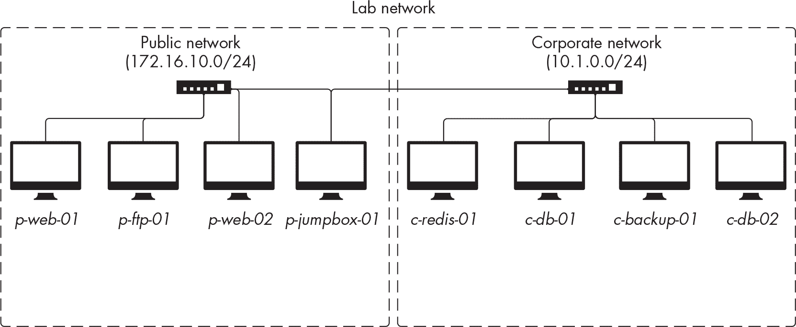

<hgroup>

# 3 设置一个黑客实验室

</hgroup>


在本章中，您将设置一个包含黑客工具和有意漏洞目标的实验室环境。您将在章节练习中使用此实验室，但您也可以在需要在真实目标运行之前编写、设置和测试 bash 脚本时使用它。

本地部署的目标及其资产模仿了名为 ACME Infinity Servers 的模拟互联网托管公司的生产环境，该公司拥有自己的虚构员工、客户和数据。这个虚构的互联网托管公司及其客户将为您提供各种有意漏洞的应用程序、用户帐户和基础设施，供您在后续章节中进行攻击实践。

实验室将完全部署在一个 Kali 虚拟机中。该虚拟机将需要以下最低配置：至少 4GB 的 RAM，至少 40GB 的存储空间，以及一个互联网连接。

## 安全实验室预防措施

遵循这些指南，以减少构建和运行黑客实验室相关风险： 

+   避免直接将实验室连接到互联网。黑客实验室环境通常运行漏洞代码或过时软件。尽管这些漏洞对于实际学习非常有帮助，但如果它们从互联网变得可访问，可能会对您的网络、计算机和数据构成风险。相反，我们建议在连接到您信任的本地网络时通过本书工作，或者在设置实验室后离线操作。

+   通过使用虚拟化管理程序在虚拟环境中部署实验室。将实验室环境与您的主操作系统分开通常是个好主意，因为这样可以防止可能会破坏计算机上其他软件的冲突。我们建议使用虚拟化工具来确保这种分离。在下一节中，您将在 Kali 虚拟机中安装实验室。

+   经常对你的虚拟机进行快照。*快照*是虚拟机的备份，允许你将其恢复到先前的状态。实验室环境经常在攻击后不会保持稳定，因此请在实验室稳定状态时随时进行快照。

在遵循这些最佳实践的基础上，让我们开始动手，让我们的实验室运行起来吧！

## 安装 Kali

*Kali*是一个专为渗透测试而创建的 Linux 发行版。基于 Debian，由 OffSec 设计。我们将使用 Kali 作为我们实验室的操作系统，因为它预装了我们需要的某些库、依赖和工具。

您的 Kali 机器在实验室环境中将扮演两个角色。首先，它将作为主机负责运行目标网络和机器，对这些目标运行您的脚本。其次，它将作为黑客机器，您将从中执行攻击。

您可以在 *[`www.kali.org/get-kali/#kali-platforms`](https://www.kali.org/get-kali/#kali-platforms)* 找到适用于 VMware Workstation 和 Oracle VirtualBox 超级管理程序的 Kali 虚拟机的 x64 版本。选择您喜欢的超级管理程序，并按照 *[`www.kali.org/docs/installation/`](https://www.kali.org/docs/installation/)* 上的官方安装说明进行安装。

完成安装过程后，您应该会看到如 图 3-1 所示的 Kali 登录界面。Kali 配备了一个名为 *kali* 的默认用户帐户，密码是 *kali*。


图 3-1：Kali 登录界面

登录到 Kali 后，您需要确保系统是最新的。要访问终端，请打开 **应用程序** 菜单，在搜索栏中输入 **terminal emulator**。点击相应的应用程序。

让我们使用几个命令来更新您的软件仓库并升级已安装的包。在终端窗口中，输入以下命令：

```
$ **sudo apt update -y**
$ **sudo apt upgrade -y**
$ **sudo apt dist-upgrade -y** 
```

当您使用 sudo 时，Kali 会要求您输入密码。这与您登录虚拟机时使用的密码相同，密码是 *kali*。

更新版 Kali 默认使用 Z Shell（zsh），因此请确保 bash 是 *kali* 用户的默认 shell，可以通过以下命令进行设置：

```
$ **sudo usermod --shell /bin/bash kali**
```

接下来，通过运行以下命令启用您的新默认 shell：

```
$ **su - kali**
```

接下来，我们将在本书中使用此 Kali 机器进行所有任务。我们建议保持终端窗口打开，因为您很快就会需要它来进行其他安装。

## 目标环境

现在是时候安装构成模拟目标的机器和网络了。您可以通过两种方式执行此安装：手动安装或使用自动化脚本。

我们鼓励您至少手动设置一次实验室，按照本节中的说明进行操作。这将帮助您熟悉实验室的核心组件，并练习在命令行中运行命令。然而，如果您需要在 Kali 的全新安装中重新部署实验室，您可以通过克隆 *[`github.com/dolevf/Black-Hat-Bash`](https://github.com/dolevf/Black-Hat-Bash)* 仓库并运行 `make init` 来完成。

```
$ **cd ~**
$ **git clone https://github.com/dolevf/Black-Hat-Bash.git**
$ **cd ./Black-Hat-Bash/lab**
$ **sudo make init** 
```

该脚本应该会安装所有实验室所需的依赖项、容器和黑客工具，您可以跳过本节和“安装其他黑客工具”中的说明，后者见 第 61 页。您必须在符合本章开头描述的系统要求的 Kali 虚拟机中执行此脚本。

### 安装 Docker 和 Docker Compose

我们将使用 *Docker* 来构建实验室环境，Docker 是一个部署和管理容器的工具。*容器* 打包代码及其依赖项，使应用程序能够在各种环境中可靠运行。我们还将使用 *Docker Compose*，这是一个特殊的 Docker 工具，通过一个名为 *Compose 文件* 的单一 YAML 文件来构建和管理多个 Docker 容器。

首先，让我们配置源以使用 Debian 当前稳定版的 Docker 社区版，*docker-ce*，通过以下命令。我们使用 printf 将 Docker 的高级包工具（APT）仓库添加到 APT 包源数据库文件中。tee 命令从标准输入流读取并写入文件：

```
$ **printf '%s\n' "deb https://download.docker.com/linux/debian bullseye stable" |**
**sudo tee /etc/apt/sources.list.d/docker-ce.list** 
```

接下来，下载并导入 Docker 的密钥环，以确保仓库已验证，且从该仓库安装的所有软件包都是加密验证的。使用 curl 下载密钥并将其通过管道传递给 gpg 命令，后者将其存储在所需的文件夹中：

```
$ **curl -fsSL https://download.docker.com/linux/debian/gpg | sudo gpg --dearmor -o**
**/etc/apt/trusted.gpg.d/docker-ce-archive-keyring.gpg** 
```

最后，运行另一个更新命令以刷新仓库数据库并安装 Docker 组件：

```
$ **sudo apt update -y**
$ **sudo apt install docker-ce docker-ce-cli containerd.io -y** 
```

要验证您的 Docker Compose 是否正确运行，请使用以下命令：

```
$ **sudo docker compose --help**
```

接下来，通过运行此命令，确保 Docker 进程在系统重启时自动启动：

```
$ **sudo systemctl enable docker --now**
```

Docker 需要使用 sudo，这可能会有些不方便。如果您希望在执行 Docker 相关命令时避免每次都输入 sudo，请将*kali*用户添加到*docker* Linux 组：

```
$ **sudo usermod -aG docker $USER**
```

完成后，您不再需要使用 sudo 来运行 Docker 命令。为了使这些更改生效，您必须退出并重新登录到 Kali 系统。

### 克隆书籍的仓库

您可以在书籍的 GitHub 仓库中找到实验室的文件，地址为* [`github.com/dolevf/Black-Hat-Bash`](https://github.com/dolevf/Black-Hat-Bash)*。该仓库包含构建实验室所需的 Docker 配置以及本书后续章节中提到的所有 bash 脚本。

Kali 预装了 Git，您可以使用它来克隆和下载仓库。为此，请运行以下命令：

```
$ **cd ~**
$ **git clone https://github.com/dolevf/Black-Hat-Bash.git** 
```

接下来，进入仓库的根目录，并快速查看其内容：

```
$ **cd Black-Hat-Bash && ls -l**
`--snip--`
drwxr-xr-x 2 kali kali 4096 Jul 22 23:07 ch01
drwxr-xr-x 2 kali kali 4096 Jul 22 23:07 ch02
drwxr-xr-x 2 kali kali 4096 Jul 22 23:07 ch03
drwxr-xr-x 2 kali kali 4096 Jul 22 23:07 ch04
drwxr-xr-x 2 kali kali 4096 Jul 22 23:07 ch05
`--snip--` 
```

正如您在输出中看到的，仓库的内容按每章的目录组织。仓库还包括一个*lab*目录，我们将在下一节中使用它来设置实验室。

### 部署 Docker 容器

书籍仓库中*lab*目录的内容控制了实验室中使用的所有网络基础设施、机器和应用程序。该目录包括一个*Makefile*文件。通过运行该脚本并加上帮助参数，您可以看到它用于部署、拆卸、重建、清理和检查我们环境的状态：

```
$ **cd lab**
$ **make help**

Usage: make deploy | teardown | cleanup | rebuild | status | init | help

deploy   | build images and start containers
teardown | stop containers (shut down lab)
rebuild  | rebuild the lab from scratch (clean up and deploy)
cleanup  | stop and delete containers and images
status   | check the status of the lab
init     | build everything (containers and hacking tools)
help     | show this help message 
```

我们首先使用 deploy 参数来创建实验室。请注意，您需要 sudo 权限来执行部署，因此系统会提示您输入*kali*用户密码：

```
$ **sudo make deploy**
```

实验环境的初始部署将需要几分钟才能完成。为了监控安装进度，您需要打开一个新的终端会话并查看位于*/var/log/lab-install.log*的日志文件，例如：

```
$ **tail -f /var/log/lab-install.log**
```

当使用 tail -f（跟随）命令对文件进行操作时，它会提供对文件末尾添加的新行的实时视图。这对于监视日志文件非常有用，因为日志文件经常会写入新信息。

> 注意

*由于实验室设置会下载操作系统镜像和其他应用程序等软件，因此根据您的网络连接和分配给运行实验室的主机的计算机资源，部署可能需要一些时间。*

### 测试和验证容器

一旦日志文件显示进程完成，它应该告诉您实验室是否已正确设置。我们还可以运行一些命令来验证这一点。首先，使用 make 命令执行状态检查，这次使用 test 参数。如果所有检查通过，您应该会看到以下输出：

```
$ **sudo make test**
Lab is up. 
```

我们还可以使用 docker ps 命令列出所有正在运行的实验室 Docker 容器：

```
$ **sudo docker ps -–format "{{.Names}}"**
p-web-01
p-web-02
p-ftp-01
c-jumpbox-01
c-db-01
c-db-02
c-backup-01
c-redis-01 
```

您应该会得到类似的输出，尽管容器的顺序不一定相同。

> 注意

*为了方便起见，您还可以使用* make status *命令，它与* make test *命令相同，用于检查实验室是否正在正常运行。*

## 网络架构

实验室由八台运行在 Docker 容器中的机器和两个网络组成。大多数机器被分配到这两个网络中的一个，我们将利用它们在后续章节中进行各种黑客场景的测试。

实验室中的网络通过 Docker 的桥接网络模式连接到 Kali。 图 3-2 展示了该网络架构的详细信息。



图 3-2：实验室的网络架构

您还可以在本书的代码库中找到此图：[`github.com/dolevf/Black-Hat-Bash/blob/master/lab/lab-network-diagram.png`](https://github.com/dolevf/Black-Hat-Bash/blob/master/lab/lab-network-diagram.png)。

### 公共网络

图 3-2 左侧的网络是公共网络，我们的虚拟互联网托管公司 ACME Infinity Servers 在此托管其客户的网站和资源。您将在此网络中找到的两个公司网站分别属于 ACME Impact Alliance 和 ACME Hyper Branding。

公共网络的 IP 地址无类域间路由（CIDR）范围为 172.16.10.0/24，并包含四台机器（其名称以*p-*为前缀）。它也是面向公共的，这意味着我们可能会首先测试具有该网络访问权限的机器，因为它们可能是进入网络的入口点。

### 企业网络

第二个网络是企业网络。ACME Infinity Servers 使用该私有网络来托管其后端支持基础设施。如您所见，企业网络的 IP 地址 CIDR 范围是 10.1.0.0/24，并包含四台机器（其名称以*c-*为前缀）。

此网络不面向公众，这意味着该网络中的机器没有互联网连接。因此，在能够接管公共网络中的一台或多台机器之前，我们不会对其进行测试，这将作为我们进入企业网络的起点。

### Kali 网络接口

Kali 有两个网络接口，用于连接实验室的两个网络。我们可以使用 *br_public* 网络接口访问公共网络，使用 *br_corporate* 网络接口访问企业网络。您可以通过运行以下命令验证两个接口是否在线并配置为使用正确的网络地址：

```
$ **ip addr | grep "br_"**

`--snip--`
4: br_public: <NO-CARRIER,BROADCAST,MULTICAST,UP> mtu 1500 qdisc noqueue state DOWN group de...
    link/ether 02:42:ea:5f:96:9b brd ff:ff:ff:ff:ff:ff
    inet ❶ 172.16.10.1/24 brd 172.16.10.255 scope global br_public
5: br_corporate: <NO-CARRIER,BROADCAST,MULTICAST,UP> mtu 1500 qdisc noqueue state DOWN group...
    link/ether 02:42:67:90:5a:95 brd ff:ff:ff:ff:ff:ff
    inet ❷ 10.1.0.1/24 brd 10.1.0.255 scope global br_corporate 
```

在继续之前，请验证 IP 地址是否与 ❶ 和 ❷ 中显示的匹配。

### 机器

实验室环境中的八台机器遵循简单的命名约定。名称的第一个字符指示了机器所属的网络。例如，如果机器名称以 *p* 开头，则属于公共网络；同样，如果以 *c* 开头，则属于企业网络。接下来的单词描述了机器的功能或主要技术栈，如 *web*、*ftp*、*jumpbox* 或 *redis*。最后，使用数字来区分类似的机器，例如 *p-web-01* 和 *p-web-02*。

每台机器提供独特的应用程序、服务和用户帐户，我们可以了解和入侵。后续章节将更详细地描述这些机器，但表格 3-1 提供了一些高级信息。

表 3-1: 实验室机器详细信息

| 名称 | 公共 IP | 企业 IP | 主机名 |
| --- | --- | --- | --- |
| Kali 主机 | 172.16.10.1 | 10.1.0.1 | — |
| p-web-01 | 172.16.10.10 | — | p-web-01.acme-infinity-servers.com |
| p-ftp-01 | 172.16.10.11 | — | p-ftp-01.acme-infinity-servers.com |
| p-web-02 | 172.16.10.12 | 10.1.0.11 | p-web-02.acme-infinity-servers.com |
| c-jumpbox-01 | 172.16.10.13 | 10.1.0.12 | c-jumpbox-01.acme-infinity-servers.com |
| c-backup-01 | — | 10.1.0.13 | c-backup-01.acme-infinity-servers.com |
| c-redis-01 | — | 10.1.0.14 | c-redis-01.acme-infinity-servers.com |
| c-db-01 | — | 10.1.0.15 | c-db-01.acme-infinity-servers.com |
| c-db-02 | — | 10.1.0.16 | c-db-02.acme-infinity-servers.com |

当您从 Kali 执行渗透测试时，请记住有时可能会看到 Kali 自己的 IP 地址，即 172.16.10.1 和 10.1.0.1，在某些工具结果中出现。我们不会对这些地址进行测试。

## 管理实验室

现在，您已经设置好您的实验室并仔细查看了其组成部分，接下来将学习如何拆除它，启动它，并在需要时重新构建它。

### 关闭

当您不使用实验室环境时，关闭它是一个好的实践。要关闭实验室中运行的所有容器，请运行以下命令：

```
$ **sudo make teardown**
```

您应该收到所有已停止容器的列表，以及删除的网络和卷的列表，如下所示：

```
==== Shutdown Started ====
Stopping p-web-02     ... done
Stopping c-jumpbox-01 ... done
`--snip--`
Removing volume lab_p_web_02_vol
OK: lab has shut down. 
```

要重新启动你的容器，只需重新运行 “部署 Docker 容器” 中提到的部署命令，第 56 页。

### 移除

要完全从 Kali 机器中移除实验室环境，可以运行 clean 命令。这将销毁所有容器及其镜像：

```
$ **sudo make clean**

==== Cleanup Started ====
Shutting down the lab...
Cleaning up...
OK: lab environment has been destroyed. 
```

运行命令后，你应该会收到一个确认消息，表示实验室环境已被销毁。

### 重建

当我们执行重建时，实验室将首先关闭所有运行中的容器，删除卷，并移除所有容器镜像，然后才会进行新的部署。要执行重建，请运行以下命令：

```
$ **sudo make rebuild**
```

如果你重建实验室，你将丢失所有保存在容器中的数据。重建在安装过程中出现问题时非常有用。比如，安装过程中途中失去网络连接，实验室报告出现故障状态。重建命令允许你从头开始清除并安装实验室环境。

## 访问单个实验室机器

随着你逐步深入本书，你将会攻破实验室环境中的机器。然而，获得对一台机器的完全访问权限通常需要多次尝试。有时候你可能需要排查一个问题，或者重现一次攻破后的操作，而你并不想重复获取访问权限时所执行的步骤。

要获得对任何单个实验室机器的 shell 访问权限，可以运行以下 Docker 命令：

```
$ **sudo** **docker exec -it** **`MACHINE-NAME`** **bash**
```

MACHINE-NAME 代表实验室机器的名称，例如 *p-web-01* 或 *p-jumpstation-01*（或 表 3-1 中的任何其他以 *p-* 或 *c-* 开头的机器）。Docker 命令将让你进入 bash shell，在这里你可以执行任何你想要的命令。要退出，只需在提示符下输入 exit 或关闭终端会话窗口。

然而，我们强烈建议你在采取这些方便的快捷方式之前，按照预期攻破机器。

## 安装额外的黑客工具

本书中大多数工具都已预先安装在 Kali 中，我们会在首次使用时介绍它们。不过，我们需要安装一些默认未安装的工具，所以我们在这里进行安装。首先，为你的工具创建一个新目录：

```
$ **cd ~**
$ **mkdir tools** 
```

现在使用以下章节中的指令来安装每个工具。

### WhatWeb

*WhatWeb* 是由 Andrew Horton 和 Brendan Coles 开发的基于 Ruby 的 Web 扫描器。它采用插件系统，旨在识别目标网站上运行的软件。

WhatWeb 可以通过使用其已知应用程序签名数据库，对网站及其应用程序栈进行指纹识别。WhatWeb 还可以识别特定的内容管理系统和博客平台（如 WordPress）、网络摄像头、Web 应用防火墙等。截至目前，WhatWeb 拥有超过 1800 个插件。

要安装 WhatWeb，只需在终端中运行以下命令：

```
$ **sudo apt-get install whatweb -y**
```

通过使用 -h（帮助）参数运行 whatweb 命令，验证 WhatWeb 是否能够正常运行：

```
$ **whatweb -h**

`--snip--`
WhatWeb - Next generation web scanner.
Developed by Andrew Horton (urbanadventurer) and Brendan Coles (bcoles).
Homepage: https://www.morningstarsecurity.com/research/whatweb 
```

在本书后面，我们将使用 WhatWeb 进行侦察活动。

### RustScan

*RustScan* 是一个由秋天（Bee）Skerritt（@bee_sec_san）编写的超快端口扫描器，使用 Rust 编程语言编写。有些人声称，RustScan 可以在几秒钟内扫描目标的所有 65,000 个端口！

我们将使用 RustScan 的 Docker 版本。为此，我们首先需要将其镜像拉取到 Kali 机器上：

```
$ **sudo docker pull rustscan/rustscan:2.1.1**
```

一旦你构建了 RustScan，运行一个快速测试来确保它正常工作：

```
$ **sudo docker run --network=host -it --rm --name rustscan rustscan/rustscan:2.1.1**

Fast Port Scanner built in Rust. WARNING Do not use this program against
sensitive infrastructure since the specified server may not be able to
handle this many socket connections at once.
`--snip--` 
```

这个命令相当长，因为它依赖于使用 Docker 启动一个专门的 RustScan 容器。在“为黑客工具分配别名”一节中，第 66 页，我们将创建一个快捷命令来为我们运行 RustScan。

我们将在后续章节中使用 RustScan 进行端口扫描。

### Nuclei

*Nuclei* 是一个由 ProjectDiscovery 公司编写的用 Go 编程语言编写的漏洞扫描器，ProjectDiscovery 是一个开发流行开源黑客工具的公司。Nuclei 通过发送请求到由 YAML 模板文件定义的目标来工作。黑客社区发布了数千个支持多种协议的 Nuclei 模板，包括传输控制协议（TCP）、域名系统（DNS）、HTTP、原始套接字、文件、无头等。你可以在*[`github.com/projectdiscovery/nuclei-templates`](https://github.com/projectdiscovery/nuclei-templates)*找到这些模板。

通过运行以下安装命令来安装 Nuclei：

```
$ **sudo apt install nuclei -y**
```

为了验证 Nuclei 是否正确安装，运行帮助命令：

```
$ **nuclei -h**

Nuclei is a fast, template based vulnerability scanner focusing
on extensive configurability, massive extensibility and ease of use.

Usage:
  nuclei [flags]

Flags:
TARGET:
   -u, -target string[]       target URLs/hosts to scan 
```

第一次运行 Nuclei 时，它会自动在用户的主文件夹中创建一个*nuclei-templates*目录，并下载所有公开可用的 Nuclei 模板。

我们将使用 Nuclei 在实验室中查找漏洞，并编写自定义漏洞检查。

### dirsearch

*dirsearch* 是一个多线程工具，用于查找 Web 服务器上的常见路径。dirsearch 可在 Kali 的软件下载库中找到，因此要安装它，请运行以下命令：

```
$ **sudo apt install dirsearch -y**
```

为了验证 dirsearch 是否正确安装，运行帮助命令：

```
$ **dirsearch --help**
```

我们将在后续章节中使用 dirsearch 进行信息收集。

### Linux Exploit Suggester 2

*Linux Exploit Suggester 2* 是一个基于原始 Linux Exploit Suggester 的下一代工具。由 Jonathan Donas 编写，使用 Perl 语言开发，包含了多个漏洞，您可以利用它们来潜在地攻破易受攻击的 Linux 内核版本。

要安装它，首先将仓库克隆到你的*tools*目录：

```
$ **cd ~/tools**
$ **git clone https://github.com/jondonas/linux-exploit-suggester-2.git** 
```

为了验证 Linux Exploit Suggester 2 是否正确安装，运行帮助命令：

```
$ **cd linux-exploit-suggester-2**
$ **perl linux-exploit-suggester-2.pl -h** 
```

我们将在本书后面使用 Linux Exploiter Suggester 2 来枚举内核漏洞。

### Gitjacker

*Gitjacker* 是一个数据提取工具，专门针对那些不小心上传了*.git*目录的 Web 应用程序。在安装 Gitjacker 之前，你需要先安装 jq，这是一个命令行 JSON 处理工具：

```
$ **sudo apt install jq -y**
```

接下来，下载 Gitjacker 安装脚本，并将可执行文件移动到工具目录：

```
$ **cd ~**
$ **curl -s "https://raw.githubusercontent.com/liamg/gitjacker/master/scripts/install.sh" | bash**
$ **mv ./bin/gitjacker ~/tools/gitjacker**
$ **rmdir ./bin** 
```

最后，通过运行以下帮助命令验证 Gitjacker 是否正常工作：

```
$ **~/tools/gitjacker -h**
```

我们将在本书后面使用 Gitjacker 来识别配置错误的 Git 存储库。

### pwncat

*pwncat*是由 Caleb Stewart 和 John Hammond 开发的基于 Python 的命令与控制库，用于捕获和与远程 shell 进行交互。一旦 pwncat 从远程受损主机接收到一个 shell 连接，它将作为一个利用平台，用于发送命令和发起攻击。

要安装 pwncat，请运行此命令：

```
$ **pip3 install pwncat-cs**
```

要验证库是否已正确安装，请使用以下命令：

```
$ **pwncat-cs -h**

usage: pwncat-cs [-h] [--version] [--download-plugins] [--config CONFIG]
                 [--ssl] [--ssl-cert SSL_CERT] [--ssl-key SSL_KEY]
                 [--identity IDENTITY] [--listen] [--platform PLATFORM]
                 [--port PORT] [--list] [--verbose]
                 [[protocol://][user[:password]@][host][:port]] [port] 
```

我们将在本书后面使用 pwncat 进行渗透测试。在某些情况下，pwncat-cs 可能会在*~/.local/bin*下找到，并且可以通过其完整路径直接调用：*~/.local/bin/pwncat-cs*。

### LinEnum

*LinEnum*是 Owen Shearing 编写的用于枚举 Linux 主机上本地信息的 bash 脚本。我们可以使用 wget 从其 GitHub 存储库获取该脚本：

```
$ **cd ~/tools**
$ **wget https://raw.githubusercontent.com/rebootuser/LinEnum/master/LinEnum.sh** 
```

要验证脚本是否正常工作，请使其可执行并运行以下帮助命令：

```
$ **chmod u+x LinEnum.sh**
$ **./LinEnum.sh -h**

#########################################################
# Local Linux Enumeration & Privilege Escalation Script #
#########################################################
# www.rebootuser.com | @rebootuser

# Example: ./LinEnum.sh -k keyword -r report -e /tmp/ -t

OPTIONS:
-k      Enter keyword
-e      Enter export location
-s      Supply user password for sudo checks (INSECURE)
-t      Include thorough (lengthy) tests
-r      Enter report name
-h      Displays this help text

Running with no options = limited scans/no output file
######################################################### 
```

我们将在本书后面使用 LinEnum 来枚举系统的配置错误。

### unix-privesc-check

*unix-privesc-check*脚本由 pentestmonkey 编写，用于从主机收集信息，以寻找配置错误和提升特权的方法。该脚本编写以支持许多 Linux 和 Unix 系统的变种，并且不需要任何依赖项，这使得运行起来非常方便。

默认情况下，该脚本与 Kali 捆绑在一起，您应该在*/usr/bin/unix-privesc-check*找到它：

```
$ **which unix-privesc-check**

/usr/bin/unix-privesc-check 
```

可选地，您可以在*tools*目录中创建其副本，以便在需要时将其复制到实验室的任何计算机上：

```
$ **cp /usr/bin/unix-privesc-check ~/tools**
```

如果该脚本在您的 Kali 机器上不可用，您可以直接从 APT 下载：

```
$ **apt-get install unix-privesc-check -y**
```

使用以下命令验证您能够成功运行它：

```
$ **unix-privesc-check -h**

unix-privesc-check (http://pentestmonkey.net/tools/unix-privesc-check)

Usage: unix-privesc-check {standard | detailed}

"standard" mode: Speed-optimised check of lots of security settings.
`--snip--` 
```

我们将使用*unix-privesc-check*在本书后面识别权限提升机会。

## 分配别名给黑客工具

通过第三方存储库（如 GitHub）安装的工具有时不会有设置文件，使得运行它们变得更加容易。我们可以为这些工具分配 bash 别名作为简写引用，这样每次运行它们时就不需要输入完整的目录路径了。

通过以下命令分配自定义别名。这些命令将被写入您的*~/.bashrc*文件，在您打开新终端会话时执行：

```
$ **echo "alias rustscan='docker run --network=host -it --rm --name rustscan rustscan/rustscan:**
**2.1.1'" >> "/home/kali/.bashrc"**

$ **echo "alias gitjacker='/home/kali/tools/gitjacker'" >> ~/.bashrc** 
```

RustScan 和 Gitjacker 现在都有别名。

现在您应该拥有一个完全功能的 bash 黑客实验室。现在是将您的 Kali 虚拟机拍摄快照的好时机，这样您可以将其恢复到这个干净状态。定期拍摄快照是个好主意，特别是每当您进行重要配置更改或向您的虚拟实验室部署新工具时。

## 概述

在这一章中，你搭建了你的黑客实验室，该实验室由一个专用的 Kali 虚拟机组成，运行多个故意存在漏洞的 Docker 容器和黑客工具。我们还讨论了如何通过拆除、清理和重建实验室环境来管理它。

我们将在所有动手练习中使用这个实验室。如果你遇到问题，我们建议你关注本书的 GitHub 仓库 (*[`github.com/dolevf/Black-Hat-Bash`](https://github.com/dolevf/Black-Hat-Bash)*)，我们在这里维护着更新实验室所需的源代码。在下一章中，你将使用这些工具进行侦察并收集有关远程目标的信息。
