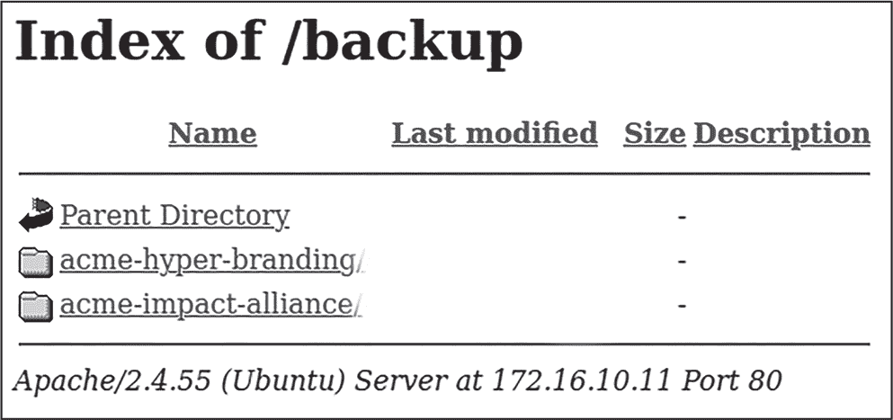
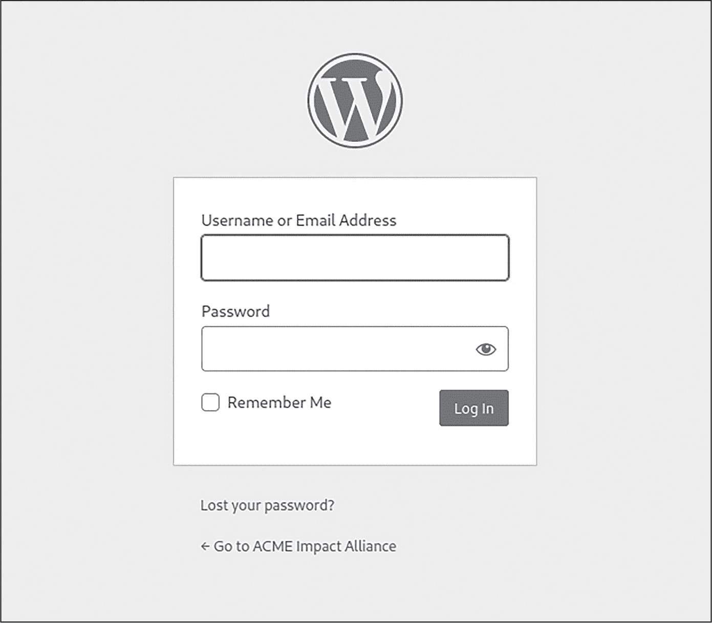

# 5 漏洞扫描与模糊测试


在第四章中，我们识别了网络上的主机和几个运行中的服务，包括 HTTP、FTP 和 SSH。每种协议都有我们可以执行的一组测试。在本章中，我们将使用专门的工具对已发现的服务进行测试，尽可能多地了解它们。

在此过程中，我们将使用 bash 运行安全测试工具，解析其输出，并编写自定义脚本，以便在多个 URL 上进行大规模的安全测试。我们将使用 ffuf 和 Wfuzz 等工具进行模糊测试，使用 Nuclei 模板系统编写自定义安全检查，从工具的输出中提取个人身份信息（PII），并创建我们自己的简易漏洞扫描器。

## 使用 Nikto 扫描网站

*Nikto*是 Kali 中可用的 Web 扫描工具。它执行横幅抓取并进行一些基本检查，以确定 Web 服务器是否使用安全头部来缓解已知的 Web 漏洞；这些漏洞包括*跨站脚本攻击（XSS）*，这是一种针对 Web 浏览器的客户端注入漏洞，以及*UI 重定向*（也称为*点击劫持*），这是一种漏洞，允许攻击者在网页中使用诱饵层来劫持用户点击。安全头部指示浏览器在加载特定资源和打开 URL 时该如何处理，从而保护用户免受攻击。

在执行这些安全检查后，Nikto 还通过使用其内置的常见路径词典向服务器的可能端点发送请求。这些请求可以发现一些有趣的端点，对于渗透测试人员来说可能很有用。让我们使用 Nikto 对我们在 IP 地址 172.16.10.10（*p-web-01*）、172.16.10.11（*p-ftp-01*）和 172.16.10.12（*p-web-02*）上识别出的三个 Web 服务器进行基本的 Web 评估。

我们将针对我们发现开放的 Web 端口，对三个目标 IP 地址运行 Nikto 扫描。打开终端，依次运行以下命令，这样你可以逐一分析每个 IP 地址的输出结果：

```
$ **nikto -host 172.16.10.10 -port 8081**
$ **nikto -host 172.16.10.11 -port 80**
$ **nikto -host 172.16.10.12 -port 80** 
```

172.16.10.10 在 8081 端口的输出应该不会提供太多关于发现端点的有趣信息，但它应该表明该服务器似乎没有经过加固，因为它没有使用安全头部：

```
+ Server: Werkzeug/2.2.3 Python/3.11.1
+ The anti-clickjacking X-Frame-Options header is not present.
+ The X-XSS-Protection header is not defined. This header can hint to the user
agent to protect against some forms of XSS
+ The X-Content-Type-Options header is not set. This could allow the user
agent to render the content of the site in a different fashion to the MIME
type
`--snip--`
+ Allowed HTTP Methods: OPTIONS, GET, HEAD
+ 7891 requests: 0 error(s) and 4 item(s) reported on remote host 
```

Nikto 能够执行服务器的横幅抓取，这从以“Server”开头的行中可以看出。然后它列出了几个缺失的安全头部。这些是有用的信息，但还不足以完全接管服务器。

IP 地址 172.16.10.11 上的 80 端口应该会给出类似的结果，尽管 Nikto 还发现了一个新端点，*/backup*，并且启用了该目录的索引模式：

```
+ Server: Apache/2.4.55 (Ubuntu)
`--snip--`
+ OSVDB-3268: /backup/: Directory indexing found.
+ OSVDB-3092: /backup/: This might be interesting... 
```

*目录索引* 是一种服务器端设置，它会在缺少索引文件（如 *index.html* 或 *index.php*）时，列出位于某些网页路径下的文件。当启用时，目录索引设置会列出一个目录的内容。目录索引很有趣，因为它可能会暴露应用程序中的敏感文件，例如包含连接字符串的配置文件、地方数据库文件（如 SQLite 文件）以及其他环境文件。在 Kali 上打开浏览器，访问 *http://172.16.10.11/backup*，以查看此端点的内容（图 5-1）。



图 5-1：在 172.16.10.11/backup 上找到的目录索引

目录索引让你可以在浏览器中查看文件。你可以点击目录打开它们，点击文件下载它们，等等。在网页上，你应该能找到两个文件夹：*acme-hyper-branding* 和 *acme-impact -alliance*。*acme-hyper-branding* 文件夹似乎包含一个名为 *app.py* 的文件。点击它下载到 Kali 上，以便后续检查。

我们稍后会探索第三个 IP 地址，但首先让我们利用 bash 自动化来利用目录索引。

### 构建一个目录索引扫描器

如果我们想要对一组 URL 进行扫描，以检查它们是否启用了目录索引，并下载它们提供的所有文件，该怎么做呢？在 列表 5-1 中，我们使用 bash 执行这样的任务。

directory _indexing _scanner.sh

```
#!/bin/bash
FILE="${1}"
OUTPUT_FOLDER="${2}"

❶ if [[! -s "${FILE}"]]; then
  echo "You must provide a non-empty hosts file as an argument."
  exit 1
fi

if [[-z "${OUTPUT_FOLDER}"]]; then
❷ OUTPUT_FOLDER="data"
fi

while read -r line; do
❸ url=$(echo "${line}" | xargs)
 if [[-n "${url}"]]; then
    echo "Testing ${url} for Directory indexing..."
  ❹ if curl -L -s "${url}" | grep -q -e "Index of /" -e "[PARENTDIR]"; then
      echo -e "\t -!- Found Directory Indexing page at ${url}"
      echo -e "\t -!- Downloading to the \"${OUTPUT_FOLDER}\" folder..."
      mkdir -p "${OUTPUT_FOLDER}"
    ❺ wget -q -r -np -R "index.html*" "${url}" -P "${OUTPUT_FOLDER}"
    fi
  fi
done < <(cat "${FILE}") 
```

列表 5-1：自动下载通过目录索引提供的文件

在这个脚本中，我们定义了 FILE 和 OUTPUT_FOLDER 变量。它们的赋值来自用户在命令行上传递的参数（$1 和 $2）。如果 FILE 变量不是文件类型或文件长度为零（-s）❶，我们就会失败并退出脚本（exit 1）。如果文件的长度为零，意味着文件为空。

然后我们使用 `while` 循环读取分配给 FILE 变量的路径下的文件。在 ❸ 处，我们确保通过将其传递给 xargs 命令，移除文件中每一行的所有空白字符。在 ❹ 处，我们使用 curl 发起一个 HTTP GET 请求，并跟踪任何 HTTP 重定向（使用 -L）。我们通过加上 -s 参数让 curl 静默输出详细信息，并将结果传递给 grep，以查找字符串 *Index of /* 和 *[PARENTDIR]* 的出现。这两个字符串存在于目录索引页面中。你可以通过查看 *http://172.16.10.11/backup* 的源 HTML 页面来验证这一点。

如果我们找到任一字符串，我们会调用 wget 命令 ❺，并加上静默选项 (-q) 来抑制详细输出，递归选项 (-r) 用于递归下载文件，禁止父目录选项 (-np) 确保我们只下载与当前目录同级或更低层次的文件（子文件夹），以及拒绝选项 (-R) 用于排除以 *index.html* 开头的文件。然后我们使用目标文件夹选项 (-P) 将内容下载到用户调用脚本时指定的路径（OUTPUT_FOLDER 变量）。如果用户没有提供目标文件夹，脚本将默认使用 *data* 文件夹 ❷。

> 注意

*你可以从以下链接下载本章的脚本* [`github.com/dolevf/Black-Hat-Bash/blob/master/ch05`](https://github.com/dolevf/Black-Hat-Bash/blob/master/ch05)。

我们下载的 *acme-impact-alliance* 文件夹似乎是空的。但真的是空的吗？在处理 Web 服务器时，你可能会遇到看似死胡同的情况，但最终会发现有东西隐藏在那里，只是没有在明显的地方。暂时记下这个空文件夹；稍后我们将继续这个探索。

### 识别可疑的 robots.txt 条目

在扫描完第三个 IP 地址 172.16.10.12（*p-web-02*）后，Nikto 输出如下内容：

```
+ Server: Apache/2.4.54 (Debian)
+ Retrieved x-powered-by header: PHP/8.0.28
`--snip--`
+ Uncommon header 'link' found, with contents: <http://172.16.10.12/wp-json/>;
rel="https://api.w.org/"
`--snip--`
+ Entry '/wp-admin/' in robots.txt returned a non-forbidden or redirect HTTP
code (302)
+ Entry '/donate.php' in robots.txt returned a non-forbidden or redirect HTTP
code (200)
+ "robots.txt" contains 17 entries which should be manually viewed.
+ /wp-login.php: Wordpress login found
`--snip--` 
```

这次 Nikto 能发现更多信息了！它捕获了缺失的安全头（不幸的是，这在野外是非常常见的）。接下来，Nikto 发现服务器正在运行 Apache 和 Debian，并且它是由 PHP 支持的，PHP 是一种常用于 Web 应用程序中的后端编程语言。

它还发现了一个不常见的链接，指向 *http://172.16.10.12/wp-json*，并在 *robots.txt* 文件中发现了两个可疑条目——即 */wp-admin/* 和 */donate.php*。*robots.txt* 文件是一个特殊文件，用于指示网络爬虫（例如 Google 搜索引擎）哪些端点应该被索引，哪些应该被忽略。Nikto 提示 *robots.txt* 文件可能包含比这两个条目更多的内容，并建议我们手动检查。

最后，它还识别出了另一个端点 */wp-login.php*，这是一个用于 WordPress 博客平台的登录页面。访问主页面 *http://172.16.10.12/* 来确认你已经识别出一个博客。

在渗透测试中，发现这些未索引的端点是非常有用的，因为你可以将它们添加到可能的目标列表中进行测试。当你打开这个文件时，你应该会注意到一系列路径：

```
User-agent:  *

Disallow: /cgi-bin/
Disallow: /z/j/
Disallow: /z/c/
Disallow: /stats/
`--snip--`
Disallow: /manual/*
Disallow: /phpmanual/
Disallow: /category/
Disallow: /donate.php
Disallow: /amount_to_donate.txt 
```

我们之前识别了一些这些端点（例如 */donate.php* 和 */wp-admin*），但有些端点在使用 Nikto 扫描时没有看到。在练习 5 中，你将使用 bash 自动化探索这些端点。

练习 5：探索未索引的端点

Nikto 扫描返回了一个非索引的端点列表。在这个练习中，你将使用 bash 脚本来查看这些端点是否真的存在于服务器上。编写一个脚本，通过 HTTP 请求访问*robots.txt*，返回响应并逐行遍历，解析输出以提取路径。然后，脚本应该向每个路径发出额外的 HTTP 请求，并检查返回的状态码。

列表 5-2 是一个示例脚本，可以帮助你入门。它依赖于一个非常有用的 curl 功能，这个功能在 bash 脚本中非常实用：内置变量，可以用来提取 HTTP 请求和响应中的特定值，例如发送请求的大小（%{size_request}）和返回的头部大小（%{size_header}）。

curl_fetch _robots_txt.sh

```
#!/bin/bash
TARGET_URL="http://172.16.10.12"
ROBOTS_FILE="robots.txt"

❶ while read -r line; do
❷ path=$(echo "${line}" | awk -F'Disallow: ' '{print $2}')
❸ if [[-n "${path}"]]; then
    url="${TARGET_URL}${path}"
    status_code=$(curl -s -o /dev/null -w "%{http_code}" "${url}")
    echo "URL: ${url} returned a status code of: ${status_code}"
  fi

❹ done < <(curl -s "${TARGET_URL}/${ROBOTS_FILE}") 
```

列表 5-2：读取 robots.txt 并向各个路径发出请求

在❶处，我们逐行读取 curl 命令在❹行中的输出。该命令向*http://172.16.10.12/robots.txt*发出 HTTP GET 请求。然后我们解析每一行并提取第二个字段（它由空格与其他字段分隔），提取路径并将其赋值给路径变量❷。我们检查路径变量的长度是否大于零，以确保我们能够正确解析它❸。

然后我们创建一个 url 变量，它是由 TARGET_URL 变量加上*robots.txt*文件中的每个路径拼接而成的字符串，并向该 URL 发出 HTTP 请求。我们使用-w（write-out）变量%{http_code}来仅提取 Web 服务器返回的状态码。

要进一步扩展这个脚本，试试使用其他 curl 变量。你可以在*[`curl.se/docs/manpage.html`](https://curl.se/docs/manpage.html)*中找到完整的变量列表，或者通过运行 man curl 命令来查看。

## 使用 dirsearch 进行目录暴力破解

*dirsearch*是一个快速的目录暴力破解工具，用于查找 Web 服务器上的隐藏路径和文件。它由 Mauro Soria 用 Python 编写，提供了诸如内置 Web 目录字典、自定义字典选项和高级响应过滤等功能。我们将使用它来尝试识别额外的攻击向量，并验证 Nikto 是否遗漏了任何明显的内容。

首先，让我们重新扫描*p-web-01*（172.16.10.10）的 8081 端口，Nikto 扫描时未发现任何端点。以下 dirsearch 命令使用-u（URL）选项来指定一个起始爬行的基本 URL：

```
$ **dirsearch -u http://172.16.10.10:8081/**

`--snip--`

Target: http://172.16.10.10:8081/

[00:14:55] Starting:
[00:15:32] 200 -  371B  - /upload
[00:15:35] 200 -   44B  - /uploads 
```

太棒了！这个工具成功地识别出了两个先前未知的端点，分别是*/upload*和*/uploads*。这就是为什么使用多个工具并手动验证结果非常重要，必须进行双重和三重检查；因为工具有时会产生假阳性或使用有限的路径列表数据库。如果你访问*/upload*页面，你应该能看到一个文件上传表单。记住这个端点，因为我们将在第六章中进行测试。

我们还可以使用 dirsearch 来寻找看起来像是空文件夹的攻击向量，位于*p-ftp-01*，网址为*http://172.16.10.11/backup/acme-impact-alliance*：

```
$ **dirsearch -u http://172.16.10.11/backup/acme-impact-alliance/**

`--snip--`
Extensions: php, aspx, jsp, html, js | HTTP method: GET | Threads: 30 | Wordlist size: 10927
Target: http://172.16.10.11/backup/acme-impact-alliance/
`--snip--`
[22:49:53] Starting:
[22:49:53] 301 -  337B  - /backup/acme-impact-alliance/js  ->  http://172.16.10.11/backup/
acme-impact-alliance/js/
[22:49:53] 301 -  339B  - /backup/acme-impact-alliance/.git  ->  http://172.16.10.11/backup/
acme-impact-alliance/.git/
`--snip--`
[22:49:53] 200 -   92B  - /backup/acme-impact-alliance/.git/config
`--snip--` 
```

dirsearch 检查从 Web 服务器返回的响应，以识别可能表明资产存在的有趣行为。例如，工具可能会注意到某个 URL 是否重定向到新位置（由 HTTP 状态码 301 指定）以及响应的字节数。有时你可以仅通过检查这些数据来推断信息并观察行为。

这次，我们发现了一个名为*.git*的子文件夹，位于*acme-impact-alliance*文件夹内。一个名为*.git*的文件夹通常表示服务器上存在 Git 仓库。*Git* 是一个源代码管理工具，在这种情况下，它可能管理着运行在远程服务器上的本地代码。

再次使用 dirsearch 对第二个目录*/backup/acme-hyper-branding*进行暴力破解。将结果保存到自己的文件夹中，然后检查它们。你应该也能在那儿找到一个 Git 仓库。

## 探索 Git 仓库

当你找到一个 Git 仓库时，通常使用一个专门的 Git 克隆工具来拉取仓库及其所有关联的元数据，这样你就可以在本地检查它。对于这项任务，我们将使用 Gitjacker。

### 克隆仓库

Gitjacker 的命令非常简单。第一个参数是一个 URL，-o（输出）参数则接受一个文件夹名称，如果 Gitjacker 成功拉取仓库，数据将保存在该文件夹中：

```
$ **gitjacker http://172.16.10.11/backup/acme-impact-alliance/ -o acme-impact-alliance-git**

`--snip--`
Target:     http://172.16.10.11/backup/acme-impact-alliance/
Output Dir: acme-impact-alliance-git
Operation complete.

Status:            Success
Retrieved Objects: 3242
`--snip--` 
```

如你所见，工具返回了成功的状态和几千个对象。此时，你应该有一个名为*acme-impact-alliance-git*的文件夹：

```
$ **ls -la ./acme-impact-alliance-git**

`--snip--`
128 -rw-r--r--  1 kali kali 127309 Mar 17 23:15 comment.php
 96 -rw-r--r--  1 kali kali  96284 Mar 17 23:15 comment-template.php
 16 -rw-r--r--  1 kali kali  15006 Mar 17 23:15 compat.php
  4 drwxr-xr-x  2 kali kali   4096 Mar 17 23:15 customize
`--snip--`
 12 -rw-r--r--  1 kali kali  10707 Mar 17 23:15 customize.php
  4 -rw-r--r--  1 kali kali    705 Mar 17 23:15 **donate.php**
  4 -rw-r--r--  1 kali kali    355 Mar 17 23:15 **robots.txt**
`--snip--` 
```

注意到列表中有一些熟悉的文件名吗？我们之前在扫描 172.16.10.12 (*p-web-02*) 主机时，看到过*donate.php*和*robots.txt*。

### 使用 git log 查看提交

当你遇到一个 Git 仓库时，你应该尝试运行 git log 命令，查看对仓库做出的 Git 代码提交历史，因为这些提交可能包含我们作为攻击者可以利用的有趣数据。在源代码管理中，*commit* 是在代码推送到主仓库并使其永久化之前，代码状态的一个快照。提交信息可能包括关于谁进行了提交以及变更描述（例如，是否是代码的添加或删除）的细节：

```
$ **cd acme-impact-alliance-git**
$ **git log**

commit 3822fd7a063f3890e78051e56bd280f00cc4180c (HEAD -> master)
Author: Kevin Peterson <kpeterson@acme-impact-alliance.com>
`--snip--`

    commit code 
```

我们已经识别出一个向 Git 仓库提交代码的人：Kevin Peterson，邮箱为*kpeterson@acme-impact-alliance.com*。请注意这些信息，因为该账户可能在渗透测试过程中发现的其他地方也存在。

尝试再次运行 Gitjacker 来劫持位于第二个文件夹*/backup/acme-hyper-branding*中的 Git 仓库。然后执行另一个 git log 命令，查看是谁向该仓库提交了代码，就像我们之前做的那样。日志应该揭示第二个人的身份：Melissa Rogers，邮箱为*mrogers@acme-hyper-branding.com*。

你有时可能会遇到有许多贡献者和提交的 Git 仓库。我们可以使用 Git 的内置--pretty=format 选项轻松提取所有这些元数据，如下所示：

```
$ **git log --pretty=format:"%an %ae"**
```

%ae（作者名称）和%ae（电子邮件）字段是 Git 中的内置占位符，允许你指定需要包含在输出中的有用值。有关所有可用变量的列表，请参见*[`git-scm.com/docs/pretty-formats#_pretty_formats`](https://git-scm.com/docs/pretty-formats#_pretty_formats)*。

### 过滤 git log 信息

即使没有漂亮的格式，bash 也可以通过一行命令过滤 git log 输出：

```
$ **git log | grep Author | grep -oP '(?<=Author:).*' | sort -u | tr -d '<>'**
```

这段 bash 代码运行 git log，使用 grep 查找以“Author”开头的行，然后将结果传输到另一个 grep 命令，该命令使用正则表达式（-oP）过滤出“Author:”之后的内容，并仅打印匹配的单词。这个过滤过程会留下 Git 提交的作者姓名和电子邮件。

因为同一个作者可能进行了多个提交，所以我们使用 sort 对列表进行排序，并使用-u 选项去除任何重复的行，从而得到一个没有重复条目的列表。最后，由于电子邮件默认被<>字符包围，我们通过使用 tr -d '<>'来去除这些字符。

### 检查仓库文件

仓库包含一个名为*app.py*的文件。让我们通过文本编辑器查看它的内容。你应该能看到这个文件包含了使用 Python 的 Flask 库编写的 Web 服务器代码：

```
import os, subprocess

from flask import (
    Flask,
    send_from_directory,
    send_file,
    render_template,
    request
)

@app.route('**/**')

`--snip--`

@app.route('**/files/<path:path>**')

`--snip--`

@app.route('**/upload**', methods = ['GET', 'POST'])

`--snip--`

@app.route('**/uploads**', methods=['GET'])

`--snip--`

@app.route('**/uploads/<path:file_name>**', methods=['GET'])

`--snip--` 
```

这里有趣的部分是通过@app.route()暴露的端点。你可以看到应用程序暴露了如*/\*、*/files*、*/upload*和*/uploads*等端点。

当我们使用 dirsearch 和 Nikto 扫描目标 IP 地址范围时，我们在*p-web-01*（172.16.10.10:8081）上看到了两个端点，分别是*/upload*和*/uploads*。因为这个 Python 文件包含了相同的端点，所以这个源代码很可能属于服务器上运行的应用程序。

你可能会问，为什么我们没有在扫描中找到*/files*端点。实际上，Web 扫描器通常依赖 Web 服务器返回的响应状态码来判断某些端点是否存在。如果你运行以下带有-I（HEAD 请求）选项的 curl 命令，你将看到*/files*端点返回 HTTP 状态码 404 Not Found：

```
$ **curl -I http://172.16.10.10:8081/files**

HTTP/1.1 404 NOT FOUND
`--snip--` 
```

Web 扫描器将这些 404 错误解释为指示某个端点不存在。然而，我们在这里得到 404 错误的原因是，当直接调用时，*/files*并不处理任何请求。相反，它处理的是以*/files*为前缀的 Web 路径请求，例如*/files/abc.jpg*或*/files/salary.docx*。

## 使用 Nuclei 进行漏洞扫描

*Nuclei*是近年来发布的最令人印象深刻的开源漏洞扫描器之一。它相对于其他工具的优势在于其由社区驱动的模板系统，通过将已知模式与来自网络服务和文件的响应进行匹配，从而减少误报。它还降低了编写漏洞检查的门槛，因为它不要求学习如何编写代码。您还可以轻松扩展它来执行自定义安全检查。

Nuclei 天然支持常见的网络服务，如 HTTP、DNS 和网络套接字，以及本地文件扫描。您可以使用它发送 HTTP 请求、DNS 查询和原始字节数据。Nuclei 甚至可以扫描文件以查找凭证（例如，当您发现一个开放的 Git 仓库，并希望将其拉取到本地以查找机密信息时）。

截至本文写作时，Nuclei 的数据库中已有超过 8,000 个模板。在本节中，我们将介绍 Nuclei 及其使用方法。

### 理解模板

Nuclei 模板基于 YAML 文件，具有以下高级结构：

**ID** 模板的唯一标识符

**元数据** 有关模板的信息，如描述、作者、严重性和标签（可用于分组多个模板的任意标签，例如 *注入* 或 *拒绝服务*）

**协议** 模板用于发起请求的机制；例如，http 是一个使用 HTTP 进行 Web 请求的协议类型

**操作符** 用于将模式与模板执行时收到的响应进行匹配（*匹配器*）并提取数据（*提取器*），类似于 grep 等工具执行的过滤操作

这是一个简单的 Nuclei 模板示例，使用 HTTP 查找默认的 Apache HTML 欢迎页面。请访问 *http://172.16.10.11/* 来查看该页面的样子。

```
id: detect-apache-welcome-page

❶ info:
  name: Apache2 Ubuntu Default Page
  author: Dolev Farhi and Nick Aleks
  severity: info
  tags: apache

http:
  - method: GET
    path:
    ❷ - '{{BaseURL}}'
  ❸ matchers:
      - type: word
        words:
          - "Apache2 Ubuntu Default Page: It works"
        part: body 
```

我们定义模板的元数据，如模板的名称、作者、严重性等❶。然后，我们指示 Nuclei 在执行此模板时使用 HTTP 客户端❷。我们还声明模板应使用 GET 方法。接下来，我们定义一个变量，该变量将在扫描时由我们提供给 Nuclei 的目标 URL 进行替换。然后，我们定义一个类型为 word 的匹配器❸，并定义一个搜索模式，用于与从服务器返回的 HTTP 响应体进行匹配，模式由部分：body 定义。

因此，当 Nuclei 对运行某种 Web 服务器的 IP 地址执行扫描时，模板将向其基本 URL（/）发送 GET 请求，并查找响应中的字符串“Apache2 ubuntu Default Page: It works”。如果在响应体中找到该字符串，则表示检查成功，因为模式匹配成功。

我们鼓励您探索 Nuclei 的模板系统，访问 *[`docs.projectdiscovery.io/introduction`](https://docs.projectdiscovery.io/introduction)*，因为您可以轻松地使用 Nuclei 与 bash 进行持续评估。

### 编写自定义模板

让我们编写一个简单的模板，查找我们之前发现的 Git 仓库，位于 *p-ftp-01*（172.16.10.11）。我们将定义多个 BaseURL 路径，以表示我们识别的两个路径。然后，使用 Nuclei 的匹配器，我们将定义一个字符串 ref: refs/heads/master，用于匹配扫描服务器返回的响应体：

git-finder.yaml

```
id: detect-git-repository

info:
  name: Git Repository Finder
  author: Dolev Farhi and Nick Aleks
  severity: info
  tags: git

http:
  - method: GET
    path:
      - '{{BaseURL}}/backup/acme-hyper-branding/.git/HEAD'
      - '{{BaseURL}}/backup/acme-impact-alliance/.git/HEAD'
    matchers:
      - type: word
        words:
          - "ref: refs/heads/master"
        part: body 
```

这个模板的工作原理和前一个示例中的模板一样，只不过这次我们提供了两个路径进行检查：*/backup/acme-hyper-branding/.git/HEAD* 和 */backup/acme-impact-alliance/.git/HEAD*。匹配器定义了我们期望在 *HEAD* 文件中看到的字符串。你可以通过向 172.16.10.11 的 Git 仓库发起 curl 请求来确认匹配：

```
$ **curl http://172.16.10.11/backup/acme-hyper-branding/.git/HEAD**

ref: refs/heads/master 
```

从本书的 GitHub 仓库下载这个自定义 Nuclei 模板。

### 应用模板

让我们对 *p-ftp-01*（172.16.10.11）运行 Nuclei，使用我们刚刚编写的自定义模板。Nuclei 将其内置模板存储在文件夹 *~/.local/nuclei-templates* 中。首先，运行以下命令以更新 Nuclei 的模板数据库：

```
$ **nuclei -ut**
```

接下来，将自定义模板保存到文件夹 *~/.local/nuclei-templates/custom* 中，并命名为 *git-finder.yaml*。

在以下命令中，-u（URL）选项指定地址，-t（template）选项指定模板路径：

```
$ **nuclei -u 172.16.10.11 -t ~/.local/nuclei-templates/custom/git-finder.yaml**

`--snip--`
[INF] Targets loaded for scan: 1
[INF] Running httpx on input host
[INF] Found 1 URL from httpx
[detect-git-repository] [http] [info] http://172.16.10.11/backup/acme-hyper-branding/.git/HEAD
[detect-git-repository] [http] [info] http://172.16.10.11/backup/acme-impact-alliance/.git/HEAD 
```

正如你所看到的，我们能够通过自定义模板识别出两个 Git 仓库。

### 运行完整扫描

当未提供特定模板时，Nuclei 会在扫描中使用其内置模板。运行 Nuclei 会产生很多输出，因此我们建议根据特定目标定制执行。例如，如果你知道某个服务器运行 Apache，你可以通过指定 -tags 选项来选择仅与 Apache 相关的模板：

```
$ **nuclei -tags apache,git -u 172.16.10.11**
```

运行 nuclei -tl 获取所有可用模板的列表。

让我们对 172.16.10.0/24 网络中的三个 IP 地址运行一次完整的 Nuclei 扫描，使用所有内置模板：

```
$ **nuclei -u 172.16.10.10:8081**
$ **nuclei -u 172.16.10.11**
$ **nuclei -u 172.16.10.12**

`--snip--`
[tech-detect:google-font-api] [http] [info] http://172.16.10.10:8081
[tech-detect:python] [http] [info] http://172.16.10.10:8081
[http-missing-security-headers:access-control-allow-origin] [http] [info]
http://172.16.10.10:8081
[http-missing-security-headers:content-security-policy] [http] [info]
http://172.16.10.10:8081
`--snip--` 
```

Nuclei 通过使用 *聚类* 来优化总请求次数。当多个模板调用相同的 Web 路径（如 */backup*）时，Nuclei 会将这些请求合并为一个，以减少网络开销。然而，Nuclei 在一次扫描中仍然可能发送成千上万的请求。你可以通过指定速率限制选项 (-rl)，后跟一个整数，来控制每秒允许的请求数。

完整扫描结果会产生大量发现，因此将输出附加到文件中（使用 >>），以便逐一检查。正如你所看到的，Nuclei 可以识别漏洞，但它也可以指纹识别目标服务器及其运行的技术。Nuclei 应该会高亮显示之前看到的发现，以及一些新的问题。以下是它检测到的一些问题：

+   在 172.16.10.11 的 21 端口上启用了匿名访问的 FTP 服务器

+   位于 *172.16.10.12/wp-login.php* 的 WordPress 登录页面

+   WordPress 用户枚举漏洞（CVE-2017-5487）位于 *[`172.16.10.12/?rest_route=/wp/v2/users/`](http://172.16.10.12/?rest_route=/wp/v2/users/)*

让我们手动确认这三项发现，确保没有误报。通过执行以下 ftp 命令连接到标识出的 FTP 服务器 172.16.10.11。此命令将使用 *匿名* 用户和空密码连接到服务器：

```
$ **ftp ftp://anonymous:@172.16.10.11**

Connected to 172.16.10.11.
220 (vsFTPd 3.0.5)
331 Please specify the password.
230 Login successful.
Remote system type is UNIX.
Using binary mode to transfer files.
200 Switching to Binary mode. 
```

我们已经成功连接！让我们执行 ls 命令来验证是否能够列出服务器上的文件和目录：

```
ftp> **ls**
229 Entering Extended Passive Mode (|||33817|)
150 Here comes the directory listing.
drwxr-xr-x    1 0        0            4096 Mar 11 05:23 backup
-rw-r--r--    1 0        0           10671 Mar 11 05:22 index.html
226 Directory send OK. 
```

我们看到一个 *index.html* 文件和一个 *backup* 文件夹。这与我们之前看到的两个 Git 仓库所在的文件夹相同，只是现在我们可以访问这些文件所在的 FTP 服务器。

接下来，从你的 Kali 机器上打开浏览器，访问 *http://172.16.10.12/wp-login.php*。你应该能看到 图 5-2 中的页面。



图 5-2：WordPress 登录页面

最后，验证第三项发现：WordPress 用户枚举漏洞，它允许你收集有关 WordPress 账户的信息。默认情况下，每个 WordPress 实例都会公开一个 API 端点，列出 WordPress 系统用户。该端点通常不需要身份验证或授权，因此一个简单的 GET 请求应该返回用户列表。

我们将使用 curl 发送此请求，然后将响应传递给 jq 来美化返回的 JSON 输出。结果应该是一个用户数据的数组：

```
$ **curl -s http://172.16.10.12/?rest_route=/wp/v2/users | jq**

[
  {
    "id": 1,
    "name": "jtorres",
    "url": "http://172.16.10.12",
    "description": "",
    "link": "http://172.16.10.12/author/jtorres/",
    "slug": "jtorres",
  },
`--snip--`
] 
```

该博客只有一个用户，*jtorres*。这可以作为后续暴力破解的好目标。如果这个 curl 命令返回了许多用户，你本可以只使用 jq 提取用户名 (清单 5-3)。

```
$ **curl -s http://172.16.10.12/?rest_route=/wp/v2/users/ | jq .[].name**
```

清单 5-3：从 HTTP 响应中提取用户名

三项发现都是正确信号，这对我们来说是好消息。表 5-1 总结了我们到目前为止识别的用户。

表 5-1：从仓库和 WordPress 收集的身份信息

| 来源 | 姓名 | 电子邮件 |
| --- | --- | --- |
| acme-impact-alliance Git 仓库 | Kevin Peterson | kpeterson@acme-impact-alliance.com |
| acme-hyper-branding Git 仓库 | Melissa Rogers | mrogers@acme-hyper-branding.com |
| WordPress 账户 | J. Torres | jtorres@acme-impact-alliance.com |

因为在 ACME Impact Alliance 网站上找到了 *jtorres* 账户，而且我们已经知道该网站使用的邮箱格式，所以可以相对安全地假设 *jtorres* 的电子邮件是 *jtorres@acme-impact-alliance.com*。

练习 6：解析 Nuclei 的发现

Nuclei 的扫描输出有些杂乱，用 bash 解析起来可能有点困难，但并非不可能。Nuclei 允许你传递 -silent 参数来仅显示输出中的发现项。在你编写脚本来解析之前，先了解 Nuclei 的输出格式：

[template] [protocol] [severity] url [extractor]

每个字段用方括号 [] 括起来，并且用空格分隔。模板字段是模板的名称（取自模板文件的名称）；协议字段显示协议类型，例如 HTTP；严重性字段显示发现的严重性（信息、低、中、高或关键）。第四个字段是 URL 或 IP 地址，第五个字段是通过模板逻辑和提取器提取的元数据。

现在你应该能够使用 bash 解析这些信息。清单 5-4 展示了一个示例脚本，运行 Nuclei，筛选出感兴趣的特定严重性，解析出有趣的部分，并将结果通过邮件发送给你。

nuclei-notifier.sh

```
#!/bin/bash
EMAIL_TO="security@blackhatbash.com"
EMAIL_FROM="nuclei-automation@blackhatbash.com"

for ip_address in "$@"; do
  echo "Testing ${ip_address} with Nuclei..."
❶ result=$(nuclei -u "${ip_address}" -silent -severity medium,high,critical)
  if [[-n "${result}"]]; then
  ❷ while read -r line; do
      template=$(echo "${line}" | awk '{print $1}' | tr -d '[]')
      url=$(echo "${line}" | awk '{print $4}')
      echo "Sending an email with the findings ${template} ${url}"
      sendemail -f "${EMAIL_FROM}" \
              ❸ -t "${EMAIL_TO}" \
                -u "[Nuclei] Vulnerability Found!" \
                -m "${template} - ${url}"

  ❹ done <<< "${result}"
  fi
done 
```

清单 5-4：使用 Nuclei 扫描并将结果发送给自己

让我们剖析一下代码，以更好地理解它的功能。我们使用 for 循环遍历 $@ 变量中的值，$@ 是一个特殊变量，你在第一章中学到，它包含传递给脚本的命令行参数。我们将每个参数赋值给 ip_address 变量。

接下来，我们运行 Nuclei 扫描，传递 -severity 参数扫描中等、高危或关键类别的漏洞，并将输出保存到 result 变量❶中。在 ❷ 处，我们逐行读取传递给 while 循环的输出，提取每一行的第一个字段，使用 tr -d '[]' 命令移除 [] 字符，以获得更清晰的输出。我们还从每一行中提取第四个字段，这是 Nuclei 存储易受攻击 URL 的地方。在 ❸ 处，我们发送一封包含相关信息的邮件。

要运行此脚本，请将其保存到文件中，并在命令行中传递要扫描的 IP 地址：

```
$ **nuclei-notifier.sh 172.16.10.10:8081 172.16.10.11 172.16.10.12 172.16.10.13**
```

要将这个脚本自定义，尝试使用 -j 选项让 Nuclei 输出 JSON 数据。然后将输出传递给 jq，具体方法参见第四章。

## 对隐藏文件进行模糊测试

现在我们已经确定了潜在的文件位置，让我们使用模糊测试工具来查找 *p-web-01* 上的隐藏文件 (*http://172.16.10.10:8081/files*)。*Fuzzers* 会生成半随机数据作为有效载荷的一部分。当这些数据发送到应用程序时，可能会触发异常行为或揭示隐秘信息。你可以使用模糊测试工具对 Web 服务器进行攻击，查找隐藏路径，或对本地二进制文件进行攻击，寻找缓冲区溢出或 DoS 等漏洞。

### 创建可能的文件名字典

在 Web 应用枚举的上下文中，模糊测试工具最好在输入定制的字典文件时使用，这些字典文件是针对你的目标量身定制的。字典文件可以包含公司名称、你已识别的个人、相关地点等等。这些定制的字典文件可以帮助你识别需要攻击的用户帐户、网络和应用服务、有效的域名、隐秘文件、电子邮件地址和 Web 路径等。

让我们使用 bash 编写一个自定义的字典文件，包含潜在的感兴趣文件名（参见清单 5-5）。

```
$ **echo -e acme-hyper-branding-{0..100}.{txt,csv,pdf,jpg}"\n" | sed 's/ //g' >** **files_wordlist.txt**
```

列表 5-5：使用大括号扩展创建多个具有不同扩展名的文件

该命令创建了带有可能的文件扩展名的文件，针对我们目标的名称——ACME Hyper Branding。它使用 echo 和大括号扩展 {0..100} 来创建从 0 到 100 的任意字符串，并将其附加到公司名称后。我们还使用大括号扩展来创建多个文件扩展类型，如 *.txt*、*.csv*、*.pdf* 和 *.jpg*。-e 选项用于 echo，允许我们解析反斜杠（\）转义字符。这意味着 \n 将被解释为换行符。然后，我们将此输出传递给 sed 命令，以删除输出中的所有空格，从而获得更清晰的列表。

使用 head 查看创建的文件：

```
$ **head files_wordlist.txt**

acme-hyper-branding-0.txt
acme-hyper-branding-0.csv
acme-hyper-branding-0.pdf
acme-hyper-branding-0.jpg
acme-hyper-branding-1.txt
acme-hyper-branding-1.csv
acme-hyper-branding-1.pdf
acme-hyper-branding-1.jpg
acme-hyper-branding-2.txt
acme-hyper-branding-2.csv 
```

正如你所见，命令的输出遵循格式 *acme-hyper-branding-<some_number>.<some_extension>*。

### 使用 ffuf 进行模糊测试

*ffuf*（全称 *Fuzz Faster U Fool*）是一个功能强大且超快的网页模糊测试工具。我们将使用 ffuf 来发现 * /files * 端点下可能包含有趣数据的文件。

以下 ffuf 命令使用 -c（color）选项在终端中突出显示结果，-w（wordlist）选项指定自定义字典，-u（URL）选项指定路径，以及完整的 URL 用于目标模糊测试。我们在 *p-web-01*（172.16.10.10）上运行 ffuf：

```
$ **ffuf -c -w files_wordlist.txt -u http://172.16.10.10:8081/files/FUZZ**

:: Method           : GET
:: URL              : http://172.16.10.10:8081/files/FUZZ
:: Wordlist         : FUZZ: files_wordlist.txt
:: Follow redirects : false
:: Calibration      : false
:: Timeout          : 10
:: Threads          : 40
:: Matcher          : Response status: 200,204,301,302,307,401,403,405,500
________________________________________________

acme-hyper-branding-5.csv [Status: 200, Size: 432, Words: 31, Lines: 9, Duration: 32ms]
:: Progress: [405/405] :: Job [1/1] :: 0 req/sec :: Duration: [0:00:00] :: Errors: 0 :: 
```

请注意，URL 末尾的 FUZZ 是一个占位符，指示工具从字典中注入单词。实际上，它将用文件中的每一行替换 FUZZ。

根据输出，ffuf 识别到路径 *http://172.16.10.10:8081/files/acme-hyper-branding-5.csv* 返回了 HTTP 200 OK 状态码。如果你仔细查看输出，你会发现 fuzzer 在不到一秒的时间内发送了 405 次请求，真是相当令人印象深刻。

### 使用 Wfuzz 进行模糊测试

*Wfuzz* 是另一个与 ffuf 类似的网页模糊测试工具。事实上，ffuf 就是基于 Wfuzz 开发的。我们将使用 Wfuzz 执行相同类型的基于字典的扫描（-w），然后利用其过滤功能，仅显示那些收到 200 OK 状态码响应的文件（--sc 200）：

```
$ **wfuzz --sc 200 -w files_wordlist.txt http://172.16.10.10:8081/files/FUZZ**

`--snip--`
Target: http://172.16.10.10:8081/files/FUZZ
Total requests: 405

=====================================================================
ID         Response   Lines    Word       Chars       Payload
=====================================================================

000000022: 200        8 L      37 W       432 Ch      "acme-hyper-branding-5.csv"

Total time: 0
Processed Requests: 405
Filtered Requests: 404
Requests/sec.: 0 
```

接下来，让我们使用 wget 命令下载识别出的文件：

```
$ **wget http://172.16.10.10:8081/files/acme-hyper-branding-5.csv**
$ **cat acme-hyper-branding-5.csv**

no, first_name, last_name, designation, email
1, Jacob, Taylor, Founder, jtayoler@acme-hyper-branding.com
2, Sarah, Lewis, Executive Assistance, slewis@acme-hyper-branding.com
3, Nicholas, Young, Influencer, nyoung@acme-hyper-branding.com
4, Lauren, Scott, Influencer, lscott@acme-hyper-branding.com
5, Aaron,Peres, Marketing Lead, aperes@acme-hyper-branding.com
6, Melissa, Rogers, Marketing Lead, mrogers@acme-hyper-branding.com 
```

我们已经找到了一个包含个人身份信息（PII）的表格，包括姓名、职称和电子邮件地址。记下我们在本章中提取的每个细节；你永远不知道什么时候这些信息会派上用场。

请注意，模糊测试工具可能会导致意外的 DoS（拒绝服务）状况，尤其是当它们经过优化以提高速度时。如果你在低功率服务器上运行高效的模糊测试工具，可能会导致应用程序崩溃，因此，请确保你已经获得了与公司合作的明确许可，才能进行此类活动。

## 使用 Nmap 脚本引擎评估 SSH 服务器

Nmap 包含许多 NSE 脚本，用于测试漏洞和配置错误。所有 Nmap 脚本都位于*/usr/share/nmap/scripts*路径下。当你使用-A 标志运行 Nmap 时，它将向目标发送所有 NSE 脚本，同时启用操作系统检测、版本检测、脚本扫描和跟踪路由。这可能是你可以在 Nmap 中进行的最喧闹的扫描，因此在需要隐秘时绝不要使用它。

在第四章中，我们确定了一个运行 OpenSSH 的服务器，位于*p-jumpbox-01*（172.16.10.13）。让我们使用专门针对 SSH 服务器的 NSE 脚本来看看我们能发现关于支持的认证方法的信息：

```
$ **nmap --script=ssh-auth-methods 172.16.10.13**

Starting Nmap (https://nmap.org) at 03-19 01:53 EDT
`--snip--`
PORT   STATE SERVICE
22/tcp open  ssh
| ssh-auth-methods:
|   Supported authentication methods:
|     publickey
|_    password

Nmap done: 1 IP address (1 host up) scanned in 0.26 seconds 
```

*ssh-auth-methods* NSE 脚本枚举了 SSH 服务器提供的认证方法。如果其中包括*password*，这意味着服务器接受密码作为认证机制。允许密码认证的 SSH 服务器容易受到暴力破解攻击。在第七章中，我们将对 SSH 服务器执行暴力破解攻击。

练习 7：结合工具查找 FTP 问题

这个练习的目标是编写一个脚本，调用几个安全工具，解析它们的输出，并将输出传递给其他工具以进行操作。以这种方式编排多个工具在渗透测试中是一个常见的任务，所以我们鼓励你熟悉构建这样的工作流程。

你的脚本应该执行以下操作：

1.  在命令行上接受一个或多个 IP 地址。

2.  对 IP 地址运行端口扫描器；你使用哪种端口扫描器完全取决于你。

3.  识别开放端口。如果其中有 FTP 端口（21/TCP），脚本应将地址传递给步骤 4 中的漏洞扫描器。

4.  使用 Nuclei 扫描 IP 地址和端口。尝试应用专用于查找 FTP 服务器问题的模板。在 Nuclei 模板文件夹*/home/kali/.local/nuclei-templates*中搜索与 FTP 相关的模板，或者使用-tags ftp Nuclei 标志。

5.  使用 Nmap 扫描 IP 地址。使用能够在 FTP 服务器中发现漏洞的 NSE 脚本，在*/usr/share/nmap/scripts*文件夹中搜索。例如，尝试*ftp-anon.nse*。

6.  解析并将结果写入文件，使用你选择的格式。文件应包括漏洞描述、相关 IP 地址和端口、发现时间戳以及检测问题的工具名称。关于如何呈现数据没有硬性要求；一种选项是使用 HTML 表格。如果你需要一个示例表格，请从书的 GitHub 存储库下载*vulnerability_table.html*并在浏览器中打开。或者，你可以将结果写入 CSV 文件。

正如你现在应该知道的，编写这样一个脚本有多种方式。只有最终结果才重要，因此按照你的意愿编写脚本。

## 概要

在本章中，我们通过进行漏洞扫描和模糊测试来总结了侦察活动。我们还验证了我们发现的漏洞，筛选出潜在的误报。

在此过程中，我们使用 bash 脚本执行了多项任务。我们扫描了漏洞，编写了能够从配置错误的 Web 服务器进行递归下载的自定义脚本，从 Git 存储库中提取了敏感信息等等。我们还使用聪明的 bash 脚本创建了自定义字典，并编排了多个安全工具的执行以生成报告。

让我们回顾一下到目前为止从侦察角度识别出的内容：

+   运行多个服务（HTTP、FTP 和 SSH）及其版本的主机

+   运行 WordPress 的 Web 服务器，启用了登录页面，并且存在一些漏洞，如用户枚举和缺少 HTTP 安全头部

+   一个具有详细*robots.txt*文件的 Web 服务器，其中包含自定义上传表单和捐赠页面的路径

+   匿名的、启用登录的 FTP 服务器

+   多个开放的 Git 存储库

+   允许基于密码的登录的 OpenSSH 服务器

在下一章中，我们将利用本章识别的信息通过利用漏洞来建立初步立足点并接管服务器。
