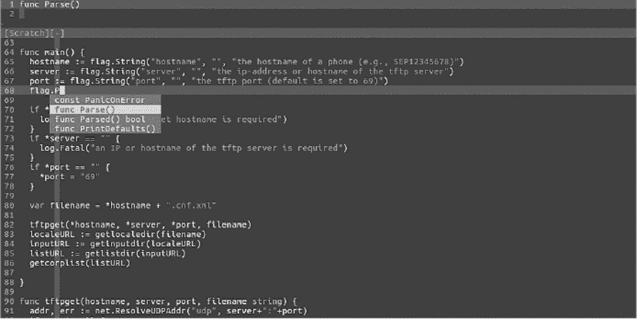
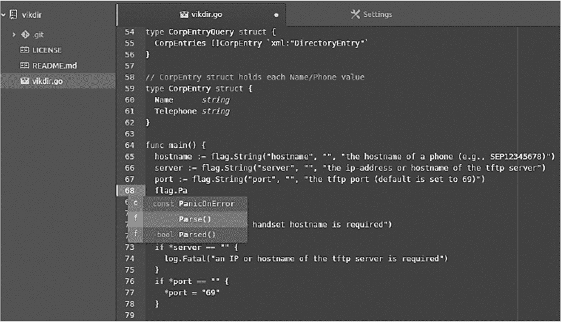
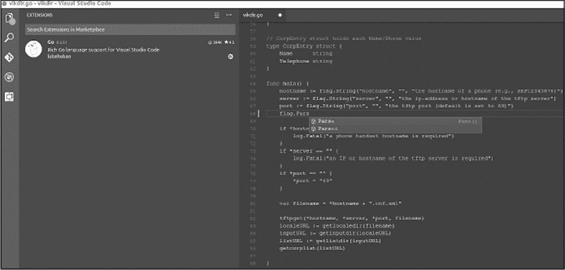
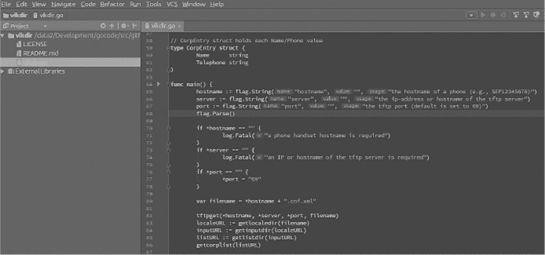

## 1

Go 基础知识


本章将指导你完成设置 Go 开发环境的过程，并介绍语言的语法。人们已经写了整本书来讲解语言的基本机制；本章涵盖了你在后续章节的代码示例中需要的最基本概念。我们将涵盖从原始数据类型到实现并发的所有内容。对于已经精通语言的读者来说，你会发现本章的内容大部分是复习。

### 设置开发环境

要开始使用 Go，你需要一个功能完善的开发环境。在本节中，我们将带你了解如何下载 Go 并设置工作区和环境变量。我们还会讨论各种集成开发环境的选项以及 Go 附带的一些标准工具。

#### 下载并安装 Go

从 [*https://golang.org/dl/*](https://golang.org/dl/) 下载最适合你的操作系统和架构的 Go 二进制版本。Windows、Linux 和 macOS 都有对应的二进制文件。如果你使用的系统没有现成的预编译二进制文件，你可以从该链接下载 Go 源代码。

执行二进制文件并按照提示操作，这些提示将非常简单，以便安装整个 Go 核心包。*包*，在其他大多数语言中称为 *库*，包含你可以在 Go 程序中使用的有用代码。

#### 设置 GOROOT 以定义 Go 二进制文件的位置

接下来，操作系统需要知道如何找到 Go 的安装路径。在大多数情况下，如果你将 Go 安装在默认路径下，比如在基于 *Nix/BSD* 的系统中是 */usr/local/go*，你不需要在这里做任何操作。但是，如果你选择将 Go 安装在非标准路径，或者在 Windows 上安装 Go，你需要告诉操作系统 Go 二进制文件的位置。

你可以通过命令行将保留的 `GOROOT` 环境变量设置为二进制文件的位置来实现这一点。设置环境变量是操作系统特定的。在 Linux 或 macOS 上，你可以将其添加到 *~/.profile* 中：

```
set GOROOT=/path/to/go
```

在 Windows 上，你可以通过系统（控制面板）添加这个环境变量，点击 **环境变量** 按钮。

#### 设置 GOPATH 以确定 Go 工作区的位置

与设置 `GOROOT` 不同，`GOROOT` 仅在某些安装场景中需要，你必须始终定义一个名为 `GOPATH` 的环境变量，以指示 Go 工具链你的源代码、第三方库和已编译程序的位置。这个位置可以是你选择的任何位置。一旦你选择或创建了这个基础工作区目录，就在其中创建以下三个子目录：*bin*、*pkg* 和 *src*（稍后会详细讲解这些目录）。然后，设置一个名为 `GOPATH` 的环境变量，指向你的基础工作区目录。例如，如果你想将项目放在 Linux 系统中名为 *gocode* 的目录中，你可以将 `GOPATH` 设置为以下路径：

```
GOPATH=$HOME/gocode
```

*bin* 目录将包含你编译并安装的 Go 可执行二进制文件。构建并安装的二进制文件会自动放置到此位置。*pkg* 目录存储各种包对象，包括你的代码可能依赖的第三方 Go 库。例如，假设你想使用另一位开发者的代码来更优雅地处理 HTTP 路由。*pkg* 目录将包含必要的二进制文件，用于在你的代码中使用他们的实现。最后，*src* 目录将包含你编写的所有源代码。

工作区的位置是任意的，但其中的目录必须遵循此命名约定和结构。稍后你将学习到的编译、构建和包管理命令都依赖于这种通用的目录结构。如果没有这个重要的设置，Go 项目将无法编译或找到任何必要的依赖！

配置好必要的 `GOROOT` 和 `GOPATH` 环境变量后，确认它们是否已正确设置。你可以通过 `set` 命令在 Linux 和 Windows 上进行检查。还要确保你的系统能够找到二进制文件，并且你已使用 `go version` 命令安装了预期的 Go 版本：

```
$ go version
go version go1.11.5 linux/amd64
```

此命令应返回你安装的二进制版本。

#### 选择集成开发环境

接下来，你可能需要选择一个集成开发环境（IDE）来编写代码。虽然 IDE 不是必需的，但许多 IDE 提供的功能可以帮助减少代码中的错误、添加版本控制快捷键、协助包管理等。由于 Go 仍然是一个相对年轻的语言，可能没有其他语言那样多成熟的 IDE。

幸运的是，近年来的技术进步为你提供了几种功能齐全的选择。我们将在本章中回顾其中的一些。要查看完整的 IDE 或编辑器选项列表，请访问 Go 的维基页面 [*https://github.com/golang/go/wiki/IDEsAndTextEditorPlugins/*](https://github.com/golang/go/wiki/IDEsAndTextEditorPlugins/)。本书对 IDE/编辑器没有特定要求，这意味着我们不会强迫你使用任何一种解决方案。

##### Vim 编辑器

*Vim*文本编辑器在许多操作系统发行版中都有提供，提供了一个多功能、可扩展并且完全开源的开发环境。Vim 的一个吸引人之处是，它允许用户从终端运行所有内容，不会被华丽的 GUI 界面干扰。

Vim 包含了一个庞大的插件生态系统，您可以通过它自定义主题、添加版本控制、定义代码片段、添加布局和代码导航功能、包括自动补全、执行语法高亮和静态检查，等等。Vim 最常见的插件管理系统包括 Vundle 和 Pathogen。

要在 Vim 中使用 Go，请安装`vim-go`插件（[*https://github.com/fatih/vim-go/*](https://github.com/fatih/vim-go/)，如图 1-1 所示）。



*图 1-1：`vim-go`插件*

当然，要在 Go 开发中使用 Vim，您需要对 Vim 非常熟悉。而且，定制一个符合您需求的开发环境，可能会是一个令人沮丧的过程。如果您使用 Vim（它是免费的），那么您可能需要牺牲一些商业 IDE 的便利性。

##### GitHub Atom

GitHub 的 IDE，名为*Atom*（*[`atom.io/`](https://atom.io/)*），是一个可定制的文本编辑器，拥有大量社区驱动的插件。与 Vim 不同，Atom 提供了一个专门的 IDE 应用，而不是终端内解决方案，如图 1-2 所示。



*图 1-2：带 Go 支持的 Atom*

像 Vim 一样，Atom 是免费的。它提供了平铺窗口、包管理、版本控制、调试、自动补全和许多额外功能，这些功能要么是开箱即用的，要么是通过使用`go-plus`插件来提供专门的 Go 支持（*[`atom.io/packages/go-plus/`](https://atom.io/packages/go-plus/)*）。

##### 微软 Visual Studio Code

微软的*Visual Studio Code*，或*VS Code*（*[`code.visualstudio.com`](https://code.visualstudio.com)*），可以说是功能最丰富且最易于配置的 IDE 应用之一。VS Code，如图 1-3 所示，完全开源并根据 MIT 许可证分发。



*图 1-3：带 Go 支持的 VS Code IDE*

VS Code 支持一系列多样化的扩展，用于主题、版本控制、代码补全、调试、静态检查和格式化。您可以通过`vscode-go`扩展获得 Go 集成（*[`github.com/Microsoft/vscode-go/`](https://github.com/Microsoft/vscode-go/)*）。

##### JetBrains GoLand

JetBrains 的开发工具集合高效且功能丰富，使得专业开发和业余项目都变得易于完成。图 1-4 展示了 JetBrains GoLand IDE 的界面。

*GoLand* 是 JetBrains 为 Go 语言开发的商业 IDE。GoLand 的定价从学生免费，到个人每年 89 美元，再到组织每年 199 美元。GoLand 提供了丰富的 IDE 功能，包括调试、代码补全、版本控制、代码检查、格式化等。虽然付费购买产品可能听起来不太吸引人，但像 GoLand 这样的商业产品通常会提供官方支持、文档、及时的 bug 修复和企业软件所带来的一些其他保证。



*图 1-4：GoLand 商业 IDE*

#### 使用常见的 Go 工具命令

Go 附带了几个有用的命令，可以简化开发过程。这些命令通常会包含在 IDE 中，使得工具在不同的开发环境中保持一致。让我们来看一些这些命令。

##### `go run` 命令

在开发过程中你会执行的常见命令之一，`go run` 会编译并执行 *main 包*——你程序的入口点。

例如，将以下代码保存在 *$GOPATH/src* 下的项目目录中（记住，在安装时你创建了这个工作空间），命名为 *main.go*：

```
package main
import (
    "fmt"
)
func main() {
    fmt.Println("Hello, Black Hat Gophers!")
}
```

在命令行中，在包含此文件的目录下执行 `go run main.go`。你应该会看到 `Hello, Black Hat Gophers!` 显示在屏幕上。

##### `go build` 命令

请注意，`go run` 执行了你的文件，但它没有生成独立的二进制文件。此时 `go build` 就派上用场了。`go build` 命令会编译你的应用程序，包括任何包及其依赖项，但不会安装结果。它会在磁盘上创建一个二进制文件，但不会执行你的程序。它创建的文件遵循合理的命名约定，但也不罕见使用 `-o output` 命令行选项更改生成的二进制文件名称。

将之前示例中的 *main.go* 重命名为 *hello.go*。在终端窗口中，执行 `go build hello.go`。如果一切按预期进行，这条命令应该会创建一个名为 *hello* 的可执行文件。现在输入此命令：

```
$ ./hello
Hello, Black Hat Gophers!
```

这应该会运行独立的二进制文件。

默认情况下，生成的二进制文件包含调试信息和符号表，这可能会增加文件的大小。为了减小文件大小，你可以在构建过程中添加额外的标志，从二进制文件中剥离这些信息。例如，以下命令将使二进制文件的大小减少大约 30%：

```
$ go build -ldflags "-w -s"
```

更小的二进制文件将使其在传输或嵌入过程中更加高效，同时有助于你完成一些阴谋任务。

##### 跨平台编译

使用`go build`非常适合在当前系统或相同架构的系统上运行二进制文件，但如果你想创建一个可以在不同架构上运行的二进制文件怎么办呢？这就是交叉编译的用途。*交叉编译*是 Go 的一个非常酷的特点，因为没有其他语言能像 Go 一样轻松实现。`build`命令允许你为多个操作系统和架构交叉编译程序。有关可兼容的操作系统和架构编译类型的详细信息，请参考官方 Go 文档的*[`golang.org/doc/install/source#environment/`](https://golang.org/doc/install/source#environment/)*。

要进行交叉编译，你需要设置一个*约束*。这只是一个用于将操作系统和架构的信息传递给`build`命令的方式。这些约束包括`GOOS`（操作系统）和`GOARCH`（架构）。

你可以通过三种方式引入构建约束：通过命令行、代码注释或文件后缀命名约定。我们将在这里讨论命令行方法，其它两种方法如果你愿意，可以自行研究。

假设你想将之前的*hello.go*程序从 macOS 系统交叉编译，以便它能在 Linux 64 位架构上运行。你可以通过命令行设置`GOOS`和`GOARCH`约束，执行`build`命令来完成这一操作：

```
$ GOOS="linux" GOARCH="amd64" go build hello.go
$ ls
hello  hello.go
$ file hello
hello: ELF 64-bit LSB executable, x86-64, version 1 (SYSV), statically linked, not stripped
```

输出结果确认生成的二进制文件是一个 64 位的 ELF（Linux）文件。

在 Go 中，交叉编译过程比几乎所有其他现代编程语言都要简单。唯一的“坑”是当你尝试交叉编译使用本地 C 绑定的应用程序时。我们不会深入探讨这些问题，留给你自己去解决。根据你导入的包和开发的项目，你可能不需要经常担心这个问题。

##### `go doc`命令

`go doc`命令允许你查询有关包、函数、方法或变量的文档。这些文档嵌入在你的代码注释中。让我们来看一下如何获取`fmt.Println()`函数的详细信息：

```
$ go doc fmt.Println
func Println(a ...interface{}) (n int, err error)
    Println formats using the default formats for its operands and writes to
    standard output. Spaces are always added between operands and a newline
    is appended. It returns the number of bytes written and any write error
    encountered.
```

`go doc`生成的输出直接来自源代码中的注释。只要你适当注释你的包、函数、方法和变量，你就能够通过`go doc`命令自动检查文档。

##### `go get`命令

你在本书中开发的许多 Go 程序将需要第三方包。要获取包的源代码，可以使用`go get`命令。例如，假设你编写了以下代码，导入了`stacktitan/ldapauth`包：

```
   package main

   import (
   "fmt"
   "net/http"

❶ "github.com/stacktitan/ldapauth"
   )
```

即使你已经导入了`stacktitan/ldapauth`包❶，你也无法直接访问该包。你首先需要运行`go get`命令。使用`go get github.com/stacktitan/ldapauth`会下载实际的包并将其放入* $GOPATH/src *目录中。

以下目录树展示了`ldapauth`包在你的`GOPATH`工作空间中的位置：

```
   $ tree src/github.com/stacktitan/
❶ src/github.com/stacktitan/
   └── ldapauth
       ├── LICENSE
       ├── README.md
       └── ldap_auth.go
```

请注意，路径❶和导入的包名是以一种避免为多个包分配相同名称的方式构建的。使用`github.com/stacktitan`作为实际包名`ldapauth`的前缀，确保包名保持唯一。

尽管 Go 开发者传统上使用`go get`来安装依赖项，但如果那些依赖的包接收到会破坏向后兼容性的更新，可能会出现问题。Go 引入了两个独立的工具——`dep`和`mod`——来锁定依赖项，以防止向后兼容性问题。然而，本书几乎专门使用`go get`来拉取依赖项。这有助于避免与正在进行的依赖项管理工具不一致，并希望能够更容易地让你运行这些示例。

##### `go fmt`命令

`go fmt`命令会自动格式化你的源代码。例如，运行`go fmt` /path/to/your/package 会通过强制使用适当的换行、缩进和括号对齐来调整你的代码样式。

坚持任意的样式偏好一开始可能看起来很奇怪，特别是当它们与你的习惯不同时。然而，随着时间的推移，你应该会觉得这种一致性非常清新，因为你的代码将看起来和其他第三方包相似，并且更加有条理。大多数 IDE 都包含钩子，当你保存文件时会自动运行`go fmt`，因此你不需要显式地运行该命令。

##### `golint`和`go vet`命令

与`go fmt`改变你代码的语法样式不同，`golint`报告样式错误，例如缺少注释、变量命名不符合约定、无用的类型规格等。请注意，`golint`是一个独立的工具，而不是主`go`二进制文件的子命令。你需要通过运行`go get -u golang.org/x/lint/golint`单独安装它。

类似地，`go vet`检查你的代码，并使用启发式方法来识别可疑的构造，例如使用不正确的格式字符串类型调用`Printf()`。`go vet`命令试图识别问题，其中一些可能是编译器无法发现的真正的 BUG。

##### Go Playground

*Go Playground*是一个托管在[*https://play.golang.org/*](https://play.golang.org/)上的执行环境，为开发人员提供了一个基于网页的前端，能够快速开发、测试、执行并分享 Go 代码片段。该网站使得开发者可以在不安装或运行 Go 的情况下快速尝试各种 Go 功能。它是测试代码片段在集成到项目中之前的一个很好的方式。

它还允许你在预配置的环境中轻松地体验语言的各种细微差别。值得注意的是，Go Playground 限制你调用某些危险的函数，以防止你例如执行操作系统命令或与第三方网站交互。

##### 其他命令和工具

尽管我们不会明确讨论其他工具和命令，但我们鼓励你自己进行研究。随着你创建越来越复杂的项目，你可能会遇到需要使用 `go test` 工具来运行单元测试和基准测试、使用 `cover` 来检查测试覆盖率、使用 `imports` 来修复导入语句等需求。

### 理解 Go 语法

对整个 Go 语言的全面回顾需要多章内容，甚至可能需要一本书。本节简要概述了 Go 的语法，特别是关于数据类型、控制结构和常见模式的内容。这应该为轻度使用 Go 的程序员提供一个复习资料，也为新接触该语言的人提供一个入门介绍。

对于深入、渐进式的语言回顾，我们推荐你通过优秀的 *Go 入门教程* (*[`tour.golang.org/`](https://tour.golang.org/)*) 进行学习。该教程是对 Go 语言的全面、实践讨论，分为小节，并提供内嵌的 Playground，让你可以亲自尝试每个概念。

该语言本身是 C 的一种更加简洁的版本，去除了许多低级别的细节，从而提高了可读性和易用性。

#### 数据类型

和大多数现代编程语言一样，Go 提供了多种原始数据类型和复杂数据类型。*原始类型*由基本的构建块（如字符串、数字和布尔值）组成，这些构建块在其他语言中也很常见。原始类型构成了程序中所有信息的基础。*复杂数据类型*是用户定义的结构，由一个或多个原始类型或其他复杂类型的组合组成。

##### 原始数据类型

原始数据类型包括 `bool`、`string`、`int`、`int8`、`int16`、`int32`、`int64`、`uint`、`uint8`、`uint16`、`uint32`、`uint64`、`uintptr`、`byte`、`rune`、`float32`、`float64`、`complex64` 和 `complex128`。

通常，在定义变量时你会声明其类型。如果不声明，系统会自动推断变量的数据类型。考虑以下示例：

```
var x = "Hello World"
z := int(42)
```

在第一个示例中，你使用关键字 `var` 来定义一个名为 `x` 的变量，并为其赋值 `"Hello World"`。Go 会隐式地推断 `x` 是一个 `string` 类型，因此你不需要显式声明类型。在第二个示例中，你使用 `:=` 运算符定义一个新变量 `z`，并为其赋值整数 42。实际上，这两个运算符没有什么区别。我们在本书中会使用这两者，但有些人觉得 `:=` 运算符是一个丑陋的符号，影响可读性。选择最适合你的方式。

在前面的例子中，你明确地使用`int`函数将 42 的值包装起来，强制指定其类型。你也可以省略`int`函数调用，但这时你必须接受系统自动为该值选择的类型。在某些情况下，这可能不是你打算使用的类型。例如，假设你希望 42 表示为无符号整数，而不是`int`类型，那么你必须明确地包装该值。

##### 切片与映射

Go 还有更复杂的数据类型，如切片和映射。*切片*类似于可以动态调整大小并更高效地传递给函数的数组。*映射*是关联数组，是无序的键/值对列表，允许你高效且快速地根据唯一键查找值。

有多种方式定义、初始化和操作切片与映射。以下示例展示了一种常见方式来定义切片`s`和映射`m`，并向其中添加元素：

```
var s = make([]string, 0)
var m = make(map[string]string)
s = append(s, "some string")
m["some key"] = "some value"
```

这段代码使用了两个内建函数：`make()`来初始化每个变量，和`append()`来向切片中添加新项。最后一行将`some key`和`some value`的键值对添加到映射`m`中。我们建议你阅读官方 Go 文档，以深入了解所有定义和使用这些数据类型的方法。

##### 指针、结构体和接口

*指针*指向内存中的特定区域，并允许你检索存储在该位置的值。像在 C 语言中一样，你使用`&`操作符来获取某个变量在内存中的地址，使用`*`操作符来解除引用该地址。下面的示例说明了这一点：

```
❶ var count = int(42)
❷ ptr := &count
❸ fmt.Println(*ptr)
❹ *ptr = 100
❺ fmt.Println(count)
```

代码定义了一个整数`count`❶，然后使用`&`操作符创建了一个指针❷。这会返回`count`变量的地址。你通过调用`fmt.Println()`来解引用该变量❸，将`count`的值打印到标准输出。接着，你使用`*`操作符❹为指针`ptr`指向的内存位置分配一个新值。由于这是`count`变量的地址，赋值操作会改变该变量的值，你通过打印它到屏幕上❺来确认这一点。

你使用*结构体*类型通过指定类型的相关字段和方法来定义新数据类型。例如，下面的代码定义了一个`Person`类型：

```
❶ type Person struct {
    ❷ Name string
    ❸ Age int
   }
❹ func (p *Person) SayHello() {
       fmt.Println("Hello,", p.Name❺)
   }
   func main() {
       var guy =  new❻(Person)
    ❼ guy.Name = "Dave"
    ❽ guy.SayHello()
   }
```

代码使用`type`关键字❶定义了一个新结构体，该结构体包含两个字段：一个名为`Name`的`string`❷和一个名为`Age`的`int`❸。

你在`Person`类型上定义了一个方法`SayHello()`，该方法分配给变量`p`❹。该方法通过查看接收调用的结构体`p`❺，向标准输出打印一条问候信息。可以将`p`视为其他语言中`self`或`this`的引用。你还定义了一个函数`main()`，它作为程序的入口点。这个函数使用`new`关键字❻来初始化一个新的`Person`。它将名字`Dave`分配给这个人❼，然后告诉这个人调用`SayHello()`❽。

结构体缺乏常见于其他语言中的作用域修饰符——如 private、public 或 protected，用于控制对其成员的访问。相反，Go 使用大小写字母来确定作用域：以大写字母开头的类型和字段是公开的，可以在包外访问，而以小写字母开头的是私有的，仅能在包内访问。

你可以将 Go 的 *interface* 类型看作一个蓝图或合同。这个蓝图定义了一个期望的操作集合，任何具体的实现必须满足这些操作，才能被视为该接口的类型。定义接口时，你定义了一组方法；任何包含这些方法且具有正确签名的数据类型都履行了合同，并被视为该接口的类型。让我们来看一个例子：

```
❶ type Friend interface {
    ❷ SayHello()
   }
```

在这个示例中，你定义了一个名为 `Friend` ❶ 的接口，要求实现一个方法：`SayHello()` ❷。这意味着任何实现了 `SayHello()` 方法的类型都是 `Friend`。请注意，`Friend` 接口并没有实际实现这个函数——它只是说，如果你是一个 `Friend`，你需要能够 `SayHello()`。

以下函数 `Greet()` 接受一个 `Friend` 接口作为输入，并以特定于 `Friend` 的方式打招呼：

```
func Greet❶ (f Friend❷) {
    f.SayHello()
}
```

你可以将任何 `Friend` 类型传递给该函数。幸运的是，在前面的示例中使用的 `Person` 类型可以 `SayHello()`——它是一个 `Friend`。因此，如果一个名为 `Greet()` 的函数 ❶，如前面的代码所示，期望接收一个 `Friend` 作为输入参数 ❷，你可以像这样传递一个 `Person`：

```
func main() {
    var guy = new(Person)
    guy.Name = "Dave"
    Greet(guy)
}
```

使用接口和结构体，你可以定义多个类型，只要这些类型实现了 `Friend` 接口，就可以将它们传递给相同的 `Greet()` 函数。考虑这个修改后的示例：

```
❶ type Dog struct {}
   func (d *Dog) SayHello()❷ {
       fmt.Println("Woof woof")
   }
   func main() {
       var guy = new(Person)
       guy.Name = "Dave"
    ❸ Greet(guy)
       var dog = new(Dog)
    ❹ Greet(dog)
   }
```

该示例展示了一个新类型 `Dog` ❶，它能够 `SayHello()` ❷，因此它是一个 `Friend`。你可以 `Greet()` 一个 `Person` ❸ 和一个 `Dog` ❹，因为它们都能 `SayHello()`。

本书将在多次讲解接口的内容，帮助你更好地理解这一概念。

#### 控制结构

Go 的控制结构比其他现代语言略少。尽管如此，你仍然可以使用 Go 完成复杂的处理任务，包括条件判断和循环。

Go 的主要条件语句是 if/else 结构：

```
if x == 1 {
    fmt.Println("X is equal to 1")
} else {
    fmt.Println("X is not equal to 1")
}
```

Go 的语法与其他语言的语法略有不同。例如，你不需要将条件判断（在本例中为 `x == 1`）放在括号中。你必须将所有代码块，包括前面的单行代码块，都用大括号包裹起来。许多其他现代语言对于单行代码块可以选择不使用大括号，但在 Go 中大括号是必须的。

对于涉及多个选择的条件判断，Go 提供了 `switch` 语句。以下是一个示例：

```
switch x❶ {
    case "foo"❷:
        fmt.Println("Found foo")
    case "bar"❸:
        fmt.Println("Found bar")
    default❹:
        fmt.Println("Default case")
}
```

在这个示例中，`switch`语句将变量`x`的内容❶与不同的值进行比较——`foo`❷和`bar`❸——如果`x`匹配其中一个条件，则向标准输出（stdout）记录一条消息。这个示例包括一个`default`语句❹，在没有其他条件匹配时执行。

请注意，与许多其他现代语言不同，你的`case`语句不需要包含`break`语句。在其他语言中，执行通常会继续遍历每个`case`，直到代码达到`break`语句或`switch`的结尾。而 Go 只会执行一个匹配的或默认的`case`。

Go 还包含一个特殊的`switch`变体，称为*类型开关*，通过使用`switch`语句执行类型断言。类型开关对于尝试理解接口的底层类型非常有用。例如，你可能会使用类型开关来获取名为`i`的接口的底层类型：

```
func foo(i❶ interface{}) {
    switch v := i.(type)❷ {
    case int:
        fmt.Println("I'm an integer!")
    case string:
        fmt.Println("I'm a string!")
    default:
        fmt.Println("Unknown type!")
    }
}
```

这个示例使用特殊语法`i.(type)`❷来获取`i`接口变量❶的类型。你将这个值用于一个`switch`语句，其中每个`case`匹配特定的类型。在这个示例中，`case`检查`int`或`string`原始类型，但你也可以检查指针或用户定义的结构体类型等。

Go 的最后一个流程控制结构是`for`循环。`for`循环是 Go 专用的用于执行迭代或重复代码段的构造。虽然没有像`do`或`while`这样的循环语法可能显得奇怪，但你可以通过使用`for`循环语法的变体来重新创建它们。以下是`for`循环的一个变体：

```
for i := 0; i < 10; i++ {
    fmt.Println(i)
}
```

这段代码循环打印 0 到 9 的数字，每个数字都打印到标准输出。注意第一行中的分号。与许多其他语言不同，Go 使用分号来分隔不同的控制结构，使得在单行代码中执行多个不同但相关的子任务。第一行使用分号将初始化逻辑（`i := 0`）、条件表达式（`i < 10`）和后置语句（`i++`）分开。这种结构对于任何在现代语言中编写过代码的人来说应该非常熟悉，因为它紧跟这些语言的约定。

以下示例展示了`for`循环的一个稍微变化的版本，循环遍历一个集合，如切片或映射：

```
❶ nums := []int{2,4,6,8}
   for idx❷, val❸ := range❹ nums {
       fmt.Println(idx, val)
   }
```

在这个示例中，你初始化了一个名为`nums`的整数切片❶。然后在`for`循环中使用关键字`range`❹来遍历切片。`range`关键字返回两个值：当前索引❷和该索引处的当前值的副本❸。如果你不打算使用索引，你可以将`for`循环中的`idx`替换为下划线，告诉 Go 你不需要它。

你也可以使用相同的循环逻辑与映射（maps）一起，返回每个键/值对。

#### 并发

与已经回顾过的控制结构类似，Go 拥有比其他语言更简洁的并发模型。为了并发执行代码，你可以使用*goroutines*，它们是可以同时运行的函数或方法。由于创建它们的开销相对于实际线程非常小，所以它们通常被描述为*轻量级线程*。

要创建一个 goroutine，在你希望并发运行的方法或函数调用前使用`go`关键字：

```
❶ func f() {
       fmt.Println("f function")
   }

   func main() {
    ❷ go f()
       time.Sleep(1 * time.Second)
       fmt.Println("main function")
   }
```

在这个例子中，你定义了一个函数`f()` ❶，并在`main()`函数中调用它，`main()`函数是程序的入口点。你在调用前加上了关键字`go` ❷，这意味着程序将并发运行`f()`函数；换句话说，`main()`函数的执行将继续进行，而不等待`f()`完成。然后，你使用`time.Sleep(1 * time.Second)`强制`main()`函数暂停，给`f()`足够的时间完成。如果你没有暂停`main()`函数，程序很可能会在`f()`函数完成之前退出，结果你将无法看到它的输出。正确执行后，你会看到一些消息被打印到标准输出，表明你已经完成了`f()`和`main()`函数的执行。

Go 包含了一种称为*通道*的数据类型，它提供了一种机制，允许 goroutines 同步执行并相互通信。让我们来看一个使用通道的例子，同时显示不同字符串的长度及其总和：

```
❶ func strlen(s string, c chan int) {
    ❷ c <- len(s)
   }

   func main() {
    ❸ c := make(chan int)
    ❹ go strlen("Salutations", c)
       go strlen("World", c)
    ❺ x, y := <-c, <-c
       fmt.Println(x, y, x+y)
   }
```

首先，你定义并使用了一个类型为`chan int`的变量`c`。你可以根据打算通过通道传递的数据类型来定义不同类型的通道。在这个例子中，你将传递不同字符串的长度作为整数值，在 goroutines 之间传递，因此应该使用`int`类型的通道。

注意一个新的操作符：`<-`。这个操作符表示数据是流入还是流出一个通道。你可以把它理解为将物品放入桶中或从桶中取出物品的等价操作。

你定义的函数`strlen()` ❶接受一个字符串类型的单词以及一个用于同步数据的通道。这个函数包含一个语句`c <- len(s)` ❷，它使用内置的`len()`函数来计算字符串的长度，然后通过`<-`操作符将结果放入`c`通道。

`main()` 函数将所有内容串联在一起。首先，你调用 `make(chan int)` ❸ 创建整数通道。然后，你通过使用 `go` 关键字 ❹ 发起多个并发调用 `strlen()` 函数，这会启动多个 goroutine。你将两个字符串值以及结果放入的通道传递给 `strlen()` 函数。最后，你使用 `<-` 操作符 ❺ 从通道中读取数据，这次数据从通道流出。这意味着你从桶中取出物品，可以把这些值赋给变量 `x` 和 `y`。请注意，在这行代码执行时，程序会阻塞，直到能从通道中读取到足够的数据。

当这一行执行完成时，你将显示每个字符串的长度以及它们的总和输出到标准输出（stdout）。在这个示例中，它会产生如下输出：

```
5 11 16
```

这看起来可能有些复杂，但关键在于突出 Go 在基本并发模式方面的优势，因为 Go 在这方面表现出色。由于 Go 中的并发和并行处理可能变得相当复杂，因此你可以自行探索。在本书的后续章节中，我们会介绍更多现实且复杂的并发实现，包括缓冲通道、等待组、互斥锁等。

#### 错误处理

与大多数其他现代编程语言不同，Go 不包括用于 `try/catch/finally` 错误处理的语法。相反，它采用了一种极简主义的方法，鼓励你在发生错误的地方进行检查，而不是让错误“冒泡”到调用链中的其他函数。

Go 定义了一个内建的错误类型，其 `interface` 声明如下：

```
type error interface {
    Error() string
}
```

这意味着你可以使用任何实现了名为 `Error()` 方法并返回 `string` 类型值的数据类型作为 `error`。例如，以下是你可以定义并在代码中使用的自定义错误：

```
❶ type MyError string
   func (e MyError) Error() string❷ {
       return string(e)
   }
```

你创建了一个名为 `MyError` 的用户定义字符串类型 ❶，并为该类型实现了一个 `Error() string` 方法 ❷。

在处理错误时，你将很快适应以下模式：

```
func foo() error {
    return errors.New("Some Error Occurred")
}
func main() {
    if err := foo()❶;err != nil❷ {
        // Handle the error
    }
}
```

你会发现，函数和方法返回至少一个值是相当常见的。这个值几乎总是一个 `error`。在 Go 中，返回的 `error` 值可能是 `nil`，这表示函数没有生成错误，一切看似按预期运行。非 `nil` 值意味着函数中出现了问题。

因此，你可以通过使用 `if` 语句来检查错误，如 `main()` 函数中所示。你通常会看到多个语句，语句之间用分号分隔。第一个语句调用函数并将结果错误分配给一个变量 ❶。第二个语句检查该 `error` 是否为 `nil` ❷。你可以在 `if` 语句的主体中处理错误。

您会发现，关于在 Go 中如何处理和记录错误的最佳方式，存在不同的哲学观点。一个挑战是，与其他语言不同，Go 内置的错误类型并不隐式包含堆栈跟踪，这帮助您定位错误的上下文或位置。尽管您可以当然生成一个堆栈跟踪并将其分配给应用中的自定义类型，但它的实现完全由开发人员决定。一开始这可能有点令人烦恼，但您可以通过适当的应用设计来管理它。

#### 处理结构化数据

安全从业人员经常编写处理*结构化数据*的代码，或者是具有常见编码的数据，例如 JSON 或 XML。Go 包含用于数据编码的标准包。您可能会使用的最常见的包包括`encoding/json`和`encoding/xml`。

两个包都可以对任意数据结构进行序列化和反序列化，这意味着它们可以将字符串转换为结构体，将结构体转换为字符串。让我们看一下以下示例，它将结构体序列化为字节切片，然后将字节切片反序列化回结构体：

```
❶ type Foo struct {
       Bar string
       Baz string
   }

   func main() {
    ❷ f := Foo{"Joe Junior", "Hello Shabado"}
       b, _❸ := json.Marshal❹(f❺)
    ❻ fmt.Println(string(b))
       json.Unmarshal(b❼, &f❽)
   }
```

这段代码（偏离最佳实践并忽略了可能的错误）定义了一个名为`Foo`的`struct`类型❶。您在`main()`函数中初始化它❷，然后调用`json.Marshal()`❹，将`Foo`实例❺传递给它。这个`Marshal()`方法将`struct`编码为 JSON，返回一个`byte`切片❸，您随后将其打印到标准输出❻。这里显示的输出是我们`Foo`结构的 JSON 编码字符串表示：

```
{"Bar":"Joe Junior","Baz":"Hello Shabado"}
```

最后，您将相同的`byte`切片❼传递给`json.Unmarshal(b, &f)`进行解码。这将生成一个`Foo`结构实例❽。处理 XML 的过程与此几乎相同。

在处理 JSON 和 XML 时，您通常会使用*字段标签*，这些是您分配给结构体字段的元数据元素，用于定义序列化和反序列化逻辑如何查找和处理关联的元素。存在多种变体的字段标签，但这里有一个简短的示例，演示了如何使用它们来处理 XML：

```
type Foo struct {
    Bar     string    `xml:"id,attr"`
    Baz     string    `xml:"parent>child"`
}
```

字符串值，使用反引号包裹并跟随结构体字段的是字段标签。*字段标签*总是以标签名称（在此情况下为`xml`）开头，后跟一个冒号和用双引号括起来的指令。*指令*定义了字段应如何处理。在这种情况下，您提供的指令声明`Bar`应作为名为`id`的属性处理，而不是作为元素，并且`Baz`应位于`parent`的子元素`child`中。如果您将之前的 JSON 示例修改为现在以 XML 编码结构，您将看到以下结果：

```
<Foo id="Joe Junior"><parent><child>Hello Shabado</child></parent></Foo>
```

XML 编码器通过反射确定元素的名称，使用标签指令，因此每个字段都根据您的需求进行处理。

在本书中，你将看到这些字段标签被用于处理其他数据序列化格式，包括 ASN.1 和 MessagePack。我们还将讨论一些定义自定义标签的相关示例，特别是当你学习如何处理服务器消息块（SMB）协议时。

### 概要

在本章中，你设置了 Go 环境并了解了 Go 语言的基本方面。这不是 Go 语言所有特性的详尽列表；该语言的细节和规模远远超出了我们在单一章节中所能囊括的内容。相反，我们包括了在接下来的章节中最有用的方面。现在我们将注意力转向安全从业人员和黑客的语言实际应用。现在，开始吧！
