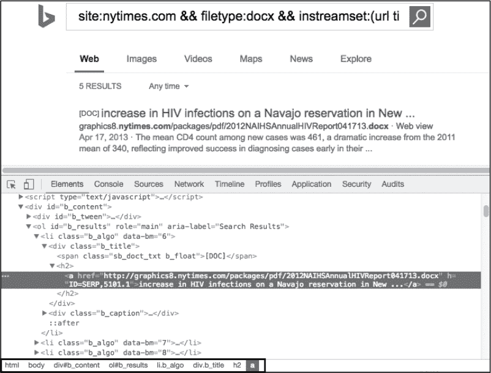

## 3

HTTP 客户端与工具的远程交互


在第二章中，你学会了如何利用 TCP 的强大功能，使用各种技术来创建可用的客户端和服务器。这是一个系列章节的第一章，探讨了 OSI 模型更高层次的各种协议。由于其在网络上的普及、与放宽出口控制的关联以及其通用的灵活性，我们从 HTTP 开始。

本章重点介绍客户端部分。它将首先向你介绍构建和自定义 HTTP 请求以及接收响应的基础知识。然后，你将学习如何解析结构化的响应数据，以便客户端可以查询信息，确定可操作或相关的数据。最后，你将学习如何通过构建与各种安全工具和资源互动的 HTTP 客户端来应用这些基础知识。你开发的客户端将查询和使用 Shodan、Bing 和 Metasploit 的 API，并以类似 FOCA 元数据搜索工具的方式搜索和解析文档元数据。

### 使用 Go 学习 HTTP 基础

虽然你不需要对 HTTP 有全面的了解，但在开始之前，你应该知道一些基本的概念。

首先，HTTP 是一个*无状态协议*：服务器不会固有地为每个请求维护状态和状态信息。相反，状态是通过各种手段跟踪的，包括会话标识符、cookies、HTTP 头部等。客户端和服务器有责任正确地协商和验证这一状态。

其次，客户端和服务器之间的通信可以是同步的，也可以是异步的，但它们都基于请求/响应周期。你可以在请求中包含多个选项和头部信息，以影响服务器的行为并创建可用的 Web 应用程序。最常见的是，服务器托管文件，Web 浏览器渲染这些文件，从而呈现出数据的图形化、有组织的和富有设计感的表现。但端点也可以提供任意数据类型的服务。API 通常通过更结构化的数据编码进行通信，如 XML、JSON 或 MSGRPC。在某些情况下，检索到的数据可能是二进制格式，表示供下载的任意文件类型。

最后，Go 提供了便捷的函数，可以让你快速轻松地构建并发送 HTTP 请求到服务器，并随后检索和处理响应。通过你在前面章节中学到的一些机制，你会发现，处理结构化数据的惯例在与 HTTP API 互动时非常方便。

#### 调用 HTTP API

我们通过检查基本请求来开始 HTTP 的讨论。Go 的 `net/http` 标准包包含几个便捷函数，可以快速轻松地发送 POST、GET 和 HEAD 请求，这些请求无疑是你将使用的最常见的 HTTP 动词。这些函数的形式如下：

```
Get(url string) (resp *Response, err error)
Head(url string) (resp *Response, err error)
Post(url string, bodyType string, body io.Reader) (resp *Response, err error)
```

每个函数都将 URL 作为字符串值作为参数，并将其用作请求的目标。`Post()` 函数比 `Get()` 和 `Head()` 函数稍微复杂一些。`Post()` 需要两个额外的参数：`bodyType`，它是一个字符串值，用于请求体的 Content-Type HTTP 头（通常为 `application/x-www-form-urlencoded`），以及 `io.Reader`，你可以在 第二章中了解它。

你可以在 列表 3-1 中看到这些函数的示例实现。（所有位于根目录位置的代码列表都存在于提供的 GitHub 仓库 *[`github.com/blackhat-go/bhg/`](https://github.com/blackhat-go/bhg/)* 中。）请注意，POST 请求从表单值创建请求体，并设置 Content-Type 头。在每种情况下，在读取数据后，必须关闭响应体。

```
r1, err := http.Get("http://www.google.com/robots.txt")
// Read response body. Not shown.
defer r1.Body.Close()
r2, err := http.Head("http://www.google.com/robots.txt")
// Read response body. Not shown.
defer r2.Body.Close()
form := url.Values{}
form.Add("foo", "bar")
r3, err = http.Post❶(
    "https://www.google.com/robots.txt",
 ❷ "application/x-www-form-urlencoded",
    strings.NewReader(form.Encode()❸),
)
// Read response body. Not shown.
defer r3.Body.Close()
```

*列表 3-1：`Get()`、`Head()` 和 `Post()` 函数的示例实现 (*[/ch-3/basic/main.go](https://github.com/blackhat-go/bhg/blob/master/ch-3/basic/main.go)*)*

POST 函数调用 ❶ 遵循了一个相当常见的模式，即将 Content-Type 设置为 `application/x-www-form-urlencoded` ❷，同时对表单数据进行 URL 编码 ❸。

Go 还有一个额外的 POST 请求便利函数，名为 `PostForm()`，它消除了手动设置那些值并编码每个请求的繁琐；你可以在此查看其语法：

```
func PostForm(url string, data url.Values) (resp *Response, err error)
```

如果你想用 `PostForm()` 函数替代 列表 3-1 中的 `Post()` 实现，可以使用类似 列表 3-2 中的加粗代码。

```
form := url.Values{}
form.Add("foo", "bar")
r3, err := http.PostForm("https://www.google.com/robots.txt", form)
// Read response body and close.
```

*列表 3-2：使用 `PostForm()` 函数代替 `Post()` (*[/ch-3/basic/main.go](https://github.com/blackhat-go/bhg/blob/master/ch-3/basic/main.go)*)*

不幸的是，其他 HTTP 动词（如 PATCH、PUT 或 DELETE）没有方便的函数可用。你主要会使用这些动词与 RESTful API 进行交互，RESTful API 使用一些通用的指南来说明服务器应该如何以及为什么使用这些动词；但并没有一成不变的规定，HTTP 就像是西部拓荒时代一样。在实际上，我们常常开玩笑说要创建一个只使用 DELETE 的全新 Web 框架。我们会称它为 *DELETE.js*，并且它一定会成为 Hacker News 上的热门话题。阅读本文后，你同意不窃取这个主意！

#### 生成请求

要使用这些动词之一生成请求，可以使用 `NewRequest()` 函数创建 `Request` 结构体，随后使用 `Client` 函数的 `Do()` 方法发送请求。我们保证这比听起来要简单。`http.NewRequest()` 函数原型如下：

```
func NewRequest(❶method, ❷url string, ❸body io.Reader) (req *Request, err error)
```

你需要将 HTTP 动词 ❶ 和目标 URL ❷ 提供给 `NewRequest()` 作为前两个字符串参数。就像 列表 3-1 中的第一个 POST 示例一样，你可以选择性地通过传递一个 `io.Reader` 作为第三个也是最后一个参数 ❸ 来提供请求体。

列表 3-3 显示了一个没有 HTTP 请求体的调用——一个 DELETE 请求。

```
req, err := http.NewRequest("DELETE", "https://www.google.com/robots.txt", nil)
var client http.Client
resp, err := client.Do(req)
// Read response body and close.
```

*列表 3-3：发送 DELETE 请求 (*[/ch-3/basic/main.go](https://github.com/blackhat-go/bhg/blob/master/ch-3/basic/main.go)*)*

现在，列表 3-4 显示了一个带有 `io.Reader` 请求体的 PUT 请求（PATCH 请求也类似）。

```
form := url.Values{}
form.Add("foo", "bar")
var client http.Client
req, err := http.NewRequest(
    "PUT",
    "https://www.google.com/robots.txt",
    strings.NewReader(form.Encode()),
)
resp, err := client.Do(req)
// Read response body and close.
```

*列表 3-4：发送 PUT 请求 (*[/ch-3/basic/main.go](https://github.com/blackhat-go/bhg/blob/master/ch-3/basic/main.go)*)*

标准 Go 的 `net/http` 库包含几个可以在请求发送到服务器之前用来操作请求的函数。你将在本章的实际示例中学到一些更相关和实用的变种。但首先，我们将向你展示如何处理服务器接收到的 HTTP 响应。

#### 使用结构化响应解析

在上一节中，你学习了在 Go 中构建和发送 HTTP 请求的机制。那些例子大多忽略了响应处理，基本上暂时忽略了它。但检查 HTTP 响应的各个组件是任何与 HTTP 相关任务的关键方面，比如读取响应体、访问 cookies 和头部，或者仅仅检查 HTTP 状态码。

列表 3-5 细化了 列表 3-1 中的 GET 请求，以显示状态码和响应体——在这个例子中，是 Google 的 *robots.txt* 文件。它使用 `ioutil.ReadAll()` 函数从响应体中读取数据，进行错误检查，并将 HTTP 状态码和响应体打印到标准输出。

```
❶ resp, err := http.Get("https://www.google.com/robots.txt")
   if err != nil {
       log.Panicln(err)
   }
   // Print HTTP Status
   fmt.Println(resp.Status❷)

   // Read and display response body
   body, err := ioutil.ReadAll(resp.Body❸)
   if err != nil {
       log.Panicln(err)
   }
   fmt.Println(string(body))
❹ resp.Body.Close()
```

*列表 3-5：处理 HTTP 响应体（*[/ch-3/basic/main.go](https://github.com/blackhat-go/bhg/blob/master/ch-3/basic/main.go)）*

一旦你接收到响应，在上面的代码中命名为 `resp` ❶，你可以通过访问导出的 `Status` 参数 ❷ 来检索状态字符串（例如，`200 OK`）；我们示例中没有显示，还有一个类似的 `StatusCode` 参数，仅访问状态字符串中的整数部分。

`Response` 类型包含一个导出的 `Body` 参数 ❸，其类型为 `io.ReadCloser`。`io.ReadCloser` 是一个接口，既作为 `io.Reader`，又作为 `io.Closer`，即一个需要实现 `Close()` 函数来关闭读取器并执行清理操作的接口。细节部分并不重要；只需知道在从 `io.ReadCloser` 中读取数据后，你需要在响应体上调用 `Close()` 函数 ❹。使用 `defer` 来关闭响应体是一种常见做法；这将确保在你返回之前关闭该体。

现在，运行脚本以查看错误状态和响应体：

```
$ go run main.go
200 OK
User-agent: *
Disallow: /search
Allow: /search/about
Disallow: /sdch
Disallow: /groups
Disallow: /index.html?
Disallow: /?
Allow: /?hl=
Disallow: /?hl=*&
Allow: /?hl=*&gws_rd=ssl$
Disallow: /?hl=*&*&gws_rd=ssl
--snip--
```

如果你遇到需要解析更多结构化数据的情况——这很可能会发生——你可以按照 第二章 中介绍的约定来读取响应正文并解码它。例如，假设你正在与一个使用 JSON 通信的 API 进行交互，其中一个端点——比如`/ping`——返回以下响应，表示服务器状态：

```
{"Message":"All is good with the world","Status":"Success"}
```

你可以使用 Listing 3-6 中的程序与此端点交互并解码 JSON 消息。

```
   package main

   import {
       encoding/json"
       log
       net/http
   }
❶ type Status struct {
       Message string
       Status  string
   }

   func main() {
    ❷ res, err := http.Post(
           "http://IP:PORT/ping",
           "application/json",
           nil,
       )
       if err != nil {
           log.Fatalln(err)
       }

       var status Status
    ❸ if err := json.NewDecoder(res.Body).Decode(&status); err != nil {
           log.Fatalln(err)
       }
       defer res.Body.Close()
       log.Printf("%s -> %s\n", status.Status❹, status.Message❺)
   }
```

*Listing 3-6: 解码 JSON 响应正文 (*[/ch-3/basic-parsing/main.go](https://github.com/blackhat-go/bhg/blob/master/ch-3/basic-parsing/main.go)*)*

代码首先定义了一个名为`Status`的结构体❶，它包含了服务器响应中预期的元素。`main()`函数首先发送 POST 请求❷，然后解码响应正文❸。完成后，你可以像平常一样查询`Status`结构体——通过访问导出的数据类型`Status`❹和`Message`❺。

解析结构化数据类型的过程在其他编码格式中也是一致的，例如 XML 或甚至二进制表示。你可以通过定义一个结构体来表示预期的响应数据，然后将数据解码为该结构体。其他格式解析的具体细节和实现将由你来决定。

接下来的部分将应用这些基本概念，帮助你构建工具以与第三方 API 交互，从而增强对抗性技术和侦察工作。

### 构建一个与 Shodan 交互的 HTTP 客户端

在对一个组织进行任何授权的对抗性活动之前，任何优秀的攻击者都会从侦察开始。通常，这从不会向目标发送数据包的被动技术开始；这样，活动几乎不可能被发现。攻击者会利用各种来源和服务——包括社交网络、公共记录和搜索引擎——来获取关于目标的潜在有用信息。

当环境上下文在链式攻击场景中应用时，看似无害的信息变得至关重要，这真是令人难以置信。例如，一个披露冗长错误信息的 Web 应用程序，单独来看可能被认为是低严重性。然而，如果错误信息透露了企业用户名格式，而且如果该组织为其 VPN 使用单因素身份验证，那么这些错误信息可能会增加通过密码猜测攻击导致内部网络泄露的可能性。

在收集信息时保持低调，确保目标的意识和安全姿态保持中立，这样可以增加攻击成功的可能性。

*Shodan* (*[`www.shodan.io/`](https://www.shodan.io/)*), 自我描述为“世界上第一个面向互联网连接设备的搜索引擎”，通过维护一个可搜索的网络设备和服务数据库，方便被动侦察，其中包括产品名称、版本、本地化等元数据。把 Shodan 看作是扫描数据的一个存储库，即使它的功能远不止于此。

#### 审查构建 API 客户端的步骤

在接下来的几节中，你将构建一个与 Shodan API 交互的 HTTP 客户端，解析结果并显示相关信息。首先，你需要一个 Shodan API 密钥，可以在注册 Shodan 网站后获得。写这篇文章时，最低等级的费用相对较低，足够个人使用，因此可以去注册这个账户。Shodan 偶尔会提供折扣价格，所以如果你想省点钱，可以密切关注。

现在，从网站获取你的 API 密钥并将其设置为环境变量。以下示例仅在你将 API 密钥保存为`SHODAN_API_KEY`变量时才能正常工作。如果你需要帮助设置该变量，可以参考操作系统的用户手册，或者最好查看第一章。

在处理代码之前，要明白这一部分展示的是如何创建一个简化版的客户端——而不是一个功能齐全、全面的实现。然而，你现在构建的基本框架将使你能够轻松扩展展示的代码，以实现其他 API 调用，根据需要进行扩展。

你构建的客户端将实现两个 API 调用：一个是查询订阅信用信息，另一个是搜索包含特定字符串的主机。你将使用后者来识别主机；例如，查找匹配某个产品的端口或操作系统。

幸运的是，Shodan 的 API 非常直接，生成结构良好的 JSON 响应。这使它成为学习 API 交互的良好起点。以下是准备和构建 API 客户端的典型步骤概述：

1.  查看服务的 API 文档。

1.  设计代码的逻辑结构，以减少复杂性和重复性。

1.  根据需要在 Go 中定义请求或响应类型。

1.  创建辅助函数和类型，以简化初始化、身份验证和通信，减少冗长或重复的逻辑。

1.  构建与 API 消费者函数和类型交互的客户端。

我们不会在这一节明确列出每个步骤，但你应该使用这个列表作为开发的指南图。首先快速浏览一下 Shodan 网站上的 API 文档。文档简洁，但提供了创建客户端程序所需的一切内容。

#### 设计项目结构

在构建 API 客户端时，应该将其结构化，使得函数调用和逻辑能够独立运行。这允许你在其他项目中作为库重复使用实现。这样，你将来就不需要重新发明轮子。为重用性而构建稍微改变了项目的结构。对于 Shodan 示例，以下是项目结构：

```
$ tree github.com/blackhat-go/bhg/ch-3/shodan
github.com/blackhat-go/bhg/ch-3/shodan
|---cmd
|   |---shodan
|       |---main.go
|---shodan
    |---api.go
    |---host.go
    |---shodan.go
```

*main.go* 文件定义了 `package main`，并主要用作你将要构建的 API 的消费者；在这个案例中，你主要用它来与客户端实现进行交互。

*shodan* 目录中的文件——*api.go*、*host.go* 和 *shodan.go*——定义了 `package shodan`，该包包含与 Shodan 进行通信所需的类型和函数。这个包将成为你可以导入到各种项目中的独立库。

#### 清理 API 调用

当你浏览 Shodan API 文档时，可能已经注意到每个暴露的函数都需要你发送 API 密钥。虽然你当然可以将该值传递给每个你创建的消费函数，但这种重复的任务会变得非常乏味。同样，硬编码或处理基础 URL（*https://api.shodan.io/*）也可以说是类似的情况。例如，定义 API 函数，如以下代码片段所示，要求你将 token 和 URL 传递给每个函数，这并不是很优雅：

```
func APIInfo(token, url string) { --snip-- }
func HostSearch(token, url string) { --snip-- }
```

相反，选择一个更符合惯用法的解决方案，它能节省你的敲击次数，同时无可争议地让你的代码更加可读。为此，创建一个 *shodan.go* 文件，并在 列出 3-7 中输入代码。

```
   package shodan

❶ const BaseURL = "https://api.shodan.io"

❷ type Client struct {
       apiKey string
   }

❸ func New(apiKey string) *Client {
       return &Client{apiKey: apiKey}
   }
```

*列出 3-7：Shodan `Client` 定义（*/[ch-3/shodan/shodan/shodan.go](https://github.com/blackhat-go/bhg/blob/master/ch-3/shodan/shodan/shodan.go)*)*

Shodan URL 被定义为常量值 ❶；这样，你可以轻松访问并在实现函数中重用它。如果 Shodan 以后更改了其 API 的 URL，你只需在这个位置进行修改，就能修正整个代码库。接下来，你定义了一个 `Client` 结构体，用于在请求中维护你的 API token ❷。最后，代码定义了一个 `New()` 辅助函数，接受 API token 作为输入，并创建并返回一个初始化的 `Client` 实例 ❸。现在，与你的 API 代码作为任意函数的情况不同，你将它们作为 `Client` 结构体上的 *方法* 来创建，这样你可以直接查询实例，而不依赖过于冗长的函数参数。你可以将 API 函数调用修改为以下形式：

```
func (s *Client) APIInfo() { --snip-- }
func (s *Client) HostSearch() { --snip-- }
```

由于这些是 `Client` 结构体上的方法，你可以通过 `s.apiKey` 获取 API 密钥，并通过 `BaseURL` 获取 URL。调用这些方法的唯一前提是你首先创建一个 `Client` 结构体的实例。你可以通过 *shodan.go* 中的 `New()` 辅助函数来实现这一点。

#### 查询你的 Shodan 订阅

现在你将开始与 Shodan 进行交互。根据 Shodan API 文档，查询你的订阅计划信息的调用如下：

```
https://api.shodan.io/api-info?key={YOUR_API_KEY}
```

返回的响应类似于以下结构。显然，具体值会根据你的计划细节和剩余的订阅积分有所不同。

```
{
 "query_credits": 56,
 "scan_credits": 0,
 "telnet": true,
 "plan": "edu",
 "https": true,
 "unlocked": true,
}
```

首先，在 *api.go* 中，你需要定义一个类型，用来将 JSON 响应解组到 Go 结构体中。如果没有它，你将无法处理或查询响应体。在这个示例中，将类型命名为 `APIInfo`：

```
type APIInfo struct {
    QueryCredits int    `json:"query_credits"`
    ScanCredits  int    `json:"scan_credits"`
    Telnet       bool   `json:"telnet"`
    Plan         string `json:"plan"`
    HTTPS        bool   `json:"https"`
    Unlocked     bool   `json:"unlocked"`
}
```

Go 语言的强大之处在于它使得结构体和 JSON 对齐变得轻松愉快。正如第一章所示，你可以使用一些强大的工具来“自动”解析 JSON——并为你填充字段。对于结构体中的每个导出类型，你都明确地使用结构体标签定义 JSON 元素名称，以确保数据能够正确映射和解析。

接下来，你需要在清单 3-8 中实现一个函数，该函数向 Shodan 发出 HTTP GET 请求并将响应解码到你的 `APIInfo` 结构体中：

```
func (s *Client) APIInfo() (*APIInfo, error) {
    res, err := http.Get(fmt.Sprintf("%s/api-info?key=%s", BaseURL, s.apiKey))❶
    if err != nil {
        return nil, err
    }
    defer res.Body.Close()

    var ret APIInfo
    if err := json.NewDecoder(res.Body).Decode(&ret)❷; err != nil {
        return nil, err
    }
    return &ret, nil
}
```

*清单 3-8：发起 HTTP GET 请求并解码响应 (*[/ch-3/shodan/shodan/api.go](https://github.com/blackhat-go/bhg/blob/master/ch-3/shodan/shodan/api.go)*)*

实现非常简洁。你首先向 `/api-info` 资源发出 HTTP GET 请求❶。完整的 URL 是通过 `BaseURL` 全局常量和 `s.apiKey` 构建的。然后，你将响应解码到 `APIInfo` 结构体❷中，并返回给调用者。

在编写利用这些新逻辑的代码之前，先构建一个第二个、更有用的 API 调用——主机搜索——并将其添加到 *host.go* 中。根据 API 文档，请求和响应如下：

```
https://api.shodan.io/shodan/host/search?key={YOUR_API_KEY}&query={query}&facets={facets}

{
    "matches": [
    {
        "os": null,
        "timestamp": "2014-01-15T05:49:56.283713",
        "isp": "Vivacom",
        "asn": "AS8866",
        "hostnames": [ ],
        "location": {
            "city": null,
            "region_code": null,
            "area_code": null,
            "longitude": 25,
            "country_code3": "BGR",
            "country_name": "Bulgaria",
            "postal_code": null,
            "dma_code": null,
            "country_code": "BG",
            "latitude": 43
        },
        "ip": 3579573318,
        "domains": [ ],
 "org": "Vivacom",
        "data": "@PJL INFO STATUS CODE=35078 DISPLAY="Power Saver" ONLINE=TRUE",
        "port": 9100,
        "ip_str": "213.91.244.70"
    },
    --snip--
    ],
    "facets": {
        "org": [
        {
            "count": 286,
            "value": "Korea Telecom"
        },
        --snip--
        ]
    },
    "total": 12039
}
```

与你实现的初始 API 调用相比，这个调用明显更为复杂。请求不仅需要多个参数，而且 JSON 响应包含了嵌套的数据和数组。在接下来的实现中，你将忽略 `facets` 选项和数据，而是专注于执行基于字符串的主机搜索，只处理响应中的 `matches` 元素。

像之前一样，首先构建 Go 结构体来处理响应数据；将 清单 3-9 中的类型输入到你的 *host.go* 文件中。

```
type HostLocation struct {
    City         string  `json:"city"`
    RegionCode   string  `json:"region_code"`
    AreaCode     int     `json:"area_code"`
    Longitude    float32 `json:"longitude"`
    CountryCode3 string  `json:"country_code3"`
    CountryName  string  `json:"country_name"`
    PostalCode   string  `json:"postal_code"`
    DMACode      int     `json:"dma_code"`
    CountryCode  string  `json:"country_code"`
    Latitude     float32 `json:"latitude"`
}

type Host struct {
    OS        string       `json:"os"`
    Timestamp string       `json:"timestamp"`
    ISP       string       `json:"isp"`
    ASN       string       `json:"asn"`
    Hostnames []string     `json:"hostnames"`
    Location  HostLocation `json:"location"`
    IP        int64        `json:"ip"`
    Domains   []string     `json:"domains"`
    Org       string       `json:"org"`
    Data      string       `json:"data"`
 Port      int          `json:"port"`
    IPString  string       `json:"ip_str"`
}

type HostSearch struct {
    Matches []Host `json:"matches"`
}
```

*清单 3-9：主机搜索响应数据类型 (*[/ch-3/shodan/shodan/host.go](https://github.com/blackhat-go/bhg/blob/master/ch-3/shodan/shodan/host.go)*)*

代码定义了三种类型：

**HostSearch** 用于解析 `matches` 数组

**Host** 表示单个 `matches` 元素

**HostLocation** 表示主机中的 `location` 元素

请注意，类型可能没有定义所有响应字段。Go 优雅地处理了这个问题，允许你仅定义关心的 JSON 字段的结构。因此，我们的代码可以很好地解析 JSON，同时通过只包含与示例最相关的字段来减少代码长度。为了初始化和填充结构体，你将在清单 3-10 中定义函数，这与在清单 3-8 中创建的`APIInfo()`方法类似。

```
func (s *Client) HostSearch(q string❶) (*HostSearch, error) {
    res, err := http.Get( ❷
        fmt.Sprintf("%s/shodan/host/search?key=%s&query=%s", BaseURL, s.apiKey, q),
    )
    if err != nil {
        return nil, err
    }
    defer res.Body.Close()

    var ret HostSearch
    if err := json.NewDecoder(res.Body).Decode(&ret)❸; err != nil {
        return nil, err
    }

    return &ret, nil
}
```

*清单 3-10：解码主机搜索响应体（*[/ch-3/shodan/shodan/host.go](https://github.com/blackhat-go/bhg/blob/master/ch-3/shodan/shodan/host.go)*)*

流程和逻辑与`APIInfo()`方法完全相同，不同之处在于你将搜索查询字符串作为参数❶，调用`/shodan/host/search`端点并传递搜索词❷，然后将响应解码为`HostSearch`结构体❸。

对于每个你希望交互的 API 服务，你都需要重复进行结构定义和函数实现的过程。为了不浪费宝贵的篇幅，我们将跳过中间过程，直接展示最后一步：创建一个使用你的 API 代码的客户端。

#### 创建客户端

你将采用简洁的方法来创建你的客户端：将搜索词作为命令行参数，然后像清单 3-11 中那样调用`APIInfo()`和`HostSearch()`方法。

```
func main() {
    if len(os.Args) != 2 {
        log.Fatalln("Usage: shodan searchterm")
    }
    apiKey := os.Getenv("SHODAN_API_KEY")❶
    s := shodan.New(apiKey)❷
    info, err := s.APIInfo()❸
    if err != nil {
        log.Panicln(err)
    }
    fmt.Printf(
        "Query Credits: %d\nScan Credits:  %d\n\n",
        info.QueryCredits,
        info.ScanCredits)

    hostSearch, err := s.HostSearch(os.Args[1])❹
    if err != nil {
        log.Panicln(err)
    }
 ❺ for _, host := range hostSearch.Matches {
        fmt.Printf("%18s%8d\n", host.IPString, host.Port)
    }
}
```

*清单 3-11：使用`shodan`包（*[/ch-3/shodan/cmd/shodan/main.go](https://github.com/blackhat-go/bhg/blob/master/ch-3/shodan/cmd/shodan/main.go)*)*

首先从`SHODAN_API_KEY`环境变量❶中读取 API 密钥。然后使用该值初始化一个新的`Client`结构体❷，并用它调用`APIInfo()`方法❸。接着调用`HostSearch()`方法，传入作为命令行参数捕获的搜索字符串❹。最后，循环遍历结果并显示与查询字符串匹配的服务的 IP 和端口值❺。以下输出展示了一个示例运行，搜索字符串为`tomcat`：

```
$ SHODAN_API_KEY=YOUR-KEY go run main.go tomcat
Query Credits: 100
Scan Credits:  100

    185.23.138.141    8081
   218.103.124.239    8080
     123.59.14.169    8081
      177.6.80.213    8181
    142.165.84.160   10000
--snip--
```

你需要为这个项目添加错误处理和数据验证，但它作为一个获取和展示 Shodan 数据的好例子，配合你的新 API 已经可以工作了。你现在有一个可以轻松扩展的代码库，能够支持和测试其他 Shodan 函数。

### 与 Metasploit 交互

*Metasploit*是一个框架，用于执行多种对抗技术，包括侦察、利用、命令与控制、持久化、横向网络移动、有效载荷创建与投递、特权提升等。更好的是，产品的社区版是免费的，可以在 Linux 和 macOS 上运行，并且在积极维护中。作为任何对抗行动的必备工具，Metasploit 是渗透测试员使用的基本工具，它暴露了一个*远程过程调用*（*RPC*）API，允许远程交互其功能。

在这一节中，你将构建一个与远程 Metasploit 实例交互的客户端。和你之前构建的 Shodan 代码类似，你开发的 Metasploit 客户端不会覆盖所有可用功能的全面实现。而是，它将成为你在需要时可以扩展更多功能的基础。我们认为你会发现这一实现比 Shodan 示例更复杂，使得与 Metasploit 的交互成为更具挑战性的进展。

#### 设置你的环境

在继续本节内容之前，如果你尚未安装 Metasploit，请下载并安装 Metasploit 社区版。启动 Metasploit 控制台以及通过 `msgrpc` 模块在 Metasploit 中启动 RPC 监听器。然后设置服务器主机—RPC 服务器监听的 IP 地址，以及密码，如 Listing 3-12 所示。

```
$ msfconsole
msf > load msgrpc Pass=s3cr3t ServerHost=10.0.1.6
[*] MSGRPC Service:  10.0.1.6:55552
[*] MSGRPC Username: msf
[*] MSGRPC Password: s3cr3t
[*] Successfully loaded plugin: msgrpc
```

*Listing 3-12: 启动 Metasploit 和 msgrpc 服务器*

为了使代码更具可移植性并避免硬编码值，请将以下环境变量设置为你为 RPC 实例定义的值。这与在 第 58 页中“创建客户端”部分用于与 Shodan 交互的 Shodan API 密钥设置类似。

```
$ export MSFHOST=10.0.1.6:55552
$ export MSFPASS=s3cr3t
```

现在你应该已经运行了 Metasploit 和 RPC 服务器。

由于关于利用和 Metasploit 使用的详细内容超出了本书的范围，^(1) 让我们假设通过纯粹的诡计和欺骗，你已经攻破了远程 Windows 系统，并且你已经利用了 Metasploit 的 Meterpreter 载荷进行高级的后期利用活动。在这里，你的努力将集中在如何通过远程通信与 Metasploit 交互，列出并操作已建立的 Meterpreter 会话。正如我们之前提到的，这段代码稍显繁琐，因此我们将故意将其简化到最基本的部分—仅足够让你可以将代码拿来并根据具体需求扩展它。

按照与 Shodan 示例相同的项目路线图进行操作：查看 Metasploit API，按库格式布局项目，定义数据类型，实现客户端 API 函数，最后，构建一个使用该库的测试设备。

首先，查看 Rapid7 官方网站上的 Metasploit API 开发者文档 (*[`metasploit.help.rapid7.com/docs/rpc-api/`](https://metasploit.help.rapid7.com/docs/rpc-api/)*)。公开的功能非常丰富，几乎可以远程执行任何本地交互能够实现的操作。与使用 JSON 的 Shodan 不同，Metasploit 使用 MessagePack，一种紧凑高效的二进制格式进行通信。由于 Go 没有标准的 MessagePack 包，你将使用一个功能完善的社区实现。通过在命令行中执行以下操作进行安装：

```
$ go get gopkg.in/vmihailenco/msgpack.v2
```

在代码中，您将实现称为 `msgpack`。不用太担心 MessagePack 规范的细节。您很快会发现，为了构建一个有效的客户端，您几乎不需要了解 MessagePack 本身。Go 很棒，因为它隐藏了许多这些细节，允许您专注于业务逻辑。您需要了解的是如何注解您的类型定义，以使其“兼容 MessagePack”。除此之外，初始化编码和解码的代码与其他格式（如 JSON 和 XML）完全相同。

接下来，创建您的目录结构。对于这个示例，您只需要使用两个 Go 文件：

```
$ tree github.com/blackhat-go/bhg/ch-3/metasploit-minimal
github.com/blackhat-go/bhg/ch-3/metasploit-minimal
|---client
|   |---main.go
|---rpc
    |---msf.go
```

*msf.go* 文件位于 `rpc` 包中，您将使用 *client/main.go* 来实现并测试您构建的库。

#### 定义您的目标

现在，您需要定义目标。为了简洁起见，实现与 RPC 调用交互并检索当前 Meterpreter 会话列表的代码——即 Metasploit 开发文档中的 `session.list` 方法。请求格式定义如下：

```
[ "session.list", "token" ]
```

这是最简化的，它期望接收方法名和一个令牌。令牌值是占位符。如果您阅读文档，您会发现这是一个身份验证令牌，在成功登录 RPC 服务器后发放。Metasploit 对 `session.list` 方法返回的响应格式如下：

```
{
"1" => {
    'type' => "shell",
    "tunnel_local" => "192.168.35.149:44444",
    "tunnel_peer" => "192.168.35.149:43886",
    "via_exploit" => "exploit/multi/handler",
    "via_payload" => "payload/windows/shell_reverse_tcp",
    "desc" => "Command shell",
    "info" => "",
    "workspace" => "Project1",
    "target_host" => "",
    "username" => "root",
    "uuid" => "hjahs9kw",
    "exploit_uuid" => "gcprpj2a",
    "routes" => [ ]
    }
}
```

这个响应作为一个映射返回：Meterpreter 会话标识符是键，会话详细信息是值。

让我们构建 Go 类型来处理请求和响应数据。清单 3-13 定义了 `sessionListReq` 和 `SessionListRes`。

```
❶ type sessionListReq struct {
    ❷ _msgpack struct{} `msgpack:",asArray"`
       Method   string
       Token    string
   }

❸ type SessionListRes struct {
       ID          uint32 `msgpack:",omitempty"`❹
       Type        string `msgpack:"type"`
       TunnelLocal string `msgpack:"tunnel_local"`
       TunnelPeer  string `msgpack:"tunnel_peer"`
       ViaExploit  string `msgpack:"via_exploit"`
       ViaPayload  string `msgpack:"via_payload"`
       Description string `msgpack:"desc"`
       Info        string `msgpack:"info"`
       Workspace   string `msgpack:"workspace"`
       SessionHost string `msgpack"session_host"`
       SessionPort int    `msgpack"session_port"`
       Username    string `msgpack:"username"`
       UUID        string `msgpack:"uuid"`
       ExploitUUID string `msgpack:"exploit_uuid"`
}
```

*清单 3-13：Metasploit 会话列表类型定义（*[/ch-3/metasploit-minimal/rpc/msf.go](https://github.com/blackhat-go/bhg/blob/master/ch-3/metasploit-minimal/rpc/msf.go)）*

您使用请求类型 `sessionListReq` ❶ 将结构化数据序列化为 MessagePack 格式，以符合 Metasploit RPC 服务器的期望——具体来说，就是方法名称和令牌值。请注意，这些字段没有描述符。数据是作为数组传递的，而不是映射，因此 RPC 接口期望以位置数组的形式传递数据，而不是以键值对的形式。因此，您省略了这些属性的注释——无需定义键名。然而，默认情况下，结构会被编码为一个映射，其键名是从属性名推断出来的。为了禁用这种行为并强制编码为位置数组，您可以添加一个名为 _`msgpack` 的特殊字段，使用 `asArray` 描述符 ❷，明确指示编码器/解码器将数据视为数组。

`SessionListRes`类型❸包含响应字段与结构体属性之间的一一映射。数据，如前面的响应示例所示，本质上是一个嵌套的映射。外层映射是会话标识符到会话详情的映射，而内层映射是会话详情，以键/值对的形式表示。与请求不同，响应不是按位置数组结构化的，而是每个结构体属性都使用描述符显式命名并将数据与 Metasploit 的表示进行映射。代码中将会话标识符作为结构体上的一个属性。然而，由于标识符的实际值是键值，这将在稍微不同的方式下填充，因此你需要包含`omitempty`描述符❹，使数据可选，以避免影响编码或解码。这会扁平化数据，使你不必处理嵌套的映射。

#### 获取有效令牌

现在，你只有一件事情需要处理。你需要获取一个有效的令牌值来执行该请求。为此，你需要发出`auth.login()` API 方法的登录请求，要求如下：

```
["auth.login", "username", "password"]
```

你需要将用户名和密码的值替换为你在初始设置时加载`msfrpc`模块时使用的值（记得你将它们作为环境变量设置）。假设认证成功，服务器会返回以下消息，其中包含一个你可以用于后续请求的认证令牌。

```
{ "result" => "success", "token" => "a1a1a1a1a1a1a1a1" }
```

认证失败会产生以下响应：

```
{
    "error" => true,
    "error_class" => "Msf::RPC::Exception",
    "error_message" => "Invalid User ID or Password"
}
```

为了确保万无一失，我们还需要创建登出时使令牌过期的功能。请求包含方法名称、认证令牌以及一个第三个可选参数，你可以忽略它，因为在这个场景中不需要使用：

```
[ "auth.logout", "token", "logoutToken"]
```

成功的响应看起来是这样的：

```
{ "result" => "success" }
```

#### 定义请求和响应方法

就像你为`session.list()`方法的请求和响应定义 Go 类型一样，你需要为`auth.login()`和`auth.logout()`做同样的处理（参见示例 3-14）。应用相同的理由，使用描述符来强制将请求序列化为数组，并将响应处理为映射：

```
type loginReq struct {
    _msgpack struct{} `msgpack:",asArray"`
    Method   string
    Username string
    Password string
}

type loginRes struct {
    Result       string `msgpack:"result"`
    Token        string `msgpack:"token"`
    Error        bool   `msgpack:"error"`
    ErrorClass   string `msgpack:"error_class"`
    ErrorMessage string `msgpack:"error_message"`
}

type logoutReq struct {
    _msgpack    struct{} `msgpack:",asArray"`
    Method      string
    Token       string
    LogoutToken string
}

type logoutRes struct {
    Result string `msgpack:"result"`
}
```

*示例 3-14：登录和登出 Metasploit 类型定义 (*[/ch-3/metasploit-minimal/rpc/msf.go](https://github.com/blackhat-go/bhg/blob/master/ch-3/metasploit-minimal/rpc/msf.go)*)*

值得注意的是，Go 会动态地序列化登录响应，仅填充存在的字段，这意味着你可以使用单一的结构体格式表示成功和失败的登录。

#### 创建配置结构体和 RPC 方法

在清单 3-15 中，您使用已定义的类型，实际应用它们，创建必要的方法以向 Metasploit 发出 RPC 命令。与 Shodan 示例类似，您还为维护相关的配置和身份验证信息定义了一个任意类型。这样，您就不需要显式地重复传递诸如主机、端口和身份验证令牌等常见元素。相反，您将使用该类型，并在其上构建方法，从而使数据隐式地可用。

```
type Metasploit struct {
    host  string
    user  string
    pass  string
    token string
}

func New(host, user, pass string) *Metasploit {
    msf := &Metasploit{
        host: host,
        user: user,
        pass: pass,
    }

    return msf
}
```

*清单 3-15：Metasploit 客户端定义 (*[/ch-3/metasploit-minimal/rpc/msf.go](https://github.com/blackhat-go/bhg/blob/master/ch-3/metasploit-minimal/rpc/msf.go)*)*

现在，您有了一个结构体，并且为了方便，定义了一个名为`New()`的函数，用于初始化并返回一个新的结构体。

#### 执行远程调用

现在，您可以在`Metasploit`类型上构建方法，以执行远程调用。为了防止大量代码重复，在清单 3-16 中，您首先构建了一个执行序列化、反序列化和 HTTP 通信逻辑的方法。这样，您就不需要在每个 RPC 函数中都包括这部分逻辑。

```
func (msf *Metasploit) send(req interface{}, res interface{})❶ error {
    buf := new(bytes.Buffer)
 ❷ msgpack.NewEncoder(buf).Encode(req)
 ❸ dest := fmt.Sprintf("http://%s/api", msf.host)
    r, err := http.Post(dest, "binary/message-pack", buf)❹
    if err != nil {
        return err
    }
    defer r.Body.Close()

    if err := msgpack.NewDecoder(r.Body).Decode(&res)❺; err != nil {
        return err
    }

    return nil
}
```

*清单 3-16：通用`send()`方法，具有可重用的序列化和反序列化功能 (*/[ch-3/metasploit-minimal/rpc/msf.go](https://github.com/blackhat-go/bhg/blob/master/ch-3/metasploit-minimal/rpc/msf.go)*)*

`send()`方法接收类型为`interface{}`的请求和响应参数❶。使用此接口类型，您可以将任何请求结构体传递给该方法，并随后将请求序列化并发送到服务器。与显式返回响应不同，您将使用`res interface{}`参数，通过将解码后的 HTTP 响应写入其内存位置来填充数据。

接下来，使用`msgpack`库对请求进行编码❷。执行此操作的逻辑与其他标准结构化数据类型相同：首先通过`NewEncoder()`创建编码器，然后调用`Encode()`方法。这将用 MessagePack 编码后的请求结构体填充`buf`变量。在编码完成后，您通过使用`Metasploit`接收器中的数据，构建目标 URL，即`msf`❸。您使用该 URL 发出 POST 请求，明确设置内容类型为`binary/message-pack`，并将请求体设置为序列化后的数据❹。最后，您解码响应体❺。如前所述，解码后的数据被写入传递到方法中的响应接口的内存位置。数据的编码和解码是无需显式了解请求或响应结构体类型的，这使得该方法具有灵活性和可重用性。

在清单 3-17 中，您可以看到逻辑的核心部分，尽显光彩。

```
func (msf *Metasploit) Login()❶ error {
    ctx := &loginReq{
        Method:   "auth.login",
        Username: msf.user,
        Password: msf.pass,
    }
    var res loginRes
    if err := msf.send(ctx, &res)❷; err != nil {
        return err
    }
    msf.token = res.Token
    return nil
}

func (msf *Metasploit) Logout()❸ error {
    ctx := &logoutReq{
        Method:      "auth.logout",
        Token:       msf.token,
        LogoutToken: msf.token,
    }
    var res logoutRes
    if err := msf.send(ctx, &res)❹; err != nil {
        return err
    }
    msf.token = ""
    return nil
}

func (msf *Metasploit) SessionList()❺ (map[uint32]SessionListRes, error) {
    req := &SessionListReq{Method: "session.list", Token: msf.token}
 ❻ res := make(map[uint32]SessionListRes)
    if err := msf.send(req, &res)❼; err != nil {
        return nil, err
    }

 ❽ for id, session := range res {
        session.ID = id
        res[id] = session
    }
    return res, nil
}
```

*清单 3-17：Metasploit API 调用实现 (*[/ch-3/metasploit-minimal/rpc/msf.go](https://github.com/blackhat-go/bhg/blob/master/ch-3/metasploit-minimal/rpc/msf.go)*)*

您定义了三个方法：`Login()` ❶、`Logout()` ❸ 和 `SessionList()` ❺。每个方法使用相同的一般流程：创建并初始化请求结构体，创建响应结构体，并调用帮助函数 ❷❹❼ 来发送请求并接收解码后的响应。`Login()` 和 `Logout()` 方法操作 `token` 属性。方法逻辑中唯一显著的不同出现在 `SessionList()` 方法中，在那里您将响应定义为 `map[uint32]SessionListRes` ❻，并遍历该响应来展平映射 ❽，在结构体上设置 `ID` 属性，而不是保持映射的映射。

请记住，`session.list()` RPC 函数需要有效的身份验证令牌，这意味着您必须先登录才能使 `SessionList()` 方法调用成功。列表 3-18 使用 `Metasploit` 接收器结构体来访问令牌，但它还不是有效的值——它是一个空字符串。由于您在这里开发的代码还不是完整功能，您可以在 `SessionList()` 方法中显式包含对 `Login()` 方法的调用，但对于每个额外的已认证方法，您都必须检查是否存在有效的身份验证令牌，并显式调用 `Login()`。这不是一个很好的编码实践，因为您将花费大量时间重复可以作为引导过程的一部分编写的逻辑。

您已经实现了一个函数 `New()`，它旨在用于引导，因此修补这个函数，看看当将身份验证作为过程的一部分时，新实现会是什么样子（参见 列表 3-18）。

```
func New(host, user, pass string) (*Metasploit, error)❶ {
    msf := &Metasploit{
        host: host,
        user: user,
        pass: pass,
    }

    if err := msf.Login()❷; err != nil {
        return nil, err
    }

    return msf, nil
}
```

*列表 3-18：使用嵌入式 Metasploit 登录初始化客户端 (*[/ch-3/metasploit-minimal/rpc/msf.go](https://github.com/blackhat-go/bhg/blob/master/ch-3/metasploit-minimal/rpc/msf.go)*)*

修补后的代码现在将 `error` 作为返回值的一部分 ❶。这是为了提醒可能的身份验证失败。此外，逻辑中还显式调用了 `Login()` 方法 ❷。只要通过这个 `New()` 函数实例化 `Metasploit` 结构体，您的身份验证方法调用现在就可以访问有效的身份验证令牌。

#### 创建一个实用程序程序

接近本示例的结束时，您最后的工作是创建实现您崭新的库的实用程序程序。将 列表 3-19 中的代码输入到 *client/main.go*，运行它，观看魔法发生。

```
package main

import (
    "fmt"
    "log"

    "github.com/blackhat-go/bhg/ch-3/metasploit-minimal/rpc"
)

func main() {
    host := os.Getenv("MSFHOST")
    pass := os.Getenv("MSFPASS")
    user := "msf"

    if host == "" || pass == "" {
        log.Fatalln("Missing required environment variable MSFHOST or MSFPASS")
    }
 msf, err := rpc.New(host, user, pass)❶
    if err != nil {
        log.Panicln(err)
    }
 ❷ defer msf.Logout()

    sessions, err := msf.SessionList()❸
    if err != nil {
        log.Panicln(err)
    }
    fmt.Println("Sessions:")
 ❹ for _, session := range sessions {
        fmt.Printf("%5d  %s\n", session.ID, session.Info)
    }
}
```

*列表 3-19：使用我们的 `msfrpc` 包 (*[/ch-3/metasploit-minimal/client/main.go](https://github.com/blackhat-go/bhg/blob/master/ch-3/metasploit-minimal/client/main.go)*)*

首先，引导启动 RPC 客户端并初始化一个新的 `Metasploit` 结构体 ❶。记住，你刚刚更新了这个函数，使其在初始化时执行身份验证。接下来，通过发出延迟调用 `Logout()` 方法 ❷ 来确保进行适当的清理。此方法将在 `main` 函数返回或退出时执行。然后，你调用 `SessionList()` 方法 ❸ 并遍历该响应，以列出可用的 Meterpreter 会话 ❹。

这段代码量很大，但幸运的是，执行其他 API 调用的工作量应该会少得多，因为你只需定义请求和响应类型，并构建库方法来发起远程调用。以下是直接从我们的客户端工具生成的示例输出，展示了一个已建立的 Meterpreter 会话：

```
$ go run main.go
Sessions:
    1 WIN-HOME\jsmith @ WIN-HOME
```

就这样，你已经成功创建了一个库和客户端工具，用于与远程 Metasploit 实例交互，以检索可用的 Meterpreter 会话。接下来，你将进入搜索引擎响应抓取和文档元数据解析的部分。

### 使用 Bing 抓取解析文档元数据

正如我们在 Shodan 部分强调的那样，相对无害的信息——当置于正确的背景下观看时——可以证明至关重要，从而增加你对一个组织发起攻击成功的可能性。诸如员工姓名、电话号码、电子邮件地址和客户端软件版本等信息，往往是最受重视的，因为它们提供了攻击者可以直接利用的具体或可操作的信息，或者可以用来设计更有效、更有针对性的攻击。一个由名为 FOCA 的工具普及的这种信息源便是文档元数据。

应用程序在保存到磁盘的文件结构中存储任意信息。在某些情况下，这些信息可能包括地理坐标、应用程序版本、操作系统信息和用户名。更妙的是，搜索引擎包含了高级查询过滤器，允许你为一个组织检索特定的文件。本章的其余部分将专注于构建一个工具，它通过*抓取*——或者我律师称之为*索引*——Bing 搜索结果，来获取目标组织的 Microsoft Office 文档，并随后提取相关的元数据。

#### 设置环境和规划

在深入具体内容之前，我们先声明一下目标。首先，你将仅关注 Office Open XML 文档——那些以 *xlsx*、*docx*、*pptx* 等结尾的文件。尽管你当然可以包括旧版 Office 数据类型，但二进制格式使它们变得更加复杂，增加了代码的复杂性并降低了可读性。处理 PDF 文件时也是如此。此外，你开发的代码不会处理 Bing 分页，只会解析初始页面的搜索结果。我们鼓励你将这一点构建到你的工作示例中，并探索 Open XML 之外的文件类型。

为什么不直接使用 Bing 搜索 API 来构建这个，而是进行 HTML 抓取呢？因为你已经知道如何构建与结构化 API 交互的客户端。抓取 HTML 页面的实际应用场景存在，特别是在没有 API 的情况下。与其重复你已经掌握的知识，我们将借此机会介绍一种新的数据提取方法。你将使用一个优秀的包 `goquery`，它模仿了 `jQuery` 的功能，这是一个 JavaScript 库，提供了直观的语法来遍历 HTML 文档并选择其中的数据。首先安装 `goquery`：

```
$ go get github.com/PuerkitoBio/goquery
```

幸运的是，这就是完成开发所需的唯一前提软件。你将使用标准的 Go 包与 Open XML 文件交互。尽管这些文件的文件类型后缀不同，它们实际上是 ZIP 压缩文件，解压后包含 XML 文件。元数据存储在归档文件中的 `docProps` 目录下的两个文件中：

```
$ unzip test.xlsx
$ tree
--snip--
|---docProps
|   |---app.xml
|   |---core.xml
--snip—
```

*core.xml* 文件包含了作者信息以及修改细节。其结构如下：

```
<?xml version="1.0" encoding="UTF-8" standalone="yes"?>
<cp:coreProperties xmlns:cp="http://schemas.openxmlformats.org/package/2006/metadata
/core-properties"

                   >
    <dc:creator>Dan Kottmann</dc:creator>❶
    <cp:lastModifiedBy>Dan Kottmann</cp:lastModifiedBy>❷
    <dcterms:created xsi:type="dcterms:W3CDTF">2016-12-06T18:24:42Z</dcterms:created>
    <dcterms:modified xsi:type="dcterms:W3CDTF">2016-12-06T18:25:32Z</dcterms:modified>
</cp:coreProperties>
```

`creator` ❶ 和 `lastModifiedBy` ❷ 元素是主要关注的内容。这些字段包含员工或用户名，你可以在社交工程攻击或密码猜测活动中使用它们。

*app.xml* 文件包含了创建 Open XML 文档时使用的应用类型和版本的详细信息。其结构如下：

```
<?xml version="1.0" encoding="UTF-8" standalone="yes"?>
<Properties 
            >
    <Application>Microsoft Excel</Application>❶
    <DocSecurity>0</DocSecurity>
    <ScaleCrop>false</ScaleCrop>
    <HeadingPairs>
        <vt:vector size="2" baseType="variant">
            <vt:variant>
                <vt:lpstr>Worksheets</vt:lpstr>
            </vt:variant>
            <vt:variant>
                <vt:i4>1</vt:i4>
            </vt:variant>
        </vt:vector>
    </HeadingPairs>
    <TitlesOfParts>
        <vt:vector size="1" baseType="lpstr">
            <vt:lpstr>Sheet1</vt:lpstr>
        </vt:vector>
    </TitlesOfParts>
    <Company>ACME</Company>❷
    <LinksUpToDate>false</LinksUpToDate>
    <SharedDoc>false</SharedDoc>
    <HyperlinksChanged>false</HyperlinksChanged>
    <AppVersion>15.0300</AppVersion>❸
</Properties>
```

你主要关注的只有几个元素：`Application` ❶、`Company` ❷ 和 `AppVersion` ❸。版本本身与 Office 版本名称（如 Office 2013、Office 2016 等）没有明显的对应关系，但该字段与更易理解的、常见的替代版本之间确实存在逻辑映射。你开发的代码将保持这个映射关系。

#### 定义元数据包

在 Listing 3-20 中，定义与这些 XML 数据集对应的 Go 类型，在一个名为 *metadata* 的新包中，并将代码放在名为 *openxml.go* 的文件里——每个你希望解析的 XML 文件定义一个类型。然后，添加一个数据映射和便捷函数，用于确定与 `AppVersion` 对应的可识别的 Office 版本。

```
type OfficeCoreProperty struct {
    XMLName        xml.Name `xml:"coreProperties"`
    Creator        string   `xml:"creator"`
    LastModifiedBy string   `xml:"lastModifiedBy"`
}

type OfficeAppProperty struct {
    XMLName     xml.Name `xml:"Properties"`
    Application string   `xml:"Application"`
    Company     string   `xml:"Company"`
    Version     string   `xml:"AppVersion"`
}

var OfficeVersions❶ = map[string]string{
    "16": "2016",
    "15": "2013",
    "14": "2010",
    "12": "2007",
    "11": "2003",
}

func (a *OfficeAppProperty) GetMajorVersion()❷ string {
    tokens := strings.Split(a.Version, ".")❸

    if len(tokens) < 2 {
        return "Unknown"
    }
    v, ok := OfficeVersions❹ [tokens[0]]
    if !ok {
        return "Unknown"
    }
    return v
}
```

*Listing 3-20: Open XML 类型定义与版本映射 (*[/ch-3/bing-metadata/metadata/openxml.go](https://github.com/blackhat-go/bhg/blob/master/ch-3/bing-metadata/metadata/openxml.go)*)*

在定义了 `OfficeCoreProperty` 和 `OfficeAppProperty` 类型后，定义一个映射 `OfficeVersions`，它维护主版本号与可识别的发布年份之间的关系 ❶。为了使用这个映射，定义一个方法 `GetMajorVersion()`，它属于 `OfficeAppProperty` 类型 ❷。该方法将 XML 数据的 `AppVersion` 值进行拆分，以提取主版本号 ❸，然后使用该值和 `OfficeVersions` 映射来获取发布年份 ❹。

#### 将数据映射到结构体

现在你已经构建了与 XML 数据交互和检查的逻辑及类型，你可以创建代码来读取相应的文件并将内容分配给你的结构体。为此，定义 `NewProperties()` 和 `process()` 函数，如 列表 3-21 所示。

```
func NewProperties(r *zip.Reader) (*OfficeCoreProperty, *OfficeAppProperty, error) {❶
    var coreProps OfficeCoreProperty
    var appProps OfficeAppProperty

    for _, f := range r.File {❷
        switch f.Name {❸
        case "docProps/core.xml":
            if err := process(f, &coreProps)❹; err != nil {
                return nil, nil, err
            }
        case "docProps/app.xml":
            if err := process(f, &appProps)❺; err != nil {
                return nil, nil, err
            }
        default:
            continue
        }
    }
    return &coreProps, &appProps, nil
}

func process(f *zip.File, prop interface{}) error {❻
    rc, err := f.Open()
    if err != nil {
        return err
    }
    defer rc.Close()

    if err := ❼xml.NewDecoder(rc).Decode(&prop); err != nil {
        return err
    }
    return nil
}
```

*列表 3-21：处理 Open XML 存档和嵌入的 XML 文档 (*[/ch-3/bing-metadata/metadata/openxml.go](https://github.com/blackhat-go/bhg/blob/master/ch-3/bing-metadata/metadata/openxml.go)*)*

`NewProperties()` 函数接受一个 `*zip.Reader`，它表示一个 `io.Reader`，用于 ZIP 存档 ❶。使用 `zip.Reader` 实例，遍历存档中的所有文件 ❷，检查文件名 ❸。如果文件名与两个属性文件名之一匹配，调用 `process()` 函数 ❹❺，传入文件和你希望填充的任意结构类型——`OfficeCoreProperty` 或 `OfficeAppProperty`。

`process()` 函数接受两个参数：一个 `*zip.File` 和一个 `interface{}` ❻。与您开发的 Metasploit 工具类似，这段代码接受一个通用的 `interface{}` 类型，以允许将文件内容分配给任何数据类型。这增加了代码的重用性，因为 `process()` 函数中没有特定类型的限制。在该函数中，代码读取文件内容并将 XML 数据解组到结构体 ❼ 中。

#### 使用 Bing 搜索和接收文件。

现在你拥有了打开、读取、解析并提取 Office Open XML 文档所需的所有代码，你也知道如何处理文件。接下来，你需要弄清楚如何使用 Bing 搜索和检索文件。以下是你应该遵循的行动计划：

1.  提交一个带有适当筛选器的搜索请求到 Bing，以检索目标结果。

1.  抓取 HTML 响应，提取 HREF（链接）数据，以获取文档的直接 URL。

1.  提交每个直接文档 URL 的 HTTP 请求。

1.  解析响应体以创建 `zip.Reader`。

1.  将 `zip.Reader` 传入你已经开发的代码中，以提取元数据。

以下部分依次讨论每一个步骤。

第一件事是构建一个搜索查询模板。像 Google 一样，Bing 包含高级查询参数，你可以用它来根据多个变量筛选搜索结果。这些筛选器大多数是以 filter_type: value 的格式提交的。在不解释所有可用筛选器类型的情况下，让我们关注那些有助于你实现目标的筛选器。以下列表包含了你需要的三个筛选器。请注意，你可以使用其他筛选器，但在本文写作时，它们的行为有些不可预测。

site 用于将结果筛选到特定的域。

filetype 用于根据资源文件类型筛选结果。

instreamset 用于将结果筛选为仅包含某些文件扩展名。

检索 *[nytimes.com](http://nytimes.com)* 上 *docx* 文件的示例查询如下：

```
site:nytimes.com && filetype:docx && instreamset:(url title):docx
```

提交查询后，看看浏览器中生成的 URL。它应该类似于图 3-1。查询后可能会出现额外的参数，但对于本例来说，它们并不重要，因此可以忽略。

现在你已经知道了 URL 和参数格式，你可以查看 HTML 响应，但首先你需要确定文档链接在文档对象模型（DOM）中的位置。你可以通过直接查看源代码来实现，或者减少猜测的工作，只需使用浏览器的开发者工具。下图展示了到达目标 HREF 的完整 HTML 元素路径。你可以使用元素检查器，正如在图 3-1 中所示，快速选择链接以显示其完整路径。



*图 3-1：浏览器开发者工具显示完整的元素路径*

有了这些路径信息，你可以使用`goquery`系统地提取所有匹配 HTML 路径的数据元素。说得够多了！清单 3-22 将一切整合在一起：获取、抓取、解析和提取。将这段代码保存到*main.go*。

```
❶ func handler(i int, s *goquery.Selection) {
       url, ok := s.Find("a").Attr("href")❷
       if !ok {
           return
       }

       fmt.Printf("%d: %s\n", i, url)
       res, err := http.Get(url)❸
       if err != nil {
           return
       }
       buf, err := ioutil.ReadAll(res.Body)❹
       if err != nil {
           return
       }
       defer res.Body.Close()

       r, err := zip.NewReader(bytes.NewReader(buf)❺, int64(len(buf)))
       if err != nil {
           return
       }

       cp, ap, err := metadata.NewProperties(r)❻
       if err != nil {
           return
       }

       log.Printf(
           "%25s %25s - %s %s\n",
           cp.Creator,
           cp.LastModifiedBy,
           ap.Application,
           ap.GetMajorVersion())
   }

   func main() {
       if len(os.Args) != 3 {
           log.Fatalln("Missing required argument. Usage: main.go domain ext")
       }
       domain := os.Args[1]
       filetype := os.Args[2]

    ❼ q := fmt.Sprintf(
           "site:%s && filetype:%s && instreamset:(url title):%s",
           domain,
           filetype,
           filetype)
    ❽ search := fmt.Sprintf("http://www.bing.com/search?q=%s", url.QueryEscape(q))
       doc, err := goquery.NewDocument(search)❾
       if err != nil {
           log.Panicln(err)
       }

       s := "html body div#b_content ol#b_results li.b_algo div.b_title h2"
    ❿ doc.Find(s).Each(handler)
  }
```

*清单 3-22：抓取 Bing 结果并解析文档元数据（*[/ch-3/bing-metadata/client/main.go](https://github.com/blackhat-go/bhg/blob/master/ch-3/bing-metadata/client/main.go)）*

你创建了两个函数。第一个，`handler()`，接受一个`goquery.Selection`实例❶（在本例中，它将填充一个锚点 HTML 元素）并找到并提取`href`属性❷。该属性包含一个指向从 Bing 搜索返回的文档的直接链接。利用该 URL，代码接着发出 GET 请求以获取文档❸。假设没有发生错误，你会读取响应体❹，并利用它创建一个`zip.Reader`❺。回想一下，你之前在`metadata`包中创建的函数`NewProperties()`需要一个`zip.Reader`。现在你有了适当的数据类型，将它传递给该函数❻，属性将从文件中填充并打印到屏幕上。

`main()`函数引导并控制整个过程；你将域名和文件类型作为命令行参数传递给它。然后，函数使用这些输入数据构建带有适当过滤器的 Bing 查询❼。过滤器字符串被编码，并用于构建完整的 Bing 搜索 URL❽。使用`goquery.NewDocument()`函数发送搜索请求，该函数隐式发出 HTTP GET 请求并返回一个`goquery`友好的 HTML 响应文档❾。可以使用`goquery`检查此文档。最后，使用通过浏览器开发者工具确定的 HTML 元素选择器字符串，查找并遍历匹配的 HTML 元素❿。对于每个匹配的元素，都会调用你的`handler()`函数。

代码的示例运行会产生类似于以下的输出：

```
$ go run main.go nytimes.com docx
0: http://graphics8.nytimes.com/packages/pdf/2012NAIHSAnnualHIVReport041713.docx
2020/12/21 11:53:50     Jonathan V. Iralu     Dan Frosch - Microsoft Macintosh Word 2010
1: http://www.nytimes.com/packages/pdf/business/Announcement.docx
2020/12/21 11:53:51     agouser               agouser - Microsoft Office Outlook 2007
2: http://www.nytimes.com/packages/pdf/business/DOCXIndictment.docx
2020/12/21 11:53:51     AGO                   Gonder, Nanci - Microsoft Office Word 2007
3: http://www.nytimes.com/packages/pdf/business/BrownIndictment.docx
2020/12/21 11:53:51     AGO                   Gonder, Nanci - Microsoft Office Word 2007
4: http://graphics8.nytimes.com/packages/pdf/health/Introduction.docx
2020/12/21 11:53:51     Oberg, Amanda M       Karen Barrow - Microsoft Macintosh Word 2010
```

现在，您可以搜索并提取所有 Open XML 文件的文档元数据，同时可以针对特定域进行操作。我鼓励您在此示例的基础上进行扩展，加入逻辑以便导航多页 Bing 搜索结果，支持更多文件类型（不仅限于 Open XML），并提升代码以并发下载识别出的文件。

### 总结

本章介绍了 Go 中的基本 HTTP 概念，您可以利用这些概念创建与远程 API 交互的实用工具，以及抓取任意 HTML 数据。在下一章中，您将继续学习 HTTP 主题，重点转向创建服务器，而非客户端。
