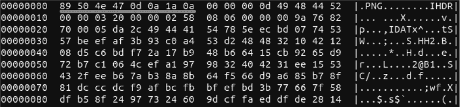
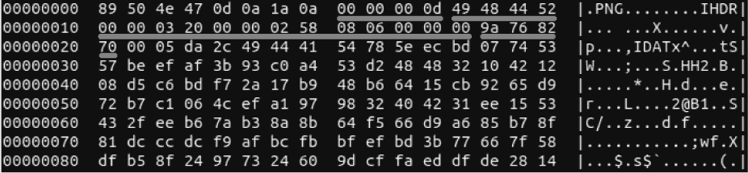
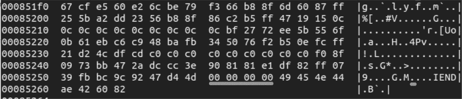
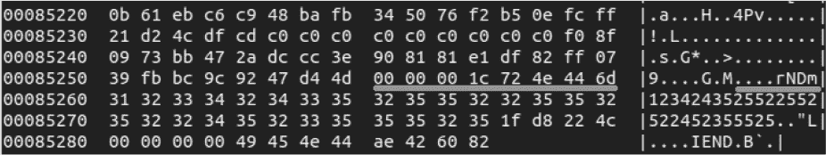
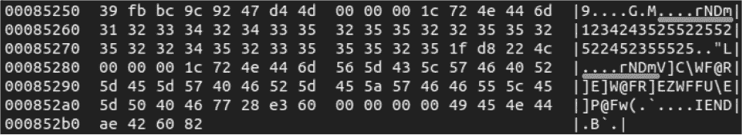
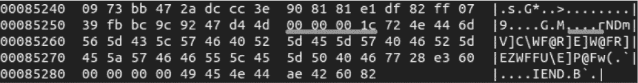
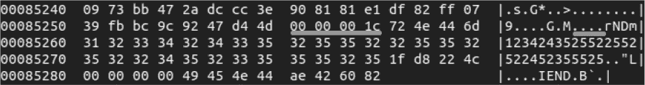

## 使用隐写术隐藏数据


*隐写术*这个词由希腊词*steganos*（意味着覆盖、隐藏或保护）和*graphien*（意味着写）组成。在安全领域，*隐写术*指的是通过将数据植入到其他数据中（如图像）来模糊（或隐藏）数据的技术和程序，以便在未来某个时间点提取。作为安全社区的一部分，你将定期进行这种实践，通过隐藏有效载荷并在其传递给目标后恢复它们。

在本章中，你将把数据植入到便携式网络图形（PNG）图像中。你将首先探索 PNG 格式并学习如何读取 PNG 数据。然后，你将把自己的数据植入现有图像中。最后，你将探索 XOR，这是一种加密和解密植入数据的方法。

### 探索 PNG 格式

让我们从回顾 PNG 规范开始，它将帮助你理解 PNG 图像格式以及如何将数据植入文件中。你可以在[*http://www.libpng.org/pub/png/spec/1.2/PNG-Structure.html*](http://www.libpng.org/pub/png/spec/1.2/PNG-Structure.html)找到其技术规范。它提供了关于二进制 PNG 图像文件字节格式的详细信息，这些文件由重复的字节块组成。

在十六进制编辑器中打开一个 PNG 文件，浏览每个相关的字节块组件，查看每个组件的作用。我们在 Linux 上使用的是原生的 hexdump 十六进制编辑器，但任何十六进制编辑器都可以工作。你可以在[*https://github.com/blackhat-go/bhg/blob/master/ch-13/imgInject/images/battlecat.png*](https://github.com/blackhat-go/bhg/blob/master/ch-13/imgInject/images/battlecat.png)找到我们将要打开的示例图像；不过，所有有效的 PNG 图像都会遵循相同的格式。

#### 头部

图像文件的前 8 个字节，`89 50 4e 47 0d 0a 1a 0a`，在图 13-1 中高亮显示，被称为*头部*。



*图 13-1：PNG 文件的头部*

第二、三、四个十六进制值转换为 ASCII 时会字面读取为`PNG`。任意的尾随字节包括 DOS 和 Unix 的回车换行符（CRLF）。这个特定的头部序列，被称为文件的*魔术字节*，在每个有效的 PNG 文件中都会是相同的。内容的变化发生在其余的字节块中，正如你很快会看到的那样。

在我们研究这个规范时，让我们开始用 Go 构建一个 PNG 格式的表示。它将帮助我们加快嵌入有效载荷的最终目标。由于头部长度为 8 个字节，它可以打包到一个`uint64`数据类型中，所以我们可以构建一个名为`Header`的结构体来保存该值（清单 13-1）。(所有位于根目录的代码清单都在提供的 GitHub 仓库[*https://github.com/blackhat-go/bhg/*](https://github.com/blackhat-go/bhg/)下。)

```
//Header holds the first UINT64 (Magic Bytes)
type Header struct {
    Header uint64
}
```

*列表 13-1：Header 结构体定义（*[/ch-13/imgInject/pnglib/commands.go](https://github.com/blackhat-go/bhg/blob/master/ch-13/imgInject/pnglib/commands.go)*)*

#### 块序列

PNG 文件的其余部分，如图 13-2 所示，由重复的字节块组成，遵循以下模式：`SIZE`（4 字节）、`TYPE`（4 字节）、`DATA`（任意字节数）和`CRC`（4 字节）。



*图 13-2：其余图像数据的块模式*

进一步查看十六进制转储，你可以看到第一个块——`SIZE`块——由字节`0x00 0x00 0x00 0x0d`组成。这个块定义了接下来的`DATA`块的长度。其十六进制转换为 ASCII 值为 13——所以这个块规定`DATA`块将由 13 个字节组成。`TYPE`块的字节`0x49 0x48 0x44 0x52`转换为 ASCII 值`IHDR`。PNG 规范定义了各种有效的类型。其中一些类型，如`IHDR`，用于定义图像元数据或指示图像数据流的结束。其他类型，特别是`IDAT`类型，包含实际的图像字节。

接下来是`DATA`块，其长度由`SIZE`块定义。最后，`CRC`块结束整个块段。它由`TYPE`和`DATA`字节的 CRC-32 校验和组成。这个特定的`CRC`块的字节为`0x9a 0x76 0x82 0x70`。该格式在整个图像文件中重复，直到遇到文件结束（EOF）状态，表示为`IEND`类型的块。

就像在列表 13-1 中对`Header`结构体所做的那样，构建一个结构体来保存单个块的值，如列表 13-2 所定义。

```
//Chunk represents a data byte chunk segment
type Chunk struct {
    Size uint32
    Type uint32
    Data []byte
    CRC  uint32
}
```

*列表 13-2：块结构定义（*[/ch-13/imgInject/pnglib/commands.go](https://github.com/blackhat-go/bhg/blob/master/ch-13/imgInject/pnglib/commands.go)*)*

### 读取图像字节数据

Go 语言通过`binary`包相对轻松地处理二进制数据的读写（你可能还记得第六章中提到过它），但在解析 PNG 数据之前，你需要打开一个文件进行读取。我们来创建一个`PreProcessImage()`函数，它将消耗一个类型为`*os.File`的文件句柄，并返回一个类型为`*bytes.Reader`的值（列表 13-3）。

```
//PreProcessImage reads to buffer from file handle
func PreProcessImage(dat *os.File) (*bytes.Reader, error) {
 ❶ stats, err := dat.Stat()
    if err != nil {
        return nil, err
    }

 ❷ var size = stats.Size()
    b := make([]byte, size)

 ❸ bufR := bufio.NewReader(dat)
    _, err = bufR.Read(b)
    bReader := bytes.NewReader(b)

    return bReader, err
}
```

*列表 13-3：* PreProcessImage() *函数定义（*[/ch-13/imgInject/utils/reader.go](https://github.com/blackhat-go/bhg/blob/master/ch-13/imgInject/utils/reader.go)*)*

该函数打开一个文件对象以获取`FileInfo`结构体❶，用于获取文件大小信息❷。接下来是几行代码，用于通过`bufio.NewReader()`实例化一个`Reader`实例，然后通过调用`bytes.NewReader()`实例化一个`*bytes.Reader`实例❸。该函数返回一个`*bytes.Reader`，使你能够开始使用`binary`包来读取字节数据。你将首先读取头部数据，然后读取块序列。

#### 读取头部数据

为了验证文件是否确实为 PNG 文件，使用前 8 个字节来定义 PNG 文件，并构建`validate()`方法（示例 13-4）。

```
func (mc *MetaChunk) validate(b *bytes.Reader) {
    var header Header

    if err := binary.Read(b, binary.BigEndian, &header.Header)❶; err != nil {
        log.Fatal(err)
    }

    bArr := make([]byte, 8)
    binary.BigEndian.PutUint64(bArr, header.Header)❷

    if string(bArr[1:4])❸ != "PNG" {
        log.Fatal("Provided file is not a valid PNG format")
 } else {
        fmt.Println("Valid PNG so let us continue!")
    }
}
```

*示例 13-4：验证文件是否为 PNG 文件 (*[/ch-13/imgInject/pnglib/commands.go](https://github.com/blackhat-go/bhg/blob/master/ch-13/imgInject/pnglib/commands.go)*)*

尽管这个方法看起来并不复杂，但它引入了一些新的内容。首先，也是最显而易见的一点，是`binary.Read()`函数❶，它将`bytes.Reader`中的前 8 个字节复制到`Header`结构体的值中。回想一下，你将`Header`结构体字段声明为`uint64`类型（示例 13-1），这相当于 8 个字节。值得注意的是，`binary`包提供了通过`binary.BigEndian`和`binary.LittleEndian`分别读取`最重要位`和`最不重要位`格式的方法❷。这些函数在执行二进制写入时也非常有用；例如，你可以选择`BigEndian`将字节按网络字节顺序传输到网络上。

二进制字节序函数还包含了便于将数据类型转化为字面数据类型（如`uint64`）的方法。在这里，你创建了一个长度为 8 的字节数组，并执行了必要的二进制读取，将数据复制到`unit64`数据类型中。接着，你可以将字节转换为其字符串表示形式，并使用切片和简单的字符串比较来验证字节 1 到字节 4 是否生成了 PNG，表明你有一个有效的图像文件格式❸。

为了改进检查文件是否为 PNG 文件的过程，我们鼓励你查看 Go 语言的`bytes`包，因为它包含一些方便的函数，可以作为捷径，将文件头与我们之前提到的 PNG 魔术字节序列进行比较。我们会让你自己探索这一部分。

#### 读取块序列

一旦验证了文件是 PNG 图像，您就可以编写读取数据块序列的代码。PNG 文件中的头信息只会出现一次，而数据块序列会重复`SIZE`、`TYPE`、`DATA`和`CRC`数据块，直到达到文件结尾（EOF）。因此，您需要能够容纳这种重复，最方便的方式是使用 Go 的条件循环。考虑到这一点，让我们构建一个`ProcessImage()`方法，它会迭代地处理所有数据块，直到文件结尾（示例 13-5）。

```
func (mc *MetaChunk) ProcessImage(b *bytes.Reader, c *models.CmdLineOpts)❶ {
// Snip code for brevity (Only displaying relevant lines from code block)
      count := 1 //Start at 1 because 0 is reserved for magic byte
    ❷ chunkType := ""
    ❸ endChunkType := "IEND" //The last TYPE prior to EOF
    ❹ for chunkType != endChunkType {
          fmt.Println("---- Chunk # " + strconv.Itoa(count) + " ----")
          offset := chk.getOffset(b)
          fmt.Printf("Chunk Offset: %#02x\n", offset)
          chk.readChunk(b)
 chunkType = chk.chunkTypeToString()
          count++
      }
}
```

*示例 13-5：* ProcessImage() *方法 (*[/ch-13/imgInject/pnglib/commands.go](https://github.com/blackhat-go/bhg/blob/master/ch-13/imgInject/pnglib/commands.go)*)*

首先，您将一个`bytes.Reader`内存地址指针（`*bytes.Reader`）作为参数传递给`ProcessImage()` ❶。您刚刚创建的`validate()`方法（示例 13-4）也接受一个`bytes.Reader`指针的引用。按照惯例，对同一内存地址指针位置的多个引用会自然地允许对引用数据进行可变访问。这本质上意味着，当您将`bytes.Reader`引用作为参数传递给`ProcessImage()`时，由于您正在访问相同的`bytes.Reader`实例，读取器会在`Header`的大小影响下提前移动 8 个字节。

或者，如果您没有传递指针，`bytes.Reader`将是相同 PNG 图像数据的副本，或者是一个独立的唯一实例数据。这是因为，在读取头信息时，如果没有推进指针，它不会在其他地方适当地推进读取器。您应该避免采用这种方法。一方面，不必要地传递多个数据副本是一个不好的习惯。更重要的是，每次传递副本时，它都将从文件的开头开始，这迫使您在读取数据块序列之前，编程定义并管理其在文件中的位置。

在代码块的进一步处理中，您定义了一个`count`变量来跟踪图像文件包含多少个数据块段。`chunkType` ❷ 和 `endChunkType` ❸ 用作比较逻辑的一部分，用于评估当前的`chunkType`与`endChunkType`的`IEND`值，该值表示文件结尾（EOF）条件 ❹。

知道每个数据块段的起始位置会很有帮助——或者更确切地说，每个数据块在文件字节构造中的绝对位置，这个值称为*偏移量*。如果您知道偏移量值，那么将有效载荷插入文件就会变得容易得多。例如，您可以将一系列偏移位置提供给*解码器*——一个收集每个已知偏移位置字节的单独函数——然后将它们解码为您预期的有效载荷。要获取每个数据块的偏移量，您可以调用`mc.getOffset(b)`方法（示例 13-6）。

```
func (mc *MetaChunk) getOffset(b *bytes.Reader) {
    offset, _ := b.Seek(0, 1)❶
    mc.Offset = offset
}
```

*列表 13-6：getOffset()方法 (*[/ch-13/imgInject/pnglib/commands.go](https://github.com/blackhat-go/bhg/blob/master/ch-13/imgInject/pnglib/commands.go)*)*

`bytes.Reader`包含一个`Seek()`方法，可以轻松地确定当前的位置。`Seek()`方法移动当前的读写偏移量，并返回相对于文件开头的新偏移量。它的第一个参数是你希望移动的字节数，第二个参数定义了从哪个位置开始移动。第二个参数的可选值为`0`（文件开头）、`1`（当前位置）和`2`（文件末尾）。例如，如果你想从当前位置向左移动 8 个字节，你可以使用`b.Seek(-8,1)`。

在这里，`b.Seek(0,1)` ❶ 表示你希望将偏移量从当前位置移动 0 个字节，因此它只是返回当前的偏移量：本质上是获取偏移量而不移动它。

接下来的方法将详细介绍如何读取实际的块段字节。为了使内容更加易读，我们将创建一个`readChunk()`方法，然后为每个块子字段创建单独的方法（列表 13-7）。

```
func (mc *MetaChunk) readChunk(b *bytes.Reader) {
    mc.readChunkSize(b)
    mc.readChunkType(b)
    mc.readChunkBytes(b, mc.Chk.Size) ❶
    mc.readChunkCRC(b)
}
func (mc *MetaChunk) readChunkSize(b *bytes.Reader) {
    if err := binary.Read(b, binary.BigEndian, &mc.Chk.Size); err != nil { ❷
        log.Fatal(err)
    }
}
func (mc *MetaChunk) readChunkType(b *bytes.Reader) {
    if err := binary.Read(b, binary.BigEndian, &mc.Chk.Type); err != nil {
        log.Fatal(err)
    }
}
func (mc *MetaChunk) readChunkBytes(b *bytes.Reader, cLen uint32) {
    mc.Chk.Data = make([]byte, cLen) ❸
    if err := binary.Read(b, binary.BigEndian, &mc.Chk.Data); err != nil {
        log.Fatal(err)
    }
}
func (mc *MetaChunk) readChunkCRC(b *bytes.Reader) {
    if err := binary.Read(b, binary.BigEndian, &mc.Chk.CRC); err != nil {
        log.Fatal(err)
    }
}
```

*列表 13-7：块读取方法 (*[/ch-13/imgInject/pnglib/commands.go](https://github.com/blackhat-go/bhg/blob/master/ch-13/imgInject/pnglib/commands.go)*)*

`readChunkSize()`、`readChunkType()`和`readChunkCRC()`方法都是类似的。每个方法都将一个`uint32`值读取到`Chunk`结构体的相应字段中。然而，`readChunkBytes()`有些不同。由于图像数据的长度是可变的，我们需要将这个长度提供给`readChunkBytes()`函数，以便它知道读取多少字节 ❶。回想一下，数据长度保存在块的`SIZE`子字段中。你需要识别`SIZE`值 ❷，并将其作为参数传递给`readChunkBytes()`，以定义一个合适大小的切片 ❸。只有这样，字节数据才能被读取到结构体的`Data`字段中。读取数据的过程就到这里为止，接下来我们继续探索如何写入字节数据。

### 将图像字节数据写入以植入有效载荷

尽管你可以选择许多复杂的隐写术技术来植入有效载荷，但在这一部分中，我们将重点介绍一种写入特定字节偏移量的方法。PNG 文件格式在规范中定义了*关键*和*辅助*块段。关键块是图像解码器处理图像所必需的。辅助块是可选的，提供了各种元数据，这些元数据对编码或解码并不关键，例如时间戳和文本。

因此，辅助块类型提供了一个理想的位置，用于覆盖现有块或插入新块。在这里，我们将展示如何将新的字节切片插入到辅助块段中。

#### 定位块偏移

首先，你需要在附加数据中找到一个合适的偏移量。你可以通过附加块的首字母是小写字母来识别它们。让我们再次使用十六进制编辑器，打开原始 PNG 文件，并继续向十六进制转储的末尾前进。

每个有效的 PNG 图像都会有一个 `IEND` 块类型，指示文件的最后一个块（`EOF` 块）。移动到紧接在最后的 `SIZE` 块前的 4 个字节，会将你定位到 `IEND` 块的起始偏移量，以及 PNG 文件中包含的最后一个任意（关键或附加）块。请记住，附加块是可选的，因此在你跟随示例检查文件时，文件中可能没有相同的附加块，甚至没有任何附加块。在我们的示例中，`IEND` 块的偏移量从字节偏移 `0x85258` 开始（图 13-3）。



*图 13-3：相对于 IEND 位置识别块的偏移量*

#### 使用 ProcessImage() 方法写入字节

将有序字节写入字节流的标准方法是使用 Go 结构体。让我们回顾一下我们在 清单 13-5 中开始构建的 `ProcessImage()` 方法的另一个部分，并逐步分析其细节。清单 13-8 中的代码调用了你将在本节中逐步构建的各个函数。

```
func (mc *MetaChunk) ProcessImage(b *bytes.Reader, c *models.CmdLineOpts) ❶ {
    --snip--
  ❷ var m MetaChunk
  ❸ m.Chk.Data = []byte(c.Payload)
    m.Chk.Type = m.strToInt(c.Type)❹
    m.Chk.Size = m.createChunkSize()❺
    m.Chk.CRC = m.createChunkCRC()❻
    bm := m.marshalData()❼
    bmb := bm.Bytes()
    fmt.Printf("Payload Original: % X\n", []byte(c.Payload))
    fmt.Printf("Payload: % X\n", m.Chk.Data)
  ❽ utils.WriteData(b, c, bmb)
}
```

*清单 13-8：使用* `ProcessImage()` *方法写入字节（*[/ch-13/imgInject/pnglib /commands.go](https://github.com/blackhat-go/bhg/blob/master/ch-13/imgInject/pnglib/commands.go)*)*

该方法接受一个 `byte.Reader` 和另一个结构体 `models.CmdLineOpts` 作为参数 ❶。`CmdLineOpts` 结构体，如 清单 13-9 所示，包含通过命令行传递的标志值。我们将使用这些标志来确定使用什么有效负载，并确定将其插入图像数据的位置。由于你将写入的字节遵循与从现有块段中读取的字节相同的结构化格式，你可以创建一个新的 `MetaChunk` 结构体实例 ❷，它将接受新的块段值。

下一步是将有效负载读取到字节切片中 ❸。然而，你需要额外的功能来强制将文字标志值转换为可用的字节数组。让我们深入了解 `strToInt()` ❹、`createChunkSize()` ❺、`createChunkCRC()` ❻、`MarshalData()` ❼ 和 `WriteData()` ❽ 方法的细节。

```
package models

//CmdLineOpts represents the cli arguments
type CmdLineOpts struct {
    Input    string
    Output   string
    Meta     bool
    Suppress bool
    Offset   string
    Inject   bool
    Payload  string
    Type     string
    Encode   bool
    Decode   bool
    Key      string
}
```

*清单 13-9：* CmdLineOpts *结构体（*[/ch-13/imgInject/models/opts.go](https://github.com/blackhat-go/bhg/blob/master/ch-13/imgInject/models/opts.go)*)*

##### strToInt() 方法

我们将从 `strToInt()` 方法开始（清单 13-10）。

```
func (mc *MetaChunk) strToInt(s string)❶ uint32 {
    t := []byte(s)
 ❷ return binary.BigEndian.Uint32(t)
}
```

*清单 13-10：* strToInt() *方法（*[/ch-13/imgInject/pnglib/commands.go](https://github.com/blackhat-go/bhg/blob/master/ch-13/imgInject/pnglib/commands.go)*)*

`strToInt()`方法是一个辅助函数，它接受一个`string` ❶作为参数，并返回`uint32` ❷，这是你`Chunk`结构体`TYPE`值所需的数据类型。

##### createChunkSize() 方法

接下来，你使用`createChunkSize()`方法为`Chunk`结构体的`SIZE`值分配空间（Listing 13-11）。

```
func (mc *MetaChunk) createChunkSize() uint32 {
        return uint32(len(mc.Chk.Data)❷)❶
}
```

*Listing 13-11: The* createChunkSize() *method (*/[ch-13/imgInject/pnglib/commands.go](https://github.com/blackhat-go/bhg/blob/master/ch-13/imgInject/pnglib/commands.go)*)*

该方法将获取`chk.DATA`字节数组的长度 ❷，并将其类型转换为`uint32`值 ❶。

##### createChunkCRC() 方法

回想一下，每个块段的 CRC 校验和包含了`TYPE`和`DATA`字节。你将使用`createChunkCRC()`方法来计算这个校验和。该方法利用 Go 的`hash/crc32`包（Listing 13-12）。

```
func (mc *MetaChunk) createChunkCRC() uint32 {
    bytesMSB := new(bytes.Buffer) ❶
    if err := binary.Write(bytesMSB, binary.BigEndian, mc.Chk.Type); err != nil { ❷
    log.Fatal(err)
    }
    if err := binary.Write(bytesMSB, binary.BigEndian, mc.Chk.Data); err != nil { ❸
        log.Fatal(err)
    }
    return crc32.ChecksumIEEE(bytesMSB.Bytes()) ❹
}
```

*Listing 13-12: The* createChunkCRC() *method (*[/ch-13/imgInject/pnglib/commands.go](https://github.com/blackhat-go/bhg/blob/master/ch-13/imgInject/pnglib/commands.go)*)*

在到达`return`语句之前，你声明了一个`bytes.Buffer` ❶，并将`TYPE` ❷和`DATA` ❸字节写入其中。然后，缓冲区中的字节切片作为参数传递给`ChecksumIEEE`，并返回 CRC-32 校验值，数据类型为`uint32`。`return`语句 ❹ 在这里起到了重要作用，实际上它在必要的字节上计算了校验和。

##### marshalData() 方法

块的所有必要部分都被分配到各自的结构体字段中，现在可以将它们序列化成一个`bytes.Buffer`。该缓冲区将提供要插入新图像文件中的自定义块的原始字节。Listing 13-13 显示了`marshalData()`方法的样子。

```
func (mc *MetaChunk) marshalData() *bytes.Buffer {
    bytesMSB := new(bytes.Buffer) ❶
    if err := binary.Write(bytesMSB, binary.BigEndian, mc.Chk.Size); err != nil { ❷
        log.Fatal(err)
    }
    if err := binary.Write(bytesMSB, binary.BigEndian, mc.Chk.Type); err != nil { ❸
        log.Fatal(err)
    }
    if err := binary.Write(bytesMSB, binary.BigEndian, mc.Chk.Data); err != nil { ❹
        log.Fatal(err)
    }
    if err := binary.Write(bytesMSB, binary.BigEndian, mc.Chk.CRC); err != nil { ❺
        log.Fatal(err)
    }

    return bytesMSB
}
```

*Listing 13-13: The* marshalData() *method (*[/ch-13/imgInject/pnglib/commands.go](https://github.com/blackhat-go/bhg/blob/master/ch-13/imgInject/pnglib/commands.go)*)*

`marshalData()`方法声明了一个`bytes.Buffer` ❶，并将块信息写入其中，包括大小 ❷、类型 ❸、数据 ❹和校验和 ❺。该方法将所有块段数据返回到一个合并后的`bytes.Buffer`中。

##### WriteData() 函数

现在，你要做的就是将新的块段字节写入原始 PNG 图像文件的偏移位置。让我们看一眼`WriteData()`函数，它存在于我们创建的一个名为`utils`的包中（Listing 13-14）。

```
//WriteData writes new Chunk data to offset
func WriteData(r *bytes.Reader❶, c *models.CmdLineOpts❷, b []byte❸) {
  ❹ offset, _ := strconv.ParseInt(c.Offset, 10, 64)
  ❺ w, err := os.Create(c.Output)
     if err != nil {
         log.Fatal("Fatal: Problem writing to the output file!")
     }
     defer w.Close()
  ❻ r.Seek(0, 0)
 ❼ var buff = make([]byte, offset)
     r.Read(buff)
  ❽ w.Write(buff)
  ❾ w.Write(b)

  ❿ _, err = io.Copy(w, r)
     if err == nil {
         fmt.Printf("Success: %s created\n", c.Output)
     }
}
```

*Listing 13-14: The* WriteData() *function (*[/ch-13/imgInject/utils/writer.go](https://github.com/blackhat-go/bhg/blob/master/ch-13/imgInject/utils/writer.go)*)*

`WriteData()` 函数接受一个包含原始图像文件字节数据的 `bytes.Reader` ❶、一个包含命令行参数值的 `models.CmdLineOpts` ❷ 结构体，以及一个保存新块字节段的 `byte` 切片 ❸。代码块从一个 `string` 到 `int64` 的转换 ❹ 开始，以便从 `models.CmdLineOpts` 结构体中获取偏移值；这将帮助你将新的块段写入到指定的位置，而不会破坏其他块。接着，你创建一个文件句柄 ❺，以便将修改后的 PNG 图像写入磁盘。

你使用 `r.Seek(0,0)` 函数调用 ❻ 将指针重置到 `bytes.Reader` 的绝对开始位置。回想一下，前 8 个字节保留给 PNG 头部，因此新生成的 PNG 图像也必须包含这些头部字节。你通过实例化一个字节切片来包含这些字节，长度由 `offset` 值 ❼ 确定。然后，你从原始图像中读取这些字节，并将它们写入到新的图像文件 ❽ 中。现在，你在原始图像和新图像中都有了相同的头部。

然后，你将新的块段字节 ❾ 写入新的图像文件中。最后，你将 `bytes.Reader` 中剩余的字节 ❿（即来自原始图像的块段字节）追加到新图像文件中。回想一下，`bytes.Reader` 已经前移到偏移位置，因为之前已经将其读取到一个字节切片中，切片包含从偏移位置到文件末尾的字节。你现在得到了一个新的图像文件。你的新文件与原始图像在前后块上完全相同，但它还包含你注入的负载，作为一个新的附加块。

为了帮助可视化你目前构建的工作表示，可以参考整个工作项目的代码 *[`github.com/blackhat-go/bhg/tree/master/ch-13/imgInject/`](https://github.com/blackhat-go/bhg/tree/master/ch-13/imgInject/)*。`imgInject` 程序接受包含原始 PNG 图像文件、偏移位置、任意数据负载、自声明的任意块类型以及修改后的 PNG 图像文件输出文件名等命令行参数，如 Listing 13-15 所示。

```
$ go run main.go -i images/battlecat.png -o newPNGfile --inject -offset \
    0x85258 --payload 1234243525522552522452355525
```

*Listing 13-15: 运行 imgInject 命令行程序*

如果一切顺利，`offset 0x85258` 现在应该包含一个新的 `rNDm` 块段，如 Figure 13-4 所示。



*Figure 13-4: 作为附加块（如 rNDm）注入的负载*

恭喜你——你刚刚编写了第一个隐写术程序！

### 使用 XOR 编码和解码图像字节数据

正如存在许多类型的隐写术一样，也有许多技术用于在二进制文件中混淆数据。让我们继续构建上一节的示例程序。这次，你将加入混淆技术，以隐藏你负载的真实意图。

混淆可以帮助隐藏你的有效载荷，避免被网络监控设备和终端安全解决方案检测到。例如，如果你嵌入的是用于生成新的 Meterpreter shell 或 Cobalt Strike beacon 的原始 shellcode，你需要确保它能够避开检测。为此，你将使用异或按位操作来加密和解密数据。

*异或*（*XOR*）是一种条件比较，比较两个二进制值，如果且仅当两个值不同时，返回布尔真值，否则返回布尔假值。换句话说，若 *x* 或 *y* 中有一个为真，则该语句为真——但如果两者都为真，则为假。如表 13-1 所示，*x* 和 *y* 都是二进制输入值。

**表 13-1：** 异或真值表

| **x** | **y** | **x ^ y 输出** |
| --- | --- | --- |
| 0 | 1 | 真或 1 |
| 1 | 0 | 真或 1 |
| 0 | 0 | 假或 0 |
| 1 | 1 | 假或 0 |

你可以通过将数据中的比特与密钥的比特进行比较来使用此逻辑进行数据混淆。当两个值匹配时，你将有效载荷中的比特改为 0，当它们不同时，你将其改为 1。让我们扩展你在上一节中创建的代码，加入一个 `encodeDecode()` 函数，以及 `XorEncode()` 和 `XorDecode()` 函数。我们将把这些函数插入到 `utils` 包中（列表 13-16）。

```
func encodeDecode(input []byte❶, key string❷) []byte {
  ❸ var bArr = make([]byte, len(input))
    for i := 0; i < len(input); i++ {
     ❹ bArr[i] += input[i] ^ key[i%len(key)]
    }
    return bArr
}
```

*列表 13-16：* encodeDecode() *函数（*[/ch-13/imgInject/utils/encoders.go](https://github.com/blackhat-go/bhg/blob/master/ch-13/imgInject/utils/encoders.go)）*

`encodeDecode()` 函数接收一个包含有效载荷 ❶ 和一个密钥值 ❷ 的字节切片作为参数。在函数的内部作用域中创建一个新的字节切片 `bArr` ❸，并将其初始化为输入字节长度值（有效载荷的长度）。接下来，函数使用条件循环遍历输入字节数组的每个索引位置。

在内部条件循环中，每次迭代都将当前索引的二进制值与从当前索引值和密钥长度的模值 ❹ 派生出的二进制值进行异或操作。这允许你使用比有效载荷更短的密钥。当密钥的末尾被处理时，模运算将强制下一次迭代使用密钥的第一个字节。每次异或操作的结果被写入新的 `bArr` 字节切片，函数返回结果切片。

列表 13-17 中的函数包装了 `encodeDecode()` 函数，以便简化编码和解码过程。

```
   // XorEncode returns encoded byte array
❶ func XorEncode(decode []byte, key string) []byte {
    ❷ return encodeDecode(decode, key)
   }

   // XorDecode returns decoded byte array
❶ func XorDecode(encode []byte, key string) []byte {
    ❷ return encodeDecode(encode, key)
   }
```

*列表 13-17：* XorEncode() *和* XorDecode() *函数（*[/ch-13/imgInject/utils/encoders.go](https://github.com/blackhat-go/bhg/blob/master/ch-13/imgInject/utils/encoders.go)）*

你定义了两个函数，`XorEncode()`和`XorDecode()`，它们接受相同的字面参数❶并返回相同的值❷。这是因为你通过使用与编码数据时相同的过程来解码 XOR 编码的数据。然而，你将这些函数分开定义，以便在程序代码中提供清晰性。

要在现有程序中使用这些 XOR 函数，你需要修改在清单 13-8 中创建的`ProcessImage()`逻辑。这些更新将利用`XorEncode()`函数来加密有效载荷。修改内容如清单 13-18 所示，假设你正在使用命令行参数将值传递给条件编码和解码逻辑。

```
// Encode Block
if (c.Offset != "") && c.Encode {
    var m MetaChunk
 ❶ m.Chk.Data = utils.XorEncode([]byte(c.Payload), c.Key)
    m.Chk.Type = chk.strToInt(c.Type)
    m.Chk.Size = chk.createChunkSize()
    m.Chk.CRC = chk.createChunkCRC()
    bm := chk.marshalData()
    bmb := bm.Bytes()
    fmt.Printf("Payload Original: % X\n", []byte(c.Payload))
    fmt.Printf("Payload Encode: % X\n", chk.Data)
    utils.WriteData(b, c, bmb)
}
```

*清单 13-18：更新`ProcessImage()`以包括 XOR 编码 (*[/ch-13/imgInject/pnglib/commands.go](https://github.com/blackhat-go/bhg/blob/master/ch-13/imgInject/pnglib/commands.go)*)*

对`XorEncode()`❶的函数调用传入一个包含有效载荷和密钥的`byte`切片，对这两个值进行 XOR 运算，并返回一个`byte`切片，该切片被赋值给`chk.Data`。其余功能保持不变，并将新的块段序列化以最终写入图像文件。

你程序的命令行运行应该产生类似于清单 13-19 中的结果。

```
   $ go run main.go -i images/battlecat.png --inject --offset 0x85258 --encode \
   --key gophers --payload 1234243525522552522452355525 --output encodePNGfile
   Valid PNG so let us continue!
❶ Payload Original: 31 32 33 34 32 34 33 35 32 35 35 32 32 35 35 32 35 32 32
   34 35 32 33 35 35 35 32 35
❷ Payload Encode: 56 5D 43 5C 57 46 40 52 5D 45 5D 57 40 46 52 5D 45 5A 57 46
   46 55 5C 45 5D 50 40 46
   Success: encodePNGfile created
```

*清单 13-19：运行`imgInject`程序对数据块进行 XOR 编码*

`payload`被写入字节表示并显示到标准输出为`Payload Original`❶。然后，`payload`与`gophers`的`key`值进行 XOR 运算，并显示为`Payload Encode`❷。

为了解密你的有效载荷字节，你需要使用解码函数，如清单 13-20 所示。

```
//Decode Block
if (c.Offset != "") && c.Decode {
    var m MetaChunk
  ❶ offset, _ := strconv.ParseInt(c.Offset, 10, 64)
  ❷ b.Seek(offset, 0)
  ❸ m.readChunk(b)
     origData := m.Chk.Data
  ❹ m.Chk.Data = utils.XorDecode(m.Chk.Data, c.Key)
     m.Chk.CRC = m.createChunkCRC()
  ❺ bm := m.marshalData()
     bmb := bm.Bytes()
     fmt.Printf("Payload Original: % X\n", origData)
     fmt.Printf("Payload Decode: % X\n", m.Chk.Data)
  ❻ utils.WriteData(b, c, bmb)
}
```

*清单 13-20：解码图像文件和有效载荷 (*[/ch-13/imgInject/pnglib/commands.go](https://github.com/blackhat-go/bhg/blob/master/ch-13/imgInject/pnglib/commands.go)*)*

该代码块要求包含有效载荷的块段的偏移位置❶。你使用偏移量来`Seek()`❷文件位置，并随后的`readChunk()`❸调用是必要的，用于推导`SIZE`、`TYPE`、`DATA`和`CRC`值。调用`XorDecode()`❹时，将`chk.Data`有效载荷值和用于编码数据的相同密钥传入，然后将解码后的有效载荷值重新分配回`chk.Data`。（请记住，这是对称加密，所以你使用相同的密钥进行加密和解密。）代码块继续通过调用`marshalData()`❺，将你的`Chunk`结构转换为`byte`切片。最后，你通过使用`WriteData()`函数❻将包含解码有效载荷的新块段写入文件。

你程序的命令行运行，这次带有解码参数，应该产生清单 13-21 中的结果。

```
   $  go run main.go -i encodePNGfile -o decodePNGfile --offset 0x85258 -decode \
   --key gophersValid PNG so let us continue!
❶ Payload Original: 56 5D 43 5C 57 46 40 52 5D 45 5D 57 40 46 52 5D 45 5A 57
   46 46 55 5C 45 5D 50 40 46
❷ Payload Decode: 31 32 33 34 32 34 33 35 32 35 35 32 32 35 35 32 35 32 32 34
   35 32 33 35 35 35 32 35
   Success: decodePNGfile created
```

*清单 13-21：运行`imgInject`程序对数据块进行 XOR 解码*

`Payload Original`值❶是从原始 PNG 文件中读取的编码负载数据，而`Payload Decode`值❷是解密后的负载数据。如果你比较之前的示例命令行运行和此处的输出，你会注意到解码后的负载与你最初提供的原始明文值匹配。

然而，代码中存在一个问题。回想一下，程序代码将新的解码块插入到你指定的偏移位置。如果你有一个已经包含编码块段的文件，然后尝试写入一个带有解码块段的新文件，你最终会在新输出文件中看到两个块段。你可以在图 13-5 中看到这一点。



*图 13-5：输出文件包含解码块段和编码块段。*

要理解为什么会发生这种情况，请回顾一下，编码后的 PNG 文件在偏移位置`0x85258`处包含编码块段，如图 13-6 所示。



*图 13-6：包含编码块段的输出文件*

问题出现在解码数据被写入偏移位置`0x85258`时。当解码数据被写入与编码数据相同的位置时，我们的实现并没有删除编码数据；它只是将文件的其余字节右移，包括编码块段，如之前在图 13-5 中所示。这可能会使负载提取变得复杂，或产生意外后果，例如将明文负载暴露给网络设备或安全软件。

幸运的是，这个问题很容易解决。我们来看看之前的`WriteData()`函数。这次，你可以修改它来解决这个问题（代码清单 13-22）。

```
//WriteData writes new data to offset
func WriteData(r *bytes.Reader, c *models.CmdLineOpts, b []byte) {
    offset, err := strconv.ParseInt(c.Offset, 10, 64)
    if err != nil {
        log.Fatal(err)
    }

    w, err := os.OpenFile(c.Output, os.O_RDWR|os.O_CREATE, 0777)
    if err != nil {
        log.Fatal("Fatal: Problem writing to the output file!")
   }
   r.Seek(0, 0)

   var buff = make([]byte, offset)
   r.Read(buff)
   w.Write(buff)
   w.Write(b)
❶ if c.Decode {
    ❷ r.Seek(int64(len(b)), 1)
   }
❸ _, err = io.Copy(w, r)
   if err == nil {
       fmt.Printf("Success: %s created\n", c.Output)
  }
}
```

*代码清单 13-22：更新* WriteData() *以防止重复的辅助块类型*（[/ch-13/imgInject/utils/writer.go](https://github.com/blackhat-go/bhg/blob/master/ch-13/imgInject/utils/writer.go)）

你通过`c.Decode`的条件逻辑❶引入了修复。XOR 操作按字节进行转换。因此，编码和解码的块段在长度上是相同的。此外，当解码块段被写入时，`bytes.Reader`将包含原始编码图像文件的剩余部分。因此，你可以对`bytes.Reader`执行一个右字节移位，移位的长度为解码块段的长度❷，将`bytes.Reader`推进到编码块段之后，并将剩余的字节写入新的图像文件❸。

哇！如图 13-7 所示，十六进制编辑器确认你已解决问题。不再有重复的辅助块类型。



*图 13-7：没有重复辅助数据的输出文件*

编码数据不再存在。此外，运行 `ls -la` 命令查看文件时，应该会显示相同的文件长度，尽管文件字节已经发生变化。

### 总结

在本章中，您学习了如何将 PNG 图像文件格式描述为一系列重复的字节块段，每个块段都有其相应的目的和适用性。接着，您学习了读取和浏览二进制文件的方法。然后，您创建了字节数据并将其写入图像文件。最后，您使用 XOR 编码来混淆有效负载。

本章重点讲解了图像文件，并仅仅触及了使用隐写术技术可以实现的部分内容。但您应该能够将所学的知识应用到其他二进制文件类型的探索中。

### 附加练习

就像本书中的许多其他章节一样，本章如果您在实际编写代码和实验的过程中学习，将会提供最大的价值。因此，我们希望通过以下几个挑战来总结本章内容，扩展已经涵盖的思想：

1.  在阅读 XOR 部分时，您可能已经注意到，`XorDecode()` 函数生成了解码后的数据块段，但从未更新 CRC 校验和。看看您能否修正这个问题。

1.  `WriteData()` 函数支持注入任意块段。假如您想要覆盖现有的附加块段，您需要做哪些代码修改？如果您需要帮助，我们关于字节移位和 `Seek()` 函数的解释可能会对解决这个问题有所帮助。

1.  这是一个更具挑战性的问题：尝试通过将有效负载——PNG `DATA` 字节块——分散到各个附加块段中来注入有效负载。您可以一次注入一个字节，或者使用多个字节分组，因此可以发挥创造力。作为额外奖励，创建一个解码器来读取确切的有效负载字节偏移位置，这样可以更轻松地提取有效负载。

1.  本章解释了如何使用 XOR 作为一种保密技术——一种混淆植入有效负载的方法。尝试实现另一种技术，例如 AES 加密。Go 核心包提供了多种可能性（如果您需要复习，请参考第十一章）。观察这个解决方案如何影响新图像。它是否导致整体大小增加，如果增加了，增加了多少？

1.  使用本章中的代码思路，扩展对其他图像文件格式的支持。其他图像规范可能不像 PNG 那样结构化。想要证明吗？阅读 PDF 规范，它可能会让人感到相当有压力。您如何解决读取和写入此新图像格式数据的挑战？
