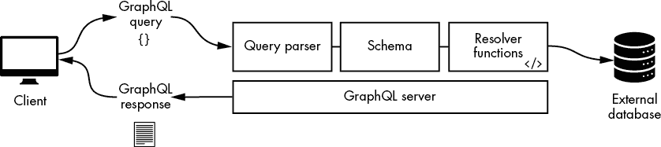
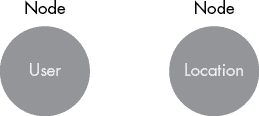
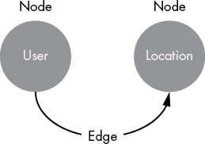
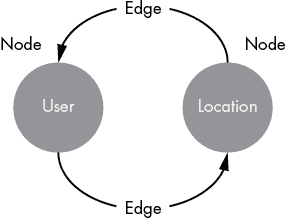
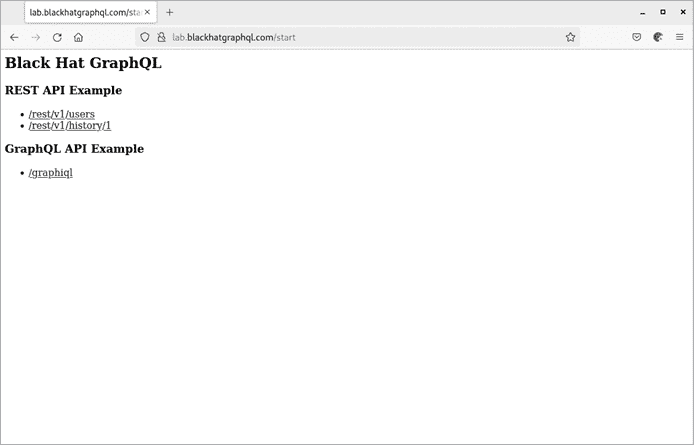
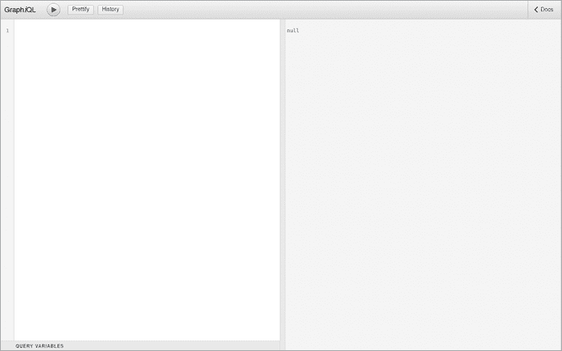
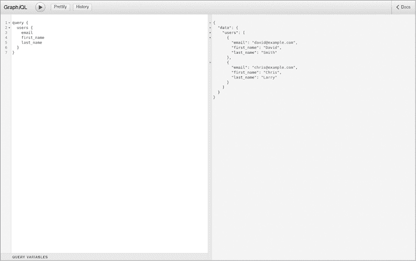
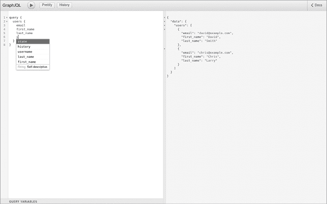
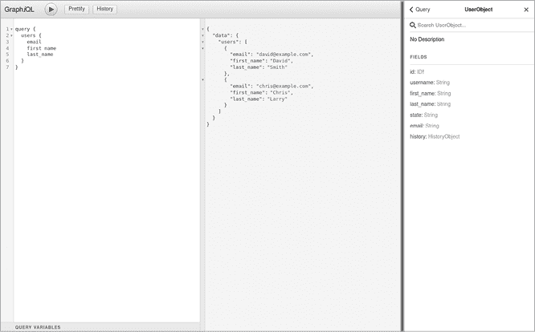
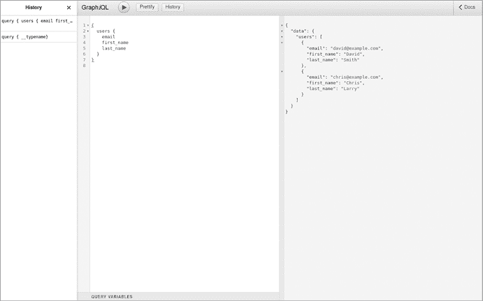

# 1

GraphQL 入门


在本章中，我们将概述 GraphQL，包括它的存在意义以及哪些特性使得它对许多当今的科技巨头具有吸引力。你还将了解它与 RESTful API 的区别，并发送你的第一个 GraphQL 查询。

## 基础

*GraphQL* 是一种开源数据查询和操作语言，用于应用程序编程接口（API）。API 允许两个应用程序通过遵循一套规则进行信息交换，请求和响应数据，定义了应用程序如何连接和通信。通常，像 Google Chrome 或 Mozilla Firefox 这样的网页浏览器充当 API 客户端，或称为 *消费者*。这个消费者通过应用程序的 API 与应用服务器进行交互，读取或修改服务器上的特定信息。API 消费者不一定总是浏览器；例如，网络上的其他服务器等机器，也可以是 GraphQL API 的消费者。

与其他 API 格式不同，GraphQL 允许 API 使用者从应用服务器请求特定的数据，而无需接收不必要的信息。将这种方法与传统的 REST API 架构进行对比，后者提供固定的数据结构，并依赖客户端过滤掉它们不需要的任何不必要信息。我们将在第 9 页的“GraphQL APIs 与 REST APIs”中比较 REST 和 GraphQL 的 API 响应结构，以说明两者之间的区别。

从安全角度来看，GraphQL 的设计提供了优势。因为 GraphQL 不会返回客户端未明确请求的数据，它的使用减少了信息泄露问题的发生。返回比客户端所需更多的数据可能会导致敏感数据的无意暴露，例如个人身份信息（PII），这可能会引发许多其他问题，尤其是对于那些在严格监管规则下运营的公司。然而，正如你很快会看到的，GraphQL 也存在安全漏洞，我们作为黑客，可以加以利用。

### 起源

Facebook 于 2012 年开发了 GraphQL，并在其生产环境中使用了几年，直到 2015 年才将其作为开源软件发布。那一年，Facebook 还开发并发布了 GraphQL 规范以及一个名为 *GraphQL.js* 的参考实现（[`github.com/graphql/graphql-js`](https://github.com/graphql/graphql-js)），该实现是使用 JavaScript 构建的。

GraphQL 现在由 GraphQL 基金会（[`graphql.org/foundation/`](https://graphql.org/foundation/)）维护，该基金会由全球技术公司成立。基金会资助 GraphQL 维护者的指导和项目资助，管理 GraphQL 商标政策，为项目提供法律支持，并支持与社区相关的基础设施。

### 使用场景

几乎所有应用程序和设备都可以使用 GraphQL。如果公司的客户经常同时请求大量信息，而这通常需要多次调用 REST API，企业可以考虑使用 GraphQL。使用 GraphQL 可以减少带宽使用并提高客户端性能。

举个例子，假设有一个网站仪表盘，将来自多个第三方天气网站的天气信息汇总，并由处于慢速数据网络中的移动客户端使用。如果仪表盘必须向多个天气网络发出大量请求并筛选数据，这将不是一个优化的过程。GraphQL 允许通过单一请求获取复杂的数据结构，从而显著减少客户端和服务器之间的往返次数。你将在本章后面了解更多关于这种带宽优化设计的内容。

如今，许多大型公司，如 Facebook、Atlassian、GitHub 和 GitLab，都在使用 GraphQL，为数亿客户提供服务，覆盖多个平台，如手机、桌面计算机，甚至智能电视。

### 规范

2015 年，Facebook 公开发布了 GraphQL 规范文档，定义了所有 GraphQL 实现必须遵守的规则、设计原则和标准实践。这个规范类似于请求评论（RFC）文档，是多语言实现 GraphQL 的参考。你可以将其视为一份蓝图。

因此，作为黑客，我们可以利用它更好地理解 GraphQL 的实现方式，并验证我们正在破解的目标应用程序是否符合这些预定义的规则。由于实现往往由于各种原因偏离标准，因此我们有更多的机会发现其中的漏洞，其中一些漏洞可能涉及安全问题。

## 通信是如何工作的？

一个典型的 GraphQL 实现包含一些你应该熟悉的组件，如果你希望搜索其中的安全漏洞。图 1-1 描述了这些组件。



图 1-1：核心 GraphQL 组件

当客户端想要与 GraphQL 服务器进行通信（例如，读取用户名和电子邮件列表）时，客户端将使用超文本传输协议（HTTP）POST 方法向服务器发送 GraphQL 查询。你可能已经注意到，这与标准的 HTTP 方法约定不符，因为数据读取通常是通过 HTTP GET 方法实现的；你将在本章稍后了解更多有关这方面的内容。

服务器反过来会使用查询解析器来处理查询。*查询解析器*读取并验证查询的格式是否正确，且服务器是否支持该查询。这个验证过程涉及将查询与应用程序的 GraphQL 架构进行对比检查。如果查询被认为是有效的，它将由解析器函数处理，解析器函数负责生成响应客户端查询的结果。这里有很多运作的部分！让我们拆解这些核心组件，来更好地解释它们如何协同工作。

### 架构

GraphQL *架构*表示客户端可以查询的数据类型。架构使用*架构定义语言（SDL）*来定义。列表 1-1 展示了定义两个对象类型的语法。

```
type User {
   username: String
   email: String
}

type Location {
   latitude: Int
   longitude: Int
}
```

列表 1-1：架构定义语言

*对象*类型是 GraphQL 架构的最基本组成部分；它们表示你可以从运行 GraphQL 服务中获取的数据。在列表 1-1 中，我们定义了一个名为 `User` 的对象类型和另一个名为 `Location` 的类型。`User` 类型有两个字段，分别是 `username` 和 `email`，它们都是 `String` 标量类型。`Location` 类型也有两个字段，分别是 `latitude` 和 `longitude`，它们是 `Int`（整数）标量类型。

到目前为止，我们示例中的对象和字段尚未相互关联。然而，GraphQL 允许我们通过多种方式在对象之间建立链接。为了可视化这个过程，我们可以将架构表示为一个由节点和边组成的图。在我们的示例中，`User` 和 `Location` 对象类型是*节点*，如图 1-2 所示。



图 1-2：图形节点

*边*是创建多个节点之间链接的一种方式。例如，一个对象可能有一个字段引用另一个对象。假设你有一个用户列表，以及一个记录用户最后登录位置的物理位置列表，你希望在客户端查询该用户时返回其位置。列表 1-2 展示了如何使用边来实现这一点。

```
type User {
    username: String
    email: String
  ❶ location: Location
}

 ❷ type Location {
    latitude: Int
    longitude: Int
}
```

列表 1-2：节点的链接

我们向 `User` 对象类型 ❶ 添加了一个额外的 `location` 字段，并将其与 `Location` 对象类型 ❷ 关联起来。实际上，这意味着你可以请求一个 `User` 对象并获取其相关的位置数据。然而，你不能通过 `Location` 对象类型查询用户名，因为我们在架构中没有定义该边。图 1-3 说明了这两个节点现在具有单向链接关系。



图 1-3：节点之间的单向链接关系

边缘不仅限于单向链接关系。事实上，你可以在相同的对象之间创建双向链接关系，如图 1-4 所示。通过这种方式连接两个节点有其合理的使用场景。在`User`和`Location`的例子中，假设我们的 API 客户端需要能够获取用户名并查看其位置，作为返回数据的一部分。同时，假设客户端还应该能够获取特定位置并查看哪些用户在每个位置登录。双向链接关系正好支持这一功能。



图 1-4：节点之间的双向链接关系

从安全角度来看，双向链接关系往往会导致不希望出现的拒绝服务（DoS）状况，这可能会完全使系统崩溃。当存在双向链接关系时，API 开发者应该引入安全控制措施以减轻这些漏洞，详细内容将在第五章中说明。

### 查询

一旦 API 的模式定义完成，客户端就可以通过使用专门编写的声明式 GraphQL 查询语言来从中获取信息。在 GraphQL 中，所有查询都以操作的*根类型*定义开始，该根类型指定以下操作之一：

+   *查询*用于只读操作。这些操作不涉及数据操作。

+   *突变*用于数据操作，比如数据写入。这些操作涉及数据修改、数据添加、数据删除等。突变可以同时用于写入和读取数据。

+   *订阅*用于客户端与 GraphQL 服务器之间的实时通信。当发生不同事件时，它们允许 GraphQL 服务器将数据推送到客户端。订阅通常与 WebSocket 等传输协议结合使用。

这三种操作是我们编写每个 GraphQL 查询的起点。例如，查询操作使用`query`关键字：

```
query {

}
```

一个突变操作类型使用`mutation`关键字：

```
mutation {

}
```

最后，订阅操作类型使用`subscription`关键字：

```
subscription {

}
```

在客户端执行这些操作之前，开发者必须在模式中定义该操作，并指定客户端可以使用的字段。例如，示例 1-3 定义了`Query`类型，并建立了一个路径，允许客户端获取我们之前定义的对象类型`User`。

```
type User {
   username: String
   email: String
   location: Location
}

type Location {
   latitude: Int
   longitude: Int
}

type Query {
  users: [**User**]
}

schema {
  query: Query
} 
```

示例 1-3：完整的模式，包含查询`User`类型的入口点

通过查询`Query`类型中的`users`字段，客户端可以访问我们定义的`User`对象类型。`User`对象类型周围的方括号`[]`表示此查询将返回一个`User`对象的数组。我们将在第三章讨论此语法。

示例 1-4 是客户端可能向实现示例 1-3 模式的 GraphQL 服务器发送的查询。

```
query {
   users {
        username
        email
   }
}
```

示例 1-4：一个 GraphQL 查询

正如你所看到的，GraphQL 查询非常容易阅读：这个查询所做的就是获取应用程序中所有用户的用户名和电子邮件。我们通过使用 `query` 根操作来定义查询。然后，我们请求 `users` 作为查询的顶级字段，指定我们想要的 `username` 和 `email` 字段。因为这个查询只读取信息而不更改任何数据，所以我们执行的是查询操作，而不是变更操作。

请注意，空格用于分隔组件，如名称和值。使用的空格数量无关紧要；无论是单个空格还是多个空格，查询都会保持不变并返回一致的结果。

### 查询解析器与解析器函数

那么，当一个 GraphQL 服务器接收到查询时会发生什么呢？它会使用一个*查询解析器*来读取并提取执行传入查询所需的信息。查询解析器负责将查询字符串转化为*抽象语法树（AST）*并根据模式进行验证，以确保只接受有效的查询。AST 是一个层次化的对象，表示查询。它包含字段、参数和其他信息，可以被不同语言的解析器轻松遍历。

GraphQL 是*强类型*的，这意味着当客户端使用错误的数据类型时，服务器会返回错误。例如，如果某些数据被定义为 `Int`，而使用 `String` 则会导致错误。这允许开发团队依赖 API 来执行类型验证。我们将在第三章中更详细地讨论这些类型。

为了生成包含请求数据的响应，服务器使用*解析器函数*，也称为*解析器*。解析器负责根据客户端查询中指定的每个字段填充响应数据。为此，解析器可能会实现代码逻辑来执行诸如查询关系数据库、缓存数据库或网络上其他服务器等任务。每个字段都有一个对应的解析器函数，负责返回该字段的响应。

例如，要实现我们在清单 1-4 中展示的查询，解析器函数可能会连接到外部数据库，如 MySQL，并查询其用户表以获取可用的用户名和电子邮件条目列表。由于解析器函数是负责查询解析的 GraphQL 组件，这也是潜在漏洞的存在之地。如果这些函数编写得不好，可能会包含 bug，从而导致安全漏洞。

解析器不仅限于从数据库读取数据。它们可以从本地文件系统读取数据或通过 REST API 向其他系统发起 HTTP 请求。实际上，GraphQL API 通常在后台进行 REST 调用，尤其是当公司从 REST 逐步过渡到 GraphQL 时。有时，GraphQL 被用作多个后端 REST 服务的整合 API 层，客户端对此保持透明。

总结来说，你可以把 GraphQL 看作是一个查询层，位于客户端（如在用户手机或笔记本上运行的浏览器）和应用程序逻辑之间。希望与 GraphQL API 交互的客户端可以使用各种可用的开源 GraphQL 客户端库，例如 Apollo Client（[`www.apollographql.com/docs/react`](https://www.apollographql.com/docs/react)），由 Apollo 为 TypeScript 维护，或 Relay（[`relay.dev`](https://relay.dev)），由 Facebook 为 JavaScript 维护。使用专门的 GraphQL 客户端不是必需的；你也可以使用命令行 HTTP 客户端，如 cURL，来查询 GraphQL API。在第三章中，我们将介绍 GraphQL 在更低层次上的工作原理。

## GraphQL 解决了什么问题？

GraphQL 通过节省客户端无需多次请求来获取完整数据集的时间，提升了客户端与服务器的交互速度。因为 GraphQL 允许客户端定义精确的查询结构，它避免了代价高昂的性能问题，例如 *过度获取*（返回客户端不使用的数据）或 *过少获取*（返回的数据太少，迫使客户端发起第二次请求）。你将在下一节中了解更多这些差异以及它们对性能的重要性。

GraphQL 还有其他有用的功能，如模式拼接和模式联合。*模式拼接* 是一种从多个底层 GraphQL 服务创建单一 GraphQL 模式的方法，使得 GraphQL 可以作为统一的网关使用。本质上，它将多个模式打包（拼接）成一个大模式，为客户端创建一个单一的集成点。由于多个微服务可以定义自己的 GraphQL 模式并拥有各自的 GraphQL 端点，因此允许单一的 GraphQL API 网关将多个模式合并成一个，可以让客户端更容易与应用程序集成。

*模式联合* 类似于模式拼接，只是它不需要你手动拼接模式。相反，模式联合让你可以告诉 GraphQL API 网关去哪里查找额外的模式。然后，网关会自动完成拼接。联合是一种低维护的方式，用于将多个 API 合并成一个网关。

复杂的 API 应用程序，例如需要模式联合或模式拼接的应用程序，可能会引入安全漏洞，可能允许黑客访问他们本不应有权访问的数据。通常来说，应用程序越复杂，其内部复杂性就越可能导致漏洞。

## GraphQL API 与 REST API

在前面的章节中，我们讨论了传统 API 存在的挑战，GraphQL 尝试解决这些挑战的方式。例如，REST API 经常会提供比客户端需要的更多数据（过度获取）或太少数据（不足获取），迫使客户端进行额外的 API 请求。在本节中，我们将通过一个示例来演示使用 REST API 的应用与使用 GraphQL 的应用之间的差异。

考虑 表 1-1，一个包含应用程序用户基本信息的数据库表。一个简单的 Web 应用可能会将这些信息显示为管理员面板的一部分，使系统管理员可以列出所有可用帐户并获取其状态。我们将其称为用户管理页面。

表 1-1：用户数据库表

| **用户 ID** | **用户名** | **电子邮件** | **名** | **姓** | **状态** |
| --- | --- | --- | --- | --- | --- |
| 1 | dsmith | *david@example.com* | David | Smith | 禁用 |
| 2 | clarry | *chris@example.com* | Chris | Larry | 启用 |

在接下来的章节中，我们将描述客户端必须执行的 API 请求，以便在应用程序使用 REST API 时检索用户数据，以及在使用 GraphQL 的应用程序中可能会执行相同操作。

### REST 示例

在使用 REST API 的应用程序中，我们定义特定的 *端点* 或 *路由*，客户端可以在这些端点上执行诸如读取或写入数据的操作，使用特定的 HTTP 方法（如 GET 或 POST）。表 1-2 定义了两个 REST API 端点，用于两个不同的目的：一个用于获取用户列表，另一个用于获取用户登录历史信息。

表 1-2：REST API 定义

| **HTTP 方法** | **API 端点** | **端点描述** |
| --- | --- | --- |
| GET | */rest/v1/users* | 返回所有可用用户及其信息的列表 |
| GET | */rest/v1/history/<user_id>* | 返回给定用户的登录时间戳列表 |

当系统管理员希望查看用户管理页面时，他们的 Web 客户端（如 Web 浏览器）将需要通过 Web 应用程序的 API 获取所有可用用户的信息。为了通过 表 1-2 中的 API 端点检索此数据，Web 浏览器将需要向 */rest/v1/users* 发送 GET 请求。列表 1-5 展示了这个请求及其响应。

```
# **curl http://lab.blackhatgraphql.com/rest/v1/users**

[
  {
    "email": "david@example.com",
    "first_name": "David",
    "id": 1,
    "last_name": "Smith",
    "state": "disabled",
    "username": "dsmith"
  },
  {
    "email": "chris@example.com",
    "first_name": "Chris",
    "id": 2,
    "last_name": "Larry",
    "state": "enabled",
    "username": "clarry"
  }
]
```

列表 1-5：对 */rest/v1/users* 发出的 GET 请求，列出所有系统用户

正如您所见，此请求以 JavaScript 对象表示法（JSON）格式返回所有用户的列表，包括他们的电子邮件、姓名、ID 和帐户状态。

但是如果系统管理员只想检索用户的某些信息，比如他们的电子邮件地址，而不返回任何其他信息，使用表 1-2 中的 API 定义，这是不可能的。相反，需要处理清单 1-5 中的整个响应，并从中提取出`email`字段。这是 REST API 中过度获取问题的一个示例：客户端接收到比其需求更多的数据，然后必须进行过滤。

现在，想象一下你是系统管理员，被要求识别网络上的任何入侵尝试。您计划编写一个每晚运行并检查可疑行为的脚本。例如，它应该标记在正常工作时间之后登录的用户，即从上午 9 点到下午 5 点。为了实现这个目标，脚本将需要使用 GET 方法向端点*/rest/v1/history/<user_id>*发出 API 请求。然而，如果仔细查看端点结构，您会注意到它要求客户端提供特定的用户 ID。脚本如何知道应用程序用户的 ID 呢？简短的答案是：除非首先获取所有可用用户 ID，否则不会。

实际上，这意味着为了脚本能够成功运行、读取用户的最后登录时间戳并识别可能的入侵，首先需要列出系统上的所有用户账户，使用 API 端点*/rest/v1/users*。这应该返回每个用户的用户名、电子邮件、名字、姓氏、状态和用户 ID。

接下来，它需要向*/rest/v1/history/1*发出第二个 API 请求，其中*1*是从第一个请求中获取的用户 ID，如清单 1-6 所示。

```
# **curl http://lab.blackhatgraphql.com/rest/v1/history/1**

`--snip--`
["02:03:37", "03:05:55"]
`--snip--`
```

清单 1-6：来自*/rest/v1/history/1*的响应

要获取所有历史用户登录的完整列表，客户端需要进行额外的请求，直到获取所有用户 ID 为止。如果有 1000 个用户，这将需要 1000 个请求。听起来效率低下，对吧？这是 REST API 倾向于出现的不足获取问题的一个例子。RESTful API 可以被设计为返回特定信息，但是要跨多个 REST 端点提供这种查询灵活性所需的复杂性将使其在维护上具有挑战性。

虽然一开始看起来，为了获取单个用户的登录信息而发起两个请求似乎不是什么大问题，但想象一下应用程序同时为数百万客户端提供服务。在这个规模下，每个请求都很重要；任何额外的跨网络调用都会增加服务器的延迟并影响客户端的体验。这将降低应用程序的整体速度和效率。

如果你想查看这些请求的实际效果，可以通过将你的浏览器指向位于[`lab.blackhatgraphql.com/start`](http://lab.blackhatgraphql.com/start)的实时实验室，来尝试这个示例的 API。在那里，点击这两个链接，在浏览器中导航到 REST 接口，如图 1-5 所示。



图 1-5：一个实时的 REST API 示例

我们已经展示了 REST API 的过少获取和过度获取问题。GraphQL 是如何解决这些问题的呢？让我们在 GraphQL 的世界中探索相同的场景。

### GraphQL 示例

想象一下，我们的用户管理 Web 应用已经废弃了 REST API，转而采用 GraphQL，并且我们已经建立了一个定义了用户和历史节点之间数据图关系的模式。现在，当系统管理员查看用户管理页面时，他们的浏览器将使用应用程序的 GraphQL API 端点来返回所需的所有数据。

浏览器可能会使用清单 1-7 中的查询来检索诸如用户 ID、电子邮件、名字、姓氏、历史信息（例如最后登录的时间戳）以及账户状态等信息：

```
query {
   users {
       id
       email
       first_name
       last_name
       state
       history {
         last_login_timestamp
       }
   }
}
```

清单 1-7：获取用户信息的 GraphQL 查询

该查询的响应可以在清单 1-8 中看到。

```
"data": {
  "users": [
    {
      "id":1,
      "email": "david@example.com",
      "first_name": "David",
      "last_name": "Smith",
      "state": "disabled",
      "history": {
          "last_login_timestamp":["02:03:37", "03:05:55"]
      }
    },
    {
      "id": 2,
      "email": "chris@example.com"
`--snip--`
    }
  ]
}
```

清单 1-8：包含所有可用用户及其信息的 GraphQL 查询响应

请注意，响应中包含了一个`data` JSON 字段，其中包括`users`字段，而`users`字段是一个包含系统中所有用户的数组。

此时，REST 和 GraphQL 的 API 之间没有任何明显的区别。那么，GraphQL 是如何解决过度获取和过少获取的问题的呢？如果我们想特别请求某个字段，例如用户的电子邮件地址，我们可以省略任何无关的字段，只包含`email`字段，如清单 1-9 所示。

```
query {
  users {
    email
  }
}
```

清单 1-9：只返回电子邮件地址的 GraphQL 查询

通过明确包含我们想要返回的字段，我们将响应限制为相关数据，如清单 1-10 所示。

```
"data": {
  "users": [
    {
      "email": "david@example.com"
    },
    {
 "email": "chris@example.com"
    }
  ]
}
```

清单 1-10：仅返回电子邮件地址的 GraphQL 服务器响应

如你所见，响应中只包含了电子邮件地址，正如查询所要求的那样。如果后端数据库中存储了 100 个电子邮件地址，这样的查询将返回全部的电子邮件地址。

现在，记得我们之前提到过，要返回用户最后登录的时间戳来进行入侵检测任务吗？通过 GraphQL，我们可以使用类似清单 1-11 中显示的查询来实现这一目标。

```
query {
   users {
     email
     history {
         last_login_timestamp
     }
   }
}
```

清单 1-11：返回用户最后登录时间戳及其电子邮件的 GraphQL 查询

正如预期的那样，我们只接收到相关字段，如清单 1-12 所示。

```
{
  "data":{
     "users":[
         {
          "email": "david@example.com",
          "history": {
             "last_login_timestamp":["02:03:37"]
            }
         },
         {
          "email": "chris@example.com",
          "history": {
             "last_login_timestamp":["02:03:37", "03:05:55"]
            }
         }
    ]
  }
}
```

清单 1-12：仅包含`email`和`last_login_timestamp`字段的 GraphQL 响应

使用 GraphQL 强大的声明性语言，我们可以编写非常选择性的查询，仅获取必要的信息。在后续章节中，您将学习如何利用这种查询语法来攻击 GraphQL 服务器。

### 其他区别

本节列出了 REST API 和 GraphQL API 之间的其他重要差异，安全专业人员应该注意这些差异。这些差异包括应用程序应该使用的特定 HTTP 方法，特定错误情景下应返回的 HTTP 状态码等。对于执行过 REST 应用程序渗透测试的人员来说，某些差异可能看起来很奇怪，因为在某些情况下，GraphQL 偏离了 HTTP RFC 的指导。

#### HTTP 请求方法

在本章前面，我们提到 GraphQL 通常使用 POST 方法进行通信，无论是写入数据、删除数据还是简单地读取数据。相比之下，REST API 使用 HTTP 方法来指示客户端的意图。例如，它们会使用 GET 来读取数据，使用 POST 来创建或更新数据。

值得注意的是，GraphQL 实际上可以接受 GET 方法的查询。尽管 GraphQL 应用大多数情况下使用 POST，您应该测试 GraphQL 应用程序是否支持 GET 方法，因为这可以帮助您发现并利用跨站请求伪造（CSRF）等漏洞。我们将在第九章详细讨论 CSRF。

#### API 端点路径

在 GraphQL 中，对客户端公开的端点通常位于*/graphql*。应用程序也可以选择提供多个 API 版本，此时您可能会看到像*/v1/graphql*或*/v2/graphql*这样的端点。

无论 API 使用哪个端点，它在所有客户端请求中保持不变。这与 REST API 不同，后者在单独的端点上公开每个资源。每个 REST 端点都可以拥有自己的控制和支持的方法集。例如，*/history*端点可能仅允许 GET 请求，以便客户端可以获取历史记录，而*/users*端点可能支持基于 GET 和 POST 的请求，以允许客户端获取用户列表以及添加新用户账户。

相反，GraphQL 通过查询载荷定义客户端的意图，通过查询和变更操作来操作。无论访问哪个资源或执行哪个操作，端点始终保持一致。

#### HTTP 状态码

HTTP 状态码，如*200 OK*、*404 Not Found*和*401 Unauthorized*在 REST API 中起着关键作用，因为它们向客户端信号其请求的结果。例如，当用户尝试使用不正确的用户名或密码登录网页时，具有 REST API 的应用程序可能会返回*401 Unauthorized*状态码，以向客户端表示未经授权。

在 GraphQL API 中，服务器返回的状态码几乎总是*200 OK*，即使操作由于授权错误或请求的资源在服务器上不存在而失败。GraphQL 通过返回`errors`字段作为响应负载的一部分来向客户端指示错误，如示例 1-13 所示。

```
{
    "errors": [
      {
        "message": "Cannot query field "usernam" on type "User". Did you mean "username"?",
        "locations": [
          {
            "line": 3,
            "column": 5
          }
          `--snip--`
        ]
     }
   ]
}
```

示例 1-13：GraphQL 响应错误格式

如果由于关键的服务器端错误（如数据库宕机或其他后端故障），服务器无法完全处理请求，您可能会看到除*200 OK*之外的状态码。在这种情况下，GraphQL 可能会返回预期的*500 服务器错误*状态码。

#### 运行专门针对 GraphQL 的安全工具的重要性

这些 HTTP 状态码、请求方法和 API 端点路径的差异要求我们在安全分析、入侵检测和渗透测试方面采取显著的调整。在传统的渗透测试中，我们通常依赖黑客工具来处理漏洞评估和应用扫描的重担。当我们测试 GraphQL 应用时，如果安全工具没有内置 GraphQL 支持，它们可能会报告错误的假阳性结果。

传统的 Web 应用扫描器是根据 RFC 2616 HTTP 标准定制的，并假定应用程序在返回的状态码方面遵循该 RFC。例如，执行暴力破解攻击的 Web 应用漏洞扫描器可能会报告成功利用发生的情况，如果它从目标服务器收到*200 OK*状态码。然而，当 GraphQL 应用返回*200 OK*状态码时，您不应以相同的方式解读它。

在进行安全分析时，安全操作员在尝试解读 GraphQL 应用的访问日志时面临挑战，尤其是当他们习惯与 REST API 应用交互时。考虑示例 1-14 中显示的 HTTP 访问日志样本。

```
172.17.0.1 - - [04:31:01] "POST /graphql HTTP/1.1" 200 -
172.17.0.1 - - [04:31:05] "POST /graphql HTTP/1.1" 200 -
172.17.0.1 - - [04:31:37] "POST /graphql HTTP/1.1" 200 -
```

示例 1-14：GraphQL 应用的访问日志模式

如果安全操作员正在分析这些日志数据以寻找可疑模式，那么如果日志是由 GraphQL 应用生成的，这不会特别具有洞察力。要找到有用的信息，将需要实现专门的工具和日志基础设施。

很多时候，开发人员在没有进行定制或先前研究的情况下部署新技术，如 GraphQL。作为黑客，这给了我们一些优势。GraphQL 不遵守标准的 HTTP 状态码原则，可能使我们绕过 Web 应用防火墙（WAF）等安全控制，并在安全操作员寻找 HTTP 错误码中的异常模式时避开雷达，特别是当这些安全操作员不知道 GraphQL 与 REST 的行为不同。

## 你的第一个查询

既然你已经了解了 API 以及 GraphQL 和 REST 之间的差异，接下来是时候尝试一个真正的 GraphQL 应用程序了。在这个练习中，你将使用常用的工具构建你的第一个查询，并从 GraphQL 服务器收到成功的响应。

这个练习不需要你安装任何特殊工具。GraphQL 实现通常提供一个图形用户界面（GUI），用于以集成开发环境（IDE）的形式运行查询。一些这样的工具包括*GraphiQL Explorer*（发音为*graphical*；注意小写的*i*）和*GraphQL Playground*，它们可以作为额外的包安装，也可以作为基础安装的一部分，具体取决于实现。

我们将使用 GraphiQL Explorer，它允许用户通过自动补全功能查询 GraphQL，阅读自动生成的架构文档，通过错误高亮标记来识别查询中的语法错误，查看历史查询，并使用查询变量。这些功能使得初次使用 GraphQL 的用户能够轻松与应用程序交互。作为黑客，我们也能从访问这些工具中受益。你将在第四章中学到更多关于如何发现并利用这些接口的信息。

让我们开始尝试编写 GraphQL 查询。打开任何浏览器，访问[`lab.blackhatgraphql.com/graphiql`](http://lab.blackhatgraphql.com/graphiql)。你会看到一个与图 1-6 类似的界面。

在左侧窗格中，你可以输入查询。结果会显示在右侧窗格中。尝试输入清单 1-15 中显示的简单查询。

```
**query {**
 **users {**
 **email**
 **first_name**
 **last_name**
 **}**
**}**
```

清单 1-15：显示用户信息的 GraphQL 查询



图 1-6：GraphiQL Explorer 面板

要将查询发送到服务器，请点击位于左上角的播放按钮。你应该会看到如图 1-7 所示的结果。



图 1-7：GraphQL 查询结果

你可能已经注意到，当你开始输入查询时，会出现一个小的下拉菜单。这个菜单提供了自动补全选项，如图 1-8 所示。



图 1-8：GraphiQL Explorer 自动补全建议

自动补全功能非常有用，特别是当你需要与具有复杂架构的 GraphQL 应用程序交互时。如果没有对架构的了解，猜测有效的查询可能是什么样子会非常困难。当 GraphiQL Explorer 能够通过使用 introspection 查询（GraphQL 的自文档化 API 功能）来查询 GraphQL 服务器时，自动补全功能就会生效。你将在第三章中学习更多关于 introspection 的内容。

要查看应用程序的 GraphQL 架构的更多信息，请点击位于右侧窗格中的**Docs**标签。这将打开自动生成的文档，如图 1-9 所示。



图 1-9：GraphiQL Explorer 自动生成的架构文档

GraphiQL Explorer 还提供了一个查看所有之前发送过的查询的功能，如 图 1-10 所示。你可以点击查询进行重播。



图 1-10：GraphiQL Explorer 中的历史查询

GraphQL 服务器默认没有认证，这使得像 GraphiQL Explorer 和 GraphQL Playground 这样的图形界面能够自由地与服务器交互。通常，保护这些图形界面没有太大意义，因为它们只是 API 的简单前端，我们仍然可以使用其他客户端（例如 cURL）直接调用 API 服务。API 服务器本身应该实现保护机制，以避免未经授权的 API 查询。

## 摘要

本章介绍了 GraphQL 的基础知识。我们讲解了什么是 GraphQL 以及它试图解决的问题。我们还通过示例展示了 REST 和 GraphQL API 之间的根本区别，并讨论了在安全性背景下理解这些区别的重要性。此外，你还通过使用 GraphiQL Explorer 工具进行了首次实践，体验了查询 GraphQL API。
