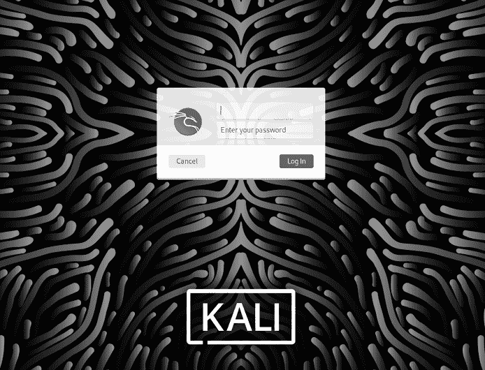
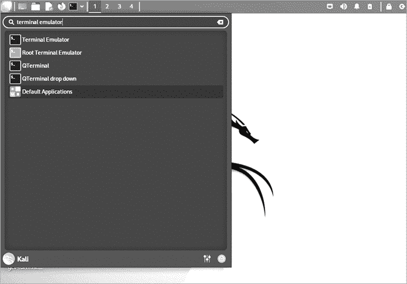
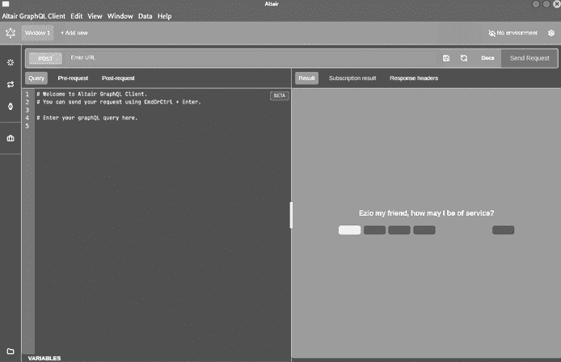
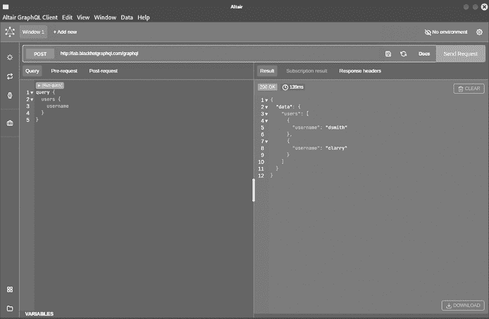
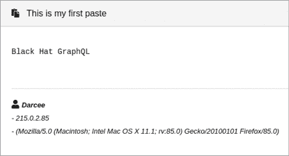
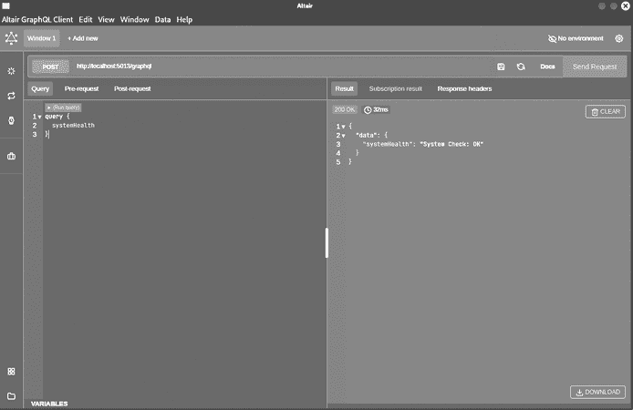
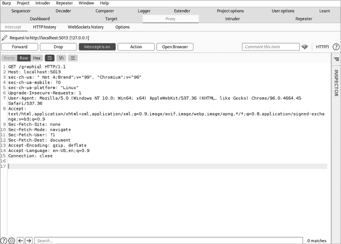

# 第二章：设置 GraphQL 安全实验室


在本章中，你将开始构建你的 GraphQL 道场：一个配备有 GraphQL 黑客工具的安全测试实验室环境，以及一个故意存在漏洞的服务器，你可以安全地在其中测试新学到的进攻性 GraphQL 技能。

当你正在测试一个底层技术已经存在多年且没有得到过多更新的应用程序时，了解如何设置一个正确的黑客实验室变得比以往更加重要。成熟的技术经历了多次安全审查和研究。对于较新的技术，可能需要一些时间才能开发出类似的知识库，并且安全测试方法学也需要在安全社区中传播。

缺乏知识库可能会带来问题。想象一下，当你进行渗透测试时，发现一台服务器正在运行一个你从未见过的应用程序。你可能会开始研究该软件，并在像漏洞数据库（[`exploit-db.com`](https://exploit-db.com)）这样的公共网站上查找已知的应用程序漏洞或公开的漏洞利用工具。然而，当应用程序使用新框架（如 GraphQL）时，情况可能会变得更加复杂。测试该应用程序不仅需要了解框架，还需要重新配置相关的渗透测试工具，这在渗透测试过程中是一项耗时的任务。

本章中构建的专用实验室将支持你在本书中的动手实践，以便下次你在实际环境中遇到 GraphQL 时，能够使用正确的工具来搜索和发现漏洞。在实验室中进行探索还有很多其他好处，例如通过实验获得实践经验。学习黑客技术最好的方式就是亲自动手。

## 采取安全预防措施

在你使用个人设备构建黑客实验室时，应该遵循以下几个指南：

+   **避免将实验室直接连接到公共互联网。** 黑客实验室环境通常涉及安装脆弱的代码或过时的软件。如果这些环境能够从互联网访问，它们可能会对你的网络、计算机和数据构成风险。你不希望互联网机器人在你的计算机上部署恶意软件或将其作为攻击他人的跳板。

+   **仅在受信任的本地网络上进行实验室操作。** 任何与您在同一网络上的人都可以攻击实验室。因此，我们建议仅在连接到您信任的网络时进行本书中的操作。

+   **通过使用虚拟化软件（如 Oracle VirtualBox）在虚拟环境中部署实验室。** 对于 VirtualBox ([`www.virtualbox.org/wiki/Downloads`](https://www.virtualbox.org/wiki/Downloads))，选择适合你主机操作系统的安装包。如果你使用的是 Linux，选择与你使用的 Linux 发行版相对应的安装包，下载地址位于 [`www.virtualbox.org/wiki/Linux_Downloads`](https://www.virtualbox.org/wiki/Linux_Downloads)。VirtualBox 目前支持所有主要的发行版，如 Ubuntu、Debian 和 Fedora。将黑客实验室环境与主操作系统分离通常是个好主意，因为这可以防止可能破坏你计算机上其他软件的冲突。

+   **利用你选择的虚拟化软件的虚拟机快照机制。** 这样可以让你创建虚拟机的 *快照*（在某个指定时间点的版本），并在未来虚拟机出现问题时恢复到其原始状态。可以把这看作是点击视频游戏中的“保存”按钮，以便稍后继续游戏。

牢记这些最佳实践，让我们开始动手搭建实验室！

## 安装 Kali

*Kali* 是一个为渗透测试设计的 Linux 发行版。基于 Debian，它由 Offensive Security（[`offensive-security.com`](https://offensive-security.com)）设计。我们将使用 Kali 作为我们的 GraphQL 黑客实验室的基础操作系统，因为它已经捆绑了一些我们需要的库、依赖项和工具。

你可以在 [`www.kali.org/get-kali`](https://www.kali.org/get-kali) 找到适用于 VMware Workstation 和 Oracle VirtualBox 虚拟化软件的 Kali 虚拟机镜像。选择你喜欢的虚拟化软件，并按照 Offensive Security 提供的官方安装说明进行操作：[`www.kali.org/docs/installation`](https://www.kali.org/docs/installation)。

完成安装过程后，你应该会看到 图 2-1 中所示的 Kali 登录界面。Kali 默认附带一个名为 *kali* 的用户账户，密码也是 *kali*。



图 2-1：Kali Linux 登录界面

登录到 Kali 后，你需要确保它是最新的。打开 Kali 的 **应用程序**菜单，在搜索栏中输入**终端仿真器**（图 2-2）。点击对应的应用程序。



图 2-2：Kali 应用程序菜单

让我们使用一些命令来更新软件仓库，并升级已安装的软件包。在终端窗口中输入以下命令：

```
# sudo apt update -y
# sudo apt upgrade -y
# sudo apt dist-upgrade -y
```

从此以后，我们将使用 Kali 机器完成本书中的所有任务。我们建议保持终端窗口开启，因为你很快就需要用到它进行其他安装。

## 安装 Web 客户端

在第一章中，我们提到过，GraphQL API 可以通过多种专用工具查询，比如 GraphiQL Explorer，或者简单的基于命令行的 HTTP 客户端，如 cURL。这些工具背后都发起了 HTTP 请求。

我们将安装并使用两个 Web 客户端：cURL 和 Altair。这将允许你使用命令行工具和图形界面工具进行 GraphQL 查询的实验。

### 使用 cURL 从命令行查询

cURL 是最流行的命令行 HTTP 客户端之一，它可以像任何图形化的网页浏览器一样发起 HTTP 请求。因此，你可以使用它来查询 GraphQL API。

作为一个黑客，你应该熟悉从命令行操作。除了让你更容易自动化重复性任务之外，掌握命令行操作还可以在你无法访问图形界面时，如渗透测试中，帮助你高效工作。

现在我们开始安装 cURL。打开终端并输入以下命令：

```
#**sudo apt install -y curl**
```

你可以通过执行以下命令验证 cURL 是否已正确安装并正常工作：

```
# curl lab.blackhatgraphql.com
Black Hat GraphQL – Hello!
```

如果你看到“Hello!”消息，这意味着 cURL 成功地向应用程序发送了 HTTP GET 请求，并收到了响应。

### 使用 Altair 从 GUI 查询

在第一章中，我们通过使用 GraphiQL Explorer 查询 GraphQL API，利用其自动完成功能。虽然 GraphiQL 是一个非常有用的工具，但在渗透测试期间并不总是能使用它。为了克服这一点，你可以在本地计算机上安装图形化的 GraphQL 客户端。这些客户端能够连接到远程 GraphQL 服务器，并以类似 GraphiQL Explorer 的方式返回结果。如果你提供远程服务器地址给图形化客户端，它将自动处理 GraphQL 的集成。

其中一个工具，Altair，既有作为浏览器插件的版本，也有本地桌面应用程序的版本。这两个版本提供相同的功能，选择任何一个都没有不利之处。在本书中，我们将使用桌面应用程序。然而，如果你愿意，也可以通过添加插件商店安装 Firefox 的浏览器插件，方法是通过浏览器的地址栏输入`about:addons`。

Altair 桌面客户端可在[`altair.sirmuel.design/#download`](https://altair.sirmuel.design/#download)下载，支持 macOS、Linux 和 Windows，如图 2-3 所示。选择与你操作系统相对应的图标。如果你使用 Kali 系统，请安装 Linux 版本。

将 Altair 下载到 Kali 的*Desktop*目录。下载完成后，你应该会看到一个扩展名为*AppImage*的文件：

```
# cd ~/Desktop
# ls -l altair*
-rwxr--r-- 1 kali kali 88819862 altair_x86_64_linux.AppImage
```


图 2-3：可用的 Altair 桌面客户端版本

接下来，我们需要更改下载文件的权限，以便能够运行它：

```
# chmod u+x altair_x86_64_linux.AppImage
```

现在我们可以执行该文件了。它应该会加载客户端，如 图 2-4 所示。

```
# ./altair_x86_64_linux.AppImage
```

在你设置好正确的权限后，你应该也能够通过点击位于 Kali 桌面上的 Altair Desktop 图标直接运行该应用程序。

现在让我们验证客户端是否按预期工作。打开它，在输入 URL 地址栏中，输入 ***http://lab.blackhatgraphql.com/graphql***。这将确保我们执行的任何查询都会直接发送到此地址。现在，在左侧的查询窗格中，删除现有的代码注释（以 `#` 符号开头的行），并输入以下查询：

```
**query {**
 **users {**
 **username**
 **}**
**}**
```



图 2-4：Linux 的 Altair Desktop 客户端

最后，点击 **发送请求**。你应该会看到类似于 图 2-5 的输出。



图 2-5：Altair Desktop 客户端中的 GraphQL 响应

Altair 是一个强大的工具；它将为我们提供查询自动补全建议、模式文档、执行过的查询历史记录以及其他功能，如设置自定义 HTTP 头部和将查询保存到集合中，这些都使我们的工作变得更加轻松。欲了解更多关于 Altair 高级功能的信息，请参考官方文档页面 [`altair.sirmuel.design/docs/features`](https://altair.sirmuel.design/docs/features)。

## 设置一个脆弱的 GraphQL 服务器

既然我们已经拥有了查询任何 GraphQL 服务器所需的客户端工具，接下来的步骤是安装一个脆弱的 GraphQL 服务器，我们将在本书中将其作为目标。我们将在第三章对 GraphQL 进行更深入的探讨，并在第 4 至第九章的渗透测试练习中使用这个脆弱的服务器。

### 安装 Docker

*Docker* ([`www.docker.com`](https://www.docker.com)) 是一个部署和管理容器的工具。*容器* 是打包代码及其依赖项的软件单元，使应用程序可以在各种环境中可靠地运行。Docker 可在 Windows、macOS 和 Linux 上使用。

我们将使用 Docker 来部署本书中我们将要攻击的应用程序。让我们通过运行以下命令从 Kali 软件库中安装它：

```
# sudo apt install -y docker.io
```

接下来，我们想确保 Docker 进程在系统重启后会自动启动：

```
# sudo systemctl enable docker --now
```

最后，确保 Docker 已成功安装：

```
# sudo docker

Management Commands:
  builder     Manage builds
  completion  generate the autocompletion script for the specified shell
  config      Manage Docker configs
  container   Manage containers
  context     Manage contexts
```

### 部署 Damn Vulnerable GraphQL Application

我们的目标应用程序必须能够模拟常见的 GraphQL 应用程序漏洞。为此，我们将使用 *Damn Vulnerable GraphQL Application (DVGA)*，这是一款故意内置了设计和配置级漏洞的 GraphQL 应用程序。我们于 2021 年 2 月开发了 DVGA，目的是教育用户攻击和防御由 GraphQL 支持的应用程序，它自那时以来成为了 GraphQL 安全领域的事实标准目标应用程序，用于学习如何破解 GraphQL。

DVGA 存在多种漏洞，包括 DoS、信息泄露、代码执行、认证绕过、结构化查询语言（SQL）注入、授权破坏等。它提供了多种工作模式，适用于初学者和专家，并包括内置功能，可以在出现故障时自行恢复。我们将在第三章和第四章中更详细地讲解如何使用它。

DVGA 代码是开源的，可以在 GitHub 上找到，网址是 [`github.com/dolevf/Damn-Vulnerable-GraphQL-Application`](https://github.com/dolevf/Damn-Vulnerable-GraphQL-Application)。让我们使用 Git 克隆 DVGA 仓库，并使用 Docker 部署它。首先，确保你的计算机已安装 Git，使用以下命令：

```
# sudo apt install git -y
# git --help

usage: git [--version] [--help] [-C <path>] [-c <name>=<value>]
           [--exec-path[=<path>]] [--html-path] [--man-path] [--info-path]
           [-p | --paginate | -P | --no-pager] [--no-replace-objects] [--bare]
`--snip--`
```

接下来，从 GitHub 克隆 DVGA 仓库：

```
# cd ~
# git clone -b blackhatgraphql https://github.com/dolevf/Damn-Vulnerable-GraphQL-Application.git
# ls -l

drwxr-xr-x 9 kali kali 4096 Damn-Vulnerable-GraphQL-Application
```

然后使用以下命令构建 DVGA Docker 镜像：

```
# cd Damn-Vulnerable-GraphQL-Application
# sudo docker build -t dvga .
```

最后，使用以下命令启动 DVGA 容器。如果你的 DVGA 在本书的任何部分崩溃，记得运行此特定命令：

```
# sudo docker run -t --rm -d --name dvga -p 5013:5013 -e WEB_HOST=0.0.0.0 dvga
```

接下来，通过使用以下命令验证容器是否正在运行：

```
# sudo docker container ps

CONTAINER ID IMAGE COMMAND CREATED STATUS PORTS NAMES
7b33cca84fc1  dvga   "python3 app.py"  About a minute ago
Up  0.0.0.0:5013->5013/tcp, :::5013->5013/tcp   dvga
```

此时，目标应用程序应该已经启动并正在运行。通过打开网页浏览器并在地址栏中输入***http://localhost:5013***来验证这一点。你应该能够访问图 2-6 中显示的应用程序。


图 2-6：Damn Vulnerable GraphQL 应用程序

如你所见，DVGA 类似于 Pastebin ([`pastebin.com`](https://pastebin.com))，这是一个允许客户端提交随机文本片段（如源代码或其他文本）并与他人共享的 web 应用程序。这些文本片段也被称为 *pastes*，这是我们将在本书中使用的术语，我们将在穿越渗透测试场景时使用 DVGA。粘贴内容可以包含元数据，如标题、内容、作者信息等。当我们针对 DVGA 运行查询时，你将能够看到这些信息。图 2-7 显示了 DVGA 中的一个示例粘贴。



图 2-7：DVGA 中的一个示例粘贴

你可以看到粘贴的标题和内容，以及其作者（Darcee）和一些元数据，例如他们的互联网协议（IP）地址（215.0.2.85）和网络浏览器（Mozilla/5.0）。

### 测试 DVGA

现在，你已经在实验环境中部署了目标应用程序，请验证该应用程序是否启动，并且其 GraphQL API 是否可以通过简单的 GraphQL 查询访问。为此，我们将使用之前安装的 Altair 客户端。

打开 Altair 客户端，在地址栏中输入 ***http://localhost:5013/graphql***。接下来，在左侧窗格中输入以下 GraphQL 查询：

```
**query {**
 **systemHealth**
**}**
```

此查询应输出类似于图 2-8 所示的结果。



图 2-8：Altair 中的 DVGA 响应

GraphQL 中的名称是区分大小写的，因此请确保按照 `systemHealth` 中的大小写进行操作；否则，此查询将导致错误。

## 安装 GraphQL 黑客工具

在第一章中，我们强调了 REST 和 GraphQL API 之间的差异。这些差异要求安全行业将 GraphQL 支持集成到现有工具中。在某些情况下，黑客还创建了专门用于渗透测试 GraphQL 应用程序的新工具。我们将在实验中安装并在后续章节的黑客演练中使用这些能够进行 GraphQL 应用程序安全测试的工具。

### Burp Suite

*Burp Suite* 是 PortSwigger 提供的应用程序安全测试软件（[`portswigger.net`](https://portswigger.net)），它代理您网页浏览器和目标应用程序之间的流量，使您能够拦截、修改并重放进出计算机的请求。在我们的 GraphQL 安全实验中，我们将使用 Burp Suite 手动与目标进行交互，通过观察并修改 GraphQL 查询，在它们发送到目标服务器之前进行操作。

更新版本的 Kali 应该默认安装了 Burp Suite。我们可以通过打开终端并输入以下命令来验证这一点：

```
# sudo apt install burpsuite -y
```

现在我们将打开 Burp Suite，并检查它是否能够成功拦截流量。在 Kali 应用菜单的搜索栏中输入**Burp Suite**并点击该应用。如果这是您第一次加载该应用，请阅读服务条款并点击**我接受**。

选择**临时项目**单选按钮，创建一个临时项目，并点击**下一步**。Burp Suite 会询问要加载哪个配置文件。选择**使用 Burp 默认设置**并点击**启动 Burp**。

接下来，让我们确保 Burp Suite 可以代理 HTTP 流量到 DVGA。点击**代理**▶**拦截**▶**打开浏览器**。在浏览器中，输入***http://localhost:5013/graphiql***并按回车键。这将发起一个 GET 请求到 DVGA，Burp Suite 应该会自动拦截该请求。

Burp Suite 现在应该会突出显示**拦截**标签（通常是橙色的），表示它已拦截了传出的请求。您应该能看到一个正在传输的 HTTP GET 请求，类似于图 2-9 所示的内容。

此请求尚未离开您的网页浏览器。Burp Suite 允许您在将其发送到服务器之前进行修改。请点击**拦截已开启**按钮，这将解除请求的拦截并将其发送到 DVGA。

我们已经验证了 Burp Suite 已安装并配置好，能够拦截从浏览器到 DVGA 的流量。干得好！Burp Suite 功能丰富，足以写一本书来介绍它。要了解更多关于此工具的信息，我们建议参考其官方文档（[`portswigger.net/burp/documentation/desktop/penetration-testing`](https://portswigger.net/burp/documentation/desktop/penetration-testing)）。



图 2-9：在 Burp Suite 中拦截请求

### Clairvoyance

在第一章中，我们介绍了 GraphQL 架构，它代表了应用程序数据模型的结构。想要与 GraphQL API 交互的开发人员需要了解他们可以访问哪些数据，以及 API 支持哪些查询或变更。GraphQL 通过 introspection 查询公开这些架构信息。

简单来说，*introspection* 是 GraphQL 中的一个特性，允许它向客户端描述自己的数据。示例 2-1 显示了一个基本的 *introspection 查询*，返回架构中所有可用查询的列表。我们将在第三章中更详细地介绍这些查询。

```
{
  __schema {
    queryType {
      fields {
        name
      }
    }
  }
}
```

示例 2-1：一个基本的 introspection 查询

正如你所想，允许客户对其 GraphQL API 执行 introspection 查询的公司实际上是在做出一个安全上的权衡。关于后端应用程序支持的各种字段和对象的信息，可能会帮助攻击者，增加他们成功发现漏洞的机会。因此，生产级的实现通常会禁用 introspection。这意味着你可能需要在不允许执行 introspection 查询的生产环境中测试 GraphQL 应用程序。在这种情况下，弄清楚如何正确构建查询可能会成为一个挑战。

这时，*Clairvoyance* 就派上用场了。这款基于 Python 的 GraphQL API 侦察工具由 Nikita Stupin ([@_nikitastupin](http://www.twitter.com/@_nikitastupin)) 和 Ilya Tsaturov ([@itsaturov](http://www.twitter.com/@itsaturov)) 开发，允许你在禁用 introspection 的情况下发现架构信息。它通过滥用 GraphQL 的一个特性——*字段建议*，工作原理是通过发送来自常见英语单词字典构建的查询并观察服务器的响应，重建底层架构。我们将在第六章更详细地讨论字段建议及其如何帮助我们提取 GraphQL 架构的信息。

让我们继续安装 Clairvoyance。打开终端并输入以下命令：

```
# cd ~
# git clone https://github.com/nikitastupin/clairvoyance.git
# cd clairvoyance
```

我们可以通过向 Clairvoyance 脚本传递 `-h` 参数来验证 Clairvoyance 是否能够运行：

```
# python3 -m clairvoyance -h

usage: __main__.py [-h] [-v] [-k] [-i <file>]
[-o <file>] [-d <string>] [-H <header>] -w <file> url

positional arguments:
  url

optional arguments:
  -h, --help            show this help message and exit
```

### InQL

直到最近，即使 GraphQL 的使用逐渐增加，关于 GraphQL 安全测试的资源仍然很少公开。为填补这一空白，安全公司 Doyensec 开发了 *Introspection GraphQL* (*InQL*)。

这个基于 Python 的安全测试工具依赖于 introspection 查询。InQL 可以将它找到的关于 GraphQL 架构的任何信息导出为多种格式，使得应用程序的架构更容易阅读和理解。InQL 还可以执行其他任务，例如检测潜在的 DoS 条件。

让我们安装 InQL。打开终端并输入以下命令：

```
# cd ~
# git clone https://github.com/doyensec/inql.git
# cd inql
# sudo python3 setup.py install
```

通过传递 `-h` 参数来验证安装是否成功，确保 InQL 可以运行：

```
# inql -h

usage: inql [-h] [-t TARGET] [-f SCHEMA_JSON_FILE] [-k KEY]
[-p PROXY] [--header HEADERS HEADERS] [-d] [--no-generate-html]
[--no-generate-schema] [--no-generate-queries] [--generate-cycles]
[--cycles-timeout CYCLES_TIMEOUT] [--cycles-streaming] [--generate-tsv]
[--insecure] [-o OUTPUT_DIRECTORY]
```

如果你看到类似的输出，说明 InQL 已成功安装。我们将在本书后续的渗透测试练习中使用该工具。

### Graphw00f

多年来，GraphQL 社区已经开发出了多种编程语言的 GraphQL 服务器实现，例如 PHP 的 graphql-php，Python 的 Graphene 和 Ariadne。对我们黑客来说，识别目标服务器背后运行的技术至关重要。一旦我们收集到这些信息，就能够根据所面对的技术定制攻击策略，从而提高整体成功率。

*Graphw00f* 是一款基于 Python 的 GraphQL 安全工具，我们开发它的目的是识别 GraphQL API 的特定实现。我们之所以开发它，主要是因为 GraphQL 通常不会公开它在背后使用的引擎类型。我们想知道是否能仅凭 API 响应就识别实现，结果发现是可以的。Graphw00f 通过向服务器发送有效和格式错误的查询，并观察返回错误信息中的微小差异，成功地指纹识别实现。目前它可以识别超过 24 种实现，包括目前使用的多数流行的 GraphQL 服务器。

这项实现信息尤其有趣，因为并不是所有今天可用的 GraphQL 实现都具备相同的安全功能。例如，一些实现提供了用于实现授权控制的外部库，而其他的则没有。识别后端技术可以为我们提供这些额外的数据点，以指导我们的测试。

要安装 Graphw00f，打开终端并输入以下命令：

```
# cd ~
# git** **clone https://github.com/dolevf/graphw00f.git
# cd graphw00f
```

使用 `-h` 命令验证 Graphw00f 是否可以成功启动：

```
# python3 main.py --help

Usage: main.py -d -f -t http://example.com

Options:
  -h, --help            show this help message and exit
  -r, --noredirect      Do not follow redirections given by 3xx responses
```

### BatchQL

*BatchQL* 是一款用 Python 编写的 GraphQL 安全审计脚本，由安全公司 Assetnote 开发。该工具的名称源于 GraphQL 的一个特性，叫做 *批处理*，它允许客户端在一个 HTTP 请求中发送多个查询。你将在后面的章节中了解更多关于批量查询的内容。

BatchQL 尝试识别与以下漏洞类别相关的 GraphQL 实现中的缺陷：DoS、CSRF 和信息泄露。通过执行以下命令进行安装：

```
# cd ~
# git clone https://github.com/assetnote/batchql.git
```

通过传递 `-h` 标志来验证 BatchQL 是否正常工作：

```
# cd batchql
# python3 batch.py -h

usage: batch.py [-h] [-e ENDPOINT] [-v VARIABLE] [-P PREFLIGHT]
[-q QUERY] [-w WORDLIST] [-H HEADER [HEADER ...]] [-p PROXY] [-s SIZE] [-o OUTPUT]

optional arguments:
  -h, --help            show this help message and exit
  -e ENDPOINT, --endpoint ENDPOINT
                        GraphQL Endpoint (i.e. https://example.com/graphql).
```

### Nmap

Nmap 由 Gordon Lyon（也被称为 “Fyodor”）开发，是一款端口扫描的瑞士军刀。它也是目前最古老的安全工具之一，创建于 1997 年 9 月。（令人惊讶的是，它几十年后仍然是事实上的端口扫描工具。）

我们将使用 Nmap 的端口扫描功能及其自定义脚本引擎 *Nmap 脚本引擎（NSE）*。NSE 使用用 Lua 语言编写的脚本将 Nmap 扩展为一个完整的漏洞评估工具。我们将利用这个功能来扫描 GraphQL 服务器并寻找漏洞。

Kali 默认自带 Nmap。使用以下命令验证是否已安装 Nmap：

```
# sudo apt install nmap -y
```

接下来，下载 *nmap-graphql-introspection-nse* Lua 脚本，并将其放入 NSE *scripts* 文件夹：

```
# cd ~
# git clone https://github.com/dolevf/nmap-graphql-introspection-nse.git
# cd nmap-graphql-introspection-nse
# sudo cp graphql-introspection.nse /usr/share/nmap/scripts
```

现在让我们验证 Nmap 是否能够找到并读取脚本，通过传递 `--script-help` 命令参数来实现：

```
# nmap --script-help graphql-introspection.nse

Starting Nmap ( https://nmap.org )

graphql-introspection
Categories: discovery fuzzer vuln intrusive
https://nmap.org/nsedoc/scripts/graphql-introspection.html
Identifies webservers running GraphQL endpoints and attempts an
execution of an Introspection query for information gathering.

This script queries for common graphql endpoints and then sends an
Introspection query and inspects the result.

  Resources
  * https://graphql.org/learn/introspection/
```

### Commix

*命令注入漏洞利用工具 (Commix)* 是一个由 Anastasios Stasinopoulos 开发的开源项目，使用 Python 编写。Commix 通过模糊测试 HTTP 请求的各个部分（如查询参数或请求体）来自动化寻找并利用命令注入漏洞，使用特定的载荷。该工具还能够利用这些漏洞，生成一个自定义的交互式 shell，渗透测试人员可以用它来在远程服务器上获取立足点。

Commix 应该默认预装在 Kali 中，但为了确保它已正确安装并正常工作，请运行以下一组命令：

```
# sudo apt install commix -y
# commix -h

Usage: commix [option(s)]

Options:
  -h, --help            Show help and exit.

  General:
    These options relate to general matters.

    -v VERBOSE          Verbosity level (0-4, Default: 0).
    --version           Show version number and exit.
```

### graphql-path-enum

由 dee_see（[@dee_see](http://www.twitter.com/@dee_see)）编写的 Rust 语言开发的 *graphql-path-enum* 是一个安全测试工具，用于寻找构建查询的不同方式，目标是达到特定的数据。这为黑客提供了有助于识别授权漏洞的信息。我们将在第七章中讨论 GraphQL 的授权漏洞。

运行以下命令安装 graphql-path-enum：

```
# cd ~
# wget "https://gitlab.com/dee-see/graphql-path-enum/-/jobs/artifacts/v1.1/raw
**/target/release/graphql-path-enum?job=build-linux"**
**-O graphql-path-enum**
# chmod u+x graphql-path-enum
```

通过传递 `-h` 标志来验证它是否能够成功运行并具有新的权限：

```
# ./graphql-path-enum -h

graphql-path-enum

USAGE:
    graphql-path-enum [FLAGS] --introspect-query-path <FILE_PATH> --type <TYPE_NAME>

FLAGS:
        --expand-connections    Expand connection nodes
        (with pageInfo, edges, etc. edges), they are skipped by default.
    -h, --help                  Prints help information
        --include-mutations     Include paths from the Mutation node.
        Off by default because this often adds a lot of noise.
    -V, --version               Prints version information
```

### EyeWitness

*EyeWitness* 是一款由 Chris Truncer 和 Rohan Vazarkar 开发的 Web 扫描工具，能够捕获目标 Web 应用程序的截图。在渗透测试中扫描多个网站时，您通常会发现，视觉识别它们正在运行什么内容非常有用。EyeWitness 通过一个基于命令行的 Web 浏览器（也叫 *无头浏览器*）来实现这一点，它可以加载动态的 Web 内容，如使用 JavaScript 动态加载的内容。

使用以下命令安装 EyeWitness：

```
# sudo apt install eyewitness -y
# eyewitness -h

Protocols:
  --web                 HTTP Screenshot using Selenium

Input Options:
  -f Filename           Line-separated file containing URLs to capture
  -x Filename.xml       Nmap XML or .Nessus file
  --single Single URL   Single URL/Host to capture
  --no-dns
```

### GraphQL Cop

我们开发了 GraphQL Cop，一款基于 Python 的专用 GraphQL 安全审计工具。GraphQL Cop 用于审计 GraphQL 服务器的 信息泄露和 DoS 类型漏洞。在后续章节中，我们将使用此工具检查 GraphQL 服务器是否能防范常见攻击。

使用以下一组命令安装 GraphQL Cop：

```
# sudo apt install python3-pip -y
# git clone https://github.com/dolevf/graphql-cop.git
# cd graphql-cop
# pip3 install -r requirements.txt
# python3 graphql-cop.py -h

Options:
  -h, --help            show this help message and exit
  -t URL, --target=URL  target url with the path
  -H HEADER, --header=HEADER
                        Append Header to the request '{"Authorization":
                        "Bearer eyjt"}'
  -o FORMAT, --output=FORMAT
                        json
  -x, --proxy           Sends the request through http://127.0.0.1:8080 proxy
  -v, --version         Print out the current version and exit.
```

### CrackQL

我们开发了 CrackQL，一款专门针对 GraphQL 的暴力破解工具，它利用 GraphQL 语言特性来优化针对可能需要身份验证的 API 操作的暴力攻击。我们将在第七章中使用此工具，进行基于字典的攻击，攻击我们的 GraphQL 目标。按照以下步骤安装 CrackQL：

```
# git clone https://github.com/nicholasaleks/CrackQL.git
# cd CrackQL
# pip3 install -r requirements.txt
# python3 CrackQL.py -h

Options:
  -h, --help            show this help message and exit
  -t URL, --target=URL  Target url with a path to the GraphQL endpoint
  -q QUERY, --query=QUERY
                        Input query or mutation operation with variable
                        payload markers
  -i INPUT_CSV, --input-csv=INPUT_CSV
                        Path to a csv list of arguments (i.e. usernames,
                        emails, ids, passwords, otp_tokens, etc.)
```

一旦你安装了所有这些工具，我们强烈建议你对 Kali 虚拟机进行快照，以确保其状态得到保存。这样一来，未来如果虚拟机出现故障，你就能恢复到之前的状态。

## 摘要

让我们总结一下你目前在实验室中拥有的内容：可以与 GraphQL 交互的图形化和命令行 HTTP 客户端，一个用于部署容器的工作 Docker 环境，以及 DVGA 目标应用程序。

本章简要讨论了这些工具的工作原理以及它们满足的需求，如信息收集、服务器指纹识别、网络和应用扫描、漏洞评估和 GraphQL 审计。你将在后续章节中更深入地探索它们的使用。

本实验室是本书的核心部分，但它也可能对你下一次的真实世界渗透测试有所帮助。我们鼓励你关注 Black Hat GraphQL GitHub 仓库 ([`github.com/dolevf/Black-Hat-GraphQL.git`](https://github.com/dolevf/Black-Hat-GraphQL.git))，我们在该仓库中维护着当前和未来的 GraphQL 安全工具列表，帮助你保持实验室的更新。
