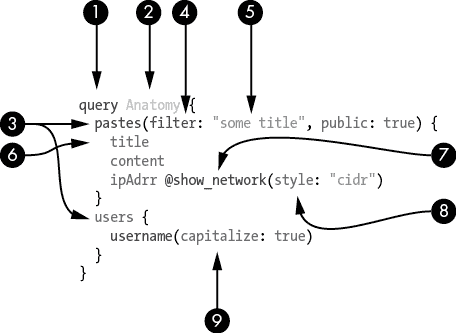
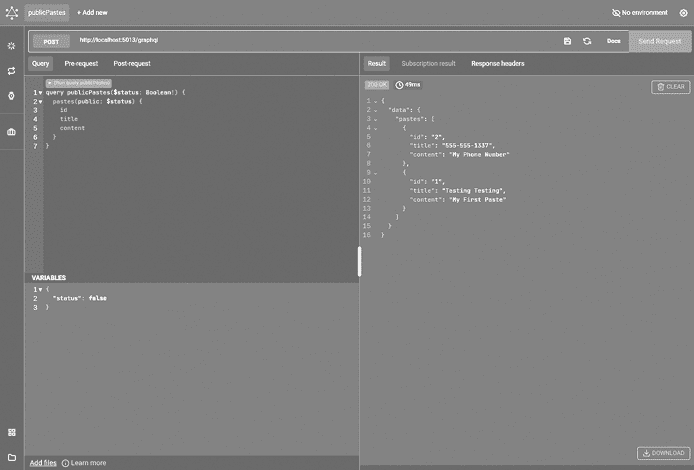

# 3

GraphQL 攻击面


在本章中，我们首先从黑客的角度探讨 GraphQL 的语言和类型系统。然后，我们提供 GraphQL 中常见弱点的概述。希望你准备好了你的“假想黑帽”，因为你即将学习到一个功能如何变成一个弱点，错误配置如何变成信息泄漏，实施设计缺陷如何导致 DoS（拒绝服务）机会。

## 什么是攻击面？

*攻击面*是指对手可以用来破坏系统机密性、完整性和可用性的所有可能攻击向量的总和。例如，想象一座带有前门、侧门和多个窗户的实体建筑。作为攻击者，我们将每个窗户和门视为可能的机会，以获得未经授权的访问权限。

通常，当系统的攻击面较大时，其遭受攻击成功的风险较高，例如由许多应用程序、数据库、服务器、端点等组成时。就像一栋建筑拥有更多的窗户和门，攻击者就有更高的机会找到一个没有锁上的入口点或不安全的入口点。

攻击面随着时间的推移而变化，尤其是随着系统及其环境的演化。这在云环境中尤为明显，因为基础设施具有弹性。例如，一台服务器可能只存在有限的时间，或者 IP 地址可能会变化，有时一天内会变化多次。

让我们回顾一下 GraphQL 中所有的窗户和门，并突出可能的攻击向量，看看我们可以如何利用它们。理解这些概念将帮助你在接下来的章节中深入了解进攻性安全。

## 语言

为了讨论 GraphQL 的攻击面，我们将其规范分为两个部分：语言和类型系统。我们首先从客户端的角度介绍语言，用于向 GraphQL API 服务器发出请求。接下来，我们将从服务器的角度回顾其类型系统。你可以通过使用 GraphQL 规范来学习这些概念以及其他 GraphQL 内部知识；在这里，我们的目的是提炼出能够让你掌握足够知识的部分，以便在未来的章节中测试 GraphQL 攻击向量。

GraphQL 语言包含许多客户端可以利用的有用组件。乍一看，这些元素在请求中的表示方式可能会让人感到困惑。图 3-1 是一个示例 GraphQL 查询，其组件在表 3-1 中有详细解释。



图 3-1：一个示例 GraphQL 查询

如你所见，GraphQL 查询具有独特的结构，理解各个部分非常重要。表 3-1 提供了每个组件的描述。

表 3-1：GraphQL 查询的组成部分

| **#** | **组件** | **描述** |
| --- | --- | --- |
| 1 | 操作类型 | 定义与服务器交互方法的类型（查询、变更或订阅） |
| 2 | 操作名称 | 客户端创建的任意标签，用于为操作提供唯一名称 |
| 3 | 顶级字段 | 在操作中请求的返回单一信息或对象的函数（可能包含嵌套字段） |
| 4 | 参数（顶级字段的） | 用于向字段发送信息的参数名称，以调整该字段的行为和结果 |
| 5 | 值 | 与发送给字段的参数相关的数据 |
| 6 | 字段 | 返回在操作中请求的单一信息或对象的嵌套函数 |
| 7 | 指令 | 用于修饰字段的特性，改变其验证或执行行为，从而改变 GraphQL 服务器返回的值 |
| 8 | 参数（指令的） | 用于向字段或对象发送信息的参数名称，以调整其行为和结果 |
| 9 | 参数（字段的） | 用于向字段发送信息的参数名称，以调整字段的行为和结果 |

以下章节将探索这些组件，以及一些额外的 GraphQL 特性，重点讨论它们如何影响 GraphQL 的攻击面。

### 查询、变更和订阅

我们在第一章讨论了根操作类型查询、变更和订阅，并展示了使用查询类型获取数据的示例。（因此我们在这里不再重复查询类型。）作为黑客，真正的乐趣通常发生在我们能够修改数据时。在目标平台中创建、更新和删除数据使我们能够暴露业务逻辑漏洞。

#### 变更

在 GraphQL 中，我们可以通过使用*变更*来解锁数据修改功能。下面是一个变更查询的示例：

```
mutation {
  editPaste(id: 1, content: "My first mutation!") {
    paste {
       id
       title
       content
    }
  }
}
```

我们通过使用 `mutation` 关键字定义变更操作。然后我们调用顶级的 `editPaste` 字段，它接受 `id` 和 `content` 参数。（我们将在本章稍后讨论参数。）这个变更操作本质上是将 `id` 为 `1` 的粘贴内容更新。然后我们请求更新后的粘贴。这是一个同时更改和读取数据的变更示例。

#### 订阅

*订阅*操作是双向工作的：它允许客户端从服务器获取实时数据，并允许服务器向客户端发送更新。订阅不像查询和变更那样常见，但许多服务器确实使用它们，因此了解它们的工作原理是很重要的。

订阅通过传输协议进行传输，最常见的是*WebSocket*，一种实时通信协议，允许客户端和服务器在长时间连接下随时交换消息。然而，由于 GraphQL 规范并未定义订阅使用的传输协议，你可能会看到消费者使用其他协议。

当客户端和服务器想通过 WebSocket 通信时，它们会进行一次握手，将现有的 HTTP 连接升级为 WebSocket 连接。WebSocket 的内部工作机制超出了本书的范围，但你可以通过阅读 PortSwigger 的技术博客文章 [`portswigger.net/web-security/websockets/what-are-websockets`](https://portswigger.net/web-security/websockets/what-are-websockets) 来深入了解这项技术。

因为 DVGA 支持通过 WebSocket 进行订阅，我们可以观察到 DVGA 前端界面与 GraphQL 服务器之间的握手。客户端可以使用订阅从 DVGA 服务器获取信息，例如新创建的 paste。例如，当你浏览到 *http://localhost:5013* 的公共粘贴页面时，你应该能在浏览器的开发者工具 Network 标签页中看到类似以下的 HTTP 请求：

```
GET **/subscriptions** HTTP/1.1
Host: 0.0.0.0:5013
Connection: Upgrade
Pragma: no-cache
Cache-Control: no-cache
Upgrade: websocket
Origin: http://localhost:5013
**Sec-WebSocket-Version: 13**
Sec-WebSocket-Key: MV5U83GH1UG8AlEb18lHiA==
```

GraphQL 服务器对这个握手请求的响应如下：

```
HTTP/1.1 **101 Switching Protocols**
Upgrade: websocket
Connection: Upgrade
Sec-WebSocket-Accept: aRnlpG8XwzRHPVxYmGVdqJv3D7U=
```

如你所见，握手导致客户端和服务器从 HTTP 切换到 WebSocket，这一点可以通过响应代码 `101 Switching Protocols` 看出。`Sec-WebSocket-Accept` 响应头告知客户端，服务器已接受协议切换。

握手完成后，DVGA 会通过新建立的 WebSocket 连接发送订阅请求：

```
subscription {
  paste {
     id
     title
     content
  }
}
```

我们通过使用 `subscription` 关键字定义订阅操作，然后请求 `paste` 顶级字段，并选择 `id`、`title` 和 `content` 字段。这个订阅允许客户端订阅 `paste` 字段；每当 DVGA 中创建一个新的 paste 时，GraphQL 服务器将通知所有订阅者该事件。这省去了客户端不断向服务器请求更新的需求，尤其是在服务器此时可能没有任何新内容返回的情况下，这非常有用。

如果你想尝试使用 Altair 向 DVGA 发送这个订阅请求，你需要分配一个订阅 URL。你可以通过点击左侧边栏上的双箭头图标并输入 WebSocket URL ***ws://localhost:5013/subscriptions*** 来实现。接下来，为了接收来自 DVGA 订阅的数据，你需要创建一个 paste。你可以通过 DVGA 用户界面在公共粘贴页面创建它，或者通过另一个 Altair 标签页发送如下的变更：

```
mutation {
  createPaste(title: "New paste", content: "Test", public: false) {
    paste {
      id
      title
      content
    }
  }
}
```

WebSocket 连接容易受到*跨站 WebSocket 劫持（CSWSH）*漏洞的影响，当服务器在握手过程中未验证客户端的来源时，就会发生这种情况。WebSocket 连接在消息传输没有通过加密通道（如传输层安全协议 TLS）时，也容易受到*中间人（MITM）*攻击。这些漏洞的存在可能对通过 GraphQL 订阅进行的操作产生安全影响。在第九章，我们将更详细地讨论基于 WebSocket 的攻击。

### 操作名称

GraphQL 的*操作名称*是用于在特定上下文中唯一标识一个操作的标签。它们出现在客户端发送给 GraphQL 服务的可执行文档中。这些文档可以包含一个或多个操作的列表。例如，列表 3-1 中的文档展示了一个查询操作，要求返回`pastes`顶级字段以及一个嵌套的`title`字段。

```
query {
  pastes {
    title
  }
}
```

列表 3-1：一个可执行的查询文档

如果文档仅包含一个操作，并且该操作是一个没有定义变量且不包含指令的查询，则该操作可以用简写形式表示，省略`query`关键字，如列表 3-2 所示。

```
{
  pastes {
    title
  }
}
```

列表 3-2：一个简写查询文档

然而，一个文档也可能包含多个操作。如果文档中有多个相同类型的操作，则必须使用操作名称。

客户端定义这些操作名称，这意味着它们可以完全随机，这使得它们成为潜在欺骗分析师（审查 GraphQL 应用程序日志的人）的一个好方法。例如，假设一个客户端发送了一个使用操作名称`getPastes`的文档，但它并没有返回一个粘贴对象的列表，而是删除了所有粘贴。

列表 3-3 提供了一个文档示例，其中`getPasteTitles`和`getPasteContent`被设置为查询操作名称。尽管这些操作名称对于所请求的内容是合适的，但它们也可以与查询的实际操作完全无关。只有底层操作逻辑和选择字段决定了请求的输出。

```
query getPasteTitles {
  pastes {
    title
  }
}

query getPasteContent {
  pastes {
    content
  }
}
```

列表 3-3：一个包含多个操作的查询文档，每个操作都带有操作名称标签

由于操作名称是客户端驱动的输入，它们也可能成为注入攻击的向量。某些 GraphQL 的实现允许操作名称中包含特殊字符。应用程序可能会将这些名称存储在审计日志、第三方应用程序或其他系统中。如果没有正确处理，可能会造成混乱。

另一个你可能会在查看列表 3-1、3-2 和 3-3 后注意到的有趣现象是，客户端可以通过使用不同的文档请求完全相同的信息。这种自由度给客户端带来了很大的能力；然而，它也增加了可能的请求数量，从而增加了应用程序的攻击面。那些没有考虑到查询构造方式的解析器，容易发生意外错误。

### 字段

*字段*是操作的*选择集*中可用的单个信息项，选择集是位于大括号（`{}`）之间的列表。在以下示例中，`id`、`title`和`content`是字段：

```
{
  id
  title
  content
}
```

由于这三个字段位于快捷查询的根级别，它们也被称为*顶级字段*。字段也可以包含它们自己的选择集，允许表示复杂的数据关系。在以下示例中，顶级`owner`字段有其自己的选择集，其中包含一个嵌套字段：

```
{
  id
  title
  content
  owner {
    name
  }
}
```

所以，选择集由字段组成，字段可以具有其自己的选择集和它们自己的字段。您有什么安全问题要指出吗？在第五章中，我们将探讨循环字段关系可能导致递归和昂贵请求的安全问题，这可能会降低性能并潜在崩溃 GraphQL 服务器。

当涉及与 GraphQL 服务交互时，字段非常重要。不知道有哪些字段可用可能会相当限制。幸运的是，实现已为我们部署了一个方便的工具，称为*字段建议*。当客户端拼写错误字段时，实现字段建议的服务器返回的错误消息将引用它认为客户端试图调用的字段。例如，如果我们在 DVGA 中发送一个查询，字段名称为`titl`（注意拼写错误），服务器将以建议的替代方案响应：

```
"Cannot query field \"titl\" on type \"PasteObject\". Did you mean \"title\"?"
```

这个字段建议功能使得 GraphQL 不仅对 API 消费者而言成为一个方便、友好和简单的工具，对于黑客来说也是如此。我们可以利用此功能来发现我们可能不知道的字段。我们将在第六章讨论这种信息披露技术。

### 参数

与 REST API 类似，GraphQL 允许客户端为其查询中的各种字段发送*参数*，以定制它们返回的结果。如果您再看一下图 3-1，您会注意到参数可以在各个级别实现，即在字段和指令中。

在以下查询中，`users`字段具有一个`id`参数，其值为`1`。如果没有`id`参数，此查询将返回 DVGA 中的整个用户列表。该参数将此列表过滤为具有相同标识符的用户：

```
query {
  users(id: 1) {
    id
 username
  }
}
```

如预期的那样，对此请求的响应将返回单个用户对象、其 ID 和其用户名：

```
{
  "data": {
    "users": [
      {
        "id": "1",
        "username": "admin"
      }
    ]
  }
}
```

参数也可以传递给嵌套字段。考虑这个查询：

```
query {
  users(id: 1)  {
    username(capitalize: true)
  }
}
```

嵌套的`username`字段现在具有名为`capitalize`的参数。此参数接受一个布尔值，此处设置为`true`。在 DVGA 中，此参数将使 GraphQL 将用户名字段的第一个字符大写，并在响应中返回，例如将`admin`转换为`Admin`：

```
{
  "data": {
    "users": [
      {
        "username": "Admin"
      }
    ]
  }
}
```

参数是*无序*的，这意味着改变它们的顺序不会改变查询的逻辑。在以下示例中，无论您先传递`limit`参数还是`public`参数，都不会改变查询的含义：

```
query {
  pastes(**limit: 1, public: true**){
    id
  }
}
```

这些参数的处理和验证方式完全由应用程序决定，实施差异可能导致安全漏洞。例如，由于 GraphQL 是强类型的，将一个整数值传递给一个期望字符串值的参数将导致验证错误。如果你传递的是字符串，GraphQL 层面的验证会通过，但应用程序仍应验证该输入的格式。例如，如果该值是一个电子邮件地址，应用程序可能会使用正则表达式检查其格式是否符合电子邮件地址的规范，或者检查是否包含 `@` 符号。

如果应用程序使用了一个为电子邮件地址提供自定义标量类型的库，该库本身可能会执行此验证，从而减少应用程序维护人员犯错的机会。像 graphql-scalars（[`github.com/Urigo/graphql-scalars`](https://github.com/Urigo/graphql-scalars)）这样的外部 GraphQL 库为特定用例提供了有用的自定义标量类型，例如时间戳、IP 地址、网站 URL 等。当然，自定义标量类型中仍然可能存在漏洞。例如，Python 的 ipaddress 库中发现的漏洞（CVE-2021-29921）可能使攻击者绕过基于 IP 的访问控制。

如你所见，参数赋予了客户端很大的权限来操控请求的行为，因此它们是另一个重要的攻击向量。由于参数的值由客户端驱动，它可能会在基于注入的攻击中被填充恶意内容。在第八章中，我们将介绍如果参数值没有正确清理以防止注入攻击时，如何利用这些参数的工具和技术。

### 别名

*别名* 允许客户端将字段的响应键更改为与原字段名称不同的内容。例如，在这里我们将 `myalias` 作为 `title` 字段名称的别名：

```
query {
   pastes {
      **myalias:**title
   }
}
```

响应将包含 `myalias` 键，而不是原始的 `title` 字段名称：

```
{
  "data": {
    "pastes": [
      {
        **"myalias":** "My Title!"
      }
    ]
  }
}
```

当你处理相同的响应键时，别名非常有用。请参阅列表 3-4 中的查询。

```
query {
  pastes(public: false) {
    title
  }
  pastes(public: true) {
    title
  }
}
```

列表 3-4：使用不同参数值的重复查询

在这个查询中，我们使用了 `pastes` 字段两次。在每个查询中，我们传递了不同值的 `public` 参数（`false` 和 `true`）。`public` 参数是一种根据权限过滤特定粘贴内容的方式：公开粘贴可以被所有客户端查看，而私密粘贴仅能由原作者查看。将列表 3-4 中的查询复制到 Altair 并发送给 DVGA，你应该看到以下输出：

```
{
  "errors": 
    {
      "message": "Fields \"pastes\" conflict because they have differing arguments.
      Use different aliases on the fields to fetch both if this was intentional.",
`--snip--`
}
```

GraphQL 服务器告诉我们，在使用此查询时发生了冲突。由于我们使用不同的参数发送了相同的查询，GraphQL 无法同时处理它们。这时，别名就派上用场了：我们可以重命名查询，使服务器将其视为不同的查询。[列表 3-5 展示了如何使用别名来避免键冲突。

```
Query {
  **queryOne:**pastes(public: false) {
    title
  }
  **queryTwo:**pastes(public: true) {
    title
  }
}
```

清单 3-5：为两个查询起别名

在下面的响应中，你会注意到两个 JSON 键，`queryOne` 和 `queryTwo`，它们分别对应我们在清单 3-5 中指定的每个别名。你可以将每个 JSON 键看作是对一个独立查询的响应：

```
{
  "data": {
    "queryOne": [
 {
        "title": "My Title!"
      }
    ],
    "queryTwo": [
      {
        "title": "Testing Testing"
      }
    ]
  }
}
```

到目前为止，别名看起来似乎很无害。放心，我们可以将其武器化。在第五章中，我们将教你如何利用别名进行各种 DoS 攻击，在第七章中，我们将用它们来突破认证控制。

### 片段

*片段*允许客户端在 GraphQL 查询中重用相同的字段集合，以提高可读性并避免字段重复。你可以定义一个片段一次，并在需要这组特定字段时随时使用它，而无需重复定义这些字段。

片段是使用`fragment`关键字定义的，后跟你希望的任何名称，并使用`on`关键字声明在对象类型名称上：

```
fragment CommonFields on PasteObject {
  title
  content
}
```

在这个示例中，我们定义了一个名为`CommonFields`的片段。使用`on`关键字，我们声明该片段与`PasteObject`相关联，这使我们能够访问你已经熟悉的字段，如`title`和`content`。清单 3-6 展示了如何在查询中使用此片段：

```
query {
  pastes {
    **...CommonFields**
  }
}

fragment CommonFields on PasteObject {
   title
   content
}
```

清单 3-6：定义`CommonFields`片段并在查询中使用它

使用三个点（`...`），也叫做*展开运算符*，我们可以在查询的不同部分引用`CommonFields`片段，以访问与粘贴相关的字段，如`title`和`content`。片段在查询中引用的次数没有限制。

从渗透测试的角度来看，片段可以构建成相互引用，从而形成循环片段条件，这可能导致 DoS 攻击。你将在第五章学习如何利用这一点。

### 变量

你可以通过在 GraphQL 文档中声明变量，将*变量*作为参数值传递给操作。变量很有用，因为它们可以避免在运行时进行繁琐的字符串构建。

变量在操作的顶部定义，在操作名称之后。清单 3-7 展示了一个使用变量的查询。

```
query publicPastes($status: Boolean!){
  pastes(public: $status){
    id
    title
    content
  }
}
```

清单 3-7：将`status`变量传递给`pastes`对象的`public`参数

使用美元符号（`$`），我们提供了变量名称`status`及其类型`Boolean`。变量类型后的`!`表示该变量是操作所必需的。

要设置变量的值，你可以在定义变量类型时提供默认值，或者在文档中发送一个包含变量名称和值的 JSON 对象。在 Altair 中，你可以在查询面板下方的变量面板中定义变量，如图 3-2 所示。

在这个示例中，我们传递了一个名为`status`的变量，值为`false`。该值将在文档中变量出现的任何地方使用。变量提供了一种更简便的方法，用于在字段或指令中的参数重用我们传递的值。



图 3-2：Altair 变量窗格（位于左下角）

### 指令

*指令*允许你*装饰*或改变文档中字段的行为。行为变化可能会影响特定字段在应用程序中的验证、处理或执行方式。指令可以被看作是参数的“高级版本”，因为它们允许更高层次的控制，比如根据某些逻辑有条件地包含或跳过字段。指令分为两种类型：查询级别和模式级别。两种类型都以`@`开头，并且可以利用参数（类似于字段）。

实现通常提供几种开箱即用的指令，GraphQL API 开发人员也可以根据需要创建自己的自定义指令。与操作名称或别名不同，客户端只能使用服务器定义的指令。表 3-2 显示了你在实际使用中经常会看到的常见默认指令，它们的用途以及定义的位置。

表 3-2：常见的模式和查询级别指令

| **#** | **名称** | **描述** | **位置** |
| --- | --- | --- | --- |
| 1 | `@skip` | 有条件地从响应中省略字段 | 查询 |
| 2 | `@include` | 有条件地将字段包含在响应中 | 查询 |
| 3 | `@deprecated` | 表示某个模式组件已弃用 | 模式 |
| 4 | `@specifiedBy` | 指定自定义标量类型（如 RFC） | 模式 |

客户端可以将`@skip`指令应用于某个字段，以动态地将其从响应中省略。当指令参数中的`if`条件为`true`时，该字段将不会被包含。请参考清单 3-8 中的查询。

```
query pasteDetails($pasteOnly: Boolean!){
  pastes{
    id
    title
    content
  ❶ owner @skip(if: $pasteOnly) {
      name
    }
  }
}

`--snip--`

{
  "pasteOnly": true
}
```

清单 3-8：使用`@skip`指令从查询中省略所有者信息

我们可以看到`@skip`指令的使用，它包含一个`if`条件，检查`$pasteOnly`布尔变量的值 ❶。如果此变量设置为`true`，整个`owner`字段（以及它的嵌套字段）将被跳过，并从响应中隐藏。

`@include`查询指令与`@skip`指令相反。只有当传递给它的参数设置为`true`时，它才会包括该字段及其嵌套字段。

`@deprecated`指令不同于`@skip`和`@include`指令，因为客户端不会在查询文档中使用它。作为一种*模式级指令*，`@deprecated`只在 GraphQL 模式定义中使用。它出现在字段或类型定义的末尾，用于记录该字段或类型不再支持。

`@deprecated` ``指令有一个可选的 `reason` 字符串参数，允许开发者指定一条消息，告知那些尝试使用该字段的客户端或开发者。这些信息会出现在如 introspection 查询的响应以及 GraphQL IDE 工具（如 GraphiQL Explorer 和 GraphQL Playground）中的文档部分等地方。列表 3-9 是一个示例架构，展示了如何使用 `@deprecated` 指令。``

````` ``` type PasteObject { `--snip--`   userAgent: String   ipAddr: String @deprecated(reason: "We no longer log IP addresses")   owner: OwnerObject `--snip--` } ```    Listing 3-9: A deprecated schema-directive defined in an SDL    Finally, the more recently added `@specifiedBy` schema-level directive is used to provide a human-readable specification URL for a custom scalar type. We will discuss how `@specifiedBy` is typically used in “Scalars” on page 58.    The `@skip`, `@include`, `@deprecated`, and `@specifiedBy` directives are required; GraphQL server implementations must support them to be considered spec compliant.    Custom directives empower GraphQL implementations to develop new features or augment functionality not currently supported, or widely used, by the ecosystem. One example of a widely adopted custom directive is `@computed`. This powerful schema-level directive saves implementers from having to create resolver functions for fields that can be computed from the values of other fields in the schema. Listing 3-10 shows how the `@computed` directive can merge the `firstName` and `lastName` fields into the `fullName` field.    ``` type User {   firstName: String   lastName: String   fullName: String **@computed(value: "$firstName $lastName")** } ```    Listing 3-10: A computed directive used for the merger of two fields    The power of directives is also their greatest weakness: they are essentially unregulated. Other than describing their general syntax, the GraphQL spec doesn’t mention much about directives, allowing every server implementation the freedom to design their own architecture. Not every GraphQL server implementation will support the same directives. However, implementations that use directives to alter the underlying behavior of the GraphQL language could introduce risks if implemented incorrectly.    The use of custom directives to expand GraphQL opens implementations to customized attack vectors that we hackers can exploit. A vulnerability in a custom directive used by a popular GraphQL implementation could impact hundreds of organizations. In Chapter 5, we will explore how to use directives to attack GraphQL servers.    ## Data Types    GraphQL’s *types* define the custom objects and data structures that make up a GraphQL schema. There are six kinds of types: object, scalar, enum, union, interface, and input. In this section, we will define each type and explain what it is used for.    We reference the types defined in DVGA’s schema as examples. If you’d like more context, you can use Altair to download the full SDL file for DVGA. To download it, click the **Docs** link next to the Send Request button and select the ellipsis (...) button to expose the Export SDL option, shown in Figure 3-3.      Figure 3-3: Altair’s Export SDL feature      ### Objects    Custom *object types* are groups of one or more fields that define domain- or application-specific objects. Consider the snippet of DVGA’s schema in Listing 3-11.    ``` type PasteObject {   id: ID!   title: String   content: String   public: Boolean   userAgent: String   ipAddr: String   ownerId: Int   burn: Boolean ❶ owner: OwnerObject } ```    Listing 3-11: The DVGA `PasteObject` type    We define a new custom object type, called `PasteObject`. This object has fields described between curly brackets. You may recognize a few of these fields, as we used them in a GraphQL query earlier in this chapter. Each of these fields uses GraphQL’s out-of-the-box scalar types except for the `owner` field, which is also a custom object type.    If you look at the `id` field, you’ll notice that it contains the exclamation mark (`!`) character. This means that every `Paste` ``object requires an `ID`, whereas every other field can be null. These required fields are known as *non-null wrapping types*. Also notice the one-way-link relationship between our `Paste` and `Owner` object nodes ❶. We discussed such relationships in Chapter 1. In practice, this means that we can request an `Owner` object and its associated fields through a `Paste` object.``   ````### Scalars    *Scalars* include several core built-in value types, such as `ID`, `Int`, `Float`, `String`, and `Boolean`. Unlike object types, they don’t have their own fields.    Implementations can also define their own custom scalars. Consider Listing 3-12, which shows how DVGA could introduce a new field within the `Paste` object called `createdAt`.    ``` **scalar DateTime**  type PasteObject {   id: ID!   title: String   content: String   public: Boolean   userAgent: String   ipAddr: String   ownerId: Int   burn: Boolean   owner: OwnerObject   **createdAt: DateTime!** } ```    Listing 3-12: A scalar SDL definition    Just like the `ID` field, this `createdAt` field could be automatically assigned upon paste creation with a custom scalar type known as `DateTime`. This custom scalar can help us ensure proper serialization, formatting, and validation.    Custom scalars may also use the `@specifiedBy` built-in directive to describe their specification URL for clients. For example, a custom scalar type `UUID` may set its specification URL to the relevant Internet Engineering Task Force (IETF) specification:    ``` scalar UUID @specifiedBy(url:"https://tools.ietf.org/html/rfc4122") ```    ### Enums    *Enums*, or *enumeration* types, are fields used to return a single string value from a list of possible values. For example, an application may want to allow a client to choose how to sort a list of usernames in the response. To do so, they might create an enum named `UserSortEnum` to represent types of sorting (such as by username, email, password, or the date a user joined):    ``` enum UserSortEnum {   ID   EMAIL  USERNAME   DATE_JOINED } ```    This `UserSortEnum` enum can then be used as the type for an argument such as `order`, exposed via an input type named `UserOrderedType`. (We discuss input types later in this chapter.) Listing 3-13 shows how such a schema might look.    ``` enum UserSortEnum {   ID   EMAIL   USERNAME   DATE_JOINED }  input UserOrderType {   sort: UserSortEnum! }  type UserObject {   id: Int!   username: String! }  type Query {   users(limit: Int, order: UserOrderType): UserObject! } ```    Listing 3-13: A user sorting based on an input type that uses an enum    In this example, we define the `UserSortEnum` with a few enum fields, such as `ID`, `EMAIL`, `USERNAME`, and `DATE_JOINED`. We then define an input type named `UserOrderType`, which contains a field named `sort` of type `UserSortEnum`. We expose a query named `users`, which takes two arguments, `limit` and `order`, where `order` is of type `UserOrderType`. This allows clients to return a list of users sorted based on any of the defined enums. Such a query may look like the following:    ``` query {   users(limit: 100, order: {**sort: ID**}) } ```    Allowing the client to sort using the options listed in `UserSortEnum` can be risky. For example, if the client can sort users by their `ID`, an attacker might have access to the identity of the first user created in the system. This user is likely a super-admin or built-in application account, and so could help focus the attack on high-value accounts with potentially broader permissions than other accounts.    ### Unions    A *union* is a type that returns one of many object types. A client can leverage unions to send a single request to a GraphQL server and get a list of objects. Consider Listing 3-14, which shows a query using a search feature in DVGA. This feature allows a client to search for a keyword that returns multiple `Users` and `Paste` objects:    ``` query {   search(keyword: "p") {     **... on UserObject {**  **username**  **}**  **... on PasteObject {**  **title**  **content**  **}**   } } ```    Listing 3-14: The DVGA search feature    This search feature empowers clients to find both pastes and users that match the keyword with just a single request. Pretty neat! The response to the query can be seen in the following code. It returns a list of matching paste and user fields that have the letter *p* in either their username or title:    ``` {   "data": {     "search": [       {         "title": "This is my first **p**aste",         "content": "What does your room look like?"       },       {         "id": "2",         "username": "o**p**erator"       }     ]   } } ```    To accept and resolve a request like this, a schema can use a union type. In Listing 3-15, we define a `union` named `SearchResults`.    ``` **union SearchResults = UserObject | PasteObject**  type UserObject {   id: ID!   username: String! }  type PasteObject {   id: ID!  title: String   content: String `--snip--` }  type Query {   **search(keyword: String): [SearchResults!]** } ```    Listing 3-15: A union definition    As you can see, the `SearchResults` union type merges the user and paste objects into a single type. That type can then be used in a single search query operation that accepts a `keyword` string argument.    ### Interfaces    Another way to return multiple types within the same field is through interfaces. *Interfaces* define a list of fields that must be included across all object types that implement them. In the union request example covered in the previous section, you saw how we could retrieve the `username` field of any `User` object, as well as the `title` and `content` fields of any `Paste` object, as long as these matched the search pattern. Interfaces do not work like this; they require the same fields to be present in both objects in order for the objects to be joined in a response to the client.    To implement our search functionality using interfaces instead of unions, we could use the schema shown in Listing 3-16.    ``` **interface SearchItem {**   **keywords: [String!]** **}**  type UserObject **implements SearchItem** {   id: ID!   username: String!   **keywords: [String!]** }  type PasteObject **implements SearchItem** {   id: ID!   title: String   content: String   **keywords: [String!]** `--snip--` }  type Query {   search(keyword: String): [SearchItem!]! } ```    Listing 3-16: An interface SDL definition    We create an interface type called `SearchItem` with a `keywords` string list field. Any object type that wants to implement this interface will need to include the `keywords` field. We then define this field within both the `UserObject` and `PasteObject` objects. Now a client could send a search query much like the one outlined in Listing 3-15 to retrieve all user and paste objects that use a particular keyword.    Interfaces could pose a problem in applications that poorly implement authorization. One way to implement authorization in GraphQL is by using custom schema-level directives. Because an interface defines fields to be used by other objects, any sensitive field that isn’t properly decorated could be exposed unintentionally. Large SDL files can have thousands of lines, and there is always a chance a developer might forget to add the relevant authorization directives. You’ll learn more about authorization in Chapter 8.    ### Inputs    Arguments are able to accept values of different types, such as scalars, but when we need to pass large and complex inputs to the server, we can leverage an input type to simplify our requests. *Input types* are essentially the same as object types, but they can be used only as inputs for arguments. They help organize client requests and make it easier for clients to reuse inputs in multiple arguments. Mature GraphQL deployments use input types to better structure their APIs and make their schema documentation easier to read.    Let’s see input types in action. In Listing 3-17, we declare an `$input` variable and assign the type as `UserInput!`. Then we pass this input variable into the `userData` argument for our `createUser` mutation.    ``` mutation newUser(**$input: UserInput!**) {   createUser(**userData: $input**) {     user {       username     }   } } ```    Listing 3-17: An input type in a mutation    As you learned in “Variables” on page 53, to submit inputs to the application, we’ll need to create a JSON object that represents our `UserInput!` and assign it to the input key, as shown in Listing 3-18.    ``` {   "input": {     "username": "tom",     "password": "secret",     "email": "tom@example.com"   } } ```    Listing 3-18: An input definition    In tools such as Altair or GraphiQL Explorer, Listing 3-18’s JSON will be defined in the Variables pane of the client.    Input types provide clients with a possible way to defeat type validations, which may or may not have broken validation logic. For example, earlier in this chapter we discussed how custom scalar types could fail to validate values sent by clients, such as IP addresses or email addresses. Validation issues related to email addresses could allow attackers to bypass registration forms and login processes or perform injections.    ## Introspection    After reviewing GraphQL’s language and type system, you should have noticed stark differences in what GraphQL APIs and REST APIs can offer clients. GraphQL puts a lot of power in the hands of the client by default. But wait, there’s more!    Arguably one of GraphQL’s most powerful features is *introspection*, the built-in tool that empowers clients to discover actions they can take using a GraphQL API. Introspection lets clients query a GraphQL server for information about its underlying schema, which includes data like queries, mutations, subscriptions, directives, types, fields, and more. As hackers, this feature can be a gold mine in supporting our reconnaissance, profiling, data collection, and attack-vector analysis efforts. Let’s dive into how we can use it.    The GraphQL introspection system has seven introspection types that we can use to query the schema. Table 3-3 lists these introspection types.      Table 3-3: The Introspection System Types       | **Introspection type** | **Usage** | | --- | --- | | `__Schema` | Provides all information about the schema of a GraphQL service | | `__Type` | Provides all information about a type | | `__TypeKind` | Provides the different kinds of types (scalars, objects, interface, union, enum, and so on) | | `__Field` | Provides all information for each field of an object or interface type | | `__InputValue` | Provides field and directive argument information | | `__EnumValue` | Provides one of the possible values of an enum | | `__Directive` | Provides all information on both custom and built-in directives |    Consider Listing 3-19, which uses the `__Schema` introspection type against DVGA.    ``` query {   **__schema** {     types {  name     }   } } ```    Listing 3-19: An introspection query for schema types    The `__schema` introspection top-level field will query all the information available to us through the GraphQL schema we are interacting with. We further refine our investigation by telling the query to look for all `types` and to select their `name` fields.    Here is how GraphQL displays the introspection response to this request:    ``` {   "data": {     "__schema": {       "types": [     `--snip--`         {           "name": **"PasteObject"**         },         {           "name": **"ID"**         }     `--snip--`         {           "name": **"String"**         },         {           "name": **"OwnerObject"**         },         {           "name": **"UserObject"**         }     `--snip--`      ]    } } ```    Here, we can see many returned type names. A few should be familiar to you, such as `ID`, `String`, and `PasteObject`. We know that `ID` and `String` are GraphQL’s built-in scalar types, but names like `PasteObject`, `OwnerObject`, and `UserObject` should immediately catch our attention as we probe the schema for goodies, because these are custom object types introduced by the developers and not built-in GraphQL types. Let’s dive deeper into these.    We can use `__type` to further investigate information about types we find interesting. Listing 3-20 provides us with a powerful query to discover all fields and their types within a custom object type of our choosing.    ``` query {   **__type(name: "PasteObject")** {     name  **kind**  **fields** {       name       type {         name         kind       }     }   } } ```    Listing 3-20: An introspection query for discovering fields within an object of interest    In this case, we decided to dive deeper into the `PasteObject` type. You will notice that we are selecting not just the name of the type but also its `kind`, which returns the `__TypeKind` introspection type for the object. We’re also selecting all of the `PasteObject` fields and their names, types, and kinds. Let’s take a look at the response:    ``` "__type": {       "name": "PasteObject",       "kind": "OBJECT",       "fields": [         {           "name": "id",           "type": {             "name": null,             "kind": "NON_NULL"           }         },         {           "name": "title",           "type": {             "name": "String",             "kind": "SCALAR"           }         },  `--snip--`         {           "name": "content",           "type": {             "name": "String",             "kind": "SCALAR"           }         },         {           "name": "owner",           "type": {             "name": "OwnerObject",             "kind": "OBJECT"           }         }       ]  } ```    The structure of the introspection query we made matches that of the response we received. We now have the entire list of fields we can request, as well as their types.    Sensitive fields, intended for staff or internal use only, may easily become revealed to the public if they are included in the GraphQL schema and introspection is enabled. But introspection isn’t only about field discovery; it is the equivalent of being handed a REST API Swagger (OpenAPI) definition file. It allows us to discover the queries, mutations, and subscriptions that are supported, the arguments they accept, and how to construct and execute them. Having this intelligence at our fingertips may allow us to discover and craft malicious operations.    We will dive into more introspection fun in Chapter 6, which focuses on information disclosure tools and techniques.    ## Validation and Execution    All GraphQL query requests are tested for their validity against the schema and type system before they are executed and resolved by the server. For instance, when a client sends a query for certain fields, the GraphQL implementation’s validations will check the schema to verify that all the requested fields exist on the given type. If a field doesn’t exist within the schema or isn’t associated with a given type, the query will be flagged as invalid and won’t execute.    The GraphQL spec outlines several validation types. These include document, operation, field, argument, fragment, value, directive, and variable validations. The example we just mentioned is a field validation; other validations, such as directive validations, can check if a directive sent by the client is recognized in the schema and supported by the implementation.    There are significant differences in the way GraphQL implementations interpret and conform to the GraphQL spec, and especially in the way they handle responses to invalid requests. This variation is what fingerprinting tools like Graphw00f (covered in Chapter 4) aim to detect. Because the thoroughness of a server’s validation stage reveals information about its security maturity, it’s important to analyze these implementation weaknesses. This is where the GraphQL Threat Matrix comes in handy.    The GraphQL Threat Matrix ([`github.com/nicholasaleks/graphql-threat-matrix`](https://github.com/nicholasaleks/graphql-threat-matrix)) is a security framework for GraphQL developed by the authors of this book. It is used by bug bounty hunters, security researchers, and hackers to assist with uncovering vulnerabilities across multiple GraphQL implementations. Figure 3-4 shows its interface.    The matrix analyzes, tracks, and compares the most common implementations, looking at their supported validations, default security configurations, features, and notable vulnerabilities. The matrix is useful for both hackers and defenders. Knowing how to attack an implementation is crucial, but making data-driven decisions about which implementation to choose in the first place is just as important.      Figure 3-4: The GraphQL Threat Matrix      Once successfully validated, a GraphQL request is executed by the server. Resolver functions, which we covered in Chapter 1, are responsible for returning a response for a requested field.    ## Common Weaknesses    In this section, we will provide a high-level overview of the common weaknesses found in GraphQL. In later chapters, we will perform penetration testing against each vulnerability class, as well as review related exploit code.    ### Specification Rule and Implementation Weaknesses    GraphQL’s specification defines rules, design principles, and standard practices. If you ever want to develop your own GraphQL implementation, this is the document your implementation should conform to, including the way it formats its responses, validates arguments, and so on.    Here are two examples of rules taken from the GraphQL specification:    > Arguments may be provided in any syntactic order and maintain identical semantic meaning. >  > The *data* entry in the response will be the result of the execution of the requested operation.    These two rules are pretty simple. The first one explains that the order of arguments provided in a query shouldn’t change the server’s response, and the second rule explains that a GraphQL server response must be returned as part of the *data* JSON field.    Yet complying with these rules is the developer’s responsibility, which is where discrepancies may happen. In fact, the GraphQL spec doesn’t care about how implementations conform to the spec:    > Conformance requirements expressed as algorithms can be fulfilled by an implementation of this specification in any way as long as the perceived result is equivalent.    To highlight an example of the behavioral differences between certain implementations, take a look at graphql-php ([`github.com/webonyx/graphql-php`](https://github.com/webonyx/graphql-php)). This open source implementation is written in PHP and based on GraphQL’s reference implementation library GraphQL.js ([`github.com/graphql/graphql-js`](https://github.com/graphql/graphql-js)).    However, when you look at how graphql-php handles aliases, you will notice that it differs from many other implementations; it allows clients to submit aliases with special characters, such as `$`. These subtle differences between implementations not only help hackers fingerprint the underlying technology behind a GraphQL API service (as you will learn in Chapter 4) but also may allow us to craft special payloads to impact services using certain implementations. Finally, these varying execution behaviors mean that a vulnerability detected in one implementation may not necessarily impact others.    As a hacker, you will often find yourself referencing an application’s design document to better understand how it is meant to function compared with how it functions in practice. Often, you’ll find discrepancies. For example, imagine that an application design document defines the following rule:    > The application must be able to receive a URL from a client, fetch it over the network, and return a response to the client.    This rule isn’t very specific; it doesn’t explain how to secure this function and what the developer should be cautious of when implementing it. However, many things can go wrong in a feature that fetches content from a user-controlled URL. An attacker might be able to do any of the following:    *   Specify a private IP address (for example, 10.1.1.1) in the URL, which effectively allows access to internal resources on the server where the application lives. *   Specify a remote URL that includes malicious code. The server will download the code and host malware on the server. *   Specify a URL pointing to a very large file, exhausting server resources and impacting other users’ ability to use the application.    This is just a partial list of harmful possibilities. If the developer doesn’t take these scenarios into consideration during implementation, anyone who uses their application will be exposed to these vulnerabilities.    Building bug-free software is hard (and likely impossible to avoid completely). The more you know about an application and the deeper you dig into it, the higher your chances of finding a vulnerability.    ### Denial of Service    One of the most prevalent vulnerability classes in GraphQL is DoS-based vulnerabilities. These vulnerabilities can degrade a targeted system’s performance or exhaust its resources completely, making it unable to fulfill client queries or even crash. In this chapter, we hinted at how field and object relationships, aliases, directives, and fragments could all potentially be used as attack vectors against a GraphQL service, because these capabilities provide API clients with an enormous amount of control over the query structure and execution behavior.    In Chapter 5, you’ll learn how this power can also enable clients to construct very complex queries that effectively degrade a GraphQL server’s performance if the right security countermeasures are not put in place. We will review four ways that a client can create expensive queries. These may overwhelm the GraphQL server and lead to DoS conditions.    ### Information Disclosure    A common weakness in many web applications is the unintended disclosure of data to the public, or to a group of users that isn’t authorized to access it. Information leakages have many causes, and systems entrusted with protecting sensitive information such as PII should deploy numerous layers of detection and prevention controls to protect information from being exposed.    When it comes to GraphQL, hackers can fingerprint and collect data from its API in several ways. In Chapter 6, we’ll teach you how to leverage introspection queries to hunt for fields that may contain sensitive information. We’ll equip you with tools that take advantage of how field suggestions and error messages work to help uncover hidden data models and maneuver around GraphQL environments where introspection may be disabled.    ### Authentication and Authorization Flaws    Authentication and authorization are complex security controls in any API system architecture. The fact that the GraphQL spec refrains from providing authentication and authorization guidance for implementations doesn’t help. This void often leads engineers to implement their own authentication and authorization mechanisms based on open source, in-house, or third-party solutions.    Most of the authentication and authorization vulnerabilities you’ll find in GraphQL stem from the same issues you’d find in traditional APIs, such as failure to adequately protect against brute-force attacks, logic flaws, or poor coding that allows controls to be entirely bypassed. In Chapter 7, we’ll review several common GraphQL authentication and authorization strategies and teach you how to defeat them with aliases, batch queries, and good, old-fashioned logic flaws.    ### Injections    Injection vulnerabilities can have devastating impacts on application data, and while frameworks have gotten better at protecting against them by offering reusable security methods, they are still prevalent today. Much like its counterparts REST and SOAP, GraphQL isn’t immune to the Open Web Application Security Project (OWASP) Top 10, a list of the most common web vulnerabilities, and can become vulnerable to injection-based attacks if untrusted information from a client is accepted and processed by the application.    GraphQL’s language supports multiple avenues for a malicious client to send injection data to a server, such as query arguments, field arguments, directive arguments, and mutations. Implementations of GraphQL also vary in their conformance with the GraphQL spec, leading to differences in the way they may handle, sanitize, and validate the data coming to them from clients. In Chapter 8, you will learn about specific GraphQL injection vulnerabilities and their various entry points into backend systems.    ## Summary    By now, you should understand what GraphQL is and what some of its attack vectors may look like. You should also be quite comfortable with GraphQL’s language, having reviewed the anatomy of a query and dissected its internal components, such as operations, fields, and arguments. You also began to leverage the GraphQL lab you built in Chapter 2 by using Altair to send numerous queries to DVGA. From a server’s perspective, you were introduced to the major components that make up GraphQL’s type system and the role these types play in supporting the structure of GraphQL schemas and introspection queries.    Finally, we created a base camp from which we can launch our future GraphQL hacking attacks. We hinted at the weaknesses and loopholes in the GraphQL spec and in how implementations interpret and extend unregulated functionality beyond the spec. Keep following this trail of breadcrumbs as you continue your GraphQL hacker journey.```` `````
