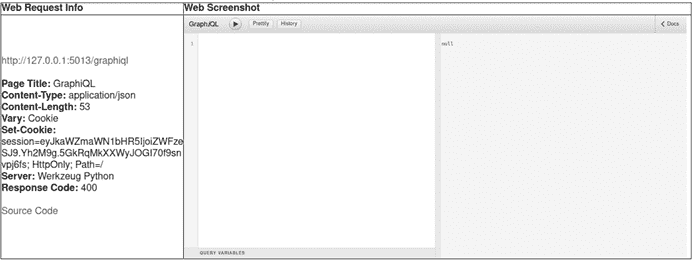
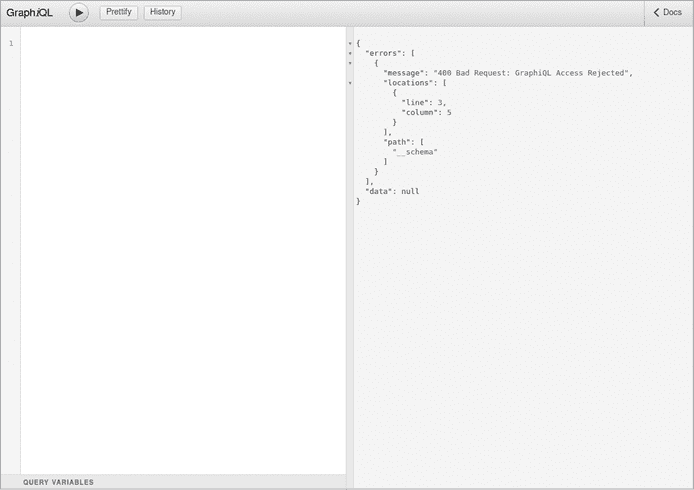
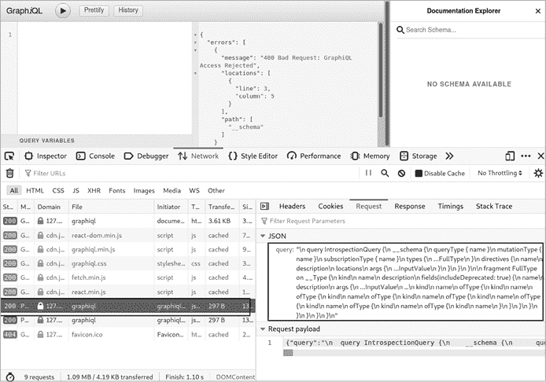
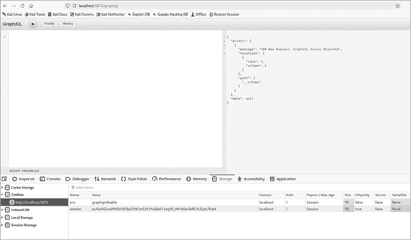
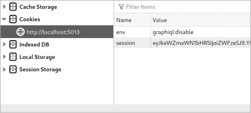

# 侦察


所有的安全测试都从*侦察阶段*开始。在这个阶段，我们尽可能多地收集目标的信息。这些信息将帮助我们做出有根据的决策，选择攻击应用程序的方式，从而提高成功的机会。

你可能会问，GraphQL 只是一个 API 层，究竟有什么需要了解的呢？你将会了解到，通过实验和使用专门的工具，我们可以收集大量关于 GraphQL API 背后运行的应用程序的信息，甚至是 GraphQL 实现本身。尽管 GraphQL 查询结构在所有 GraphQL 实现中都是一致的，无论它们是用什么编程语言编写的，但你可能会看到在可用操作、字段、参数、指令、安全控制、对特殊构造查询的响应等方面的差异。

以下是我们在侦察阶段应努力回答的一些关键问题：Web 服务器是否有 GraphQL API？GraphQL 配置在哪个端点接收查询？GraphQL 实现是用什么语言编写的？目标服务器上运行的是哪种 GraphQL 实现？该实现是否已知存在某些漏洞？此 GraphQL 实现有哪些防御机制？该实现的默认配置设置有哪些？GraphQL 服务器是否有额外的安全防护层？能够回答这些问题将帮助我们制定更有针对性的攻击计划，发现防御中的漏洞。

## 检测 GraphQL

在渗透测试中检测 GraphQL 时，首先熟悉当前流行的 GraphQL 服务器实现非常重要。GraphQL 有许多用不同编程语言编写的实现，每种实现可能有不同的默认配置或已知的弱点。表 4-1 列出了几种 GraphQL 实现及其所用的编程语言。

表 4-1：GraphQL 服务器实现及其编程语言

| **服务器实现** | **语言** |
| --- | --- |
| Apollo | TypeScript |
| Graphene | Python |
| Yoga | TypeScript |
| Ariadne | Python |
| graphql-ruby | Ruby |
| graphql-php | PHP |
| graphql-go | Go |
| graphql-java | Java |
| Sangria | Scala |
| Juniper | Rust |
| HyperGraphQL | Java |
| Strawberry | Python |
| Tartiflette | Python |

这些是目前使用的一些最流行的实现方式，还有一些较为小众的实现，例如 Scala 的 Sangria、Rust 的 Juniper 和 Java 的 HyperGraphQL。本章稍后我们将讨论如何在渗透测试中区分它们。

GraphQL API 的检测可以通过多种方式进行：可以手动进行，如果网络上有多个主机，通常手动方式很难扩展；也可以自动进行，使用各种 Web 扫描工具。使用 Web 扫描工具的优势在于它们具有可扩展性。它们是多线程的，且通常能够读取外部文件作为程序输入，例如包含要扫描的主机名列表的文本文件。这些工具已经内置了检测 Web 界面的逻辑，并且通过使用脚本语言（如 Bash 或 Python），你可以程序化地将它们运行在数百个 IP 地址或子域上。在本章中，我们将使用流行的扫描工具，如 Nmap，以及 GraphQL 定向的扫描工具，如 Graphw00f，用于侦察。

### 常见端点

在第一章中，我们强调了 REST 和 GraphQL API 之间的一些区别。其中一个与侦察阶段相关的区别是，GraphQL API 端点通常是静态的，最常见的是 */graphql*。

然而，虽然 */graphql* 通常是默认的 GraphQL 端点，但 GraphQL 实现可以重新配置为使用完全不同的路径。在这种情况下，我们该如何检测它呢？一种方法是手动尝试几个常见的替代 GraphQL API 路径，例如版本化端点：

1.  */v1/graphql*

1.  */v2/graphql*

1.  */v3/graphql*

当应用程序需要支持多个版本的 API 时，通常会看到这些版本化的 API 端点，无论是为了向后兼容，还是为了引入新特性，并且不与客户仍在使用的稳定 API 版本发生冲突。

另一种找到 GraphQL 实现的方法是通过 IDE，如 GraphQL Playground 或 GraphiQL Explorer，我们在第一章中用它们来实验 GraphQL 查询。当启用这些界面时，它通常会使用一个额外的专用端点。这意味着 GraphQL 可能也存在于以下端点下：

1.  */graphiql*

1.  */playground*

如果这些端点恰好也进行了版本控制，它们的路径可能会添加版本号前缀，例如 */v1/graphiql*、*/v2/graphiql*、*/v1/playground*、*/v2/playground* 等等。

列表 4-1 显示了如何通过 Graphene（一种基于 Python 的 GraphQL 实现）暴露两个端点，一个用于 GraphQL，另一个用于 GraphiQL Explorer，GraphiQL Explorer 是内嵌在 Graphene 中的。

```
app.add_url_rule('/graphql', view_func=GraphQLView.as_view(
  'graphql',
  schema=schema
))

app.add_url_rule('/graphiql', view_func=GraphQLView.as_view(
  'graphiql',
  schema = schema,
  graphiql = True
))
```

列表 4-1：Graphene 的端点定义

Graphene 将 */graphql* 端点定义为其主要的 GraphQL 查询端点。然后，它将 */graphiql* 定义为 GraphiQL Explorer 查询的第二个端点。最后，它启用了 GraphiQL Explorer 界面。当客户端浏览到 */graphiql* 端点时，GraphQL 服务器将呈现 IDE 界面。

请记住，每个端点可能有不同的安全设置。例如，一个端点可能比另一个更严格。当你发现同一目标主机上有两个端点提供 GraphQL 查询时，你需要分别测试它们。

这里最重要的要点是，尽管 GraphQL 端点通常位于可预测的路径上，但开发者仍然可以根据需求自定义它，可能是为了隐藏它免受好奇眼睛的窥探，或者仅仅是为了符合内部应用程序部署标准。

### 常见响应

现在你对 GraphQL 通常接收查询的端点有了了解，下一步是学习 GraphQL API 如何响应数据包。GraphQL 在网络中相当容易识别。这在你执行零知识渗透测试或漏洞赏金猎杀时特别有用。

GraphQL 规范描述了查询响应结构应如何格式化。这使得 API 使用者在解析 GraphQL 响应时，能够预期到一个预定的格式。以下是来自 GraphQL 规范的摘录，描述了查询响应应该是什么样的：

> 如果操作是查询，则操作的结果是执行操作的顶级选择集与查询根操作类型的结果。
> 
> 执行查询操作时，可以提供一个初始值：
> 
> `ExecuteQuery(``query``,` `schema``,` `variableValues``,` `initialValue``)`
> 
> 1.  让 `queryType` 成为架构中的根 `Query` 类型。
> 1.  
> 1.  断言：`queryType` 是一个 `Object` 类型。
> 1.  
> 1.  让 `selectionSet` 成为查询中的顶级选择集。
> 1.  
> 1.  让 `data` 成为正常运行 `ExecuteSelectionSet(selectionSet, queryType, initialValue, variableValues)` 的结果（允许并行化）。
> 1.  
> 1.  让 `errors` 成为执行选择集时产生的任何字段错误。
> 1.  
> 1.  返回一个包含数据和错误的无序映射。

实际上，这意味着当 GraphQL API 有结果返回客户端查询时，它将返回一个 `data` JSON 字段。同时，当执行客户端查询时发生错误，它也会返回一个 `errors` JSON 字段。

提前知道这两条信息非常有价值。简单来说，我们现在有两个条件，响应必须满足这两个条件，才能确定它来自一个 GraphQL API：

1.  一个有效的查询响应应该 *始终* 填充 `data` 字段，包含查询响应信息。

1.  一个无效的查询响应应该 *始终* 填充 `errors` 字段，包含有关出错原因的信息。

现在我们可以将这些信息作为扫描和检测逻辑的一部分，自动发现网络上的 GraphQL 服务器。我们需要做的就是发送一个有效或格式错误的查询，并观察我们收到的响应。

让我们使用 HTTP POST 方法对 DVGA 执行一个简单的 GraphQL 查询，看看这些响应结构如何运作。打开 Altair GraphQL 客户端，确保地址栏设置了 *http://localhost:5013/graphql* 地址；然后在 Altair 的左侧面板中输入以下查询并运行：

```
**query {**
 **pastes {**
 **id**
 **}**
**}**
```

接下来，点击播放按钮将查询发送到 GraphQL 服务器。这应该返回 `pastes` 对象的 `id` 字段。你应该能够看到类似于以下输出的响应：

```
 "data": {
     "pastes": [
      {
 "id": "1"
      }
    ]
  }
```

如你所见，GraphQL 将查询响应作为 `data` JSON 字段的一部分返回，正如 GraphQL 规范中描述的那样。我们得到了查询中指定的 `pastes` 对象和 `id` 字段。如果你在实验中看到返回的 `id` 字符串与此处显示的不同，不用担心；这是预期的结果。

现在，让我们运行另一个查询，探索当发送无效查询到 GraphQL 时会发生什么。这将展示当 GraphQL 在查询执行过程中遇到问题时，`errors` JSON 字段会被 GraphQL 服务器返回。以下查询是格式错误的，GraphQL 无法处理它。请在 Altair 中运行该查询并观察响应：

```
**query {**
 **badfield {**
 **id**
 **}**
**}**
```

请注意，我们指定了一个名为 `badfield` 的顶级字段。由于该字段不存在，GraphQL 服务器无法完成查询。GraphQL 响应如下所示：

```
{
   "errors": [
    {
       "message": "Cannot query field \"badfield\" on type \"Query\".",
      "locations": [
        {
          "line": 2,
          "column": 3
        }
      ]
    },
  ]
}
```

如你所见，GraphQL 服务器无法成功处理我们的查询。它返回一个包含 `errors` JSON 字段的响应。`message` JSON 字段告诉我们服务器无法查询名为 `badfield` 的字段，因为该字段在 GraphQL 模式中不存在。

### Nmap 扫描

假设你需要对包含数千个主机的网络进行渗透测试；手动浏览每个主机，找出可能提供有趣内容的主机，如 API 或易受攻击的商业应用程序，会非常困难。在这种情况下，渗透测试人员通常使用 Web 应用扫描器或自定义脚本来自动从主机获取信息。例如，像 `<title>` 超文本标记语言（HTML）标签、整个 `<body>` 标签，甚至 `server` HTTP 响应头等信息，都可能暗示远程服务器正在运行的特定应用程序。

需要注意的是，网络应用程序不一定总是具有用户界面，这意味着它们可能不会提供与应用程序相关的任何 HTML 内容，甚至不会暴露 HTTP 头部信息供我们检测。它们通常作为独立的 API 服务器，仅通过指定的 API 提供数据。那么，在这种情况下，我们如何检测 GraphQL 呢？幸运的是，在某些条件下，如使用的 HTTP 方法或发送到服务器的有效负载，GraphQL API 通常会返回可预测的响应。清单 4-2 显示了当客户端发出 GET 请求时，GraphQL 返回的常见响应。

```
# curl -X GET http://localhost:5013/graphql

{"errors":[{"message":"Must provide query string."}]}
```

清单 4-2：HTTP GET 请求的 GraphQL 响应

字符串 `Must provide query string` 在 GraphQL 实现中经常使用，例如基于 Python 和 Node.js 的实现。（请记住，基于 GET 的查询通常不被 GraphQL 服务器支持。请放心：如果我们遇到这种情况，我们还有很多其他方法来检测 GraphQL。）

有了这些信息，我们现在可以自动化扫描并发现网络中可能存在的其他 GraphQL 服务器。列表 4-3 展示了如何使用 Nmap 配合 *http-grep* NSE 脚本来做到这一点，该脚本通过模式匹配在给定网页中查找关键词。

```
# nmap -p 5013 -sV --script=http-grep
**--script-args='match="Must provide query string",** ❶ **http-grep.url="/graphql"' localhost** ❷

PORT     STATE SERVICE VERSION
5013/tcp open  http    Werkzeug httpd
| http-grep:
|   (1) http://localhost:5013/graphql:
|       (1) User Pattern 1:
|       + Must provide query string
```

列表 4-3：使用 Nmap 的 *http-grep* 进行单词匹配的 GraphQL 响应

在 ❶ 处，我们为 *http-grep* 指定了一个名为 `match` 的脚本参数，值为 `Must` `provide` `query` `string`（我们从 GraphQL 响应中收到的消息）。在 ❷ 处，我们定义了另一个参数，名为 `http-grep.url`，值为 `/graphql`，指示 Nmap 在 Web 应用程序中搜索特定页面。底层，Nmap 将向 `localhost` 发出一个 HTTP GET 请求，并使用我们定义的参数字符串值作为搜索模式，在从 Web 服务器响应中提取的文本中进行查找。在其输出中，Nmap 显示在网页上找到了一个模式，并指示它找到匹配的字符串。

你可能已经注意到，我们向 Nmap 传递了一个特定的端口（`-p`）——即端口 `5013`。像任何 Web 服务器一样，GraphQL 服务器可以运行在任何端口上，但一些端口是相当常见的，比如 80–89、443、4000–4005、8443、8000 和 8080。我们建议尽可能扫描常见和不常见的端口范围。

### __typename 字段

到目前为止，我们已经准确知道在查询中要请求哪些字段，比如之前请求的 `pastes`，其选择集为 `id`。你可能会想，如果我们不知道 GraphQL API 上有哪些字段呢？如果没有这些信息，我们如何识别 GraphQL？幸运的是，有一种快速的方法可以查询 GraphQL 并返回有效的响应，而无需了解应用程序的模式。

*元字段* 是 GraphQL API 向客户端暴露的内置字段。一个例子是 `__schema`（GraphQL 中的自省的一部分）。另一个元字段的例子是 `__typename`。当使用时，它返回正在查询的对象类型的名称。列表 4-4 显示了一个使用此元字段的查询。

```
query {
  pastes {
    __typename
  }
}
```

列表 4-4：带有 `__typename` 元字段的 GraphQL 查询

当你使用 Altair 运行这个查询时，返回的结果将是 `pastes` 对象类型的名称：

```
 "data": {
    "pastes": [
      {
        "__typename": "PasteObject"
      }
    ]
  }
```

如你所见，GraphQL 告诉我们 `pastes` 对象的类型名称是 `PasteObject`。这里的真正技巧是，`__typename` 元字段也可以用于查询根类型，如 列表 4-5 所示。

```
query {
  __typename
}
```

列表 4-5：与查询根类型一起使用的 GraphQL 元字段

此查询使用 `__typename` 来描述查询根类型，并且几乎适用于任何 GraphQL 实现，因为 `__typename` 是官方规范的一部分。

当您尝试从命令行查询 GraphQL 时，GraphQL 服务器期望某种请求结构。对于 HTTP GET 类型的查询，请求应包含以下 HTTP 查询参数：

+   `query` 用于 GraphQL 查询（必选参数）。

+   `operationName` 用于操作名称，当多个查询被发送到单个文档时使用。该参数告诉 GraphQL 服务器在有多个操作时执行哪个特定操作（可选参数）。

+   `variables` 用于查询变量（可选参数）。

对于 HTTP POST 类型的查询，相同的参数应通过 HTTP 请求体以 JSON 格式传递。

当 GraphQL 服务器使用 GET 接受查询时，可以通过简写语法传递 `query` 参数和 GraphQL 查询（在此案例中是查询 `{__typename}`）。考虑到这一点，我们可以使用 Nmap 很容易地自动化 GraphQL 检测。Listing 4-6 显示了如何使用 Nmap 运行 `__typename` 查询。

```
# nmap -p 5013 -sV --script=http-grep --script-args='match="__typename",
**http-grep.url="/graphql?query=\{__typename\}"' localhost**

PORT     STATE SERVICE VERSION
5013/tcp open  http    Werkzeug httpd
| http-grep:
|   (1) http://localhost:5013/graphql?query=\{__typename\}:
|     (1) User Pattern 1:
|_      + __typename
```

Listing 4-6：使用基于 GET 的查询通过 Nmap 检测 GraphQL

在此示例中，Nmap 脚本 *http-grep* 在后台使用 GET 方法执行其工作。

如果您有多个主机需要扫描，您可能希望利用 Nmap 的 `-iL` 标志指向一个包含主机名列表的文件，如 Listing 4-7 所示。

```
# nmap -p 5013 -iL hosts.txt -sV --script=http-grep
**--script-args='match="__typename", http-grep.url="/graphql?query=\{__typename\}"'**
```

Listing 4-7：使用 Nmap 扫描文件中定义的多个目标

本示例中的 *hosts.txt* 文件将包含单独列出的 IP 地址或域名系统（DNS）主机名。

如果 GraphQL 服务器不支持基于 GET 的查询，我们可以使用 cURL 和 `__typename` 字段通过 POST 请求来检测 GraphQL，如 Listing 4-8 所示。

```
# curl -X POST http://localhost:5013/graphql -d '{"query":"{__typename }"}'
**-H "Content-Type: application/json"**
```

Listing 4-8：使用 cURL 发送基于 POST 的查询

要在主机列表上使用此检测方法，可以使用 Bash 脚本，如 Listing 4-9 所示。

```
# for host in $(cat hosts.txt); do
 **curl -X POST "$host" -d '{"query":"{__typename }"}' -H "Content-Type: application/json"**
**done**
```

Listing 4-9：使用 cURL 自动化基于 POST 的 GraphQL 检测的 Bash 脚本

本示例中的 *hosts.txt* 文件将包含每行一个的完整目标 URL 列表（包括它们的协议方案、域名、端口和端点）。

### Graphw00f

在第二章中，我们简要讨论了 Graphw00f，这是一种基于 Python 的 GraphQL 工具，用于检测 GraphQL 并执行实现级指纹识别。在本节中，我们将使用它来在实验室中检测 DVGA，并带您了解它如何实现检测。

我们在本章早些时候提到，默认情况下，GraphQL 服务器位于 */graphql* 端点。当情况不是这样时，我们可能需要一种自动化方式来遍历已知端点，以便找出查询从何处提供。Graphw00f 允许你在扫描时指定自定义的端点列表。如果你没有提供列表，Graphw00f 会在检测 GraphQL 时使用其硬编码的常见端点列表，如 列表 4-10 所示。

```
def possible_graphql_paths():
    return [
        '/graphql',
  `--snip--`
        '/console',
        '/playground',
        '/gql',
        '/query',
 `--snip--`
    ]
```

列表 4-10：Graphw00f 源代码中的常见 GraphQL 端点列表

要查看 Graphw00f 的实际操作，打开终端并执行 列表 4-11 中的命令。我们使用命令行参数 `-t`（目标）和 `-d`（检测）。在这种情况下，`-t` 标志表示远程 URL *http://localhost:5013*，而 `-d` 标志会开启检测模式，指示 Graphw00f 对目标 URL 执行 GraphQL 检测。如果你对 Graphw00f 的参数有疑问，可以使用 `-h` 标志查看更多选项。

```
# cd ~/graphw00f
# python3 main.py -d -t http://localhost:5013

                      graphw00f
          The fingerprinting tool for GraphQL

 [*] Checking http://localhost:5013/
 [*] Checking http://localhost:5013/graphql
 [!] Found GraphQL at http://localhost:5013/graphql
```

列表 4-11：使用 Graphw00f 检测 GraphQL

在检测模式下运行时，Graphw00f 会遍历各种网页路径。它检查主网页根文件夹和*/graphql*文件夹中是否存在 GraphQL。然后，根据我们之前讨论的 HTTP 响应启发式，它会向我们发出信号，表示在*/graphql*文件夹下找到了 GraphQL。

要使用你自己的端点列表，你可以传递 `-w`（词汇表）标志，并将其指向一个包含你端点的文件，如 列表 4-12 所示。

```
# cat wordlist.txt

/app/graphql
/dev/graphql
/v5/graphql

# python3 main.py -d -t http://localhost:5013 -w wordlist.txt

[*] Checking http://localhost:5013/app/graphql
[*] Checking http://localhost:5013/dev/graphql
[*] Checking http://localhost:5013/v5/graphql
```

列表 4-12：使用自定义端点列表与 Graphw00f

## 检测 GraphiQL Explorer 和 GraphQL Playground

GraphiQL Explorer 和 GraphQL Playground IDE 是使用 JavaScript 库 React 构建的。然而，在执行侦察时，我们通常依赖于无法渲染包含 JavaScript 的网页的工具，如命令行 HTTP 客户端（如 cURL）或网络应用扫描器（如 Nikto）。在这个过程中，我们可能会错过一些有趣的网页界面。

通常，你会发现寻找网络上可用的任何网页界面的迹象是有益的，比如管理、调试或配置面板，所有这些都是黑客攻击的理想目标。这些面板往往数据丰富，且常常成为转向其他网络或提升权限的途径。它们也通常不像公开面对外部的应用程序那样经过加固。公司通常认为外部空间（互联网）的风险高于内部空间（公司网络）。因此，他们通常会通过积极的补丁策略、配置审查和频繁的漏洞扫描来保护公开面对外部的服务器和应用程序。不幸的是，内部应用程序很少得到相同的保护，这使得它们成为黑客攻击的更容易目标。

扫描图形网页界面的一个有趣且常被忽视的技巧是使用诸如无头浏览器之类的工具。*无头浏览器*是功能完整的命令行网页浏览器，用户可以对其进行编程以执行各种任务，例如获取页面内容、提交表单或模拟网页上的真实用户行为。例如，当您需要渲染包含 JavaScript 代码的网页时，无头浏览器 Selenium 和 PhantomJS 非常有用。

有一个特别的安全工具已经结合了无头浏览器来解决这一空白：*EyeWitness*。这个网页扫描器通过利用背后的 Selenium 无头浏览器驱动引擎，能够拍摄网页的截图。然后，EyeWitness 生成一个漂亮的报告，并附上页面的屏幕截图。

### 使用 EyeWitness 扫描图形界面

由于这两个 GraphQL IDE 使用 JavaScript 代码，我们需要一个强大的扫描工具来帮助我们在执行全网扫描时识别它们。我们可以使用 EyeWitness 来识别这些图形界面。

EyeWitness 提供了许多选项来定制其扫描行为，您可以通过使用`-h`选项运行工具来查看这些选项。为了检测 GraphQL IDE 面板，我们将使用`--web`选项，它将尝试使用无头浏览器引擎捕获扫描站点的屏幕截图，同时结合`--single`选项，当您只需要扫描单个目标 URL 时，这个选项非常适用。然后，我们将使用`-d`标志告诉 EyeWitness 报告应存储在哪个文件夹中（在本例中为*dvga-report*文件夹）。列表 4-13 将所有步骤结合在一起。

```
# eyewitness --web --single http://localhost:5013/graphiql -d dvga-report

Attempting to screenshot http://localhost:5013/graphiql

 [*] Done! Report written in the dvga-report folder!
 Would you like to open the report now? [Y/n]
```

列表 4-13：EyeWitness 的运行时输出

在输出中，EyeWitness 表示它已将收集到的网页源文件保存在*dvga-report*文件夹中，并询问我们是否要打开报告。按 Y 和 ENTER 键以打开一个网页浏览器，显示包含扫描期间拍摄的截图的 HTML 报告。图 4-1 展示了报告。



图 4-1：EyeWitness 生成的 HTML 报告

此外，*dvga-report*将包含几个文件夹，如下所示：

```
# ls -l dvga-report/
total 112
-rw-r--r-- 1 kali kali 95957 Dec 15 15:19 jquery.min.js
-rw-r--r-- 1 kali kali  2356 Feb 11 15:10 report.html
drwxr-xr-x 2 kali kali  4096 Feb 11 15:09 screens
drwxr-xr-x 2 kali kali  4096 Feb 11 15:09 source
-rw-r--r-- 1 kali kali   684 Feb 11 15:09 style.css
```

*report.html*文件包含有关目标的信息，例如它返回给客户端的 HTTP 响应头，目标上运行的应用程序的屏幕截图，以及指向网页源代码的链接。虽然您可以通过 EyeWitness 拍摄的屏幕截图来直观地识别 GraphiQL IDE，但您也可以通过搜索*source*文件夹中的源代码文件来确认您的发现。运行列表 4-14 中的命令，搜索源代码中是否有 GraphiQL Explorer 或 GraphQL Playground 的字符串。

```
# grep -Hnio "graphiql|graphql-playground" dvga-report/source/*
source/http.localhost.5013.graphiql.txt:18:graphiql
source/http.localhost.5013.graphiql.txt:18:graphiql
source/http.localhost.5013.graphiql.txt:18:graphiql
```

列表 4-14：网页源代码中的关键字匹配

让我们分解这个命令，解释一下这里发生了什么。我们通过传递 `i` 标志运行一个不区分大小写的 `grep` 搜索，以查找 *source* 文件夹中任何包含 *graphql* 或 *graphql-playground* 的实例。使用 `-H` 标志，我们告诉 `grep` 打印包含任何匹配模式的文件名。`-n` 标志表示匹配所在的行号（在此例中为 18）。`-o` 标志只打印匹配行中产生正面结果的部分。如你所见，搜索在第 18 行找到了多个 *graphiql* 字符串实例。

EyeWitness 可以针对一组 URL 运行与单个 URL 相同类型的扫描，方法是使用 `-f`（文件）标志。当使用这个标志时，EyeWitness 会期望一个包含目标 URL 列表的文本文件进行扫描。Listing 4-15 展示了如何将单个 URL (*http://localhost:5013/graphiql*) 写入文本文件 (*urls.txt*)，并将其作为自定义 URL 列表传递给 EyeWitness。

```
# echo 'http://localhost:5013/graphiql' > urls.txt
# eyewitness --web -f urls.txt -d dvga-report

Starting Web Requests (1 Hosts)
Attempting to screenshot http://localhost:5013/graphiql
Finished in 8 seconds

[*] Done! Report written in the dvga-report folder!
```

Listing 4-15：使用 EyeWitness 扫描多个 URL

EyeWitness 会遍历文件中指定的 URL，扫描它们，并将其输出保存在 *dvga-report* 文件夹中，供进一步检查。

在这个例子中，我们使用了一个只包含单个 URL 的文件。通常，你可能想要搜索除 */graphql* 端点之外的任何其他网页路径，以检查 GraphQL 是否位于一个替代的位置，尤其是那些不太显眼的地方。你可以通过多种方式创建一个 URL 列表，并与 EyeWitness 一起使用。第一个选项是使用在第 73 页 “常见端点” 中提到的常见 GraphQL 端点列表。

或者，可以使用 Kali 自带的目录词表，位于 */usr/share/wordlists*。其中一个例子是 *dirbuster* 词表。EyeWitness 需要完整的 URL，而这个词表只包含网页路径，因此我们首先需要使用 Bash 脚本对其进行格式化，如 Listing 4-16 所示。

```
# for i in $(cat /usr/share/wordlists/dirbuster/directory-list-2.3-small.txt);
**do echo http://localhost:5013/$i >> urls.txt; done**

# cat urls.txt

http://localhost:5013/api
http://localhost:5013/apis
http://localhost:5013/apidocs
http://localhost:5013/apilist
```

Listing 4-16：使用 Bash 和目录词表构建 URL 列表

这个 Bash `for` 循环确保了词表 *directory-list-2.3-small.txt* 中的目录被附加到我们的目标主机 (*http://localhost:5013*)，以便 EyeWitness 在扫描中使用它们。剩下的就是用我们新的词表文件 *urls.txt* 运行 EyeWitness。

### 使用图形化客户端尝试查询

在渗透测试中发现 GraphiQL Explorer 或 GraphQL Playground 并不意味着 GraphQL API 本身允许你进行未经授权的查询。因为 GraphiQL Explorer 和 GraphQL Playground 只是 GraphQL API 的前端界面，它们实际上是与 GraphQL 服务器交互的 HTTP 客户端。

在某些情况下，这些图形化界面可能由于多种原因无法查询 API。GraphQL API 中可能会实现身份验证或授权层，阻止未授权的查询。API 还可能会基于客户端属性（如地理位置或基于 IP 地址的允许列表）限制查询。客户端的某些防护措施也可能会阻止客户端通过 GraphiQL Explorer 或 GraphQL Playground 运行查询。

为了确认我们能够使用接口查询 GraphQL 服务器，我们需要发送某种形式的未经认证的 GraphQL 查询。该查询必须是能够在任何 GraphQL API 上工作的查询。可以将这个查询视为确认远程 GraphQL API 是否接受来自客户端的未经认证的查询。我们可以称之为 *金丝雀* *GraphQL 查询*。

在你的实验室机器上打开 Firefox 浏览器并访问 ***http://localhost:5013/*** 以访问 DVGA。你应该能看到 DVGA 的主页。接下来，浏览到我们之前发现的 GraphiQL Explorer 面板，地址是 *http://localhost:5013/graphiql*。你会注意到我们立即收到一个错误，表示我们的访问被拒绝，错误信息为 `400` `Bad` `Request:` `GraphiQL` `Access` `Rejected`，如 图 4-2 所示。



图 4-2：GraphiQL Explorer 拒绝客户端访问

作为黑客，查看事物在后台是如何运作的非常重要。点击窗口右上角的 **Docs** 按钮。你应该看到一个错误信息，`No Schema Available`。这个错误意味着 GraphiQL Explorer 无法从 API 获取到 schema 信息。因为 GraphiQL Explorer 会在每次页面加载时自动向 GraphQL API 发送 introspection 查询，以便用 schema 信息填充文档部分，它依赖于这些文档的可用性。

你可以通过使用 Firefox 的开发者工具来查看这一行为。按下 SHIFT-F9 或右键点击网页上的任意位置，选择 **检查元素** 来打开开发者工具控制台。点击 **Network** 选项卡；然后按 F5 重新加载页面。

你应该能看到一条发送到 */graphiql* 端点的 POST 请求。图 4-3 显示了这个 introspection 查询。



图 4-3：Firefox 开发者工具中显示的 GraphiQL Explorer introspection 查询

如果 introspection 查询成功发送，是什么原因拒绝了我们对 GraphiQL Explorer 的访问呢？让我们继续在 Firefox 开发者工具中寻找线索。点击 **Storage** 选项卡，如 图 4-4 所示。



图 4-4：Firefox 开发者工具中的 Storage 选项卡

存储选项卡向我们展示了由应用程序设置的 HTTP cookies，并允许我们访问浏览器的本地存储和会话存储。在左侧窗格中，点击 **Cookies** 下拉菜单，选择 **http://localhost:5013** 以查看该域的具体 cookies，如 图 4-5 所示。



图 4-5：HTTP Cookies

你会注意到，在右侧窗格中，我们的 HTTP cookies 中设置了两个键：`env` 和 `session`。特别是 `env` 键很有趣，因为它似乎将字符串 `graphiql:disable` 设置为其值。作为黑客，这应该引起你的警觉。这个 cookie 值是否可能是导致 GraphiQL Explorer 拒绝访问的原因？我们可以通过篡改其值来验证这一点。

双击文本 `graphiql:disable`，这样你就可以修改它；然后只需删除 `disable` 并将其替换为 `enable`。接下来，刷新网页。你会注意到，我们不再在 GraphiQL Explorer 中看到拒绝信息。为了确认篡改 cookie 是否有效，尝试运行一个 GraphQL 查询。你应该能够从 GraphQL API 获得响应！这是一个弱客户端安全控制的例子，容易被绕过。

开发人员通常以客户端值得信任为前提来创建 Web 应用程序，但并非每个人都会遵守规则。那些试图寻找漏洞的攻击者会篡改应用程序并尝试绕过任何防护措施。重要的是要记住，攻击者能够直接控制的任何东西都有可能被绕过。然而，在客户端实施的控制措施并不少见；你可能会发现应用程序仅在客户端实现了输入验证或文件上传验证。这些措施往往可以被绕过。在第七章中，你将学习如何击败 GraphQL 的授权和认证机制。

## 使用自省查询 GraphQL

自省是 GraphQL 的关键功能之一，它提供了有关 GraphQL 架构所支持的各种类型和字段的信息。自文档化的 API 对于任何需要使用它的人来说都非常有用，比如第三方企业或其他客户端。

作为黑客，当我们遇到一个 GraphQL 应用时，我们最想测试的事情之一就是它的自省机制是否启用。许多 GraphQL 实现默认启用自省。有些实现可能提供禁用自省的选项，但其他实现则可能没有。例如，Python 的 GraphQL 实现 Graphene 没有提供禁用自省的选项。要禁用自省，消费者必须深入代码，找到阻止自省查询被处理的方法。另一方面，GraphQL 的 PHP 实现 graphql-php 默认启用自省，但也记录了如何完全禁用此功能。表格 4-2 展示了部分流行的 GraphQL 服务器实现中自省的状态。

表格 4-2：GraphQL 实现中自省的状态

| **语言** | **实现** | **自省配置** | **禁用自省选项** |
| --- | --- | --- | --- |
| Python | Graphene | 默认启用 | 不可用 |
| Python | Ariadne | 默认启用 | 可用 |
| PHP | graphql-php | 默认启用 | 可用 |
| Go | graphql-go | 默认启用 | 不可用 |
| Ruby | graphql-ruby | 默认启用 | 可用 |
| Java | graphql-java | 默认启用 | 不可用 |

任何直接影响安全的默认设置对黑客来说都是好消息。应用程序维护者很少会更改这些默认设置。（有些维护者甚至可能不知道这些设置。）在表格 4-2 中，你可以看到，在一些情况下——如 graphql-go、graphql-java 和 Graphene——自省只能在应用程序维护者自己将解决方案编码到 GraphQL API 中时禁用；没有官方的、经过厂商验证的解决方案来禁用它。

尽管对此问题的看法各异，尤其是在安全圈中，但在 GraphQL 中，自省通常被认为是一项功能，而不是一个漏洞。采用 GraphQL 的公司可能会选择保持其启用，而其他公司则可能会禁用它，以避免泄露可能被用来进行攻击的信息。如果没有外部消费者与 GraphQL API 集成，开发人员可能会选择完全禁用自省，而不影响正常的应用程序流程。

根据你的目标，自省查询的响应可能会相当大。此外，如果你正在攻击一个具有成熟安全程序的目标，这些查询可能会被监控，防止来自不可信客户端的任何尝试，例如来自新地理位置或新 IP 地址的请求。

要通过使用我们的漏洞服务器实验自省查询，请在你的实验室中打开 Altair 客户端，并确保地址栏设置为*http://localhost:5013/graphql*。接下来，输入在列表 4-17 中显示的自省查询，并在 Altair 中执行它。

```
**query {**
 **__schema {**
 **types {**
 **name**
 **}**
 **}**
**}**
```

列表 4-17：最简单形式的自省查询

该查询使用了元字段`__schema`，这是 GraphQL 模式反射系统的类型名称。然后它请求所有在 GraphQL 服务器中可用的`types`的`name`。以下输出显示了服务器对该查询的响应：

```
{
  "data": {
    "__schema": {
      "types": [
`--snip--`
        {
          "name": "PasteObject"
        },
        {
          "name": "CreatePaste"
        },
        {
          "name": "DeletePaste"
        },
        {
          "name": "UploadPaste"
        },
        {
          "name": "ImportPaste"
        },
`--snip--`
      ]
    }
  }
}
```

虽然我们收到了有效的响应，但当前形式的查询仅提供了 API 功能的部分视图。响应中缺少关键信息，例如查询和变更的名称、允许客户端传递参数的查询信息、参数的数据类型（例如标量类型如`String` ``` and `Boolean``), and so on. These are important, because queries that accept arguments could be prone to vulnerabilities, such as injections, server-side request forgeries, and so on.` ```）。

````` ````We can craft a more specialized introspection query that would give us more data about the target application’s schema. A useful introspection query is one that will give us information on the entry points into the application, such as queries, mutations, subscriptions, and the type of data that can be injected into them. Consider the introspection query shown in Listing 4-18.    ``` query IntrospectionQuery {    __schema {   ❶ queryType { name }     mutationType { name }     subscriptionType { name }   ❷ types {       kind       name     ❸ fields {        name         ❹ args {           name         }       }     }   } } ```    Listing 4-18: A more useful introspection query    The introspection query in Listing 4-18 gives us a bit more insight into the API. At ❶ we get the `name` of all queries (`queryType`), mutations (`mutationType`), and subscriptions (`subscriptionType`) available in the GraphQL API. These names are typically self-explanatory, to make it easier for clients to use the API, so knowing these query names gives us an idea of the information we could receive.    At ❷ we get all the `types` in the schema, along with their `kind` (such as an object) and name (such as `PasteObject`). At ❸ we get the `fields` along with the `name` of each one, which will allow us to know the types of fields we can fetch when we use different GraphQL objects. Next, we get the arguments (`args`) of these fields along with their `name` ❹. Arguments could be any information the API is expecting the client to supply when it queries the API (typically, dynamic data). For example, when a client creates a new paste, it will supply an arbitrary `title` argument and a `content` argument containing the body of the paste, which might be a code snippet or other text.    In penetration tests, you may want to run an introspection query against an entire network, assuming a GraphQL server may be present. In this case, you would either need to write your own script or use the Nmap NSE script *graphql-introspection.nse* we installed in Chapter 2. This script is simple: it queries GraphQL by using the `__schema` meta-field to determine if it’s fetchable.    Say you have a list of IP addresses in a text file such as *hosts.txt*. Using Nmap’s `-iL` flag, you can tell Nmap to use it as its list of targets. Using the `--script` flag, you can then tell Nmap to run the *graphql-introspection* NSE script against any host that has port `5013` open (`-p` flag). The `-sV` flag performs a service and version scan. The command in Listing 4-19 shows how this is accomplished.    ``` # **nmap --script=graphql-introspection -iL hosts.txt -sV -p 5013**  PORT     STATE SERVICE VERSION 5013/tcp open  http    Ajenti http control panel | graphql-introspection: |   VULNERABLE: |   GraphQL Server allows Introspection queries at endpoint: |   Endpoint: /graphql is vulnerable to introspection queries! |     State: VULNERABLE |       Checks if GraphQL allows Introspection Queries. | |     References: |_      https://graphql.org/learn/introspection/ ```    Listing 4-19: A GraphQL introspection detection with the Nmap NSE    Using `nmap` to detect when introspection is enabled is just the first step. The next step is to extract all possible schema information by using a more robust query.    In the book’s GitHub repository, you can find a comprehensive introspection query that, when executed, will extract a lot of useful information about the target’s schema: [`github.com/dolevf/Black-Hat-GraphQL/blob/master/queries/introspection_query.txt`](https://github.com/dolevf/Black-Hat-GraphQL/blob/master/queries/introspection_query.txt). This query will return information such as queries, mutations, and subscriptions names, with the arguments they accept; names of objects and fields, along with their types; names and descriptions of GraphQL directives; and object relationships. If you run that query in Altair, the server should return a fairly large response, as shown in Figure 4-6.      Figure 4-6: An introspection in Altair      The response is large enough (containing approximately 2,000 lines) that it would be challenging for any human to go through it manually and make sense of it without investing a significant amount of time. This is where GraphQL visualizers such as *GraphQL Voyager* come in handy.    ### Visualizing Introspection with GraphQL Voyager    GraphQL Voyager, which can be found at either [`ivangoncharov.github.io/graphql-voyager`](https://ivangoncharov.github.io/graphql-voyager) or [`lab.blackhatgraphql.com:9000`](http://lab.blackhatgraphql.com:9000), is an open source tool that processes either introspection query responses or GraphQL SDL files and visualizes them, making it easy to identify the various queries, mutations, and subscriptions and the relationships between them.    The tool’s introspection query option is most suitable for scenarios such as black-box penetration tests, in which the application’s code base is not accessible to us. The SDL option is useful when we might have direct access to the GraphQL schema files, such as during a white-box penetration test in which the company provides us with full access to the source code.    Try visualizing the introspection query response you just received in Altair and importing it into GraphQL Voyager. Copy the response and then open your browser and navigate to GraphQL Voyager. Click the **Change Schema** button located at the top-left corner. Select the **Introspection** tab, paste in the response, and click the **Display** button. You should see a visualization similar to the one shown in Figure 4-7.      Figure 4-7: The schema view in Voyager      The visualization we receive from Voyager represents the queries, mutations, and subscriptions available in our target application and how they relate to the different objects and fields that exist in the schema.    Under Query, you can see that the application supports 12 queries. The arrows in the view represent the mapping between these queries and the schema objects. For example, when you use the `pastes` query, it will return an array of `[PasteObject]` objects, which is also the reason you’re seeing an arrow pointing to the `PasteObject` table. The `system` queries (update, diagnostics, debug, and health) are not tied to any other schema objects; they simply return a string whenever you use them.    You can also see that we have relationships (edges) between fields. For example, the `owner` field in the `PasteObject` object is linked to `OwnerObject`, and the `paste` field in `OwnerObject` is linked back to `PasteObject`. This circular condition could lead to DoS conditions, as you will learn in Chapter 5.    Now that we’ve experimented with visualizing an introspection response in Voyager, let’s do the same with SDL files. Voyager accepts SDL files and can process them just as well as it does introspection responses. To see this in action, click the **Change Schema** button located at the top-left corner in Voyager, select the **SDL** tab, and paste in the SDL file located at [`github.com/dolevf/Black-Hat-GraphQL/blob/master/ch04/sdl.graphql`](https://github.com/dolevf/Black-Hat-GraphQL/blob/master/ch04/sdl.graphql). Then click the **Display** button. You should see a similar visualization to the one generated in the Introspection tab.    ### Generating Introspection Documentation with SpectaQL    *SpectaQL* ([`github.com/anvilco/spectaql`](https://github.com/anvilco/spectaql)) is an open source project that allows you to generate static documentation based on an SDL file. The document that gets generated will include information about how to construct queries, mutations, and subscriptions; the different types; and their fields. We’ve hosted an example SpectaQL-generated schema of DVGA at [`lab.blackhatgraphql.com:9001`](http://lab.blackhatgraphql.com:9001) so you can see how SpectaQL looks when it’s functional.    ### Exploring Disabled Introspection    At some point, you’ll probably encounter a GraphQL API that has introspection disabled. To see what this looks like, let’s use one of the neat features of our vulnerable GraphQL server: turning on its hardened mode.    The DVGA works in two modes, a Beginner mode and an Expert (hardened) mode. Both versions are vulnerable; the only difference is that the Expert mode has a few security mechanisms to protect the application from any dangerous queries.    To change the application’s mode, open the Altair client and ensure that the address points to *http://localhost:5013/graphql*. In the left sidebar, click the Set Headers icon, which looks like a small sun symbol. Set **Header Key** to **X-DVGA-MODE** and set **Header Value** to **Expert**. This HTTP header set instructs DVGA to perform security checks on any incoming queries that include the headers as part of the request. Alternatively, you can toggle on Expert mode from within DVGA’s web interface by using the drop-down menu located at the top-right corner (the cubes icon).    Now attempt a simple introspection query using Altair:    ``` **query {**  **__schema {**  **__typename**  **}** **}** ```    You should see an error response indicating that introspection is disabled, causing the query to fail (Listing 4-20).    ``` {   "errors": [     {       "message": "400 Bad Request: Introspection is Disabled",       "locations": [         {           "line": 2,           "column": 7         }       ],       "path": [         "__schema"       ]     }   ],   "data": null } ```    Listing 4-20: An error returned when introspection is disabled    In cases like this one, you’ll need a plan B. In Chapter 6, you’ll learn how to discover information about the GraphQL application even if introspection data isn’t available.    ## Fingerprinting GraphQL    Earlier in this chapter, we highlighted the many GraphQL implementations available. How can we tell which one is running on the server we’re trying to hack? The answer is *server* *fingerprinting*, the operation of identifying information about the target’s running services and their versions. For example, a common and simple technique for fingerprinting web servers is to make an HTTP HEAD request using a tool like cURL and observe the HTTP response headers that are returned.    Once we know the specific technology and version running an application, we can perform a more accurate vulnerability assessment against the service. For example, we can look for publicly available exploits to run against the target’s version or read the software’s documentation to identify weaknesses.    Popular web servers such as Apache or Nginx are great examples of services that are easy to fingerprint, since both typically set the `server` HTTP response header when a client makes a request to them. Listing 4-21 shows an example of how the web server behind the Apache Software Foundation website identifies itself by using the `server` header:    ``` # **curl -I https://apache.org/**  HTTP/2 200 server: Apache vary: Accept-Encoding content-length: 73190 ```    Listing 4-21: The Apache web server fingerprinting using a HEAD request    As expected, the Apache Software Foundation’s website is, in fact, running on the Apache web server. (It would have been a little odd if this were not the case!)    Fingerprinting services in a penetration test won’t always be this easy; sometimes accurate fingerprinting requires looking closely at the details, as not all software self-identifies, including GraphQL servers. The techniques used to fingerprint GraphQL implementations are relatively new in the security industry. We (the authors of this book) have developed several strategies for doing so, based on our research, and incorporated them into Graphw00f.    GraphQL fingerprinting relies on the observation of various discrepancies between implementations of GraphQL servers. Here are a few examples:    *   Inconsistencies in error messages *   Inconsistencies in response outputs to malformed GraphQL queries *   Inconsistencies in response outputs to properly structured queries *   Inconsistencies in response outputs to queries deviating from the GraphQL specification    Using all four of these factors, we can uniquely identify the implementation behind a GraphQL-backed application.    Let’s examine how two GraphQL server implementations respond to a malformed query. This query, shown in Listing 4-22, introduces an additional `y` character in the word `queryy`, which is not compliant with the GraphQL specification. We want to see how two GraphQL implementations respond to it. The first implementation is Sangria, a Scala-based GraphQL server.    ``` queryy {    __typename } ```    Listing 4-22: A malformed GraphQL query    Listing 4-23 shows Sangria’s response to the malformed query.    ``` {   "syntaxError": "Syntax error while parsing GraphQL query.   Invalid input \"queryy\", expected ExecutableDefinition or   TypeSystemDefinition (line 1, column 1):\nqueryy {\n^",   "locations": [     {       "line": 1,       "column": 1     }   ] } ```    Listing 4-23: Sangria’s response to the malformed query    The second implementation is HyperGraphQL, a Java-based GraphQL server. Listing 4-24 shows how it responds to the malformed query.    ``` {   "extensions": {},   "errors": [     {       "message": "Validation error of type InvalidSyntax: Invalid query syntax.",       "locations": [         {           "line": 0,           "column": 0,           "sourceName": null         }       ],       "description": "Invalid query syntax.",       "validationErrorType": "InvalidSyntax",       "queryPath": null,       "errorType": "ValidationError",       "extensions": null,       "path": null     }   ] } ```    Listing 4-24: HyperGraphQL’s response to the malformed query    As you can observe, the two responses are different in every possible way, and we can distinguish between these implementations based solely on their responses.    Next, we’ll attempt the same malformed query in our lab against the DVGA to see the kind of response we get. Open the Altair client and send the GraphQL query. You should see output similar to Figure 4-8.    As you can see, the output is different from both the Sangria and HyperGraphQL responses. This is because DVGA is based on Graphene, a Python GraphQL implementation.      Figure 4-8: Sending a malformed query with Altair      Running queries manually and analyzing the discrepancies between implementations doesn’t really scale well, which is why we built a server fingerprinting capability into Graphw00f. In the next section, we’ll use it for server fingerprinting purposes.    ### Detecting Servers with Graphw00f    Graphw00f is currently the only tool available for GraphQL server fingerprinting. It can detect many of the popular GraphQL server implementations and provide meaningful information whenever it successfully fingerprints a server.    In your lab, open the terminal emulator. If you enter the *graphw00f* directory and run `python3 main.py -l`, you’ll see that Graphw00f is capable of fingerprinting over 24 GraphQL implementations. This list comprises the majority of GraphQL targets currently in use.    Let’s use it to fingerprint the DVGA. We’ll run Graphw00f with the `-f` flag to enable fingerprint mode and the `-t` flag to specify the target (Listing 4-25). You could combine the `-f` flag with the `-d` flag (covered earlier in this chapter) if you wanted to detect GraphQL and fingerprint at the same time. Here, we’ll use the `-f` flag on its own, as we already know the path to GraphQL on the server.    ``` # **cd ~/graphw00f** # **python3 main.py -f -t http://localhost:5013/graphql**    [*] Checking if GraphQL is available at http://localhost:5013/graphql...   [!] Found GraphQL.   [*] Attempting to fingerprint...  [*] Discovered GraphQL Engine: (Graphene)   [!] Attack Surface Matrix: https://github.com/nicholasaleks   /graphql-threat-matrix/blob/master/implementations/graphene.md   [!] Technologies: Python   [!] Homepage: https://graphene-python.org   [*] Completed. ```    Listing 4-25: The fingerprinting of a GraphQL server    The tool first checks whether the target is, in fact, a GraphQL server. It does so by sending a few queries and inspecting their responses against its own database of signatures. As you can see, it is able to discover a GraphQL server running on Graphene and provides us with an attack surface matrix link. The *attack surface matrix* is essentially knowledge about the security posture of the various GraphQL implementations that Graphw00f can fingerprint. Graphw00f uses the GraphQL Threat Matrix we discussed in Chapter 3 as its implementation security posture database.    Since we now know that DVGA runs Graphene, we need to analyze Graphene’s weaknesses to determine which attacks we can run against this specific implementation. Some implementations have been around longer than others. Thus, they are more mature, stable, and offer more security features than others. This is why knowing the backend implementation is an advantage when we hack a GraphQL target.    ### Analyzing Results    Take a look at the attack surface threat matrix, which provides information about the implementation’s default behavior and the security controls available for it (for example, the settings that are enabled by default, the security controls that exist, and other useful features we can leverage for hacking purposes). Figure 4-9 shows the attack surface matrix for Graphene. You can also find it on GitHub at [`github.com/nicholasaleks/graphql-threat-matrix/blob/master/implementations/graphene.md`](https://github.com/nicholasaleks/graphql-threat-matrix/blob/master/implementations/graphene.md).      Figure 4-9: Graphene’s attack surface matrix      The table under Security Considerations shows various GraphQL features and whether they are available in Graphene. If they do exist, the table lists whether they are enabled or disabled by default. Some of the items in the table are security controls, while others are native GraphQL features:    *   *Field Suggestions* informs a client whenever they send a query with a spelling mistake and suggests alternative options. This can be leveraged for information disclosure. *   *Query Depth Limit* is a security control to prevent DoS attacks that may abuse conditions such as cyclical node relationships in schemas. *   *Query Cost Analysis* is a security control to prevent DoS attacks that stem from computationally complex queries. *   *Automatic Persisted Queries* is a caching mechanism. It allows the client to pass a hash representing a query as a way to save bandwidth and can be used as a security control with an allow list of safe queries. *   *Introspection* provides access to information about queries, mutations, subscriptions, fields, objects, and so on through the __`schema` meta-field. This can be abused to disclose information about the application’s schema. *   *Debug Mode* is a mode in GraphQL that provides additional information in the response for debugging purposes. This can potentially introduce information disclosure issues. *   *Batch Requests* is a feature that provides clients with the ability to send a sequence of queries in a single HTTP request. Batch queries are a great vector for DoS attacks.    In later chapters, you’ll learn how each of these features can make our hacking lives easier (or harder).    ## Summary    In this chapter, you learned the art of performing reconnaissance against GraphQL servers by using a variety of security tools. We discussed how to detect and fingerprint GraphQL servers deployed in standard and nonstandard locations, as well as how to find GraphQL IDE clients by using the EyeWitness security tool. We also visualized an introspection query and SDL files by using GraphQL Voyager to better understand queries, mutations, and object relationships.```` `````
