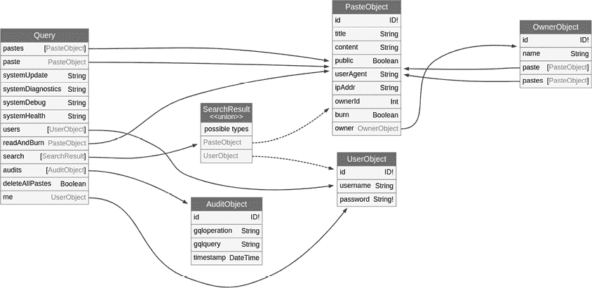
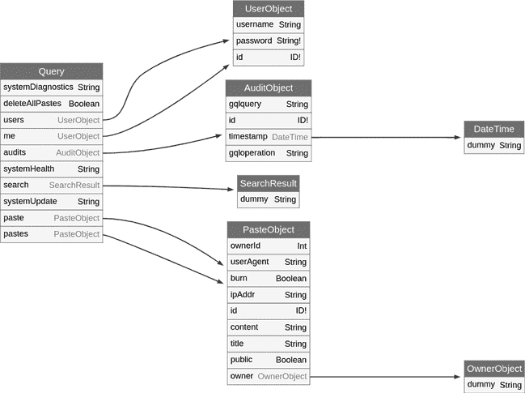
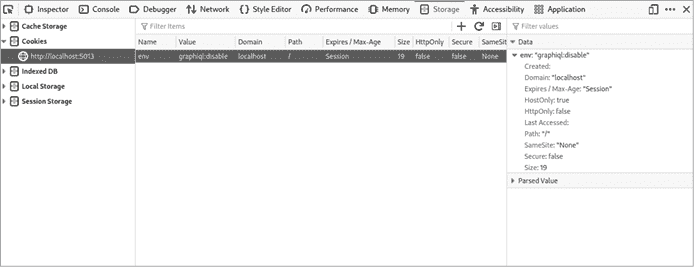

# 6

信息泄露


*信息泄露漏洞* 出现的原因是软件系统（如 API）将敏感信息泄露给未经授权的用户。与基于 REST 的应用程序类似，GraphQL 也无法避免这种问题。在本章中，我们将利用其内置功能深入了解应用程序及其保护的数据。

敏感数据泄露是对 API 的最具破坏性的攻击之一。严重的漏洞可能泄露各种信息给潜在攻击者，包括商业信息、知识产权、客户的个人身份信息（PII）等。即使是无意间泄露的技术信息，如应用程序源代码、操作系统版本和文件系统路径，也可能同样严重。这些泄露可能揭示出其他可供我们利用的攻击向量。

我们将探讨如何利用字段建议来提取和映射 GraphQL 模式，无论内省是否启用。你还将学习如何通过探测 GraphQL 错误消息、调试日志和应用程序堆栈跟踪来发现本地用户、操作系统、文件系统结构和应用程序详细信息。

在寻找有用信息时，请记住，漏洞往往是可以串联起来利用的。一个低危漏洞与另一个高危漏洞结合使用，可能会完全危害应用程序。尽可能多地收集目标的信息，并确保将其记录下来；你永远不知道什么时候它会派上用场。

## 识别 GraphQL 中的信息泄露向量

许多架构、技术和流程级别的错误可能导致信息泄露漏洞。常见的失败包括不正确或缺失的数据分类过程、敏感网络和应用程序中缺乏数据加密、以及关键功能缺乏访问管理控制。

另一个信息泄露攻击的重要原因是软件系统存储并向 API 消费者提供超过必要数据的情况。通常，当你检查由 API 支持的前端应用程序的响应时，你会发现它们返回了前端实际上并未使用的更多信息。这通常表明应用程序可能存在额外的信息泄露漏洞，也表明该应用程序在发布时缺乏充分的安全审查。

在 GraphQL 中，从应用程序中提取敏感信息的最有效方法之一是探索其模式，模式提供了关于应用程序数据结构和业务逻辑的上下文。实现这一点的最佳方法是使用 GraphQL 内省功能。大多数 GraphQL 实现默认启用了内省功能。

然而，在你的黑客冒险过程中，你可能会遇到禁用 introspection 的 GraphQL 实现。为了克服这一点，你可以进行字段填充攻击，并使用专门设计的自动化工具来滥用广泛采用的字段建议功能。你还可以通过主动探测 GraphQL 的调试、错误和堆栈跟踪日志来获得用户和操作级别的信息。我们将在本章中探讨这一切。

## 使用 InQL 自动化模式提取

在前几章中，我们使用 introspection 查询手动揭示 API 的可用查询和突变等信息。为了让我们的工作更加轻松，像 InQL（在第二章中安装）这样的工具可以帮助你自动提取模式。

InQL 使用一个非常类似于第四章中使用的 introspection 查询。从结果中，它生成一个模式文档，格式包括 HTML、JSON 和制表符分隔值（TSV）。你可以将这些文档与 GraphQL Voyager 等工具一起使用，进一步分析模式。

通过执行以下命令提取并分析 DVGA 的模式。`-t`（目标）标志指向 DVGA 的网络地址。我们使用 TSV 格式（`--generate-tsv`）生成报告：

```
#**inql -t http://localhost:5013/graphql --generate-tsv**

[+] Writing Introspection Schema JSON
[+] DONE
[+] Writing HTML Documentation
[+] DONE
[+] Writing query Templates
Writing systemUpdate query
```

InQL 将使用目标域的名称自动创建一个目录。如果你列出其内容，你应该能看到多个模式文件：

```
# **cd localhost:5013/**
# **ls**

endpoint_subscription.tsv
endpoint_query.tscv
endpoint_mutation.tsv
mutation
query
subscription
```

这些 TSV 文件是以制表符分隔的，便于查看 DVGA 中可用的查询。使用 `awk`，我们可以解析出查询名称：

```
# **awk '{print $1}' endpoint_query.tsv | tail -n +2**

audits
paste
readAndBurn
pastes
```

要查看各种查询支持哪些参数，你可以执行以下 `awk` 命令来解析制表符分隔的输出：

```
# **awk -F'\t' '{print $1, $2}' endpoint_query.tsv**

Operation Name Args Name
audits
paste id, title
readAndBurn id
pastes filter, limit, public
```

要查看突变或订阅相关的查询，只需使用相同的 `awk` 命令处理 *endpoint_mutation.tsv* 和 *endpoint_subscription.tsv* 文件。搜索 InQL 生成的文档中的查询、突变或订阅，以及它们的参数、类型和其他模式相关信息，对于你想要从命令行自动化某些任务（如模糊测试、暴力破解或查找敏感信息）非常有用。

## 克服禁用的 introspection

即使一个 GraphQL 实现默认启用 introspection，开发者也可能会禁用它，以避免向客户端暴露关于其模式的信息。这会使得理解如何与 API 交互变得更加困难，但正如你将很快看到的，完全不是不可能。我们可以使用多种技术和特制的查询，即使在禁用 introspection 的情况下，也能窥探应用程序模式的关键元素。

### 检测禁用的 introspection

在第四章中，我们讨论了如何使用 `__schema` 元数据字段来检测 introspection。如果禁用了 introspection，类似的查询应该返回一个错误。每个 GraphQL 实现会以不同的方式处理这个错误响应。例如，一些实现可能会返回 *400 错误请求* HTTP 响应代码而没有任何详细的错误信息，而其他实现可能会选择返回 *200 成功* 状态码，并附带如 `Introspection is Disabled` 的消息。通常，GraphQL 服务器倾向于返回 *200 成功* 响应，并在 `errors` 响应键中附带错误信息。

清单 6-1 是你在向 Apollo Server 发送 introspection 查询时可能遇到的错误信息，Apollo Server 是一个流行的 GraphQL 服务器实现。

```
{
  "errors": [
    {
      "message": "GraphQL introspection is not allowed by Apollo Server, but the
                  query contained __schema or __type. To enable introspection, pass
                  introspection: true to ApolloServer in production",
      "extensions": {
        "code": "GRAPHQL_VALIDATION_FAILED"
      }
    }
  ]
}
```

清单 6-1：来自 Apollo GraphQL 服务器的 `introspection` `is` `not` `allowed` 消息

在接下来的两个部分，我们将测试一些揭露技术，帮助我们绕过错误禁用的 introspection。

### 利用非生产环境

在一些应用程序中，开发环境和暂存环境的安全级别可能低于生产环境。即使在生产环境中禁用了 introspection，你也可能发现它在其他环境中是启用的，这有助于工程师构建、更新、测试和维护他们的 API。

通常，非生产环境托管在像 *staging* 或 *dev* 这样的子域名上。检查这些环境是否对我们开放，并查看是否有任何 GraphQL 服务可能启用了 introspection，是值得的。你可以在 [`github.com/dolevf/Black-Hat-GraphQL/blob/master/resources/non-production-graphql-urls.txt`](https://github.com/dolevf/Black-Hat-GraphQL/blob/master/resources/non-production-graphql-urls.txt) 找到潜在的 GraphQL 暂存和开发位置列表。

如果我们能够成功地在暂存和开发环境中运行 introspection 查询，我们可以将所学到的信息应用到生产环境中。通常，模式会是相似的。

### 利用 __type 元数据字段

当 GraphQL 实现想要阻止 introspection 查询执行时，通常会过滤掉包含 `__schema` 关键字的请求。然而，尽管大多数 introspection 查询利用了 `__schema` 元数据字段，客户端也可以使用其他几个 introspection 元数据字段。例如，`__type` 代表系统中的所有类型，可以用来从 GraphQL 模式中提取类型详情。

在 2022 年 5 月，我们发现了一个漏洞，涉及 Amazon Web Services（AWS）提供的 GraphQL 接口服务 AppSync。为了保护 AppSync 免受恶意客户端的攻击，AWS 在后台使用了 WAF。我们找到了一种绕过 WAF 并执行反射查询的方法。WAF 包含专门针对 GraphQL 应用程序的规则，其中之一会阻止通过`__schema`元字段对 GraphQL API 进行反射查询，但没有考虑其他反射元字段。

该规则本身以 JSON 格式定义如下：

```
{
  "Name": "BodyRule",
  "Priority": 5,
  "Action": {
    "Block": {}
  },
  "VisibilityConfig" {
    "SampledRequestsEnabled": true,
    "CloudWatchMetricsEnabled": true,
    "MetricName": "BodyRule"
  },
  "Statement": {
    "ByteMatchStatement": {
 **"FieldToMatch": {**
 **"Body": {}**
 **},**
 **"PositionalConstraint": "CONTAINS",**
 **"SearchString": "__schema",**
      "TextTransformation": [
        {
          "Type": "NONE",
          "Priority": 0
        }
      ]
    }
  }
}
```

使用字符串搜索（`SearchString`），WAF 规则会在任何传入的 HTTP 请求中查找`__schema`关键字，并阻止它们通过应用程序。因为规则使用`CONTAINS`作为位置约束（`PositionalConstraint`）并匹配 HTTP 的`Body`字段（`FieldToMatch`），所以在请求体中任何提到`__schema`的内容都会导致拒绝操作。

这个例子说明了，如果`__schema`反射检测查询被拒绝，我们可以使用另一个检测查询来评估反射是否真的被禁用。如果反射没有正确禁用，列表 6-2 中的`__type`反射检测查询将返回预定响应。这个查询请求模式中的根查询操作的`name`字段。尝试将它发送到你的本地 DVGA 实例。

```
**{**
 **__type(name:"Query") {**
 **name**
 **}**
**}**
```

列表 6-2：一个`__type`反射检测查询

因为我们知道查询操作的名称总是`Query`，所以响应应该与列表 6-3 中显示的完全相同。

```
{
  "data": {
    "__type": {
      "name": "**Query**"
    }
  }
}
```

列表 6-3：`__type`反射检测查询的预定响应

作为黑客，如果我们发现反射没有被正确禁用，我们可以扩展`__type`反射检测查询，填充潜在的自定义对象类型名称列表，并提取有价值的模式信息。我们将在第 150 页的“`__type`元字段中的类型填充”中讨论这种填充技术。

## 使用字段建议

许多 GraphQL 实现采用了一个流行的功能，字段建议，它会在客户端发送包含拼写错误的请求时激活。与大多数 REST API 不同，当 HTTP 查询格式错误时，GraphQL 不会返回*400 错误请求*的状态码，而是通过建议可能的修正来以更友好的方式响应。这一功能并不是 GraphQL 规范的一部分，但在当前大多数 GraphQL 服务器实现中普遍存在。

根据我们的经验，GraphQL 实现通常会返回三到五个建议。然而，并不是 GraphQL 请求的每个部分都会返回字段建议。例如，如果你在根查询操作中犯了拼写错误，GraphQL 实现不会尝试自动修正它。

让我们看一下字段建议响应是什么样的。假设我们向 DVGA 发送一个查询，尝试请求字段 `pastes` 的 `title`，但拼写错误为 `titlr`。在错误消息中，GraphQL 会通知客户端该字段无法查询，并建议一个架构中存在的字段：

```
{
  "errors": [
    {
      "message": "Cannot query field \"**titlr**\" on type \"PasteObject\".
       **Did you mean \"title\"?",**
      "locations": [
        {
          "line": 15,
          "column": 5
        }
      ]
    }
  ]
}
```

错误消息 `无法查询字段` . . . `你是想说` . . . `吗？` 是常见的。如果一个 GraphQL 服务器实现支持字段建议，你应该会看到类似的消息。

虽然大多数流行的 GraphQL 实现今天都提供字段建议，但并非所有实现都提供禁用此功能的选项。以下是如何在 Graphene 中禁用字段建议的示例，Graphene 是基于 Python 的 GraphQL 实现，DVGA 就是基于此实现的：

```
graphql.pyutils.did_you_mean.MAX_LENGTH = 0
```

在这个例子中，`MAX_LENGTH` 是查询中出现拼写错误时返回给客户端的建议数量。将 `MAX_LENGTH` 设置为 `0` 意味着不会返回任何建议，实际上是完全禁用该功能。

### 理解编辑距离算法

为了判断拼写错误是否与架构中的有效对象、字段或参数相似，GraphQL 实现依赖于简单的 *编辑距离算法*。理解编辑距离可以帮助我们优化暴力破解脚本，从字段建议中发现名称。

该匹配算法比较任意两个字符串，并根据将它们匹配所需的字符操作数量返回它们的相似度。向字符串中添加、替换或删除一个字符都算作一次操作。例如，要将错误的字段名 `titlr` 与正确的字段名 `title` 匹配，我们需要将 `r` 替换为 `e`，因此编辑距离为 `1`。表 6-1 显示了更多的字符串比较及其相应的编辑距离。

表 6-1：两个字符串之间的编辑距离

| **字符串** | **拼写错误** | **操作** | **编辑距离** |
| --- | --- | --- | --- |
| `title` | `titl` | 添加 `e` | 1 |
| `content` | `rntent` | 将 `r` 替换为 `c`，添加 `o` | 2 |

GraphQL 实现使用可变的编辑距离阈值，该阈值通过 列表 6-4 中所示的公式计算，以决定是否显示字段建议。这个例子直接取自 GraphQL 参考实现 GraphQL.js 的源代码。

```
const threshold = Math.floor(**input.length** * 0.4) + 1;
```

列表 6-4：来自 GraphQL.js 的编辑距离阈值代码片段

这段代码获取字符串的长度，将其乘以 0.4，然后使用 `Math.floor` 函数向下取整，并加上 1。例如，像 `content` 这样的七个字符的字符串，必须具有 `3` 或更少的编辑距离阈值，才能触发相关的字段建议。

### 优化字段建议的使用

单个拼写错误可能返回多个字段名。GraphQL 会返回所有可能匹配提供的拼写错误的字段。例如，以下查询请求从顶级字段 `pastes` 中请求拼错的 `owne` 字段（即 `owner`）：

```
query {
  pastes {
    **owne**
  }
}
```

这个单独的 `owne` 拼写错误在 `owner` 和 `ownerId` 字段的编辑距离阈值内。当这种情况发生时，GraphQL 实现不知道客户端想请求哪个字段，因此会同时返回两者：

```
{
  "errors": [
    {
      "message": "Cannot query field \"owne\" on type \"PasteObject\".
                  Did you mean \"owner\" or \"ownerId\"?",
      "locations": [
        {
          "line": 24,
          "column": 3
        }
      ]
    }
  ]
}
```

另一个有用的事实是，客户端在单个请求中发送的拼写错误数量没有限制。对于每个拼写错误，GraphQL 服务器将尝试提供一个自动更正建议。例如，在以下请求中，我们发送了一个带有多个字段的查询，所有这些字段都有拼写错误：

```
query {
  pastes {
 **tte**
 **tent**
 **bli**
 **urn**
  }
}
```

GraphQL 服务器会分析每个拼写错误，并返回在编辑距离阈值内的所有可能的字段建议列表。这种 GraphQL 响应行为允许进行大量信息收集：

```
{
  "errors": [
    {
      "message": "Cannot query field \"**tte**\" on type \"PasteObject\".
                  Did you mean \"**title**\"?",
`--snip--`
      ]
    },
    {
      "message": "Cannot query field \"**tent**\" on type \"PasteObject\".
                  Did you mean \"**content**\"?",
      "locations": [
`--snip--`
      ]
    },
    {
      "message": "Cannot query field \"**bli**\" on type \"PasteObject\".
                  Did you mean \"**public**\"?",
`--snip--`
      ]
 },
    {
      "message": "Cannot query field \"**urn**\" on type \"PasteObject\".
                  Did you mean \"**burn**\"?",
`--snip--`
      ]
    }
```

在第五章讨论的查询批处理可以通过在单个 HTTP 请求中批量处理多个请求来进一步优化此类攻击。

### 考虑安全发展

在撰写本文时，正在进行的安全开发可能会影响将来对字段建议的使用。2019 年 11 月 5 日，关于在 GraphQL 参考实现 GraphQL.js 中使用字段建议的 GitHub 问题已经提出。

该问题指出，攻击者可以通过发送无效的 GraphQL 文档来探测服务器的模式详细信息。它引用了一个名为 *didYouMean.ts* 的文件，该文件在几个验证规则中使用。这个文件可以在开发 API 时为开发人员提供有用的建议，但也可以用来泄漏信息。

对于该问题的回应，GraphQL 共同创始人李·拜伦评论如下：

> 我预期，一个禁用内省的模式也会禁用 didYouMean。我想不出你为什么会想要禁用内省，但启用 didYouMean，反之亦然。

在支持拜伦观点的评论线索之后，于 2022 年 1 月 28 日提出了一个拉取请求，以在禁用内省时禁用字段建议。如果合并，这个拉取请求将使得在禁用内省时滥用字段建议变得困难。

虽然这一变更对于 GraphQL 的安全性是一个积极的发展，但我们黑客应该考虑几个要点。首先，在问题首次提出后，社区花了两年多的时间才开发出潜在的解决方案。在像 GraphQL 这样的开源和社区驱动技术中，重要的安全问题不一定会很快得到修补。

其次，在 GraphQL 参考实现中解决了这个问题，但这个补丁可能需要一段时间才能在所有使用 GraphQL 的服务器实现和生产部署中广泛采用。

那么，如果 introspection 和字段建议都被禁用呢？我们该如何继续探索目标的模式？在接下来的章节中，我们将深入探讨另一种可能用于发现看似无害的 GraphQL 查询背后敏感信息的技术。

## 使用字段填充

*字段填充* 是一种 GraphQL 信息泄露技术，其中将一系列字段插入到 GraphQL 查询中。我们可以通过字段填充，尝试猜测并将这些潜在的字段名传入一个我们知道有效的查询请求，从而可能发现诸如密码、密钥和个人身份信息等敏感数据。

例如，假设我们通过使用 Burp Suite 拦截流量并观察正常用户操作的方式，捕获了以下查询。这是发现信息泄露漏洞的一个良好初步步骤。（第二章解释了如何使用 Burp Suite 拦截流量。）

```
query {
  user {
    name
  }
}
```

这样一个查询可能返回一些看似无害的内容，比如当前登录用户账户的 `name`。而且由于 introspection 被禁用，我们无法确定在这个 `user` 对象中是否有其他有价值的字段可供我们使用。

字段填充可能使我们绕过这一点。从本质上讲，这种技术利用了一个可能性，即 GraphQL 模式中的对象字段与数据库列等资源紧密映射。表 6-2 显示了一个可能代表我们用户表的 MySQL 数据库模式示例。

表 6-2：示例用户表 MySQL 数据库模式

| **MySQL 模式** | **GraphQL 类型和字段** |
| --- | --- |
| `id BIGINT(20)` | `User.id`（`Int`） |
| `name VARCHAR(50)` | `User.name`（`String`） |
| `mobile VARCHAR(50)` | `User.mobile`（`String`） |
| `email VARCHAR(50)` | `User.email`（`String`） |
| `password_hash VARCHAR(32)` | `User.password_hash`（`String`） |
| `registered_at DATETIME` | `User.registered_at`（自定义 `DATETIME` 标量类型或 `String`） |
| `last_login DATETIME` | `User.last_login`（自定义 `DATETIME` 标量类型或 `String`） |
| `intro TEXT` | `User.intro`（`String`） |
| `profile TEXT` | `User.profile`（`String`） |
| `api_key VARCHAR(50)` | `User.api_key`（`String`） |

为了表示整数和字符串，MySQL 使用诸如 `BIGINT` 和 `VARCHAR` 等数据类型，而 GraphQL 使用诸如 `Int` 和 `String` 的标量类型。MySQL 还内置了日期和时间等类型，使用 `DATETIME` 数据类型。在 GraphQL 中，我们可能需要使用自定义标量类型，例如 `DATETIME` 或 `String`。实际的日期时间表示将由应用程序的逻辑来序列化。

作为攻击者，我们显然无法事先了解数据库的模式，但我们可以通过推测这些额外的数据库列可能是什么，并开始将它们的字段名尝试插入查询中。以下是添加到我们`user`查询中的潜在字段名列表：

```
query {
  user {
    name
 **username**
 **address**
 **birthday**
 **age**
 **password**
 **sin**
 **ssn**
 **apiKey**
 **token**
 **emailAddress**
 **status**
  }
}
```

注意你尝试的字段名称的格式。SDL 文件中的字段和参数通常采用 *snake_case* 风格，即每个空格都被下划线（`_`）符号替换，并且每个单词的首字母小写。例如，API 密钥字段很可能会被定义为 `api_key`。然而，当以客户端身份查询 GraphQL API 时，这些字段和参数可能以 *camelCase* 显示，即多个单词组成的名称被连接为一个单词且不带标点符号，第一个字母小写（也称为 *lowerCamelCase*）。这是因为某些 GraphQL 实现会自动转换字段和参数的风格。不过，命名约定是可以更改的，完全取决于应用程序维护者。更多命名约定的信息可以在 [`graphql-rules.com/rules/naming`](https://graphql-rules.com/rules/naming) 中找到。

将一个查询填充上数百个潜在的字段名称，就像戴着眼罩玩飞镖游戏，并希望能击中靶心。如果我们幸运的话，我们的某些查询字段可能会得到解析并返回数据（或者甚至可能建议一些在编辑距离阈值内的备用字段名称）。

## 在 `__type` 元字段中进行类型填充

在本章早些时候，我们提到某些应用程序可能无法拒绝使用 `__type` 元字段的查询，当试图禁用 introspection 时。如果是这样，我们可以使用类似字段填充的技术来深入了解应用程序的 schema：即将潜在的类型名称填充到 `__type` 字段的 `name` 参数中。

让我们利用 DVGA 禁用 introspection 的方法较差的漏洞，通过发送以下针对 `PasteObject` 的 `__type` introspection 查询，从其 schema 中获取字段列表：

```
{
  __type(name:"PasteObject") {
    name
    fields {
      name
    }
  }
}
```

此查询的响应应该会提供我们 `PasteObject` 类型中所有字段名称的列表：

```
{
  "data": {
    "__type": {
      "name": "**PasteObject**",
      "fields": [
        {
          "name": "**id**"
        },
        {
          "name": "**title**"
        },
        {
          "name": "**content**"
        },
        {
          "name": "**public**"
        },
        {
          "name": "**userAgent**"
        },
        {
          "name": "**ipAddr**"
        },
        {
          "name": "**ownerId**"
        },
        {
          "name": "**burn**"
        },
        {
          "name": "**owner**"
        }
      ]
    }
  }
}
```

就像我们之前使用字段填充来识别字段名称一样，我们可以尝试不同的类型名称，直到找到一个有效的类型名。在命名约定方面，GraphQL 中的类型名称通常使用 *UpperCamelCase*（例如 `PrivatePasteProperties`）。

我们现在具备了手动测试和分析 GraphQL 应用程序的理论知识，以发现一些信息泄露的弱点。接下来，我们将研究如何运用我们对 GraphQL 的新理解，利用自动化工具使我们的攻击更加高效。

## 使用 Clairvoyance 自动化字段建议和填充

Clairvoyance 可以利用字段建议和填充功能，从目标中揭示有效的字段信息。在本节中，我们将使用 Clairvoyance 执行暴力请求。我们的目标是拼接多个建议，尽可能多地揭示 schema 信息，而不依赖 introspection。

Clairvoyance 将词汇表作为输入，并将其内容填充到多个 GraphQL 查询中，以识别任何有效的操作、字段、参数、输入类型和其他关键的模式元素。在后台，它使用正则表达式通过错误信息匹配有效字段，并依赖字段建议。一旦完成解析整个词汇表，它将输出一个模式。我们可以利用这个输出的模式来探测敏感信息泄露的机会。

使用像 Clairvoyance 这样的工具进行字段填充时，最有效的方式是词汇表与我们目标的 GraphQL 模式元素相匹配。虽然有很多在线词汇表，但大多数是为猜测密码、目录或用户名设计的。因为我们要猜测字段、操作和参数的名称，所以我们可能最成功的方式是使用普通的英文词典词汇列表。

一个合适的词汇表是 Derek Chuank 创建的*high-frequency-vocabulary*词汇表。这个包含 30,000 个常见英语单词的列表是一个很好的起点。要获取这个词汇表，可以运行以下命令：

```
# **cd ~**
# **git clone https://github.com/nicholasaleks/high-frequency-vocabulary**
```

现在我们有了可以使用的词汇表，接下来让我们启动 Clairvoyance 并攻击 DVGA 实例。记住，它应该处于专家（加固）模式，以禁用自省。

进入你安装 Clairvoyance 的目录，然后使用`-w`（词汇）参数对 DVGA 执行词汇表攻击。`-o`参数告诉 Clairvoyance 在运行时应该将生成的模式输出到哪里：

```
# **cd ~/clairvoyance**
# **python3 -m clairvoyance http://localhost:5013/graphql**
**-w ~/high-frequency-vocabulary/30k.txt -o clairvoyance-dvga-schema.json**
```

根据词汇表的大小，Clairvoyance 可能需要几分钟才能完成执行。执行完成后，你应该会在*clairvoyance*目录下看到一个名为*clairvoyance-dvga-schema.json*的新文件。

让我们通过将 Clairvoyance 给我们的模式与从自省查询生成的模式进行比较，来测试我们的词汇表的效率。为了最好地表示这些差异，我们可以利用 GraphQL Voyager，访问[`lab.blackhatgraphql.com:9000`](http://lab.blackhatgraphql.com:9000)或[`ivangoncharov.github.io/graphql-voyager`](https://ivangoncharov.github.io/graphql-voyager)，并上传两个模式。图 6-1 展示了 DVGA 的模式，图 6-2 展示了 Clairvoyance 重建的模式。

如你所见，Clairvoyance 成功恢复了几乎所有 DVGA 模式的字段和操作！对于一个没有启用自省的应用来说，这已经相当不错了。

另一个不错的选择是生成我们自己的词汇表。如前所述，像 Clairvoyance 这样的工具只会根据我们提供的词汇表的强度来发挥作用。我们可以通过做出有根据的猜测，或者从 HTTP 流量、静态文件和在信息收集阶段收集的其他资源中提取关键词，来扩充我们的词汇表。



图 6-1：原始 DVGA 模式



图 6-2：Clairvoyance 重建的 DVGA 模式

类似 CeWL（自定义单词列表生成器）等工具，Kali 系统中预装的 CeWL 工具可以从应用程序的前端 HTML 提取关键字。尝试使用以下命令提取并分析 DVGA 界面中的信息：

```
# **cewl http://localhost:5013/**
```

此命令将返回一个可以用于手动字段填充攻击的单词列表。或者，将它与您的 30,000 个单词列表合并并使用 Clairvoyance。您可以使用一个简单的 Bash 命令合并两个文本文件：

```
# **paste -d "\n"** `wordlist1.txt wordlist2.txt` **> merged_wordlist.txt**
```

## 滥用错误消息

*通过错误消息泄露信息* 是一种安全漏洞，其中应用程序或系统在错误消息中向最终用户泄露敏感信息。如果应用程序没有正确处理错误消息，这些信息可能会暴露诸如密钥、用户凭据、用户信息、数据库详情、应用程序环境变量以及文件或操作系统详情等数据。

正如我们通过探索字段建议所发现的，GraphQL 错误消息可能会非常冗长。默认情况下，GraphQL 倾向于向客户端分享更多信息，以改善整体开发者体验。通过了解 GraphQL 错误消息，我们可以利用它们揭示的信息来进行攻击。

我们已经提到过，GraphQL 错误消息与 REST 错误消息不同，后者使用标准的 HTTP 状态码。根据规范，GraphQL 错误响应不需要 HTTP 状态码，通常只包含三个独特的字段：`Message`、`Location` 和 `Path`。要查看这个效果，可以尝试发送以下变更请求，在 DVGA 中创建一个新的粘贴。此请求缺少必需的 `title` 参数：

```
**mutation {**
 **createPaste(content:"Hi", public: false) {**
 **paste {**
 **id**
 **}**
 **}**
**}**
```

如果我们向 DVGA 发送这个错误的变更请求，它将返回一个标准的错误 JSON 对象，我们可以分析它。这个错误响应应该包含一个数组，列出查询中识别到的所有错误：

```
{
  "**errors**": [
    {
      "**message**": "mutate() missing 1 required positional argument: 'title'",
      "**locations**": [
        {
          "line": 2,
          "column": 3
        }
      ],
      "**path**": [
        "createPaste"
      ]
    }
  ],
  "data": {
    "createPaste": null
  }
}
```

错误响应格式可能包括诸如 `message`、`location` 和 `path` 等特殊键。这些键提供了错误的描述以及错误发生的位置：

`message` `message` 字段在每个 GraphQL 错误中都是必需的，并包含错误的高层次描述。在这个例子中，`message` 字段告诉我们我们的变更操作缺少一个必需的位置参数 `title`。大多数信息泄露漏洞发生在 `message` 字段中，所以一定要特别留意它。

`location` 对于长而复杂的 GraphQL 文档（如大型模糊测试文档），返回的错误响应可能很难解析。这时，`location` 字段非常有用。如果错误可以与 GraphQL 文档中的某个特定位置关联，则该字段将包含该位置的行和列。在我们的例子中，错误发生在第 2 行，第 3 列，指向 `createPaste` 变更。请注意，缩进空格也会计入这些位置列。

`path` `path` 字段引用特定的字段，用于判断 `null` 结果是故意的还是由运行时错误引起的。在这个例子中，我们看到路径错误发生是因为我们在尝试创建新粘贴时无法返回 `id` 响应。路径错误也可能发生在字段返回一个联合类型或接口类型的值，但该值无法解析为该联合类型或接口类型的成员。然而，大多数实现，包括 DVGA，都不会返回由验证错误引起的路径错误。

`extensions` `extensions` 字段用于多个 GraphQL 服务中，以扩展我们刚才提到的 `message`、`location` 和 `path` 字段。扩展字段保留给实现和插件，通常包括错误代码、时间戳、堆栈跟踪和速率限制信息等内容。

### 探索过多的错误信息

现在你已经了解了 GraphQL 错误数组的一些标准元素，你可以开始探查它们是否包含敏感信息。以下错误是在 DVGA 中，当客户端尝试使用已经存在于数据库中的用户名发送 `createUser` 变更请求时引发的：

```
{
  "errors": [
    {
      "message": **"(sqlite3.IntegrityError) UNIQUE constraint failed:**
 **users.username\n[SQL: INSERT INTO users (username, password)**
 **VALUES (?, ?)]\n[parameters: ('tom', 'secret')]\n(Background**
 **on this error at: http://sqlalche.me/e/13/gkpj)",**
      "locations": [
        {
          "line": 2,
          "column": 3
        }
      ],
      "path": [
        "createUser"
      ]
    }
  ],
  "data": {
    "createUser": null
  }
}
```

如你所见，响应错误明显是信息泄露。`message` 字段直接来自 SQLite3 数据库，提供了用于向 `users` 表中插入新用户记录的完整 SQL 语句。我们还看到一个唯一的 `username` 数据库列和一个 `password` 列，后者显然在插入时并没有加密。

这条单一的错误信息可能使恶意攻击者能够指纹识别 SQL 数据库，并可能枚举出所有有效的用户帐户。它还将应用程序暴露于 SQL 注入攻击，因为它向攻击者提供了有关 SQL 查询结构的洞察。

在通过错误信息测试信息泄露问题时，你可能想通过不同的方式模糊测试 API，直到某个操作组合或格式不正确的输入导致服务器抛出意外错误。并非所有的 GraphQL 服务器都相同，因此尝试各种测试用例，直到某些东西起作用是非常重要的。

例如，如果你发送格式不正确的查询，指定查询中不该出现的特殊字符，甚至通过对 GraphQL 来说不常用的 HTTP 方法（如 PUT）发送查询，都可能导致意外的服务器处理错误。当这种情况发生时，你需要留意 `errors` 或 `extensions` GraphQL 响应 JSON 键中是否有任何非标准输出，以识别服务器可能在响应中包含的额外细节。

### 启用调试

开发人员在排查 GraphQL 应用程序问题时会使用调试信息。当启用调试模式时，GraphQL 服务器会以详细的消息响应客户端请求，这些消息与通常不会显示的后端服务器错误相关。例如，客户端可能会收到一个堆栈跟踪，而不是返回标准错误信息。这些调试消息可能包含有价值的信息，攻击者可以利用这些信息对目标进行进一步攻击。

大多数支持调试的 GraphQL 实现可以通过使用环境变量来启用调试模式。许多实现还支持*追踪*，这是一种有用的工具，用于跟踪 GraphQL 完成查询所需的时间，并将这些数据与关于请求的其他元数据一起添加到响应中的 `extensions` 键中。

一些实现默认启用调试模式，甚至可能允许客户端通过 cookies 和 URL 参数来启用调试模式。例如，根据 Magento 的 GraphQL 实现文档，客户端可以通过将`?XDEBUG_SESSION_START=PHPSTORM`参数添加到端点 URL 来启动调试。另一个常用的启用调试模式的参数是 `debug` 查询参数，值为 `1`（表示启用），例如：

```
http://example.com/graphql?debug=1
```

开发人员最有可能在其预发布或开发环境中使用调试模式。你可以使用非生产 GraphQL URL 的列表（[`github.com/dolevf/Black-Hat-GraphQL/blob/master/resources/non-production-graphql-urls.txt`](https://github.com/dolevf/Black-Hat-GraphQL/blob/master/resources/non-production-graphql-urls.txt)）来测试多个 GraphQL 子域和端点上的详细调试错误信息。

许多开发人员可能还会通过在 JavaScript 中使用`console.log`函数将调试信息写入浏览器的控制台。在浏览器的开发者工具中，可以使用“控制台”标签页检查可能与 GraphQL 功能相关的调试日志。

### 从堆栈跟踪中推断信息

*堆栈跟踪*（也称为*堆栈回溯*或*堆栈追溯*）是应用程序在发生异常错误时执行的函数调用。当发生错误时，这个“面包屑”轨迹对开发人员非常有用，可以帮助他们在源代码中识别故障条件。但是，如果这些堆栈跟踪暴露给黑客，攻击者可能会利用有关系统和源代码的敏感信息来提取数据并定制未来的攻击。

如前所述，同一服务器上的不同 GraphQL 端点可能具有不同的配置设置。例如，DVGA 的 */graphql* 端点不会对引发错误的客户端请求抛出堆栈跟踪。然而，提供图形查询工具访问的 */graphiql* 端点在发生错误时会配置为返回堆栈跟踪。

如果仔细想想，为每个端点设置不同的配置是合理的。假设开发人员使用图形界面进行调试和测试，因此他们可能需要详细的错误信息来识别 bug，而这种信息在像*/graphql*这样的生产端点中并不必要。

让我们练习利用这个配置。通过浏览器，导航到 DVGA 的***http://localhost:5013***，然后通过立方体菜单图标切换到初学者模式。接下来，为了作为客户端访问 DVGA 的*/graphiql*端点，我们需要使用浏览器的开发者工具，将`env` cookie 从默认值`graphiql:disable`修改为`graphiql:enable`。你可以通过按 CTRL-SHIFT-I 或右键点击浏览器窗口中的任意位置并选择**Inspect**来访问这些工具。图 6-3 显示了 Firefox 中的检查窗口。

你可以通过点击浏览器中的**Storage**标签，然后选择**Cookies**，并从下拉菜单中选择***http://localhost:5013***，直接修改`env` cookie。你需要双击值字段。



图 6-3：Firefox 检查窗口显示 DVGA 的 cookies

修改`env` cookie 后，你应该能够从 GraphiQL Explorer 面板发送包含拼写错误的查询。例如，尝试请求不存在的`pastes`字段`title`，如图所示：

```
**query {**
 **pastes {**
 **titled**
 **}**
**}**
```

响应应包括堆栈追踪：

```
{
  "errors": [
    {
      "message": "Cannot query field \"titled\" on type \"PasteObject\".
                  Did you mean \"title\"?",
      "extensions": {
        "exception": {
          "stack": [
            "  File \"**/Users/dvga-user/Desktop/Damn-Vulnerable-GraphQL-Application**
 **/venv/lib/python3.x/site-packages/gevent/baseserver.py**\", line 34,
             in _handle_and_close_when_done\n    return handle(*args_tuple)\n",
`--snip--`
            "  File \"**/Users/dvga-user/Desktop/Damn-Vulnerable-GraphQL-Application**
 **/venv/lib/python3.x/site-packages/flask/app.py**\", line 2464,
             in __call__\n    return self.wsgi_app(environ, start_response)\n",
`--snip--`
          ],
          "debug": "Traceback (most recent call last):\n  File **\"/Users/dvga-user/**
 **Desktop/Damn-Vulnerable-GraphQL-Application/venv/lib/python3.x/**
 **site-packages/flask_sockets.py**\", line 40, in __call__\n ...
          "path": \"**/Users/dvga-user/Desktop/Damn-Vulnerable-GraphQL-Application**
 **/core/view_override.py**"
        }
      }
    }
  ]
}
```

堆栈追踪返回了大量信息，我们可以利用这些信息揭示漏洞，如依赖项、软件版本、软件框架以及源代码片段。这个堆栈追踪还提供了诸如用户账户、文件系统和操作系统细节等信息。

在 DVGA 中，堆栈追踪仅在*/graphiql*端点启用，该端点由 GraphiQL Explorer 用于发送查询。这是为了向你展示，GraphQL 端点可能有不同的配置，所以如果有多个端点，你需要测试每一个。

## 使用基于 GET 的查询泄露数据

正如我们在第一章中提到的，一些 GraphQL 实现允许客户端使用 GET 方法执行查询，而其他的只允许 POST 请求。特别是突变操作应仅使用 POST 方法发送。然而，一些实现，如基于 Scala 的 Sangria，可能也允许对突变操作使用 GET 请求。

由于 GET 请求将数据作为查询参数传输在 URL 中，因此它们有泄露敏感信息的风险。例如，以下 URL 向 DVGA 发送 GET 请求。我们将电话号码作为`variables` GET 参数传递：

```
http://localhost:5013/graphql?query=query($phone: String)
{ paste(title: $phone) { id title } }&variables={"phone":"555-555-1337"}
```

同样的查询也可以通过以下方式发送，通过省略`variables`参数并直接将电话号码插入到查询中：

```
http://localhost:5013/graphql?query=query{ paste(title: "555-555-1337") { id title } }
```

在实际应用中，电话号码被视为个人身份信息（PII）。这些 URL 会出现在 GraphQL 服务器的 web 服务器访问日志中（如 Apache 或 Nginx）。它们包含的任何敏感信息可能会在不同位置记录，比如引荐头和请求客户端与服务器之间的任何正向或反向代理。

尽管这个条件并不会直接给我们提供我们尚未掌握的信息，但在渗透测试中向客户强调此类情况是非常重要的，作为需要警惕的事项。

## 总结

在本章中，我们探讨了如何通过使用各种工具和技术从目标中提取有价值的信息。当自省功能开启时，你可以使用 InQL 自动从 GraphQL 目标中提取架构。当自省功能禁用时，你可以利用 GraphQL 的一个内置特性，称为字段建议，并通过使用名为 Clairvoyance 的工具“填充”字段。

你学会了如何通过使用未被禁用的自省元字段查询来识别并绕过无效的禁用自省尝试。你还学会了如何通过使用详细的 GraphQL 错误和调试信息来揭示系统细节。

通过所有这些 GraphQL 信息泄露工具和技术，你应该对提取应用程序秘密、用户详情、个人身份信息（PII）和系统信息充满信心，这些信息将推动你未来的 GraphQL 攻击。
