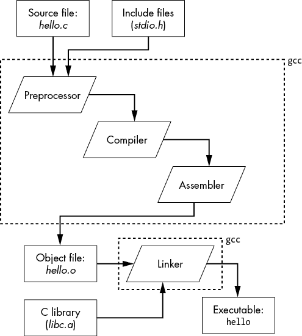

# 第一章：Hello World


在本章中，你将创建并执行第一个程序——“Hello World”。这是几乎所有 C 语言书籍中最简单的程序，也是你能做的最简单的程序。但你不仅仅是创建它：你将学习在它的创建过程中，幕后究竟发生了什么。

你将使用的工具旨在使开发过程快速便捷，这对常规编程有利，但对嵌入式编程可能不太合适。编译器 GCC 实际上是一个包装器，它运行了许多其他工具。我们将逐一查看每个工具的作用，以便将程序从代码转化为执行。在这个过程中，你会发现 GCC 的优化器给我们带来了一个惊喜。尽管我们的程序非常简单，但优化器会决定重写其中的一部分，以提高效率——*而且它不会告诉我们重写的内容！* 事实上，如果我们不查看背后的原理，我们永远也不会知道它在做什么。（我不会告诉你它会对我们做什么；你得继续读下去才能知道。）

## 安装 GCC

为了在本章中运行程序，你需要在系统上下载并安装 GNU C 编译器（GCC）以及相关工具。具体安装说明根据你的操作系统不同而有所差异。

在 Windows 上，安装适用于 Windows 的 Minimalist GNU（MinGW），可在[`www.mingw.org`](http://www.mingw.org)找到。详细说明请见[`nostarch.com/bare-metal-c`](https://nostarch.com/bare-metal-c)。

在 macOS 上，GCC 编译器是开发者包的一部分，可以通过以下命令访问：

```
$ **xcode-select --install**
```

选择**命令行工具**选项进行安装。

Linux 安装说明取决于你使用的发行版。对于 Debian 系统（如 Ubuntu 和 Linux Mint），使用以下命令：

```
$ **sudo apt-get install build-essential**
$ **sudo apt-get install manpages-dev**
```

对于基于 Red Hat 的系统（如 Fedora 或 CentOS），使用以下命令：

```
$ **dnf groupinstall "Development Tools"**
```

对于其他任何基于 Linux 的系统，请使用随系统附带的软件包管理器，或在线搜索找到安装所需的命令。

安装软件后，打开终端窗口并输入命令`gcc`。如果出现“no input files”错误，说明安装成功。

```
$ **gcc**
gcc: fatal error: no input files
compilation terminated.
```

## 下载 STM32 的 System Workbench

System Workbench for STM32 是我们将用来为嵌入式设备编写 C 程序的 IDE。我们将在第二章开始使用它，但下载需要一些时间，所以我建议你现在就开始下载。等你读完本章时，下载应该就完成了。

访问[`openstm32.org/HomePage`](http://openstm32.org/HomePage)，找到 System Workbench for STM32 的下载链接并点击它。注册（免费），如果你已有账号，则登录，然后按照链接进入安装说明。通过安装程序而不是 Eclipse 安装 IDE。下载开始后，返回此处继续阅读。

工具和安装程序可能会随时间变化。如果遇到任何问题，请访问 [`nostarch.com/bare-metal-c`](https://nostarch.com/bare-metal-c) 查阅更新的说明。

## 我们的第一个程序

我们的第一个程序叫做 *hello.c*。首先创建一个目录来存放这个程序，然后进入该目录。导航到你的工作区根目录，打开命令行窗口，输入以下命令：

```
$ **mkdir hello**
$ **cd hello**
```

使用文本编辑器（如 Notepad、Vim 或 Gedit），创建一个名为 *hello.c* 的文件，并输入以下代码：

```
#include <stdio.h>
int main()
{
    printf("Hello World!\n");
    return (0);
}
```

我们将在接下来的章节中详细分析这个程序。但首先，我们需要先运行它。

### 编译程序

你刚刚创建的文件被称为 *源文件*，其中包含人类可读的代码。 (是的，真的是可读的。) 它是我们将要生成的所有其他文件的来源。该文件的内容称为 *源代码*。计算机无法理解源代码；它只能理解 *机器代码*，一种数字格式的指令集。因此，我们需要将源代码转化为机器代码，这个过程叫做 *编译*。

为此，我们在 macOS 或 Linux 上执行以下编译命令：

```
$ **gcc -o hello hello.c**
```

在 Windows 上，我们执行以下命令：

```
$ **gcc -o hello.exe hello.c**
```

如果没有输出，只有命令提示符，那么命令执行成功。否则，你将看到错误信息。

这个命令告诉程序 *GCC* 去 *编译* 和 *链接* 程序，并将输出放在 macOS 和 Linux 上的 *hello* 文件中，或在 Windows 上的 *hello.exe* 文件中。现在，我们可以使用以下命令在 macOS 或 Linux 上运行我们的程序：

```
$ **./hello**
Hello World!
```

在 Windows 上，运行以下命令：

```
$ **hello**
Hello World!
```

### 犯错

让我们故意引入一个错误，看看会发生什么。将第二行改成如下所示：

```
**intxxx main()**
```

现在让我们尝试编译这个程序：

```
$ **gcc -o hello hello.c**
hello.c:2:1: error: unknown type name 'intxxx'
 intxxx main()
 ^
```

输出告诉我们程序第 2 行有问题，错误发生在字符位置 1。此时，编译器原本期望的是一个类型，却得到了不同的东西——也就是我们故意放进去的垃圾。通过将这一行恢复，修复这个程序。

接下来让我们移除一些东西——特别是第四行的分号：

```
**printf("Hello World!\n")**
```

这将给我们带来一个不同的错误信息：

```
$ **gcc -o hello hello.c**
hello.c: In function 'main':
hello.c:5:5: error: expected ';' before 'return'
 return (0);
 ^
```

你会注意到，编译器在发出错误信息时指向了第 5 行。这是因为尽管我们在第 4 行犯了错误，但编译器直到查看到第 5 行时才检测到错误。

有时前一行的错误可能不会在一行或多行后被检测到，因此不要只看错误提示指定的行；也要检查它上面的行。

### 理解程序

现在让我们逐行分析程序，看看它在做什么。首先，看看第一行：

```
#include <stdio.h>
```

为了构建我们的程序，我们使用了编译器自带的组件——即标准输入/输出（I/O）包。这个包中的函数在*/usr/include/stdio.h*文件中定义。（Windows 可能使用稍有不同的目录。）具体来说，我们在程序后面将使用标准 I/O 函数`printf`。

接下来，我们定义程序的起始点：

```
int main()
```

`main`这个名字是特殊的，表示程序的主函数。所有程序都从`main`开始。接下来是一组被大括号包围的语句：

```
{
...
}
```

大括号表示`main`的主体。换句话说，它们用来将接下来的语句分组。为了提高可读性，我们将大括号内的语句缩进四个空格，但你也可以使用其他缩进方式。实际上，C 语言编译器并不在乎我们使用了多少空白字符。我们甚至可以完全不使用缩进，但没有缩进会让程序很难阅读，因此大多数 C 程序员会对代码进行缩进。

大括号内是我们第一个可执行语句：

```
 printf("Hello World!\n");
```

这告诉程序使用标准 I/O 函数`printf`将字符串输出到标准输出位置（我们的终端）。`\n`是这个字符串中的一个特殊字符。反斜杠（`\`）被称为*转义字符*。它告诉 C 语言接下来的字符应该被当作代码处理。在这种情况下，`n`告诉 C 语言输出一个“换行符”，这意味着下一个字符将会在新的一行打印。一些常见的转义字符显示在表 1-1 中。

表 1-1：常见的转义字符

| **转义字符** | **结果** |
| --- | --- |
| `\n` | 换行（也叫做*换行符*） |
| `\t` | 制表符 |
| `\"` | `"` |
| `\\` | `\` |
| `\r` | 回车符 |

最后，程序以这条语句结束：

```
 return (0);
```

这会导致程序停止并退出，返回一个退出代码 0 给操作系统，表示程序正常终止。非零退出代码表示出错。

### 添加注释

到目前为止，我们一直局限于编写代码。换句话说，我们所看到的所有内容都是为了让计算机读取和处理的。程序还可以包含*注释*，这些注释不会被编译器看到；相反，它们是为了被查看程序的人阅读。注释通常以`/*`开始，`*/`结束。例如，下面就是一条注释：

```
/* Hello World – A nothing program */
```

它告诉你写这段程序的程序员是怎么想的。让我们在程序的开头加上一些注释：

```
/*
 * Hello World -- not the most complicated program in
 *      the universe but useful as a starting point.
 *
 * Usage:
 *      1\. Run the program.
 *      2\. See the world.
 */
```

另一种风格的注释以`//`开头，直到行尾结束。当你看到更多的程序时，你会自行判断哪种方式更适合使用。

在编写程序时，始终为代码添加注释，因为那时你知道自己在做什么。五分钟后，你可能会忘记。五天后，你*一定*会忘记。例如，我曾经需要做一次复杂的位图转换，将一个光栅图像转换为喷墨喷嘴的喷射命令。这个转换过程涉及将一个横向光栅图像，转化为喷嘴所需的列数据，然后，由于喷嘴有偏移，需要将数据向左移动以匹配喷嘴的位置。我写了一页注释，描述了影响喷射顺序的所有因素。接着，我加了一页半的 ASCII 艺术，图解我刚刚描述的内容。只有在这样做并确保我理解了问题后，我才开始写代码。而且因为我必须整理思路来记录它们，所以程序第一次就成功了。

在创建本书中编程问题的答案时，养成写注释的习惯。真正优秀的程序员都是狂热的注释写作者。

## 改进程序和构建过程

对于我们的“小小的‘Hello World’程序”，手动编译并不成问题。但对于一个包含数千个模块的程序，跟踪哪些需要编译，哪些不需要编译，会变得相当困难。我们需要自动化这个过程，以提高效率并避免人为错误。

在这一节中，我们将调整程序以改进并自动化构建过程。理想情况下，你应该能够通过一个命令和没有任何参数来构建程序，这意味着你有一个一致且精确的构建过程。

### `make` 程序

我们的构建过程有一个问题，那就是每次构建程序时都需要输入编译命令。对于一个包含数千个文件的程序来说，这将是一个繁琐的工作，每个文件都需要编译。为了自动化构建过程，我们将使用 `make` 程序。它的输入是一个叫做 makefile 的文件，告诉 `make` 如何构建程序。

在 macOS 或 Linux 上创建一个名为*Makefile*的文件，内容如下：

```
CFLAGS=-ggdb -Wall -Wextra

all: hello

hello: hello.c
       gcc $(CFLAGS) -o hello hello.c
```

在 Windows 上，makefile 应包含以下内容：

```
CFLAGS=-ggdb -Wall -Wextra

all: hello.exe

hello.exe: hello.c
       gcc $(CFLAGS) -o hello.exe hello.c
```

确保缩进的行以制表符（Tab）开头。八个空格是无效的。（尽管文件设计很糟糕，但我们只能将就。）第一行定义了一个宏。由于这个定义，每当我们在 makefile 中指定 `$(CFLAGS)` 时，`make` 程序将把它替换为 `-ggdb -Wall -Wextra`。接下来，我们定义了目标 `all`，这是根据约定的默认目标。当没有参数时运行 `make` 时，它会尝试构建它看到的第一个目标。这个目标的定义 `all: hello` 告诉 `make` 程序：“当你尝试构建 `all` 时，你需要构建 `hello`。” makefile 的最后两行是针对 `hello`（或者 Windows 上的 `hello.exe`）的说明。这些告诉 `make`，`hello` 是通过执行命令 `gcc $(CFLAGS) -o hello hello.c` 从 *hello.c* 构建而成的。这个命令包含了我们定义的宏 `$(CFLAGS)`，它展开为 `-ggdb -Wall -Wextra`。你会注意到，我们为编译添加了几个额外的标志，我们将在下一节讨论这些标志。

现在让我们使用 `make` 命令来构建程序：

```
$ **make**
gcc -ggdb -Wall -Wextra -o hello hello.c
```

正如你所看到的，程序运行了构建可执行文件的命令。`make` 程序很聪明。它知道 `hello` 是由 *hello.c* 构建的，因此它会检查这两个文件的修改日期。如果 `hello` 更新了，就不需要重新编译。因此，如果你尝试两次构建程序，你会看到以下消息：

```
make: Nothing to be done for 'all'.
```

这并不总是正确的行为。如果我们在 makefile 中更改了标志，那么我们就改变了编译过程，应该重新构建我们的程序。然而，`make` 并不知道这个变化，除非我们编辑并保存 *hello.c* 文件，或者删除输出文件，否则它不会重新构建程序。

### 编译器标志

GCC 编译器有很多选项。实际上，这个编译器的选项列表超过了八页。幸运的是，我们不需要关注所有的选项。我们来看一下我们为程序使用的那些选项：

1.  `-ggdb` 编译程序以便我们能够调试它。主要是将调试信息添加到输出文件中，允许调试器理解发生了什么。

1.  `-Wall` 打开一组警告，标记那些正确但值得怀疑的代码。（本书将教你如何避免写出值得怀疑的代码。）

1.  `-Wextra` 打开额外的警告，旨在使我们的代码更加精确。

1.  `-o hello` 将程序的输出放入文件 *hello* 中。（对于 Windows 用户，这个选项是 `-o hello.exe`。）

## 编译器背后的工作原理

为了更好地利用编译器，你需要理解在你运行编译器时背后发生了什么。这是因为在你为嵌入式设备编写软件时，你经常需要绕过编译器自动执行的一些操作，这些操作包括几个步骤：

1.  源代码会经过一个*预处理器*，它处理所有以`#`开头的行，这些行被称为*指令*。在我们原始的源文件中，这就是`#include`语句。稍后你将学习其他指令。

1.  编译器本身处理预处理过的源代码，并将其转换成*汇编语言*代码。C 语言应该是与机器无关的，可以在多个平台上进行编译和运行。而汇编语言是与机器相关的，只能在一种类型的机器上运行。（当然，也可以编写只能在某台机器上运行的 C 代码。C 语言试图将底层机器隐藏起来，但并不阻止你直接访问它。）

1.  汇编语言文件会传递给*汇编器*，它将其转换成*目标文件*。目标文件仅包含我们的代码。然而，程序需要额外的代码才能工作。在我们的例子中，*hello.c*的目标文件需要包含`printf`函数的副本。

1.  *链接器*将目标文件中的目标代码与计算机上已有的有用代码结合（链接）起来。在这个例子中，它是`printf`以及所有支持它的代码。

图 1-1 展示了这个过程。所有这些步骤都被`gcc`命令隐藏起来。



图 1-1：生成程序所需的步骤

你会注意到，`gcc`命令既充当编译器，也充当链接器。实际上，`gcc`被设计成一种执行程序。它查看参数，并决定需要运行哪些其他程序来完成它的工作。这可能包括预处理器（`cpp`）、C 编译器（`cc1`）、汇编器（`as`）、链接器（`ld`）或根据需要的其他程序。让我们更详细地了解这些组件。

### 预处理器

第一个运行的程序是预处理器，它是一个*宏处理器*（一种自动文本编辑器），用于处理所有以`#`开头的行。在我们的程序中，它处理`#include`这一行。我们可以通过以下命令获得预处理器的输出：

```
$ **gcc -E hello.c >hello.i**
```

这个命令的输出被存储在*hello.i*文件中。如果我们查看这个文件，我们会看到它超过 850 行。这是因为`#include <stdio.h>`这一行导致整个*stdio.h*文件被复制进我们的程序，并且由于*stdio.h*文件中有自己的`#include`指令，所以*stdio.h*所包含的文件也会被复制进来。

我们需要*stdio.h*来使用`printf`函数，如果查看*hello.i*，我们可以找到该函数的定义，它现在已经被包含进我们的程序中：

```
extern int printf (const char *__restrict __format, ...);

extern int sprintf (char *__restrict __s,
      const char *__restrict __format, ...) __attribute__ ((__nothrow__));
```

预处理器还会移除所有注释，并在文本中注释上正在处理的是哪个文件的信息。

### 编译器

接下来，编译器将 C 语言代码转换成汇编语言。我们可以通过以下命令查看生成的内容：

```
$ **gcc -S hello.c**
```

这应该会生成一个以以下行开始的文件：

```
 .file   "hello.c"
        .section        .rodata
.LC0:
        .string "Hello World!"
```

注意，编译器将 C 字符串 `"Hello World!\n"` 转换为汇编语言中的 `.string` 命令。如果你眼尖的话，你还会注意到 `\n` 缺失了。稍后我们将揭晓原因。

### 汇编器

汇编语言文件进入汇编器，在那里它被转换成机器代码。`gcc` 命令有一个选项（`-Wa`），让我们可以将标志传递给汇编器。因为除非你是机器，否则无法理解机器代码，所以我们将使用以下命令请求一个汇编语言列表，以人类可读的格式打印机器代码，并显示生成该代码的对应汇编语言语句：

```
$ **gcc -Wall -Wextra -g -Wextra -Wa,-a=hello.lst -c hello.c**
```

`-Wa` 选项告诉 GCC 后面的内容将传递给汇编器。`-a=hello.lst` 选项告诉汇编器生成一个名为 *hello.lst* 的列表。我们来看一下那个文件，它的开头如下：

```
4                            .section        .rodata
5                    .LC0:
6 0000 48656C6C              .string "Hello World!"
6      6F20776F
6      726C6421
6      00
```

汇编语言在不同机器上有所不同。在这个文件中，你看到的是 x86 汇编语言。与其他汇编语言相比，它可能看起来像一团乱麻。你可能不会完全理解它，这没关系；本章只是让你对汇编语言有一个初步的了解。之后的章节中，当我们讨论 ARM 处理器时，你会看到更加理智且易于理解的汇编语言。

第一列是汇编语言文件中的行号。第二列（如果存在）表示存储数据的地址。所有计算机内存插槽都有一个数字地址。在这种情况下，字符串 `"Hello World!"` 被存储在相对于当前使用的部分（在此例中为 `.rodata` 部分）地址 0000 处。当我们在下一部分讨论链接器时，我们将看到如何将这个相对地址转换为绝对地址。

下一列包含以十六进制格式存储在内存中的数值。接下来是汇编语言代码本身。在文件中，我们可以看到 `.string` 指令告诉汇编器生成文本字符串的代码。

在文件的后面，我们找到了 `main` 的代码：

```
15 0000 55                    pushq   %rbp
16                            .cfi_def_cfa_offset 16
17                            .cfi_offset 6, -16
18 0001 4889E5                movq    %rsp, %rbp
19                            .cfi_def_cfa_register 6
12:hello.c       ****     printf("Hello World!\n");
20                            .loc 1 12 0
21 0004 BF000000              movl    $.LC0, %edi
21      00
22 0009 E8000000              call    puts
22      00
```

在第 15 行，我们可以看到汇编语言指令 `55`，它将被存储在该部分的地址 0 位置。此指令对应 `pushq %rbp`，它在程序开始时做了一些账务处理。同样注意到，一些机器指令只有 1 字节长，而其他指令则长达 5 字节。第 21 行的指令就是一个 5 字节的指令。你可以看到这条指令正在处理 `.LC0`。如果我们查看列表的顶部，会看到 `.LC0` 是我们的字符串。

作为 C 程序员，你不需要完全理解汇编语言的功能。要完全理解它，你需要阅读几千页的参考资料。但我们可以在某种程度上理解第 22 行的指令，它调用了`puts`函数。到这里，事情变得有趣了。记住，我们的 C 程序并没有调用`puts`——它调用了`printf`。

看起来我们的代码在后台已经进行了优化。在嵌入式编程中，“优化”可能是一个敏感词，因此理解这里发生了什么非常重要。本质上，C 编译器查看了`printf("Hello World!\n");`这一行，并决定它与以下代码完全相同：

```
puts("Hello World!");
```

事实上，这些函数并不完全相同：`puts`是一个简单且高效的函数，而`printf`是一个庞大且复杂的函数。但是程序员没有使用`printf`的任何高级功能，因此优化器决定重写代码以提升性能。因此，我们的`printf`调用变成了`puts`，并且行尾字符（`\n`）被从字符串中移除，因为`puts`会自动添加这个字符。当你接近硬件时，像这样的细节可能会带来很大差异，因此了解如何查看和理解汇编代码非常重要。

汇编器的输出是一个包含我们所写代码的对象文件，没有其他内容。特别是，它不包含我们需要的`puts`函数。`puts`函数与其他数百个函数一起存在于 C 标准库（*libc*）中。

### 链接器

我们的对象文件和*libc*的一些组件需要合并才能构成我们的程序。链接器的任务是将构成程序所需的文件合并在一起，并为每个组件分配真实的内存地址。正如我们在汇编器中所做的那样，我们可以告诉`gcc`命令通过以下命令将标志传递给链接器：

```
$ **gcc -Wall -Wextra -static -Wl,-Map=hello.map -o hello hello.o**
```

`-Wl`告诉 GCC 将后面的选项（`-Map=hello.map`）传递给链接器。映射告诉我们链接器将各个部分放置在内存中的位置。（稍后我们将详细讨论这一点。）我们还添加了`-static`指令，这会将可执行文件从动态链接改为静态链接，这样内存映射看起来会更像我们在嵌入式系统中看到的那样。通过这种方式，我们可以避免讨论动态链接的复杂性。

对象文件，例如*hello.o*，是可重定位的。也就是说，它们可以放置在内存中的任何位置。链接器的工作就是决定它们在内存中的具体位置。链接器的另一项任务是遍历程序使用的库，提取所需的对象文件，并将其包含在最终的程序中。链接器映射告诉我们各个组件的位置，以及哪些库组件被包含在我们的程序中。例如，一个典型的链接器条目可能看起来像这样：

```
 .text          0x000000000040fa90      0x1c8 /usr/lib/gcc/x86_64-linux-gnu/5/../../../                x86_64-linux-gnu/libc.a(ioputs.o)
                0x000000000040fa90                puts
                0x000000000040fa90                _IO_puts
 *fill*         0x000000000040fc58        0x8
```

记住我们没有编写`puts`，即使它出现在这个链接器条目中。如前所述，它来自标准 C 库文件（*libc.a*）。我们可以看到，这个函数的代码位于`0x000000000040fa90`。如果我们的程序在`0x40fa90`和`0x40fc58`之间崩溃，这些信息将很有用。在这种情况下，我们就知道是`puts`导致了崩溃。

我们还知道`puts`占用了`0x1c8`字节（`40fc58–40fa90`）。这相当于 456 十进制字节，约为 0.5K 内存。当我们开始编程我们的微处理器时，这个内存大小会成为一个问题，因为微处理器的内存是有限的。

现在你应该对 C 程序的每个元素以及这些不同部分的作用有了一个清晰的了解。大多数时候，你可以让编译器处理这些细节，而不必担心其背后的工作原理。但当你在编程资源有限的小型芯片时，你确实需要关注内部的运行情况。

## 添加到你的 Makefile

通过修改你的 makefile 来生成上一节中描述的所有文件，独立探索 GCC 编译器、汇编器和链接器的各个方面：

```
CFLAGS=-Wall -Wextra -ggdb

all: hello hello.i hello.s

hello.o: hello.c
        gcc $(CFLAGS) -Wa,-a=hello.lst -c hello.c

hello: hello.o
        gcc $(CFLAGS) -static -Wl,-Map=hello.map -o hello hello.o

hello.i: hello.c
        gcc -E hello.c >hello.i

hello.s: hello.c
        gcc -S hello.c

# Type "make verbose" to see the whole command line
verbose:
        gcc -v $(CFLAGS) -Wextra -c hello.c

clean:
        rm -f hello hello.i hello.s hello.o
```

如前所述，第一行非空行定义了一个宏，告诉`make`将`$(CFLAGS)`替换为`-Wall -Wextra -ggdb`，并应用到文件中的其他地方。接下来，我们定义了一个*目标*（需要构建的项目）叫做`all`。由于这是文件中的第一个目标，它也是默认目标，这意味着你只需输入以下命令就可以构建它：

```
$ **make**
```

这个目标被称为*虚拟目标*，因为它不会生成一个名为*all*的文件。相反，每次你执行`make all`命令时，`make`都会检查是否需要重新创建其依赖项。你可以在 makefile 中的 `all` 关键字和冒号后看到这些依赖项。为了生成目标 `all`，我们需要生成目标 `hello`、`hello.i` 和 `hello.s`。以下行将明确说明如何生成这些目标。例如，要生成目标 `hello.i`，我们必须使用目标 `hello.c`。如果 `hello.i` 比 `hello.c` 更新，那么 `make` 将不执行任何操作。如果 `hello.c` 最近有改动，而 `hello.i` 没有更新，那么 `make` 会使用以下命令生成 `hello.i`：

```
gcc -E hello.c >hello.i
```

因此，如果你编辑了 `hello.c`，然后执行命令 `make hello.i`，你将看到 `make` 执行其任务：

```
$ `(Change hello.c)`
$ **make hello.i**
gcc =E hello.c > hello.i
```

我们 makefile 中的另一个目标 `clean` 用于删除所有生成的文件。要删除生成的文件，可以执行以下命令：

```
$ **make clean**
```

GNU `make` 是一款非常复杂的程序，其手册长达 300 多页。好消息是，你只需处理它命令的一个非常小的子集就可以提高工作效率。

## 总结

编写一个“Hello World”程序是 C 程序员能做的最简单的事情之一。然而，理解创建和运行这个 C 程序背后发生的一切要复杂一些。幸运的是，你不必成为专家。但尽管你不需要精通程序生成的每一条汇编语言，任何嵌入式程序员都应该理解足够的内容，能够发现潜在的问题或异常行为，比如 `puts` 出现在调用 `printf` 的程序中。关注这些细节将帮助我们最大限度地利用我们的嵌入式设备。

## 问题

1.  GNU `make` 的文档在哪里？

1.  C 代码在不同类型的机器之间是可移植的吗？

1.  汇编语言代码在不同类型的机器之间是可移植的吗？

1.  为什么汇编语言中的一条语句只生成一条机器指令，而 C 语言中的一条语句可能生成多条指令？
