# 集成开发环境简介


到目前为止，我们已经使用了 GCC、`make`和文本编辑器等单独的工具来构建我们的程序。这使你能够看到每个工具的作用，并了解软件开发的细节。现在，你将学习如何使用集成开发环境（IDE）。IDE 是一个旨在将所有这些工具（以及其他一些工具）隐藏在一个集成界面后的程序。

这种方法的主要优点是你可以使用一个基于图形界面的工具来完成所有事情。主要的缺点是，只有当你按照 IDE 预期的方式操作时，它才会工作得很好。此外，它还隐藏了很多东西。例如，要获取链接器映射，你必须通过多个 GUI 层并在一个隐蔽的定制框中输入映射选项。

本书中我们将使用的集成开发环境（IDE）是 STM32 的 System Workbench IDE。从它的名字可以看出，它是为 STM32 微处理器创建的。作为一种非常流行的 IDE——Eclipse 的增强版本，它包括了编辑器、调试器和编译器。在调试方面，它特别强大，因为在微控制器上进行远程调试涉及许多工具，而 IDE 使这些工具能够无缝地协同工作。

为了练习使用 IDE，你将编写和第一章中相同的“Hello World”程序，只不过这次你将把过程的每一步都封装在一个统一的 GUI 中。在某种程度上，IDE 通过将编译器和其他工具隐藏起来使事情变得更简单。在其他方面，它又使事情变得更加复杂，因为访问这些工具并进行调整变得更困难。例如，如果我想在没有 IDE 的情况下将`-Wextra`标志添加到编译器命令行，我只需编辑 makefile。但使用 IDE 时，我必须找到可以输入此值的神秘框（剧透：它是 Project▶Properties，然后是 C/C++ Build▶Settings▶Tool Settings▶GCC Compiler▶All Options）。

## 使用 System Workbench for STM32

到目前为止，我们使用了一个文本编辑器、一个名为 GCC 的编译器和一个叫做`make`的程序来运行编译器。当我们处理更复杂的程序时，我们还需要一个调试器。

STM32 Workbench 将所有这些工具打包成一个集成开发环境，基于 Eclipse IDE 构建。事实上，它*就是*Eclipse，只是在其中添加了许多特定于 STM32 的内容，接下来的讨论中我会这样称呼它。我们将在第三章更深入地探讨 STM32 的相关内容。现在，让我们通过编写一个“Hello World”程序来探索 IDE。

### 启动 IDE

如果你遵循了第一章开头的建议，应该已经下载了 System Workbench for STM32。按照网站上的说明安装它。标准安装会创建一个桌面图标和一个启动菜单项，因此你应该可以像启动其他程序一样启动 IDE。

初次启动时，Eclipse 会询问你的工作空间位置。请输入将包含本书所有项目的目录。接下来，Eclipse 应该会显示欢迎屏幕。点击关闭图标（标签旁边的小 X）来关闭该屏幕。

系统应该会弹出一个窗口，提示系统正在下载 ARM 处理器的附加工具。下载完成后，你应该会看到一个 C/C++视图的空项目，如图 2-1 所示。

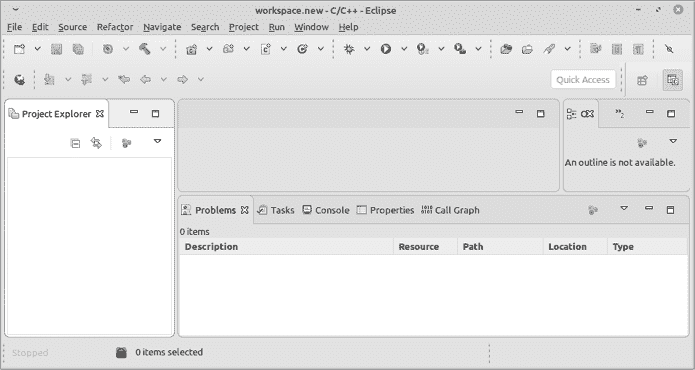

图 2-1：空项目界面

Eclipse 是*很多*工具的前端。如何有条理地展示它们是一个相当大的挑战。为了解决这个问题，Eclipse 使用了视图的概念。*视图*是为特定任务设计的窗口布局。例如，Java 程序员可能会有与 C 程序员不同的视图。同样，调试需要不同于编程的视图。

这个版本的 Eclipse 默认视图是 C/C++项目视图。（你可以随时通过使用窗口▶视图菜单来更改视图。）视图的左侧是 Project Explorer（当前为空），它允许你查看项目及其详细信息。视图的中上方是文本编辑器。右侧是一个有三个标签的窗口：Outline、Build Targets 和 Task List。我们会在涉及更复杂的项目时再讨论这些标签。

底部有一个小的宽窗口，包含标签页：Problems、Tasks、Console、Properties 和 Call Graph。Problems 窗口列出了当前项目中代码生成的错误和警告。Console 窗口显示构建过程的输出。其他标签页我们会在开始生成更复杂的程序时再讨论。

### 创建 Hello World

现在我们将创建另一个“Hello World”项目。每次创建一个本地 C 项目时，你必须按照特定步骤操作（*本地*指的是程序运行在编译它的机器上；如果你在一台机器上编译并在另一台机器上运行，那就叫做*交叉编译*），本章将详细讲解这些步骤。你将频繁地执行这些步骤；为了避免你记不住所有的步骤，请参见附录中的检查清单。

通过选择**File**▶**New**▶**C Project**来启动一个新项目，这将弹出 C Project 对话框。

我为我们的项目选择了名称*02.hello-ide*，因为它既独特又具有描述性。项目名称可以包含任何字符，但不能包含空格和特殊字符，如正斜杠（/）、反斜杠（\）、冒号（:）等文件系统中有特殊含义的字符。字母、数字、连字符、点和下划线是可以使用的。

对于项目类型，选择**Hello World ANSI C Project**。对于工具链，选择与你操作系统匹配的工具链，如图 2-2 所示。点击**Next**。

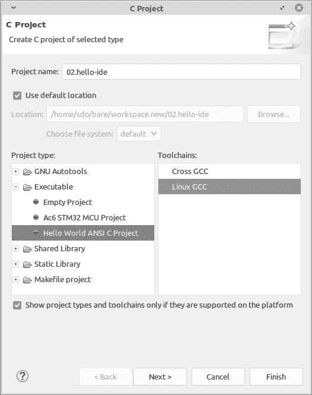

图 2-2：项目创建对话框

我们现在看到基本设置对话框。保持这些设置不变，点击**下一步**。

下一个对话框是选择配置（见图 2-3）。

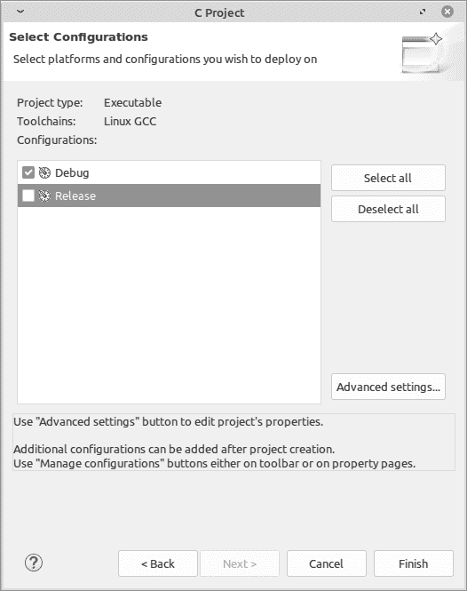

图 2-3：选择配置对话框

你有很多不同的选项来构建你的项目。Eclipse 将这些选项分为项目配置。默认定义的两个配置是 Release 和 Debug。Release 生成高度优化的代码，调试几乎不可能，甚至不可能。Debug 生成未优化的、易于调试的代码并生成调试符号。因为你在学习，我们将坚持使用 Debug 配置。取消选择**Release**配置，只选择**Debug**配置，然后点击**完成**。

IDE 创建了我们的项目并生成了一些文件。其中一个文件是我们的源代码，已经填写了它的“Hello World”程序版本（见图 2-4）。

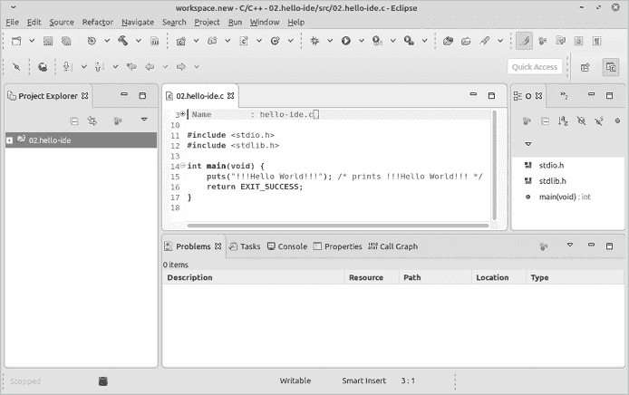

图 2-4：创建我们的“Hello World”项目的结果

如果你自己输入任何代码，请注意，Eclipse 编辑器默认使用 4 的制表符大小，这意味着当你使用制表符来缩进源代码中的一行时，制表符的宽度为四个空格。几乎所有其他编辑器和工具都使用八个空格。你可以通过窗口▶首选项中的一个配置项来修复此问题。（告诉你如何进一步自定义 Eclipse 需要一本完整的书，而这本书不是这本书。）

到此为止我们就完成了——如果我们是在写 Java 的话。Eclipse 是为 Java 设计的。C 是一个附加功能，*几乎*完全适用。我们还需要做最后一个修复。

首先，通过选择**项目**▶**构建项目**来编译项目。然后选择**运行**▶**运行配置**，这将弹出运行配置对话框。接下来，点击左侧的**C/C++ 应用程序**，然后点击图标行左侧的小图标来创建一个新配置。最后，在 C/C++ 应用程序下，点击**浏览**，如图 2-5 所示。

使用文件浏览器在*Debug*目录中找到你的可执行文件。IDE 已经为你在工作区创建了一个项目目录（该目录的位置取决于系统），其名称与你的项目相同。所有项目文件都在这个目录中。在项目目录中，一个*Debug*目录包含所有作为 Debug 构建的一部分构建的文件（这是我们正在进行的唯一构建类型）。在该目录中，你会找到 macOS 和 Linux 上的*02.hello-ide*或 Windows 上的*02.hello-ide.exe*。选择这个文件，如图 2-6 所示，然后点击**确定**。

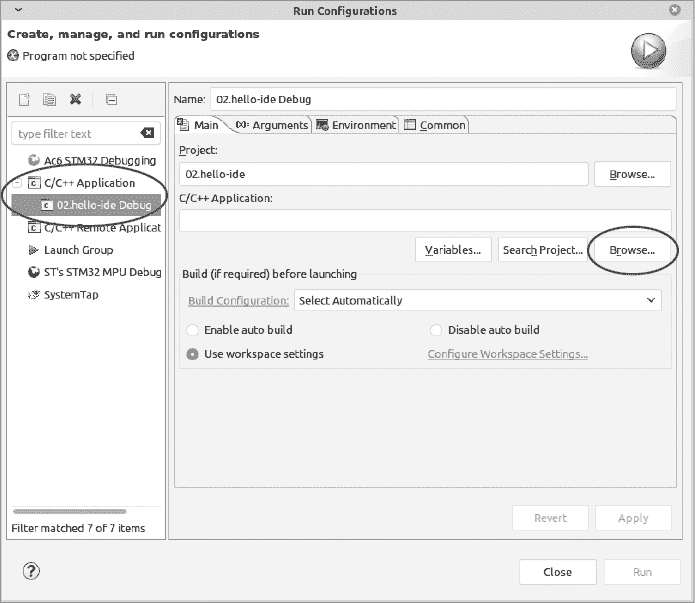

图 2-5：运行配置对话框

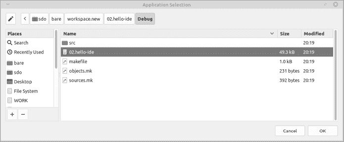

图 2-6：应用程序选择对话框

接下来，点击**应用**和**关闭**以完成运行配置。此设置告诉 IDE 你的程序实际所在的位置。（既然它已经决定了放置的位置，你可能会认为它会知道文件的去向，但不知为何它并不知道。）

现在让我们实际运行程序。选择**运行**▶**运行**。结果应该会出现在控制台窗口中，如图 2-7 所示。

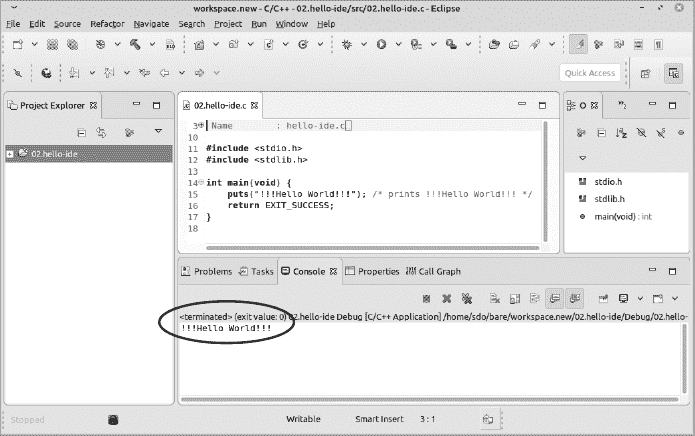

图 2-7：我们程序的结果

### 调试程序

接下来简单介绍一下*调试器*，它可以监控我们的程序执行并让我们看到程序内部发生了什么。首先，让我们通过复制第 15 行（`puts("!!!Hello World!!!");`）来生成一些更多的代码进行调试，然后选择**文件**▶**全部保存**来保存项目。

编辑后每次都选择**文件▶全部保存**是非常重要的。如果此时你运行程序，未保存所有文件，编译器会看到磁盘上的旧文件并编译它。生成的程序将只会打印一次`!!!Hello World!!!`，而不是两次，这可能会造成很大的困扰。我们面前的代码是正确的；我们正在运行的代码则不是。直到选择**文件▶全部保存**，文件才是相同的。（结束说教模式。）

现在让我们通过**运行**▶**调试**来启动调试器（见图 2-8）。

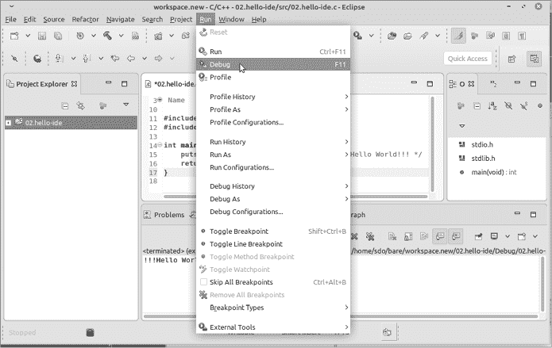

图 2-8：启动调试器

IDE 即将切换到调试模式，这会将视角从开发模式切换到调试模式。这意味着窗口布局会发生变化。系统会提醒你即将发生这种变化，如图 2-9 所示。（记住，你总是可以通过命令**窗口▶视角▶C/C++**或**窗口▶视角▶调试**来切换视角。）

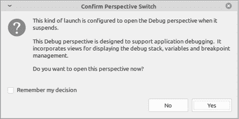

图 2-9：调试视角警告

在警告中点击**是**。调试视角应该打开，如图 2-10 所示。

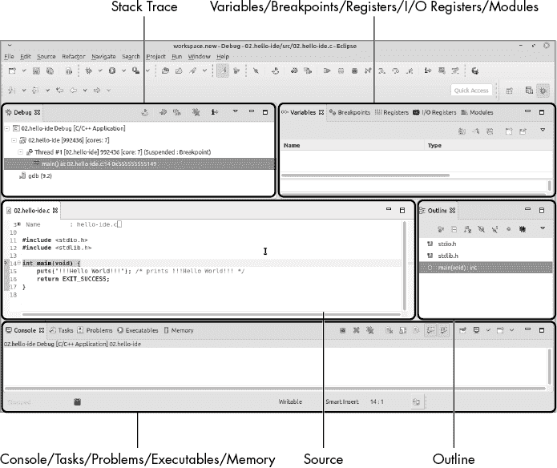

图 2-10：调试视角

左上方是堆栈跟踪窗口，它显示正在执行的程序及其执行的进度。这个信息在第七章讨论堆栈使用时会变得更有用。

紧挨着的是变量/断点/寄存器/输入输出寄存器/模块窗口，其中包含以下内容：

1.  **变量** 程序变量的信息。（从第四章开始将进一步介绍。）

1.  **断点** *断点*是程序中的一个位置，程序在此处停下来，调试器可以检查它。你可以通过双击程序中可执行行的行号来设置断点。我们将在第三章开始使用它们。

1.  **寄存器** 当前处理器寄存器状态的信息。（在第十章讨论。）

1.  **模块** 动态链接模块。由于嵌入式程序员无法使用此功能，我们将不讨论它。

屏幕中间的源窗口显示了我们的程序。高亮的代码行表示调试器已经运行到这行并暂停了。

源窗口旁边是大纲面板。它类似于目录，指示哪些文件包含在我们的程序中。我已将文件*stdio.h*和*stdlib.h*包括在内，因此它们会显示在这里。

底部是控制台/任务/问题/可执行文件/内存窗口。控制台窗口显示了程序的输出，其他标签包含我们不感兴趣的信息。

现在我们将*单步调试*程序，意味着我们将使用调试器逐行执行语句。点击屏幕顶部的步过图标（见图 2-11），或者按 F6 键来跳过当前行。

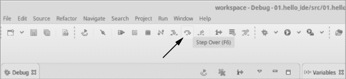

图 2-11：步过（F6）

源窗口中高亮的行向前推进了一行，`!!!Hello World!!!`出现在控制台窗口中（见图 2-12）。

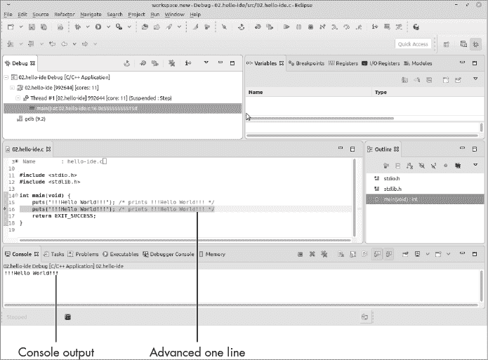

图 2-12：单步执行结果

如果你继续逐步调试，你将看到第二个`puts`被执行，随后是`return`语句。之后，程序进入系统库进行清理工作。由于我们没有该库的源代码，调试器无法显示任何关于它的信息。

工具栏上还有两个重要的图标（见图 2-13）。恢复图标（或 F8 键）运行程序直到结束或遇到断点。调试图标重新启动调试。

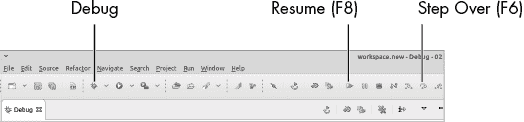

图 2-13：调试命令

在接下来的章节中，我们将大量使用调试器。它将为我们提供从正在运行的程序中获取信息并查看发生了什么的非常有用的方式。为了回到原始的 C/C++视角，请选择**窗口**▶**视角**▶**打开视角**▶**C++**。

## IDE 为我们做了什么

IDE 生成了 C 源文件，其中包括`puts`函数，用于打印“Hello World”。它还生成了一个名为*Debug/makefile*的文件，该文件作为`make`程序的输入。清单 2-1 包含了该文件的摘录。

```
###########################################################################
# Automatically-generated file. Do not edit!
###########################################################################

-include ../makefile.init

RM := rm -rf

# All of the sources participating in the build are defined here
-include 1 sources.mk
-include src/subdir.mk
-include subdir.mk
-include 2 objects.mk

ifneq ($(MAKECMDGOALS),clean)
ifneq ($(strip $(C_DEPS)),)
-include $(C_DEPS)
endif
endif

-include ../makefile.defs

# Add inputs and outputs from these tool invocations to the build variables

# All Target
all: 02.hello-ide
```

清单 2-1：*Debug/makefile*的摘录

这个 makefile 位于*Debug*目录中。IDE 支持多种构建配置，并为每种配置生成不同目录中的 makefile。（对于本项目，我们仅创建了一个 Debug 配置，其他项目可能还会使用 Release 配置。）

这个 makefile 比我们在第一章中自己生成的更加复杂，因为 IDE 使用了大量高级的`make`语法。IDE 还生成了文件*sources.mk* 1 和*objects.mk* 2，并将它们包含在 makefile 中。我们从这些文件中看到，计算机生成的内容设计得非常灵活，但代价是几乎无法阅读。

就目前而言，IDE 不会生成或下载大量数据。但当我们开始进行嵌入式编程时，这种情况将发生剧变。

## 导入本书的编程示例

本书中使用的编程示例可以从[`nostarch.com/bare-metal-c.`](https://nostarch.com/bare-metal-c.)下载。要使用下载的编程示例，你需要将它们导入。 （你不能仅仅将文件放入工作区；那样太简单了。）要执行导入，请按照以下步骤操作：

1.  选择**文件**▶**导入**。

1.  在导入对话框中，选择**常规**▶**将现有项目导入工作区**。

1.  点击**下一步**。

1.  选择单选按钮**选择归档文件**，然后点击空白处后的**浏览**，选择包含项目的文件（即你从网站下载的文件）。

1.  点击**完成**。

## 总结

IDE 是一个双刃剑。一方面，你不需要担心创建程序所需的所有工具。你不必自己创建 makefile、手动执行构建或运行调试器。

但这种放手的方式是有代价的。要在第一章的程序中添加一个编译时标志，你只需将标志添加到 makefile 中。在 IDE 中，你无法这样做，因为 IDE 会自动生成 makefile。你必须在 IDE 中找到正确的配置项来完成这个操作，而正如我们将要发现的那样，IDE 有很多选项。

本书中，我尽力通过使用清单（如附录中的清单）和标准程序将内容保持尽可能简单。Eclipse 尽量处理所有事情，但你偶尔还是需要在幕后进行一些调整。

## 编程问题

1.  查找将`\t`放入打印字符串中时会发生什么。

1.  在第一章中，我们使用了`printf`来打印消息。在本章中，Eclipse 使用`puts`。查阅这些函数的文档，了解它们的不同之处。

## 问题

1.  什么是 IDE？

1.  我们的 IDE 生成了哪些文件，它们包含了什么？

1.  你可以从哪里获得关于使用 C 语言和 Eclipse 的帮助？
