# 第三章：微控制器编程


现在我们已经在 IDE 中编写并运行了一个“Hello World”程序，我们将在 STM32 NUCLEO-F030R8 开发板上做同样的事情，该开发板包含 STM32F030R8 处理器以及使用该处理器所需的其他多个组件。在嵌入式系统中，“Hello World”的等效程序是使 LED 闪烁的程序。通过让 LED 闪烁，你将学习如何在较小的规模上进行复杂程序的开发步骤。

在这个过程中，你将学习如何使用 STM32 的系统工作台（我们在上一章中探讨过）来创建嵌入式程序。为了帮助我们，我们将使用 STMicroelectronics 的软件——硬件抽象层（HAL），它隐藏了硬件的一些繁琐细节。（然而，这些细节并没有被隐藏得很深，你可以查看源代码了解实现的内容。）我们还将详细解释 IDE 在幕后执行的操作，并解释它使用的编译选项。

最后，像我们在第二章所做的那样，我们将运行调试器，逐行执行程序，这对于我们开始制作越来越大的程序时非常有用。

## NUCLEO-F030R8 开发板

*开发板*是包含处理器芯片和开发该处理器应用所需的各种组件的电路板，包含许多有助于开发程序和电路的有用元件。除了编程和调试支持，开发板还包括多个*连接器*，让你可以连接原型硬件。它还包括一些*外设*，如串行端口、按钮开关和 LED，尽管一些更高级的开发板会包含更多外设。

因此，开发板为你提供了一个即时原型，用于开发具有面包板硬件的初始软件。微处理器制造商通常会出售包含所有这些设备的开发板，以便让人们使用他们的芯片。

STM32 NUCLEO-F030R8 开发板将 STM32F030R8 芯片与时钟电路、电源以及一些外部设备（包括 LED、按钮和串行 I/O 设备）打包在一起。图 3-1 展示了我们处理器板的基本组成部分。

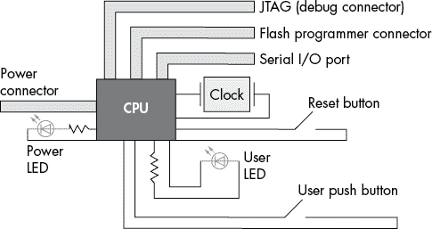

图 3-1：处理器板

电源和时钟驱动 CPU，重置按钮重启 CPU，用户 LED 和按钮用于用户交互，串行端口和连接器用于编程和调试。

### 编程与调试开发板

开发板包含三个有助于编程和调试芯片的设备——一个闪存编程器，一个 JTAG 调试器和一个串行 I/O 设备——所有这些设备通过一个 USB 电缆连接到计算机。（一根电缆，三种设备。）

要对芯片进行编程，我们使用*闪存编程器*，这是一种允许 PC 重新编程芯片内存的设备。重新编程内存就是将程序加载到设备中。

为了方便调试，芯片上有一个 JTAG 端口。JTAG，代表联合测试行动小组（Joint Test Action Group），是一种标准的调试接口。在这个标准发布之前，每个人都创建了自己的调试接口，或者更常见的是直接不做接口，这导致程序员在调试程序时必须非常有创意。要通过 JTAG 端口进行调试，我们需要将其连接到计算机。这是通过一个*调试盒*完成的，调试盒一端连接到开发板上的 JTAG 端口，另一端连接到计算机的 USB 端口。

另一个非常有用的调试和维护工具是打印诊断信息。嵌入式程序的一个问题是哪里打印信息。因为没有显示屏，所以无法将信息打印到屏幕上。将信息打印到日志文件中也很困难，因为没有文件系统。大多数设备设计师做的是在板上放置一个*串口*，这是一个简单的三线通信接口。第九章将详细介绍该设备。

### 设置开发板

Nucleo 开发板的下半部分包含芯片及其支持电路，板的两侧有许多引脚连接到连接器（用于连接外部设备）。其上方是包含编程器、调试器、串口转 USB 设备和 USB 存储设备的支持板。

图 3-2 展示了开发板的组成。

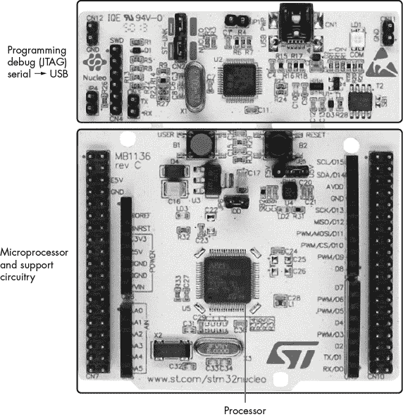

图 3-2：NUCLEO-F030R8 开发板

板上还包含了多个跳线和 LED。*跳线*是小型塑料元件，用于将两个引脚短接在一起。它们用于选择硬件选项，如启用板载调试器（ST-LINK），并应按照图 3-3 所示进行安装。请按照以下步骤操作：

1.  安装带有两个跳线（CN2）的 ST-LINK。这样做会将板载调试盒（ST-LINK）配置为调试板载微控制器。如果移除这两个跳线，您可以使用 ST-LINK 调试其他开发板。

1.  不要安装电源跳线（JP1）。这种配置允许 Nucleo 开发板通过 USB 端口最多吸取 300mA 的电流，从而使用 USB 端口为设备供电。如果您将许多高功耗外设连接到开发板，可以使用 JP1 启用外部电源。本书不使用任何外部硬件，因此请不要安装 JP1。

1.  不要安装 RX-TX 跳线，这是一种将串口的输入和输出短接在一起的调试选项。我们稍后会将串口用作实际的串口，因此请不要安装这个跳线。

1.  将 JP5 跳线安装到正确的位置（U5V）。这样做可以确保开发板通过 USB 端口供电，而不是通过外部电源。

1.  打开测量跳线（JP6）。这是一个低功耗设备。JP6 短接的两个引脚为芯片供电。移除跳线并连接安培计来测量功耗。

CN11 和 CN12 是不使用时存放跳线的位置。将跳线安装到那里不会影响电路。

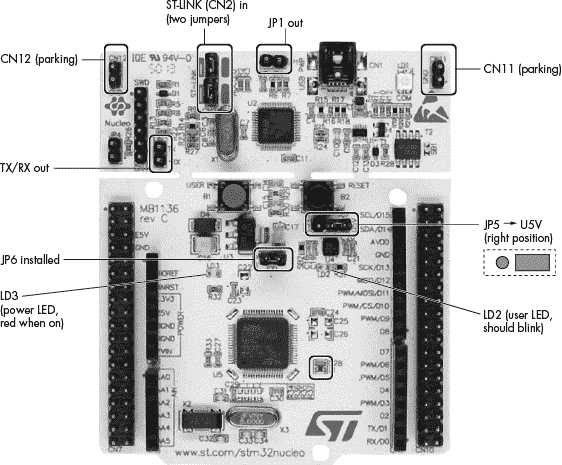

图 3-3：跳线和 LED 位置

现在使用迷你 USB 电缆将设备插入您的计算机。LD1 应该变红，表示编程器已通电。LD2 应该闪烁，因为板子自带一个预安装的程序，该程序会使 LD2 闪烁。（如果您购买了全新的开发板，情况是这样的。如果像我一样从楼道里的朋友那里拿到了第一块开发板，它将包含您朋友上次的实验。）LD3 也应该变红，表示芯片已通电。

## 设置嵌入式项目

在开始编程之前，关闭 STM32 系统工作台中所有打开的编辑窗口。编辑窗口显示的是文件名，而不是项目名，这会导致问题；我们所有的项目都会有一个*main.c*文件，如果有半打*main.c*编辑窗口打开，事情会变得相当混乱。

接下来，通过选择**文件**▶**新建**▶**C 项目**来创建一个嵌入式项目。（这些步骤的详细清单可以在附录中找到。）C 项目对话框应出现（见图 3-4）。

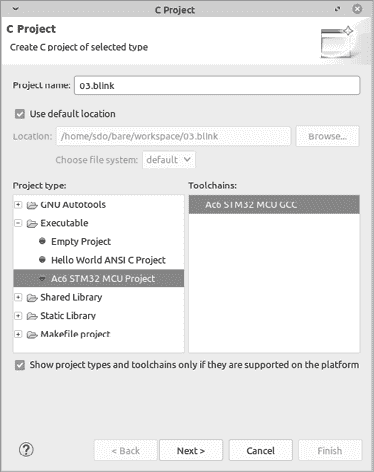

图 3-4：C 项目对话框

在项目名称中输入**03.blink**。在项目类型中选择**Ac6 STM32 MCU 项目**。首次启动时，IDE 会将 GCC ARM 工具链下载到您安装 IDE 的目录，并下载整个 STM32 固件库，其中一部分将被复制到您的项目中。如果您想进一步探索这个库的代码和示例，它使用的缓存目录在 Linux 和 macOS 上是*~/.ac6*，在 Windows 上是*C:\Users\<username>\AppData\Roaming\Ac6*。但请注意，这些示例是为了展示 STM 芯片的功能，初学者可能不容易理解。

点击**下一步**。选择配置对话框，如图 3-5 所示，应会出现。

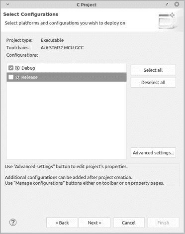

图 3-5：选择配置对话框

保持**调试**选中，并取消选中**发布**。为了简化操作，我们只执行一种类型的构建。点击**下一步**。

接下来是目标配置对话框（见图 3-6）。

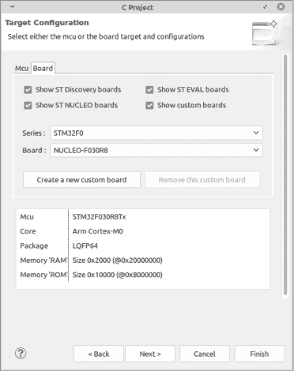

图 3-6：目标配置对话框

对于系列，选择**STM32F0**，对于板卡，选择**NUCLEO-F030R8**。点击**下一步**。

这将带我们进入项目固件配置对话框（见图 3-7）。

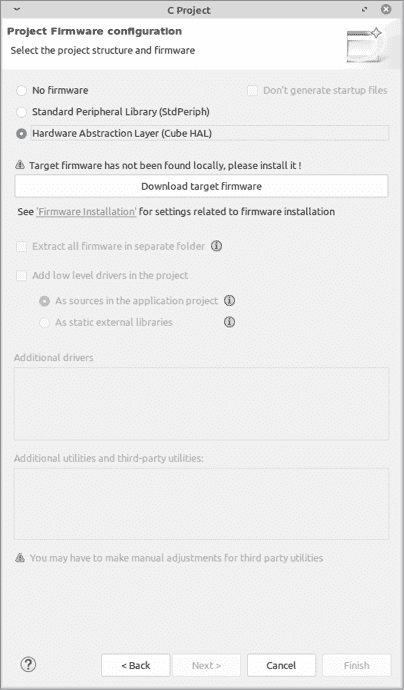

图 3-7：项目固件配置对话框

项目固件配置选项让我们可以使用来自 STMicroelectronics 和其他供应商的免费标准代码。既然其他人已经写好了大部分复杂的代码，那就使用他们的成果吧。选择 **硬件抽象层（Cube HAL）**，然后在出现的界面中点击标有 **下载目标固件** 的按钮。接受许可协议，IDE 将下载固件库。

下载完成后，系统会显示其他选项。保持默认值，然后点击 **完成**。

返回到 C/C++ 项目视图，你应该能在项目列表中看到 *blink* 的条目。点击 *blink* 旁边的三角形，可以看到组成项目的目录列表，再点击 *src* 旁边的三角形展开该目录。双击 *main.c* 使其在编辑窗口中显示，如 图 3-8 所示。

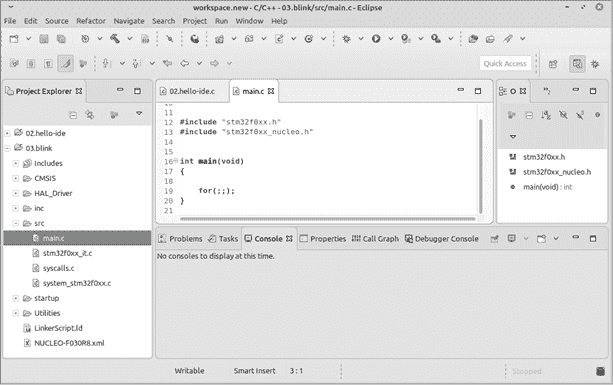

图 3-8：编辑窗口，显示 *main.c*

## 你的第一个嵌入式程序

IDE 方便地为你提供了一个主文件，其中填写了程序的最小功能：注释、Nucleo 板的代码库和一个通用的 `main` 函数。第 3 行旁边的 + 图标表示某些程序行已被 *折叠*，或者被隐藏。点击 + 图标以展开描述文件的长注释：

```
1 /**
2   ************************************************************************
3  * @file    main.c
4  * @author  Ac6
5  * @version V1.0
6  * @date    01-December-2013
7  * @brief   Default main function.
8  *************************************************************************
9 */
```

你可能希望更新此注释，添加你的名字和信息。以 `@` 开头的关键字是为 *Doxygen* 设计的，这是一个复杂且功能全面的系统，用于从大型程序中提取文档。我们不会在小型程序中使用这个工具，所以你可以根据自己的需要编辑该注释。

`main` 函数没有 `return` 语句，因为 `return` 语句将控制权从程序返回给操作系统，但裸机系统没有操作系统。操作系统的一个任务是启动和停止程序（以及其他功能）。由于我们没有操作系统，每当我们的程序停止时，处理器就会停下来，什么也不做。因此，我们不会停止。永远不会。要了解我们是如何实现这一点的，注意第 19 行的 `for(;;);`。这是 C 语言中的“永远循环”（`for(;;)`）和“什么也不做”（分号）的代码。

但是没有操作系统，我们该如何启动呢？当处理器开启或复位时，我们的程序就开始运行（因此板子上有一个大黑色复位按钮）。

按目前的情况，我们的程序什么也不做，并且要花很长时间才能做到这一点。让我们添加一些代码来做点什么。

### 初始化硬件

首先，我们需要初始化硬件。为此，我们将首次使用 HAL 库。HAL 软件层的设计目的是隐藏与芯片工作相关的所有复杂细节。例如，我们必须在使用芯片来定时 LED 的闪烁之前，初始化片上时钟。自己完成这一工作将需要编程特定的 *I/O* *寄存器*，它们直接控制 I/O 设备的行为。这些是硬件的一部分。

尽管我们可以通过查看芯片的 700 页参考手册来确定需要编程的寄存器，然后进行所有计算以确定应该编程的值，但这将会非常繁琐。

相反，我们可以使用 HAL 软件，特别是 `HAL_Init` 函数，来为我们完成所有这些工作。`HAL_Init` 函数会编程系统时钟，这样我们以后就可以用它来控制 LED 的定时。请在 `main` 函数的第一个大括号后插入对 `HAL_Init` 的调用，如下所示：

```
int main(void)
{
    HAL_Init();
```

一般来说，最佳实践是每使用一对大括号就缩进四个空格。C 语言并不要求这样做，但这样可以让程序更易于理解。（四个空格并没有什么神奇之处。有些程序使用两个空格，有些使用八个空格，还有一些奇怪的人使用三个空格。）

这就解决了基本硬件的问题。

### 编程 GPIO 引脚

芯片有多个 *通用输入/输出引脚*，简称 *GPIO 引脚*，我们可以编程使其接收输入或发送输出，用于各种功能。例如，我们可以将一个引脚编程为输出，并将其连接到一个 LED（这正是我们在本程序中要做的）。另外，我们可以将一个引脚编程为输入，并将其连接到开关（这将在下一章中进行）。

一些微控制器的引脚可以用作模拟输入或输出。大多数 GPIO 引脚只能是开或关。模拟引脚可以处理开和关之间的电压，例如 32765/65536 开。其他引脚可以连接到 *USART*（串行 I/O 控制器）或 *I2C 总线*（简单 I/O 总线）来与 I2C 外设芯片进行通信。好消息是这些引脚可以做很多事情。坏消息是我们必须编程告诉芯片，“不要做那些复杂的事情。当我想让你开时就开，想让你关时就关。”

我们将编程连接到用户 LED（LED2）的 GPIO 引脚。我们需要告诉芯片，我们将此引脚用作输出；然后我们必须告诉它关于如何使用这个引脚的详细信息。这包括设置 GPIO 时钟，它控制引脚响应的速度。HAL 固件可以完成大部分工作，但我们需要通过将配置结构信息传递给 `HAL_GPIO_Init` 函数来告诉 HAL 要做什么（C 语言的结构概念将在第七章中详细介绍）：

```
// LED clock initialization
LED2_GPIO_CLK_ENABLE();

// Initialize LED
GPIO_InitTypeDef GPIO_InitStruct;
GPIO_InitStruct.Pin = LED2_PIN;
GPIO_InitStruct.Mode = GPIO_MODE_OUTPUT_PP;
GPIO_InitStruct.Pull = GPIO_PULLUP;
GPIO_InitStruct.Speed = GPIO_SPEED_FREQ_HIGH;
HAL_GPIO_Init(LED2_GPIO_PORT, &GPIO_InitStruct);
```

我们将引脚设置为开启状态，以便向`LED2_PIN`传输数据，该引脚连接到用户 LED。接下来，我们指定该引脚将用于输出，因为我们是向 LED 发送数据，而不是获取数据，并将模式设置为推挽模式。这个模式由你连接到输出引脚的硬件决定。在这种情况下，我们的电路需要推挽模式。此选项控制用于驱动 GPIO 引脚的内部硬件。STM 芯片参考资料展示了电路是如何组织的（或者说，它展示了给硬件工程师看芯片如何组织，然后他们会告诉你应该使用哪种模式）。

上拉标志配置 GPIO 引脚，使其在输入模式下有一个上拉电阻。对于输出引脚而言，这个设置无关紧要，但仍然需要设置。我们将其设置为`GPIO_PULLUP`，实际上这并没有任何意义。最后，我们通过`GPIO_SPEED_FREQ_HIGH`将速度设置为高。

### 切换 LED

现在去掉`for(;;)`语句后的最后一个`;`。记住，这个分号基本上意味着“什么也不做”。为了引入`for`循环应该执行的代码，添加以下新行：

```
for(;;) {
    // Toggle LED2
    HAL_GPIO_TogglePin(LED2_GPIO_PORT, LED2_PIN);
    HAL_Delay(400); // Delay 400 ms
}
```

`HAL_GPIO_TogglePin`函数切换`LED2` GPIO 引脚。在我们的芯片中，GPIO 引脚按 32 位一组组织，统称为*GPIO 寄存器*。我们的引脚位于寄存器`LED2_GPIO_PORT`中。为了告诉函数切换哪一个 32 个 GPIO 引脚，我们指定了`LED2_PIN`。

切换引脚后，我们需要暂停一段时间；否则，LED 会闪烁得太快，以至于我们看不见。我们使用`HAL_Delay`函数延迟 400 毫秒（ms）。

### 构建完整的程序

我们的完整程序如下所示：

```
/*
 * Blink the user LED on the board.
 *
 * A simple program to write, but getting it
 * working is going to require learning a
 * lot of new tools.
 */

#include "stm32f0xx.h"
#include "stm32f0xx_nucleo.h"

int main(void)
{
    HAL_Init();
    // LED clock initialization
    LED2_GPIO_CLK_ENABLE();

    // Initialize LED
    GPIO_InitTypeDef GPIO_InitStruct;
    GPIO_InitStruct.Pin = LED2_PIN;
    GPIO_InitStruct.Mode = GPIO_MODE_OUTPUT_PP;
    GPIO_InitStruct.Pull = GPIO_NOPULL;
    GPIO_InitStruct.Speed = GPIO_SPEED_FREQ_HIGH;
    HAL_GPIO_Init(LED2_GPIO_PORT, &GPIO_InitStruct);

    for(;;) {
        // Toggle LED2
        HAL_GPIO_TogglePin(LED2_GPIO_PORT, LED2_PIN);
        HAL_Delay(400); // Delay 400 ms
    }
}
```

现在通过选择**项目**▶**构建项目**来构建项目。如果一切顺利，你应该在问题窗口中看不到任何问题。如果有问题，修复它们然后再试一次。

在控制台窗口中，你会看到 IDE 调用了`make`，然后调用了名为`arm-none-eabi-gcc`的 GCC 编译器。这是我们嵌入式芯片的编译器。

通过选择**运行**▶**运行**来启动程序。（确保在主菜单上点击**运行**。你也可以右键点击项目，但那样会运行一个稍有不同的命令。）运行命令会隐藏许多操作。首先，IDE 检查项目是否需要构建。然后，它运行一个程序，该程序获取程序文件并与开发板上的闪存编程器通信，将程序烧录到内存中。最后，编程器告诉芯片重置并启动我们的程序。

结果，你应该看到绿色 LED 缓慢闪烁。

## 探索构建过程

如图 3-9 所示的控制台窗口包含了构建过程的输出。（如果该窗口为空，你可以通过**项目**▶**清理**，然后**项目**▶**构建项目**来重新创建内容。）

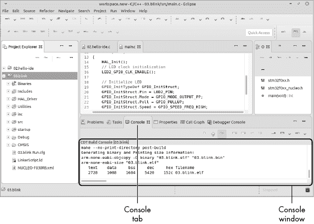

图 3-9：控制台窗口

让我们向上滚动，看看构建过程中的一行，这是 GCC 编译器的典型调用：

```
arm-none-eabi-gcc -mcpu=cortex-m0 -mthumb -mfloat-abi=soft \
-DSTM32 -DSTM32F0 -DSTM32F030R8Tx -DNUCLEOF030R8 -DDEBUG
-DSTM32F030x8 \ 
-DUSEHALDRIVER \
-I"/home/sdo/bare/workspace/blink/HALDriver/Inc/Legacy" \
-I"/home/sdo/bare/workspace/blink/Utilities/STM32F0xx-Nucleo" \
-I"/home/sdo/bare/workspace/blink/inc" \
-I"/home/sdo/bare/workspace/blink/CMSIS/device" \
-I"/home/sdo/bare/workspace/blink/CMSIS/core" \
-I"/home/sdo/bare/workspace/blink/HALDriver/Inc" \
-O0 -g3 -Wall -fmessage-length=0 -ffunction-sections \
-c -MMD -MP -MF"HALDriver/Src/stm32f0xxlltim.d" \
-MT"HALDriver/Src/stm32f0xxlltim.o" \
-o "HALDriver/Src/stm32f0xxlltim.o" "../HALDriver/Src/stm32f0xxll_tim.c"
```

这是控制台窗口中的一行，为了格式化被拆分开来。如你所见，编译器被提供了许多额外的选项。以下是此命令行中的关键项目：

1.  `arm-none-eabi-gcc` 这是一个 GCC 编译器，但与本地 GCC 不同，本地 GCC 为计算机编译，而它是一个交叉编译器，为 ARM 处理器生成代码。没有底层操作系统（因此使用 `none` 选项），该系统为嵌入式应用程序二进制接口（`eabi`）设计，定义了程序各部分如何与彼此及外部世界进行通信。

1.  `-mcpu=cortex-m0` 生成适用于 `cortex-m0` 版本 CPU 的代码。ARM 有多个处理器版本，这个标志告诉 GCC 使用哪一个版本。

1.  `-mthumb` 一些 ARM 处理器可以执行两种不同的指令集。一个是完整的 32 位 RISC 指令集，执行速度非常快，但占用大量内存；另一个是 *thumb* 指令集，执行速度较慢，但更加紧凑。此指令告诉 GCC 我们需要使用 thumb 代码（如果你使用的是内存有限的廉价芯片，这通常是个好主意，而我们正是使用这种芯片）。

1.  `-mfloat-abi=soft` 我们的处理器没有浮点硬件，因此这个标志告诉 GCC 用软件模拟浮点运算。（有关浮点运算的更多内容，请参见第十六章。）

1.  `-O0` 指定优化级别为 `0`（即不优化）。这会关闭编译器的一个功能，避免编译器分析代码并执行各种加速代码的技巧。这些技巧使得底层代码更难以理解和调试。

1.  `-g3` 启用调试功能。

1.  `-Wall` 启用名为 `all` 的警告集合，其中包含几乎所有有用的警告。

1.  `-c` 将单个源文件编译为单个目标文件。

1.  `-o"HALDriver/Src/stm32f0xxll_tim.o"` 将目标文件存储在指定文件中。

1.  `"../HALDriver/Src/stm32f0xxll_tim.c"` 指定源文件的名称。

其他选项告诉编译器库的包含文件在哪里以及这些文件应如何配置。（第十二章中我们将讨论 `-D` 指令。）`-I` 指令告诉编译器除标准包含文件目录外，还要在指定的目录中搜索包含文件。

除了编译命令外，我们还可以看到链接器命令：

```
arm-none-eabi-gcc -mcpu=cortex-m0 -mthumb -mfloat-abi=soft \
-T"/home/sdo/bare/workspace/blink/LinkerScript.ld" \
-Wl,-Map=output.map -Wl,--gc-sections \
-o "blink.elf" @"objects.list" -lm '''
```

关键指令 `-T"/home/sdo/bare/workspace/blink/LinkerScript.ld"` 告诉链接器使用 *LinkerScript.ld* 来指定程序各部分的位置。（第十一章中将详细讨论此内容。）

构建过程以以下两个命令结束：

```
arm-none-eabi-objcopy -O binary "blink.elf" "blink.bin"
arm-none-eabi-size "blink.elf"
   text       data	    bss	    dec	    hex	filename
   2620       1088	   1604	   5312	   14c0	blink.elf
```

`arm-none-eabi-objcopy` 命令将 *.elf* 文件转换为原始二进制映像。ELF 是一种复杂的文件格式，它告诉加载器在哪里放置各种内容。原始二进制映像就是将写入闪存的内容。

最后，`arm-none-eabi-size` 打印出最终程序的大小（表 3-1）。

表 3-1：程序内存段大小

| **段** | **描述** |
| --- | --- |
| `text` | 只读数据的大小（进入闪存） |
| `data` | 需要初始化的读/写数据的大小（进入 RAM） |
| `bss` | 初始化为零的读/写数据的大小（进入 RAM） |
| `dec` | 十进制总大小 |
| `hex` | 十六进制总大小 |

我们将在后续章节中探索不同类型的内存，如闪存和 RAM。目前，理解这一点：此步骤是为了回答问题，“如果我继续编程，什么时候内存会用尽？”

## 探索项目文件

STM32 的系统工作台已经为我们的项目创建并下载了许多文件。让我们来查看这些关键文件。

我们可以通过点击目录名称旁边的三角形来查看我们的 *src* 目录。它包含了 表 3-2 中列出的文件。

表 3-2：*src* 目录文件

| **文件** | **描述** |
| --- | --- |
| *main.c* | 主程序，我们的所有代码都在这里。 |
| *stm32f0xxit.c* | 中断服务例程。你将在第十章学习关于中断的知识。对于这个简单的程序，我们关心的唯一中断是系统时钟，即便如此，我们也不会直接看到它的细节。它被 `HAL_Delay` 使用。 |
| *syscalls.c* | 不使用的虚拟函数。 |
| *Systemstm32f0xx.c* | 支持系统时钟的代码（将在后面的章节中解释）。 |

*startup* 目录包含一个文件：*startup_stm32f030x8.S*。这是一个汇编语言文件，执行足够的初始化操作，使得处理器可以运行 C 代码；然后跳转到 C 启动代码。这是按下复位按钮时执行的第一条指令。

*inc* 目录包含一个文件 *stm32f0xx_it.h*，用于告诉其他程序关于 *stm32f0xx_it.c* 中的中断处理程序。这是一个非常小且无聊的文件。

现在我们来看 *HAL_Driver* 目录。这个目录包含大约 130 个文件，这些文件提供了一个 HAL 库，可供程序使用。HAL 隐藏了不同 ARM CPU 具有不同能力的事实。例如，`HAL_Init` 函数将初始化所有硬件。如果你使用的是 Cortex-M0 处理器，Cortex-M0 版本将初始化所有 Cortex-M0 硬件。如果你使用的是 Cortex-M4 处理器，所有 Cortex-M4 硬件将被设置。这个目录中有这么多文件，因为我们使用的板子有许多硬件。（而且这是系统的简化版本。）

*CMSIS* 目录包含了旨在支持 HAL 层的低级代码。

最后，*Debug* 目录包含所有与调试构建相关的文件。特别是，它包含一个名为 *Makefile* 的 `make` 输入文件和一些生成的文件（参见 表 3-3）。

表 3-3：*Debug* 目录中的生成文件

| **文件** | **描述** |
| --- | --- |
| *blink.elf* | 我们的 ELF 格式程序（可执行文件格式） |
| *blink.bin* | 我们的程序的内存映像（原始代码） |
| *output.map* | 程序的内存映射 |

我们列表中的最后一个文件是顶层文件：*LinkerScript.ld*。它告诉链接器我们的芯片内存布局是什么样的，以及在哪里加载程序的各个部分。更多内容将在第十一章介绍。

## 调试应用程序

我们的闪烁程序很简单且能正常工作，但以后我们会写更复杂的程序，而这些程序中会有 bug。由于我们正在编程的板子有一个如此强大的调试器，不妨从现在开始学习如何使用它。通过选择**运行**▶**调试**来启动调试器，如图 3-10 所示。

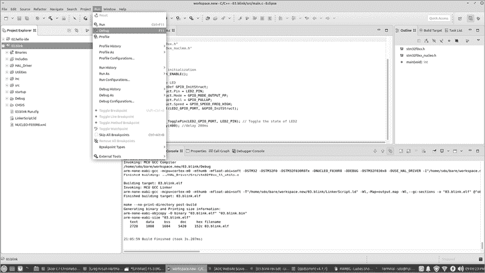

图 3-10：启动调试器

然后，IDE 会询问您要运行什么类型的调试器，如图 3-11 所示。请选择**Ac6 STM32 C/C++ 应用程序**。

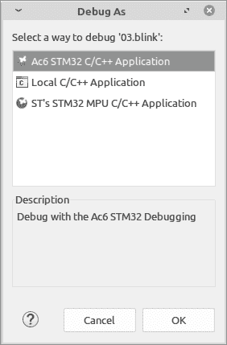

图 3-11：调试器选择

系统会询问是否要“切换到调试视图”。请选择**是**。系统随后会自动执行若干步骤：

1.  它构建了软件。

1.  IDE 通过闪存编程器将程序下载到芯片。

1.  调试器通过 JTAG 接口附加到设备。

1.  调试器在`main`的第一行设置了断点。

1.  断点告诉芯片在执行`main`的第一行之前停止。

1.  微处理器复位，程序运行到`main`。

1.  当程序执行到`main`的断点时，调试器重新获得控制权。

一旦调试器到达断点，您就准备好调试程序，如图 3-12 所示。此时，程序已经执行到`main`函数的第一条语句，并在调用`HAL_Init`之前暂停。

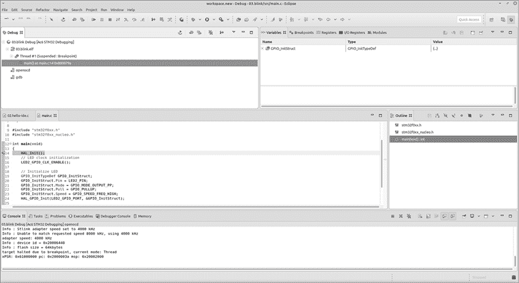

图 3-12：调试程序

现在我们已经掌控了控制权，接下来就用它。使用命令**运行**▶**单步跳过**来逐行执行程序。我们会执行多次，所以记得快捷键是 F6。继续使用 F6 单步跳过，直到进入`for`循环。

请注意，每次执行`HAL_GPIO_TogglePin(LED2_GPIO_PORT, LED2_PIN)`函数时，LED 会开或关。由于您处于`for`循环中，您会在切换和延迟之间不断来回。如果您足够细心，您会注意到执行`HAL_Delay`调用大约需要 400 毫秒（即两分之五秒）。如果您想更清楚地观察延迟，可以将该值更改为一个更大的值。

## 单步执行程序

现在我们将深入了解这个程序的一些细节。大多数概念将在后面的章节中更深入地讲解，但我现在会给你一个初步的了解。首先，让我们用**运行**▶**终止**来中止当前的调试会话。现在，我们重新开始，选择**运行**▶**调试**。你应该会回到调用`HAL_Init`的那一行。要逐步执行程序，使用另一个命令，**运行**▶**逐过程执行**（或快捷键 F5）。

突然，文件*stm32f0xx_hal.c*出现在我们的编辑窗口中（参见图 3-13）。这个文件是从哪里来的？


图 3-13：调试*stm32f0xx_hal.c*

我们调用的过程是`HAL_Init`。该过程在*stm32f0xx_hal.c*中定义，因此当我们进入`HAL_Init`调用时，调试器会自动打开这个文件。或者，使用“Step Over”命令会将该语句（在本例中为`HAL_INIT();`）视为一个整体并跳过该函数，隐藏所有细节。

“Step Into”命令知道我们正在调用一个函数，并进入它的代码。如你所见，支持我们这个小程序需要大量额外的代码。当你在 PC 上编程时，代码对你是隐藏的，很难获取其源代码。STM32 工作台在*HAL_Driver/Src*目录中为你提供了所有这些代码。

除了显示函数内部的代码，调试器还可以显示我们程序中所有变量的状态。要看到这一点，选择**运行**▶**逐过程执行**（或按 F6 键）大约六次，直到你回到*main.c*中的那一行，选择要使用的引脚。在屏幕的右上角，你会看到一个标题为“变量”的面板（参见图 3-14）。

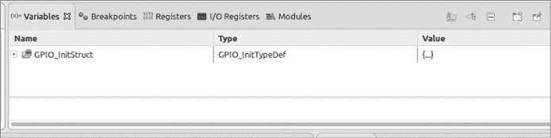

图 3-14：变量面板

在我们的程序中，我们定义了一个名为`GPIO_InitStruct`的变量。在变量面板中，名称前面的+号表示`GPIO_InitStruct`是一个*复杂*变量，这意味着它不仅仅包含一个简单的整数、布尔值或其他单一的值。要查看其中的所有组件，可以通过点击+图标来展开它（参见图 3-15）。

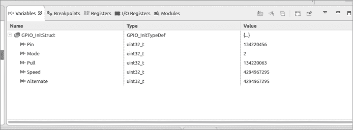

图 3-15：展开的变量

你将在后面的章节中学习到`GPIO_InitStruct`的各个组件，以及如何自己创建变量。`GPIO_InitStruct`变量是由一位程序员创建的，他阅读了我们芯片的 700 页参考手册，并设计了一个变量来存储这些信息。不管你信不信，这个变量大大简化了手册中呈现的内容：仅关于 GPIO 子系统的技术信息就压缩了大约 30 页。

现在逐步执行接下来的几条语句，以查看该变量各个组件的值。

## 总结

我尽量使这个程序尽可能简单，但正如你所看到的，今天的复杂芯片即使是最简单的操作也需要一些工作。让程序运行需要大量的支持。

在第一章中，我们的“Hello World”程序需要的文件数量与这里提到的差不多，但它们是隐式存在的。例如，初始化文件作为 GCC 包的一部分安装。在我们的闪烁项目中，文件*startup_stm32f030x8.S*必须显式包含。

本章给你带来了大量的新概念。如果你还不完全理解它们，别担心，我们将在后续章节深入探讨。

## 编程问题

1.  尝试更改`Hal_Delay();`语句中的延迟，以使闪烁频率变长或变短。

1.  查看*LinkerScript.ld*以找到以下问题的答案：

    1.  你有多少闪存（只读存储）？

    1.  你有多少 RAM（读/写内存）？

1.  查看文件*output.map*并确定`Reset_Handler`的实际地址。

1.  对于中级读者：修改程序，使其先将 LED 打开一段短时间，然后再长时间关闭。

## 问题

1.  IDE 生成了哪些文件，它们包含了什么？

1.  在你的系统中，IDE 将编译器存放在哪里？

1.  商用 JTAG 调试器是什么样子的？它多少钱？如何将其连接到典型的开发板上？（而且，庆幸你得到了一个集成系统！）
