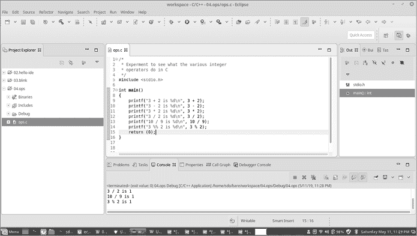

# 数字与变量


现在我们已经写了一个简单的程序，是时候让机器做一些实际的工作了。在这一章中，你将学习如何操作数字。

作为嵌入式程序员，我们非常关心这些数字到底在做什么。例如，数字 32 可以表示一个牧场里的羊的数量，也可以表示 GPIO 引脚#4 的电平，控制开启大红色警告灯。更糟糕的是，我们的 STM32 将最多 32 个 GPIO 引脚组合成一个数字，因此，32 可能表示“开启大红灯”，而 34 可能表示“开启大红灯并发出警报”。为了控制我们的设备，我们需要精确地知道这些数字到底在做什么。因此，我们将深入探讨计算机如何看待这些数字。

一旦你知道了一个数字是什么，你就可以学会如何使用变量来存储程序中的信息。接下来，你将练习操作硬件的 I/O 寄存器中的位，来开启或关闭各种功能。在此过程中，你将看到第三章中的程序是如何在后台工作的。

## 操作整数

我们将从整数开始，或者说是从整数开始。整数是没有小数点的数字，例如 37、45、-8 和 256。

表 4-1 列出了你可以在 C 语言中对数字进行的操作。

表 4-1：C 语言中的数字操作符

| **操作符** | **描述** |
| --- | --- |
| `+` | 加 |
| `-` | 减 |
| `*` | 乘 |
| `/` | 除（截断为整数） |
| `%` | 取模（返回除法后的余数） |

以下的列表展示了这些操作符是如何工作的：

```
#include <stdio.h>

int main()
{
    printf("3 + 2 is %d\n", 3 + 2);
    printf("3 - 2 is %d\n", 3 - 2);
    printf("3 * 2 is %d\n", 3 * 2);
    printf("3 / 2 is %d\n", 3 / 2);
    printf("10 / 9 is %d\n", 10 / 9);
    printf("3 %% 2 is %d\n", 3 % 2);
    return (0);
}
```

我们在`printf`语句中展示每一个操作，它会打印出结果。要使用`printf`打印计算结果，请在字符串中放置一个`%d`，表示你想要显示一个数字，然后将计算结果作为第二个参数传给`printf`。请注意，如果你想打印出`%`表示取模操作，你需要将其指定两次。

要查看此程序的输出，我们需要将其导入到我们的 IDE 中。启动 STM32 的 System Workbench，然后按照第二章中的步骤创建一个程序。（附录中的检查表总结了这些步骤。）不过这次，我们不是创建一个“Hello World”程序，而是创建一个空的本地 C/C++项目，因此选择**C 托管构建**作为模板。

在项目类型下，选择**可执行文件**▶**空项目**。接下来，通过选择**文件**▶**新建**▶**源文件**来创建程序文件。

将程序文本输入编辑窗口，然后保存文件。像第二章中那样构建二进制文件并运行它。程序应在控制台窗口的底部显示其输出（见图 4-1）。



图 4-1：运行结果

如你所见，程序应该打印出它执行的每一个计算结果。

### 声明变量以存储整数

我们的程序对固定的数字进行了操作，但我们也可以使用变量来存储可以变化的信息。在任何变量可以使用之前，必须先*声明*它。变量声明的格式如下：

```
`type variable_name``; //` `Comment explaining what this variable does`
```

例如，使用`int`作为类型表示该变量是一个整数。准确来说，它是计算机最容易处理的整数类型。我们将在本章稍后讨论其他类型的整数。

变量名以字母开头，且只能包含字母、数字和下划线。STM32 固件库采用驼峰命名法，变量名中的单词首字母大写，因此为了兼容，我们在本书中贯穿使用驼峰命名法：

```
startTime   currentStation  area
```

虽然变量名可以以下划线开头，但这种命名方式被视为系统函数保留名，不应在普通编程中使用。此外，绝不要将`l`（小写*L*）或`O`（大写*O*）用作变量名。如果原因不明显，请考虑以下代码：

```
O = l + 1 + O * 0;  // This sort of programming will get you shot.
```

从技术上讲，你可以省略变量声明中的注释。然而，包含注释能够让之后与代码一起工作的人了解你声明该变量的原因及其功能。换句话说，它帮助你创建一个迷你词典或术语表。

### 为变量赋值

一旦声明了一个变量，就可以通过赋值语句为其赋值。赋值语句的一般形式如下：

```
`variable` = `expression`;
```

这告诉计算机计算表达式的值并将其存储在变量中。然后，可以在任何需要整数的地方使用这些变量，例如`printf`语句。以下程序演示了变量声明、赋值和使用：

**var.c**

```
/*  
 * A program to sum two variables
 */  
#include <stdio.h>

int main()
{
    int aNumber;        // Some number
    int otherNumber;    // Some other number

    aNumber = 5;
    otherNumber = 7;

    printf("Sum is %d\n", aNumber + otherNumber);
    return (0);
}
```

该程序创建了两个变量，`aNumber` 和 `otherNumber`，然后为它们赋值并打印它们的和。现在将此程序输入到 System Workbench for STM32 中。

### 初始化变量

当你在程序中声明一个变量时，你告诉 C 编译器为一个整数（`int`）分配内存空间。但在你为它指定值之前，该变量被认为是*未初始化的*；它可能包含任何来自上次内存使用的随机垃圾值。

要查看我们刚刚编写的程序中的工作情况，可以打开调试器，在程序逐步执行时查看变量面板。在赋值之前，我们的两个变量，`aNumber` 和 `otherNumber`，的值是零。但未初始化的变量可能会有任何值；它们在这里是零，纯粹是运气使然。

我们可以通过在声明时为变量添加赋值来初始化它：

```
int aNumber = 5;           // Some number
```

在大多数情况下，这是一个好主意，因为它确保我们的程序使用的是预期的值。让我们重写程序，添加这些初始化器：

```
/*  
 * A program to see if we can sum two variables
 */  
#include <stdio.h>

int main()
{
    int aNumber = 5;        // Some number
    int otherNumber = 7;    // Some other number

    printf("Sum is %d\n", aNumber + otherNumber);
    return (0);
}
```

一旦我们做出更改，就可以删除程序中稍后初始化变量的行。

## 整数大小和表示

C 语言有其他整数类型，除了 `int`，它们用于表示不同大小的数字。

随着计算机的发展，人们发现最有效的内存组织方式是将内存分为 8 位一组，称为 *字节*。计算机允许你将多个字节组合成 2 字节、4 字节和 8 字节的值，`int` 类型告诉 C 语言使用适合你所使用计算机的最有效字节数来定义一个整数。这可以是一个 16 位（2 字节）整数，或者 32 位（4 字节）整数，取决于系统。我们芯片的编译器，即 ARM Cortex-M0 CPU，使用的是 32 位整数。

为了使程序更加高效，C 语言让你选择所需的整数类型。例如，你可能只需要存储范围在 0 到 100 之间的数字。对于这种情况，你不需要使用完整大小的整数，因此可以使用 `short int`，它像整数一样，但占用更少的空间。（严格来说，C 标准只规定 `short int` 不大于常规的 `int`，但在大多数实现中，它通常较小。）

以下声明了一个 `short int`：

```
short int shortNumber;  // A shorter-than-normal integer
```

一个比正常整数更长的整数可以使用修饰符 `long` 来声明：

```
long int longNumber;    // A longer-than-normal integer
```

当计算机获得了高效处理更长数字的能力时，人们需要一种能够容纳比 `long` 更多位数的整数类型。结果就是（有些愚蠢的）`long long` 整数：

```
long long int veryLongNumber;   // An even longer integer
```

C 标准并未定义每种整数类型的大小。它们可能都具有相同的大小，你仍然可以使用标准编译器。然而，它确实保证了以下几点：

```
sizeof(short int) <= sizeof(int) <= sizeof(long int) <= sizeof(long long int)
```

`sizeof` 运算符返回存储一个变量或类型所需的字节数。

让我们通过一个简短的程序来打印不同整数类型的大小，看看在我们系统上的编译器中每种整数类型占用多少空间：

**size.c**

```
/*
 * Show different number types.
 */
#include <stdio.h>

int main()
{
    short int aShortInt;        // Short integer
    int aInteger;               // Default integer
    long int aLongInt;          // Long integer
    long long int aLongLongInt; // Long long integer

    printf("Size of (short int) = %ld (bytes) %ld bits\n",
            sizeof(aShortInt), sizeof(aShortInt)*8);

    printf("Size of (int) = %ld (bytes) %ld bits\n",
            sizeof(aInteger), sizeof(aInteger)*8);

    printf("Size of (long int) = %ld (bytes) %ld bits\n",
            sizeof(aLongInt), sizeof(aLongInt)*8);

    printf("Size of (long long int) = %ld (bytes) %ld bits\n",
            sizeof(aLongLongInt), sizeof(aLongLongInt)*8);

    return (0);
}
```

之前，我们用 `%d` 打印一个数字。在这个程序中，我们使用 `%ld`，因为 `sizeof` 返回的是一个 `long int`，而 `%ld` 用来打印 `long int` 类型的数字。

该程序在我的系统上产生以下输出：

```
Size of (short int) = 2 (bytes) 16 bits
Size of (int) = 4 (bytes) 32 bits
Size of (long int) = 8 (bytes) 64 bits
Size of (long long int) = 8 (bytes) 64 bits
```

从这里我们可以看出，`long int` 的大小与 `long long int` 的大小相同。然而，这只适用于这个编译器和系统（在 x86_64 处理器上的 GNU GCC）。不同的编译器可能会有不同的实现方式。

### 数字表示法

假设我们有五头牛。在英语中，我们可以将这个数字表示为“five”，“5”或“V”。同样，在 C 语言中，你可以使用四种数字表示法：十进制、二进制、八进制和十六进制。

人们通常使用十进制（基数 10），但计算机存储数字是用二进制（基数 2），因为二进制电路便宜且容易制造。例如，我们可以使用十进制写出以下赋值语句：

```
aNumber = 5;
```

这个相同的语句可以用二进制这样写：

```
aNumber = 0b101;    // 5 in binary
```

前缀 0b 表示接下来是二进制数。（我们也可以使用 0B，但它更难阅读。）

或者，我们可以使用八进制（基数 8）：

```
aNumber = 05;   // 5 in octal
```

最后，我们可以使用十六进制（基数 16）：

```
aNumber = 0x5;  // 5 in hexadecimal
```

二进制数字占用很多空间，因此为了使其更加紧凑，在编程中我们常常使用十六进制表示法来表示精确的二进制值。每一个十六进制数字对应四个二进制位，如表 4-2 所示。

表 4-2：二进制与十六进制的转换

| **二进制** | **十六进制** | **二进制** | **十六进制** |
| --- | --- | --- | --- |
| 0000 | 0 | 1000 | 8 |
| 0001 | 1 | 1001 | 9 |
| 0010 | 2 | 1010 | A |
| 0011 | 3 | 1011 | B |
| 0100 | 4 | 1100 | C |
| 0101 | 5 | 1101 | D |
| 0110 | 6 | 1110 | E |
| 0111 | 7 | 1111 | F |

如你所见，1111 1100b 等同于十六进制值 0xFC。同样地，0xA5 是 1010 0101b。通过使用这个表格，你可以快速且轻松地在二进制和十六进制之间转换。

尽管计算机将数字存储为一组位，但这些位的含义完全由我们决定。例如，位模式 0000 0101 如果我们将其解释为二进制数字，则表示 5。但 0000 0101 也可以表示 10,005。是怎么得到这个数字的？我随便编的。在这种情况下，我随意选择了一个奇怪的值。其他任意的含义可能包括“五月”、字母“E”或“LED0+LED2”。

一种不太常见但仍然有用的位模式映射显示在表 4-3 中。

表 4-3：位模式到数字的映射

| **位模式** | **含义** |
| --- | --- |
| 000 | 0 |
| 001 | 1 |
| 011 | 2 |
| 010 | 3 |
| 110 | 4 |
| 111 | 5 |
| 101 | 6 |
| 100 | 7 |

初看之下，它看起来是随机的。但如果仔细观察，你会发现每个数字之间只有一位发生变化。这使得它非常适合用在编码器中（参见图 4-2）。它实际上是一种标准的位模式编码，称为*格雷码*。


图 4-2：一种格雷编码器

记住，C 语言在你告诉它如何解释位模式之前并不知道如何处理这些位模式。

### 标准整数

整数类型的一个大问题是，标准并没有告诉你它们的大小，只告诉你它们的相对大小。如果你想写入一个 32 位的设备，你就得猜测哪种`int`类型的大小符合你的要求。

猜测和编程并不容易结合在一起，因此人们发明了使用名为*条件编译*（参见第十二章）和其他技巧的系统，用来定义包含精确位数的新类型：`int8_t`、`int16_t`、`int32_t`和`int64_t`。类型的名称指定了整数的大小。例如，`int32_t`类型无论`int`的大小如何，始终包含 32 位。像大多数好主意一样，这些新类型被广泛使用——如此广泛，以至于 C 标准委员会决定将它们添加到语言中，并通过`stdint`库实现。它们并不是 C 的内建类型，所以你需要通过以下声明来包含它们：

```
#include <stdint.h>
```

清单 4-1 展示了我们新整数类型的实际应用。

```
/*
 * Demonstrate different sizes of integers.
 */
#include <stdio.h>
#include <stdint.h>

int main()
{
    int8_t   has8bits = 0x12;               // 8-bit integer
    int16_t has16bits = 0x1234;             // 16-bit integer
    int32_t has32bits = 0x12345678;         // 32-bit integer
    int64_t has64bits = 0x123456789abcdef0; // 64-bit integer

    printf(" 8 bits %x\n", has8bits);
    printf("16 bits %x\n", has16bits);
    printf("32 bits %x\n", has32bits);
    printf("64 bits %lx\n", has64bits);
    return (0);
}
```

清单 4-1：整数演示

在这个程序中，我们使用格式字符`%x`以十六进制打印数字。具体来说，`%x`格式字符打印一个`int`的十六进制值，但由于一些幕后操作，我们也可以对`int8_t`、`int16_t`和`int32_t`使用它，这种操作被称为*参数提升*。

C 语言是一种有点懒惰的语言。因为在处理器是 32 位寄存器的情况下，传递一个 16 位整数给`printf`很困难，C 语言将`int16_t`转换或*提升*为`int32_t`进行这一次操作，这让我们可以使用`%x`来处理`int16_t`。类似地，我们也可以对`int8_t`使用`%x`，因为它也会被提升为`int32_t`。（严格来说，C 语言标准指出提升*可能*发生，而不是强制要求它。这个代码在我们的 x86_64 机器和这个编译器上能正常工作，但在其他系统上可能不适用。）

现在我们来讨论`int64_t`。如果 C 语言将其转换为`int`（`int32_t`），我们将失去一半的数值。C 语言对此没有办法，所以它将`int64_t`参数作为`int64_t`传递。格式也需要从`%x`（`int`）更改为`%lx`（`int64_t`）以打印更长的值。

读者的调查：尝试在示例中将`%lx`更改为`%x`，看看会得到什么结果。

### 无符号整数类型

在上一节中，我们使用了有符号整数类型，它们可以是正数或负数。无符号整数类型只保存正值，并且比有符号整数类型更简单。标准的无符号类型有`uint8_t`、`uint16_t`、`uint32_t`和`uint64_t`。`uint8_t`是一个无符号的 8 位整数，可以存储从 0（0000 0000b）到 255（1111 1111b）的数字。无符号整数类型的范围如表 4-4 所示。

表 4-4：无符号整数类型的范围

| **类型** | **最小值** | **最大值** |
| --- | --- | --- |
| `uint8_t` | 0000 0000 (0) | 1111 1111 (255) |
| `uint16_t` | 0000 0000 0000 0000 (0) | 1111 1111 1111 1111 (65,535) |
| `uint32_t` | 0000 0000 0000 0000 0000 0000 0000 0000 (0) | 1111 1111 1111 1111 1111 1111 1111 1111 (4,294,967,295) |
| `uint64_t` | 0000 0000 0000 0000 0000 0000 0000 0000 0000 0000 0000 0000 0000 0000 0000 0000 (0) | 1111 1111 1111 1111 1111 1111 1111 1111 1111 1111 1111 1111 1111 1111 1111 1111 (18,446,744,073,709,551,615) |

这是一个简单的例子，演示如何使用`uint8_t`变量。这个程序打印`smallNumber`的三种不同表示，而不改变它的值：

```
/*
 * Simple use of uint8_t
 */

#include <stdio.h>
#include <stdint.h>

int main()
{
    uint8_t smallNumber = 0x12; // A small number

    printf("0x12 is %u decimal\n", smallNumber);
    printf("0x12 is %o octal\n", smallNumber);
    printf("0x12 is %x hex\n", smallNumber);
    return(0);
}
```

`%u printf`格式说明告诉 C 语言我们想打印一个无符号的`int`（默认的无符号整数类型）。我们使用格式说明符`%o`来打印八进制，使用`%x`来打印十六进制。

这个程序的输出如下：

```
0x12 is 18 decimal
0x12 is 22 octal
0x12 is 12 hex
```

### 溢出

现在我们将探索我们机器的极限。实际上，我们将超越这些极限。最大的`uint8_t`数值是 255（0b1111 1111）。当我们超过这个数值并尝试打印 255 + 1 时会发生什么？让我们试试看：

```
/*
 * See what happens when we exceed the maximum number.
 * (Contains a mistake)
 */

#include <stdio.h>
#include <stdint.h>

int main()
{
    // Very small integer, set to the maximum
    uint8_t smallNumber = 255;

  1 printf("255+1 is %u\n", smallNumber + 1);
    return (0);
}
```

根据此程序，将 8 位无符号整数 255 加 1 的结果是 256，但是 256 的二进制表示为 0b1 0000 0000，或者 0x100，在 8 位中无法容纳。要么我们扭曲了宇宙的法则，要么我们的程序出了问题。

要了解正在发生的事情，让我们看看打印语句 1。`smallNumber`的类型是`uint8_t`；然而，在大多数 32 位计算机上，添加两个 8 位整数是困难的，如果不是不可能的话，这是因为计算机的构造方式，你必须添加两个 32 位数。因此，为了计算表达式，C 编译器执行以下操作：

1.  将`shortNumber`转换为`unit32_t`值

1.  将结果（类型为`uint32_t`）加 1

1.  打印结果（256）作为`uint32_t`

结果是一个可以容纳值为 256 的`uint32_t`，这就是打印出来的内容。因此，我们没有引起 8 位溢出（我们本想演示的）。相反，我们演示了自动提升，这在本章前面讨论过。

为了得到我们想要的结果，我们需要稍微调整程序，将结果存储在`uint8_t`值中（我已经用粗体突出了程序的更改）：

```
/*
 * See what happens when we exceed the maximum number.
 */

#include <stdio.h>
#include <stdint.h>

int main()
{
    uint8_t smallNumber;
 **uint8_t result;**

    smallNumber = 255;
    **result = smallNumber + 1;**
    printf("255+1 is %d\n", **result**);
    return (0);
}
```

现在结果是 0。为什么？因为我们的计算返回了 0b1111 1111 + 0b000 0001 = 0b1 **0000 0000**。由于变量的存储空间有限，只存储了粗体部分。

*溢出*发生在结果对机器处理过大的情况下。在这种情况下，9 位结果无法适应 8 位值。想象一下汽车的里程表。它可以显示 999,999 英里的里程。如果有人开了一百万英里会发生什么？

了解编译器如何操作数字是编写良好的嵌入式程序的关键。例如，我曾经有过一个将高度作为无符号数的 GPS（它不是设计用于潜艇）。我把它带到了死亡谷，它死了。那是因为当我到达 Badwater Basin 时，高程为-282 英尺时，它无法处理负高程。GPS 的设计者假设所有高度都大于零。毕竟，GPS 不是设计用于水下工作的。因此，对于高度使用无符号整数并不是一个不合理的决定——除了像 Badwater Basin 这样的地方的用户，高度是负数，导致 GPS 死机。这个错误显示了为什么知道你的编号系统的限制是很重要的。

### 有符号整数类型的二进制补码表示法

有符号数使用一个位（最左边的位）作为符号位：如果该位为 1，则该数为负数。因此，8 位有符号整数（`int8_t`）可以表示从 127 到-128 的数字。

几乎所有现代计算机使用二进制补码表示负值。*二进制补码表示法*将一个数存储为从 0 中减去该数的值。

例如，-1 可以通过以下计算确定：

```
 0000 0000
-0000 0001
 ---------
 1111 1111
```

之所以有效，是因为计算机会在数字左边添加一个神奇的“借位”位，使得算术运算看起来是这样的：

```
 1 0000 0000
-  0000 0001
   ---------
   1111 1111
```

二的补码类似于机械汽车的里程表。假设你买了一辆崭新的车，里程表显示为 000,000。如果你倒车，里程表会显示 999,999，这是 –1 的十补码。

你可能已经注意到，`uint8_t` 能表示的最大值是 255，而 `int8_t` 只能存储最大为 127 的值（是其一半）。这是因为一个比特被用作符号位，剩下的七个比特用于存储数字部分。

当我们超出 8 位有符号数的边界时会发生什么？我让你自己去探索这个问题。看看 127 + 1 和 –128 – 1 会发生什么。还要看看 –(–128) 会发生什么，即 –128 的取反操作。

## 简写操作符

你已经了解了整数以及可以对它们执行的简单操作，但为了让你更快地进行算术运算，C 语言提供了一些简写操作符。

例如，考虑将一个值加到一个数字上，如下所示：

```
aNumber = aNumber + 5;
```

你可以将这个操作缩写为以下形式：

```
aNumber += 5;
```

你可以对所有其他算术操作符执行类似的简化。

此外，你可以将将 1 加到数字上的操作简化为：

```
aNumber += 1;
```

它可以简化为这样：

```
++aNumber;
```

要将数字减去 1，可以使用 `--`（减减）运算符。

有一个警告。C 语言允许你将递增（`++`）和递减（`--`）操作与其他语句结合使用：

```
result = ++aNumber;   // Don't do this.
```

请不要这样做，因为这可能会导致程序出现未定义的行为。例如，考虑以下语句：

```
aNumber = 2;
result = ++aNumber * ++aNumber + ++aNumber;
```

第二个语句告诉 C 语言递增 `aNumber`，然后再递增一次。接着它将 `aNumber` 与自身相乘，并再次递增 `aNumber`。最后，它将结果加到最终结果中。

不幸的是，没有任何东西告诉 C 语言这些操作必须按照我在这里列出的顺序进行。例如，所有的递增操作可以放在开头，导致结果为 (5 × 5 + 5) = 30。或者它们可以一次一个地执行，那么结果将是 (3 × 4 + 5) = 17。因此，务必将 `++` 和 `--` 独立放在一行。

还有一点：递增和递减操作有两种形式。你可以将操作符放在你想递增的变量之前或之后：

```
aNumber = 5;
result = ++aNumber;
aNumber = 5;
result = aNumber++;
```

这些会做些略有不同的事情。我留给读者写一个小程序，打印前述代码的结果，并弄明白它们的作用——然后请永远不要再将 `++` 与其他语句结合使用。

## 使用位操作控制内存映射 I/O 寄存器

我们可以将八个位组织成一个单一的数字，但这些位也可以表示八个不同的东西。例如，它们可以连接到八个不同的 LED 灯上。事实上，当你将值放入特殊的内存位置——称为*内存映射 I/O 寄存器*——时，这些值会打开或关闭 I/O 引脚。由于寄存器的字节有八个位，一个寄存器可以控制八个 LED 灯。（或者，在我们的例子中，控制一个 LED 和七个引脚，我们可以在这些引脚上连接更多的 LED 灯。）

位通常从 7 到 0 编号，7 是最左边或最重要的位。假设我们的 LED 寄存器设置如下：

| 位 7 | 位 6 | 位 5 | 位 4 | 位 3 | 位 2 | 位 1 | 位 0 |
| --- | --- | --- | --- | --- | --- | --- | --- |
| 输出 7 | 输出 6 | 输出 5 | 输出 4 | 输出 3 | 输出 2 | 输出 1 | LED 0 |

假设我们要打开 LED #0。由于每个 LED 都是关闭的，我们的寄存器的值是 0000 0000。要打开 LED #0，我们需要将最后一位翻转为 1。为此，我们只需要将寄存器加 1，得到 0000 0001。LED #0 亮起，其他 LED 保持关闭。

但如果 LED 已经亮了呢？那我们的寄存器会包含 0000 0001，当我们加 1 时，得到的结果是 2，二进制表示为 0000 0010。这样，LED #0 会关闭，输出#1 会亮起。这不是我们想要的结果。

这里的问题是我们使用的算术运算符将我们的 8 位整数视为单一的整数，而*按位操作符*则将数字视为一组独立的位，每个位都可以独立开关和测试。

### 或

第一个按位操作符是*或*（`|`）。OR 的单比特版本，如果两个操作数中有任何一个是 1，则结果为真（或 1）。我将通过一个*真值表*来展示它的运作方式。这就像你在一年级时使用的加法和乘法表，只不过它展示了像 OR 这样的布尔操作符的运算。

OR 的真值表如下所示：

| 或（`&#124;`） | 0 | 1 |
| --- | --- | --- |
| 0 | 0 | 1 |
| 1 | 1 | 1 |

OR 是一个按位操作符，这意味着为了将两个 8 位值进行“或”运算，你需要对两个值中的每一对位执行操作。例如：

```
 0010 0101
| 0000 1001
  ---------
  0010 1101
```

要设置位 0（即打开 LED #0），我们可以使用以下 C 代码：

```
ledRegister = ledRegister | 0x01;
```

另外，我们可以使用以下简写操作符：

```
ledRegister |= 0x01;
```

### 与

*与*（`&`）操作符只有在两个操作数都为真时才返回真（1）。以下是 AND 的真值表：

| 与（`&`） | 0 | 1 |
| --- | --- | --- |
| 0 | 0 | 0 |
| 1 | 0 | 1 |

像 OR 操作符一样，AND 操作符作用于每一对位：

```
 0010 0101
& 0000 1001
  ---------
  0000 0001
```

要关闭 LED #0，我们可以使用以下操作将位 0 设置为 0：

```
ledRegister &= 0b11111110;
```

这个命令将我们的寄存器与一个位模式进行“与”操作，该模式将除了位 0 以外的所有位都设为 1，因此位 0 将被清除，其他所有位保持不变。（将一个位与 1 进行“与”操作可以保持其值。）

### 取反

*取反*（*NOT*）操作符（`~`）接受一个操作数并对其进行取反。因此，如果该位为 0，它变为 1；如果该位为 1，它变为 0。NOT 操作符的真值表相当简单：

|  | 0 | 1 |
| --- | --- | --- |
| `~` | 1 | 0 |

以下示例演示了该操作符的运作方式：

```
~ 0000 0001
  ---------
  1111 1110
```

使用我们到目前为止学过的按位操作符，我们已经可以编写代码来关闭所有寄存器，然后打开和关闭 LED：

```
const uint8_t LED_BIT = 0b0000001;

// Turn off everything.
ledRegister = 0;

// Turn on the LED.
ledRegister |= LED_BIT;

// Wait a while.
sleep(5);

// Turn off the LED.
ledRegister &= ~LED_BIT;
```

这正是第三章中的闪烁程序所做的，只不过 STM 库将这些细节隐藏了起来。

### 异或

按位操作符*异或*（`^`）的结果为真，当且仅当两个对应的位中有一个为 1，而另一个为 0。下面是它的真值表：

| 异或（`^`） | 0 | 1 |
| --- | --- | --- |
| 0 | 0 | 1 |
| 1 | 1 | 0 |

为了看看它是如何工作的，请考虑以下示例：

```
 0010 0101
^ 0000 1001
  ---------
  0010 1100
```

异或在我们想要反转 `ledRegister` 中 LED 的值时非常有用，像这样：

```
ledRegister ^= LED_BIT; // Toggle the LED bit.
```

反转 LED 会让它慢慢闪烁。

### 移位

*左移*操作符（`<<`）将变量的内容向左移动指定的位数，缺失的位填充为零。例如，考虑以下操作：

```
uint8_t result = 0xA5 << 2
```

这会导致计算机将位向左移动两个位置，结果如下：

```
1010 0101
```

变为如下：

```
1001 0100
```

*右移*操作符（`>>`）稍微复杂一些。对于无符号数，它的工作方式与左移相似，只不过它将位向右移动。再次强调，计算机会为缺失的位填充零。因此，`uint8_t result = 0xA5 >> 2;` 将被计算为如下：

```
1010 0101
```

变为如下：

```
0010 1001
```

但是当数字是有符号的时，计算机会使用符号位来补充缺失的位。例如，考虑以下操作：

```
int8_t result = 0xA5 >> 2;  // Note the lack of "u"
```

这将被计算为如下：

```
1010 0101
```

变为如下：

```
1110 1001
```

因为这是一个有符号数字向右移位，右侧缺失的位会用符号位的副本来填充，因此结果是 0xE9，即 -23。

## 定义位的含义

硬件人员喜欢用位来定义事物。这是因为当信号从芯片输出时，它们通过硬件上的单个引脚离开，这些引脚有像 GPIO A-3 这样的名称（表示 GPIO 寄存器 A，位 3）。由于单个引脚上的信号要么是*高*（1），要么是*低*（0），因此可以用一个单独的位来表示它。

但当程序员看到信号时，它已经与其他信号一起被打包成一个 8 位、16 位或 32 位寄存器。因此，我们需要一种方法来轻松地将硬件语言（例如“位 3”）转换成软件语言（如“0x04”）。适当使用移位操作符可以在这方面提供很大的帮助。

例如，假设我们有一个硬件规格如下的灯光板：

```
+----+----+----+----++----+----+----+----+
|  7 |  6 |  5 |  4 ||  3 |  2 |  1 |  0 |
| MF | DF | OL | OP || PW | PF | AP | CF |
+----+----+----+----++----+----+----+----+
```

1.  MF（位 7）主故障：当任何其他故障灯亮起时，主故障灯也会亮起。

1.  DF（位 6）数据故障：传入数据不一致或损坏。

1.  OL（位 5）油位低：蓄能器中的油位过低。

1.  OP（位 4）油压：蓄能器油压过低。

1.  PW（位 3）电源故障：主电源已故障。

1.  PF（位 2）位置故障：位置框架已触及限位开关，当前位置不正确。

1.  AP（位 1）气压：空气压缩机故障。

1.  CF（位 0）清洁过滤器：空气压缩机的过滤器需要清洁。

每个比特都连接到一个指示灯。灯电路连接到我们控制器的 GPIO 引脚。例如，如果我们设置 GPIO 设备的第 0 个比特，"清洁滤网"指示灯将亮起：

```
ledRegister = 1;  // Turn on clean filter.
                  // (Turn all others off.)
```

即便如此，记住哪个数字对应哪个比特仍然不容易。比特 0 是第一个值，比特 1 是第二个值，以此类推。快速回答：第 6 个值代表哪个比特？有一种很好的方法可以简化这个问题。比特 0 的值为 1，等同于表达式`(1 << 0)`。比特 1 的值为 2，等于`(1 << 1)`，比特 3 是`(1 << 3)`，依此类推。从中我们可以很容易看出比特 5 是`(1 << 5)`。利用这个系统，我们可以定义常量来表示每个比特：

```
const uint8_t MASTER_FAIL       = (1 << 7);
const uint8_t DATA_FAIL         = (1 << 6);
const uint8_t OIL_LOW           = (1 << 5);
const uint8_t OIL_PRESSURE      = (1 << 4);
const uint8_t POWER_FAILURE     = (1 << 3);
const uint8_t POSITION_FAULT    = (1 << 2);
const uint8_t AIR_PRESSURE      = (1 << 1);
const uint8_t CLEAN_FILTER      = (1 << 0);
```

让我们再次打开`CLEAN_FILTER` LED，并且不管其他指示灯，这次我们使用新的常量来引用相关比特：

```
ledRegister |= CLEAN_FILTER; // Turn on clean filter.
```

请注意，这里我们还使用了本章之前介绍的`|=`简写操作符。

### 同时设置两个比特的值

现在假设我们想要设置`POWER_FAILURE`和`MASTER_FAIL`的值。我们可以通过以下语句来实现：

```
ledRegister |= MASTER_FAIL | POWER_FAILURE;
```

由于`MASTER_FAIL`在第 7 位的值为 1，任何非零值都会导致该比特值为 1，因此`MASTER_FAIL`比特将会在面板上被设置。

### 关闭一个比特

我们使用以下模式来关闭一个比特：

```
bitSet &= ~bitToTurnOff;
```

为了理解这个操作是如何工作的，让我们通过以下语句详细解析：

```
ledRegister &= ~(MASTER_FAIL | POWER_FAILURE);
```

让我们从`(MASTER_FAIL | POWER_FAIL)`的结果开始：

```
1000 1000 (MASTER_FAIL | POWER_FAIL)
```

现在我们应用反转或 NOT（`~`）操作符：

```
0111 0111 ~(MASTER_FAIL|POWER_FAIL)
```

接下来，我们看看现有的`ledRegister`值。在这个例子中，它设置了`MASTER_FAIL`和`CLEAN_FILTER`。

```
1000 0001 (ledRegister: MASTER_FAIL, CLEAN_FILTER)
```

现在我们将结果进行“AND”操作：

```
0111 0111 ~(MASTER_FAIL|POWER_FAIL)
1000 0001 (ledRegister: MASTER_FAIL, CLEAN_FILTER)
Result:  0000 0001 (CLEAN_FILTER)
```

### 检查比特的值

以下程序展示了*位操作*（bit-banging）的典型用法，这种技术用于单独打开和关闭比特。它还包含了检查不同比特值的逻辑：

```
/*
 * Program to demonstrate the use of bit operations
 */
#include <stdio.h>
#include <stdint.h>

//< Master fail -- shows if any other error is present.
const uint8_t MASTER_FAIL       = (1 << 7);
//< Indicates that inconsistent data was received.
const uint8_t DATA_FAIL         = (1 << 6);
//< Oil container is low.
const uint8_t OIL_LOW           = (1 << 5);
//< Oil pressure is low.
const uint8_t OIL_PRESSURE      = (1 << 4);
//< Main power supply failed.
const uint8_t POWER_FAILURE     = (1 << 3);
//< We told the position to go to x and it didn't.
const uint8_t POSITION_FAULT    = (1 << 2);
//< Air compressor stopped.
const uint8_t AIR_PRESSURE      = (1 << 1);
//< Air filter has reached end of life.
const uint8_t CLEAN_FILTER      = (1 << 0);
/*!
 * Prints the state of the bits
 * (Substitutes for a real LCD panel)
 *
 * \param ledRegister Register containing the LED bits
 */
static void printLED(const uint8_t ledRegister)
{
    printf("Leds: ");
    if ((MASTER_FAIL & ledRegister) != 0)
        printf("MASTER_FAIL ");
    if ((DATA_FAIL & ledRegister) != 0)
        printf("DATA_FAIL ");
    if ((OIL_LOW & ledRegister) != 0)
        printf("OIL_LOW ");
    if ((OIL_PRESSURE & ledRegister) != 0)
        printf("OIL_PRESSURE ");
    if ((POWER_FAILURE & ledRegister) != 0)
        printf("POWER_FAILURE ");
    if ((POSITION_FAULT & ledRegister) != 0)
        printf("POSITION_FAULT ");
    if ((AIR_PRESSURE & ledRegister) != 0)
        printf("AIR_PRESSURE ");
    if ((CLEAN_FILTER & ledRegister) != 0)
        printf("CLEAN_FILTER ");
    printf("\n");
}

int main()
{
    uint8_t ledRegister = 0x00;         // Start with all off.

    printLED(ledRegister);

    // Power went out.
 ledRegister |= POWER_FAILURE | MASTER_FAIL;
    printLED(ledRegister);

    // Now the air went out.
    ledRegister |= AIR_PRESSURE;
    printLED(ledRegister);

    // Power back, air out, so master is on.
    ledRegister &= ~POWER_FAILURE;
    printLED(ledRegister);
    return (0);
}
```

让我们从`printLED`函数开始，里面包含了多行测试每个比特并在其被设置时打印消息的代码。（你将在第五章中了解用于执行此操作的`if`语句。）要理解测试的逻辑，看看以下语句：

```
if ((MASTER_FAIL & ledRegister) != 0)
    printf("MASTER_FAIL ");
```

如果第一行中的表达式不等于 0，消息将被打印出来。因为表达式使用了 AND 操作符，`ledRegister`中的每个比特必须与`MASTER_FAIL`中对应的比特匹配，才能使该比特的值为 1。如果至少有一组比特都为 1，则会执行`printf`。换句话说，在幕后，操作类似于以下方式：

```
 1000 0000 (MASTER_FAIL)
& 1000 0001 (ledRegister with MASTER_FAIL and CLEAN_FILTER set)
  ---------
= 1000 0000 (Since this is not zero, print "MASTER FAIL")
```

整个函数将执行类似的测试，并打印出寄存器中所有被设置的比特。这里使用此函数是因为我们没有硬件指示灯面板，我们希望查看发生了什么。

程序后续部分，我们会操作比特。例如，通过打开`POWER_FAILURE`和 _`MASTER_FAIL`比特来模拟电力故障。因此，当我们现在打印 LED 时，得到如下消息：

```
Leds: MASTER_FAIL POWER_FAILURE
```

程序的其余部分设置和清除各种位，以生成以下消息：

```
Leds:
Leds: MASTER_FAIL POWER_FAILURE
Leds: MASTER_FAIL POWER_FAILURE AIR_PRESSURE
Leds: MASTER_FAIL AIR_PRESSURE
```

## 总结

本章涵盖了你可以对简单整数执行的操作。包括常见的加、减、乘、除，但你还学到了计算机如何存储数据，以及最重要的，当遇到溢出等问题时会发生什么。

你还学习了位操作，它将整数视为 8 位、16 位或 32 位的组合。这非常重要，因为嵌入式程序员经常处理位映射寄存器。例如，我们用来开关 LED 的 GPIO 寄存器包含了其他 31 个 GPIO 的位。其他 31 个引脚与我们的 LED 完全无关，并具有其他功能（或者如果我们将它们接线到其他设备，它们将有其他功能）。

在下一章中，你将学习如何根据这些计算做出决策。

## 编程问题

1.  `int16_t` 的最大值是 32,767。编写程序找出 32,767 + 1 的 `int16_t` 值。

1.  有一个串行 I/O 寄存器，包含一个 2 位的校验值，如下所示：

    ```
    +----+----+----+----++----+----+----+----+
    |  7 |  6 |  5 |  4 ||  3 .  2 |  1 .  0 |
    | IE | TE | RD | BR || Parity  | X Bits  |
    +----+----+----+----++----+----+----+----+
    ```

    1.  编写表达式从寄存器中提取校验和数字（范围为 0 到 3）。校验位存储在第 2 位和第 3 位，作为一个 2 位无符号二进制数。

    1.  编写代码将值设置为 2（二进制 0x10）。
