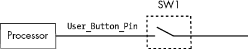
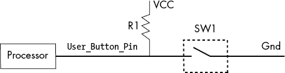
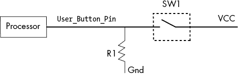
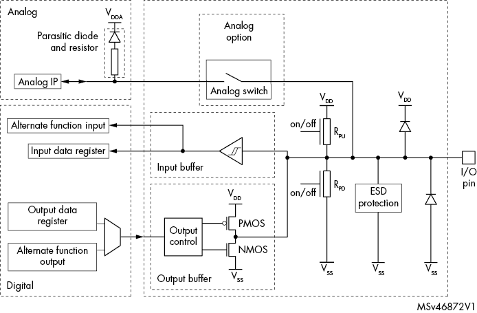

# 决策和控制语句


计算机是一种强大的工具，因为它可以根据接收到的数据做出决策。例如，计算机可以在按钮被按下时打开 LED，并在按钮没有被按下时关闭 LED。在这一章中，我们将了解 C 语言中的各种决策和控制语句如何工作。然后，我们将它们应用到嵌入式编程中，使我们的设备对按钮按下做出响应。

## if 语句

我们使用`if`语句来仅在某个条件为真时执行某段代码。以下是该语句的一般形式：

```
if (`condition`)
    `statement`;
```

要有条件地执行多个语句，可以将受条件影响的语句块放在大括号（`{}`）中，如下所示。C 会将这些语句视为一个整体：

```
if (`condition`)  {
    `statement`;
    `statement`;
    `statement`;
    // ...
}
```

C 语言认为任何非零值为真，零值为假。因此，如果条件为非零值，语句将被执行；如果条件为零值，语句将不会执行。

表 5-1 列出了其他比较运算符。

表 5-1：比较运算符

| **运算符** | **描述** |
| --- | --- |
| `==` | 等于 |
| `<` | 小于 |
| `<=` | 小于或等于 |
| `!=` | 不等于 |
| `>` | 大于 |
| `>=` | 大于或等于 |

例如，如果你希望某段代码仅在一个变量的值为 5 时才执行，你可以使用等于（`==`）运算符，如下所示：

```
if (aNumber == 5) {
    printf("The number is 5\n");
}
```

提个警告：C 语言允许在条件语句中进行赋值。例如，下面的代码，在`if`语句中给变量赋值为 7，是合法的：

```
if (aNumber = 7) {
    printf("Something happened\n");
}
```

这等同于以下代码，它在赋值后测试变量是否等于零：

```
aNumber = 7;        // Assignment
if (aNumber != 0) { // Test against zero
    printf("Something happened\n");
}
```

它与下面的条件不同，后者测试一个变量是否等于 7：

```
if (aNumber == 7)
```

这个问题在 C 语言的早期很麻烦，当时编译器技术还不像今天这么先进。你可能会犯错误，偶然写出像以下这样的代码，虽然代码会更复杂：

```
aNumber = 5;
if (aNumber = 7) {  // Notice the missing '=' character.
    printf("Something happened\n");
}
```

`if`语句中的代码会被执行，因为变量会被重新赋值为 7，这个非零值会立即使条件为真，尽管你本意是让`aNumber`等于 5，而不是 7。使用现代的 GCC 编译器时，在条件中进行赋值会产生警告：

```
equal.c:14:5: warning: suggest parentheses around assignment used as truth value [-Wparentheses]
 if (aNumber = 7) {
```

这里，GCC 正在告诉你，如果你想抑制警告，因为你确实希望将赋值语句和`if`语句合并，你应该按照如下方式编写代码：

```
if ((aNumber = 7)) {   // Very very lousy programming
```

我添加了这个注释，因为我认为将语句合并在一起是一种不好的编程习惯。让每个语句做一件事。例如，当你需要做赋值和测试时，先进行赋值，然后再做测试。

## if/else 语句

当我们想要根据条件判断是否执行某些语句时，使用`if`/`else`语句。例如，考虑以下代码：

```
if ((number % 2) == 0) {
    printf("Number is even\n);
} else {
    printf("Number is odd\n);
}
```

如果 `number` 变量的值在除以 2 后余数为 0，则这段代码会打印一条信息，说明该数字是偶数；否则，它会打印一条信息，说明该数字是奇数。

现在我们来看看 C 语言中的另一个不太明显的地方：在 `if` 或 `else` 后面，如果只有一个语句，你不需要使用大括号（`{}`）。请考虑下面的代码，故意将缩进写得不正确：

```
if (a == 1)
    if (b == 2)
        printf("Condition orange\n");
  else
    printf("Condition pink\n");
```

`else` 应该和哪个 `if` 语句配对，第一个 `if` 还是第二个 `if`？

a. 第一个 `if`：`if (a == 1)`

b. 第二个 `if`：`if (b == 2)`

c. 如果你不写这样的代码，就不必担心这些愚蠢的问题。

让我们选择答案 C 并重写代码。在以下代码中，`else` 应该与哪个 `if` 配对？

```
if (a == 1) {
    if (b == 2) {
        printf("Condition orange\n");
    } else {
        printf("Condition pink\n");
    }
}
```

在这里，你可以判断它与第二个 `if` 配对。这也是前一个问题的“官方”答案，但通过清晰地编写代码，你可以得出答案，而无需仔细研读 C 语言标准。

需要注意的是，一些编码风格指南要求你在 `if` 语句的主体部分始终使用大括号包裹；然而，这一决定最好由程序员自己做出。

## 循环语句

*循环* 是一种编程特性，只要满足某个条件，就会重复执行某段代码。C 语言有三种循环语句：`while`、`for` 和 `do/while`。我们将从 `while` 循环开始，因为它是最简单的，然后再讲解 `for` 循环。由于 `do/while` 很少使用，我们不会讨论它。

### `while` 循环

`while` 语句的一般形式如下：

```
while (`condition`)
    `statement`;
```

请记住，`statement` 可以是一个单独的 C 语句，也可以是由 `{}` 括起来的一系列语句。为了展示 `while` 循环的实用性，让我们编写一个程序，测试从 1 到 10 的数字，看看哪些是偶数，哪些是奇数，如 列表 5-1 所示。

***odd.c***

```
/*
 * Test to see if the numbers 1 through 10 are even
 * or odd.
 *
#include <stdio.h>

int main()
{
    int aNumber;  // Number to test for oddness
    aNumber = 1;
    while (aNumber <= 10) {
        if ((aNumber % 2) == 1) {
            printf("%d is odd\n", aNumber);
        } else {
            printf("%d is even\n", aNumber);
        }
        ++aNumber;
    }
    return (0);
}
```

列表 5-1：测试奇偶性

在 `main` 函数中，我们声明一个变量 `aNumber`，用于存储在 `while` 循环中要测试的值。然后我们将该变量设置为 `1`。

接下来，我们设置 `while` 循环，使其在 `aNumber` 小于或等于 10 时运行。在循环内部（即在大括号内），我们使用前面章节中介绍的 `if`/`else` 语句，检查 `aNumber` 除以 2 的余数。这样我们就能知道它是偶数还是奇数。

在循环结束之前，我们通过 `++aNumber;` 将 `aNumber` 增加 1。因此，下次循环时，`aNumber` 的值将变为 2，依此类推。当 `aNumber` 的值达到 11 时，循环结束，程序以返回值 `0` 退出。

当这个程序运行时，输出结果如下所示：

```
1 is odd
2 is even
3 is odd
4 is even
5 is odd
6 is even
7 is odd
8 is even
9 is odd
10 is even
```

### `for` 循环

我们的 `while` 循环有三个主要部分：初始化语句（`aNumber = 1`），测试语句（检查 `aNumber` 是否大于或等于 10），以及在循环执行后递增变量的语句（`++aNumber`）。

这种设计模式（初始化、条件和递增）非常常见，以至于它有了自己的语句：`for` 语句。我们这样写这个语句：

```
for (`initialization`; `condition`; `increment`)
```

为了查看它如何工作，我们将把我们的 `while` 循环转换为 `for` 循环。以下代码展示了使用 `for` 语句的相同奇偶程序：

```
/*
 * Test to see if the numbers 1 through 10 are even
 * or odd.
 */
#include <stdio.h>

int main()
{
    int aNumber;  // Number to test for oddness
    for (aNumber = 1; aNumber <= 10; ++aNumber) {
        if ((aNumber % 2) == 1) {
            printf("%d is odd\n", aNumber);
        } else {
            printf("%d is even\n", aNumber);
        }
    }
    return (0);
}
```

注意 `for` 子句包括我们的三个语句，它们由分号分隔。

`for` 循环中的任意一条语句都可以被省略。例如，我们本可以通过在进入循环之前初始化 `aNumber` 来编写程序：

```
aNumber = 1;
for (; aNumber <= 10; ++aNumber) {
```

另外，我们可以在循环体内递增变量的值，而不是在 `for` 子句中：

```
for (aNumber = 1; aNumber <= 10;) {
    // Oddness test
    ++aNumber;
```

然而，如果条件被省略，循环将永远不会终止。这就是为什么以下语句会永远循环的原因：

```
for (;;)
```

我们在嵌入式程序中使用这种“永远循环”的方式，因为程序应该永远不会退出。

## 使用按钮

现在我们知道了如何做决策，我们将编写一个程序，基于我们开发板默认的唯一输入源——蓝色按钮来做决策。我们的程序将利用我们知道如何控制的唯一输出：LED。让我们把开发板变成一个小型的计算机灯。

启动 STM32 的系统工作台并开始一个新的嵌入式项目。*main.c* 文件应该如下所示：

```
/**
  **************************************************************
  * @file    main.c
  * @author  Steve Oualline
  * @version V1.0
  * @date    11-April-2018
  * @brief   Push the button -- flash the LED
  **************************************************************
*/

#include "stm32f0xx.h"
#include "stm32f0xx_nucleo.h"

int main(void)
{
  1 GPIO_InitTypeDef GPIO_LedInit; // Init. for the LED
    GPIO_InitTypeDef GPIO_ButtonInit;  // Init. for push button
    GPIO_PinState result; // The result of reading the pin

    HAL_Init();

    // LED clock initialization
  2 LED2_GPIO_CLK_ENABLE();

    // Initialize LED.
  3 GPIO_LedInit.Pin = LED2_PIN;
    GPIO_LedInit.Mode = GPIO_MODE_OUTPUT_PP;
    GPIO_LedInit.Pull = GPIO_PULLUP;
    GPIO_LedInit.Speed = GPIO_SPEED_FREQ_HIGH;
    HAL_GPIO_Init(LED2_GPIO_PORT, &GPIO_LedInit);

    // Push button clock initialization
    USER_BUTTON_GPIO_CLK_ENABLE();

 /* Configure GPIO pin : For button */
    GPIO_ButtonInit.Pin = USER_BUTTON_PIN;
    GPIO_ButtonInit.Mode = GPIO_MODE_INPUT;
  4 GPIO_ButtonInit.Pull = GPIO_PULLDOWN;
    GPIO_ButtonInit.Speed = GPIO_SPEED_FREQ_HIGH;
    HAL_GPIO_Init(USER_BUTTON_GPIO_PORT, &GPIO_ButtonInit);

    for(;;) {
        // Get the current state of the push button
        result = HAL_GPIO_ReadPin(USER_BUTTON_GPIO_PORT,
                                  USER_BUTTON_PIN);
        if (result == GPIO_PIN_SET)
            HAL_GPIO_WritePin(LED2_GPIO_PORT,
                              LED2_PIN, GPIO_PIN_SET);
        else
            HAL_GPIO_WritePin(LED2_GPIO_PORT,
                              LED2_PIN,GPIO_PIN_RESET);
    }
}
```

让我们详细解析这段代码。

### 初始化

为了开始我们的程序，我们将使用硬件抽象层（HAL）定义的大量代码。在接下来的几章中，你将了解这些部分的每一个。

首先，我们定义一个名为 `GPIO_LedInit` 的新变量，其类型为 `GPIO_InitTypeDef` 1。`GPIO_InitTypeDef` 类型不是标准的 C 类型：它是由在程序顶部引入的 HAL 包含文件定义的。此时，这个类型的细节不重要。我们需要这个变量来定义 LED 引脚的配置方式。（你将在后面的章节中了解如何定义变量类型。）

同样地，我们定义了另一个变量 `GPIO_ButtonInit`，用于定义按钮 GPIO 引脚的配置方式，并定义一个变量来保存按钮引脚的状态（`GPIO_PinState`）。

在 `main` 函数内，我们首先调用 `HAL_Init` 来设置硬件，就像我们在第三章的闪烁程序中所做的那样。你需要在每个 STM32 程序的顶部调用 `HAL_Init`。

接下来，我们为 `LED2`（用户 LED）打开时钟 2。*时钟* 控制我们写入 GPIO 引脚的数据如何到达实际的引脚。如果没有这一行，写入 LED 将不起作用。虽然它看起来像是一个调用名为 `LED2_GPIO_CLK_ENABLE` 的函数，实际上它是一个预处理器宏，我们稍后会学习。

现在我们来到了为 `GPIO_LedInit` 变量 3 赋值的部分，它是一个结构类型，包含我们需要单独赋值的一些元素。稍后你会了解这里发生的详细情况。

类似的代码初始化用于按钮的引脚，唯一不同的是引脚模式设置为 `GPIO_MODE_INPUT`，因为我们要读取引脚的状态来获取按钮的状态，而不是写入它。

### 选择下拉电路

请注意，我们将 `Pull` 字段设置为 `GPIO_PULLDOWN` 4，而不是 `GPIO_PULLUP`。

`Pull` 字段告诉 CPU 使用哪种上拉/下拉电路。一个输入引脚可以有三种状态：浮空、上拉和下拉。图 5-1 显示了一个 *浮空* 输入电路。



图 5-1：一个浮空电路

当开关 SW1 打开时，`User_Button_Pin` 上没有电压。因此，它的电压可能是高电平（大约 3 伏特或更高）、低电平（低于大约 3 伏特）或介于两者之间。它可能会被周围的任何杂散电噪声所影响。关键是，除非该信号实际接地或接电源，否则无法确定这个信号的值。

现在让我们看看一个带有 *上拉* 电路的输入（参见 图 5-2）。



图 5-2：上拉电路

当 SW1 打开时，电压通过电阻 R1 流动，将 `User_Button_Pin` 提升（或 *拉高*）到 VCC 或正电平。当 SW1 关闭时，引脚被短接到地（Gnd）。由于 R1 是一个非常大的电阻，因此流过它的电流可以忽略不计，且引脚的电压为零。

*下拉* 电路类似，只不过 R1 连接到地，SW1 连接到 VCC，因此当 SW1 打开时，`User_Button_Pin` 被拉到地（即拉低到零），参见 图 5-3。



图 5-3：下拉电路

在 STM32 芯片上，电路便宜，而引脚昂贵。因此，芯片的设计者希望最大限度地利用每个引脚。对于每个 GPIO 引脚，都有上拉电阻、下拉电阻以及连接这些电阻的晶体管，这取决于引脚的配置方式。这使得事情变得简单，因为我们不需要自己在板上放置这些电阻。然而，这也使得事情变得复杂，因为我们需要编程来控制它们。图 5-4 显示了 STM32 上单个 GPIO 引脚的内部接线。（这甚至是一个简化版。）需要注意的是，有上拉（R[PU]）和下拉（R[PD]）的内部电阻，可以打开或关闭。



图 5-4：STM32 GPIO 引脚的内部接线

我们选择使用下拉电路，因为按钮的另一端连接到 +5 V，所以当按钮未按下且开关打开时，下拉电阻会生效，GPIO 引脚的值为 0。当按钮被按下时，按钮提供的 5 V 使得 GPIO 引脚的值为 1。（一些电流会通过电阻流动，但这个电流量可以忽略不计。）

### 获取按钮的状态

接下来，我们进入主循环。`for`语句会无限循环，或者直到我们重置机器。在循环内，第一条语句初始化了一个名为`result`的变量，类型为`GPIO_PinState`（由 HAL 头文件定义的非标准类型），并赋值为调用`HAL_GPIO_ReadPin`函数的结果。`HAL_GPIO_ReadPin`读取连接到按钮的 GPIO 引脚。更具体地说，它读取 32 位的 GPIO 端口`USER_BUTTON_GPIO_PORT`，然后测试`USER_BUTTON_PIN`的值。（我们在上一章中涉及的许多位操作都在`HAL_GPIO_ReadPin`函数内部进行。）

现在我们通过将`result`与符号`GPIO_PIN_SET`（由 HAL 代码定义的常量）进行比较来测试引脚是否已设置，然后如果按钮引脚已设置，我们打开 LED 引脚。否则，我们关闭 LED 引脚。（实现这一点的代码在第三章中已涵盖。）

### 运行程序

当我们运行程序时，LED 灯会亮。按下用户按钮，LED 灯熄灭。松开按钮，LED 灯会重新亮起，如此循环。虽然这是一个简单的操作，但我们花了很多时间学习才做到这一点。

不幸的是，我们做了一个非常复杂的手电筒，它的按钮会把灯关掉，而不是打开。好消息是，它是计算机控制的，所以我们可以通过软件来修复它。我会把这个问题留给你去解决。

## 循环控制

我们的编程示例使用了基本的循环语句，但 C 语言提供了几种方法来为你的循环增加额外的控制。两种主要的控制语句是`break`和`continue`。

### break 语句

`break`语句允许你提前退出循环（也就是说，跳出循环）。例如，考虑以下简短程序，它在一个数组中查找一个关键数字。如果找到了这个数字，程序会打印它：

```
/*
 * Find the key number in an array.
 */
#include <stdio.h>
#include <stdbool.h>

#define ARRAY_SIZE  7   // Size of the array to search

int main()
{
    // Array to search
    int array[ARRAY_SIZE] = {4, 5, 23, 56, 79, 0, -5};
    static const int KEY = 56; // Key to search for

    for (unsigned int index = 0; index < ARRAY_SIZE; ++index) {
        if (array[index] == KEY) {
            printf("Key (%d) found at index %d\n",
                   KEY, index);
          1 break;
        }
    }
    return (0);
}
```

这个程序在一个数组中查找一个关键值。一旦我们找到了这个关键值，任务就完成了。我们不想继续执行整个循环的其余部分，因此我们使用`break`语句 1 来退出。

### continue 语句

另一个循环控制语句`continue`会从循环的顶部开始执行。以下程序打印一个命令列表，跳过以点开头的命令。当我们遇到这些命令时，使用`continue`命令跳到循环顶部：

```
/*
 * Find the key number in an array.
 */
#include <stdio.h>

#define COMMAND_COUNT 5 // Number of commands

// Commands, ones beginning with . are secret
static const char commands[COMMAND_COUNT][4] = {
    "help",
    "exec",
    ".adm",
    "quit"
};
int main()
{
    // Print the help text
    for (unsigned int index = 0;
         index < COMMAND_COUNT;
         ++index) {
      1 if (commands[index][0] == '.') {
            // Hidden command
          2 continue;
        }
        printf("%s\n", commands[index]);
    }
    return (0);
}
```

这个程序的关键是测试是否有点命令 1，然后`continue` 2 来重新开始（从而跳过循环的其余部分和`printf`）。

## 反模式

在学习如何使用循环时，你还应该学会如何*不*使用循环。一些编程模式已经渗透到编程行业，这些模式不仅没有促进良好的编程，反而让事情变得更复杂，因此它们被称为*反模式*。我要警告你两种。

### 空的 while 循环

第一个反模式是空的`while`循环。考虑以下代码：

```
while (GPIO_PIN_SET == HAL_GPIO_ReadPin(USER_BUTTON_GPIO_PORT, USER_BUTTON_PIN))**;**
{
    // ... do something
}
```

你可能会认为这段代码会在用户按下按钮时重复某个动作。但事实并非如此。原因在于`while`循环只影响一个语句。你可能会认为`while`循环中的语句是被大括号括起来的那个，但在大括号前还有一个语句。这个语句非常简短，非常容易忽视，因为它是一个空语句。我们可以通过语句后的分号来知道它的存在：

```
while (GPIO_PIN_SET == HAL_GPIO_ReadPin(USER_BUTTON_GPIO_PORT, USER_BUTTON_PIN))**;**
{
    // ... do something
}
```

分号很容易被忽视。这就是为什么我必须将其加粗的原因。这也是为什么这种编码方式被认为是糟糕的，十分糟糕。

`continue`语句帮助我们解决了问题。我们可以将这个`while`循环重写如下：

```
while (GPIO_PIN_SET == HAL_GPIO_ReadPin(BTN_PORT, BTN_PIN))
    continue;
{
    // ... do something
}
```

现在我们可以看到，`while`循环仅控制`continue`语句，别无他物。缩进和明显的大语句告诉我们这一点。

### 在 while 中赋值

第二个反模式是`while`循环中的赋值操作：

```
while ((result = ReadPin(BTN_PORT, BTN_PIN)) == GPIO_PIN_SET) {
    // ... statements
}
```

这条语句同时做了两件事。首先，它调用`ReadPin`并将结果赋值给`result`。其次，它测试`result`是否已设置。

如果程序一次只做小而简单的事情，它们会更容易理解和维护。这个快捷方式节省了几行新代码，但却以程序的可读性为代价。它本可以像这样写：

```
while (1) {
    result = ReadPin(BTN_PORT, BUTTON_PIN);
    if (result != GPIO_PIN_SET)
        break;
    // ... statements
}
```

我们的目标应该是让程序尽可能简单且易于阅读，而不是尽可能简洁和巧妙。

## 总结

现在我们已经掌握了计算中的两个关键方面：数字和如何基于这些数字做出决策。单一的决策可以通过`if`语句做出，而`while`和`for`语句则让我们能够做出重复性的决策。`break`和`continue`关键字则赋予我们更多的控制权。

决策语句让我们能够编写一个在按下按钮时闪烁 LED 的小程序。尽管程序很简单，但我们接受了输入，处理了它，并产生了输出，这构成了大量嵌入式程序的基础。在接下来的几章中，你将学习如何处理更复杂的数据和更复杂的处理方式，这一切都建立在你在这里学到的基础上。

## 编程问题

1.  编写一个程序，生成从 0 × 0 到 9 × 9 的乘法表。

1.  编写一个程序，统计`uint32_t`整数中被设置的比特位数。例如，数字 0x0000A0 中有两个比特位被设置。

1.  编写一个程序，在 LED 上闪烁一个图案。使用一个整数数组来控制 LED 点亮和熄灭的延时。重复该图案。

1.  编写一个程序，使用 LED 灯以摩尔斯电码闪烁字母“H”。按下按钮时，它会闪烁字母“E”。如果继续按下按钮，将会显示“HELLO WORLD”全部的摩尔斯电码。

1.  编写一个程序，计算前 10 个质数。

1.  编写一个程序，找到集合中最大的和最小的元素。

1.  编写一个程序，遍历字符串并仅打印元音字母。
