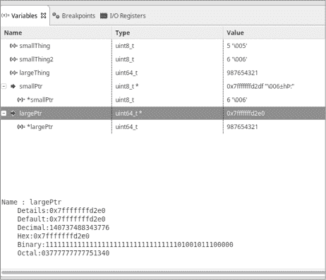

# 第六章：数组、指针和字符串


到目前为止，我们使用了非常简单的整数来表示数据。但是，面对现实吧，并不是所有的东西都能用一个整数来描述。在这一章中，你将学习一些组织数据的基础知识。

首先，你将学习*数组*，它是一个数据结构，可以通过整数索引选择多个项。我还会稍微超越简单的数组，展示编译器如何实现数组，以及数组如何实现像 `"Hello World!\n"` 这样的字符串。过程中，你将学习如何使用 C 的 `char` 类型。

你将学习如何使用内存*指针*，它保存内存位置的地址，然后了解数组和指针在相似之处和不同之处。

你还将学习如何使用 `const` 修饰符创建一个不能被修改的变量，也就是*常量*。常量通过防止对数据的无意修改，帮助你组织数据。

## 数组

你已经看到如何声明一个基本变量，例如这样：

```
int aNumber;        // A number
```

这个变量一次只能存储一个值。然而，我们也可以声明一个变量来存储一组值，使用*数组声明*，它在方括号中指定数组包含的项数：

```
int anArray[5];     // An array of numbers
```

这段代码声明了一个包含五个整数的数组，编号为 0、1、2、3 和 4。数组的元素编号叫做*索引*，而第一个索引是 0，而不是 1。要访问数组中的单个元素，我们使用方括号并包含索引。例如，下面这一行将 99 的值赋给数组中的第四个元素（索引为 3 的那个）：

```
anArray[3] = 99;    // Store an element in the array.

if (anArray[3] == 98) {
```

C 语言中没有任何东西阻止你使用不存在的数组元素进行索引，但尽管可以使用非法索引，结果是未定义的（这意味着很可能会发生一些错误）。例如，`anArray` 的最后一个元素是 4，所以以下声明是合法的：

```
anArray[4] = 0;     // Legal
```

然而，这个例子并不是：

```
anArray[5] = 9;     // Illegal, 5 is too big
```

这个语句尝试访问一个不存在的数组元素。

让我们看看数组如何实际工作。查看示例 6-1，这是一个将数组元素求和并输出总和的程序。

```
/*
 * Sum up a series of numbers.
 */
#include <stdio.h>

int main()
{
    const int NUMBER_ELEMENTS = 5;      // Number of elements
    int numbers[NUMBER_ELEMENTS];       // The numbers
    int sum;                            // The sum so far
    int current;                        // The current number we are adding

    numbers[0] = 5;
    numbers[1] = 8;
 numbers[2] = 9;
    numbers[3] = -5;
    numbers[4] = 22;

    sum = 0;
    // Loop over each element and add them up.
    for (current = 0; current < NUMBER_ELEMENTS; ++current)
    {
        sum += numbers[current];
    }
    printf("Total is %d\n", sum);
    return (0);
}
```

示例 6-1：基本数组使用

我们从定义一个变量 `NUMBER_ELEMENTS` 开始，它保存数组中元素的数量。关键字 `const` 告诉 C 这个变量不能被改变（稍后会详细介绍）。

我们在两个地方使用了这个常量。第一个用于声明数组。第二个用于循环遍历数组的每个元素。虽然我们本可以在这两个地方直接使用值`5`，但这样做会在代码中引入一个魔法数字。*魔法数字*是指出现在程序中的多个位置，但与代码的关系不明确的数字。使用魔法数字是有风险的；在这种情况下，如果我们更改了数组声明中的`5`，我们还需要记得更改循环中的`5`。通过使用常量声明，我们只需在一个地方定义数组的大小。如果我们将常量更改为`14`，那么它被使用的每个地方都会自动更新。

回到代码。我们需要在数组中放一些数字，所以我们通过为每个索引赋值来实现。接下来，我们使用`for`循环访问数组的每个元素。`for`循环语句展示了 C 语言中常用的遍历数组的方式。循环从零开始，只要索引*小于*（<）数组的大小，循环就会继续。索引必须小于 5，因为`number[5]`是一个不存在的元素。

数组可以在声明时初始化，就像简单的变量一样，通过在花括号中列出所有元素：

```
// Define some numbers to sum.
int numbers[5] = {5 8, 9, -5, 22};
```

在这种情况下，元素的数量必须与数组的大小匹配，否则会收到警告消息。

C 是一种智能语言。它可以根据元素的数量推断数组的大小，因此这个声明也是有效的：

```
// Define some numbers to sum.
int numbers[] = {5 8, 9, -5, 22};
```

### 底层原理：指针

我的父亲 C. M. Oualline 曾经教导我，“有东西，也有指向东西的指针。”有关这个含义的详细示意图，请参见图 6-1。尽管看起来很简单，理解这张图是极其重要的。


图 6-1：事物与指向事物的指针

整数是一个东西。实际上，它是一个包含整数的东西。指针是一个东西的地址。

事物有不同的大小。`uint64_t`整数是一个相对较大的东西，而`uint8_t`是一个较小的东西。关键在于事物有不同的大小。指针是一个固定的大小。它所指向的东西可以大或小，但指针的大小始终是一样的。

指针对于快速访问数据结构和将数据结构连接在一起非常有用。在嵌入式编程中，指针用于指向内存映射的 I/O 设备，这使得程序能够控制这些设备。

指针的最大优点是它们可以指向任何东西。最大的缺点是它们可以指向不该指向的东西。当这种情况发生时，程序会开始执行奇怪和意外的操作，因此在使用指针时必须非常小心。

要声明一个指针，在声明中使用星号（`*`）来表示该变量是一个指针，而不是一个东西：

```
uint8_t* thingPtr;      // A pointer to an integer
```

*地址运算符*（`&`）将一个东西转换为指向该东西的指针：

```
uint8_t thing = 5;      // A thing
thingPtr = &thing;      // thingPtr points to 5.
```

现在`thingPtr`指向`thing`。*解引用*（`*`）操作符将指针转换回一个值：

```
otherThing = *thingPtr; // Get what's pointed to by thingPtr.
```

这将把`otherThing`赋值给`thingPtr`所*指向*的值。

以下程序展示了这些操作是如何工作的。在这个程序中，我们引入了一种新的`printf`转换符，`%p`，它用于打印指针：

```
/*
 * Demonstrate pointers.
 */
#include <stdio.h>
#include <stdint.h>

int main()
{
    uint8_t smallThing = 5;     // Something small
    uint8_t smallThing2 = 6;    // Something else small
    uint64_t largeThing = 987654321; // Something large

    uint8_t* smallPtr;          // Pointer to small thing
    uint64_t* largePtr;         // Pointer to large thing
  1 printf("smallThing %d\n", smallThing);
    printf("sizeof(smallThing) %lu\n", sizeof(smallThing));
    printf("largeThing %ld\n", largeThing);
    printf("sizeof(largeThing) %lu\n", sizeof(largeThing));

    // smallPtr points to smallThing.
    smallPtr = &smallThing;

  2 printf("smallPtr %p\n", smallPtr);
    printf("sizeof(smallPtr) %lu\n", sizeof(smallPtr));
    printf("*smallPtr %d\n", *smallPtr);

    // smallPtr points to smallThing2.
    smallPtr = &smallThing2;    
    printf("*smallPtr %d\n", *smallPtr);

    largePtr = &largeThing;
    printf("largePtr %p\n", largePtr);
    printf("sizeof(largePtr) %lu\n", sizeof(largePtr));
    printf("*largePtr %ld\n", *largePtr);

    return (0);
}
```

让我们详细分析一下。我们首先声明了三个变量和两个指针。在命名所有指针时，我们使用了后缀`Ptr`，使它们非常显眼。此时，`smallPtr`并没有指向任何特定的对象。

在使用指针之前，让我们先使用我们的`smallThing`。通过两次调用`printf`，我们打印了`smallThing`的值和大小 1。输出将如下所示：

```
smallThing 5
sizeof(smallThing) 1
```

现在让我们来看一下指针 2。首先，我们打印指针的值，它是一个内存地址。我们使用的是一台具有 64 位指针的 x86 类型机器，因此指针的值是一个 64 位数字。实际的数字值来自内存的布局方式，具体内容将在第十一章中详细讨论。当我们打印`sizeof(smallPtr)`时，我们会看到它确实是 8 字节或 64 位长，且`smallPtr`所*指向*的值是`5`。总的来说，这三次`printf`调用将打印以下内容：

```
smallPtr 0x7fffc3935dee
sizeof(smallPtr) 8
*smallPtr 5
```

我们对`largePtr`做了类似的操作。注意，尽管被指向对象的大小不同，但指针的大小始终不变。指针的大小取决于处理器类型，而不是所指向数据的类型。在我们的 STM32 处理器上，地址是 32 位的，因此指针将是 32 位值。而在具有 64 位地址的 x64 机器上，指针的大小是 4 字节：

```
largeThing 987654321
sizeof(largeThing) 8

largePtr 0x7fffc3935df0
sizeof(largePtr) 8
*largePtr 987654321
```

要查看指针实际指向的内容，将此程序输入 STM32 Workbench，并使用调试器运行它。在所有内容分配完毕后，设置一个断点并运行程序直到该断点。

打开“变量”面板后，我们可以看到所有变量及其值（参见图 6-2）。



图 6-2：显示指针的变量面板

通常，指针的值并不是特别有趣。更有趣的是它指向的内容。点击 + 图标可以展开`smallPtr`条目，我们可以看到`smallPtr`指向`6`（也就是字符`'\006'`）。类似地，我们可以看到`largePtr`指向`987654321`。

### 数组和指针运算

C 将数组变量和指针视为非常相似。请看以下代码：

```
int array[5] = {1,2,3,4,5};
int* arrayPtr = array;
```

我们将`arrayPtr`赋值为`array`，而不是`&array`，因为 C 会在数组像指针一样使用时自动将其转换为指针。事实上，数组和指针几乎是可以互换的，只不过它们的声明方式不同。

现在让我们访问数组的一个元素：

```
int i = array[1];
```

这种语法与以下内容相同，它表示获取`arrayPtr`的值，向其添加 1（按指向的数据类型大小进行缩放），并返回该表达式结果所指向的数据：

```
int i = *(arrayPtr+1);
```

以下程序更详细地演示了数组与指针之间的关系：

```
/*
 * Demonstrate the relationship between arrays and pointers.
 */
#include <stdio.h>
int main()
{
    int array[] = {1,2,3,4,-1}; // Array
    int* arrayPtr = array;      // Pointer to array

    // Print array using array.
    for (int index = 0; array[index] >= 0; ++index) {
        printf("Address %p Value %d\n",
               &array[index], array[index]);
    }
    printf("--------------\n");
    // Same thing with a pointer
    for (int index = 0; *(arrayPtr +index) >= 0; ++index) {
        printf("Address %p Value %d\n",
                arrayPtr + index, *(arrayPtr + index));
    }
    printf("--------------\n");
    // Same thing using an incrementing pointer
    for (int* current = array; *current >= 0; ++current) {
 printf("Address %p Value %d\n", current, *current);
    }

}
```

该程序首先按常规方式打印每个数组元素的地址和内容：通过使用`for`循环依次访问每个索引。

在下一个循环中，我们使用指针运算进行打印。现在，我们需要明确理解我们正在处理的内容。变量`array`是一个数组，表达式`array[index]`是一个整数，而`&`（取地址）运算符将一个整数转换为指针，因此`&array[index]`是一个指针。因此，这段代码会打印数组中每个元素的以下内存地址：

```
Address 0x7fffa22e0610 Value 1
Address 0x7fffa22e0614 Value 2
Address 0x7fffa22e0618 Value 3
Address 0x7fffa22e061c Value 4
```

每次指针值增加 4，即一个整数的大小，因此`array[0]`位于地址`0x7fffa22e0610`，而`array[1]`位于比它大 4 字节的内存位置，地址为`0x7fffa22e0614`。

这种方法使用了指针运算。（我们实际上在第一种方法中也使用了指针运算，但 C 隐藏了这一切。）通过这个循环，你可以看到`arrayPtr + 1`是`0x7fffa22e0614`，这与`&array[1]`完全相同。再次注意，使用指针运算时，所有操作都会自动按所指向项的大小进行缩放。在这种情况下，所指向的数据类型是`int`，因此表达式`arrayPtr + 1`实际上是`arrayPtr + 1 * sizeof(int)`，所以`0x7fffa22e0610 + 1`实际上是`0x7fffa22e0610 + 1 * sizeof(int)`，即`0x7fffa22e0614`。

最后，我们使用递增指针以第三种方式执行相同的操作。

使用指针访问数组很常见，因为许多人认为这样比使用数组索引更高效。毕竟，计算`array[index]`涉及地址计算，但编译器技术多年来已经取得了很大进步。如今的编译器非常擅长生成更高效的代码，因此使用指针进行数组索引并不比直接使用数组索引更高效。

然而，使用地址逻辑会更为混乱。因为不清楚指向的是何物，数组的边界在哪里，所以第二种和第三种方法应该避免。我将它们包含在示例中是因为许多遗留代码使用指针运算来访问数组，目的是告诉你应该避免这样做。

### 数组溢出

C 不进行*边界检查*，即它不会检查你是否尝试访问数组边界外的元素。一个五元素数组（`int a[5]`）的合法元素是`a[0]`、`a[1]`、`a[2]`、`a[3]`、`a[4]`，但没有任何东西阻止你使用非法值，如`a[5]`、`a[6]`、`a[7]`，甚至是`a[932343]`。非法值的问题在于，它们可能是内存中其他变量或数据的位置。位于列表 6-2 中的程序演示了当你越过数组末尾时会发生什么（即*数组溢出*）。

**`array.bad.c`**

```
/*
 * Demonstrate what happens
 * when you overflow an array.
 */
#include <stdio.h>

int main()
{
    int numbers1[5] = {11,12,13,14,15};   // Some numbers
    int numbers2[5] = {21,22,23,24,25};   // Variable to be overwritten

  1 printf("numbers2[0] %d\n", numbers2[0]);

  2 numbers1[8] = 99;   // <------------ Illegal

    // Illegal -- loops past the end
    for (int i = 0; i < 9; ++i)
        printf("numbers1[%d] %p\n", i, &numbers1[i]);

    printf("numbers2[%d] %p\n", 0, &numbers2[0]);
  3 printf("numbers2[0] %d\n", numbers2[0]);
    return (0);
} 
```

列表 6-2：数组溢出

*关键点是观察`numbers2[0]`，它在初始化时被设置为 21。当我们第一次打印它时，它的值实际上是 21。然而，当我们稍后再次打印它时，值变成了 99。这是怎么回事呢？*

让我们看看这个程序的输出：

```
numbers2[0] 21
numbers1[0] 0x7ffc5e94ff00
numbers1[1] 0x7ffc5e94ff04
numbers1[2] 0x7ffc5e94ff08
numbers1[3] 0x7ffc5e94ff0c
numbers1[4] 0x7ffc5e94ff10
numbers1[5] 0x7ffc5e94ff14
numbers1[6] 0x7ffc5e94ff18
numbers1[7] 0x7ffc5e94ff1c
numbers1[8] 0x7ffc5e94ff20
numbers2[0] 0x7ffc5e94ff20
numbers2[0] 99
```

从中我们可以看到，`numbers1`的内存分配从`0x7ffc5e94ff00`到`0x7ffc5e94ff13`。变量`numbers2`的内存分配从`0x7ffc5e94ff20`到`0x7ffc5e94ff33`。这种内存布局在表 6-1 中有直观的表示。

表 6-1：内存布局

| **变量** | **地址** | **内容** |
| --- | --- | --- |
| `numbers1` | `0x7ffc5e94ff00` | `11` |
|  | `0x7ffc5e94ff04` | `12` |
|  | `0x7ffc5e94ff08` | `13` |
|  | `0x7ffc5e94ff0c` | `14` |
|  | `0x7ffc5e94ff10` | `15` |
| `numbers2` | `0x7ffc5e94ff20` | `21` |
|  | `0x7ffc5e94ff24` | `22` |
|  | `0x7ffc5e94ff28` | `23` |
|  | `0x7ffc5e94ff2c` | `24` |
|  | `0x7ffc5e94ff30` | `25` |

清单 6-2 中的第 2 行使用了非法索引，因为`numbers1`只有五个元素。那么，这个操作会覆盖什么内存呢？通过程序的输出，我们看到该值的地址是`0x7ffc5e94ff20`。巧合的是，这也是`numbers2[0]`的地址。当我们第二次打印`numbers2[0]`的内容时，我们的示例程序会立刻显示出内存损坏。

这个程序简单地展示了当数组溢出时可能出现的问题。在实际情况中，识别这种问题要困难得多。通常这些错误表现为程序行为异常，而且通常发生在索引错误之后很久，所以调试起来非常复杂。避免犯这种错误。

初学 C 语言的程序员最常犯的错误是忘记 C 语言数组从 0 开始，到`size`-1。例如，你可能会写出以下代码：

```
int array[5];
// Wrong
for (int i = 1; i <= 5; ++i)
    array[i] = 0;
```

如果你在 Linux 机器上编程，像 Valgrind 和 GCC 地址清理工具这样的工具会在运行时检查数组溢出。在嵌入式世界里，我们没有这些工具，所以只能更加小心。

## 字符和字符串

我们已经讨论了如何处理数字，但有时候你可能希望在程序中包含其他类型的数据，比如文本。为此，我们引入了一种新的变量类型，`char`，它表示一个用单引号（`'`）括起来的单个字符。例如，下面的代码创建了一个名为`stop`的`char`变量，用于存储字符`'S'`：

```
char stop = 'S'; // Character to indicate stop
```

*字符串*是一个以字符串结束符（`\0`）字符结尾的字符数组。字符`\0`也叫做 NUL 字符（一个*L*），因为在最初的串行通信中，它表示“无”。

为了练习使用字符串，下面我们来看看这个程序，它打印字符串“Hello World”：

```
/*
 * Hello World using string variable
 */
#include <stdio.h>

// The characters to print
const char hello[] = {'H', 'e', 'l', 'l', 'o', ' ',
                      'W', 'o', 'r', 'l', 'd', '\0'};

int main()
{
    puts(hello); // Write string and newline
    return (0);
}
```

我们首先定义一个名为`hello`的字符串，值为`"Hello World"`。这个初始化显式地定义了字符串的每个元素。在现实生活中你几乎看不到这样的初始化，因为 C 提供了一种简便方式，使得事情变得更加容易。（我们很快就会看到。）这个版本让一切都变得很明显，这对学习有好处，但不利于简洁。

稍后，我们使用标准的 C 函数`puts`打印字符串。`puts`函数打印单个字符串，简单易用，而`printf`可以进行格式化，并且是一个庞大复杂的函数。`puts`函数还会添加换行符，因此我们在原始字符串中没有加上换行符。

C 语言有一种简写方式来初始化字符串，允许我们像这样写相同的声明：

```
const char hello[] = "Hello World";   // The characters to print
```

两个语句都创建了一个包含 12 个字符的数组并初始化它。(`"Hello World"`包含 11 个字符，第 12 个是字符串结束符`'\0'`，当你使用简写时，C 会自动提供这个字符。)

因为数组和指针非常相似，你也可以将字符串声明为指针：

```
const char* const hello = "Hello World";   // The characters to print
```

你会注意到我们现在有了两个`const`关键字。事情变得有点复杂了。第一个`const`影响指针，第二个`const`影响被指向的数据。以下程序展示了这些是如何工作的：

```
/**
 * @brief Program to demonstrate the use of const
 * with pointers
 */

char theData[5] = "1234";             // Some data to play with

      char*       allChange;          // Pointer and value can change
const char*       dataConst = "abc"   // Char const, pointer not
      char* const ptrConst = theData; // Char var, ptr not
const char* const allConst = "abc";   // Nobody change nothing

int main()
{
    char otherData[5] = "abcd";   // Some other data

    allChange = otherData;        // Change pointer
    *allChange = 'x';             // Change data

    dataConst = otherData;        // Change pointer
    // *dataConst = 'x';          // Illegal to change data

    // ptrConst = otherData;      // Illegal to change pointer
    *ptrConst = 'x';              // Change data

    // allConst = otherData;      // Illegal to change pointer
    // *allConst = 'x';           // Illegal to change data
    return (0);
}
```

这个程序展示了`const`可以用来定义字符指针的每一种可能方式。然后我们尝试修改指针和被指向的数据。根据`const`修饰符的位置，某些语句将失败，而某些语句则会成功。

## 总结

我们在本书的开头处理了可以存储单一值的变量。数组让我们能够处理一组数据。在组织数据方面，这给了我们更大的能力。

字符串是一种特殊类型的数组。它们包含字符，并且有一个字符串结束标记来指示结束。

指针和数组在某些方面相似，它们都可以用来访问一段内存。数组受其大小限制（尽管它们可能会溢出），而指针则不受此限制。C 语言不限制指针的使用，这赋予了语言强大的能力。这种能力可以被用来做有益的事情，例如处理内存映射的 I/O，也可以用来做坏事，例如意外地破坏随机内存。

正如我们所看到的，C 语言赋予了程序员完全使用计算机的能力。但这种能力是有代价的。C 语言不会阻止你做傻事。C 语言为你提供了像数组和指针这样的工具来组织数据。是否明智地使用它们，取决于你自己。

## 编程问题

1.  编写一个程序，查找整数数组中最低和最高编号的元素。

1.  编写一个程序，扫描数组中的重复数字。重复的数字将出现在连续的元素中。

1.  编写一个程序，扫描数组中的重复数字，这些重复数字可能出现在数组的任何位置。

1.  创建一个程序，只打印数组中的奇数。

1.  编写一个程序，遍历字符串并将每个单词的首字母转换为大写。你需要查阅标准 C 函数`isalpha`和`toupper`。*
