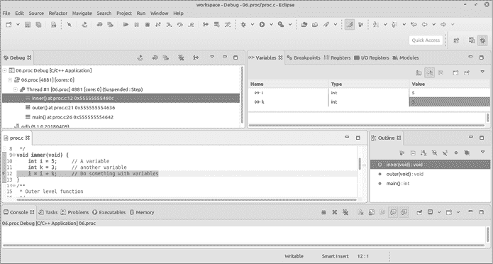
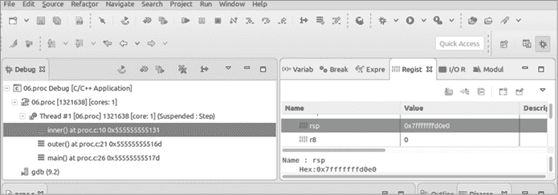
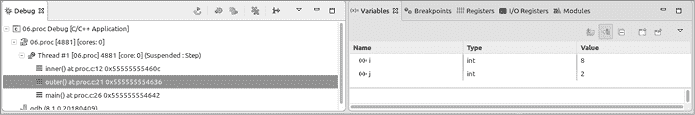
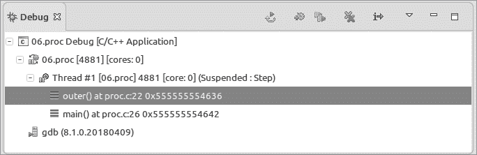

# 7

局部变量和过程


到目前为止，我们一直在使用一种名为“杂乱无章”的设计模式。所有代码都被放入`main`中，所有变量都在程序开始时定义。当你的程序只有 100 行代码时，这种方法可以很好地工作，但当你处理一个 50 万行的程序时，你就需要一些组织结构。本章讨论了如何限制变量和指令的作用域，以便使长且难以管理的代码块更容易理解、管理和维护。

例如，你可以在程序的任何地方使用*全局变量*。然而，要知道它在一个 50 万行的程序中如何使用，你必须扫描所有 50 万行代码。*局部变量*的作用域有限。要理解一个局部变量的使用位置和方式，你只需检查它有效的、例如 50 到 200 行代码的区域。

随着程序变得越来越长，你将学会如何将代码划分为易于理解的部分，称为*过程*。全局变量在每个过程都可用，但你可以定义只在单个过程内有效的局部变量。你还将学习局部变量是如何在内部组织成堆栈帧的。鉴于我们 STM 微控制器的内存有限，了解我们使用了多少堆栈内存是非常重要的。

最后，你将学习*递归*，即过程调用自身。递归在功能上很复杂，但如果你理解规则并遵循它们，它就很简单。

## 局部变量

到目前为止，我们只使用了在程序中任何地方都可用的全局变量，从它们声明的那一行开始，一直到程序的结束。局部变量只在程序的一个较小的、本地的区域内有效。变量有效的区域称为它的*作用域*。清单 7-1 展示了局部变量的声明。

***local.c***

```
/*
 * Useless program to demonstrate local variables
 */
#include <stdio.h>

int global = 5;    // A global variable

int main()
{
      int localToProcedure = 3;
      // ... do something
      {
         1 int local = 6; // A local variable

          {
              int veryLocal = 7;  // An even more local variable
              // ... do something
        2 }
          // veryLocal is no longer valid.
    3 }
      // local is no longer valid.
      return (0);
  }
```

清单 7-1：局部变量

局部变量的作用域从声明开始，一直到封闭的大括号（`{}`）的结束。变量`localToProcedure`在整个`main`函数中有效。

现在，让我们看看更小的作用域，从`local`变量 1 的声明开始。这个变量的作用域并不是在下一个关闭的大括号 2 处结束，该大括号是用于另一个代码块（用大括号括起来的代码段）。相反，它延伸到在声明`local`之前开始的那个代码块的结束括号 3。`veryLocal`变量的作用域更小。它从声明`int veryLocal = 7;`开始，到代码块结束时 2 结束。

当变量的作用域结束时，程序就不能再使用该变量。例如，尝试在`main`的末尾使用`return(veryLocal);`语句返回`veryLocal`的值将不起作用。

## 隐藏的变量

在前面的例子中，所有的局部变量除了具有不同的作用域外，还具有不同的名称。然而，变量也可以在不同的作用域中使用相同的名称。如果多个变量具有相同的名称，C 语言会使用当前作用域中变量的值并隐藏其他变量。（请不要这样做，因为它会使代码变得混乱。这里提到它是为了让你知道应该避免这样做。）

让我们看一下列表 7-2，它展示了一个写得非常糟糕的程序。

**hidden.c**

```
/*
 * Useless program to demonstrate hidden variables
 */
#include <stdio.h>

1 int var = 7;            // A variable

int main()
{
    // ... do something
    {
      2 int var = 13;   // Hides var = 7

        {
          3 int var = 16;     // Hides var = 7, var = 13

            // ... do something
        }
        // ... do something
    }
    // ... do something
    return (0);
}
```

列表 7-2：隐藏的变量

在这个程序中，我们定义了三个变量，都是命名为`var`。当第二个变量被定义时 2，它会隐藏第一个变量 1。同样，`int var = 16;`的声明会隐藏第二个`var`变量 2，而它又会隐藏第一个`var`变量 1。

假设我们在第三个声明后添加以下语句：

```
var = 42;
```

我们要赋值给哪个`var`？是第 1 行、第 2 行还是第 3 行声明的？我们不得不问这个问题，说明这段代码很混乱。我不会把这个问题留给读者去找答案，因为正确的解决方法是根本不要这么做。

## 过程

*过程*是定义代码的一种方式，以便可以重复使用。让我们看一下列表 7-3，它提供了一个简单的示例。

**hello3.c**

```
/**
 * Print hello, hello, hello, world.
 */
#include <stdio.h>

/**
 * Tell the world hello.
 */
1 void sayHello(void)
{
  2 puts("Hello");
}

int main()
{
  3 sayHello();
    sayHello();
    sayHello();
    puts("World!");
    return (0);
}
```

列表 7-3：过程演示

这个程序会打印`Hello`三次，然后是`World!`。过程从一个注释块开始，这个注释块并非严格必要，但如果你要编写高质量代码，应该在每个过程前加上注释块。注释块的开始部分（`/**`）表示 Doxygen 文档工具应该处理它。为了与 STM 库的格式兼容，我们使用了相同的注释约定。

语句`void sayHello(void)` 1 告诉 C 语言我们的过程名是`sayHello`。它不返回任何值（第一个`void`）且不接受任何参数（第二个`void`）。紧随其后的`{}`块定义了过程的主体，并包含了过程执行的所有指令 2。三个`sayHello();`行 3 是调用`sayHello`过程的地方。它们告诉处理器保存下一个语句的位置（可能是另一个`sayHello`的调用，或是调用`puts`），然后从`sayHello`的第一行开始执行。当过程结束（或遇到`return`语句）时，执行会继续在调用时保存的那个位置。

## 栈帧

过程有它们自己的局部变量。编译器的工作是组织内存，以便可以容纳这些变量。对于全局变量（不在过程中的），编译器会说类似于：“我需要 4 字节来存储名为`Total`的整数。”链接器看到这一点后，会为该变量分配内存中的物理位置（例如，`0xffffec04`）。全局变量在编译时静态分配，这意味着编译器为变量分配了空间，然后就完成了。变量永远不会被销毁，并且它们的内存不会被重新分配。

局部变量更为复杂。它们必须在运行时动态分配。当一个过程开始时，该过程的所有局部变量都会被分配。（注意：有一个`static`局部变量会在编译时分配，但我们还没有涉及这一点。）当过程结束时，局部变量会被回收。编译器通过在过程开始时创建一个*栈帧*，并在过程结束时销毁它来完成这一过程。栈帧保存了过程所需的所有临时信息。

让我们看看清单 7-4，它展示了一个示例程序。

**proc.c**

```
/**
 * @brief Program to demonstrate procedures and local variables
 */

/**
 * Function that is called from another function
 */
void inner(void) {
    int i = 5;     // A variable
    int k = 3;     // Another variable
  1 i = i + k;     // Do something with variables
}
/**
 * Outer-level function
 */
void outer(void) {
    int i = 6;     // A variable
    int j = 2;     // Another variable
    i = j + i;     // Use variables
    inner();
}

int main()
{
    outer();
    return(0);
}
```

清单 7-4：栈帧演示

让我们为这个程序创建一个项目并开始调试。通过调试器运行程序，然后使用命令**运行**▶**单步进入** (F5) 步骤执行，直到你到达第 1 行。你的屏幕应该像图 7-1 一样显示。



图 7-1：调试*proc.c*

当程序加载时，所有静态分配的变量会获得它们各自的内存位置。在 STM32 芯片中，它们被分配到随机存取内存（RAM）的较低部分。剩余的内存则保留用于动态分配。具体而言，有两个内存区域被动态使用：*栈*，用于存储局部变量，和*堆*。我们暂时不关心堆；我们的微处理器没有足够的内存来使用它。（我们将在第十三章讨论堆，届时将讨论为更大系统编程的内容。）

*栈*这个名字来源于数据在内存中堆叠的方式。当程序启动时，`main`函数为其局部变量和临时值分配一个栈帧。当调用`outer`时，它会在`main`的栈帧之上分配另一个栈帧。调用`inner`会向栈中添加第三个栈帧。

要查看每个过程中的栈的位置，请点击右上角面板中的**寄存器**标签，并向下滚动直到看到`rsp`寄存器。图 7-2 显示它包含`0x7fffffffd0e0`。



图 7-2：显示寄存器

根据机器的不同，栈可能从低内存地址开始并向上增长，或者从高内存地址开始并向下增长。在这台机器（x86）上，栈是从高地址开始并向下增长的。

`outer` 堆栈帧位于 `0x7fffffffd0f0`。由于我们的堆栈是向下增长的，这个地址比 `main` 的堆栈帧地址要低。`inner` 堆栈帧位于 `0x7fffffffd110`（参见 表 7-1）。

表 7-1：堆栈使用情况

| **地址** | **过程** | **内容** | **备注** |
| --- | --- | --- | --- |
| `0x7fffffffd110` | `main` | <overhead> | 堆栈底部 |

| `0x7fffffffd0f0` | `outer` | <overhead> `i`

`j` |  |

| `0x7fffffffd0e0` | `inner` | <overhead> `i`

`k` | 堆栈顶部 |

需要理解的一个关键概念是，堆栈帧是以“后进先出”（LIFO）的顺序分配的。当我们完成 `inner` 的执行时，它的堆栈帧将被销毁，然后 `outer` 的堆栈帧会被销毁。

变量面板（如 图 7-1 中右上角所示）显示了 `i` 和 `k` 变量。调试器显示的是 `inner` 堆栈帧中的变量，这可以通过调试面板（左上角）中高亮显示的 `inner` 堆栈帧来确认。点击调试面板中的 `outer` 堆栈帧，你会看到变量面板发生变化，并显示 `outer` 中的变量，正如 图 7-3 所示。



图 7-3：`outer` 堆栈帧

让我们继续通过调试程序，跳过 `inner` 的最后一条指令。当我们退出 `inner` 时，该函数的堆栈帧将消失，因为我们不再执行 `inner`，也不再需要存储它的变量。

图 7-4 显示的是我们退出 `inner` 堆栈帧后的堆栈情况。



图 7-4：退出 `inner` 堆栈帧后的堆栈

请注意，现在堆栈上只剩下两个堆栈帧。

## 递归

到目前为止，我们一直在处理基本的过程调用；每个过程都有不同的名称，且调用过程简单。现在，我们将专注于 *递归*，即一个函数调用自身。递归可以是一个强大的工具，但如果你不了解规则，使用起来会很棘手。

经典的递归问题是计算阶乘。阶乘函数的定义如下：

1.  f(*n*) = 1，当 *n* 为 1 时

1.  否则，f(*n*) = *n* × f(*n* – 1)

将此转化为代码，我们得到 清单 7-5。

**factor.c**

```
/**
 * Compute factorial recursively
 * (the basic recursive example)
 */

#include <stdio.h>

/**
 * Compute factorial
 *
 * @param x The number to compute the factorial of
 * @returns the factorial
 */
int factor(const int x) {
    if (x == 1)
        return (1);
    return (x * factor(x-1));
}

int main()
{
    int result = factor(5);
    printf("5! is %d\n", result);
    return (0);
}
```

清单 7-5：计算阶乘的程序

首先，我们调用 `factor(5)` 来计算 5 的阶乘。为此，我们需要 `factor(4)`，所以我们暂停 `factor(5)`，同时调用 `factor(4)`。但 `factor(4)` 需要 `factor(3)`，于是我们暂停工作并调用 `factor(3)`。现在 `factor(3)` 需要 `factor(2)`，同样，`factor(2)` 需要 `factor(1)`。最后，`factor(1)` 不需要任何操作，于是它返回 1 给调用者 `factor(2)`。函数 `factor(2)` 正在运行，因此它计算 2 × 1 并返回 2 给调用者 `factor(3)`。接着，`factor(3)` 获取返回值（2），计算 2 × 3 并返回 6 给调用者 `factor(4)`。接近尾声时，`factor(4)` 计算 6 × 4 并返回 24。最后，`factor(5)` 计算 24 × 5 并返回 120。

当你在调试器中执行这个程序时，你应该看到堆栈在程序计算阶乘时不断增长和缩小。你还应该看到为 `factor` 过程分配了五个堆栈帧，每个实例都有一个堆栈帧：`factor(1)`、`factor(2)`、`factor(3)`、`factor(4)` 和 `factor(5)`。

两条规则决定了何时可以使用递归：

1.  每次调用该过程都必须使问题变得更简单。

1.  必须有一个终点。

让我们看看这些规则如何在我们的阶乘程序中运作。为了计算 `factor(5)`，我们需要计算 `factor(4)`。第一个规则被满足，因为 `factor(4)` 比 `factor(5)` 更简单。迟早，我们会到达 `factor(1)`，这就是终点，满足第二个规则。

让我们违反规则看看会发生什么；我们将修改程序并尝试计算 `factor(-1)`。

这符合两个规则吗？嗯，`factor(-1)` 需要 `factor(-2)`，而 `factor(-2)` 又需要 `factor(-3)`，依此类推，直到我们到达 1。但没有办法通过减法从 -1 到达 1，所以我们没有办法结束程序。

当我在我的小型 Linux 机器上运行这个程序时，我看到以下内容：

```
 $ **./06.factor-m1**
Segmentation fault (core dumped)
```

系统耗尽了堆栈内存，程序中止，因为它违反了 x86 处理器的内存保护约束。在其他系统上，结果可能会有所不同。例如，在 ARM 处理器上，堆栈可能会碰到堆并破坏它（更多关于堆的内容见第十三章），或者其他某些内容可能会被覆盖。无论如何，堆栈耗尽都不是一个好现象。

顺便提一下，程序在中止之前一直运行到 `x=-262007`。

## 编程风格

在本书中，我们尽量在可能的情况下使用良好的编程风格。例如，我们确保在每个过程的顶部包含注释块，并且在每个变量声明后都包含注释。良好的编程风格有两个目的：让后续的程序员清楚地了解你做了什么，并且使错误更难发生。

我们在阶乘例子中违反了其中一个规则。问题出在这一行：

```
int factor(const int x) {
```

这有什么问题？`int` 类型是有符号的，但你只能计算正数的阶乘。我们本可以将我们的函数写成以下形式：

```
unsigned int factor(const unsigned int x) {
```

这样编写会导致无法传递负数。注意，编译器会在没有警告的情况下将 -1 自动转换为无符号数（4294967295），除非你包含编译器开关 `-Wconversion`。GCC 有成百上千的选项，找出需要使用哪个选项本身就是一门艺术。不过，这行代码的第一版确实有两个优点；它是一个不良风格的好例子，而且它让我们能够通过 `factor(-1)` 演示堆栈溢出。

## 总结

你可能已经注意到这本书的一个特点，它被分成了多个章节。为什么？当然是为了让阅读更加方便。每一章提供了一个读者可以一次性理解的信息单元。

计算机程序也需要被划分为易于处理的小块。一个包含 750,000 行的程序几乎无法跟踪，而一个 300 行的过程却能让人理解所有内容。局部变量有助于这种组织。如果某个变量只在 300 行的过程中使用，你可以确保它只会在这 300 行中使用。另一方面，全球变量可以在一个 750,000 行的程序中随时被使用。

编写优质代码的关键是使其易于理解且简单。过程有助于将程序分解成简单、易懂的单元，从而帮助你编写更可靠、更易于维护的代码。

## 编程问题

1.  编写一个函数，计算三角形的面积，并编写一个小的主程序，用三个不同的数值集来测试该函数。

1.  编写一个名为 `max` 的过程，返回两个数字中的最大值。

1.  编写一个程序，计算第五个斐波那契数。若能使用递归方式实现，则加分。

1.  创建一个函数，用于求一个数字的各位数字之和。例如，123 的结果是 6（换句话说，1 + 2 + 3）。如果结果大于或等于 10，应该重复这个过程，直到结果是一个单一的数字。例如，987 是 9 + 8 + 7 = 24。24 大于 10，所以 24 是 2 + 4，结果是 6。
