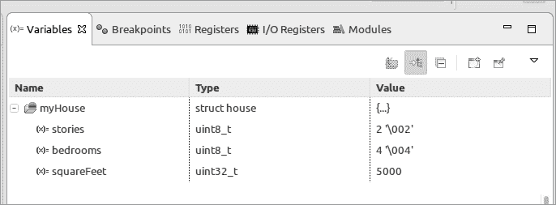
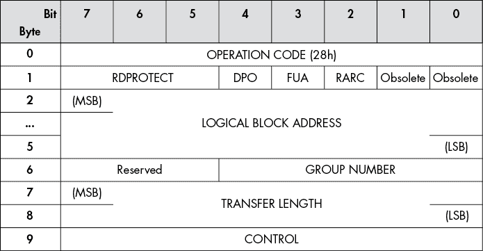
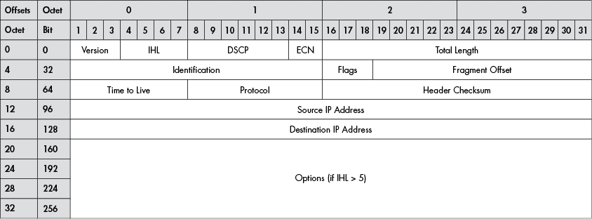

# 8

复杂数据类型


在本章中，我们将超越数组和简单类型，创建更复杂的数据类型。我们将从一个简单的`enum`开始，它定义了一个命名的项列表。然后我们将研究结构体和联合体，它们包含不同类型的值，并通过名称访问（不同于数组，它包含一个类型的值，并通过数字或索引访问）。为了创建一个自定义数据类型，我们将组合使用枚举、结构体和联合体。此外，我们还将探讨结构体在嵌入式编程中的应用。最后，我们将介绍`typedef`，它允许我们从现有类型定义自己的数据类型。

## 枚举

*枚举类型*，或称`enum`，是一种数据类型，允许我们定义一个命名项的列表。例如，如果我们想在变量中存储一个有限的颜色集合，可以这样写：

```
const uint8_t COLOR_RED = 0;
const uint8_t COLOR_BLUE = 1;
const uint8_t COLOR_GREEN = 2;

#define colorType uint8_t;

colorType colorIWant = COLOR_RED
```

虽然这会有效，但我们仍然需要跟踪各种颜色。幸运的是，如果我们使用`enum`，C 语言会为我们完成这项工作：

```
enum colorType {
    COLOR_RED,
    COLOR_BLUE,
    COLOR_GREEN
};

enum colorType colorIWant = COLOR_RED;
```

使用`enum`，C 语言为我们做了记录工作。如果我们只有三种颜色，那问题不大。然而，X Window 系统有超过 750 种命名颜色。追踪这些数字是一个不小的任务。

C 语言在类型方面比较宽松。内部，C 会分别将`COLOR_RED`、`COLOR_BLUE`和`COLOR_GREEN`赋值为整数 0、1 和 2。我们通常不在意这一点，但有时这种赋值会浮现出来。例如，以下代码：

```
enum colorType fgColor = COLOR_GREEN;
printf("The foreground color is %d\n", fgColor);
```

将打印出以下内容：

```
The foreground color is 2
```

此外，C 语言不会对`enum`赋值进行类型检查。例如，以下语句不会生成错误或警告：

```
colorIWant = 33;
```

我们的`enum`定义了三种颜色，所以合法的颜色数字是 0、1 和 2——而不是 33。这可能会成为一个问题。

假设我们写一个函数来打印存储在`colorIWant`中的颜色。当用户看到以下输出时，他们会怎么想？

```
Your box color is 33.
```

像这样打印一个错误的答案会让用户很好地意识到你的程序出了问题。如果你使用`enum`值来索引一个数组，就可以给出更好的结果。以下是一个例子：

```
static const char* const colorNames = {"Red", "Blue", "Green"};
*--snip--*
printf("Your box color is %s\n", colorNames[colorIWant]);
```

现在，如果`colorIWant`是 33，程序将打印：

```
Your box color is @ @@@�HH   pp�-�=�=�px�-�=�=�888 XXXDDS�td888 P�td
```

你的结果可能会有所不同，这取决于三元素数组中的元素 33 的内容。

## 预处理器技巧与枚举

在本节中，您将学习如何使用一些高级预处理器指令，使得处理枚举变得更容易。首先，我想说的是，千百次中，使用巧妙的技巧带来的麻烦通常多于它的好处。简单明了几乎总比复杂巧妙要好。这种情况是少数几个例外之一。

让我们来看一段代码，它定义了颜色和颜色名称。

```
// WARNING: Do not change this without changing colorNames.
enum colorType {
    COLOR_RED,
    COLOR_BLUE,
    COLOR_GREEN
};

// WARNING: Do not change this without changing colorType.
static const char* const colorNames = {
    "COLOR_RED", "COLOR_BLUE", "COLOR_GREEN"};
```

这个示例有两个相互依赖的项：`colorType`和`colorNames`。编写这段代码的程序员很贴心地加了注释，指明这两个项是相关的，而且它们实际上是紧挨着定义的。（有时候，两个相互依赖的项可能在不同的文件中，而没有任何指示它们关联的注释。）

作为程序员，我们希望代码尽可能简单。需要同时更新的两个不同项并不理想。我们可以通过巧妙使用预处理器来解决这个问题：

```
// This is the beginning of a clever trick to define both the values and
// the names for the enum colorType. The list below will be used twice,
// once to generate the value and once to generate the names.

#define COLOR_LIST                      \
 DEFINE_ITEM(COLOR_RED),         \
        DEFINE_ITEM(COLOR_BLUE),        \
        DEFINE_ITEM(COLOR_GREEN)

// Define DEFINE_ITEM so it generates the actual values for the enum.
#define DEFINE_ITEM(X) X
enum colorType {
   COLOR_LIST
};
#undef DEFINE_ITEM

// Define DEFINE_ITEM so it generates the names for the enum.
#define DEFINE_ITEM(X) #X
static const char* colorNames[] = {
   COLOR_LIST
};
#undef DEFINE_ITEM
```

我们从第一个定义开始：

```
#define COLOR_LIST                      \
        DEFINE_ITEM(COLOR_RED),         \
        DEFINE_ITEM(COLOR_BLUE),        \
        DEFINE_ITEM(COLOR_GREEN)
```

反斜杠（`\`）告诉 C 预处理器该行是继续的。我们将它们放在同一列中，这样如果我们不小心漏掉一个就很容易发现。

现在，每当我们使用`COLOR_LIST`时，C 预处理器会将其转换为以下内容：

```
DEFINE_ITEM(COLOR_RED), DEFINE_ITEM(COLOR_BLUE), DEFINE_ITEM(COLOR_GREEN)
```

当我们定义`enum`时，我们需要我们的列表如下：

```
COLOR_RED, COLOR_BLUE, COLOR_GREEN
```

通过定义`DEFINE_ITEM`只输出项名称，我们得到这个：

```
#define DEFINE_ITEM(X) X
```

这意味着下面的代码：

```
enum colorType {
   COLOR_LIST
};
```

变成了这个：

```
enum colorType {
    COLOR_RED, COLOR_BLUE, COLOR_GREEN
};
```

现在我们删除`DEFINE_ITEM`的定义，因为我们不再需要它来进行`enum`定义：

```
#undef DEFINE_ITEM
```

接下来，我们通过重新定义`DEFINE_ITEM`宏来定义`colorNames`列表：

```
#define DEFINE_ITEM(X) #X
```

井号（`#`）告诉预处理器将后续的标记转换为字符串，因此现在`COLOR_LIST`将展开为以下内容：

```
"COLOR_RED","COLOR_BLUE","COLOR_GREEN"
```

这是`colorNames`的完整定义：

```
#define DEFINE_ITEM(X) #X
static const char* colorNames[] = {
   COLOR_LIST
};
#undef DEFINE_ITEM
```

注释是这个定义的重要部分。每当你使用这样的巧妙技巧时，要做好文档，以便维护此代码的可怜的人能知道你做了什么。

## 结构体

C 语言的*结构体*（`struct`）允许我们将多种不同类型的项组合在一起。这些项被称为*字段*，并通过名称进行标识。它与定义包含相同类型项的数据结构的数组不同，数组中的项称为*元素*，并通过数字索引。例如，考虑以下将描述房屋信息的结构体：

```
struct house {
    uint8_t stories;        // Number of stories in the house
    uint8_t bedrooms;       // Number of bedrooms
    uint32_t squareFeet;    // Size of the house
};
```

要访问结构体的元素，可以使用`变量.字段`的格式，中间用点号分隔。例如：

```
struct house myHouse;
--snip--
myHouse.stories = 2;
myHouse.bedrooms = 4;
myHouse.squareFeet = 5000;
```

以下程序展示了如何将这一切结合在一起：

**struct.c**

```
/**
 * Demonstrate the use of a structure.
 */

#include <stdio.h>
#include <stdint.h>

struct house {
    uint8_t stories;        // Number of stories in the house
    uint8_t bedrooms;       // Number of bedrooms
    uint32_t squareFeet;    // Size of the house
};

int main() {
    struct house myHouse;   // The house for this demo

    myHouse.stories = 2;
    myHouse.bedrooms = 4;
    myHouse.squareFeet = 5000;
    printf("House -- Stories: %d Bedrooms %d Square Feet %d\n",
        myHouse.stories, myHouse.bedrooms, myHouse.squareFeet);
    printf("Size of the structure %ld\n", sizeof(myHouse));
    return (0);
}
```

让我们在 STM32 工作台中调试这个程序（参见图 8-1）。



图 8-1：`struct`变量显示

在第 20 行停止，我们现在可以在变量列表中看到结构体。点击 + 图标可以展开结构体，显示其内容。

### 内存中的结构体

让我们来看看 C 编译器将如何在内存中布局这个结构体。编译器需要为`stories`（`uint8_t`）分配 1 个字节，为`bedrooms`（`uint8_t`）分配 1 个字节，为`squareFeet`（`uint32_t`）分配 4 个字节。逻辑上，布局应该像表 8-1 所示。

表 8-1：结构体布局

| **偏移量** | **类型** | **字段** |
| --- | --- | --- |
| 0 | `uint8_t` | `stories` |
| 1 | `uint8_t` | `bedrooms` |
| 2 | `uint32_t` | `squareFeet` |
| 3 |  |
| 4 |  |
| 5 |  |

从 表 8-1 中，我们可以看到该结构占用了 6 字节。然而，当我们运行程序时，看到以下输出：

```
Size of the structure 8
```

另外 2 个字节来自哪里？

问题出在内存设计上。在 ARM 芯片（以及许多其他芯片）中，内存是按一系列 32 位整数进行组织的，并且这些整数是对齐在 4 字节边界上的，像这样：

| `0x10000` | 32 位 |
| --- | --- |
| `0x10004` | 32 位 |
| `0x10008` | 32 位 |
| `. . .` |  |

假设我们需要一个 8 位字节，位于 `0x10001`。计算机从 `0x10000` 获取 32 位数据，然后丢弃 24 位数据，这样做很浪费，因为额外的数据被读取了，尽管没有性能损失。

假设我们需要一个从 `0x10002` 开始的 32 位整数。直接获取这些数据会导致对齐异常，进而中止程序。计算机必须执行以下操作：

1.  从 `0x10000` 读取 16 位数据。

1.  从 `0x10004` 读取 16 位数据。

1.  将它们组合起来。

内部 ARM 电路*并不*完成这些步骤。相反，编译器必须生成多条指令来完成这项工作，这对于性能来说并不好。（我们将在本章稍后部分详细讨论这个问题。）

如果 `squareFeet` 能够对齐到 4 字节边界，而不是 2 字节边界，那就好了，这样编译器可以通过添加 2 字节的填充来优化结构布局。这使得结构变大了，但处理起来要容易得多。表 8-2 显示了结构的实际调整后的布局。

表 8-2：填充结构布局

| **偏移量** | **类型** | **字段** |
| --- | --- | --- |
| 0 | `uint8_t` | `stories` |
| 1 | `uint8_t` | `bedrooms` |
| 2 | `uint8_t` | （填充） |
| 3 | `uint8_t` | （填充） |
| 4 | `uint32_t` | `squareFeet` |
| 5 |  |
| 6 |  |
| 7 |  |

这种额外的填充有时会成为一个问题。例如，如果你有很多房屋而且内存非常有限，那么每个房屋结构中的填充就会累积成大量浪费的空间。

另一个例子是在嵌入式编程中。我有一款旧的、iPod 发布之前的音乐设备，叫做 Rio，它没有配备 Linux 工具来将音乐加载到设备上，所以我自己写了一些工具。每个数据块都有一个像这样的头部：

```
struct dataBlockHeader {
    uint32_t nextBlock;      // Number of the next block in this song
    uint16_t timeStamp;      // Time in seconds of this section of the song
    uint32_t previousBlock;  // Number of the previous block in the song
};
```

当我第一次在 Rio 上加载歌曲时，它们播放得很好。但当我按下倒带按钮倒回几秒钟时，设备就会疯掉并重新开始播放歌曲。问题在于 GCC 在结构中添加了填充：

```
struct dataBlockHeader {
    uint32_t nextBlock;      // Number of the next block in this song
    uint16_t timeStamp;      // Time in seconds of this section of the song
    **uint16_t padding;        // Automatically added**
    uint32_t previousBlock;  // Number of the previous block in the song
};
```

结果，Rio 认为前一个块是之前的一个块，实际上那只是一些填充和前一个块的一半值。难怪设备会变得混乱。

解决方法是告诉编译器不要通过 `packed` 属性添加填充：

```
struct dataBlockHeader {
    uint32_t nextBlock;      // Number of the next block in this song
    uint16_t timeStamp;      // Time in seconds of this section of the song
 uint32_t previousBlock;  // Number of the previous block in the song
}  **__attribute__((packed));**
```

在这个例子中，`__attribute__((packed))` 是 C 语言的一个 GNU 扩展，它可能在其他编译器上无法使用。

### 访问未对齐的数据

默认情况下，编译器会“调整”结构体元素的对齐方式，以便高效的内存访问。正如我们所见，硬件设计师有时会有不同的想法，为了让结构体与硬件匹配，我们必须包含`__attribute__((packed))`指令。

为了理解编译器为什么做出这样的调整，让我们编写一个程序，它同时执行对齐和未对齐的 32 位访问。打包结构体更加紧凑，但需要更多的代码来访问 32 位值。未打包结构体访问更高效，但占用更多内存。

以下程序展示了如何访问打包和未打包结构体：

```
/*
 * A demonstration of packed and unpacked.
 * This program does nothing useful except
 * generate an assembly listing showing
 * how hard it is to access squareFeet
 * in a packed structure.
 *
 * To run -- don't. Compile and look at the
 * assembly listing instead.
 */

#include "stm32f0xx.h"
#include "stm32f0xx_nucleo.h"

// An example of an unpacked structure
struct unpackedHouse {
    uint8_t stories;     // Number of stories in the house
    uint8_t bedrooms;    // Number of bedrooms
    uint32_t squareFeet; // Size of the house
    uint8_t doors;       // Number of doors
    uint8_t windows;     // Number of windows
};

// An example of a packed structure
struct packedHouse {
    uint8_t stories;     // Number of stories in the house
    uint8_t bedrooms;    // Number of bedrooms
    uint32_t squareFeet; // Size of the house
 uint8_t doors;       // Number of doors
    uint8_t windows;     // Number of windows
} __attribute__((packed));

// A place to dump squareFeet for unpackedHouse
volatile uint32_t unpackedFeet;
volatile uint32_t packedFeet;   // A place to dump squareFeet for packedHouse

// An example unpackedHouse -- values chosen to make demonstration easier
struct unpackedHouse theUnpackedHouse = {0x01, 0x02, 0x11223344, 0x03, 0x04};

// An example packedHouse -- values chosen to make demonstration easier
struct   packedHouse thePackedHouse = {0x01, 0x02, 0x11223344, 0x03, 0x04};

int main(void)
{
  1 unpackedFeet = theUnpackedHouse.squareFeet;
  2 packedFeet = thePackedHouse.squareFeet;

    for(;;);
}
```

首先，让我们来看一下获取对齐的`uint32_t` 1 时生成的代码（已添加注释）：

```
;unpackedFeet = theUnpackedHouse.squareFeet;
    ldr     r3, .L3       ; Get address of theUnpackedHouse.
    ldr     r2, [r3, #4]  ; Get data at offset 4
                          ; (theUnpackedHouse.squareFeet).
`--snip--`
L3: theUnpackedHouse
```

它使用一条指令获取结构体的地址，并用一条指令获取值。

现在让我们来看一下未对齐的取值 2：

```
;  packedFeet = thePackedHouse.squareFeet;
    ldr     r3, .L3+8     ; Get address of thePackedHouse.
    ldrh    r2, [r3, #2]  ; Get uint16_t at offset 2 (0x3344).
                          ; (Byte order puts the low-order bytes first.)

    ldrh    r3, [r3, #4]  ; Get uint16_t at offset 4 (0x1122).
                          ; (High bytes come after low.)

    lsls    r3, r3, #16   ; r3 contains the top 1/2 of squareFeet
                          ; in the bottom 16 bits of r3.
                          ; Shift it left into the top half.

    orrs    r3, r2        ; Combine the two halves.

.L3: theUnpackedHouse
     thePackedHouse
```

未对齐的取值需要四条指令，而对齐的取值只需要一条指令。程序必须使用两条加载指令来获取数字的两个部分：一条移位指令将高半部分移到寄存器的顶部，另一条逻辑或指令将这两个数合并。

每次加载或存储未对齐的`uint32_t`时，必须使用像这样的代码。你可以理解为什么编译器可能会避免这样做，并且添加填充。

### 结构体初始化

我们可以通过将初始化列表放在花括号（`{}`）中来初始化结构体。例如，下面的语句通过一个语句声明并初始化`myHouse`：

```
struct house {
    uint8_t stories;        // Number of stories in the house
    uint8_t bedrooms;       // Number of bedrooms
    uint32_t squareFeet;    // Size of the house
};

// 2 stories
// 5 bedrooms
// 2500 square feet
struct house myHouse = {2, 5, 2500};
```

在语言的早期版本中，这是初始化结构体的唯一方法。后来，当 C99（1999 年最终确定的 C 语言规范）发布时，增加了一种名为*指定初始化器*的新特性，允许通过字段名称初始化。这里有一个例子：

```
struct house myHouse = {
  stories: 2,
  bedrooms: 5,
  squareFeet: 2500
};
```

字段必须按照声明时的顺序排列。GCC 编译器有一个扩展，允许你使用指定初始化器，采用不同的方式：

```
struct house myHouse = {
    .stories: 2,
    .squareFeet: 2500,
    .bedrooms: 5
};
```

在这种情况下，字段的顺序不需要与声明时的顺序匹配。

### 结构体赋值

C 语言不允许将一个数组赋值给另一个数组，但它允许将一个结构体赋值给另一个结构体。这里有一个例子：

```
int array1[5];           // An array
int array2[5];           // Another array

array1 = array2;         // Illegal

struct example {
    int array[5];        // Array inside a structure
};
struct example struct1;  // A structure
struct example struct2;  // Another structure

// Initialize structure 2

struct1 = struct2;       // Structure assignment allowed
```

如果这些是数组，赋值将是非法的，但由于它们是结构体，因此可以正常工作。

### 结构体指针

C 语言的参数传递机制使用*按值传递*，意味着如果我们将参数传递给一个过程，它会将参数的值复制到栈上。当我们传递的是像 2 字节整数这样的小型数据时，这种做法没有问题，但大多数结构体并不小，实际上可能非常大。当一个结构体作为参数传递时，*整个结构体都会被复制到栈上*，这使得操作变得昂贵。这里有一个例子：

```
// A rectangle
struct rectangle {
    unsigned int width;  // Width of the rectangle
    unsigned int height; // Height of a rectangle
};

// Inefficient parameter passing
unsigned int area(const struct rectangle aRectangle)
{
    return (aRectangle.width * aRectangle.height);
}
```

这里发生的事情是，为了执行“按值传递”参数传递，编译器必须生成代码，将整个`aRectangle`复制到栈上。对于较大的结构体，这可能会占用大量栈空间，并且复制数据时耗时较长。

通过指针传递结构体更高效：

```
// Efficient parameter passing
unsigned int area(const struct rectangle* const aRectangle)
{
    return ((*aRectangle).rectangle * (*aRectangle).height);
}
```

在这种情况下，只有指针（一个小项）作为参数传递。以 ARM 编译器为例，它是通过将其放入寄存器来实现的：快速、简便且不占用栈空间。

按值传递的一个优点是，参数的任何更改都不会传回给调用者。但我们并没有做任何更改，所以这不是问题。

当我们按指针传递参数时，我们使用`const`来表明不允许修改参数。

使用`(*rectangle).height`语法来访问结构体指针的成员有点别扭。为此，C 添加了一些语法糖，使我们可以使用简便方式——`->`操作符：

```
// Efficient parameter passing
unsigned int area(const struct rectangle* const aRectangle)
{
    return (aRectangle->rectangle * aRectangle->height);
}
```

C 在处理数组时可以自由地把它当作指针来使用，而指针也可以当作数组来使用。当数组作为参数传递时，数组会自动转换为指针。当数组被指定为过程参数时，它会在你不知情的情况下自动转换为指针。

说 C 是“按值传递”并不完全正确。更精确的说法是，“C 按值传递，除了数组是按指针值传递。”

### 结构体命名

像 C 中的许多事物一样，结构体的命名并不简单。这是因为在一个 C 结构体声明中，我们可以定义结构体名称（也可以不定义）和变量（也可以不定义）。下面是结构体定义的一般语法：

```
struct [`struct-name`] {
    `field1`;
    `field2`;
*--snip--*
} [`var-name(s)`];
```

让我们考虑一下没有结构体名称的例子：

```
// A box to put our stuff into
struct {
    uint32_t width;     // Width of the box
    uint32_t height;    // Height of the box
} aBox;
```

这定义了`aBox`变量，但`aBox`是什么类型呢？它是一个没有名称的结构体，或者是一个*匿名结构体*。匿名结构体只能在结构体定义时用于定义变量。它们不指定结构体名称，因此在后续声明中无法使用。

现在让我们考虑省略变量名的情况：

```
struct box {
    uint32_t width;     // Width of the box
    uint32_t height;    // Height of the box
};
```

这定义了一个结构类型，但没有定义变量。它可以在后续用来定义一个变量：

```
struct box aBox; // Box to put stuff into
```

我们可以在同一个声明中同时定义结构体名称和变量名称：

```
struct box {
    uint32_t width;     // Width of the box
    uint32_t height;    // Height of the box
} aBox;
```

这定义了一个`box`结构和一个变量`aBox`。

C 还有一个技巧——我们可以定义没有结构体名称和变量名称的结构体：

```
// Silly definition
struct {
    uint32_t width;     // Width of the box
    uint32_t height;    // Height of the box
};
```

因为没有结构体名称，我们只能用它来访问这里定义的变量。但这里并没有定义任何变量，所以我们无法访问任何内容，这意味着虽然它完全合法，但也是完全没用的。

## 联合体

`union`类似于`struct`，不同之处在于每个字段不分配不同的位置，而是所有字段都存储在同一个位置。以下是一个示例：

```
union value {
    uint32_t anInteger;
    float aFloat;
};
```

编译器为`uint32_t`分配 4 字节，并且*同样分配 4 字节*给`float`。让我们看一下它的实际表现：

```
union value theValue;   // Define the value.

theValue.anInteger = 5; // anInteger is 5.
theValue.aFloat = 1.0;  // Assign the field aFloat/wipe out anInteger.
```

第二个赋值实际上将 `anInteger` 更改为 1065353216 (0x3f800000)。这是一个非常奇怪的整数，但作为浮点数，它是 1.0。

良好的编程实践是使用相同的字段名称来存储和取出联合体中的值。例如：

```
 theValue.aFloat = 1.2;
    float someFloat = theValue.aFloat;   // Assigns someFloat 1.2
```

当你使用不同的字段时，结果会在不同的机器上有所不同。

```
 theValue.aFloat = 1.2;
    int someInt = theValue.anInteger;   // Results machine-dependent
```

在这种情况下，`someInt` 的值将取决于整数的大小、浮点数的大小、浮点格式和字节顺序，而这些都依赖于处理器。

现在让我们讨论字节顺序问题。假设你手上有四张卡片，编号为 1、2、3 和 4。你想把它们放进你面前的四个盒子里。所以，你把最上面的卡片放进最左边的盒子，把下一张卡片放进右边的盒子，以此类推。现在你的盒子里包含以下内容：

| 1 | 2 | 3 | 4 |
| --- | --- | --- | --- |

当你拿起卡片时，你从右边开始，并将每张卡片放在堆叠的最上面。结果是，你会按顺序拿到 1、2、3 和 4。

现在另一个人过来了，把卡片从右边开始放入盒子，再向左放。他们的盒子看起来是这样的：

| 4 | 3 | 2 | 1 |
| --- | --- | --- | --- |

他们从左边开始拿起卡片，依次向右移动。同样，这个人最终会拿到 1、2、3 和 4，顺序完全一致。

我刚才描述的是两种不同的 CPU 架构如何在内存中存储数字。在某些情况下，它会是 1、2、3 和 4，而在其他情况下，它会是 4、3、2 和 1。只要存储和读取的是相同大小的数字，字节顺序就无关紧要。

现在假设你想把四张卡片存入盒子里，但只取出两张，这意味着你的盒子看起来是这样的：

| 1 | 2 | 3 | 4 |
| --- | --- | --- | --- |

当你拿起你的卡片时，你只会得到 1 和 2。

然而，另一个人的存储方式是这样的：

| 4 | 3 | 2 | 1 |
| --- | --- | --- | --- |

最左边的 *n* 个盒子在取卡片时总是被使用，所以这个人将从左边开始，拿到 3 和 4，这意味着他们会得到不同的结果。

这个差异是因为你们两个人在存储和取出卡片时使用了不同的顺序。计算机中也发生了同样的事情。不同的计算机以不同的顺序存储数据。因此，如果你尝试存储一种数据类型并取出另一种数据类型，你将在不同的机器上得到不同的结果。

因此，如果你将某个值放入 `theValue.anInteger`，唯一能保证获得一致结果的方式就是仅通过 `theValue.anInteger` 字段取出它。

## 创建自定义类型

我们现在将结合我们新创建的三种数据类型——`struct`、`union` 和 `enum`——将它们合并成一个大数据类型，用来在屏幕上绘制形状。这个形状可以是正方形、矩形、圆形或三角形。每种形状的描述方式不同。

我们只需要描述一个正方形的单个边长：

```
struct square {
    unsigned int side; // Size of the square
};
```

要描述一个矩形，我们需要宽度和高度：

```
struct rectangle {
    unsigned int width;   // Width of the rectangle
    unsigned int height;  // Height of the rectangle
};
```

我们可以仅用半径画一个圆：

```
struct circle {
    unsigned int radius;  // Radius of the circle
};
```

最后，要绘制一个三角形，我们需要描述它的底边和高度：

```
struct triangle {
 unsigned int base;    // Base of the triangle
    unsigned int height;  // How high is it?
};
```

一个通用的形状类型应该包含这些中的任何一个，这意味着我们需要一个`union`。但是，为了绘制一个形状，我们不仅需要知道它的描述，还需要知道它是什么类型的形状。`enum`数据类型是为有限的简单值列表而设计的：

```
enum shapeType {
    SHAPE_SQUARE, SHAPE_RECTANGLE, SHAPE_CIRCLE, SHAPE_TRIANGLE
};
```

现在我们可以定义我们的数据结构了：

```
struct shape {
    enum shapeType type;   // The type of the shape
    union {
       struct square theSquare;
       struct rectangle theRectangle;
       struct circle theCircle;
       struct triangle theTriangle;
    } dimensions;
};
```

第一个字段是`type`，它包含结构体中所包含的形状类型。第二个字段包含形状的`dimensions`。它是一个`union`，因为不同的形状有不同的维度。

绘制形状的代码看起来像如下所示：

```
void drawShape(const shape* const theShape) {
    switch (theShape->type) {
        case SHAPE_SQUARE:
            drawSquare(theShape->dimensions.theSquare.side);
            break;
        case SHAPE_RECTANGLE:
            drawSquare(theShape->dimensions.theRectangle.width,
                       theShape->dimensions.theRectangle.height);
            // ... other shapes
```

这种设计模式在 C 编程中相当常见：一个可以容纳多种不同类型数据的`union`和一个指示我们实际拥有哪种类型的`enum`。

## 结构体与嵌入式编程

在本节中，我们将硬件规范转换为 C 结构体，运用到我们目前所学的结构体和对齐的知识。

小型计算机系统接口（SCSI）旨在提供一种标准的方式，用于在设备之间传输数据。它始于 1986 年，后来经过了许多扩展和增强。它通过向设备发送一个称为命令块的结构体，并返回数据和状态信息的方式来工作。

在最初，SCSI 标准定义了`READ (6)`命令，该命令将块地址限制为 16 位，允许的最大磁盘大小为 16MB，这是当时相对较大的磁盘。当然，磁盘制造商很快就生产出了更大的磁盘，因此 SCSI 团队不得不创建一个新命令，以支持更大的驱动器。这就是`READ (10)`命令，之后是`READ (12)`、`READ (16)`和`READ (32)`命令。`READ (32)`命令使用 64 位块地址。希望磁盘制造商能花点时间赶上，生产出 8 泽比字节的磁盘。

图 8-2 显示了`READ (10)`命令的命令块。如果我们想从磁盘读取数据，我们需要一个 C 结构体来包含这些信息并将其发送到设备。



图 8-2：`READ (10)`命令块

一开始，它看起来像是一个简单的翻译：

```
struct read10 {
    uint8_t opCode;    // Op code for read
    uint8_t flags;     // Flag bits
    **uint32_t lba;      // Logical block address**
    uint8_t group;     // Command group
    uint16_t transferLength;  // Length of the data to read
    uint8_t control;   // Control bits, the NACA being the only one defined
};
#include <assert.h>

int main() {
    assert(sizeof(struct read10) == 10);
```

现在，因为我们比较谨慎，程序中做的第一件事就是插入一个`assert`语句，确保我们的定义与硬件匹配。如果`assert`语句的条件不为真，它将终止程序。如果我们期望`read10`控制块包含 10 个字节，但它并没有，那么我们的程序就会有大问题。我们也有问题，因为`assert`会失败。

那么发生了什么呢？检查结构体后，我们看到`lba`字段（一个`uint32`）被对齐到了 2 字节边界。编译器希望将其对齐到 4 字节边界，因此它添加了 2 字节的填充。我们需要打包这个结构体：

```
struct read10 {
    uint8_t opCode;    // Op code for read
    uint8_t flags;     // Flag bits
    uint32_t lba;      // Logical block address
    uint8_t group;     // Command group
    uint16_t transferLength;  // Length of the data to read
    uint8_t control;   //  Control bits, the NACA being the only one defined
} __attribute__((packed));
```

`packed` 属性告诉 GCC 不要添加任何填充。因此，我们的结构不够高效，但它与硬件匹配。此外，我们的 `assert` 也没有失败，因此我们做得对。

## `typedef`

我们可以使用 `typedef` 语句定义我们自己的类型。例如，以下语句定义了一个新的 `dimension` 类型：

```
typedef unsigned int dimension;  // Dimension for use in the plans
```

该类型等同于 `unsigned int`，可以像其他类型一样使用：

```
dimension width;   // Width of the thing in furlongs
```

`typedef` 的语法类似于变量声明。它包含 `typedef` 关键字和初始类型的名称，以及定义类型的名称：

```
typedef `initialtype` `newtypename`;  // A type definition
```

`typedef` 的一个例子可以在 *stdint.h* 文件中找到，该文件在许多程序中都被包含：

```
// These typedefs are system-dependent.
typedef signed char        int8_t;
typedef unsigned char      uint8_t;
typedef signed short int   int16_t;
typedef unsigned short int uint16_t;
typedef signed int         int32_t;
typedef unsigned int       uint32_t;
```

在 C 语言的早期，`int` 可能是 16 位或 32 位，这取决于处理器。在编程的早期，如果用户想使用 16 位整数（旧的 C 标准不支持），他们必须在代码中写出类似以下的内容：

```
#ifdef ON_16_BIT_CPU
typedef signed int   int16_t;
#else // ON_32_BIT_CPU
typedef signed short int   int16_t;
#endif
```

多年来，由于需要自己定义精确的数据类型，C 标准委员会创建了 *stdint.h* 头文件，并将其纳入语言的一部分。

### 函数指针与 `typedef`

C 语言允许使用函数指针，这在进行回调时非常有用。例如，我们可能会告诉图形系统在按下按钮时调用给定的函数。实现这功能的代码可能如下所示：

```
registerButtonPressHandler(functionToHandleButtonPress);
```

`functionToHandleButtonPress` 参数是一个指向返回整数并接受常量事件指针作为唯一参数的函数的指针。这个句子很复杂，翻译成 C 代码后也没有变得更容易：

```
int (*ButtonCallback)(const struct event* const theEvent);
```

第一个括号是必需的，因为如果没有它，我们定义的是一个返回整数指针的函数：

```
// Define function that returns int*
int* getPointer(...)
```

与其记住这些复杂的语法规则，不如使用 `typedef` 来简化语法：

```
// Function type for callback function
typedef int ButtonCallbackType(const struct event* const theEvent);

// Pointer to callback function
typedef ButtonCallbackType* ButtonCallbackPointer;
```

这将 `registerButtonPressHandler` 的定义更改为：

```
void registerButtonPressHandler(int (*callbackPointer)
     (const struct event* const theEvent));
```

到这里：

```
void registerButtonPressHandler(ButtonCallbackPointer callbackPointer);
```

`typedef` 提供了一种组织类型的方式，以简化代码并使其更清晰。

### `typedef` 和 `struct`

我们已经看到如何使用 `struct` 来定义结构化数据类型。

```
struct rectangle {
    uint32_t width;  // Width of the rectangle
    uint32_t height; // Height of the rectangle
};
```

使用此结构时，我们必须使用 `struct` 关键字：

```
struct rectangle bigRectangle;   // A big rectangle
```

`typedef` 语句使我们能够避免使用 `struct` 关键字：

```
typedef struct{
    uint32_t width;       // Width of the rectangle
    uint32_t height;      // Height of the rectangle
} rectangle;

rectangle bigRectangle;   // A big rectangle
```

在这种情况下，`typedef` 告诉 C 我们想要定义一个新的 `rectangle` 类型。

有些人认为使用 `typedef` 来定义一个新的结构类型可以使代码更简洁、更清晰。也有人喜欢使用 `struct`，因为它能明确指出一个变量是 `struct` 类型。语法是可选的，因此可以根据自己的需求选择最适合的方式。

## 总结

本章主要讲述如何组织数据。`enum`类型允许你组织简单的名称列表，而不必担心哪个字段对应什么值。结构体为组织不同类型的数据提供了强大的工具。对于嵌入式程序员来说，它们还在与实际硬件设备通信时非常有用。然而，请记住，硬件设计师对于结构体布局的理解可能与 C 语言对其的理解有所不同。

虽然结构体只能存储一组固定的数据，但联合体可以存储多个数据集（只不过不能同时存储）。通过它们，我们可以很好地控制数据存储方式。

另一个组织数据的工具是`typedef`指令，它允许我们定义自己的数据类型。它让我们可以使用熟悉的类型来表示数据，而不必使用基本的 C 语言类型。

存在许多复杂的数据类型，C 语言提供了一整套很好的工具来管理这些类型。

## 编程问题

1.  创建一个结构体来存储分数。然后创建程序来执行加法、减法、乘法和除法操作。分数应存储为标准化形式。换句话说，2/4 应该存储为 1/2。

1.  创建一个名为`car`的结构体，包含电动和燃油汽车共有的属性。为其添加一个包含两个字段`electric`和`gas`的联合体，这两个字段是分别存储电动和燃油汽车特有属性的结构体。例如，`numberOfPassengers`是所有汽车共有的字段，而`chargingTime`仅适用于电动汽车。

1.  编写一个结构体来描述一个学生（单一班级）。数据应包含学生的姓名和学号，以及一个包含学生成绩的数组。

1.  编写一个结构体来处理图 8-3 中显示的数据。

    图 8-3：IPv4 头格式

1.  南加州铁路是唯一一个在交叉口设置了 Acme 交通信号灯（带有臂和灯）的地方。要将信号从 STOP 更改为 GO，控制器必须执行以下操作：

    1.  关闭 STOP 灯。

    1.  打开 GO 灯。

    1.  打开 DIRECTION 继电器。

    1.  启动 ARM 继电器。

    1.  等待 3 秒钟。

    1.  关闭 ARM 继电器。

    1.  关闭 DIRECTION 继电器。

    我们有以下可用命令：（1）将灯光*x*的状态更改为*y*，其中*x*为 STOP 或 GO，*y*为 ON 或 OFF；（2）将 DIRECTION 继电器电源设置为*x*，其中*x*为 ON 或 OFF；（3）休眠*n*秒。为每个命令编写一个结构体。然后编写一个联合体，包含一个`enum`来标识命令和相应命令的结构体。
