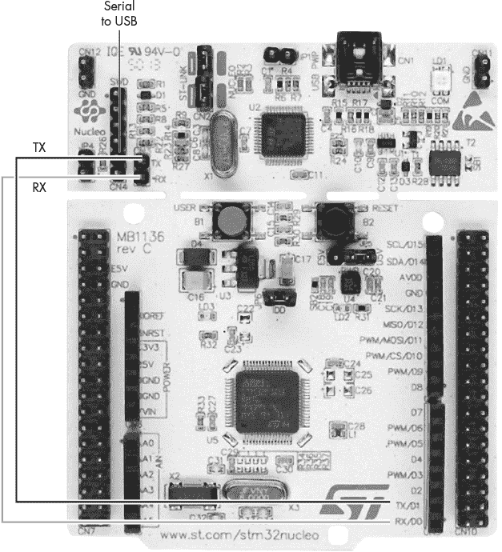
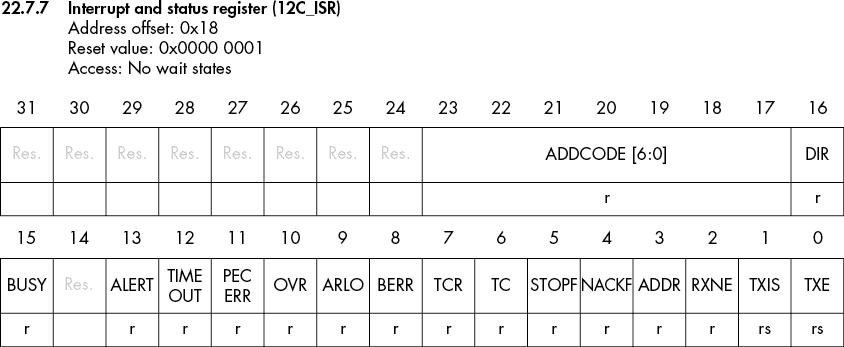
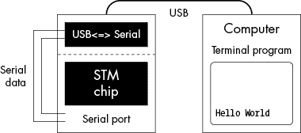
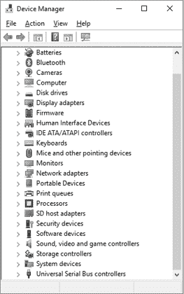
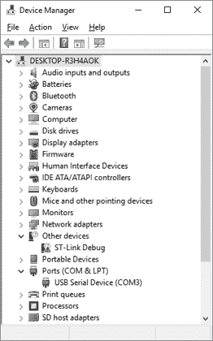
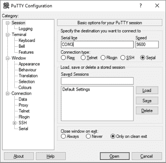

# 第九章：STM 的串行输出


我们现在回到“Hello World”，这一次我们将使用我们的 Nucleo 开发板，这带来了一些挑战。第一个挑战是在哪里写入信息。板上没有显示屏。幸运的是，芯片上有一个串行端口，且与开发板上部的 USB/串行端口连接良好。

下一个挑战是编写程序本身。我们需要初始化设备，并创建一个实际写入字符的过程。设备设计为一次接受一个字符，在编写程序时，我们必须牢记这一限制。

我们将在与设备交互之前模拟这个过程。C 语言提供了很多标准函数，例如`puts`，使得输出数据变得非常简单。然而，Nucleo 开发板没有这么方便的功能，所以我们必须编写自己的输出函数。为了过渡到适用于 Nucleo 的低级编码，我们将一次写入一个字符，输出“Hello World”。

## 一次写入一个字符的字符串

当 C 程序调用标准的`puts`函数时，它会启动一个涉及内核调用、内部缓冲、Interrupt 调度和设备驱动的长过程（下一章会详细介绍这些内容）。最终，它会到达一个阶段，开始一次发送一个字符到设备。为了模拟这一过程，我们将一次发送一个字符到操作系统。换句话说，我们将限制自己只使用标准的`putchar`函数来写入输出。

Listing 9-1 包含了一个以“艰难的方式”写出`"Hello World\n"`的程序。再次强调，我们这样做是因为在接下来的 Nucleo 板使用中，我们将不得不以*真正*艰难的方式来做。

**putchar.c**

```
/*
 * Print a string one character at a time.
 */
#include <stdio.h>

char hello[] = "Hello World\n"; // The characters to print
int curChar;    // Character number we are printing

int main()
{
  1 for (curChar = 0; hello[curChar] != '\0'; ++curChar)
        putchar(hello[curChar]);
    return (0);
}
```

*Listing 9-1: 一次写入一个字符的字符串*

这个程序中唯一有趣的部分是`for`循环 1，它不会在达到一定字符数后停止。相反，它会在程序遇到字符串结尾字符（`'\0'`）时停止。这样，程序就可以输出任意长度的字符串。

### 定义我们自己的 putchar

为了改进这个程序，首先我们将把`curChar`定义为局部变量。然后我们将定义一个名为`myPutchar`的函数，将字符发送到标准输出（参见 Listing 9-2）。

**my_putchar.c**

```
/**
 * Print a string one character at a time
 * using our own function.
 */
#include <stdio.h>

char hello[] = "Hello World\n"; // The characters to print

1 /**
 * Reimplementation of putchar
 *
 * @param ch The character to send
 *
 * @note Not as apparently useless as it seems
 */
2 void myPutchar(const char ch)
{
  3 putchar(ch);
}

int main()
{
    int curChar;        // Index of the current character we
                        // are printing
    for (curChar = 0; hello[curChar] != '\0'; ++curChar)
      4 myPutchar(hello[curChar]);
    return (0);
}
```

*Listing 9-2: 使用我们自己的输出函数一次写一个字符*

在`myPutchar`的开始部分，我们向注释块中添加了一些附加元素。关键字`@param`表示参数，`@note`关键字定义了一个注释。你可以在 Doxygen 风格的注释中使用许多其他关键字，但目前我们只使用基础内容，以便与现有的 STM 代码兼容。

实际的函数从`void myPutchar(const char ch)`声明开始 2，这表明`myPutchar`过程不返回任何值，并且接受一个类型为`char`的参数。`const`修饰符表示我们在过程内部不会修改它。（实际上，我们不能修改它，因为如果我们尝试，编译器会报错。）

当执行该过程时 4，程序将执行以下步骤：

1.  它计算`hello[curChar]`的值。

1.  它将这个值放置在`myPutchar`可以找到的位置。

1.  它记录下下一个指令的地址（`for`循环的结束）。

1.  它开始执行`myPutchar`。（`ch`变量将在步骤 2 中初始化。）

当我们调用`putchar` 3 时，会执行一组相似的步骤。唯一的不同之处在于我们必须写出`myPutchar`，而编写标准 C 库的人则提供了`putchar`。

创建一个什么也不做只调用另一个（`putchar`）的函数（`myPutchar`）并不是特别有用。Nucleo 开发板没有`putchar`函数，因此我们将在本章稍后自己编写。但在此之前，让我们先了解串行设备的细节。

## 串行输出

串行输出是从嵌入式系统中获取数据的最简单方式之一。电气接口由发送线（TX）、接收线（RX）和地线（GND）组成。大多数嵌入式系统将这些接口隐藏起来，仅供愿意拆开机箱并连接串行端口的开发者使用。

我们的芯片有一个串行设备可以写入。我们所需要做的就是连接开发板下半部分的微控制器（TX、RX、GND）和开发板上半部分的 USB/串行设备。

以下表格展示了我们需要的连接：

| **微控制器** | **USB/串行及其他支持设备** |
| --- | --- |
| RX | CN9-1 | TX | CN3-1 |
| TX | CN9-2 | RX | CN3-2 |
| GND | CN6-5 | GND | CN4-3 |

如果我们有一个没有内建串行控制器的 Raspberry Pi 或其他嵌入式系统，我们需要进行这些连接。图 9-1 展示了这些组件的布局和 STM 提供的内部接线。

STM 已经为我们做好了连接。无需跳线。



图 9-1：Nucleo 开发板上的串行通信

### 串行通信简史

串行通信的历史可以追溯到很久以前，甚至可以追溯到公元前（即*计算机出现之前*）。电报是那个时代的互联网，它允许通过电线传输远距离的信息。发送方由电报键组成，当按下时，接收方会发出“点击”声。这些点击声音通过一种叫做*摩尔斯电码*的系统进行编码（今天仍在使用）。这一发明彻底改变了通信方式。你可以将信息发送到下一个城市，并在当天收到回应。比起 Pony Express，这更快。

然而，问题是；你需要在电报两端有熟练的操作员，他们懂得摩尔斯电码。没有技能的人无法发送或接收信息，而培训操作员非常昂贵。一个解决方案是使用两个时钟：一个用于发射器，一个用于接收器。在时钟表盘上有字母，从*A*到*Z*。例如，要发送一个*S*，发送方会等到时钟上的单一指针指向*S*，然后按下电报键。接收方看到指针指向*S*，然后记录下这个字母。

然而，保持时钟同步几乎是不可能的，因此一位非常聪明的发明家决定，每个时钟的指针都停在顶部位置。当发送方想要发送一个字母时，他们会按下电报键作为*启动信号*。时钟会足够精确地保持时间，确保指针正确地转动一圈。然后，发送方按下字母信号。当指针到达顶部时，一个短暂的暂停时间，称为*停止时间*，会给较慢的时钟一个赶上的机会。事件的顺序是这样的：启动信号，字母信号，停止时间。

现在让我们快速回到电传打字机的发明，它能够通过类似电报线路的方式发送文本。电传打字机并不是发送一个单一的字母脉冲，而是将字符编码成一系列八个脉冲（七个数据脉冲和一个用于基本错误检查的脉冲）。它使用由杠杆组成的键盘编码器，将按键转换成一个 8 位的代码，这个代码传递给一个机械移位寄存器，移位寄存器看起来像一个分配器帽。这个装置通过电线发送脉冲，另一个电传打字机会将脉冲转换为一个单一的打印字母。

电传打字机的顺序是这样的：发送方按下一个键，机械发送器会发送一个 10 位信号（1 个起始位，8 个数据位和 1 个停止位）。当接收方接收到起始位时，它会启动其移位寄存器（另一个带有分配器帽的电动机），并使用传入的脉冲来转动打印头，以便正确的字母被打印出来。在 8 个数据位发送完毕后，两台机器至少暂停 1 个位时间（即停止位），以保持同步。

大多数电传打字机的传输速率为 110 波特（比特/秒），即每秒 10 个字符。虽然在如今的兆比特互联网连接时代听起来不算什么，但在当时这是一项革命性的通信改进。

如今的计算机仍然使用电传打字机所使用的串行通信方式。速度有所提升，但基本协议保持不变。

#### 行结束符

事实上，我们仍在处理另一个电传打字机遗留下来的问题：行结束符。在输入 80 个字符后，你可以发送一个叫做*回车*的字符，让机器返回到位置 1。问题在于，移动打印头需要两十分之一秒的时间。如果你在回车后立即发送一个字符，打印头在移动时尝试打印，会导致一团模糊的印刷痕迹出现在行的中间。

打字机的人通过将行结束符设为两个字符来解决了这个问题。第一个字符，回车符，将打印头移动到第 1 位。第二个字符，换行符，将纸张上移一行。由于换行符不会在纸上打印任何内容，因此它是在打印头移动到左边时完成的，这并不重要。

然而，计算机出现时，存储的成本非常高（每字节数百美元），因此存储两个字符作为行结束符非常昂贵。创建 Unix 的人，Linux 的灵感来源，决定只使用换行符 (`\n`) 字符。苹果决定只使用回车符 (`\r`)，而微软决定使用回车符和换行符 (`\r\n`) 作为行结束符。

C 语言自动处理系统库中的不同类型的换行符，但仅在使用系统库时才会这样做。如果你自己编写代码，就像我们即将做的那样，你必须写出完整的行结束序列（`\r\n`）。

#### 今天的串行通信

今天，几乎每个嵌入式处理器都有一个串行接口。串行设备简单且便宜。今天的接口与 1800 年代的区别在于，速度提高了（从 110 比特/秒到 115,200 比特/秒），电压也发生了变化。在 1800 年代，他们使用 -15 到 -3 作为零位，+3 到 +15 作为一位。这仍然是“标准”，但大多数计算机使用 0（表示零）和 3（表示一）作为电压标准。

处理串行 I/O 的设备被称为 *通用异步接收器-发送器 (UART)*。串行通信有两种主要类型：*异步* 和 *同步*。在同步通信中，发送方和接收方的时钟必须通过让发送方持续发送字符来进行同步。接收方然后查看传入的字符，并从中推测时钟的时序。发送方必须始终发送字符，即使它只是一个“空闲”字符（表示没有数据）。在异步通信中，没有共享的时钟。起始位触发接收方启动其时钟并等待字符。异步通信假定发送方和接收方的时钟可以保持足够接近，以保证一个字符的时间。由于不需要持续的传输来保持时钟同步，因此没有空闲字符。当空闲时，发送方只是停止发送任何内容。

STM 芯片有一个端口，支持同步和异步通信，因此在 STM 文档中，你会看到它被称为 *通用同步/异步接收器-发送器 (USART)*。本程序使用 *UART* 这一术语，以兼容 STM HAL 库。

### 串行 Hello World！

让我们为*main.c*创建一个新项目，这是一个比较长的“Hello World”，但它必须完成操作系统为我们隐藏的所有任务。首先，我们包含定义 UART 信息（以及许多其他设备信息）的头文件：

```
#include "stm32f0xx.h"
#include "stm32f0xx_nucleo.h"
```

对于代码，我们将从`main`函数开始：

```
int main(void)
{
  1 HAL_Init(); // Initialize hardware.
    led2_Init();
    uart2_Init();

    // Keep sending the message for a long time.
  2 for (;;) {
        // Send character by character.
        for(current = 0; hello[current] != '\0'; ++current) {
          3 myPutchar(hello[current]);
        }
      4 HAL_Delay(500);
    }
}
```

`main`函数看起来与列表 9-1 和 9-2 中的一样。唯一的不同是它必须初始化我们将要使用的所有设备 1，包括硬件库（`HAL_Init`）、红色 LED（`led2_Init`）和 UART（`uart2_Init`）。我们的嵌入式程序不能停止，因此我们有一个无限循环 2，发送字符串 3，然后睡眠半秒 4。

接下来需要做的事情之一是创建一个`ErrorHandler`函数，HAL 库会在出现问题时调用它。我们不能打印错误信息，因为我们的打印代码已经崩溃了，所以我们转而使用红色指示灯闪烁。确实，这是一个非常有限的错误指示，但就像你车上的检查引擎灯一样。在这两种情况下，设计师们都在尽最大努力。我们在这里不会详细介绍`Error_Handler`函数；它与第三章中的“blink”函数相同，只是换了个名字。

### UART 初始化

串行设备应该是简单易编程的。然而，意法半导体（STMicroelectronics）的工程师们决定通过提供额外的功能来改进简单的 UART。因此，我们的简单串行设备现在需要 45 页的参考手册来描述。我们只想用它来发送字符，甚至不需要接收它们。

幸运的是，HAL 库提供了一个名为`HAL_UART_Init`的函数，它隐藏了很多复杂的细节。不幸的是，它并没有隐藏调用`HAL_UART_Init`时的复杂细节，但你不能要求所有东西都完美。在`uart2_Init`函数中，我们必须设置一个初始化结构，然后调用`HAL_UART_Init`：

```
void uart2_Init(void)
{
    // UART initialization
    // UART2 -- one connected to ST-LINK USB
  1 uartHandle.Instance = USART2;
  2 uartHandle.Init.BaudRate = 9600;                   // Speed 9600
  3 uartHandle.Init.WordLength = UART_WORDLENGTH_8B;   // 8 bits/character
  4 uartHandle.Init.StopBits = UART_STOPBITS_1;        // 1 stop bit
  5 uartHandle.Init.Parity = UART_PARITY_NONE;         // No parity
  6 uartHandle.Init.Mode = UART_MODE_TX_RX;            // Transmit & receive
  7 uartHandle.Init.HwFlowCtl = UART_HWCONTROL_NONE;   // No hw control

    // Oversample the incoming stream.
    uartHandle.Init.OverSampling = UART_OVERSAMPLING_16;

    // Do not use one-bit sampling.
  8 uartHandle.Init.OneBitSampling = UART_ONE_BIT_SAMPLE_DISABLE;

    // Nothing advanced
  9 uartHandle.AdvancedInit.AdvFeatureInit = UART_ADVFEATURE_NO_INIT;
    /*
     * For those of you connecting a terminal emulator, the above parameters
     * translate to 9600,8,N,1.
     */

    if (HAL_UART_Init(&uartHandle) != HAL_OK)
    {
        Error_Handler();
    }
}
```

我们首先告诉系统使用哪个 UART 1。我们的芯片有多个 UART，第二个 UART 连接到 USB 串行接口。接下来，我们将速度设置为 9,600 波特（位/秒）2，也就是每秒 960 个字符。为什么是 10 比 1 的比例？我们有 1 个位用于起始位，8 个位用于数据位，1 个位用于停止位。每个字符的位数是 8，因为 C 语言将字符存储在 8 位单元中。确实也可以有每个字符 5、6、7 或 9 位的系统，但几乎所有人都使用 8 位，除了用于 TDD 聋人通信设备的系统，它使用 5 位。我们需要告诉系统我们使用的是 8 位 3。

下一行配置停止位的数量 4，即字符之间的时间（以位为单位）。大多数人使用 1 个停止位。（如果发送方使用 2 个停止位而接收方使用 1 个，仍然可以正常工作。额外的位将被解释为字符之间的空闲时间。）

早期的串行设备使用 7 位字符和 1 位校验位。校验位提供了一种简单、原始的错误检查方法。我们不使用这个功能，所以我们关闭了校验 5。然后我们启用发射器和接收器 6。

原始串行接口（RS-232 标准）有许多硬件流控制线。在我们的电路板上，它们并没有接线，我们也没有使用它们 7。

这个 UART 的一个高级特性是*过采样*，它允许接收端在决定一个比特是 1 还是 0 之前，多次检查传入比特的状态。当电气环境噪声较大或者串行电缆长度较长时，这个特性非常有用。我们的串行“电缆”由两条走线组成，从电路板底部延伸到顶部，约 3 英寸。我们不需要过采样，但我们确实需要关闭它 8。最后，我们没有使用任何高级特性。

接下来，我们调用`HAL_UART_Init`来初始化 UART 9，这需要一些帮助来完成任务。我们处理器上的通用输入/输出（GPIO）引脚可以做很多不同的事情，包括作为 GPIO 引脚。大多数引脚有“替代功能”，意味着你可以将它们编程为不同的设备（GPIO 引脚、USART 设备、SPI 总线、I2C 总线、PWM 引脚等）。请注意，并不是所有引脚都支持所有设备。最后，`HAL_UART_Init`调用`HAL_UART_MspInit`，它为 UART 设置引脚：

```
HAL_StatusTypeDef HAL_UART_Init(UART_HandleTypeDef *huart)
{
  /* Check the UART handle allocation. */
  if(huart == NULL)
  {
    return HAL_ERROR;
  }
  // ...
  if(huart->gState == HAL_UART_STATE_RESET)
  {
    /* Allocate lock resource and initialize it. */
    huart->Lock = HAL_UNLOCKED;

    /* Initialize the low-level hardware: GPIO, CLOCK. */
    HAL_UART_MspInit(huart);
  }
```

我们需要提供`HAL_UART_MspInit`。请记住，引脚是昂贵的，而驱动它们的晶体管很便宜。默认情况下，驱动我们串行设备的两个引脚，分别命名为 PA2 和 PA3，是 GPIO 引脚。我们需要告诉系统使用这些引脚的替代功能，并将它们转变为串行设备引脚。

我们的`HAL_UART_MspInit`函数看起来与我们为“闪烁”程序使用的 GPIO 引脚初始化代码非常相似，但有一些细微的不同：

```
void HAL_UART_MspInit(UART_HandleTypeDef* uart)
{
    GPIO_InitTypeDef GPIO_InitStruct;
  1 if(uart->Instance == USART2)
    {
        /* Peripheral clock enable */
      2 __HAL_RCC_USART2_CLK_ENABLE();

 /*
         * USART2 GPIO Configuration
         * PA2     ------> USART2_TX
         * PA3     ------> USART2_RX
         */
        GPIO_InitStruct.Pin = GPIO_PIN_2|GPIO_PIN_3;
        GPIO_InitStruct.Mode = GPIO_MODE_AF_PP;
        GPIO_InitStruct.Pull = GPIO_NOPULL;
        GPIO_InitStruct.Speed = GPIO_SPEED_FREQ_LOW;
        // Alternate function -- that of UART
      3 GPIO_InitStruct.Alternate = GPIO_AF1_USART2;
        HAL_GPIO_Init(GPIOA, &GPIO_InitStruct);
    }
}
```

这个函数首先检查我们使用的是哪个 USART。在这段代码中我们只设置了 USART2 1。然后，我们启用设备的时钟 2。接下来，我们配置 GPIO 引脚 3（在之前的闪烁程序中我们做过），这告诉芯片 PA2/PA3 不是 GPIO 引脚，而应该连接到 USART2。

### 传输一个字符

我们将使用`myPutchar`函数通过串行设备传输字符。USART 是一个内存映射的 I/O 设备。要发送一个字符，我们必须将它分配（写入）到神奇的内存位置（一个*寄存器*），然后它就会通过电缆发送出去：

```
uartHandle.Instance->TDR = ch;     // Send character to the UART.
```

我们还需要正确地计算字符的时机，这需要一些额外的代码：

```
void myPutchar(const char ch)
{
    // This line gets and saves the value of UART_FLAG_TXE at call
    // time. This value changes so if you stop the program on the "if"
    // line below, the value will be set to zero because it goes away
    // faster than you can look at it.
    int result __attribute__((unused)) =
        (uartHandle.Instance->ISR & UART_FLAG_TXE);

    // Block until the transmit empty (TXE) flag is set.
    while ((uartHandle.Instance->ISR & UART_FLAG_TXE) == 0)
        continue;

    uartHandle.Instance->TDR = ch;     // Send character to the UART.
}
```

我们正在编写的寄存器叫做*传输数据寄存器（TDR）*。如果在传输字符的同时写入此寄存器，新字符会覆盖旧字符，导致错误和混乱。要发送`a`、`b`、`c`，我们会写出类似这样的代码：

```
uartHandle.Instance->TDR = 'a';
sleep_1_960_second();
uartHandle.Instance->TDR = 'b';
sleep_1_960_second();
uartHandle.Instance->TDR = 'c';
sleep_1_960_second();
```

这种定时非常棘手，尤其是当我们想在字符之间执行代码时。STM32 芯片有为每个操作分配的位，包括“TDR 空，可以写入另一个字符”。

这个位位于一个叫做*中断和状态寄存器（ISR）*的寄存器中，该寄存器包含多个位，用于指示设备的状态。图 9-2 展示了来自 STM32F030R8 参考手册（“RM0360 参考手册/STM32F030x4/x6/x8/xC 和 STM32F070x6/xB”）中该寄存器的示意图。



图 9-2：中断和状态寄存器内容

我们关心的是名为 TXE 的位（图中的第 0 位）。HAL 使用`UART_FLAG_TXE`这个名称定义了 TXE 位。我们必须等待 TXE 位被清除（变为零），然后才能将数据发送到 TDR，而不会覆盖正在传输的字符。代码中没有任何操作会改变`uartHandle.Instance->ISR`。

然而，`uartHandle.Instance->ISR`是一个神奇的内存位置，电气上与设备连接。当像字符传输完成这样的事件发生时，设备的状态会发生变化，而`uartHandle.Instance->ISR`的内容也会发生变化。

现在，如果你尝试通过调试器检查`uartHandle.Instance->ISR`，`UART_FLAG_TXE`标志将始终显示为已设置。这是因为它在字符传输完成时会被清除（在 1/960 秒内），对于计算机而言，这是很长的时间，但对于人类打字命令来说却是非常短的时间。

为了帮助显示正在发生的事情，我们添加了一条无用的语句：

```
int result __attribute__((unused)) =
    (uartHandle.Instance->ISR & UART_FLAG_TXE);
```

这个语句测试了`UART_FLAG_TXE`的值，并将其存储在`result`中。现在，`(uartHandle.Instance->ISR & UART_FLAG_TXE)`的值可能会神奇地变化，但`result`的值将在整个过程生命周期内保持不变。

你可以在调试器中查看`result`，并看到循环开始时位的值。你会注意到代码中有一个奇怪的短语：

```
__attribute__((unused))
```

这是 C 语言的一个 GCC 扩展。它告诉编译器我们知道这个变量未被使用，因此不会生成警告。（实际上，它未被程序使用，但调试器可能会使用它。编译器看不到程序外部的内容。）

我们为“Hello World”发送的字符串以`\r\n`（回车，换行）结尾。在我们第一章的原始“Hello World”程序中，操作系统编辑了输出流并将`\n`转换为`\r\n`。但我们没有操作系统，所以必须自己完成这一切。

清单 9-3 包含了我们“Hello World”程序的完整串行版本。

```
/**
 * @brief Write hello world on the serial port.
 */
#include <stdbool.h>
#include "stm32f0xx_nucleo.h"
#include "stm32f0xx.h"

const char hello[] = "Hello World!\r\n";   // The message to send
int current; // The character in the message we are sending

UART_HandleTypeDef uartHandle;      // UART initialization

/**
  * @brief This function is executed in case of error occurrence.
  *
  * All it does is blink the LED.
  */
void Error_Handler(void)
{
 /* Turn LED2 on. */
    HAL_GPIO_WritePin(LED2_GPIO_PORT, LED2_PIN, GPIO_PIN_SET);

    while (true)
    {
        // Toggle the state of LED2.
        HAL_GPIO_TogglePin(LED2_GPIO_PORT, LED2_PIN);
        HAL_Delay(1000);        // Wait one second.
    }
}
/**
 * Send character to the UART.
 *
 * @param ch The character to send
 */
void myPutchar(const char ch)
{
    // This line gets and saves the value of UART_FLAG_TXE at call
    // time. This value changes so if you stop the program on the "if"
    // line below, the value will be set to zero because it goes away
    // faster than you can look at it.
    int result __attribute__((unused)) =
        (uartHandle.Instance->ISR & UART_FLAG_TXE);

    // Block until the transmit empty (TXE) flag is set.
    while ((uartHandle.Instance->ISR & UART_FLAG_TXE) == 0)
        continue;

    uartHandle.Instance->TDR = ch;     // Send character to the UART.
}

/**
 * Initialize LED2 (so we can blink red for error).
 */
void led2_Init(void)
{
    // LED clock initialization
    LED2_GPIO_CLK_ENABLE();

    GPIO_InitTypeDef GPIO_LedInit;      // Initialization for the LED
    // Initialize LED.
    GPIO_LedInit.Pin = LED2_PIN;
    GPIO_LedInit.Mode = GPIO_MODE_OUTPUT_PP;
    GPIO_LedInit.Pull = GPIO_PULLUP;
    GPIO_LedInit.Speed = GPIO_SPEED_FREQ_HIGH;
    HAL_GPIO_Init(LED2_GPIO_PORT, &GPIO_LedInit);
}

/**
 * Initialize UART2 for output.
 */
void uart2_Init(void)
{
    // UART initialization
    // UART2 -- one connected to ST-LINK USB
 uartHandle.Instance = USART2;
    uartHandle.Init.BaudRate = 9600;                    // Speed 9600
    uartHandle.Init.WordLength = UART_WORDLENGTH_8B;    // 8 bits/character
    uartHandle.Init.StopBits = UART_STOPBITS_1;         // 1 stop bit
    uartHandle.Init.Parity = UART_PARITY_NONE;          // No parity
    uartHandle.Init.Mode = UART_MODE_TX_RX;             // Transmit & receive
    uartHandle.Init.HwFlowCtl = UART_HWCONTROL_NONE;    // No hw control

    // Oversample the incoming stream.
    uartHandle.Init.OverSampling = UART_OVERSAMPLING_16;

    // Do not use one-bit sampling.
    uartHandle.Init.OneBitSampling = UART_ONE_BIT_SAMPLE_DISABLE;

    // Nothing advanced
    uartHandle.AdvancedInit.AdvFeatureInit = UART_ADVFEATURE_NO_INIT;
    /*
     * For those of you connecting a terminal emulator, the above parameters
     * translate to 9600,8,N,1.
     */

    if (HAL_UART_Init(&uartHandle) != HAL_OK)
    {
        Error_Handler();
    }
}

int main(void)
{
    HAL_Init(); // Initialize hardware.
    led2_Init();
    uart2_Init();

    // Keep sending the message for a long time.
    for (;;) {
        // Send character by character.
        for(current = 0; hello[current] != '\0'; ++current) {
            myPutchar(hello[current]);
        }
        HAL_Delay(500);
    }
}

/**
 * Magic function that's called by the HAL layer to actually
 * initialize the UART. In this case we need to
 * put the UART pins in alternate mode so they act as
 * UART pins and not like GPIO pins.
 *
 * @note: Only works for UART2, the one connected to the USB serial
 * converter
 *
 * @param uart The UART information
 */
void HAL_UART_MspInit(UART_HandleTypeDef* uart)
{
    GPIO_InitTypeDef GPIO_InitStruct;
    if(uart->Instance == USART2)
    {
        /* Peripheral clock enable */
        __HAL_RCC_USART2_CLK_ENABLE();

        /*
         * USART2 GPIO Configuration
         * PA2     ------> USART2_TX
         * PA3     ------> USART2_RX
         */
        GPIO_InitStruct.Pin = GPIO_PIN_2|GPIO_PIN_3;
        GPIO_InitStruct.Mode = GPIO_MODE_AF_PP;
        GPIO_InitStruct.Pull = GPIO_NOPULL;
        GPIO_InitStruct.Speed = GPIO_SPEED_FREQ_LOW;
        // Alternate function -- that of UART
        GPIO_InitStruct.Alternate = GPIO_AF1_USART2;
        HAL_GPIO_Init(GPIOA, &GPIO_InitStruct);
    }

}

/**
 * Magic function called by HAL layer to de-initialize the
 * UART hardware. It's something we never do, but we put it
 * in here for the sake of completeness.
 *
 * @note: Only works for UART2, the one connected to the USB serial
 * converter
 *
 * @param uart The UART information
 */
void HAL_UART_MspDeInit(UART_HandleTypeDef* uart)
{
    if(uart->Instance == USART2)
    {
        /* Peripheral clock disable */
        __HAL_RCC_USART2_CLK_DISABLE();

        /*
         * USART2 GPIO Configuration
         * PA2     ------> USART2_TX
         * PA3     ------> USART2_RX
         */
        HAL_GPIO_DeInit(GPIOA, GPIO_PIN_2|GPIO_PIN_3);
    }
}
```

*清单 9-3：程序* 08.serial

## 与设备通信

现在我们有一个程序，可以通过串行线发送“Hello World”消息。串行线连接到板上的 USB/串行设备，该设备已插入你的计算机。要查看消息，你需要在计算机上运行一个终端仿真器。图 9-3 展示了这个设置。



图 9-3：串口通信

每个操作系统都有不同的终端仿真程序，某些情况下可能不止一个。这里提到的程序都是常见的、免费的并且易于使用。

### Windows

在 Windows 上，我们将使用 PuTTY 程序（[`putty.org`](https://putty.org)）。下载并安装到你的系统中，选择所有选项的默认设置，然后按照以下步骤操作：

1.  确保 Nucleo 开发板*没有*连接到你的电脑。打开控制面板，进入设备管理器界面（参见图 9-4）。列表中没有串口设备，因此也没有“端口”部分。

    图 9-4：未安装串口设备

1.  插入 Nucleo 开发板。设备列表将发生变化，如图 9-5 所示。

    图 9-5：新的 USB 串口设备

    你应该会看到一个名为 COM3\ 的新 USB 串口设备。（Windows 有一个为串口设备分配 COM 端口的系统，但没有人知道具体是怎样的。你可能会在你的电脑上看到不同的 COM 端口。）

1.  启动 PuTTY。在主窗口中，如图 9-6 所示，选择**串口**单选按钮。在**串口线路**下，选择你刚在设备管理器中找到的新 COM 端口。速度应该默认设置为 9600。

    图 9-6：启动 PuTTY

1.  点击**打开**。应该会出现一个终端窗口，设备应开始向你打招呼。

### Linux 和 macOS

在像 Linux 和 macOS 这样的 Unix 系统上，`screen` 程序效果很好。（`minicom` 程序也能完成这项工作。）要使用 `screen`，你需要知道串口设备的名称，不同操作系统中该名称不同。在 Linux 上，该设备很可能是 */dev/ttyACM0*，但是如果你插入了其他串口设备，它可能是 */dev/ttyACM1*、*/dev/ttyACM2* 或类似的名称。在 macOS 上，该名称可能是 */dev/tty.usbmodem001*，但也可能是 */dev/tty.usbmodem002*、*/dev/tty.usbmodem003* 或类似名称。

要找到设备名称，确保 Nucleo 开发板*没有*连接到你的电脑，然后在终端中执行以下命令之一：

```
$ **ls /dev/ttyACM***          (Linux)
$ **ls /dev/tty.usbmodem***    (macOS)
```

插入设备并再次执行相同的命令。你应该会在列表中看到一个新的设备。使用那个设备。现在执行以下命令：

```
$ **screen /dev/ttyACM0 9600**
```

你应该会看到“Hello World”出现在屏幕上。要退出程序，按 CTRL-A-\。

## 总结

本书的编程内容在第九章介绍了“Hello World”。为什么？因为我们必须自己做所有的事情。编写一个简单的程序逐字符地发送我们的信息，涉及到初始化 UART（这是一个复杂的过程），告诉 GPIO 引脚它现在是串口引脚，并使用硬件寄存器（那些神秘的内存位置，根据设备的状态会发生变化）来查看 UART 是否准备好发送字符。

我们已经取得了巨大的进步。首先，我们编程了一个中等复杂的设备，在这个过程中学到了很多关于直接低级 I/O 的知识。其次，串口是许多嵌入式设备中隐藏的主要诊断和维护工具。尽管过去 60 年计算机技术取得了巨大的进步，但最常用的调试技术仍然是`printf`输出到串口。串口是一个非常简单且稳健的设备，制造成本低且易于连接，现在我们知道如何使用它来调试嵌入式系统。

## 编程问题

1.  对学生而言：当你让程序正常运行后，试试看去掉`\r`会发生什么。然后再试一下将`\r`恢复，但去掉`\n`。

1.  中等难度的谜题：尝试更改配置，使你发送 7 个数据位并使用偶校验（而不是 8 个数据位，无校验）。不要更改终端仿真器的配置。一些字符将会被改变。检查字符的位模式，找出哪些字符发生了变化，并解释为什么。

1.  高级：如目前程序所写，我们没有使用流控制。无论你是否喜欢，程序都会输出“Hello World”。更改初始化代码以使用软件流控制。这意味着，当你输入 XOFF 字符（CTRL-S）时，输出应该停止。当你输入 XON（CTRL-Q）时，输出应该恢复。

1.  高级：为 Nucleo 板编写一个读取字符的函数。它看起来与`myPutchar`函数非常相似，只是它会检查不同的位，并读取 I/O 端口而不是写入它。你需要阅读微控制器的文档，了解 RDR 位的作用。
