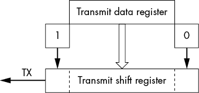
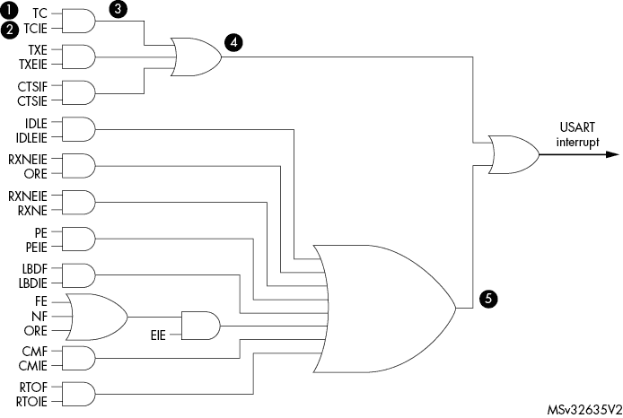
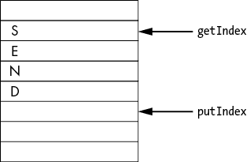

# 中断


处理 I/O 的两种主要方法是 *轮询*，即反复询问设备是否有数据准备好，和 *中断*，即设备打断正常工作流程来告诉你它已经准备好了。本章描述了轮询和中断之间的区别，并解释了中断是如何工作的，以便你能够利用它们更高效地向串口写入字符串（是的，还是“Hello World”）。

## 轮询与中断

让我们考虑一下轮询和中断在电话中的应用场景。使用轮询时，铃声被关闭，你必须每 10 秒检查一次电话是否有来电。你必须坐在电话旁，不容易感到无聊。这种方法正是我们在第九章的串行程序中使用过的，基本上是这样的对话：

1.  “你忙吗？” “忙。”

1.  “你忙吗？” “忙。”

1.  “你忙吗？” “忙。”

1.  “你忙吗？” “不忙。” “这是下一个字符。”

计算机被卡在一个轮询循环中，等待 UART 状态寄存器指示 UART 准备好接受下一个字符。此时，计算机没有其他任务要做，也不会感到无聊。轮询的主要优点是它容易理解和实现。

让我们再回到电话的例子，但这次我们使用中断方法。你不会一直坐在电话旁检查是否有电话进来。相反，你继续进行正常的事务，直到电话响起（中断发生）。然后你抛下手头的一切，飞奔到电话旁接起电话——结果发现又是一个销售电话，卖的是你一辈子都不会买的东西。

在中断场景中的关键事件顺序如下：

1.  我们继续进行正常工作。

1.  我们收到一个中断（电话响了）。

1.  我们接起电话（服务中断），大声说“不是，我不想买一把组合剃须刷和钢笔”，然后挂断电话。

1.  我们继续从上次中断的地方恢复正常工作。

## 串行 I/O 的中断

我们只有在发送数据寄存器（TDR）为空时才能向 UART 发送字符。图 10-1 显示了 UART 部分的框图，说明了 TDR 的工作原理。



图 10-1：UART 传输硬件

当我们想发送一个字符时，我们将其放入 TDR，TDR 存储 8 位。然后字符被放入 *传输移位寄存器（TSR）*，TSR 存储 10 位。额外的 2 位是字符开始时的起始位和字符结束时的停止位。然后，TSR 会将数据按位发送到 *传输串行线（TX）*。

当数据从 TDR 移动到 TSR 时，TDR 变为空，准备接收另一个字符。

我们使用的轮询循环如下所示：

```
// Block until the transmit empty (TXE) flag is set.
while ((uartHandle.Instance->ISR & UART_FLAG_TXE) == 0)
    continue;
```

用英文来说就是：“你空了吗？你空了吗？你空了吗？”在 C 代码中，它也一样令人烦躁。再次说明，轮询的主要优点是简单。

传输字符的另一种方式是告诉系统，当 UART 准备接收下一个字符时我们希望触发中断。发生某些事件时，中断函数会自动被调用。在我们的例子中，我们希望在 TDR 为空时触发中断。

使用中断时，我们告诉处理器，“我要去做有用的工作。当 TDR 为空时，我希望你中断正常流程并调用*中断例程*函数，这样我可以给你下一个字符。”

## 中断例程

当中断发生时，CPU 会调用一个位于固定地址的中断例程函数，该地址由 CPU 的设计决定。早期的 CPU 为所有中断定义了*一个*地址，因此代码必须进行多次检查来确认是哪一个中断发生了：

```
if (diskInterrupt)      { handleDiskInterrupt(); return;}
if (serialInterrupt)    { handleSerialInterrupt(); return;}
if (keyboardInterrupt)  { handleKeyboardInterrupt(); return;}
if (mouseInterrupt)     { handleMouseInterrupt(); return;}
logUnknownInterrupt();
```

如今，即便是简单的芯片也可能有许多不同的设备。检查它们所有的中断来源是一个耗时的过程。因此，芯片（包括我们的 ARM 芯片）现在使用*向量中断*，这意味着每个外设都有自己的中断地址。来自 UART1 的中断会调用一个地址的中断例程，而来自 UART2 的中断会跳转到另一个地址（特别是`USART2_IRQHandler`），其他外设也是如此。

中断向量在*startup/startup_stm32f030x8.S*文件中定义：

```
g_pfnVectors:
  .word  _estack
  .word  Reset_Handler
  .word  NMI_Handler
  .word  HardFault_Handler
# Many more handlers
  .word  USART1_IRQHandler              /* USART1 */
  .word  USART2_IRQHandler              /* USART2 */
```

后续代码定义了`USART2_IRQHandler`符号：

```
 .weak      USART2_IRQHandler
  .thumb_set USART2_IRQHandler,Default_Handler
```

第二个指令（`.thumb_set`）定义了将`USART2_IRQHandler`与`Default_Handler`相同的过程。

第一个`.weak`指令将其定义为*弱符号*。如果它是一个常规符号，并且我们尝试定义我们自己的`USART2_IRQHandler`，链接器将因`重复符号`错误消息而中止。然而，由于该符号是弱符号，链接器会丢弃弱定义并使用我们提供的符号。

*startup/startup_stm32f030x8.S*文件稍后定义了`Default_Handler`：

```
 .section .text.Default_Handler,"ax",%progbits
Default_Handler:
Infinite_Loop:
  b Infinite_Loop
```

对中断的默认响应是无限循环，使得机器几乎完全无用（我说“几乎完全无用”，因为机器仍然会响应调试器和复位）。

我们将编写我们自己的`USART2_IRQHandler`来响应 TDR 为空时，从而用更有用的内容替代默认处理程序。

## 使用中断写字符串

现在，让我们将第九章中的串行 I/O 程序改为使用中断而不是轮询来写字符串。在上层（主程序）和下层（中断例程）之间传递的唯一信息是一个全局变量：

```
const char* volatile usart2String = NULL;     // The string we are sending
```

`const`限定符告诉 C 语言该字符数据是常量，我们永远不会尝试更改它。`volatile`限定符告诉 C 语言这个变量可能会随时被正常 C 程序流之外的东西改变，比如一个中断函数。

为了澄清，因为在这一点上 C 语言的语法有点复杂，`const` 出现在 `char` 声明之前，表示字符数据是常量。它不会在指针运算符 (`*`) 之后出现，因此指针不是常量。`volatile` 修饰符出现在指针运算符之后，表示指针可能会被更改。指针运算符之后缺少 `const` 修饰符意味着程序可以更改该值。

我们需要小心处理两个层次共享的任何变量。幸运的是，在此示例中，只有一个变量 `usart2String`。以下列表显示了该变量的工作流程：

**上层 (主程序)**

1.  等待 `usart2String` 变为 `NULL`。

1.  将其指向我们要发送到输出的字符串。

1.  发送第一个字符。

1.  增加指针。

1.  启用 UART 中断。

**底层 (中断)**

1.  如果已到达字符串末尾，则将 `usart2String` 设置为 `NULL`。

1.  确认 UART 接收到中断。

1.  发送指向的字符。

1.  增加指针。

上层和下层都会增加指针。在启用中断时，我们需要非常小心，以确保两个层次不同时尝试使用指针。只有当 `usart2String == NULL` 时，上层才不会执行任何操作，而下层仅在数据耗尽并且禁用了 UART2 中断时才将 `usart2String` 设置为 `NULL`。上层通过在执行增量之后再启用中断来保护自己。因此，中断程序无法改变代码。

这种分析非常重要。如果未进行或未正确进行，则程序将失败，并且故障将在随机时间产生随机结果。这些结果构成了一个非常棘手、难以调试的问题。

实际上，我花了大约三年的时间找到其中一个漏洞。这个问题只发生在一个客户身上，每两个月才会发生一次。我们完全无法在实验室复现这个问题。幸运的是，客户非常冷静，并愿意与我们合作找到解决方案。本章后面，我们将探讨在没有进行此分析或未正确进行此分析时会发生什么，并考虑一些诊断与中断相关的 bug 的技术。

代码清单 10-1 包含基于中断驱动的串行 I/O 程序。

```
/**
  * @brief   Write Hello World to the serial I/O.
  * Use interrupts instead of polling.
*/

#include <stdbool.h>
#include "stm32f0xx_nucleo.h"
#include "stm32f0xx.h"

const char hello[] = "Hello World!\r\n";   // The message to send
int current; // The character in the message we are sending

UART_HandleTypeDef uartHandle;      // UART initialization

`... Error_Handler same as Listing 9-3 ...`

const char* volatile usart2String = NULL;       // The string we are sending
/**
 * Handle the USART2 interrupt.
 *
 * Magically called by the chip's interrupt system.
 * Name is fixed because of the startup code that
 * populates the interrupt vector.
 */
void USART2_IRQHandler(void)
{
    if ((uartHandle.Instance->ISR & USART_ISR_TXE) != 0) {
        // This should never happen, but we don't want to crash if it does.
        if (usart2String == NULL) {
            // Turn off interrupt.
            uartHandle.Instance->CR1 &= ~(USART_CR1_TXEIE);
            return;
        }
        if (*usart2String == '\0') {
            usart2String = NULL;        // We're done with the string.
            // Turn off interrupt.
            uartHandle.Instance->CR1 &= ~(USART_CR1_TXEIE);
            return;
        }
        uartHandle.Instance->TDR = *usart2String; // Send character to the UART.
        ++usart2String;              // Point to next character.
        return;
    }
    // Since the only interrupt we enabled was TXE, we should never
    // get here. When we do enable other interrupts, we need to put
    // code to handle them here.
}
/**
 * Our version of puts
 *
 * Outputs the exact string given to the output
 *
 * @param str String to send
 *
 * @note Assumes that str is not null and not
 * pointing to the empty string
 */
void myPuts(const char* str)
{
    // If someone is sending a string, wait for it.
    while (usart2String != NULL)
        continue;

    // Tell the interrupt route what string to use.
    usart2String = str;

    uartHandle.Instance->TDR = *usart2String;  // Send character to the UART.
    ++usart2String;             // Point to next character.
    // Enable the interrupt.
    uartHandle.Instance->CR1 |= USART_CR1_TXEIE;
}

`... led2_Init and uart2_Init, same as Listing 9-3 ...`

int main(void)
{
    HAL_Init(); // Initialize hardware.
    led2_Init();
    uart2_Init();
    // Tell the chip that we want the interrupt vector
    // for USART2 to be enabled.
    NVIC_EnableIRQ(USART2_IRQn);

    // Keep sending the message for a long time.
    for (;;) {
        myPuts(hello);
        HAL_Delay(500);
    }
}

`... HAL_UART_MspInit and HAL_UART_MspDeInit, same as Listing 9-3 ...`
```

*代码清单 10-1: 10.serial.int/main.c*

### 程序详细信息

代码清单 10-1 看起来很像第九章的串行 I/O 程序，因为设置 I/O 系统是相同的，只是增加了许多额外的细节。但在这种情况下，我们添加了新的东西：

```
int main(void)
{
    HAL_Init(); // Initialize hardware
    led2_Init();
    uart2_Init();
    // Tell the chip that we want the interrupt vector
    // for USART2 to be enabled.
    NVIC_EnableIRQ(USART2_IRQn);
```

`NVIC_EnableIRQ` 函数初始化了*嵌套向量中断控制器 (NVIC)*，这是一个硬件部件，决定处理器在接收中断时的操作，并启用了 USART2 中断。处理器复位时会关闭所有中断，因此我们需要告诉它我们希望 USART2 中断它。

现在让我们看看`myPuts`函数，它将一个字符串（而不是像第九章中的`myPutchar`那样的单个字符）发送到串行设备：

```
void myPuts(const char* str)
{
    // If someone is sending a string, wait for it.
  1 while (usart2String != NULL)
        continue;

    // Tell the interrupt route what string to use.
  2 usart2String = str;

  3 uartHandle.Instance->TDR = *usart2String;  // Send character to the UART.
    ++usart2String;             // Point to next character.
    // Enable the interrupt.
  4 uartHandle.Instance->CR1 |= USART_CR1_TXEIE;
}
```

我们首先要做的是等待前一个字符串传输完成 1。我们知道，如果`usart2String`不为`NULL`，中断例程正在活动，我们应该等待直到前一个字符串传输完毕。当它变为`NULL`时，中断例程不再活动，我们就可以开始传输。

当轮到我们时，我们会告诉中断函数我们正在传输哪个字符串 2，然后传输第一个字符 3。最后一步，我们启用传输数据缓冲区空中断 4。

有几个符号控制着哪些中断被使能。`USART_CR1_TXNEIE`位告诉 UART 在传输数据缓冲区为空时产生中断。这里还有一些其他需要注意的符号：

1.  `USART_CR1_IDLEIE` 空闲中断使能

1.  `USART_CR1_RXNEIE` 接收中断使能

1.  `USART_CR1_TCIE` 传输完成中断使能（在字符传输完毕时触发中断，而不是当我们第一次将字符加载到传输寄存器时）

1.  `USART_CR1_PEIE` 奇偶校验错误中断使能

一旦我们发送第一个字符，TDR 会被填充。当它被传输到 TSR 时，TDR 将变为空，我们会得到一个中断。从此之后，中断例程将完成工作。

实际的中断例程如下：

```
1 void USART2_IRQHandler(void)
{
  2 if ((uartHandle.Instance->ISR & USART_ISR_TXE) != 0) {
        // This should never happen, but we don't want to crash if it does.
      3 if (usart2String == NULL) {
 // Turn off interrupt.
            uartHandle.Instance->CR1 &= ~(USART_CR1_TXEIE);
            return;
        }
      4 if (*usart2String == '\0') {
            usart2String = NULL;        // We're done with the string.
            // Turn off interrupt.
            uartHandle.Instance->CR1 &= ~(USART_CR1_TXEIE);
            return;
        }
      5 uartHandle.Instance->TDR = *usart2String; // Send character to the UART.
      6 ++usart2String;         // Point to next character.
        return;
    }
    // Since the only interrupt we enabled was TXE, we should never
    // get here. When we do enable other interrupts, we need to put
    // code to handle them here.
}
```

函数声明使用了一个魔法名称，标识它为中断例程 1。

如果函数被调用，我们知道我们收到了来自 USART2 的中断，但我们不知道是哪种类型的中断，因为 USART 有多种中断类型：

1.  `USART_ISR_TXE` TDR 为空

1.  `USART_ISR_CTSIF` CTS 中断

1.  `USART_ISR_TC` 传输完成

1.  `USART_ISR_RXNE` 接收数据寄存器不为空（数据已准备好读取）

1.  `USART_ISR_ORE` 溢出错误检测到

1.  `USART_ISR_IDLE` 空闲线路检测到

1.  `USART_ISR_FE` 帧错误

1.  `USART_ISR_PE` 奇偶校验错误

1.  `USART_ISR_NE` 噪声标志

1.  `USART_ISR_CMF` 字符匹配

1.  `USART_ISR_TXE` 接收超时

所有这些中断将导致调用`USART2_IRQHandler`。

首先，我们需要检查是否有传输缓冲区空中断 2。我们的中断函数不应该在`usart2String`为`NULL`时被调用，但“应该”与“现实”有很大差距，所以我们加入了一些谨慎，以确保在出现问题时不会崩溃 3。此时变量`usart2String`不应该为`NULL`，但如果它是`NULL`，我们也不想引发问题。

如果没有那个检查，我们可能会尝试解引用一个`NULL`指针 4。解引用`NULL`指针是非法的，而 STM32 足够智能，具备硬件来检查这种情况。当这种情况发生时，STM32 会生成一个*内存故障中断*。换句话说，中断处理程序正在被中断，控制权转移到内存故障中断处理程序。然而，我们还没有编写处理程序，因此执行的是默认的中断处理程序。如前所述，默认处理程序会锁死系统，直到你重置它。为了保护自己免受不当的`usart2String`影响，当我们看到它时，我们采取最安全的做法，即关闭中断并什么都不做 3。

接下来，我们检查是否已经发送完字符串。如果已经发送完，我们将字符串设为`NULL`，以便向上层信号表示我们完成了任务并关闭中断。否则，我们知道 UART 还有数据，而 TDR 为空，因此我们将一个字符写入其中 5。发送完字符后，我们需要指向下一个字符，为下次中断做好准备，然后返回主程序 6。

此时，TDR 已满，UART 正在发送字符。中断路径没有更多的任务，因此它将返回，正常执行将恢复。当字符发送完毕并且 TDR 为空时，我们会收到另一个中断，直到字符串发送完毕并关闭中断。

STMicroelectronics 的硬件工程师通过一张图帮助解释了这个过程（见图 10-2）。



图 10-2：USART 中断映射

这张图显示了如果 TCIE（传输字符中断使能）位为 1，并且一个字符已经被传输（TC）2，AND 门的输出为真 3。这个结果与另外三个中断的输出结合，如果有任何一个为真（OR 门），结果 4 为真。然后，结果与另一个 OR 门的输出 5 结合，处理所有其他信号，最后的 OR 门输出即为 USART 中断信号。请注意，这张图旨在简化此过程。如果你想了解输入信号的具体含义，可以阅读这款处理器的 800 页参考手册。

### 中断地狱

中断在控制硬件以及处理实时事件时是非常强大的工具。然而，使用中断可能会导致一些独特且难以解决的问题。

首先，它们可以随时中断正常的程序流程。例如，考虑以下代码：

```
i = 5;
if (i == 5) {
```

执行此语句后，`i`的值是多少？答案显然是 5，除非中断程序刚刚执行并修改了它：

```
i = 5;
←----- interrupt triggers, i set to 6.
if (i == 5) { // No longer true
```

其次，中断例程是异步执行的，这意味着它们会在任何需要的时候执行，因此，由于编写不当的中断例程引起的错误可能很难复现。我曾经见过一种情况，错误只有在经过两周的测试后偶尔发生，因为中断必须在两条指令之一执行时恰好发生——这只是成千上万条指令中的两条。需要大量的测试才能偶然发现这个问题。

由于中断例程固有的困难，值得对它们给予高度重视。处理中断例程时最重要的设计原则是保持其简短和简单，因为例程做的越少，出错的可能性也就越小。最好将“思考”留给高层代码，在那里调试工具可以很好地工作，并且可复现性不是问题。

中断例程也需要快速执行，因为在中断例程执行时，其他中断会被暂时挂起，直到该例程执行完成。如果你在一个读取 UART1 字符的中断例程中花费了很长时间，另一个设备（如 UART2）可能会丢失数据，因为它的中断没有及时得到处理。

## 使用缓冲区提高速度

我们刚刚使用的系统有一些限制。它一次只能传输一条消息。假设我们想要输出多条短消息。每条消息必须等待前一条完成。这里是一个示例：

```
myPuts("There are ");
if (messageCount == 0)
   myPuts(" no ");              // Blocks waiting on previous message
else
   myPuts(" some ");            // Blocks waiting on previous message
myPuts("messages waiting\r\n"); // Blocks waiting on previous message
```

解决这个问题的一种方法是创建一个*缓冲区*，将字符数据保存，直到中断例程能够处理它。这样做增加了应用程序的复杂性，但它提高了你的顶层程序发送数据的速度。

使用串行 I/O 意味着要考虑速度与简单性的一般趋势。轮询版本非常简单且慢。单一字符串中断版本较快，但更复杂。我们现在使用的缓冲区系统则更快且更加复杂。这个趋势对大多数程序来说都是成立的。

为了解决这个问题，我们回到缓冲区的概念。我们将使用一个*循环缓冲区*，它具有以下基本结构：

```
struct circularBuffer {
    uint32_t putIndex;      // Where we will put the next character
    uint32_t getIndex;      // Where to get the next character
    uint32_t nCharacters;   // Number of characters in the buffer
    char data[BUFFER_SIZE]; // The data in the buffer
}
```

它被称为循环缓冲区，因为索引会回绕。换句话说，当一个字符被放入数据的最后一个元素时，`putIndex`会从 7（`BUFFER_SIZE-1`）回绕到 0。

从图形上看，这像是图 10-3。



图 10-3：循环缓冲区的工作原理

我们的实现将包含一个故意的错误，这样我们可以在一个小的、可控的程序中查看查找此类错误的技术和方法。我们将在程序中展示错误的症状、用于定位错误的诊断技术以及修复方法。

我第一次遇到这种问题是在大约 30 年前。它并不是出现在一个 200 行的演示程序中，而是在一个有着数万行代码的 BSD Unix 内核中的串行模块。它大约每三到七天随机发生一次，三个工程师花了两个月才找到了它。更糟糕的是，它依赖于处理器，并且在运行原始 BSD 的 VAX 处理器上不会发生。

顶层程序（发送方）将数据放入缓冲区。低级中断例程（接收方）从缓冲区中移除数据。

用伪代码表示，发送方的工作如下：

```
If the buffer is full, wait.
Put a character in the buffer at putIndex.
Move putIndex up one, wrapping if needed.
Increment the number of characters in the buffer.
```

接收方的工作如下：

```
Get a character from the buffer at getIndex.
Increment getIndex, wrapping as needed.
Decrement the number of characters in the buffer.
```

### 发送函数

为了使用循环缓冲区，我们必须回到一次发送一个字符，使用另一个版本的 `myPutchar`。让我们看看执行发送的代码：

```
void myPutchar(const char ch)
{
    // Wait until there is room.
  1 while (buffer.nCharacters == BUFFER_SIZE)
        continue;
  2 buffer.data[buffer.putIndex] = ch;
  3 ++buffer.putIndex;
    if (buffer.putIndex == BUFFER_SIZE)
        buffer.putIndex = 0;

    // We've added another character.
  4 ++buffer.nCharacters;
    // Now we're done.

    // Enable the interrupt (or reenable it).
  5 uartHandle.Instance->CR1 |= USART_CR1_TXEIE;
}
```

一开始，我们等待缓冲区中至少有一个字符的位置。然后我们将字符倒入缓冲区。`putIndex` 前进一个位置，并在必要时回绕到 0。缓冲区中的字符数量增加，因此我们在缓冲区结构中增加 `nCharacters` 的计数。最后，我们启用中断。如果我们正在传输，可能中断已经启用，再次启用也不会造成问题。

### 中断例程

中断例程从缓冲区读取数据并将其传输到 UART。如果缓冲区中有字符，例程将其移除并发送到 UART。如果缓冲区中没有数据，例程会关闭中断。

这是这个过程的代码：

```
void USART2_IRQHandler(void)
{
  1 if ((uartHandle.Instance->ISR & USART_ISR_TXE) != 0) {
        if (buffer.nCharacters == 0) {
            // Turn off interrupt.
            uartHandle.Instance->CR1 &= ~(USART_CR1_TXEIE);
            return;
        }
      2 // Send to UART.
        uartHandle.Instance->TDR = buffer.data[buffer.getIndex];
      3 ++buffer.getIndex;
        if (buffer.getIndex == BUFFER_SIZE)
            buffer.getIndex = 0;

      4 --buffer.nCharacters;

      5 if (buffer.nCharacters == 0)
            uartHandle.Instance->CR1 &= ~(USART_CR1_TXEIE);
        return;
    }
    // Since the only interrupt we enabled was TXE, we should
    // never get here. When we do enable other interrupts,
    // we need to put the code to handle them here.
}
```

首先，我们检查设备是否已没有数据。如果没有，我们关闭中断，直到从上层获取更多数据。然后我们发送字符，`getIndex` 上移一位，并在需要时回绕。接下来，我们让上层知道我们少了一个字符。最后，如果这是最后一个字符，我们关闭中断。

### 完整程序

清单 10-2 显示了完整的程序。

```
/**
  * @brief   Write Hello World to the serial I/O
  * using a circular buffer.
  *
  * @note Contains a race condition to demonstrate
  * how not do do this program
  */

#include <stdbool.h>
#include "stm32f0xx_nucleo.h"
#include "stm32f0xx.h"

const char hello[] = "Hello World!\r\n";   // The message to send
int current; // The character in the message we are sending

UART_HandleTypeDef uartHandle;      // UART initialization

#define BUFFER_SIZE 8   // The data buffer size

struct circularBuffer {
    uint32_t putIndex;      // Where we will put the next character
    uint32_t getIndex;      // Where to get the next character
    uint32_t nCharacters;   // Number of characters in the buffer
    char data[BUFFER_SIZE]; // The data in the buffer
};

// A simple, classic circular buffer for USART2
volatile struct circularBuffer buffer = {0,0,0, {'\0'}};

`... Error_Handler from Listing 9-3` `...`

/**
 * Handle the USART2 interrupt.
 *
 * Magically called by the chip's interrupt system.
 * Name is fixed because of the startup code that
 * populates the interrupt vector.
 */
void USART2_IRQHandler(void)
{
    if ((uartHandle.Instance->ISR & USART_ISR_TXE) != 0) {
        if (buffer.nCharacters == 0) {
            // Turn off interrupt.
            uartHandle.Instance->CR1 &= ~(USART_CR1_TXEIE);
            return;
        }
        // Send to UART.
        uartHandle.Instance->TDR = buffer.data[buffer.getIndex];
        ++buffer.getIndex;
        if (buffer.getIndex == BUFFER_SIZE)
            buffer.getIndex = 0;

        --buffer.nCharacters;

        if (buffer.nCharacters == 0)
            uartHandle.Instance->CR1 &= ~(USART_CR1_TXEIE);
        return;
    }
    // Since the only interrupt we enabled was TXE, we should never
    // get here. When we do enable other interrupts, we need to put
    // code to handle them here.
}

/**
 * Put a character in the serial buffer.
 *
 * @param ch The character to send
 */
void myPutchar(const char ch)
{
    // Wait until there is room.
    while (buffer.nCharacters == BUFFER_SIZE)
        continue;
    buffer.data[buffer.putIndex] = ch;
    ++buffer.putIndex;
    if (buffer.putIndex == BUFFER_SIZE)
        buffer.putIndex = 0;

    // We've added another character.
    ++buffer.nCharacters;
    // Now we're done.

    // Enable the interrupt (or reenable it).
    uartHandle.Instance->CR1 |= USART_CR1_TXEIE;
}

/**
 * Our version of puts
 *
 * Outputs the exact string given to the output
 *
 * @param str String to send
 *
 * @note Assumes that str is not null
 */
void myPuts(const char* str)
{
    for (/* str set */; *str != '\0'; ++str)
        myPutchar(*str);
}

`... led2_init and uart2_init same as Listing 9-3 ...`

int main(void)
{
    HAL_Init(); // Initialize hardware.
    led2_Init();
    uart2_Init();
    // Tell the chip that we want the interrupt vector
    // for USART2 to be enabled.
    NVIC_EnableIRQ(USART2_IRQn);

    // Keep sending the message for a long time.
    for (;;) {
        myPuts(hello);
        HAL_Delay(500);
    }
}

`... HAL_UART_MspInit and HAL_UART_MspDeInit same as Listing 9-3 ...`
```

*清单 10-2：10.serial.buffer.bad/src/main.c*

### 问题

当我们运行程序时，我们期望看到以下内容：

```
Hello World!
Hello World!
Hello World!
```

结果是这样的：

```
Hello World!
ello World!
Hello Wold!
Hello World!
```

此问题的发生没有固定的模式，除了我们发送到缓冲区的数据越多，发生问题的可能性就越大。

使用这个小程序，在现场复制该问题会很困难，因为它需要非常精确的时序。更有可能的是，在实现并测试了这段代码后，我们会将模块纳入另一个程序，这样时序问题的发生概率会更大。时序错误通常很难按需触发，但这段代码中确实存在一个问题。

我们知道，系统越忙，问题发生的可能性就越大。此外，我们还有另一个线索——我们一直没能在发生时抓住它，但事后我们查看了调试器，发现了以下内容：

```
nCharacters == 0
getIndex != putIndex
```

在一个正常工作的程序中，这两个条件永远不可能同时成立。解决这个问题有两种方法。第一种是对代码进行插桩，尝试找出发生了什么。第二种方法是对上下层之间共享的数据和操作这些数据的代码进行非常详细的分析。我们两者都做一下。

#### 对代码进行插桩

对代码进行*插桩*意味着插入临时的调试语句，这将有助于发现问题。对于大多数代码来说，这意味着写`printf`语句输出中间数据，供我们在程序执行过程中进行检查。有时，数据会被打印到日志文件中，供问题发生后分析。对于我们的嵌入式程序，这两种方式都不可行。我们不能使用`printf`，因为输出会发送到串口控制台，而控制台本身就包含了错误的代码。我们也不能写日志文件，因为我们没有文件系统来写入日志信息。

我们需要使用一个日志缓冲区来存储最后 100 个事件。当我们遇到问题时，可以回溯查看这些事件，以了解问题的发生经过。日志记录相关数据（`getIndex`、`putIndex`、`nCharacters`）和事件记录代码的行号。

当问题发生并且我们有机会在调试器中暂停程序时，我们可以查看日志。如果幸运的话，我们应该能够找到一些日志条目，其中在*X*行时`buffer`信息是一致的，而在*Y*行时`buffer`出现了问题，这揭示了问题发生在*X*行和*Y*行之间。

列表 10-3 展示了记录事件的代码。将此代码添加到其他定义和变量声明之后。

```
#define N_EVENTS 100                   // Store 100 events.
uint32_t nextEvent = 0;                // Where to put the next event
struct logEvent debugEvents[N_EVENTS]; // The log data

void debugEvent(const uint32_t line)
{
    debugEvents[nextEvent].line = line;
    debugEvents[nextEvent].putIndex = buffer.putIndex;
    debugEvents[nextEvent].getIndex = buffer.getIndex;
    debugEvents[nextEvent].nCharacters = buffer.nCharacters;
    ++nextEvent;
    if (nextEvent == N_NEVETS)
        nextEvent = 0;
}
```

列表 10-3：事件记录器

这个事件记录器包含了我们正在尝试找出的同样类型的错误，但目前我们假设它足够有效，可以帮助我们定位问题。

现在我们需要插入一些`debugEvent`函数调用，看看能否发现错误。由于`nCharacters`让我们抓狂，我们在每次操作`nCharacters`之前和之后都插入了`debugEvent`调用：

```
void USART2_IRQHandler(void)
*--snip--*
      debugEvent(__LINE__);
      --buffer.nCharacters;
      debugEvent(__LINE__);

void myPutchar(const char ch)
*--snip--*
      debugEvent(__LINE__);
      ++buffer.nCharacters;
      debugEvent(__LINE__);
```

我们还在`myPutchar`函数的开头增加了一致性检查，以确保`buffer`是正常的。具体来说，如果我们发现`buffer`不一致的情况（`nCharacters == 0`且`getIndex != putIndex`），我们调用`Error_Handler`函数停止程序：

```
void myPutchar(const char ch)
{
    if ((buffer.nCharacters == 0) && (buffer.getIndex != buffer.putIndex))
        Error_Handler();
```

让我们在调试器中启动程序，并在`Error_Handler`处设置断点，看看能否捕捉到错误。最终，我们触发了断点，并通过调试器检查了`debugEvents`。回顾调试器中的追踪信息，我们发现了以下内容：

+   第 119 行：`nCharacters == 3`

+   第 89 行：`nCharacters == 3`

+   第 91 行：`nCharacters == 2`

+   第 121 行：`nCharacters == 4`

为什么`nCharacters`在最后两次事件之间跳了 2？

相关的代码如下：

```
77 void USART2_IRQHandler(void)
*--snip--*
89      debugEvent(__LINE__);
90      --buffer.nCharacters;
91      debugEvent(__LINE__);
```

以及：

```
106 void myPutchar(const char ch)
*--snip--*
119     debugEvent(__LINE__);
120     ++buffer.nCharacters;
121     debugEvent(__LINE__);
```

第 90 行或第 120 行出了问题，这也告诉我们一些重要的信息。在第 119 行和第 121 行之间发生了中断。我们现在已将错误定位到几行代码和一个中断。让我们转变思路，使用代码分析得出相同的结论。我们同时探索这两种方法，因为有时候一种方法有效，另一种却无效。

#### 分析代码

另一个找出问题的方法是分析正在发生的事情，并尝试识别潜在的问题点。分析从识别上下层之间共享的数据开始——换句话说，就是缓冲区：

```
struct circularBuffer {
    uint32_t putIndex;      // Where we will put the next character
    uint32_t getIndex;      // Where to get the next character
    uint32_t nCharacters;   // Number of characters in the buffer
    char data[BUFFER_SIZE]; // The data in the buffer
};
```

`putIndex`和`getIndex`不应该导致问题，因为它们只被上下两层各自使用。`data`数组是由两层共享的，但由上层写入，下层读取，因此每层在处理该数组时有不同的职责。此外，`putIndex`控制上层使用的数组部分，而`getIndex`控制下层使用的数组部分。它们指向数组的不同元素，进入或离开`data`的内容不会影响索引或字符计数器。`data`数组不是问题所在。

剩下的只有`nCharacters`，上层递增，下层递减，因此有两个潜在的问题行。一个出现在中断例程中：

```
--buffer.nCharacters;
```

另一个问题出现在`myPutchar`中：

```
++buffer.nCharacters;
```

这些是我们的仪器化代码指出可能存在问题的同两行。

#### 细致检查代码

让我们看看执行以下代码行时究竟发生了什么：

```
++buffer.nCharacters;
```

这是这一行的汇编代码（已添加注释）：

```
120:../src/main.c ***  ++buffer.nCharacters;
404               loc 2 118 0
405 005c 094B     ldr  r3, .L22     ; Load r3 with the address in .L22,
                                    ; which happens to be "buffer".
406 005e 9B68     ldr  r3, [r3, #8] ; Get the value of  
                                    ; buffer.nCharacters.
407 0060 5A1C   1 adds r2, r3, #1   ; Add 1 to r3 and store the result in r2.
408 0062 084B     ldr  r3, .L22     ; Get the address again.
409 0064 9A60     str  r2, [r3, #8] ; Store buffer.nCharacters.
```

这段代码将`nCharacters`的值加载到寄存器`r3`，递增它，并将其存回`nCharacters`。中断可以随时发生，比如就在值被加载到`r3`中之后，这导致以下情况发生（假设`nCharacters`为 3）：

1.  在第 406 行，寄存器`r3`获得了`nCharacters`的值（`r3 == 3`）。

1.  在第 407 行指令之前发生了一个中断。

1.  中断例程读取`nCharacters`（它是 3）。

1.  它将其递减，所以`nCharacters`的值现在是 2。

1.  中断例程完成并将控制权返回到第 407 行。

1.  第 407 行的指令将 1 加到寄存器`r3`并将结果存入`r2`（`r3`的值是 3，`r2`的值是 4）。

1.  第 409 行将`r2`的值存入`nCharacters`，它应该是 3，但现在是 4。

1.  在第 407 行，程序假设`r3`具有正确的`nCharacters`值，但它没有。

寄存器`r3`没有正确的`nCharacters`值，因为在恰当的时刻发生了中断，变量被修改了。我们未能保护共享数据的一致性。上层在修改`nCharacters`时，下层也在同时修改它*。

如果中断发生在其他指令之间，这个问题不会发生。这个问题是随机的，发生得很少，因此是较难解决的问题之一。

#### 解决问题  

解决方案是防止中断例程在我们修改`nCharacters`时进行修改。为此，我们在增加之前关闭中断，之后再开启它们：  

```
119      __disable_irq();
120      ++buffer.nCharacters;
121      __enable_irq();
```

保持中断关闭的时间尽可能短。如果中断关闭时间过长，可能会错过一个中断并丢失数据。  

在中断例程中，我们减少了`nCharacters`，那么我们不需要用`__disable_irq`和`__enable_irq`来保护它吗？我们不需要，因为当发生中断时，系统会自动执行以下步骤：  

1.  它禁用该级别及以下的中断。更高级别的中断可以打断我们的中断例程，但较低级别的中断不能。  

1.  它保存了机器的状态，包括所有通用寄存器和状态寄存器。  

1.  它调用中断函数。  

当中断例程返回时，系统会执行以下步骤：  

1.  它恢复机器的状态。  

1.  它重新开启中断。  

1.  它将控制权返回给上层代码。  

在中断例程的开始和结束，需要做很多记录工作。幸运的是，ARM 处理器系列的设计者决定在硬件中完成这一切。其他处理器可能没有这么友好。  

## 概述  

中断使你能够实时响应输入和输出请求。它们也允许你以奇怪和随机的方式弄乱你的程序。务必保持中断例程和访问共享数据的代码尽可能简单和清晰。花额外的时间确保中断相关代码编写正确，后续会节省大量调试时间。  

## 编程问题  

1.  创建一个中断例程，从串行端口读取字符。  

1.  添加一个中断例程来处理按钮按下事件，并在发生时更改消息。  

1.  浏览 HAL 库，找出`__disable_irq`是如何实现的。  
